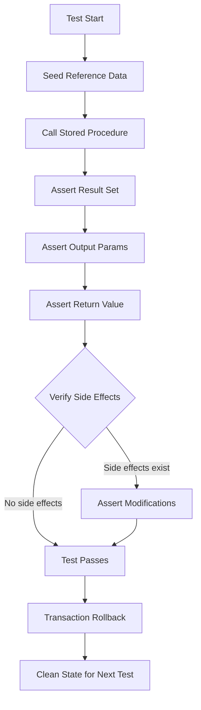

# 8.953 Testing Stored Procedures — Integration Tests

## Overview — Why Test Stored Procedures

Stored procedures are the closest layer to the data. They contain business logic, permission boundaries, and data transformation rules that are invisible to application-layer tests. A unit test that mocks `IDbConnection` never exercises the actual T-SQL, meaning the following defects go undetected:

- Syntax errors in dynamic SQL
- Schema drift (column renames, type changes)
- Permission failures under different database roles
- Incorrect output parameter handling
- Unexpected multiple result sets breaking consumer code
- Side-effect bugs (INSERT/UPDATE/DELETE that fire unintentionally)

Integration tests against a real database catch all of these. The gold standard is a local SQL Server instance running in a TestContainers Docker container, seeded with a known state before each test, and either rolled back or reset after the test completes.

This note covers the full pattern: setting up the procedure under test, calling it via Dapper and EF Core, asserting on result sets, output parameters, return values, error handling, and security contexts.

## Test Infrastructure — Database Fixture with TestContainers

Every test in this group depends on a real database. The fixture class starts a SQL Server Docker container, runs migrations or SQL scripts to create the schema, seeds reference data, and disposes the container when the test run finishes.

```csharp
public class DatabaseFixture : IAsyncLifetime
{
    private readonly MsSqlContainer _container;
    public string ConnectionString { get; private set; } = null!;

    public DatabaseFixture()
    {
        _container = new MsSqlBuilder()
            .WithImage("mcr.microsoft.com/mssql/server:2022-latest")
            .WithEnvironment("ACCEPT_EULA", "Y")
            .WithEnvironment("MSSQL_SA_PASSWORD", "Your_Str0ng_P@ssw0rd!")
            .Build();
    }

    public async Task InitializeAsync()
    {
        await _container.StartAsync();
        ConnectionString = _container.GetConnectionString();

        using var conn = new SqlConnection(ConnectionString);
        await conn.OpenAsync();
        var script = await File.ReadAllTextAsync("SetupScripts/CreateSchema.sql");
        foreach (var batch in SplitBatches(script))
            await conn.ExecuteAsync(batch);
    }

    public Task DisposeAsync() => _container.StopAsync();

    private static IEnumerable<string> SplitBatches(string script)
        => script.Split("GO", StringSplitOptions.RemoveEmptyEntries);
}
```

The test class implements `IClassFixture<DatabaseFixture>` and receives the fixture via constructor injection. Each test gets a fresh `SqlConnection` from the shared connection string and runs inside its own transaction that rolls back on completion.

```csharp
public class StoredProcedureTests : IClassFixture<DatabaseFixture>, IDisposable
{
    private readonly SqlConnection _connection;
    private readonly SqlTransaction _transaction;
    private readonly DatabaseFixture _fixture;

    public StoredProcedureTests(DatabaseFixture fixture)
    {
        _fixture = fixture;
        _connection = new SqlConnection(fixture.ConnectionString);
        _connection.Open();
        _transaction = _connection.BeginTransaction();
    }

    public void Dispose()
    {
        _transaction.Rollback();
        _connection.Dispose();
    }
}
```

## Stored Procedure Under Test — usp_GetCustomerOrders

The procedure we will test throughout this note:

```sql
CREATE PROCEDURE usp_GetCustomerOrders
    @CustomerId INT,
    @TotalOrders INT OUTPUT
AS
BEGIN
    SET NOCOUNT ON;

    SELECT @TotalOrders = COUNT(*)
    FROM dbo.Orders
    WHERE CustomerId = @CustomerId;

    SELECT
        o.OrderId,
        o.OrderDate,
        o.TotalAmount,
        o.Status
    FROM dbo.Orders o
    WHERE o.CustomerId = @CustomerId
    ORDER BY o.OrderDate DESC;

    RETURN @@ROWCOUNT;
END;
```

This procedure:
- Accepts `@CustomerId` as input
- Returns `@TotalOrders` as an output parameter
- Returns a result set of matching orders
- Returns `@@ROWCOUNT` as the return value (number of rows in the result set)

## Seed Data — Arrange Phase

Before testing the procedure, we seed the database with known data:

```sql
INSERT INTO dbo.Customers (CustomerId, Name, Email)
VALUES (1, 'Alice', 'alice@example.com'),
       (2, 'Bob', 'bob@example.com');

INSERT INTO dbo.Orders (OrderId, CustomerId, OrderDate, TotalAmount, Status)
VALUES (101, 1, '2026-01-15', 150.00, 'Shipped'),
       (102, 1, '2026-03-20', 200.00, 'Pending'),
       (103, 2, '2026-05-10', 75.50, 'Delivered');
```

Each test seeds its own data inside the transaction, so no test interferes with another.

## Dapper — Calling Stored Procedures in Tests

Dapper makes calling stored procedures straightforward. The key is specifying `CommandType.StoredProcedure`.

### Basic Call — Query with Input Parameter

```csharp
[Fact]
public async Task GetCustomerOrders_ExistingCustomer_ReturnsOrders()
{
    // Arrange
    await SeedCustomerAndOrders();

    // Act
    var orders = (await _connection.QueryAsync<Order>(
        "usp_GetCustomerOrders",
        new { CustomerId = 1 },
        commandType: CommandType.StoredProcedure,
        transaction: _transaction))
        .AsList();

    // Assert
    Assert.NotEmpty(orders);
    Assert.Equal(2, orders.Count);
    Assert.All(orders, o => Assert.Equal(1, o.CustomerId));
}
```

### Call with Output Parameters

Output parameters require the `DynamicParameters` class:

```csharp
[Fact]
public async Task GetCustomerOrders_OutputParameter_ReturnsCorrectCount()
{
    // Arrange
    await SeedCustomerAndOrders();
    var parameters = new DynamicParameters();
    parameters.Add("@CustomerId", 1);
    parameters.Add("@TotalOrders", dbType: DbType.Int32, direction: ParameterDirection.Output);
    parameters.Add("@ReturnValue", dbType: DbType.Int32, direction: ParameterDirection.ReturnValue);

    // Act
    var orders = (await _connection.QueryAsync<Order>(
        "usp_GetCustomerOrders",
        parameters,
        commandType: CommandType.StoredProcedure,
        transaction: _transaction))
        .AsList();

    var totalOrders = parameters.Get<int>("@TotalOrders");
    var returnValue = parameters.Get<int>("@ReturnValue");

    // Assert
    Assert.Equal(2, totalOrders);
    Assert.Equal(2, returnValue);
    Assert.Equal(2, orders.Count);
}
```

### Non-Existent Customer — Empty Result Set

```csharp
[Fact]
public async Task GetCustomerOrders_NonExistentCustomer_ReturnsEmpty()
{
    // Arrange
    await SeedCustomerAndOrders();
    var parameters = new DynamicParameters();
    parameters.Add("@CustomerId", 999);
    parameters.Add("@TotalOrders", dbType: DbType.Int32, direction: ParameterDirection.Output);

    // Act
    var orders = (await _connection.QueryAsync<Order>(
        "usp_GetCustomerOrders",
        parameters,
        commandType: CommandType.StoredProcedure,
        transaction: _transaction))
        .AsList();

    var totalOrders = parameters.Get<int>("@TotalOrders");

    // Assert
    Assert.Empty(orders);
    Assert.Equal(0, totalOrders);
}
```

### NULL Input Handling

```csharp
[Fact]
public async Task GetCustomerOrders_NullCustomerId_ThrowsOrReturnsEmpty()
{
    // Arrange
    var parameters = new DynamicParameters();
    parameters.Add("@CustomerId", null, dbType: DbType.Int32);

    // Act & Assert
    var ex = await Assert.ThrowsAsync<SqlException>(() =>
        _connection.QueryAsync<Order>(
            "usp_GetCustomerOrders",
            parameters,
            commandType: CommandType.StoredProcedure,
            transaction: _transaction).AsTask());

    // Procedure might handle NULL differently; assert the specific behavior
    Assert.Contains("Cannot insert the value NULL", ex.Message, StringComparison.OrdinalIgnoreCase);
}
```

### Dapper — Multiple Result Sets

For procedures returning multiple result sets, use `QueryMultiple`:

```csharp
[Fact]
public async Task GetCustomerOrders_MultipleResultSets_ReadsAllGrids()
{
    // Assume a sproc: usp_GetCustomerSummary returning Customer + Orders grids
    var multi = await _connection.QueryMultipleAsync(
        "usp_GetCustomerSummary",
        new { CustomerId = 1 },
        commandType: CommandType.StoredProcedure,
        transaction: _transaction);

    var customer = await multi.ReadSingleAsync<Customer>();
    var orders = (await multi.ReadAsync<Order>()).AsList();

    Assert.NotNull(customer);
    Assert.NotEmpty(orders);
}
```

## EF Core — Calling Stored Procedures in Tests

EF Core supports stored procedure calls through `FromSqlRaw` and `FromSqlInterpolated`, but only for queries that return entity types. Output parameters require Dapper or raw ADO.NET within the same test.

### Basic Call — FromSqlRaw

```csharp
[Fact]
public async Task GetCustomerOrders_EfCore_ReturnsOrders()
{
    // Arrange
    await SeedCustomerAndOrders();

    // Act
    var orders = await _context.Orders
        .FromSqlRaw("EXEC usp_GetCustomerOrders @CustomerId = {0}", 1)
        .IgnoreQueryFilters()
        .ToListAsync();

    // Assert
    Assert.NotEmpty(orders);
    Assert.Equal(2, orders.Count);
}
```

### FromSqlInterpolated — Safer Parameterization

```csharp
[Fact]
public async Task GetCustomerOrders_EfCore_Interpolated()
{
    await SeedCustomerAndOrders();

    var customerId = 1;
    var orders = await _context.Orders
        .FromSqlInterpolated($"EXEC usp_GetCustomerOrders @CustomerId = {customerId}")
        .IgnoreQueryFilters()
        .ToListAsync();

    Assert.NotEmpty(orders);
}
```

### EF Core Limitation — Output Parameters

EF Core's `FromSqlRaw`/`FromSqlInterpolated` do not support output parameters directly. You must fall back to ADO.NET:

```csharp
[Fact]
public async Task GetCustomerOrders_EfCore_WithOutputParameter()
{
    await SeedCustomerAndOrders();

    var connection = _context.Database.GetDbConnection();
    await connection.OpenAsync();
    using var command = connection.CreateCommand();
    command.CommandText = "usp_GetCustomerOrders";
    command.CommandType = CommandType.StoredProcedure;
    command.Transaction = _context.Database.CurrentTransaction?.GetDbTransaction();

    command.Parameters.Add(new SqlParameter("@CustomerId", 1));
    var outputParam = new SqlParameter("@TotalOrders", SqlDbType.Int) { Direction = ParameterDirection.Output };
    command.Parameters.Add(outputParam);
    var returnParam = new SqlParameter("@ReturnValue", SqlDbType.Int) { Direction = ParameterDirection.ReturnValue };
    command.Parameters.Add(returnParam);

    using var reader = await command.ExecuteReaderAsync();
    var orders = new List<Order>();
    while (await reader.ReadAsync())
    {
        orders.Add(new Order
        {
            OrderId = reader.GetInt32(0),
            OrderDate = reader.GetDateTime(1),
            TotalAmount = reader.GetDecimal(2),
            Status = reader.GetString(3)
        });
    }

    await reader.CloseAsync();

    Assert.Equal(2, orders.Count);
    Assert.Equal(2, (int)outputParam.Value);
    Assert.Equal(2, (int)returnParam.Value);
}
```

### EF Core — Multiple Result Sets with HgmisReader (Third-Party)

EF Core 5+ does not natively support multiple result sets from stored procedures. Use the `Microsoft.EntityFrameworkCore.SqlServer` package with `AsSplitQuery` or drop to ADO.NET with `SqlDataReader.NextResultAsync`:

```csharp
[Fact]
public async Task GetCustomerSummary_MultipleResultSets_WithReader()
{
    await SeedCustomerAndOrders();

    var connection = _context.Database.GetDbConnection();
    await connection.OpenAsync();
    using var command = connection.CreateCommand();
    command.CommandText = "usp_GetCustomerSummary";
    command.CommandType = CommandType.StoredProcedure;
    command.Parameters.Add(new SqlParameter("@CustomerId", 1));

    using var reader = await command.ExecuteReaderAsync();

    // First result set: Customer
    Assert.True(await reader.ReadAsync());
    var customer = new Customer
    {
        CustomerId = reader.GetInt32(0),
        Name = reader.GetString(1)
    };

    // Second result set: Orders
    await reader.NextResultAsync();
    var orders = new List<Order>();
    while (await reader.ReadAsync())
    {
        orders.Add(new Order
        {
            OrderId = reader.GetInt32(0),
            TotalAmount = reader.GetDecimal(3)
        });
    }

    Assert.NotNull(customer);
    Assert.NotEmpty(orders);
}
```

## Error Handling — Testing Invalid Input

Stored procedures often throw `SqlException` with specific error numbers. Tests should verify the correct exception is thrown and the expected error code is returned.

### Testing for Specific SqlException Error Number

```csharp
[Fact]
public async Task GetCustomerOrders_NegativeCustomerId_ThrowsExpectedError()
{
    // Arrange
    await SeedCustomerAndOrders();

    // Act
    var ex = await Assert.ThrowsAsync<SqlException>(() =>
        _connection.QueryAsync<Order>(
            "usp_GetCustomerOrders",
            new { CustomerId = -1 },
            commandType: CommandType.StoredProcedure,
            transaction: _transaction).AsTask());

    // Assert: Error 547 = Foreign Key violation, 50000 = custom RAISERROR
    Assert.Equal(50000, ex.Number);
}
```

### Testing RAISERROR / THROW from Sproc

If the procedure uses `THROW 50001, 'Customer not found', 1;`, test for that:

```csharp
[Fact]
public async Task GetCustomerOrders_InvalidCustomer_ThrowsCustomError()
{
    var ex = await Assert.ThrowsAsync<SqlException>(() =>
        _connection.QueryAsync<Order>(
            "usp_GetCustomerOrders",
            new { CustomerId = -5 },
            commandType: CommandType.StoredProcedure,
            transaction: _transaction).AsTask());

    Assert.Equal(50001, ex.Number);
    Assert.Contains("Customer not found", ex.Message);
}
```

### Testing Transaction Rollback in Sproc

Some procedures roll back on error, leaving no side effects:

```csharp
[Fact]
public async Task GetCustomerOrders_ErrorRollback_NoSideEffects()
{
    // Act
    await Assert.ThrowsAsync<SqlException>(() =>
        _connection.QueryAsync<Order>(
            "usp_GetCustomerOrders_WithRollbackOnError",
            new { CustomerId = -1 },
            commandType: CommandType.StoredProcedure,
            transaction: _transaction).AsTask());

    // Assert: verify no data was committed despite the sproc's partial work
    var count = await _connection.ExecuteScalarAsync<int>(
        "SELECT COUNT(*) FROM dbo.Orders",
        transaction: _transaction);
    Assert.Equal(0, count);
}
```

## Security — Testing Stored Procedure Permissions

Stored procedures are a common permission boundary. The pattern is: grant `EXECUTE` on the procedure, deny direct table access, and verify the caller can only interact through the sproc.

### Creating a Low-Privilege User for Testing

```csharp
[Fact]
public async Task GetCustomerOrders_LimitedUser_CanExecuteSprocButNotDirectQuery()
{
    // Arrange: create a user with only EXECUTE on the sproc
    await _connection.ExecuteAsync(@"
        CREATE USER TestUser WITHOUT LOGIN;
        GRANT EXECUTE ON usp_GetCustomerOrders TO TestUser;
    ", transaction: _transaction);

    // Act: connect as the limited user
    using var limitedConnection = new SqlConnection(_fixture.ConnectionString);
    await limitedConnection.OpenAsync();
    // Impersonate the limited user
    await limitedConnection.ExecuteAsync("EXECUTE AS USER = 'TestUser';", transaction: _transaction);

    // The sproc call should succeed
    var orders = (await limitedConnection.QueryAsync<Order>(
        "usp_GetCustomerOrders",
        new { CustomerId = 1 },
        commandType: CommandType.StoredProcedure,
        transaction: _transaction)).AsList();

    Assert.NotEmpty(orders);

    // Direct table access should fail
    var ex = await Assert.ThrowsAsync<SqlException>(() =>
        limitedConnection.ExecuteScalarAsync<int>(
            "SELECT COUNT(*) FROM dbo.Orders",
            transaction: _transaction));
    Assert.Equal(229, ex.Number); // 229 = The EXECUTE permission was denied
}
```

### Testing EXECUTE AS Context Switching

```csharp
[Fact]
public async Task GetCustomerOrders_ExecuteAsCaller_RespectsOwnershipChaining()
{
    // If the sproc uses EXECUTE AS OWNER or EXECUTE AS CALLER,
    // verify that permission behavior matches the intended context.
    await _connection.ExecuteAsync(@"
        CREATE USER AppUser WITHOUT LOGIN;
        GRANT EXECUTE ON usp_GetCustomerOrders TO AppUser;
        DENY SELECT ON dbo.Orders TO AppUser;
    ", transaction: _transaction);

    using var appConnection = new SqlConnection(_fixture.ConnectionString);
    await appConnection.OpenAsync();
    await appConnection.ExecuteAsync("EXECUTE AS USER = 'AppUser';", transaction: _transaction);

    // If sproc is EXECUTE AS OWNER, this should succeed (owner can bypass DENY)
    // If sproc is EXECUTE AS CALLER, this should fail (AppUser has DENY on Orders)
    var orders = (await appConnection.QueryAsync<Order>(
        "usp_GetCustomerOrders",
        new { CustomerId = 1 },
        commandType: CommandType.StoredProcedure,
        transaction: _transaction)).AsList();

    // Adjust assertion based on the EXECUTE AS clause:
    Assert.NotEmpty(orders); // succeeds under ownership chaining
}
```

## Testing Side Effects — INSERT/UPDATE/DELETE in Sprocs

Many stored procedures modify data. Tests must verify the side effects are correct and isolated.

### Testing INSERT Side Effect

```csharp
[Fact]
public async Task CreateOrder_InsertsRecordAndReturnsNewId()
{
    // Arrange
    await SeedCustomerAndOrders();
    var parameters = new DynamicParameters();
    parameters.Add("@CustomerId", 1);
    parameters.Add("@OrderDate", new DateTime(2026, 6, 27));
    parameters.Add("@TotalAmount", 300.00m);
    parameters.Add("@NewOrderId", dbType: DbType.Int32, direction: ParameterDirection.Output);

    // Act
    await _connection.ExecuteAsync(
        "usp_CreateOrder",
        parameters,
        commandType: CommandType.StoredProcedure,
        transaction: _transaction);

    var newOrderId = parameters.Get<int>("@NewOrderId");

    // Assert
    Assert.True(newOrderId > 0);

    var inserted = await _connection.QuerySingleAsync<Order>(
        "SELECT * FROM dbo.Orders WHERE OrderId = @Id",
        new { Id = newOrderId },
        transaction: _transaction);
    Assert.Equal(1, inserted.CustomerId);
    Assert.Equal(300.00m, inserted.TotalAmount);
}
```

### Testing UPDATE Side Effect

```csharp
[Fact]
public async Task UpdateOrderStatus_ModifiesOnlyTargetRow()
{
    // Arrange
    await SeedCustomerAndOrders();

    // Act
    await _connection.ExecuteAsync(
        "usp_UpdateOrderStatus",
        new { OrderId = 101, NewStatus = "Cancelled" },
        commandType: CommandType.StoredProcedure,
        transaction: _transaction);

    // Assert
    var updated = await _connection.QuerySingleAsync<Order>(
        "SELECT * FROM dbo.Orders WHERE OrderId = 101",
        transaction: _transaction);
    Assert.Equal("Cancelled", updated.Status);

    var unchanged = await _connection.QuerySingleAsync<Order>(
        "SELECT * FROM dbo.Orders WHERE OrderId = 102",
        transaction: _transaction);
    Assert.Equal("Pending", unchanged.Status);
}
```

## Testing Dynamic SQL in Stored Procedures

Stored procedures that build and execute dynamic SQL are especially prone to bugs. Integration tests catch syntax errors, injection vulnerabilities, and schema mismatches.

```csharp
[Fact]
public async Task DynamicSearchSproc_ValidColumnName_ReturnsResults()
{
    // Arrange
    await SeedCustomerAndOrders();

    // Act: sproc builds "SELECT * FROM Orders WHERE " + @ColumnName + " = @Value"
    var orders = (await _connection.QueryAsync<Order>(
        "usp_SearchOrders",
        new { ColumnName = "Status", Value = "Shipped" },
        commandType: CommandType.StoredProcedure,
        transaction: _transaction)).AsList();

    Assert.Single(orders);
}

[Fact]
public async Task DynamicSearchSproc_InvalidColumnName_Throws()
{
    await SeedCustomerAndOrders();

    var ex = await Assert.ThrowsAsync<SqlException>(() =>
        _connection.QueryAsync<Order>(
            "usp_SearchOrders",
            new { ColumnName = "NonExistentColumn", Value = "test" },
            commandType: CommandType.StoredProcedure,
            transaction: _transaction).AsTask());

    Assert.Contains("Invalid column name", ex.Message);
}

[Fact]
public async Task DynamicSearchSproc_SqlInjectionAttempt_Blocked()
{
    await SeedCustomerAndOrders();

    var ex = await Assert.ThrowsAsync<SqlException>(() =>
        _connection.QueryAsync<Order>(
            "usp_SearchOrders",
            new { ColumnName = "Status; DROP TABLE Orders; --", Value = "test" },
            commandType: CommandType.StoredProcedure,
            transaction: _transaction).AsTask());

    // Should fail, not drop the table
    var tableStillExists = await _connection.ExecuteScalarAsync<int>(
        "SELECT COUNT(*) FROM dbo.Orders",
        transaction: _transaction);
    Assert.Equal(3, tableStillExists);
}
```

## Testing Temporal and Snapshot Procedures

Some procedures operate on temporal tables or rely on snapshot isolation. Tests must account for time boundaries.

```csharp
[Fact]
public async Task GetOrdersAsOfDate_ReturnsCorrectSnapshot()
{
    // Arrange
    await SeedCustomerAndOrders();
    var pastDate = new DateTime(2026, 2, 1);

    // Act: sproc uses FOR SYSTEM_TIME AS OF @AsOfDate
    var orders = (await _connection.QueryAsync<Order>(
        "usp_GetOrdersAsOf",
        new { AsOfDate = pastDate },
        commandType: CommandType.StoredProcedure,
        transaction: _transaction)).AsList();

    // Assert: only orders created before Feb 1 should appear
    Assert.Single(orders);
    Assert.All(orders, o => Assert.True(o.OrderDate <= pastDate));
}
```

## Mermaid — Test Flow Diagram



## Gotchas — Common Pitfalls

### Side Effects Require Transaction Isolation

Stored procedures that INSERT, UPDATE, or DELETE leave traces in the database. If tests share a fixture without transaction rollback, data leaks between tests. Always wrap each test in a transaction that rolls back in `Dispose`.

### Permission Testing Requires Separate Login Context

Testing sproc permissions by running `EXECUTE AS USER` requires the caller to have IMPERSONATE permission. In CI, use a dedicated low-privilege connection string or create a contained user in the test database.

### Multiple Result Sets with EF Core

EF Core's `FromSqlRaw` only reads the first result set. To consume multiple result sets, you must drop to ADO.NET (`SqlCommand.ExecuteReaderAsync` + `NextResultAsync`) or use a third-party library like `EntityFrameworkCore.SqlServer.HierarchyId` or raw `DbDataReader`.

### Output Parameters Are Not Returned by Dapper's QueryAsync

Dapper's `QueryAsync<T>` maps result set rows only. Output and return-value parameters must be retrieved separately via `DynamicParameters.Get<T>()` after the query completes.

### SET NOCOUNT ON Changes Behavior

Procedures with `SET NOCOUNT ON` suppress the `@@ROWCOUNT` message. This is fine for most Dapper queries but can confuse code that depends on `RecordsAffected`. If the procedure does not include `SET NOCOUNT ON`, Dapper may return an additional result set.

### NULL Handling Differs Between Dapper and EF Core

Dapper passes NULL explicitly via `DynamicParameters` with `dbType: DbType.Int32`. EF Core's `FromSqlInterpolated` passes NULL as `DBNull.Value` by default. Ensure the procedure handles `@Parameter IS NULL` checks correctly for both.

### Return Value vs Output Parameter

A stored procedure's `RETURN` statement provides an integer return value (accessed via `ParameterDirection.ReturnValue`). Output parameters (declared with `OUTPUT` in the procedure signature) are different. Dapper and ADO.NET treat them as separate parameter directions.

### Schema Changes Break Tests Unexpectedly

When a column is renamed or a table schema changes, integration tests fail with `SqlException` errors like "Invalid column name". This is desirable — it catches schema drift before deployment. Run integration tests as part of CI after every migration.

### Dynamic SQL and QUOTENAME

Procedures that concatenate user input into SQL must use `QUOTENAME()` or `sp_executesql` with parameters. Tests should deliberately attempt SQL injection to verify the procedure is safe.

### Stored Procedure Recompilation

If the procedure is not cached or the test forces recompilation (`OPTION (RECOMPILE)`), execution time increases. This is usually fine for small test data but can cause test timeouts for large schemas.

### Database Collation Mismatch

If the application code assumes a specific collation but the test container uses a different one (e.g., `SQL_Latin1_General_CP1_CI_AS` vs `Latin1_General_100_BIN2`), string comparison and sorting may differ. Match the production collation in the TestContainers image setup.

## Practice Checklist

- [ ] Seed known data before each test
- [ ] Call sproc via Dapper with `CommandType.StoredProcedure`
- [ ] Call sproc via EF Core with `FromSqlRaw` / `FromSqlInterpolated`
- [ ] Assert result set count and column values
- [ ] Assert output parameter values via `DynamicParameters`
- [ ] Assert return value via `ParameterDirection.ReturnValue`
- [ ] Test non-existent customer returns empty set
- [ ] Test NULL input handling
- [ ] Test invalid input throws specific `SqlException` number
- [ ] Test RAISERROR / THROW from sproc
- [ ] Test transaction rollback within sproc
- [ ] Test permissions: create low-privilege user, assert EXECUTE works and direct SELECT fails
- [ ] Test EXECUTE AS context switching
- [ ] Test side effects (INSERT, UPDATE, DELETE) via separate queries
- [ ] Test multiple result sets with `QueryMultiple` (Dapper) or `NextResultAsync` (ADO.NET)
- [ ] Test dynamic SQL sprocs with valid and invalid column names
- [ ] Test temporal sprocs with `FOR SYSTEM_TIME AS OF`
- [ ] Verify rollback leaves no trace after test completes
- [ ] Run tests in CI with TestContainers
- [ ] Document expected error numbers for sproc-specific exceptions

## Related Notes

- [[8.860 — Dapper — Stored Procedure Calling]]
- [[8.902 — Stored Procedure Mapping in EF Core]]
- [[8.943 — Integration Testing — Real Database]]
- [[8.944 — TestContainers — SQL Server in Docker]]
- [[8.950 — Database Fixtures — xUnit IClassFixture]]
- [[8.954 — Testing Transactions — Rollback After Test]]
- [[8.946 — Respawn — Database Reset Between Tests]]
