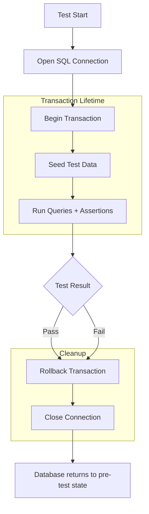

# 8.954 Testing Transactions — Rollback After Test

## Overview — Why Rollback After Test

Database integration tests modify data — INSERT, UPDATE, DELETE. If those changes persist, they corrupt subsequent tests, producing false positives or false negatives. The classic solution is to reset the database between tests, but that is slow (Respawn, schema rebuild) or expensive (per-test container).

Transaction rollback solves this elegantly: begin a database transaction at test start, never commit it, and roll it back in the cleanup phase. Every mutation the test performs is undone atomically. The database returns to exactly the same state as before the test, regardless of what the test did.

This approach is:

- **Fast**: Rollback is a single round-trip. No schema drop/create, no truncate-all-tables.
- **Isolated**: Each test gets a private view of the data. No test leaks state to another.
- **Simple**: No external tools. Just `BeginTransaction` + `Rollback` in `Dispose`.
- **Zero side effects**: Even tests that crash midway leave no trace because `Dispose` runs (or the connection close triggers implicit rollback).

The trade-off is that the transaction scope must cover every database operation in the test. Read-only tests (SELECT only) don't need a transaction, but if a later developer adds a write, the transaction protects them.

## Transaction Basics — ADO.NET IDbTransaction

At the ADO.NET level, a transaction is an `IDbTransaction` created from an open `IDbConnection`. All commands executed during the transaction must opt in by setting their `Transaction` property.

```csharp
using var connection = new SqlConnection(connectionString);
connection.Open();
using var transaction = connection.BeginTransaction();

try
{
    // All commands must use the transaction
    using var command = connection.CreateCommand();
    command.Transaction = transaction;
    command.CommandText = "INSERT INTO Orders VALUES (@Id, @Amount)";
    command.Parameters.AddWithValue("@Id", 1);
    command.Parameters.AddWithValue("@Amount", 100m);
    await command.ExecuteNonQueryAsync();

    // If we never call transaction.Commit(), the insert is rolled back
    // when the transaction is disposed.
}
finally
{
    // Rollback happens here if we don't call Commit()
    transaction.Rollback();
}
```

In a test context, we never call `Commit()`. The rollback happens explicitly in the cleanup phase or implicitly when the `SqlTransaction` is disposed without being committed.

## EF Core — BeginTransaction with Rollback

EF Core's `DbContext` exposes `Database.BeginTransaction()` which returns an `IDbContextTransaction`. The test wraps all EF Core operations inside this transaction and rolls back on cleanup.

### Basic Pattern — Explicit Transaction per Test

```csharp
public class CustomerRepositoryTests : IClassFixture<DatabaseFixture>, IDisposable
{
    private readonly TestDbContext _context;
    private readonly IDbContextTransaction _transaction;

    public CustomerRepositoryTests(DatabaseFixture fixture)
    {
        var options = new DbContextOptionsBuilder<TestDbContext>()
            .UseSqlServer(fixture.ConnectionString)
            .Options;
        _context = new TestDbContext(options);
        _context.Database.EnsureCreated();
        _transaction = _context.Database.BeginTransaction();
    }

    public void Dispose()
    {
        _transaction.Rollback();
        _transaction.Dispose();
        _context.Dispose();
    }

    [Fact]
    public async Task AddCustomer_TransactionRollsBack()
    {
        // Arrange
        var customer = new Customer { Name = "Test", Email = "test@example.com" };

        // Act
        _context.Customers.Add(customer);
        await _context.SaveChangesAsync();

        // Assert — data is visible inside the transaction
        var count = await _context.Customers.CountAsync();
        Assert.Equal(1, count);
    }
    // After Dispose runs, the INSERT is rolled back.
}
```

### Verification — Outside Transaction Sees No Change

To prove the rollback works, open a second connection outside the transaction:

```csharp
[Fact]
public async Task AddCustomer_DataNotVisibleOutsideTransaction()
{
    // Arrange
    var customer = new Customer { Name = "Alice", Email = "alice@example.com" };
    _context.Customers.Add(customer);
    await _context.SaveChangesAsync();

    // Act — query with a separate connection (not enrolled in the transaction)
    using var outsideConnection = new SqlConnection(_fixture.ConnectionString);
    await outsideConnection.OpenAsync();
    var count = await outsideConnection.ExecuteScalarAsync<int>(
        "SELECT COUNT(*) FROM Customers");

    // Assert — the insert is uncommitted, so outside connection sees nothing
    Assert.Equal(0, count);
}
```

### Transaction with Multiple SaveChangesAsync

EF Core tracks changes and flushes them to the database each time `SaveChangesAsync` is called. All flushes are still within the same database transaction, so they all roll back together.

```csharp
[Fact]
public async Task MultiStepOperation_AllRollsBack()
{
    // Arrange
    var customer = new Customer { Name = "Bob", Email = "bob@example.com" };
    _context.Customers.Add(customer);
    await _context.SaveChangesAsync();

    var order = new Order { CustomerId = customer.Id, TotalAmount = 50m };
    _context.Orders.Add(order);
    await _context.SaveChangesAsync();

    // Act — verify both were written
    Assert.Equal(1, await _context.Customers.CountAsync());
    Assert.Equal(1, await _context.Orders.CountAsync());

    // Dispose rolls back both inserts atomically
}
```

### Handling DbContext in Dispose Pattern

If a test fails with an exception, the `DbContext` may be in an invalid state. Always roll back before disposing the context to avoid `ObjectDisposedException` on the underlying connection.

```csharp
public void Dispose()
{
    try
    {
        _transaction?.Rollback();
    }
    catch (ObjectDisposedException)
    {
        // Connection already closed; ignore
    }
    finally
    {
        _transaction?.Dispose();
        _context?.Dispose();
    }
}
```

### Shared Transaction Across Multiple DbContext Instances

If the test needs multiple `DbContext` instances to participate in the same transaction, use `SqlConnection` sharing:

```csharp
[Fact]
public async Task TwoContexts_SameTransaction()
{
    // Arrange: share the underlying connection
    var connection = new SqlConnection(_fixture.ConnectionString);
    await connection.OpenAsync();
    var transaction = connection.BeginTransaction();

    var options1 = new DbContextOptionsBuilder<TestDbContext>()
        .UseSqlServer(connection)
        .Options;
    var options2 = new DbContextOptionsBuilder<TestDbContext>()
        .UseSqlServer(connection)
        .Options;

    using (var ctx1 = new TestDbContext(options1))
    using (var ctx2 = new TestDbContext(options2))
    {
        ctx1.Database.UseTransaction(transaction);
        ctx2.Database.UseTransaction(transaction);

        ctx1.Customers.Add(new Customer { Name = "Shared" });
        await ctx1.SaveChangesAsync();

        var count = await ctx2.Customers.CountAsync();
        Assert.Equal(1, count);
    }

    transaction.Rollback();
    connection.Dispose();
}
```

## Dapper — IDbTransaction with Rollback

Dapper's extension methods accept an optional `IDbTransaction` parameter. When provided, the query or command executes within that transaction.

### Basic Pattern — Explicit Transaction

```csharp
public class OrderRepositoryTests : IClassFixture<DatabaseFixture>, IDisposable
{
    private readonly SqlConnection _connection;
    private readonly SqlTransaction _transaction;

    public OrderRepositoryTests(DatabaseFixture fixture)
    {
        _connection = new SqlConnection(fixture.ConnectionString);
        _connection.Open();
        _transaction = _connection.BeginTransaction();
    }

    public void Dispose()
    {
        _transaction.Rollback();
        _transaction.Dispose();
        _connection.Dispose();
    }

    [Fact]
    public async Task InsertOrder_TransactionRollsBack()
    {
        // Arrange
        var order = new Order { OrderId = 1, TotalAmount = 100m };

        // Act
        await _connection.ExecuteAsync(
            "INSERT INTO Orders (OrderId, TotalAmount) VALUES (@OrderId, @TotalAmount)",
            order,
            transaction: _transaction);

        // Assert — visible within transaction
        var count = await _connection.ExecuteScalarAsync<int>(
            "SELECT COUNT(*) FROM Orders",
            transaction: _transaction);
        Assert.Equal(1, count);
    }
}
```

### Multiple Commands in Same Transaction

All Dapper commands must pass the same `_transaction` instance:

```csharp
[Fact]
public async Task InsertCustomerAndOrder_Atomically()
{
    // Arrange
    await _connection.ExecuteAsync(
        "INSERT INTO Customers (CustomerId, Name) VALUES (1, 'Alice')",
        transaction: _transaction);
    await _connection.ExecuteAsync(
        "INSERT INTO Orders (OrderId, CustomerId, TotalAmount) VALUES (100, 1, 250.00)",
        transaction: _transaction);

    // Act
    var orderCount = await _connection.ExecuteScalarAsync<int>(
        "SELECT COUNT(*) FROM Orders WHERE CustomerId = 1",
        transaction: _transaction);

    // Assert
    Assert.Equal(1, orderCount);
    // Dispose rolls back both inserts
}
```

### QueryMultiple Within a Transaction

`QueryMultiple` also accepts the transaction parameter:

```csharp
[Fact]
public async Task QueryMultiple_UsesTransaction()
{
    // Arrange seed
    await _connection.ExecuteAsync(
        "INSERT INTO Customers (CustomerId, Name) VALUES (1, 'Alice')",
        transaction: _transaction);
    await _connection.ExecuteAsync(
        "INSERT INTO Orders (OrderId, CustomerId, TotalAmount) VALUES (10, 1, 50.00)",
        transaction: _transaction);

    // Act
    using var multi = await _connection.QueryMultipleAsync(
        "SELECT * FROM Customers WHERE CustomerId = 1; SELECT * FROM Orders WHERE CustomerId = 1",
        transaction: _transaction);

    var customer = await multi.ReadSingleAsync<Customer>();
    var orders = (await multi.ReadAsync<Order>()).AsList();

    // Assert
    Assert.NotNull(customer);
    Assert.NotEmpty(orders);
}
```

### Testing Dapper with Stored Procedures

Stored procedures called via Dapper must also pass the transaction:

```csharp
[Fact]
public async Task StoredProcedure_RespectsTransaction()
{
    await _connection.ExecuteAsync(
        "usp_CreateCustomer",
        new { Name = "ViaSproc", Email = "sproc@example.com" },
        commandType: CommandType.StoredProcedure,
        transaction: _transaction);

    var count = await _connection.ExecuteScalarAsync<int>(
        "SELECT COUNT(*) FROM Customers WHERE Email = 'sproc@example.com'",
        transaction: _transaction);
    Assert.Equal(1, count);
    // Rolled back
}
```

## TransactionScope — Ambient Transactions

`TransactionScope` is a .NET feature that creates an ambient transaction. Any connection opened within the scope automatically enlists, provided the connection string does not disable auto-enlistment (`Enlist=false`).

### Basic TransactionScope Pattern

```csharp
[Fact]
public async Task TransactionScope_RollsBackOnDispose()
{
    using var scope = new TransactionScope(TransactionScopeAsyncFlowOption.Enabled);

    using var connection = new SqlConnection(_fixture.ConnectionString);
    await connection.OpenAsync();
    await connection.ExecuteAsync(
        "INSERT INTO Customers (CustomerId, Name) VALUES (1, 'Ambient')");

    // Do NOT call scope.Complete() — rollback on dispose
    // Dispose rolls back
}
```

### TransactionScope with Explicit Rollback

`TransactionScope` does not have a `Rollback()` method. You simply omit `Complete()`. On disposal, the transaction rolls back automatically.

```csharp
[Fact]
public async Task TransactionScope_WithTryCatch()
{
    using var scope = new TransactionScope(TransactionScopeAsyncFlowOption.Enabled);
    try
    {
        using var connection = new SqlConnection(_fixture.ConnectionString);
        await connection.OpenAsync();
        await connection.ExecuteAsync(
            "UPDATE Products SET Stock = Stock - 1 WHERE ProductId = 1");

        // Simulate a failure — scope.Complete() is never called
        if (DateTime.UtcNow.Year > 2000)
            throw new InvalidOperationException("Simulated failure");
    }
    catch
    {
        // No Complete() — rolls back automatically
        throw;
    }
    // If we reach here without exception, we could call scope.Complete()
    // But in test pattern, we never call Complete() — always rollback
}
```

### TransactionScope with EF Core

EF Core automatically enlists in the ambient transaction when the connection is opened within the scope:

```csharp
[Fact]
public async Task EfCore_WithTransactionScope()
{
    using var scope = new TransactionScope(TransactionScopeAsyncFlowOption.Enabled);

    var options = new DbContextOptionsBuilder<TestDbContext>()
        .UseSqlServer(_fixture.ConnectionString)
        .Options;

    using var context = new TestDbContext(options);
    context.Customers.Add(new Customer { Name = "Scope Test" });
    await context.SaveChangesAsync();

    // No Complete() — rolls back
}
```

### TransactionScope with Nested Scopes

Nested `TransactionScope` instances by default create a subordinate transaction (savepoint) inside the outer transaction:

```csharp
[Fact]
public async Task NestedTransactionScope()
{
    using var outerScope = new TransactionScope(TransactionScopeAsyncFlowOption.Enabled);

    using (var conn1 = new SqlConnection(_fixture.ConnectionString))
    {
        await conn1.OpenAsync();
        await conn1.ExecuteAsync("INSERT INTO Log (Message) VALUES ('Outer insert')");
    }

    using (var innerScope = new TransactionScope(TransactionScopeAsyncFlowOption.Enabled))
    {
        using var conn2 = new SqlConnection(_fixture.ConnectionString);
        await conn2.OpenAsync();
        await conn2.ExecuteAsync("INSERT INTO Log (Message) VALUES ('Inner insert')");
        innerScope.Complete(); // Inner can complete, but if outer rolls back, both roll back
    }

    // Outer does NOT Complete — both inserts are rolled back
}
```

### TransactionScopeAsyncFlowOption.Enabled

In .NET Core / .NET 5+, `TransactionScope` does not flow across `async` boundaries by default. You must pass `TransactionScopeAsyncFlowOption.Enabled` to the constructor. Without this, `await` inside the scope throws an `InvalidOperationException`.

## Comparison — Rollback vs Respawn vs Per-Test Container

Each database isolation strategy has trade-offs in speed, complexity, and coverage.

### Rollback (This Note)

| Aspect | Rating |
|--------|--------|
| Speed | ★★★★★ — Single round-trip per test |
| Setup complexity | ★★★★★ — Built into ADO.NET |
| Schema changes | ☆☆☆☆☆ — DDL auto-commits, not rolled back |
| Read-only tests | ★★★★★ — No mutation, no transaction needed |
| Concurrency testing | ★★★★☆ — Isolation level configurable |
| Cross-test contamination risk | ★★★★★ — None, if all writes use transaction |

### Respawn (8.946)

| Aspect | Rating |
|--------|--------|
| Speed | ★★★☆☆ — TRUNCATE all tables, good for small schemas |
| Setup complexity | ★★★★☆ — NuGet package, simple config |
| Schema changes | ★★★★★ — DDL persists, Respawn skips schema tables |
| Read-only tests | ★★★★★ — No overhead if no writes |
| Cross-test contamination risk | ★★★☆☆ — Must configure table exclusion order for FK |
| Notes | Good for tests that need schema changes between runs |

### Per-Test Container

| Aspect | Rating |
|--------|--------|
| Speed | ☆☆☆☆☆ — 10+ seconds per container start |
| Setup complexity | ★★☆☆☆ — TestContainers, complex fixture |
| Schema changes | ★★★★★ — Fresh sandbox every test |
| Read-only tests | ☆☆☆☆☆ — Overkill, slow for no benefit |
| Cross-test contamination risk | ★★★★★ — Absolute isolation |
| Notes | Use only when schema evolution is part of the test |

### Recommendation

| Scenario | Strategy |
|----------|----------|
| Most CRUD integration tests | Transaction rollback |
| Tests that alter schema (migrations) | Per-test container |
| Tests that need clean slate but no schema changes | Respawn |
| Read-only query tests | No isolation needed (or rollback for consistency) |

## Advanced — Nested Transactions and Savepoints

### Savepoints with EF Core

EF Core supports savepoints within a transaction:

```csharp
[Fact]
public async Task Savepoint_RollbackPartialWork()
{
    using var transaction = await _context.Database.BeginTransactionAsync();

    _context.Customers.Add(new Customer { Name = "Partial" });
    await _context.SaveChangesAsync();

    // Create savepoint after first operation
    await transaction.CreateSavepointAsync("AfterCustomerInsert");

    _context.Orders.Add(new Order { TotalAmount = 999 });
    await _context.SaveChangesAsync();

    // Roll back to savepoint — Order is undone, Customer remains
    await transaction.RollbackToSavepointAsync("AfterCustomerInsert");

    Assert.Equal(1, await _context.Customers.CountAsync());
    Assert.Equal(0, await _context.Orders.CountAsync());

    // Full rollback at end
    transaction.Rollback();
}
```

### Savepoints with Dapper

Dapper does not have savepoint methods, but you can access `SqlTransaction.Save` directly:

```csharp
[Fact]
public async Task Savepoint_Dapper()
{
    using var transaction = _connection.BeginTransaction();

    await _connection.ExecuteAsync(
        "INSERT INTO Log (Message) VALUES ('Before savepoint')",
        transaction: transaction);

    transaction.Save("AfterLogInsert");

    await _connection.ExecuteAsync(
        "INSERT INTO Orders (OrderId, TotalAmount) VALUES (1, 100)",
        transaction: transaction);

    // Rollback to savepoint — Order is reverted
    transaction.Rollback("AfterLogInsert");

    var logCount = await _connection.ExecuteScalarAsync<int>(
        "SELECT COUNT(*) FROM Log", transaction: transaction);
    var orderCount = await _connection.ExecuteScalarAsync<int>(
        "SELECT COUNT(*) FROM Orders", transaction: transaction);

    Assert.Equal(1, logCount);
    Assert.Equal(0, orderCount);

    transaction.Rollback(); // Full rollback
}
```

### Suppressed Transaction for Schema Setup

Some test arrangements require DDL (CREATE TABLE, ALTER INDEX). DDL auto-commits in SQL Server, regardless of the ambient transaction. To run DDL without affecting the test transaction, use a separate connection:

```csharp
[Fact]
public async Task DdlOutranksTransaction()
{
    // DDL on a separate connection — not rolled back
    using (var ddlConn = new SqlConnection(_fixture.ConnectionString))
    {
        await ddlConn.OpenAsync();
        await ddlConn.ExecuteAsync("CREATE TABLE #TempTest (Id INT)");
        // Temp table is session-scoped, dropped when ddlConn closes
    }

    // Test transaction on main connection
    await _connection.ExecuteAsync(
        "INSERT INTO Customers (CustomerId, Name) VALUES (99, 'DDL Test')",
        transaction: _transaction);
    // Rolled back
}
```

## Implementation — Base Test Class Pattern

Repeating the transaction boilerplate in every test class is tedious. A base class eliminates duplication:

### Abstract Base Class

```csharp
public abstract class DatabaseTestBase : IClassFixture<DatabaseFixture>, IAsyncLifetime
{
    protected readonly DatabaseFixture Fixture;
    protected SqlConnection Connection { get; private set; } = null!;
    protected SqlTransaction Transaction { get; private set; } = null!;
    protected TestDbContext DbContext { get; private set; } = null!;

    protected DatabaseTestBase(DatabaseFixture fixture)
    {
        Fixture = fixture;
    }

    public async Task InitializeAsync()
    {
        Connection = new SqlConnection(Fixture.ConnectionString);
        await Connection.OpenAsync();
        Transaction = Connection.BeginTransaction();

        var options = new DbContextOptionsBuilder<TestDbContext>()
            .UseSqlServer(Connection)
            .Options;
        DbContext = new TestDbContext(options);
        DbContext.Database.UseTransaction(Transaction);
    }

    public async Task DisposeAsync()
    {
        try
        {
            await Transaction.RollbackAsync();
        }
        catch (ObjectDisposedException) { }
        finally
        {
            await Transaction.DisposeAsync();
            await DbContext.DisposeAsync();
            await Connection.DisposeAsync();
        }
    }

    protected async Task SeedAsync(string sql, object? parameters = null)
    {
        await Connection.ExecuteAsync(sql, parameters, transaction: Transaction);
    }
}
```

### Concrete Test Class

```csharp
public class CustomerTests : DatabaseTestBase
{
    public CustomerTests(DatabaseFixture fixture) : base(fixture) { }

    [Fact]
    public async Task CanInsertCustomer()
    {
        await SeedAsync(
            "INSERT INTO Customers (CustomerId, Name) VALUES (1, 'Test')");

        var count = await DbContext.Customers.CountAsync();
        Assert.Equal(1, count);
    }

    [Fact]
    public async Task CanInsertAndQueryWithDapper()
    {
        await Connection.ExecuteAsync(
            "INSERT INTO Customers (CustomerId, Name) VALUES (2, 'Dapper')",
            transaction: Transaction);

        var customer = await Connection.QuerySingleAsync<Customer>(
            "SELECT * FROM Customers WHERE CustomerId = 2",
            transaction: Transaction);

        Assert.Equal("Dapper", customer.Name);
    }
}
```

### Ensuring Rollback on Test Failure

If a test throws an exception before cleanup, `DisposeAsync` still runs (xUnit guarantees `IAsyncLifetime.DisposeAsync` executes even on failure). The transaction is still active, so rollback succeeds and no data leaks.

```csharp
[Fact]
public async Task FailingTest_StillRollsBack()
{
    await SeedAsync("INSERT INTO Customers (CustomerId, Name) VALUES (1, 'Oops')");
    throw new InvalidOperationException("Test failure");
    // DisposeAsync runs -> RollbackAsync -> no leak
}
```

## Testing Isolation Levels

Different isolation levels affect what the test can observe:

```csharp
[Theory]
[InlineData(IsolationLevel.ReadCommitted)]
[InlineData(IsolationLevel.ReadUncommitted)]
[InlineData(IsolationLevel.RepeatableRead)]
[InlineData(IsolationLevel.Serializable)]
[InlineData(IsolationLevel.Snapshot)]
public async Task Transaction_SupportsMultipleIsolationLevels(IsolationLevel level)
{
    using var conn = new SqlConnection(_fixture.ConnectionString);
    await conn.OpenAsync();
    using var tx = conn.BeginTransaction(level);

    await conn.ExecuteAsync(
        "INSERT INTO IsolationTest (Value) VALUES (@Level)",
        new { Level = level.ToString() },
        transaction: tx);

    var count = await conn.ExecuteScalarAsync<int>(
        "SELECT COUNT(*) FROM IsolationTest",
        transaction: tx);
    Assert.Equal(1, count);

    tx.Rollback();
}
```

## Testing with Read-Only Replicas

If the application uses read-only replicas for querying, the transaction test pattern changes because you cannot write to a read-only replica:

```csharp
[Fact]
public async Task ReadOnlyReplica_NoTransactionNeeded()
{
    // Read-only tests don't need transactions
    using var conn = new SqlConnection(_fixture.ReadOnlyConnectionString);
    await conn.OpenAsync();

    var customers = (await conn.QueryAsync<Customer>("SELECT * FROM Customers")).AsList();

    // No rollback — no writes happened
    Assert.NotEmpty(customers);
}
```

## Mermaid — Rollback Flow Diagram



## Gotchas — Common Pitfalls

### DDL Auto-Commit

Transaction rollback does NOT undo schema changes. `CREATE TABLE`, `ALTER TABLE`, `DROP INDEX`, `CREATE INDEX` are DDL statements that auto-commit in SQL Server. If a test runs DDL, it persists even after rollback. Use temporary tables (`#temp`) or a separate database for schema tests.

### Read-Only Operations Leave No Trace

If a test only runs SELECT statements, there is nothing to roll back. The transaction is still useful for consistent reads (especially under `REPEATABLE READ` or `SERIALIZABLE`), but the rollback is a no-op. Consider skipping the transaction for pure read tests to reduce overhead.

### TransactionScope Requires Same Connection

`TransactionScope` enlists connections automatically, but if you open and close multiple connections within the same scope, SQL Server may escalate to a distributed transaction (MSDTC). MSDTC is often unavailable in CI environments. Keep a single connection open, or use `Enlist=false` on additional connections.

```csharp
// BAD — may promote to MSDTC
using var scope = new TransactionScope(TransactionScopeAsyncFlowOption.Enabled);
using (var conn1 = new SqlConnection(cs)) { await conn1.OpenAsync(); /* use */ }
using (var conn2 = new SqlConnection(cs)) { await conn2.OpenAsync(); /* use */ }
// ^ Two connections in same scope may escalate to DTC

// GOOD — single connection
using var scope = new TransactionScope(TransactionScopeAsyncFlowOption.Enabled);
using var conn = new SqlConnection(cs);
await conn.OpenAsync();
// use conn for everything
```

### Implicit Rollback on Dispose Without Commit

If you dispose a `SqlTransaction` without calling `Commit()` or `Rollback()`, it rolls back. This is SQL Server's default behavior. Some developers rely on this implicitly:

```csharp
using var tx = connection.BeginTransaction();
// do work
// tx disposed without Commit -> implicit rollback
```

This works but is less explicit. Always call `Rollback()` for readability.

### Snapshot Isolation and Write Conflicts

Under `SNAPSHOT ISOLATION`, an update that conflicts with another transaction's update throws error 3960 ("Snapshot isolation transaction aborted due to update conflict"). If your tests use snapshot isolation, be aware that rollback does not prevent this error — the transaction must be retried.

### Transaction Does Not Prevent Schema Reads

`SELECT * FROM sys.indexes` or queries against `INFORMATION_SCHEMA` are not affected by the transaction. They read metadata, not user data. These queries return the same results inside and outside the transaction.

### Async Rollback Methods

`SqlTransaction.RollbackAsync()` is available in .NET 6+. In earlier versions, `Rollback()` is synchronous and blocks the thread. If you call it in `DisposeAsync()`, it may deadlock in certain synchronization contexts. Prefer synchronous `Rollback()` in `Dispose` for simplicity, or ensure `ConfigureAwait(false)`.

### TransactionScope with Dapper and EF Core Mix

When mixing Dapper and EF Core in the same test, both must use the same transaction. With `TransactionScope`, this is automatic. With explicit transactions, both the Dapper commands and the `DbContext` must be bound to the same `SqlTransaction`.

```csharp
// Mixing: Dapper + EF Core, same explicit transaction
await _connection.ExecuteAsync("INSERT INTO Log VALUES ('Dapper')", transaction: _transaction);

_context.Database.UseTransaction(_transaction);
_context.Logs.Add(new Log { Message = "EF Core" });
await _context.SaveChangesAsync();
// Both insert inside the same transaction -> both roll back
```

### Large Data and Long-Running Transactions

If a test inserts millions of rows, the transaction log grows until rollback. Long-running transactions prevent log truncation. Keep test data volumes modest (hundreds, not millions) unless the test specifically targets large-volume behavior.

### Multiple Databases, Same Transaction

A `SqlTransaction` is bound to a single database. Distributed transactions (`TransactionScope` with MSDTC) can span multiple databases, but MSDTC must be configured. Most integration tests keep to a single database to avoid this complexity.

## Practice Checklist

- [ ] Each test class opens a `SqlConnection` and calls `BeginTransaction()`
- [ ] `Dispose` or `DisposeAsync` calls `Rollback()` before disposing the transaction
- [ ] All Dapper commands pass the `transaction:` parameter
- [ ] EF Core `DbContext` uses `Database.UseTransaction()` or `Database.BeginTransaction()`
- [ ] Base class eliminates transaction boilerplate across test classes
- [ ] Read-only tests skip the transaction for performance
- [ ] DDL operations use a separate connection (not rolled back)
- [ ] Savepoints are tested for partial rollback scenarios
- [ ] `TransactionScope` uses `TransactionScopeAsyncFlowOption.Enabled`
- [ ] Multiple connections in `TransactionScope` do not escalate to MSDTC
- [ ] Test verifies data is NOT visible outside the transaction
- [ ] RCSI / Snapshot isolation conflicts are tested explicitly
- [ ] Rollback on test failure is verified (crash test)
- [ ] Isolation levels are tested and match production settings
- [ ] Performance: test data volume is small enough for fast rollback

## Related Notes

- [[8.943 — Integration Testing — Real Database]]
- [[8.864 — Dapper — Transactions — IDbTransaction]]
- [[8.626 — Transaction in EF Core — UseTransaction]]
- [[8.946 — Respawn — Database Reset Between Tests]]
- [[8.950 — Database Fixtures — xUnit IClassFixture]]
- [[8.953 — Testing Stored Procedures — Integration Tests]]
- [[8.956 — Testing Concurrency — Race Condition Simulation]]
- [[8.895 — Optimistic Concurrency — RowVersion in EF Core]]
