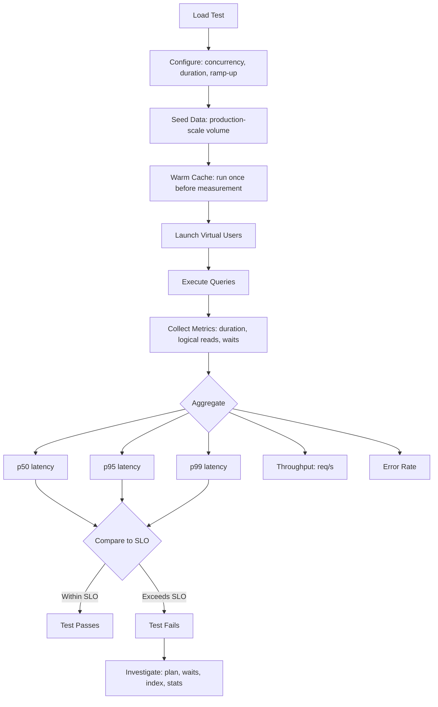

# 8.955 Performance Testing — Load Tests on Database

## Overview — Why Database Performance Testing Matters

Application-level performance tests (load testing HTTP endpoints) hide database behavior behind network latency and serialization overhead. Database performance testing isolates the data layer to measure what the database engine actually does: logical reads, memory grants, wait stats, CPU time, and execution plan choices.

Without dedicated database performance tests, the following regressions go undetected:

- A missing index causes a scan instead of a seek, doubling logical reads
- Parameter sniffing produces a cached plan optimized for an outlier value
- A schema change (new column, modified index) alters the execution plan
- Statistics skew causes the optimizer to underestimate row counts
- Lock escalation under concurrency increases blocking and deadlocks
- A query that runs in 5ms on 100 rows takes 5 seconds on 100K rows

Database performance tests catch these before they reach production. This note covers micro-benchmarks (single-query comparison with BenchmarkDotNet), load tests (concurrent users with NBomber), metrics collection, data seeding, warm vs cold cache strategies, and CI integration.

## Key Metrics — What to Measure

### Logical Reads

Logical reads measure how many 8KB pages the query engine touches. This is the single most reliable indicator of query efficiency because it is deterministic for the same data volume and index structure.

```sql
SET STATISTICS IO ON;
EXEC usp_GetCustomerOrders @CustomerId = 1;
SET STATISTICS IO OFF;
```

Output: `Table 'Orders'. Scan count 1, logical reads 4, physical reads 0, read-ahead reads 0`

Logical reads should be part of every performance test assertion:

```csharp
public class IoStats
{
    public int ScanCount { get; set; }
    public int LogicalReads { get; set; }
    public int PhysicalReads { get; set; }
    public int ReadAheadReads { get; set; }
}
```

### Duration

Wall-clock time for a query to complete. Duration is noisy (affected by CPU load, cache state, concurrency), so measure multiple iterations and report percentiles.

### Wait Stats

What the query spent time waiting on: `PAGEIOLATCH_SH` (disk I/O), `LCK_M_X` (blocking), `CXCONSUMER` (parallelism skew). Collect via `sys.dm_exec_query_stats` or `sys.dm_os_wait_stats`.

### Memory Grant

How much memory the query requested and how much it actually used. Over-granting wastes memory; under-granting causes spills to `tempdb`.

### CPU Time

Query CPU consumption in milliseconds. High CPU with low duration suggests parallelism is helping. High CPU with high duration suggests CPU-bound work (sorting, hash joins, scalar functions).

## BenchmarkDotNet — Micro Benchmarks for Single Queries

BenchmarkDotNet runs iterations with warm-up, measures accurately, and reports statistics. It is ideal for comparing two implementations (Dapper vs EF Core, indexed vs non-indexed, SARGable vs non-SARGable).

### Project Setup

```xml
<PackageReference Include="BenchmarkDotNet" Version="0.13.12" />
<PackageReference Include="Dapper" Version="2.1.28" />
<PackageReference Include="Microsoft.EntityFrameworkCore.SqlServer" Version="8.0.0" />
```

### Benchmark Class for Query Comparison

```csharp
[MemoryDiagnoser]
[SimpleJob(iterationCount: 10, warmupCount: 3)]
public class QueryBenchmarks
{
    private string _connectionString = null!;

    [GlobalSetup]
    public void Setup()
    {
        _connectionString = BenchmarkDbContext.GetConnectionString();
        // Seed data is handled by a once-per-benchmark-run setup
    }

    [Benchmark(Baseline = true)]
    public async Task<List<Order>> Dapper_GetOrdersByCustomer()
    {
        using var conn = new SqlConnection(_connectionString);
        await conn.OpenAsync();
        var orders = (await conn.QueryAsync<Order>(
            "SELECT * FROM Orders WHERE CustomerId = @CustomerId",
            new { CustomerId = 1 })).AsList();
        return orders;
    }

    [Benchmark]
    public async Task<List<Order>> EfCore_GetOrdersByCustomer()
    {
        using var ctx = new BenchmarkDbContext(_connectionString);
        var orders = await ctx.Orders
            .Where(o => o.CustomerId == 1)
            .AsNoTracking()
            .ToListAsync();
        return orders;
    }

    [Benchmark]
    public async Task<List<Order>> EfCore_GetOrdersByCustomer_WithTracking()
    {
        using var ctx = new BenchmarkDbContext(_connectionString);
        var orders = await ctx.Orders
            .Where(o => o.CustomerId == 1)
            .ToListAsync();
        return orders;
    }
}
```

### Running the Benchmark

```csharp
public class Program
{
    public static void Main(string[] args)
    {
        var summary = BenchmarkRunner.Run<QueryBenchmarks>();
        Console.WriteLine(summary);
    }
}
```

### Benchmarking Stored Procedures

```csharp
[Benchmark]
public async Task<List<Order>> Dapper_Sproc()
{
    using var conn = new SqlConnection(_connectionString);
    await conn.OpenAsync();
    var orders = (await conn.QueryAsync<Order>(
        "usp_GetCustomerOrders",
        new { CustomerId = 1 },
        commandType: CommandType.StoredProcedure)).AsList();
    return orders;
}

[Benchmark]
public async Task<List<Order>> EfCore_Sproc()
{
    using var ctx = new BenchmarkDbContext(_connectionString);
    var orders = await ctx.Orders
        .FromSqlRaw("EXEC usp_GetCustomerOrders @CustomerId = {0}", 1)
        .IgnoreQueryFilters()
        .AsNoTracking()
        .ToListAsync();
    return orders;
}
```

### Benchmarking Indexed vs Non-Indexed

```csharp
[Benchmark]
public async Task<List<Order>> NonIndexedSearch()
{
    using var conn = new SqlConnection(_connectionString);
    await conn.OpenAsync();
    return (await conn.QueryAsync<Order>(
        "SELECT * FROM Orders WHERE TotalAmount > 1000")).AsList();
}

[Benchmark]
public async Task<List<Order>> IndexedSearch()
{
    using var conn = new SqlConnection(_connectionString);
    await conn.OpenAsync();
    return (await conn.QueryAsync<Order>(
        "SELECT * FROM Orders WITH (INDEX(IX_Orders_TotalAmount)) WHERE TotalAmount > 1000")).AsList();
}
```

### Benchmarking SARGable vs Non-SARGable

```csharp
[Benchmark]
public async Task<List<Order>> NonSargable()
{
    using var conn = new SqlConnection(_connectionString);
    await conn.OpenAsync();
    return (await conn.QueryAsync<Order>(
        "SELECT * FROM Orders WHERE YEAR(OrderDate) = 2026")).AsList();
}

[Benchmark]
public async Task<List<Order>> Sargable()
{
    using var conn = new SqlConnection(_connectionString);
    await conn.OpenAsync();
    return (await conn.QueryAsync<Order>(
        "SELECT * FROM Orders WHERE OrderDate >= '2026-01-01' AND OrderDate < '2027-01-01'")).AsList();
}
```

### Interpreting BenchmarkDotNet Results

```
| Method                         | Mean     | Error   | StdDev  | Median   | Ratio | LogicalReads |
|------------------------------- |---------:|--------:|--------:|---------:|------:|-------------:|
| Dapper_GetOrdersByCustomer     | 1.523 ms | 0.031 ms| 0.027 ms| 1.518 ms | 1.00  | 4            |
| EfCore_GetOrdersByCustomer     | 2.891 ms | 0.057 ms| 0.053 ms| 2.885 ms | 1.90  | 8            |
| EfCore_GetOrdersByCustomer_... | 3.214 ms | 0.062 ms| 0.058 ms| 3.210 ms | 2.11  | 8            |
```

Key observations: Dapper is faster for raw data access, EF Core adds materialization overhead. Logical reads should be identical for the same query shape.

## NBomber — Load Testing with Concurrent Users

BenchmarkDotNet tests one query at a time. For concurrent access patterns, use NBomber or k6. NBomber is a .NET library for simulating multiple virtual users hitting the database simultaneously.

### NBomber Setup

```xml
<PackageReference Include="NBomber" Version="5.7.0" />
<PackageReference Include="NBomber.Http" Version="5.1.0" />
```

### Load Test Scenario — 50 Concurrent Users

```csharp
public class DatabaseLoadTest
{
    private readonly string _connectionString;

    public DatabaseLoadTest(string connectionString)
    {
        _connectionString = connectionString;
    }

    public async Task RunAsync()
    {
        var scenario = Scenario.Create("get_orders_by_customer", async context =>
        {
            using var conn = new SqlConnection(_connectionString);
            await conn.OpenAsync();

            var stopwatch = Stopwatch.StartNew();
            var orders = (await conn.QueryAsync<Order>(
                "SELECT * FROM Orders WHERE CustomerId = @CustomerId",
                new { CustomerId = Random.Shared.Next(1, 1001) })).AsList();
            stopwatch.Stop();

            return Response.Ok(sizeBytes: orders.Count * 100);
        })
        .WithLoadSimulations(
            Simulation.KeepConstant(
                copies: 50,         // 50 concurrent virtual users
                during: TimeSpan.FromSeconds(30)
            )
        );

        var result = NBomberRunner
            .RegisterScenarios(scenario)
            .WithReportFormats(ReportFormat.Html, ReportFormat.Md)
            .Run();

        // Assert performance SLOs
        var stats = result.ScenarioStats.Get("get_orders_by_customer");
        Assert.True(stats.OkCount > 0);
        Assert.True(stats.Latency.P95 < TimeSpan.FromMilliseconds(500),
            $"P95 latency {stats.Latency.P95.TotalMilliseconds}ms exceeds SLO of 500ms");
        Assert.True(stats.Latency.P99 < TimeSpan.FromSeconds(1),
            $"P99 latency {stats.Latency.P99.TotalMilliseconds}ms exceeds SLO of 1000ms");
        Assert.True(stats.FailCount == 0,
            $"Load test had {stats.FailCount} failures");
    }
}
```

### Mixing Read and Write Scenarios

```csharp
var readScenario = Scenario.Create("read_orders", async ctx =>
{
    using var conn = new SqlConnection(_connectionString);
    await conn.OpenAsync();
    var orders = (await conn.QueryAsync<Order>(
        "SELECT * FROM Orders WHERE CustomerId = @Id",
        new { Id = Random.Shared.Next(1, 100) })).AsList();
    return Response.Ok();
})
.WithLoadSimulations(Simulation.KeepConstant(30, TimeSpan.FromSeconds(30)));

var writeScenario = Scenario.Create("create_order", async ctx =>
{
    using var conn = new SqlConnection(_connectionString);
    await conn.OpenAsync();
    await conn.ExecuteAsync(
        "INSERT INTO Orders (CustomerId, TotalAmount, OrderDate) VALUES (@C, @A, @D)",
        new { C = 1, A = 100m, D = DateTime.UtcNow });
    return Response.Ok();
})
.WithLoadSimulations(Simulation.KeepConstant(10, TimeSpan.FromSeconds(30)));

NBomberRunner
    .RegisterScenarios(readScenario, writeScenario)
    .Run();
```

### NBomber with EF Core

```csharp
var efCoreScenario = Scenario.Create("efcore_get_orders", async ctx =>
{
    using var ctx = new TestDbContext(_connectionString);
    var orders = await ctx.Orders
        .Where(o => o.CustomerId == Random.Shared.Next(1, 100))
        .AsNoTracking()
        .ToListAsync();
    return Response.Ok(sizeBytes: orders.Count * 100);
})
.WithLoadSimulations(Simulation.RampingConstant(1, 50, TimeSpan.FromSeconds(20)));

NBomberRunner.RegisterScenarios(efCoreScenario).Run();
```

### Load Test with Stored Procedures

```csharp
var sprocScenario = Scenario.Create("sproc_get_orders", async ctx =>
{
    using var conn = new SqlConnection(_connectionString);
    await conn.OpenAsync();
    var orders = (await conn.QueryAsync<Order>(
        "usp_GetCustomerOrders",
        new { CustomerId = Random.Shared.Next(1, 100) },
        commandType: CommandType.StoredProcedure)).AsList();
    return Response.Ok();
})
.WithLoadSimulations(Simulation.KeepConstant(50, TimeSpan.FromSeconds(30)));
```

## Data Seeding — Realistic Data Volumes

Performance tests are meaningless with unrealistic data volumes. A query that runs fine on 100 rows may blow up on 1 million rows due to different execution plan choices.

### Seeding 1 Million Rows

```csharp
public class DataSeeder
{
    private readonly string _connectionString;

    public DataSeeder(string connectionString)
    {
        _connectionString = connectionString;
    }

    public async Task SeedAsync(int customerCount = 10000, int ordersPerCustomer = 100)
    {
        using var conn = new SqlConnection(_connectionString);
        await conn.OpenAsync();

        // Disable constraints and indexes for fast bulk insert
        await conn.ExecuteAsync("ALTER TABLE Orders NOCHECK CONSTRAINT ALL");
        await conn.ExecuteAsync("ALTER INDEX ALL ON Orders DISABLE");

        // Batch insert customers
        for (int batch = 0; batch < customerCount / 1000; batch++)
        {
            var customers = Enumerable.Range(batch * 1000 + 1, 1000)
                .Select(i => new { CustomerId = i, Name = $"Customer_{i}", Email = $"c{i}@example.com" });
            await conn.ExecuteAsync(
                "INSERT INTO Customers (CustomerId, Name, Email) VALUES (@CustomerId, @Name, @Email)",
                customers);
        }

        // Batch insert orders
        var orderBatchSize = 10000;
        var totalOrders = customerCount * ordersPerCustomer;
        for (int offset = 0; offset < totalOrders; offset += orderBatchSize)
        {
            var orders = Enumerable.Range(offset + 1, Math.Min(orderBatchSize, totalOrders - offset))
                .Select(i => new
                {
                    OrderId = i,
                    CustomerId = Random.Shared.Next(1, customerCount + 1),
                    OrderDate = DateTime.UtcNow.AddDays(-Random.Shared.Next(1, 365)),
                    TotalAmount = Math.Round((decimal)Random.Shared.NextDouble() * 5000, 2),
                    Status = new[] { "Pending", "Shipped", "Delivered", "Cancelled" }[Random.Shared.Next(4)]
                });
            await conn.ExecuteAsync(
                "INSERT INTO Orders (OrderId, CustomerId, OrderDate, TotalAmount, Status) VALUES (@OrderId, @CustomerId, @OrderDate, @TotalAmount, @Status)",
                orders);
        }

        // Re-enable and rebuild
        await conn.ExecuteAsync("ALTER TABLE Orders WITH CHECK CHECK CONSTRAINT ALL");
        await conn.ExecuteAsync("ALTER INDEX ALL ON Orders REBUILD");
        await conn.ExecuteAsync("UPDATE STATISTICS Orders WITH FULLSCAN");
        await conn.ExecuteAsync("UPDATE STATISTICS Customers WITH FULLSCAN");
    }
}
```

### Data Distribution Skew

Real data is often skewed: 20% of customers generate 80% of orders. Test with skewed distributions to catch parameter sniffing issues:

```csharp
public async Task SeedSkewedAsync()
{
    // 80% of orders go to 20% of customers
    var vipCustomers = Enumerable.Range(1, 2000).ToList(); // 20% of 10K
    var regularCustomers = Enumerable.Range(2001, 8000).ToList();

    for (int i = 0; i < 800000; i++) // 80% of orders
    {
        var customerId = vipCustomers[Random.Shared.Next(vipCustomers.Count)];
        await InsertOrderAsync(customerId);
    }
    for (int i = 0; i < 200000; i++) // 20% of orders
    {
        var customerId = regularCustomers[Random.Shared.Next(regularCustomers.Count)];
        await InsertOrderAsync(customerId);
    }
}
```

## Warm vs Cold Cache — Measurement Strategies

### Cold Cache — Simulating First Run

Cold cache means the buffer pool is empty. SQL Server must read data from disk. This represents a scenario after service restart or when data is not frequently accessed.

```csharp
[Fact]
public async Task ColdCache_MeasureLogicalReads()
{
    using var conn = new SqlConnection(_connectionString);
    await conn.OpenAsync();

    // Clear the buffer pool for this database
    await conn.ExecuteAsync("CHECKPOINT; DBCC DROPCLEANBUFFERS;");

    // Measure with SET STATISTICS IO
    var stats = await CaptureIoStatsAsync(conn,
        "SELECT * FROM Orders WHERE CustomerId = 1");

    Assert.InRange(stats.LogicalReads, 1, 100);
}
```

### Warm Cache — Buffer Pool Already Loaded

Warm cache represents steady-state production behavior. Run the query once to load data into cache, then measure subsequent executions.

```csharp
[Fact]
public async Task WarmCache_MeasureDuration()
{
    using var conn = new SqlConnection(_connectionString);
    await conn.OpenAsync();

    // Warm the cache: run query once, ignore results
    await conn.QueryAsync<Order>("SELECT * FROM Orders WHERE CustomerId = 1");

    // Measure subsequent executions (should be faster)
    var sw = Stopwatch.StartNew();
    for (int i = 0; i < 100; i++)
    {
        await conn.QueryAsync<Order>("SELECT * FROM Orders WHERE CustomerId = 1");
    }
    sw.Stop();

    var avgMs = sw.ElapsedMilliseconds / 100.0;
    Assert.True(avgMs < 10, $"Average warm execution: {avgMs}ms");
}
```

### BenchmarkDotNet — Warmup and Iteration

BenchmarkDotNet automatically handles warmup: it runs the benchmark several times before recording measurements. The `WarmupCount` parameter controls how many warmup iterations run.

```csharp
[SimpleJob(iterationCount: 15, warmupCount: 5)]
public class WarmColdComparison
{
    // ... benchmarks
}
```

## Capturing Execution Plans in Tests

Execution plans reveal why a query is slow. Capture them programmatically during performance tests:

```csharp
public async Task<string> GetActualPlanAsync(string query, object? parameters = null)
{
    using var conn = new SqlConnection(_connectionString);
    await conn.OpenAsync();

    // Enable actual execution plan capture
    await conn.ExecuteAsync("SET STATISTICS XML ON;");

    using var reader = await conn.ExecuteReaderAsync(query, parameters);
    var sb = new StringBuilder();
    do
    {
        while (await reader.ReadAsync())
        {
            // Consume result sets
        }
    } while (await reader.NextResultAsync());

    // The last result set contains the XML plan
    // Alternative: use SET SHOWPLAN_XML ON for estimated plan
    await conn.ExecuteAsync("SET STATISTICS XML OFF;");

    return sb.ToString();
}
```

### Asserting on Execution Plan Operators

```csharp
[Fact]
public async Task Query_UsesIndexSeek_NotScan()
{
    using var conn = new SqlConnection(_connectionString);
    await conn.OpenAsync();

    var planXml = await GetEstimatedPlanAsync(
        "SELECT * FROM Orders WHERE CustomerId = 1");

    Assert.Contains("Index Seek", planXml);
    Assert.DoesNotContain("Index Scan", planXml);
}
```

## CI Pipeline — Performance Regression Tests

Performance tests in CI compare the current branch's query performance against a baseline from the main branch.

### Baseline Capture

```csharp
public class PerformanceBaseline
{
    public string QueryHash { get; set; } = "";
    public double MeanDurationMs { get; set; }
    public int LogicalReads { get; set; }
    public double P95DurationMs { get; set; }
    public DateTime CapturedAt { get; set; }
}
```

### Comparing Against Baseline

```csharp
[Fact]
public async Task QueryPerformance_NoRegression()
{
    // Arrange
    var baseline = await LoadBaselineAsync("query_hash_abc123");

    // Act
    var current = await MeasureQueryPerformanceAsync(
        "SELECT * FROM Orders WHERE CustomerId = 1");

    // Assert: duration must not exceed 120% of baseline
    var maxAllowed = baseline.MeanDurationMs * 1.2;
    Assert.True(current.MeanDurationMs <= maxAllowed,
        $"Query regressed from {baseline.MeanDurationMs:F2}ms to {current.MeanDurationMs:F2}ms " +
        $"(limit: {maxAllowed:F2}ms)");

    // Assert: logical reads must not increase
    Assert.True(current.LogicalReads <= baseline.LogicalReads,
        $"Logical reads increased from {baseline.LogicalReads} to {current.LogicalReads}");
}
```

### GitHub Actions Integration

```yaml
name: Performance Tests
on: [pull_request]
jobs:
  performance:
    runs-on: ubuntu-latest
    services:
      sqlserver:
        image: mcr.microsoft.com/mssql/server:2022-latest
        env:
          ACCEPT_EULA: Y
          SA_PASSWORD: Your_Str0ng_P@ssw0rd!
        ports:
          - 1433:1433
    steps:
      - uses: actions/checkout@v4
      - uses: actions/setup-dotnet@v4
      - run: dotnet test --filter "Category=Performance" --configuration Release
```

### Storing Baselines

Baselines can be stored as JSON files in the repository:

```json
{
  "query_hash_abc123": {
    "queryText": "SELECT * FROM Orders WHERE CustomerId = @p",
    "meanDurationMs": 1.523,
    "logicalReads": 4,
    "p95DurationMs": 1.89,
    "capturedAt": "2026-06-01T10:00:00Z"
  }
}
```

## Measuring Concurrent Performance with Custom Harness

For scenarios not covered by NBomber or BenchmarkDotNet, write a custom concurrent harness using TPL:

```csharp
public class ConcurrentQueryHarness
{
    private readonly string _connectionString;
    private readonly int _concurrency;
    private readonly int _iterations;

    public ConcurrentQueryHarness(string connectionString, int concurrency, int iterations)
    {
        _connectionString = connectionString;
        _concurrency = concurrency;
        _iterations = iterations;
    }

    public async Task<ConcurrentMetrics> RunAsync(Func<SqlConnection, Task> queryFunc)
    {
        var latencies = new ConcurrentBag<long>();
        var errors = 0;

        await Parallel.ForEachAsync(
            Enumerable.Range(0, _concurrency * _iterations),
            new ParallelOptions { MaxDegreeOfParallelism = _concurrency },
            async (_, ct) =>
            {
                try
                {
                    using var conn = new SqlConnection(_connectionString);
                    await conn.OpenAsync(ct);
                    var sw = Stopwatch.StartNew();
                    await queryFunc(conn);
                    sw.Stop();
                    latencies.Add(sw.ElapsedMilliseconds);
                }
                catch
                {
                    Interlocked.Increment(ref errors);
                }
            });

        var sorted = latencies.OrderBy(x => x).ToList();
        return new ConcurrentMetrics
        {
            TotalRequests = latencies.Count,
            Errors = errors,
            P50 = sorted[(int)(sorted.Count * 0.50)],
            P95 = sorted[(int)(sorted.Count * 0.95)],
            P99 = sorted[(int)(sorted.Count * 0.99)],
            Max = sorted[^1],
            Min = sorted[0],
            Avg = sorted.Average()
        };
    }
}

public record ConcurrentMetrics
{
    public int TotalRequests { get; init; }
    public int Errors { get; init; }
    public long P50 { get; init; }
    public long P95 { get; init; }
    public long P99 { get; init; }
    public long Max { get; init; }
    public long Min { get; init; }
    public double Avg { get; init; }
}
```

### Using the Harness

```csharp
[Fact]
public async Task FiftyConcurrentUsers_StoredProcedure()
{
    var harness = new ConcurrentQueryHarness(_connectionString, concurrency: 50, iterations: 20);
    var metrics = await harness.RunAsync(async conn =>
    {
        await conn.QueryAsync<Order>(
            "usp_GetCustomerOrders",
            new { CustomerId = 1 },
            commandType: CommandType.StoredProcedure);
    });

    Assert.Equal(0, metrics.Errors);
    Assert.True(metrics.P95 < 500, $"P95: {metrics.P95}ms");
    Assert.True(metrics.P99 < 1000, $"P99: {metrics.P99}ms");
}
```

## Collecting Wait Statistics During Load Test

```csharp
public async Task<Dictionary<string, long>> CaptureWaitStatsAsync()
{
    using var conn = new SqlConnection(_connectionString);
    await conn.OpenAsync();
    var waits = await conn.QueryAsync<(string WaitType, long WaitMs)>(
        @"SELECT TOP 10 wait_type, wait_time_ms
          FROM sys.dm_os_wait_stats
          WHERE wait_type NOT LIKE '%SLEEP%'
            AND wait_type NOT LIKE '%IDLE%'
          ORDER BY wait_time_ms DESC");
    return waits.ToDictionary(w => w.WaitType, w => w.WaitMs);
}
```

## Mermaid — Load Test Flow Diagram



## Gotchas — Common Pitfalls

### Logical Reads Vary by Data Distribution

The same query on the same table may produce different logical reads depending on the distribution of values. A customer with 10 orders uses fewer logical reads than a customer with 10,000 orders. Always test with representative data skew.

### Auto-Update Statistics Skews Results

If statistics auto-update during a benchmark run (triggered by enough row modifications), the query plan may change mid-benchmark. Disable auto-update statistics on test tables, or ensure tests are read-only.

```sql
ALTER DATABASE CURRENT SET AUTO_UPDATE_STATISTICS OFF;
```

### Parallel Plans Are Inconsistent in CI

CI machines often have fewer CPU cores than production. A query that goes parallel on an 8-core production server may run serial on a 2-core CI agent, producing wildly different durations. Pin `MAXDOP` to match production in test connection strings:

```
Server=...;Database=...;Max Pool Size=100;MultipleActiveResultSets=true;Trusted_Connection=true;"
```

Or set at the query level:

```sql
SELECT * FROM Orders WHERE CustomerId = 1 OPTION (MAXDOP 2);
```

### Benchmarking on Shared Databases

If multiple CI jobs share the same SQL Server instance, queries from one job affect buffer pool, plan cache, and wait stats of another. Use dedicated containers (TestContainers) for performance tests.

### Cold Cache Measurements Require DBCC DROPCLEANBUFFERS

`DBCC DROPCLEANBUFFERS` requires `ALTER SERVER STATE` permission, which is not available in all CI environments. In TestContainers, you can run it because you control the container. On shared databases, you cannot clear the cache, so warm-cache measurements are more reliable.

### Statistics I/O and Execution Plan Capture Overhead

`SET STATISTICS IO ON` and `SET STATISTICS XML ON` add overhead. Do not leave them enabled during load tests. Use them only during micro benchmarks or diagnostic runs.

### First Execution vs Subsequent Executions

The first execution of a query compiles the plan (compilation cost). Subsequent executions reuse the cached plan. BenchmarkDotNet handles this with warmup. In ad-hoc tests, always run the query once before measuring.

### Parameter Sniffing in CI

The first parameter value used for a query creates the cached plan. If the test uses an outlier value (e.g., a customer with 50K orders), the plan may be suboptimal for typical values. Test with both typical and outlier parameters.

### Data Volume and tempdb Spills

Queries that sort, hash join, or aggregate may spill to `tempdb` if not enough memory is granted. Spills are invisible in single-user tests but cause blocking under concurrency. Monitor `spills` in the execution plan.

### Connection Pooling and Open Connections

Performance tests that open many connections may hit the connection pool limit (`Max Pool Size`). Use `Max Pool Size=200` in the connection string for load tests. Alternatively, use `Pooling=false` for each test to avoid pool contention.

### Measuring with Warm Cache for CI

For CI performance regression tests, use warm-cache measurements (discard first run, measure subsequent). Cold-cache measurements are too noisy in CI because the buffer pool state depends on the order tests run.

### Reporting Units

Always report duration in milliseconds, logical reads as integers, and throughput in requests per second. Use consistent units so comparisons across test runs are meaningful.

## Practice Checklist

- [ ] Micro benchmarks use BenchmarkDotNet with warmup and multiple iterations
- [ ] Load tests use NBomber or custom harness with concurrent users
- [ ] Logical reads measured via SET STATISTICS IO in micro benchmarks
- [ ] Data seeded at production-scale volume (1M+ rows) with realistic skew
- [ ] Both cold cache and warm cache measurements are taken
- [ ] Execution plans are captured and inspected for regressions
- [ ] Performance baselines are stored and compared in CI
- [ ] SARGable vs non-SARGable queries are compared
- [ ] Dapper and EF Core are benchmarked side by side
- [ ] Stored procedures are included in benchmarks
- [ ] P50, P95, P99 latency reported and asserted against SLOs
- [ ] Wait statistics are captured during load tests
- [ ] tempdb spills and memory grants are monitored
- [ ] MAXDOP is pinned for consistent parallel plan behavior
- [ ] Auto-update statistics is disabled during benchmarks
- [ ] Performance regression threshold is defined (e.g., 120% of baseline)
- [ ] Connection pool limits are configured for load test volume
- [ ] Tests run in isolated containers (TestContainers) not shared databases
- [ ] Benchmark results are exported to HTML/MD for PR comments
- [ ] Documentation: expected performance characteristics per query

## Related Notes

- [[8.366 — SET STATISTICS IO — Reading Logical Reads]]
- [[8.343 — Execution Plans — Reading Graphical Plans]]
- [[8.600 — Query Tuning Methodology]]
- [[8.943 — Integration Testing — Real Database]]
- [[8.944 — TestContainers — SQL Server in Docker]]
- [[8.953 — Testing Stored Procedures — Integration Tests]]
- [[8.954 — Testing Transactions — Rollback After Test]]
