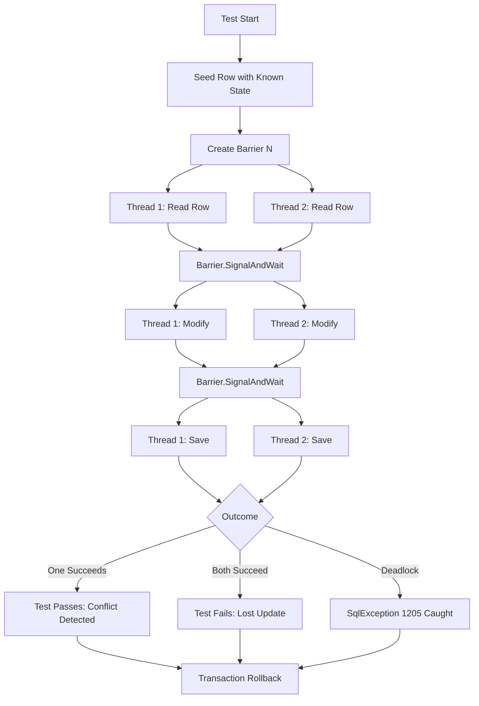

# 8.956 Testing Concurrency — Race Condition Simulation

## Overview — Why Concurrency Testing Matters

Concurrency bugs are the hardest to catch because they depend on timing: two threads hitting the same row at nearly the same instant. Unit tests never expose them because mocks don't simulate locks, isolation levels, or transaction interleaving. Integration tests against a real database are the only reliable way to reproduce and verify concurrent access patterns.

The most common database concurrency defects are:

- **Lost update**: Two transactions read the same row, both modify it, and the second overwrites the first without seeing its change
- **Write skew**: Two transactions read overlapping data sets and make conflicting writes based on stale reads
- **Phantom read**: A transaction reads a set of rows, and a concurrent transaction inserts or deletes rows that match the filter
- **Deadlock**: Two transactions each hold a resource the other needs, and SQL Server chooses a victim
- **Optimistic concurrency conflict**: A row version check fails because another transaction modified the row first

This note covers how to simulate each of these scenarios using Task Parallel Library, Barrier, CountdownEvent, and other synchronization primitives. All tests run against a real SQL Server instance (TestContainers) inside a transaction that rolls back, leaving no trace.

## Infrastructure — Database Fixture with Rollback

Every concurrency test needs a real database and a transaction that rolls back. The base class follows the same pattern as [[8.954 — Testing Transactions — Rollback After Test]].

```csharp
public class ConcurrencyTestBase : IClassFixture<DatabaseFixture>, IAsyncLifetime
{
    protected readonly DatabaseFixture Fixture;
    protected SqlConnection Connection { get; private set; } = null!;
    protected SqlTransaction Transaction { get; private set; } = null!;
    protected TestDbContext DbContext { get; private set; } = null!;

    public ConcurrencyTestBase(DatabaseFixture fixture)
    {
        Fixture = fixture;
    }

    public async Task InitializeAsync()
    {
        Connection = new SqlConnection(Fixture.ConnectionString);
        await Connection.OpenAsync();
        Transaction = Connection.BeginTransaction();

        var options = new DbContextOptionsBuilder<TestDbContext>()
            .UseSqlServer(Connection)
            .Options;
        DbContext = new TestDbContext(options);
        DbContext.Database.UseTransaction(Transaction);
    }

    public async Task DisposeAsync()
    {
        try { await Transaction.RollbackAsync(); }
        catch (ObjectDisposedException) { }
        finally
        {
            await Transaction.DisposeAsync();
            await DbContext.DisposeAsync();
            await Connection.DisposeAsync();
        }
    }

    protected async Task SeedRowAsync(int id = 1, int version = 1, int quantity = 100)
    {
        await Connection.ExecuteAsync(@"
            INSERT INTO ConcurrencyTest (Id, RowVersion, Quantity, LastModified)
            VALUES (@Id, @Version, @Quantity, GETUTCDATE())",
            new { Id = id, Version = version, Quantity = quantity },
            transaction: Transaction);
    }
}
```

The test table used throughout:

```sql
CREATE TABLE ConcurrencyTest (
    Id INT PRIMARY KEY,
    RowVersion ROWVERSION,
    Quantity INT NOT NULL,
    LastModified DATETIME2 NOT NULL DEFAULT GETUTCDATE()
);
```

## Synchronization Primitives — Barrier and CountdownEvent

Concurrency tests need precise timing. Without synchronization, one thread may finish before the other starts, and the race condition never materializes.

### Barrier — All Threads Start Simultaneously

`Barrier` blocks each thread until all threads have reached the barrier point, then releases them simultaneously. This is the most important primitive for concurrency testing.

```csharp
[Fact]
public async Task Barrier_SynchronizesTwoThreads()
{
    var barrier = new Barrier(2); // 2 participants
    var results = new ConcurrentBag<string>();

    var task1 = Task.Run(() =>
    {
        barrier.SignalAndWait(); // Wait for both threads to arrive
        results.Add("Thread1 reached");
        barrier.SignalAndWait(); // Phase 2
        results.Add("Thread1 done");
    });

    var task2 = Task.Run(() =>
    {
        barrier.SignalAndWait(); // Wait for both threads to arrive
        results.Add("Thread2 reached");
        barrier.SignalAndWait(); // Phase 2
        results.Add("Thread2 done");
    });

    await Task.WhenAll(task1, task2);
    Assert.Equal(4, results.Count);
}
```

### CountdownEvent — One Thread Waits for Others

`CountdownEvent` signals when a specified number of threads have completed a phase. Useful when one thread needs to wait for N other threads to finish reading before proceeding.

```csharp
[Fact]
public async Task CountdownEvent_WaitsForAllReaders()
{
    var ready = new CountdownEvent(3); // Main + 2 readers
    var data = new ConcurrentBag<int>();

    var reader1 = Task.Run(() => { data.Add(1); ready.Signal(); });
    var reader2 = Task.Run(() => { data.Add(2); ready.Signal(); });

    ready.Signal(); // Main thread signals readiness
    ready.Wait();   // Wait until all 3 have signaled

    Assert.Equal(2, data.Count);
}
```

## Testing Optimistic Concurrency — EF Core RowVersion

EF Core's optimistic concurrency uses a `Timestamp` or `RowVersion` column. When `SaveChangesAsync` is called, EF Core includes the original version in the `WHERE` clause. If no rows match (because another transaction changed the version), it throws `DbUpdateConcurrencyException`.

### Two Threads, Same Row — One Succeeds, One Fails

```csharp
[Fact]
public async Task OptimisticConcurrency_OneWinsOneLoses()
{
    // Arrange: seed a row with version 1
    await Connection.ExecuteAsync(@"
        INSERT INTO ConcurrencyTest (Id, Quantity) VALUES (1, 100)",
        transaction: Transaction);
    await Transaction.CommitAsync(); // Must commit so both tasks see the row
    // (We'll roll back at the end instead of per-test; this test is special)

    var barrier = new Barrier(2);
    Exception? exception = null;
    int finalQuantity = 0;

    var task1 = Task.Run(async () =>
    {
        using var ctx1 = CreateContext();
        var row = await ctx1.ConcurrencyTest.FindAsync(1);
        row!.Quantity = 200;

        barrier.SignalAndWait(); // Both tasks have read the row
        // Race: both try to save simultaneously
        try { await ctx1.SaveChangesAsync(); }
        catch (DbUpdateConcurrencyException ex) { exception = ex; }
    });

    var task2 = Task.Run(async () =>
    {
        using var ctx2 = CreateContext();
        var row = await ctx2.ConcurrencyTest.FindAsync(1);
        row!.Quantity = 300;

        barrier.SignalAndWait();
        try { await ctx2.SaveChangesAsync(); }
        catch (DbUpdateConcurrencyException ex) { exception = ex; }
    });

    await Task.WhenAll(task1, task2);

    // One task should have succeeded, one should have thrown
    Assert.NotNull(exception);
    Assert.IsType<DbUpdateConcurrencyException>(exception);
}
```

### Testing the Retry Logic

Production code should retry on concurrency conflict. Test that retry succeeds:

```csharp
[Fact]
public async Task OptimisticConcurrency_RetrySucceeds()
{
    // Arrange
    await Connection.ExecuteAsync(@"
        INSERT INTO ConcurrencyTest (Id, Quantity) VALUES (1, 100)",
        transaction: Transaction);
    await Transaction.CommitAsync();

    const int maxRetries = 3;
    var barrier = new Barrier(2);
    var eventualQuantity = 0;

    var task1 = Task.Run(async () =>
    {
        for (int attempt = 0; attempt < maxRetries; attempt++)
        {
            using var ctx = CreateContext();
            var row = await ctx.ConcurrencyTest.FindAsync(1);
            row!.Quantity = 200;

            barrier.SignalAndWait(); // Both read simultaneously

            try
            {
                await ctx.SaveChangesAsync();
                eventualQuantity = row.Quantity;
                return;
            }
            catch (DbUpdateConcurrencyException)
            {
                if (attempt == maxRetries - 1) throw;
                // Reload fresh data and retry
            }
        }
    });

    var task2 = Task.Run(async () =>
    {
        using var ctx = CreateContext();
        var row = await ctx.ConcurrencyTest.FindAsync(1);

        barrier.SignalAndWait();

        row!.Quantity = 300;
        await ctx.SaveChangesAsync();
    });

    await Task.WhenAll(task1, task2);

    Assert.Equal(200, eventualQuantity); // Task1 eventually succeeded
}
```

### Three-Way Race

Scale to more threads to test contention under higher load:

```csharp
[Fact]
public async Task OptimisticConcurrency_TenThreads_OnlyOneSucceeds()
{
    await Connection.ExecuteAsync(@"
        INSERT INTO ConcurrencyTest (Id, Quantity) VALUES (1, 0)",
        transaction: Transaction);
    await Transaction.CommitAsync();

    const int threadCount = 10;
    var barrier = new Barrier(threadCount);
    var successCount = 0;
    var lockObj = new object();

    var tasks = Enumerable.Range(1, threadCount).Select(i => Task.Run(async () =>
    {
        using var ctx = CreateContext();
        var row = await ctx.ConcurrencyTest.FindAsync(1);
        row!.Quantity = i * 100;

        barrier.SignalAndWait();

        try
        {
            await ctx.SaveChangesAsync();
            lock (lockObj) successCount++;
        }
        catch (DbUpdateConcurrencyException) { }
    }));

    await Task.WhenAll(tasks);
    Assert.Equal(1, successCount); // Exactly one succeeds
}
```

## Testing Optimistic Concurrency — Dapper Manual Check

Dapper does not have built-in concurrency token handling. You implement it manually using `ROWVERSION` and checking `@@ROWCOUNT`.

### Manual Version Check with Dapper

```csharp
[Fact]
public async Task Dapper_ManualRowVersion_DetectsConflict()
{
    // Arrange
    await Connection.ExecuteAsync(@"
        INSERT INTO ConcurrencyTest (Id, Quantity) VALUES (1, 100)",
        transaction: Transaction);
    await Transaction.CommitAsync();

    var barrier = new Barrier(2);
    var conflictDetected = false;

    var task1 = Task.Run(async () =>
    {
        using var conn = new SqlConnection(Fixture.ConnectionString);
        await conn.OpenAsync();
        using var tx = conn.BeginTransaction();

        // Read current version
        var (quantity, version) = await conn.QuerySingleAsync<(int, byte[])>(
            "SELECT Quantity, RowVersion FROM ConcurrencyTest WHERE Id = 1",
            transaction: tx);

        barrier.SignalAndWait(); // Both read the same version

        // Optimistic update: only succeeds if version hasn't changed
        var rowsAffected = await conn.ExecuteAsync(
            @"UPDATE ConcurrencyTest
              SET Quantity = @NewQuantity, LastModified = GETUTCDATE()
              WHERE Id = 1 AND RowVersion = @OriginalVersion",
            new { NewQuantity = 200, OriginalVersion = version },
            transaction: tx);

        if (rowsAffected == 0)
            conflictDetected = true;

        tx.Rollback();
    });

    var task2 = Task.Run(async () =>
    {
        using var conn = new SqlConnection(Fixture.ConnectionString);
        await conn.OpenAsync();
        using var tx = conn.BeginTransaction();

        var (quantity, version) = await conn.QuerySingleAsync<(int, byte[])>(
            "SELECT Quantity, RowVersion FROM ConcurrencyTest WHERE Id = 1",
            transaction: tx);

        barrier.SignalAndWait();

        var rowsAffected = await conn.ExecuteAsync(
            @"UPDATE ConcurrencyTest
              SET Quantity = @NewQuantity, LastModified = GETUTCDATE()
              WHERE Id = 1 AND RowVersion = @OriginalVersion",
            new { NewQuantity = 300, OriginalVersion = version },
            transaction: tx);

        if (rowsAffected == 0)
            conflictDetected = true;

        tx.Rollback();
    });

    await Task.WhenAll(task1, task2);
    Assert.True(conflictDetected);
}
```

### Dapper Retry with Version Check

```csharp
[Fact]
public async Task Dapper_RetryOnConflict()
{
    await Connection.ExecuteAsync(@"
        INSERT INTO ConcurrencyTest (Id, Quantity) VALUES (1, 0)",
        transaction: Transaction);
    await Transaction.CommitAsync();

    var barrier = new Barrier(2);
    var succeeded = false;

    async Task UpdateWithRetryAsync(int newValue)
    {
        const int maxRetries = 5;
        for (int attempt = 0; attempt < maxRetries; attempt++)
        {
            using var conn = new SqlConnection(Fixture.ConnectionString);
            await conn.OpenAsync();
            using var tx = conn.BeginTransaction();

            var version = await conn.ExecuteScalarAsync<byte[]>(
                "SELECT RowVersion FROM ConcurrencyTest WHERE Id = 1",
                transaction: tx);

            if (attempt == 0) barrier.SignalAndWait(); // Both read initial version

            var rows = await conn.ExecuteAsync(
                @"UPDATE ConcurrencyTest
                  SET Quantity = @Qty, LastModified = GETUTCDATE()
                  WHERE Id = 1 AND RowVersion = @Ver",
                new { Qty = newValue, Ver = version },
                transaction: tx);

            if (rows > 0) { tx.Commit(); succeeded = true; return; }

            tx.Rollback();
            await Task.Delay(50 * (attempt + 1)); // Backoff
        }
    }

    var task1 = UpdateWithRetryAsync(200);
    var task2 = UpdateWithRetryAsync(300);

    await Task.WhenAll(task1, task2);
    Assert.True(succeeded);
}
```

## Testing Lost Updates — Read-Modify-Write Cycle

A lost update occurs when two transactions read the same value, increment it locally, and write back. The second write overwrites the first without incorporating the first's change.

### Demonstrating the Lost Update

```csharp
[Fact]
public async Task LostUpdate_TwoIncrements_OneIsLost()
{
    // Arrange: seed Quantity = 0
    await Connection.ExecuteAsync(@"
        INSERT INTO ConcurrencyTest (Id, Quantity) VALUES (1, 0)",
        transaction: Transaction);
    await Transaction.CommitAsync();

    var barrier = new Barrier(2);

    async Task IncrementAsync(int increment)
    {
        using var conn = new SqlConnection(Fixture.ConnectionString);
        await conn.OpenAsync();
        using var tx = conn.BeginTransaction();

        var current = await conn.ExecuteScalarAsync<int>(
            "SELECT Quantity FROM ConcurrencyTest WHERE Id = 1",
            transaction: tx);

        barrier.SignalAndWait(); // Both read 0

        // Both write back their computed value
        await conn.ExecuteAsync(
            "UPDATE ConcurrencyTest SET Quantity = @Qty WHERE Id = 1",
            new { Qty = current + increment },
            transaction: tx);

        tx.Commit(); // One overwrites the other
    }

    await Task.WhenAll(IncrementAsync(10), IncrementAsync(20));

    // Expected: 30, but actually: 20 (one update lost)
    using var finalConn = new SqlConnection(Fixture.ConnectionString);
    var final = await finalConn.ExecuteScalarAsync<int>(
        "SELECT Quantity FROM ConcurrencyTest WHERE Id = 1");
    Assert.Equal(20, final); // Lost update! Should be 30
}
```

### Preventing Lost Update with Atomic UPDATE

The fix is to use an atomic SQL statement or optimistic concurrency:

```csharp
[Fact]
public async Task AtomicUpdate_PreventsLostUpdate()
{
    await Connection.ExecuteAsync(@"
        INSERT INTO ConcurrencyTest (Id, Quantity) VALUES (1, 0)",
        transaction: Transaction);
    await Transaction.CommitAsync();

    var barrier = new Barrier(2);

    async Task AtomicIncrementAsync(int increment)
    {
        using var conn = new SqlConnection(Fixture.ConnectionString);
        await conn.OpenAsync();
        using var tx = conn.BeginTransaction();

        // Atomic: no read-then-write gap
        await conn.ExecuteAsync(
            "UPDATE ConcurrencyTest SET Quantity = Quantity + @Inc WHERE Id = 1",
            new { Inc = increment },
            transaction: tx);

        barrier.SignalAndWait();
        tx.Commit();
    }

    await Task.WhenAll(AtomicIncrementAsync(10), AtomicIncrementAsync(20));

    using var finalConn = new SqlConnection(Fixture.ConnectionString);
    var final = await finalConn.ExecuteScalarAsync<int>(
        "SELECT Quantity FROM ConcurrencyTest WHERE Id = 1");
    Assert.Equal(30, final); // Correct!
}
```

## Testing Write Skew — Phantom Reads

Write skew happens when two transactions read overlapping data and make decisions based on stale reads. Classic example: two on-call doctors both check if at least one doctor remains on call, both see they are the only one, both take themselves off call, leaving zero doctors on call.

### Write Skew Demonstration

```csharp
[Fact]
public async Task WriteSkew_BothRemoveThemselves_LeavesZero()
{
    // Arrange: two doctors on call
    await Connection.ExecuteAsync(@"
        INSERT INTO Doctors (Id, Name, OnCall) VALUES (1, 'Alice', 1);
        INSERT INTO Doctors (Id, Name, OnCall) VALUES (2, 'Bob', 1);",
        transaction: Transaction);
    await Transaction.CommitAsync();

    var barrier = new Barrier(2);

    async Task RemoveFromCallAsync(string doctorName)
    {
        using var conn = new SqlConnection(Fixture.ConnectionString);
        await conn.OpenAsync();
        using var tx = conn.BeginTransaction();

        // Check: how many are on call?
        var onCallCount = await conn.ExecuteScalarAsync<int>(
            "SELECT COUNT(*) FROM Doctors WHERE OnCall = 1",
            transaction: tx);

        barrier.SignalAndWait(); // Both see count = 2

        // If at least one other is on call, remove self
        if (onCallCount >= 2)
        {
            await conn.ExecuteAsync(
                "UPDATE Doctors SET OnCall = 0 WHERE Name = @Name",
                new { Name = doctorName },
                transaction: tx);
        }

        tx.Commit();
    }

    await Task.WhenAll(
        RemoveFromCallAsync("Alice"),
        RemoveFromCallAsync("Bob"));

    // Both removed themselves — zero on call!
    using var finalConn = new SqlConnection(Fixture.ConnectionString);
    var remaining = await finalConn.ExecuteScalarAsync<int>(
        "SELECT COUNT(*) FROM Doctors WHERE OnCall = 1");
    Assert.Equal(0, remaining); // Write skew: should be 1
}
```

### Preventing Write Skew with SERIALIZABLE

The fix is `SERIALIZABLE` isolation level, which places range locks:

```csharp
[Fact]
public async Task Serializable_PreventsWriteSkew()
{
    await Connection.ExecuteAsync(@"
        INSERT INTO Doctors (Id, Name, OnCall) VALUES (1, 'Alice', 1);
        INSERT INTO Doctors (Id, Name, OnCall) VALUES (2, 'Bob', 1);",
        transaction: Transaction);
    await Transaction.CommitAsync();

    var barrier = new Barrier(2);
    var conflictDetected = false;

    async Task RemoveFromCallSerializableAsync(string doctorName)
    {
        using var conn = new SqlConnection(Fixture.ConnectionString);
        await conn.OpenAsync();
        using var tx = conn.BeginTransaction(IsolationLevel.Serializable);

        var onCallCount = await conn.ExecuteScalarAsync<int>(
            "SELECT COUNT(*) FROM Doctors WHERE OnCall = 1",
            transaction: tx);

        barrier.SignalAndWait();

        if (onCallCount >= 2)
        {
            try
            {
                await conn.ExecuteAsync(
                    "UPDATE Doctors SET OnCall = 0 WHERE Name = @Name",
                    new { Name = doctorName },
                    transaction: tx);
            }
            catch (SqlException ex) when (ex.Number == 1205) // Deadlock
            {
                conflictDetected = true;
                tx.Rollback();
                return;
            }
        }

        tx.Commit();
    }

    await Task.WhenAll(
        RemoveFromCallSerializableAsync("Alice"),
        RemoveFromCallSerializableAsync("Bob"));

    // Under SERIALIZABLE, one transaction blocks the other or deadlocks
    using var finalConn = new SqlConnection(Fixture.ConnectionString);
    var remaining = await finalConn.ExecuteScalarAsync<int>(
        "SELECT COUNT(*) FROM Doctors WHERE OnCall = 1");
    Assert.Equal(1, remaining); // Correct: at least one remains
}
```

## Testing Deadlocks — SqlException 1205

Deadlocks occur when two transactions hold locks the other needs. SQL Server resolves deadlocks by choosing a victim, which receives error 1205.

### Classic Deadlock — Two Resources, Opposite Order

```csharp
[Fact]
public async Task Deadlock_OppositeLockOrder_Catches1205()
{
    // Arrange: two rows
    await Connection.ExecuteAsync(@"
        INSERT INTO ConcurrencyTest (Id, Quantity) VALUES (1, 100);
        INSERT INTO ConcurrencyTest (Id, Quantity) VALUES (2, 200);",
        transaction: Transaction);
    await Transaction.CommitAsync();

    var barrier = new Barrier(2);
    var deadlockCount = 0;

    var task1 = Task.Run(async () =>
    {
        using var conn = new SqlConnection(Fixture.ConnectionString);
        await conn.OpenAsync();
        using var tx = conn.BeginTransaction();

        try
        {
            await conn.ExecuteAsync(
                "UPDATE ConcurrencyTest SET Quantity = 150 WHERE Id = 1",
                transaction: tx);

            barrier.SignalAndWait(); // Task1 holds lock on Id=1

            await conn.ExecuteAsync(
                "UPDATE ConcurrencyTest SET Quantity = 250 WHERE Id = 2",
                transaction: tx);
        }
        catch (SqlException ex) when (ex.Number == 1205)
        {
            Interlocked.Increment(ref deadlockCount);
        }
        finally { tx.Rollback(); }
    });

    var task2 = Task.Run(async () =>
    {
        using var conn = new SqlConnection(Fixture.ConnectionString);
        await conn.OpenAsync();
        using var tx = conn.BeginTransaction();

        try
        {
            // Opposite order: Task2 locks Id=2 first
            await conn.ExecuteAsync(
                "UPDATE ConcurrencyTest SET Quantity = 250 WHERE Id = 2",
                transaction: tx);

            barrier.SignalAndWait(); // Task2 holds lock on Id=2

            await conn.ExecuteAsync(
                "UPDATE ConcurrencyTest SET Quantity = 150 WHERE Id = 1",
                transaction: tx);
        }
        catch (SqlException ex) when (ex.Number == 1205)
        {
            Interlocked.Increment(ref deadlockCount);
        }
        finally { tx.Rollback(); }
    });

    await Task.WhenAll(task1, task2);

    // Exactly one transaction should have been deadlocked
    Assert.Equal(1, deadlockCount);
}
```

## Testing Concurrency with Stored Procedures

Stored procedures have their own concurrency concerns: they may hold locks longer, escalate locks, or cause deadlocks due to table-level operations.

```csharp
[Fact]
public async Task Sproc_ConcurrentIncrement_NoLostUpdate()
{
    await Connection.ExecuteAsync(@"
        INSERT INTO ConcurrencyTest (Id, Quantity) VALUES (1, 0)",
        transaction: Transaction);
    await Transaction.CommitAsync();

    // Sproc: UPDATE ConcurrencyTest SET Quantity = Quantity + @Inc WHERE Id = @Id
    var barrier = new Barrier(10);
    var exceptions = 0;

    var tasks = Enumerable.Range(1, 10).Select(i => Task.Run(async () =>
    {
        using var conn = new SqlConnection(Fixture.ConnectionString);
        await conn.OpenAsync();
        using var tx = conn.BeginTransaction();

        barrier.SignalAndWait();

        try
        {
            await conn.ExecuteAsync(
                "usp_IncrementQuantity",
                new { Id = 1, Inc = 10 },
                commandType: CommandType.StoredProcedure,
                transaction: tx);
            tx.Commit();
        }
        catch
        {
            Interlocked.Increment(ref exceptions);
            tx.Rollback();
        }
    }));

    await Task.WhenAll(tasks);

    using var finalConn = new SqlConnection(Fixture.ConnectionString);
    var final = await finalConn.ExecuteScalarAsync<int>(
        "SELECT Quantity FROM ConcurrencyTest WHERE Id = 1");
    Assert.Equal(100, final);
    Assert.Equal(0, exceptions);
}
```

## Mermaid — Concurrency Test Flow Diagram



## Gotchas — Common Pitfalls

### Non-Determinism — Tests May Pass or Fail

Concurrency tests are inherently non-deterministic. The same test may pass on one run and fail on another because thread scheduling, CPU load, and database timing vary. Mitigations:

- Run the test many times (loop 10-100x) and assert that the expected behavior occurs in most runs
- Use `Barrier` for tight synchronization to maximize the race window
- Accept occasional flakiness and mark tests with `[Trait("Category", "Flaky")]`

### Barrier with Async Tasks

`Barrier.SignalAndWait()` is a synchronous blocking call. Using it in `Task.Run` is fine (the thread is blocked, not the async context). Do NOT call `SignalAndWait()` inside an async method that runs on a synchronization context (e.g., UI thread) — it will deadlock.

### Transaction.Commit Required for Cross-Task Visibility

If you `BeginTransaction` in the test's `InitializeAsync` and both tasks use the same connection+transaction, the second task will see the first's uncommitted changes (because they share the same transaction). For proper isolation, either:

- Commit the seed data (as shown in examples) and use separate connections per task
- Use different transactions with their own isolation levels

### Deadlock Tests Need Specific Lock Ordering

A deadlock requires two resources locked in opposite order. If both tasks lock the same resource in the same order, one will block (not deadlock) and wait for the other to complete. The test will not reproduce a deadlock.

### Snapshot Isolation and Update Conflicts

Under `SNAPSHOT ISOLATION`, conflicting updates throw error 3960 instead of blocking. If your production database uses RCSI, test synchronization must account for this.

### Timeouts in CI

CI environments often have slower CPUs and fewer cores. Increase timeouts for concurrency tests in CI:

```csharp
[Fact(Timeout = 60000)] // 60 seconds for CI
public async Task Deadlock_Retry_TimeoutInCI()
{
    // ...
}
```

### Connection Pool Exhaustion

Each concurrent task opens a new `SqlConnection`. If `Max Pool Size` is too low, tasks may block waiting for a connection. Set `Max Pool Size=200` in the connection string for concurrency tests.

### False Positives from Overlapping Transactions

If test A and test B run in the same fixture and share the database, their transactions may interact, causing false positives. Use per-class fixtures or ensure each test's seed data is unique.

### Read-Only Transactions Don't Lock

If a test reads data without a transaction or at `READ UNCOMMITTED`, it may see dirty data from other concurrent tests. Always use `READ COMMITTED` or higher for concurrency tests.

### Thread Safety of Test Fixtures

The `DatabaseFixture` connection string is shared and thread-safe. The test class's `Connection` and `Transaction` are not shared across test methods (xUnit creates a new class instance per test), but they are shared across tasks within the same test method. Be careful not to use the test's instance fields across tasks — use separate connections for each concurrent task.

## Practice Checklist

- [ ] Use `Barrier` to synchronize concurrent tasks at the same code point
- [ ] Use `CountdownEvent` when one task waits for N others
- [ ] Test EF Core optimistic concurrency: two tasks, one `DbUpdateConcurrencyException`
- [ ] Test Dapper optimistic concurrency: manual `RowVersion` + `@@ROWCOUNT` check
- [ ] Test retry logic on optimistic concurrency conflict
- [ ] Test lost update: demonstrate two increments produce wrong total
- [ ] Test atomic `UPDATE` prevents lost update
- [ ] Test write skew with doctors on-call pattern
- [ ] Test `SERIALIZABLE` isolation prevents write skew
- [ ] Test deadlock: two resources, opposite lock order, catch error 1205
- [ ] Test deadlock retry succeeds within N attempts
- [ ] Test phantom reads under `READ COMMITTED` and `SERIALIZABLE`
- [ ] Run concurrency tests under multiple isolation levels
- [ ] Run concurrency tests many times (50+) for statistical significance
- [ ] Separate connections per concurrent task (not shared test connection)
- [ ] Increase `Max Pool Size` for concurrency tests
- [ ] Increase test timeout for CI environment
- [ ] Use dedicated connection strings per test group to avoid interaction
- [ ] Document which concurrency scenarios are expected and which are bugs
- [ ] Verify that no test leaks data across runs (transaction rollback)

## Related Notes

- [[8.895 — Optimistic Concurrency — RowVersion in EF Core]]
- [[8.684 — Deadlock — Retry Logic in .NET]]
- [[8.609 — Optimistic vs Pessimistic Concurrency]]
- [[8.954 — Testing Transactions — Rollback After Test]]
- [[8.629 — Concurrency Testing — Simulating Race Conditions]]
- [[8.953 — Testing Stored Procedures — Integration Tests]]
- [[8.955 — Performance Testing — Load Tests on Database]]
