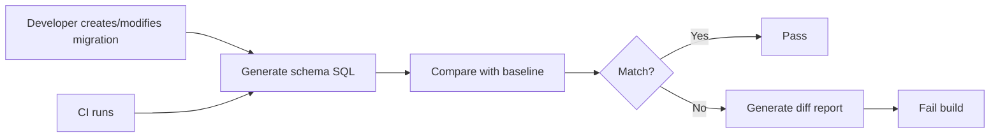
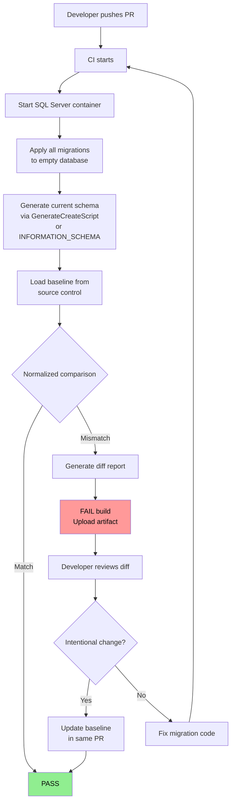

# 8.958 — Schema Snapshot Testing

---

## 1 — Core Concept — What and Why

Schema snapshot testing captures the expected database schema (tables, columns, types, constraints, indexes, defaults, foreign keys) at a point in time and stores it as a baseline in source control. On every CI run, the current schema is generated and compared to the baseline. Any difference fails the build.

This catches a class of bugs that integration tests miss:

- A developer runs a manual SQL script on their local database but forgets to create a migration
- An EF Core migration generates unexpected SQL (wrong column type, missing index, incorrect default constraint)
- A migration is edited after being reviewed and the final SQL is different from what was approved
- Two migrations apply in different orders in different environments, producing different final schemas
- A database project (.sqlproj) and EF Core migrations diverge because only one is updated

The schema snapshot acts as a single source of truth for what the database should look like. It is not a migration — it is the end state after all migrations have been applied.



**Key properties of a good schema snapshot:**
- It is stored as plain text (SQL or structured JSON) so it can be diffed in code review
- It is generated from the actual migration output, not from the developer's local database
- It is deterministic — running the same migrations always produces the same snapshot
- It covers the full schema: tables, columns, data types, nullability, defaults, primary keys, foreign keys, unique constraints, indexes, check constraints, triggers

---

## 2 — EF Core Schema Snapshot — GenerateCreateScript Approach

EF Core provides `Database.GenerateCreateScript()` which produces the full SQL script that would create the database schema from the current model. This script is deterministic for a given model snapshot.

```csharp
// SchemaSnapshotGenerator.cs — run this as a CLI tool or in CI
using Microsoft.EntityFrameworkCore;
using Microsoft.Data.SqlClient;

public class SchemaSnapshotGenerator
{
    private readonly string _connectionString;
    private readonly string _baselinePath;

    public SchemaSnapshotGenerator(string connectionString, string baselinePath)
    {
        _connectionString = connectionString;
        _baselinePath = baselinePath;
    }

    public async Task GenerateSnapshotAsync()
    {
        var options = new DbContextOptionsBuilder<AppDbContext>()
            .UseSqlServer(_connectionString)
            .Options;

        await using var context = new AppDbContext(options);

        // Apply all pending migrations to a clean database
        // This ensures the snapshot reflects the actual migration output
        await context.Database.EnsureDeletedAsync();
        await context.Database.MigrateAsync();

        // Generate the full create script
        var script = context.Database.GenerateCreateScript();

        // Normalize line endings and whitespace for consistent comparison
        script = NormalizeScript(script);

        // Write to baseline file
        await File.WriteAllTextAsync(_baselinePath, script);
    }

    private static string NormalizeScript(string script)
    {
        return script
            .Replace("\r\n", "\n")
            .Replace("\r", "\n")
            .Trim();
    }

    public async Task<bool> CompareWithBaselineAsync()
    {
        if (!File.Exists(_baselinePath))
        {
            Console.Error.WriteLine("Baseline file not found. Generate it first.");
            return false;
        }

        var baseline = NormalizeScript(await File.ReadAllTextAsync(_baselinePath));

        var options = new DbContextOptionsBuilder<AppDbContext>()
            .UseSqlServer(_connectionString)
            .Options;

        await using var context = new AppDbContext(options);
        await context.Database.EnsureDeletedAsync();
        await context.Database.MigrateAsync();
        var current = NormalizeScript(context.Database.GenerateCreateScript());

        if (baseline == current)
        {
            Console.WriteLine("Schema snapshot matches baseline.");
            return true;
        }

        // Generate diff
        var diffPath = Path.ChangeExtension(_baselinePath, ".diff.sql");
        await File.WriteAllTextAsync(diffPath, current);
        Console.Error.WriteLine($"Schema mismatch. Current schema written to {diffPath}");

        // Show line-by-line diff (basic)
        var baselineLines = baseline.Split('\n');
        var currentLines = current.Split('\n');
        for (int i = 0; i < Math.Max(baselineLines.Length, currentLines.Length); i++)
        {
            if (i >= baselineLines.Length)
                Console.Error.WriteLine($"+ Line {i + 1}: {currentLines[i]}");
            else if (i >= currentLines.Length)
                Console.Error.WriteLine($"- Line {i + 1}: {baselineLines[i]}");
            else if (baselineLines[i] != currentLines[i])
            {
                Console.Error.WriteLine($"- Line {i + 1}: {baselineLines[i]}");
                Console.Error.WriteLine($"+ Line {i + 1}: {currentLines[i]}");
            }
        }

        return false;
    }
}
```

```csharp
// Integration test that verifies all migrations produce a consistent schema
public class SchemaSnapshotTests
{
    private const string ConnectionString = "Server=.;Database=SchemaTestDb;Trusted_Connection=True;";
    private const string BaselinePath = "../../../SchemaBaseline.sql";

    [Fact]
    public async Task AllMigrations_ShouldProduceExpectedSchema()
    {
        var generator = new SchemaSnapshotGenerator(ConnectionString, BaselinePath);

        // If baseline does not exist, generate it (for initial setup)
        if (!File.Exists(BaselinePath))
        {
            await generator.GenerateSnapshotAsync();
            return;
        }

        var match = await generator.CompareWithBaselineAsync();
        Assert.True(match, "Schema snapshot does not match baseline. Review the diff.");
    }
}
```

**EF Core considerations for schema snapshots:**
- `GenerateCreateScript()` produces the schema for the *current* model, not for a specific migration. If you have multiple migrations, the script represents the final state after all are applied.
- The generated script includes everything EF Core knows about: tables, indexes, foreign keys, sequences, etc. It does NOT include stored procedures, views, functions, or triggers that are not part of the EF Core model.
- EF Core generates different SQL for different providers (SqlServer, PostgreSQL, SQLite). The snapshot must be regenerated for each provider your application supports.
- The script includes `IF NOT EXISTS` checks and other safety guards. The baseline should be the raw output, not the cleaned-up version, so the comparison is meaningful.

---

## 3 — Dapper Schema Snapshot — INFORMATION_SCHEMA Queries

For projects that use Dapper (or raw ADO.NET), there is no built-in `GenerateCreateScript()`. Instead, query `INFORMATION_SCHEMA` views to capture the schema definition programmatically. This produces a structured representation that can be compared with the baseline.

```csharp
// SchemaSnapshot.cs — DTO for captured schema
public class SchemaSnapshot
{
    public List<TableInfo> Tables { get; set; } = new();
    public List<ColumnInfo> Columns { get; set; } = new();
    public List<IndexInfo> Indexes { get; set; } = new();
    public List<ForeignKeyInfo> ForeignKeys { get; set; } = new();
    public List<ConstraintInfo> Constraints { get; set; } = new();
}

public class TableInfo
{
    public string Schema { get; set; }
    public string TableName { get; set; }
    public string Type { get; set; } // BASE TABLE or VIEW
}

public class ColumnInfo
{
    public string Schema { get; set; }
    public string TableName { get; set; }
    public string ColumnName { get; set; }
    public int OrdinalPosition { get; set; }
    public string DataType { get; set; }
    public int? MaxLength { get; set; }
    public bool IsNullable { get; set; }
    public string DefaultValue { get; set; }
    public bool IsIdentity { get; set; }
}

public class IndexInfo
{
    public string Schema { get; set; }
    public string TableName { get; set; }
    public string IndexName { get; set; }
    public bool IsPrimaryKey { get; set; }
    public bool IsUnique { get; set; }
    public string ColumnNames { get; set; }
    public int KeyOrdinal { get; set; }
    public bool IsDescending { get; set; }
    public string FilterDefinition { get; set; }
}

public class ForeignKeyInfo
{
    public string ConstraintName { get; set; }
    public string SourceSchema { get; set; }
    public string SourceTable { get; set; }
    public string SourceColumn { get; set; }
    public string TargetSchema { get; set; }
    public string TargetTable { get; set; }
    public string TargetColumn { get; set; }
    public int Ordinal { get; set; }
}

public class ConstraintInfo
{
    public string Schema { get; set; }
    public string TableName { get; set; }
    public string ConstraintName { get; set; }
    public string ConstraintType { get; set; } // PRIMARY KEY, FOREIGN KEY, UNIQUE, CHECK, DEFAULT
    public string Definition { get; set; }
}
```

```csharp
// DapperSchemaSnapshotService.cs — captures schema using INFORMATION_SCHEMA
using Dapper;
using System.Data;
using System.Text.Json;
using System.Security.Cryptography;
using System.Text;

public class DapperSchemaSnapshotService
{
    private readonly string _connectionString;

    public DapperSchemaSnapshotService(string connectionString)
    {
        _connectionString = connectionString;
    }

    public async Task<SchemaSnapshot> CaptureSchemaAsync()
    {
        await using var connection = new SqlConnection(_connectionString);
        await connection.OpenAsync();

        var snapshot = new SchemaSnapshot();

        // 1. Tables
        const string tableQuery = @"
            SELECT
                TABLE_SCHEMA AS [Schema],
                TABLE_NAME AS TableName,
                TABLE_TYPE AS [Type]
            FROM INFORMATION_SCHEMA.TABLES
            WHERE TABLE_TYPE IN ('BASE TABLE', 'VIEW')
              AND TABLE_SCHEMA NOT IN ('sys', 'INFORMATION_SCHEMA')
            ORDER BY TABLE_SCHEMA, TABLE_NAME";

        snapshot.Tables = (await connection.QueryAsync<TableInfo>(tableQuery)).AsList();

        // 2. Columns with extended properties (identity, computed)
        const string columnQuery = @"
            SELECT
                c.TABLE_SCHEMA AS [Schema],
                c.TABLE_NAME AS TableName,
                c.COLUMN_NAME AS ColumnName,
                c.ORDINAL_POSITION AS OrdinalPosition,
                c.DATA_TYPE AS DataType,
                c.CHARACTER_MAXIMUM_LENGTH AS MaxLength,
                CASE WHEN c.IS_NULLABLE = 'YES' THEN 1 ELSE 0 END AS IsNullable,
                ISNULL(c.COLUMN_DEFAULT, '') AS DefaultValue,
                CASE WHEN COLUMNPROPERTY(OBJECT_ID(c.TABLE_SCHEMA + '.' + c.TABLE_NAME), c.COLUMN_NAME, 'IsIdentity') = 1
                    THEN 1 ELSE 0 END AS IsIdentity
            FROM INFORMATION_SCHEMA.COLUMNS c
            INNER JOIN INFORMATION_SCHEMA.TABLES t
                ON c.TABLE_SCHEMA = t.TABLE_SCHEMA AND c.TABLE_NAME = t.TABLE_NAME
            WHERE t.TABLE_TYPE = 'BASE TABLE'
              AND c.TABLE_SCHEMA NOT IN ('sys', 'INFORMATION_SCHEMA')
            ORDER BY c.TABLE_SCHEMA, c.TABLE_NAME, c.ORDINAL_POSITION";

        snapshot.Columns = (await connection.QueryAsync<ColumnInfo>(columnQuery)).AsList();

        // 3. Indexes (including primary key and unique constraints)
        const string indexQuery = @"
            SELECT
                SCH.name AS [Schema],
                TBL.name AS TableName,
                IDX.name AS IndexName,
                IDX.is_primary_key AS IsPrimaryKey,
                IDX.is_unique AS IsUnique,
                COL.name AS ColumnNames,
                IC.key_ordinal AS KeyOrdinal,
                IC.is_descending_key AS IsDescending,
                ISNULL(IDX.filter_definition, '') AS FilterDefinition
            FROM sys.indexes IDX
            INNER JOIN sys.tables TBL ON IDX.object_id = TBL.object_id
            INNER JOIN sys.schemas SCH ON TBL.schema_id = SCH.schema_id
            INNER JOIN sys.index_columns IC ON IDX.object_id = IC.object_id AND IDX.index_id = IC.index_id
            INNER JOIN sys.columns COL ON IC.object_id = COL.object_id AND IC.column_id = COL.column_id
            WHERE IDX.type > 0 -- exclude heap
            ORDER BY SCH.name, TBL.name, IDX.name, IC.key_ordinal";

        snapshot.Indexes = (await connection.QueryAsync<IndexInfo>(indexQuery)).AsList();

        // 4. Foreign keys
        const string fkQuery = @"
            SELECT
                fk.name AS ConstraintName,
                s1.name AS SourceSchema,
                t1.name AS SourceTable,
                c1.name AS SourceColumn,
                s2.name AS TargetSchema,
                t2.name AS TargetTable,
                c2.name AS TargetColumn,
                fkc.constraint_column_id AS Ordinal
            FROM sys.foreign_keys fk
            INNER JOIN sys.foreign_key_columns fkc ON fk.object_id = fkc.constraint_object_id
            INNER JOIN sys.tables t1 ON fkc.parent_object_id = t1.object_id
            INNER JOIN sys.schemas s1 ON t1.schema_id = s1.schema_id
            INNER JOIN sys.columns c1 ON fkc.parent_object_id = c1.object_id AND fkc.parent_column_id = c1.column_id
            INNER JOIN sys.tables t2 ON fkc.referenced_object_id = t2.object_id
            INNER JOIN sys.schemas s2 ON t2.schema_id = s2.schema_id
            INNER JOIN sys.columns c2 ON fkc.referenced_object_id = c2.object_id AND fkc.referenced_column_id = c2.column_id
            ORDER BY fk.name, fkc.constraint_column_id";

        snapshot.ForeignKeys = (await connection.QueryAsync<ForeignKeyInfo>(fkQuery)).AsList();

        // 5. Other constraints (CHECK, DEFAULT)
        const string constraintQuery = @"
            SELECT
                SCH.name AS [Schema],
                TBL.name AS TableName,
                CC.name AS ConstraintName,
                CC.type_desc AS ConstraintType,
                CC.definition AS Definition
            FROM sys.check_constraints CC
            INNER JOIN sys.tables TBL ON CC.parent_object_id = TBL.object_id
            INNER JOIN sys.schemas SCH ON TBL.schema_id = SCH.schema_id
            UNION ALL
            SELECT
                SCH.name,
                TBL.name,
                DC.name,
                'DEFAULT_CONSTRAINT',
                DC.definition
            FROM sys.default_constraints DC
            INNER JOIN sys.tables TBL ON DC.parent_object_id = TBL.object_id
            INNER JOIN sys.schemas SCH ON TBL.schema_id = SCH.schema_id
            ORDER BY [Schema], TableName, ConstraintName";

        snapshot.Constraints = (await connection.QueryAsync<ConstraintInfo>(constraintQuery)).AsList();

        return snapshot;
    }

    public string SnapshotToHash(SchemaSnapshot snapshot)
    {
        var normalized = JsonSerializer.Serialize(snapshot, new JsonSerializerOptions
        {
            WriteIndented = true,
            PropertyNamingPolicy = JsonNamingPolicy.CamelCase
        });
        var bytes = SHA256.HashData(Encoding.UTF8.GetBytes(normalized));
        return Convert.ToHexString(bytes).ToLowerInvariant();
    }

    public async Task SaveSnapshotAsync(SchemaSnapshot snapshot, string filePath)
    {
        var json = JsonSerializer.Serialize(snapshot, new JsonSerializerOptions
        {
            WriteIndented = true,
            PropertyNamingPolicy = JsonNamingPolicy.CamelCase
        });
        await File.WriteAllTextAsync(filePath, json);
    }

    public async Task<SchemaSnapshot> LoadSnapshotAsync(string filePath)
    {
        var json = await File.ReadAllTextAsync(filePath);
        return JsonSerializer.Deserialize<SchemaSnapshot>(json, new JsonSerializerOptions
        {
            PropertyNamingPolicy = JsonNamingPolicy.CamelCase
        });
    }

    public bool CompareSnapshots(SchemaSnapshot baseline, SchemaSnapshot current, out List<string> diffs)
    {
        diffs = new List<string>();

        // Compare tables
        var baselineTables = baseline.Tables.Select(t => $"{t.Schema}.{t.TableName}").OrderBy(x => x).ToList();
        var currentTables = current.Tables.Select(t => $"{t.Schema}.{t.TableName}").OrderBy(x => x).ToList();
        var addedTables = currentTables.Except(baselineTables).ToList();
        var removedTables = baselineTables.Except(currentTables).ToList();
        foreach (var t in addedTables) diffs.Add($"+ TABLE {t}");
        foreach (var t in removedTables) diffs.Add($"- TABLE {t}");

        // Compare columns (group by table)
        var baselineCols = baseline.Columns.GroupBy(c => $"{c.Schema}.{c.TableName}")
            .ToDictionary(g => g.Key, g => g.ToList());
        var currentCols = current.Columns.GroupBy(c => $"{c.Schema}.{c.TableName}")
            .ToDictionary(g => g.Key, g => g.ToList());

        foreach (var kvp in currentCols)
        {
            if (!baselineCols.ContainsKey(kvp.Key))
            {
                foreach (var col in kvp.Value)
                    diffs.Add($"+ {kvp.Key}.{col.ColumnName} ({col.DataType})");
                continue;
            }

            var bCols = baselineCols[kvp.Key].ToDictionary(c => c.ColumnName);
            var cCols = kvp.Value.ToDictionary(c => c.ColumnName);

            var added = cCols.Keys.Except(bCols.Keys).ToList();
            var removed = bCols.Keys.Except(cCols.Keys).ToList();
            foreach (var col in added) diffs.Add($"+ COLUMN {kvp.Key}.{col}");
            foreach (var col in removed) diffs.Add($"- COLUMN {kvp.Key}.{col}");

            foreach (var colName in cCols.Keys.Intersect(bCols.Keys))
            {
                var b = bCols[colName];
                var c = cCols[colName];
                if (b.DataType != c.DataType || b.MaxLength != c.MaxLength || b.IsNullable != c.IsNullable)
                {
                    diffs.Add($"~ {kvp.Key}.{colName}: ({b.DataType},{b.MaxLength},{b.IsNullable}) -> ({c.DataType},{c.MaxLength},{c.IsNullable})");
                }
            }
        }

        // Compare indexes (by name)
        var baselineIdx = baseline.Indexes.GroupBy(i => i.IndexName)
            .ToDictionary(g => g.Key, g => g.OrderBy(i => i.KeyOrdinal).ToList());
        var currentIdx = current.Indexes.GroupBy(i => i.IndexName)
            .ToDictionary(g => g.Key, g => g.OrderBy(i => i.KeyOrdinal).ToList());

        foreach (var kvp in currentIdx)
        {
            if (!baselineIdx.ContainsKey(kvp.Key))
            {
                diffs.Add($"+ INDEX {kvp.Key} on {kvp.Value[0].TableName} ({string.Join(",", kvp.Value.Select(i => i.ColumnNames))})");
            }
        }
        foreach (var kvp in baselineIdx)
        {
            if (!currentIdx.ContainsKey(kvp.Key))
            {
                diffs.Add($"- INDEX {kvp.Key} on {kvp.Value[0].TableName}");
            }
        }

        // Compare foreign keys
        var baselineFk = baseline.ForeignKeys.Select(f => f.ConstraintName).OrderBy(x => x).ToList();
        var currentFk = current.ForeignKeys.Select(f => f.ConstraintName).OrderBy(x => x).ToList();
        foreach (var fk in currentFk.Except(baselineFk)) diffs.Add($"+ FK {fk}");
        foreach (var fk in baselineFk.Except(currentFk)) diffs.Add($"- FK {fk}");

        return diffs.Count == 0;
    }
}
```

```csharp
// Test using Dapper schema snapshot
public class DapperSchemaSnapshotTests
{
    private const string ConnectionString = "Server=.;Database=AppDb;Trusted_Connection=True;";
    private const string BaselineFile = "../../../SchemaBaseline.json";

    [Fact]
    public async Task DatabaseSchema_ShouldMatchBaseline()
    {
        var service = new DapperSchemaSnapshotService(ConnectionString);

        var current = await service.CaptureSchemaAsync();

        if (!File.Exists(BaselineFile))
        {
            await service.SaveSnapshotAsync(current, BaselineFile);
            return; // First run, baseline created
        }

        var baseline = await service.LoadSnapshotAsync(BaselineFile);
        var match = service.CompareSnapshots(baseline, current, out var diffs);

        if (!match)
        {
            foreach (var diff in diffs)
                Console.Error.WriteLine(diff);
        }

        Assert.True(match, $"Schema mismatch. {diffs.Count} differences found.");
    }
}
```

---

## 4 — Baseline Management Strategy

The baseline file is the source of truth for the expected schema. It must be managed carefully to remain useful.

**Where to store the baseline:**
- Keep the baseline file in the same repository as the application code, in a `schema/` or `tests/Snapshots/` directory
- Include it in code reviews — any PR that changes migrations should update the baseline
- The baseline is a text file (SQL or JSON) that produces meaningful diffs in pull requests

**When to regenerate the baseline:**
- When a new migration is intentionally added and approved
- After a code review that modifies a migration
- When changing database providers (e.g., SQL Server to PostgreSQL)
- Never regenerate the baseline to "fix" a failing test — investigate why the schema changed first

**Automated baseline updates:**
In CI, if the schema snapshot test fails, generate the diff and attach it as a build artifact. A human must review the diff and decide whether to update the baseline or fix the schema.

```yaml
# .github/workflows/schema-snapshot.yml
name: Schema Snapshot Check
on: [pull_request]
jobs:
  schema-check:
    runs-on: ubuntu-latest
    services:
      sqlserver:
        image: mcr.microsoft.com/mssql/server:2022-latest
        env:
          SA_PASSWORD: "Your_password123!"
          ACCEPT_EULA: "Y"
          MSSQL_PID: "Developer"
        ports:
          - 1433:1433
    steps:
      - uses: actions/checkout@v4
      - uses: actions/setup-dotnet@v4
        with:
          dotnet-version: "8.0.x"
      - run: dotnet build
      - run: dotnet test --filter "SchemaSnapshot"
        env:
          ConnectionStrings__SchemaTest: "Server=localhost;Database=SchemaTest;User Id=sa;Password=Your_password123!;TrustServerCertificate=True;"
      - name: Upload schema diff artifact
        if: failure()
        uses: actions/upload-artifact@v4
        with:
          name: schema-diff
          path: "**/*.diff.sql"
```

---

## 5 — CI Pipeline Integration

Schema snapshot testing integrates into the CI pipeline at two points:

1. **On every PR (fast check):** Spin up a fresh SQL Server container, apply all migrations, generate the schema, compare to baseline. Fail if mismatch. This catches schema drift early.

2. **On merge to main (full check):** Same as PR check, but also validate that the schema can be deployed from scratch (empty database → all migrations applied → expected schema). This catches ordering issues and missing migrations.

```csharp
// CI integration script that runs schema snapshot check
// Program.cs — standalone CLI tool
public static class SchemaCheckProgram
{
    public static async Task<int> Main(string[] args)
    {
        var connectionString = args.Length > 0
            ? args[0]
            : Environment.GetEnvironmentVariable("CONNECTION_STRING");

        var baselinePath = args.Length > 1
            ? args[1]
            : "SchemaBaseline.sql";

        if (string.IsNullOrEmpty(connectionString))
        {
            Console.Error.WriteLine("Connection string required.");
            return 1;
        }

        var generator = new SchemaSnapshotGenerator(connectionString, baselinePath);

        Console.WriteLine("Checking schema snapshot...");
        var match = await generator.CompareWithBaselineAsync();

        if (match)
        {
            Console.WriteLine("Schema snapshot matches baseline.");
            return 0;
        }

        Console.Error.WriteLine("ERROR: Schema snapshot does not match baseline.");
        Console.Error.WriteLine("Review the diff and either:");
        Console.Error.WriteLine("  1. Fix the schema changes to match the baseline");
        Console.Error.WriteLine("  2. Update the baseline if the changes are intentional");
        return 1;
    }
}
```

**CI script for schema check:**
```bash
# Start SQL Server container
docker run -d --name sqlserver \
  -e "ACCEPT_EULA=Y" -e "SA_PASSWORD=Your_password123!" \
  -p 1433:1433 \
  mcr.microsoft.com/mssql/server:2022-latest

# Wait for SQL Server to be ready
until docker exec sqlserver /opt/mssql-tools/bin/sqlcmd -S localhost -U sa -P "Your_password123!" -Q "SELECT 1" > /dev/null 2>&1; do
  sleep 2
done

# Run schema snapshot check
dotnet run --project tools/SchemaChecker \
  "Server=localhost;Database=SchemaCheck;User Id=sa;Password=Your_password123!;TrustServerCertificate=True;" \
  "schema/SchemaBaseline.sql"
```

---

## 6 — Schema Comparison Libraries and Tools

Several libraries can help with schema comparison beyond raw SQL string matching:

### DbUp
DbUp is a .NET migration library that includes schema comparison via `DbUp.Builder.UpgradeEngine`. It can compare the current database state to expected scripts.

```csharp
// DbUp-based schema comparison
using DbUp;
using DbUp.Engine;

public class DbUpSchemaComparer
{
    public bool CompareSchema(string connectionString, string scriptsPath)
    {
        var upgradeEngine = DeployChanges.To
            .SqlDatabase(connectionString)
            .WithScriptsFromFileSystem(scriptsPath)
            .WithTransaction()
            .LogToConsole()
            .Build();

        var result = upgradeEngine.TryConnect();
        if (!result.Successful)
        {
            Console.Error.WriteLine($"Cannot connect: {result.Error}");
            return false;
        }

        // DbUp's Journal stores which scripts have been run
        // The schema is "up to date" if all scripts in the scriptsPath
        // have been recorded in the journal
        var scripts = upgradeEngine.GetDiscoveredScripts();
        var journal = upgradeEngine.GetJournal();
        var executedScripts = journal.GetExecutedScripts();

        var missing = scripts
            .Select(s => s.Name)
            .Except(executedScripts, StringComparer.OrdinalIgnoreCase)
            .ToList();

        if (missing.Count == 0)
        {
            Console.WriteLine("All migration scripts have been applied.");
            return true;
        }

        Console.Error.WriteLine($"Missing scripts: {string.Join(", ", missing)}");
        return false;
    }
}
```

### Custom INFORMATION_SCHEMA comparison
The Dapper-based approach in section 3 is the most flexible — it lets you define exactly what constitutes the "schema" and ignore differences you do not care about (auto-generated names, index ordering, etc.).

### SQL Compare (Redgate)
For enterprise environments, Redgate SQL Compare provides command-line schema comparison:
```bash
# Command-line schema comparison
SQLCompare /Server1:localhost /Database1:BaselineDb /Server2:localhost /Database2:CurrentDb /Report:SchemaDiff.html /ReportType:HTML
```

### Custom SQL script comparison
A simpler approach: generate a single SQL script and use a diff tool:
```bash
# Generate schema scripts and diff
dotnet ef migrations script -o current.sql
diff baseline.sql current.sql
```

---

## 7 — Mermaid — CI Pipeline Flowchart



---

## 8 — Production Guidance

### Do's

1. **Store baseline in source control.** The baseline file should be in the same repository as the application code. It must be part of the code review process.

2. **Regenerate baseline after intentional migrations.** When a migration is reviewed and approved, regenerate the baseline as part of the same PR. The reviewer can see both the migration code and the schema diff.

3. **Run in CI on every PR.** Schema drift is easiest to fix when it is caught immediately. A PR that modifies the schema should update the baseline in the same PR.

4. **Cover indexes and constraints.** Many teams only check tables and columns, but indexes and foreign key constraints are equally important. A missing index causes performance regressions; a missing FK constraint allows data corruption.

5. **Normalize before comparing.** Line endings, whitespace, and case differences can produce false positives. Normalize both baseline and current output before comparison.

6. **Test against the same database provider as production.** EF Core generates different SQL for SQL Server vs PostgreSQL. The baseline must be generated with the correct provider.

7. **Include a schema snapshot test in the test project.** Make it a skipped test by default (using `[Fact(Skip = "Run manually or in CI")]`) so it does not slow down local development but can be enabled in CI.

### Don'ts

1. **Do not regenerate baseline to make CI pass.** If the schema snapshot test fails, investigate why. Someone may have introduced an unintended change.

2. **Do not ignore auto-generated constraint names.** EF Core generates constraint names like `PK__Users__3214EC27A1B2C3D4`. These change every time the migration is regenerated. Normalize them away or use structural comparison instead of string comparison.

3. **Do not compare raw SQL strings for schema snapshots.** Use structured comparison (INFORMATION_SCHEMA data compared field by field) or normalized SQL. Direct string comparison of `GenerateCreateScript()` output is fragile.

4. **Do not store baseline in the database.** The baseline must be versioned alongside code, not in the database. Otherwise, you cannot diff it in code reviews.

5. **Do not forget to ignore system tables.** Schema snapshots should exclude `sys`, `INFORMATION_SCHEMA`, and `__EFMigrationsHistory` tables.

---

## 9 — Gotchas

1. **Database version differences produce false positives.** If the CI database is SQL Server 2019 and the baseline was generated on SQL Server 2022, there will be differences in default collation, timestamp types, and indexing options. Ensure the CI database version matches the baseline generation environment.

2. **Column and index ordering is non-deterministic.** `INFORMATION_SCHEMA.COLUMNS` returns columns in the order they were added, but if a migration adds a column in the middle, the ordinal positions shift. Compare by column name, not ordinal position. Similarly, index key columns can be returned in any order by some queries — always order explicitly.

3. **Auto-generated constraint names change every run.** EF Core generates names like `PK__Users__3214EC27A1B2C3D4` and `DF__Users__CreatedAt__3B75D760`. These contain hex hashes that change when the migration script is regenerated. Normalize them: replace auto-generated names with a placeholder or compare constraint columns rather than constraint names.

4. **EF Core generates different scripts per provider.** A model that uses `UseSqlServer()` will produce different SQL than the same model with `UseNpgsql()`. If your application supports multiple providers, maintain separate baselines or use a provider-agnostic comparison format (INFORMATION_SCHEMA-based comparison works across providers).

5. **Views, stored procedures, and functions are not captured by EF Core's GenerateCreateScript.** EF Core only knows about tables and relationships defined in the model. If your database includes views or stored procedures, supplement the snapshot with custom queries that capture their definitions.

6. **Case sensitivity of object names.** SQL Server is case-insensitive by default, but PostgreSQL is case-sensitive. When comparing schema snapshots across environments, normalize object names to a consistent case (usually lowercase).

7. **Temporal tables and other advanced features.** EF Core's `GenerateCreateScript()` may not fully represent temporal tables, full-text indexes, or other SQL Server-specific features. If you use these, extend the schema capture to include them explicitly.

8. **Schema comparison ignores permissions.** Schema snapshot testing covers structure only. It does not capture users, roles, permissions, or server-level configuration. These require separate testing.

9. **Large schemas produce large baseline files.** A database with 100+ tables produces a multi-megabyte baseline file. This is fine for automated comparison but can be unwieldy in code reviews. Consider generating separate baseline files per schema area (e.g., `Baseline_Sales.sql`, `Baseline_Inventory.sql`).

10. **Race conditions in CI database setup.** If multiple CI jobs share the same SQL Server instance (e.g., in a container), they may interfere with each other when creating and dropping the test database. Use unique database names per CI job: `SchemaCheck_{BuildId}`.

---

## References

- [[8.952 — Testing Migrations — Validation Approach]] — How to validate that migrations apply correctly
- [[8.836 — EF Core Migrations — How They Work]] — EF Core migration internals
- [[8.959 — Database Contract Testing — Schema Compatibility]] — Schema compatibility testing
- [[8.826 — Schema Migration Strategies]] — Broader schema migration patterns
- [[8.957 — Test Database Isolation — Per-Test vs Per-Suite]] — Isolation strategies for schema tests
- [[8.944 — TestContainers — SQL Server in Docker]] — Running containers for CI testing
