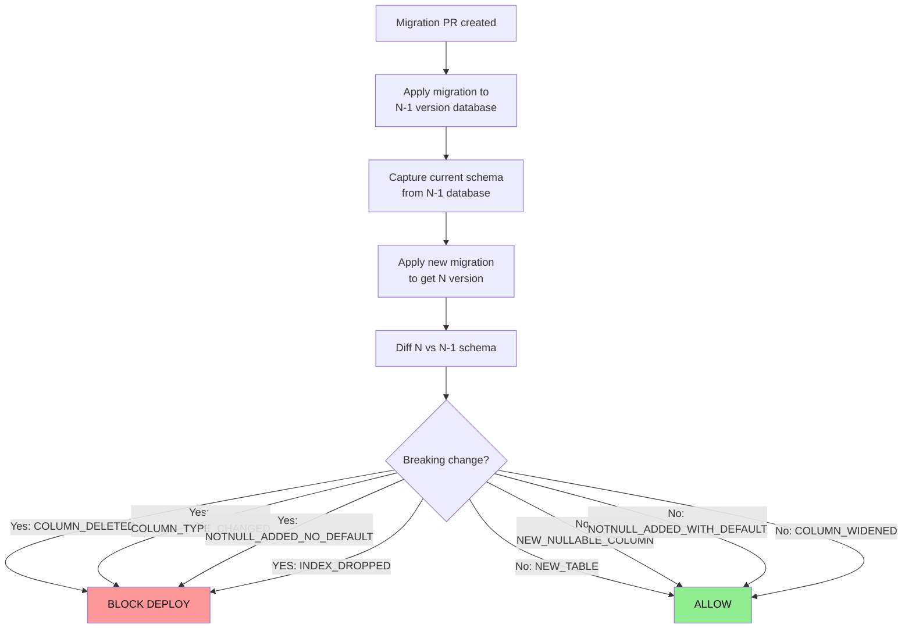
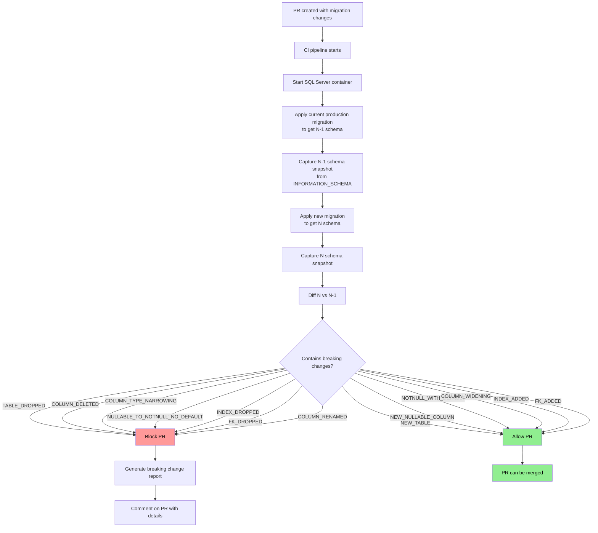

# 8.959 — Database Contract Testing — Schema Compatibility

---

## 1 — Core Concept — What Is a Database Contract

A database contract is an implicit agreement between the database schema and all consumers (applications, services, reports, ETL jobs) that the schema will remain backward-compatible. Contract testing validates that schema changes introduced in a migration do not break existing queries or application code.

The contract covers:

- **Column existence and data types:** Columns that exist today will still exist tomorrow, with the same or a wider type
- **Nullability:** Columns that were nullable will not become NOT NULL without a default
- **Constraint names:** Indexes and constraints referenced by name will not be removed without coordination
- **Table existence:** Tables and views will not be dropped without a deprecation period
- **Semantic stability:** A column named `TotalAmount` will not be renamed to `Total` without a migration period

Contract testing is distinct from schema snapshot testing ([[8.958]]). Schema snapshot testing checks that the schema is *exactly* what is expected. Contract testing checks that the schema change is *safe* — i.e., it does not break existing consumers.



The core rule: **a production database deployment must never break running code.** Contract tests enforce this by comparing schema versions and flagging risky changes before they reach production.

---

## 2 — Breaking vs Non-Breaking Change Rules

The following table defines the contract rules for safe and unsafe schema changes. These rules should be agreed upon by the entire engineering team and automated in CI.

| Change Type | Severity | Rationale | Auto-Detectable? |
|------------|----------|-----------|------------------|
| `TABLE_DROPPED` | BREAKING | Queries referencing the table will fail | Yes |
| `TABLE_RENAMED` | BREAKING | Queries using old name will fail | Partial (heuristic) |
| `COLUMN_DELETED` | BREAKING | `SELECT *` and explicit column references break | Yes |
| `COLUMN_RENAMED` | BREAKING | Queries reference old column name | Heuristic (column_id diff) |
| `COLUMN_TYPE_CHANGED_NARROWING` | BREAKING | Data truncation or conversion errors | Yes |
| `COLUMN_TYPE_CHANGED_WIDENING` | SAFE | Existing data fits in wider type | Yes |
| `NULLABLE_TO_NOTNULL_NO_DEFAULT` | BREAKING | Existing rows violate NOT NULL on insert | Yes |
| `NULLABLE_TO_NOTNULL_WITH_DEFAULT` | SAFE | Existing rows get default value | Yes |
| `NEW_NULLABLE_COLUMN` | SAFE | Existing queries ignore it | Yes |
| `NEW_NOTNULL_COLUMN_WITH_DEFAULT` | SAFE | Existing queries ignore it | Yes |
| `NEW_TABLE` | SAFE | Does not affect existing queries | Yes |
| `INDEX_ADDED` | SAFE | Performance improvement, no breaking change | Yes |
| `INDEX_DROPPED` | BREAKING | Queries relying on index may slow down | Yes (needs verification) |
| `FK_ADDED` | SAFE | Prevents invalid data but may block deletes | Yes |
| `FK_DROPPED` | BREAKING | Data integrity weakened | Yes |
| `DEFAULT_ADDED` | SAFE | New rows get default; old rows unaffected | Yes |
| `DEFAULT_CHANGED` | SAFE | Only affects new rows | Yes |
| `DEFAULT_REMOVED` | BREAKING | Existing code may rely on auto-generated values | Yes |

**Edge cases to watch:**

- `COLUMN_TYPE_CHANGED_WIDENING` from `INT` to `BIGINT` is safe. From `NVARCHAR(50)` to `NVARCHAR(100)` is safe. From `NVARCHAR(100)` to `NVARCHAR(50)` is BREAKING.
- `NULLABLE_TO_NOTNULL_WITH_DEFAULT` is safe only if the default is a constant (not a function like `NEWID()`) and if the application does not insert explicit NULLs.
- `INDEX_DROPPED` is breaking only if the index is actually used. A truly unused index can be dropped safely, but proving it is unused requires monitoring data.
- `TABLE_RENAMED` is always breaking in practice, but cannot be reliably auto-detected. A heuristic: if a table is dropped and a new table with a different name has the same columns, it might be a rename.

---

## 3 — EF Core Contract Check — Breaking Change Detection

EF Core migrations include a model snapshot (`YourDbContextModelSnapshot.cs`) that represents the final state of the model. By comparing the snapshot from the current migration with the previous migration, we can detect breaking changes.

```csharp
// ContractValidator.cs — detects breaking changes between EF Core model versions
using Microsoft.EntityFrameworkCore;
using Microsoft.EntityFrameworkCore.Infrastructure;
using Microsoft.EntityFrameworkCore.Metadata;
using System.Reflection;

public class ContractValidator
{
    private readonly string _connectionString;
    private readonly string _previousSnapshotPath;
    private readonly string _currentSnapshotPath;

    public ContractValidator(string connectionString, string previousSnapshotPath, string currentSnapshotPath)
    {
        _connectionString = connectionString;
        _previousSnapshotPath = previousSnapshotPath;
        _currentSnapshotPath = currentSnapshotPath;
    }

    public List<BreakingChange> DetectBreakingChanges()
    {
        var changes = new List<BreakingChange>();

        // Apply previous migration to database
        using var prevContext = CreateContextForSnapshot(_previousSnapshotPath);
        prevContext.Database.EnsureDeleted();
        prevContext.Database.Migrate(); // Migrate to previous version

        // Capture previous schema via INFORMATION_SCHEMA
        var prevSchema = CaptureSchema();

        // Apply current migration
        using var currentContext = CreateContextForSnapshot(_currentSnapshotPath);
        currentContext.Database.Migrate(); // Migrate to current version

        // Capture current schema
        var currentSchema = CaptureSchema();

        // Compare and detect breaking changes
        changes.AddRange(DetectDeletedTables(prevSchema, currentSchema));
        changes.AddRange(DetectDeletedColumns(prevSchema, currentSchema));
        changes.AddRange(DetectTypeChanges(prevSchema, currentSchema));
        changes.AddRange(DetectNullabilityChanges(prevSchema, currentSchema));
        changes.AddRange(DetectDroppedIndexes(prevSchema, currentSchema));
        changes.AddRange(DetectDroppedForeignKeys(prevSchema, currentSchema));

        return changes;
    }

    private List<BreakingChange> DetectDeletedTables(List<TableDef> prev, List<TableDef> current)
    {
        var changes = new List<BreakingChange>();
        var currentNames = current.Select(t => t.FullName).ToHashSet();
        foreach (var table in prev)
        {
            if (!currentNames.Contains(table.FullName))
            {
                changes.Add(new BreakingChange
                {
                    Type = ChangeType.TABLE_DROPPED,
                    ObjectName = table.FullName,
                    Description = $"Table {table.FullName} was removed."
                });
            }
        }
        return changes;
    }

    private List<BreakingChange> DetectDeletedColumns(List<TableDef> prev, List<TableDef> current)
    {
        var changes = new List<BreakingChange>();
        var currentCols = current
            .SelectMany(t => t.Columns.Select(c => new { t.FullName, c.Name }))
            .ToHashSet();

        foreach (var table in prev)
        {
            foreach (var col in table.Columns)
            {
                var key = new { table.FullName, col.Name };
                if (!currentCols.Contains(key))
                {
                    changes.Add(new BreakingChange
                    {
                        Type = ChangeType.COLUMN_DELETED,
                        ObjectName = $"{table.FullName}.{col.Name}",
                        Description = $"Column {table.FullName}.{col.Name} was removed."
                    });
                }
            }
        }
        return changes;
    }

    private List<BreakingChange> DetectTypeChanges(List<TableDef> prev, List<TableDef> current)
    {
        var changes = new List<BreakingChange>();
        var currentCols = current
            .SelectMany(t => t.Columns.Select(c => new { t.FullName, c.Name, c.DataType, c.MaxLength }))
            .ToLookup(x => $"{x.FullName}.{x.Name}");

        foreach (var table in prev)
        {
            foreach (var col in table.Columns)
            {
                var key = $"{table.FullName}.{col.Name}";
                var match = currentCols[key].FirstOrDefault();
                if (match == null) continue;

                // Check for narrowing type change
                if (!IsWideningTypeChange(col.DataType, col.MaxLength, match.DataType, match.MaxLength))
                {
                    changes.Add(new BreakingChange
                    {
                        Type = ChangeType.COLUMN_TYPE_CHANGED,
                        ObjectName = key,
                        Description = $"Column {key} type changed from {col.DataType}({col.MaxLength}) to {match.DataType}({match.MaxLength}) — may truncate data."
                    });
                }
            }
        }
        return changes;
    }

    private List<BreakingChange> DetectNullabilityChanges(List<TableDef> prev, List<TableDef> current)
    {
        var changes = new List<BreakingChange>();
        var currentCols = current
            .SelectMany(t => t.Columns.Select(c => new { t.FullName, c.Name, c.IsNullable, c.DefaultValue }))
            .ToLookup(x => $"{x.FullName}.{x.Name}");

        foreach (var table in prev)
        {
            foreach (var col in table.Columns)
            {
                var key = $"{table.FullName}.{col.Name}";
                var match = currentCols[key].FirstOrDefault();
                if (match == null) continue;

                // NULL → NOT NULL without a default is breaking
                if (col.IsNullable && !match.IsNullable && string.IsNullOrEmpty(match.DefaultValue))
                {
                    changes.Add(new BreakingChange
                    {
                        Type = ChangeType.NULLABLE_TO_NOTNULL_NO_DEFAULT,
                        ObjectName = key,
                        Description = $"Column {key} changed from NULL to NOT NULL without a default — existing NULL rows will cause errors."
                    });
                }
            }
        }
        return changes;
    }

    private List<BreakingChange> DetectDroppedIndexes(List<TableDef> prev, List<TableDef> current)
    {
        var changes = new List<BreakingChange>();
        var currentIdx = current
            .SelectMany(t => t.Indexes.Select(i => new { t.FullName, i.Name }))
            .ToHashSet();

        foreach (var table in prev)
        {
            foreach (var idx in table.Indexes)
            {
                var key = new { table.FullName, idx.Name };
                if (!currentIdx.Contains(key))
                {
                    changes.Add(new BreakingChange
                    {
                        Type = ChangeType.INDEX_DROPPED,
                        ObjectName = $"{table.FullName}.{idx.Name}",
                        Description = $"Index {idx.Name} on {table.FullName} was removed — query performance may degrade."
                    });
                }
            }
        }
        return changes;
    }

    private List<BreakingChange> DetectDroppedForeignKeys(List<TableDef> prev, List<TableDef> current)
    {
        var changes = new List<BreakingChange>();
        var currentFk = current
            .SelectMany(t => t.ForeignKeys.Select(fk => new { t.FullName, fk.Name }))
            .ToHashSet();

        foreach (var table in prev)
        {
            foreach (var fk in table.ForeignKeys)
            {
                var key = new { table.FullName, fk.Name };
                if (!currentFk.Contains(key))
                {
                    changes.Add(new BreakingChange
                    {
                        Type = ChangeType.FK_DROPPED,
                        ObjectName = $"{table.FullName}.{fk.Name}",
                        Description = $"Foreign key {fk.Name} on {table.FullName} was removed — referential integrity weakened."
                    });
                }
            }
        }
        return changes;
    }

    private static bool IsWideningTypeChange(string oldType, int? oldMax, string newType, int? newMax)
    {
        // Known widening conversions
        var widening = new Dictionary<string, string[]>(StringComparer.OrdinalIgnoreCase)
        {
            ["int"] = new[] { "bigint" },
            ["smallint"] = new[] { "int", "bigint" },
            ["tinyint"] = new[] { "smallint", "int", "bigint" },
            ["nvarchar"] = new[] { "nvarchar", "varchar", "nchar", "char" },
            ["varchar"] = new[] { "varchar", "char", "nvarchar", "nchar" },
            ["decimal"] = new[] { "decimal", "numeric" },
            ["numeric"] = new[] { "decimal", "numeric" },
            ["datetime"] = new[] { "datetime2" },
            ["float"] = new[] { "float" },
        };

        if (!widening.TryGetValue(oldType, out var allowedWidening))
            return false;

        if (!allowedWidening.Contains(newType, StringComparer.OrdinalIgnoreCase))
            return false;

        // For string types, check max length
        if (oldType is "nvarchar" or "varchar")
        {
            if (oldMax.HasValue && newMax.HasValue && newMax.Value < oldMax.Value)
                return false; // Narrowing max length
        }

        // For decimal, check precision/scale
        if (oldType is "decimal" or "numeric")
        {
            // Simplified: if old precision > new precision, it's narrowing
        }

        return true;
    }

    private List<TableDef> CaptureSchema()
    {
        // Uses INFORMATION_SCHEMA queries (same as Dapper section below)
        // Returns list of TableDef with columns, indexes, foreign keys
        throw new NotImplementedException("Use the Dapper-based schema capture from section 4");
    }

    private AppDbContext CreateContextForSnapshot(string snapshotPath)
    {
        var options = new DbContextOptionsBuilder<AppDbContext>()
            .UseSqlServer(_connectionString)
            .Options;

        return new AppDbContext(options);
    }
}

public class BreakingChange
{
    public ChangeType Type { get; set; }
    public string ObjectName { get; set; }
    public string Description { get; set; }
}

public enum ChangeType
{
    TABLE_DROPPED,
    COLUMN_DELETED,
    COLUMN_RENAMED,
    COLUMN_TYPE_CHANGED,
    NULLABLE_TO_NOTNULL_NO_DEFAULT,
    INDEX_DROPPED,
    FK_DROPPED,
    DEFAULT_REMOVED
}

public class TableDef
{
    public string Schema { get; set; }
    public string Name { get; set; }
    public string FullName => $"{Schema}.{Name}";
    public List<ColumnDef> Columns { get; set; } = new();
    public List<IndexDef> Indexes { get; set; } = new();
    public List<ForeignKeyDef> ForeignKeys { get; set; } = new();
}

public class ColumnDef
{
    public string Name { get; set; }
    public string DataType { get; set; }
    public int? MaxLength { get; set; }
    public bool IsNullable { get; set; }
    public string DefaultValue { get; set; }
}

public class IndexDef
{
    public string Name { get; set; }
    public List<string> Columns { get; set; } = new();
    public bool IsUnique { get; set; }
}

public class ForeignKeyDef
{
    public string Name { get; set; }
    public string ReferencedTable { get; set; }
    public List<string> Columns { get; set; } = new();
}
```

```csharp
// EF Core contract test — run in CI
public class ContractCompatibilityTests
{
    private const string ConnectionString = "Server=localhost;Database=ContractTest;User Id=sa;Password=Your_password123!;TrustServerCertificate=True;";

    [Fact]
    public async Task NewMigration_ShouldNotContainBreakingChanges()
    {
        var previousSnapshot = "../../../Migrations/AppDbContextModelSnapshot.1.cs";
        var currentSnapshot = "../../../Migrations/AppDbContextModelSnapshot.cs";

        var validator = new ContractValidator(ConnectionString, previousSnapshot, currentSnapshot);
        var breakingChanges = validator.DetectBreakingChanges();

        if (breakingChanges.Any())
        {
            foreach (var change in breakingChanges)
            {
                Console.Error.WriteLine($"BREAKING: {change.Type} — {change.Description}");
            }
        }

        Assert.Empty(breakingChanges);
    }
}
```

---

## 4 — Dapper Contract Check — Schema Version Diff

For Dapper-based applications, contract testing requires comparing the schema of the current database version against the previous version. This is done by capturing `INFORMATION_SCHEMA` data at each version and diffing the results.

```csharp
// DapperContractChecker.cs
using Dapper;
using System.Data;

public class DapperContractChecker
{
    private readonly string _connectionString;

    public DapperContractChecker(string connectionString)
    {
        _connectionString = connectionString;
    }

    public async Task<ContractCheckResult> CheckCompatibilityAsync(
        string previousVersionLabel,
        string currentVersionLabel)
    {
        var result = new ContractCheckResult();
        result.PreviousVersion = previousVersionLabel;
        result.CurrentVersion = currentVersionLabel;

        // Capture schema for current version
        var captureService = new DapperSchemaSnapshotService(_connectionString);
        var currentSchema = await captureService.CaptureSchemaAsync();

        // Load previous schema from stored snapshot
        var previousSchema = await captureService.LoadSnapshotAsync(
            $"SchemaSnapshots/schema_{previousVersionLabel}.json");

        // Compare tables
        result.BreakingChanges.AddRange(
            DetectDroppedTables(previousSchema.Tables, currentSchema.Tables));
        result.BreakingChanges.AddRange(
            DetectDroppedColumns(previousSchema.Columns, currentSchema.Columns));
        result.BreakingChanges.AddRange(
            DetectTypeChanges(previousSchema.Columns, currentSchema.Columns));
        result.BreakingChanges.AddRange(
            DetectNullabilityChanges(previousSchema.Columns, currentSchema.Columns));
        result.BreakingChanges.AddRange(
            DetectDroppedIndexes(previousSchema.Indexes, currentSchema.Indexes));
        result.BreakingChanges.AddRange(
            DetectDroppedForeignKeys(previousSchema.ForeignKeys, currentSchema.ForeignKeys));
        result.BreakingChanges.AddRange(
            DetectRenamedColumns(previousSchema.Columns, currentSchema.Columns));

        // Count safe changes
        result.SafeChanges.AddRange(
            DetectNewTables(previousSchema.Tables, currentSchema.Tables));
        result.SafeChanges.AddRange(
            DetectNewNullableColumns(previousSchema.Columns, currentSchema.Columns));
        result.SafeChanges.AddRange(
            DetectNewNotNullWithDefault(previousSchema.Columns, currentSchema.Columns));
        result.SafeChanges.AddRange(
            DetectWideningTypeChanges(previousSchema.Columns, currentSchema.Columns));

        return result;
    }

    private List<ContractIssue> DetectDroppedTables(List<TableInfo> prev, List<TableInfo> current)
    {
        var issues = new List<ContractIssue>();
        var currentNames = current.Select(t => $"{t.Schema}.{t.TableName}").ToHashSet();
        foreach (var table in prev)
        {
            var key = $"{table.Schema}.{table.TableName}";
            if (!currentNames.Contains(key))
            {
                issues.Add(new ContractIssue
                {
                    Severity = IssueSeverity.Breaking,
                    Category = IssueCategory.TableDropped,
                    ObjectName = key,
                    Message = $"Table '{key}' was deleted. Existing queries referencing it will fail."
                });
            }
        }
        return issues;
    }

    private List<ContractIssue> DetectNewTables(List<TableInfo> prev, List<TableInfo> current)
    {
        var issues = new List<ContractIssue>();
        var prevNames = prev.Select(t => $"{t.Schema}.{t.TableName}").ToHashSet();
        foreach (var table in current)
        {
            var key = $"{table.Schema}.{table.TableName}";
            if (!prevNames.Contains(key))
            {
                issues.Add(new ContractIssue
                {
                    Severity = IssueSeverity.Safe,
                    Category = IssueCategory.NewTable,
                    ObjectName = key,
                    Message = $"New table '{key}' added. Safe — existing queries unaffected."
                });
            }
        }
        return issues;
    }

    private List<ContractIssue> DetectDroppedColumns(List<ColumnInfo> prev, List<ColumnInfo> current)
    {
        var issues = new List<ContractIssue>();
        var currentCols = current
            .Select(c => $"{c.Schema}.{c.TableName}.{c.ColumnName}")
            .ToHashSet();

        foreach (var col in prev)
        {
            var key = $"{col.Schema}.{col.TableName}.{col.ColumnName}";
            if (!currentCols.Contains(key))
            {
                issues.Add(new ContractIssue
                {
                    Severity = IssueSeverity.Breaking,
                    Category = IssueCategory.ColumnDeleted,
                    ObjectName = key,
                    Message = $"Column '{key}' was deleted. Queries selecting this column will fail."
                });
            }
        }
        return issues;
    }

    private List<ContractIssue> DetectNewNullableColumns(List<ColumnInfo> prev, List<ColumnInfo> current)
    {
        var issues = new List<ContractIssue>();
        var prevCols = prev
            .Select(c => $"{c.Schema}.{c.TableName}.{c.ColumnName}")
            .ToHashSet();

        foreach (var col in current)
        {
            var key = $"{col.Schema}.{col.TableName}.{col.ColumnName}";
            if (!prevCols.Contains(key) && col.IsNullable)
            {
                issues.Add(new ContractIssue
                {
                    Severity = IssueSeverity.Safe,
                    Category = IssueCategory.NewNullableColumn,
                    ObjectName = key,
                    Message = $"New nullable column '{key}' added. Safe — existing queries ignore it."
                });
            }
        }
        return issues;
    }

    private List<ContractIssue> DetectNewNotNullWithDefault(List<ColumnInfo> prev, List<ColumnInfo> current)
    {
        var issues = new List<ContractIssue>();
        var prevCols = prev
            .Select(c => $"{c.Schema}.{c.TableName}.{c.ColumnName}")
            .ToHashSet();

        foreach (var col in current)
        {
            var key = $"{col.Schema}.{col.TableName}.{col.ColumnName}";
            if (!prevCols.Contains(key) && !col.IsNullable && !string.IsNullOrEmpty(col.DefaultValue))
            {
                issues.Add(new ContractIssue
                {
                    Severity = IssueSeverity.Safe,
                    Category = IssueCategory.NewNotNullWithDefault,
                    ObjectName = key,
                    Message = $"New NOT NULL column '{key}' with default value. Safe."
                });
            }
        }
        return issues;
    }

    private List<ContractIssue> DetectTypeChanges(List<ColumnInfo> prev, List<ColumnInfo> current)
    {
        var issues = new List<ContractIssue>();
        var currentLookup = current
            .ToLookup(c => $"{c.Schema}.{c.TableName}.{c.ColumnName}");

        foreach (var col in prev)
        {
            var key = $"{col.Schema}.{col.TableName}.{col.ColumnName}";
            var match = currentLookup[key].FirstOrDefault();
            if (match == null) continue;

            if (!col.DataType.Equals(match.DataType, StringComparison.OrdinalIgnoreCase) ||
                col.MaxLength != match.MaxLength)
            {
                if (!IsSafeTypeChange(col, match))
                {
                    issues.Add(new ContractIssue
                    {
                        Severity = IssueSeverity.Breaking,
                        Category = IssueCategory.TypeChangedNarrowing,
                        ObjectName = key,
                        Message = $"Column '{key}' type changed from {col.DataType}({col.MaxLength}) to {match.DataType}({match.MaxLength}). May truncate or fail."
                    });
                }
                else
                {
                    issues.Add(new ContractIssue
                    {
                        Severity = IssueSeverity.Safe,
                        Category = IssueCategory.TypeChangedWidening,
                        ObjectName = key,
                        Message = $"Column '{key}' widened from {col.DataType}({col.MaxLength}) to {match.DataType}({match.MaxLength}). Safe."
                    });
                }
            }
        }
        return issues;
    }

    private List<ContractIssue> DetectNullabilityChanges(List<ColumnInfo> prev, List<ColumnInfo> current)
    {
        var issues = new List<ContractIssue>();
        var currentLookup = current
            .ToLookup(c => $"{c.Schema}.{c.TableName}.{c.ColumnName}");

        foreach (var col in prev)
        {
            var key = $"{col.Schema}.{col.TableName}.{col.ColumnName}";
            var match = currentLookup[key].FirstOrDefault();
            if (match == null) continue;

            if (col.IsNullable && !match.IsNullable)
            {
                if (string.IsNullOrEmpty(match.DefaultValue))
                {
                    issues.Add(new ContractIssue
                    {
                        Severity = IssueSeverity.Breaking,
                        Category = IssueCategory.NullableToNotNullNoDefault,
                        ObjectName = key,
                        Message = $"Column '{key}' changed from NULL to NOT NULL without a default. Existing NULL values will break INSERT/UPDATE."
                    });
                }
                else
                {
                    issues.Add(new ContractIssue
                    {
                        Severity = IssueSeverity.Safe,
                        Category = IssueCategory.NullableToNotNullWithDefault,
                        ObjectName = key,
                        Message = $"Column '{key}' changed from NULL to NOT NULL with default '{match.DefaultValue}'. Safe."
                    });
                }
            }
        }
        return issues;
    }

    private List<ContractIssue> DetectDroppedIndexes(List<IndexInfo> prev, List<IndexInfo> current)
    {
        var issues = new List<ContractIssue>();
        var currentIdx = current
            .Select(i => $"{i.Schema}.{i.TableName}.{i.IndexName}")
            .ToHashSet();

        foreach (var idx in prev)
        {
            var key = $"{idx.Schema}.{idx.TableName}.{idx.IndexName}";
            if (!currentIdx.Contains(key) && !idx.IsPrimaryKey)
            {
                issues.Add(new ContractIssue
                {
                    Severity = IssueSeverity.Breaking,
                    Category = IssueCategory.IndexDropped,
                    ObjectName = key,
                    Message = $"Index '{key}' was dropped. Query performance may degrade."
                });
            }
        }
        return issues;
    }

    private List<ContractIssue> DetectDroppedForeignKeys(List<ForeignKeyInfo> prev, List<ForeignKeyInfo> current)
    {
        var issues = new List<ContractIssue>();
        var currentFk = current
            .Select(f => f.ConstraintName)
            .ToHashSet();

        foreach (var fk in prev)
        {
            if (!currentFk.Contains(fk.ConstraintName))
            {
                issues.Add(new ContractIssue
                {
                    Severity = IssueSeverity.Breaking,
                    Category = IssueCategory.ForeignKeyDropped,
                    ObjectName = fk.ConstraintName,
                    Message = $"Foreign key '{fk.ConstraintName}' was dropped. Referential integrity weakened."
                });
            }
        }
        return issues;
    }

    private List<ContractIssue> DetectRenamedColumns(List<ColumnInfo> prev, List<ColumnInfo> current)
    {
        // Heuristic: if column_id was the same but name differs, it was renamed
        // This requires column_id tracking in the snapshot
        // Simplified: compare by ordinal position within the same table
        var issues = new List<ContractIssue>();
        var prevByTable = prev.GroupBy(c => $"{c.Schema}.{c.TableName}")
            .ToDictionary(g => g.Key, g => g.OrderBy(c => c.OrdinalPosition).ToList());
        var currentByTable = current.GroupBy(c => $"{c.Schema}.{c.TableName}")
            .ToDictionary(g => g.Key, g => g.OrderBy(c => c.OrdinalPosition).ToList());

        foreach (var kvp in currentByTable)
        {
            if (!prevByTable.ContainsKey(kvp.Key)) continue;

            var prevCols = prevByTable[kvp.Key];
            var currentCols = kvp.Value;

            for (int i = 0; i < Math.Min(prevCols.Count, currentCols.Count); i++)
            {
                if (prevCols[i].ColumnName != currentCols[i].ColumnName &&
                    prevCols[i].OrdinalPosition == currentCols[i].OrdinalPosition)
                {
                    issues.Add(new ContractIssue
                    {
                        Severity = IssueSeverity.Breaking,
                        Category = IssueCategory.ColumnRenamed,
                        ObjectName = $"{kvp.Key}.{prevCols[i].ColumnName} -> {currentCols[i].ColumnName}",
                        Message = $"Column at position {prevCols[i].OrdinalPosition} may have been renamed from '{prevCols[i].ColumnName}' to '{currentCols[i].ColumnName}'."
                    });
                }
            }
        }
        return issues;
    }

    private static bool IsSafeTypeChange(ColumnInfo oldCol, ColumnInfo newCol)
    {
        var wideningMap = new Dictionary<string, HashSet<string>>(StringComparer.OrdinalIgnoreCase)
        {
            ["int"] = new() { "bigint" },
            ["smallint"] = new() { "int", "bigint" },
            ["tinyint"] = new() { "smallint", "int", "bigint" },
            ["nvarchar"] = new() { "nvarchar" },
            ["varchar"] = new() { "varchar", "nvarchar" },
            ["decimal"] = new() { "decimal", "numeric", "float" },
            ["numeric"] = new() { "decimal", "numeric", "float" },
            ["datetime"] = new() { "datetime2", "datetimeoffset" },
            ["float"] = new() { "float", "real" },
            ["real"] = new() { "float" },
        };

        if (!wideningMap.TryGetValue(oldCol.DataType, out var allowed))
            return false;

        if (!allowed.Contains(newCol.DataType))
            return false;

        // For string types, verify max length is not decreasing
        if (oldCol.DataType is "nvarchar" or "varchar" && oldCol.MaxLength.HasValue && newCol.MaxLength.HasValue)
        {
            if (newCol.MaxLength.Value < oldCol.MaxLength.Value)
                return false;
        }

        // For decimal types, verify precision/scale
        if (oldCol.DataType is "decimal" or "numeric")
        {
            // Would need to capture precision/scale in ColumnInfo
            // Simplified: assume safe if type matches
        }

        return true;
    }
}

public class ContractCheckResult
{
    public string PreviousVersion { get; set; }
    public string CurrentVersion { get; set; }
    public List<ContractIssue> BreakingChanges { get; set; } = new();
    public List<ContractIssue> SafeChanges { get; set; } = new();
    public bool HasBreakingChanges => BreakingChanges.Count > 0;
}

public class ContractIssue
{
    public IssueSeverity Severity { get; set; }
    public IssueCategory Category { get; set; }
    public string ObjectName { get; set; }
    public string Message { get; set; }
}

public enum IssueSeverity { Safe, Breaking }
public enum IssueCategory
{
    TableDropped, NewTable,
    ColumnDeleted, ColumnRenamed, NewNullableColumn, NewNotNullWithDefault,
    TypeChangedNarrowing, TypeChangedWidening,
    NullableToNotNullNoDefault, NullableToNotNullWithDefault,
    IndexDropped, ForeignKeyDropped
}
```

```csharp
// Dapper contract test
public class DapperContractCompatibilityTests
{
    private const string ConnectionString = "Server=localhost;Database=ContractTest;User Id=sa;Password=Your_password123!;TrustServerCertificate=True;";

    [Fact]
    public async Task SchemaChangesBetweenVersions_ShouldBeCompatible()
    {
        var checker = new DapperContractChecker(ConnectionString);
        var result = await checker.CheckCompatibilityAsync("v1.0", "v2.0");

        foreach (var breaking in result.BreakingChanges)
        {
            Console.Error.WriteLine($"BREAKING [{breaking.Category}]: {breaking.Message}");
        }
        foreach (var safe in result.SafeChanges)
        {
            Console.WriteLine($"SAFE [{safe.Category}]: {safe.Message}");
        }

        Assert.False(result.HasBreakingChanges,
            $"Found {result.BreakingChanges.Count} breaking schema change(s). Review before deploying.");
    }
}
```

---

## 5 — CI Pipeline Integration

Contract tests run in the CI pipeline at two stages:

1. **PR checks (early warning):** When a PR modifies a migration file, the contract test runs against the PR branch. It detects breaking changes and blocks the PR from merging.

2. **Pre-deployment gate (final check):** Before deploying to production, the contract test runs against the actual production schema (or a production clone). This catches environment-specific differences.

```yaml
# .github/workflows/contract-test.yml
name: Database Contract Compatibility
on:
  pull_request:
    paths:
      - "src/**/Migrations/*.cs"
      - "src/**/*ModelSnapshot*.cs"
      - "schema/**/*.sql"
  workflow_dispatch:

jobs:
  contract-check:
    runs-on: ubuntu-latest
    services:
      sqlserver-prev:
        image: mcr.microsoft.com/mssql/server:2019-latest
        env:
          SA_PASSWORD: "Your_password123!"
          ACCEPT_EULA: "Y"
          MSSQL_PID: "Developer"
        ports:
          - 1433:1433
    steps:
      - uses: actions/checkout@v4
        with:
          fetch-depth: 0  # Need full history for previous version snapshot

      - uses: actions/setup-dotnet@v4
        with:
          dotnet-version: "8.0.x"

      - run: dotnet build

      - name: Run contract compatibility tests
        run: dotnet test --filter "ContractCompatibility"
        env:
          ConnectionStrings__ContractTest: "Server=localhost;Database=ContractCheck;User Id=sa;Password=Your_password123!;TrustServerCertificate=True;"

      - name: Upload contract check report
        if: always()
        uses: actions/upload-artifact@v4
        with:
          name: contract-check-report
          path: "**/contract-check-report.txt"
```

**Important CI considerations:**
- Use two SQL Server containers (previous version + current version) or use a single container and capture schema at each migration step
- Store schema snapshots for each release version (e.g., `schema_v1.0.json`, `schema_v1.1.json`)
- The CI script should pass both the previous and current schema versions to the contract checker

---

## 6 — Version-to-Version Comparison (N-1 Compatibility)

Contract testing is most valuable when it compares N-1 (the version currently in production) against N (the version being deployed). Comparing against the latest migration is useful, but the real question is: "Will deploying this migration break the running application?"

```csharp
// N-1 compatibility check — ensure rolling upgrade is safe
public class NMinusOneCompatibilityChecker
{
    private readonly string _productionConnectionString;
    private readonly string _stagingConnectionString;

    public NMinusOneCompatibilityChecker(string prodConnection, string stagingConnection)
    {
        _productionConnectionString = prodConnection;
        _stagingConnectionString = stagingConnection;
    }

    public async Task<NMinusOneResult> CheckNMinusOneAsync()
    {
        var result = new NMinusOneResult();

        // 1. Capture production schema (N-1)
        var prodCapture = new DapperSchemaSnapshotService(_productionConnectionString);
        var prodSchema = await prodCapture.CaptureSchemaAsync();

        // 2. Capture staging schema after migration (N)
        var stagingCapture = new DapperSchemaSnapshotService(_stagingConnectionString);
        var stagingSchema = await stagingCapture.CaptureSchemaAsync();

        // 3. Compare — staging must be a superset of production
        //    (production columns must exist in staging, types must be widening, etc.)
        var checker = new DapperContractChecker(_stagingConnectionString);
        // Reuse the contract detection logic but reverse the direction:
        // prod (old) → staging (new) should show only safe changes

        result.IsCompatible = !checker.CheckCompatibilityAsync("production", "staging").Result.HasBreakingChanges;
        return result;
    }
}

public class NMinusOneResult
{
    public bool IsCompatible { get; set; }
    public List<string> Incompatibilities { get; set; } = new();
}
```

**N-1 compatibility patterns:**
- **Expand-Migrate-Contract:** Step 1: Add new columns as nullable (safe). Step 2: Backfill data. Step 3: Make columns NOT NULL in a separate deployment. Each step is independently deployable.
- **Deprecate-Remove:** Step 1: Mark column as deprecated in documentation. Step 2: Remove all application references. Step 3: Drop the column in a future release.
- **Read-only during migration:** For column renames, add the new column, dual-write for a period, then migration reads from the new column.

---

## 7 — Mermaid — Contract Check Flowchart



---

## 8 — Production Guidance

### Do's

1. **Define breaking vs non-breaking rules team-wide.** Write a `CONTRACT.md` document that every developer can reference. Include examples of each change type and whether it requires a deployment cycle.

2. **Run contract tests before production deployment.** Contract tests should be the last CI gate before deployment. Deployments should be blocked if contract tests fail.

3. **Include index and FK constraint changes in contract checks.** Many teams only check table/column changes. Index drops and FK changes are equally dangerous in production.

4. **Check against N-1 version, not just latest migration.** The application running in production uses the N-1 schema. Adding a NOT NULL column without a default will break the running application even if the migration script is correct.

5. **Store schema snapshots per release.** Keep a `schema_v1.0.json`, `schema_v1.1.json`, etc. in the repository. This allows contract checking against any previous version.

6. **Automate the entire flow.** The contract check should be a single command (`dotnet test --filter ContractCheck`). No manual steps should be required.

7. **Integrate with code review.** When a PR introduces a breaking change, the contract test should comment on the PR with details: "This migration drops column `Users.OldName`. If this is intentional, acknowledge in the PR description."

### Don'ts

1. **Do not allow manual overrides of contract checks.** If a breaking change is truly necessary, it should go through a formal exception process (e.g., `[ExemptFromContractCheck]` attribute with documented reason).

2. **Do not ignore column rename detection.** Column renames are always breaking but are hard to detect automatically. Use a combination of ordinal position comparison and naming heuristics. When in doubt, flag it.

3. **Do not run contract tests only on the latest version.** The contract is between the new schema and all deployed versions. Running against latest only misses the case where a two-step migration breaks in the intermediate step.

4. **Do not assume all schema changes are code-first.** If the DBA runs a manual migration, the contract test should still catch it if it runs against the actual database before deployment.

5. **Do not rely on migrations alone for contract enforcement.** Two developers may merge migrations in opposite order, producing a different final schema. Contract tests catch this; migration ordering does not.

---

## 9 — Gotchas

1. **NOT NULL column with default is safe for new rows but existing rows get the default.** If the application reads existing rows and expects the new column to have a meaningful value (not just the default), this is a semantic breaking change even if it is structurally safe.

2. **Column type change may be safe if widening (int → bigint) but dangerous if narrowing.** Even widening can break applications that use `int.MaxValue` in application-level validation — the database accepts values larger than the application expects.

3. **Column rename is always breaking and difficult to detect automatically.** Use heuristic: compare columns by ordinal position within the same table. If position matches but name differs, flag as potential rename. However, this produces false positives if columns are simply reordered.

4. **Dropping unused indexes is safe but verifying "truly unused" requires monitoring data.** An index may be used only by monthly reports or by a specific query that runs in production but not in staging. Do not auto-flag index drops as safe — require human review.

5. **Index name changes are not detectable as "removed then added".** If an index is dropped and recreated with a different name but same columns, the contract test flags both a removal and an addition. The net effect is safe, but the test may still block the PR.

6. **FK constraint changes can cause deployment order issues.** Dropping an FK constraint requires schema lock on both tables. Adding an FK constraint checks existing data. Both operations can cause blocking in production.

7. **Schema differences between environments.** The contract test may pass on a staging database with 1000 rows but fail on production with 10M rows because the NOT NULL column backfill takes too long. Contract tests verify structure, not data migration performance.

8. **Multi-provider complications.** If the application supports both SQL Server and PostgreSQL, a change that is safe on one (e.g., widening int to bigint) may be safe on the other, but the contract rules need to be defined per provider.

9. **Circular migration references.** When two migration PRs are merged simultaneously, the CI may produce a false positive (merge conflict) or false negative (both migrations apply cleanly but produce unexpected combined schema changes). Run contract tests on the merged branch.

10. **Contract test maintenance.** As the schema evolves, the list of "known breaking changes" grows. Maintain a `.contractexceptions` file that lists explicitly acknowledged breaking changes with expiration dates.

---

## References

- [[8.958 — Schema Snapshot Testing]] — Foundation for schema comparison
- [[8.826 — Schema Migration Strategies]] — Broader migration patterns
- [[8.849 — Breaking vs Non-Breaking Schema Changes]] — Catalog of change types
- [[8.952 — Testing Migrations — Validation Approach]] — Migration testing methodology
- [[8.957 — Test Database Isolation — Per-Test vs Per-Suite]] — Isolation for migration tests
- [[8.944 — TestContainers — SQL Server in Docker]] — Container-based CI testing
