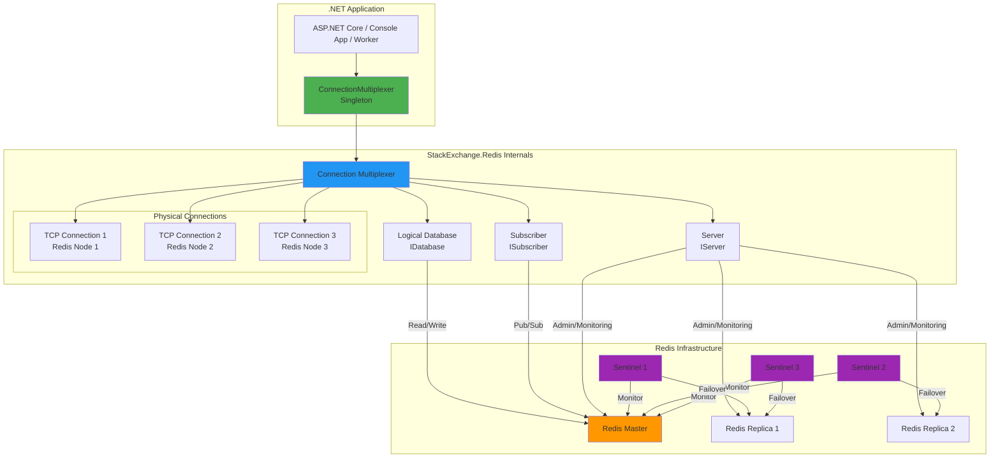
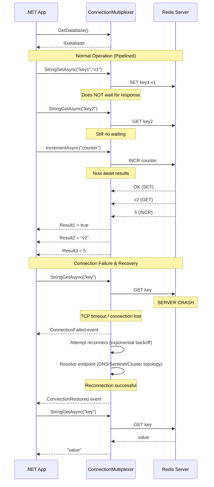
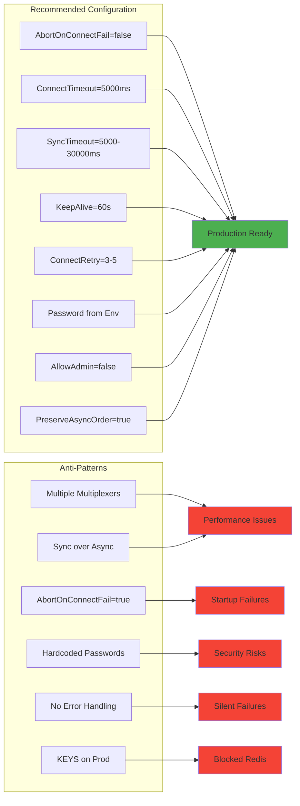

# Redis — StackExchange.Redis — .NET Full Reference

## Overview — Library Architecture

StackExchange.Redis is the premier .NET client for Redis. It is a high-performance, asynchronous, multiplexed client that supports all Redis features including Sentinel, Cluster, Pub/Sub, Streams, Lua scripting, and transactions.

This reference covers everything from basic setup to advanced patterns, with production-ready code examples.

### Core Design Principles

StackExchange.Redis is built on several key design principles:

1. **Connection multiplexing**: A single `ConnectionMultiplexer` handles all traffic to Redis. You should create one multiplexer per Redis deployment and reuse it throughout your application
2. **Pipelining by default**: All commands are pipelined automatically — the client does not wait for a response before sending the next command. This dramatically improves throughput
3. **Async-first**: All operations have both sync and async variants. Async is preferred for non-blocking operations
4. **Thread-safe**: The multiplexer and all derived objects (IDatabase, ISubscriber, IServer) are thread-safe
5. **Automatic failover handling**: When used with Sentinel or Cluster, the multiplexer automatically handles failover, reconnection, and topology changes

```csharp
// The absolute minimum StackExchange.Redis setup
// This creates a multiplexer and performs a basic operation

using StackExchange.Redis;

// Create and open the multiplexer (minimal configuration)
var mux = ConnectionMultiplexer.Connect("localhost");

// Get a database reference
var db = mux.GetDatabase();

// Perform operations
db.StringSet("key", "value");
var value = db.StringGet("key");

Console.WriteLine(value); // Output: value

// Always close the multiplexer when done
mux.Close();
```

### Namespace Organization

StackExchange.Redis is organized into these main namespaces:

| Namespace | Description | Key Types |
|-----------|-------------|-----------|
| `StackExchange.Redis` | Core library | `ConnectionMultiplexer`, `IDatabase`, `ISubscriber`, `IServer`, `ConfigurationOptions` |
| `StackExchange.Redis.Profiling` | Command profiling | `IProfiler`, `ProfiledCommand` |
| `StackExchange.Redis.Maintenance` | Maintenance and health | `ServerMaintenanceEvent`, `ConnectionMultiplexer.Diagnostics` |

### Target Frameworks

StackExchange.Redis targets .NET Standard 2.0, making it compatible with:
- .NET Framework 4.6.1+
- .NET Core 2.0+
- .NET 5+
- .NET 6+
- .NET 7+
- .NET 8+
- .NET 9+
- .NET 10+

## ConnectionMultiplexer — Singleton Pattern

The `ConnectionMultiplexer` is the central object of StackExchange.Redis. It manages all connections to Redis, handles failover, and provides access to databases, subscribers, and servers.

### Singleton Lifetime

Creating a `ConnectionMultiplexer` is expensive (it opens TCP connections and negotiates the Redis protocol). You must create it once and reuse it for the entire application lifetime.

```csharp
// Correct singleton pattern using Lazy<T>

public static class RedisMultiplexer
{
    private static readonly Lazy<ConnectionMultiplexer> LazyConnection =
        new Lazy<ConnectionMultiplexer>(() =>
        {
            var options = new ConfigurationOptions
            {
                AbortOnConnectFail = false,
                ConnectTimeout = 5000,
                SyncTimeout = 5000,
                KeepAlive = 60,
                ConnectRetry = 3,
                EndPoints = { { "localhost", 6379 } }
            };

            return ConnectionMultiplexer.Connect(options);
        });

    public static ConnectionMultiplexer Connection => LazyConnection.Value;
    public static IDatabase Database => Connection.GetDatabase();
}

// Usage:
// var db = RedisMultiplexer.Database;
// await db.StringSetAsync("key", "value");
```

### ASP.NET Core DI Registration

```csharp
// Proper singleton registration in ASP.NET Core

public static class RedisServiceRegistration
{
    public static IServiceCollection AddRedisMultiplexer(
        this IServiceCollection services,
        IConfiguration configuration)
    {
        services.AddSingleton<ConnectionMultiplexer>(sp =>
        {
            var options = new ConfigurationOptions
            {
                AbortOnConnectFail = false,
                ConnectTimeout = 5000,
                SyncTimeout = 5000,
                KeepAlive = 60,
                ConnectRetry = 3,
                EndPoints =
                {
                    {
                        configuration["Redis:Host"] ?? "localhost",
                        int.Parse(configuration["Redis:Port"] ?? "6379")
                    }
                },
                Password = configuration["Redis:Password"],
                DefaultDatabase = int.Parse(
                    configuration["Redis:Database"] ?? "0"),
                Ssl = bool.Parse(configuration["Redis:Ssl"] ?? "false"),
                AllowAdmin = bool.Parse(
                    configuration["Redis:AllowAdmin"] ?? "false")
            };

            var mux = ConnectionMultiplexer.Connect(options);

            // Log connection events
            var logger = sp.GetRequiredService<ILogger<ConnectionMultiplexer>>();
            mux.ConnectionFailed += (s, e) =>
                logger.LogWarning("Redis connection failed: {Endpoint}", e.EndPoint);
            mux.ConnectionRestored += (s, e) =>
                logger.LogInformation("Redis connection restored: {Endpoint}", e.EndPoint);

            return mux;
        });

        services.AddScoped(sp =>
        {
            var mux = sp.GetRequiredService<ConnectionMultiplexer>();
            return mux.GetDatabase();
        });

        return services;
    }
}

// Program.cs:
// builder.Services.AddRedisMultiplexer(builder.Configuration);
```

### Lazy Initialization Patterns

```csharp
// Multiple patterns for thread-safe singleton ConnectionMultiplexer

public static class MultiplexerPatterns
{
    // Pattern 1: Lazy<T> (recommended)
    public sealed class LazyPattern
    {
        private static readonly Lazy<ConnectionMultiplexer> _mux =
            new Lazy<ConnectionMultiplexer>(() =>
            {
                var config = new ConfigurationOptions
                {
                    AbortOnConnectFail = false,
                    ConnectTimeout = 5000
                };
                config.EndPoints.Add("localhost", 6379);
                return ConnectionMultiplexer.Connect(config);
            });

        public static ConnectionMultiplexer Instance => _mux.Value;
    }

    // Pattern 2: Double-check locking
    public sealed class DoubleCheckLockingPattern
    {
        private static ConnectionMultiplexer _instance;
        private static readonly object _lock = new object();

        public static ConnectionMultiplexer Instance
        {
            get
            {
                if (_instance == null)
                {
                    lock (_lock)
                    {
                        if (_instance == null)
                        {
                            var config = new ConfigurationOptions
                            {
                                AbortOnConnectFail = false,
                                ConnectTimeout = 5000
                            };
                            config.EndPoints.Add("localhost", 6379);
                            _instance = ConnectionMultiplexer.Connect(config);
                        }
                    }
                }
                return _instance;
            }
        }
    }

    // Pattern 3: Static initializer (simple, but less control)
    public sealed class StaticInitializerPattern
    {
        public static readonly ConnectionMultiplexer Instance =
            ConnectionMultiplexer.Connect(
                new ConfigurationOptions
                {
                    AbortOnConnectFail = false,
                    ConnectTimeout = 5000,
                    EndPoints = { { "localhost", 6379 } }
                });
    }
}
```

### Connection Multiplexing Explained

StackExchange.Redis uses a single TCP connection (per Redis endpoint) for all operations. This is fundamentally different from older clients like `ServiceStack.Redis` or `BookSleeve` which required separate connections for different operations.

```csharp
// How multiplexing works internally

public class MultiplexingExplanation
{
    private readonly ConnectionMultiplexer _mux;

    public MultiplexingExplanation(ConnectionMultiplexer mux)
    {
        _mux = mux;
    }

    public async Task DemonstrateMultiplexingAsync()
    {
        var db = _mux.GetDatabase();

        // These three commands are sent sequentially on the SAME connection.
        // The multiplexer does NOT wait for each response before sending
        // the next command. This is automatic pipelining.

        // Command 1: SET key1 value1
        var task1 = db.StringSetAsync("key1", "value1");

        // Command 2: GET key2 (sent without waiting for command 1 response)
        var task2 = db.StringGetAsync("key2");

        // Command 3: INCR counter (sent without waiting for command 1 or 2 responses)
        var task3 = db.StringIncrementAsync("counter");

        // Results are received in order as they complete
        var result1 = await task1;
        var result2 = await task2;
        var result3 = await task3;
    }

    public async Task CompareWithNonMultiplexedAsync()
    {
        // WITHOUT multiplexing (conceptual):
        // Connection 1: SEND SET key1 value1 → WAIT for OK → SEND ...
        // Connection 2: SEND GET key2 → WAIT for value → SEND ...
        // This wastes time waiting for network round-trips.

        // WITH multiplexing (StackExchange.Redis):
        // Connection 1: SEND SET key1 value1
        // Connection 1: SEND GET key2        (no wait!)
        // Connection 1: SEND INCR counter     (no wait!)
        // Connection 1: RECV OK ← SET
        // Connection 1: RECV value2 ← GET
        // Connection 1: RECV 5 ← INCR
        // Zero idle time on the connection.

        // This is why StackExchange.Redis achieves extremely high throughput
        // with a very small number of connections.

        var db = _mux.GetDatabase();

        // Fire all operations without awaiting
        var t1 = db.StringSetAsync("a", "1");
        var t2 = db.StringSetAsync("b", "2");
        var t3 = db.StringSetAsync("c", "3");

        // All three operations were sent over the wire
        // before any response was received

        await Task.WhenAll(t1, t2, t3);
        // Responses processed in any order
    }

    public async Task PipelineVsNonPipelineAsync()
    {
        var db = _mux.GetDatabase();

        // Without explicit pipelining (automatic in SE.Redis):
        var sw = System.Diagnostics.Stopwatch.StartNew();

        for (int i = 0; i < 1000; i++)
        {
            await db.StringSetAsync($"batch:key:{i}", i);
        }

        sw.Stop();
        var autoPipelineTime = sw.ElapsedMilliseconds;

        // The 1000 operations were NOT sent one-at-a-time.
        // SE.Redis buffers outgoing commands and flushes them:
        // - When the buffer is full (~buffered bytes threshold)
        // - When a synchronous operation needs the response
        // - Explicitly via IBatch.Flush()

        // Each "await" returns when the command is *written* to the buffer,
        // NOT when Redis has processed it (for async operations by default).
        // WaitForCompletion or SyncTimeout controls max wait.

        Console.WriteLine($"1000 pipelined SETs: {autoPipelineTime}ms");
    }
}
```

## Configuration — Options Reference

StackExchange.Redis provides extensive configuration options via `ConfigurationOptions` class or a connection string.

### ConfigurationOptions Complete Reference

```csharp
// Complete reference of all ConfigurationOptions properties

public static class ConfigurationOptionsReference
{
    public static ConfigurationOptions CreateFullConfig()
    {
        return new ConfigurationOptions
        {
            // === Connection Settings ===
            AbortOnConnectFail = false,
            // Default: true. When false, the multiplexer won't throw
            // if it can't connect during initialization. It will keep
            // trying in the background. CRITICAL for production.

            ConnectTimeout = 5000,
            // Default: 5000ms. Timeout for establishing connections.

            ConnectRetry = 3,
            // Default: 3. Number of connection retry attempts.

            SyncTimeout = 5000,
            // Default: 5000ms. Time allowed for synchronous operations.
            // Increase for long-running operations.
            // WARNING: Increasing too much can cause thread pool starvation.

            AsyncTimeout = 5000,
            // Default: 5000ms. Timeout for asynchronous operations.

            KeepAlive = 60,
            // Default: -1 (disabled). TCP keep-alive interval in seconds.
            // Recommended: 30-60s for production.

            ResponseTimeout = 15000,
            // Default: SyncTimeout. Timeout for receiving responses.

            // === Endpoint Configuration ===
            EndPoints = new EndPointCollection
            {
                { "localhost", 6379 },
                { "redis-2.internal", 6379 }
            },
            // List of Redis endpoints.

            ResolveDns = false,
            // Default: false. When true, resolves hostnames on each connect.

            // === Authentication ===
            Password = "your-redis-password",
            // Default: null. Redis AUTH password.

            User = null,
            // Default: null. Redis 6+ ACL user.

            // === SSL/TLS ===
            Ssl = false,
            // Default: false. Enable SSL/TLS. Required for Azure Redis.

            SslHost = null,
            // Default: null. SSL host name (if different from endpoint).

            SslProtocols = System.Security.Authentication.SslProtocols.Tls12,
            // Default: Tls12. SSL protocol version.

            // === Database ===
            DefaultDatabase = 0,
            // Default: 0. Default database index (0-15).
            // NOTE: Cluster mode ignores this (always database 0).

            // === Sentinel ===
            ServiceName = null,
            // Default: null. Set to master name for Sentinel mode.
            // Example: "mymaster".

            TieBreaker = "StackExchange.Redis.TieBreaker",
            // Default: "__Booksleeve_TieBreak". Used for master election.
            // Set to "" for Sentinel mode (Sentinel handles this).

            // === Cluster ===
            ConfigCheckSeconds = 60,
            // Default: 60s. How often to check cluster configuration.

            // === Proxy ===
            Proxy = Proxy.None,
            // Default: None. Options: None, Twemproxy, Envoy, Sentinel.

            // === Reconnection ===
            ReconnectRetryPolicy = new ExponentialRetry(5000),
            // Default: ReconnectRetryPolicy = LinearRetry(5000ms).
            // Options: ExponentialRetry, LinearRetry, or custom.

            // === Performance ===
            WriteBuffer = 4096,
            // Default: 4096. Output buffer size in bytes.

            AllowAdmin = false,
            // Default: false. Enable potentially dangerous commands
            // (FLUSHALL, CONFIG, CLIENT, SHUTDOWN, etc.).
            // Must be true for certain server commands.

            ChannelPrefix = null,
            // Default: null. Prefix for all pub/sub channels.

            ConfigChannel = null,
            // Default: null. Channel for configuration broadcast.

            // === Client Name ===
            ClientName = "my-app-redis-client",
            // Default: null (SE.Redis auto-generates). Client name visible
            // in CLIENT LIST.

            // === Library ===
            LibraryName = "SE.Redis",
            // Default: "SE.Redis". Library name sent to Redis.

            Version = new Version(6, 0, 0),
            // Default: 2.0.0. Minimum Redis version expected.
            // Higher versions enable newer features.

            // === Streaming ===
            PreserveAsyncOrder = true,
            // Default: true. Preserve order of async operations.

            // === High Availability ===
            HeartbeatInterval = null,
            // Default: null (inferred). Heartbeat check interval.

            HeartbeatConsistencyChecks = false,
            // Default: false. Enable heartbeat consistency checks.
        };
    }
}
```

### Connection String Reference

```csharp
// Complete connection string format reference

public static class ConnectionStringReference
{
    public static void ConnectionStringFormats()
    {
        // Format:
        // endpoint1,endpoint2,...?option1=value1&option2=value2

        // Basic:
        var basic = "localhost";

        // With port:
        var withPort = "localhost:6379";

        // Multiple endpoints (failover):
        var multiEndpoint = "redis1:6379,redis2:6379";

        // With options:
        var withOptions = "localhost:6379,abortConnect=false,connectTimeout=10000";

        // Sentinel mode:
        var sentinel = "sentinel1:26379,sentinel2:26379," +
            "serviceName=mymaster,tieBreaker=,abortConnect=false";

        // With password:
        var withPassword = "localhost:6379,password=secret123";

        // SSL (Azure Redis):
        var azure = "mycache.redis.cache.windows.net:6380," +
            "ssl=true,password=accesskey,abortConnect=false";

        // All options:
        var allOptions = "localhost:6379," +
            "abortConnect=false," +
            "allowAdmin=true," +
            "channelPrefix=myapp," +
            "connectRetry=5," +
            "connectTimeout=10000," +
            "defaultDatabase=1," +
            "keepAlive=30," +
            "name=my-app," +
            "password=secret," +
            "proxy=twemproxy," +
            "resolveDns=true," +
            "responseTimeout=30000," +
            "ssl=true," +
            "sslHost=mycache.redis.cache.windows.net," +
            "syncTimeout=10000," +
            "tieBreaker=StackExchange.Redis.TieBreaker," +
            "user=redisuser," +
            "writeBuffer=8192";

        // Equivalent ConfigurationOptions:
        var config = ConfigurationOptions.Parse(allOptions);
        // This is the same as using ConfigurationOptions directly.
    }
}
```

## IDatabase — Data Access API

`IDatabase` is the primary interface for Redis data operations. It represents a single Redis database (0-15) and provides methods for all Redis data types.

### Getting a Database

```csharp
// Methods to get IDatabase from ConnectionMultiplexer

public class DatabaseAccess
{
    private readonly ConnectionMultiplexer _mux;

    public DatabaseAccess(ConnectionMultiplexer mux)
    {
        _mux = mux;
    }

    public IDatabase GetDefaultDatabase()
    {
        // Uses DefaultDatabase from configuration
        return _mux.GetDatabase();
    }

    public IDatabase GetDatabaseByIndex(int dbIndex)
    {
        // Explicit database index (0-15)
        return _mux.GetDatabase(dbIndex);
    }

    public IDatabase GetDatabaseWithAsyncState(int dbIndex, object asyncState)
    {
        // With async state for correlation
        return _mux.GetDatabase(dbIndex, asyncState);
    }

    public async Task UseDatabaseAsync()
    {
        var db = _mux.GetDatabase();

        // IDatabase is thread-safe
        // One instance can be used across multiple threads/tasks
        // It delegates to the underlying multiplexer connections
    }
}
```

### String Operations

```csharp
// Complete reference for Redis String operations

public class StringOperations
{
    private readonly IDatabase _db;

    public StringOperations(IDatabase db)
    {
        _db = db;
    }

    public async Task BasicOperationsAsync()
    {
        // SET — Set key to value
        await _db.StringSetAsync("key", "value");

        // SET with expiry
        await _db.StringSetAsync("temp:key", "temp-value", TimeSpan.FromMinutes(5));

        // SET with conditions (NX = not exists, XX = exists)
        await _db.StringSetAsync("lock:key", "locked", when: When.NotExists);
        await _db.StringSetAsync("existing:key", "updated", when: When.Exists);

        // SET with multiple options
        await _db.StringSetAsync("full:set", "value", TimeSpan.FromHours(1), When.Always);

        // GET — Get key value
        var value = await _db.StringGetAsync("key");

        // GET with default if not found
        var result = await _db.StringGetAsync("nonexistent");
        if (result.IsNull)
        {
            Console.WriteLine("Key not found");
        }

        // GETSET — Set new value, return old
        var oldValue = await _db.StringGetSetAsync("counter", "0");

        // MGET — Get multiple keys
        var keys = new RedisKey[] { "key1", "key2", "key3" };
        var values = await _db.StringGetAsync(keys);

        // MSET — Set multiple keys
        var pairs = new KeyValuePair<RedisKey, RedisValue>[]
        {
            new RedisKey("k1"), "v1",
            new RedisKey("k2"), "v2"
        };
        await _db.StringSetAsync(pairs);

        // INCR — Atomic increment
        var newCount = await _db.StringIncrementAsync("counter");

        // INCRBY — Increment by specific amount
        await _db.StringIncrementAsync("visits", 10);

        // INCRBYFLOAT — Increment float
        await _db.StringIncrementAsync("float:key", 1.5);

        // DECR — Atomic decrement
        await _db.StringDecrementAsync("counter");

        // DECRBY
        await _db.StringDecrementAsync("counter", 5);

        // APPEND — Append to string
        var newLength = await _db.StringAppendAsync("key", " - appended");

        // STRLEN — Get string length
        var length = await _db.StringLengthAsync("key");

        // GETRANGE — Get substring
        var substring = await _db.StringGetRangeAsync("key", 0, 4);

        // SETRANGE — Overwrite at offset
        await _db.StringSetRangeAsync("key", 5, "inserted");

        // SETNX — Set if not exists
        var wasSet = await _db.StringSetAsync("new:key", "value", when: When.NotExists);

        // MSETNX — Set multiple if none exist
        // Not directly supported; use transactions for atomic multi-key conditional set
    }

    public async Task BitOperationsAsync()
    {
        // BITCOUNT — Count bits set to 1
        var bitCount = await _db.StringBitCountAsync("bitmap:key");
        var bitCountRange = await _db.StringBitCountAsync("bitmap:key", 0, 10);

        // BITOP — Bitwise operations (AND, OR, XOR, NOT)
        await _db.StringBitOperationAsync(Bitwise.And, "dest", new RedisKey[] { "a", "b" });
        await _db.StringBitOperationAsync(Bitwise.Or, "dest", new RedisKey[] { "a", "b" });
        await _db.StringBitOperationAsync(Bitwise.Xor, "dest", new RedisKey[] { "a", "b" });
        await _db.StringBitOperationAsync(Bitwise.Not, "dest", new RedisKey[] { "a" });

        // BITPOS — Find first bit set to 0 or 1
        var firstOne = await _db.StringBitPositionAsync("bitmap:key", true);
        var firstZero = await _db.StringBitPositionAsync("bitmap:key", false);

        // GETBIT — Get bit at offset
        var bit = await _db.StringGetBitAsync("bitmap:key", 100);

        // SETBIT — Set bit at offset
        await _db.StringSetBitAsync("bitmap:key", 100, true);
    }
}
```

### Hash Operations

```csharp
// Complete reference for Redis Hash operations

public class HashOperations
{
    private readonly IDatabase _db;

    public HashOperations(IDatabase db)
    {
        _db = db;
    }

    public async Task HashOperationsAsync()
    {
        // HSET — Set field in hash
        await _db.HashSetAsync("user:1", "name", "Alice");

        // HSET with multiple fields
        var entries = new HashEntry[]
        {
            new HashEntry("name", "Alice"),
            new HashEntry("age", 30),
            new HashEntry("email", "alice@example.com")
        };
        await _db.HashSetAsync("user:1", entries);

        // HGET — Get field value
        var name = await _db.HashGetAsync("user:1", "name");

        // HMGET — Get multiple fields
        var fields = new RedisValue[] { "name", "age", "email" };
        var values = await _db.HashGetAsync("user:1", fields);

        // HGETALL — Get all fields and values
        var allEntries = await _db.HashGetAllAsync("user:1");
        foreach (var entry in allEntries)
        {
            Console.WriteLine($"{entry.Name}: {entry.Value}");
        }

        // HKEYS — Get all field names
        var keys = await _db.HashKeysAsync("user:1");

        // HVALS — Get all values
        var allValues = await _db.HashValuesAsync("user:1");

        // HLEN — Get hash length
        var count = await _db.HashLengthAsync("user:1");

        // HDEL — Delete fields
        var deletedCount = await _db.HashDeleteAsync("user:1", "temporary_field");
        var deletedMultiple = await _db.HashDeleteAsync("user:1",
            new RedisValue[] { "field1", "field2" });

        // HEXISTS — Check if field exists
        var exists = await _db.HashExistsAsync("user:1", "name");

        // HINCRBY — Increment integer field
        var newAge = await _db.HashIncrementAsync("user:1", "age");
        var increasedAge = await _db.HashIncrementAsync("user:1", "age", 5);

        // HINCRBYFLOAT — Increment float field
        var newScore = await _db.HashIncrementAsync("user:1", "score", 10.5);

        // HSTRLEN — Get field value length
        var fieldLength = await _db.HashStringLengthAsync("user:1", "name");

        // HSCAN — Iterate over hash (not exposed directly on IDatabase)
        // Use IServer for SCAN commands, or use the multiplexer's
        // ExecuteAsync method
        var result = await _db.ExecuteAsync("HSCAN",
            "user:1", 0, "COUNT", 100);

        // HGETALL is usually preferred for small hashes
        // Use HSCAN via Execute for large hashes
    }

    public async Task UserProfilePatternAsync()
    {
        // Common pattern: store user profiles in hashes

        // Create/update user profile
        var profile = new HashEntry[]
        {
            new HashEntry("id", "12345"),
            new HashEntry("username", "alice"),
            new HashEntry("email", "alice@example.com"),
            new HashEntry("joined", DateTime.UtcNow.ToString("O")),
            new HashEntry("last_login", DateTime.UtcNow.ToString("O")),
            new HashEntry("preferences", "{\"theme\":\"dark\",\"lang\":\"en\"}")
        };

        await _db.HashSetAsync("user:12345", profile);

        // Get specific fields (efficient — only requested fields over the wire)
        var fields = new RedisValue[] { "username", "email" };
        var values = await _db.HashGetAsync("user:12345", fields);

        // Increment counters within hash
        await _db.HashIncrementAsync("user:12345", "login_count");

        // Partial update without fetching entire hash
        await _db.HashSetAsync("user:12345", "last_login", DateTime.UtcNow.ToString("O"));
    }
}
```

### List Operations

```csharp
// Complete reference for Redis List operations

public class ListOperations
{
    private readonly IDatabase _db;

    public ListOperations(IDatabase db)
    {
        _db = db;
    }

    public async Task ListOperationsAsync()
    {
        // LPUSH — Push to head
        await _db.ListLeftPushAsync("queue", "item1");

        // RPUSH — Push to tail
        await _db.ListRightPushAsync("queue", "item2");

        // LPUSH/RPUSH multiple
        await _db.ListLeftPushAsync("queue", new RedisValue[] { "a", "b", "c" });
        // Note: pushes items in order, so "c" ends up at the head

        // LPOP — Pop from head
        var item = await _db.ListLeftPopAsync("queue");

        // RPOP — Pop from tail
        item = await _db.ListRightPopAsync("queue");

        // BLPOP — Blocking left pop (with timeout)
        var popped = await _db.ListLeftPopAsync("queue", TimeSpan.FromSeconds(5));
        // Returns null/empty if timeout

        // BRPOP — Blocking right pop (with timeout)
        popped = await _db.ListRightPopAsync("queue", TimeSpan.FromSeconds(5));

        // BLMPOP — Blocking left pop from multiple lists (Redis 7+)
        // Not directly available; use BLPOP via Execute or Lua

        // LINDEX — Get element at index
        var element = await _db.ListGetByIndexAsync("queue", 0);

        // LRANGE — Get range of elements
        var range = await _db.ListRangeAsync("queue", 0, -1); // All elements

        // LLEN — Get list length
        var length = await _db.ListLengthAsync("queue");

        // LSET — Set element at index
        await _db.ListSetByIndexAsync("queue", 0, "new-first-item");

        // LINSERT — Insert before or after pivot
        await _db.ListInsertBeforeAsync("queue", "pivot", "new-before");
        await _db.ListInsertAfterAsync("queue", "pivot", "new-after");

        // LREM — Remove elements (count > 0: from head, < 0: from tail, = 0: all)
        var removed = await _db.ListRemoveAsync("queue", "value", count: 1);

        // LTRIM — Trim list to range
        await _db.ListTrimAsync("queue", 0, 99); // Keep first 100

        // RPOPLPUSH — Right pop from source, left push to destination
        var moved = await _db.ListRightPopLeftPushAsync("source", "dest");

        // BRPOPLPUSH — Blocking right pop left push
        moved = await _db.ListRightPopLeftPushAsync("source", "dest",
            TimeSpan.FromSeconds(5));
    }

    public async Task QueuePatternAsync()
    {
        // Producer-Consumer queue using List

        // Producer
        await _db.ListRightPushAsync("task:queue", "task:1");
        await _db.ListRightPushAsync("task:queue", "task:2");
        await _db.ListRightPushAsync("task:queue", "task:3");

        // Consumer (reliable with backup queue)
        var task = await _db.ListRightPopLeftPushAsync(
            "task:queue",          // Source
            "task:processing");     // Backup

        try
        {
            // Process task
            Console.WriteLine($"Processing: {task}");
            // ... do work ...

            // Remove from backup on success
            await _db.ListRemoveAsync("task:processing", task);
        }
        catch
        {
            // Task stays in backup for retry
            // A recovery process can re-queue items from backup
        }
    }

    public async Task StackPatternAsync()
    {
        // LIFO stack using List

        // Push items
        await _db.ListLeftPushAsync("stack", "item1");
        await _db.ListLeftPushAsync("stack", "item2");
        await _db.ListLeftPushAsync("stack", "item3");

        // Pop items (LIFO order: item3, item2, item1)
        var item = await _db.ListLeftPopAsync("stack");
        Console.WriteLine(item); // "item3"
    }
}
```

### Set Operations

```csharp
// Complete reference for Redis Set operations

public class SetOperations
{
    private readonly IDatabase _db;

    public SetOperations(IDatabase db)
    {
        _db = db;
    }

    public async Task SetOperationsAsync()
    {
        // SADD — Add members to set
        var added = await _db.SetAddAsync("tags", "redis");
        await _db.SetAddAsync("tags", new RedisValue[] { "database", "cache", "nosql" });

        // SREM — Remove members
        var removed = await _db.SetRemoveAsync("tags", "nosql");

        // SMEMBERS — Get all members
        var members = await _db.SetMembersAsync("tags");

        // SCARD — Get set cardinality
        var count = await _db.SetLengthAsync("tags");

        // SISMEMBER — Check if member exists
        var isMember = await _db.SetContainsAsync("tags", "redis");

        // SPOP — Pop random member(s)
        var random = await _db.SetPopAsync("tags");
        var multiple = await _db.SetPopAsync("tags", 3); // Pop 3 random

        // SRANDMEMBER — Get random member(s) without removing
        var sample = await _db.SetRandomMemberAsync("tags");
        var samples = await _db.SetRandomMembersAsync("tags", 3);

        // SMOVE — Move member to another set
        var moved = await _db.SetMoveAsync("tags", "old_tags", "redis");

        // SUNION — Union of sets
        var union = await _db.SetCombineAsync(SetOperation.Union, "set1", "set2");
        // SUNIONSTORE
        var unionCount = await _db.SetCombineAndStoreAsync(
            SetOperation.Union, "dest", "set1", "set2");

        // SINTER — Intersection of sets
        var intersect = await _db.SetCombineAsync(
            SetOperation.Intersect, "set1", "set2");
        // SINTERSTORE
        var intersectCount = await _db.SetCombineAndStoreAsync(
            SetOperation.Intersect, "dest", "set1", "set2");

        // SDIFF — Difference of sets
        var diff = await _db.SetCombineAsync(SetOperation.Difference, "set1", "set2");
        // SDIFFSTORE
        var diffCount = await _db.SetCombineAndStoreAsync(
            SetOperation.Difference, "dest", "set1", "set2");

        // SSCAN — Iterate set
        // Use Execute for SSCAN
    }

    public async Task UniqueVisitorsPatternAsync()
    {
        // Track unique daily visitors

        var today = DateTime.UtcNow.ToString("yyyyMMdd");
        var key = $"visitors:{today}";

        // Add visitor
        await _db.SetAddAsync(key, "user:12345");

        // Check if visitor already counted today
        var alreadyVisited = await _db.SetContainsAsync(key, "user:12345");

        // Get unique visitor count
        var uniqueCount = await _db.SetLengthAsync(key);

        // Weekly unique visitors (union of daily sets)
        var weekKeys = new RedisKey[]
        {
            "visitors:20260621",
            "visitors:20260622",
            "visitors:20260623",
            "visitors:20260624",
            "visitors:20260625",
            "visitors:20260626",
            "visitors:20260627"
        };
        var weeklyUnique = await _db.SetCombineAsync(
            SetOperation.Union, weekKeys);
        var weeklyCount = weeklyUnique.Length;
    }
}
```

### Sorted Set Operations

```csharp
// Complete reference for Redis Sorted Set operations

public class SortedSetOperations
{
    private readonly IDatabase _db;

    public SortedSetOperations(IDatabase db)
    {
        _db = db;
    }

    public async Task SortedSetOperationsAsync()
    {
        // ZADD — Add members with scores
        var added = await _db.SortedSetAddAsync("leaderboard", "player1", 1000);
        await _db.SortedSetAddAsync("leaderboard", new SortedSetEntry[]
        {
            new SortedSetEntry("player2", 2500),
            new SortedSetEntry("player3", 1800),
            new SortedSetEntry("player4", 3000)
        });

        // ZREM — Remove members
        var removed = await _db.SortedSetRemoveAsync("leaderboard", "player4");

        // ZREM multiple
        await _db.SortedSetRemoveAsync("leaderboard",
            new RedisValue[] { "player5", "player6" });

        // ZSCORE — Get member score
        var score = await _db.SortedSetScoreAsync("leaderboard", "player1");

        // ZCARD — Get sorted set cardinality
        var count = await _db.SortedSetLengthAsync("leaderboard");

        // ZRANK — Get rank (0-based, lowest to highest)
        var rank = await _db.SortedSetRankAsync("leaderboard", "player1");

        // ZREVRANK — Get rank (highest to lowest — for descending leaderboards)
        var revRank = await _db.SortedSetRankAsync("leaderboard", "player1", Order.Descending);

        // ZRANGE — Get range by index (low to high)
        var top10 = await _db.SortedSetRangeByRankAsync("leaderboard", 0, 10);

        // ZREVRANGE — Get range by index (high to low)
        var top10Desc = await _db.SortedSetRangeByRankAsync(
            "leaderboard", 0, 10, Order.Descending);

        // ZRANGE with scores
        var top10WithScores = await _db.SortedSetRangeByRankWithScoresAsync(
            "leaderboard", 0, 10, Order.Descending);

        // ZRANGEBYSCORE — Get range by score
        var byScore = await _db.SortedSetRangeByScoreAsync(
            "leaderboard", 1500, 2500);

        // ZRANGEBYSCORE with scores
        var byScoreWithScores = await _db.SortedSetRangeByScoreWithScoresAsync(
            "leaderboard", 1500, 2500);

        // ZRANGEBYSCORE with skip/take
        var paged = await _db.SortedSetRangeByScoreAsync(
            "leaderboard", 1500, 2500, Exclude.None, Order.Ascending, 0, 10);

        // ZCOUNT — Count members in score range
        var inRange = await _db.SortedSetLengthByValueAsync(
            "leaderboard", "player1", "player3");

        // ZINCRBY — Increment member score
        var newScore = await _db.SortedSetIncrementAsync("leaderboard", "player1", 500);

        // ZDECRBY — Decrement member score
        var decreased = await _db.SortedSetDecrementAsync("leaderboard", "player1", 100);

        // ZUNIONSTORE — Union of sorted sets
        var unionResult = await _db.SortedSetCombineAndStoreAsync(
            SetOperation.Union, "dest", "leaderboard", "other_board");

        // ZINTERSTORE — Intersection of sorted sets
        var intersectResult = await _db.SortedSetCombineAndStoreAsync(
            SetOperation.Intersect, "dest", "leaderboard", "other_board");

        // ZREMRANGEBYRANK — Remove by rank range
        var removed2 = await _db.SortedSetRemoveRangeByRankAsync(
            "leaderboard", 0, 10); // Remove bottom 10

        // ZREMRANGEBYSCORE — Remove by score range
        var removed3 = await _db.SortedSetRemoveRangeByScoreAsync(
            "leaderboard", 0, 500); // Remove low scores

        // ZREMRANGEBYLEX — Remove by lex range
        var removed4 = await _db.SortedSetRemoveRangeByValueAsync(
            "leaderboard", "a", "m"); // Remove lexicographic range

        // ZLEXCOUNT — Count in lex range
        var lexCount = await _db.SortedSetLengthByValueAsync(
            "leaderboard", "a", "m");

        // ZSCAN — Iterate sorted set
        // Use Execute for ZSCAN
    }

    public async Task LeaderboardPatternAsync()
    {
        // Game leaderboard

        var leaderboardKey = "game:leaderboard";

        // Submit scores
        await _db.SortedSetAddAsync(leaderboardKey, new SortedSetEntry[]
        {
            new SortedSetEntry("player:alice", 15000),
            new SortedSetEntry("player:bob", 12000),
            new SortedSetEntry("player:charlie", 18000),
            new SortedSetEntry("player:diana", 22000)
        });

        // Get top 3 (highest scores)
        var top3 = await _db.SortedSetRangeByRankWithScoresAsync(
            leaderboardKey, 0, 3, Order.Descending);

        Console.WriteLine("Top 3 Players:");
        int position = 1;
        foreach (var entry in top3)
        {
            Console.WriteLine($"#{position}: {entry.Element} - {entry.Score}");
            position++;
        }

        // Get a player's rank
        var aliceRank = await _db.SortedSetRankAsync(
            leaderboardKey, "player:alice", Order.Descending);
        Console.WriteLine($"Alice is #{aliceRank + 1}");

        // Get a player's score
        var aliceScore = await _db.SortedSetScoreAsync(
            leaderboardKey, "player:alice");
        Console.WriteLine($"Alice score: {aliceScore}");

        // Get players around a specific rank (pagination)
        var aroundRank = Math.Max(0, (aliceRank ?? 0) - 2);
        var neighbors = await _db.SortedSetRangeByRankWithScoresAsync(
            leaderboardKey, aroundRank ?? 0, (aroundRank ?? 0) + 5, Order.Descending);

        // Update score
        await _db.SortedSetIncrementAsync(leaderboardKey, "player:alice", 5000);
    }
}
```

### Stream Operations

```csharp
// Complete reference for Redis Stream operations

public class StreamOperations
{
    private readonly IDatabase _db;

    public StreamOperations(IDatabase db)
    {
        _db = db;
    }

    public async Task StreamOperationsAsync()
    {
        // XADD — Add message to stream
        // Using Execute for XADD (not directly exposed)

        // XADD with auto-generated ID
        var id1 = await _db.StreamAddAsync(
            "mystream",
            new NameValueEntry[]
            {
                new NameValueEntry("field1", "value1"),
                new NameValueEntry("field2", "value2")
            });

        // XADD with specific ID
        var id2 = await _db.StreamAddAsync(
            "mystream",
            "field1", "value1",
            maxLength: 1000); // MAXLEN ~1000 for capped stream

        // XREAD — Read from stream
        var streamResults = await _db.StreamReadAsync(
            "mystream",
            "0-0"); // Start from beginning

        foreach (var entry in streamResults)
        {
            Console.WriteLine($"Stream: {entry.Key}");
            foreach (var msg in entry.Entries)
            {
                Console.WriteLine($"  ID: {msg.Id}");
                foreach (var val in msg.Values)
                {
                    Console.WriteLine($"    {val.Name}: {val.Value}");
                }
            }
        }

        // XREAD with count and block
        var latest = await _db.StreamReadAsync(
            "mystream",
            "$",  // Latest messages only
            count: 10);

        // XREAD from multiple streams
        var multiple = await _db.StreamReadAsync(
            new StreamPosition[]
            {
                new StreamPosition("stream1", "$"),
                new StreamPosition("stream2", "$")
            },
            countPerStream: 5);

        // XREADGROUP — Read as consumer group member
        // Not directly on IDatabase; use ExecuteAsync

        // XLEN — Stream length
        var length = await _db.StreamLengthAsync("mystream");

        // XRANGE — Get range by ID
        var range = await _db.StreamRangeAsync(
            "mystream",
            minId: "-",    // Minimum ID
            maxId: "+",    // Maximum ID
            count: 100);

        // XREVRANGE — Reverse range
        var revRange = await _db.StreamRangeAsync(
            "mystream",
            minId: "+",
            maxId: "-",
            count: 10,
            messageOrder: Order.Descending);

        // XDEL — Delete messages
        var deleted = await _db.StreamDeleteAsync(
            "mystream", new RedisValue[] { id1 });

        // XTRIM — Trim stream
        var trimmed = await _db.StreamTrimAsync("mystream", 1000);
        // Trims to at most 1000 entries (MAXLEN ~1000)

        // XGROUP — Create consumer group
        // Use ExecuteAsync for XGROUP CREATE

        // XACK — Acknowledge message
        // Use ExecuteAsync for XACK

        // XPENDING — Pending messages
        // Use ExecuteAsync for XPENDING

        // XCLAIM — Claim messages
        // Use ExecuteAsync for XCLAIM

        // XINFO — Stream info
        // Use ExecuteAsync for XINFO STREAM/GROUPS/CONSUMERS
    }

    public async Task ConsumerGroupPatternAsync()
    {
        // Consumer groups via Execute

        // Create consumer group
        await _db.ExecuteAsync("XGROUP", "CREATE", "mystream", "mygroup", "$", "MKSTREAM");

        // Read as consumer
        var result = await _db.ExecuteAsync("XREADGROUP", "GROUP", "mygroup", "consumer1",
            "COUNT", "10", "BLOCK", "5000",
            "STREAMS", "mystream", ">");

        // Acknowledge after processing
        await _db.ExecuteAsync("XACK", "mystream", "mygroup", "message-id-1");

        // Check pending messages
        var pending = await _db.ExecuteAsync("XPENDING", "mystream", "mygroup");

        // Claim unprocessed messages
        var claimed = await _db.ExecuteAsync("XCLAIM", "mystream", "mygroup",
            "consumer2", "60000", "message-id-1", "message-id-2");
    }
}
```

### Key Operations

```csharp
// Complete reference for Redis Key management operations

public class KeyOperations
{
    private readonly IDatabase _db;

    public KeyOperations(IDatabase db)
    {
        _db = db;
    }

    public async Task KeyOperationsAsync()
    {
        // DEL — Delete key(s)
        var deleted = await _db.KeyDeleteAsync("key");
        var deletedMultiple = await _db.KeyDeleteAsync(
            new RedisKey[] { "key1", "key2", "key3" });

        // EXISTS — Check if key exists
        var exists = await _db.KeyExistsAsync("key");

        // EXPIRE — Set TTL in seconds
        var wasSet = await _db.KeyExpireAsync("temp:key", TimeSpan.FromMinutes(10));

        // EXPIREAT — Set expiry at specific datetime
        await _db.KeyExpireAsync("key", DateTime.UtcNow.AddHours(1));

        // EXPIRETIME — Get expiry time as Unix timestamp (Redis 7+)
        // Use Execute for EXPIRETIME

        // TTL — Get remaining TTL in seconds
        var ttl = await _db.KeyTimeToLiveAsync("key");
        if (ttl.HasValue)
        {
            Console.WriteLine($"TTL: {ttl.Value.TotalSeconds}s");
        }

        // PTTL — Get TTL in milliseconds
        // Use KeyTimeToLiveAsync (returns TimeSpan, can use TotalMilliseconds)

        // PERSIST — Remove expiry
        var removed = await _db.KeyPersistAsync("key");

        // RENAME — Rename key
        var renamed = await _db.KeyRenameAsync("old:key", "new:key");

        // RENAMENX — Rename if new key doesn't exist
        var renamedNx = await _db.KeyRenameAsync("old:key", "new:key", When.NotExists);

        // TYPE — Get key type
        var type = await _db.KeyTypeAsync("key");
        Console.WriteLine($"Type: {type}"); // String, List, Set, SortedSet, Hash, Stream

        // MOVE — Move key to another database
        var moved = await _db.KeyMoveAsync("key", 1); // Move to DB 1

        // DUMP — Serialize key value
        var serialized = await _db.KeyDumpAsync("key");

        // RESTORE — Deserialize key value
        await _db.KeyRestoreAsync("key", serialized, TimeSpan.Zero);

        // RESTORE with TTL
        await _db.KeyRestoreAsync("key", serialized, TimeSpan.FromMinutes(30));

        // TOUCH — Update last access time
        var touched = await _db.KeyTouchAsync("key");

        // UNLINK — Non-blocking delete (async unlink in Redis 4+)
        var unlinked = await _db.KeyDeleteAsync("key"); // Same method, Redis decides
        // Note: KeyDeleteAsync sends both DEL and UNLINK depending on Redis version
    }
}
```

## Code Examples — All Operations

### Async/Await Patterns

```csharp
// Best practices for async operations with SE.Redis

public class AsyncPatterns
{
    private readonly ConnectionMultiplexer _mux;

    public AsyncPatterns(ConnectionMultiplexer mux)
    {
        _mux = mux;
    }

    // CORRECT: Fire multiple operations, await all at once
    public async Task FireAndForgetMultiple()
    {
        var db = _mux.GetDatabase();

        // Start all operations concurrently
        var task1 = db.StringSetAsync("key1", "value1");
        var task2 = db.StringSetAsync("key2", "value2");
        var task3 = db.StringSetAsync("key3", "value3");

        // Wait for all to complete
        await Task.WhenAll(task1, task2, task3);
    }

    // CORRECT: Process results as they arrive
    public async Task ProcessResultsAsync()
    {
        var db = _mux.GetDatabase();

        var task1 = db.StringGetAsync("key1");
        var task2 = db.StringGetAsync("key2");

        // Process each result as it completes
        var completed = Task.WhenAll(task1, task2);
        // ... other work ...

        var results = await completed;
        Console.WriteLine($"key1: {results[0]}, key2: {results[1]}");
    }

    // AVOID: Sequential await (slow)
    public async Task SequentialAwaitBad()
    {
        var db = _mux.GetDatabase();

        // BAD: Each operation waits for the previous to complete
        // This defeats SE.Redis's automatic pipelining
        var v1 = await db.StringGetAsync("key1"); // Waits for round-trip
        var v2 = await db.StringGetAsync("key2"); // Starts after v1 received
        var v3 = await db.StringGetAsync("key3"); // Starts after v2 received
    }

    // PREFERRED: Batch operations when order matters
    public async Task BatchOperationsAsync()
    {
        var db = _mux.GetDatabase();
        var batch = db.CreateBatch();

        // Queue operations in the batch
        var task1 = batch.StringSetAsync("batch:key1", "value1");
        var task2 = batch.StringSetAsync("batch:key2", "value2");
        var task3 = batch.StringGetAsync("batch:existing");

        // Execute batch (sends all commands in one round-trip)
        batch.Execute();

        // Await individual results
        await Task.WhenAll(task1, task2, task3);
    }

    // AVOID: Sync over async (thread pool starvation)
    public string SyncOverAsyncBad()
    {
        var db = _mux.GetDatabase();

        // BAD: Blocks thread while waiting for Redis
        // Can cause thread pool starvation under load
        return db.StringGet("key");
    }

    // PREFERRED: Use async all the way
    public async Task<string> AsyncAllTheWay(string key)
    {
        var db = _mux.GetDatabase();
        return await db.StringGetAsync(key);
    }
}
```

### Transaction Operations

```csharp
// Complete reference for Redis Transactions via SE.Redis

public class TransactionOperations
{
    private readonly ConnectionMultiplexer _mux;

    public TransactionOperations(ConnectionMultiplexer mux)
    {
        _mux = mux;
    }

    public async Task BasicTransactionAsync()
    {
        var db = _mux.GetDatabase();
        var tran = db.CreateTransaction();

        // Queue operations
        tran.StringSetAsync("tx:key1", "value1");
        tran.StringSetAsync("tx:key2", "value2");
        tran.StringIncrementAsync("tx:counter");

        // Execute (atomic)
        var committed = await tran.ExecuteAsync();

        if (committed)
        {
            Console.WriteLine("Transaction committed");
        }
        else
        {
            Console.WriteLine("Transaction failed");
        }
    }

    public async Task ConditionalTransactionAsync()
    {
        var db = _mux.GetDatabase();
        var tran = db.CreateTransaction();

        // Add conditions (WATCH equivalent)
        tran.AddCondition(Condition.KeyNotExists("tx:lock"));
        tran.AddCondition(Condition.StringEqual("tx:expected", "current_value"));

        // Queue operations
        tran.StringSetAsync("tx:lock", "acquired");
        tran.StringSetAsync("tx:expected", "new_value");

        // Execute — only if all conditions are met
        var committed = await tran.ExecuteAsync();

        if (committed)
        {
            Console.WriteLine("Conditional transaction succeeded");
        }
        else
        {
            Console.WriteLine("Condition not met, transaction aborted");
        }
    }

    public async Task OptimisticLockingAsync()
    {
        var db = _mux.GetDatabase();
        var retries = 0;
        const int maxRetries = 5;

        while (retries < maxRetries)
        {
            // Read current value
            var currentValue = await db.StringGetAsync("counter");
            var currentInt = (int)currentValue;

            // Create transaction with condition
            var tran = db.CreateTransaction();
            tran.AddCondition(Condition.StringEqual("counter", currentValue));
            tran.StringSetAsync("counter", currentInt + 1);

            if (await tran.ExecuteAsync())
            {
                Console.WriteLine($"Counter updated from {currentInt} to {currentInt + 1}");
                return;
            }

            retries++;
            Console.WriteLine($"Optimistic lock failed, retry {retries}");
        }

        throw new InvalidOperationException("Failed to update counter after retries");
    }

    public async Task TransactionWithResultsAsync()
    {
        var db = _mux.GetDatabase();
        var tran = db.CreateTransaction();

        // Queue operations and capture tasks
        var setTask = tran.StringSetAsync("tx:result", "value");
        var getTask = tran.StringGetAsync("tx:result");
        var incrTask = tran.StringIncrementAsync("tx:counter");

        // Execute
        var committed = await tran.ExecuteAsync();

        if (committed)
        {
            // Retrieve results
            var setResult = await setTask;
            var getResult = await getTask;
            var incrResult = await incrTask;

            Console.WriteLine($"Set: {setResult}, Get: {getResult}, Incr: {incrResult}");
        }
    }
}
```

### Lua Scripting

```csharp
// Complete reference for Lua scripting with SE.Redis

public class LuaScripting
{
    private readonly ConnectionMultiplexer _mux;

    public LuaScripting(ConnectionMultiplexer mux)
    {
        _mux = mux;
    }

    public async Task SimpleLuaScriptAsync()
    {
        var db = _mux.GetDatabase();

        // Simple Lua script: atomic compare-and-swap
        var script = @"
            local current = redis.call('GET', KEYS[1])
            if current == ARGV[1] then
                redis.call('SET', KEYS[1], ARGV[2])
                return 1
            else
                return 0
            end
        ";

        var result = await db.ScriptEvaluateAsync(
            script,
            new RedisKey[] { "counter-key" },
            new RedisValue[] { "expected-value", "new-value" });

        var success = (int)result == 1;
        Console.WriteLine($"CAS: {success}");
    }

    public async Task ScriptWithShaAsync()
    {
        var db = _mux.GetDatabase();

        // Load script to cache it (returns SHA)
        var script = @"
            local count = redis.call('INCR', KEYS[1])
            if count == 1 then
                redis.call('EXPIRE', KEYS[1], ARGV[1])
            end
            return count
        ";

        var loaded = await db.ScriptLoadAsync(script);
        Console.WriteLine($"Script SHA: {loaded}");

        // Execute by SHA (faster — no script transfer)
        var result = await db.ScriptEvaluateAsync(
            loaded,
            new RedisKey[] { "rate:limit:ip:1234" },
            new RedisValue[] { "60" });

        var count = (long)result;
        Console.WriteLine($"Request count: {count}");
    }

    public async Task LuaScriptForRateLimitingAsync()
    {
        var db = _mux.GetDatabase();

        // Sliding window rate limiter in Lua
        var script = @"
            local key = KEYS[1]
            local now = tonumber(ARGV[1])
            local window = tonumber(ARGV[2])
            local maxRequests = tonumber(ARGV[3])

            -- Remove old entries
            redis.call('ZREMRANGEBYSCORE', key, 0, now - window)

            -- Count current requests
            local currentCount = redis.call('ZCARD', key)
            if currentCount >= maxRequests then
                return 0
            end

            -- Add current request
            redis.call('ZADD', key, now, now)
            redis.call('EXPIRE', key, window)
            return 1
        ";

        var result = await db.ScriptEvaluateAsync(
            script,
            new RedisKey[] { "ratelimit:user:1234" },
            new RedisValue[]
            {
                DateTimeOffset.UtcNow.ToUnixTimeMilliseconds(),
                60000,   // 60 second window
                100      // max 100 requests
            });

        var allowed = (int)result == 1;
        Console.WriteLine($"Request allowed: {allowed}");
    }

    public async Task LuaScriptForInventoryAsync()
    {
        var db = _mux.GetDatabase();

        // Inventory reservation with Lua
        var script = @"
            local inventoryKey = KEYS[1]
            local reservationKey = KEYS[2]
            local userId = ARGV[1]
            var quantity = tonumber(ARGV[2])

            -- Check available inventory
            local available = tonumber(redis.call('GET', inventoryKey) or 0)
            if available < quantity then
                return { err = 'Insufficient inventory' }
            end

            -- Decrement inventory
            redis.call('DECRBY', inventoryKey, quantity)

            -- Record reservation
            redis.call('HSET', reservationKey, userId, quantity)

            return { ok = 'Reserved' }
        ";

        var result = await db.ScriptEvaluateAsync(
            script,
            new RedisKey[] { "inventory:item:42", "reservations:item:42" },
            new RedisValue[] { "user:789", "2" });

        if (!result.IsNull)
        {
            Console.WriteLine($"Script result: {result}");
        }
    }
}
```

### Pub/Sub Operations

```csharp
// Complete reference for Redis Pub/Sub with SE.Redis

public class PubSubOperations
{
    private readonly ConnectionMultiplexer _mux;

    public PubSubOperations(ConnectionMultiplexer mux)
    {
        _mux = mux;
    }

    public async Task PubSubBasicAsync()
    {
        var subscriber = _mux.GetSubscriber();

        // Subscribe to a channel
        await subscriber.SubscribeAsync("notifications", (channel, value) =>
        {
            Console.WriteLine($"Received on {channel}: {value}");
        });

        // Subscribe with pattern matching
        await subscriber.SubscribeAsync("user:*", (channel, value) =>
        {
            Console.WriteLine($"User event: {channel} = {value}");
        });

        // Publish a message
        var subscriberCount = await subscriber.PublishAsync(
            "notifications", "Hello, subscribers!");
        Console.WriteLine($"Message sent to {subscriberCount} subscribers");
    }

    public async Task PubSubWithAsyncHandlerAsync()
    {
        var subscriber = _mux.GetSubscriber();

        // Note: SE.Redis calls the handler on a background thread.
        // Do NOT block inside the handler.

        await subscriber.SubscribeAsync("events", async (channel, value) =>
        {
            // This IS an async handler, but be careful:
            // - The handler is invoked on a worker thread
            // - Long-running operations will block other messages
            // - Offload heavy processing to a separate task

            await Task.Run(async () =>
            {
                // Heavy processing here
                await Task.Delay(100);
                Console.WriteLine($"Processed: {value}");
            });
        });
    }

    public async Task PubSubWithReconnectionAsync()
    {
        var subscriber = _mux.GetSubscriber();

        // Subscriptions are automatically re-subscribed after
        // connection loss. SE.Redis handles this transparently.

        // However, messages sent during the reconnection window
        // are lost. This is inherent to Redis Pub/Sub.

        // For reliable messaging, use Streams with consumer groups.

        await subscriber.SubscribeAsync("reliable-test", (channel, value) =>
        {
            // This may miss messages during reconnection
            Console.WriteLine(value);
        });

        // Monitor reconnection
        _mux.ConnectionRestored += (s, e) =>
        {
            Console.WriteLine("Reconnected — subscriptions restored automatically");
        };
    }

    public async Task PubSubUnsubscribeAsync()
    {
        var subscriber = _mux.GetSubscriber();

        // Unsubscribe a specific handler
        await subscriber.UnsubscribeAsync("channel");

        // Unsubscribe all handlers for a channel
        await subscriber.UnsubscribeAllAsync();

        // Unsubscribe with pattern
        await subscriber.UnsubscribeAsync("user:*");

        // Check subscription status
        var subscribedChannels = await subscriber.SubscribedChannels();
        Console.WriteLine($"Subscribed to: {string.Join(", ", subscribedChannels)}");
    }

    public async Task PubSubPatternsAsync()
    {
        var subscriber = _mux.GetSubscriber();

        // PSubscribe (pattern subscribe)
        await subscriber.SubscribeAsync("__keyevent@0__:expired", (channel, value) =>
        {
            Console.WriteLine($"Key expired: {value}");
        });

        // Subscribe with different message flags
        await subscriber.SubscribeAsync("channel", (channel, value) =>
        {
            // value.IsNull check for messages that are empty
            if (!value.IsNull)
            {
                Console.WriteLine(value);
            }
        });

        // Publishing with flags
        await subscriber.PublishAsync("channel", "message");
    }
}
```

### Server Operations

```csharp
// Complete reference for Redis Server operations

public class ServerOperations
{
    private readonly ConnectionMultiplexer _mux;

    public ServerOperations(ConnectionMultiplexer mux)
    {
        _mux = mux;
    }

    public async Task ServerCommandsAsync()
    {
        // Get IServer from the first endpoint
        var server = _mux.GetServer(_mux.GetEndPoints()[0]);

        // INFO — Get server info
        var info = await server.InfoAsync();
        foreach (var section in info)
        {
            Console.WriteLine($"# {section.Key}");
            foreach (var entry in section)
            {
                Console.WriteLine($"{entry.Key}: {entry.Value}");
            }
        }

        // INFO for specific section
        var memoryInfo = await server.InfoAsync("memory");
        var replicationInfo = await server.InfoAsync("replication");
        var statsInfo = await server.InfoAsync("stats");

        // CONFIG GET — Get configuration
        var maxMemory = await server.ConfigGetAsync("maxmemory");
        var saveConfig = await server.ConfigGetAsync("save");
        var timeout = await server.ConfigGetAsync("timeout");

        // CONFIG SET — Set configuration (requires AllowAdmin=true)
        if (_mux.Configuration.AllowAdmin)
        {
            await server.ConfigSetAsync("timeout", "300");
        }

        // CLIENT LIST — Get connected clients
        var clientList = await server.ClientListAsync();
        foreach (var client in clientList)
        {
            Console.WriteLine($"Client: {client.Host}:{client.Port}");
        }

        // CLIENT GETNAME — Get client name
        var clientName = await server.ClientGetNameAsync();

        // DBSIZE — Get database key count
        var dbSize = await server.DatabaseSizeAsync();
        Console.WriteLine($"DB 0 has {dbSize} keys");

        // LASTSAVE — Get last save time
        var lastSave = await server.LastSaveAsync();
        Console.WriteLine($"Last RDB save: {lastSave}");

        // ROLE — Get server role
        var roleInfo = await server.RoleAsync();
        Console.WriteLine($"Role: {roleInfo}");

        // TIME — Get server time
        var serverTime = await server.TimeAsync();
        Console.WriteLine($"Server time: {serverTime}");

        // SLAVEOF — Change replication (requires AllowAdmin=true)
        // await server.SlaveOfAsync("new-master-host", 6379);

        // PING — Ping server
        var ping = await server.PingAsync();
        Console.WriteLine($"Ping: {ping.TotalMilliseconds}ms");
    }

    public async Task AdminOperationsAsync()
    {
        // These operations require AllowAdmin=true

        var server = _mux.GetServer(_mux.GetEndPoints()[0]);

        if (!_mux.Configuration.AllowAdmin)
        {
            Console.WriteLine("AllowAdmin must be true for these operations");
            return;
        }

        // FLUSHDB — Clear current database
        // await server.FlushDatabaseAsync();

        // FLUSHALL — Clear all databases
        // await server.FlushAllDatabasesAsync();

        // SHUTDOWN — Shutdown Redis
        // await server.ShutdownAsync();

        // KEYS — Find keys matching pattern (BLOCKING on large datasets!)
        // var keys = await server.KeysAsync(pattern: "prefix:*").ToListAsync();
        // Use SCAN instead for production:

        // SCAN — Non-blocking key iteration
        await foreach (var key in server.KeysAsync(pattern: "prefix:*", pageSize: 100))
        {
            Console.WriteLine(key);
        }

        // SAVE — Trigger RDB save
        // await server.SaveAsync(SaveType.BackgroundSave);

        // BGREWRITEAOF — Trigger AOF rewrite
        // await server.ExecuteAsync("BGREWRITEAOF");

        // DEBUG OBJECT — Get key debug info
        try
        {
            var debugInfo = await server.DebugObjectAsync("some:key");
            Console.WriteLine(debugInfo);
        }
        catch (RedisServerException) { }
    }

    public async Task ClusterCommandsAsync()
    {
        var server = _mux.GetServer(_mux.GetEndPoints()[0]);

        if (!server.IsClusterEnabled)
        {
            Console.WriteLine("Not a cluster node");
            return;
        }

        // CLUSTER INFO
        var clusterInfo = await server.ExecuteAsync("CLUSTER", "INFO");
        Console.WriteLine(clusterInfo);

        // CLUSTER NODES
        var clusterNodes = await server.ExecuteAsync("CLUSTER", "NODES");
        Console.WriteLine(clusterNodes);

        // CLUSTER SLOTS
        var clusterSlots = await server.ExecuteAsync("CLUSTER", "SLOTS");
        Console.WriteLine(clusterSlots);

        // CLUSTER KEYSLOT — Get slot for a key
        var slot = await server.ExecuteAsync("CLUSTER", "KEYSLOT", "mykey");
        Console.WriteLine($"Slot for 'mykey': {slot}");

        // CLUSTER COUNTKEYSINSLOT
        var count = await server.ExecuteAsync("CLUSTER", "COUNTKEYSINSLOT", "1234");
        Console.WriteLine($"Keys in slot 1234: {count}");

        // CLUSTER GETKEYSINSLOT
        var keys = await server.ExecuteAsync("CLUSTER", "GETKEYSINSLOT", "1234", "10");
        Console.WriteLine($"Keys in slot 1234: {keys}");
    }

    public async Task SentinelCommandsAsync()
    {
        var server = _mux.GetServer(_mux.GetEndPoints()[0]);

        // SENTINEL MASTER — Get master info
        var master = await server.SentinelMasterAsync("mymaster");
        Console.WriteLine($"Master: {master["ip"]}:{master["port"]}");

        // SENTINEL MASTERS — Get all monitored masters
        var masters = await server.SentinelMastersAsync();
        foreach (var m in masters)
        {
            Console.WriteLine($"Monitored master: {m["name"]}");
        }

        // SENTINEL REPLICAS — Get replicas for a master
        var replicas = await server.SentinelReplicasAsync("mymaster");
        foreach (var replica in replicas)
        {
            Console.WriteLine($"Replica: {replica["ip"]}:{replica["port"]}");
        }

        // SENTINEL SENTINELS — Get other sentinels
        var sentinels = await server.SentinelSentinelsAsync("mymaster");
        foreach (var sentinel in sentinels)
        {
            Console.WriteLine($"Sentinel: {sentinel["ip"]}:{sentinel["port"]}");
        }

        // SENTINEL GET-MASTER-ADDR-BY-NAME
        var addr = await server.SentinelGetMasterAddressByNameAsync("mymaster");
        Console.WriteLine($"Current master address: {addr}");

        // SENTINEL FAILOVER — Trigger manual failover
        // await server.SentinelFailoverAsync("mymaster");

        // SENTINEL CKQUORUM — Check quorum
        var ckquorum = await server.SentinelMasterAsync("mymaster");
        // SENTINEL CKQUORUM via Execute
        var quorumResult = await server.ExecuteAsync("SENTINEL", "CKQUORUM", "mymaster");
        Console.WriteLine(quorumResult);

        // SENTINEL PENDING-SCRIPTS — Pending scripts
        // var pending = await server.ExecuteAsync("SENTINEL", "PENDING-SCRIPTS");
    }
}
```

## Advanced — Profiling, Scripting, Transactions

### Profiling with IProfiler

```csharp
// Command profiling using IProfiler

public class ProfilingExample
{
    private readonly ConnectionMultiplexer _mux;

    public ProfilingExample(ConnectionMultiplexer mux)
    {
        _mux = mux;
    }

    public async Task ProfileCommandsAsync()
    {
        // Create a profiler that groups commands by context
        var profiler = new SimpleProfiler();
        _mux.RegisterProfiler(profiler);

        // All commands executed within this context are profiled
        using (profiler.Context())
        {
            var db = _mux.GetDatabase();
            await db.StringSetAsync("profiled:key1", "value1");
            await db.StringGetAsync("profiled:key2");
            await db.StringIncrementAsync("profiled:counter");
        }

        // Get profiled commands
        var commands = profiler.GetCommands();
        foreach (var cmd in commands)
        {
            Console.WriteLine(
                $"{cmd.Command} on {cmd.EndPoint} " +
                $"(took {cmd.ElapsedTimeMs}ms)");
        }
    }
}

public class SimpleProfiler : IProfiler
{
    private readonly AsyncLocal<ProfiledCommands> _context =
        new AsyncLocal<ProfiledCommands>();

    public IDisposable Context()
    {
        var oldContext = _context.Value;
        _context.Value = new ProfiledCommands();
        return new ProfilerDisposable(() =>
        {
            _context.Value = oldContext;
        });
    }

    public IEnumerable<ProfiledCommand> GetCommands() =>
        _context.Value?.GetCommands() ?? Enumerable.Empty<ProfiledCommand>();

    public ProfiledCommand GetContext()
    {
        return _context.Value as ProfiledCommand;
    }
}

public class ProfiledCommands
{
    private readonly List<ProfiledCommand> _commands = new List<ProfiledCommand>();

    public void AddCommand(ProfiledCommand command)
    {
        lock (_commands)
        {
            _commands.Add(command);
        }
    }

    public IEnumerable<ProfiledCommand> GetCommands()
    {
        lock (_commands)
        {
            return _commands.ToList();
        }
    }
}

public class ProfiledCommand
{
    public string Command { get; set; }
    public EndPoint EndPoint { get; set; }
    public long ElapsedTimeMs { get; set; }
    public DateTime Timestamp { get; set; }
}

public class ProfilerDisposable : IDisposable
{
    private readonly Action _onDispose;
    public ProfilerDisposable(Action onDispose) => _onDispose = onDispose;
    public void Dispose() => _onDispose();
}
```

### Batch Operations

```csharp
// Efficient batch operations

public class BatchOperations
{
    private readonly ConnectionMultiplexer _mux;

    public BatchOperations(ConnectionMultiplexer mux)
    {
        _mux = mux;
    }

    public async Task BulkInsertAsync(IEnumerable<KeyValuePair<string, string>> pairs)
    {
        var db = _mux.GetDatabase();
        var batch = db.CreateBatch();

        var tasks = new List<Task>();
        foreach (var pair in pairs)
        {
            tasks.Add(batch.StringSetAsync(pair.Key, pair.Value));
        }

        // Execute sends all queued commands as a single batch
        batch.Execute();

        // Await all results
        await Task.WhenAll(tasks);
    }

    public async Task<Dictionary<string, string>> BulkGetAsync(IEnumerable<string> keys)
    {
        var db = _mux.GetDatabase();
        var batch = db.CreateBatch();

        var tasks = new Dictionary<string, Task<RedisValue>>();
        foreach (var key in keys)
        {
            tasks[key] = batch.StringGetAsync(key);
        }

        batch.Execute();
        await Task.WhenAll(tasks.Values);

        return tasks.ToDictionary(
            kv => kv.Key,
            kv => kv.Value.Result.HasValue ? kv.Value.Result.ToString() : null);
    }

    public async Task BulkOperationWithPipelineAsync()
    {
        // Even without explicit batch, SE.Redis pipelines
        // This achieves the same effect as batching
        var db = _mux.GetDatabase();

        var tasks = new List<Task>();
        for (int i = 0; i < 10000; i++)
        {
            tasks.Add(db.StringSetAsync($"bulk:key:{i}", i));
        }

        // All commands are already in the pipeline
        // Task.WhenAll waits for all responses
        await Task.WhenAll(tasks);
    }
}
```

## Events — Error Handling and Reconnection

### Connection Event Reference

```csharp
// Complete event handling reference

public class EventHandlingExample
{
    private readonly ConnectionMultiplexer _mux;

    public EventHandlingExample(ConnectionMultiplexer mux)
    {
        _mux = mux;
    }

    public void WireAllEvents()
    {
        // ConnectionFailed: Fires when a physical connection is lost
        _mux.ConnectionFailed += (sender, args) =>
        {
            Console.WriteLine($"[EVENT] ConnectionFailed: {args.EndPoint}");
            Console.WriteLine($"  Type: {args.FailureType}");
            Console.WriteLine($"  Exception: {args.Exception?.Message}");

            // args.FailureType can be:
            // - None
            // - UnableToResolvePhysicalConnection
            // - SocketFailure
            // - AuthenticationFailure
            // - ProtocolFailure
            // - InternalFailure
            // - ServerClosed
            // - ConnectionDisposed
            // - Unknown
        };

        // ConnectionRestored: Fires when a connection is re-established
        _mux.ConnectionRestored += (sender, args) =>
        {
            Console.WriteLine($"[EVENT] ConnectionRestored: {args.EndPoint}");
            Console.WriteLine($"  Previous failure: {args.FailureType}");
            Console.WriteLine($"  IsConnected: {_mux.IsConnected}");
        };

        // ErrorMessage: Fires when Redis returns an error
        _mux.ErrorMessage += (sender, args) =>
        {
            Console.WriteLine($"[EVENT] ErrorMessage on {args.EndPoint}: {args.Message}");
        };

        // InternalError: Fires on internal multiplexer errors
        _mux.InternalError += (sender, args) =>
        {
            Console.WriteLine($"[EVENT] InternalError at {args.EndPoint}");
            Console.WriteLine($"  Exception: {args.Exception?.Message}");
            Console.WriteLine($"  Origin: {args.Origin}");
            Console.WriteLine($"  ConnectionType: {args.ConnectionType}");
        };

        // HashSlotMoved: Fires when hash slots move (Cluster mode)
        _mux.HashSlotMoved += (sender, args) =>
        {
            Console.WriteLine($"[EVENT] HashSlotMoved: {args.HashSlot}");
            Console.WriteLine($"  From: {args.OldEndPoint}");
            Console.WriteLine($"  To: {args.NewEndPoint}");
        };

        // ConfigurationChangedBroadcast: Fires on config broadcast
        _mux.ConfigurationChangedBroadcast += (sender, args) =>
        {
            Console.WriteLine($"[EVENT] ConfigChanged: {args.EndPoint}");
        };
    }
}
```

### Retry and Circuit Breaker

```csharp
// Retry and circuit breaker patterns for SE.Redis

public class ResilientRedisClient : IDisposable
{
    private readonly ConnectionMultiplexer _mux;
    private readonly ILogger _logger;
    private readonly CircuitBreaker _circuitBreaker;
    private readonly SemaphoreSlim _throttle;

    public ResilientRedisClient(
        string connectionString,
        ILogger logger = null,
        int maxConcurrent = 50)
    {
        _logger = logger;
        _circuitBreaker = new CircuitBreaker(
            failureThreshold: 5,
            breakDuration: TimeSpan.FromSeconds(30));
        _throttle = new SemaphoreSlim(maxConcurrent);

        var options = ConfigurationOptions.Parse(connectionString);
        options.AbortOnConnectFail = false;
        _mux = ConnectionMultiplexer.Connect(options);

        _mux.ConnectionFailed += (s, e) =>
        {
            _circuitBreaker.RecordFailure();
            _logger?.LogWarning(
                "Redis connection failed. Circuit: {State}",
                _circuitBreaker.State);
        };

        _mux.ConnectionRestored += (s, e) =>
        {
            _circuitBreaker.Reset();
            _logger?.LogInformation("Redis connection restored");
        };
    }

    public async Task<T> ExecuteAsync<T>(
        Func<IDatabase, Task<T>> operation,
        int maxRetries = 3)
    {
        if (_circuitBreaker.IsOpen)
        {
            throw new RedisConnectionException(
                ConnectionFailureType.UnableToConnect,
                "Circuit breaker is open");
        }

        for (int attempt = 0; attempt <= maxRetries; attempt++)
        {
            try
            {
                await _throttle.WaitAsync();
                try
                {
                    var db = _mux.GetDatabase();
                    var result = await operation(db);

                    _circuitBreaker.RecordSuccess();
                    return result;
                }
                finally
                {
                    _throttle.Release();
                }
            }
            catch (RedisConnectionException ex)
            {
                _circuitBreaker.RecordFailure();
                _logger?.LogWarning(
                    "Redis operation failed (attempt {Attempt}/{MaxRetries}): {Message}",
                    attempt + 1, maxRetries, ex.Message);

                if (attempt >= maxRetries)
                {
                    throw;
                }

                await Task.Delay(
                    TimeSpan.FromMilliseconds(
                        Math.Pow(2, attempt) * 100));
            }
            catch (TimeoutException ex)
            {
                _logger?.LogWarning(
                    "Redis timeout (attempt {Attempt}/{MaxRetries}): {Message}",
                    attempt + 1, maxRetries, ex.Message);

                if (attempt >= maxRetries)
                {
                    throw;
                }

                await Task.Delay(100);
            }
        }

        throw new InvalidOperationException("Unreachable");
    }

    public void Dispose()
    {
        _throttle?.Dispose();
        _mux?.Close();
        _mux?.Dispose();
    }
}

public class CircuitBreaker
{
    private readonly object _lock = new object();
    private readonly int _failureThreshold;
    private readonly TimeSpan _breakDuration;
    private int _failureCount;
    private DateTime _lastFailureTime;
    private CircuitBreakerState _state = CircuitBreakerState.Closed;

    public enum CircuitBreakerState
    {
        Closed,    // Normal operation
        Open,      // Failing, rejecting requests
        HalfOpen   // Testing if service recovered
    }

    public CircuitBreakerState State
    {
        get { lock (_lock) { return _state; } }
    }

    public bool IsOpen
    {
        get
        {
            lock (_lock)
            {
                if (_state == CircuitBreakerState.Open)
                {
                    if (DateTime.UtcNow - _lastFailureTime > _breakDuration)
                    {
                        _state = CircuitBreakerState.HalfOpen;
                        return false;
                    }
                    return true;
                }
                return false;
            }
        }
    }

    public CircuitBreaker(int failureThreshold, TimeSpan breakDuration)
    {
        _failureThreshold = failureThreshold;
        _breakDuration = breakDuration;
    }

    public void RecordFailure()
    {
        lock (_lock)
        {
            _failureCount++;
            _lastFailureTime = DateTime.UtcNow;

            if (_failureCount >= _failureThreshold)
            {
                _state = CircuitBreakerState.Open;
            }
        }
    }

    public void RecordSuccess()
    {
        lock (_lock)
        {
            if (_state == CircuitBreakerState.HalfOpen)
            {
                _state = CircuitBreakerState.Closed;
                _failureCount = 0;
            }
        }
    }

    public void Reset()
    {
        lock (_lock)
        {
            _state = CircuitBreakerState.Closed;
            _failureCount = 0;
        }
    }
}
```

## Gotchas — Performance Pitfalls

### Common Performance Mistakes

```csharp
// Performance pitfalls and how to avoid them

public static class PerformanceGotchas
{
    // GOTCHA 1: Creating multiple multiplexers
    public static class MultipleMultiplexers
    {
        // WRONG: Creating a new multiplexer per operation
        public async Task Bad_NewMuxPerRequest()
        {
            var mux = ConnectionMultiplexer.Connect("localhost");
            var db = mux.GetDatabase();
            await db.StringSetAsync("key", "value");
            mux.Dispose();
            // This is extremely expensive! Each connect opens TCP connections.
        }

        // RIGHT: One multiplexer for the application lifetime
        private static readonly Lazy<ConnectionMultiplexer> _mux =
            new Lazy<ConnectionMultiplexer>(() =>
                ConnectionMultiplexer.Connect("localhost"));

        public async Task Good_Singleton()
        {
            var db = _mux.Value.GetDatabase();
            await db.StringSetAsync("key", "value");
        }
    }

    // GOTCHA 2: Sync over async
    public static class SyncOverAsync
    {
        // WRONG: Using .Result or .Wait()
        public string Bad_SyncCall()
        {
            var mux = _mux.Value;
            var db = mux.GetDatabase();
            return db.StringGet("key"); // Blocks thread
        }

        // BAD: sync call in ASP.NET Core can cause thread pool starvation
        // Under load, .Result or .Wait() can cause deadlocks

        // RIGHT: Async all the way
        public async Task<string> Good_AsyncCall()
        {
            var db = _mux.Value.GetDatabase();
            return await db.StringGetAsync("key");
        }
    }

    // GOTCHA 3: SyncTimeout too low
    public static class SyncTimeoutIssues
    {
        // Default SyncTimeout is 5000ms
        // For bulk operations or slow commands, this can timeout
        public static ConfigurationOptions FixSyncTimeout()
        {
            return new ConfigurationOptions
            {
                SyncTimeout = 10000,  // Increase for bulk operations
                AsyncTimeout = 10000,
                AbortOnConnectFail = false
            };
        }
    }

    // GOTCHA 4: Blocking operations consume connection threads
    public static class BlockingOperations
    {
        // BLPOP, BRPOP, BZPOPMIN, etc. block a dedicated connection
        // This can exhaust the connection pool under heavy load

        public static async Task SafeBlockingPop(IDatabase db, RedisKey key)
        {
            // Use timeout to avoid indefinite blocking
            var result = await db.ListLeftPopAsync(key, TimeSpan.FromSeconds(5));
            // If null, no item was available within timeout
        }
    }

    // GOTCHA 5: KEYS command on large databases
    public static class KeysCommand
    {
        // KEYS blocks Redis for the entire keyspace scan
        // Use SCAN instead

        public static async Task SafeKeyScan(IServer server)
        {
            // Use SCAN via KeysAsync (which uses SCAN internally)
            await foreach (var key in server.KeysAsync(pattern: "prefix:*", pageSize: 100))
            {
                Console.WriteLine(key);
            }
        }
    }

    // GOTCHA 6: Large message sizes
    public static class LargeMessages
    {
        // Redis is optimized for small values (< 1MB)
        // Values > 10MB can cause performance issues

        // If you need to store large values:
        // 1. Compress before storing
        // 2. Store in blob storage, keep reference in Redis
        // 3. Split across multiple keys

        public static async Task StoreCompressedAsync(
            IDatabase db, string key, string largeContent)
        {
            var bytes = System.Text.Encoding.UTF8.GetBytes(largeContent);
            var compressed = System.IO.Compression.GZipStream(
                new System.IO.MemoryStream(bytes),
                System.IO.Compression.CompressionLevel.Fastest);
            // Store compressed bytes
        }
    }

    // GOTCHA 7: Not disposing the multiplexer
    public static class Disposing
    {
        private static ConnectionMultiplexer _mux;

        public static void CloseGracefully()
        {
            // Always close gracefully on shutdown
            if (_mux != null)
            {
                _mux.Close();
                _mux.Dispose();
            }
        }
    }

    // GOTCHA 8: Overusing transactions
    public static class TransactionOveruse
    {
        // Transactions have overhead — only use when you need atomicity
        // For simple operations, direct calls are faster

        public static async Task GoodSimpleOp(IDatabase db)
        {
            // No transaction needed for single operation
            await db.StringSetAsync("key", "value");
        }

        public static async Task UseTransactionWhenNeeded(IDatabase db)
        {
            // Use transaction when multiple operations must be atomic
            var tran = db.CreateTransaction();
            tran.AddCondition(Condition.KeyNotExists("lock"));
            tran.StringSetAsync("key1", "value1");
            tran.StringSetAsync("key2", "value2");
            await tran.ExecuteAsync();
        }
    }

    // GOTCHA 9: Thread pool starvation with SyncTimeout
    public static class ThreadPoolStarvation
    {
        // When SyncTimeout fires, SE.Redis completes the Task
        // but the underlying operation continues.
        // If too many operations timeout, they occupy I/O completion
        // threads, causing thread pool starvation.

        // Mitigation: Increase SyncTimeout, use async, avoid sync over async.
    }

    // GOTCHA 10: Connection string password in plain text
    public static class Security
    {
        // Never hardcode passwords
        public static ConfigurationOptions SecureConfig()
        {
            return new ConfigurationOptions
            {
                Password = Environment.GetEnvironmentVariable("REDIS_PASSWORD"),
                AbortOnConnectFail = false
            };
        }
    }
}
```

### Configuration Comparison Table

| Option | Default | Recommendation | Notes |
|--------|---------|----------------|-------|
| `abortConnect` | `true` | `false` | CRITICAL: Never throw on startup failure |
| `allowAdmin` | `false` | `true` only when needed | Enables dangerous commands |
| `connectTimeout` | `5000` | `5000-10000` | Increase for slow networks |
| `connectRetry` | `3` | `3-5` | Background retries |
| `syncTimeout` | `5000` | `5000-30000` | Increase for slow operations |
| `asyncTimeout` | `5000` | `5000-30000` | Match syncTimeout |
| `keepAlive` | `-1` | `30-60` | Essential for long-lived connections |
| `configCheckSeconds` | `60` | `60` | Cluster topology check interval |
| `defaultDatabase` | `0` | Depends on app | Cluster ignores this (always DB 0) |
| `password` | `null` | Env variable | Never hardcode |
| `ssl` | `false` | `true` for Azure | Use with sslHost |
| `writeBuffer` | `4096` | `4096-16384` | Larger = better throughput |
| `channelPrefix` | `null` | App name | Isolate pub/sub channels |
| `preserveAsyncOrder` | `true` | `true` | Preserve command ordering |

### Mermaid — Full Architecture






