# 8.961 Redis — Data Structures Overview

## Section 1 — Overview

Redis is an in-memory data structure store, not just a cache. It provides multiple data structures: Strings, Hashes, Lists, Sets, Sorted Sets, Streams, HyperLogLog, Bitmaps, Bitfields, Geospatial indices, and Pub/Sub channels. Each structure has specific commands and documented O-complexity guarantees. Understanding each data structure is essential before choosing the right one for a given use case.

Redis stores all data in memory, which enables sub-millisecond response times. Data can be persisted to disk via RDB snapshots or AOF append-only logs. Redis also supports key expiration, eviction policies, Lua scripting, transactions (MULTI/EXEC), and publish/subscribe messaging.

### Core Principles

- **In-memory storage** — all data lives in RAM; Redis is not a disk-backed database
- **Single-threaded command execution** — commands are atomic and serializable
- **Key-value model** — every value is accessed by a unique binary-safe key
- **Rich data structures** — values are typed and support structure-specific commands
- **O-complexity guarantees** — every command documents its time complexity for predictable performance

### Data Structure Hierarchy

```mermaid
graph TD
    Redis[Redis] --> Strings[Strings]
    Redis --> Hashes[Hashes]
    Redis --> Lists[Lists]
    Redis --> Sets[Sets]
    Redis --> SortedSets[Sorted Sets]
    Redis --> Streams[Streams]
    Redis --> HyperLogLog[HyperLogLog]
    Redis --> Bitmaps[Bitmaps]
    Redis --> Bitfields[Bitfields]
    Redis --> Geospatial[Geospatial]
    Redis --> PubSub[Pub/Sub]
    Strings --> SET[SET / GET]
    Strings --> INCR[INCR / INCRBY]
    Strings --> MSET[MSET / MGET]
    Strings --> APPEND[APPEND / STRLEN]
    Hashes --> HSET[HSET / HGET]
    Hashes --> HINCRBY[HINCRBY]
    Hashes --> HGETALL[HGETALL]
    Lists --> LPUSH[LPUSH / RPUSH]
    Lists --> LPOP[LPOP / RPOP]
    Lists --> LRANGE[LRANGE]
    Sets --> SADD[SADD / SREM]
    Sets --> SINTER[SINTER / SUNION]
    SortedSets --> ZADD[ZADD / ZREM]
    SortedSets --> ZRANGE[ZRANGE / ZRANK]
    Streams --> XADD[XADD / XREAD]
    Streams --> XREADGROUP[XREADGROUP]
```



### Data Structure Comparison

| Structure | Max Size | Element Size | Ordered | Blocking Ops | Persistable | Use Case |
|-----------|----------|-------------|---------|-------------|-------------|----------|
| String | 512 MB | 512 MB | N/A | No | Yes | Cache, counters, distributed locks |
| Hash | 4.3B fields | 512 MB per field | No | No | Yes | Object storage, user profiles |
| List | 4.3B elements | 512 MB per element | Yes (insertion) | Yes (BLPOP) | Yes | Queues, stacks, timelines |
| Set | 4.3B members | 512 MB per member | No | No | Yes | Tags, unique visitors, intersections |
| Sorted Set | 4.3B members | 512 MB per member | Yes (score) | No | Yes | Leaderboards, rate limiters |
| Stream | 4.3B entries | ~4 GB per entry | Yes (by ID) | Yes (XREAD) | Yes | Event sourcing, message queues |
| HyperLogLog | 12 KB constant | N/A | No | No | Yes | Cardinality estimation |
| Bitmap | 512 MB | 1 bit | No | No | Yes | Feature flags, bloom-like tracking |
| Geospatial | 4.3B members | 512 MB per member | By distance | No | Yes | Location queries, geo-radius |

### Atomicity and Thread Safety

All Redis commands execute atomically on a single-threaded event loop. This means you never need explicit locking for individual commands. Composite operations (MULTI/EXEC, Lua scripts, transactions) preserve atomicity across multiple commands. StackExchange.Redis handles multiplexing over a single connection so callers never need manual synchronization.

## Section 2 — Command Reference

### Strings

Strings are the most basic Redis data type. A String value can hold any binary data up to 512 MB — text, JSON, serialized objects, integers (for atomic increment/decrement).

| Command | O-complexity | Description |
|---------|-------------|-------------|
| SET key value | O(1) | Set key to hold string value |
| GET key | O(1) | Get value of key |
| INCR key | O(1) | Atomically increment by 1 |
| INCRBY key n | O(1) | Atomically increment by n |
| DECR key | O(1) | Atomically decrement by 1 |
| GETSET key value | O(1) | Set new value, return old value |
| SETNX key value | O(1) | Set only if key does not exist |
| MSET k1 v1 k2 v2 | O(N) | Set multiple keys atomically |
| MGET k1 k2 | O(N) | Get multiple keys in one round trip |
| APPEND key value | O(1) | Append value to existing string |
| STRLEN key | O(1) | Get byte length of string |
| GETRANGE key start end | O(N) | Get substring by byte range |
| SETRANGE key offset value | O(1) | Overwrite part of string at offset |
| SETEX key ttl value | O(1) | Set with expiration in seconds |
| PSETEX key ttl_ms value | O(1) | Set with expiration in milliseconds |
| GETDEL key | O(1) | Get value and delete key atomically |
| STRLEN key | O(1) | Return string byte length |

### Hashes

Hashes map field names to field values, analogous to a dictionary or object. They are ideal for representing objects and storing related fields together.

| Command | O-complexity | Description |
|---------|-------------|-------------|
| HSET key field value | O(1) | Set field in hash |
| HGET key field | O(1) | Get field value |
| HMSET key f1 v1 f2 v2 | O(N) | Set multiple fields atomically (deprecated, use HSET) |
| HMGET key f1 f2 | O(N) | Get multiple fields |
| HGETALL key | O(N) | Get all fields and values |
| HDEL key field | O(1) | Delete one field |
| HEXISTS key field | O(1) | Check field existence |
| HINCRBY key field n | O(1) | Atomically increment field by n |
| HKEYS key | O(N) | Get all field names |
| HVALS key | O(N) | Get all field values |
| HLEN key | O(1) | Get number of fields |

### Lists

Lists are ordered sequences of strings, inserted at the head or tail. They are implemented as linked lists, making head/tail operations O(1).

| Command | O-complexity | Description |
|---------|-------------|-------------|
| LPUSH key value | O(1) | Prepend element to head |
| RPUSH key value | O(1) | Append element to tail |
| LPOP key | O(1) | Remove and return head element |
| RPOP key | O(1) | Remove and return tail element |
| LLEN key | O(1) | Get list length |
| LRANGE key start stop | O(S+N) | Get range of elements |
| LINDEX key index | O(N) | Get element by index |
| LSET key index value | O(N) | Set element at index |
| LTRIM key start stop | O(N) | Trim list to specified range |
| BLPOP key timeout | O(1) | Blocking head pop |
| BRPOP key timeout | O(1) | Blocking tail pop |
| RPOPLPUSH src dest | O(1) | Pop tail, push to other list |
| BRPOPLPUSH src dest timeout | O(1) | Blocking RPOPLPUSH |

### Sets

Sets are unordered collections of unique strings. They support efficient membership testing and set operations (union, intersection, difference).

| Command | O-complexity | Description |
|---------|-------------|-------------|
| SADD key member | O(1) | Add member to set |
| SREM key member | O(1) | Remove member from set |
| SMEMBERS key | O(N) | Get all members |
| SCARD key | O(1) | Get cardinality (member count) |
| SISMEMBER key member | O(1) | Test membership |
| SPOP key | O(1) | Remove and return random member |
| SRANDMEMBER key count | O(N) | Get random members without removal |
| SINTER key1 key2 | O(N*M) | Set intersection |
| SUNION key1 key2 | O(N) | Set union |
| SDIFF key1 key2 | O(N) | Set difference |
| SINTERSTORE dest k1 k2 | O(N*M) | Intersection and store |
| SMOVE src dest member | O(1) | Move member between sets |

### Sorted Sets

Sorted Sets are sets with a floating-point score per member. Members are ordered by score, then lexicographically for equal scores.

| Command | O-complexity | Description |
|---------|-------------|-------------|
| ZADD key score member | O(log N) | Add member with score |
| ZREM key member | O(log N) | Remove member |
| ZSCORE key member | O(1) | Get member score |
| ZCARD key | O(1) | Get cardinality |
| ZRANGE key start stop | O(log N + M) | Get members by rank range |
| ZREVRANGE key start stop | O(log N + M) | Get members by rank descending |
| ZRANGEBYSCORE key min max | O(log N + M) | Get members by score range |
| ZRANK key member | O(log N) | Get rank (ascending, 0-based) |
| ZREVRANK key member | O(log N) | Get rank (descending) |
| ZINCRBY key n member | O(log N) | Atomically increment member score |
| ZCOUNT key min max | O(log N) | Count members in score range |
| ZREMRANGEBYRANK key start stop | O(log N + M) | Remove by rank range |
| ZREMRANGEBYSCORE key min max | O(log N + M) | Remove by score range |
| ZUNIONSTORE dest n keys | O(N*K + M log M) | Union with weights |
| ZINTERSTORE dest n keys | O(N*K + M log M) | Intersection with weights |

### Streams

Streams are append-only logs of entries, each with a unique auto-generated ID (timestamp-sequence). They support consumer groups for message fan-out.

| Command | O-complexity | Description |
|---------|-------------|-------------|
| XADD key id field value | O(1) | Append entry to stream |
| XREAD streams key id | O(N) | Read from stream |
| XRANGE key start end | O(N) | Get range of entries |
| XREVRANGE key end start | O(N) | Get reverse range |
| XLEN key | O(1) | Get stream length |
| XGROUP CREATE key group id | O(1) | Create consumer group |
| XREADGROUP group consumer streams | O(N) | Read via consumer group |
| XACK key group id | O(1) | Acknowledge message |
| XPENDING key group | O(N) | Get pending messages |
| XCLAIM key group consumer min-idle-time | O(N) | Claim pending messages |
| XDEL key id | O(1) | Delete entry |
| XTRIM key MAXLEN ~ count | O(N) | Trim stream |
| XINFO STREAM key | O(1) | Get stream info |

### HyperLogLog

HyperLogLog is a probabilistic data structure for estimating cardinality with ~0.81% standard error using constant 12 KB memory.

| Command | O-complexity | Description |
|---------|-------------|-------------|
| PFADD key element | O(1) | Add element to HLL |
| PFCOUNT key | O(1) | Get approximate cardinality |
| PFMERGE dest src1 src2 | O(N) | Merge HLLs |

### Bitmaps

Bitmaps are bit-level operations on String values, treating them as arrays of bits.

| Command | O-complexity | Description |
|---------|-------------|-------------|
| SETBIT key offset value | O(1) | Set bit at offset |
| GETBIT key offset | O(1) | Get bit at offset |
| BITCOUNT key | O(N) | Count set bits |
| BITPOS key bit | O(N) | Find first set/clear bit |
| BITOP op dest key | O(N) | Bitwise AND/OR/XOR/NOT |
| BITFIELD key GET type offset | O(1) | Arbitrary bitfield operations |

### Geospatial

Geospatial indices store coordinates (longitude, latitude) and support radius queries.

| Command | O-complexity | Description |
|---------|-------------|-------------|
| GEOADD key lon lat member | O(log N) | Add geospatial point |
| GEOPOS key member | O(log N) | Get point coordinates |
| GEODIST key m1 m2 unit | O(log N) | Distance between members |
| GEORADIUS key lon lat radius unit | O(N + log M) | Radius query |
| GEORADIUSBYMEMBER key m radius unit | O(log N + M) | Radius by member |
| GEOHASH key member | O(log N) | Get geohash string |

### Pub/Sub

Pub/Sub is a messaging pattern with publishers and subscribers. Messages are fire-and-forget with no persistence.

| Command | O-complexity | Description |
|---------|-------------|-------------|
| PUBLISH channel message | O(N) | Publish message to channel |
| SUBSCRIBE channel | O(1) | Subscribe to channel |
| UNSUBSCRIBE channel | O(1) | Unsubscribe |
| PSUBSCRIBE pattern | O(N) | Subscribe to pattern |
| PUBSUB CHANNELS | O(N) | List active channels |
| PUBSUB NUMSUB channel | O(1) | Count subscribers |

## Section 3 — Redis CLI Examples

### Starting the CLI

```bash
# Connect to local Redis
redis-cli

# Connect with password and select database
redis-cli -h 192.168.1.100 -p 6379 -a mypassword -n 0

# Ping to test connectivity
redis-cli ping
# Output: PONG

# Monitor all commands in real time
redis-cli monitor
```

### Strings — Basic Operations

```bash
# Set and get a string value
SET user:1:name "Alice"
GET user:1:name
# Output: "Alice"

# Atomic counter
SET counter:page:home 0
INCR counter:page:home
# Output: (integer) 1
INCRBY counter:page:home 5
# Output: (integer) 6

# Set with expiration
SETEX session:token:abc123 3600 "valid"
TTL session:token:abc123
# Output: (integer) 3599

# Set only if not exists (distributed lock)
SET lock:order:456 "held" NX EX 30
# Output: OK
SET lock:order:456 "held" NX EX 30
# Output: (nil)  -- key already exists

# Get and set atomically
GETSET counter:page:home 0
# Output: "6"

# Get multiple keys
MGET user:1:name counter:page:home
# Output: 1) "Alice"  2) "0"

# Append and get length
APPEND log:system "event1"
STRLEN log:system
# Output: (integer) 6

# Substring operations
SET message "Hello World"
GETRANGE message 0 4
# Output: "Hello"
SETRANGE message 6 "Redis"
GET message
# Output: "Hello Redis"
```

### Hashes — Object Operations

```bash
# Store user object
HSET user:1000 username "alice" email "alice@example.com" age 30
HGET user:1000 username
# Output: "alice"
HGETALL user:1000
# Output: 1) "username"  2) "alice"  3) "email"  4) "alice@example.com"

# Increment hash field
HINCRBY user:1000 login_count 1

# Check field existence
HEXISTS user:1000 email
# Output: (integer) 1
```

### Lists — Sequence Operations

```bash
# Build a queue
LPUSH queue:tasks "task3"
LPUSH queue:tasks "task2"
LPUSH queue:tasks "task1"
RPOP queue:tasks
# Output: "task3"  (FIFO)
RPOP queue:tasks
# Output: "task2"

# Blocking pop with timeout
BRPOP queue:tasks 5
# Output: 1) "queue:tasks"  2) "task1"

# List range
LRANGE queue:tasks 0 -1
# Output: (empty list)
```

### Sets — Unique Collections

```bash
# Add tags
SADD article:42:tags "redis" "database" "caching"
SMEMBERS article:42:tags
# Output: 1) "redis"  2) "database"  3) "caching"

# Set operations
SADD set:a 1 2 3 4
SADD set:b 3 4 5 6
SINTER set:a set:b
# Output: 1) "3"  2) "4"
SUNION set:a set:b
# Output: 1) "1"  2) "2"  3) "3"  4) "4"  5) "5"  6) "6"
```

### Sorted Sets — Score-Ordered Members

```bash
# Leaderboard
ZADD leaderboard:game1 100 "player1"
ZADD leaderboard:game1 250 "player2"
ZADD leaderboard:game1 175 "player3"
ZRANGE leaderboard:game1 0 -1 WITHSCORES
# Output: 1) "player1"  2) "100"  3) "player3"  4) "175"  5) "player2"  6) "250"

ZREVRANGE leaderboard:game1 0 1 WITHSCORES
# Output: 1) "player2"  2) "250"  3) "player3"  4) "175"

# Score operations
ZINCRBY leaderboard:game1 50 "player1"
ZSCORE leaderboard:game1 "player1"
# Output: "150"
```

### Streams — Append-Only Log

```bash
# Add entries to stream
XADD sensor:temp * temperature 22.5 humidity 65
XADD sensor:temp * temperature 23.1 humidity 62

# Read all entries
XRANGE sensor:temp - +
# Output: entries with auto-generated IDs

# Read from stream with blocking
XREAD BLOCK 0 STREAMS sensor:temp 0
```

### Expiration and Eviction

```bash
# Set TTL on existing key
EXPIRE cache:homepage 3600
TTL cache:homepage
# Output: (integer) 3599

# Remove TTL
PERSIST cache:homepage
TTL cache:homepage
# Output: (integer) -1

# Check if key exists
EXISTS cache:homepage
# Output: (integer) 1
```

### Transactions

```bash
# Atomic transaction
MULTI
INCR counter:orders
INCR counter:revenue
EXEC
# Output: 1) (integer) 1  2) (integer) 1

# Watch for optimistic locking
WATCH account:balance
balance = GET account:balance
MULTI
DECRBY account:balance 100
EXEC
# If account:balance was modified by another client, EXEC returns nil
```

## Section 4 — StackExchange.Redis Code

### ConnectionMultiplexer Setup — Singleton Pattern

The `ConnectionMultiplexer` is the entry point for StackExchange.Redis. It is thread-safe and designed to be shared across the entire application as a singleton. Never create a new instance per request.

```csharp
using StackExchange.Redis;

/// <summary>
/// Thread-safe singleton for Redis connection management.
/// Designed to be shared application-wide — never create per-request.
/// </summary>
public sealed class RedisConnectionManager : IAsyncDisposable
{
    private static readonly Lazy<Task<RedisConnectionManager>> LazyInstance =
        new Lazy<Task<RedisConnectionManager>>(async () =>
        {
            var manager = new RedisConnectionManager();
            await manager.InitializeAsync();
            return manager;
        });

    private ConnectionMultiplexer _multiplexer;
    private readonly SemaphoreSlim _reconnectLock = new SemaphoreSlim(1, 1);
    private readonly string _connectionString;
    private bool _disposed;

    private RedisConnectionManager()
    {
        _connectionString = BuildConnectionString();
    }

    /// <summary>
    /// Gets the singleton instance (lazily initialized).
    /// </summary>
    public static Task<RedisConnectionManager> Instance => LazyInstance.Value;

    /// <summary>
    /// Builds connection string from environment or configuration.
    /// Connection string format: "host:port,password=...,connectTimeout=5000,syncTimeout=5000"
    /// </summary>
    private static string BuildConnectionString()
    {
        var host = Environment.GetEnvironmentVariable("REDIS_HOST") ?? "localhost";
        var port = Environment.GetEnvironmentVariable("REDIS_PORT") ?? "6379";
        var password = Environment.GetEnvironmentVariable("REDIS_PASSWORD") ?? "";
        var ssl = Environment.GetEnvironmentVariable("REDIS_SSL") ?? "false";

        var builder = new System.Text.StringBuilder($"{host}:{port},");
        builder.Append($"connectTimeout=5000,");
        builder.Append($"syncTimeout=5000,");
        builder.Append($"abortConnect=false,");
        builder.Append($"connectRetry=3,");
        builder.Append($"keepAlive=60,");
        builder.Append($"reconnectRetryPolicy=ExponentialRetry(1000, 8000),");

        if (!string.IsNullOrEmpty(password))
            builder.Append($"password={password},");

        if (bool.TryParse(ssl, out var useSsl) && useSsl)
            builder.Append("ssl=true,sslProtocols=Tls12");

        return builder.ToString().TrimEnd(',');
    }

    /// <summary>
    /// Initializes the ConnectionMultiplexer with event handlers.
    /// </summary>
    private async Task InitializeAsync()
    {
        var options = ConfigurationOptions.Parse(_connectionString);

        options.CertificateValidation += (sender, certificate, chain, errors) =>
        {
            // In production, validate certificates properly.
            // For development, accept all (not recommended for production).
            return true;
        };

        _multiplexer = await ConnectionMultiplexer.ConnectAsync(options);

        // Register event handlers for connection lifecycle
        _multiplexer.ConnectionFailed += OnConnectionFailed;
        _multiplexer.ConnectionRestored += OnConnectionRestored;
        _multiplexer.ErrorMessage += OnErrorMessage;
        _multiplexer.InternalError += OnInternalError;
        _multiplexer.HashSlotMoved += OnHashSlotMoved;

        Console.WriteLine("[Redis] ConnectionMultiplexer initialized successfully.");
    }

    /// <summary>
    /// Gets the IDatabase for the specified database index (default 0).
    /// IDatabase is lightweight and can be created per-operation.
    /// </summary>
    public IDatabase GetDatabase(int db = -1)
    {
        ThrowIfDisposed();
        return _multiplexer.GetDatabase(db);
    }

    /// <summary>
    /// Gets the IServer for a specified endpoint.
    /// Useful for server-level commands (KEYS, INFO, CONFIG, etc.).
    /// </summary>
    public IServer GetServer(string host = null, int port = 0)
    {
        ThrowIfDisposed();

        if (host == null)
        {
            var endpoint = _multiplexer.GetEndPoints().FirstOrDefault();
            if (endpoint == null)
                throw new InvalidOperationException("No Redis endpoints available.");

            return _multiplexer.GetServer(endpoint);
        }

        return _multiplexer.GetServer(host, port);
    }

    /// <summary>
    /// Gets the ISubscriber for Pub/Sub operations.
    /// </summary>
    public ISubscriber GetSubscriber()
    {
        ThrowIfDisposed();
        return _multiplexer.GetSubscriber();
    }

    /// <summary>
    /// Connection failed event handler — log and implement retry logic.
    /// </summary>
    private void OnConnectionFailed(object sender, ConnectionFailedEventArgs e)
    {
        var message = $"[Redis] Connection FAILED — {e.ConnectionType} — {e.EndPoint} — {e.Exception?.Message}";
        Console.Error.WriteLine(message);

        // Log to application telemetry
        // TelemetryClient.TrackException(e.Exception, new Dictionary<string, string>
        // {
        //     ["redis_endpoint"] = e.EndPoint?.ToString(),
        //     ["connection_type"] = e.ConnectionType.ToString(),
        //     ["failure_type"] = e.FailureType.ToString()
        // });
    }

    /// <summary>
    /// Connection restored event handler — log and flush caches if needed.
    /// </summary>
    private void OnConnectionRestored(object sender, ConnectionFailedEventArgs e)
    {
        var message = $"[Redis] Connection RESTORED — {e.ConnectionType} — {e.EndPoint}";
        Console.WriteLine(message);

        // Optionally clear local caches or re-subscribe to channels
        // LocalCache.Clear();
    }

    /// <summary>
    /// Error message handler — log unexpected errors from Redis server.
    /// </summary>
    private void OnErrorMessage(object sender, RedisErrorEventArgs e)
    {
        Console.Error.WriteLine($"[Redis] Error: {e.Message}");
    }

    /// <summary>
    /// Internal error handler — log StackExchange.Redis internal errors.
    /// </summary>
    private void OnInternalError(object sender, InternalErrorEventArgs e)
    {
        Console.Error.WriteLine($"[Redis] Internal error: {e.Exception?.Message}");
    }

    /// <summary>
    /// Hash slot moved handler — log cluster slot migrations.
    /// </summary>
    private void OnHashSlotMoved(object sender, HashSlotMovedEventArgs e)
    {
        Console.WriteLine($"[Redis] Hash slot {e.HashSlot} moved from {e.OldEndPoint} to {e.NewEndPoint}");
    }

    /// <summary>
    /// Validates Redis connectivity by sending PING.
    /// </summary>
    public async Task<bool> HealthCheckAsync()
    {
        try
        {
            ThrowIfDisposed();
            var db = GetDatabase();
            var result = await db.PingAsync();
            return true;
        }
        catch (Exception ex)
        {
            Console.Error.WriteLine($"[Redis] Health check failed: {ex.Message}");
            return false;
        }
    }

    /// <summary>
    /// Attempts to reconnect by re-initializing the multiplexer.
    /// </summary>
    public async Task ForceReconnectAsync()
    {
        if (_disposed)
            throw new ObjectDisposedException(nameof(RedisConnectionManager));

        await _reconnectLock.WaitAsync();
        try
        {
            if (_multiplexer != null && _multiplexer.IsConnected)
            {
                Console.WriteLine("[Redis] Already connected, skipping reconnect.");
                return;
            }

            Console.WriteLine("[Redis] Force reconnecting...");
            _multiplexer?.Dispose();
            _multiplexer = await ConnectionMultiplexer.ConnectAsync(
                ConfigurationOptions.Parse(_connectionString));
            Console.WriteLine("[Redis] Reconnect completed.");
        }
        finally
        {
            _reconnectLock.Release();
        }
    }

    private void ThrowIfDisposed()
    {
        if (_disposed)
            throw new ObjectDisposedException(nameof(RedisConnectionManager));
    }

    /// <summary>
    /// Disposes the ConnectionMultiplexer on application shutdown.
    /// </summary>
    public async ValueTask DisposeAsync()
    {
        if (_disposed)
            return;

        _disposed = true;

        if (_multiplexer != null)
        {
            await _multiplexer.CloseAsync();
            _multiplexer.Dispose();
            _multiplexer = null;
        }

        _reconnectLock.Dispose();
        Console.WriteLine("[Redis] ConnectionMultiplexer disposed.");
    }
}
```

### Using IDatabase for Each Data Structure

```csharp
/// <summary>
/// Demonstrates all data structure operations using StackExchange.Redis IDatabase.
/// Error handling is included for each operation type.
/// </summary>
public static class RedisDataStructureDemo
{
    private static async Task<IDatabase> GetDatabaseAsync()
    {
        var manager = await RedisConnectionManager.Instance;
        return manager.GetDatabase();
    }

    /// <summary>
    /// String operations — SET, GET, INCR, INCRBY, GETSET, SETNX, MSET, MGET.
    /// </summary>
    public static async Task StringOperationsAsync()
    {
        var db = await GetDatabaseAsync();

        try
        {
            // Basic SET and GET
            bool setResult = await db.StringSetAsync("user:1:name", "Alice");
            RedisValue name = await db.StringGetAsync("user:1:name");
            Console.WriteLine($"GET user:1:name = {name}");

            // SET with expiration
            bool setExResult = await db.StringSetAsync(
                "session:token:abc",
                "valid",
                TimeSpan.FromSeconds(3600));
            Console.WriteLine($"SETEX result: {setExResult}");

            // SET if Not eXists (NX flag) — distributed lock building block
            bool lockAcquired = await db.StringSetAsync(
                "lock:order:456",
                "held",
                TimeSpan.FromSeconds(30),
                When.NotExists);
            Console.WriteLine($"SET NX (lock acquired): {lockAcquired}");

            // Second attempt should fail because key already exists
            bool lockAcquired2 = await db.StringSetAsync(
                "lock:order:456",
                "held",
                TimeSpan.FromSeconds(30),
                When.NotExists);
            Console.WriteLine($"SET NX (second attempt): {lockAcquired2}");

            // Atomic increment
            await db.StringSetAsync("counter:page:home", 0);
            long count1 = await db.StringIncrementAsync("counter:page:home");
            Console.WriteLine($"INCR result: {count1}");

            long count2 = await db.StringIncrementAsync("counter:page:home", 5);
            Console.WriteLine($"INCRBY 5 result: {count2}");

            // GETSET — atomically set and return old value
            RedisValue oldValue = await db.StringGetSetAsync("counter:page:home", 0);
            RedisValue newValue = await db.StringGetAsync("counter:page:home");
            Console.WriteLine($"GETSET — old: {oldValue}, new: {newValue}");

            // MSET and MGET — batch operations
            var batchSet = new KeyValuePair<RedisKey, RedisValue>[]
            {
                new KeyValuePair<RedisKey, RedisValue>("batch:key1", "value1"),
                new KeyValuePair<RedisKey, RedisValue>("batch:key2", "value2"),
                new KeyValuePair<RedisKey, RedisValue>("batch:key3", "value3"),
            };
            bool batchResult = await db.StringSetAsync(batchSet);
            Console.WriteLine($"MSET result: {batchResult}");

            var batchKeys = new RedisKey[] { "batch:key1", "batch:key2", "batch:key3", "batch:nonexistent" };
            RedisValue[] batchValues = await db.StringGetAsync(batchKeys);
            for (int i = 0; i < batchKeys.Length; i++)
            {
                Console.WriteLine($"MGET {batchKeys[i]} = {(batchValues[i].IsNull ? "nil" : batchValues[i].ToString())}");
            }

            // Append and string length
            long appendResult = await db.StringAppendAsync("log:system", "event1,");
            Console.WriteLine($"APPEND result (length): {appendResult}");

            long strLen = await db.StringLengthAsync("log:system");
            Console.WriteLine($"STRLEN: {strLen}");

            // GetRange and SetRange
            await db.StringSetAsync("message", "Hello World");
            RedisValue substring = await db.StringGetRangeAsync("message", 0, 4);
            Console.WriteLine($"GETRANGE 0-4: {substring}");

            long setRangeResult = await db.StringSetRangeAsync("message", 6, "Redis");
            Console.WriteLine($"SETRANGE result (new length): {setRangeResult}");

            // Key expiration
            bool expireResult = await db.KeyExpireAsync("message", TimeSpan.FromHours(1));
            TimeSpan? ttl = await db.KeyTimeToLiveAsync("message");
            Console.WriteLine($"TTL: {ttl?.TotalSeconds} seconds");

            // Delete key
            bool deleteResult = await db.KeyDeleteAsync("message");
            Console.WriteLine($"DEL result: {deleteResult}");
        }
        catch (RedisConnectionException ex)
        {
            Console.Error.WriteLine($"Redis connection error in StringOperations: {ex.Message}");
            throw;
        }
        catch (RedisServerException ex)
        {
            Console.Error.WriteLine($"Redis server error in StringOperations: {ex.Message}");
            throw;
        }
        catch (TimeoutException ex)
        {
            Console.Error.WriteLine($"Redis timeout in StringOperations: {ex.Message}");
            throw;
        }
    }

    /// <summary>
    /// Hash operations — HSET, HGET, HGETALL, HINCRBY, HDEL, HEXISTS.
    /// </summary>
    public static async Task HashOperationsAsync()
    {
        var db = await GetDatabaseAsync();

        try
        {
            // HSET — set multiple fields on a hash
            await db.HashSetAsync("user:1000", new HashEntry[]
            {
                new HashEntry("username", "alice"),
                new HashEntry("email", "alice@example.com"),
                new HashEntry("age", 30),
                new HashEntry("login_count", 0),
            });

            // HGET — get a single field
            RedisValue username = await db.HashGetAsync("user:1000", "username");
            Console.WriteLine($"HGET username: {username}");

            // HGETALL — get all fields and values
            HashEntry[] allFields = await db.HashGetAllAsync("user:1000");
            foreach (var entry in allFields)
            {
                Console.WriteLine($"HGETALL: {entry.Name} = {entry.Value}");
            }

            // HMGET — get multiple specific fields
            RedisValue[] multiFields = await db.HashGetAsync(
                "user:1000",
                new RedisValue[] { "username", "email", "nonexistent" });
            for (int i = 0; i < multiFields.Length; i++)
            {
                Console.WriteLine($"HMGET field[{i}] = {(multiFields[i].IsNull ? "nil" : multiFields[i].ToString())}");
            }

            // HINCRBY — atomic increment on hash field
            long newLoginCount = await db.HashIncrementAsync("user:1000", "login_count", 1);
            Console.WriteLine($"HINCRBY login_count: {newLoginCount}");

            // HEXISTS — check field existence
            bool emailExists = await db.HashExistsAsync("user:1000", "email");
            Console.WriteLine($"HEXISTS email: {emailExists}");

            // HDEL — delete a field
            bool fieldDeleted = await db.HashDeleteAsync("user:1000", "email");
            Console.WriteLine($"HDEL email: {fieldDeleted}");

            // HLEN — get number of fields
            long fieldCount = await db.HashLengthAsync("user:1000");
            Console.WriteLine($"HLEN: {fieldCount}");
        }
        catch (Exception ex)
        {
            Console.Error.WriteLine($"Error in HashOperations: {ex.Message}");
            throw;
        }
    }

    /// <summary>
    /// List operations — LPUSH, RPUSH, LPOP, RPOP, LRANGE, LLEN, BLPOP, BRPOP.
    /// </summary>
    public static async Task ListOperationsAsync()
    {
        var db = await GetDatabaseAsync();

        try
        {
            await db.KeyDeleteAsync("queue:tasks");

            // LPUSH — push to head
            long listLen1 = await db.ListLeftPushAsync("queue:tasks", "task3");
            Console.WriteLine($"LPUSH task3 — length: {listLen1}");

            long listLen2 = await db.ListLeftPushAsync("queue:tasks", "task2");
            Console.WriteLine($"LPUSH task2 — length: {listLen2}");

            long listLen3 = await db.ListLeftPushAsync("queue:tasks", "task1");
            Console.WriteLine($"LPUSH task1 — length: {listLen3}");

            // RPUSH — push to tail
            long rpushLen = await db.ListRightPushAsync("queue:tasks", "task4");
            Console.WriteLine($"RPUSH task4 — length: {rpushLen}");

            // RPOP — pop from tail (FIFO when paired with LPUSH)
            string task3 = await db.ListRightPopAsync("queue:tasks");
            Console.WriteLine($"RPOP (FIFO): {task3}");

            // LPOP — pop from head
            string task1 = await db.ListLeftPopAsync("queue:tasks");
            Console.WriteLine($"LPOP: {task1}");

            // LRANGE — get range of elements
            var remaining = await db.ListRangeAsync("queue:tasks", 0, -1);
            Console.WriteLine($"LRANGE remaining: {string.Join(", ", remaining)}");

            // LLEN — get list length
            long length = await db.ListLengthAsync("queue:tasks");
            Console.WriteLine($"LLEN: {length}");

            // Blocking pop with timeout
            string blockedPop = await db.ListRightPopAsync("queue:tasks", TimeSpan.FromSeconds(5));
            Console.WriteLine($"BRPOP with 5s timeout: {blockedPop ?? "timeout"}");
        }
        catch (Exception ex)
        {
            Console.Error.WriteLine($"Error in ListOperations: {ex.Message}");
            throw;
        }
    }

    /// <summary>
    /// Set operations — SADD, SREM, SMEMBERS, SCARD, SISMEMBER, SINTER, SUNION, SDIFF.
    /// </summary>
    public static async Task SetOperationsAsync()
    {
        var db = await GetDatabaseAsync();

        try
        {
            await db.KeyDeleteAsync("set:a");
            await db.KeyDeleteAsync("set:b");

            // SADD — add members to sets
            long addedA = await db.SetAddAsync("set:a", new RedisValue[] { "1", "2", "3", "4" });
            Console.WriteLine($"SADD set:a — added: {addedA}");

            long addedB = await db.SetAddAsync("set:b", new RedisValue[] { "3", "4", "5", "6" });
            Console.WriteLine($"SADD set:b — added: {addedB}");

            // SMEMBERS — get all members
            RedisValue[] membersA = await db.SetMembersAsync("set:a");
            Console.WriteLine($"SMEMBERS set:a: {string.Join(", ", membersA)}");

            // SCARD — get cardinality
            long cardA = await db.SetLengthAsync("set:a");
            Console.WriteLine($"SCARD set:a: {cardA}");

            // SISMEMBER — check membership
            bool isMember = await db.SetContainsAsync("set:a", "3");
            Console.WriteLine($"SISMEMBER 3 in set:a: {isMember}");

            // SINTER — set intersection
            RedisValue[] intersection = await db.SetCombineAsync(SetOperation.Intersect, "set:a", "set:b");
            Console.WriteLine($"SINTER set:a set:b: {string.Join(", ", intersection)}");

            // SUNION — set union
            RedisValue[] union = await db.SetCombineAsync(SetOperation.Union, "set:a", "set:b");
            Console.WriteLine($"SUNION set:a set:b: {string.Join(", ", union)}");

            // SDIFF — set difference
            RedisValue[] diff = await db.SetCombineAsync(SetOperation.Difference, "set:a", "set:b");
            Console.WriteLine($"SDIFF set:a set:b: {string.Join(", ", diff)}");

            // SREM — remove members
            long removed = await db.SetRemoveAsync("set:a", "1");
            Console.WriteLine($"SREM set:a 1 — removed: {removed}");
        }
        catch (Exception ex)
        {
            Console.Error.WriteLine($"Error in SetOperations: {ex.Message}");
            throw;
        }
    }

    /// <summary>
    /// Sorted set operations — ZADD, ZREM, ZSCORE, ZCARD, ZRANGE, ZREVRANGE, ZRANK, ZINCRBY.
    /// </summary>
    public static async Task SortedSetOperationsAsync()
    {
        var db = await GetDatabaseAsync();

        try
        {
            await db.KeyDeleteAsync("leaderboard:game1");

            // ZADD — add members with scores
            await db.SortedSetAddAsync("leaderboard:game1", new SortedSetEntry[]
            {
                new SortedSetEntry("player1", 100),
                new SortedSetEntry("player2", 250),
                new SortedSetEntry("player3", 175),
            });
            Console.WriteLine("ZADD — added 3 players with scores");

            // ZSCORE — get member score
            double? score1 = await db.SortedSetScoreAsync("leaderboard:game1", "player1");
            Console.WriteLine($"ZSCORE player1: {score1}");

            // ZCARD — get cardinality
            long card = await db.SortedSetLengthAsync("leaderboard:game1");
            Console.WriteLine($"ZCARD: {card}");

            // ZRANGE — get members by rank (ascending)
            var ascending = await db.SortedSetRangeByRankAsync("leaderboard:game1", 0, -1, Order.Ascending);
            Console.WriteLine($"ZRANGE ascending: {string.Join(", ", ascending)}");

            // ZRANGE WITH SCORES
            var ascendingWithScores = await db.SortedSetRangeByRankWithScoresAsync("leaderboard:game1", 0, -1);
            foreach (var entry in ascendingWithScores)
            {
                Console.WriteLine($"  {entry.Element} — score: {entry.Score}");
            }

            // ZREVRANGE — get by rank descending (highest first)
            var descending = await db.SortedSetRangeByRankAsync("leaderboard:game1", 0, 1, Order.Descending);
            Console.WriteLine($"ZREVRANGE top 2: {string.Join(", ", descending)}");

            // ZRANK — get rank (ascending, 0-based)
            long? rank = await db.SortedSetRankAsync("leaderboard:game1", "player2");
            Console.WriteLine($"ZRANK player2: {rank}");

            // ZINCRBY — atomically increment score
            double newScore = await db.SortedSetIncrementAsync("leaderboard:game1", "player1", 50);
            Console.WriteLine($"ZINCRBY player1 +50: {newScore}");

            // ZREM — remove member
            bool removed = await db.SortedSetRemoveAsync("leaderboard:game1", "player3");
            Console.WriteLine($"ZREM player3: {removed}");

            // ZCOUNT — count members in score range
            long count = await db.SortedSetLengthByValueAsync("leaderboard:game1", 100, 300);
            Console.WriteLine($"ZCOUNT 100-300: {count}");
        }
        catch (Exception ex)
        {
            Console.Error.WriteLine($"Error in SortedSetOperations: {ex.Message}");
            throw;
        }
    }

    /// <summary>
    /// Stream operations — XADD, XREAD, XRANGE, XLEN.
    /// </summary>
    public static async Task StreamOperationsAsync()
    {
        var db = await GetDatabaseAsync();

        try
        {
            await db.KeyDeleteAsync("mystream");

            // XADD — add entries to stream
            var entry1 = await db.StreamAddAsync("mystream", new NameValueEntry[]
            {
                new NameValueEntry("temperature", "22.5"),
                new NameValueEntry("humidity", "65"),
            });
            Console.WriteLine($"XADD entry 1: {entry1}");

            var entry2 = await db.StreamAddAsync("mystream", new NameValueEntry[]
            {
                new NameValueEntry("temperature", "23.1"),
                new NameValueEntry("humidity", "62"),
            });
            Console.WriteLine($"XADD entry 2: {entry2}");

            // XLEN — get stream length
            long streamLength = await db.StreamLengthAsync("mystream");
            Console.WriteLine($"XLEN: {streamLength}");

            // XRANGE — read range of entries
            var entries = await db.StreamRangeAsync("mystream", "-", "+");
            foreach (var entry in entries)
            {
                Console.WriteLine($"XRANGE entry {entry.Id}:");
                foreach (var field in entry.Values)
                {
                    Console.WriteLine($"  {field.Name} = {field.Value}");
                }
            }

            // XREAD — read from stream
            var streamResults = await db.StreamReadAsync("mystream", "0");
            Console.WriteLine($"XREAD count: {streamResults.Length}");

            // XREAD with blocking
            // var blockingRead = await db.StreamReadAsync("mystream", "0-0", countPerStream: 1);
            // Console.WriteLine($"XREAD BLOCK result count: {blockingRead.Length}");
        }
        catch (Exception ex)
        {
            Console.Error.WriteLine($"Error in StreamOperations: {ex.Message}");
            throw;
        }
    }

    /// <summary>
    /// HyperLogLog operations — PFADD, PFCOUNT, PFMERGE.
    /// </summary>
    public static async Task HyperLogLogOperationsAsync()
    {
        var db = await GetDatabaseAsync();

        try
        {
            await db.KeyDeleteAsync("hll:unique:visitors");

            // PFADD — add elements to HyperLogLog
            bool added1 = await db.HyperLogLogAddAsync("hll:unique:visitors", "user:100");
            Console.WriteLine($"PFADD user:100: {added1}");

            bool added2 = await db.HyperLogLogAddAsync("hll:unique:visitors", "user:200");
            Console.WriteLine($"PFADD user:200: {added2}");

            bool added3 = await db.HyperLogLogAddAsync("hll:unique:visitors", "user:100");
            Console.WriteLine($"PFADD user:100 (duplicate): {added3} — should be false");

            // PFCOUNT — get approximate cardinality
            long approxCount = await db.HyperLogLogLengthAsync("hll:unique:visitors");
            Console.WriteLine($"PFCOUNT (approximate): {approxCount}");

            // PFMERGE — merge HyperLogLogs
            await db.HyperLogLogAddAsync("hll:visitors:day1", "user:100");
            await db.HyperLogLogAddAsync("hll:visitors:day2", "user:200");
            await db.HyperLogLogMergeAsync("hll:visitors:total", "hll:visitors:day1", "hll:visitors:day2");
            long mergedCount = await db.HyperLogLogLengthAsync("hll:visitors:total");
            Console.WriteLine($"PFMERGE count: {mergedCount}");
        }
        catch (Exception ex)
        {
            Console.Error.WriteLine($"Error in HyperLogLogOperations: {ex.Message}");
            throw;
        }
    }

    /// <summary>
    /// Pub/Sub operations — Publish and Subscribe.
    /// </summary>
    public static async Task PubSubOperationsAsync()
    {
        var manager = await RedisConnectionManager.Instance;
        var subscriber = manager.GetSubscriber();

        try
        {
            // Subscribe to a channel with handler
            await subscriber.SubscribeAsync("notifications", (channel, message) =>
            {
                Console.WriteLine($"SUBSCRIBE received on {channel}: {message}");
            });

            // Publish a message
            long subscriberCount = await subscriber.PublishAsync("notifications", "Hello from publisher!");
            Console.WriteLine($"PUBLISH to {subscriberCount} subscribers");

            // Unsubscribe
            await subscriber.UnsubscribeAsync("notifications");

            // Pattern subscribe
            await subscriber.SubscribeAsync("__keyspace@0__:*", (channel, message) =>
            {
                Console.WriteLine($"Key notification: {channel} — {message}");
            });
        }
        catch (Exception ex)
        {
            Console.Error.WriteLine($"Error in PubSubOperations: {ex.Message}");
            throw;
        }
    }

    /// <summary>
    /// Bitmap operations — SETBIT, GETBIT, BITCOUNT, BITPOS.
    /// </summary>
    public static async Task BitmapOperationsAsync()
    {
        var db = await GetDatabaseAsync();

        try
        {
            await db.KeyDeleteAsync("bitmap:features");

            // SETBIT — set bits
            await db.StringSetBitAsync("bitmap:features", 0, true);
            await db.StringSetBitAsync("bitmap:features", 1, true);
            await db.StringSetBitAsync("bitmap:features", 3, true);

            // GETBIT — get bits
            bool bit0 = await db.StringGetBitAsync("bitmap:features", 0);
            bool bit2 = await db.StringGetBitAsync("bitmap:features", 2);
            Console.WriteLine($"GETBIT 0: {bit0}, GETBIT 2: {bit2}");

            // BITCOUNT — count set bits
            long setBits = await db.StringBitCountAsync("bitmap:features");
            Console.WriteLine($"BITCOUNT: {setBits}");

            // BITPOS — find first set bit
            long firstSet = await db.StringBitPositionAsync("bitmap:features", true);
            Console.WriteLine($"BITPOS 1: {firstSet}");
        }
        catch (Exception ex)
        {
            Console.Error.WriteLine($"Error in BitmapOperations: {ex.Message}");
            throw;
        }
    }

    /// <summary>
    /// Geospatial operations — GEOADD, GEODIST, GEOPOS, GEORADIUS.
    /// </summary>
    public static async Task GeoOperationsAsync()
    {
        var db = await GetDatabaseAsync();

        try
        {
            await db.KeyDeleteAsync("geo:locations");

            // GEOADD — add geospatial points
            await db.GeoAddAsync("geo:locations", new GeoEntry(13.361389, 38.115556, "Palermo"));
            await db.GeoAddAsync("geo:locations", new GeoEntry(15.087269, 37.502669, "Catania"));

            // GEODIST — distance between members
            double? distanceKm = await db.GeoDistanceAsync("geo:locations", "Palermo", "Catania", GeoUnit.Kilometers);
            Console.WriteLine($"GEODIST Palermo to Catania: {distanceKm:F2} km");

            // GEOPOS — get coordinates
            GeoPosition?[] positions = await db.GeoPositionAsync("geo:locations", new RedisValue[] { "Palermo", "Catania" });
            foreach (var pos in positions)
            {
                if (pos.HasValue)
                    Console.WriteLine($"GEOPOS: ({pos.Value.Longitude}, {pos.Value.Latitude})");
            }

            // GEORADIUS — find nearby locations
            var nearby = await db.GeoRadiusAsync("geo:locations", 15, 37, 200, GeoUnit.Kilometers);
            foreach (var result in nearby)
            {
                Console.WriteLine($"GEORADIUS: {result.Member} — {result.Distance:F2} km");
            }
        }
        catch (Exception ex)
        {
            Console.Error.WriteLine($"Error in GeoOperations: {ex.Message}");
            throw;
        }
    }
}
```

### Production Connection Handler

```csharp
/// <summary>
/// Production-ready connection handler with automatic retry and circuit breaker.
/// </summary>
public class ResilientRedisConnection : IAsyncDisposable
{
    private readonly string _connectionString;
    private ConnectionMultiplexer _multiplexer;
    private readonly SemaphoreSlim _connectionLock = new(1, 1);
    private bool _disposed;

    // Circuit breaker state
    private int _failureCount;
    private DateTime _circuitOpenUntil = DateTime.MinValue;
    private const int MaxFailures = 5;
    private static readonly TimeSpan CircuitBreakerDuration = TimeSpan.FromSeconds(30);

    public ResilientRedisConnection(string connectionString)
    {
        _connectionString = connectionString ?? throw new ArgumentNullException(nameof(connectionString));
    }

    public async Task<ConnectionMultiplexer> GetMultiplexerAsync()
    {
        if (_disposed)
            throw new ObjectDisposedException(nameof(ResilientRedisConnection));

        // Check circuit breaker
        if (_failureCount >= MaxFailures && DateTime.UtcNow < _circuitOpenUntil)
        {
            throw new RedisConnectionException(
                ConnectionFailureType.UnableToResolvePhysicalConnection,
                $"Circuit breaker open until {_circuitOpenUntil:O}. {_failureCount} recent failures.");
        }

        if (_multiplexer != null && _multiplexer.IsConnected)
        {
            // Reset failure count on successful connection check
            _failureCount = 0;
            return _multiplexer;
        }

        await _connectionLock.WaitAsync();
        try
        {
            if (_multiplexer != null && _multiplexer.IsConnected)
            {
                _failureCount = 0;
                return _multiplexer;
            }

            // Dispose old multiplexer if exists
            _multiplexer?.Dispose();

            var config = ConfigurationOptions.Parse(_connectionString);
            config.AbortOnConnectFail = false;
            config.ConnectRetry = 3;
            config.ConnectTimeout = 5000;
            config.SyncTimeout = 3000;
            config.KeepAlive = 60;
            config.ReconnectRetryPolicy = new ExponentialRetry(1000);

            _multiplexer = await ConnectionMultiplexer.ConnectAsync(config);

            _multiplexer.ConnectionFailed += (s, e) =>
            {
                Interlocked.Increment(ref _failureCount);
                var msg = $"[Redis] Connection failed: {e.EndPoint} — {e.Exception?.Message}";
                Console.Error.WriteLine(msg);

                if (_failureCount >= MaxFailures)
                {
                    _circuitOpenUntil = DateTime.UtcNow.Add(CircuitBreakerDuration);
                    Console.Error.WriteLine($"[Redis] Circuit breaker opened until {_circuitOpenUntil:O}");
                }
            };

            _multiplexer.ConnectionRestored += (s, e) =>
            {
                _failureCount = 0;
                Console.WriteLine($"[Redis] Connection restored to {e.EndPoint}");
            };

            _failureCount = 0;
            return _multiplexer;
        }
        catch (Exception ex)
        {
            Interlocked.Increment(ref _failureCount);
            Console.Error.WriteLine($"[Redis] Failed to connect: {ex.Message}");
            throw;
        }
        finally
        {
            _connectionLock.Release();
        }
    }

    public async Task<IDatabase> GetDatabaseAsync(int db = -1)
    {
        var muxer = await GetMultiplexerAsync();
        return muxer.GetDatabase(db);
    }

    public async ValueTask DisposeAsync()
    {
        if (_disposed) return;
        _disposed = true;
        _multiplexer?.Dispose();
        _connectionLock.Dispose();
    }
}
```

## Section 5 — Use Cases

### Caching with String

```csharp
public class CacheService
{
    private readonly IDatabase _db;

    public CacheService(IDatabase db) => _db = db;

    public async Task<T> GetOrSetAsync<T>(string key, Func<Task<T>> factory, TimeSpan? expiry = null)
        where T : class
    {
        var cached = await _db.StringGetAsync(key);
        if (!cached.IsNull)
        {
            return System.Text.Json.JsonSerializer.Deserialize<T>(cached);
        }

        var value = await factory();
        var serialized = System.Text.Json.JsonSerializer.Serialize(value);
        await _db.StringSetAsync(key, serialized, expiry ?? TimeSpan.FromMinutes(5));
        return value;
    }

    public async Task RemoveAsync(string key) => await _db.KeyDeleteAsync(key);

    public async Task<bool> ExistsAsync(string key) => await _db.KeyExistsAsync(key);
}
```

### Distributed Counter with INCR

```csharp
public class DistributedCounter
{
    private readonly IDatabase _db;
    private readonly string _keyPrefix = "counter:";

    public DistributedCounter(IDatabase db) => _db = db;

    public async Task<long> IncrementAsync(string counterName, long amount = 1)
    {
        return await _db.StringIncrementAsync($"{_keyPrefix}{counterName}", amount);
    }

    public async Task<long> GetAsync(string counterName)
    {
        var val = await _db.StringGetAsync($"{_keyPrefix}{counterName}");
        return val.IsNull ? 0 : (long)val;
    }

    public async Task ResetAsync(string counterName)
    {
        await _db.StringSetAsync($"{_keyPrefix}{counterName}", 0);
    }
}
```

### Distributed Lock with SET NX + EXPIRE

```csharp
public class DistributedLock : IAsyncDisposable
{
    private readonly IDatabase _db;
    private readonly string _lockKey;
    private readonly string _lockValue;
    private readonly TimeSpan _expiry;
    private bool _acquired;

    public DistributedLock(IDatabase db, string lockKey, TimeSpan? expiry = null)
    {
        _db = db;
        _lockKey = $"lock:{lockKey}";
        _lockValue = Guid.NewGuid().ToString("N");  // Unique per instance
        _expiry = expiry ?? TimeSpan.FromSeconds(30);
    }

    public async Task<bool> AcquireAsync()
    {
        _acquired = await _db.StringSetAsync(
            _lockKey,
            _lockValue,
            _expiry,
            When.NotExists);
        return _acquired;
    }

    public async Task<bool> ExtendAsync(TimeSpan additionalTime)
    {
        if (!_acquired) return false;

        // Use Lua script for atomic extend (check value matches before extending)
        var script = @"
            if redis.call('GET', KEYS[1]) == ARGV[1] then
                return redis.call('PEXPIRE', KEYS[1], ARGV[2])
            else
                return 0
            end";

        var result = await _db.ScriptEvaluateAsync(script,
            new RedisKey[] { _lockKey },
            new RedisValue[] { _lockValue, (int)additionalTime.TotalMilliseconds });

        return (bool)result;
    }

    public async Task ReleaseAsync()
    {
        if (!_acquired) return;

        // Use Lua script for atomic release (only release if we still hold the lock)
        var script = @"
            if redis.call('GET', KEYS[1]) == ARGV[1] then
                return redis.call('DEL', KEYS[1])
            else
                return 0
            end";

        await _db.ScriptEvaluateAsync(script,
            new RedisKey[] { _lockKey },
            new RedisValue[] { _lockValue });

        _acquired = false;
    }

    public async ValueTask DisposeAsync()
    {
        await ReleaseAsync();
    }
}
```

### Session Store with Hash

```csharp
public class SessionStore
{
    private readonly IDatabase _db;
    private static readonly TimeSpan SessionTtl = TimeSpan.FromMinutes(30);

    public SessionStore(IDatabase db) => _db = db;

    public async Task CreateSessionAsync(string sessionId, Dictionary<string, string> data)
    {
        var key = $"session:{sessionId}";
        var entries = data.Select(kv => new HashEntry(kv.Key, kv.Value)).ToArray();
        await _db.HashSetAsync(key, entries);
        await _db.KeyExpireAsync(key, SessionTtl);
    }

    public async Task<string> GetFieldAsync(string sessionId, string field)
    {
        var value = await _db.HashGetAsync($"session:{sessionId}", field);
        return value.IsNull ? null : value.ToString();
    }

    public async Task UpdateFieldAsync(string sessionId, string field, string value)
    {
        await _db.HashSetAsync($"session:{sessionId}", field, value);
        // Refresh TTL
        await _db.KeyExpireAsync($"session:{sessionId}", SessionTtl);
    }

    public async Task DestroySessionAsync(string sessionId)
    {
        await _db.KeyDeleteAsync($"session:{sessionId}");
    }
}
```

### Message Queue with List

```csharp
public class RedisMessageQueue : IDisposable
{
    private readonly IDatabase _db;
    private readonly string _queueKey;

    public RedisMessageQueue(IDatabase db, string queueName)
    {
        _db = db;
        _queueKey = $"queue:{queueName}";
    }

    public async Task EnqueueAsync(string message)
    {
        await _db.ListRightPushAsync(_queueKey, message);
    }

    public async Task<string> DequeueAsync(int timeoutSeconds = 5)
    {
        var result = await _db.ListLeftPopAsync(_queueKey, TimeSpan.FromSeconds(timeoutSeconds));
        return result.IsNull ? null : result.ToString();
    }

    public async Task<long> GetLengthAsync()
    {
        return await _db.ListLengthAsync(_queueKey);
    }

    public void Dispose() { }
}
```

### Leaderboard with Sorted Set

```csharp
public class Leaderboard
{
    private readonly IDatabase _db;
    private readonly string _key;

    public Leaderboard(IDatabase db, string leaderboardName)
    {
        _db = db;
        _key = $"leaderboard:{leaderboardName}";
    }

    public async Task AddScoreAsync(string playerId, double score)
    {
        await _db.SortedSetAddAsync(_key, playerId, score);
    }

    public async Task IncrementScoreAsync(string playerId, double increment)
    {
        await _db.SortedSetIncrementAsync(_key, playerId, increment);
    }

    public async Task<List<(string Player, double Score)>> GetTopAsync(int count)
    {
        var entries = await _db.SortedSetRangeByRankWithScoresAsync(
            _key, 0, count - 1, Order.Descending);

        return entries.Select(e => (e.Element.ToString(), e.Score)).ToList();
    }

    public async Task<long?> GetRankAsync(string playerId)
    {
        return await _db.SortedSetRankAsync(_key, playerId, Order.Descending);
    }

    public async Task<double?> GetScoreAsync(string playerId)
    {
        return await _db.SortedSetScoreAsync(_key, playerId);
    }
}
```

## Section 6 — Performance Considerations

### O-Complexity Awareness

Every Redis command documents its time complexity. Understanding O-complexity is critical for production use:

- **O(1) commands** — SET, GET, INCR, HSET, HGET, SADD, LPUSH, RPOP, EXISTS, DEL, EXPIRE — execute in constant time regardless of data size
- **O(log N) commands** — ZADD, ZREM, ZRANK, ZSCORE — use skip lists for sorted sets
- **O(N) commands** — KEYS, SMEMBERS, HGETALL, LRANGE, BITCOUNT — scan entire data structure
- **O(N+M) commands** — SINTER, SUNION — set operations scale with both input sets

### Round Trip Reduction

Network round trips dominate Redis latency. Batch operations significantly reduce overhead:

| Pattern | Operations | Round Trips | Latency (1ms RTT) |
|---------|-----------|-------------|-------------------|
| Sequential GET | 100 | 100 | ~100 ms |
| MGET | 100 | 1 | ~1 ms + execution |
| Sequential SET | 100 | 100 | ~100 ms |
| MSET | 100 | 1 | ~1 ms + execution |
| Pipeline (100 ops) | 100 | 1 | ~1 ms + execution |

### Pipeline vs. Transaction

```csharp
public static async Task PipelineExampleAsync(IDatabase db)
{
    // Pipeline — send commands in batch, no atomicity guarantee
    var batch = db.CreateBatch();
    var tasks = new Task[10];

    for (int i = 0; i < 10; i++)
    {
        var key = $"pipeline:key:{i}";
        var value = $"value:{i}";
        // Queue the operation (does not execute yet)
        tasks[i] = batch.StringSetAsync(key, value);
    }

    // Execute all queued commands in one round trip
    batch.Execute();

    // Wait for all results
    await Task.WhenAll(tasks);

    Console.WriteLine("Pipeline executed — 10 SETs in 1 round trip");
}

public static async Task TransactionExampleAsync(IDatabase db)
{
    // Transaction — atomic batch execution (MULTI/EXEC)
    var tran = db.CreateTransaction();

    // Add conditional watch
    tran.AddCondition(Condition.KeyExists("pipeline:key:0"));

    var tasks = new Task<bool>[5];
    for (int i = 0; i < 5; i++)
    {
        var key = $"transacted:key:{i}";
        var value = $"value:{i}";
        tasks[i] = tran.StringSetAsync(key, value);
    }

    // Execute atomically — all or nothing
    bool committed = await tran.ExecuteAsync();
    Console.WriteLine($"Transaction committed: {committed}");

    if (committed)
    {
        for (int i = 0; i < tasks.Length; i++)
        {
            Console.WriteLine($"  SET transacted:key:{i}: {await tasks[i]}");
        }
    }
}
```

### Memory Efficiency

- **Strings** — overhead of ~90 bytes per key-value pair + actual data
- **Hashes** — memory-optimized for small hashes (ziplist encoding under 512 entries / 64 bytes per field)
- **Lists** — linked-list structure, each element adds overhead
- **Sets** — hash-table structure, member overhead similar to hash fields
- **Sorted Sets** — skip list + hash table, higher overhead per element
- **HyperLogLog** — fixed 12 KB regardless of cardinality
- **Bitmaps** — 1 bit per tracked item, 512 MB max = ~4.3 billion bits

### Connection Management

StackExchange.Redis maintains a multiplexed connection model:

```
Application Threads
    |
    ├── Thread 1 ──┐
    ├── Thread 2 ──┤
    ├── Thread 3 ──┤
    └── Thread 4 ──┘
            |
    [StackExchange.Redis Multiplexer]
            |
        ┌────┴────┐
        │  TCP 1   │
        │  TCP 2   │
        └─────────┘
            |
        Redis Server

Key properties:
- Single ConnectionMultiplexer shared across threads (singleton)
- Commands from multiple callers are multiplexed over the same TCP connection
- IDatabase instances are lightweight — create per-call or inject as dependency
- IServer for administrative commands (KEYS, INFO, CONFIG)
- ISubscriber for Pub/Sub channels
```

## Section 7 — Production Considerations

### ConnectionMultiplexer Singleton

```csharp
// BAD — creates a new connection per request (exhausts connections)
public class BadService
{
    public async Task DoSomethingAsync()
    {
        using var muxer = await ConnectionMultiplexer.ConnectAsync("localhost");
        var db = muxer.GetDatabase();
        await db.StringSetAsync("key", "value");
    }
}

// GOOD — singleton, shared across application
public class GoodService
{
    private readonly IDatabase _db;
    public GoodService(IDatabase db) => _db = db;

    public async Task DoSomethingAsync()
    {
        await _db.StringSetAsync("key", "value");
    }
}
```

### Choosing the Right Data Structure

| If you need... | Use... | Reason |
|---------------|--------|--------|
| Cache key-value pairs | String | Simplest, O(1), TTL support |
| Counter, rate limiter | String (INCR) | Atomic increment, EXPIRE |
| Object/entity storage | Hash | Multiple fields, partial updates |
| JSON document storage | String (JSON) or Hash | JSON key per field or serialized string |
| FIFO queue | List (LPUSH + BRPOP) | Blocking pop, O(1) |
| LIFO stack | List (LPUSH + LPOP) | O(1) head operations |
| Unique membership | Set | Automatic deduplication |
| Set operations (intersection) | Set | SINTER, SUNION, SDIFF |
| Leaderboard | Sorted Set | Score-based ordering |
| Rate limiting (sliding window) | Sorted Set | ZREMRANGEBYSCORE + ZCARD |
| Event sourcing | Stream | Append-only log, consumer groups |
| Message broadcast | Pub/Sub | Fire-and-forget, many subscribers |
| Cardinality estimation | HyperLogLog | Constant memory, ~0.81% error |
| Feature flags / daily active | Bitmap | 1 bit per user, BITCOUNT |
| Proximity search | Geospatial | GEOADD, GEORADIUS |
| Distributed lock | String | SET NX EX, Lua release |

### Error Handling Strategy

```csharp
public class RedisErrorHandlingDemo
{
    /// <summary>
    /// Demonstrates comprehensive error handling patterns for Redis operations.
    /// </summary>
    public static async Task SafeRedisOperationAsync(IDatabase db)
    {
        const int maxRetries = 3;
        int attempt = 0;

        while (attempt < maxRetries)
        {
            try
            {
                attempt++;

                var result = await db.StringGetAsync("some:key");

                if (result.IsNull)
                {
                    Console.WriteLine("Key not found — handle gracefully");
                    return;
                }

                // Process result
                Console.WriteLine($"Got value: {result}");
                return; // Success — exit retry loop
            }
            catch (RedisConnectionException ex) when (attempt < maxRetries)
            {
                // Connection issue — retry after backoff
                Console.Error.WriteLine($"Connection error (attempt {attempt}/{maxRetries}): {ex.Message}");
                await Task.Delay(TimeSpan.FromMilliseconds(100 * Math.Pow(2, attempt)));
            }
            catch (RedisServerException ex)
            {
                // Server error (e.g., WRONGTYPE, OOM) — do not retry
                Console.Error.WriteLine($"Server error (not retrying): {ex.Message}");
                throw;
            }
            catch (TimeoutException ex) when (attempt < maxRetries)
            {
                // Timeout — retry with backoff
                Console.Error.WriteLine($"Timeout (attempt {attempt}/{maxRetries}): {ex.Message}");
                await Task.Delay(TimeSpan.FromMilliseconds(200 * attempt));
            }
            catch (Exception ex)
            {
                // Unexpected — log and rethrow
                Console.Error.WriteLine($"Unexpected error: {ex.Message}");
                throw;
            }
        }

        throw new InvalidOperationException($"Redis operation failed after {maxRetries} attempts.");
    }
}
```

### Monitoring and Observability

```csharp
/// <summary>
/// Wraps IDatabase with telemetry for monitoring Redis performance.
/// </summary>
public class MonitoredDatabase : IDatabase
{
    private readonly IDatabase _inner;
    private readonly ILogger _logger;

    public MonitoredDatabase(IDatabase inner, ILogger logger)
    {
        _inner = inner;
        _logger = logger;
    }

    public async Task<RedisValue> StringGetAsync(RedisKey key, CommandFlags flags = CommandFlags.None)
    {
        var sw = System.Diagnostics.Stopwatch.StartNew();
        try
        {
            var result = await _inner.StringGetAsync(key, flags);
            sw.Stop();
            _logger.LogInformation($"Redis GET {key} — {sw.Elapsed.TotalMilliseconds:F2}ms — {(result.IsNull ? "MISS" : "HIT")}");
            return result;
        }
        catch (Exception ex)
        {
            sw.Stop();
            _logger.LogError($"Redis GET {key} FAILED after {sw.Elapsed.TotalMilliseconds:F2}ms: {ex.Message}");
            throw;
        }
    }

    public async Task<bool> StringSetAsync(RedisKey key, RedisValue value, TimeSpan? expiry = null, When when = When.Always, CommandFlags flags = CommandFlags.None)
    {
        var sw = System.Diagnostics.Stopwatch.StartNew();
        try
        {
            var result = await _inner.StringSetAsync(key, value, expiry, when, flags);
            sw.Stop();
            _logger.LogInformation($"Redis SET {key} — {sw.Elapsed.TotalMilliseconds:F2}ms");
            return result;
        }
        catch (Exception ex)
        {
            sw.Stop();
            _logger.LogError($"Redis SET {key} FAILED after {sw.Elapsed.TotalMilliseconds:F2}ms: {ex.Message}");
            throw;
        }
    }

    // Additional pass-through methods omitted for brevity but would delegate to _inner
}
```

### Security Considerations

- Use Redis passwords (requirepass in redis.conf)
- Enable TLS for in-transit encryption
- Bind Redis to localhost or internal network (not 0.0.0.0)
- Use Redis ACLs (Redis 6+) for per-user permissions
- Never expose Redis directly to the internet
- Rotate connection strings and passwords
- Use `rename-command` in redis.conf to disable dangerous commands (KEYS, FLUSHALL, CONFIG, EVAL in some cases)
- Validate and sanitize user input before constructing Redis keys
- Use `abortConnect=false` so application starts even if Redis is temporarily unavailable

### Cluster Mode Considerations

- Key distribution based on hash slots (CRC16 hash modulo 16384)
- Multi-key operations (MSET, MGET, SINTER) only work on keys in the same hash slot
- Use hash tags `{...}` to co-locate related keys: `user:{1000}:profile`, `user:{1000}:sessions`
- StackExchange.Redis handles cluster redirections automatically (MOVED, ASK)
- Cross-slot operations require Lua scripting or client-side merging
- Pipeline operations in cluster mode route commands to appropriate nodes

```csharp
// Using hash tags to ensure co-location in cluster
var userId = "1000";
var profileKey = $"user:{{{userId}}}:profile";
var sessionsKey = $"user:{{{userId}}}:sessions";

// These keys are guaranteed to be on the same cluster node
// because the hash tag {1000} determines the hash slot
await db.StringSetAsync(profileKey, "profile data");
await db.StringSetAsync(sessionsKey, "session data");
```

## Section 8 — Gotchas & Pitfalls

### The KEYS Command (NEVER use in production)

```csharp
// BAD — KEYS blocks Redis for the entire duration
public static async Task<string[]> BadKeySearchAsync(IServer server, string pattern)
{
    // KEYS scans ALL keys — O(N) with N being total keys in database
    // Blocks Redis — no other commands will execute during this time
    var keys = await server.KeysAsync(pattern: pattern, database: 0);
    return keys.Select(k => k.ToString()).ToArray();
    // With 10 million keys, this blocks for potentially MINUTES
}

// GOOD — SCAN uses cursor-based iteration, non-blocking
public static async Task<List<string>> GoodKeySearchAsync(IServer server, string pattern)
{
    var results = new List<string>();
    long cursor = 0;

    do
    {
        var scanResult = await server.KeysAsync(
            database: 0,
            pattern: pattern,
            pageSize: 100,
            cursor: cursor);

        results.AddRange(scanResult.Select(k => k.ToString()));
        cursor = scanResult.NextCursor;
    }
    while (cursor != 0);

    return results;
    // SCAN returns in batches; Redis serves other commands between cursor iterations
}
```

### Data Structure Limits

| Limit | Value | Implication |
|-------|-------|-------------|
| Max String size | 512 MB | Cannot store large blobs directly |
| Max keys | 2^32 (4.3 billion) | Practical limit before memory exhaustion |
| Max hash fields | 2^32 - 1 | 4.3 billion fields per key |
| Max list elements | 2^32 - 1 | 4.3 billion elements per key |
| Max set members | 2^32 - 1 | 4.3 billion members per key |
| Max sorted set members | 2^32 - 1 | 4.3 billion members per key |
| Max stream entries | 2^32 - 1 | 4.3 billion entries per key |
| Max connections | configurable | Default 10,000 — adjust based on workload |
| HyperLogLog memory | 12 KB constant | Fixed regardless of cardinality |
| Bitmap max bits | 2^32 (4.3 billion) | 512 MB string = 4.3 billion bits |

### O(N) Commands on Large Collections

```csharp
// BAD — O(N) on large collections
public static async Task BadHgetallAsync(IDatabase db, string hashKey)
{
    // HGETALL retrieves ALL fields — with 1M fields, this transfers all data
    var allFields = await db.HashGetAllAsync(hashKey);
    foreach (var field in allFields)
    {
        Console.WriteLine($"{field.Name}: {field.Value}");
    }
}

// GOOD — use SCAN for hash fields
public static async Task GoodHashScanAsync(IDatabase db, string hashKey)
{
    // HSCAN iterates in batches, non-blocking
    long cursor = 0;
    do
    {
        var result = await db.HashScanAsync(hashKey, cursor: cursor, pageSize: 100);
        foreach (var entry in result)
        {
            Console.WriteLine($"{entry.Name}: {entry.Value}");
        }
        cursor = result.NextCursor;
    }
    while (cursor != 0);
}
```

### String Encoding Gotchas

```csharp
// GETRANGE and SETRANGE operate on BYTE positions, not characters
// This is critical for UTF-8 multi-byte characters

public static async Task EncodingIssueAsync(IDatabase db)
{
    await db.StringSetAsync("utf8test", "caf\u00e9");  // "café" — 5 bytes in UTF-8
    // 'c' = 1 byte, 'a' = 1 byte, 'f' = 1 byte, 'é' = 2 bytes (0xC3 0xA9)

    // Getting bytes 0-3 returns "caf" (3 bytes), but slice ends at byte 3
    var partial = await db.StringGetRangeAsync("utf8test", 0, 3);
    Console.WriteLine($"GETRANGE 0-3: {partial}");  // "caf" (safe cut)

    // Getting bytes 0-4 — cuts in the middle of 'é' (2-byte character)
    var broken = await db.StringGetRangeAsync("utf8test", 0, 4);
    Console.WriteLine($"GETRANGE 0-4: {broken}");  // "caf\xC3" — might be invalid UTF-8

    // STRLEN returns byte length, not character count
    long byteLength = await db.StringLengthAsync("utf8test");
    Console.WriteLine($"STRLEN (bytes): {byteLength}");  // 5, not 4 characters
}

// Solution — work with character-aware processing in .NET before storing in Redis
public static async Task SafeEncodingAsync(IDatabase db)
{
    var text = "caf\u00e9";
    var bytes = System.Text.Encoding.UTF8.GetBytes(text);

    // Use character-length aware slicing
    var charsToTake = 3; // "caf"
    var safeSubstring = text.Substring(0, charsToTake);
    var safeBytes = System.Text.Encoding.UTF8.GetBytes(safeSubstring);

    await db.StringSetAsync("safe:utf8key", safeBytes);
    var retrieved = (byte[])await db.StringGetAsync("safe:utf8key");
    var decoded = System.Text.Encoding.UTF8.GetString(retrieved);
    Console.WriteLine($"Decoded: {decoded}");  // "caf"
}
```

### NIL Handling in .NET

```csharp
public static async Task NilHandlingDemoAsync(IDatabase db)
{
    // Redis returns nil (null) for missing keys
    RedisValue result = await db.StringGetAsync("nonexistent:key");

    if (result.IsNull)
    {
        Console.WriteLine("Key does not exist — handle nil gracefully");
    }

    // MGET returns an array with nil entries for missing keys
    RedisValue[] batchResults = await db.StringGetAsync(
        new RedisKey[] { "exists:key", "missing:key", "another:key" });

    foreach (var val in batchResults)
    {
        if (val.IsNull)
            Console.WriteLine("Key not found (nil)");
        else
            Console.WriteLine($"Value: {val}");
    }

    // Same for all data structures
    HashEntry[] hashEntries = await db.HashGetAllAsync("nonexistent:hash");
    Console.WriteLine($"HGETALL on missing hash: {(hashEntries.Length == 0 ? "empty array" : "has entries")}");

    RedisValue singleHashField = await db.HashGetAsync("nonexistent:hash", "field");
    Console.WriteLine($"HGET on missing field: {(singleHashField.IsNull ? "nil" : singleHashField)}");

    double? score = await db.SortedSetScoreAsync("nonexistent:ss", "member");
    Console.WriteLine($"ZSCORE on missing member: {(score.HasValue ? score.ToString() : "null")}");

    long? rank = await db.SortedSetRankAsync("nonexistent:ss", "member");
    Console.WriteLine($"ZRANK on missing member: {(rank.HasValue ? rank.ToString() : "null")}");
}
```

### Overuse of SMEMBERS and HGETALL

```csharp
// BAD — retrieving all members of a large set
public static async Task<List<string>> BadGetAllSetMembersAsync(IDatabase db, string setKey)
{
    // SMEMBERS returns ALL members — O(N) network transfer
    var members = await db.SetMembersAsync(setKey);
    return members.Select(m => m.ToString()).ToList();
    // With 1M members, this transfers all data across the network
}

// GOOD — use SSCAN to iterate
public static async Task<List<string>> GoodScanSetAsync(IDatabase db, string setKey)
{
    var results = new List<string>();
    long cursor = 0;

    do
    {
        var batch = await db.SetScanAsync(setKey, cursor: cursor, pageSize: 100);
        results.AddRange(batch.Select(m => m.ToString()));
        cursor = batch.NextCursor;
    }
    while (cursor != 0);

    return results;
}

// For cardinality only, use SCARD
public static async Task<long> GetSetSizeAsync(IDatabase db, string setKey)
{
    // SCARD is O(1) — use instead of SMEMBERS for count
    return await db.SetLengthAsync(setKey);
}
```

### Transaction Pitfalls

```csharp
// Transactions in Redis are NOT rolled back on command errors
public static async Task TransactionPitfallAsync(IDatabase db)
{
    var tran = db.CreateTransaction();

    // This is fine — valid command
    tran.StringSetAsync("transact:key1", "value1");

    // This will FAIL — invalid command (wrong type operation)
    // But the transaction still continues!
    var badResult = tran.ListRightPushAsync("transact:key1", "value2");

    // This executes even though the middle command failed
    tran.StringSetAsync("transact:key3", "value3");

    bool committed = await tran.ExecuteAsync();
    Console.WriteLine($"Transaction committed: {committed}");  // true!

    // But the bad command failed
    Console.WriteLine($"Bad command succeeded: {await badResult}");  // false
    // transact:key1 was set successfully (it's a string)
    // transact:key3 was set successfully
    // Only the LPUSH on a string key failed
}

// Use Lua scripting for true atomicity with conditional logic
public static async Task LuaAtomicExampleAsync(IDatabase db)
{
    var script = @"
        local key1 = KEYS[1]
        local val1 = ARGV[1]
        local key2 = KEYS[2]
        local val2 = ARGV[2]

        redis.call('SET', key1, val1)

        -- This FAILS — key1 is a string, can't LPUSH
        -- Lua script aborts and ROLLS BACK the SET
        redis.call('LPUSH', key1, val2)

        redis.call('SET', key2, val2)
    ";

    try
    {
        await db.ScriptEvaluateAsync(script,
            new RedisKey[] { "lua:key1", "lua:key2" },
            new RedisValue[] { "val1", "val2" });
    }
    catch (RedisServerException ex)
    {
        Console.WriteLine($"Script failed — previous writes rolled back: {ex.Message}");
        // lua:key1 is NOT set (unlike MULTI/EXEC where it would be)
    }
}
```

### Data Expiration and Eviction

```csharp
public static class ExpirationPitfalls
{
    // SETNX does NOT set TTL automatically
    public static async Task SetnxWithoutExpiryAsync(IDatabase db)
    {
        await db.StringSetAsync("lock:key", "held", when: When.NotExists);
        // TTL is NOT set — this key lives forever
        // If the lock is never released, it's a permanent lock
    }

    // Correct approach: use SET with NX and EX simultaneously
    public static async Task SetWithNxAndExpiryAsync(IDatabase db)
    {
        bool acquired = await db.StringSetAsync(
            "lock:key",
            "held",
            TimeSpan.FromSeconds(30),  // EXPIRE
            When.NotExists);            // NX
        Console.WriteLine($"Lock acquired with expiry: {acquired}");
    }

    // EXPIRE on a key that was just set with NX but failed?
    // EXPIRE would set TTL on a different key or fail
    public static async Task ExpireAfterSetnxAsync(IDatabase db)
    {
        // WRONG: two commands = non-atomic
        bool nxResult = await db.StringSetAsync("mykey", "val", when: When.NotExists);
        if (nxResult)
        {
            await db.KeyExpireAsync("mykey", TimeSpan.FromSeconds(10));
        }
        // Race condition: key could be deleted or modified between SET NX and EXPIRE
    }

    // Key expiration and eviction are LAZY
    // Redis checks expired keys:
    // 1. Passively — when a key is accessed
    // 2. Actively — ~20 keys per second with random sampling
    // Expired keys may still show up in KEYS/SCAN briefly
    public static async Task LazyExpirationAsync(IDatabase db)
    {
        await db.StringSetAsync("ephemeral", "data", TimeSpan.FromMilliseconds(1));
        await Task.Delay(100); // Wait longer than TTL

        // Key may or may not have been evicted yet
        var exists = await db.KeyExistsAsync("ephemeral");
        Console.WriteLine($"Key still exists after TTL: {exists} — active expiry may not have run");
    }
}
```

### Blocking Operations

```csharp
// BLPOP/BRPOP block the connection until an element is available or timeout
// In StackExchange.Redis, blocking operations consume a dedicated connection

public static async Task BlockingOpWarningAsync()
{
    // BLPOP with timeout 0 = block indefinitely
    // This ties up a connection until an element arrives

    var manager = await RedisConnectionManager.Instance;
    var db = manager.GetDatabase();

    // This will block the current thread/context
    // StackExchange.Redis handles this internally via subscription model
    var result = await db.ListLeftPopAsync("queue:work", TimeSpan.FromSeconds(30));
    if (!result.IsNull)
    {
        Console.WriteLine($"Got work item: {result}");
    }
    else
    {
        Console.WriteLine("Timeout — no work item within 30 seconds");
    }

    // Note: In StackExchange.Redis, blocking pops use the multiplexer's
    // subscriber infrastructure — they do NOT block the entire connection.
    // However, excessive blocking operations can still impact throughput.
}
```

## Section 9 — Related Notes

### Core Redis Notes

- [[8.962 — Redis — Strings — INCR, INCRBY, GETSET, SETNX]] — Atomic string operations for counters and distributed locks
- [[8.963 — Redis — Strings — MSET, MGET, MSETNX]] — Batch string operations for reduced round trips
- [[8.964 — Redis — Strings — APPEND, STRLEN, GETRANGE, SETRANGE]] — String manipulation operations
- [[8.965 — Redis — Strings — Bit Operations — BITCOUNT, BITPOS, BITOP]] — Bit-level operations on strings
- [[8.966 — Redis — Hashes — HSET, HGET, HMSET, HMGET]] — Hash data structure fundamentals
- [[8.967 — Redis — Hashes — HINCRBY, HGETALL, HKEYS, HVALS, HDEL]] — Advanced hash operations
- [[8.968 — Redis — Hashes — Use Case — User Profile Storage]] — Practical hash usage pattern
- [[8.969 — Redis — Lists — LPUSH, RPUSH, LPOP, RPOP]] — List data structure fundamentals
- [[8.970 — Redis — Lists — LRANGE, LINDEX, LLEN, LSET]] — Advanced list operations
- [[8.971 — Redis — Lists — BLPOP, BRPOP — Blocking Pop]] — Blocking list operations
- [[8.974 — Redis — Sets — SADD, SREM, SMEMBERS, SCARD]] — Set data structure fundamentals
- [[8.975 — Redis — Sets — SUNION, SINTER, SDIFF — Set Operations]] — Set intersection and union
- [[8.977 — Redis — Sorted Sets — ZADD, ZREM, ZSCORE, ZCARD]] — Sorted set fundamentals
- [[8.982 — Redis — Streams — XADD, XREAD, XRANGE]] — Stream data structure fundamentals

### Redis Advanced Topics

- [[8.989 — Redis — Key Expiry — TTL, PTTL, EXPIRE, PERSIST]] — Key expiration management
- [[8.990 — Redis — Eviction Policies — allkeys-lru, volatile-lru, LFU]] — Memory eviction strategies
- [[8.991 — Redis — Persistence — RDB Snapshots]] — Point-in-time snapshot persistence
- [[8.992 — Redis — Persistence — AOF Append-Only File]] — Append-only file durability
- [[8.994 — Redis — Transactions — MULTIEXEC, DISCARD]] — Atomic transaction execution
- [[8.995 — Redis — WATCH — Optimistic Locking]] — Optimistic concurrency control
- [[8.996 — Redis — Lua Scripting — EVAL and EVALSHA]] — Server-side scripting
- [[8.997 — Redis — Cluster Mode — Hash Slots and Sharding]] — Distributed cluster architecture
- [[8.998 — Redis — Sentinel — High Availability]] — Sentinel-based failover
- [[8.1000 — Redis — StackExchange.Redis Full Reference]] — Complete .NET client reference
