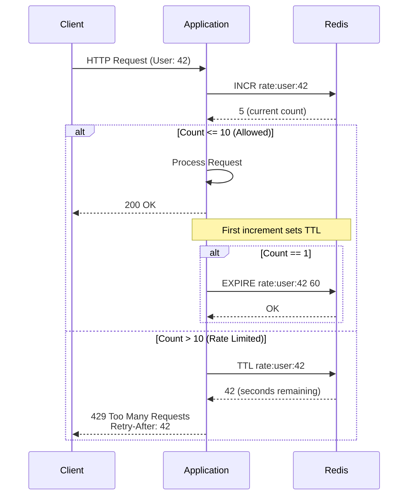
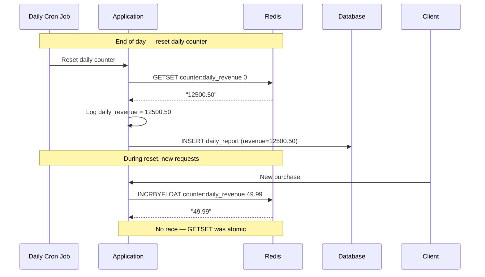
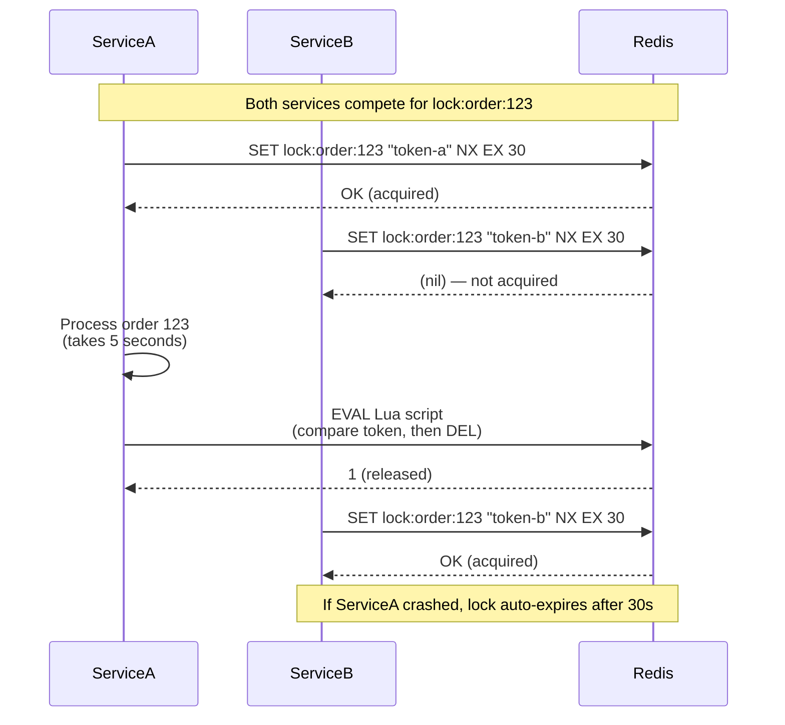

# 8.962 Redis — Strings — INCR, INCRBY, GETSET, SETNX

## Section 1 — Overview

Redis Strings are the most fundamental data type. Beyond basic SET and GET, Redis provides atomic operations for incrementing, conditional setting, and atomic get-and-set. These operations are single-threaded in Redis, meaning they execute without any race conditions. This makes them ideal for counters, distributed locks, rate limiters, and optimistic concurrency patterns.

### Core Commands in This Note

| Command | Signature | O-complexity | Atomic | Description |
|---------|-----------|-------------|--------|-------------|
| INCR | `INCR key` | O(1) | Yes | Atomically increments the integer value at key by 1. If key does not exist, sets to 0 before incrementing. |
| INCRBY | `INCRBY key increment` | O(1) | Yes | Atomically increments by the specified integer value. Supports negative values for decrement. |
| INCRBYFLOAT | `INCRBYFLOAT key increment` | O(1) | Yes | Atomically increments by a floating-point value. Precision-aware for decimal operations. |
| GETSET | `GETSET key value` | O(1) | Yes | Atomically sets key to new value and returns the old value. Single round trip for read-then-write. |
| SETNX | `SETNX key value` | O(1) | Yes | Sets key only if it does not exist. Returns 1 if set, 0 if key already exists. Foundation for distributed locks. |
| SET with NX EX | `SET key value NX EX seconds` | O(1) | Yes | Combines SETNX + EXPIRE in one atomic command. Preferred over separate SETNX + EXPIRE calls. |
| DECR | `DECR key` | O(1) | Yes | Atomic decrement by 1. Equivalent to INCRBY key -1. |
| DECRBY | `DECRBY key decrement` | O(1) | Yes | Atomic decrement by specified value. |

### Atomicity Guarantee

Redis processes commands on a single-threaded event loop. When the server executes INCR, no other command can access or modify that key during the execution. This means:

```
Time    Client A                Client B                Integer Value
----    --------                --------                -------------
T1      INCR counter:1          (idle)                  0 → 1
T2      (idle)                  INCR counter:1          1 → 2
T3      GET counter:1           (idle)                  returns 2
```

Without atomicity, a race condition would allow both clients to read 0 and both write 1. Redis prevents this inherently.

### Why Not Use GET + SET?

```csharp
// BAD — race condition exists between GET and SET
public static async Task<long> NonAtomicIncrementAsync(IDatabase db, string key)
{
    var current = await db.StringGetAsync(key);
    long val = current.IsNull ? 0 : (long)current;
    val++;
    await db.StringSetAsync(key, val);
    return val;
    // Two concurrent calls can both read the same value and both write the same increment
}

// GOOD — INCR is atomic
public static async Task<long> AtomicIncrementAsync(IDatabase db, string key)
{
    return await db.StringIncrementAsync(key);
    // Redis guarantees this executes without interference
}
```

## Section 2 — Command Reference

### INCR — Atomic Increment

```
INCR key

Time complexity: O(1)
Returns: the value of key after the increment

Behavior:
- If key does not exist, it is created with value 0 before incrementing
- If key holds a value that cannot be interpreted as an integer, returns an error
- If key holds a non-integer (e.g., a string), returns WRONGTYPE error
- The integer range is signed 64-bit: -9,223,372,036,854,775,808 to +9,223,372,036,854,775,807
- Operations beyond this range return an overflow error
```

### INCRBY — Increment by Specified Value

```
INCRBY key increment

Time complexity: O(1)
Returns: the value of key after the increment

Behavior:
- Identical to INCR but allows a custom increment value
- increment can be negative (effectively a decrement)
- Same integer range and error conditions as INCR
- DECR / DECRBY are aliases for INCRBY with negative values
```

### INCRBYFLOAT — Floating-Point Increment

```
INCRBYFLOAT key increment

Time complexity: O(1)
Returns: the value of key after the increment as a string representation of the float

Behavior:
- Supports floating-point increments
- Returns the value as a string (to preserve precision)
- Uses double-precision floating point internally
- Can represent values like "3.14", "2.0e10", "-1.5"
- Scientific notation is accepted in the increment argument
```

### GETSET — Atomic Get and Set

```
GETSET key value

Time complexity: O(1)
Returns: the old value stored at key, or nil if key did not exist

Behavior:
- Atomically sets key to value and returns the old value
- Useful for resetting counters without race conditions
- If key does not exist, returns nil and sets the new value
- The old value is returned as a Redis string (can be converted to integer)
- This is the foundation for optimistic reset patterns
```

### SETNX — Set if Not Exists

```
SETNX key value

Time complexity: O(1)
Returns: 1 if the key was set, 0 if the key already exists

Behavior:
- Only sets the key if it does not already exist
- Returns 0 if key exists (no overwrite)
- Does NOT set TTL — use the combined SET NX EX for expiry
- Foundation for distributed locks and deduplication
- Unlike MSETNX, operates on a single key only
```

### SET with NX and EX Combined

```
SET key value NX EX seconds
SET key value NX PX milliseconds
SET key value NX EXAT unix-time-seconds
SET key value NX PXAT unix-time-milliseconds

Time complexity: O(1)
Returns: OK if set, nil if key already exists

Behavior:
- Combines SETNX + EXPIRE in a single atomic command
- NX = only set if key does not exist
- EX = set expiry in seconds
- PX = set expiry in milliseconds
- EXAT = set expiry at absolute Unix timestamp (seconds)
- PXAT = set expiry at absolute Unix timestamp (milliseconds)
- GET parameter (Redis 6.2+): SET key value NX GET returns old value
- Keepttl parameter: SET key value NX KEEPTTL preserves existing TTL
```

### DECR and DECRBY — Atomic Decrement

```
DECR key
DECRBY key decrement

Time complexity: O(1)
Returns: the value of key after the decrement

Behavior:
- DECR is equivalent to INCRBY key -1
- DECRBY is equivalent to INCRBY key -n
- Same atomicity guarantees as INCR/INCRBY
- Same integer range constraints apply
```

## Section 3 — Redis CLI Examples

### Basic INCR and INCRBY

```bash
# INCR — atomic increment by 1
127.0.0.1:6379> SET counter:page:home 0
OK
127.0.0.1:6379> INCR counter:page:home
(integer) 1
127.0.0.1:6379> INCR counter:page:home
(integer) 2
127.0.0.1:6379> INCR counter:page:home
(integer) 3

# INCRBY — increment by custom value
127.0.0.1:6379> INCRBY counter:page:home 10
(integer) 13
127.0.0.1:6379> INCRBY counter:page:home -5
(integer) 8

# INCR on a key that does not exist (creates at 0 first)
127.0.0.1:6379> INCR counter:brand:new
(integer) 1

# INCR on a non-integer value returns error
127.0.0.1:6379> SET mykey "hello"
OK
127.0.0.1:6379> INCR mykey
(error) ERR value is not an integer or out of range
```

### Rate Limiting Pattern with INCR + EXPIRE

```bash
# Rate limiting: allow 10 requests per 60 seconds per user
127.0.0.1:6379> INCR rate:user:42
(integer) 1
127.0.0.1:6379> EXPIRE rate:user:42 60
(integer) 1

# On second request within the same minute:
127.0.0.1:6379> INCR rate:user:42
(integer) 2

# Check current count
127.0.0.1:6379> GET rate:user:42
"2"

# After 60 seconds, the key expires and INCR starts from 1 again
```

### INCRBYFLOAT — Floating-Point Increment

```bash
127.0.0.1:6379> SET meter:reading 100.5
OK
127.0.0.1:6379> INCRBYFLOAT meter:reading 23.7
"124.2"
127.0.0.1:6379> INCRBYFLOAT meter:reading -10.2
"114"
127.0.0.1:6379> INCRBYFLOAT meter:reading 5.0e10
"50000000114"
```

### GETSET — Atomic Get and Old Value

```bash
127.0.0.1:6379> SET counter:daily 500
OK
127.0.0.1:6379> GETSET counter:daily 0
"500"               # Returns old value
127.0.0.1:6379> GET counter:daily
"0"                 # New value is 0

# GETSET on non-existent key returns nil
127.0.0.1:6379> GETSET counter:new "first"
(nil)               # Key did not exist
127.0.0.1:6379> GET counter:new
"first"

# GETSET for CAS (Compare And Swap) pattern
127.0.0.1:6379> WATCH inventory:item:42
OK
127.0.0.1:6379> GET inventory:item:42
"5"
127.0.0.1:6379> MULTI
OK
127.0.0.1:6379> SET inventory:item:42 4
QUEUED
127.0.0.1:6379> EXEC
1) OK               # Only executes if inventory:item:42 was not modified
```

### SETNX — Distributed Lock Building Block

```bash
# Client A tries to acquire lock
127.0.0.1:6379> SETNX lock:order:123 "client-a"
(integer) 1         # Lock acquired

# Client B tries to acquire same lock
127.0.0.1:6379> SETNX lock:order:123 "client-b"
(integer) 0         # Lock not acquired (already held)

# Client A releases the lock
127.0.0.1:6379> DEL lock:order:123
(integer) 1

# Client B retries and acquires
127.0.0.1:6379> SETNX lock:order:123 "client-b"
(integer) 1         # Lock acquired

# PROBLEM: SETNX does not set expiry
# If client B crashes before releasing, lock is held forever
```

### SET NX EX — Atomic Lock with Expiry (PREFERRED)

```bash
# Combined SET with NX and EX in one atomic command
127.0.0.1:6379> SET lock:order:456 "held" NX EX 30
OK                  # Lock acquired with 30-second auto-expiry

# Another client tries
127.0.0.1:6379> SET lock:order:456 "held" NX EX 30
(nil)               # Lock not acquired

# After 30 seconds, the lock auto-expires
127.0.0.1:6379> SET lock:order:456 "held" NX EX 30
OK                  # Lock acquired (previous one expired)

# Using PX for milliseconds
127.0.0.1:6379> SET lock:order:789 "held" NX PX 5000
OK                  # Lock with 5-second expiry

# Using GET for atomic check-and-set
127.0.0.1:6379> SET lock:order:999 "new-owner" NX GET
(nil)               # Lock did not exist, now set to "new-owner"
127.0.0.1:6379> SET lock:order:999 "another-owner" NX GET
"new-owner"         # Returns old value, lock not updated (NX prevents it)
```

### DECR and DECRBY

```bash
127.0.0.1:6379> SET inventory:apples 100
OK
127.0.0.1:6379> DECR inventory:apples
(integer) 99
127.0.0.1:6379> DECRBY inventory:apples 5
(integer) 94

# DECR below 0 continues decrementing (no lower bound besides 64-bit min)
127.0.0.1:6379> SET counter:can-go-negative 0
OK
127.0.0.1:6379> DECR counter:can-go-negative
(integer) -1
127.0.0.1:6379> DECR counter:can-go-negative
(integer) -2
```

## Section 4 — StackExchange.Redis Code

### ConnectionMultiplexer Setup

```csharp
using StackExchange.Redis;

/// <summary>
/// Thread-safe singleton for Redis connection.
/// Designed to be shared application-wide.
/// Never create per-request.
/// </summary>
public sealed class RedisStore : IAsyncDisposable
{
    private static readonly Lazy<Task<RedisStore>> _lazy =
        new Lazy<Task<RedisStore>>(async () =>
        {
            var store = new RedisStore();
            await store.InitializeAsync();
            return store;
        });

    private ConnectionMultiplexer _mux;
    private readonly SemaphoreSlim _initLock = new(1, 1);
    private bool _initialized;
    private bool _disposed;

    private RedisStore() { }

    public static Task<RedisStore> Instance => _lazy.Value;

    private async Task InitializeAsync()
    {
        if (_initialized) return;

        await _initLock.WaitAsync();
        try
        {
            if (_initialized) return;

            string connStr = Environment.GetEnvironmentVariable("REDIS_CONNECTION")
                ?? "localhost:6379,abortConnect=false,connectTimeout=5000,connectRetry=3,keepAlive=60";

            var config = ConfigurationOptions.Parse(connStr);
            config.ClientName = "RedisStore-Singleton";
            config.ReconnectRetryPolicy = new ExponentialRetry(1000, 8000);

            _mux = await ConnectionMultiplexer.ConnectAsync(config);

            _mux.ConnectionFailed += (s, e) =>
            {
                Console.Error.WriteLine($"[RedisStore] Connection FAILED: {e.EndPoint} — {e.Exception?.Message}");
            };

            _mux.ConnectionRestored += (s, e) =>
            {
                Console.WriteLine($"[RedisStore] Connection RESTORED: {e.EndPoint}");
            };

            _mux.ErrorMessage += (s, e) =>
            {
                Console.Error.WriteLine($"[RedisStore] Server error: {e.Message}");
            };

            _initialized = true;
            Console.WriteLine("[RedisStore] ConnectionMultiplexer initialized.");
        }
        finally
        {
            _initLock.Release();
        }
    }

    public IDatabase GetDatabase(int db = -1)
    {
        ObjectDisposedException.ThrowIf(_disposed, this);
        return _mux.GetDatabase(db);
    }

    public IServer GetServer()
    {
        ObjectDisposedException.ThrowIf(_disposed, this);
        var endpoint = _mux.GetEndPoints().FirstOrDefault()
            ?? throw new InvalidOperationException("No endpoints available");
        return _mux.GetServer(endpoint);
    }

    public async ValueTask DisposeAsync()
    {
        if (_disposed) return;
        _disposed = true;
        if (_mux != null)
        {
            await _mux.CloseAsync();
            _mux.Dispose();
        }
        _initLock.Dispose();
    }
}
```

### IDatabase — INCR and INCRBY

```csharp
/// <summary>
/// Demonstrates atomic increment operations with StackExchange.Redis.
/// Each method includes error handling for connection failures, timeouts, and type errors.
/// </summary>
public static class IncrementExamples
{
    /// <summary>
    /// Gets the Redis database from the shared singleton connection.
    /// </summary>
    private static async Task<IDatabase> GetDbAsync()
    {
        var store = await RedisStore.Instance;
        return store.GetDatabase();
    }

    /// <summary>
    /// Basic INCR — atomically increments a counter by 1.
    /// Creates key with value 0 if it does not exist.
    /// </summary>
    public static async Task<long> IncrementAsync(string key)
    {
        var db = await GetDbAsync();

        try
        {
            long newValue = await db.StringIncrementAsync(key);
            Console.WriteLine($"INCR {key} → {newValue}");
            return newValue;
        }
        catch (RedisConnectionException ex)
        {
            Console.Error.WriteLine($"Redis connection failed during INCR {key}: {ex.Message}");
            throw new InvalidOperationException($"Cannot increment {key}: Redis unavailable", ex);
        }
        catch (RedisServerException ex) when (ex.Message.Contains("WRONGTYPE"))
        {
            Console.Error.WriteLine($"WRONGTYPE: Key '{key}' is not an integer string.");
            throw new InvalidOperationException($"Key '{key}' holds a non-integer value", ex);
        }
        catch (RedisServerException ex) when (ex.Message.Contains("overflow"))
        {
            Console.Error.WriteLine($"Overflow: Key '{key}' exceeded 64-bit integer range.");
            throw new OverflowException($"Counter '{key}' exceeded 64-bit signed integer range", ex);
        }
        catch (TimeoutException ex)
        {
            Console.Error.WriteLine($"Timeout during INCR {key}: {ex.Message}");
            throw new TimeoutException($"Redis operation timed out for key '{key}'", ex);
        }
    }

    /// <summary>
    /// INCRBY — atomically increments by a specified amount.
    /// Amount can be negative for decrement.
    /// </summary>
    public static async Task<long> IncrementByAsync(string key, long amount)
    {
        var db = await GetDbAsync();

        try
        {
            long newValue = await db.StringIncrementAsync(key, amount);
            Console.WriteLine($"INCRBY {key} {amount} → {newValue}");
            return newValue;
        }
        catch (RedisConnectionException ex)
        {
            Console.Error.WriteLine($"Redis connection failed during INCRBY {key}: {ex.Message}");
            throw;
        }
        catch (RedisServerException ex)
        {
            Console.Error.WriteLine($"Redis server error during INCRBY {key}: {ex.Message}");
            throw;
        }
        catch (TimeoutException ex)
        {
            Console.Error.WriteLine($"Timeout during INCRBY {key}: {ex.Message}");
            throw;
        }
    }

    /// <summary>
    /// INCRBYFLOAT — increments by a floating-point value.
    /// Returns the result as a double.
    /// </summary>
    public static async Task<double> IncrementFloatAsync(string key, double amount)
    {
        var db = await GetDbAsync();

        try
        {
            RedisValue result = await db.StringIncrementAsync(key, amount);
            double newValue = (double)result;
            Console.WriteLine($"INCRBYFLOAT {key} {amount} → {newValue}");
            return newValue;
        }
        catch (RedisConnectionException ex)
        {
            Console.Error.WriteLine($"Redis connection failed during INCRBYFLOAT {key}: {ex.Message}");
            throw;
        }
        catch (RedisServerException ex)
        {
            Console.Error.WriteLine($"Redis server error during INCRBYFLOAT {key}: {ex.Message}");
            throw;
        }
        catch (TimeoutException ex)
        {
            Console.Error.WriteLine($"Timeout during INCRBYFLOAT {key}: {ex.Message}");
            throw;
        }
    }

    /// <summary>
    /// DECR — atomically decrements by 1.
    /// Equivalent to INCRBY key -1.
    /// </summary>
    public static async Task<long> DecrementAsync(string key)
    {
        var db = await GetDbAsync();

        try
        {
            long newValue = await db.StringDecrementAsync(key);
            Console.WriteLine($"DECR {key} → {newValue}");
            return newValue;
        }
        catch (RedisConnectionException ex)
        {
            Console.Error.WriteLine($"Redis connection failed during DECR {key}: {ex.Message}");
            throw;
        }
        catch (RedisServerException ex)
        {
            Console.Error.WriteLine($"Redis server error during DECR {key}: {ex.Message}");
            throw;
        }
        catch (TimeoutException ex)
        {
            Console.Error.WriteLine($"Timeout during DECR {key}: {ex.Message}");
            throw;
        }
    }

    /// <summary>
    /// DECRBY — atomically decrements by specified amount.
    /// Equivalent to INCRBY key -amount.
    /// </summary>
    public static async Task<long> DecrementByAsync(string key, long amount)
    {
        var db = await GetDbAsync();

        try
        {
            long newValue = await db.StringDecrementAsync(key, amount);
            Console.WriteLine($"DECRBY {key} {amount} → {newValue}");
            return newValue;
        }
        catch (RedisConnectionException ex)
        {
            Console.Error.WriteLine($"Redis connection failed during DECRBY {key}: {ex.Message}");
            throw;
        }
        catch (RedisServerException ex)
        {
            Console.Error.WriteLine($"Redis server error during DECRBY {key}: {ex.Message}");
            throw;
        }
        catch (TimeoutException ex)
        {
            Console.Error.WriteLine($"Timeout during DECRBY {key}: {ex.Message}");
            throw;
        }
    }

    /// <summary>
    /// Rate-limited INCR with automatic expiry reset.
    /// Sets a TTL on first increment, extends on subsequent increments.
    /// </summary>
    public static async Task<(long Count, bool IsNewWindow)> IncrementWithWindowAsync(
        string key, TimeSpan windowDuration)
    {
        var db = await GetDbAsync();

        try
        {
            // First increment
            long count = await db.StringIncrementAsync(key);

            // If this is the first increment, set expiry
            if (count == 1)
            {
                await db.KeyExpireAsync(key, windowDuration);
                Console.WriteLine($"INCR {key} → 1 (new window, TTL set to {windowDuration.TotalSeconds}s)");
                return (1, true);
            }

            Console.WriteLine($"INCR {key} → {count} (existing window)");
            return (count, false);
        }
        catch (Exception ex)
        {
            Console.Error.WriteLine($"Error in IncrementWithWindow for {key}: {ex.Message}");
            throw;
        }
    }
}
```

### IDatabase — GETSET

```csharp
/// <summary>
/// Demonstrates GETSET — atomic get-and-set operation.
/// Returns the previous value and sets a new value in one operation.
/// </summary>
public static class GetSetExamples
{
    private static async Task<IDatabase> GetDbAsync()
    {
        var store = await RedisStore.Instance;
        return store.GetDatabase();
    }

    /// <summary>
    /// GETSET — atomically sets new value and returns old value.
    /// If key does not exist, returns nil and sets the value.
    /// </summary>
    public static async Task<string> GetSetAsync(string key, string newValue)
    {
        var db = await GetDbAsync();

        try
        {
            RedisValue oldValue = await db.StringGetSetAsync(key, newValue);

            if (oldValue.IsNull)
            {
                Console.WriteLine($"GETSET {key} → (nil) → \"{newValue}\" (key created)");
                return null;
            }

            Console.WriteLine($"GETSET {key} → \"{oldValue}\" → \"{newValue}\"");
            return oldValue.ToString();
        }
        catch (RedisConnectionException ex)
        {
            Console.Error.WriteLine($"Redis connection failed during GETSET {key}: {ex.Message}");
            throw;
        }
        catch (RedisServerException ex)
        {
            Console.Error.WriteLine($"Redis server error during GETSET {key}: {ex.Message}");
            throw;
        }
        catch (TimeoutException ex)
        {
            Console.Error.WriteLine($"Timeout during GETSET {key}: {ex.Message}");
            throw;
        }
    }

    /// <summary>
    /// Atomically resets a counter and returns the previous count.
    /// Useful for daily counters where you want to read-and-reset.
    /// </summary>
    public static async Task<long> ResetAndGetPreviousAsync(string key)
    {
        var db = await GetDbAsync();

        try
        {
            // GETSET returns the old value as string, then sets to "0"
            RedisValue oldValue = await db.StringGetSetAsync(key, "0");

            if (oldValue.IsNull)
            {
                Console.WriteLine($"GETSET {key} → (nil, counter did not exist)");
                return 0;
            }

            // Try to parse as long (may fail if value is not an integer)
            if (long.TryParse(oldValue.ToString(), out long previous))
            {
                Console.WriteLine($"GETSET {key} → {previous} (counter reset to 0)");
                return previous;
            }

            Console.WriteLine($"GETSET {key} → \"{oldValue}\" (non-integer, counter reset to 0)");
            return 0;
        }
        catch (RedisConnectionException ex)
        {
            Console.Error.WriteLine($"Redis connection failed during GETSET {key}: {ex.Message}");
            throw;
        }
        catch (RedisServerException ex)
        {
            Console.Error.WriteLine($"Redis server error during GETSET {key}: {ex.Message}");
            throw;
        }
        catch (TimeoutException ex)
        {
            Console.Error.WriteLine($"Timeout during GETSET {key}: {ex.Message}");
            throw;
        }
    }

    /// <summary>
    /// CAS (Compare-And-Swap) pattern using GETSET with WATCH.
    /// Atomically updates a value only if it matches the expected current value.
    /// </summary>
    public static async Task<bool> CompareAndSwapAsync(string key, string expectedValue, string newValue)
    {
        var db = await GetDbAsync();

        try
        {
            // Start a transaction with WATCH
            var tran = db.CreateTransaction();

            // Condition: the key must still hold the expected value
            tran.AddCondition(Condition.StringEqual(key, expectedValue));

            // Queue the SET operation
            var setTask = tran.StringSetAsync(key, newValue);

            // Execute transaction atomically
            bool committed = await tran.ExecuteAsync();

            if (committed)
            {
                bool setResult = await setTask;
                Console.WriteLine($"CAS {key}: \"{expectedValue}\" → \"{newValue}\" — SUCCESS");
                return true;
            }

            Console.WriteLine($"CAS {key}: \"{expectedValue}\" → \"{newValue}\" — FAILED (value changed)");
            return false;
        }
        catch (RedisConnectionException ex)
        {
            Console.Error.WriteLine($"Redis connection failed during CAS {key}: {ex.Message}");
            throw;
        }
        catch (RedisServerException ex)
        {
            Console.Error.WriteLine($"Redis server error during CAS {key}: {ex.Message}");
            throw;
        }
        catch (TimeoutException ex)
        {
            Console.Error.WriteLine($"Timeout during CAS {key}: {ex.Message}");
            throw;
        }
    }
}
```

### IDatabase — SETNX (SET if Not Exists)

```csharp
/// <summary>
/// Demonstrates SETNX and the combined SET NX EX pattern for distributed locking.
/// SET NX EX is the preferred approach for distributed locks.
/// </summary>
public static class SetNxExamples
{
    private static async Task<IDatabase> GetDbAsync()
    {
        var store = await RedisStore.Instance;
        return store.GetDatabase();
    }

    /// <summary>
    /// Basic SETNX — sets a key only if it does not exist.
    /// WARNING: Does NOT set TTL. Prefer SetWithNxAndExpiryAsync instead.
    /// </summary>
    [Obsolete("Use SetWithNxAndExpiryAsync instead — SETNX does not set TTL")]
    public static async Task<bool> SetNxAsync(string key, string value)
    {
        var db = await GetDbAsync();

        try
        {
            bool result = await db.StringSetAsync(key, value, when: When.NotExists);
            Console.WriteLine($"SETNX {key} \"{value}\" → {(result ? "OK (set)" : "FAIL (exists)")}");
            return result;
        }
        catch (RedisConnectionException ex)
        {
            Console.Error.WriteLine($"Redis connection failed during SETNX {key}: {ex.Message}");
            throw;
        }
        catch (RedisServerException ex)
        {
            Console.Error.WriteLine($"Redis server error during SETNX {key}: {ex.Message}");
            throw;
        }
        catch (TimeoutException ex)
        {
            Console.Error.WriteLine($"Timeout during SETNX {key}: {ex.Message}");
            throw;
        }
    }

    /// <summary>
    /// SET NX EX — atomic set-if-not-exists with expiry.
    /// This is the correct way to implement distributed locks.
    /// </summary>
    public static async Task<bool> SetWithNxAndExpiryAsync(string key, string value, TimeSpan expiry)
    {
        var db = await GetDbAsync();

        try
        {
            bool result = await db.StringSetAsync(key, value, expiry, When.NotExists);
            Console.WriteLine($"SET {key} \"{value}\" NX EX {expiry.TotalSeconds}s → {(result ? "LOCKED" : "FAIL (exists)")}");
            return result;
        }
        catch (RedisConnectionException ex)
        {
            Console.Error.WriteLine($"Redis connection failed during SET NX EX {key}: {ex.Message}");
            throw;
        }
        catch (RedisServerException ex)
        {
            Console.Error.WriteLine($"Redis server error during SET NX EX {key}: {ex.Message}");
            throw;
        }
        catch (TimeoutException ex)
        {
            Console.Error.WriteLine($"Timeout during SET NX EX {key}: {ex.Message}");
            throw;
        }
    }

    /// <summary>
    /// Distributed lock using SET NX EX with unique lock value for safe release.
    /// The lock value is a unique token that identifies the lock holder.
    /// </summary>
    public static async Task<bool> AcquireLockAsync(string lockKey, string lockToken, TimeSpan expiry)
    {
        var db = await GetDbAsync();

        try
        {
            bool acquired = await db.StringSetAsync(
                $"lock:{lockKey}",
                lockToken,
                expiry,
                When.NotExists);

            Console.WriteLine($"Acquire lock:{lockKey} token={lockToken} expiry={expiry.TotalSeconds}s → {(acquired ? "ACQUIRED" : "FAILED")}");
            return acquired;
        }
        catch (RedisConnectionException ex)
        {
            Console.Error.WriteLine($"Redis connection failed during lock acquire {lockKey}: {ex.Message}");
            throw;
        }
        catch (RedisServerException ex)
        {
            Console.Error.WriteLine($"Redis server error during lock acquire {lockKey}: {ex.Message}");
            throw;
        }
        catch (TimeoutException ex)
        {
            Console.Error.WriteLine($"Timeout during lock acquire {lockKey}: {ex.Message}");
            throw;
        }
    }

    /// <summary>
    /// Safely releases a distributed lock using Lua scripting.
    /// Only releases if the lock value matches (prevents releasing another owner's lock).
    /// </summary>
    public static async Task<bool> ReleaseLockAsync(string lockKey, string lockToken)
    {
        var db = await GetDbAsync();

        try
        {
            // Lua script: atomically compare token and delete
            const string script = @"
                if redis.call('GET', KEYS[1]) == ARGV[1] then
                    return redis.call('DEL', KEYS[1])
                else
                    return 0
                end";

            var result = await db.ScriptEvaluateAsync(
                script,
                new RedisKey[] { $"lock:{lockKey}" },
                new RedisValue[] { lockToken });

            bool released = (int)result == 1;
            Console.WriteLine($"Release lock:{lockKey} token={lockToken} → {(released ? "RELEASED" : "FAILED (not owner)")}");
            return released;
        }
        catch (RedisConnectionException ex)
        {
            Console.Error.WriteLine($"Redis connection failed during lock release {lockKey}: {ex.Message}");
            throw;
        }
        catch (RedisServerException ex)
        {
            Console.Error.WriteLine($"Redis server error during lock release {lockKey}: {ex.Message}");
            throw;
        }
        catch (TimeoutException ex)
        {
            Console.Error.WriteLine($"Timeout during lock release {lockKey}: {ex.Message}");
            throw;
        }
    }

    /// <summary>
    /// Extends a distributed lock (only if still owned by this token).
    /// </summary>
    public static async Task<bool> ExtendLockAsync(string lockKey, string lockToken, TimeSpan additionalExpiry)
    {
        var db = await GetDbAsync();

        try
        {
            const string script = @"
                if redis.call('GET', KEYS[1]) == ARGV[1] then
                    return redis.call('PEXPIRE', KEYS[1], ARGV[2])
                else
                    return 0
                end";

            var result = await db.ScriptEvaluateAsync(
                script,
                new RedisKey[] { $"lock:{lockKey}" },
                new RedisValue[] { lockToken, ((long)additionalExpiry.TotalMilliseconds).ToString() });

            bool extended = (int)result == 1;
            Console.WriteLine($"Extend lock:{lockKey} token={lockToken} +{additionalExpiry.TotalSeconds}s → {(extended ? "EXTENDED" : "FAILED (not owner)")}");
            return extended;
        }
        catch (RedisConnectionException ex)
        {
            Console.Error.WriteLine($"Redis connection failed during lock extend {lockKey}: {ex.Message}");
            throw;
        }
        catch (RedisServerException ex)
        {
            Console.Error.WriteLine($"Redis server error during lock extend {lockKey}: {ex.Message}");
            throw;
        }
        catch (TimeoutException ex)
        {
            Console.Error.WriteLine($"Timeout during lock extend {lockKey}: {ex.Message}");
            throw;
        }
    }
}
```

### Full Distributed Lock Implementation

```csharp
/// <summary>
/// Complete distributed lock implementation using Redis SET NX EX.
/// Thread-safe, with automatic release via IAsyncDisposable.
/// </summary>
public sealed class RedisDistributedLock : IAsyncDisposable
{
    private readonly IDatabase _db;
    private readonly string _lockKey;
    private readonly string _lockToken;
    private readonly TimeSpan _expiry;
    private readonly TimeSpan _retryInterval;
    private readonly int _maxRetries;
    private bool _isHeld;
    private bool _disposed;
    private readonly SemaphoreSlim _lock = new(1, 1);

    /// <summary>
    /// Creates a distributed lock instance.
    /// </summary>
    /// <param name="db">Redis IDatabase instance.</param>
    /// <param name="lockKey">The lock key (without "lock:" prefix).</param>
    /// <param name="expiry">Maximum time the lock is held before auto-release.</param>
    /// <param name="retryInterval">Time between retry attempts to acquire the lock.</param>
    /// <param name="maxRetries">Maximum retry attempts (-1 for infinite).</param>
    public RedisDistributedLock(
        IDatabase db,
        string lockKey,
        TimeSpan? expiry = null,
        TimeSpan? retryInterval = null,
        int maxRetries = -1)
    {
        _db = db ?? throw new ArgumentNullException(nameof(db));
        _lockKey = $"lock:{lockKey}";
        _lockToken = Guid.NewGuid().ToString("N"); // Unique token per instance
        _expiry = expiry ?? TimeSpan.FromSeconds(30);
        _retryInterval = retryInterval ?? TimeSpan.FromMilliseconds(100);
        _maxRetries = maxRetries;
    }

    /// <summary>
    /// Attempts to acquire the lock. Returns immediately if unsuccessful.
    /// </summary>
    public async Task<bool> TryAcquireAsync()
    {
        ObjectDisposedException.ThrowIf(_disposed, this);

        try
        {
            _isHeld = await _db.StringSetAsync(_lockKey, _lockToken, _expiry, When.NotExists);

            if (_isHeld)
            {
                _ = Task.Run(() => StartHeartbeatAsync());
            }

            return _isHeld;
        }
        catch (RedisConnectionException ex)
        {
            Console.Error.WriteLine($"Redis connection error acquiring lock {_lockKey}: {ex.Message}");
            return false;
        }
        catch (RedisServerException ex)
        {
            Console.Error.WriteLine($"Redis server error acquiring lock {_lockKey}: {ex.Message}");
            return false;
        }
        catch (TimeoutException ex)
        {
            Console.Error.WriteLine($"Redis timeout acquiring lock {_lockKey}: {ex.Message}");
            return false;
        }
    }

    /// <summary>
    /// Attempts to acquire the lock, retrying up to maxRetries times.
    /// </summary>
    public async Task<bool> AcquireWithRetryAsync(CancellationToken ct = default)
    {
        int attempts = 0;

        while (!ct.IsCancellationRequested && (_maxRetries == -1 || attempts < _maxRetries))
        {
            attempts++;

            if (await TryAcquireAsync())
            {
                Console.WriteLine($"Lock {_lockKey} acquired after {attempts} attempt(s)");
                return true;
            }

            if (ct.IsCancellationRequested) break;

            Console.WriteLine($"Lock {_lockKey} not available (attempt {attempts}), retrying in {_retryInterval.TotalMilliseconds}ms...");
            await Task.Delay(_retryInterval, ct);
        }

        Console.WriteLine($"Lock {_lockKey} could not be acquired after {attempts} attempts");
        return false;
    }

    /// <summary>
    /// Background heartbeat that extends the lock TTL while held.
    /// Prevents the lock from expiring while the holder is still working.
    /// </summary>
    private async Task StartHeartbeatAsync()
    {
        var heartbeatInterval = TimeSpan.FromMilliseconds(_expiry.TotalMilliseconds * 0.75);

        while (_isHeld && !_disposed)
        {
            try
            {
                await Task.Delay(heartbeatInterval);

                if (!_isHeld || _disposed) break;

                // Extend the lock using Lua script (only if we still hold it)
                const string script = @"
                    if redis.call('GET', KEYS[1]) == ARGV[1] then
                        return redis.call('PEXPIRE', KEYS[1], ARGV[2])
                    else
                        return 0
                    end";

                var result = await _db.ScriptEvaluateAsync(
                    script,
                    new RedisKey[] { _lockKey },
                    new RedisValue[] { _lockToken, ((long)_expiry.TotalMilliseconds).ToString() });

                if ((int)result == 0)
                {
                    Console.WriteLine($"Lock {_lockKey} lost (another instance may have released or expired it)");
                    _isHeld = false;
                    break;
                }
            }
            catch (Exception ex)
            {
                Console.Error.WriteLine($"Heartbeat error for lock {_lockKey}: {ex.Message}");
                // Continue heartbeat loop despite transient errors
            }
        }
    }

    /// <summary>
    /// Releases the lock if it is held by this instance.
    /// </summary>
    public async Task ReleaseAsync()
    {
        if (!_isHeld || _disposed) return;

        await _lock.WaitAsync();
        try
        {
            if (!_isHeld || _disposed) return;

            // Lua script: atomically delete only if we still own the lock
            const string script = @"
                if redis.call('GET', KEYS[1]) == ARGV[1] then
                    return redis.call('DEL', KEYS[1])
                else
                    return 0
                end";

            var result = await _db.ScriptEvaluateAsync(
                script,
                new RedisKey[] { _lockKey },
                new RedisValue[] { _lockToken });

            _isHeld = false;
            Console.WriteLine($"Lock {_lockKey} released");
        }
        catch (RedisConnectionException ex)
        {
            Console.Error.WriteLine($"Redis connection error releasing lock {_lockKey}: {ex.Message}");
            // Lock will auto-release via TTL
        }
        catch (RedisServerException ex)
        {
            Console.Error.WriteLine($"Redis server error releasing lock {_lockKey}: {ex.Message}");
        }
        catch (TimeoutException ex)
        {
            Console.Error.WriteLine($"Redis timeout releasing lock {_lockKey}: {ex.Message}");
        }
        finally
        {
            _lock.Release();
        }
    }

    /// <summary>
    /// Disposes the lock, releasing it if held.
    /// </summary>
    public async ValueTask DisposeAsync()
    {
        if (_disposed) return;
        _disposed = true;
        await ReleaseAsync();
        _lock.Dispose();
    }
}
```

### Rate Limiting with INCR + EXPIRE

```csharp
/// <summary>
/// Sliding window rate limiter using Redis INCR + EXPIRE.
/// Tracks requests per user within a time window.
/// </summary>
public class RedisRateLimiter
{
    private readonly IDatabase _db;
    private readonly int _maxRequests;
    private readonly TimeSpan _windowDuration;

    /// <summary>
    /// Creates a rate limiter.
    /// </summary>
    /// <param name="db">Redis IDatabase.</param>
    /// <param name="maxRequests">Maximum requests allowed in the window.</param>
    /// <param name="windowDuration">Duration of the rate limit window.</param>
    public RedisRateLimiter(IDatabase db, int maxRequests, TimeSpan windowDuration)
    {
        _db = db ?? throw new ArgumentNullException(nameof(db));
        _maxRequests = maxRequests > 0 ? maxRequests : throw new ArgumentOutOfRangeException(nameof(maxRequests));
        _windowDuration = windowDuration;
    }

    /// <summary>
    /// Checks if a request is allowed for the given user.
    /// Returns true if under the limit, false if rate limited.
    /// </summary>
    public async Task<bool> IsRequestAllowedAsync(string userId)
    {
        string key = $"ratelimit:{userId}:{_windowDuration.TotalSeconds}s";

        try
        {
            long currentCount = await _db.StringIncrementAsync(key);

            // First request in this window — set expiry
            if (currentCount == 1)
            {
                await _db.KeyExpireAsync(key, _windowDuration);
            }

            bool allowed = currentCount <= _maxRequests;

            if (!allowed)
            {
                Console.WriteLine($"Rate limit exceeded for {userId}: {currentCount}/{_maxRequests} in {_windowDuration.TotalSeconds}s");
            }

            return allowed;
        }
        catch (RedisConnectionException ex)
        {
            Console.Error.WriteLine($"Redis connection error during rate check for {userId}: {ex.Message}");
            // Fail open or closed depending on requirements
            return true; // Fail open — allow request if Redis is down
        }
        catch (RedisServerException ex)
        {
            Console.Error.WriteLine($"Redis server error during rate check for {userId}: {ex.Message}");
            return true; // Fail open
        }
        catch (TimeoutException ex)
        {
            Console.Error.WriteLine($"Redis timeout during rate check for {userId}: {ex.Message}");
            return true; // Fail open
        }
    }

    /// <summary>
    /// Gets the current request count for a user within the current window.
    /// </summary>
    public async Task<long> GetCurrentCountAsync(string userId)
    {
        string key = $"ratelimit:{userId}:{_windowDuration.TotalSeconds}s";

        try
        {
            var val = await _db.StringGetAsync(key);
            return val.IsNull ? 0 : (long)val;
        }
        catch (Exception ex)
        {
            Console.Error.WriteLine($"Error getting rate limit count for {userId}: {ex.Message}");
            return 0;
        }
    }

    /// <summary>
    /// Returns the number of remaining requests for the user in the current window.
    /// </summary>
    public async Task<long> GetRemainingRequestsAsync(string userId)
    {
        long current = await GetCurrentCountAsync(userId);
        return Math.Max(0, _maxRequests - current);
    }

    /// <summary>
    /// Returns the TTL of the rate limit window (seconds remaining).
    /// </summary>
    public async Task<TimeSpan?> GetWindowTimeRemainingAsync(string userId)
    {
        string key = $"ratelimit:{userId}:{_windowDuration.TotalSeconds}s";

        try
        {
            return await _db.KeyTimeToLiveAsync(key);
        }
        catch (Exception ex)
        {
            Console.Error.WriteLine($"Error getting window TTL for {userId}: {ex.Message}");
            return null;
        }
    }
}
```

### Atomic Counter Service

```csharp
/// <summary>
/// Production-ready counter service with atomic operations.
/// Supports increment, decrement, reset, and read operations.
/// </summary>
public sealed class RedisCounterService
{
    private readonly IDatabase _db;
    private readonly string _keyPrefix = "counter:";

    public RedisCounterService(IDatabase db)
    {
        _db = db ?? throw new ArgumentNullException(nameof(db));
    }

    /// <summary>
    /// Increments the counter by 1.
    /// </summary>
    public async Task<long> IncrementAsync(string counterName)
    {
        return await _db.StringIncrementAsync($"{_keyPrefix}{counterName}");
    }

    /// <summary>
    /// Increments the counter by a specified amount.
    /// </summary>
    public async Task<long> IncrementByAsync(string counterName, long amount)
    {
        return await _db.StringIncrementAsync($"{_keyPrefix}{counterName}", amount);
    }

    /// <summary>
    /// Decrements the counter by 1.
    /// </summary>
    public async Task<long> DecrementAsync(string counterName)
    {
        return await _db.StringDecrementAsync($"{_keyPrefix}{counterName}");
    }

    /// <summary>
    /// Decrements the counter by a specified amount.
    /// </summary>
    public async Task<long> DecrementByAsync(string counterName, long amount)
    {
        return await _db.StringDecrementAsync($"{_keyPrefix}{counterName}", amount);
    }

    /// <summary>
    /// Gets the current counter value (non-destructive read).
    /// </summary>
    public async Task<long> GetAsync(string counterName)
    {
        var value = await _db.StringGetAsync($"{_keyPrefix}{counterName}");
        return value.IsNull ? 0 : (long)value;
    }

    /// <summary>
    /// Sets the counter to a specific value.
    /// </summary>
    public async Task SetAsync(string counterName, long value)
    {
        await _db.StringSetAsync($"{_keyPrefix}{counterName}", value);
    }

    /// <summary>
    /// Resets the counter and returns the previous value atomically.
    /// Uses GETSET to avoid race conditions.
    /// </summary>
    public async Task<long> ResetAndGetPreviousAsync(string counterName)
    {
        var oldValue = await _db.StringGetSetAsync($"{_keyPrefix}{counterName}", "0");
        return oldValue.IsNull ? 0 : (long)oldValue;
    }

    /// <summary>
    /// Increments with a time-to-live for time-window counters.
    /// </summary>
    public async Task<long> IncrementWithWindowAsync(string counterName, TimeSpan window)
    {
        string key = $"{_keyPrefix}{counterName}:windowed";

        long count = await _db.StringIncrementAsync(key);
        if (count == 1)
        {
            await _db.KeyExpireAsync(key, window);
        }
        return count;
    }

    /// <summary>
    /// Increments the counter and sets expiry on every call (rolling window).
    /// </summary>
    public async Task<long> IncrementWithRollingExpiryAsync(string counterName, TimeSpan expiry)
    {
        string key = $"{_keyPrefix}{counterName}:rolling";
        long count = await _db.StringIncrementAsync(key);
        await _db.KeyExpireAsync(key, expiry);
        return count;
    }

    /// <summary>
    /// Gets the current value and expiry for a counter.
    /// </summary>
    public async Task<(long Value, TimeSpan? Ttl)> GetWithExpiryAsync(string counterName)
    {
        string key = $"{_keyPrefix}{counterName}";
        var batch = _db.CreateBatch();

        var getTask = batch.StringGetAsync(key);
        var ttlTask = batch.KeyTimeToLiveAsync(key);

        batch.Execute();

        await Task.WhenAll(getTask, ttlTask);

        long value = getTask.Result.IsNull ? 0 : (long)getTask.Result;
        return (value, ttlTask.Result);
    }
}
```

## Section 5 — Use Cases

### Distributed Rate Limiting



### Atomic Counter Reset with GETSET



### Distributed Lock with SET NX EX



### Optimistic Concurrency with GETSET

```csharp
/// <summary>
/// Optimistic concurrency pattern using GETSET.
/// Used for inventory management, ticket sales, etc.
/// </summary>
public class OptimisticInventory
{
    private readonly IDatabase _db;
    private readonly string _keyPrefix = "inventory:";

    public OptimisticInventory(IDatabase db) => _db = db;

    /// <summary>
    /// Attempts to reserve items using GETSET + WATCH/MULTI/EXEC.
    /// Returns true if enough inventory was available.
    /// </summary>
    public async Task<bool> TryReserveAsync(string sku, int quantity)
    {
        string key = $"{_keyPrefix}{sku}";

        try
        {
            // Retry loop for optimistic concurrency
            for (int attempt = 0; attempt < 3; attempt++)
            {
                var tran = _db.CreateTransaction();

                // Add condition: key must exist
                tran.AddCondition(Condition.KeyExists(key));

                // Read current quantity
                var getTask = tran.StringGetAsync(key);

                // Execute the WATCH + MULTI
                bool committed = await tran.ExecuteAsync();

                if (!committed)
                {
                    Console.WriteLine($"Inventory {sku} was modified by another transaction, retrying ({attempt + 1}/3)");
                    continue;
                }

                long currentStock = getTask.Result.IsNull ? 0 : (long)getTask.Result;

                if (currentStock < quantity)
                {
                    Console.WriteLine($"Insufficient stock for {sku}: {currentStock} < {quantity}");
                    return false;
                }

                // Now execute the decrement in a second transaction
                var updateTran = _db.CreateTransaction();
                updateTran.AddCondition(Condition.StringEqual(key, currentStock.ToString()));
                var decrTask = updateTran.StringDecrementAsync(key, quantity);
                bool updateCommitted = await updateTran.ExecuteAsync();

                if (updateCommitted)
                {
                    long remaining = await decrTask;
                    Console.WriteLine($"Reserved {quantity} of {sku}. Remaining: {remaining}");
                    return true;
                }

                Console.WriteLine($"Inventory {sku} changed during reservation, retrying ({attempt + 1}/3)");
            }

            Console.WriteLine($"Failed to reserve {sku} after 3 attempts");
            return false;
        }
        catch (Exception ex)
        {
            Console.Error.WriteLine($"Error reserving inventory {sku}: {ex.Message}");
            throw;
        }
    }
}
```

### Session Token Management

```csharp
/// <summary>
/// Session token management using SETNX for idempotent login.
/// </summary>
public class SessionManager
{
    private readonly IDatabase _db;
    private static readonly TimeSpan SessionDuration = TimeSpan.FromHours(8);

    public SessionManager(IDatabase db) => _db = db;

    /// <summary>
    /// Creates a session. Returns existing session token if already logged in.
    /// </summary>
    public async Task<string> CreateSessionAsync(string userId)
    {
        string sessionKey = $"session:user:{userId}";
        string sessionToken = Guid.NewGuid().ToString("N");

        try
        {
            // Try to set session token — if already exists, this fails
            bool created = await _db.StringSetAsync(
                sessionKey,
                sessionToken,
                SessionDuration,
                When.NotExists);

            if (created)
            {
                Console.WriteLine($"New session created for user {userId}");
                return sessionToken;
            }

            // Session already exists — return existing token
            var existingToken = await _db.StringGetAsync(sessionKey);
            Console.WriteLine($"User {userId} already has an active session");

            // Optionally extend the existing session
            await _db.KeyExpireAsync(sessionKey, SessionDuration);

            return existingToken.ToString();
        }
        catch (RedisConnectionException ex)
        {
            Console.Error.WriteLine($"Redis error creating session for {userId}: {ex.Message}");
            throw;
        }
        catch (TimeoutException ex)
        {
            Console.Error.WriteLine($"Timeout creating session for {userId}: {ex.Message}");
            throw;
        }
    }

    /// <summary>
    /// Validates a session token.
    /// </summary>
    public async Task<bool> ValidateSessionAsync(string userId, string token)
    {
        string sessionKey = $"session:user:{userId}";

        try
        {
            var stored = await _db.StringGetAsync(sessionKey);
            bool valid = !stored.IsNull && stored.ToString() == token;

            if (valid)
            {
                // Slide expiration
                await _db.KeyExpireAsync(sessionKey, SessionDuration);
            }

            return valid;
        }
        catch (Exception ex)
        {
            Console.Error.WriteLine($"Error validating session for {userId}: {ex.Message}");
            return false; // Fail closed for security-critical validation
        }
    }

    /// <summary>
    /// Invalidates a session on logout.
    /// </summary>
    public async Task InvalidateSessionAsync(string userId)
    {
        string sessionKey = $"session:user:{userId}";

        try
        {
            await _db.KeyDeleteAsync(sessionKey);
            Console.WriteLine($"Session invalidated for user {userId}");
        }
        catch (Exception ex)
        {
            Console.Error.WriteLine($"Error invalidating session for {userId}: {ex.Message}");
        }
    }
}
```

## Section 6 — Performance Considerations

### O-Complexity Analysis

All commands in this note are O(1) — they execute in constant time regardless of the number of keys in the database or the size of the value. This makes them suitable for high-throughput operations.

| Command | O-complexity | Scaling characteristic |
|---------|-------------|----------------------|
| INCR | O(1) | Constant — no dependency on database size |
| INCRBY | O(1) | Constant — increment value size does not affect time |
| INCRBYFLOAT | O(1) | Constant — floating-point parsing is fixed cost |
| GETSET | O(1) | Constant — single key operation |
| SETNX | O(1) | Constant — single key existence check |
| SET NX EX | O(1) | Constant — combined operation same cost |
| DECR | O(1) | Constant |
| DECRBY | O(1) | Constant |

### Network Round Trips

Each command executes in one network round trip. Minimizing round trips is critical for throughput:

```csharp
// BAD: Two round trips for rate limiting
public static async Task BadRateLimitAsync(IDatabase db, string userId)
{
    long count = await db.StringIncrementAsync($"rate:{userId}");
    if (count == 1)
    {
        await db.KeyExpireAsync($"rate:{userId}", TimeSpan.FromMinutes(1));
    }
    // 2 round trips on first request
}

// GOOD: Use batch or Lua to combine operations
public static async Task GoodRateLimitAsync(IDatabase db, string userId)
{
    var batch = db.CreateBatch();
    var incrTask = batch.StringIncrementAsync($"rate:{userId}");
    var expireTask = batch.KeyExpireAsync($"rate:{userId}", TimeSpan.FromMinutes(1));
    batch.Execute();
    long count = await incrTask;
    // 1 round trip regardless
}

// BEST: Lua script — atomic and single round trip
public static async Task BestRateLimitAsync(IDatabase db, string userId)
{
    var script = @"
        local count = redis.call('INCR', KEYS[1])
        if count == 1 then
            redis.call('EXPIRE', KEYS[1], ARGV[1])
        end
        return count";

    var result = await db.ScriptEvaluateAsync(
        script,
        new RedisKey[] { $"rate:{userId}" },
        new RedisValue[] { 60 });

    long count = (long)result;
    // 1 round trip, fully atomic
}
```

### Throughput Characteristics

In a typical Redis setup (~1ms RTT, 100 concurrent clients):

| Pattern | Ops/sec per connection | Latency (avg) |
|---------|----------------------|---------------|
| INCR (single) | ~50,000 - 100,000 | < 0.5 ms |
| INCR (pipelined, 100 batch) | ~1,000,000+ | ~0.03 ms per op |
| INCRBY (single) | ~50,000 - 100,000 | < 0.5 ms |
| GETSET (single) | ~45,000 - 95,000 | < 0.5 ms |
| SETNX (single) | ~50,000 - 100,000 | < 0.5 ms |
| SET NX EX (single) | ~50,000 - 100,000 | < 0.5 ms |

### Pipeline for Batch Operations

```csharp
/// <summary>
/// Demonstrates pipelining INCR operations for maximum throughput.
/// </summary>
public static async Task PipelinedIncrementsAsync(IDatabase db, string[] keys)
{
    var batch = db.CreateBatch();
    var tasks = new Task<long>[keys.Length];

    for (int i = 0; i < keys.Length; i++)
    {
        tasks[i] = batch.StringIncrementAsync(keys[i]);
    }

    // All INCR commands are sent in a single round trip
    batch.Execute();

    // Await all results
    long[] results = await Task.WhenAll(tasks);

    for (int i = 0; i < keys.Length; i++)
    {
        Console.WriteLine($"INCR {keys[i]} → {results[i]}");
    }
    // Network: 1 round trip for N commands
}
```

## Section 7 — Production Considerations

### ConnectionMultiplexer Singleton

```csharp
// BAD: Creates a new connection per request
public class BadCounterService
{
    public async Task<long> IncrementAsync(string key)
    {
        using var mux = await ConnectionMultiplexer.ConnectAsync("localhost:6379");
        var db = mux.GetDatabase();
        return await db.StringIncrementAsync(key);
        // Each call opens a new TCP connection — exhausts resources
    }
}

// GOOD: Singleton ConnectionMultiplexer
public class GoodCounterService
{
    private readonly IDatabase _db;
    public GoodCounterService(IDatabase db) => _db = db;

    public async Task<long> IncrementAsync(string key)
    {
        return await _db.StringIncrementAsync(key);
    }
}
```

### Error Handling Strategy

```csharp
/// <summary>
/// Structured error handling for Redis operations.
/// </summary>
public static class SafeRedisExecutor
{
    public static async Task<T> ExecuteAsync<T>(
        Func<IDatabase, Task<T>> operation,
        IDatabase db,
        string operationName = "RedisOperation",
        int maxRetries = 3)
    {
        int attempt = 0;

        while (true)
        {
            try
            {
                attempt++;
                return await operation(db);
            }
            catch (RedisConnectionException ex) when (attempt < maxRetries)
            {
                var delay = TimeSpan.FromMilliseconds(100 * Math.Pow(2, attempt));
                Console.Error.WriteLine($"[{operationName}] Connection error (attempt {attempt}/{maxRetries}): {ex.Message}. Retrying in {delay.TotalMilliseconds}ms...");
                await Task.Delay(delay);
            }
            catch (RedisServerException ex) when (ex.Message.Contains("WRONGTYPE"))
            {
                Console.Error.WriteLine($"[{operationName}] WRONGTYPE error: {ex.Message}");
                throw new InvalidOperationException($"Operation failed due to key type mismatch", ex);
            }
            catch (RedisServerException ex) when (ex.Message.Contains("overflow"))
            {
                Console.Error.WriteLine($"[{operationName}] Overflow error: {ex.Message}");
                throw new OverflowException("Counter exceeded 64-bit signed integer range", ex);
            }
            catch (TimeoutException ex) when (attempt < maxRetries)
            {
                var delay = TimeSpan.FromMilliseconds(200 * attempt);
                Console.Error.WriteLine($"[{operationName}] Timeout (attempt {attempt}/{maxRetries}): {ex.Message}. Retrying in {delay.TotalMilliseconds}ms...");
                await Task.Delay(delay);
            }
            catch (Exception ex)
            {
                Console.Error.WriteLine($"[{operationName}] Unexpected error: {ex.Message}");
                throw;
            }

            if (attempt >= maxRetries)
            {
                throw new InvalidOperationException($"[{operationName}] Failed after {maxRetries} attempts.");
            }
        }
    }
}
```

### Integer Overflow

Redis strings can hold 64-bit signed integers. INCR/INCRBY will return an error if the operation would overflow:

```csharp
// INCR approaches the 64-bit limit
public static async Task OverflowExampleAsync(IDatabase db)
{
    // Set to near max
    await db.StringSetAsync("near:max", long.MaxValue - 5);

    for (int i = 0; i < 10; i++)
    {
        try
        {
            long val = await db.StringIncrementAsync("near:max");
            Console.WriteLine($"INCR → {val}");
        }
        catch (RedisServerException ex) when (ex.Message.Contains("overflow"))
        {
            Console.Error.WriteLine($"Overflow error at increment {i + 1}: {ex.Message}");
            // Handle overflow — reset counter or use INCRBYFLOAT
            break;
        }
    }

    // For values that might exceed 64-bit, use string-based counters
    // stored as plain strings (not integers) and increment in Lua
}

// Workaround: Use Lua to handle counters that might exceed 64-bit
// Store the value as a string and parse in Lua if needed
```

### Key Naming Conventions

Use consistent key naming for counters and locks:

```csharp
// Counter naming pattern
string counterKey = $"counter:{entity}:{metric}";
// Examples:
// counter:page:homepage:views
// counter:api:endpoint:hits
// counter:user:42:logins
// counter:order:2024:daily_total

// Rate limit naming pattern
string rateLimitKey = $"ratelimit:{userId}:{endpoint}:{windowSeconds}s";
// Examples:
// ratelimit:42:/api/login:60s
// ratelimit:100:/api/orders:3600s

// Lock naming pattern
string lockKey = $"lock:{resource}:{operation}";
// Examples:
// lock:order:123:process
// lock:inventory:sku-456:update
// lock:payment:txn-789:capture
```

## Section 8 — Gotchas & Pitfalls

### SETNX Without EXPIRE is Dangerous

```csharp
// DEADLY: Setting a lock without expiry
// If the application crashes, the lock is held FOREVER
public static async Task DeadlyLockAsync(IDatabase db)
{
    // BAD — no expiry
    bool locked = await db.StringSetAsync("lock:critical", "held", when: When.NotExists);

    if (locked)
    {
        try
        {
            await DoCriticalWorkAsync(); // If this crashes, lock is permanent
        }
        finally
        {
            await db.KeyDeleteAsync("lock:critical"); // Never reached if crash
        }
    }
}

// CORRECT — always set expiry
public static async Task SafeLockAsync(IDatabase db)
{
    bool locked = await db.StringSetAsync(
        "lock:critical",
        "held",
        TimeSpan.FromSeconds(30),  // Auto-expiry
        When.NotExists);

    if (locked)
    {
        try
        {
            await DoCriticalWorkAsync();
        }
        finally
        {
            // Release atomically with Lua (only if we still own the lock)
            const string script = @"
                if redis.call('GET', KEYS[1]) == ARGV[1] then
                    return redis.call('DEL', KEYS[1])
                else
                    return 0
                end";

            await db.ScriptEvaluateAsync(script,
                new RedisKey[] { "lock:critical" },
                new RedisValue[] { "held" });
        }
    }
}
```

### Race Between SETNX and EXPIRE

```csharp
// RACE: Two separate commands create a window for failure
public static async Task RaceConditionAsync(IDatabase db)
{
    // Step 1: Acquire lock (SETNX)
    bool locked = await db.StringSetAsync("lock:item", "holder", when: When.NotExists);

    // Step 2: Set expiry separately
    if (locked)
    {
        // 💥 RACE: Application could crash BETWEEN these two commands
        // The lock is now permanent — no expiry was ever set
        await db.KeyExpireAsync("lock:item", TimeSpan.FromSeconds(30));
    }
}

// FIXED: Use combined SET NX EX
public static async Task FixedRaceConditionAsync(IDatabase db)
{
    // Single atomic command — no race window
    bool locked = await db.StringSetAsync(
        "lock:item",
        "holder",
        TimeSpan.FromSeconds(30),
        When.NotExists);
}
```

### Releasing Locks You Don't Own

```csharp
// DANGEROUS: Releasing a lock without checking ownership
public static async Task DangerousReleaseAsync(IDatabase db)
{
    // Service A acquires lock
    await db.StringSetAsync("lock:job", "service-a-token", TimeSpan.FromSeconds(30), When.NotExists);

    // Lock expires after 30 seconds (Service A is still processing)

    // Service B acquires the lock
    await db.StringSetAsync("lock:job", "service-b-token", TimeSpan.FromSeconds(30), When.NotExists);

    // 💥 Service A finally finishes and releases the lock
    await db.KeyDeleteAsync("lock:job");
    // Service B's lock is now released! Service B is still working!
}

// SAFE: Use Lua to check ownership before releasing
public static async Task SafeReleaseAsync(IDatabase db, string lockKey, string myToken)
{
    // Only delete if we still own the lock
    const string script = @"
        if redis.call('GET', KEYS[1]) == ARGV[1] then
            return redis.call('DEL', KEYS[1])
        else
            return 0
        end";

    await db.ScriptEvaluateAsync(script,
        new RedisKey[] { lockKey },
        new RedisValue[] { myToken });
}
```

### INCR on Non-Integer Values

```csharp
public static async Task TypeErrorExampleAsync(IDatabase db)
{
    // Set a plain string (not an integer)
    await db.StringSetAsync("mykey", "hello");

    try
    {
        // INCR requires the value to be a parseable integer
        await db.StringIncrementAsync("mykey");
    }
    catch (RedisServerException ex) when (ex.Message.Contains("WRONGTYPE"))
    {
        Console.Error.WriteLine("Cannot INCR on non-integer string");
        // Fix: Use a different key for counters
    }
}

// Always use dedicated keys for counters — don't reuse keys across types
// Good: counter:page:views = 42
// Bad:  page:data = "{views: 42}" (JSON string — cannot INCR)
```

### GETSET and Type Safety

```csharp
public static async Task GetSetTypeAsync(IDatabase db)
{
    // GETSET works on any string value, not just integers
    await db.StringSetAsync("mykey", "hello");
    var old = await db.StringGetSetAsync("mykey", "world");
    Console.WriteLine($"Old value: {old}"); // "hello"

    // GETSET on a non-existent key returns nil
    var nilOld = await db.StringGetSetAsync("nonexistent", "first");
    Console.WriteLine($"Is nil: {nilOld.IsNull}"); // true

    // GETSET on an integer counter
    await db.StringSetAsync("counter:visits", "42");
    var oldInt = await db.StringGetSetAsync("counter:visits", "0");
    long previous = (long)oldInt; // 42 — works because the value is parseable
}
```

### INCRBYFLOAT Precision

```csharp
public static async Task FloatPrecisionAsync(IDatabase db)
{
    // INCRBYFLOAT uses double-precision floating point
    // Some decimal values cannot be represented exactly

    await db.StringSetAsync("float:val", "0.0");

    for (int i = 0; i < 10; i++)
    {
        await db.StringIncrementAsync("float:val", 0.1);
    }

    var result = await db.StringGetAsync("float:val");
    Console.WriteLine($"After 10×0.1 increments: {result}");
    // May output: "0.9999999999999999" (floating-point precision issue)
    // NOT exactly "1.0"

    // For currency, use integer-based counters (cents instead of dollars)
    // INCRBY price:cents 100  → $1.00
}

// Use integer-based counters for precise decimal values
public static class MoneyCounter
{
    public static async Task<long> AddDollarsAsync(IDatabase db, string key, decimal amount)
    {
        // Convert to cents (integer) for precise arithmetic
        long cents = (long)(amount * 100);
        return await db.StringIncrementAsync(key, cents);
    }

    public static async Task<decimal> GetBalanceAsync(IDatabase db, string key)
    {
        var val = await db.StringGetAsync(key);
        long cents = val.IsNull ? 0 : (long)val;
        return cents / 100m;
    }
}
```

## Section 9 — Related Notes

### Core String Operations

- [[8.961 — Redis — Data Structures Overview]] — Prerequisite: understanding all Redis data structures
- [[8.963 — Redis — Strings — MSET, MGET, MSETNX]] — Batch string operations for reduced round trips
- [[8.964 — Redis — Strings — APPEND, STRLEN, GETRANGE, SETRANGE]] — String manipulation operations
- [[8.965 — Redis — Strings — Bit Operations — BITCOUNT, BITPOS, BITOP]] — Bit-level operations on strings

### Related Patterns

- [[8.989 — Redis — Key Expiry — TTL, PTTL, EXPIRE, PERSIST]] — Key expiration management for counters
- [[8.994 — Redis — Transactions — MULTIEXEC, DISCARD]] — Atomic execution of multiple commands
- [[8.995 — Redis — WATCH — Optimistic Locking]] — Optimistic concurrency for CAS patterns
- [[8.996 — Redis — Lua Scripting — EVAL and EVALSHA]] — Server-side scripting for complex atomicity

### Distributed Lock Resources

- [[8.1000 — Redis — StackExchange.Redis Full Reference]] — Complete .NET client API reference
- [[8.977 — Redis — Sorted Sets — ZADD, ZREM, ZSCORE, ZCARD]] — Sorted set-based rate limiting alternative
- [[8.981 — Redis — Sorted Sets — Rate Limiting Pattern]] — Sliding window rate limiting with sorted sets
- [[8.990 — Redis — Eviction Policies — allkeys-lru, volatile-lru, LFU]] — Memory management strategies
