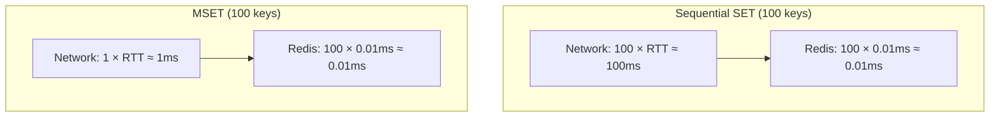

# 8.963 Redis — Strings — MSET, MGET, MSETNX

## Section 1 — Overview

Redis provides batch string operations that significantly reduce network round trips. MSET sets multiple keys atomically in a single command. MGET retrieves multiple keys in one round trip. MSETNX sets multiple keys atomically but only if none of the specified keys exist. These commands are essential for performance-sensitive applications where network latency dominates execution time.

### Core Commands

| Command | Signature | O-complexity | Atomic | Description |
|---------|-----------|-------------|--------|-------------|
| MSET | `MSET key1 value1 key2 value2 ...` | O(N) where N = number of keys | Yes | Sets multiple keys atomically. Replaces existing keys. Always succeeds (returns OK). |
| MGET | `MGET key1 key2 ...` | O(N) where N = number of keys | Yes | Returns array of values for specified keys. Missing keys return nil. |
| MSETNX | `MSETNX key1 value1 key2 value2 ...` | O(N) where N = number of keys | Yes | Sets multiple keys only if NONE of them exist. Returns 1 if all set, 0 if any exists. |

### Why Batch Operations Matter

Network round trips are the primary source of latency in Redis applications. Consider a typical setup:

- Network round-trip time (RTT): ~1 ms (local network)
- Redis command execution: ~0.01 ms

Without batching:
```
SET key1 val1  → 1 ms (RTT) + 0.01 ms (execution) = 1.01 ms
SET key2 val2  → 1 ms (RTT) + 0.01 ms (execution) = 1.01 ms
SET key3 val3  → 1 ms (RTT) + 0.01 ms (execution) = 1.01 ms
Total: ~3.03 ms for 3 keys
```

With MSET:
```
MSET key1 val1 key2 val2 key3 val3
→ 1 ms (RTT) + 0.03 ms (execution) = 1.03 ms for 3 keys
```

Savings increase linearly with the number of keys:
- 10 keys: 10 sequential SETs = ~10 ms, MSET = ~1 ms
- 100 keys: 100 sequential SETs = ~100 ms, MSET = ~1 ms

### Atomicity Guarantee

- **MSET** — all keys are set atomically. Other clients never see a partial update. If the command succeeds, all keys were written. There is no partial failure.
- **MGET** — returns values atomically. Other clients' writes do not interleave with the read.
- **MSETNX** — all-or-nothing. If ANY of the specified keys exists, NONE of the keys are set. There is no partial success.

## Section 2 — Command Reference

### MSET — Multi-SET

```
MSET key1 value1 key2 value2 ... keyN valueN

Time complexity: O(N) where N is the number of keys to set
Returns: Always OK

Behavior:
- Sets each specified key to its corresponding value
- Overwrites existing keys (unlike MSETNX)
- Always succeeds — never returns an error for existing keys
- Does NOT set TTL — use individual SET with EXPIRE or pipeline
- Atomic — all keys are set or none are set (though failure is extremely rare)
- Keys and values are paired: key1 value1 key2 value2 ...
- Accepts up to 2^32 - 1 keys (practical limit is network and memory)
- MSET replaces the deprecated HMSET-style semantics for multiple keys
```

### MGET — Multi-GET

```
MGET key1 key2 ... keyN

Time complexity: O(N) where N is the number of keys to get
Returns: Array of values (or nil for missing keys) in the order requested

Behavior:
- Returns values for each requested key in the same order as the arguments
- Missing keys return nil in the array
- Atomic — reads all keys at a consistent point in time
- Values are returned as Redis strings (even for integer values)
- The caller must handle nil entries for missing keys
- Use this instead of N sequential GET commands
```

### MSETNX — Multi-SET if Not Exists

```
MSETNX key1 value1 key2 value2 ... keyN valueN

Time complexity: O(N) where N is the number of keys to set
Returns: 1 if all keys were set, 0 if no keys were set (because at least one exists)

Behavior:
- Sets all keys only if NONE of them currently exist
- Atomic — either all keys are set or none are set
- If ANY key exists, returns 0 and sets NO keys (even if other keys don't exist)
- No partial success — this is an all-or-nothing operation
- Unlike SETNX (single key), this operates on multiple keys atomically
- Useful for batch initialization and idempotent setup operations
```

## Section 3 — Redis CLI Examples

### MSET — Setting Multiple Keys

```bash
# Basic MSET — set three keys in one command
127.0.0.1:6379> MSET user:1:name "Alice" user:1:email "alice@example.com" user:1:age "30"
OK

# Verify with GET
127.0.0.1:6379> GET user:1:name
"Alice"
127.0.0.1:6379> GET user:1:email
"alice@example.com"

# MSET overwrites existing keys silently
127.0.0.1:6379> MSET user:1:name "Bob" user:1:age "25"
OK
127.0.0.1:6379> GET user:1:name
"Bob"

# MSET with various data types (all stored as strings)
127.0.0.1:6379> MSET counter:visits 1000 flag:enabled "true" config:theme "dark"
OK

# MSET does not set TTL — keys persist until explicitly expired or evicted
127.0.0.1:6379> TTL user:1:name
(integer) -1  # Key has no TTL
```

### MGET — Retrieving Multiple Keys

```bash
# MGET returns values in the order requested
127.0.0.1:6379> MGET user:1:name user:1:email user:1:age
1) "Bob"
2) "alice@example.com"
3) "25"

# MGET with missing keys — returns nil for nonexistent keys
127.0.0.1:6379> MGET user:1:name user:1:nonexistent user:1:email
1) "Bob"
2) (nil)
3) "alice@example.com"

# MGET with mixed types (all returned as strings)
127.0.0.1:6379> MGET counter:visits flag:enabled config:theme
1) "1000"
2) "true"
3) "dark"

# MGET on keys that don't exist at all
127.0.0.1:6379> MGET missing:key1 missing:key2
1) (nil)
2) (nil)

# MGET with a single key (still returns an array)
127.0.0.1:6379> MGET user:1:name
1) "Bob"

# Compare with sequential GETs (3 round trips vs 1)
127.0.0.1:6379> MGET key1 key2 key3 key4 key5
1) (nil)
2) (nil)
3) (nil)
4) (nil)
5) (nil)
# One command vs five GET commands
```

### MSETNX — Multi-SET if Not Exists

```bash
# MSETNX on non-existent keys — all set successfully
127.0.0.1:6379> MSETNX new:key1 "first" new:key2 "second" new:key3 "third"
(integer) 1  # All keys were set

127.0.0.1:6379> GET new:key1
"first"
127.0.0.1:6379> GET new:key2
"second"

# MSETNX with an existing key — none of the keys are set
127.0.0.1:6379> MSETNX new:key1 "overwrite?" new:key4 "fourth"
(integer) 0  # new:key1 exists, so nothing was set

127.0.0.1:6379> GET new:key4
(nil)  # Was not created because new:key1 already exists

# MSETNX on all existing keys
127.0.0.1:6379> MSETNX new:key1 "a" new:key2 "b"
(integer) 0  # Both exist

# Practical use: initialize configuration defaults only if not already set
127.0.0.1:6379> MSETNX config:app:max_connections "100" config:app:timeout "30" config:app:retries "3"
(integer) 1  # First run — config initialized

127.0.0.1:6379> MSETNX config:app:max_connections "200" config:app:new_setting "enabled"
(integer) 0  # config:app:max_connections exists, nothing updated
```

### Combined MSET + MGET Patterns

```bash
# Read-modify-write with batch operations
127.0.0.1:6379> MGET profile:42:name profile:42:email profile:42:age
1) "Alice"
2) "alice@example.com"
3) "30"

# Update multiple fields atomically
127.0.0.1:6379> MSET profile:42:name "Alice Smith" profile:42:age "31"
OK

# Verify atomically — all updated or none updated
127.0.0.1:6379> MGET profile:42:name profile:42:email profile:42:age
1) "Alice Smith"
2) "alice@example.com"
3) "31"

# Large batch (10 keys)
127.0.0.1:6379> MSET batch:1 "val1" batch:2 "val2" batch:3 "val3" batch:4 "val4" batch:5 "val5" batch:6 "val6" batch:7 "val7" batch:8 "val8" batch:9 "val9" batch:10 "val10"
OK

127.0.0.1:6379> MGET batch:1 batch:2 batch:3 batch:4 batch:5 batch:6 batch:7 batch:8 batch:9 batch:10
 1) "val1"
 2) "val2"
 3) "val3"
 4) "val4"
 5) "val5"
 6) "val6"
 7) "val7"
 8) "val8"
 9) "val9"
10) "val10"
```

## Section 4 — StackExchange.Redis Code

### ConnectionMultiplexer and IDatabase Setup

```csharp
using StackExchange.Redis;

/// <summary>
/// Thread-safe Redis connection manager.
/// Must be shared as a singleton — never create per request.
/// </summary>
public sealed class RedisConnectionManager : IAsyncDisposable
{
    private static readonly Lazy<Task<RedisConnectionManager>> _lazy =
        new Lazy<Task<RedisConnectionManager>>(async () =>
        {
            var mgr = new RedisConnectionManager();
            await mgr.InitializeAsync();
            return mgr;
        });

    private ConnectionMultiplexer _mux;
    private readonly SemaphoreSlim _lock = new(1, 1);
    private bool _initialized;
    private bool _disposed;

    private RedisConnectionManager() { }

    public static Task<RedisConnectionManager> Instance => _lazy.Value;

    private async Task InitializeAsync()
    {
        if (_initialized) return;
        await _lock.WaitAsync();
        try
        {
            if (_initialized) return;

            var config = new ConfigurationOptions
            {
                EndPoints = { Environment.GetEnvironmentVariable("REDIS_HOST") ?? "localhost:6379" },
                AbortOnConnectFail = false,
                ConnectTimeout = 5000,
                SyncTimeout = 5000,
                ConnectRetry = 3,
                KeepAlive = 60,
                ReconnectRetryPolicy = new ExponentialRetry(1000, 8000),
                ClientName = "RedisConnectionManager"
            };

            var password = Environment.GetEnvironmentVariable("REDIS_PASSWORD");
            if (!string.IsNullOrEmpty(password))
                config.Password = password;

            _mux = await ConnectionMultiplexer.ConnectAsync(config);

            _mux.ConnectionFailed += (s, e) =>
                Console.Error.WriteLine($"[Redis] Connection FAILED: {e.EndPoint} — {e.Exception?.Message}");

            _mux.ConnectionRestored += (s, e) =>
                Console.WriteLine($"[Redis] Connection RESTORED: {e.EndPoint}");

            _mux.ErrorMessage += (s, e) =>
                Console.Error.WriteLine($"[Redis] Server error: {e.Message}");

            _initialized = true;
            Console.WriteLine("[Redis] ConnectionMultiplexer initialized.");
        }
        finally
        {
            _lock.Release();
        }
    }

    public IDatabase GetDatabase(int db = -1)
    {
        ObjectDisposedException.ThrowIf(_disposed, this);
        return _mux.GetDatabase(db);
    }

    public async ValueTask DisposeAsync()
    {
        if (_disposed) return;
        _disposed = true;
        if (_mux != null)
        {
            await _mux.CloseAsync();
            _mux.Dispose();
        }
        _lock.Dispose();
    }
}
```

### IDatabase — MSET (StringSetAsync with Multiple Keys)

```csharp
/// <summary>
/// Demonstrates MSET — setting multiple keys atomically in one round trip.
/// </summary>
public static class MsetExamples
{
    private static async Task<IDatabase> GetDbAsync()
    {
        var mgr = await RedisConnectionManager.Instance;
        return mgr.GetDatabase();
    }

    /// <summary>
    /// MSET — sets multiple key-value pairs atomically.
    /// Uses KeyValuePair<RedisKey, RedisValue>[] for the batch.
    /// </summary>
    public static async Task<bool> MsetAsync(params (string Key, string Value)[] pairs)
    {
        var db = await GetDbAsync();

        try
        {
            var entries = pairs
                .Select(p => new KeyValuePair<RedisKey, RedisValue>(p.Key, p.Value))
                .ToArray();

            bool result = await db.StringSetAsync(entries);

            Console.WriteLine($"MSET {pairs.Length} keys → {(result ? "OK" : "FAILED")}");
            foreach (var p in pairs)
            {
                Console.WriteLine($"  {p.Key} = \"{p.Value}\"");
            }

            return result;
        }
        catch (RedisConnectionException ex)
        {
            Console.Error.WriteLine($"Redis connection failed during MSET: {ex.Message}");
            throw;
        }
        catch (RedisServerException ex)
        {
            Console.Error.WriteLine($"Redis server error during MSET: {ex.Message}");
            throw;
        }
        catch (TimeoutException ex)
        {
            Console.Error.WriteLine($"Timeout during MSET: {ex.Message}");
            throw;
        }
    }

    /// <summary>
    /// MSET from a dictionary — sets all key-value pairs atomically.
    /// </summary>
    public static async Task<bool> MsetFromDictionaryAsync(IDictionary<string, string> keyValues)
    {
        var db = await GetDbAsync();

        try
        {
            var entries = keyValues
                .Select(kv => new KeyValuePair<RedisKey, RedisValue>(kv.Key, kv.Value))
                .ToArray();

            bool result = await db.StringSetAsync(entries);

            Console.WriteLine($"MSET {keyValues.Count} keys from dictionary → {(result ? "OK" : "FAILED")}");
            return result;
        }
        catch (RedisConnectionException ex)
        {
            Console.Error.WriteLine($"Redis connection failed during MSET: {ex.Message}");
            throw;
        }
        catch (RedisServerException ex)
        {
            Console.Error.WriteLine($"Redis server error during MSET: {ex.Message}");
            throw;
        }
        catch (TimeoutException ex)
        {
            Console.Error.WriteLine($"Timeout during MSET: {ex.Message}");
            throw;
        }
    }

    /// <summary>
    /// Demonstrates the difference between sequential SETs and MSET.
    /// Sequential = N round trips, MSET = 1 round trip.
    /// </summary>
    public static async Task CompareSequentialVsBatchAsync()
    {
        var db = await GetDbAsync();

        var stopwatch = new System.Diagnostics.Stopwatch();
        int keyCount = 10;

        // Sequential SET — N round trips
        stopwatch.Start();
        for (int i = 0; i < keyCount; i++)
        {
            await db.StringSetAsync($"seq:key:{i}", $"value:{i}");
        }
        stopwatch.Stop();
        Console.WriteLine($"Sequential SET ({keyCount} keys): {stopwatch.Elapsed.TotalMilliseconds:F3} ms");

        // MSET — 1 round trip
        var pairs = new KeyValuePair<RedisKey, RedisValue>[keyCount];
        for (int i = 0; i < keyCount; i++)
        {
            pairs[i] = new KeyValuePair<RedisKey, RedisValue>($"batch:key:{i}", $"value:{i}");
        }

        stopwatch.Restart();
        await db.StringSetAsync(pairs);
        stopwatch.Stop();
        Console.WriteLine($"MSET ({keyCount} keys): {stopwatch.Elapsed.TotalMilliseconds:F3} ms");

        // Cleanup
        var keysToDelete = Enumerable.Range(0, keyCount)
            .SelectMany(i => new RedisKey[] { $"seq:key:{i}", $"batch:key:{i}" })
            .ToArray();
        await db.KeyDeleteAsync(keysToDelete);
    }
}
```

### IDatabase — MGET (StringGetAsync with Multiple Keys)

```csharp
/// <summary>
/// Demonstrates MGET — getting multiple keys in one round trip.
/// Handles nil results for missing keys.
/// </summary>
public static class MgetExamples
{
    private static async Task<IDatabase> GetDbAsync()
    {
        var mgr = await RedisConnectionManager.Instance;
        return mgr.GetDatabase();
    }

    /// <summary>
    /// MGET — gets multiple keys in one round trip.
    /// Returns values in the order requested. Missing keys return null.
    /// </summary>
    public static async Task<Dictionary<string, string>> MgetAsync(params string[] keys)
    {
        var db = await GetDbAsync();

        try
        {
            var redisKeys = keys.Select(k => (RedisKey)k).ToArray();
            var results = new Dictionary<string, string>(keys.Length);

            RedisValue[] values = await db.StringGetAsync(redisKeys);

            for (int i = 0; i < keys.Length; i++)
            {
                if (values[i].IsNull)
                {
                    Console.WriteLine($"MGET {keys[i]} → (nil)");
                    results[keys[i]] = null;
                }
                else
                {
                    string strValue = values[i].ToString();
                    Console.WriteLine($"MGET {keys[i]} → \"{strValue}\"");
                    results[keys[i]] = strValue;
                }
            }

            return results;
        }
        catch (RedisConnectionException ex)
        {
            Console.Error.WriteLine($"Redis connection failed during MGET: {ex.Message}");
            throw;
        }
        catch (RedisServerException ex)
        {
            Console.Error.WriteLine($"Redis server error during MGET: {ex.Message}");
            throw;
        }
        catch (TimeoutException ex)
        {
            Console.Error.WriteLine($"Timeout during MGET: {ex.Message}");
            throw;
        }
    }

    /// <summary>
    /// MGET with type conversion — returns values as typed objects.
    /// Handles nil conversion gracefully.
    /// </summary>
    public static async Task<List<T>> MgetAsync<T>(params string[] keys)
        where T : class
    {
        var db = await GetDbAsync();

        try
        {
            var redisKeys = keys.Select(k => (RedisKey)k).ToArray();
            RedisValue[] values = await db.StringGetAsync(redisKeys);

            var results = new List<T>(keys.Length);
            for (int i = 0; i < values.Length; i++)
            {
                if (values[i].IsNull)
                {
                    results.Add(null);
                }
                else
                {
                    // For string types, direct cast works
                    if (typeof(T) == typeof(string))
                    {
                        results.Add(values[i].ToString() as T);
                    }
                    else
                    {
                        // For other types, deserialize (assumes JSON storage)
                        // results.Add(System.Text.Json.JsonSerializer.Deserialize<T>(values[i]));
                        results.Add(null); // Placeholder — implement your own deserialization
                    }
                }
            }

            return results;
        }
        catch (RedisConnectionException ex)
        {
            Console.Error.WriteLine($"Redis connection failed during typed MGET: {ex.Message}");
            throw;
        }
        catch (RedisServerException ex)
        {
            Console.Error.WriteLine($"Redis server error during typed MGET: {ex.Message}");
            throw;
        }
        catch (TimeoutException ex)
        {
            Console.Error.WriteLine($"Timeout during typed MGET: {ex.Message}");
            throw;
        }
    }

    /// <summary>
    /// MGET with batch of keys — splits large batches into smaller chunks.
    /// Redis handles large batches, but network buffers may limit size.
    /// </summary>
    public static async Task<Dictionary<string, string>> MgetBatchedAsync(
        IEnumerable<string> keys, int batchSize = 100)
    {
        var db = await GetDbAsync();
        var results = new Dictionary<string, string>();

        try
        {
            foreach (var batch in keys.Chunk(batchSize))
            {
                var redisKeys = batch.Select(k => (RedisKey)k).ToArray();
                RedisValue[] values = await db.StringGetAsync(redisKeys);

                for (int i = 0; i < batch.Length; i++)
                {
                    results[batch[i]] = values[i].IsNull ? null : values[i].ToString();
                }

                Console.WriteLine($"MGET batch of {batch.Length} keys — got {values.Length} values");
            }

            return results;
        }
        catch (RedisConnectionException ex)
        {
            Console.Error.WriteLine($"Redis connection failed during batched MGET: {ex.Message}");
            throw;
        }
        catch (RedisServerException ex)
        {
            Console.Error.WriteLine($"Redis server error during batched MGET: {ex.Message}");
            throw;
        }
        catch (TimeoutException ex)
        {
            Console.Error.WriteLine($"Timeout during batched MGET: {ex.Message}");
            throw;
        }
    }

    /// <summary>
    /// MGET with nil handling utility — provides default values for missing keys.
    /// </summary>
    public static async Task<Dictionary<string, string>> MgetWithDefaultsAsync(
        IDictionary<string, string> keysWithDefaults)
    {
        var db = await GetDbAsync();

        try
        {
            var keys = keysWithDefaults.Keys.ToArray();
            var redisKeys = keys.Select(k => (RedisKey)k).ToArray();
            RedisValue[] values = await db.StringGetAsync(redisKeys);

            var results = new Dictionary<string, string>(keys.Length);
            for (int i = 0; i < keys.Length; i++)
            {
                string value = values[i].IsNull
                    ? keysWithDefaults[keys[i]]  // Use default for missing keys
                    : values[i].ToString();

                results[keys[i]] = value;
                string source = values[i].IsNull ? "default" : "Redis";
                Console.WriteLine($"MGET {keys[i]} → \"{value}\" (source: {source})");
            }

            return results;
        }
        catch (RedisConnectionException ex)
        {
            Console.Error.WriteLine($"Redis connection failed during MGET with defaults: {ex.Message}");
            throw;
        }
        catch (RedisServerException ex)
        {
            Console.Error.WriteLine($"Redis server error during MGET with defaults: {ex.Message}");
            throw;
        }
        catch (TimeoutException ex)
        {
            Console.Error.WriteLine($"Timeout during MGET with defaults: {ex.Message}");
            throw;
        }
    }
}
```

### IDatabase — MSETNX (StringSetAsync with When.NotExists)

```csharp
/// <summary>
/// Demonstrates MSETNX — setting multiple keys only if none exist.
/// All-or-nothing atomicity: if any key exists, no keys are set.
/// </summary>
public static class MsetnxExamples
{
    private static async Task<IDatabase> GetDbAsync()
    {
        var mgr = await RedisConnectionManager.Instance;
        return mgr.GetDatabase();
    }

    /// <summary>
    /// MSETNX — sets multiple keys only if NONE of them exist.
    /// Returns true only if ALL keys were set successfully.
    /// Note: StackExchange.Redis does not have a direct MSETNX method.
    /// Use a Lua script for atomic multi-key conditional set.
    /// </summary>
    public static async Task<bool> MsetnxAsync(params (string Key, string Value)[] pairs)
    {
        var db = await GetDbAsync();

        try
        {
            // Lua script implementing MSETNX
            const string script = @"
                -- Check if any of the keys already exist
                for i = 1, #KEYS do
                    if redis.call('EXISTS', KEYS[i]) == 1 then
                        return 0  -- At least one key exists, abort
                    end
                end

                -- None exist — set all keys
                for i = 1, #KEYS do
                    redis.call('SET', KEYS[i], ARGV[i])
                end

                return 1  -- All keys set successfully
            ";

            var keys = pairs.Select(p => (RedisKey)p.Key).ToArray();
            var values = pairs.Select(p => (RedisValue)p.Value).ToArray();

            var result = await db.ScriptEvaluateAsync(script, keys, values);

            bool allSet = (int)result == 1;
            Console.WriteLine($"MSETNX {pairs.Length} keys → {(allSet ? "ALL SET" : "FAILED (at least one key exists)")}");

            if (!allSet)
            {
                // Identify which key(s) caused the failure
                foreach (var p in pairs)
                {
                    bool exists = await db.KeyExistsAsync(p.Key);
                    if (exists)
                    {
                        Console.WriteLine($"  Blocking key: {p.Key} already exists");
                    }
                }
            }

            return allSet;
        }
        catch (RedisConnectionException ex)
        {
            Console.Error.WriteLine($"Redis connection failed during MSETNX: {ex.Message}");
            throw;
        }
        catch (RedisServerException ex)
        {
            Console.Error.WriteLine($"Redis server error during MSETNX: {ex.Message}");
            throw;
        }
        catch (TimeoutException ex)
        {
            Console.Error.WriteLine($"Timeout during MSETNX: {ex.Message}");
            throw;
        }
    }

    /// <summary>
    /// Alternative MSETNX using transactions with conditions.
    /// Less efficient than Lua but demonstrates the condition pattern.
    /// </summary>
    public static async Task<bool> MsetnxWithTransactionAsync(params (string Key, string Value)[] pairs)
    {
        var db = await GetDbAsync();

        try
        {
            var tran = db.CreateTransaction();

            // Add conditions: none of the keys should exist
            foreach (var p in pairs)
            {
                tran.AddCondition(Condition.KeyNotExists(p.Key));
            }

            // Queue all SET operations
            var setTasks = pairs.Select(p =>
                tran.StringSetAsync(p.Key, p.Value)).ToArray();

            // Execute transaction
            bool committed = await tran.ExecuteAsync();

            if (committed)
            {
                var results = await Task.WhenAll(setTasks);
                bool allSucceeded = results.All(r => r);
                Console.WriteLine($"MSETNX (transaction) {pairs.Length} keys → {(allSucceeded ? "ALL SET" : "PARTIAL (should not happen)")}");
                return allSucceeded;
            }

            Console.WriteLine($"MSETNX (transaction) {pairs.Length} keys → FAILED (condition not met)");
            return false;
        }
        catch (RedisConnectionException ex)
        {
            Console.Error.WriteLine($"Redis connection failed during MSETNX transaction: {ex.Message}");
            throw;
        }
        catch (RedisServerException ex)
        {
            Console.Error.WriteLine($"Redis server error during MSETNX transaction: {ex.Message}");
            throw;
        }
        catch (TimeoutException ex)
        {
            Console.Error.WriteLine($"Timeout during MSETNX transaction: {ex.Message}");
            throw;
        }
    }

    /// <summary>
    /// MSETNX for idempotent initialization.
    /// Only sets keys on first run — subsequent calls are no-ops.
    /// </summary>
    public static async Task<bool> InitializeIfNotExistsAsync(Dictionary<string, string> configDefaults)
    {
        var db = await GetDbAsync();

        try
        {
            // Check if any key already exists — fast path
            var keys = configDefaults.Keys.Select(k => (RedisKey)k).ToArray();
            var existingKeys = await db.KeyExistsAsync(keys);

            if (existingKeys.Any(e => e))
            {
                int existingCount = existingKeys.Count(e => e);
                Console.WriteLine($"Initialization skipped: {existingCount}/{configDefaults.Count} keys already exist");
                return false;
            }

            // None exist — set all atomically
            var entries = configDefaults
                .Select(kv => new KeyValuePair<RedisKey, RedisValue>(kv.Key, kv.Value))
                .ToArray();

            bool result = await db.StringSetAsync(entries);
            Console.WriteLine($"Initialization: {configDefaults.Count} keys set → {(result ? "OK" : "FAILED")}");
            return result;
        }
        catch (RedisConnectionException ex)
        {
            Console.Error.WriteLine($"Redis connection failed during initialization: {ex.Message}");
            throw;
        }
        catch (RedisServerException ex)
        {
            Console.Error.WriteLine($"Redis server error during initialization: {ex.Message}");
            throw;
        }
        catch (TimeoutException ex)
        {
            Console.Error.WriteLine($"Timeout during initialization: {ex.Message}");
            throw;
        }
    }
}
```

### Batch Operations Service — Complete

```csharp
/// <summary>
/// Complete batch operations service for Redis Strings.
/// Wraps MSET, MGET, MSETNX with production error handling.
/// </summary>
public sealed class BatchOperationsService
{
    private readonly IDatabase _db;
    private readonly int _maxBatchSize;

    /// <summary>
    /// Creates a batch operations service.
    /// </summary>
    /// <param name="db">Redis IDatabase instance.</param>
    /// <param name="maxBatchSize">Maximum keys per batch operation. Default 100.</param>
    public BatchOperationsService(IDatabase db, int maxBatchSize = 100)
    {
        _db = db ?? throw new ArgumentNullException(nameof(db));
        _maxBatchSize = maxBatchSize > 0 ? maxBatchSize : throw new ArgumentOutOfRangeException(nameof(maxBatchSize));
    }

    /// <summary>
    /// Batch SET — splits into chunks if necessary.
    /// </summary>
    public async Task<bool> SetBatchAsync(IDictionary<string, string> keyValues)
    {
        if (keyValues == null || keyValues.Count == 0)
            return true;

        try
        {
            bool allSucceeded = true;

            foreach (var chunk in keyValues.Chunk(_maxBatchSize))
            {
                var entries = chunk
                    .Select(kv => new KeyValuePair<RedisKey, RedisValue>(kv.Key, kv.Value))
                    .ToArray();

                bool result = await _db.StringSetAsync(entries);
                allSucceeded = allSucceeded && result;

                if (!result)
                {
                    Console.Error.WriteLine($"Batch SET chunk failed ({chunk.Length} keys)");
                }
            }

            return allSucceeded;
        }
        catch (RedisConnectionException ex)
        {
            Console.Error.WriteLine($"Redis connection failed in SetBatchAsync: {ex.Message}");
            throw;
        }
        catch (RedisServerException ex)
        {
            Console.Error.WriteLine($"Redis server error in SetBatchAsync: {ex.Message}");
            throw;
        }
        catch (TimeoutException ex)
        {
            Console.Error.WriteLine($"Timeout in SetBatchAsync: {ex.Message}");
            throw;
        }
    }

    /// <summary>
    /// Batch GET — retrieves multiple keys.
    /// Returns null for missing keys.
    /// </summary>
    public async Task<Dictionary<string, string>> GetBatchAsync(IEnumerable<string> keys)
    {
        if (keys == null || !keys.Any())
            return new Dictionary<string, string>();

        try
        {
            var results = new Dictionary<string, string>();

            foreach (var chunk in keys.Chunk(_maxBatchSize))
            {
                var redisKeys = chunk.Select(k => (RedisKey)k).ToArray();
                RedisValue[] values = await _db.StringGetAsync(redisKeys);

                for (int i = 0; i < chunk.Length; i++)
                {
                    results[chunk[i]] = values[i].IsNull ? null : values[i].ToString();
                }
            }

            return results;
        }
        catch (RedisConnectionException ex)
        {
            Console.Error.WriteLine($"Redis connection failed in GetBatchAsync: {ex.Message}");
            throw;
        }
        catch (RedisServerException ex)
        {
            Console.Error.WriteLine($"Redis server error in GetBatchAsync: {ex.Message}");
            throw;
        }
        catch (TimeoutException ex)
        {
            Console.Error.WriteLine($"Timeout in GetBatchAsync: {ex.Message}");
            throw;
        }
    }

    /// <summary>
    /// Conditional batch SET — only sets if none of the keys exist.
    /// </summary>
    public async Task<bool> SetIfNotExistsAsync(IDictionary<string, string> keyValues)
    {
        if (keyValues == null || keyValues.Count == 0)
            return true;

        try
        {
            // First pass: check if ANY key exists
            var keys = keyValues.Keys.Select(k => (RedisKey)k).ToArray();
            var existResults = await _db.KeyExistsAsync(keys);

            var existingKeys = keys.Zip(existResults, (k, e) => new { Key = k, Exists = e })
                .Where(x => x.Exists)
                .Select(x => x.Key.ToString());

            if (existingKeys.Any())
            {
                Console.WriteLine($"SetIfNotExistsAsync skipped: keys already exist: {string.Join(", ", existingKeys)}");
                return false;
            }

            // None exist — set all
            var entries = keyValues
                .Select(kv => new KeyValuePair<RedisKey, RedisValue>(kv.Key, kv.Value))
                .ToArray();

            bool result = await _db.StringSetAsync(entries);
            Console.WriteLine($"SetIfNotExistsAsync: {keyValues.Count} keys set → {(result ? "OK" : "FAILED")}");
            return result;
        }
        catch (RedisConnectionException ex)
        {
            Console.Error.WriteLine($"Redis connection failed in SetIfNotExistsAsync: {ex.Message}");
            throw;
        }
        catch (RedisServerException ex)
        {
            Console.Error.WriteLine($"Redis server error in SetIfNotExistsAsync: {ex.Message}");
            throw;
        }
        catch (TimeoutException ex)
        {
            Console.Error.WriteLine($"Timeout in SetIfNotExistsAsync: {ex.Message}");
            throw;
        }
    }

    /// <summary>
    /// Batch GET with defaults — returns a default value for missing keys.
    /// </summary>
    public async Task<Dictionary<string, string>> GetBatchWithDefaultsAsync(
        IDictionary<string, string> keysWithDefaults)
    {
        if (keysWithDefaults == null || keysWithDefaults.Count == 0)
            return new Dictionary<string, string>();

        try
        {
            var results = new Dictionary<string, string>(keysWithDefaults.Count);
            var keys = keysWithDefaults.Keys.ToArray();

            foreach (var chunk in keys.Chunk(_maxBatchSize))
            {
                var redisKeys = chunk.Select(k => (RedisKey)k).ToArray();
                RedisValue[] values = await _db.StringGetAsync(redisKeys);

                for (int i = 0; i < chunk.Length; i++)
                {
                    results[chunk[i]] = values[i].IsNull
                        ? keysWithDefaults[chunk[i]]
                        : values[i].ToString();
                }
            }

            return results;
        }
        catch (RedisConnectionException ex)
        {
            Console.Error.WriteLine($"Redis connection failed in GetBatchWithDefaultsAsync: {ex.Message}");
            throw;
        }
        catch (RedisServerException ex)
        {
            Console.Error.WriteLine($"Redis server error in GetBatchWithDefaultsAsync: {ex.Message}");
            throw;
        }
        catch (TimeoutException ex)
        {
            Console.Error.WriteLine($"Timeout in GetBatchWithDefaultsAsync: {ex.Message}");
            throw;
        }
    }

    /// <summary>
    /// Batch DELETE — deletes multiple keys in one round trip.
    /// </summary>
    public async Task<long> DeleteBatchAsync(IEnumerable<string> keys)
    {
        if (keys == null || !keys.Any())
            return 0;

        try
        {
            long totalDeleted = 0;

            foreach (var chunk in keys.Chunk(_maxBatchSize))
            {
                var redisKeys = chunk.Select(k => (RedisKey)k).ToArray();
                long count = await _db.KeyDeleteAsync(redisKeys);
                totalDeleted += count;
            }

            return totalDeleted;
        }
        catch (RedisConnectionException ex)
        {
            Console.Error.WriteLine($"Redis connection failed in DeleteBatchAsync: {ex.Message}");
            throw;
        }
        catch (RedisServerException ex)
        {
            Console.Error.WriteLine($"Redis server error in DeleteBatchAsync: {ex.Message}");
            throw;
        }
        catch (TimeoutException ex)
        {
            Console.Error.WriteLine($"Timeout in DeleteBatchAsync: {ex.Message}");
            throw;
        }
    }
}
```

## Section 5 — Use Cases

### Batch Cache Population

```csharp
/// <summary>
/// Populates a cache with pre-computed values in bulk.
/// </summary>
public class BatchCachePopulation
{
    private readonly BatchOperationsService _batch;
    private readonly TimeSpan _defaultExpiry = TimeSpan.FromMinutes(30);

    public BatchCachePopulation(IDatabase db)
    {
        _batch = new BatchOperationsService(db);
    }

    /// <summary>
    /// Populates cache with multiple entries at once.
    /// Much faster than individual SET calls.
    /// </summary>
    public async Task PopulateCacheAsync(Dictionary<string, string> entries)
    {
        await _batch.SetBatchAsync(entries);

        // Set TTL for each key individually (MSET doesn't support expiry)
        foreach (var key in entries.Keys)
        {
            await _batch.GetDatabase().KeyExpireAsync(key, _defaultExpiry);
        }

        Console.WriteLine($"Cache populated with {entries.Count} entries, TTL: {_defaultExpiry.TotalMinutes} min");
    }

    /// <summary>
    /// Warms cache from database in bulk.
    /// </summary>
    public async Task WarmCacheFromDatabaseAsync(IEnumerable<(string CacheKey, string Value)> data)
    {
        var batch = new Dictionary<string, string>();
        foreach (var (key, value) in data)
        {
            batch[key] = value;
        }

        await PopulateCacheAsync(batch);
    }

    /// <summary>
    /// Retrieves multiple cache entries in one round trip.
    /// </summary>
    public async Task<Dictionary<string, string>> GetCachedEntriesAsync(IEnumerable<string> keys)
    {
        return await _batch.GetBatchAsync(keys);
    }

    private IDatabase GetDatabase() => _batch.GetDatabase();
}

// Extension method for chunking if not available in .NET version
public static class EnumerableExtensions
{
    public static IEnumerable<T[]> Chunk<T>(this IEnumerable<T> source, int size)
    {
        using var e = source.GetEnumerator();
        while (e.MoveNext())
        {
            var chunk = new List<T>(size);
            chunk.Add(e.Current);
            while (chunk.Count < size && e.MoveNext())
            {
                chunk.Add(e.Current);
            }
            yield return chunk.ToArray();
        }
    }
}
```

### Profile Service with Batch Reads

```csharp
/// <summary>
/// User profile service using MSET/MGET for batch operations.
/// Profiles are stored as individual string keys per field (not hashes).
/// </summary>
public class ProfileService
{
    private readonly IDatabase _db;
    private const string KeyPrefix = "profile:";

    public ProfileService(IDatabase db)
    {
        _db = db ?? throw new ArgumentNullException(nameof(db));
    }

    /// <summary>
    /// Stores user profile fields atomically.
    /// </summary>
    public async Task SaveProfileAsync(string userId, Dictionary<string, string> fields)
    {
        var entries = fields
            .Select(f => new KeyValuePair<RedisKey, RedisValue>(
                $"{KeyPrefix}{userId}:{f.Key}",
                f.Value))
            .ToArray();

        try
        {
            await _db.StringSetAsync(entries);
            Console.WriteLine($"Profile {userId}: {fields.Count} fields saved atomically");
        }
        catch (RedisConnectionException ex)
        {
            Console.Error.WriteLine($"Redis connection error saving profile {userId}: {ex.Message}");
            throw;
        }
        catch (TimeoutException ex)
        {
            Console.Error.WriteLine($"Timeout saving profile {userId}: {ex.Message}");
            throw;
        }
    }

    /// <summary>
    /// Reads multiple profile fields in one round trip.
    /// </summary>
    public async Task<Dictionary<string, string>> GetProfileFieldsAsync(
        string userId, params string[] fieldNames)
    {
        var keys = fieldNames.Select(f => (RedisKey)$"{KeyPrefix}{userId}:{f}").ToArray();

        try
        {
            RedisValue[] values = await _db.StringGetAsync(keys);
            var result = new Dictionary<string, string>(fieldNames.Length);

            for (int i = 0; i < fieldNames.Length; i++)
            {
                result[fieldNames[i]] = values[i].IsNull ? null : values[i].ToString();
            }

            Console.WriteLine($"Profile {userId}: {fieldNames.Length} fields read in 1 round trip");
            return result;
        }
        catch (RedisConnectionException ex)
        {
            Console.Error.WriteLine($"Redis connection error reading profile {userId}: {ex.Message}");
            throw;
        }
        catch (TimeoutException ex)
        {
            Console.Error.WriteLine($"Timeout reading profile {userId}: {ex.Message}");
            throw;
        }
    }

    /// <summary>
    /// Reads entire profile (all known fields) for a user.
    /// </summary>
    public async Task<Dictionary<string, string>> GetFullProfileAsync(string userId)
    {
        var knownFields = new[] { "name", "email", "age", "country", "language", "timezone" };
        return await GetProfileFieldsAsync(userId, knownFields);
    }

    /// <summary>
    /// Batch read profiles for multiple users.
    /// </summary>
    public async Task<Dictionary<string, Dictionary<string, string>>> GetProfilesAsync(
        string[] userIds, string[] fields)
    {
        var allKeys = userIds.SelectMany(uid =>
            fields.Select(f => (RedisKey)$"{KeyPrefix}{uid}:{f}")
        ).ToArray();

        try
        {
            RedisValue[] values = await _db.StringGetAsync(allKeys);
            var results = new Dictionary<string, Dictionary<string, string>>();

            int idx = 0;
            foreach (var uid in userIds)
            {
                var profile = new Dictionary<string, string>();
                foreach (var field in fields)
                {
                    profile[field] = values[idx].IsNull ? null : values[idx].ToString();
                    idx++;
                }
                results[uid] = profile;
            }

            Console.WriteLine($"Loaded {userIds.Length} profiles × {fields.Length} fields = {allKeys.Length} keys in 1 round trip");
            return results;
        }
        catch (RedisConnectionException ex)
        {
            Console.Error.WriteLine($"Redis connection error loading profiles: {ex.Message}");
            throw;
        }
        catch (TimeoutException ex)
        {
            Console.Error.WriteLine($"Timeout loading profiles: {ex.Message}");
            throw;
        }
    }
}
```

### Configuration Service with MSETNX

```csharp
/// <summary>
/// Application configuration service using MSETNX for idempotent initialization.
/// </summary>
public class ConfigurationService
{
    private readonly IDatabase _db;
    private const string ConfigPrefix = "config:app:";

    public ConfigurationService(IDatabase db)
    {
        _db = db ?? throw new ArgumentNullException(nameof(db));
    }

    /// <summary>
    /// Initializes application configuration with defaults.
    /// Only sets keys that don't already exist — safe to call on every startup.
    /// </summary>
    public async Task<bool> InitializeDefaultsAsync(Dictionary<string, string> defaults)
    {
        var entries = defaults
            .Select(d => new KeyValuePair<RedisKey, RedisValue>($"{ConfigPrefix}{d.Key}", d.Value))
            .ToArray();

        try
        {
            // Check if any key already exists
            var keys = entries.Select(e => e.Key).ToArray();
            var exists = await _db.KeyExistsAsync(keys);

            if (exists.Any(e => e))
            {
                int existingCount = exists.Count(e => e);
                Console.WriteLine($"Config initialization: {existingCount}/{entries.Length} keys already exist, skipping");
                return false;
            }

            // Set all atomically
            bool result = await _db.StringSetAsync(entries);
            Console.WriteLine($"Config initialization: {entries.Length} defaults set → {(result ? "OK" : "FAILED")}");

            // Set TTL for each config key (renewable)
            foreach (var entry in entries)
            {
                await _db.KeyExpireAsync(entry.Key, TimeSpan.FromHours(24));
            }

            return result;
        }
        catch (RedisConnectionException ex)
        {
            Console.Error.WriteLine($"Redis connection error initializing config: {ex.Message}");
            throw;
        }
        catch (TimeoutException ex)
        {
            Console.Error.WriteLine($"Timeout initializing config: {ex.Message}");
            throw;
        }
    }

    /// <summary>
    /// Reads multiple configuration values in one round trip.
    /// Returns defaults for any missing keys.
    /// </summary>
    public async Task<Dictionary<string, string>> GetConfigValuesAsync(
        IEnumerable<string> keys, Dictionary<string, string> defaults = null)
    {
        var fullKeys = keys.Select(k => (RedisKey)$"{ConfigPrefix}{k}").ToArray();

        try
        {
            RedisValue[] values = await _db.StringGetAsync(fullKeys);
            var result = new Dictionary<string, string>();

            int i = 0;
            foreach (var key in keys)
            {
                string value = values[i].IsNull
                    ? (defaults?.ContainsKey(key) == true ? defaults[key] : null)
                    : values[i].ToString();
                result[key] = value;
                i++;
            }

            return result;
        }
        catch (RedisConnectionException ex)
        {
            Console.Error.WriteLine($"Redis connection error reading config: {ex.Message}");
            throw;
        }
        catch (TimeoutException ex)
        {
            Console.Error.WriteLine($"Timeout reading config: {ex.Message}");
            throw;
        }
    }

    /// <summary>
    /// Updates multiple configuration values atomically.
    /// </summary>
    public async Task UpdateConfigAsync(Dictionary<string, string> updates)
    {
        var entries = updates
            .Select(u => new KeyValuePair<RedisKey, RedisValue>($"{ConfigPrefix}{u.Key}", u.Value))
            .ToArray();

        try
        {
            await _db.StringSetAsync(entries);
            Console.WriteLine($"Config updated: {entries.Length} values set atomically");
        }
        catch (RedisConnectionException ex)
        {
            Console.Error.WriteLine($"Redis connection error updating config: {ex.Message}");
            throw;
        }
        catch (TimeoutException ex)
        {
            Console.Error.WriteLine($"Timeout updating config: {ex.Message}");
            throw;
        }
    }
}
```

### Cache-Aside Pattern with Batch Operations

```csharp
/// <summary>
/// Cache-aside pattern using MGET for batch reads and MSET for batch writes.
/// </summary>
public class CacheAsideWithBatch
{
    private readonly IDatabase _db;
    private readonly TimeSpan _cacheTtl;

    public CacheAsideWithBatch(IDatabase db, TimeSpan? cacheTtl = null)
    {
        _db = db;
        _cacheTtl = cacheTtl ?? TimeSpan.FromMinutes(15);
    }

    /// <summary>
    /// Gets multiple items from cache; loads missing items from source.
    /// </summary>
    public async Task<Dictionary<string, string>> GetOrLoadAsync(
        IEnumerable<string> keys,
        Func<IEnumerable<string>, Task<Dictionary<string, string>>> loadFromSource)
    {
        var keyList = keys.ToList();
        var redisKeys = keyList.Select(k => (RedisKey)k).ToArray();

        // Step 1: Try cache (1 round trip)
        RedisValue[] cached = await _db.StringGetAsync(redisKeys);

        var result = new Dictionary<string, string>(keyList.Count);
        var missingKeys = new List<string>();

        for (int i = 0; i < keyList.Count; i++)
        {
            if (cached[i].IsNull)
            {
                missingKeys.Add(keyList[i]);
            }
            else
            {
                result[keyList[i]] = cached[i].ToString();
            }
        }

        // Step 2: Load missing from source
        if (missingKeys.Count > 0)
        {
            Console.WriteLine($"Cache miss for {missingKeys.Count} keys — loading from source");
            var loaded = await loadFromSource(missingKeys);

            // Step 3: Store in cache (1 round trip)
            if (loaded.Count > 0)
            {
                var entries = loaded
                    .Select(kv => new KeyValuePair<RedisKey, RedisValue>(kv.Key, kv.Value))
                    .ToArray();

                await _db.StringSetAsync(entries);

                // Set TTL for each
                foreach (var key in loaded.Keys)
                {
                    await _db.KeyExpireAsync(key, _cacheTtl);
                }
            }

            // Merge loaded values
            foreach (var kv in loaded)
            {
                result[kv.Key] = kv.Value;
            }
        }

        Console.WriteLine($"GetOrLoad: {result.Count} items returned ({missingKeys.Count} cache misses)");
        return result;
    }
}
```

## Section 6 — Performance Considerations

### O-Complexity

MSET, MGET, and MSETNX are O(N) where N is the number of keys. Despite the linear complexity, these commands are significantly faster than N individual commands because:

1. **Single round trip** — one network exchange instead of N
2. **Command parsing** — Redis parses one command instead of N
3. **Response generation** — Redis generates one response instead of N

### Cost Breakdown

```
N sequential SET commands:
  Network: N × RTT (e.g., 100 × 1ms = 100ms)
  Redis: N × ~0.01ms = 0.01ms
  Total: ~100.01ms

Single MSET with N keys:
  Network: 1 × RTT (e.g., 1 × 1ms = 1ms)
  Redis: N × ~0.01ms = 0.01ms (same)
  Total: ~1.01ms

Speedup: ~100× for 100 keys
```

### Network vs Execution Time



### When to Use MSET vs Pipeline

| Scenario | MSET | Pipeline |
|----------|------|----------|
| Setting multiple keys atomically | ✅ Yes | ❌ No (not atomic) |
| Getting multiple keys | ✅ MGET | ❌ No (MGET is sufficient) |
| Setting keys with different TTLs | ❌ MSET doesn't set TTL | ✅ Pipeline SET + EXPIRE |
| Mixed operations (SET + INCR + LPUSH) | ❌ MSET is SET-only | ✅ Pipeline any commands |
| Large batches (>1000 keys) | ⚠️ Use with care | ✅ Pipeline handles better |

### Batch Size Guidelines

```csharp
public static class BatchSizeGuidelines
{
    /// <summary>
    /// Recommended batch sizes based on empirical testing.
    /// </summary>
    public const int Small = 10;     // Minimal benefit threshold
    public const int Medium = 100;   // Sweet spot for most applications
    public const int Large = 500;    // High-throughput scenarios
    public const int Max = 1000;     // Upper limit before diminishing returns

    public static string GetRecommendation(int networkLatencyMs)
    {
        if (networkLatencyMs <= 0.5) // Low latency (same rack)
            return "Batch 50-200 keys for optimal throughput";
        else if (networkLatencyMs <= 5) // Medium latency (same region)
            return "Batch 100-500 keys for optimal throughput";
        else // High latency (cross-region)
            return "Batch 200-1000 keys for optimal throughput";
    }
}

/// <summary>
/// Utility to benchmark batch vs sequential performance.
/// </summary>
public static class BatchBenchmark
{
    public static async Task RunBenchmarkAsync(IDatabase db, int[] batchSizes, int iterations = 5)
    {
        Console.WriteLine("=== MSET vs Sequential SET Benchmark ===");
        Console.WriteLine($"{"Batch Size",-12} {"Sequential (ms)",-18} {"MSET (ms)",-18} {"Speedup",-10}");
        Console.WriteLine(new string('-', 58));

        foreach (var size in batchSizes)
        {
            double seqTotal = 0, batchTotal = 0;

            for (int iter = 0; iter < iterations; iter++)
            {
                // Sequential
                var sw = System.Diagnostics.Stopwatch.StartNew();
                for (int i = 0; i < size; i++)
                {
                    await db.StringSetAsync($"bench:seq:{iter}:{i}", $"val{i}");
                }
                sw.Stop();
                seqTotal += sw.Elapsed.TotalMilliseconds;

                // Batch (MSET)
                var pairs = Enumerable.Range(0, size)
                    .Select(i => new KeyValuePair<RedisKey, RedisValue>($"bench:batch:{iter}:{i}", $"val{i}"))
                    .ToArray();

                sw.Restart();
                await db.StringSetAsync(pairs);
                sw.Stop();
                batchTotal += sw.Elapsed.TotalMilliseconds;

                // Cleanup
                var keys = Enumerable.Range(0, size)
                    .SelectMany(i => new[] {
                        (RedisKey)$"bench:seq:{iter}:{i}",
                        (RedisKey)$"bench:batch:{iter}:{i}"
                    })
                    .ToArray();
                await db.KeyDeleteAsync(keys);
            }

            double seqAvg = seqTotal / iterations;
            double batchAvg = batchTotal / iterations;
            double speedup = seqAvg / batchAvg;

            Console.WriteLine($"{size,-12} {seqAvg,-18:F3} {batchAvg,-18:F3} {speedup,-10:F2}x");
        }
    }
}
```

## Section 7 — Production Considerations

### Batch Size Limits

```csharp
/// <summary>
/// Avoid sending extremely large batches — they consume memory on both client and server.
/// Redis has no hard limit on MSET arguments, but practical limits exist:
/// - Network buffer size (typically 1-10 MB)
/// - Server memory (Redis buffers the entire command)
/// - Client serialization time
/// </summary>
public static class BatchSizeLimits
{
    /// <summary>
    /// Splits a large batch into smaller chunks for safe processing.
    /// </summary>
    public static async Task SafeMsetAsync(
        IDatabase db,
        IReadOnlyDictionary<string, string> entries,
        int chunkSize = 100)
    {
        int totalChunks = (int)Math.Ceiling((double)entries.Count / chunkSize);
        int processed = 0;

        foreach (var chunk in entries.Chunk(chunkSize))
        {
            var pairs = chunk
                .Select(kv => new KeyValuePair<RedisKey, RedisValue>(kv.Key, kv.Value))
                .ToArray();

            try
            {
                await db.StringSetAsync(pairs);
                processed += pairs.Length;
                Console.WriteLine($"MSET chunk {processed}/{entries.Count} — OK");
            }
            catch (RedisServerException ex) when (ex.Message.Contains("protocol error"))
            {
                Console.Error.WriteLine($"MSET chunk failed (protocol error, size {pairs.Length}): {ex.Message}");
                Console.Error.WriteLine("Consider reducing chunk size and retrying.");
                throw;
            }
            catch (TimeoutException ex)
            {
                Console.Error.WriteLine($"MSET chunk timed out (size {pairs.Length}): {ex.Message}");
                Console.Error.WriteLine("Consider reducing chunk size or increasing syncTimeout.");
                throw;
            }
        }
    }
}

// Extension for chunking
public static class EnumerableChunkExtensions
{
    public static IEnumerable<Dictionary<TKey, TValue>> Chunk<TKey, TValue>(
        this IReadOnlyDictionary<TKey, TValue> dict, int chunkSize)
    {
        var chunk = new Dictionary<TKey, TValue>(chunkSize);
        foreach (var kv in dict)
        {
            chunk[kv.Key] = kv.Value;
            if (chunk.Count >= chunkSize)
            {
                yield return chunk;
                chunk = new Dictionary<TKey, TValue>(chunkSize);
            }
        }
        if (chunk.Count > 0)
            yield return chunk;
    }
}
```

### Connection Management

```csharp
// BAD — creates new connection for each batch operation
public class BadBatchService
{
    public async Task SetManyAsync(Dictionary<string, string> entries)
    {
        using var mux = await ConnectionMultiplexer.ConnectAsync("localhost:6379");
        var db = mux.GetDatabase();
        var pairs = entries.Select(e => new KeyValuePair<RedisKey, RedisValue>(e.Key, e.Value)).ToArray();
        await db.StringSetAsync(pairs);
        // NEW TCP CONNECTION every time — exhausts resources
    }
}

// GOOD — shared singleton connection
public class GoodBatchService
{
    private readonly IDatabase _db;
    public GoodBatchService(IDatabase db) => _db = db;

    public async Task SetManyAsync(Dictionary<string, string> entries)
    {
        var pairs = entries.Select(e => new KeyValuePair<RedisKey, RedisValue>(e.Key, e.Value)).ToArray();
        await _db.StringSetAsync(pairs);
    }
}
```

### Error Handling for Batch Operations

```csharp
/// <summary>
/// Resilient batch operations with retry and error classification.
/// </summary>
public class ResilientBatchService
{
    private readonly IDatabase _db;
    private readonly int _maxRetries;
    private readonly int _chunkSize;

    public ResilientBatchService(IDatabase db, int maxRetries = 3, int chunkSize = 100)
    {
        _db = db;
        _maxRetries = maxRetries;
        _chunkSize = chunkSize;
    }

    /// <summary>
    /// Executes MSET with retry and exponential backoff.
    /// </summary>
    public async Task<bool> SetWithRetryAsync(KeyValuePair<RedisKey, RedisValue>[] entries)
    {
        int attempt = 0;

        while (attempt < _maxRetries)
        {
            try
            {
                attempt++;
                return await _db.StringSetAsync(entries);
            }
            catch (RedisConnectionException ex) when (attempt < _maxRetries)
            {
                int delay = (int)Math.Pow(2, attempt) * 100;
                Console.Error.WriteLine($"MSET connection error (attempt {attempt}/{_maxRetries}): {ex.Message}. Retrying in {delay}ms...");
                await Task.Delay(delay);
            }
            catch (RedisServerException ex)
            {
                Console.Error.WriteLine($"MSET server error (not retrying): {ex.Message}");
                throw;
            }
            catch (TimeoutException ex) when (attempt < _maxRetries)
            {
                int delay = attempt * 200;
                Console.Error.WriteLine($"MSET timeout (attempt {attempt}/{_maxRetries}): {ex.Message}. Retrying in {delay}ms...");
                await Task.Delay(delay);
            }
            catch (Exception ex)
            {
                Console.Error.WriteLine($"MSET unexpected error: {ex.Message}");
                throw;
            }
        }

        throw new InvalidOperationException($"MSET failed after {_maxRetries} attempts for {entries.Length} keys.");
    }

    /// <summary>
    /// Executes MGET with retry and partial result handling.
    /// </summary>
    public async Task<RedisValue[]> GetWithRetryAsync(RedisKey[] keys)
    {
        int attempt = 0;

        while (attempt < _maxRetries)
        {
            try
            {
                attempt++;
                return await _db.StringGetAsync(keys);
            }
            catch (RedisConnectionException ex) when (attempt < _maxRetries)
            {
                int delay = (int)Math.Pow(2, attempt) * 100;
                Console.Error.WriteLine($"MGET connection error (attempt {attempt}/{_maxRetries}): {ex.Message}. Retrying in {delay}ms...");
                await Task.Delay(delay);
            }
            catch (RedisServerException ex)
            {
                Console.Error.WriteLine($"MGET server error (not retrying): {ex.Message}");
                throw;
            }
            catch (TimeoutException ex) when (attempt < _maxRetries)
            {
                int delay = attempt * 200;
                Console.Error.WriteLine($"MGET timeout (attempt {attempt}/{_maxRetries}): {ex.Message}. Retrying in {delay}ms...");
                await Task.Delay(delay);
            }
            catch (Exception ex)
            {
                Console.Error.WriteLine($"MGET unexpected error: {ex.Message}");
                throw;
            }
        }

        throw new InvalidOperationException($"MGET failed after {_maxRetries} attempts for {keys.Length} keys.");
    }
}
```

### Monitoring Batch Performance

```csharp
/// <summary>
/// Wraps batch operations with performance monitoring.
/// </summary>
public class MonitoredBatchService
{
    private readonly IDatabase _db;
    private readonly ILogger _logger;

    public MonitoredBatchService(IDatabase db, ILogger logger)
    {
        _db = db;
        _logger = logger;
    }

    public async Task<bool> MonitoredMsetAsync(KeyValuePair<RedisKey, RedisValue>[] entries)
    {
        var sw = System.Diagnostics.Stopwatch.StartNew();
        try
        {
            bool result = await _db.StringSetAsync(entries);
            sw.Stop();
            _logger.LogBatch("MSET", entries.Length, sw.Elapsed, true);
            return result;
        }
        catch (Exception ex)
        {
            sw.Stop();
            _logger.LogBatch("MSET", entries.Length, sw.Elapsed, false);
            throw;
        }
    }

    public async Task<RedisValue[]> MonitoredMgetAsync(RedisKey[] keys)
    {
        var sw = System.Diagnostics.Stopwatch.StartNew();
        try
        {
            var result = await _db.StringGetAsync(keys);
            sw.Stop();
            _logger.LogBatch("MGET", keys.Length, sw.Elapsed, true);
            return result;
        }
        catch (Exception ex)
        {
            sw.Stop();
            _logger.LogBatch("MGET", keys.Length, sw.Elapsed, false);
            throw;
        }
    }
}

public interface ILogger
{
    void LogBatch(string operation, int count, TimeSpan duration, bool success);
}

public class ConsoleLogger : ILogger
{
    public void LogBatch(string operation, int count, TimeSpan duration, bool success)
    {
        var status = success ? "OK" : "FAIL";
        Console.WriteLine($"[BATCH] {operation} {count} keys in {duration.TotalMilliseconds:F2}ms — {status}");
    }
}
```

## Section 8 — Gotchas & Pitfalls

### MSET Does Not Set TTL

```csharp
// COMMON MISTAKE: Assume MSET sets TTL or has an MSETEX equivalent
public static async Task MsetWithoutTtlAsync(IDatabase db)
{
    // MSET only sets values — no TTL support
    await db.StringSetAsync(new KeyValuePair<RedisKey, RedisValue>[]
    {
        new("cache:key1", "value1"),
        new("cache:key2", "value2"),
    });

    // Keys have NO expiration — they persist forever
    TimeSpan? ttl1 = await db.KeyTimeToLiveAsync("cache:key1");
    Console.WriteLine($"TTL: {ttl1?.TotalSeconds ?? -1}"); // -1 = no expiry

    // Solution 1: Set TTL individually after MSET
    await db.KeyExpireAsync("cache:key1", TimeSpan.FromMinutes(30));
    await db.KeyExpireAsync("cache:key2", TimeSpan.FromMinutes(30));

    // Solution 2: Use pipeline to batch SET + EXPIRE together
    var batch = db.CreateBatch();
    batch.StringSetAsync("cache:key3", "value3");
    batch.KeyExpireAsync("cache:key3", TimeSpan.FromMinutes(30));
    batch.StringSetAsync("cache:key4", "value4");
    batch.KeyExpireAsync("cache:key4", TimeSpan.FromMinutes(30));
    batch.Execute();

    // Solution 3: Use Lua script for atomic batch + expiry
    const string script = @"
        for i = 1, #KEYS do
            redis.call('SET', KEYS[i], ARGV[i])
            redis.call('EXPIRE', KEYS[i], ARGV[#KEYS + 1])
        end
        return 1";

    await db.ScriptEvaluateAsync(script,
        new RedisKey[] { "cache:key5", "cache:key6" },
        new RedisValue[] { "value5", "value6", 1800 }); // 1800s = 30min
}
```

### MSETNX Partial Failure

```csharp
public static async Task MsetnxPartialFailureAsync(IDatabase db)
{
    // MSETNX is ALL-OR-NOTHING — if any key exists, NO keys are set
    // This is different from individual SETNX calls

    // Setup: key1 already exists
    await db.StringSetAsync("config:host", "localhost");

    // Try MSETNX with three keys — one exists
    var entries = new KeyValuePair<RedisKey, RedisValue>[]
    {
        new("config:host", "production"),       // EXISTS — blocks entire operation
        new("config:port", "6379"),              // Does not exist
        new("config:ssl", "true"),               // Does not exist
    };

    // This fails because "config:host" already exists
    // NO keys are set, not even "config:port" or "config:ssl"
    bool result = await db.StringSetAsync(entries, When.NotExists);
    Console.WriteLine($"MSETNX result: {(result ? "ALL SET" : "NONE SET")}");

    // Verify none were set
    Console.WriteLine($"config:host = {await db.StringGetAsync("config:host")}"); // "localhost" (unchanged)
    Console.WriteLine($"config:port = {(await db.StringGetAsync("config:port")).IsNull ? "nil" : "set"}"); // nil
    Console.WriteLine($"config:ssl = {(await db.StringGetAsync("config:ssl")).IsNull ? "nil" : "set"}"); // nil

    // If you need per-key conditional logic, use individual SETNX or a Lua script
    const string perKeyScript = @"
        for i = 1, #KEYS do
            redis.call('SET', KEYS[i], ARGV[i], 'NX')
        end
        return 1";

    await db.ScriptEvaluateAsync(perKeyScript,
        new RedisKey[] { "config:host", "config:port", "config:ssl" },
        new RedisValue[] { "production", "6379", "true" });

    // Now: host = "localhost" (unchanged because it existed), port = "6379" (set), ssl = "true" (set)
}
```

### MGET Returns Nil for Missing Keys

```csharp
public static async Task MgetNilHandlingAsync(IDatabase db)
{
    // MGET always returns an array with the same number of elements as requested
    // Missing keys return nil — the array is never sparse

    await db.StringSetAsync("exists:key", "value");

    RedisValue[] results = await db.StringGetAsync(
        new RedisKey[] { "exists:key", "missing:key", "also:missing" });

    Console.WriteLine($"Array length: {results.Length}"); // 3

    for (int i = 0; i < results.Length; i++)
    {
        Console.WriteLine($"Result[{i}]: {(results[i].IsNull ? "nil" : results[i].ToString())}");
    }

    // Common mistake: accessing results without checking IsNull
    // string bad = results[1].ToString(); // This would return "" for nil, not throw
    // But casting: (string)results[1] would throw InvalidCastException

    // Correct pattern:
    string safeValue = results[1].IsNull ? null : results[1].ToString();
    Console.WriteLine($"Safe conversion: {(safeValue ?? "null")}");

    // For numeric values:
    long numericValue = results[1].IsNull ? 0 : (long)results[1];
    Console.WriteLine($"Numeric default: {numericValue}");
}
```

### MSETNX Is Not Available in StackExchange.Redis Directly

```csharp
public static async Task MsetnxNotAvailableAsync()
{
    // StackExchange.Redis does NOT expose a dedicated MSETNX method
    // The When.NotExists condition on StringSetAsync behaves like SETNX (single key)
    // For multi-key MSETNX behavior, use a Lua script

    // What DOES NOT work:
    // await db.StringSetAsync(entries, When.NotExists);
    // This treats EACH key as individual SETNX — not MSETNX atomic behavior

    // What DOES work: Lua script for atomic MSETNX
    var db = await GetDatabaseAsync();

    const string msetnxScript = @"
        for i = 1, #KEYS do
            if redis.call('EXISTS', KEYS[i]) == 1 then
                return 0
            end
        end
        for i = 1, #KEYS do
            redis.call('SET', KEYS[i], ARGV[i])
        end
        return 1
    ";

    var keys = new RedisKey[] { "msetnx:key1", "msetnx:key2" };
    var values = new RedisValue[] { "val1", "val2" };

    var result = await db.ScriptEvaluateAsync(msetnxScript, keys, values);
    bool allSet = (int)result == 1;
    Console.WriteLine($"MSETNX via Lua: {(allSet ? "ALL SET" : "NONE SET")}");
}

private static async Task<IDatabase> GetDatabaseAsync()
{
    var mgr = await RedisConnectionManager.Instance;
    return mgr.GetDatabase();
}
```

### Large Batches and Memory

```csharp
public static async Task LargeBatchMemoryAsync(IDatabase db)
{
    // MSET with 100,000 keys of 1 KB each = ~100 MB command buffer
    // This consumes memory on both the .NET side and Redis server side

    try
    {
        var entries = new List<KeyValuePair<RedisKey, RedisValue>>();
        for (int i = 0; i < 100_000; i++)
        {
            entries.Add(new KeyValuePair<RedisKey, RedisValue>(
                $"large:batch:key:{i}",
                new string('x', 1024))); // 1 KB per value
        }

        // This might fail with OutOfMemoryException or timeout
        await db.StringSetAsync(entries.ToArray());
        Console.WriteLine("Large batch succeeded");
    }
    catch (OutOfMemoryException ex)
    {
        Console.Error.WriteLine($"Out of memory preparing batch: {ex.Message}");
        Console.Error.WriteLine("Solution: use smaller chunks or pipeline");
    }
    catch (TimeoutException ex)
    {
        Console.Error.WriteLine($"Timeout on large batch: {ex.Message}");
        Console.Error.WriteLine("Solution: reduce batch size or increase syncTimeout");
    }

    // CORRECT approach: split into smaller chunks
    const int chunkSize = 1000;
    for (int i = 0; i < 100_000; i += chunkSize)
    {
        var chunk = new List<KeyValuePair<RedisKey, RedisValue>>();
        for (int j = i; j < i + chunkSize && j < 100_000; j++)
        {
            chunk.Add(new KeyValuePair<RedisKey, RedisValue>(
                $"chunked:batch:key:{j}",
                new string('x', 1024)));
        }

        await db.StringSetAsync(chunk.ToArray());
        Console.WriteLine($"Chunk {i / chunkSize + 1}/{(100_000 + chunkSize - 1) / chunkSize} completed");
    }
}
```

### Atomicity Misconceptions

```csharp
public static async Task AtomicityMisconceptionsAsync(IDatabase db)
{
    // MSET is atomic — all keys are set or none are set
    // But "none are set" never happens unless Redis crashes mid-command

    // MSETNX is atomic — all-or-nothing based on key existence

    // MGET is atomic — reads are consistent at a single point in time
    // However, MGET does NOT lock keys — other clients can write between MGET calls

    // Atomicity does NOT mean transactional isolation across operations
    // Example:
    
    // Client A: MGET key1 key2  -> reads "A", "B"
    // Client B: MSET key1 "C" key2 "D"
    // Client A: MGET key1 key2  -> reads "C", "D"
    // This is expected behavior — MGET provides point-in-time consistency per call
}
```

### TTL with MSET — Workarounds

```csharp
public static class MsetWithTtl
{
    /// <summary>
    /// MSET with TTL using Lua script for atomicity.
    /// </summary>
    public static async Task MsetWithExpiryAsync(
        IDatabase db,
        Dictionary<string, string> entries,
        TimeSpan expiry)
    {
        const string script = @"
            for i = 1, #KEYS do
                redis.call('SET', KEYS[i], ARGV[i])
                redis.call('EXPIRE', KEYS[i], ARGV[#KEYS + 1])
            end
            return 1
        ";

        var keys = entries.Keys.Select(k => (RedisKey)k).ToArray();
        var args = entries.Values.Select(v => (RedisValue)v)
            .Append((RedisValue)(int)expiry.TotalSeconds)
            .ToArray();

        await db.ScriptEvaluateAsync(script, keys, args);
        Console.WriteLine($"MSET with TTL: {entries.Count} keys set with {expiry.TotalSeconds}s expiry");
    }

    /// <summary>
    /// MSET with TTL using pipeline (more readable, still single round trip).
    /// </summary>
    public static async Task MsetWithExpiryPipelineAsync(
        IDatabase db,
        Dictionary<string, string> entries,
        TimeSpan expiry)
    {
        var batch = db.CreateBatch();

        var tasks = new List<Task>();
        foreach (var kv in entries)
        {
            tasks.Add(batch.StringSetAsync(kv.Key, kv.Value));
            tasks.Add(batch.KeyExpireAsync(kv.Key, expiry));
        }

        batch.Execute();
        await Task.WhenAll(tasks);

        Console.WriteLine($"MSET (pipeline) with TTL: {entries.Count} keys set with {expiry.TotalSeconds}s expiry");
    }
}
```

### MGET in Cluster Mode

```csharp
public static async Task MgetInClusterAsync(IDatabase db)
{
    // In Redis Cluster, MGET only works on keys in the SAME hash slot
    // If keys are on different slots, Redis returns a CROSSSLOT error

    // These keys are on different hash slots (no hash tag)
    RedisValue[] result = await db.StringGetAsync(
        new RedisKey[] { "key1", "key2" });

    // May fail with: "CROSSSLOT Keys in request don't hash to the same slot"

    // Solution 1: Use hash tags to co-locate keys
    RedisValue[] result2 = await db.StringGetAsync(
        new RedisKey[] { "{user:42}:name", "{user:42}:email" });
    // Both keys hash to the same slot because of {user:42}

    // Solution 2: Use MGET only for keys within the same slot
    // Solution 3: Use individual GET commands (slow but works across slots)
    // Solution 4: Use pipeline (commands routed to correct nodes automatically)
}
```

## Section 9 — Related Notes

### Core String Operations

- [[8.961 — Redis — Data Structures Overview]] — Prerequisite: understanding all Redis data structures
- [[8.962 — Redis — Strings — INCR, INCRBY, GETSET, SETNX]] — Atomic string operations for counters and locks
- [[8.964 — Redis — Strings — APPEND, STRLEN, GETRANGE, SETRANGE]] — String manipulation operations
- [[8.965 — Redis — Strings — Bit Operations — BITCOUNT, BITPOS, BITOP]] — Bit-level operations on strings

### Performance and Batching

- [[8.994 — Redis — Transactions — MULTIEXEC, DISCARD]] — Executing commands atomically
- [[8.995 — Redis — WATCH — Optimistic Locking]] — Optimistic concurrency control
- [[8.996 — Redis — Lua Scripting — EVAL and EVALSHA]] — Custom atomic server-side scripts
- [[8.1000 — Redis — StackExchange.Redis Full Reference]] — Complete .NET client API

### Related Technologies

- [[8.966 — Redis — Hashes — HSET, HGET, HMSET, HMGET]] — Hash operations (alternative for object storage)
- [[8.989 — Redis — Key Expiry — TTL, PTTL, EXPIRE, PERSIST]] — Managing key expiration
- [[8.990 — Redis — Eviction Policies — allkeys-lru, volatile-lru, LFU]] — Memory management strategies
- [[8.997 — Redis — Cluster Mode — Hash Slots and Sharding]] — Cross-slot operation limitations
