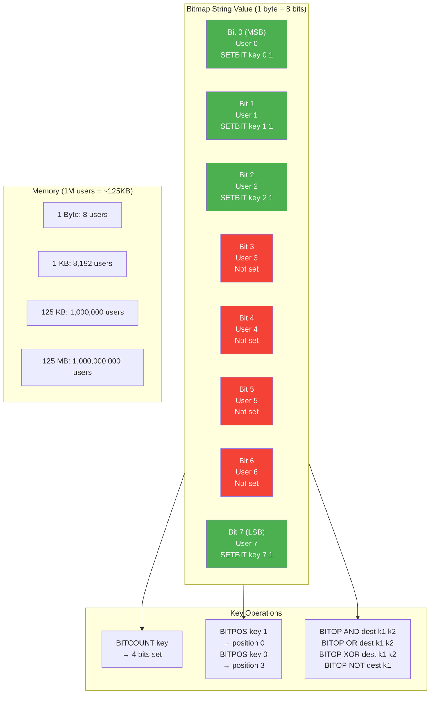
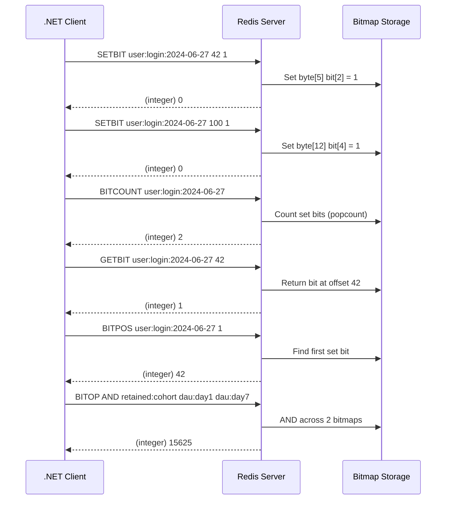
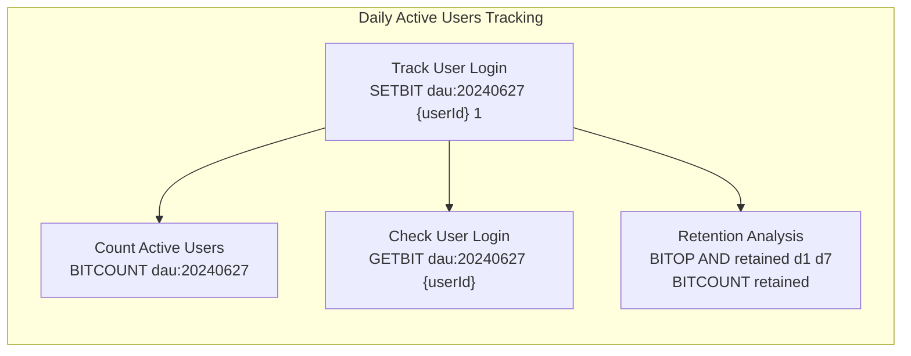
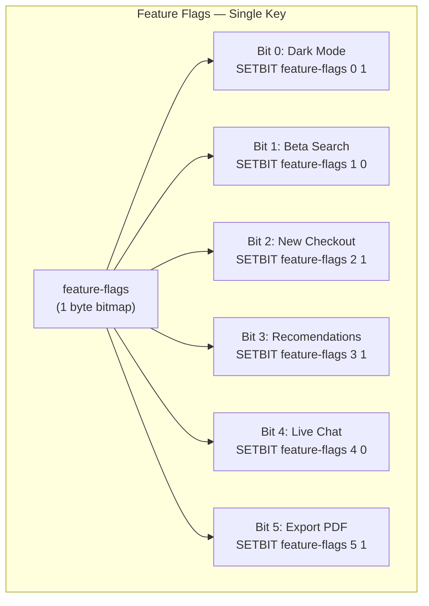

## 1 — Overview

Redis string bit operations allow you to manipulate and query individual bits within a string value. Since Redis strings are binary-safe byte arrays up to 512 MB, a single string can represent a bitmap of up to 2^32 bits (512 million bits). Bit operations provide memory-efficient solutions for scenarios that require tracking binary state per entity — active/inactive, present/absent, enabled/disabled, on/off.

The four fundamental bit operations are:

- **SETBIT** — Set or clear a single bit at a given offset
- **GETBIT** — Return the value of a single bit at a given offset
- **BITCOUNT** — Count the number of bits set to 1 (population count / popcount) in the entire string or a byte range
- **BITPOS** — Find the position of the first bit with a given value (0 or 1) in the entire string or a byte range
- **BITOP** — Perform bitwise operations (AND, OR, XOR, NOT) across one or more keys, storing the result in a destination key

Redis strings are indexed by byte offset for range-based operations, but bit offsets are used for SETBIT and GETBIT. Within each byte, bits are ordered MSB 0 (most significant bit first), meaning bit offset 0 is the highest-order bit of the first byte.

Bit operations are atomic. SETBIT and GETBIT run in O(1) time. BITCOUNT uses a variable Hamming weight algorithm (typically O(n) but highly optimized). BITOP is O(n) over the combined length of all strings involved.

The bitmap data structure is one of the most memory-efficient constructs in Redis. A bitmap representing 1 billion distinct entities requires only ~125 MB of memory. For tracking daily active users, 1 million users require ~125 KB per day.

```
Bitmap Memory Efficiency:
  Bits per byte:         8
  Bytes per 1K users:    125
  Bytes per 1M users:    125,000  (~125 KB)
  Bytes per 1B users:    125,000,000  (~125 MB)
  Max Redis string:      512 MB  (~4 billion bits)
```

## 2 — Commands

### SETBIT

Set or clear the bit at the specified offset within the string value. The offset is zero-based. Setting a bit beyond the current string length automatically grows the string (zero-filled).

**Syntax:** `SETBIT key offset value`

```
> SETBIT user:login:2024-01-01 0 1
(integer) 0
> SETBIT user:login:2024-01-01 1 1
(integer) 0
> SETBIT user:login:2024-01-01 2 1
(integer) 0
> SETBIT user:login:2024-01-01 7 1
(integer) 0
```

When you set a bit at an offset beyond the current string length, Redis fills intermediate bytes with zeros:

```
> SETBIT sparse-bitmap 1000000 1
(integer) 0
```

This sets bit offset 1,000,000 (byte index 125,000, bit within that byte at position 0 of that byte, MSB). The first 124,999 bytes are zero-filled.

### GETBIT

Return the value of the bit at the specified offset. Offsets beyond the current string length return 0.

**Syntax:** `GETBIT key offset`

```
> GETBIT user:login:2024-01-01 0
(integer) 1
> GETBIT user:login:2024-01-01 3
(integer) 0
> GETBIT user:login:2024-01-01 999999
(integer) 0
```

### BITCOUNT

Count the number of bits set to 1 in the string. Supports optional start and end byte offsets. Without range parameters, counts the entire string.

**Syntax:** `BITCOUNT key [start end [BYTE|BIT]]`

```
> BITCOUNT user:login:2024-01-01
(integer) 4
> BITCOUNT user:login:2024-01-01 0 0
(integer) 4
> BITCOUNT user:login:2024-01-01 0 10
(integer) 4
```

With the `BYTE` qualifier (default), start and end are byte indices. With `BIT` qualifier (Redis 7.0+), they are bit indices:

```
> BITCOUNT user:login:2024-01-01 0 7 BIT
(integer) 4
> BITCOUNT user:login:2024-01-01 0 64 BIT
(integer) 4
```

Negative indices count from the end of the string:

```
> BITCOUNT user:login:2024-01-01 -5 -1
(integer) 0
```

### BITPOS

Return the position of the first bit with the specified value (0 or 1) in the string. Returns -1 if no matching bit is found.

**Syntax:** `BITPOS key bit [start [end [BYTE|BIT]]]`

```
> BITPOS user:login:2024-01-01 1
(integer) 0
> BITPOS user:login:2024-01-01 0
(integer) 3
> BITPOS user:login:2024-01-01 1 1 10
(integer) -1
```

When searching for bit value 0, if the entire string has all bits set to 1, BITPOS returns the first bit position beyond the string length. This allows you to determine where you can append new data.

### BITOP

Perform bitwise operations between multiple keys and store the result in a destination key.

**Syntax:** `BITOP operation destkey key [key ...]`

Operations: `AND`, `OR`, `XOR`, `NOT`

```
> SETBIT visited:day1 0 1
> SETBIT visited:day1 1 1
> SETBIT visited:day1 3 1
> SETBIT visited:day2 0 1
> SETBIT visited:day2 2 1

> BITOP AND visited:both visited:day1 visited:day2
(integer) 1
> BITCOUNT visited:both
(integer) 1

> BITOP OR visited:any visited:day1 visited:day2
(integer) 1
> BITCOUNT visited:any
(integer) 4

> BITOP XOR visited:one-or-other visited:day1 visited:day2
(integer) 1
> BITCOUNT visited:one-or-other
(integer) 3

> BITOP NOT visited:not-day1 visited:day1
(integer) 1
> BITPOS visited:not-day1 1
(integer) 2
```

BITOP NOT requires exactly one input key. AND, OR, XOR accept one or more keys. The result is stored in destkey (created if it does not exist). If destkey exists, it is overwritten.

When keys have different lengths, the shorter keys are treated as zero-padded to the length of the longest key.

### STRLEN

Get the length of the string value in bytes. Useful for determining the bitmap size.

```
> STRLEN user:login:2024-01-01
(integer) 1
```

The bitmap is currently 1 byte (covering bits 0–7).

## 3 — Code Examples

### StackExchange.Redis — Basic Bit Operations

```csharp
using StackExchange.Redis;
using System;
using System.Threading.Tasks;

public class RedisBitOperations
{
    private readonly ConnectionMultiplexer _redis;
    private readonly IDatabase _db;

    public RedisBitOperations(ConnectionMultiplexer redis)
    {
        _redis = redis ?? throw new ArgumentNullException(nameof(redis));
        _db = redis.GetDatabase();
    }

    public async Task SetBitAsync(string key, long offset, bool value)
    {
        try
        {
            await _db.StringSetBitAsync(key, offset, value);
        }
        catch (RedisException ex)
        {
            Console.WriteLine($"Redis error setting bit at {offset} for key {key}: {ex.Message}");
            throw;
        }
        catch (TimeoutException ex)
        {
            Console.WriteLine($"Timeout setting bit at {offset} for key {key}: {ex.Message}");
            throw;
        }
    }

    public async Task<bool> GetBitAsync(string key, long offset)
    {
        try
        {
            return await _db.StringGetBitAsync(key, offset);
        }
        catch (RedisException ex)
        {
            Console.WriteLine($"Redis error getting bit at {offset} for key {key}: {ex.Message}");
            throw;
        }
    }

    public async Task<long> BitCountAsync(string key, long? start = null, long? end = null)
    {
        try
        {
            if (start.HasValue && end.HasValue)
            {
                return await _db.StringBitCountAsync(key, start.Value, end.Value);
            }
            return await _db.StringBitCountAsync(key);
        }
        catch (RedisException ex)
        {
            Console.WriteLine($"Redis error counting bits for key {key}: {ex.Message}");
            throw;
        }
    }

    public async Task<long> BitPositionAsync(string key, bool bit, long? start = null, long? end = null)
    {
        try
        {
            if (start.HasValue && end.HasValue)
            {
                return await _db.StringBitPositionAsync(key, bit, start.Value, end.Value);
            }
            if (start.HasValue)
            {
                return await _db.StringBitPositionAsync(key, bit, start.Value);
            }
            return await _db.StringBitPositionAsync(key, bit);
        }
        catch (RedisException ex)
        {
            Console.WriteLine($"Redis error finding bit position for key {key}: {ex.Message}");
            throw;
        }
    }
}
```

### StackExchange.Redis — BITOP Operations

```csharp
using StackExchange.Redis;
using System;
using System.Threading.Tasks;

public class RedisBitwiseOperations
{
    private readonly IDatabase _db;

    public RedisBitwiseOperations(IDatabase db)
    {
        _db = db ?? throw new ArgumentNullException(nameof(db));
    }

    public async Task<long> BitwiseAndAsync(string destination, RedisKey[] sourceKeys)
    {
        try
        {
            return await _db.StringBitOperationAsync(Bitwise.And, destination, sourceKeys);
        }
        catch (RedisException ex)
        {
            Console.WriteLine($"BITOP AND failed: {ex.Message}");
            throw;
        }
    }

    public async Task<long> BitwiseOrAsync(string destination, RedisKey[] sourceKeys)
    {
        try
        {
            return await _db.StringBitOperationAsync(Bitwise.Or, destination, sourceKeys);
        }
        catch (RedisException ex)
        {
            Console.WriteLine($"BITOP OR failed: {ex.Message}");
            throw;
        }
    }

    public async Task<long> BitwiseXorAsync(string destination, RedisKey[] sourceKeys)
    {
        try
        {
            return await _db.StringBitOperationAsync(Bitwise.Xor, destination, sourceKeys);
        }
        catch (RedisException ex)
        {
            Console.WriteLine($"BITOP XOR failed: {ex.Message}");
            throw;
        }
    }

    public async Task<long> BitwiseNotAsync(string destination, RedisKey sourceKey)
    {
        try
        {
            return await _db.StringBitOperationAsync(Bitwise.Not, destination, new RedisKey[] { sourceKey });
        }
        catch (RedisException ex)
        {
            Console.WriteLine($"BITOP NOT failed: {ex.Message}");
            throw;
        }
    }
}
```

### StackExchange.Redis — Daily Active Users Tracker

```csharp
using StackExchange.Redis;
using System;
using System.Threading.Tasks;

public class DailyActiveUsersTracker
{
    private readonly IDatabase _db;
    private readonly string _keyPrefix = "dau:";

    public DailyActiveUsersTracker(IDatabase db)
    {
        _db = db;
    }

    public async Task TrackUserActivityAsync(long userId, DateTime? date = null)
    {
        string key = BuildKey(date ?? DateTime.UtcNow);
        try
        {
            await _db.StringSetBitAsync(key, userId, true);
        }
        catch (RedisException ex)
        {
            Console.WriteLine($"Failed to track user {userId} activity: {ex.Message}");
            throw;
        }
    }

    public async Task<bool> IsUserActiveAsync(long userId, DateTime? date = null)
    {
        string key = BuildKey(date ?? DateTime.UtcNow);
        try
        {
            return await _db.StringGetBitAsync(key, userId);
        }
        catch (RedisException ex)
        {
            Console.WriteLine($"Failed to check user {userId} activity: {ex.Message}");
            throw;
        }
    }

    public async Task<long> GetActiveUserCountAsync(DateTime? date = null)
    {
        string key = BuildKey(date ?? DateTime.UtcNow);
        try
        {
            return await _db.StringBitCountAsync(key);
        }
        catch (RedisException ex)
        {
            Console.WriteLine($"Failed to count active users: {ex.Message}");
            throw;
        }
    }

    public async Task<long> GetActiveUserCountInRangeAsync(DateTime date, long startByte, long endByte)
    {
        string key = BuildKey(date);
        try
        {
            return await _db.StringBitCountAsync(key, startByte, endByte);
        }
        catch (RedisException ex)
        {
            Console.WriteLine($"Failed to count active users in range: {ex.Message}");
            throw;
        }
    }

    public async Task<long[]> GetRetainedUsersAsync(DateTime day1, DateTime day2)
    {
        string key1 = BuildKey(day1);
        string key2 = BuildKey(day2);
        string destKey = $"retained:{day1:yyyyMMdd}:{day2:yyyyMMdd}";

        try
        {
            await _db.StringBitOperationAsync(Bitwise.And, destKey, new RedisKey[] { key1, key2 });
            long count = await _db.StringBitCountAsync(destKey);
            long firstRetained = await _db.StringBitPositionAsync(destKey, true);

            return new[] { count, firstRetained };
        }
        catch (RedisException ex)
        {
            Console.WriteLine($"Failed to calculate retained users: {ex.Message}");
            throw;
        }
    }

    public async Task<long> GetCumulativeActiveUsersAsync(DateTime startDate, DateTime endDate)
    {
        string destKey = $"dau:cumulative:{startDate:yyyyMMdd}:{endDate:yyyyMMdd}";

        try
        {
            RedisKey[] keys = GetDateRangeKeys(startDate, endDate);
            await _db.StringBitOperationAsync(Bitwise.Or, destKey, keys);
            return await _db.StringBitCountAsync(destKey);
        }
        catch (RedisException ex)
        {
            Console.WriteLine($"Failed to calculate cumulative active users: {ex.Message}");
            throw;
        }
    }

    public async Task<long> GetPowerUsersAsync(DateTime startDate, DateTime endDate, int minActiveDays)
    {
        string destKey = $"dau:power:{startDate:yyyyMMdd}:{endDate:yyyyMMdd}";

        try
        {
            RedisKey[] keys = GetDateRangeKeys(startDate, endDate);

            if (keys.Length < minActiveDays)
            {
                return 0;
            }

            await _db.StringBitOperationAsync(Bitwise.And, destKey, keys);
            return await _db.StringBitCountAsync(destKey);
        }
        catch (RedisException ex)
        {
            Console.WriteLine($"Failed to calculate power users: {ex.Message}");
            throw;
        }
    }

    public async Task<long> CountUsersActiveOnExactlyNDaysAsync(DateTime startDate, DateTime endDate, int n)
    {
        RedisKey[] keys = GetDateRangeKeys(startDate, endDate);
        int days = keys.Length;
        string tempPrefix = $"dau:temp:{startDate:yyyyMMdd}:{endDate:yyyyMMdd}:{n}";

        try
        {
            string xorDest = $"{tempPrefix}:xor";
            await _db.StringBitOperationAsync(Bitwise.Xor, xorDest, keys);

            for (int day = 1; day <= days; day++)
            {
                string subsetKey = $"{tempPrefix}:day{day}";
                RedisKey[] dayKeys = new RedisKey[day];
                Array.Copy(keys, 0, dayKeys, 0, day);
                await _db.StringBitOperationAsync(Bitwise.And, subsetKey, dayKeys);
            }

            string finalDest = $"{tempPrefix}:result";
            await _db.StringBitOperationAsync(Bitwise.Xor, finalDest, new RedisKey[] { xorDest });

            return await _db.StringBitCountAsync(finalDest);
        }
        catch (RedisException ex)
        {
            Console.WriteLine($"Failed to count N-day active users: {ex.Message}");
            throw;
        }
        finally
        {
            await _db.KeyDeleteAsync($"{tempPrefix}:*");
        }
    }

    private string BuildKey(DateTime date)
    {
        return $"{_keyPrefix}{date:yyyyMMdd}";
    }

    private RedisKey[] GetDateRangeKeys(DateTime startDate, DateTime endDate)
    {
        int days = (int)(endDate.Date - startDate.Date).TotalDays + 1;
        RedisKey[] keys = new RedisKey[days];
        for (int i = 0; i < days; i++)
        {
            keys[i] = BuildKey(startDate.Date.AddDays(i));
        }
        return keys;
    }
}

public class Program
{
    public static async Task Main()
    {
        using var redis = await ConnectionMultiplexer.ConnectAsync("localhost:6379");
        var tracker = new DailyActiveUsersTracker(redis.GetDatabase());

        await tracker.TrackUserActivityAsync(42);
        await tracker.TrackUserActivityAsync(100);
        await tracker.TrackUserActivityAsync(999);

        bool active = await tracker.IsUserActiveAsync(42);
        Console.WriteLine($"User 42 active today: {active}");

        long count = await tracker.GetActiveUserCountAsync();
        Console.WriteLine($"Active users today: {count}");
    }
}
```

### StackExchange.Redis — Feature Flags Bitmap

```csharp
using StackExchange.Redis;
using System;
using System.Collections.Generic;
using System.Threading.Tasks;

public class FeatureFlagsService
{
    private readonly IDatabase _db;
    private const string FeatureFlagsKey = "feature-flags";

    public enum Feature
    {
        DarkMode = 0,
        BetaSearch = 1,
        NewCheckout = 2,
        RecomendationEngine = 3,
        LiveChat = 4,
        ExportPDF = 5,
        BulkActions = 6,
        ApiV2 = 7,
        TwoFactorAuth = 8,
        SSOIntegration = 9
    }

    public FeatureFlagsService(IDatabase db)
    {
        _db = db;
    }

    public async Task EnableFeatureAsync(Feature feature)
    {
        await SetFeatureAsync(feature, true);
    }

    public async Task DisableFeatureAsync(Feature feature)
    {
        await SetFeatureAsync(feature, false);
    }

    private async Task SetFeatureAsync(Feature feature, bool enabled)
    {
        try
        {
            await _db.StringSetBitAsync(FeatureFlagsKey, (long)feature, enabled);
        }
        catch (RedisException ex)
        {
            Console.WriteLine($"Failed to set feature {feature}: {ex.Message}");
            throw;
        }
    }

    public async Task<bool> IsFeatureEnabledAsync(Feature feature)
    {
        try
        {
            return await _db.StringGetBitAsync(FeatureFlagsKey, (long)feature);
        }
        catch (RedisException ex)
        {
            Console.WriteLine($"Failed to check feature {feature}: {ex.Message}");
            return false;
        }
    }

    public async Task<Dictionary<Feature, bool>> GetAllFeatureStatesAsync()
    {
        var states = new Dictionary<Feature, bool>();
        foreach (Feature feature in Enum.GetValues<Feature>())
        {
            states[feature] = await IsFeatureEnabledAsync(feature);
        }
        return states;
    }

    public async Task<long> GetEnabledFeatureCountAsync()
    {
        try
        {
            return await _db.StringBitCountAsync(FeatureFlagsKey);
        }
        catch (RedisException ex)
        {
            Console.WriteLine($"Failed to count enabled features: {ex.Message}");
            throw;
        }
    }

    public async Task<long> FindFirstEnabledFeatureAsync()
    {
        try
        {
            return await _db.StringBitPositionAsync(FeatureFlagsKey, true);
        }
        catch (RedisException ex)
        {
            Console.WriteLine($"Failed to find first enabled feature: {ex.Message}");
            throw;
        }
    }

    public async Task<string> SerializeToHexAsync()
    {
        try
        {
            RedisValue value = await _db.StringGetAsync(FeatureFlagsKey);
            if (value.IsNull) return "00";
            return BitConverter.ToString(value).Replace("-", "");
        }
        catch (RedisException ex)
        {
            Console.WriteLine($"Failed to serialize feature flags: {ex.Message}");
            throw;
        }
    }
}
```

### StackExchange.Redis — Bloom Filter Alternative Using Bitmaps

```csharp
using StackExchange.Redis;
using System;
using System.Collections.Generic;
using System.Security.Cryptography;
using System.Text;
using System.Threading.Tasks;

public class SimpleBloomFilter
{
    private readonly IDatabase _db;
    private readonly string _key;
    private readonly int _bitmapSize;
    private readonly int _numHashFunctions;
    private readonly HashAlgorithm _hashAlgorithm;

    public SimpleBloomFilter(IDatabase db, string key, int bitmapSizeBits, int numHashFunctions)
    {
        _db = db;
        _key = key;
        _bitmapSize = bitmapSizeBits;
        _numHashFunctions = numHashFunctions;
        _hashAlgorithm = MD5.Create();
    }

    public async Task AddAsync(string item)
    {
        try
        {
            int[] positions = GetHashPositions(item);
            foreach (int pos in positions)
            {
                await _db.StringSetBitAsync(_key, pos, true);
            }
        }
        catch (RedisException ex)
        {
            Console.WriteLine($"Failed to add item to bloom filter: {ex.Message}");
            throw;
        }
    }

    public async Task<bool> MightContainAsync(string item)
    {
        try
        {
            int[] positions = GetHashPositions(item);
            foreach (int pos in positions)
            {
                bool bit = await _db.StringGetBitAsync(_key, pos);
                if (!bit) return false;
            }
            return true;
        }
        catch (RedisException ex)
        {
            Console.WriteLine($"Failed to check bloom filter: {ex.Message}");
            throw;
        }
    }

    public async Task<double> GetFillRatioAsync()
    {
        try
        {
            long bitsSet = await _db.StringBitCountAsync(_key);
            return (double)bitsSet / _bitmapSize;
        }
        catch (RedisException ex)
        {
            Console.WriteLine($"Failed to get fill ratio: {ex.Message}");
            throw;
        }
    }

    public async Task ResetAsync()
    {
        try
        {
            await _db.KeyDeleteAsync(_key);
        }
        catch (RedisException ex)
        {
            Console.WriteLine($"Failed to reset bloom filter: {ex.Message}");
            throw;
        }
    }

    private int[] GetHashPositions(string item)
    {
        byte[] data = Encoding.UTF8.GetBytes(item);
        byte[] hash = _hashAlgorithm.ComputeHash(data);
        int[] positions = new int[_numHashFunctions];

        for (int i = 0; i < _numHashFunctions; i++)
        {
            int pos = Math.Abs(BitConverter.ToInt32(hash, (i * 4) % (hash.Length - 4))) % _bitmapSize;
            positions[i] = pos;
        }

        return positions;
    }

    public void Dispose()
    {
        _hashAlgorithm?.Dispose();
    }
}
```

### StackExchange.Redis — Online Presence Tracker

```csharp
using StackExchange.Redis;
using System;
using System.Collections.Generic;
using System.Threading.Tasks;

public class OnlinePresenceTracker
{
    private readonly IDatabase _db;
    private readonly string _key;
    private readonly TimeSpan _heartbeatTimeout;
    private readonly long _maxUsers;
    private readonly HashSet<long> _recentlyOffline = new HashSet<long>();

    public OnlinePresenceTracker(IDatabase db, string key = "online:users", 
        TimeSpan? heartbeatTimeout = null, long maxUsers = 1000000)
    {
        _db = db;
        _key = key;
        _heartbeatTimeout = heartbeatTimeout ?? TimeSpan.FromMinutes(5);
        _maxUsers = maxUsers;
    }

    public async Task HeartbeatAsync(long userId)
    {
        try
        {
            await _db.StringSetBitAsync(_key, userId, true);
        }
        catch (RedisException ex)
        {
            Console.WriteLine($"Heartbeat failed for user {userId}: {ex.Message}");
            throw;
        }
    }

    public async Task<bool> IsOnlineAsync(long userId)
    {
        try
        {
            return await _db.StringGetBitAsync(_key, userId);
        }
        catch (RedisException ex)
        {
            Console.WriteLine($"Failed to check online status for user {userId}: {ex.Message}");
            return false;
        }
    }

    public async Task<long> GetOnlineCountAsync()
    {
        try
        {
            return await _db.StringBitCountAsync(_key);
        }
        catch (RedisException ex)
        {
            Console.WriteLine($"Failed to count online users: {ex.Message}");
            throw;
        }
    }

    public async Task<List<long>> GetOnlineUserIdsAsync()
    {
        var userIds = new List<long>();
        long pos = 0;
        try
        {
            while (pos < _maxUsers)
            {
                pos = await _db.StringBitPositionAsync(_key, true, pos);
                if (pos < 0) break;
                userIds.Add(pos);
                pos++;
            }
        }
        catch (RedisException ex)
        {
            Console.WriteLine($"Failed to enumerate online users: {ex.Message}");
            throw;
        }
        return userIds;
    }

    public async Task ResetStatusAsync()
    {
        try
        {
            await _db.KeyDeleteAsync(_key);
        }
        catch (RedisException ex)
        {
            Console.WriteLine($"Failed to reset online status: {ex.Message}");
            throw;
        }
    }
}
```

### StackExchange.Redis — Error Handling and Resilience Patterns

```csharp
using StackExchange.Redis;
using System;
using System.Threading.Tasks;

public class ResilientBitOperations
{
    private readonly IDatabase _db;
    private readonly int _maxRetries;
    private readonly TimeSpan _retryDelay;

    public ResilientBitOperations(IDatabase db, int maxRetries = 3, TimeSpan? retryDelay = null)
    {
        _db = db;
        _maxRetries = maxRetries;
        _retryDelay = retryDelay ?? TimeSpan.FromMilliseconds(100);
    }

    public async Task<bool> TrySetBitWithRetryAsync(string key, long offset, bool value)
    {
        int attempt = 0;
        while (attempt < _maxRetries)
        {
            try
            {
                await _db.StringSetBitAsync(key, offset, value);
                return true;
            }
            catch (RedisConnectionException) when (attempt < _maxRetries - 1)
            {
                attempt++;
                await Task.Delay(_retryDelay);
            }
            catch (RedisServerException ex)
            {
                Console.WriteLine($"Server error setting bit: {ex.Message}");
                throw;
            }
            catch (RedisTimeoutException) when (attempt < _maxRetries - 1)
            {
                attempt++;
                await Task.Delay(_retryDelay);
            }
        }
        return false;
    }

    public async Task<long> TryBitCountWithFallbackAsync(string key, long defaultValue = -1)
    {
        try
        {
            return await _db.StringBitCountAsync(key);
        }
        catch (RedisConnectionException ex)
        {
            Console.WriteLine($"Connection failed, using default value: {ex.Message}");
            return defaultValue;
        }
        catch (RedisTimeoutException ex)
        {
            Console.WriteLine($"Timeout, using default value: {ex.Message}");
            return defaultValue;
        }
        catch (RedisServerException ex)
        {
            Console.WriteLine($"Server error: {ex.Message}");
            return defaultValue;
        }
    }

    public async Task<RedisResult> ExecuteWithCircuitBreakerAsync(Func<Task<RedisResult>> operation)
    {
        try
        {
            return await operation();
        }
        catch (RedisConnectionException)
        {
            Console.WriteLine("Circuit breaker tripped due to connection failure");
            throw;
        }
    }

    public async Task<string> GetRedisStatusAsync()
    {
        try
        {
            var server = _db.Multiplexer.GetServer(_db.Multiplexer.GetEndPoints()[0]);
            var info = await server.InfoAsync("memory");
            return $"Connected: {_db.Multiplexer.IsConnected}, Database: {_db.Database}";
        }
        catch (Exception ex)
        {
            return $"Status check failed: {ex.Message}";
        }
    }
}
```

## 4 — Use Cases

### Daily Active Users (DAU) Tracking

The most canonical use case for Redis bitmaps. Assign each user a persistent numeric user ID. For each calendar day, store a bitmap keyed by date. Set bit at offset = user ID when the user performs any activity on that day.

```
Key Format: dau:YYYYMMDD
Example:    dau:20240627
```

**Daily statistics:**
- `BITCOUNT dau:20240627` — total unique active users for the day
- `BITPOS dau:20240627 1` — first active user ID of the day

**Multi-day analysis with BITOP:**
- BITOP AND gives users active on ALL specified days (retention)
- BITOP OR gives users active on ANY specified day (cumulative reach)
- BITOP XOR gives users active on exactly one of the specified days (churn)

**Retention cohort analysis:**
```
Day 1 bitmap (install cohort): BITOP AND retained cohort day1 day7
Result: users who installed on day 1 AND were active on day 7
```

**Weekly/Monthly active users:**
```
BITOP OR wau:week23 dau:20240623 dau:20240624 ... dau:20240629
BITCOUNT wau:week23
```

### Bloom Filter Alternative

A Redis bitmap can serve as a simple bloom filter for approximate membership queries. Unlike a real bloom filter that uses multiple hash functions and a uniform bit array, a Redis bitmap with SETBIT is exact for user IDs mapped directly to offsets. For string-based membership, use multiple hash functions to set/check bits across the bitmap.

Advantages over Redis Sets:
- Memory efficiency: ~125 KB per million entries vs ~32 MB for a Redis Set of integers
- Predictable memory: fixed size regardless of how many items are added
- O(1) membership check via GETBIT vs O(1) memory-expensive set membership

Disadvantages:
- No deletion (cannot unset a bit without affecting other items that hash to the same position)
- Fixed capacity (must define bitmap size upfront assuming a maximum number of items)
- Hash collisions produce false positives (in bloom filter mode)

### Feature Flags

Use a single Redis string as a feature flag bitmap where each bit position maps to a feature. This is extremely memory efficient — a single key with 1 byte can manage 8 feature flags, and 128 bytes can manage 1024 feature flags.

**Benefits:**
- All feature flags loaded in a single GET/single round trip
- Atomically toggle individual flags with SETBIT
- Check multiple flags with BITFIELD (if available) or individual GETBIT calls
- Distribute flag configuration across Redis instances via cluster

### Online Presence

Track which users are currently online using a short-TTL bitmap. On each heartbeat, SETBIT for the user ID and potentially set a key expiry (though TTL on a string kills the entire bitmap — use a separate mechanism or periodic reset).

For session-based tracking:
- Use a bitmap per time window (e.g., per 5-minute slot)
- OR across recent time windows to get currently online users

### A/B Testing Assignment

Assign users to A/B test variants using the lowest bit(s) of their user ID offset:

- Bit 0 = 0 → Control group, Bit 0 = 1 → Treatment group
- BITCOUNT returns how many users were assigned to treatment
- Change assignment for a test by toggling the bit
- Multiple tests use different bit positions

### Permission Matrix

Store permissions as a bitmap per resource. Each bit represents a specific permission (read, write, delete, admin, etc.). Check permissions with GETBIT and combine permission sets with BITOP.

```
Permission bits:
  Bit 0: Read
  Bit 1: Write
  Bit 2: Delete
  Bit 3: Admin
  Bit 4: Export
  Bit 5: Share
```

### Event Attendance Tracking

Use bitmaps for event RSVPs. Each event gets a bitmap key. User ID offset indicates attendance. Combine events with BITOP AND to find users attending multiple events.

## 5 — Memory & Performance

### Memory Efficiency

Bitmaps are one of the most memory-efficient data structures in Redis for tracking binary state per entity.

```
Entities   Bytes     KB      MB
100        12.5      —       —
1,000      125       0.125   —
10,000     1,250     1.22    —
100,000    12,500    12.2    —
1,000,000  125,000   122     0.119
10,000,000 1,250,000 1,220   1.19
100,000,000 —        12,200  11.9
1,000,000,000 —        —     119
```

**Comparison with other Redis data structures for storing 1M user IDs:**
- Bitmap (1 bit per user): ~125 KB
- Redis Set of integers (4 bytes + overhead per entry): ~32 MB
- Redis Set of strings (user ID as string): ~64 MB+
- Redis HyperLogLog: ~12 KB (but approximate, not exact)

**Comparison with Set for tracking 10 million daily active users:**
- Bitmap: ~1.19 MB (with user ID as bit offset)
- Redis Set of 10M integer IDs: ~320 MB

### Performance Characteristics

| Operation    | Time Complexity | Notes                                    |
|-------------|-----------------|------------------------------------------|
| SETBIT      | O(1)            | Constant time per bit                    |
| GETBIT      | O(1)            | Constant time per bit                    |
| BITCOUNT    | O(n)            | n = string length in bytes; optimized    |
| BITPOS      | O(n)            | n = string length in bytes               |
| BITOP       | O(n)            | n = length of longest string             |
| STRLEN      | O(1)            | Returns cached string length             |

### BITCOUNT Optimization

Redis uses a variable-precision SWAR (SIMD Within A Register) algorithm for BITCOUNT. The algorithm processes 32-bit or 64-bit chunks at a time, achieving throughput of ~100-200 MB/s on modern hardware.

For a 125 KB bitmap (1M users), BITCOUNT completes in under 1ms on modern hardware. For a 512 MB bitmap (max size), BITCOUNT may take several hundred milliseconds.

When you only need a portion of the bitmap, use the START END range parameters to limit the byte range scanned. For example, if user IDs 0-9999 fall in bytes 0-1249, limit BITCOUNT to that range.

### BITOP Performance

BITOP AND/OR/XOR/NOT streams through all bytes of all input keys to produce the result. For large keys (hundreds of MB), BITOP can be a blocking operation that starves other commands. Consider:

- Running BITOP on replica nodes if available
- Using smaller bitmap sizes by splitting users into shards
- Using Lua scripting to process bitmaps in chunks
- Being aware that BITOP returns the size of the destination key in bytes (not the bit count)

### Memory Fragmentation

Frequently setting bits at varying offsets can lead to memory fragmentation in Redis. The string itself is a contiguous byte array, but repeated SETBIT calls at increasing offsets cause Redis to reallocate and zero-fill, which can cause jemalloc fragmentation. Pre-allocate the string to the expected final size by using SET with a zero-filled string to reduce fragmentation.

```bash
# Pre-allocate a 125 KB string for 1M users
SET dau:20240627 "\x00" — but better to use SETRANGE
SETRANGE dau:20240627 124999 "\x00"
```

### Network Efficiency

When checking many bits in a single request, consider using BITFIELD instead of individual GETBIT calls. BITFIELD can get/set multiple bits in one command, reducing round trips.

Alternatively, use pipelining to batch multiple GETBIT or SETBIT commands in a single network round trip:

```csharp
public async Task CheckBatchAsync(string key, long[] offsets)
{
    var batch = _db.CreateBatch();
    var tasks = new Task<bool>[offsets.Length];
    for (int i = 0; i < offsets.Length; i++)
    {
        long offset = offsets[i];
        tasks[i] = batch.StringGetBitAsync(key, offset);
    }
    batch.Execute();
    await Task.WhenAll(tasks);
}
```

## 6 — Diagram









## 7 — Comparison

### Bitmap vs Redis Set

| Aspect              | Bitmap                        | Set                             |
|--------------------|-------------------------------|---------------------------------|
| Memory (1M items)  | ~125 KB                       | ~32 MB                          |
| Add item           | SETBIT O(1)                   | SADD O(1)                       |
| Check membership   | GETBIT O(1)                   | SISMEMBER O(1)                  |
| Count items        | BITCOUNT O(n)                 | SCARD O(1)                      |
| Get all items      | Not directly (iterate BITPOS) | SMEMBERS O(n)                   |
| Remove item        | SETBIT 0 (no reuse)           | SREM O(1)                       |
| Cross-key ops      | BITOP O(n)                    | SUNION/SINTER/SDIFF O(n)        |
| Max size           | 512 MB (~4B bits)             | 2^32 - 1 entries (~4B entries)  |
| ID requirements    | Sequential numeric IDs        | Any type                        |
| Exact counting     | Yes (no false positives)      | Yes                             |

### Bitmap vs HyperLogLog

| Aspect              | Bitmap                        | HyperLogLog                     |
|--------------------|-------------------------------|---------------------------------|
| Memory (any size)  | Proportional to max ID        | Fixed ~12 KB                    |
| Accuracy           | Exact                         | Approximate (~0.81% error)      |
| Membership check   | GETBIT O(1)                   | Not supported                   |
| Cross-day analysis | BITOP AND/OR/XOR              | PFMERGE (OR only, approximate)  |
| Use case           | DAU, retention, flags         | Cardinality estimation          |

### Bitmap vs String (JSON flags)

| Aspect              | Bitmap                        | JSON in String                  |
|--------------------|-------------------------------|---------------------------------|
| Memory per flag    | 1 bit                         | Variable (bytes per flag name)  |
| Read single flag   | GETBIT O(1)                   | GET + JSON parse O(n)           |
| Toggle single flag | SETBIT O(1)                   | GET + parse + modify + SET O(n) |
| Atomicity          | Per-bit atomic                | Requires Lua or WATCH/MULTI     |
| Human readable     | No (binary)                   | Yes (JSON)                      |

## 8 — Gotchas

### MSB 0 Bit Ordering

Redis uses MSB 0 (most significant bit first) ordering within each byte. This means bit offset 0 is the highest-order bit of the first byte (value 128). For example:

```
Byte 0: bits 0-7 (MSB first)
  Bit 0 = 128 (0x80)
  Bit 1 = 64  (0x40)
  Bit 2 = 32  (0x20)
  Bit 3 = 16  (0x10)
  Bit 4 = 8   (0x08)
  Bit 5 = 4   (0x04)
  Bit 6 = 2   (0x02)
  Bit 7 = 1   (0x01)
```

To verify:
```
> SETBIT test 0 1
> GET test
"\x80"  (binary: 10000000)
> SETBIT test 7 1
> GET test
"\x81"  (binary: 10000001)
```

This is counterintuitive if you expect bit 0 to be the least significant bit (LSB 0). Some libraries and tools assume LSB 0 ordering. Always verify your bit ordering when integrating with external systems.

### BITCOUNT Range Parameters Are Byte Ranges

When you pass START and END to BITCOUNT, they are **byte indices**, not bit indices. This is a common source of errors:

```
> BITCOUNT dau:20240627 0 0    ← counts bits in byte 0 only
> BITCOUNT dau:20240627 0 1249 ← counts bits in first 1250 bytes (bits 0-9999)
```

In Redis 7.0+, you can use the BIT qualifier to specify bit ranges explicitly:
```
> BITCOUNT dau:20240627 0 9999 BIT ← counts bits 0-9999
```

### BITOP Is Blocking

BITOP performs the operation in Redis's main thread and blocks all other commands while processing. For large bitmaps (hundreds of MB), this can take seconds and cause significant latency for other operations:

- A BITOP AND on two 512 MB strings processes 512 MB of data
- At ~200 MB/s throughput, this blocks Redis for ~2.5 seconds
- During this time, no other commands can be processed

Mitigations:
- Run BITOP on replicas (read-only operations)
- Use smaller bitmap shards
- Schedule BITOP during low-traffic periods
- Use Lua scripting to process in chunks with yielding
- Consider alternative approaches (e.g., client-side bitwise operations)

### SETBIT Automatically Grows the String

Setting a bit at a far offset automatically grows the string to accommodate that bit, zero-filling all bytes in between. This can cause unexpected memory spikes:

```bash
# If the string is empty, this grows it to 125,001 bytes (~125 KB)
SETBIT dau:20240627 1000000 1
```

The intermediate bytes (0 to 124999) are zero-filled. This is fine for DAU tracking (you intend to fill the bitmap), but be careful with sparse bitmaps where the offset is very large but few bits are actually set.

### No Direct Bitmap Serialization in StackExchange.Redis

StringBitCountAsync and StringBitPositionAsync return long values. The underlying bitmap is stored as a Redis string (binary). You can retrieve the entire bitmap using StringGetAsync and process it on the client side:

```csharp
RedisValue bitmap = await db.StringGetAsync("dau:20240627");
if (!bitmap.IsNull)
{
    byte[] data = (byte[])bitmap;
    // Process locally using BitArray or manual bit operations
}
```

### Key Expiry on Bitmaps is All-or-Nothing

TTL on a bitmap key applies to the entire string. You cannot expire individual bits. For date-based bitmaps (like DAU), this is natural — the entire day's bitmap has the same lifecycle. For long-lived bitmaps (feature flags, permissions), you manage the lifecycle manually.

### BITPOS with Value 0 Returns String-Length Position

When searching for bit value 0 and the string has all bits set to 1 within the range, BITPOS returns the first bit position beyond the string's length (equal to the string length in bits). This is useful for finding where new data can be appended:

```
> SETBIT full 0 1
> SETBIT full 1 1
> BITPOS full 0
(integer) 2
```

### User ID Collisions

If your user IDs are not sequential starting from 0, a bitmap approach wastes memory. For example, if your user IDs are UUIDs or start at 1000000, you either need:
- A mapping table (userId → bitmapOffset) — adds complexity
- Use Redis Sets instead (more memory but no mapping)
- Use sparse bitmaps (not natively supported in Redis)

### BITOP NOT Requires Exactly One Key

BITOP NOT is the only unary operation. It accepts exactly one source key. Passing more than one key returns an error:

```
> BITOP NOT dest key1 key2
(error) ERR BITOP NOT must be called with a single source key.
```

### StackExchange.Redis Bitwise Enum

The `Bitwise` enum values used in `StringBitOperationAsync`:
- `Bitwise.And` — AND operation
- `Bitwise.Or` — OR operation
- `Bitwise.Xor` — XOR operation
- `Bitwise.Not` — NOT operation

The method signature is:
```csharp
Task<long> StringBitOperationAsync(Bitwise operation, RedisKey destination, RedisKey[] keys);
```

It returns the size of the destination key in bytes, not the bit count.

### StringBitPositionAsync Not Available in Older StackExchange.Redis Versions

The `StringBitPositionAsync` method was added in StackExchange.Redis 2.6.x. If using an older version, you must send the BITPOS command directly:

```csharp
// Fallback for older StackExchange.Redis versions
var result = await db.ExecuteAsync("BITPOS", key, bit, start, end);
long position = (long)result;
```

### Memory Overhead of String Keys

Each Redis key has overhead (~90 bytes per key in current Redis). If you store a bitmap per day for 365 days, that's ~32 KB of key overhead. For feature flags where you might have hundreds of separate flag keys, consider consolidating into fewer keys.

### Bitmap Size Limits

The maximum Redis string size is 512 MB, limiting bitmaps to 2^32 bits (4,294,967,296 bits, or approximately 4 billion). If you need to track more entities than this, either:
- Use sharding (multiple bitmap keys, e.g., one per million users)
- Use a different data structure
- Upgrade to Redis 7.4+ which may have larger string limits in the future

### Default Key Behavior

If a bitmap key does not exist, GETBIT returns 0 and BITCOUNT returns 0. Setting a non-existent key with SETBIT creates it as a zero-filled string of the appropriate length. BITOP against non-existent keys treats them as zero-filled strings.

## 9 — References

### Related Notes
- [[8.961 — Redis — Data Structures Overview]]
- [[8.962 — Redis — Strings — INCR, INCRBY, GETSET, SETNX]]
- [[8.976 — Redis — Sets — Unique Visitors Tracking]]
- [[8.986 — Redis — HyperLogLog — PFADD, PFCOUNT, PFMERGE]]
- [[8.974 — Redis — Sets — SADD, SREM, SMEMBERS, SCARD]]
- [[8.1000 — Redis — StackExchange.Redis Full Reference]]

### External References
- [Redis Documentation — BITCOUNT](https://redis.io/commands/bitcount/)
- [Redis Documentation — BITPOS](https://redis.io/commands/bitpos/)
- [Redis Documentation — BITOP](https://redis.io/commands/bitop/)
- [Redis Documentation — SETBIT](https://redis.io/commands/setbit/)
- [Redis Documentation — GETBIT](https://redis.io/commands/getbit/)
- [Redis Documentation — BITFIELD](https://redis.io/commands/bitfield/)
- [Redis Bitmaps — Fast, easy, realtime](https://redis.com/redis-best-practices/bitmaps/)
- [StackExchange.Redis — GitHub](https://github.com/StackExchange/StackExchange.Redis)
- [StackExchange.Redis — Documentation](https://stackexchange.github.io/StackExchange.Redis/)

### Blog Posts
- [Redis Bitmaps: Practical Use Cases](https://redis.com/blog/bitmaps/)
- [Fast, easy, realtime analytics using Redis bitmaps](https://redis.com/redis-best-practices/bitmaps/)
- [Facebook's Scuba: Bitmap Indexes](https://engineering.fb.com/2014/07/28/core-data/scuba-diving-into-facebook-s-ads-database/)
- [Efficient user tracking with Redis bitmaps](https://blog.getspool.com/2011/11/29/fast-easy-realtime-metrics-using-redis-bitmaps/)

### Code
- [StackExchange.Redis — RedisDatabase.cs](https://github.com/StackExchange/StackExchange.Redis/blob/main/src/StackExchange.Redis/RedisDatabase.cs)
- [Redis — bitops.c — Implementation](https://github.com/redis/redis/blob/unstable/src/bitops.c)
