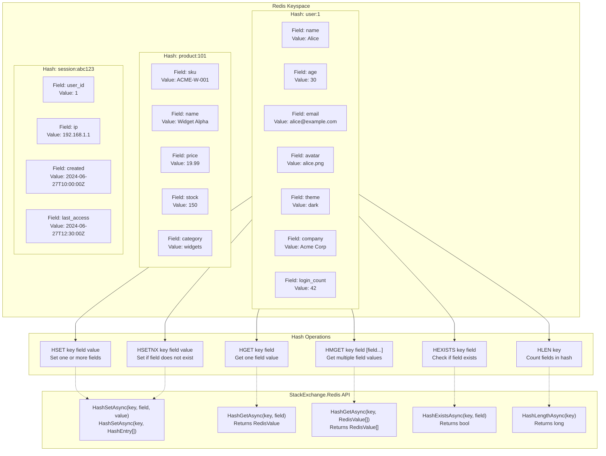
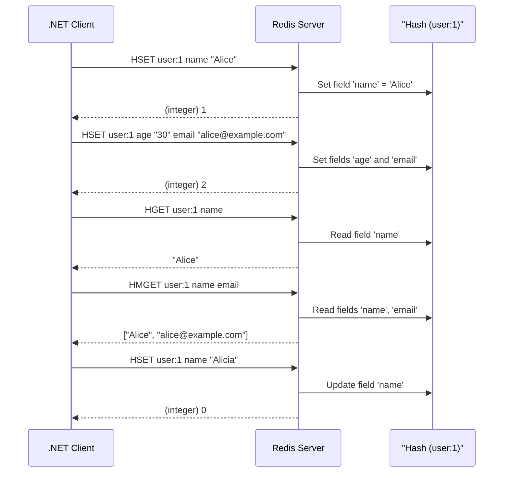
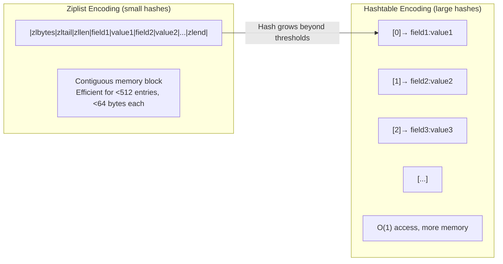

## 1 — Overview

Redis Hashes are a data structure that maps field-value pairs within a single Redis key. They are conceptually similar to a dictionary or a hashmap in programming languages — a flat collection of keys (fields) mapped to values, all namespaced under one Redis key.

Each Redis hash can store up to 2^32 - 1 field-value pairs (over 4 billion), and each field and value can be up to 512 MB. Hashes are memory-optimized: when a hash contains fewer than a configurable number of entries (default: 512) and each entry is smaller than a configurable size (default: 64 bytes), Redis encodes the hash as a ziplist rather than a hashtable. Ziplists are compact, contiguous memory structures that consume significantly less memory and provide good performance for small hashes.

The four fundamental hash operations covered in this note are:

- **HSET** — Set the value of one or more fields in a hash. Creates the key and/or fields as needed. Returns the number of new fields created.
- **HGET** — Get the value of a single field from a hash. Returns nil if the key or field does not exist.
- **HMSET** — Set multiple field-value pairs in a hash. **Deprecated** in Redis 7.0+ — use HSET with multiple field-value pairs instead.
- **HMGET** — Get the values of multiple fields from a hash in a single call. Returns nil for fields that do not exist.

Hashes are ideal for representing objects where you want to read, write, or update individual fields atomically without serializing/deserializing the entire object. This makes them a natural fit for user profiles, product details, session data, configuration objects, and any entity with a known set of mutable fields.

**Atomicity and isolation:** Each hash operation is atomic. HSET and HDEL affect only the specified fields. There is no partial failure within a command — if you HSET five fields, either all five are set or none are (in case of server failure). However, there is no multi-command atomicity without WATCH/MULTI/EXEC or Lua scripting.

**Memory encoding:** Redis automatically chooses between ziplist (compact) and hashtable encoding based on the hash size. You can inspect the encoding with `OBJECT ENCODING key`:
```
> HSET profile:1 name "Alice" age "30"
> OBJECT ENCODING profile:1
"ziplist"
```
When the hash exceeds `hash-max-ziplist-entries` (512) or any field value exceeds `hash-max-ziplist-value` (64 bytes), it converts to hashtable encoding automatically.

## 2 — Commands

### HSET

Set the value of one or more fields in a hash. If the key does not exist, it is created. If the field already exists, its value is overwritten.

**Syntax:** `HSET key field value [field value ...]`

Starting from Redis 4.0.0, HSET accepts multiple field-value pairs in a single call, replacing the use case for HMSET.

```
> HSET user:1 name "Alice"
(integer) 1
> HSET user:1 age "30"
(integer) 1
> HSET user:1 email "alice@example.com" avatar "alice.png" theme "dark"
(integer) 3
> HSET user:1 name "Alicia"
(integer) 0
```

The return value is the number of **new** fields created (not the number of fields updated). In the last example, `name` already existed and was updated, so the return is 0.

```
> HSET user:1 name "Alice" company "Acme Corp"
(integer) 1  ← only "company" is new; "name" was updated
```

### HGET

Get the value of a single field from a hash. Returns nil if the key does not exist or the field does not exist within the hash.

**Syntax:** `HGET key field`

```
> HGET user:1 name
"Alice"
> HGET user:1 age
"30"
> HGET user:1 nonexistent
(nil)
> HGET nonexistent:key name
(nil)
```

### HMSET (Deprecated)

Set multiple field-value pairs in a hash. This command was the original way to set many fields at once. Starting from Redis 4.0.0, HSET also accepts multiple field-value pairs, making HMSET redundant. Redis 7.0.0 marks HMSET as deprecated.

**Syntax:** `HMSET key field value [field value ...]`

```bash
# Old way (deprecated)
> HMSET user:1 name "Alice" age "30" email "alice@example.com"
OK

# New way (preferred)
> HSET user:1 name "Alice" age "30" email "alice@example.com"
(integer) 3
```

The difference: HSET returns the count of newly added fields, while HMSET returns OK. If you need the OK return value for compatibility, use HSET and ignore the count.

### HMGET

Get the values of multiple fields from a hash in a single call. Returns an array of values in the same order as the requested fields. Non-existent fields return nil in the array.

**Syntax:** `HMGET key field [field ...]`

```
> HMGET user:1 name age email nonexistent
1) "Alice"
2) "30"
3) "alice@example.com"
4) (nil)
```

HMGET is significantly more efficient than multiple HGET calls because it requires only one round trip rather than N round trips.

### HSETNX

Set the value of a field only if the field does not already exist. Returns 1 if the field was created, 0 if it already existed and no operation was performed.

**Syntax:** `HSETNX key field value`

```
> HSETNX user:1 name "Alice"
(integer) 0  ← "name" already exists
> HSETNX user:1 phone "+1-555-0123"
(integer) 1  ← "phone" was created
```

### HEXISTS

Check if a field exists in a hash. Returns 1 if the field exists, 0 if it does not.

**Syntax:** `HEXISTS key field`

```
> HEXISTS user:1 name
(integer) 1
> HEXISTS user:1 nonexistent
(integer) 0
```

### HLEN

Return the number of fields in a hash. O(1) operation.

**Syntax:** `HLEN key`

```
> HLEN user:1
(integer) 6
> HLEN nonexistent
(integer) 0
```

### HSTRLEN

Return the length of a field's value in bytes. Returns 0 if the field does not exist.

**Syntax:** `HSTRLEN key field`

```
> HSTRLEN user:1 name
(integer) 5  ← "Alice" is 5 bytes
> HSTRLEN user:1 nonexistent
(integer) 0
```

### HSCAN

Iterate over fields and values of a hash incrementally. Like SCAN but scoped to a hash.

**Syntax:** `HSCAN key cursor [MATCH pattern] [COUNT count]`

```
> HSCAN user:1 0
1) "0"  ← cursor (0 means complete)
2) 1) "name"
   2) "Alice"
   3) "age"
   4) "30"
   5) "email"
   6) "alice@example.com"
   7) "avatar"
   8) "alice.png"
   9) "theme"
   10) "dark"
   11) "company"
   12) "Acme Corp"
```

## 3 — Code Examples

### StackExchange.Redis — Basic Hash Operations

```csharp
using StackExchange.Redis;
using System;
using System.Threading.Tasks;

public class RedisHashService
{
    private readonly ConnectionMultiplexer _redis;
    private readonly IDatabase _db;

    public RedisHashService(ConnectionMultiplexer redis)
    {
        _redis = redis ?? throw new ArgumentNullException(nameof(redis));
        _db = redis.GetDatabase();
    }

    public async Task SetFieldAsync(string key, string field, string value)
    {
        try
        {
            await _db.HashSetAsync(key, field, value);
        }
        catch (RedisException ex)
        {
            Console.WriteLine($"Redis error setting field {field} on {key}: {ex.Message}");
            throw;
        }
    }

    public async Task SetMultipleFieldsAsync(string key, HashEntry[] entries)
    {
        try
        {
            await _db.HashSetAsync(key, entries);
        }
        catch (RedisException ex)
        {
            Console.WriteLine($"Redis error setting multiple fields on {key}: {ex.Message}");
            throw;
        }
    }

    public async Task<RedisValue> GetFieldAsync(string key, string field)
    {
        try
        {
            return await _db.HashGetAsync(key, field);
        }
        catch (RedisException ex)
        {
            Console.WriteLine($"Redis error getting field {field} from {key}: {ex.Message}");
            throw;
        }
    }

    public async Task<RedisValue[]> GetMultipleFieldsAsync(string key, string[] fields)
    {
        try
        {
            var redisFields = fields.Select(f => (RedisValue)f).ToArray();
            return await _db.HashGetAsync(key, redisFields);
        }
        catch (RedisException ex)
        {
            Console.WriteLine($"Redis error getting multiple fields from {key}: {ex.Message}");
            throw;
        }
    }

    public async Task<bool> FieldExistsAsync(string key, string field)
    {
        try
        {
            return await _db.HashExistsAsync(key, field);
        }
        catch (RedisException ex)
        {
            Console.WriteLine($"Redis error checking field existence: {ex.Message}");
            throw;
        }
    }

    public async Task<long> GetFieldCountAsync(string key)
    {
        try
        {
            return await _db.HashLengthAsync(key);
        }
        catch (RedisException ex)
        {
            Console.WriteLine($"Redis error getting hash length: {ex.Message}");
            throw;
        }
    }

    public async Task SetFieldIfNotExistsAsync(string key, string field, string value)
    {
        try
        {
            bool created = await _db.HashSetAsync(key, field, value, When.NotExists);
            if (!created)
            {
                Console.WriteLine($"Field {field} already exists, not overwritten");
            }
        }
        catch (RedisException ex)
        {
            Console.WriteLine($"Redis error in HSETNX: {ex.Message}");
            throw;
        }
    }
}
```

### StackExchange.Redis — Session Store Using Hashes

```csharp
using StackExchange.Redis;
using System;
using System.Collections.Generic;
using System.Threading.Tasks;

public class SessionStore
{
    private readonly IDatabase _db;
    private readonly TimeSpan _sessionTtl;
    private readonly string _keyPrefix = "session:";

    public SessionStore(IDatabase db, TimeSpan? sessionTtl = null)
    {
        _db = db;
        _sessionTtl = sessionTtl ?? TimeSpan.FromHours(24);
    }

    public async Task CreateSessionAsync(string sessionId, string userId, 
        string ipAddress, string userAgent)
    {
        string key = $"{_keyPrefix}{sessionId}";
        var entries = new HashEntry[]
        {
            new HashEntry("user_id", userId),
            new HashEntry("ip_address", ipAddress),
            new HashEntry("user_agent", userAgent),
            new HashEntry("created_at", DateTime.UtcNow.ToString("O")),
            new HashEntry("last_accessed", DateTime.UtcNow.ToString("O")),
            new HashEntry("is_active", "true")
        };

        try
        {
            await _db.HashSetAsync(key, entries);
            await _db.KeyExpireAsync(key, _sessionTtl);
        }
        catch (RedisException ex)
        {
            Console.WriteLine($"Failed to create session {sessionId}: {ex.Message}");
            throw;
        }
    }

    public async Task<Dictionary<string, string>> GetSessionAsync(string sessionId)
    {
        string key = $"{_keyPrefix}{sessionId}";
        try
        {
            HashEntry[] entries = await _db.HashGetAllAsync(key);
            if (entries.Length == 0) return null;

            var session = new Dictionary<string, string>();
            foreach (var entry in entries)
            {
                session[entry.Name.ToString()] = entry.Value.ToString();
            }
            return session;
        }
        catch (RedisException ex)
        {
            Console.WriteLine($"Failed to get session {sessionId}: {ex.Message}");
            return null;
        }
    }

    public async Task<bool> UpdateSessionFieldAsync(string sessionId, string field, string value)
    {
        string key = $"{_keyPrefix}{sessionId}";
        try
        {
            await _db.HashSetAsync(key, field, value);
            await _db.KeyExpireAsync(key, _sessionTtl);
            return true;
        }
        catch (RedisException ex)
        {
            Console.WriteLine($"Failed to update session field: {ex.Message}");
            return false;
        }
    }

    public async Task<string> GetSessionFieldAsync(string sessionId, string field)
    {
        string key = $"{_keyPrefix}{sessionId}";
        try
        {
            RedisValue value = await _db.HashGetAsync(key, field);
            return value.IsNull ? null : value.ToString();
        }
        catch (RedisException ex)
        {
            Console.WriteLine($"Failed to get session field: {ex.Message}");
            return null;
        }
    }

    public async Task<bool> DeleteSessionAsync(string sessionId)
    {
        string key = $"{_keyPrefix}{sessionId}";
        try
        {
            return await _db.KeyDeleteAsync(key);
        }
        catch (RedisException ex)
        {
            Console.WriteLine($"Failed to delete session {sessionId}: {ex.Message}");
            return false;
        }
    }

    public async Task TouchSessionAsync(string sessionId)
    {
        string key = $"{_keyPrefix}{sessionId}";
        try
        {
            await _db.HashSetAsync(key, "last_accessed", DateTime.UtcNow.ToString("O"));
            await _db.KeyExpireAsync(key, _sessionTtl);
        }
        catch (RedisException ex)
        {
            Console.WriteLine($"Failed to touch session {sessionId}: {ex.Message}");
            throw;
        }
    }
}
```

### StackExchange.Redis — Product Catalog With Hashes

```csharp
using StackExchange.Redis;
using System;
using System.Collections.Generic;
using System.Threading.Tasks;

public class ProductCatalogService
{
    private readonly IDatabase _db;
    private readonly string _keyPrefix = "product:";

    public ProductCatalogService(IDatabase db)
    {
        _db = db;
    }

    public async Task CreateProductAsync(string productId, string name, 
        decimal price, string category, int stock, string description, 
        string imageUrl, string sku, bool isActive = true)
    {
        string key = $"{_keyPrefix}{productId}";
        var entries = new List<HashEntry>
        {
            new HashEntry("name", name),
            new HashEntry("price", price.ToString("F2")),
            new HashEntry("category", category),
            new HashEntry("stock", stock.ToString()),
            new HashEntry("description", description),
            new HashEntry("image_url", imageUrl),
            new HashEntry("sku", sku),
            new HashEntry("is_active", isActive ? "1" : "0"),
            new HashEntry("created_at", DateTime.UtcNow.ToString("O")),
            new HashEntry("updated_at", DateTime.UtcNow.ToString("O"))
        };

        try
        {
            await _db.HashSetAsync(key, entries.ToArray());
        }
        catch (RedisException ex)
        {
            Console.WriteLine($"Failed to create product {productId}: {ex.Message}");
            throw;
        }
    }

    public async Task<string> GetProductFieldAsync(string productId, string field)
    {
        string key = $"{_keyPrefix}{productId}";
        try
        {
            RedisValue value = await _db.HashGetAsync(key, field);
            return value.IsNull ? null : value.ToString();
        }
        catch (RedisException ex)
        {
            Console.WriteLine($"Failed to get product field: {ex.Message}");
            return null;
        }
    }

    public async Task<Dictionary<string, string>> GetProductAsync(string productId)
    {
        string key = $"{_keyPrefix}{productId}";
        try
        {
            HashEntry[] entries = await _db.HashGetAllAsync(key);
            if (entries.Length == 0) return null;

            var product = new Dictionary<string, string>();
            foreach (var entry in entries)
            {
                product[entry.Name.ToString()] = entry.Value.ToString();
            }
            return product;
        }
        catch (RedisException ex)
        {
            Console.WriteLine($"Failed to get product {productId}: {ex.Message}");
            return null;
        }
    }

    public async Task<bool> UpdateProductPriceAsync(string productId, decimal newPrice)
    {
        string key = $"{_keyPrefix}{productId}";
        try
        {
            await _db.HashSetAsync(key, new HashEntry[]
            {
                new HashEntry("price", newPrice.ToString("F2")),
                new HashEntry("updated_at", DateTime.UtcNow.ToString("O"))
            });
            return true;
        }
        catch (RedisException ex)
        {
            Console.WriteLine($"Failed to update product price: {ex.Message}");
            return false;
        }
    }

    public async Task<bool> UpdateStockAsync(string productId, int delta)
    {
        string key = $"{_keyPrefix}{productId}";
        try
        {
            var transaction = _db.CreateTransaction();
            transaction.AddCondition(Condition.KeyExists(key));
            await transaction.HashIncrementAsync(key, "stock", delta);
            await transaction.HashSetAsync(key, "updated_at", DateTime.UtcNow.ToString("O"));
            return await transaction.ExecuteAsync();
        }
        catch (RedisException ex)
        {
            Console.WriteLine($"Failed to update stock: {ex.Message}");
            return false;
        }
    }

    public async Task<bool> ProductExistsAsync(string productId)
    {
        string key = $"{_keyPrefix}{productId}";
        try
        {
            return await _db.KeyExistsAsync(key);
        }
        catch (RedisException ex)
        {
            Console.WriteLine($"Failed to check product existence: {ex.Message}");
            return false;
        }
    }

    public async Task<string[]> GetProductCategoriesAsync(string productId)
    {
        string key = $"{_keyPrefix}{productId}";
        try
        {
            RedisValue categories = await _db.HashGetAsync(key, "category");
            if (categories.IsNull) return Array.Empty<string>();
            return categories.ToString().Split(',');
        }
        catch (RedisException ex)
        {
            Console.WriteLine($"Failed to get product categories: {ex.Message}");
            return Array.Empty<string>();
        }
    }
}
```

### StackExchange.Redis — Configuration Store

```csharp
using StackExchange.Redis;
using System;
using System.Collections.Generic;
using System.Threading.Tasks;

public class ConfigurationStore
{
    private readonly IDatabase _db;
    private readonly string _keyPrefix = "config:";

    public ConfigurationStore(IDatabase db)
    {
        _db = db;
    }

    public async Task SetConfigAsync(string module, string key, string value)
    {
        string hashKey = $"{_keyPrefix}{module}";
        try
        {
            await _db.HashSetAsync(hashKey, key, value);
        }
        catch (RedisException ex)
        {
            Console.WriteLine($"Failed to set config {module}:{key}: {ex.Message}");
            throw;
        }
    }

    public async Task SetConfigBatchAsync(string module, Dictionary<string, string> configs)
    {
        string hashKey = $"{_keyPrefix}{module}";
        var entries = new HashEntry[configs.Count];
        int i = 0;
        foreach (var kvp in configs)
        {
            entries[i++] = new HashEntry(kvp.Key, kvp.Value);
        }

        try
        {
            await _db.HashSetAsync(hashKey, entries);
        }
        catch (RedisException ex)
        {
            Console.WriteLine($"Failed to set config batch for {module}: {ex.Message}");
            throw;
        }
    }

    public async Task<string> GetConfigAsync(string module, string key)
    {
        string hashKey = $"{_keyPrefix}{module}";
        try
        {
            RedisValue value = await _db.HashGetAsync(hashKey, key);
            return value.IsNull ? null : value.ToString();
        }
        catch (RedisException ex)
        {
            Console.WriteLine($"Failed to get config {module}:{key}: {ex.Message}");
            return null;
        }
    }

    public async Task<Dictionary<string, string>> GetModuleConfigAsync(string module)
    {
        string hashKey = $"{_keyPrefix}{module}";
        try
        {
            HashEntry[] entries = await _db.HashGetAllAsync(hashKey);
            var config = new Dictionary<string, string>();
            foreach (var entry in entries)
            {
                config[entry.Name.ToString()] = entry.Value.ToString();
            }
            return config;
        }
        catch (RedisException ex)
        {
            Console.WriteLine($"Failed to get module config for {module}: {ex.Message}");
            return new Dictionary<string, string>();
        }
    }

    public async Task<bool> ConfigFieldExistsAsync(string module, string key)
    {
        string hashKey = $"{_keyPrefix}{module}";
        try
        {
            return await _db.HashExistsAsync(hashKey, key);
        }
        catch (RedisException ex)
        {
            Console.WriteLine($"Failed to check config existence: {ex.Message}");
            return false;
        }
    }

    public async Task DeleteConfigAsync(string module, string key)
    {
        string hashKey = $"{_keyPrefix}{module}";
        try
        {
            await _db.HashDeleteAsync(hashKey, key);
        }
        catch (RedisException ex)
        {
            Console.WriteLine($"Failed to delete config {module}:{key}: {ex.Message}");
            throw;
        }
    }
}
```

### StackExchange.Redis — Batching and Pipelines With Hashes

```csharp
using StackExchange.Redis;
using System;
using System.Collections.Generic;
using System.Threading.Tasks;

public class BatchHashOperations
{
    private readonly IDatabase _db;

    public BatchHashOperations(IDatabase db)
    {
        _db = db;
    }

    public async Task BatchSetFieldsAsync(Dictionary<string, Dictionary<string, string>> batchData)
    {
        var batch = _db.CreateBatch();
        var tasks = new List<Task>();

        try
        {
            foreach (var (key, fields) in batchData)
            {
                var entries = new HashEntry[fields.Count];
                int i = 0;
                foreach (var (field, value) in fields)
                {
                    entries[i++] = new HashEntry(field, value);
                }
                tasks.Add(batch.HashSetAsync(key, entries));
            }
            batch.Execute();
            await Task.WhenAll(tasks);
        }
        catch (RedisException ex)
        {
            Console.WriteLine($"Batch hash set failed: {ex.Message}");
            throw;
        }
    }

    public async Task<Dictionary<string, RedisValue[]>> BatchGetFieldsAsync(
        Dictionary<string, string[]> batchRequests)
    {
        var batch = _db.CreateBatch();
        var tasks = new Dictionary<string, Task<RedisValue[]>>();

        try
        {
            foreach (var (key, fields) in batchRequests)
            {
                var redisFields = fields.Select(f => (RedisValue)f).ToArray();
                tasks[key] = batch.HashGetAsync(key, redisFields);
            }
            batch.Execute();

            var results = new Dictionary<string, RedisValue[]>();
            foreach (var (key, task) in tasks)
            {
                results[key] = await task;
            }
            return results;
        }
        catch (RedisException ex)
        {
            Console.WriteLine($"Batch hash get failed: {ex.Message}");
            throw;
        }
    }

    public async Task<Dictionary<string, bool>> BatchFieldExistsAsync(
        Dictionary<string, string> keyFieldPairs)
    {
        var batch = _db.CreateBatch();
        var tasks = new Dictionary<string, Task<bool>>();

        try
        {
            foreach (var (key, field) in keyFieldPairs)
            {
                tasks[$"{key}:{field}"] = batch.HashExistsAsync(key, field);
            }
            batch.Execute();

            var results = new Dictionary<string, bool>();
            foreach (var (pairKey, task) in tasks)
            {
                results[pairKey] = await task;
            }
            return results;
        }
        catch (RedisException ex)
        {
            Console.WriteLine($"Batch hash exists failed: {ex.Message}");
            throw;
        }
    }
}
```

### StackExchange.Redis — Error Handling and Resilient Hash Operations

```csharp
using StackExchange.Redis;
using System;
using System.Threading.Tasks;

public class ResilientHashOperations
{
    private readonly IDatabase _db;
    private readonly int _maxRetries;
    private readonly TimeSpan _circuitBreakerTimeout;

    private int _failureCount;
    private DateTime _lastFailureTime;
    private bool _circuitOpen;

    public ResilientHashOperations(IDatabase db, int maxRetries = 3, 
        TimeSpan? circuitBreakerTimeout = null)
    {
        _db = db;
        _maxRetries = maxRetries;
        _circuitBreakerTimeout = circuitBreakerTimeout ?? TimeSpan.FromSeconds(30);
    }

    public async Task<RedisValue> GetFieldWithRetryAsync(string key, string field)
    {
        if (_circuitOpen)
        {
            if (DateTime.UtcNow - _lastFailureTime > _circuitBreakerTimeout)
            {
                _circuitOpen = false;
                _failureCount = 0;
            }
            else
            {
                throw new InvalidOperationException("Circuit breaker is open");
            }
        }

        int attempt = 0;
        while (attempt < _maxRetries)
        {
            try
            {
                return await _db.HashGetAsync(key, field);
            }
            catch (RedisConnectionException ex)
            {
                attempt++;
                Console.WriteLine($"Connection error (attempt {attempt}/{_maxRetries}): {ex.Message}");
                if (attempt >= _maxRetries)
                {
                    _failureCount++;
                    _lastFailureTime = DateTime.UtcNow;
                    if (_failureCount >= 5) _circuitOpen = true;
                    throw;
                }
                await Task.Delay(TimeSpan.FromMilliseconds(100 * Math.Pow(2, attempt)));
            }
            catch (RedisTimeoutException ex)
            {
                attempt++;
                Console.WriteLine($"Timeout (attempt {attempt}/{_maxRetries}): {ex.Message}");
                if (attempt >= _maxRetries) throw;
                await Task.Delay(TimeSpan.FromMilliseconds(50));
            }
            catch (RedisServerException ex)
            {
                Console.WriteLine($"Server error (non-retryable): {ex.Message}");
                throw;
            }
        }

        throw new InvalidOperationException("Should not reach here");
    }

    public async Task SetFieldWithFallbackAsync(string key, string field, 
        string value, string backupKey = null)
    {
        try
        {
            await _db.HashSetAsync(key, field, value);
        }
        catch (RedisConnectionException ex)
        {
            Console.WriteLine($"Redis unavailable, storing to backup: {ex.Message}");
            if (backupKey != null)
            {
                await _db.HashSetAsync(backupKey, field, value);
            }
            throw;
        }
    }

    public async Task<T> GetFieldWithDeserializationAsync<T>(
        string key, string field, Func<string, T> deserializer, T defaultValue = default)
    {
        try
        {
            RedisValue value = await _db.HashGetAsync(key, field);
            if (value.IsNull) return defaultValue;
            return deserializer(value.ToString());
        }
        catch (RedisException ex)
        {
            Console.WriteLine($"Error reading field {field}: {ex.Message}");
            return defaultValue;
        }
        catch (FormatException ex)
        {
            Console.WriteLine($"Deserialization error for field {field}: {ex.Message}");
            return defaultValue;
        }
    }
}
```

## 4 — Use Cases

### User Profile Storage

Store user profile data as a hash where each field represents a profile attribute. This is the most common hash use case in Redis.

```
Key: user:{userId}
Fields: name, email, avatar_url, bio, location, website, phone, birthday, 
        preferences_json, created_at, updated_at, is_verified, login_count
```

Benefits over a serialized JSON string:
- Partial reads: fetch only needed fields with HMGET
- Partial writes: update individual fields without rewriting entire profile
- Atomic increments: HINCRBY for login_count without read-modify-write
- Memory efficiency: ziplist encoding for small profiles

### Session Storage

Each web session stored as a hash with fields for session data. The key is the session ID, and fields contain session attributes.

```
Key: session:{sessionId}
Fields: user_id, ip_address, user_agent, created_at, last_accessed, 
        csrf_token, oauth_state, is_active
```

Benefits:
- Quick access to individual session attributes
- Atomic updates to specific fields
- TTL on the key automatically expires the entire session
- HMGET to fetch commonly-needed fields together

### Product Catalog

Store product data in hashes keyed by product ID. Each field is a product attribute.

```
Key: product:{productId}
Fields: sku, name, description, price, category, subcategory, 
        stock, image_url, weight, dimensions, is_active, 
        created_at, updated_at, tags, vendor_id, rating
```

Benefits:
- Fast access to individual product attributes
- Partial updates (e.g., update stock without touching other fields)
- Atomic price changes
- Bulk reads with HMGET for listing pages

### Configuration Store

Store application configuration by module/service as hashes. Each module gets its own hash key.

```
Key: config:{moduleName}
Fields: setting_name → setting_value (all strings)
```

Example:
```
config:payment:
  gateway: "stripe"
  api_version: "2023-10-16"
  webhook_secret: "whsec_..."
  retry_attempts: "3"
  timeout_ms: "5000"

config:email:
  provider: "sendgrid"
  from_address: "noreply@example.com"
  max_recipients: "50"
  rate_limit_per_second: "10"
```

Benefits:
- All config for one module in a single key (one network round-trip to load)
- Individual field updates without touching other config
- Easy namespace management by module

### Rate Limiting Bucket State

Store rate limiter state for each user as a hash:

```
Key: ratelimit:{userId}
Fields: window_start (timestamp), window_count (integer), 
        last_request (timestamp), penalty_score (integer)
```

Atomic HINCRBY and HSET operations make this efficient for sliding window or token bucket rate limiters.

### Shopping Cart

```
Key: cart:{sessionId}
Fields: item:{sku1} → quantity
        item:{sku2} → quantity
        updated_at → timestamp
        coupon_code → string
```

Using hashes for cart storage allows atomic quantity updates and partial reads.

## 5 — Memory & Performance

### Ziplist Encoding

When a hash is small (default: < 512 entries and each value < 64 bytes), Redis stores it as a ziplist — a contiguous, tightly-packed memory structure. This is extremely memory efficient:

```
Small hash (ziplist):      ~50-100 bytes overhead + data
Large hash (hashtable):    ~200 bytes overhead + data + hash table buckets
```

For user profiles with ~10 fields and small values, ziplist encoding uses about half the memory of hashtable encoding.

**Configuration parameters:**
```
hash-max-ziplist-entries 512
hash-max-ziplist-value   64
```

These are configurable in redis.conf. Increasing them saves memory for larger hashes at the cost of CPU for conversions. Decreasing them forces earlier conversion to hashtable, improving performance for large hashes.

### Hashtable Encoding

When a hash exceeds either ziplist threshold, Redis automatically converts it to a hashtable. This provides O(1) field access regardless of hash size, but uses more memory (hash table buckets + linked list pointers).

### Performance Comparison

| Operation | Ziplist Hash | Hashtable Hash |
|-----------|-------------|----------------|
| HSET (new field) | O(n) append | O(1) |
| HSET (update) | O(n) scan | O(1) |
| HGET | O(n) scan | O(1) |
| HMGET (k fields) | O(n*k) | O(k) |
| HSET (m fields) | O(n*m) | O(m) |
| HLEN | O(1) | O(1) |
| HGETALL | O(n) | O(n) |
| HDEL | O(n) | O(1) |

For small hashes (under 100 entries), ziplist scan overhead is negligible. For large hashes, hashtable encoding provides O(1) performance.

### Memory Breakdown

Redis hash memory usage (approximate):

```
Ziplist hash (10 fields, avg 20 bytes each):
  - Ziplist header: ~20 bytes
  - 10 entries: ~(4 + 20) * 10 = ~240 bytes
  - Total: ~260 bytes

Hashtable hash (10 fields, avg 20 bytes each):
  - Redis hash struct: ~56 bytes
  - Dict header: ~88 bytes  
  - Hash table (initial size 4): ~128 bytes
  - 10 entries: ~(56 + 20) * 10 = ~760 bytes
  - Total: ~1032 bytes

Difference: ziplist is ~4x more memory efficient for small hashes
```

### Field Name Overhead

Field names are stored in full with every entry. Long field names consume significant memory for large hashes. Consider using abbreviated field names for space-critical applications:

```bash
# Verbose field names (more memory)
HSET user:1 display_name "Alice" email_address "alice@..." profile_image_url "..." 

# Abbreviated field names (less memory)  
HSET user:1 dn "Alice" email "alice@..." img "..."
```

In extreme cases (millions of hashes with many fields), this can save gigabytes.

### HGETALL on Large Hashes

HGETALL loads the entire hash into Redis output buffer and network buffer. For a hash with 10,000 fields, this can produce a response of several megabytes. This blocks the Redis connection (in single-threaded mode) while the response is serialized and transmitted.

Use HSCAN for iterating over large hashes instead of HGETALL.

### Network Round Trips

For reading multiple fields, prefer HMGET over multiple HGET calls:
- HMGET with 5 fields: 1 round trip, ~200 bytes payload
- 5 HGET calls: 5 round trips, ~400 bytes total payload

For writing multiple fields, prefer HSET with multiple pairs over multiple HSET calls.

## 6 — Diagram







## 7 — Comparison

### Hash vs JSON String

| Aspect              | Hash                          | JSON String                    |
|--------------------|-------------------------------|---------------------------------|
| Partial reads      | HMGET (select fields)         | GET + deserialize entire JSON   |
| Partial writes     | HSET (single field)           | GET + modify + SET (entire doc) |
| Atomic field ops   | HINCRBY, HSETNX              | Requires Lua or WATCH/MULTI    |
| Memory efficiency  | Ziplist encoding (compact)    | Single string, no overhead     |
| Field types        | All strings                   | Rich types in JSON              |
| Reading all fields | HGETALL (flat, O(n))          | GET + JSON.parse                |
| Nesting            | Not supported (flat)          | Yes (nested objects/arrays)    |
| Schema migration   | Add/remove fields easily      | Versioned JSON structure       |

### Hash vs Multiple String Keys

| Aspect              | Hash (single key)              | Multiple string keys            |
|--------------------|-------------------------------|---------------------------------|
| Key count          | 1 key for N fields             | N keys                          |
| Atomicity          | Per-field atomic               | Per-key atomic only             |
| Grouping           | All fields under one key       | Unrelated keys                  |
| TTL                | Applies to entire hash         | Per-key TTL                     |
| Memory overhead    | Single key overhead            | N × key overhead (~90 bytes each) |
| Network efficiency | One connection for multi-field  | Multiple connections            |
| Namespace          | Built-in (key:field)           | Manual key naming convention    |

### Hash vs RedisJSON Module

| Aspect              | Hash                          | RedisJSON                       |
|--------------------|-------------------------------|---------------------------------|
| Nesting            | No                            | Yes (deeply nested)             |
| Query paths        | Flat (field name only)        | JSONPath queries                |
| Performance        | O(1) field access (hashtable) | O(path-depth) access            |
| Memory             | Ziplist for small hashes      | JSON tree structure             |
| Module dependency  | Built-in (no module)          | Requires RedisJSON module       |
| Partial updates    | By field                      | By path                         |
| Atomic operations  | Yes (per field)               | Yes (per path)                  |

## 8 — Gotchas

### HMSET Is Deprecated

HMSET has been deprecated since Redis 7.0. While it still works in current Redis versions, you should migrate to HSET with multiple field-value pairs. The behavioral difference is that HSET returns the count of newly added fields, while HMSET returned OK.

```csharp
// Old way (HMSET in StackExchange.Redis — still works but deprecated)
// db.ExecuteAsync("HMSET", "key", "field1", "val1", "field2", "val2");

// New way (preferred)
await db.HashSetAsync("key", new HashEntry[] {
    new("field1", "val1"),
    new("field2", "val2")
});
```

### All Values Are Strings in .NET

Redis hash values are always binary-safe strings. When you read a hash value in StackExchange.Redis, you get a `RedisValue` which you must explicitly convert:

```csharp
RedisValue val = await db.HashGetAsync("user:1", "age");

// Convert to various types
int age = (int)val;                        // Explicit cast
string ageStr = val.ToString();            // To string
long ageLong = (long)val;                  // To long
double ageDouble = (double)val;            // To double (for HINCRBYFLOAT)
bool exists = val.IsNull;                  // Check if field exists
byte[] binary = (byte[])val;              // Raw bytes
```

If you store a number using HSET, it is stored as a Redis string. HINCRBY returns a long, which StackExchange.Redis can cast directly.

### HGETALL Is O(N) on Large Hashes

HGETALL loads every field and value into memory on both Redis and client. For a hash with 100,000 fields, HGETALL produces a response of several megabytes. This can:

- Block the Redis server while serializing the response
- Saturate network bandwidth
- Cause OutOfMemoryException in .NET
- Block other operations on the same connection

For large hashes, use HSCAN to iterate in batches, or HMGET to read only needed fields.

### TTL on Hash Applies to Entire Key

Redis does not support per-field TTL. The EXPIRE command applies to the entire hash key. If you need different expiry times for different fields, either:

- Split into separate keys (multiple string keys or individual hash keys)
- Implement application-level expiry checking
- Use Sorted Sets with timestamps as scores for time-sensitive fields

### Ziplist Conversion Is Automatic and Irreversible

When a hash exceeds the ziplist thresholds, it is automatically converted to hashtable encoding. This conversion is irreversible — even if you delete fields to fall below the threshold, the hash remains as a hashtable.

To reset encoding, you must copy the data to a new key (e.g., using DUMP/RESTORE or RENAME after recreating).

### Hash Field Ordering

Hash fields are unordered. The order of fields returned by HGETALL, HKEYS, and HVALS is not guaranteed and may change after modifications. Do not rely on field ordering — always access fields by name.

### Field Name Collisions in Cluster Mode

In Redis Cluster, hash keys are distributed across nodes based on the key's hash slot (CRC16 mod 16384). Only the entire key is distributed, not individual fields. All fields of one hash key reside on the same node. This is correct behavior — you cannot split a single hash across nodes.

However, if your hash key naming pattern is `{userId}:profile`, the hash tag `{userId}` ensures that the user's profile hash and other keys with the same tag are on the same node.

### Null vs Empty String

In Redis hashes, a field can have an empty string value. HGET returns an empty string (not nil) for existing fields with empty values. HGET returns nil only if the field does not exist.

```bash
> HSET user:1 bio ""
> HGET user:1 bio
""
> HGET user:1 nonexistent
(nil)
```

In .NET, both cases return `RedisValue.IsNull == true` for nil, and `RedisValue.IsNull == false` with `ToString() == ""` for empty strings. Always check `IsNull` first:

```csharp
RedisValue val = await db.HashGetAsync("user:1", "bio");
if (val.IsNull)
{
    // Field does not exist
}
else
{
    string bio = val.ToString(); // Could be empty string
}
```

### HSET Return Value Semantics

HSET returns the number of **new** fields created. If all specified fields already existed, it returns 0. This is useful for conditional logic but can be confusing:

```bash
> HSET user:1 name "Alice" age "30"
(integer) 2  ← both fields were created

> HSET user:1 name "Alice" age "30"  
(integer) 0  ← both fields already existed (just updated)
```

### Memory Fragmentation With Frequent HSETs

Frequently adding and removing fields from a ziplist-encoded hash can cause memory fragmentation because the ziplist is a contiguous block that must be reallocated on modification. For write-heavy workloads with large hashes, hashtable encoding is more stable.

### HMGET Returns Array With Nil Elements

HMGET returns an array of values in the same order as the requested fields. Non-existent fields produce nil at their position in the array. The array length equals the number of requested fields. In StackExchange.Redis, you must check each element:

```csharp
RedisValue[] values = await db.HashGetAsync("user:1", 
    new RedisValue[] { "name", "nonexistent", "email" });

Console.WriteLine(values[0]); // "Alice"
Console.WriteLine(values[1].IsNull); // True
Console.WriteLine(values[2]); // "alice@example.com"
```

### Hash Key Name Best Practices

Choose hash key naming conventions carefully to avoid collisions and ensure good cluster distribution:

```
User:       user:{userId}
Product:    product:{productId}
Session:    session:{sessionId}
Config:     config:{moduleName}
Cart:       cart:{sessionId}
```

In cluster mode, use hash tags `{...}` to co-locate related keys on the same node.

### High Cardinality Fields

If a hash field can have a very large number of possible values, consider whether a hash is the right data structure. For example, storing "tags" as a single comma-separated field value is fine. Storing each tag as a separate field is not recommended if there could be thousands.

### StackExchange.Redis Transactional Writes

When using transactions with hashes, remember that the `When.NotExists` flag for HSETNX is equivalent to `Condition.HashNotExists` in transactions:

```csharp
var tx = _db.CreateTransaction();
tx.AddCondition(Condition.HashNotExists("user:1", "email"));
await tx.HashSetAsync("user:1", "email", "alice@example.com");
bool committed = await tx.ExecuteAsync();
```

## 9 — References

### Related Notes
- [[8.961 — Redis — Data Structures Overview]]
- [[8.967 — Redis — Hashes — HINCRBY, HGETALL]]
- [[8.968 — Redis — Hashes — User Profile Storage]]
- [[8.969 — Redis — Lists — LPUSH, RPUSH, LPOP, RPOP]]
- [[8.982 — Redis — Streams — XADD, XREAD, XRANGE]]
- [[8.989 — Redis — Key Expiry — TTL, PTTL, EXPIRE]]
- [[8.994 — Redis — Transactions — MULTIEXEC, DISCARD]]
- [[8.1000 — Redis — StackExchange.Redis Full Reference]]

### External References
- [Redis Documentation — HSET](https://redis.io/commands/hset/)
- [Redis Documentation — HGET](https://redis.io/commands/hget/)
- [Redis Documentation — HMGET](https://redis.io/commands/hmget/)
- [Redis Documentation — HMSET](https://redis.io/commands/hmset/)
- [Redis Documentation — HSETNX](https://redis.io/commands/hsetnx/)
- [Redis Documentation — HEXISTS](https://redis.io/commands/hexists/)
- [Redis Documentation — HLEN](https://redis.io/commands/hlen/)
- [Redis Documentation — HSTRLEN](https://redis.io/commands/hstrlen/)
- [Redis Documentation — HSCAN](https://redis.io/commands/hscan/)
- [Redis Documentation — OBJECT ENCODING](https://redis.io/commands/object-encoding/)
- [StackExchange.Redis — GitHub Repository](https://github.com/StackExchange/StackExchange.Redis)
- [StackExchange.Redis — Hash Operations API](https://stackexchange.github.io/StackExchange.Redis/Commands/Hashes)

### Memory and Encoding References
- [Redis Memory Optimization](https://redis.io/docs/management/optimization/memory-optimization/)
- [Ziplist Implementation in Redis](https://github.com/redis/redis/blob/unstable/src/ziplist.c)
- [Hash Encoding Conversion](https://redis.io/docs/data-types/hashes/#encoding)

### Best Practices
- [Redis Hash Best Practices](https://redis.com/redis-best-practices/data-structures/)
- [Instagram's Redis Hash Usage](https://engineering.instagram.com/storing-hundreds-of-millions-of-simple-key-value-pairs-in-redis-7ec9e102e2a2)
- [Redis Hashes Memory Saving](https://www.compose.com/articles/how-to-save-memory-in-redis-using-hashes/)
