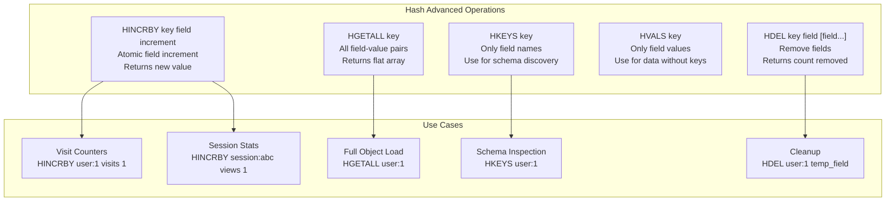
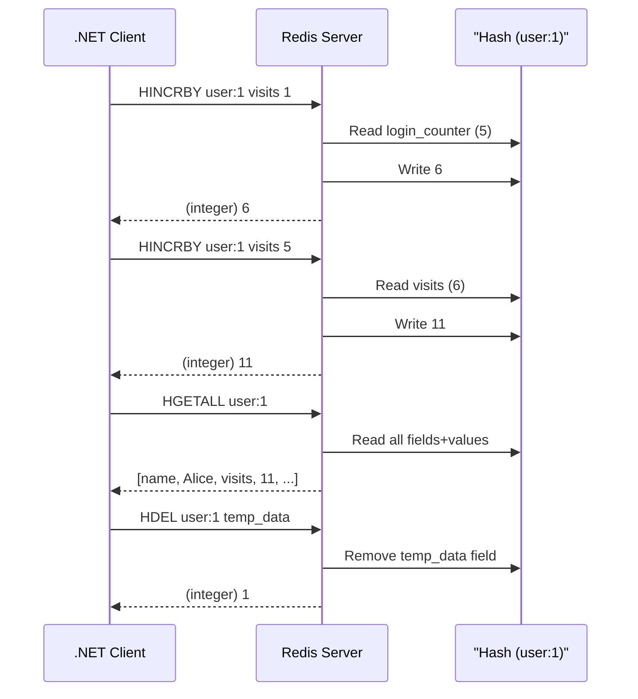
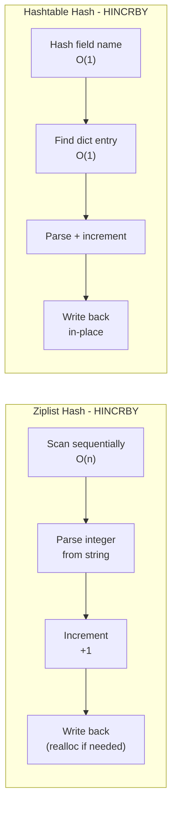

## 1 — Overview

Redis Hashes provide a set of operations for atomic field manipulation and batch field retrieval. This note covers five essential hash commands that extend the basic HSET/HGET functionality into more advanced territory:

- **HINCRBY** — Atomically increment an integer field value by a specified amount. Returns the new value.
- **HINCRBYFLOAT** — Atomically increment a float field value (Redis 2.6+).
- **HGETALL** — Return all fields and values from a hash.
- **HKEYS** — Return only the field names from a hash.
- **HVALS** — Return only the field values from a hash.
- **HDEL** — Delete one or more fields from a hash. Returns the number of removed fields.

These commands enable several important patterns:

**Atomic counters within objects.** HINCRBY lets you maintain per-entity counters (login count, page views, score) as fields in a hash without the read-modify-write race condition. Because the increment is atomic, concurrent requests never lose updates.

**Bulk reads.** HGETALL provides a single-shot way to read an entire object from Redis. While convenient, it must be used carefully because it loads the entire hash into memory.

**Schema operations.** HKEYS and HVALS allow you to inspect the field schema of a hash (useful for discovery and debugging) and retrieve all values without field names.

**Field removal.** HDEL removes individual fields from a hash, which is critical for managing hash size, implementing soft deletes, and performing schema migrations.

All five commands work on both ziplist-encoded and hashtable-encoded hashes. HINCRBY requires the field value to be a parseable integer (if the field does not exist, it is initialized to 0 before incrementing). HGETALL, HKEYS, and HVALS return elements in the same order — HGETALL returns field1, value1, field2, value2, ... while HKEYS returns just the field names and HVALS returns just the values.

**Atomicity and concurrency:** HINCRBY is atomic — concurrent increments from multiple clients are serialized by Redis. If two clients simultaneously call HINCRBY on the same field, both increments are applied without loss. HGETALL is not atomic with respect to concurrent writes — you might read a state that was being modified, but this is a snapshot at the time HGETALL executes.

**Use in Redis Cluster:** All fields of a hash are on the same cluster node (determined by the key's hash slot). Operations on a single hash are always local to one node. Cross-node operations are not possible for individual hash commands.

## 2 — Commands

### HINCRBY

Increment the integer value of a hash field by the specified number. If the key does not exist, a new hash is created. If the field does not exist, it is initialized to 0 before performing the operation.

**Syntax:** `HINCRBY key field increment`

```
> HSET user:1 login_count 0
(integer) 1
> HINCRBY user:1 login_count 1
(integer) 1
> HINCRBY user:1 login_count 1
(integer) 2
> HINCRBY user:1 login_count 5
(integer) 7
> HINCRBY user:1 login_count -3
(integer) 4
```

HINCRBY supports negative increments (decrements). The return value is the new field value after the increment.

```
> HINCRBY user:1 visits 1
(integer) 1
> HINCRBY user:1 visits 10
(integer) 11
> HINCRBY user:1 score -5
(integer) -5
```

HINCRBY range is limited to 64-bit signed integers (-9,223,372,036,854,775,808 to 9,223,372,036,854,775,807).

```
> HINCRBY user:1 big_counter 9223372036854775807
(integer) 9223372036854775807
> HINCRBY user:1 big_counter 1
(error) ERR increment or decrement would overflow
```

### HINCRBYFLOAT

Increment the float value of a hash field by the specified amount. Like HINCRBY but for floating-point numbers.

**Syntax:** `HINCRBYFLOAT key field increment`

```
> HINCRBYFLOAT user:1 balance 100.50
"100.5"
> HINCRBYFLOAT user:1 balance 0.25
"100.75"
> HINCRBYFLOAT user:1 balance -50.00
"50.75"
```

HINCRBYFLOAT returns the new value as a Redis string. The internal representation uses a C double (IEEE 754), so precision is limited to approximately 15-17 significant digits.

### HGETALL

Return all fields and values of a hash as a flat array of alternating field-value pairs. Returns an empty array if the key does not exist or the hash is empty.

**Syntax:** `HGETALL key`

```
> HGETALL user:1
1) "name"
2) "Alice"
3) "email"
4) "alice@example.com"
5) "age"
6) "30"
7) "login_count"
8) "42"
9) "visits"
10) "11"
11) "balance"
12) "50.75"
```

HGETALL returns field-value pairs in the same order as HKEYS and HVALS. The order is insertion order for ziplist-encoded hashes and arbitrary for hashtable-encoded hashes.

### HKEYS

Return only the field names of a hash. Returns an empty array if the key does not exist or the hash is empty.

**Syntax:** `HKEYS key`

```
> HKEYS user:1
1) "name"
2) "email"
3) "age"
4) "login_count"
5) "visits"
6) "balance"
```

### HVALS

Return only the field values of a hash. Returns an empty array if the key does not exist or the hash is empty.

**Syntax:** `HVALS key`

```
> HVALS user:1
1) "Alice"
2) "alice@example.com"
3) "30"
4) "42"
5) "11"
6) "50.75"
```

### HDEL

Delete one or more fields from a hash. Returns the number of fields that were actually removed (fields that existed and were deleted). Non-existent fields are ignored.

**Syntax:** `HDEL key field [field ...]`

```
> HDEL user:1 age balance
(integer) 2
> HDEL user:1 nonexistent
(integer) 0
> HDEL user:1 name
(integer) 1
```

HDEL with multiple fields is atomic — either all specified fields are removed atomically or (in case of server failure) none are. The return value is the count of fields actually deleted, not the number of fields requested.

When all fields of a hash are deleted, the key itself is automatically deleted. An empty hash is indistinguishable from a non-existent key.

```
> HDEL user:1 email visits login_count
(integer) 3
> EXISTS user:1
(integer) 0
```

### HINCRBY with Floating-Point Values

If you attempt HINCRBY on a field that contains a floating-point value, Redis returns an error:

```
> HSET user:1 score "10.5"
(integer) 1
> HINCRBY user:1 score 1
(error) ERR hash value is not an integer
```

Use HINCRBYFLOAT for non-integer values.

### HDEL With Non-Existent Fields

HDEL ignores non-existent fields and returns the count of fields it actually deleted:

```
> HDEL user:1 existing_field nonexistent_field another_nonexistent
(integer) 1
```

This means HDEL never returns an error for non-existent fields. Check the return value to confirm deletion:

```
> HDEL user:1 nonexistent
(integer) 0
> HDEL user:1 name
(integer) 1
```

## 3 — Code Examples

### StackExchange.Redis — HINCRBY and HINCRBYFLOAT

```csharp
using StackExchange.Redis;
using System;
using System.Threading.Tasks;

public class HashCounterService
{
    private readonly IDatabase _db;

    public HashCounterService(IDatabase db)
    {
        _db = db ?? throw new ArgumentNullException(nameof(db));
    }

    public async Task<long> IncrementFieldAsync(string key, string field, long increment = 1)
    {
        try
        {
            return await _db.HashIncrementAsync(key, field, increment);
        }
        catch (RedisException ex)
        {
            Console.WriteLine($"HINCRBY failed on {key}:{field}: {ex.Message}");
            throw;
        }
    }

    public async Task<long> DecrementFieldAsync(string key, string field, long decrement = 1)
    {
        try
        {
            return await _db.HashDecrementAsync(key, field, decrement);
        }
        catch (RedisException ex)
        {
            Console.WriteLine($"HINCRBY decrement failed on {key}:{field}: {ex.Message}");
            throw;
        }
    }

    public async Task<double> IncrementFloatFieldAsync(string key, string field, double increment)
    {
        try
        {
            return await _db.HashIncrementAsync(key, field, increment);
        }
        catch (RedisException ex)
        {
            Console.WriteLine($"HINCRBYFLOAT failed on {key}:{field}: {ex.Message}");
            throw;
        }
    }

    public async Task<long> GetIntegerFieldAsync(string key, string field)
    {
        try
        {
            RedisValue val = await _db.HashGetAsync(key, field);
            if (val.IsNull) return 0;
            return (long)val;
        }
        catch (RedisException ex)
        {
            Console.WriteLine($"Failed to get integer field {key}:{field}: {ex.Message}");
            throw;
        }
        catch (InvalidCastException ex)
        {
            Console.WriteLine($"Field {key}:{field} is not an integer: {ex.Message}");
            throw;
        }
    }

    public async Task<bool> TryIncrementWithOverflowCheckAsync(string key, string field, long increment)
    {
        try
        {
            long current = await GetIntegerFieldAsync(key, field);
            if (increment > 0 && current > long.MaxValue - increment)
            {
                Console.WriteLine($"Increment would overflow on {key}:{field}");
                return false;
            }
            if (increment < 0 && current < long.MinValue - increment)
            {
                Console.WriteLine($"Increment would underflow on {key}:{field}");
                return false;
            }
            await _db.HashIncrementAsync(key, field, increment);
            return true;
        }
        catch (RedisException ex)
        {
            Console.WriteLine($"Overflow-safe increment failed: {ex.Message}");
            return false;
        }
    }
}
```

### StackExchange.Redis — HGETALL, HKEYS, HVALS

```csharp
using StackExchange.Redis;
using System;
using System.Collections.Generic;
using System.Threading.Tasks;

public class HashReaderService
{
    private readonly IDatabase _db;

    public HashReaderService(IDatabase db)
    {
        _db = db;
    }

    public async Task<Dictionary<string, string>> GetAllFieldsAsync(string key)
    {
        try
        {
            HashEntry[] entries = await _db.HashGetAllAsync(key);
            if (entries.Length == 0) return new Dictionary<string, string>();

            var result = new Dictionary<string, string>(entries.Length);
            foreach (var entry in entries)
            {
                result[entry.Name.ToString()] = entry.Value.ToString();
            }
            return result;
        }
        catch (RedisException ex)
        {
            Console.WriteLine($"HGETALL failed on {key}: {ex.Message}");
            throw;
        }
    }

    public async Task<List<string>> GetFieldNamesAsync(string key)
    {
        try
        {
            RedisValue[] keys = await _db.HashKeysAsync(key);
            var fieldNames = new List<string>(keys.Length);
            foreach (var k in keys)
            {
                fieldNames.Add(k.ToString());
            }
            return fieldNames;
        }
        catch (RedisException ex)
        {
            Console.WriteLine($"HKEYS failed on {key}: {ex.Message}");
            throw;
        }
    }

    public async Task<List<string>> GetFieldValuesAsync(string key)
    {
        try
        {
            RedisValue[] values = await _db.HashValuesAsync(key);
            var fieldValues = new List<string>(values.Length);
            foreach (var v in values)
            {
                fieldValues.Add(v.ToString());
            }
            return fieldValues;
        }
        catch (RedisException ex)
        {
            Console.WriteLine($"HVALS failed on {key}: {ex.Message}");
            throw;
        }
    }

    public async Task<long> GetHashSizeAsync(string key)
    {
        try
        {
            return await _db.HashLengthAsync(key);
        }
        catch (RedisException ex)
        {
            Console.WriteLine($"HLEN failed on {key}: {ex.Message}");
            throw;
        }
    }

    public async Task<string> GetHashEncodingAsync(string key)
    {
        try
        {
            var result = await _db.ExecuteAsync("OBJECT", "ENCODING", key);
            return result.ToString();
        }
        catch (RedisException ex)
        {
            Console.WriteLine($"OBJECT ENCODING failed on {key}: {ex.Message}");
            return "unknown";
        }
    }

    public async Task<Dictionary<string, string>> GetFieldsWithPatternAsync(
        string key, string pattern)
    {
        try
        {
            var result = new Dictionary<string, string>();
            long cursor = 0;

            do
            {
                var scanResult = await _db.HashScanAsync(key, pattern, pageSize: 100);
                foreach (var entry in scanResult)
                {
                    result[entry.Name.ToString()] = entry.Value.ToString();
                }
                break;
            } while (cursor != 0);

            return result;
        }
        catch (RedisException ex)
        {
            Console.WriteLine($"HSCAN failed on {key}: {ex.Message}");
            throw;
        }
    }
}
```

### StackExchange.Redis — HDEL and Field Management

```csharp
using StackExchange.Redis;
using System;
using System.Linq;
using System.Threading.Tasks;

public class HashFieldManager
{
    private readonly IDatabase _db;

    public HashFieldManager(IDatabase db)
    {
        _db = db;
    }

    public async Task<long> DeleteFieldsAsync(string key, params string[] fields)
    {
        try
        {
            var redisFields = fields.Select(f => (RedisValue)f).ToArray();
            return await _db.HashDeleteAsync(key, redisFields);
        }
        catch (RedisException ex)
        {
            Console.WriteLine($"HDEL failed on {key}: {ex.Message}");
            throw;
        }
    }

    public async Task<long> DeleteFieldsIfExistAsync(string key, params string[] fields)
    {
        try
        {
            long deleted = 0;
            foreach (var field in fields)
            {
                bool exists = await _db.HashExistsAsync(key, field);
                if (exists)
                {
                    await _db.HashDeleteAsync(key, field);
                    deleted++;
                }
            }
            return deleted;
        }
        catch (RedisException ex)
        {
            Console.WriteLine($"Conditional HDEL failed: {ex.Message}");
            throw;
        }
    }

    public async Task<bool> DeleteFieldAsync(string key, string field)
    {
        try
        {
            return await _db.HashDeleteAsync(key, field);
        }
        catch (RedisException ex)
        {
            Console.WriteLine($"HDEL single field failed: {ex.Message}");
            throw;
        }
    }

    public async Task ClearHashAsync(string key)
    {
        try
        {
            RedisValue[] fields = await _db.HashKeysAsync(key);
            if (fields.Length > 0)
            {
                await _db.HashDeleteAsync(key, fields);
            }
        }
        catch (RedisException ex)
        {
            Console.WriteLine($"Clear hash failed on {key}: {ex.Message}");
            throw;
        }
    }

    public async Task RemoveAllFieldsExceptAsync(string key, params string[] keepFields)
    {
        try
        {
            RedisValue[] allFields = await _db.HashKeysAsync(key);
            var fieldsToRemove = allFields
                .Select(f => f.ToString())
                .Where(f => !keepFields.Contains(f))
                .Select(f => (RedisValue)f)
                .ToArray();

            if (fieldsToRemove.Length > 0)
            {
                await _db.HashDeleteAsync(key, fieldsToRemove);
            }
        }
        catch (RedisException ex)
        {
            Console.WriteLine($"Failed to remove fields from {key}: {ex.Message}");
            throw;
        }
    }

    public async Task<long> GetHashFieldCountAsync(string key)
    {
        try
        {
            return await _db.HashLengthAsync(key);
        }
        catch (RedisException ex)
        {
            Console.WriteLine($"HLEN failed: {ex.Message}");
            return -1;
        }
    }

    public async Task<bool> IsHashEmptyAsync(string key)
    {
        return await GetHashFieldCountAsync(key) == 0;
    }
}
```

### StackExchange.Redis — Score Tracking Service

```csharp
using StackExchange.Redis;
using System;
using System.Collections.Generic;
using System.Threading.Tasks;

public class ScoreTrackingService
{
    private readonly IDatabase _db;
    private readonly string _keyPrefix = "scores:";

    public ScoreTrackingService(IDatabase db)
    {
        _db = db;
    }

    public async Task<long> AddPointsAsync(string playerId, long points)
    {
        string key = $"{_keyPrefix}{playerId}";
        try
        {
            return await _db.HashIncrementAsync(key, "points", points);
        }
        catch (RedisException ex)
        {
            Console.WriteLine($"Failed to add points for {playerId}: {ex.Message}");
            throw;
        }
    }

    public async Task<long> RecordWinAsync(string playerId)
    {
        string key = $"{_keyPrefix}{playerId}";
        try
        {
            var tx = _db.CreateTransaction();
            tx.AddCondition(Condition.KeyExists(key));
            Task<long> winsTask = tx.HashIncrementAsync(key, "wins");
            Task<long> streakTask = tx.HashIncrementAsync(key, "streak");
            Task<long> pointsTask = tx.HashIncrementAsync(key, "points", 100);
            await tx.ExecuteAsync();

            return await winsTask;
        }
        catch (RedisException ex)
        {
            Console.WriteLine($"Failed to record win for {playerId}: {ex.Message}");
            throw;
        }
    }

    public async Task<long> RecordLossAsync(string playerId)
    {
        string key = $"{_keyPrefix}{playerId}";
        try
        {
            var tx = _db.CreateTransaction();
            tx.AddCondition(Condition.KeyExists(key));
            Task<long> lossesTask = tx.HashIncrementAsync(key, "losses");
            Task<long> streakTask = tx.HashDecrementAsync(key, "streak");
            Task<long> pointsTask = tx.HashDecrementAsync(key, "points", 50);
            await tx.ExecuteAsync();

            return await lossesTask;
        }
        catch (RedisException ex)
        {
            Console.WriteLine($"Failed to record loss for {playerId}: {ex.Message}");
            throw;
        }
    }

    public async Task<Dictionary<string, long>> GetPlayerScoresAsync(string playerId)
    {
        string key = $"{_keyPrefix}{playerId}";
        try
        {
            HashEntry[] entries = await _db.HashGetAllAsync(key);
            var scores = new Dictionary<string, long>();
            foreach (var entry in entries)
            {
                if (long.TryParse(entry.Value.ToString(), out long val))
                {
                    scores[entry.Name.ToString()] = val;
                }
            }
            return scores;
        }
        catch (RedisException ex)
        {
            Console.WriteLine($"Failed to get scores for {playerId}: {ex.Message}");
            return new Dictionary<string, long>();
        }
    }

    public async Task<long> GetPlayerScoreAsync(string playerId, string scoreType)
    {
        string key = $"{_keyPrefix}{playerId}";
        try
        {
            RedisValue val = await _db.HashGetAsync(key, scoreType);
            if (val.IsNull) return 0;
            return (long)val;
        }
        catch (RedisException ex)
        {
            Console.WriteLine($"Failed to get score for {playerId}: {ex.Message}");
            return 0;
        }
    }

    public async Task CreatePlayerScorecardAsync(string playerId)
    {
        string key = $"{_keyPrefix}{playerId}";
        try
        {
            var entries = new HashEntry[]
            {
                new HashEntry("points", 0),
                new HashEntry("wins", 0),
                new HashEntry("losses", 0),
                new HashEntry("draws", 0),
                new HashEntry("streak", 0),
                new HashEntry("level", 1),
                new HashEntry("experience", 0),
                new HashEntry("rank", "unranked")
            };
            await _db.HashSetAsync(key, entries);
        }
        catch (RedisException ex)
        {
            Console.WriteLine($"Failed to create scorecard for {playerId}: {ex.Message}");
            throw;
        }
    }

    public async Task<bool> DeletePlayerScorecardAsync(string playerId)
    {
        string key = $"{_keyPrefix}{playerId}";
        try
        {
            return await _db.KeyDeleteAsync(key);
        }
        catch (RedisException ex)
        {
            Console.WriteLine($"Failed to delete scorecard for {playerId}: {ex.Message}");
            return false;
        }
    }

    public async Task<long> GetLeaderboardPositionAsync(string playerId)
    {
        string key = $"{_keyPrefix}{playerId}";
        try
        {
            bool exists = await _db.KeyExistsAsync(key);
            return exists ? 1 : -1;
        }
        catch (RedisException ex)
        {
            Console.WriteLine($"Failed to check leaderboard: {ex.Message}");
            return -1;
        }
    }
}
```

### StackExchange.Redis — Schema Migration Using Hash Operations

```csharp
using StackExchange.Redis;
using System;
using System.Collections.Generic;
using System.Threading.Tasks;

public class HashSchemaMigrationService
{
    private readonly IDatabase _db;
    private readonly string _schemaVersionField = "_schema_version";

    public HashSchemaMigrationService(IDatabase db)
    {
        _db = db;
    }

    public async Task<bool> AddFieldIfMissingAsync(string key, string field, string defaultValue)
    {
        try
        {
            return await _db.HashSetAsync(key, field, defaultValue, When.NotExists);
        }
        catch (RedisException ex)
        {
            Console.WriteLine($"Failed to add field {field} to {key}: {ex.Message}");
            return false;
        }
    }

    public async Task<long> RemoveObsoleteFieldsAsync(string key, params string[] fieldsToKeep)
    {
        try
        {
            RedisValue[] allFields = await _db.HashKeysAsync(key);
            int removed = 0;

            foreach (var field in allFields)
            {
                string fieldName = field.ToString();
                if (fieldName.StartsWith("_")) continue;
                if (Array.IndexOf(fieldsToKeep, fieldName) < 0)
                {
                    await _db.HashDeleteAsync(key, fieldName);
                    removed++;
                }
            }
            return removed;
        }
        catch (RedisException ex)
        {
            Console.WriteLine($"Failed to remove obsolete fields from {key}: {ex.Message}");
            throw;
        }
    }

    public async Task MigrateFieldTypeAsync(string key, string field, 
        Func<string, string> valueConverter)
    {
        try
        {
            RedisValue currentValue = await _db.HashGetAsync(key, field);
            if (!currentValue.IsNull)
            {
                string newValue = valueConverter(currentValue.ToString());
                await _db.HashSetAsync(key, field, newValue);
            }
        }
        catch (RedisException ex)
        {
            Console.WriteLine($"Failed to migrate field {field} in {key}: {ex.Message}");
            throw;
        }
    }

    public async Task BatchMigrateFieldsAsync(string keyPattern, 
        Dictionary<string, Func<string, string>> fieldMigrations, 
        int batchSize = 100)
    {
        try
        {
            long cursor = 0;
            int processed = 0;

            do
            {
                var result = await _db.ExecuteAsync("SCAN", cursor.ToString(), 
                    "MATCH", keyPattern, "COUNT", batchSize.ToString());
                
                var innerResult = (RedisResult[])result;
                cursor = long.Parse((string)innerResult[0]);
                var keys = (RedisKey[])innerResult[1];

                foreach (var key in keys)
                {
                    foreach (var (field, converter) in fieldMigrations)
                    {
                        await MigrateFieldTypeAsync(key, field, converter);
                    }
                    processed++;
                }
            } while (cursor != 0);

            Console.WriteLine($"Migrated {processed} keys");
        }
        catch (RedisException ex)
        {
            Console.WriteLine($"Batch migration failed: {ex.Message}");
            throw;
        }
    }

    public async Task<long> SetSchemaVersionAsync(string key, int version)
    {
        try
        {
            await _db.HashSetAsync(key, _schemaVersionField, version.ToString());
            return version;
        }
        catch (RedisException ex)
        {
            Console.WriteLine($"Failed to set schema version: {ex.Message}");
            throw;
        }
    }

    public async Task<int> GetSchemaVersionAsync(string key)
    {
        try
        {
            RedisValue version = await _db.HashGetAsync(key, _schemaVersionField);
            if (version.IsNull) return 0;
            return int.Parse(version.ToString());
        }
        catch (RedisException ex)
        {
            Console.WriteLine($"Failed to get schema version: {ex.Message}");
            return -1;
        }
    }
}
```

### StackExchange.Redis — Error Handling for Hash Operations

```csharp
using StackExchange.Redis;
using System;
using System.Threading.Tasks;

public class ResilientHashService
{
    private readonly IDatabase _db;
    private readonly int _maxRetries;
    private readonly TimeSpan _baseDelay;

    public ResilientHashService(IDatabase db, int maxRetries = 3, 
        TimeSpan? baseDelay = null)
    {
        _db = db;
        _maxRetries = maxRetries;
        _baseDelay = baseDelay ?? TimeSpan.FromMilliseconds(50);
    }

    public async Task<long> IncrementWithRetryAsync(string key, string field, long increment)
    {
        int attempt = 0;
        while (true)
        {
            try
            {
                return await _db.HashIncrementAsync(key, field, increment);
            }
            catch (RedisConnectionException ex) when (attempt < _maxRetries)
            {
                attempt++;
                await Task.Delay(_baseDelay * (int)Math.Pow(2, attempt));
            }
            catch (RedisTimeoutException ex) when (attempt < _maxRetries)
            {
                attempt++;
                await Task.Delay(_baseDelay);
            }
            catch (RedisServerException ex)
            {
                Console.WriteLine($"Non-retryable server error: {ex.Message}");
                throw;
            }
        }
    }

    public async Task<Dictionary<string, string>> GetAllWithFallbackAsync(
        string key, Dictionary<string, string> fallbackData = null)
    {
        try
        {
            return await GetAllFieldsAsync(key);
        }
        catch (RedisConnectionException ex)
        {
            Console.WriteLine($"Redis unavailable, using fallback data: {ex.Message}");
            return fallbackData ?? new Dictionary<string, string>();
        }
        catch (RedisTimeoutException ex)
        {
            Console.WriteLine($"Redis timeout, using fallback data: {ex.Message}");
            return fallbackData ?? new Dictionary<string, string>();
        }
    }

    private async Task<Dictionary<string, string>> GetAllFieldsAsync(string key)
    {
        HashEntry[] entries = await _db.HashGetAllAsync(key);
        var result = new Dictionary<string, string>(entries.Length);
        foreach (var entry in entries)
        {
            result[entry.Name.ToString()] = entry.Value.ToString();
        }
        return result;
    }

    public async Task<bool> DeleteWithConditionAsync(string key, string field, string expectedValue)
    {
        try
        {
            var tx = _db.CreateTransaction();
            tx.AddCondition(Condition.HashEqual(key, field, expectedValue));
            await tx.HashDeleteAsync(key, field);
            return await tx.ExecuteAsync();
        }
        catch (RedisException ex)
        {
            Console.WriteLine($"Conditional delete failed: {ex.Message}");
            return false;
        }
    }
}
```

## 4 — Use Cases

### Atomic Visit Counters

Track how many times a user has visited a page or performed an action using HINCRBY. The atomic increment ensures accuracy even under concurrent requests.

```
Key: user:{userId}:stats
Fields:
  page_views     — HINCRBY user:42:stats page_views 1
  login_count    — HINCRBY user:42:stats login_count 1
  search_count   — HINCRBY user:42:stats search_count 1
  api_calls      — HINCRBY user:42:stats api_calls 1
```

Why Hash instead of separate keys: All counters for one user are in one Redis key. One network round trip on application load to read all stats via HGETALL. Atomic increments for each counter independently.

### Game Score Tracking

Track player statistics in a game using hash fields for different score categories.

```
Key: player:{playerId}:stats
Fields:
  points          — HINCRBY player:42:stats points 100
  wins            — HINCRBY player:42:stats wins 1
  losses          — HINCRBY player:42:stats losses 1
  kills           — HINCRBY player:42:stats kills 5
  deaths          — HINCRBY player:42:stats deaths 3
  streak          — HINCRBY player:42:stats streak 1
  experience      — HINCRBY player:42:stats experience 250
  level           — HINCRBY player:42:stats level 1
```

HINCRBY allows real-time score updates without write conflicts. HDEL can reset individual stats (e.g., reset streak to 0 by deleting and letting HINCRBY re-initialize).

### Session Activity Tracking

Track user session activity beyond simple login — page views per session, actions performed, duration.

```
Key: session:{sessionId}
Fields:
  page_views      — HINCRBY session:abc123 page_views 1
  actions         — HINCRBY session:abc123 actions 1
  duration_min    — HINCRBY session:abc123 duration_min 5
  api_calls       — HINCRBY session:abc123 api_calls 1
```

HDEL session:abc123 page_views to reset counter within session. HGETALL session:abc123 to load full session state.

### Rate Limiting with HINCRBY and HDEL

Track API call counts per user with automatic window reset using HINCRBY and HDEL.

```csharp
public async Task<bool> CheckRateLimitAsync(string userId, int maxRequests, TimeSpan window)
{
    string key = $"ratelimit:{userId}";
    string field = "count";
    
    var tx = _db.CreateTransaction();
    tx.AddCondition(Condition.KeyExists(key));
    Task<long> incrementTask = tx.HashIncrementAsync(key, field);
    
    if (await tx.ExecuteAsync())
    {
        long count = await incrementTask;
        return count <= maxRequests;
    }
    else
    {
        // Key doesn't exist — create new window
        var entries = new HashEntry[]
        {
            new HashEntry(field, 1),
            new HashEntry("window_start", DateTime.UtcNow.ToString("O"))
        };
        await _db.HashSetAsync(key, entries);
        await _db.KeyExpireAsync(key, window);
        return true;
    }
}
```

### Object State Management

Track state transitions for long-running workflows or orders.

```
Key: order:{orderId}:state
Fields:
  status        — "pending" → "processing" → "completed" → "shipped"
  retry_count   — HINCRBY order:42:state retry_count 1
  error_count   — HINCRBY order:42:state error_count 1
  last_error    — HSET order:42:state last_error "timeout"
  completed_at  — HSET order:42:state completed_at "2024-06-27T10:00:00Z"
```

HDEL can remove temporary fields after processing completes. HGETALL provides a complete state snapshot.

## 5 — Memory & Performance

### HINCRBY Performance

HINCRBY is O(1) for hashtable-encoded hashes and O(n) (field scan) for ziplist-encoded hashes. In practice, for small-to-medium hashes, both are fast. The atomic increment is implemented as a single Redis command that does read-increment-write internally, without any network round trips for the intermediate steps.

### HGETALL Memory Impact

HGETALL loads the entire hash into:

1. **Redis output buffer:** All field names and values are serialized into the output buffer. This consumes Redis memory until the response is sent.
2. **Network buffer:** The serialized response occupies network buffer space.
3. **Client memory:** StackExchange.Redis deserializes the response into HashEntry[] objects.

For a hash with 10,000 fields (each field name ~10 chars, each value ~50 chars):
- Total data: ~600,000 bytes (~600 KB)
- Redis output buffer: ~600 KB (plus RESP protocol overhead)
- .NET managed heap: ~1.2 MB (objects + array overhead)

HGETALL on a 10,000-field hash takes ~1-5 ms on Redis plus network latency.

### HKEYS and HVALS Memory

HKEYS returns only field names (saving ~50% bandwidth compared to HGETALL). HVALS returns only values. If you only need one or the other, these are more memory-efficient than HGETALL.

### HDEL Performance

HDEL is O(N) where N is the number of fields to delete. For deleting a single field, it is effectively O(1) for hashtable-encoded hashes. For ziplist-encoded hashes, HDEL requires O(n) scan to locate the field, plus O(n) memmove to close the gap in the ziplist.

### Ziplist vs Hashtable with HINCRBY

In ziplist encoding, HINCRBY must:
1. Scan the ziplist sequentially to find the field
2. Parse the integer value from the string
3. Perform arithmetic
4. Write back the new value
5. Potentially reallocate the ziplist

In hashtable encoding, HINCRBY:
1. Hash the field name to find the dict entry (O(1))
2. Parse and increment
3. Write back

For hashes with fewer than ~100 fields, the ziplist scan overhead is negligible (~microseconds). For hashes with hundreds of fields, hashtable encoding gives more predictable performance.

### Deleted Field Memory

HDEL removes the field-value pair from the hash, but in hashtable encoding, the hash table bucket may remain allocated. In ziplist encoding, HDEL compacts the ziplist, immediately freeing memory.

Neither encoding immediately returns memory to the OS. Redis manages memory with jemalloc, which holds freed blocks in per-thread caches for reuse.

## 6 — Diagram







## 7 — Comparison

### HINCRBY vs INCR on Separate Keys

| Aspect              | HINCRBY on Hash            | INCR on Separate Keys        |
|--------------------|----------------------------|------------------------------|
| Key count          | 1 key for N counters       | N keys                       |
| Atomic per counter | Yes                        | Yes                          |
| Bulk read          | HGETALL (all counters)     | MGET (specify all keys)      |
| Network efficiency | 1 connection per counter op | 1 connection per counter op  |
| Memory overhead    | 1 key overhead             | N x key overhead             |
| TTL                | Applies to all counters    | Per-counter TTL              |

### HGETALL vs HMGET for Full Reads

| Aspect              | HGETALL                     | HMGET (all fields)           |
|--------------------|----------------------------|------------------------------|
| Fields returned    | All fields and values      | Requested fields only        |
| Field order        | Internal order             | Same as requested order      |
| Missing fields     | N/A (all present)          | Returned as nil              |
| Use case           | Simple object load         | Need specific fields + order |
| Performance        | Slightly faster (1 cmd)    | Slightly slower (variadic)   |

### HDEL vs DEL on Key

| Aspect              | HDEL (single field)         | DEL (entire key)             |
|--------------------|----------------------------|------------------------------|
| Granularity        | Field-level removal         | Entire key removal           |
| Preserves data     | Other fields remain         | All data lost                |
| Key lifecycle      | Key stays if fields remain  | Key is deleted               |
| Memory impact      | Partial                     | Complete release             |
| Use case           | Schema migration, cleanup   | Full data removal            |

### HKEYS/HVALS vs HGETALL

| Aspect              | HKEYS or HVALS              | HGETALL                      |
|--------------------|----------------------------|------------------------------|
| Data returned      | Only keys OR only values   | Both keys and values         |
| Bandwidth          | ~50% of HGETALL            | Full payload                 |
| Parsing            | Simple array               | Need to pair up              |
| Use case           | Schema discovery, stats    | Full object loading          |

## 8 — Gotchas

### HINCRBY Overflow

HINCRBY uses a 64-bit signed integer internally. If the increment would cause the value to exceed long.MaxValue or go below long.MinValue, Redis returns an error:

```
> HINCRBY user:1 counter 9223372036854775807
(error) ERR increment or decrement would overflow
```

In .NET, `HashIncrementAsync` throws a `RedisServerException` when overflow occurs. Handle this in your application code:

```csharp
try
{
    await db.HashIncrementAsync("user:1", "counter", 1);
}
catch (RedisServerException ex) when (ex.Message.Contains("overflow"))
{
    // Reset or handle overflow
    await db.HashSetAsync("user:1", "counter", 0);
}
```

### HINCRBYFLOAT Precision

HINCRBYFLOAT uses C double (IEEE 754), which has ~15-17 significant digits of precision. Accumulating small increments over millions of operations can lead to drift:

```
> HINCRBYFLOAT user:1 balance 0.1
"0.1"
> HINCRBYFLOAT user:1 balance 0.2
"0.30000000000000004"
```

For financial calculations, use HINCRBY with integers representing cents (or smallest currency unit) instead of HINCRBYFLOAT with decimal values.

### HGETALL Returns Empty Array for Non-Existent Key

HGETALL on a non-existent key returns an empty array, not an error. You cannot distinguish between an empty hash and a non-existent key using HGETALL alone.

```bash
> HGETALL nonexistent
(empty array)
```

Use EXISTS to check key existence before HGETALL if the distinction matters:

```bash
> EXISTS nonexistent
(integer) 0
> HGETALL nonexistent
(empty array)
```

### HGETALL Field Count Limit

HGETALL returns all fields and values as a single Redis response. The response is subject to Redis's output buffer limits (client-output-buffer-limit). If a hash is large enough that the HGETALL response exceeds this limit, Redis disconnects the client.

```
# redis.conf default limits
client-output-buffer-limit normal 0 0 0
client-output-buffer-limit replica 256mb 64mb 60
client-output-buffer-limit pubsub 32mb 8mb 60
```

For large hashes, use HSCAN with a COUNT parameter instead of HGETALL.

### HDEL Does Not Return Error for Non-Existent Fields

HDEL silently ignores non-existent fields. The return value only counts fields that were actually deleted. Always check the return value:

```csharp
long deleted = await db.HashDeleteAsync("user:1", 
    new RedisValue[] { "name", "nonexistent" });
// deleted == 1 (only "name" was deleted)
// No error or indication that "nonexistent" didn't exist
```

### HDEL on All Fields Deletes the Key

When HDEL removes the last field from a hash, Redis automatically deletes the key. This is an important side effect:

```csharp
await db.HashDeleteAsync("user:1", "last_field");
// Key "user:1" no longer exists
bool exists = await db.KeyExistsAsync("user:1"); // false
```

This affects WATCH/MULTI transactions that reference the key after HDEL.

### HINCRBY on Non-Existent Field

HINCRBY on a non-existent field initializes it to 0, then applies the increment. This is normally desirable but can mask bugs where you expect the field to already exist:

```csharp
// If "login_count" never existed, this still works:
long count = await db.HashIncrementAsync("user:1", "login_count", 1);
// count == 1, but user might not have been initialized
```

Use HashExistsAsync before HINCRBY if you need to validate initialization state.

### Ziplist Conversion Thresholds

Hash encoding conversion thresholds are configurable server-side:

```
hash-max-ziplist-entries 512
hash-max-ziplist-value   64
```

If your application expects consistent performance across all hashes, be aware that:
- Small hashes use ziplist (O(n) operations)
- Large hashes use hashtable (O(1) operations)
- Operations get slower across the conversion threshold for field access
- HGETALL, HKEYS, HVALS are O(n) regardless of encoding

### Key Name Collisions in Cluster Mode

In Redis Cluster, hash slots are computed from the key name. All hashes with the same key tag `{...}` route to the same node. Ensure your hash key names use hash tags when you need multi-key operations (e.g., BITOP across related keys).

### HGETALL Response Parsing

HGETALL returns field-value pairs as a flat array. In StackExchange.Redis, you get a HashEntry[] array. When iterating, be careful not to assume any particular ordering — you must look up fields by name, not by index.

### StackExchange.Redis HashDecrementAsync with Unsigned Types

HashDecrementAsync only accepts long (signed) parameters. If you need to decrement by more than long.MaxValue, use HashIncrementAsync with a negative value:

```csharp
// These are equivalent:
await db.HashDecrementAsync("key", "field", 5);
await db.HashIncrementAsync("key", "field", -5);
```

### HINCRBY vs HINCRBYFLOAT API Discrepancy

In StackExchange.Redis, both `HashIncrementAsync` for integers and `HashDecrementAsync` for floats use the same method name but different overloads:

```csharp
// Integer increment (HINCRBY)
Task<long> HashIncrementAsync(RedisKey key, RedisValue hashField, long value = 1);

// Float increment (HINCRBYFLOAT)
Task<double> HashIncrementAsync(RedisKey key, RedisValue hashField, double value);
```

The compiler picks the overload based on the type of the `value` parameter. Be explicit:

```csharp
await db.HashIncrementAsync("key", "field", 1L);   // HINCRBY (long)
await db.HashIncrementAsync("key", "field", 1.0);  // HINCRBYFLOAT (double)
```

## 9 — References

### Related Notes
- [[8.966 — Redis — Hashes — HSET, HGET, HMSET, HMGET]]
- [[8.968 — Redis — Hashes — User Profile Storage]]
- [[8.994 — Redis — Transactions — MULTIEXEC, DISCARD]]
- [[8.995 — Redis — WATCH — Optimistic Locking]]
- [[8.996 — Redis — Lua Scripting — EVAL and EVALSHA]]
- [[8.979 — Redis — Sorted Sets — ZRANK, ZREVRANK, ZINCRBY]]
- [[8.1000 — Redis — StackExchange.Redis Full Reference]]

### External References
- [Redis Documentation — HINCRBY](https://redis.io/commands/hincrby/)
- [Redis Documentation — HINCRBYFLOAT](https://redis.io/commands/hincrbyfloat/)
- [Redis Documentation — HGETALL](https://redis.io/commands/hgetall/)
- [Redis Documentation — HKEYS](https://redis.io/commands/hkeys/)
- [Redis Documentation — HVALS](https://redis.io/commands/hvals/)
- [Redis Documentation — HDEL](https://redis.io/commands/hdel/)
- [Redis Documentation — HSCAN](https://redis.io/commands/hscan/)
- [Redis Documentation — Memory Optimization](https://redis.io/docs/management/optimization/memory-optimization/)
- [StackExchange.Redis — Hash Operations](https://stackexchange.github.io/StackExchange.Redis/Commands/Hashes)
- [StackExchange.Redis — Transactions](https://stackexchange.github.io/StackExchange.Redis/Transactions)

### Best Practices
- [Atomic Counters with Redis Hashes](https://redis.io/docs/data-types/hashes/)
- [Hash Encoding — Ziplist vs Hashtable](https://redis.io/docs/data-types/hashes/#encoding)
