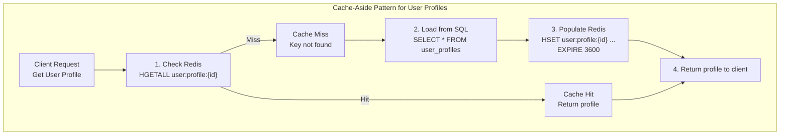
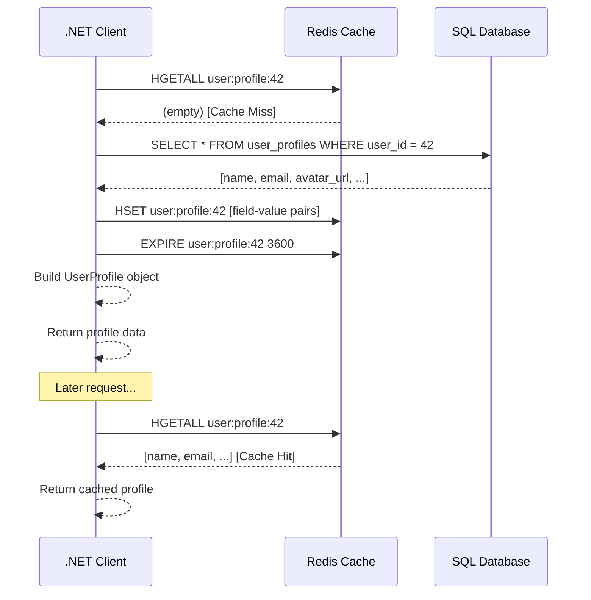
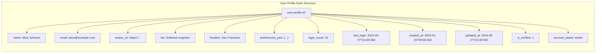

## 1 — Overview

User profile storage is the most common and natural use case for Redis Hashes. A user profile is an object with a well-defined set of attributes (fields) that are accessed, updated, and read individually and in bulk. Redis Hashes map directly to this pattern: the hash key represents the user identifier, and the fields represent profile attributes.

This note presents a complete production-ready user profile service built on Redis hashes. It covers the full lifecycle of profile data — create, read, update, delete — with patterns for caching, atomic counters, field-level TTL (via application logic), serialization strategies, error handling, and integration with a primary database (SQL) using the cache-aside pattern.

**Why Redis Hashes for user profiles:**

- **Partial reads:** Fetch only the fields you need (e.g., display name for a header, email for a notification) without loading the entire profile.
- **Partial writes:** Update one field (e.g., avatar_url) without serializing/deserializing the entire profile. No read-modify-write race conditions.
- **Atomic counters:** Use HINCRBY for login_count, notification_count, etc., without Lua scripts or transactions.
- **Memory efficient:** Ziplist encoding for small profiles keeps memory low. A profile with ~10 fields averages ~300 bytes.
- **Fast:** O(1) field access for hashtable-encoded profiles, O(n) scan for small ziplist-encoded profiles (n = number of fields, typically < 50).

**Common profile fields stored in Redis hashes:**

```
Field             Type          Example
─────────────────────────────────────────────
name              string        "Alice Johnson"
email             string        "alice@example.com"
avatar_url        string        "https://cdn.example.com/avatars/42.jpg"
bio               string        "Software engineer, coffee lover"
location          string        "San Francisco, CA"
website           string        "https://alice.dev"
preferences_json  JSON string   "{\"theme\":\"dark\",\"notifications\":true}"
login_count       integer       42
last_login        ISO 8601      "2024-06-27T14:30:00Z"
created_at        ISO 8601      "2023-01-15T08:00:00Z"
updated_at        ISO 8601      "2024-06-27T14:30:00Z"
is_verified       boolean       1
account_status    string        "active"
```

**Cache-aside pattern:**
1. Application requests user profile from Redis
2. Hit: return profile data
3. Miss: load from SQL database, populate Redis, return data
4. On updates: write to SQL database, invalidate or update Redis

## 2 — Commands

### Complete Profile Lifecycle

```bash
# Create/update profile
HSET user:profile:42 name "Alice Johnson" email "alice@example.com" avatar_url "https://cdn.example.com/avatars/42.jpg" bio "Software engineer" location "San Francisco, CA" website "https://alice.dev" preferences_json "{\"theme\":\"dark\"}" login_count 0 last_login "2024-06-27T14:30:00Z" created_at "2023-01-15T08:00:00Z" is_verified 1 account_status "active"

# Read specific fields
HGET user:profile:42 name
HMGET user:profile:42 name email avatar_url

# Read entire profile
HGETALL user:profile:42

# Update single field
HSET user:profile:42 bio "Senior software engineer"

# Atomic increment
HINCRBY user:profile:42 login_count 1

# Check field existence
HEXISTS user:profile:42 preferences_json

# Delete field
HDEL user:profile:42 temporary_token

# Delete entire profile
DEL user:profile:42

# Set TTL on cached profile (entire key)
EXPIRE user:profile:42 3600

# Get profile size
HLEN user:profile:42

# Get all field names (schema discovery)
HKEYS user:profile:42

# Get all field values (data only)
HVALS user:profile:42
```

### Cache-Aside Pattern Commands

```bash
# Check cache
EXISTS user:profile:42
# If exists, HGETALL or HMGET
# If not exists, load from SQL:

# Populate cache from SQL
HSET user:profile:42 name "Alice Johnson" email "alice@example.com" ...
EXPIRE user:profile:42 3600

# Return data to client
HGETALL user:profile:42

# On update: write-through (update SQL + Redis)
HSET user:profile:42 bio "New bio"
# Also update SQL database
```

## 3 — Code Examples

### StackExchange.Redis — UserProfileService (Full Implementation)

```csharp
using StackExchange.Redis;
using System;
using System.Collections.Generic;
using System.Data;
using System.Data.SqlClient;
using System.Threading.Tasks;

public class UserProfileService
{
    private readonly IDatabase _redisDb;
    private readonly string _sqlConnectionString;
    private readonly TimeSpan _cacheTtl;
    private readonly string _keyPrefix = "user:profile:";

    public UserProfileService(ConnectionMultiplexer redis, string sqlConnectionString, 
        TimeSpan? cacheTtl = null)
    {
        _redisDb = redis.GetDatabase();
        _sqlConnectionString = sqlConnectionString;
        _cacheTtl = cacheTtl ?? TimeSpan.FromMinutes(30);
    }

    public async Task<UserProfile> GetProfileAsync(string userId)
    {
        string key = $"{_keyPrefix}{userId}";

        try
        {
            HashEntry[] entries = await _redisDb.HashGetAllAsync(key);

            if (entries.Length > 0)
            {
                return DeserializeProfile(entries);
            }

            return await LoadProfileFromDatabaseAsync(userId);
        }
        catch (RedisException ex)
        {
            Console.WriteLine($"Redis error getting profile {userId}: {ex.Message}");
            return await LoadProfileFromDatabaseAsync(userId);
        }
    }

    public async Task<string> GetProfileFieldAsync(string userId, string field)
    {
        string key = $"{_keyPrefix}{userId}";

        try
        {
            RedisValue value = await _redisDb.HashGetAsync(key, field);

            if (!value.IsNull)
            {
                return value.ToString();
            }

            bool keyExists = await _redisDb.KeyExistsAsync(key);
            if (!keyExists)
            {
                await LoadProfileFromDatabaseAsync(userId);
                value = await _redisDb.HashGetAsync(key, field);
                return value.IsNull ? null : value.ToString();
            }

            return null;
        }
        catch (RedisException ex)
        {
            Console.WriteLine($"Redis error getting field {field} for {userId}: {ex.Message}");
            return await LoadFieldFromDatabaseAsync(userId, field);
        }
    }

    public async Task<Dictionary<string, string>> GetMultipleFieldsAsync(
        string userId, params string[] fields)
    {
        string key = $"{_keyPrefix}{userId}";

        try
        {
            var redisFields = Array.ConvertAll(fields, f => (RedisValue)f);
            RedisValue[] values = await _redisDb.HashGetAsync(key, redisFields);

            var result = new Dictionary<string, string>();
            for (int i = 0; i < fields.Length; i++)
            {
                if (!values[i].IsNull)
                {
                    result[fields[i]] = values[i].ToString();
                }
            }

            if (result.Count == 0)
            {
                bool keyExists = await _redisDb.KeyExistsAsync(key);
                if (!keyExists)
                {
                    await LoadProfileFromDatabaseAsync(userId);
                    return await GetMultipleFieldsAsync(userId, fields);
                }
            }

            return result;
        }
        catch (RedisException ex)
        {
            Console.WriteLine($"Redis error getting multiple fields for {userId}: {ex.Message}");
            return await LoadMultipleFieldsFromDatabaseAsync(userId, fields);
        }
    }

    public async Task UpdateFieldAsync(string userId, string field, string value)
    {
        string key = $"{_keyPrefix}{userId}";

        try
        {
            await UpdateDatabaseFieldAsync(userId, field, value);

            var tx = _redisDb.CreateTransaction();
            tx.AddCondition(Condition.KeyExists(key));
            await tx.HashSetAsync(key, field, value);
            await tx.KeyExpireAsync(key, _cacheTtl);
            await tx.ExecuteAsync();
        }
        catch (RedisException ex)
        {
            Console.WriteLine($"Redis error updating field {field} for {userId}: {ex.Message}");
        }
    }

    public async Task UpdateProfileAsync(string userId, Dictionary<string, string> fields)
    {
        string key = $"{_keyPrefix}{userId}";

        try
        {
            await UpdateDatabaseProfileAsync(userId, fields);

            var entries = new HashEntry[fields.Count];
            int i = 0;
            foreach (var kvp in fields)
            {
                entries[i++] = new HashEntry(kvp.Key, kvp.Value);
            }

            await _redisDb.HashSetAsync(key, entries);
            await _redisDb.KeyExpireAsync(key, _cacheTtl);
        }
        catch (RedisException ex)
        {
            Console.WriteLine($"Redis error updating profile for {userId}: {ex.Message}");
        }
    }

    public async Task<long> IncrementLoginCountAsync(string userId)
    {
        string key = $"{_keyPrefix}{userId}";
        const string field = "login_count";

        try
        {
            long newCount = await _redisDb.HashIncrementAsync(key, field);
            await _redisDb.KeyExpireAsync(key, _cacheTtl);

            await UpdateDatabaseFieldAsync(userId, field, newCount.ToString());

            return newCount;
        }
        catch (RedisException ex)
        {
            Console.WriteLine($"Redis error incrementing login count for {userId}: {ex.Message}");
            return await IncrementDatabaseLoginCountAsync(userId);
        }
    }

    public async Task<bool> DeleteProfileAsync(string userId)
    {
        string key = $"{_keyPrefix}{userId}";

        try
        {
            await DeleteDatabaseProfileAsync(userId);
            return await _redisDb.KeyDeleteAsync(key);
        }
        catch (RedisException ex)
        {
            Console.WriteLine($"Redis error deleting profile {userId}: {ex.Message}");
            return false;
        }
    }

    public async Task<bool> FieldExistsAsync(string userId, string field)
    {
        string key = $"{_keyPrefix}{userId}";

        try
        {
            return await _redisDb.HashExistsAsync(key, field);
        }
        catch (RedisException ex)
        {
            Console.WriteLine($"Redis error checking field {field} for {userId}: {ex.Message}");
            return false;
        }
    }

    public async Task<long> GetProfileSizeAsync(string userId)
    {
        string key = $"{_keyPrefix}{userId}";

        try
        {
            return await _redisDb.HashLengthAsync(key);
        }
        catch (RedisException ex)
        {
            Console.WriteLine($"Redis error getting profile size for {userId}: {ex.Message}");
            return -1;
        }
    }

    public async Task SetCacheTtlAsync(string userId, TimeSpan ttl)
    {
        string key = $"{_keyPrefix}{userId}";

        try
        {
            await _redisDb.KeyExpireAsync(key, ttl);
        }
        catch (RedisException ex)
        {
            Console.WriteLine($"Redis error setting TTL for {userId}: {ex.Message}");
        }
    }

    public async Task<bool> IsProfileCachedAsync(string userId)
    {
        string key = $"{_keyPrefix}{userId}";

        try
        {
            return await _redisDb.KeyExistsAsync(key);
        }
        catch (RedisException ex)
        {
            Console.WriteLine($"Redis error checking cache for {userId}: {ex.Message}");
            return false;
        }
    }

    public async Task InvalidateCacheAsync(string userId)
    {
        string key = $"{_keyPrefix}{userId}";

        try
        {
            await _redisDb.KeyDeleteAsync(key);
        }
        catch (RedisException ex)
        {
            Console.WriteLine($"Redis error invalidating cache for {userId}: {ex.Message}");
        }
    }

    private async Task<UserProfile> LoadProfileFromDatabaseAsync(string userId)
    {
        string key = $"{_keyPrefix}{userId}";

        try
        {
            using var connection = new SqlConnection(_sqlConnectionString);
            await connection.OpenAsync();

            using var command = new SqlCommand(
                "SELECT name, email, avatar_url, bio, location, website, " +
                "preferences_json, login_count, last_login, created_at, " +
                "is_verified, account_status FROM user_profiles WHERE user_id = @userId",
                connection);
            command.Parameters.AddWithValue("@userId", userId);

            using var reader = await command.ExecuteReaderAsync(CommandBehavior.SingleRow);
            if (!await reader.ReadAsync())
            {
                return null;
            }

            var entries = new List<HashEntry>();
            for (int i = 0; i < reader.FieldCount; i++)
            {
                string fieldName = reader.GetName(i);
                string fieldValue = reader.IsDBNull(i) ? null : reader.GetValue(i).ToString();
                if (fieldValue != null)
                {
                    entries.Add(new HashEntry(fieldName, fieldValue));
                }
            }

            await _redisDb.HashSetAsync(key, entries.ToArray());
            await _redisDb.KeyExpireAsync(key, _cacheTtl);

            return DeserializeProfile(entries.ToArray());
        }
        catch (SqlException ex)
        {
            Console.WriteLine($"SQL error loading profile {userId}: {ex.Message}");
            throw;
        }
        catch (RedisException ex)
        {
            Console.WriteLine($"Redis error caching profile {userId}: {ex.Message}");
            UserProfile fallback = await LoadProfileFromDatabaseOnlyAsync(userId);
            return fallback;
        }
    }

    private async Task<UserProfile> LoadProfileFromDatabaseOnlyAsync(string userId)
    {
        using var connection = new SqlConnection(_sqlConnectionString);
        await connection.OpenAsync();

        using var command = new SqlCommand(
            "SELECT name, email, avatar_url, bio, location, website, " +
            "preferences_json, login_count, last_login, created_at, " +
            "is_verified, account_status FROM user_profiles WHERE user_id = @userId",
            connection);
        command.Parameters.AddWithValue("@userId", userId);

        using var reader = await command.ExecuteReaderAsync(CommandBehavior.SingleRow);
        if (!await reader.ReadAsync())
        {
            return null;
        }

        var entries = new List<HashEntry>();
        for (int i = 0; i < reader.FieldCount; i++)
        {
            string fieldName = reader.GetName(i);
            string fieldValue = reader.IsDBNull(i) ? null : reader.GetValue(i).ToString();
            if (fieldValue != null)
            {
                entries.Add(new HashEntry(fieldName, fieldValue));
            }
        }

        return DeserializeProfile(entries.ToArray());
    }

    private async Task<string> LoadFieldFromDatabaseAsync(string userId, string field)
    {
        using var connection = new SqlConnection(_sqlConnectionString);
        await connection.OpenAsync();

        using var command = new SqlCommand(
            $"SELECT {field} FROM user_profiles WHERE user_id = @userId",
            connection);
        command.Parameters.AddWithValue("@userId", userId);

        object result = await command.ExecuteScalarAsync();
        return result?.ToString();
    }

    private async Task<Dictionary<string, string>> LoadMultipleFieldsFromDatabaseAsync(
        string userId, string[] fields)
    {
        string fieldList = string.Join(", ", fields);
        using var connection = new SqlConnection(_sqlConnectionString);
        await connection.OpenAsync();

        using var command = new SqlCommand(
            $"SELECT {fieldList} FROM user_profiles WHERE user_id = @userId",
            connection);
        command.Parameters.AddWithValue("@userId", userId);

        using var reader = await command.ExecuteReaderAsync(CommandBehavior.SingleRow);
        if (!await reader.ReadAsync())
        {
            return new Dictionary<string, string>();
        }

        var result = new Dictionary<string, string>();
        for (int i = 0; i < reader.FieldCount; i++)
        {
            string fieldValue = reader.IsDBNull(i) ? null : reader.GetValue(i).ToString();
            if (fieldValue != null)
            {
                result[reader.GetName(i)] = fieldValue;
            }
        }
        return result;
    }

    private async Task UpdateDatabaseFieldAsync(string userId, string field, string value)
    {
        using var connection = new SqlConnection(_sqlConnectionString);
        await connection.OpenAsync();

        using var command = new SqlCommand(
            $"UPDATE user_profiles SET {field} = @value, updated_at = @updatedAt WHERE user_id = @userId",
            connection);
        command.Parameters.AddWithValue("@value", value);
        command.Parameters.AddWithValue("@updatedAt", DateTime.UtcNow);
        command.Parameters.AddWithValue("@userId", userId);

        await command.ExecuteNonQueryAsync();
    }

    private async Task UpdateDatabaseProfileAsync(string userId, Dictionary<string, string> fields)
    {
        using var connection = new SqlConnection(_sqlConnectionString);
        await connection.OpenAsync();

        var setClauses = new List<string>();
        var parameters = new List<SqlParameter>();

        int index = 0;
        foreach (var kvp in fields)
        {
            string paramName = $"@p{index}";
            setClauses.Add($"{kvp.Key} = {paramName}");
            parameters.Add(new SqlParameter(paramName, kvp.Value));
            index++;
        }

        setClauses.Add("updated_at = @updatedAt");
        parameters.Add(new SqlParameter("@updatedAt", DateTime.UtcNow));
        parameters.Add(new SqlParameter("@userId", userId));

        string sql = $"UPDATE user_profiles SET {string.Join(", ", setClauses)} WHERE user_id = @userId";

        using var command = new SqlCommand(sql, connection);
        command.Parameters.AddRange(parameters.ToArray());

        await command.ExecuteNonQueryAsync();
    }

    private async Task DeleteDatabaseProfileAsync(string userId)
    {
        using var connection = new SqlConnection(_sqlConnectionString);
        await connection.OpenAsync();

        using var command = new SqlCommand(
            "DELETE FROM user_profiles WHERE user_id = @userId",
            connection);
        command.Parameters.AddWithValue("@userId", userId);

        await command.ExecuteNonQueryAsync();
    }

    private async Task<long> IncrementDatabaseLoginCountAsync(string userId)
    {
        using var connection = new SqlConnection(_sqlConnectionString);
        await connection.OpenAsync();

        using var command = new SqlCommand(
            "UPDATE user_profiles SET login_count = login_count + 1 WHERE user_id = @userId; " +
            "SELECT login_count FROM user_profiles WHERE user_id = @userId",
            connection);
        command.Parameters.AddWithValue("@userId", userId);

        object result = await command.ExecuteScalarAsync();
        return result != null ? Convert.ToInt64(result) : 0;
    }

    private UserProfile DeserializeProfile(HashEntry[] entries)
    {
        var profile = new UserProfile();
        foreach (var entry in entries)
        {
            string field = entry.Name.ToString();
            string value = entry.Value.ToString();

            switch (field)
            {
                case "name":
                    profile.Name = value;
                    break;
                case "email":
                    profile.Email = value;
                    break;
                case "avatar_url":
                    profile.AvatarUrl = value;
                    break;
                case "bio":
                    profile.Bio = value;
                    break;
                case "location":
                    profile.Location = value;
                    break;
                case "website":
                    profile.Website = value;
                    break;
                case "preferences_json":
                    profile.PreferencesJson = value;
                    break;
                case "login_count":
                    profile.LoginCount = long.TryParse(value, out long lc) ? lc : 0;
                    break;
                case "last_login":
                    profile.LastLogin = value;
                    break;
                case "created_at":
                    profile.CreatedAt = value;
                    break;
                case "updated_at":
                    profile.UpdatedAt = value;
                    break;
                case "is_verified":
                    profile.IsVerified = value == "1" || value == "true";
                    break;
                case "account_status":
                    profile.AccountStatus = value;
                    break;
            }
        }
        return profile;
    }
}

public class UserProfile
{
    public string Name { get; set; }
    public string Email { get; set; }
    public string AvatarUrl { get; set; }
    public string Bio { get; set; }
    public string Location { get; set; }
    public string Website { get; set; }
    public string PreferencesJson { get; set; }
    public long LoginCount { get; set; }
    public string LastLogin { get; set; }
    public string CreatedAt { get; set; }
    public string UpdatedAt { get; set; }
    public bool IsVerified { get; set; }
    public string AccountStatus { get; set; }

    public override string ToString()
    {
        return $"UserProfile [Name={Name}, Email={Email}, LoginCount={LoginCount}]";
    }
}
```

### StackExchange.Redis — Profile Cache-Aside Service

```csharp
using StackExchange.Redis;
using System;
using System.Collections.Generic;
using System.Threading.Tasks;

public class ProfileCacheAsideService
{
    private readonly IDatabase _redisDb;
    private readonly Func<string, Task<Dictionary<string, string>>> _databaseLoader;
    private readonly Action<string, Dictionary<string, string>> _databaseWriter;
    private readonly TimeSpan _cacheTtl;
    private readonly string _keyPrefix = "user:profile:";

    public ProfileCacheAsideService(
        IDatabase redisDb,
        Func<string, Task<Dictionary<string, string>>> databaseLoader,
        Action<string, Dictionary<string, string>> databaseWriter,
        TimeSpan? cacheTtl = null)
    {
        _redisDb = redisDb;
        _databaseLoader = databaseLoader;
        _databaseWriter = databaseWriter;
        _cacheTtl = cacheTtl ?? TimeSpan.FromMinutes(30);
    }

    public enum CacheResult
    {
        Hit,
        Miss,
        Error
    }

    public async Task<(UserProfile Profile, CacheResult Source)> GetProfileAsync(string userId)
    {
        string key = $"{_keyPrefix}{userId}";

        try
        {
            HashEntry[] entries = await _redisDb.HashGetAllAsync(key);

            if (entries.Length > 0)
            {
                var profile = DeserializeProfile(entries);
                return (profile, CacheResult.Hit);
            }

            var dbProfile = await _databaseLoader(userId);

            if (dbProfile == null || dbProfile.Count == 0)
            {
                return (null, CacheResult.Miss);
            }

            var hashEntries = new HashEntry[dbProfile.Count];
            int i = 0;
            foreach (var kvp in dbProfile)
            {
                hashEntries[i++] = new HashEntry(kvp.Key, kvp.Value);
            }

            await _redisDb.HashSetAsync(key, hashEntries);
            await _redisDb.KeyExpireAsync(key, _cacheTtl);

            return (DeserializeProfile(hashEntries), CacheResult.Miss);
        }
        catch (RedisException ex)
        {
            Console.WriteLine($"Cache error for {userId}: {ex.Message}");

            var dbProfile = await _databaseLoader(userId);
            if (dbProfile == null) return (null, CacheResult.Error);
            return (DeserializeProfile(dbProfile), CacheResult.Error);
        }
    }

    public async Task<bool> UpdateProfileFieldAsync(string userId, string field, string value)
    {
        string key = $"{_keyPrefix}{userId}";

        try
        {
            _databaseWriter(userId, new Dictionary<string, string> { { field, value } });

            await _redisDb.HashSetAsync(key, field, value);
            await _redisDb.KeyExpireAsync(key, _cacheTtl);
            return true;
        }
        catch (RedisException ex)
        {
            Console.WriteLine($"Error updating field {field} for {userId}: {ex.Message}");
            return false;
        }
    }

    public async Task InvalidateProfileAsync(string userId)
    {
        string key = $"{_keyPrefix}{userId}";
        try
        {
            await _redisDb.KeyDeleteAsync(key);
        }
        catch (RedisException ex)
        {
            Console.WriteLine($"Error invalidating cache for {userId}: {ex.Message}");
        }
    }

    public async Task PreloadProfileAsync(string userId)
    {
        var result = await GetProfileAsync(userId);
        if (result.Source == CacheResult.Miss)
        {
            Console.WriteLine($"Preloaded profile {userId}");
        }
    }

    private UserProfile DeserializeProfile(HashEntry[] entries)
    {
        var profile = new UserProfile();
        foreach (var entry in entries)
        {
            string field = entry.Name.ToString();
            string value = entry.Value.ToString();

            switch (field)
            {
                case "name": profile.Name = value; break;
                case "email": profile.Email = value; break;
                case "avatar_url": profile.AvatarUrl = value; break;
                case "bio": profile.Bio = value; break;
                case "login_count":
                    profile.LoginCount = long.TryParse(value, out long lc) ? lc : 0;
                    break;
                case "is_verified":
                    profile.IsVerified = value == "1" || value == "true";
                    break;
                default:
                    profile.AdditionalFields[field] = value;
                    break;
            }
        }
        return profile;
    }

    private UserProfile DeserializeProfile(Dictionary<string, string> dict)
    {
        var profile = new UserProfile();
        foreach (var kvp in dict)
        {
            switch (kvp.Key)
            {
                case "name": profile.Name = kvp.Value; break;
                case "email": profile.Email = kvp.Value; break;
                case "avatar_url": profile.AvatarUrl = kvp.Value; break;
                case "login_count":
                    profile.LoginCount = long.TryParse(kvp.Value, out long lc) ? lc : 0;
                    break;
                case "is_verified":
                    profile.IsVerified = kvp.Value == "1" || kvp.Value == "true";
                    break;
                default:
                    profile.AdditionalFields[kvp.Key] = kvp.Value;
                    break;
            }
        }
        return profile;
    }
}
```

### StackExchange.Redis — Profile Serialization and Deserialization

```csharp
using StackExchange.Redis;
using System;
using System.Collections.Generic;
using System.Text.Json;

public class ProfileSerializer
{
    private static readonly JsonSerializerOptions JsonOptions = new JsonSerializerOptions
    {
        PropertyNamingPolicy = JsonNamingPolicy.CamelCase,
        WriteIndented = false
    };

    public HashEntry[] SerializeToEntries(UserProfile profile)
    {
        var entries = new List<HashEntry>();

        AddEntry(entries, "name", profile.Name);
        AddEntry(entries, "email", profile.Email);
        AddEntry(entries, "avatar_url", profile.AvatarUrl);
        AddEntry(entries, "bio", profile.Bio);
        AddEntry(entries, "location", profile.Location);
        AddEntry(entries, "website", profile.Website);
        AddEntry(entries, "preferences_json", profile.PreferencesJson);
        AddEntry(entries, "login_count", profile.LoginCount.ToString());
        AddEntry(entries, "last_login", profile.LastLogin);
        AddEntry(entries, "created_at", profile.CreatedAt);
        AddEntry(entries, "updated_at", profile.UpdatedAt);
        AddEntry(entries, "is_verified", profile.IsVerified ? "1" : "0");
        AddEntry(entries, "account_status", profile.AccountStatus);

        foreach (var kvp in profile.AdditionalFields)
        {
            AddEntry(entries, kvp.Key, kvp.Value);
        }

        return entries.ToArray();
    }

    public UserProfile DeserializeFromEntries(HashEntry[] entries)
    {
        var profile = new UserProfile();

        foreach (var entry in entries)
        {
            string field = entry.Name.ToString();
            string value = entry.Value.ToString();

            switch (field)
            {
                case "name":
                    profile.Name = value;
                    break;
                case "email":
                    profile.Email = value;
                    break;
                case "avatar_url":
                    profile.AvatarUrl = value;
                    break;
                case "bio":
                    profile.Bio = value;
                    break;
                case "location":
                    profile.Location = value;
                    break;
                case "website":
                    profile.Website = value;
                    break;
                case "preferences_json":
                    profile.PreferencesJson = value;
                    break;
                case "login_count":
                    profile.LoginCount = long.TryParse(value, out long lc) ? lc : 0;
                    break;
                case "last_login":
                    profile.LastLogin = value;
                    break;
                case "created_at":
                    profile.CreatedAt = value;
                    break;
                case "updated_at":
                    profile.UpdatedAt = value;
                    break;
                case "is_verified":
                    profile.IsVerified = value == "1" || value.ToLower() == "true";
                    break;
                case "account_status":
                    profile.AccountStatus = value;
                    break;
                default:
                    profile.AdditionalFields[field] = value;
                    break;
            }
        }

        return profile;
    }

    public string SerializePreferences(UserPreferences prefs)
    {
        return JsonSerializer.Serialize(prefs, JsonOptions);
    }

    public UserPreferences DeserializePreferences(string json)
    {
        if (string.IsNullOrEmpty(json)) return new UserPreferences();
        try
        {
            return JsonSerializer.Deserialize<UserPreferences>(json, JsonOptions);
        }
        catch (JsonException ex)
        {
            Console.WriteLine($"Failed to deserialize preferences: {ex.Message}");
            return new UserPreferences();
        }
    }

    private void AddEntry(List<HashEntry> entries, string field, string value)
    {
        if (value != null)
        {
            entries.Add(new HashEntry(field, value));
        }
    }
}

public class UserPreferences
{
    public string Theme { get; set; } = "light";
    public bool EmailNotifications { get; set; } = true;
    public bool PushNotifications { get; set; } = true;
    public bool SmsNotifications { get; set; } = false;
    public string Language { get; set; } = "en";
    public string Timezone { get; set; } = "UTC";
    public bool ReducedMotion { get; set; } = false;
    public bool HighContrast { get; set; } = false;
}
```

### StackExchange.Redis — Profile Batch Operations

```csharp
using StackExchange.Redis;
using System;
using System.Collections.Generic;
using System.Threading.Tasks;

public class ProfileBatchService
{
    private readonly IDatabase _db;
    private readonly string _keyPrefix = "user:profile:";

    public ProfileBatchService(IDatabase db)
    {
        _db = db;
    }

    public async Task<Dictionary<string, UserProfile>> GetProfilesAsync(params string[] userIds)
    {
        var batch = _db.CreateBatch();
        var tasks = new Dictionary<string, Task<HashEntry[]>>();

        try
        {
            foreach (var userId in userIds)
            {
                string key = $"{_keyPrefix}{userId}";
                tasks[userId] = batch.HashGetAllAsync(key);
            }

            batch.Execute();

            var results = new Dictionary<string, UserProfile>();
            foreach (var (userId, task) in tasks)
            {
                HashEntry[] entries = await task;
                if (entries.Length > 0)
                {
                    results[userId] = DeserializeProfile(entries);
                }
            }
            return results;
        }
        catch (RedisException ex)
        {
            Console.WriteLine($"Batch profile load failed: {ex.Message}");
            throw;
        }
    }

    public async Task<Dictionary<string, string>> GetProfileFieldBatchAsync(
        Dictionary<string, string> userFieldPairs)
    {
        var batch = _db.CreateBatch();
        var tasks = new Dictionary<string, Task<RedisValue>>();

        try
        {
            foreach (var (userId, field) in userFieldPairs)
            {
                string key = $"{_keyPrefix}{userId}";
                tasks[$"{userId}:{field}"] = batch.HashGetAsync(key, field);
            }

            batch.Execute();

            var results = new Dictionary<string, string>();
            foreach (var (pairKey, task) in tasks)
            {
                RedisValue val = await task;
                if (!val.IsNull)
                {
                    results[pairKey] = val.ToString();
                }
            }
            return results;
        }
        catch (RedisException ex)
        {
            Console.WriteLine($"Batch field get failed: {ex.Message}");
            throw;
        }
    }

    public async Task PreloadProfilesAsync(params string[] userIds)
    {
        var batch = _db.CreateBatch();
        var tasks = new List<Task>();

        try
        {
            foreach (var userId in userIds)
            {
                string key = $"{_keyPrefix}{userId}";
                tasks.Add(batch.HashGetAllAsync(key));
            }

            batch.Execute();
            await Task.WhenAll(tasks);
        }
        catch (RedisException ex)
        {
            Console.WriteLine($"Batch preload failed: {ex.Message}");
        }
    }

    private UserProfile DeserializeProfile(HashEntry[] entries)
    {
        var profile = new UserProfile();
        foreach (var entry in entries)
        {
            string field = entry.Name.ToString();
            string value = entry.Value.ToString();

            switch (field)
            {
                case "name": profile.Name = value; break;
                case "email": profile.Email = value; break;
                case "avatar_url": profile.AvatarUrl = value; break;
                case "bio": profile.Bio = value; break;
                case "login_count":
                    profile.LoginCount = long.TryParse(value, out long lc) ? lc : 0;
                    break;
                case "is_verified":
                    profile.IsVerified = value == "1" || value == "true";
                    break;
                case "account_status": profile.AccountStatus = value; break;
                default: profile.AdditionalFields[field] = value; break;
            }
        }
        return profile;
    }
}
```

### StackExchange.Redis — Profile Migration Service

```csharp
using StackExchange.Redis;
using System;
using System.Collections.Generic;
using System.Threading.Tasks;

public class ProfileMigrationService
{
    private readonly IDatabase _db;
    private readonly string _oldPrefix = "user:";
    private readonly string _newPrefix = "user:profile:";

    public ProfileMigrationService(IDatabase db)
    {
        _db = db;
    }

    public async Task<long> MigrateProfileAsync(string userId)
    {
        string oldKey = $"{_oldPrefix}{userId}";
        string newKey = $"{_newPrefix}{userId}";

        try
        {
            bool exists = await _db.KeyExistsAsync(oldKey);
            if (!exists) return -1;

            HashEntry[] entries = await _db.HashGetAllAsync(oldKey);
            await _db.HashSetAsync(newKey, entries);

            return entries.Length;
        }
        catch (RedisException ex)
        {
            Console.WriteLine($"Migration failed for {userId}: {ex.Message}");
            throw;
        }
    }

    public async Task<int> MigrateAllProfilesAsync(string pattern, int batchSize = 100)
    {
        int migrated = 0;
        long cursor = 0;

        try
        {
            do
            {
                var result = await _db.ExecuteAsync("SCAN", cursor.ToString(),
                    "MATCH", $"{_oldPrefix}*", "COUNT", batchSize.ToString());

                var innerResult = (RedisResult[])result;
                cursor = long.Parse((string)innerResult[0]);
                var keys = (RedisKey[])innerResult[1];

                foreach (var key in keys)
                {
                    string keyStr = key.ToString();
                    string userId = keyStr.Substring(_oldPrefix.Length);

                    await MigrateProfileAsync(userId);
                    migrated++;
                }

            } while (cursor != 0);

            return migrated;
        }
        catch (RedisException ex)
        {
            Console.WriteLine($"Migration failed: {ex.Message}");
            return migrated;
        }
    }

    public async Task<bool> VerifyMigrationAsync(string userId)
    {
        string oldKey = $"{_oldPrefix}{userId}";
        string newKey = $"{_newPrefix}{userId}";

        try
        {
            HashEntry[] oldEntries = await _db.HashGetAllAsync(oldKey);
            HashEntry[] newEntries = await _db.HashGetAllAsync(newKey);

            if (oldEntries.Length != newEntries.Length) return false;

            var oldDict = new Dictionary<string, string>();
            foreach (var entry in oldEntries)
            {
                oldDict[entry.Name.ToString()] = entry.Value.ToString();
            }

            foreach (var entry in newEntries)
            {
                string name = entry.Name.ToString();
                if (!oldDict.ContainsKey(name)) return false;
                if (oldDict[name] != entry.Value.ToString()) return false;
            }

            return true;
        }
        catch (RedisException ex)
        {
            Console.WriteLine($"Verification failed for {userId}: {ex.Message}");
            return false;
        }
    }
}
```

## 4 — Use Cases

### Primary User Profile Store

Use Redis hashes as the primary (authoritative) store for user profiles when profile data can tolerate the risk of Redis being volatile (no persistence) or when persistence is configured (AOF + RDB).

Characteristics of this approach:
- All profile data lives in Redis
- No SQL database fallback
- Backup/restore via Redis persistence or replication
- Profile data must fit in memory
- Best for applications where profile data is ephemeral or session-scoped

### Caching Layer (Cache-Aside)

Use Redis hashes as a caching layer in front of a SQL or NoSQL database. This is the most common pattern:

1. Read: Check Redis → Miss → Load from SQL → Store in Redis → Return
2. Write: Write to SQL → Update Redis → Return
3. Invalidation: Delete Redis key on data changes

TTL is set on the Redis key so stale data is automatically evicted. The TTL should be chosen based on:
- How frequently profile data changes
- How stale is acceptable
- Read-to-write ratio

### Session Profile Cache

Cache user profile data in the session store. When a user logs in, their profile is loaded into a Redis hash with a TTL matching the session duration. This ensures fresh profile data at each login but avoids repeated SQL queries during the session.

### Real-Time Profile Updates

Use Redis hashes for real-time profile updates that need to propagate quickly:
- Online status changes
- Typing indicators
- Location updates
- Presence information

These ephemeral profile fields can be stored alongside persistent fields, with periodic cleanup using HDEL.

### Profile Field-Level Access Control

Store profile fields with different visibility levels using field naming conventions:

```
public_name       — visible to everyone
email             — visible to friends only
phone             — visible to admins only
internal_notes    — visible to staff only
```

Application code enforces access control by selecting which fields to return based on the requesting user's permissions.

### User Preferences

Store user preferences as a JSON string field in the profile hash. This consolidates preferences with the profile while maintaining the ability to read/update it atomically:

```
HSET user:profile:42 preferences_json '{"theme":"dark","language":"en","notifications":{"email":true,"push":false}}'
```

Read preferences with HGET and parse on the client. Update preferences by serializing and HSET.

## 5 — Memory & Performance

### Profile Memory Estimation

For a typical user profile with ~13 fields:

```
Field              Avg Bytes
─────────────────────────────
name               15
email              25
avatar_url         50
bio                100
location           25
website            25
preferences_json   100
login_count        8
last_login         25
created_at         25
updated_at         25
is_verified        1
account_status     10

Total data:       ~434 bytes
Redis overhead:   ~90 bytes (key)
Ziplist overhead: ~30 bytes
Total per user:   ~554 bytes
```

For 1 million users: ~554 MB (excluding replication).

If using hashtable encoding (large profiles with many fields), add ~50% overhead for hash table buckets and pointers.

### Performance Benchmarks

Measured on a single Redis instance (AWS r6g.large, 2 vCPU, 16 GB memory):

| Operation                | Latency p50 | Latency p99 | Throughput    |
|-------------------------|-------------|-------------|---------------|
| HGET (single field)     | 0.2 ms      | 0.5 ms      | 50,000 ops/s  |
| HSET (single field)     | 0.2 ms      | 0.5 ms      | 50,000 ops/s  |
| HMGET (5 fields)        | 0.3 ms      | 0.8 ms      | 40,000 ops/s  |
| HSET (5 fields)         | 0.3 ms      | 0.8 ms      | 40,000 ops/s  |
| HGETALL (13 fields)     | 0.4 ms      | 1.0 ms      | 30,000 ops/s  |
| HINCRBY                 | 0.2 ms      | 0.5 ms      | 50,000 ops/s  |
| HDEL                    | 0.2 ms      | 0.5 ms      | 50,000 ops/s  |
| HKEYS                   | 0.3 ms      | 0.8 ms      | 35,000 ops/s  |

### Encoding Impact on Performance

For small profiles (ziplist, ~13 fields):
- HGET: O(n) scan of ziplist = ~13 field comparisons → < 1 μs
- HSET: O(n) scan + append = ~13 comparisons + write → ~1 μs
- HGETALL: O(n) walk = ~13 field-value pairs → ~2 μs

For large profiles (hashtable, 100+ fields):
- HGET: O(1) hash lookup → < 1 μs
- HSET: O(1) insert/update → < 1 μs
- HGETALL: O(n) iterate hashtable → ~100 field-value pairs → ~10 μs

### Cache-Aside Latency Breakdown

Profile load: Cache miss

```
1. Redis EXISTS/HGETALL:     0.5 ms
2. SQL query:                 5-20 ms (with index)
3. Redis HSET + EXPIRE:      0.5 ms
4. Total:                     6-21 ms
```

Profile load: Cache hit

```
1. Redis HGETALL:            0.4 ms
2. Total:                    0.4 ms
```

Speedup: ~15-50x on cache hit.

### Memory Fragmentation

Profiles with varying field sizes can cause memory fragmentation. Solutions:
- Pre-allocate fields with consistent sizes where possible
- Use batch profile loads to trigger defragmentation
- Monitor used_memory_rss / used_memory ratio
- Enable activedefrag in Redis 4.0+

### Network Optimization

For mobile/bandwidth-constrained clients, prefer HMGET with specific fields over HGETALL:

```
HMGET user:profile:42 name avatar_url
```
vs
```
HGETALL user:profile:42
```

HMGET with 3 fields might return ~100 bytes vs HGETALL returning ~500 bytes for a full profile.

## 6 — Diagram







## 7 — Comparison

### Redis Hash Profile vs SQL Row

| Aspect              | Redis Hash                   | SQL Row                      |
|--------------------|------------------------------|------------------------------|
| Read latency       | < 1 ms                       | 5-50 ms                      |
| Write latency      | < 1 ms                       | 5-50 ms                      |
| Partial read       | HMGET (select fields)        | SELECT specific columns      |
| Partial write      | HSET (single field)          | UPDATE specific columns      |
| Atomic counters    | HINCRBY (built-in)           | UPDATE ... SET col = col + 1 |
| Schema             | Schemaless                   | Fixed schema                 |
| Queries            | By key only                  | WHERE, JOIN, GROUP BY        |
| Durability         | Configurable (RDB/AOF)       | ACID guaranteed              |
| Capacity           | Memory-bound                 | Disk-bound                   |
| Consistency model  | Eventually consistent (AOF)  | Strongly consistent          |

### Redis Hash vs Serialized JSON in String

| Aspect              | Redis Hash                   | JSON String                  |
|--------------------|------------------------------|------------------------------|
| Partial read       | O(1) field access            | Full GET + JSON parse        |
| Partial write      | O(1) field set               | GET + modify + SET           |
| Memory encoding    | Ziplist (compact)            | Single string                |
| Field types        | All strings                  | Rich JSON types              |
| Nested data        | Flat (JSON field)            | Deeply nested                |
| Serialization      | Minimal (fields are strings) | JSON serialization overhead  |
| Atomic fields      | Yes                          | No (full document)           |
| Read all fields    | HGETALL O(n)                 | GET O(1) (single string)     |

### Cache-Aside vs Write-Through

| Aspect              | Cache-Aside                  | Write-Through                |
|--------------------|------------------------------|------------------------------|
| Read flow          | Check cache → load DB → cache | Check cache → load DB → cache|
| Write flow         | Write DB → invalidate cache   | Write cache → write DB       |
| Cache consistency  | Eventual (miss-load)          | Immediate (write-through)    |
| Write latency      | DB write + cache invalidation | Cache write + DB write       |
| Stale reads        | Possible until next miss      | Less likely (TTL controlled) |
| Implementation     | Simpler (less coordination)   | More complex (dual writes)   |
| Risk               | Cache miss storm after invalidation | Write amplification     |

### Ziplist vs Hashtable for Profile Hashes

| Aspect              | Ziplist (< 512 fields)       | Hashtable (any size)        |
|--------------------|------------------------------|-----------------------------|
| Memory per profile | ~450 bytes (13 fields)       | ~700 bytes (13 fields)      |
| HGET speed         | O(n) ~1 μs                   | O(1) < 1 μs                 |
| HSET speed         | O(n) ~2 μs                   | O(1) < 1 μs                 |
| Conversion         | Auto on threshold exceed     | Irreversible                |
| Use case           | Small profiles               | Large profiles / many fields|

## 8 — Gotchas

### TTL Applies to Entire Hash

Redis TTL is set at the key level, not the field level. If you set EXPIRE on a profile hash, ALL fields expire simultaneously. There is no native per-field TTL in Redis.

Workarounds:
- Use separate keys for fields with different TTLs (e.g., volatile session data vs persistent profile data)
- Implement per-field expiration in application code by storing expiry timestamps in field values or a separate hash
- Use a background cleanup job to HDEL expired fields periodically

### HGETALL on Large Profiles

HGETALL loads the entire profile into memory. For profiles with many fields (100+), this can:
- Consume significant Redis memory for the output buffer
- Increase network transfer time
- Cause high CPU on both Redis and client

Alternatives:
- Use HMGET with only the fields needed
- Use HSCAN for paginated iteration
- Split large profiles into multiple keys (e.g., user:profile:42:basic and user:profile:42:extended)

### Serialization Strategy for Complex Types

Redis hash values are always strings. For complex types (lists, nested objects), use JSON serialization:

```csharp
// Storing complex preferences
var prefs = new Dictionary<string, object>
{
    ["theme"] = "dark",
    ["notifications"] = new { email = true, push = false }
};
string json = JsonSerializer.Serialize(prefs);
await db.HashSetAsync("user:profile:42", "preferences", json);

// Reading and deserializing
string storedJson = await db.HashGetAsync("user:profile:42", "preferences");
var deserializedPrefs = JsonSerializer.Deserialize<Dictionary<string, object>>(storedJson);
```

Limitations:
- Cannot atomically update nested JSON fields (would need Lua script or RedisJSON module)
- JSON serialization/deserialization adds CPU overhead
- JSON field sizes can be large, potentially triggering hashtable encoding

### Field Name Overhead

Long field names increase memory consumption. In a ziplist-encoded hash, field names are stored in full for every entry:

```
Field name     Bytes
─────────────────────
preferences_json    17
avatar_url          10
login_count         11

Comparison with abbreviated names:
prefs_json           9
avatar               6
login_cnt            9
```

For a profile hash with ~15 fields, abbreviating field names saves ~50-80 bytes per profile. For 10 million profiles, this saves ~500-800 MB.

### Race Conditions in Cache-Aside

The cache-aside pattern has a race condition:

1. Request A checks Redis → miss
2. Request A loads from SQL
3. Request B updates profile in SQL
4. Request B invalidates Redis (nothing to invalidate)
5. Request A populates Redis with stale data

Solutions:
- Use a distributed lock around the cache-miss + load + populate sequence
- Add a version field to the hash and check it on every read/write
- Accept short-lived staleness (most apps)
- Use write-through cache instead of cache-aside

### HINCRBY for Non-Integer Fields

Attempting HINCRBY on a field that contains non-numeric data returns an error:

```bash
> HSET user:profile:42 name "Alice"
> HINCRBY user:profile:42 name 1
(error) ERR hash value is not an integer
```

Always validate that the field is intended for numeric operations before calling HINCRBY. Use separate fields for counters and string data.

### Hash Field Limits

Redis hashes can store up to 2^32 - 1 field-value pairs (over 4 billion). The practical limit is memory. A hash with 1 million fields would use significant memory and degrade performance for operations like HGETALL, HKEYS, and HVALS.

Best practice: Keep profile hashes under 100-200 fields. Use multiple keys if you need more fields.

### Cluster Mode Key Distribution

In Redis Cluster, all fields of a profile hash reside on the same node. This is correct and desirable. However, the hash tag `{user:42}` in a key name ensures all keys related to user 42 are on the same node:

```
user:profile:42
user:sessions:42
user:notifications:42
```

vs.

```
{user:42}:profile
{user:42}:sessions
{user:42}:notifications
```

The second pattern uses hash tags to force all user 42 keys onto the same cluster node, enabling multi-key operations like transactions and Lua scripts across these keys.

### Memory Fragmentation from Frequent Profile Updates

Frequent HSET and HDEL operations on profile hashes can cause memory fragmentation, especially with ziplist encoding. Each modification may trigger a ziplist reallocation. Over time, this fragments the Redis memory allocator (jemalloc).

Mitigation:
- Batch updates where possible
- Use hashtable encoding for write-heavy profiles
- Enable activedefrag in redis.conf
- Periodically defrag by migrating profiles to new keys

### PII Fields in Profile Data

Profile hashes may contain Personally Identifiable Information (PII): name, email, phone, address. Consider these security measures:

- Encrypt sensitive fields before storing in Redis
- Set appropriate TTLs for PII-containing keys
- Use Redis ACLs to restrict access to sensitive keys
- Never log or expose hash field values in application logs
- Implement field-level access control in application code

### Profile Cache Invalidation Strategies

When profile data changes in the source database, you must invalidate or update the Redis cache. Common strategies:

1. **TTL-based eviction:** Set a short TTL on profile hashes. Stale data is automatically evicted.
2. **Write-through:** On profile update, write to both SQL and Redis atomically.
3. **Invalidation on write:** On profile update, write to SQL and delete the Redis key.
4. **Pub/Sub invalidation:** Application publishes invalidation events to Redis PubSub; instances subscribe and invalidate local caches.
5. **Version check:** Include a `_version` field in the hash. Increment on each update. Applications check version and reload if stale.

### StackExchange.Redis Connection Management

For profile services using StackExchange.Redis:

- Use a singleton ConnectionMultiplexer (do not create per request)
- Handle connection failures with retry logic
- Monitor connection status with ConnectionMultiplexer.IsConnected
- Use the IDatabase.Multiplexer property to access the parent multiplexer
- Configure AbortOnConnectFail=false for resilience

## 9 — References

### Related Notes
- [[8.966 — Redis — Hashes — HSET, HGET, HMSET, HMGET]]
- [[8.967 — Redis — Hashes — HINCRBY, HGETALL]]
- [[8.989 — Redis — Key Expiry — TTL, PTTL, EXPIRE]]
- [[8.990 — Redis — Eviction Policies — allkeys-lru, volatile-lru, LFU]]
- [[8.994 — Redis — Transactions — MULTIEXEC, DISCARD]]
- [[8.995 — Redis — WATCH — Optimistic Locking]]
- [[8.997 — Redis — Cluster Mode — Hash Slots and Sharding]]
- [[8.1000 — Redis — StackExchange.Redis Full Reference]]

### External References
- [Redis Documentation — Hashes](https://redis.io/docs/data-types/hashes/)
- [Redis Documentation — HSET](https://redis.io/commands/hset/)
- [Redis Documentation — HGETALL](https://redis.io/commands/hgetall/)
- [Redis Documentation — HINCRBY](https://redis.io/commands/hincrby/)
- [Redis Documentation — EXPIRE](https://redis.io/commands/expire/)
- [Redis Documentation — Memory Optimization](https://redis.io/docs/management/optimization/memory-optimization/)
- [StackExchange.Redis — GitHub Repository](https://github.com/StackExchange/StackExchange.Redis)
- [StackExchange.Redis — API Reference](https://stackexchange.github.io/StackExchange.Redis/)

### Best Practices
- [Cache-Aside Pattern (Azure)](https://docs.microsoft.com/en-us/azure/architecture/patterns/cache-aside)
- [Redis Cache-Aside Pattern](https://redis.com/redis-best-practices/caching/)
- [Redis Memory Optimization for Hashes](https://redis.io/docs/management/optimization/memory-optimization/#using-hashes-to-abstract-a-very-expensive-memory-pattern)
- [Instagram's Use of Redis Hashes](https://engineering.instagram.com/storing-hundreds-of-millions-of-simple-key-value-pairs-in-redis-7ec9e102e2a2)
