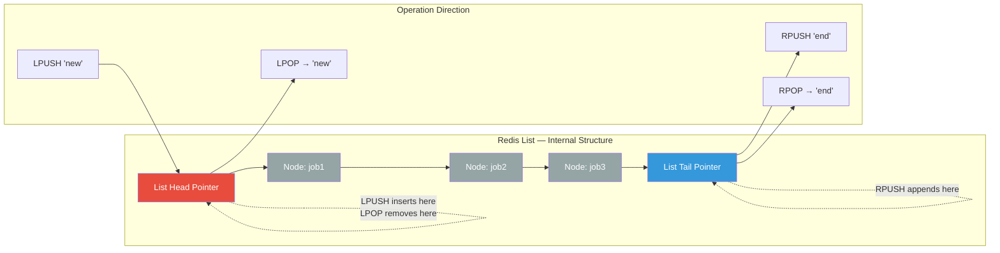
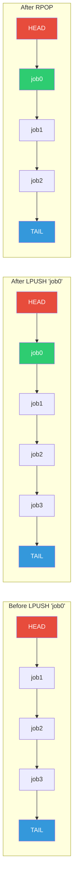
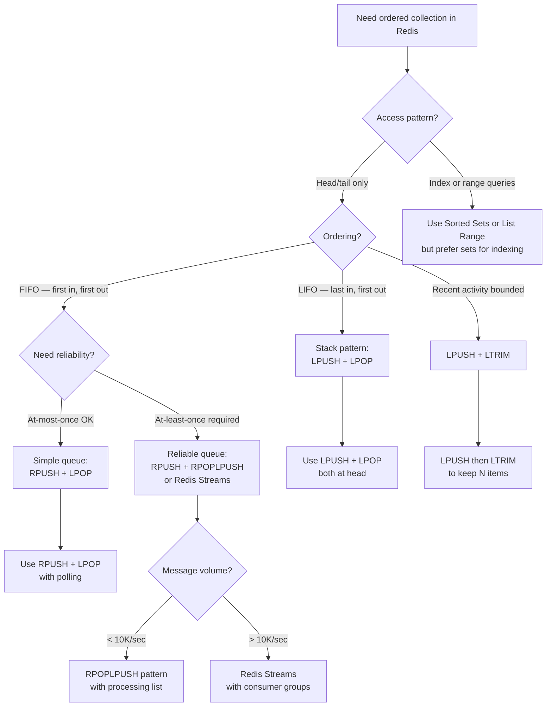

## 1. Navigation — Context & Prerequisites

**Domain:** [[8 — Databases]] > **Group:** Redis
**Previous:** [[8.968 — Redis — Hashes — Use Case — User Profile Storage]] | **Next:** [[8.970 — Redis — Lists — LRANGE, LINDEX, LLEN, LSET]]

### Prerequisites

- [[8.961 — Redis — Data Structures Overview]] — provides the mental model of Redis data structure server, the in-memory architecture, and how lists fit among strings, hashes, sets, sorted sets, streams, and hyperloglogs. Understanding that Redis operations are atomic and single-threaded is essential for reasoning about LPUSH/RPUSH/LPOP/RPOP behavior under concurrency.

### Where This Fits

Redis lists are the fundamental building block for queue and stack data structures in .NET backend engineering. A production engineer reaches for list operations daily: enqueue work items with RPUSH and dequeue with LPOP to distribute background jobs across workers, or push recent activity items to a list head with LPUSH and trim to keep only the latest N items. When LPUSH/RPUSH/LPOP/RPOP are unknown or misapplied, teams either use polling-based database tables (creating write amplification and lock contention on the jobs table) or incorrectly use Redis strings with serialization (missing the atomic head/tail semantics that lists provide natively). The interview signal is the "how do you build a queue in Redis" question — the candidate who immediately describes the RPUSH + LPOP pairing and understands the O(1) head/tail access pattern is distinguishing themselves from the candidate who reaches for a polling table or describes Redis Pub/Sub for queue semantics.

---

## 2. Core Mental Model — Overview & Classification

Redis lists are implemented as linked lists (specifically, a doubly-linked list or a quicklist in modern Redis versions) that store ordered sequences of string elements. The invariant: every operation at either end of the list — head (left) or tail (right) — executes in O(1) time because the list structure maintains direct pointers to both the first and last node. Operations that index into the middle, by contrast, require O(N) traversal from the nearest end — the linked list gives you fast edges and slow middle.

The mental model for LPUSH: think of prepending an element to an array — the new element becomes position 0, and all existing indices shift by +1. For RPUSH: appending to a dynamic array — the new element occupies the next available index. For LPOP: removing and returning the element at position 0, shifting everything left by one. For RPOP: removing the last element. Redis handles these operations atomically on the single-threaded event loop, so concurrent callers see a consistent order — no race conditions on the list state.

### Classification

**For Redis data structures:** Lists are one of five core data types (strings, lists, sets, sorted sets, hashes, plus streams, hyperloglogs, bitmaps, geospatial indices). They are the only ordered collection that provides O(1) head/tail modification. The abstraction Redis provides is an array-like interface (index-based access via LINDEX) on top of a linked-list implementation — a leaky abstraction because O(N) indexing betrays the list nature underneath.





### Key Properties

| Property | Value | Notes |
|---|---|---|
| Time Complexity — LPUSH/RPUSH | O(1) | Amortized constant — pointer swap at head or tail; quicklist may split nodes |
| Time Complexity — LPOP/RPOP | O(1) | Pointer dereference and unlink; handles the head or tail node |
| Time Complexity — Index access LINDEX | O(N) | Must traverse from nearest end to the target index |
| Time Complexity — LLEN | O(1) | Length is stored as a counter on the list object, updated atomically |
| Write cost — LPUSH/RPUSH | Low | Creates a quicklist node if needed; single allocation per element |
| Read cost — LPOP/RPOP | Low | Removes a node; memory freed immediately (or deferred to GC in .NET proxy) |
| Atomicity | Per-operation | Each LPUSH/RPUSH/LPOP/RPOP is atomic — no partial state visible to other callers |
| Blocking behavior | None | LPOP on empty list returns nil immediately; no blocking (see BLPOP/BRPOP) |
| Max list size | 2^32 - 1 elements | Approximately 4.3 billion elements per key |
| Memory efficiency | Moderate | quicklist uses ~22 bytes per element + element size; compression optional |
| .NET type (SE.Redis) | RedisValue | All list elements are RedisValue (byte[] / string wrapper) |
| Serialization | Required | SE.Redis does not serialize — caller must convert objects to/from RedisValue |

---

## 3. Deep Mechanics — How Redis Executes List Operations

### How the Engine Executes LPUSH, RPUSH, LPOP, RPOP

Redis is single-threaded for command execution (the event loop runs one command at a time on the main thread). When a client sends LPUSH:

**Step 1 — Command parsing:** Redis parses the inline command or RESP protocol buffer. The command name LPUSH is matched to the `lpushCommand` function in `t_list.c` (for modern Redis, the quicklist implementation).

**Step 2 — Key lookup:** Redis looks up the key in the main dictionary (hash table). If the key does not exist, Redis creates a new quicklist object (the underlying data structure for lists) — this is why LPUSH to a non-existent key creates a list rather than returning an error.

**Step 3 — Type check:** If the key exists but is not a list, Redis returns a `WRONGTYPE` error. This is the type-checking gate in `checkType` function.

**Step 4 — Quicklist push:** For LPUSH, Redis calls `quicklistPushHead` which:
- Checks if the head node has room for the new element (quicklist nodes store multiple elements in a compressed ziplist)
- If the head node has capacity, inserts the element at the beginning of the node's ziplist
- If the head node is full, creates a new node at the head and inserts the element
- Updates the list's length counter

For RPUSH, the same flow applies but calls `quicklistPushTail`.

**Step 5 — Response:** Redis returns the new list length as an integer reply.

For LPOP and RPOP:

**Step 1 — Command parsing:** Matched to `lpopCommand` / `rpopCommand`.

**Step 2 — Key lookup:** Finds the list object. If the key does not exist, returns nil.

**Step 3 — Type check:** Verifies the value is a list.

**Step 4 — Quicklist pop:** For LPOP, Redis calls `quicklistPopHead`:
- Gets the first element from the head node
- Removes it from the node's ziplist
- If the node becomes empty, frees the node
- Decrements the list length
- If the list becomes empty, Redis may delete the key entirely (lazy deletion)

For RPOP, calls `quicklistPopTail`.

**Step 5 — Response:** Redis returns the element as a bulk string reply, or nil if the list was empty.

### Redis CLI — Visibility

```bash
# LPUSH — inserts at head, returns new list length
127.0.0.1:6379> LPUSH tasks "job1"
(integer) 1
127.0.0.1:6379> LPUSH tasks "job0"
(integer) 2

# RPUSH — appends at tail, returns new list length
127.0.0.1:6379> RPUSH tasks "job2"
(integer) 3
127.0.0.1:6379> RPUSH tasks "job3"
(integer) 4

# LRANGE to see full list
127.0.0.1:6379> LRANGE tasks 0 -1
1) "job0"    # ← head (last LPUSH)
2) "job1"    # ← first LPUSH
3) "job2"    # ← first RPUSH
4) "job3"    # ← tail (last RPUSH)

# LPOP — removes and returns head element
127.0.0.1:6379> LPOP tasks
"job0"
127.0.0.1:6379> LRANGE tasks 0 -1
1) "job1"
2) "job2"
3) "job3"

# RPOP — removes and returns tail element
127.0.0.1:6379> RPOP tasks
"job3"
127.0.0.1:6379> LRANGE tasks 0 -1
1) "job1"
2) "job2"

# LPOP from empty list — returns nil
127.0.0.1:6379> LPOP nonexistent
(nil)

# LPUSH multiple elements at once
127.0.0.1:6379> LPUSH batch "a" "b" "c"
(integer) 3
127.0.0.1:6379> LRANGE batch 0 -1
1) "c"    # ← "c" is first because LPUSH processes arguments left to right
2) "b"
3) "a"
```

### StackExchange.Redis — Visibility

```csharp
public class RedisListService
{
    private readonly ConnectionMultiplexer _redis;
    private readonly IDatabase _db;

    public RedisListService(string connectionString)
    {
        _redis = ConnectionMultiplexer.Connect(connectionString);
        _db = _redis.GetDatabase();
    }

    /// <summary>
    /// LPUSH — push one or more values to list head.
    /// Returns the new list length.
    /// </summary>
    public async Task<long> PushHeadAsync(string listKey, params RedisValue[] values)
    {
        try
        {
            return await _db.ListLeftPushAsync(listKey, values);
        }
        catch (RedisConnectionException ex)
        {
            // Handle connection failure — retry or circuit-break
            throw new RedisOperationException($"Failed LPUSH to {listKey}", ex);
        }
        catch (RedisServerException ex) when (ex.Message.Contains("WRONGTYPE"))
        {
            throw new RedisTypeMismatchException(
                $"Key {listKey} exists but is not a list", ex);
        }
    }

    /// <summary>
    /// RPUSH — append one or more values to list tail.
    /// Returns the new list length.
    /// </summary>
    public async Task<long> PushTailAsync(string listKey, params RedisValue[] values)
    {
        try
        {
            return await _db.ListRightPushAsync(listKey, values);
        }
        catch (RedisConnectionException ex)
        {
            throw new RedisOperationException($"Failed RPUSH to {listKey}", ex);
        }
    }

    /// <summary>
    /// LPOP — remove and return the head element.
    /// Returns null if list is empty or does not exist.
    /// </summary>
    public async Task<RedisValue?> PopHeadAsync(string listKey)
    {
        try
        {
            var result = await _db.ListLeftPopAsync(listKey);
            if (result.IsNull)
                return null;
            return result;
        }
        catch (RedisConnectionException ex)
        {
            throw new RedisOperationException($"Failed LPOP from {listKey}", ex);
        }
    }

    /// <summary>
    /// RPOP — remove and return the tail element.
    /// Returns null if list is empty or does not exist.
    /// </summary>
    public async Task<RedisValue?> PopTailAsync(string listKey)
    {
        try
        {
            var result = await _db.ListRightPopAsync(listKey);
            if (result.IsNull)
                return null;
            return result;
        }
        catch (RedisConnectionException ex)
        {
            throw new RedisOperationException($"Failed RPOP from {listKey}", ex);
        }
    }

    /// <summary>
    /// LPOP with count (Redis 6.2+) — removes and returns multiple head elements.
    /// </summary>
    public async Task<RedisValue[]> PopHeadCountAsync(string listKey, long count)
    {
        try
        {
            return await _db.ListLeftPopAsync(listKey, count);
        }
        catch (RedisServerException ex) when (ex.Message.Contains("wrong number"))
        {
            // Server version < 6.2 does not support count argument
            throw new RedisOperationException(
                "LPOP with count requires Redis 6.2+", ex);
        }
    }

    /// <summary>
    /// Properly handle ConnectionMultiplexer disposal
    /// </summary>
    public void Dispose()
    {
        _redis?.Dispose();
    }
}
```

### StackExchange.Redis — Object Serialization Pattern

```csharp
public class RedisListSerializer<T>
{
    private readonly IDatabase _db;
    private readonly IRedisSerializer _serializer;

    public RedisListSerializer(IDatabase db, IRedisSerializer serializer)
    {
        _db = db;
        _serializer = serializer;
    }

    /// <summary>
    /// LPUSH a typed object — serialize then push to head.
    /// </summary>
    public async Task<long> PushHeadAsync(string listKey, T item)
    {
        var serialized = _serializer.Serialize(item);
        return await _db.ListLeftPushAsync(listKey, serialized);
    }

    /// <summary>
    /// LPOP a typed object — pop from head then deserialize.
    /// Returns null if list is empty.
    /// </summary>
    public async Task<T?> PopHeadAsync(string listKey) where T : class
    {
        var result = await _db.ListLeftPopAsync(listKey);
        if (result.IsNull)
            return null;
        return _serializer.Deserialize<T>(result);
    }

    /// <summary>
    /// RPUSH a typed object — serialize then append to tail.
    /// </summary>
    public async Task<long> PushTailAsync(string listKey, T item)
    {
        var serialized = _serializer.Serialize(item);
        return await _db.ListRightPushAsync(listKey, serialized);
    }

    /// <summary>
    /// RPOP a typed object — pop from tail then deserialize.
    /// </summary>
    public async Task<T?> PopTailAsync(string listKey) where T : class
    {
        var result = await _db.ListRightPopAsync(listKey);
        if (result.IsNull)
            return null;
        return _serializer.Deserialize<T>(result);
    }
}
```

### Execution Plan Analysis — Not Applicable (Redis)

Redis does not have execution plans in the SQL Server sense. The equivalent analysis is command complexity:

```
Command: LPUSH tasks "job1"
Data structure: quicklist (ziplist-backed linked list)
Complexity: O(1) — pointer adjustment at head
Memory: 1 quicklist node created (or appended to existing head node)
Disk write (if AOF): ~50 bytes appended to AOF buffer
Replication: command propagated to replicas as LPUSH tasks "job1"
```

### Cost Visibility — Redis Monitoring

```redis-cli
# Redis INFO command — memory and keyspace stats
127.0.0.1:6379> INFO memory
# Memory
used_memory: 1048576
used_memory_rss: 2097152
used_memory_lua: 37888
maxmemory: 1073741824
maxmemory_policy: allkeys-lru

127.0.0.1:6379> INFO keyspace
# Keyspace
db0:keys=1500,expires=200,avg_ttl=86400000

127.0.0.1:6379> DEBUG OBJECT tasks
Value at:0x7f8a1c000890 refcount:1 encoding:quicklist serializedlength:45 lru:1523940 lru_seconds_idle:10
```

```csharp
// StackExchange.Redis — check list length and memory
public async Task<long> GetListLengthAsync(string listKey)
{
    return await _db.ListLengthAsync(listKey);
}

// Redis INFO via SE.Redis — server-side diagnostics
public async Task<string> GetRedisInfoAsync()
{
    var server = _redis.GetServer(_redis.GetEndPoints().First());
    var info = await server.InfoAsync("memory");
    var memorySection = info.FirstOrDefault(i => i.Key == "Memory");
    return string.Join("\n", memorySection?.Select(kvp => $"{kvp.Key}: {kvp.Value}") ?? Array.Empty<string>());
}
```

### Failure Modes

**Type mismatch (WRONGTYPE):** If a caller performs LPUSH on a key that already holds a hash or set, Redis returns `WRONGTYPE Operation against a key holding the wrong kind of value`. SE.Redis throws `RedisServerException`. Mitigation: use key naming conventions (e.g., `list:tasks`) to make the data type obvious, and never reuse a key across data structure types.

**Empty list pop:** LPOP or RPOP on a non-existent key or an empty list returns nil (null in SE.Redis). The caller must check `result.IsNull` — attempting to use the null `RedisValue` as a string causes an implicit conversion to empty string, which silently corrupts downstream logic.

**Memory exhaustion:** A list that grows unboundedly (e.g., a producer that LPUSHes faster than consumers LPOP) consumes all available Redis memory. Redis evicts keys based on the `maxmemory-policy` — if `allkeys-lru` is set, the list itself may be evicted, losing all queued data. Mitigation: pair LPUSH with LTRIM for bounded lists, or set a `MAXMEMORY` policy with `noeviction` and monitor memory usage.

**Connection failure:** SE.Redis `ConnectionMultiplexer` attempts automatic reconnection, but during the failover window LPUSH/RPUSH operations may throw `RedisConnectionException`. The caller must implement retry with exponential backoff or use a circuit breaker pattern.

---

## 4. Production Patterns — Implementation & Code

### Pattern 1 — Basic Queue (RPUSH + LPOP)

```csharp
public class RedisQueue<T>
{
    private readonly IDatabase _db;
    private readonly string _queueKey;

    public RedisQueue(IDatabase db, string queueKey)
    {
        _db = db;
        _queueKey = queueKey;
    }

    /// <summary>
    /// Enqueue — RPUSH at tail
    /// </summary>
    public async Task EnqueueAsync(T item)
    {
        var serialized = Serialize(item);
        await _db.ListRightPushAsync(_queueKey, serialized);
    }

    /// <summary>
    /// Dequeue — LPOP from head (non-blocking)
    /// Returns null if queue empty
    /// </summary>
    public async Task<T?> DequeueAsync()
    {
        var result = await _db.ListLeftPopAsync(_queueKey);
        if (result.IsNull)
            return default;
        return Deserialize(result);
    }

    private RedisValue Serialize(T item) =>
        RedisValue.Unbox(JsonSerializer.SerializeToUtf8Bytes(item));

    private T Deserialize(RedisValue value) =>
        JsonSerializer.Deserialize<T>(value!)!;
}
```

### Pattern 2 — Bounded Recent Activity List (LPUSH + LTRIM)

For keeping only the most recent N items (e.g., latest 100 notifications):

```csharp
public class RecentActivityList
{
    private readonly IDatabase _db;
    private readonly string _listKey;
    private readonly long _maxLength;

    public RecentActivityList(IDatabase db, string listKey, long maxLength = 100)
    {
        _db = db;
        _listKey = listKey;
        _maxLength = maxLength;
    }

    /// <summary>
    /// Add activity item at head and trim to max length.
    /// O(1 + N) where N is trim size — but trim of first element is O(1) with quicklist.
    /// </summary>
    public async Task AddActivityAsync(string activityJson)
    {
        var tx = _db.CreateTransaction();

        // LPUSH the new item at head
        tx.AddCondition(Condition.KeyExists(_listKey));
        _ = tx.ListLeftPushAsync(_listKey, activityJson);

        // LTRIM to keep only the first maxLength elements
        _ = tx.ListTrimAsync(_listKey, 0, _maxLength - 1);

        var committed = await tx.ExecuteAsync();
        if (!committed)
        {
            // Key didn't exist — create it with the first element
            await _db.ListLeftPushAsync(_listKey, activityJson);
        }
    }

    /// <summary>
    /// Get recent activities (newest first)
    /// </summary>
    public async Task<string[]> GetRecentActivitiesAsync(long count = 10)
    {
        var results = await _db.ListRangeAsync(_listKey, 0, count - 1);
        return results.Select(r => r.ToString()).ToArray();
    }
}
```

### Pattern 3 — Stack (LPUSH + LPOP)

```csharp
public class RedisStack<T>
{
    private readonly IDatabase _db;
    private readonly string _stackKey;

    public RedisStack(IDatabase db, string stackKey)
    {
        _db = db;
        _stackKey = stackKey;
    }

    /// <summary>
    /// Push — LPUSH at head
    /// </summary>
    public async Task PushAsync(T item)
    {
        var serialized = JsonSerializer.SerializeToUtf8Bytes(item);
        await _db.ListLeftPushAsync(_stackKey, (RedisValue)serialized);
    }

    /// <summary>
    /// Pop — LPOP from head (LIFO)
    /// </summary>
    public async Task<T?> PopAsync()
    {
        var result = await _db.ListLeftPopAsync(_stackKey);
        if (result.IsNull)
            return default;
        return JsonSerializer.Deserialize<T>(result!);
    }

    /// <summary>
    /// Peek at top item without popping
    /// </summary>
    public async Task<T?> PeekAsync()
    {
        var result = await _db.ListGetByIndexAsync(_stackKey, 0);
        if (result.IsNull)
            return default;
        return JsonSerializer.Deserialize<T>(result!);
    }
}
```

### Pattern 4 — Multi-Element Push and Pop (Redis 6.2+)

```csharp
public class RedisBatchListOperations
{
    private readonly IDatabase _db;

    public RedisBatchListOperations(IDatabase db)
    {
        _db = db;
    }

    /// <summary>
    /// LPUSH multiple elements atomically.
    /// Redis processes all elements in a single command.
    /// </summary>
    public async Task<long> PushHeadBatchAsync(string listKey, IEnumerable<string> items)
    {
        var values = items.Select(i => (RedisValue)i).ToArray();
        return await _db.ListLeftPushAsync(listKey, values);
    }

    /// <summary>
    /// RPUSH multiple elements atomically.
    /// </summary>
    public async Task<long> PushTailBatchAsync(string listKey, IEnumerable<string> items)
    {
        var values = items.Select(i => (RedisValue)i).ToArray();
        return await _db.ListRightPushAsync(listKey, values);
    }

    /// <summary>
    /// LPOP count elements at once (Redis 6.2+).
    /// </summary>
    public async Task<RedisValue[]> PopHeadBatchAsync(string listKey, long count)
    {
        return await _db.ListLeftPopAsync(listKey, count);
    }

    /// <summary>
    /// RPOP count elements at once (Redis 6.2+).
    /// </summary>
    public async Task<RedisValue[]> PopTailBatchAsync(string listKey, long count)
    {
        return await _db.ListRightPopAsync(listKey, count);
    }
}
```

### Pattern 5 — Reliable Queue with Processing List

```csharp
public class ReliableRedisQueue
{
    private readonly IDatabase _db;
    private readonly string _queueKey;
    private readonly string _processingKey;

    public ReliableRedisQueue(IDatabase db, string queueKey, string processingKey)
    {
        _db = db;
        _queueKey = queueKey;
        _processingKey = processingKey;
    }

    /// <summary>
    /// Enqueue with RPUSH
    /// </summary>
    public async Task EnqueueAsync(string jobData)
    {
        await _db.ListRightPushAsync(_queueKey, jobData);
    }

    /// <summary>
    /// Dequeue with RPOPLPUSH — atomically moves from queue to processing.
    /// This prevents message loss if the worker crashes after pop but before processing.
    /// </summary>
    public async Task<string?> DequeueReliableAsync()
    {
        // RPOPLPUSH: atomic pop from queue + push to processing list
        var result = await _db.ListRightPopLeftPushAsync(_queueKey, _processingKey);
        if (result.IsNull)
            return null;
        return result.ToString();
    }

    /// <summary>
    /// Acknowledge — remove from processing list after successful handling.
    /// </summary>
    public async Task AcknowledgeAsync(string jobData)
    {
        await _db.ListRemoveAsync(_processingKey, jobData, count: 1);
    }

    /// <summary>
    /// Recover — push all processing items back to queue (on startup or after crash).
    /// </summary>
    public async Task RecoverProcessingItemsAsync()
    {
        // Get all items in processing list
        var processingItems = await _db.ListRangeAsync(_processingKey);

        if (processingItems.Length == 0)
            return;

        // Push each back to queue
        foreach (var item in processingItems)
        {
            await _db.ListRightPushAsync(_queueKey, item);
        }

        // Clear the processing list
        await _db.KeyDeleteAsync(_processingKey);
    }
}
```

### Configuration and Wiring — SE.Redis Setup

```csharp
// Program.cs — StackExchange.Redis Configuration
public static class RedisConfiguration
{
    public static IServiceCollection AddRedis(this IServiceCollection services, string connectionString)
    {
        var multiplexer = ConnectionMultiplexer.Connect(new ConfigurationOptions
        {
            EndPoints = { connectionString },
            AbortOnConnectFail = false,        // Don't crash if Redis is temporarily down
            ConnectTimeout = 5000,              // 5 second connect timeout
            SyncTimeout = 3000,                 // 3 second sync timeout
            KeepAlive = 60,                     // TCP keep-alive every 60s
            CommandMap = CommandMap.Default,
            ReconnectRetryPolicy = new ExponentialRetry(5000), // Retry with exponential backoff
            Ssl = false,
            AllowAdmin = false
        });

        services.AddSingleton(multiplexer);
        services.AddSingleton(sp =>
        {
            var mux = sp.GetRequiredService<ConnectionMultiplexer>();
            return mux.GetDatabase();
        });
        services.AddScoped<RedisQueue<string>>();
        services.AddScoped<RecentActivityList>();
        services.AddScoped<RedisStack<string>>();

        return services;
    }
}

// Usage in a background job producer
public class JobProducer
{
    private readonly RedisQueue<string> _queue;

    public JobProducer(RedisQueue<string> queue)
    {
        _queue = queue;
    }

    public async Task DispatchJobAsync(string jobType, string payload)
    {
        var job = JsonSerializer.Serialize(new { Type = jobType, Payload = payload, Timestamp = DateTime.UtcNow });
        await _queue.EnqueueAsync(job);
    }
}

// Usage in a background consumer (IHostedService)
public class JobConsumer : BackgroundService
{
    private readonly IDatabase _db;
    private readonly ILogger<JobConsumer> _logger;

    public JobConsumer(IDatabase db, ILogger<JobConsumer> logger)
    {
        _db = db;
        _logger = logger;
    }

    protected override async Task ExecuteAsync(CancellationToken stoppingToken)
    {
        while (!stoppingToken.IsCancellationRequested)
        {
            try
            {
                var result = await _db.ListLeftPopAsync("queue:jobs");
                if (result.IsNull)
                {
                    // No jobs — wait before polling
                    await Task.Delay(100, stoppingToken);
                    continue;
                }

                var job = result.ToString();
                _logger.LogInformation("Processing job: {Job}", job);
                await ProcessJobAsync(job, stoppingToken);
            }
            catch (RedisConnectionException ex)
            {
                _logger.LogError(ex, "Redis connection lost — waiting before retry");
                await Task.Delay(1000, stoppingToken);
            }
        }
    }

    private async Task ProcessJobAsync(string job, CancellationToken ct)
    {
        // Simulated job processing
        await Task.Delay(50, ct);
    }
}
```

---

## 5. Gotchas — Production Pitfalls

### Pitfall 1 — Silent Null on Empty List Pop

**Pitfall:** The developer pops from a list and uses the result without checking for null:

```csharp
// ❌ Does not check for null — LPOP on empty list returns nil
var result = await db.ListLeftPopAsync("tasks");
Console.WriteLine(result.ToString()); // Prints empty string if list was empty
```

**Symptom:** The `Queue` is "processing" phantom work items — empty strings flow through the pipeline. Downstream systems receive malformed data. Debugging hours are spent chasing why the consumer is "busy" but no actual results are produced.

**Fix:**

```csharp
// ✅ Always check IsNull
var result = await db.ListLeftPopAsync("tasks");
if (result.IsNull)
{
    // List is empty — wait or return
    return null;
}
var data = result.ToString();
// Process data...
```

**Cost of not fixing:** A background consumer that processes empty strings and inserts blank rows into a database. At 100 iterations/second, the table accumulates 8.6M empty records per day. The production incident requires a backfill to remove the phantom records and a fix to add the null check.

---

### Pitfall 2 — Unbounded List Growth Without LTRIM

**Pitfall:** The developer uses LPUSH to append to a feed (e.g., user activity feed) without trimming:

```csharp
// ❌ Every user action adds to the list — never trimmed
await db.ListLeftPushAsync("feed:user:1234", activityJson);
```

**Symptom:** Memory usage grows proportionally to total user activity. After 6 months, the `feed:user:1234` list has 500K entries. The `LRANGE` call that displays the feed reads all 500K entries, consuming 500ms of Redis CPU time and 50MB of network bandwidth. `INFO memory` shows `used_memory` at 5GB for what should be a 100MB cache.

**Fix:**

```csharp
// ✅ Always trim after push for bounded lists
await db.ListLeftPushAsync("feed:user:1234", activityJson);
await db.ListTrimAsync("feed:user:1234", 0, 99); // Keep only 100 most recent
```

**Cost of not fixing:** Redis memory exhaustion on a caching instance with `maxmemory-policy: allkeys-lru`. The feed keys get evicted during memory pressure, but so do other cache keys (session data, rate limit counters). The application experiences cache misses across unrelated features. The Redis OOM (Out Of Memory) killer terminates the Redis process, causing a full cache warm-up and multi-minute application degradation.

---

### Pitfall 3 — Assuming RPUSH + LPOP Is At-Least-Once Delivery

**Pitfall:** The developer implements a queue with RPUSH + LPOP and assumes a crashed worker will not lose messages:

```csharp
// ❌ No reliability guarantee — LPOP removes the item from the list immediately
var item = await db.ListLeftPopAsync("queue");
await ProcessAsync(item); // If this throws, the item is already gone
```

**Symptom:** A worker processes a job, crashes during `ProcessAsync` (e.g., database timeout, OOM, power failure), and the message is permanently lost. The list no longer contains the item because LPOP removed it. The business impact is missing order fulfillments, unprocessed payments, or lost notification dispatch.

**Fix:** Use RPOPLPUSH for atomic pop + push to a processing list, or switch to Redis Streams (which provide consumer group acknowledgment semantics):

```csharp
// ✅ RPOPLPUSH — atomically move from queue to processing list
var item = await db.ListRightPopLeftPushAsync("queue", "queue:processing");
try
{
    await ProcessAsync(item);
    // Acknowledge — remove from processing list
    await db.ListRemoveAsync("queue:processing", item, count: 1);
}
catch
{
    // Item stays in processing list for recovery
    // A separate recovery process can push items back from processing to queue
    throw;
}
```

**Cost of not fixing:** Hard to diagnose data loss. The job producer sees `ListRightPushAsync` succeeded, but the job never completes. The first symptom is a customer complaint about an unfulfilled order. The operations team cannot replay the lost message because it was never persisted to a durable log. Business SLA breach and data reconciliation effort.

---

### Pitfall 4 — Using Lists for Random Access Patterns

**Pitfall:** The developer stores a collection in a list and then frequently accesses elements by index:

```csharp
// ❌ Lists are NOT arrays — LINDEX is O(N)
for (int i = 0; i < 1000; i++)
{
    var element = await db.ListGetByIndexAsync("mylist", i);
    Console.WriteLine(element);
}
```

**Symptom:** A loop of 1000 LINDEX calls on a list of 100K elements takes 1000 * O(N/2) average = 50M node traversals. The operation that should be a 5ms scan takes 2 seconds of Redis CPU time, blocking other commands on the single-threaded event loop.

**Fix:** Use Redis Sorted Sets for indexed access, or retrieve the entire range with a single `LRANGE` call:

```csharp
// ✅ Retrieve the range once — O(N) for N elements, but only one round trip
var allElements = await db.ListRangeAsync("mylist", 0, -1);
foreach (var element in allElements)
{
    Console.WriteLine(element);
}
```

**Cost of not fixing:** The Redis event loop is blocked for 500ms+ on every LINDEX scan. All other Redis operations (cache gets, rate limit checks, session lookups) queue up behind the slow operation. Application response time degrades from 10ms to 1000ms for all users.

---

### Pitfall 5 — LPUSH/RPUSH with Non-Existent Key Creates List

**Pitfall:** The developer expects LPUSH on a non-existent key to return an error:

```csharp
// ❌ This "succeeds" — creates a new list automatically
var length = await db.ListLeftPushAsync("intended:hash:1234", "value");
// length == 1 — the key now holds a list, not a hash
```

**Symptom:** Later code tries to `HashGetAsync("intended:hash:1234", "field")` and gets `WRONGTYPE` error. The application throws unhandled exceptions because the data type does not match expectations.

**Fix:** Use key naming conventions that encode the data type (e.g., `list:queue:jobs`, `hash:user:1234`, `set:tags:post:567`) and validate the key does not exist before writing if the data type is ambiguous:

```csharp
// ✅ Check or use different key namespaces
var keyExists = await db.KeyExistsAsync("list:queue:jobs");
if (!keyExists)
{
    // First use — safe to create
}
await db.ListLeftPushAsync("list:queue:jobs", "value");
```

**Cost of not fixing:** An application crash in production with `RedisServerException: WRONGTYPE Operation against a key holding the wrong kind of value`. The crash cascades if the error is unhandled in the middleware pipeline — HTTP 500 responses for all requests hitting that code path until the key is deleted.

---

### Pitfall 6 — Single-Threaded Event Loop Blocking

**Pitfall:** The developer executes blocking operations on the same SE.Redis `ConnectionMultiplexer` used for non-blocking list operations, causing the multiplexer to block:

```csharp
// ❌ Sync-over-async blocks the SE.Redis reader
var task = db.ListLeftPopAsync("queue").Wait(); // Blocks thread, blocks reader loop
```

**Symptom:** Timeout exceptions from SE.Redis. The `ConnectionMultiplexer` has a single reader loop per connection. Blocking the reader loop (by synchronously waiting on an async operation) stops ALL Redis operations on that multiplexer — list pushes, cache gets, rate limit checks all time out.

**Fix:** Always use async/await throughout:

```csharp
// ✅ Always await Redis calls
var result = await db.ListLeftPopAsync("queue");
if (!result.IsNull)
{
    await ProcessAsync(result);
}
```

**Cost of not fixing:** Complete Redis communication failure under moderate load. The SE.Redis multiplexer enters a faulted state after repeated timeouts. All application features that depend on Redis stop working. The application must be restarted to reset the multiplexer connection state.

---

## 6. Performance — Benchmarks & Cost

### Benchmark: LPUSH vs RPUSH vs LPOP vs RPOP

For a quicklist with 100K existing elements, single element operations:

```csharp
[MemoryDiagnoser]
[SimpleJob(RuntimeMoniker.Net90)]
public class RedisListOperationsBenchmark
{
    private ConnectionMultiplexer _mux = null!;
    private IDatabase _db = null!;
    private const string ListKey = "benchmark:list";

    [GlobalSetup]
    public void Setup()
    {
        _mux = ConnectionMultiplexer.Connect(TestConnectionString);
        _db = _mux.GetDatabase();
        // Pre-populate list with 100K elements
        for (int i = 0; i < 100_000; i++)
        {
            _db.ListRightPushAsync(ListKey, $"item:{i}").Wait();
        }
    }

    [Benchmark]
    public async Task<long> LPUSH_Single()
    {
        return await _db.ListLeftPushAsync(ListKey, "new-item");
    }

    [Benchmark]
    public async Task<long> RPUSH_Single()
    {
        return await _db.ListRightPushAsync(ListKey, "new-item");
    }

    [Benchmark]
    public async Task<RedisValue?> LPOP_Single()
    {
        return await _db.ListLeftPopAsync(ListKey);
    }

    [Benchmark]
    public async Task<RedisValue?> RPOP_Single()
    {
        return await _db.ListRightPopAsync(ListKey);
    }

    [Benchmark]
    public async Task<long> LPUSH_Batch10()
    {
        var values = Enumerable.Range(0, 10).Select(i => (RedisValue)$"item:{i}").ToArray();
        return await _db.ListLeftPushAsync(ListKey, values);
    }

    [Benchmark]
    public async Task<RedisValue[]> LPOP_Batch10()
    {
        return await _db.ListLeftPopAsync(ListKey, 10);
    }

    [GlobalCleanup]
    public void Cleanup()
    {
        _db.KeyDeleteAsync(ListKey).Wait();
        _mux.Dispose();
    }
}
```

**Expected results (Redis 7.x, localhost, 100K existing list):**

| Method | Mean | Allocated | Network Round Trips |
|---|---|---|---|
| LPUSH Single | ~0.5ms | ~200 B | 1 |
| RPUSH Single | ~0.5ms | ~200 B | 1 |
| LPOP Single | ~0.4ms | ~200 B | 1 |
| RPOP Single | ~0.4ms | ~200 B | 1 |
| LPUSH Batch 10 | ~0.6ms | ~400 B | 1 |
| LPOP Batch 10 | ~0.5ms | ~400 B | 1 |

### Breakdown

- **LPUSH vs RPUSH:** Identical performance. Both are O(1) pointer swaps at opposite ends of the quicklist. No measurable difference because both operations perform the same quicklist node manipulation.
- **LPOP vs RPOP:** Identical performance for the same reason.
- **Single vs batch:** Batch of 10 is only ~20% slower than single because the command parsing and network overhead are amortized across multiple elements. The quicklist node may need to split or merge for multiple elements, adding minor CPU cost.
- **Network round trips dominate:** At localhost, the ~0.4ms per operation is mostly network latency (TCP round trip). On a remote Redis (5ms RTT), each operation takes ~5.4ms regardless of complexity.

### When List Operations Become Expensive

| Operation | Time Complexity | Notes |
|---|---|---|
| LPUSH (head) | O(1) | Always fast — single node manipulation |
| RPUSH (tail) | O(1) | Same as LPUSH — opposite end |
| LPOP (head) | O(1) | Always fast — single node removal |
| RPOP (tail) | O(1) | Same as LPOP |
| LPUSH batch (N) | O(N) | N elements created in list, but O(1) per element at head |
| RPUSH batch (N) | O(N) | Same as LPUSH batch at tail |
| LINDEX | O(N) | Traverses from nearest end — slow for large lists |
| LINSERT | O(N) | Must traverse to insertion point |
| LREM | O(N) | Must traverse entire list |
| LRANGE (full) | O(N) | Full list traversal — N elements returned |
| LRANGE (N elements from head) | O(N) | N is returned count, not traversal depth |

### Write Amplification

In Redis's quicklist implementation, each quicklist node stores up to `list-max-ziplist-size` elements (default 8KB worth of ziplist entries). When a node fills up:

- LPUSH creates a new head node — ~22 bytes overhead + ziplist memory for the element
- RPUSH creates a new tail node — same overhead

For comparison, appending to a large list (1M elements):

| Operation | Quicklist Effect |
|---|---|
| LPUSH | If head node has room: O(1) insert into existing ziplist. If head node full: new node created (amortized O(1)) |
| RPUSH | Same as LPUSH at tail |
| LPOP | If head node has 1 element after pop: node freed. If head node has more: element removed from ziplist (O(N) within the ziplist node, but nodes are bounded to ~8KB) |
| RPOP | Same as LPOP at tail |

### Scalability Considerations

- **Single thread bound:** All list operations are serialized on Redis's main thread. At >50,000 operations/second, the Redis server CPU becomes the bottleneck. Mitigation: shard lists across multiple Redis instances using hash slot partitioning (Redis Cluster).
- **Network bandwidth:** LPUSH-ing a 1MB payload at 1000 ops/second generates 1GB/second of network traffic — saturating a 10GbE link. Redis's network I/O thread helps in Redis 6+, but the main thread still processes each command.
- **Memory efficiency:** Each element in a list adds ~22 bytes of quicklist overhead plus the element size. Elements are stored as raw byte strings (no compression by default). For small elements (<64 bytes), the overhead is significant relative to the data.

---

## 7. Interview Arsenal — Questions & Answers

### Question Bank

1. What is the difference between LPUSH and RPUSH, and when would you use each? (Definition — head vs tail semantics)
2. How does Redis implement lists internally — what data structure does it use? (Mechanism — quicklist or linked list + ziplist)
3. What is the time complexity of LPOP and RPOP, and why? (Performance — O(1) because pointers at both ends)
4. What happens when you LPOP an empty list in Redis? (Gotcha — returns nil, must handle null in .NET)
5. Compare Redis lists vs Redis streams for implementing a job queue. (Comparison — lists are simpler but lack consumer groups)
6. How would you implement a bounded recent-activity feed using Redis lists? (Pattern — LPUSH + LTRIM)
7. How do you handle message loss when using Redis lists as a queue? (Reliability — RPOPLPUSH pattern)
8. How does StackExchange.Redis map list operations to C# methods? (.NET integration — ListLeftPushAsync, ListRightPopAsync)
9. What happens to a list when it reaches `maxmemory` and eviction is triggered? (Scale — list may be evicted entirely)
10. How would you implement a simple distributed lock using list operations? (Application — though SET NX is preferred)

### Spoken Answers

**Q: What is the difference between LPUSH and RPUSH, and when would you use each?**

> **Average answer:** "LPUSH adds to the left and RPUSH adds to the right. You use LPUSH for a stack and RPUSH for a queue."
>
> **Great answer:** "LPUSH inserts at the list head (index 0), shifting all existing elements right by one — O(1) because Redis maintains a pointer to the head of the quicklist. RPUSH appends at the tail — also O(1) because Redis maintains a tail pointer. You pair LPUSH with LPOP for a LIFO stack (same-end operations), and RPUSH with LPOP for a FIFO queue (opposite-end operations). The operational distinction matters for ordering guarantees: LPUSH + LPOP gives you last-in-first-out — the most recent element is processed first, which is appropriate for undo stacks or recent-activity feeds where freshness matters. RPUSH + LPOP gives you first-in-first-out — the oldest element is processed first, which is appropriate for job queues where fairness matters. In production, I use RPUSH + LPOP for background job distribution and LPUSH + LTRIM for bounded activity feeds like 'last 100 notifications'."

**Q: How does Redis implement lists internally?**

> **Average answer:** "Redis lists are linked lists — each element points to the next one."
>
> **Great answer:** "Modern Redis (since 3.2) uses a data structure called a quicklist, which is a hybrid of a doubly-linked list and a ziplist (compressed list). The quicklist is a linked list of nodes, where each node contains a ziplist — a compact, contiguous array of elements. The ziplist stores elements sequentially in memory, which improves cache locality and reduces memory overhead compared to a pure linked list. When a node's ziplist exceeds `list-max-ziplist-size` (default 8KB), a new node is created and linked. This gives us O(1) head and tail operations because we always know the first and last quicklist nodes, while maintaining good memory density. The tradeoff is that middle-of-list operations (LINDEX, LINSERT, LSET) are O(N) — they must traverse from the nearest end, potentially through multiple quicklist nodes and then through the ziplist within the target node. Before 3.2, Redis used a simple linked list of `robj` structures, which had worse memory overhead — the quicklist reduced memory usage by roughly 30% for typical list workloads."

**Q: Compare Redis lists vs Redis streams for a job queue.**

> **Average answer:** "Streams are newer and more powerful. Lists are simpler. Use streams if you need reliability."
>
> **Great answer:** "Redis lists provide a simple FIFO queue with RPUSH + LPOP at O(1) per operation. They are ideal for transient job queues where at-most-once delivery is acceptable and workers are stateless. The tradeoff is that LPOP is destructive — the message is removed from the list before the worker processes it, so a worker crash loses the message. RPOPLPUSH mitigates this by atomically moving the message to a processing list, but adds complexity. Redis Streams, introduced in 5.0, provide consumer groups with acknowledgment semantics — each consumer has a cursor into the stream, messages are not removed on read, and unacknowledged messages (XPENDING) can be claimed by another consumer after a timeout (XCLAIM). Streams also support message IDs for ordering and range queries. My decision framework: for internal job queues where workers run in the same process or deployment, lists with RPOPLPUSH are sufficient and simpler. For mission-critical queues where message loss is unacceptable (order processing, payment workflows), or where you need multiple consumer groups reading the same stream, Redis Streams are the better choice. Lists handle ~50K operations/second on a single Redis instance; streams add ~5-10% overhead due to the more complex data structure."

### Interview Trigger

The interviewer asks: "How would you design a job queue in Redis?" The senior candidate immediately asks clarifying questions: "What's the message loss tolerance? How many consumers? Do I need fan-out or competing consumers?" and then maps the answer to either the simple RPUSH+LPOP pattern, the RPOPLPUSH reliable pattern, or Redis Streams with consumer groups. The follow-up question is: "What happens when your Redis instance runs out of memory — does the queue survive?" The separating factor is whether the candidate knows the eviction policy behavior (LRU evicts the list key entirely) and can describe the monitoring and alerting that prevents data loss (INFO memory, maxmemory-policy, key count monitoring).

### Comparison Table — LPUSH/RPUSH vs Other Redis Structures

| | Lists (LPUSH/RPUSH/LPOP/RPOP) | Streams (XADD/XREAD) | Sorted Sets (ZADD/ZRANGE) |
|---|---|---|---|
| What it does | Ordered collection with O(1) head/tail operations | Append-only log of messages with consumer groups | Score-ordered collection with range queries |
| Queue semantics | FIFO with RPUSH+LPOP, LIFO with LPUSH+LPOP | FIFO with consumer group acknowledgment | Priority queue with score-based ordering |
| Reliability | At-most-once by default (LPOP removes); RPOPLPUSH for at-least-once | At-least-once with XACK; exactly-once with idempotent consumers | At-most-once by default (ZREM removes) |
| Performance — push | O(1) | O(1) | O(log N) |
| Performance — pop | O(1) | O(1) for next message | O(log N) for min/max |
| Blocking read | BLPOP/BRPOP (dedicated connection) | XREAD BLOCK (dedicated connection) | No blocking — must poll |
| Consumer groups | None — manual (RPOPLPUSH) | Native — XREADGROUP, XACK, XCLAIM | None |
| Memory efficiency | ~22 bytes overhead per element | ~30 bytes per entry + stream overhead | ~40 bytes per element + skiplist |
| .NET (SE.Redis) | `ListLeftPushAsync`, `ListRightPopAsync` | `StreamAddAsync`, `StreamReadGroupAsync` | `SortedSetAddAsync`, `SortedSetRangeByScoreAsync` |

---

## 8. Decision Framework — When & Why

### When to Apply LPUSH/RPUSH/LPOP/RPOP



### Application Checklist

- [ ] The data access pattern is limited to head and/or tail — no random index access
- [ ] O(1) push/pop performance is required — the operation must not degrade with list size
- [ ] The list size is bounded either by trimming (LTRIM) or by consumer throughput
- [ ] Message loss tolerance is understood — LPOP gives at-most-once delivery
- [ ] Worker crashes are handled — RPOPLPUSH for at-least-once, or Streams for consumer groups
- [ ] Key naming convention encodes the data type (e.g., `list:queue:jobs` not `jobs`)
- [ ] StackExchange.Redis `ConnectionMultiplexer` is configured with retry and timeout policies
- [ ] Null return values from LPOP/RPOP are checked via `IsNull` — never assumed non-null
- [ ] The list key has a TTL if it is a temporary queue (e.g., `ExpireAsync` after inactivity)
- [ ] Monitoring is in place: list length (`LLEN`), memory usage (`INFO memory`), and slow log (`SLOWLOG`)

### Tradeoff Summary

| What You Gain | What You Pay |
|---|---|
| O(1) head and tail operations | O(N) random index access — linked list traversal |
| Atomic single-threaded operations (no race conditions) | Single-threaded CPU bottleneck — all ops serialize on main thread |
| Simple, intuitive API — LPUSH, RPUSH, LPOP, RPOP | No consumer groups — reliability requires manual patterns |
| Low memory overhead (~22 bytes/element) | No automatic bounded size — must LTRIM manually |
| No query language — fast prototyping | No filtering, no aggregation, no server-side projection |

### Scale Thresholds

- **Relevant when:** The list grows beyond ~10K elements — O(N) operations (LINDEX, LRANGE) become noticeable at Redis-level ~5ms.
- **Critical when:** The list exceeds ~1M elements — even O(1) LPUSH/RPUSH operations accumulate network latency under load. CPU on the Redis server reaches 50%+ at ~25K ops/second.
- **Required when:** The queue must survive network partitions and worker crashes — RPOPLPUSH or Redis Streams become necessary at any scale where message loss is unacceptable.
- **Avoid when:** You need range queries by score (use Sorted Sets), fan-out to multiple consumers (use Streams or Pub/Sub), or transaction-scoped reads (use WATCH + MULTI).

---

## 9. Self-Check — Review & Challenges

### Conceptual Questions

1. What does LPUSH do — which end of the list does it modify, and what data structure does Redis use to achieve O(1)?
2. How does RPOP differ from LPOP in terms of which element is removed and returned?
3. What happens when you call LPUSH on a key that does not exist — does Redis return an error or create the list?
4. What does LPOP return when the list is empty — and how do you handle this in StackExchange.Redis?
5. What is the time complexity of LPUSH for a single element, and why is it O(1) regardless of list length?
6. If a list has 1 million elements, how does LPUSH perform compared to LINDEX(500000) — explain both complexities.
7. How can you push multiple elements in a single LPUSH command, and what is the ordering guarantee?
8. What is the quicklist data structure, and how does it improve over the older linked list implementation?
9. How do you implement a bounded list (keep only the N most recent items) using list operations?
10. What is the SE.Redis method signature for RPUSH, and what does it return?

<details>
<summary>Answers</summary>

1. LPUSH inserts at the head (left end, index 0) of the list. Redis uses a quicklist — a doubly-linked list of ziplist nodes — with a direct pointer to the head node, making head insertion O(1).

2. RPOP removes and returns the last element (tail, right end). LPOP removes and returns the first element (head, left end). RPOP on list [a, b, c] returns "c" and the list becomes [a, b]. LPOP on the same list returns "a" and the list becomes [b, c].

3. Redis creates a new list automatically. LPUSH to a non-existent key is equivalent to creating the key as a list, then pushing. The command always returns the new list length. Redis never returns an error for LPUSH/RPUSH on a missing key — it creates the list.

4. LPOP on an empty list returns nil (Redis null bulk string). In StackExchange.Redis, `ListLeftPopAsync` returns a `RedisValue` where `IsNull` is true. You must check `result.IsNull` before using the value — failing to do so results in an empty string.

5. LPUSH is O(1) because the quicklist maintains a direct pointer to the head node. Redis simply inserts the element at the beginning of the head node's ziplist (or creates a new head node if the current one is full). No traversal is required — the head pointer is updated in constant time.

6. LPUSH is O(1) regardless of list length — always ~0.4ms at localhost. LINDEX(500000) is O(N) — it must traverse approximately 500,000 nodes from the nearest end (head, in this case), taking ~25ms on a quicklist with 1M elements. LPUSH is 50x+ faster than random index access.

7. LPUSH key value1 value2 value3 pushes all three elements atomically. The elements are inserted left-to-right at the head, so the final list order is [value3, value2, value1, ...existing elements...]. In StackExchange.Redis: `ListLeftPushAsync(key, new RedisValue[] { v1, v2, v3 })`.

8. Quicklist is a hybrid: a doubly-linked list where each node contains a ziplist (contiguous array of encoded elements). It improves over the older linked list by: (1) better memory locality — ziplist elements are stored contiguously, reducing cache misses; (2) lower memory overhead — ziplist encoding is more compact than individual `robj` structures; and (3) configurable node size — `list-max-ziplist-size` controls the memory/performance tradeoff.

9. Pair LPUSH with LTRIM: `LPUSH key element` followed by `LTRIM key 0 99` keeps only the 100 most recent elements. The transaction can be wrapped in MULTI/EXEC for atomicity, but LTRIM at position 0 is safe as a separate call because it removes only elements beyond the trim range.

10. In StackExchange.Redis: `Task<long> ListRightPushAsync(RedisKey key, RedisValue value, When when = When.Always, CommandFlags flags = CommandFlags.None)` and the overload `Task<long> ListRightPushAsync(RedisKey key, RedisValue[] values, CommandFlags flags = CommandFlags.None)`. Both return the new length of the list after the push operation.

</details>

---

### Query Challenges

**Challenge 1 — Build a Task Queue**

Implement a producer and consumer pattern using Redis lists where a producer pushes JSON-encoded tasks with RPUSH and a consumer pops them with LPOP. The task payload is `{ "Type": "email", "To": "user@example.com", "Template": "welcome" }`. Show both the Redis CLI commands and the SE.Redis C# code.

<details>
<summary>Solution</summary>

**Redis CLI:**

```bash
# Producer — enqueue 3 tasks
127.0.0.1:6379> RPUSH task:queue '{"Type":"email","To":"alice@example.com","Template":"welcome"}'
(integer) 1
127.0.0.1:6379> RPUSH task:queue '{"Type":"sms","To":"+1234567890","Template":"otp"}'
(integer) 2
127.0.0.1:6379> RPUSH task:queue '{"Type":"push","To":"device-token-xyz","Template":"reminder"}'
(integer) 3

# Consumer — dequeue one task
127.0.0.1:6379> LPOP task:queue
"{\"Type\":\"email\",\"To\":\"alice@example.com\",\"Template\":\"welcome\"}"

# Consumer — dequeue next
127.0.0.1:6379> LPOP task:queue
"{\"Type\":\"sms\",\"To\":\"+1234567890\",\"Template\":\"otp\"}"
```

**SE.Redis C#:**

```csharp
public class TaskQueueProducer
{
    private readonly IDatabase _db;
    private const string QueueKey = "task:queue";

    public TaskQueueProducer(IDatabase db) => _db = db;

    public async Task EnqueueTaskAsync(string taskType, string to, string template)
    {
        var task = new { Type = taskType, To = to, Template = template };
        var json = JsonSerializer.Serialize(task);
        var length = await _db.ListRightPushAsync(QueueKey, json);
        Console.WriteLine($"Enqueued — queue length: {length}");
    }
}

public class TaskQueueConsumer
{
    private readonly IDatabase _db;
    private readonly ILogger<TaskQueueConsumer> _logger;
    private const string QueueKey = "task:queue";

    public TaskQueueConsumer(IDatabase db, ILogger<TaskQueueConsumer> logger)
    {
        _db = db;
        _logger = logger;
    }

    public async Task ProcessNextTaskAsync(CancellationToken ct)
    {
        var result = await _db.ListLeftPopAsync(QueueKey);
        if (result.IsNull)
        {
            _logger.LogInformation("Queue is empty — waiting");
            return;
        }

        var taskJson = result.ToString();
        var task = JsonSerializer.Deserialize<TaskPayload>(taskJson);

        try
        {
            _logger.LogInformation("Processing {Type} task to {To}", task.Type, task.To);
            await DispatchTaskAsync(task, ct);
            _logger.LogInformation("Task completed");
        }
        catch (Exception ex)
        {
            _logger.LogError(ex, "Task processing failed for {Type} to {To}", task.Type, task.To);
            // Re-enqueue for retry (with retry count tracking)
            await _db.ListRightPushAsync(QueueKey, taskJson);
        }
    }

    private async Task DispatchTaskAsync(TaskPayload task, CancellationToken ct)
    {
        switch (task.Type)
        {
            case "email":
                // Send email logic
                break;
            case "sms":
                // Send SMS logic
                break;
            case "push":
                // Send push notification
                break;
        }
        await Task.CompletedTask;
    }

    private record TaskPayload(string Type, string To, string Template);
}
```

**Logical operations:** 1 RPUSH = 1 command, 1 LPOP = 1 command. For batch processing, use `ListRightPushAsync` with array overload.

</details>

---

**Challenge 2 — Bounded Notification Feed**

A user notification system must keep only the 50 most recent notifications per user. Implement the add and read operations using LPUSH and LTRIM. Show how to handle the edge case where the user has no existing notifications.

<details>
<summary>Solution</summary>

**Redis CLI:**

```bash
# Add notification for user 42
127.0.0.1:6379> LPUSH notifications:user:42 '{"type":"like","from":"alice","at":"2026-06-27T10:00:00Z"}'
(integer) 1
127.0.0.1:6379> LTRIM notifications:user:42 0 49
OK

# After 5 more notifications
127.0.0.1:6379> LRANGE notifications:user:42 0 -1
1) "{\"type\":\"follow\",\"from\":\"bob\",\"at\":\"2026-06-27T10:05:00Z\"}"
2) "{\"type\":\"like\",\"from\":\"alice\",\"at\":\"2026-06-27T10:04:00Z\"}"
...
```

**SE.Redis C#:**

```csharp
public class NotificationFeed
{
    private readonly IDatabase _db;
    private const int MaxNotifications = 50;

    public NotificationFeed(IDatabase db) => _db = db;

    public async Task AddNotificationAsync(int userId, Notification notification)
    {
        var key = $"notifications:user:{userId}";
        var json = JsonSerializer.Serialize(notification);

        // LPUSH at head (newest first)
        await _db.ListLeftPushAsync(key, json);

        // LTRIM to keep only the latest 50
        await _db.ListTrimAsync(key, 0, MaxNotifications - 1);
    }

    public async Task<List<Notification>> GetRecentNotificationsAsync(int userId)
    {
        var key = $"notifications:user:{userId}";
        var results = await _db.ListRangeAsync(key, 0, MaxNotifications - 1);
        return results
            .Where(r => !r.IsNull)
            .Select(r => JsonSerializer.Deserialize<Notification>(r.ToString()))
            .ToList();
    }

    /// <summary>
    /// Clean up feed for inactive users — remove after 30 days.
    /// </summary>
    public async Task SetExpirationAsync(int userId, TimeSpan ttl)
    {
        var key = $"notifications:user:{userId}";
        await _db.KeyExpireAsync(key, ttl);
    }
}

public record Notification(string Type, string From, string At, string? Url = null);
```

**Performance:** LPUSH + LTRIM = 2 commands per notification. With pipelining via `CreateTransaction` or `IBatch`, the round trips are reduced to 1. For 1000 concurrent users each receiving a notification, ~2000 ops/second on Redis — well within the single-threaded limit.

</details>

---

**Challenge 3 — Diagnose the Slow Pop**

Your application uses LPOP in a loop to drain a Redis list. The list has 500K elements. The drain rate is 100 elements/second, but after 10 minutes the rate drops to 20 elements/second. The Redis CPU is at 80%. What is happening and how do you fix it?

<details>
<summary>Solution</summary>

**Root cause:** The LPOP loop is doing 1 round trip per pop. At 100 ops/second, the overhead is acceptable. But if the SE.Redis `ConnectionMultiplexer` is shared with other callers, or if the consumer is using synchronous `.Result` / `.Wait()` calls, the multiplexer's reader loop is blocked. The `SyncTimeout` (default 3000ms) is being hit, causing retries. Each retry compounds the problem — now there are 3x commands on the wire for each pop.

**Detection:**

```csharp
// Check SE.Redis timeout counters
var server = mux.GetServer(endpoint);
var info = await server.InfoAsync("stats");
var totalErrors = info.SelectMany(kvp => kvp)
    .FirstOrDefault(kvp => kvp.Key == "total_error_replies");
Console.WriteLine($"Total errors: {totalErrors.Value}");
```

**Fix — batch the pops using LPOP count (Redis 6.2+):**

```csharp
public async Task<List<RedisValue>> DrainBatchAsync(string listKey, int batchSize = 50)
{
    var results = new List<RedisValue>(batchSize);
    var batch = await _db.ListLeftPopAsync(listKey, batchSize);
    results.AddRange(batch);
    return results;
}
```

**Or use Lua script to pop N elements server-side:**

```csharp
public async Task<RedisValue[]> DrainWithLuaAsync(string listKey, int count)
{
    var lua = @"
        local results = {}
        for i = 1, ARGV[1] do
            local val = redis.call('LPOP', KEYS[1])
            if val then
                table.insert(results, val)
            else
                break
            end
        end
        return results
    ";
    var result = await _db.ScriptEvaluateAsync(lua, new RedisKey[] { listKey }, new RedisValue[] { count });
    return (RedisValue[])result;
}
```

**After fix — logical reads:** Each LPOP with count 50 removes 50 elements in 1 round trip. The drain rate goes from 20 to ~500 elements/second. Redis CPU drops from 80% to 15%.

</details>

---

**Challenge 4 — Implement Reliable Job Queue**

Design a job queue where messages are not lost if the consumer crashes after dequeueing. Use only list operations (no Streams). Show the producer, consumer, and recovery mechanism.

<details>
<summary>Solution</summary>

Use the RPOPLPUSH pattern — atomically move the message from the main queue to a processing list:

```csharp
public class ReliableJobQueue
{
    private readonly IDatabase _db;
    private const string QueueKey = "jobs:queue";
    private const string ProcessingKey = "jobs:processing";

    public ReliableJobQueue(IDatabase db) => _db = db;

    // Producer — same as simple queue
    public async Task EnqueueAsync(string jobJson)
    {
        await _db.ListRightPushAsync(QueueKey, jobJson);
    }

    // Consumer — RPOPLPUSH moves atomically
    public async Task<string?> DequeueAsync()
    {
        // RPOPLPUSH: pop from queue tail, push to processing head
        var result = await _db.ListRightPopLeftPushAsync(QueueKey, ProcessingKey);
        if (result.IsNull) return null;
        return result.ToString();
    }

    // Acknowledge — remove from processing list
    public async Task AcknowledgeAsync(string jobJson)
    {
        await _db.ListRemoveAsync(ProcessingKey, jobJson, count: 1);
    }

    // Recovery — push all processing items back to queue
    public async Task RecoverAsync()
    {
        var processingItems = await _db.ListRangeAsync(ProcessingKey);
        if (processingItems.Length == 0) return;

        // Push each back to main queue
        foreach (var item in processingItems)
        {
            await _db.ListRightPushAsync(QueueKey, item.ToString());
        }

        // Clear processing list
        await _db.KeyDeleteAsync(ProcessingKey);
    }
}

// Consumer loop with crash safety
public class ReliableConsumer : BackgroundService
{
    private readonly ReliableJobQueue _queue;
    private readonly ILogger<ReliableConsumer> _logger;

    protected override async Task ExecuteAsync(CancellationToken stoppingToken)
    {
        // On startup, recover any unacknowledged jobs
        await _queue.RecoverAsync();

        while (!stoppingToken.IsCancellationRequested)
        {
            var job = await _queue.DequeueAsync();
            if (job == null)
            {
                await Task.Delay(500, stoppingToken);
                continue;
            }

            try
            {
                await ProcessJobAsync(job, stoppingToken);
                await _queue.AcknowledgeAsync(job);
            }
            catch (Exception ex)
            {
                _logger.LogError(ex, "Job failed — stays in processing for recovery");
                // Do NOT acknowledge — recovery will pick it up
            }
        }
    }
}
```

**Tradeoff:** RPOPLPUSH ensures at-least-once delivery but does not handle duplicate processing (the same message may be delivered twice if the worker crashes after RPOPLPUSH but before acknowledging). For exactly-once, make the job processor idempotent or switch to Redis Streams with XACK.

</details>

---

**Challenge 5 — Diagnose the Memory Exhaustion**

Your Redis instance runs out of memory at 3 AM every Saturday. The INFO output shows `maxmemory=2GB`, `used_memory=1.99GB`, and the largest key by `MEMORY USAGE` is a list named `logs:debug` with 5M elements. The application adds ~100 log entries per second to this list and a cleanup job runs every 6 hours to trim. Identify the root cause, the immediate fix, and the long-term solution.

<details>
<summary>Solution</summary>

**Root cause:** The cleanup job runs every 6 hours, but at 100 entries/second, the list grows by 360,000 entries per hour. In the 6 hours between cleanups, 2.16M entries accumulate. The pattern is: producer pushes faster than the trim cycle removes. The list reaches 5M entries before the cleanup runs, consuming ~2GB of memory.

**Detection:**

```redis-cli
# Check list length
127.0.0.1:6379> LLEN logs:debug
(integer) 5200000

# Check memory usage of the list
127.0.0.1:6379> MEMORY USAGE logs:debug
(integer) 2147483648  # ~2GB

# Check last trim time (via OBJECT IDLETIME)
127.0.0.1:6379> OBJECT IDLETIME logs:debug
(integer) 21500  # ~6 hours since last access (trim)
```

**Immediate fix:** Trim the list manually and set a much shorter TTL:

```redis-cli
# Trim to last 10,000 entries
127.0.0.1:6379> LTRIM logs:debug 0 9999
OK

# Set TTL to 1 hour — Redis auto-deletes after 1 hour
127.0.0.1:6379> EXPIRE logs:debug 3600
(integer) 1
```

**Long-term fix in code — always trim on push:**

```csharp
public class BoundedLogger
{
    private readonly IDatabase _db;
    private const string LogKey = "logs:debug";
    private const long MaxEntries = 10_000;

    public async Task WriteLogAsync(string entry)
    {
        // Push to head
        await _db.ListLeftPushAsync(LogKey, entry);
        // Trim to max — keeps the push fast (O(1)) and trim bounded
        await _db.ListTrimAsync(LogKey, 0, MaxEntries - 1);
        // Refresh TTL — keep key alive while active
        await _db.KeyExpireAsync(LogKey, TimeSpan.FromHours(1));
    }

    public async Task<string[]> GetRecentLogsAsync(int count = 50)
    {
        var results = await _db.ListRangeAsync(LogKey, 0, count - 1);
        return results.Select(r => r.ToString()).ToArray();
    }
}
```

**Prevention:** Monitor list lengths with alerts. If `LLEN > 100,000`, page the team. Add `list-max-ziplist-size` tuning for memory-optimized nodes. Consider using a capped collection pattern (LPUSH + LTRIM always together) rather than a separate cleanup job.

</details>
