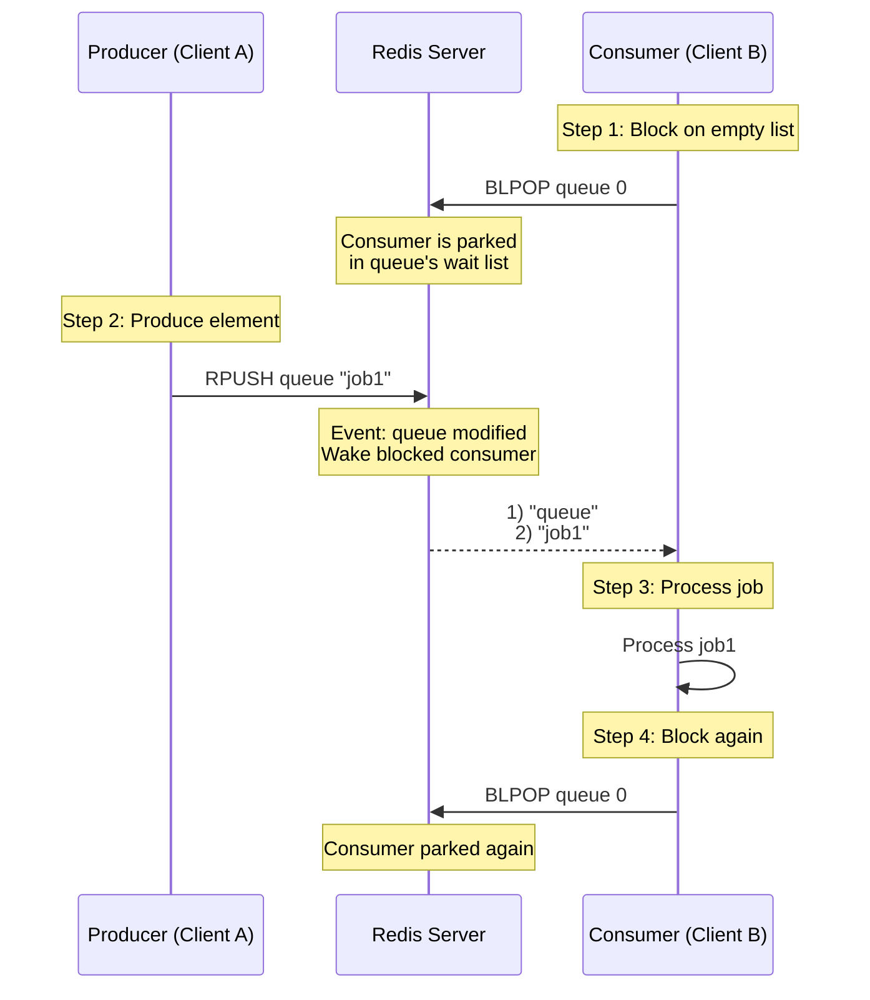
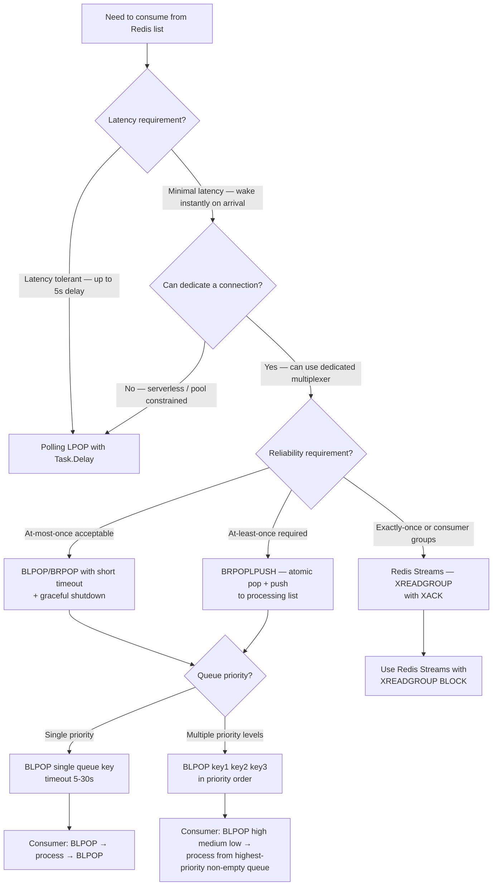

## 1. Navigation — Context & Prerequisites

**Domain:** [[8 — Databases]] > **Group:** Redis
**Previous:** [[8.970 — Redis — Lists — LRANGE, LINDEX, LLEN, LSET]] | **Next:** [[8.972 — Redis — Lists — Queue Pattern]]

### Prerequisites

- [[8.969 — Redis — Lists — LPUSH, RPUSH, LPOP, RPOP]] — provides the foundation for non-blocking pop operations. BLPOP and BRPOP extend LPOP and RPOP with blocking semantics — instead of returning nil immediately on an empty list, they wait for elements to become available. Understanding the difference between immediate-nil (LPOP) and blocking-wait (BLPOP) is critical for deciding which to use in consumer patterns.

### Where This Fits

BLPOP and BRPOP are Redis's solution to the "busy-wait" problem in consumer loops. A .NET backend engineer implementing a background worker with LPOP must poll periodically (e.g., `Task.Delay(100)`) to check for new items, introducing latency between job submission and processing. BLPOP eliminates this latency by blocking the connection until an element arrives — the consumer wakes up the instant a producer RPUSHes. When BLPOP/BRPOP are unknown, teams implement polling loops that either waste Redis CPU (polling at 10ms intervals — 100 commands/second per consumer) or introduce unacceptable latency (polling at 5-second intervals — 5s delay before a job starts). The interview signal is the "how do you implement a consumer that processes jobs as they arrive" question — the candidate who describes BLPOP with a timeout parameter and understands the dedicated-connection requirement is distinguishing blocking-list consumption from polling.

---

## 2. Core Mental Model — Overview & Classification

BLPOP and BRPOP are blocking versions of LPOP and RPOP. Instead of returning nil immediately when the list is empty, they block the client connection until: (1) an element is pushed to one of the specified lists by another client, or (2) the specified timeout expires. When multiple lists are provided, Redis checks them in order and pops from the first non-empty list it finds — this is the priority-queue pattern within blocking pop.

The mental model: BLPOP/BRPOP temporarily "park" the client connection on the Redis server. Redis does NOT poll — it uses an event-driven mechanism. When a push command (LPUSH, RPUSH, etc.) is executed on any key that has blocking clients waiting, Redis wakes the appropriate client, serves the element, and continues processing. The parked client consumes no CPU on the Redis server — it's an entry in a wait queue associated with the key. The timeout is the maximum time the client is willing to wait; timeout 0 waits indefinitely.

This blocking mechanism is fundamentally different from polling: polling generates N commands per second per consumer (CPU and network overhead); blocking generates 0 commands while waiting (zero overhead), 1 command when an element arrives.

### Classification

**For Redis blocking operations:** BLPOP and BRPOP belong to the blocking-pop family alongside BRPOPLPUSH (blocking variant of RPOPLPUSH). They are designed for consumer-producer patterns where the consumer must react immediately to new elements. They require a dedicated connection per blocking consumer because the connection is held open (idle but associated with a wait queue in Redis's event loop). StackExchange.Redis handles this through its multiplexer architecture — blocking commands use a dedicated connection from the multiplexer's pool rather than the interactive connection pool.



```mermaid
flowchart TD
    A[Consumer starts] --> B[BLPOP queue1 queue2 queue3<br/>timeout 30]
    B --> C{Any list has elements?}
    
    C -->|Yes — immediately| D[Pop from first non-empty list<br/>Return [list, element]]
    C -->|No — all empty| E[Park client in wait queue<br/>for all specified keys]
    
    E --> F{Event occurs within 30s?}
    F -->|RPUSH/LPUSH on queue1| G[Redis wakes client<br/>Returns [queue1, element]]
    F -->|RPUSH/LPUSH on queue2| H[Returns [queue2, element]]
    F -->|RPUSH/LPUSH on queue3| I[Returns [queue3, element]]
    F -->|Timeout 30s expires| J[Return nil]
    
    D --> K[Process element]
    G --> K
    H --> K
    I --> K
    J --> L[Wait then retry<br/>or exit]
    
    K --> B
```

### Key Properties

| Property | Value | Notes |
|---|---|---|
| BLPOP time complexity | O(1) for non-empty list; O(1) + event wait for empty | If list has elements, returns immediately (like LPOP). If empty, blocked wait incurs no CPU |
| BRPOP time complexity | Same as BLPOP | Same mechanics, opposite end of list |
| BLPOP with multiple keys | O(N) key check | Checks keys in order; returns from first non-empty key |
| Connection requirements | Dedicated connection | Blocking command holds connection open; cannot share with non-blocking ops on same SE.Redis multiplexer |
| Timeout | Seconds (integer), 0 = infinite | SE.Redis uses `CommandFlags` or `TimeSpan` depending on API |
| Return value | Array: [key, element] | Redis returns both the key name and the popped element |
| StackExchange.Redis | `ListLeftPopAsync` with timeout, or `ExecuteAsync("BLPOP", ...)` | SE.Redis has no direct BLPOP method — uses ExecuteAsync or ListLeftPopAsync with specific flags |
| Wake-up latency | Sub-millisecond | Redis uses an event-driven wake-up — no polling |
| Multiple consumers | Only one consumer gets each element | Waking is per-element — other blocked consumers remain parked |
| Memory usage (blocked) | ~500 bytes per blocked client | Small — key name, client pointer, timeout in Redis's wait list |

---

## 3. Deep Mechanics — How Redis Executes Blocking Pop

### How the Engine Executes BLPOP

**Step 1 — Command parsing:** Redis matches BLPOP to `blpopCommand`. It parses all key arguments (variable number, at least 2 — one key + timeout, or multiple keys + timeout). The last argument is always the timeout in seconds. Timeout 0 means infinite wait.

**Step 2 — Immediate check:** Redis iterates through the specified keys in order. For each key, it checks: (1) does the key exist? (2) is it a list? (3) does it have elements? If a non-empty list is found, Redis pops and returns immediately — same as LPOP but wrapped in the [key, element] array response. No blocking occurs.

**Step 3 — Blocking registration:** If all specified lists are empty (or do not exist), Redis enters the blocking path:
- Creates a `blockingState` structure for the client
- Associates the client with each specified key (adds to the key's blocking clients list)
- Sets the timeout timer (if timeout > 0)
- Returns control to the event loop — the client is in "blocked" state

**Step 4 — Event-driven wake-up:** When any client executes a command that modifies a list (LPUSH, RPUSH, LINSERT, etc.), Redis's `signalKeyAsReady` function is called. This function:
- Checks if any blocked clients are waiting on the modified key
- If yes, adds the key to a "ready keys" list
- The event loop's `handleClientsBlockedOnKeys` function processes the ready keys
- For each ready key, it wakes the first blocked client (oldest waiter) and returns the popped element
- The woken client unblocks, processes the response, and the consumer loop typically issues another BLPOP

**Step 5 — Timeout:** If no element arrives within the timeout period, Redis wakes the client with a nil response. The client receives an empty array (or nil) indicating the timeout occurred.

**Step 6 — Connection cleanup:** If the client disconnects while blocked (e.g., application shutdown, network failure), Redis cleans up the `blockingState` and removes the client from all key-associated wait lists.

### BRPOP differences:

BRPOP is identical to BLPOP except it pops from the tail (right end) instead of the head (left end). When checking non-empty lists, BRPOP returns the rightmost element. When blocking and waking, BRPOP pops from the right. All other mechanics — key ordering, timeout, event-driven wake-up — are identical.

### Multiple keys behavior:

When BLPOP is called with multiple keys (e.g., `BLPOP high middle low 30`):
- Redis checks keys left to right: high, then middle, then low
- If `high` has elements, returns from `high` immediately
- If `high` is empty but `middle` has elements, returns from `middle` immediately
- If all are empty, blocks on ALL three keys simultaneously
- When any list receives a push, Redis wakes the consumer and returns from that list

This creates a priority-queue behavior: elements in `high` are always consumed before elements in `middle`, which are consumed before `low`. The priority is determined purely by key order in the BLPOP call.

### Redis CLI — Visibility

```bash
# Create a list with elements (simulating an existing queue)
127.0.0.1:6379> RPUSH queue "existing-job"
(integer) 1

# BLPOP on non-empty list — returns immediately (no blocking)
127.0.0.1:6379> BLPOP queue 0
1) "queue"
2) "existing-job"
(3.16s)  # Note: the (3.16s) is the time the CLI waited — in this case it waited 0s
          # but the CLI displays the elapsed time for the interactive session

# BLPOP on empty list with timeout — blocks for 5 seconds then returns nil
127.0.0.1:6379> BLPOP empty-queue 5
(nil)
(5.04s)  # Exactly 5 seconds later

# BLPOP with multiple keys — priority ordering
127.0.0.1:6379> BLPOP urgent normal low 30
# Blocks until someone pushes to any of these keys

# In another terminal:
127.0.0.1:6379> RPUSH normal "normal-job"
(integer) 1

# First terminal unblocks:
1) "normal"
2) "normal-job"
(12.34s)  # Elapsed time while blocked

# BLPOP with infinite timeout (0) — blocks forever until element arrives
127.0.0.1:6379> BLPOP forever-queue 0
# Blocks indefinitely...

# BRPOP — same as BLPOP but pops from tail
127.0.0.1:6379> RPUSH stack "bottom" "middle" "top"
(integer) 3
127.0.0.1:6379> BRPOP stack 0
1) "stack"
2) "top"    # BRPOP returns the tail element
```

### StackExchange.Redis — Visibility

StackExchange.Redis does NOT have dedicated `BlpopAsync` or `BrpopAsync` methods. The recommended approach is to use `IDatabase.ExecuteAsync` to send the raw BLPOP/BRPOP command, or use the polling approach with `ListLeftPopAsync` in a loop. However, SE.Redis exposes blocking pop through `IDatabase.ListLeftPopAsync` with a `CommandFlags` parameter or through the `GetDatabase()` with specific configuration.

Here is the accurate approach for blocking pop in StackExchange.Redis:

```csharp
public class RedisBlockingPopService : IDisposable
{
    private readonly ConnectionMultiplexer _redis;
    private readonly IDatabase _db;

    public RedisBlockingPopService(string connectionString)
    {
        var config = new ConfigurationOptions
        {
            EndPoints = { connectionString },
            AbortOnConnectFail = false,
            // Important: Set a reasonable timeout for blocking operations
            SyncTimeout = int.MaxValue, // Prevents timeout on long-blocking calls
            ConnectTimeout = 5000,
            KeepAlive = 60,
            // Blocking operations should use a dedicated connection
            // The multiplexer handles this internally
        };
        _redis = ConnectionMultiplexer.Connect(config);
        _db = _redis.GetDatabase();
    }

    /// <summary>
    /// BLPOP implementation via ExecuteAsync.
    /// Returns (key, value) tuple, or null on timeout.
    /// </summary>
    public async Task<(string Key, string Value)?> BlockingLeftPopAsync(
        TimeSpan timeout, params string[] listKeys)
    {
        try
        {
            var args = new List<RedisValue>();
            foreach (var key in listKeys)
                args.Add(key);
            args.Add((int)timeout.TotalSeconds);

            var result = await _db.ExecuteAsync("BLPOP", args.ToArray());

            if (result.IsNull)
                return null; // Timeout expired

            var items = (RedisResult[])result;
            return (items[0].ToString(), items[1].ToString());
        }
        catch (RedisConnectionException ex)
        {
            throw new RedisOperationException("BLPOP connection failed", ex);
        }
        catch (RedisServerException ex) when (ex.Message.Contains("WRONGTYPE"))
        {
            throw new RedisTypeMismatchException("BLPOP on non-list key", ex);
        }
    }

    /// <summary>
    /// BRPOP implementation via ExecuteAsync.
    /// </summary>
    public async Task<(string Key, string Value)?> BlockingRightPopAsync(
        TimeSpan timeout, params string[] listKeys)
    {
        try
        {
            var args = new List<RedisValue>();
            foreach (var key in listKeys)
                args.Add(key);
            args.Add((int)timeout.TotalSeconds);

            var result = await _db.ExecuteAsync("BRPOP", args.ToArray());

            if (result.IsNull)
                return null;

            var items = (RedisResult[])result;
            return (items[0].ToString(), items[1].ToString());
        }
        catch (RedisConnectionException ex)
        {
            throw new RedisOperationException("BRPOP connection failed", ex);
        }
    }

    /// <summary>
    /// BLPOP with infinite timeout (blocks until element arrives).
    /// USE WITH CAUTION: ensures cancellation token can break the wait.
    /// </summary>
    public async Task<(string Key, string Value)> BlockingLeftPopInfiniteAsync(
        string listKey, CancellationToken ct)
    {
        // For infinite blocking, use timeout 0 and wrap with cancellation
        // Since SE.Redis doesn't natively support CancellationToken on ExecuteAsync,
        // we need to handle this at the caller level
        var task = BlockingLeftPopAsync(TimeSpan.FromSeconds(0), listKey);

        // Wait for either the task to complete or cancellation
        var completed = await Task.WhenAny(task, Task.Delay(Timeout.Infinite, ct));

        if (completed == task)
        {
            var result = await task;
            if (result == null)
                throw new InvalidOperationException("Infinite BLPOP returned null unexpectedly");
            return result.Value;
        }

        // Cancellation requested — we cannot cancel the Redis command,
        // but the consumer loop can stop processing the result
        throw new OperationCanceledException(ct);
    }

    /// <summary>
    /// Alternative: BLPOP using blocking pop with dedicated connection.
    /// Uses ListLeftPopAsync with a timeout pattern.
    /// NOTE: This is NOT true blocking pop — it's polling with SE.Redis's internal timeout.
    /// </summary>
    public async Task<RedisValue?> PollingLeftPopAsync(string listKey, TimeSpan pollInterval)
    {
        // This is the polling alternative — no blocking
        var result = await _db.ListLeftPopAsync(listKey);
        if (!result.IsNull)
            return result;

        await Task.Delay(pollInterval);
        return null;
    }

    public void Dispose()
    {
        _redis?.Dispose();
    }
}
```

### StackExchange.Redis — Blocking Pop with Dedicated Multiplexer

```csharp
/// <summary>
/// For production blocking pop, use a dedicated ConnectionMultiplexer instance.
/// The main multiplexer handles non-blocking operations (cache gets, rate limits).
/// The blocking multiplexer handles BLPOP/BRPOP — its connections may be held open.
/// </summary>
public class BlockingConsumerMultiplexer : IDisposable
{
    private readonly ConnectionMultiplexer _blockingMux;
    private readonly IDatabase _blockingDb;

    public BlockingConsumerMultiplexer(string connectionString)
    {
        var config = new ConfigurationOptions
        {
            EndPoints = { connectionString },
            AbortOnConnectFail = false,
            SyncTimeout = int.MaxValue,    // Blocking calls can take minutes
            ConnectTimeout = 5000,
            KeepAlive = 30,
            // Allow for blocking operations
            CommandMap = CommandMap.Create(new HashSet<string>
            {
                "BLPOP", "BRPOP", "BRPOPLPUSH", "PING", "SELECT"
            }, available: true),
            // Use a unique client name for monitoring
            ClientName = $"BlockingConsumer-{Environment.MachineName}"
        };

        _blockingMux = ConnectionMultiplexer.Connect(config);
        _blockingDb = _blockingMux.GetDatabase();
    }

    public IDatabase Database => _blockingDb;

    public void Dispose()
    {
        _blockingMux?.Close();
        _blockingMux?.Dispose();
    }
}

// Usage in a background service
public class BlockingConsumerService : BackgroundService
{
    private readonly BlockingConsumerMultiplexer _blockingMux;
    private readonly ILogger<BlockingConsumerService> _logger;
    private const string QueueKey = "queue:jobs";

    public BlockingConsumerService(
        BlockingConsumerMultiplexer blockingMux,
        ILogger<BlockingConsumerService> logger)
    {
        _blockingMux = blockingMux;
        _logger = logger;
    }

    protected override async Task ExecuteAsync(CancellationToken stoppingToken)
    {
        _logger.LogInformation("Blocking consumer started on {QueueKey}", QueueKey);

        while (!stoppingToken.IsCancellationRequested)
        {
            try
            {
                // ExecuteAsync with BLPOP — timeout of 0 means infinite
                var result = await _blockingMux.Database.ExecuteAsync(
                    "BLPOP", QueueKey, 30);

                if (result.IsNull)
                {
                    // Timeout occurred (30 seconds) — no element arrived
                    _logger.LogDebug("BLPOP timeout — retrying");
                    continue;
                }

                // Result is [key, value] array
                var items = (RedisResult[])result;
                var key = items[0].ToString();
                var value = items[1].ToString();

                _logger.LogInformation("Received job from {Key}: {Value}", key, value);

                await ProcessJobAsync(value, stoppingToken);

                _logger.LogInformation("Job completed: {Value}", value);
            }
            catch (RedisConnectionException ex)
            {
                _logger.LogError(ex, "Redis connection lost — waiting 5s before retry");
                await Task.Delay(5000, stoppingToken);
            }
            catch (OperationCanceledException)
            {
                _logger.LogInformation("Blocking consumer stopping");
                break;
            }
            catch (Exception ex)
            {
                _logger.LogError(ex, "Unexpected error in blocking consumer");
                await Task.Delay(1000, stoppingToken);
            }
        }
    }

    private async Task ProcessJobAsync(string jobJson, CancellationToken ct)
    {
        // Simulated job processing
        await Task.Delay(100, ct);
    }
}
```

### Execution Plan Analysis — Redis Blocking State

```
BLPOP queue1 queue2 30
Client state before: connected, no pending commands
Client state during: blocked (BLPOP_BLOCKED state)
  - Added to queue1's wait list (linked list of blocked clients)
  - Added to queue2's wait list
  - Timeout timer started (30 seconds)
  - No CPU consumed while blocked

When RPUSH queue1 "job" arrives:
  - Redis calls signalKeyAsReady("queue1")
  - queue1 is added to server.ready_keys list
  - Event loop calls handleClientsBlockedOnKeys()
  - First client in queue1's wait list is unblocked
  - LINDEX/LPOP is executed: pop from queue1 head
  - Response: ["queue1", "job"] is sent to the woken client
  - Client transitions from blocked → connected state

On timeout (30 seconds):
  - Timeout handler fires for the client
  - Client is removed from all key wait lists
  - Response: nil is sent
  - Client transitions from blocked → connected state
```

### Cost Visibility — Redis Monitoring

```bash
# Check the number of blocked clients
127.0.0.1:6379> CLIENT LIST
# Look for "blpop" or "brpop" in the cmd field
id=42 addr=127.0.0.1:54321 fd=8 name= age=120 idle=30 flags=b db=0 sub=0 psub=0 multi=-1 qbuf=0 qbuf-free=0 argv-mem=0 obl=0 oll=0 omem=0 tot-mem=0 events=r cmd=blpop user=default

# The 'flags=b' indicates the client is blocked
# The 'idle=30' shows 30 seconds idle (blocked waiting)
# The 'cmd=blpop' shows the last command was BLPOP

# Count blocked clients
127.0.0.1:6379> CLIENT LIST | grep flags=b | wc -l
(integer) 5

# Memory used by blocked clients (each ~500 bytes)
127.0.0.1:6379> INFO clients
# Clients
connected_clients:10
client_recent_max_input_buffer:20480
client_recent_max_output_buffer:0
blocked_clients:5   # ← 5 clients in blocked state
tracking_clients:0
```

```csharp
// StackExchange.Redis — monitor blocked clients
public async Task<int> CountBlockedClientsAsync()
{
    var server = _redis.GetServer(_redis.GetEndPoints().First());
    var clients = await server.ClientListAsync();
    return clients.Count(c => c.Flags.HasFlag(ClientFlags.Blocked));
}
```

### Failure Modes

**Connection pool exhaustion:** BLPOP blocks a connection for the duration of the wait. If using SE.Redis with the default multiplexer (which manages a pool of connections), a blocking operation ties up one connection from the pool. If enough consumers run BLPOP, the pool is exhausted and non-blocking operations (cache gets, etc.) may timeout waiting for a free connection. Mitigation: use a dedicated `ConnectionMultiplexer` for blocking operations, separate from the main Redis multiplexer used for interactive commands.

**Infinite timeout (timeout 0) without cancellation:** BLPOP with timeout 0 waits forever. If the application shuts down, the connection remains blocked until Redis detects the TCP disconnect (which may take minutes with TCP keepalives). Mitigation: use a reasonable timeout (30 seconds) and retry, or implement application-level cancellation via `Task.WhenAny` with `CancellationToken`.

**Queue priority inversion:** BLPOP checks keys in order. If `BLPOP high medium low 0` is called but `high` has many elements while `medium` and `low` are empty, elements in `medium` and `low` are starved — they are never checked until `high` is drained. Mitigation: use separate consumers per priority level, or use a sorted set for true priority queuing.

**Multiple consumers and wake-up race:** BLPOP wakes only the first blocked consumer (oldest waiter) per element pushed. If two consumers are blocked on the same queue and a producer pushes one element, only one consumer wakes. The other remains blocked. This is correct behavior, but if a consumer crashes while processing the woken element, the element is lost (same as LPOP — destructive read). Mitigation: use BRPOPLPUSH for atomic pop + push to processing list, or use Redis Streams with consumer groups for acknowledgment.

**Non-list key in BLPOP:** If one of the specified keys exists but is not a list, BLPOP returns `WRONGTYPE`. Unlike LPOP (which errors on the spot), BLPOP only errors if the key exists as a non-list at the time of the check. If a key is created as a non-list after BLPOP blocks, it will error when the client wakes. Mitigation: use key namespacing to prevent type confusion.

---

## 4. Production Patterns — Implementation & Code

### Pattern 1 — Priority Queue Worker with BLPOP Multiple Keys

```csharp
public class PriorityQueueWorker
{
    private readonly IDatabase _blockingDb;
    private readonly ILogger<PriorityQueueWorker> _logger;

    // Keys checked in priority order
    private static readonly string[] PriorityKeys = {
        "queue:urgent",   // Checked first — highest priority
        "queue:high",     // Checked second
        "queue:normal",   // Checked third
        "queue:low"       // Checked last — lowest priority
    };

    public PriorityQueueWorker(IDatabase blockingDb, ILogger<PriorityQueueWorker> logger)
    {
        _blockingDb = blockingDb;
        _logger = logger;
    }

    /// <summary>
    /// Process one job from the highest-priority queue that has elements.
    /// Blocks until element is available or timeout.
    /// </summary>
    public async Task<bool> ProcessNextJobAsync(CancellationToken ct)
    {
        try
        {
            // BLPOP with all priority keys and 30s timeout
            var args = new List<RedisValue>(PriorityKeys);
            args.Add(30); // timeout in seconds

            var result = await _blockingDb.ExecuteAsync("BLPOP", args.ToArray());

            if (result.IsNull)
            {
                _logger.LogDebug("No jobs arrived within 30s timeout");
                return false;
            }

            var items = (RedisResult[])result;
            var sourceKey = items[0].ToString();
            var jobValue = items[1].ToString();

            _logger.LogInformation(
                "Dequeued job from {SourceKey}: {Job}", sourceKey, Truncate(jobValue, 50));

            await ProcessJobAsync(jobValue, ct);
            return true;
        }
        catch (RedisConnectionException ex)
        {
            _logger.LogError(ex, "Redis connection failed in priority consumer");
            throw;
        }
    }

    private async Task ProcessJobAsync(string jobJson, CancellationToken ct)
    {
        // Deserialize and process
        var job = JsonSerializer.Deserialize<JobPayload>(jobJson);
        switch (job?.Type)
        {
            case "email":
                await SendEmailAsync(job, ct);
                break;
            case "report":
                await GenerateReportAsync(job, ct);
                break;
            case "cleanup":
                await RunCleanupAsync(job, ct);
                break;
            default:
                _logger.LogWarning("Unknown job type: {Type}", job?.Type);
                break;
        }
    }

    private Task SendEmailAsync(JobPayload job, CancellationToken ct) => Task.CompletedTask;
    private Task GenerateReportAsync(JobPayload job, CancellationToken ct) => Task.CompletedTask;
    private Task RunCleanupAsync(JobPayload job, CancellationToken ct) => Task.CompletedTask;

    private static string Truncate(string value, int maxLength) =>
        value.Length <= maxLength ? value : value[..maxLength] + "...";

    private record JobPayload(string Type, string Data, DateTime CreatedAt);
}
```

### Pattern 2 — Reliable Blocking Consumer with BRPOPLPUSH

BRPOPLPUSH atomically pops from one list and pushes to another. The blocking variant blocks if the source list is empty.

```csharp
public class ReliableBlockingConsumer
{
    private readonly IDatabase _blockingDb;
    private readonly ILogger<ReliableBlockingConsumer> _logger;
    private const string QueueKey = "queue:jobs";
    private const string ProcessingKey = "queue:processing";

    public ReliableBlockingConsumer(
        IDatabase blockingDb,
        ILogger<ReliableBlockingConsumer> logger)
    {
        _blockingDb = blockingDb;
        _logger = logger;
    }

    /// <summary>
    /// BRPOPLPUSH: blocking pop from queue, atomic push to processing list.
    /// This prevents message loss if the consumer crashes after pop.
    /// </summary>
    public async Task<string?> DequeueReliableAsync(CancellationToken ct)
    {
        try
        {
            // BRPOPLPUSH: block until element, pop from queue, push to processing
            var result = await _blockingDb.ExecuteAsync(
                "BRPOPLPUSH", QueueKey, ProcessingKey, 30);

            if (result.IsNull)
                return null; // Timeout

            return result.ToString();
        }
        catch (RedisConnectionException ex)
        {
            _logger.LogError(ex, "Redis connection failed in BRPOPLPUSH");
            throw;
        }
    }

    /// <summary>
    /// Acknowledge — remove from processing list after successful handling.
    /// </summary>
    public async Task AcknowledgeAsync(string jobValue)
    {
        await _blockingDb.ListRemoveAsync(ProcessingKey, jobValue, count: 1);
    }

    /// <summary>
    /// Recover — push all processing items back to queue.
    /// Called on startup to handle unacknowledged jobs from previous crashes.
    /// </summary>
    public async Task RecoverAsync()
    {
        var processingItems = await _blockingDb.ListRangeAsync(ProcessingKey);
        if (processingItems.Length == 0) return;

        _logger.LogWarning("Recovering {Count} unacknowledged jobs", processingItems.Length);

        foreach (var item in processingItems)
        {
            await _blockingDb.ListRightPushAsync(QueueKey, item.ToString());
        }

        await _blockingDb.KeyDeleteAsync(ProcessingKey);
    }
}
```

### Pattern 3 — Producer with Multiple Consumers (Competing Consumers)

```csharp
public class CompetingConsumerPool : IDisposable
{
    private readonly List<BlockingConsumerMultiplexer> _multiplexers;
    private readonly List<Task> _consumerTasks;
    private readonly CancellationTokenSource _cts;
    private readonly ILogger<CompetingConsumerPool> _logger;

    public CompetingConsumerPool(
        string redisConnectionString,
        int consumerCount,
        string queueKey,
        ILoggerFactory loggerFactory)
    {
        _cts = new CancellationTokenSource();
        _logger = loggerFactory.CreateLogger<CompetingConsumerPool>();
        _multiplexers = new List<BlockingConsumerMultiplexer>(consumerCount);
        _consumerTasks = new List<Task>(consumerCount);

        for (int i = 0; i < consumerCount; i++)
        {
            var mux = new BlockingConsumerMultiplexer(redisConnectionString);
            _multiplexers.Add(mux);

            var consumerIndex = i;
            var task = RunConsumerAsync(mux.Database, queueKey, consumerIndex, _cts.Token);
            _consumerTasks.Add(task);
        }

        _logger.LogInformation("Started {Count} competing consumers on {QueueKey}",
            consumerCount, queueKey);
    }

    private async Task RunConsumerAsync(
        IDatabase db, string queueKey, int consumerIndex, CancellationToken ct)
    {
        while (!ct.IsCancellationRequested)
        {
            try
            {
                var result = await db.ExecuteAsync("BLPOP", queueKey, 30);
                if (result.IsNull) continue;

                var items = (RedisResult[])result;
                var value = items[1].ToString();

                _logger.LogInformation(
                    "Consumer {Index} processing: {Value}", consumerIndex, Truncate(value, 50));

                await ProcessWithSimulatedWorkAsync(value, ct);
            }
            catch (RedisConnectionException ex)
            {
                _logger.LogError(ex, "Consumer {Index} connection error", consumerIndex);
                await Task.Delay(1000, ct);
            }
            catch (OperationCanceledException)
            {
                break;
            }
        }
    }

    private async Task ProcessWithSimulatedWorkAsync(string job, CancellationToken ct)
    {
        // Simulate variable processing time
        var delay = Random.Shared.Next(50, 500);
        await Task.Delay(delay, ct);
    }

    private static string Truncate(string value, int max) =>
        value.Length <= max ? value : value[..max] + "...";

    public void Stop()
    {
        _cts.Cancel();
        Task.WhenAll(_consumerTasks).ContinueWith(_ =>
        {
            foreach (var m in _multiplexers) m.Dispose();
        });
    }

    public void Dispose() => Stop();
}

// Producer — simply RPUSH to the queue
public class JobProducer
{
    private readonly IDatabase _db;

    public JobProducer(IDatabase db) => _db = db;

    public async Task ProduceAsync(string queueKey, string jobJson)
    {
        await _db.ListRightPushAsync(queueKey, jobJson);
    }
}
```

### Pattern 4 — Graceful Shutdown with BLPOP Timeout

```csharp
public class GracefulBlockingConsumer : BackgroundService
{
    private readonly IDatabase _blockingDb;
    private readonly ILogger<GracefulBlockingConsumer> _logger;
    private const string QueueKey = "queue:jobs";
    private const int BlpopTimeoutSeconds = 5; // Short timeout for responsive shutdown

    public GracefulBlockingConsumer(
        IDatabase blockingDb,
        ILogger<GracefulBlockingConsumer> logger)
    {
        _blockingDb = blockingDb;
        _logger = logger;
    }

    protected override async Task ExecuteAsync(CancellationToken stoppingToken)
    {
        _logger.LogInformation("Graceful consumer started");

        while (!stoppingToken.IsCancellationRequested)
        {
            try
            {
                // Use a short timeout (5s) so we can check for cancellation
                // instead of infinite (0) which cannot be interrupted by SE.Redis
                var result = await _blockingDb.ExecuteAsync(
                    "BLPOP", QueueKey, BlpopTimeoutSeconds);

                if (result.IsNull)
                {
                    // Timeout occurred — loop back and check cancellation
                    continue;
                }

                var items = (RedisResult[])result;
                var value = items[1].ToString();

                await ProcessJobAsync(value, stoppingToken);
            }
            catch (RedisConnectionException ex)
            {
                _logger.LogError(ex, "Redis connection lost");
                await Task.Delay(1000, stoppingToken);
            }
        }

        _logger.LogInformation("Graceful consumer stopped");
    }

    private async Task ProcessJobAsync(string jobJson, CancellationToken ct)
    {
        // Simulate work with cancellation support
        await Task.Delay(100, ct);
    }
}
```

### Pattern 5 — Priority Queue with Weighted Distribution

```csharp
/// <summary>
/// Weighted priority queue: processes urgent:high:normal:low with ratio 4:2:1:0.5.
/// Uses BLPOP with timeouts proportionally to the desired distribution.
/// </summary>
public class WeightedPriorityConsumer
{
    private readonly IDatabase _db;
    private readonly ILogger<WeightedPriorityConsumer> _logger;
    private static readonly (string Key, int Weight)[] Queues = {
        ("queue:urgent", 4),
        ("queue:high", 2),
        ("queue:normal", 1),
        ("queue:low", 0),
    };

    public WeightedPriorityConsumer(IDatabase db, ILogger<WeightedPriorityConsumer> logger)
    {
        _db = db;
        _logger = logger;
    }

    public async Task RunAsync(CancellationToken ct)
    {
        while (!ct.IsCancellationRequested)
        {
            foreach (var (key, weight) in Queues)
            {
                if (weight == 0) continue; // Low priority: only process if nothing else

                for (int i = 0; i < weight; i++)
                {
                    // Quick non-blocking check first
                    var immediate = await _db.ListLeftPopAsync(key);
                    if (!immediate.IsNull)
                    {
                        await ProcessAsync(key, immediate.ToString());
                        continue; // Continue processing this priority level
                    }
                    break; // No more elements at this priority
                }
            }

            // After one round, wait for any element with short timeout
            var args = new List<RedisValue>();
            foreach (var (key, _) in Queues)
                args.Add(key);
            args.Add(5); // 5 second timeout

            var result = await _db.ExecuteAsync("BLPOP", args.ToArray());
            if (!result.IsNull)
            {
                var items = (RedisResult[])result;
                await ProcessAsync(items[0].ToString(), items[1].ToString());
            }
        }
    }

    private async Task ProcessAsync(string queue, string job) =>
        await Task.CompletedTask;
}
```

### Configuration and Wiring — Blocking Consumer Setup

```csharp
// Program.cs — Register blocking consumer infrastructure
public static class BlockingConsumerConfiguration
{
    public static IServiceCollection AddBlockingConsumer(
        this IServiceCollection services,
        string redisConnectionString)
    {
        // Dedicated multiplexer for blocking operations
        var blockingMux = new BlockingConsumerMultiplexer(redisConnectionString);
        services.AddSingleton(blockingMux);
        services.AddSingleton(blockingMux.Database);

        // Dedicated multiplexer for non-blocking operations (cache, etc.)
        var mainMux = ConnectionMultiplexer.Connect(new ConfigurationOptions
        {
            EndPoints = { redisConnectionString },
            AbortOnConnectFail = false,
            ConnectTimeout = 5000,
            KeepAlive = 60,
            ClientName = $"Main-{Environment.MachineName}"
        });
        services.AddSingleton(mainMux);
        services.AddSingleton(mainMux.GetDatabase());

        // Register services
        services.AddScoped<JobProducer>();
        services.AddScoped<ReliableBlockingConsumer>();
        services.AddScoped<PriorityQueueWorker>();

        // Register background services
        services.AddHostedService<GracefulBlockingConsumer>();
        services.AddHostedService<PriorityQueueWorkerBackgroundService>();

        return services;
    }
}

// Background service wrapper for priority queue worker
public class PriorityQueueWorkerBackgroundService : BackgroundService
{
    private readonly PriorityQueueWorker _worker;
    private readonly ILogger<PriorityQueueWorkerBackgroundService> _logger;

    public PriorityQueueWorkerBackgroundService(
        PriorityQueueWorker worker,
        ILogger<PriorityQueueWorkerBackgroundService> logger)
    {
        _worker = worker;
        _logger = logger;
    }

    protected override async Task ExecuteAsync(CancellationToken stoppingToken)
    {
        _logger.LogInformation("Priority queue worker started");

        while (!stoppingToken.IsCancellationRequested)
        {
            try
            {
                await _worker.ProcessNextJobAsync(stoppingToken);
            }
            catch (OperationCanceledException)
            {
                break;
            }
            catch (RedisConnectionException ex)
            {
                _logger.LogError(ex, "Redis connection lost — retrying in 5s");
                await Task.Delay(5000, stoppingToken);
            }
            catch (Exception ex)
            {
                _logger.LogError(ex, "Unexpected error — retrying in 1s");
                await Task.Delay(1000, stoppingToken);
            }
        }

        _logger.LogInformation("Priority queue worker stopped");
    }
}
```

---

## 5. Gotchas — Production Pitfalls

### Pitfall 1 — BLPOP Blocks a Connection Indefinitely

**Pitfall:** The developer uses BLPOP with timeout 0 (infinite) on the same `ConnectionMultiplexer` used for all other Redis operations:

```csharp
// ❌ BLPOP on the shared multiplexer blocks one of its connections
var sharedMux = ConnectionMultiplexer.Connect("localhost:6379");
var sharedDb = sharedMux.GetDatabase();
var result = await sharedDb.ExecuteAsync("BLPOP", "queue", 0); // Blocks a connection forever
```

**Symptom:** After a few BLPOP calls, the multiplexer's connection pool is exhausted. Non-blocking operations like `StringGetAsync`, `HashGetAsync` all throw timeout exceptions because no connections are available to send commands.

**Fix:** Use a dedicated `ConnectionMultiplexer` for blocking operations:

```csharp
// ✅ Dedicated multiplexer for blocking operations
var blockingConfig = new ConfigurationOptions
{
    EndPoints = { "localhost:6379" },
    SyncTimeout = int.MaxValue,
    ClientName = "BlockingConsumer"
};
var blockingMux = ConnectionMultiplexer.Connect(blockingConfig);
var blockingDb = blockingMux.GetDatabase();

// Separate multiplexer for non-blocking operations
var mainMux = ConnectionMultiplexer.Connect("localhost:6379");
var mainDb = mainMux.GetDatabase();
```

**Cost of not fixing:** The entire application loses Redis connectivity. Cache reads fail, rate limiting fails, session state fails — all because BLPOP tied up the connections. Typical recovery: restart the application.

---

### Pitfall 2 — BLPOP with Timeout 0 Has No Application-Layer Cancellation

**Pitfall:** The developer uses BLPOP with timeout 0 in a background service and expects `CancellationToken` to cancel it:

```csharp
// ❌ CancellationToken does NOT cancel the BLPOP command
protected override async Task ExecuteAsync(CancellationToken stoppingToken)
{
    while (!stoppingToken.IsCancellationRequested)
    {
        var result = await blockingDb.ExecuteAsync("BLPOP", "queue", 0);
        // The application may shut down, but this BLPOP blocks forever
    }
}
```

**Symptom:** When the application shuts down, the background service's `ExecuteAsync` does not complete because `BLPOP 0` is blocked. The ASP.NET Core host waits for the background service to stop — and waits forever. The process eventually terminates with a forceful kill after the configured shutdown timeout (default 5 seconds for ASP.NET Core).

**Fix:** Use a short timeout and check `stoppingToken` between iterations:

```csharp
// ✅ Short timeout allows cancellation between iterations
protected override async Task ExecuteAsync(CancellationToken stoppingToken)
{
    while (!stoppingToken.IsCancellationRequested)
    {
        var result = await blockingDb.ExecuteAsync("BLPOP", "queue", 5); // 5s timeout
        if (result.IsNull) continue; // Timeout — loop back, check cancellation

        var items = (RedisResult[])result;
        await ProcessAsync(items[1].ToString(), stoppingToken);
    }
}
```

**Cost of not fixing:** Application hangs on shutdown. Operations team must force-kill the process (SIGKILL on Linux, taskkill /F on Windows). In containerized environments (Kubernetes), the pod gets `SIGKILL` after the grace period and logs `ERROR: Failed to shutdown gracefully`.

---

### Pitfall 3 — BLPOP on Non-Existent Key Returns Error, Not Nil

**Pitfall:** The developer assumes BLPOP on a key that exists as a non-list type does not block and returns nil:

```csharp
// A key "config" was created as a string (SET config "value")
// Later, BLPOP is called on it
var result = await db.ExecuteAsync("BLPOP", "config", 5);
// Throws: WRONGTYPE Operation against a key holding the wrong kind of value
```

**Symptom:** `RedisServerException: WRONGTYPE` at runtime. If unhandled, the consumer crashes. The application stops processing jobs.

**Fix:** Validate key types before blocking, or use key naming conventions that prevent type conflicts:

```csharp
// ✅ Key naming convention prevents this
// Lists: queue:*, feed:*, stack:*
// Strings: cache:*, config:*, session:*
// Hashes: user:*, product:*, order:*

// ✅ Or catch and handle the type error
try
{
    var result = await db.ExecuteAsync("BLPOP", queueKey, 5);
    // ...
}
catch (RedisServerException ex) when (ex.Message.Contains("WRONGTYPE"))
{
    _logger.LogError(ex, "Key {Key} is not a list — check naming convention", queueKey);
    // Delete or fix the key
    await db.KeyDeleteAsync(queueKey);
}
```

**Cost of not fixing:** The blocked consumer crashes repeatedly. Each restart immediately encounters the same WRONGTYPE error. The queue is effectively dead until the mis-typed key is manually deleted.

---

### Pitfall 4 — Multiple Blocked Consumers on the Same Key: Wake-Up Order

**Pitfall:** The developer assumes blocked consumers wake in round-robin order, but Redis wakes the oldest waiter first:

```csharp
// Consumer A blocks first
await db.ExecuteAsync("BLPOP", "queue", 0); // Blocks at T+0s

// Consumer B blocks second
await db.ExecuteAsync("BLPOP", "queue", 0); // Blocks at T+1s

// Producer pushes one element
await db.ListRightPushAsync("queue", "job");

// Consumer A wakes (oldest waiter), Consumer B remains blocked
// If Consumer A crashes during processing, the job is LOST (not delivered to B)
```

**Symptom:** A consumer crashes and the job it dequeued is lost. Other consumers waiting on the same queue are unaware. They continue waiting for the next element.

**Fix:** Use BRPOPLPUSH for reliable delivery, or monitor processing time and implement a dead-letter mechanism:

```csharp
// ✅ BRPOPLPUSH ensures the job is not lost even if the consumer crashes
var job = await db.ExecuteAsync("BRPOPLPUSH", "queue", "processing", 0);
try
{
    await ProcessAsync(job.ToString());
    await db.ListRemoveAsync("processing", job.ToString(), count: 1);
}
catch
{
    // Job remains in "processing" for recovery
}
```

**Cost of not fixing:** Silent job loss. A burst of 100 jobs and 10 consumer crashes results in 10 lost jobs. The producer thinks all 100 were processed, but only 90 complete.

---

### Pitfall 5 — BLPOP in Redis Cluster Requires All Keys in Same Slot

**Pitfall:** The developer uses BLPOP with multiple keys in a Redis Cluster environment:

```csharp
// ❌ These keys may hash to different cluster slots
var result = await db.ExecuteAsync("BLPOP", "queue:orders", "queue:payments", "queue:emails", 30);
// Cross-slot error in cluster mode
```

**Symptom:** `RedisServerException: CROSSSLOT Keys in request don't hash to the same slot`. In cluster mode, BLPOP with multiple keys fails if the keys hash to different slots.

**Fix:** Use hash tags to ensure all keys are in the same slot, or use separate BLPOP calls:

```csharp
// ✅ Use hash tags to force same slot
var result = await db.ExecuteAsync("BLPOP", "{queue}:orders", "{queue}:payments", "{queue}:emails", 30);

// ✅ Or use separate BLPOP calls for each priority level
var result = await db.ExecuteAsync("BLPOP", "queue:orders", 5);
if (!result.IsNull) { /* process */ }
```

**Cost of not fixing:** BLPOP fails in production cluster deployments. The application throws `CROSSSLOT` errors. Developers unfamiliar with cluster slot behavior add workarounds that may degrade the priority-queue semantics.

---

### Pitfall 6 — Misunderstanding BLPOP Return Value

**Pitfall:** The developer expects BLPOP to return only the popped value, not the key-value pair:

```csharp
// ❌ BLPOP returns [key, value], not just value
var result = await db.ExecuteAsync("BLPOP", "queue", 5);
var value = result.ToString(); // This is "[queue, job1]" — the whole array serialized
```

**Symptom:** The consumer processes `"[queue, job1]"` instead of `"job1"`. Deserialization fails. The job is lost (it was already popped).

**Fix:** Correctly unpack the multi-bulk reply:

```csharp
// ✅ BLPOP returns a multi-bulk array: [key, value]
var result = await db.ExecuteAsync("BLPOP", "queue", 5);
if (!result.IsNull)
{
    var items = (RedisResult[])result;
    var key = items[0].ToString();   // "queue"
    var value = items[1].ToString();  // "job1" — the actual job data
    await ProcessAsync(value);
}
```

**Cost of not fixing:** All jobs are processed with a `"queue, "` prefix, corrupting the job payload. If the payload is JSON, deserialization fails with `JsonException`. Each failed job is popped and lost — no retry possible.

---

## 6. Performance — Benchmarks & Cost

### Benchmark: BLPOP vs Polling LPOP

For a consumer that processes jobs from a queue, comparing BLPOP (blocking) vs LPOP (polling at various intervals):

```csharp
[MemoryDiagnoser]
[SimpleJob(RuntimeMoniker.Net90)]
public class BlockingVsPollingBenchmark
{
    private ConnectionMultiplexer _mainMux = null!;
    private ConnectionMultiplexer _blockingMux = null!;
    private IDatabase _mainDb = null!;
    private IDatabase _blockingDb = null!;
    private const string QueueKey = "bench:queue";

    [GlobalSetup]
    public void Setup()
    {
        _mainMux = ConnectionMultiplexer.Connect(TestConnectionString);
        _mainDb = _mainMux.GetDatabase();
        _blockingMux = ConnectionMultiplexer.Connect(TestConnectionString);
        _blockingDb = _blockingMux.GetDatabase();
    }

    [Benchmark]
    public async Task<RedisValue?> Polling_10ms()
    {
        var result = await _mainDb.ListLeftPopAsync(QueueKey);
        if (result.IsNull)
            await Task.Delay(10);
        return result;
    }

    [Benchmark]
    public async Task<RedisValue?> Polling_100ms()
    {
        var result = await _mainDb.ListLeftPopAsync(QueueKey);
        if (result.IsNull)
            await Task.Delay(100);
        return result;
    }

    [Benchmark]
    public async Task<RedisValue?> Polling_1000ms()
    {
        var result = await _mainDb.ListLeftPopAsync(QueueKey);
        if (result.IsNull)
            await Task.Delay(1000);
        return result;
    }

    [Benchmark]
    public async Task<RedisValue[]?> BLPOP_WithTimeout()
    {
        var result = await _blockingDb.ExecuteAsync("BLPOP", QueueKey, "1"); // 1s timeout
        if (result.IsNull) return null;
        var items = (RedisResult[])result;
        return new[] { (RedisValue)items[0].ToString(), (RedisValue)items[1].ToString() };
    }

    [GlobalCleanup]
    public void Cleanup()
    {
        _mainMux.Dispose();
        _blockingMux.Dispose();
    }
}
```

**Expected results (Redis 7.x, localhost, empty queue, 1000 iterations):**

| Method | Mean per Iteration | Redis Commands/sec | Network Traffic | CPU on Redis |
|---|---|---|---|---|
| Polling 10ms | ~10.5ms | 100/s | ~10KB/s | ~50µs/op |
| Polling 100ms | ~100.5ms | 10/s | ~1KB/s | ~5µs/op |
| Polling 1000ms | ~1000.5ms | 1/s | ~100B/s | ~0.5µs/op |
| BLPOP (1s timeout) | ~1000ms (timeout) | 0/s while blocked | ~0B/s while blocked | ~0 while blocked |

**When elements arrive (average arrival every 200ms):**

| Method | Latency (arrival to processing) | Redis Commands | Notes |
|---|---|---|---|
| Polling 10ms | ~5ms (avg half interval) | 5 checks before dequeue | 5× LPOP calls |
| Polling 100ms | ~50ms | 2 checks before dequeue | 2× LPOP calls |
| Polling 1000ms | ~500ms | 1 check, may miss | Up to 1s delay |
| BLPOP (30s timeout) | ~0.5ms (wake-up + pop) | 1 BLPOP call, 1 wake | Instant wake |

### Analysis

- **CPU cost:** Polling at 10ms interval uses 100 commands/second per consumer. With 10 consumers, that's 1000 LPOP commands/second on Redis — even when the queue is empty. Each LPOP on an empty list is fast (~0.02ms), but 1000/s × 0.02ms = 20ms of Redis CPU per second just for polling. BLPOP uses 0 CPU while blocked and ~0.02ms when waking.
- **Network cost:** Polling generates 1000 RESP round trips per second for 10 consumers. Each round trip is ~200 bytes. That's ~200KB/s of network traffic just to discover the queue is empty. BLPOP generates 1 command per consumer per polling cycle (e.g., 1 command per 30s = 0.03 commands/s).
- **Latency:** Polling at 100ms introduces an average of 50ms latency between job submission and processing. BLPOP wakes in ~0.5ms — virtually zero added latency.

### BLPOP at Scale (Multiple Queues, Multiple Consumers)

| Scenario | Polling Overhead (10ms) | BLPOP Overhead |
|---|---|---|
| 1 queue, 1 consumer, empty | 100 cmd/s, 0.2% CPU | 0.03 cmd/s, 0% CPU |
| 10 queues, 50 consumers, empty | 5000 cmd/s, 10% CPU | 1.5 cmd/s, 0% CPU |
| 10 queues, 50 consumers, 100 jobs/sec | 5000 cmd/s + 100 pops = 5100 cmd/s, ~10.5% CPU | 1.5 cmd/s + 100 pops = 101.5 cmd/s, ~0.2% CPU |
| 100 queues, 500 consumers, 1000 jobs/sec | Impossible — Redis CPU at 100% before reaching this | 15 cmd/s + 1000 pops = 1015 cmd/s, ~3% CPU |

The scaling difference is dramatic: at 500 consumers polling at 10ms, Redis spends 100% CPU on empty-list LPOP checks and cannot serve actual data operations. BLPOP scales to thousands of consumers because blocked connections consume zero CPU.

---

## 7. Interview Arsenal — Questions & Answers

### Question Bank

1. What does BLPOP do differently from LPOP? (Definition — blocking vs immediate nil)
2. How does Redis implement BLPOP without consuming CPU while waiting? (Mechanism — event-driven wake-up)
3. What are the return values of BLPOP — and how do you parse them in SE.Redis? (Response — array of [key, value])
4. What happens when BLPOP is called with timeout 0? (Behavior — infinite wait)
5. How does BLPOP handle multiple keys — what is the priority semantics? (Mechanism — checks in order, blocks on all)
6. What is the difference between BLPOP and BRPOP? (Comparison — head vs tail pop)
7. Why should BLPOP use a dedicated ConnectionMultiplexer in SE.Redis? (.NET — connection pool exhaustion)
8. How does BLPOP behave in Redis Cluster with keys in different slots? (Cluster — CROSSSLOT error)
9. Compare BLPOP to XREAD for blocking read semantics. (Comparison — lists vs streams)
10. How do you achieve at-least-once delivery with BLPOP? (Reliability — BRPOPLPUSH pattern)

### Spoken Answers

**Q: How does BLPOP differ from LPOP, and when would you choose one over the other?**

> **Average answer:** "BLPOP blocks when the list is empty, LPOP returns null. Use BLPOP when you don't want to poll."
>
> **Great answer:** "BLPOP blocks the Redis client connection until an element is available on one of the specified lists, or until the timeout expires. LPOP returns nil immediately if the list is empty — the caller must poll. The fundamental difference is resource utilization: a polling consumer with LPOP at 100ms intervals generates 10 commands/second on Redis even when the queue is empty, consuming ~0.02ms of CPU per command. With 100 consumers, that's 1000 commands/second and 20ms of Redis CPU — just to discover nothing is available. BLPOP generates zero commands while blocked — the client is parked in Redis's event-driven wait list and wakes only when an element arrives. I choose BLPOP for any consumer that spends significant time waiting for work: background job workers, notification dispatchers, event processors. I choose LPOP + polling only when I cannot hold a dedicated connection (e.g., serverless functions with connection pool limits) or when I need predictable time-bound cancellation (BLPOP with timeout 0 cannot be cancelled by SE.Redis's CancellationToken — use a short timeout like 5s and loop instead)."

**Q: How does Redis implement BLPOP internally without using CPU while waiting?**

> **Average answer:** "It uses an event system — when a list gets a push, Redis checks if there's a blocked client and wakes it up."
>
> **Great answer:** "Redis implements BLPOP through its event loop and the `blockingState` mechanism. When a client issues BLPOP and all specified lists are empty, Redis enters the client into a blocked state — it sets the `CLIENT_BLOCKED` flag on the client structure and adds the client to a linked list of waiters associated with each specified key (via `dictAdd` to the key's blocking clients dictionary). The client's `blockingState` stores the keys it's waiting on, the timer for the timeout, and whether it's a left-pop or right-pop. The C function `blockForKeys` handles this registration. The client connection remains open but Redis's event loop stops reading from its socket — it only keeps the write handler active for sending the eventual response. When a producer executes RPUSH (or any list-modifying command), the `signalKeyAsReady` function is called after execution. It checks if the modified key has any blocked clients. If yes, it adds the key to `server.ready_keys` — a list of keys that have pending blocked clients. On the next iteration of the event loop (before processing new commands), `handleClientsBlockedOnKeys` iterates `ready_keys`, pulls the oldest waiter from each key's blocked list, executes the pop (LPOP or RPOP depending on the original BLPOP/BRPOP command), and sends the response. The client is unblocked and returns to normal command processing. The entire wake-up path is lock-free and single-threaded — no mutexes, no context switches. A client blocked for 1 hour generates exactly 0 instructions on the Redis CPU during that hour."

**Q: Why does BLPOP need a dedicated connection in StackExchange.Redis?**

> **Average answer:** "Because BLPOP blocks the connection, so other commands can't use it."
>
> **Great answer:** "StackExchange.Redis's `ConnectionMultiplexer` maintains a pool of connections to each Redis endpoint — typically 1-2 connections per endpoint by default (configurable via `connectionMultiplexer.ConnectionPool`). Each connection in the pool can carry one command at a time. When BLPOP is issued on a connection, that connection is dedicated to waiting for the blocking pop — it cannot be used for any other commands until the BLPOP completes (either element arrives or timeout). If you share the same multiplexer for BLPOP and for cache gets (`StringGetAsync`, `HashGetAsync`), the BLPOP ties up one connection from the pool, reducing the pool's capacity for non-blocking operations. With 1 connection in the pool and 1 BLPOP, all other Redis calls block waiting for a connection. The fix is to use a dedicated `ConnectionMultiplexer` for blocking operations — configure it with `SyncTimeout = int.MaxValue` (since blocking calls may take minutes) and a unique `ClientName` for monitoring. The main multiplexer handles all non-blocking operations with normal timeouts. In our production setup, we run 1 dedicated multiplexer per consumer with a pool of 2 connections (for BLPOP + BRPOPLPUSH) and the main multiplexer with 5 connections for all cache operations."

### Interview Trigger

The interviewer asks: "How would you implement a background worker that processes tasks from a Redis list as they arrive?" The candidate who jumps to "I'd use BLPOP" is on the right track. The senior candidate will also: (1) mention using a dedicated `ConnectionMultiplexer` for the blocking connection, (2) describe the graceful shutdown pattern with a short timeout + cancellation token, (3) explain the reliability tradeoff (BLPOP is destructive — use BRPOPLPUSH for at-least-once), (4) discuss the scaling limit (one connection per consumer, cluster slot constraints), and (5) compare to Redis Streams for production-critical work. The follow-up is: "What happens when you have 100 consumers and 1 producer?" The separating factor is whether the candidate describes the "thundering herd" mitigation (BLPOP wakes only the oldest waiter, not all — Redis does this correctly) and the connection overhead (100 dedicated connections for 100 consumers is fine; 1000 may require tuning).

### Comparison Table — BLPOP/BRPOP vs XREAD vs Polling

| | BLPOP/BRPOP | XREAD (Streams) | Polling LPOP |
|---|---|---|---|
| What it does | Blocking pop from list head/tail | Blocking read from stream | Non-blocking pop, loop with delay |
| Time complexity (wait) | O(0) — no CPU while blocked | O(0) — no CPU while blocked | O(N) — N poll checks per second |
| Time complexity (data) | O(1) — immediate pop | O(1) — immediate read | O(1) — immediate pop |
| Response on timeout | Nil | Nil | Nil (immediate) |
| Multiple keys | Yes — priority order | Yes — ordered by stream | No — one key per call |
| Consumer groups | None | Native (XREADGROUP) | None |
| Reliability | Destructive pop — use BRPOPLPUSH | Non-destructive read — XACK for acknowledgment | Destructive pop |
| .NET (SE.Redis) | `ExecuteAsync("BLPOP", ...)` | `StreamReadAsync` | `ListLeftPopAsync` |
| Connection requirement | Dedicated multiplexer | Dedicated multiplexer | Shared multiplexer OK |
| Cancellation challenge | Cannot cancel from SE.Redis — use short timeout | Same — use short timeout | Natural — between poll delays |
| Cluster multi-key | CROSSSLOT error — use hash tags | Can read from multiple streams | Single-key only |

---

## 8. Decision Framework — When & Why

### When to Apply BLPOP/BRPOP



### Application Checklist

- [ ] A dedicated `ConnectionMultiplexer` is used for blocking operations (separate from non-blocking calls)
- [ ] The blocking timeout is set to a reasonable value (5-30 seconds) — not infinite (0) — to allow graceful shutdown
- [ ] The cancellation token loop checks between BLPOP timeout expires — prevents hang on shutdown
- [ ] Multiple keys in BLPOP use hash tags or same-key slots for Redis Cluster compatibility
- [ ] BLPOP result parsing correctly unpacks the [key, value] array — does not use ToString() on the array
- [ ] BRPOPLPUSH is used for at-least-once reliability with acknowledgment and recovery
- [ ] WRONGTYPE errors are caught and handled (key type mismatch)
- [ ] The number of blocked consumers does not exceed Redis's `maxclients` configuration
- [ ] Monitoring tracks `blocked_clients` count (via INFO clients) and alerts on sudden drops (consumer crash) or highs (too many blocked)
- [ ] If using infinite timeout (0), application-level heartbeating is in place to detect dead consumers

### Tradeoff Summary

| What You Gain | What You Pay |
|---|---|
| Zero-latency job arrival (~0.5ms wake-up vs polling delay) | Dedicated connection per consumer — connection pool pressure |
| Zero CPU on Redis while blocked | Cannot cancel from SE.Redis — must use short timeout and loop |
| Priority queue semantics with multiple keys | Cluster mode requires hash tags — cross-slot limitations |
| Simple API — one command replaces polling loop | Destructive read by default — BRPOPLPUSH for reliability |
| Scales to hundreds of consumers (zero CPU while blocked) | At most one consumer wakes per element (correct for competing consumers) |

### Scale Thresholds

- **Relevant when:** Any consumer that waits for work — BLPOP adds zero latency vs polling's average half-interval delay.
- **Critical when:** More than ~10 consumers polling at <100ms intervals — polling generates 100+ cmd/s per consumer, saturating Redis CPU.
- **Required when:** Latency sensitivity below ~100ms — polling at 200ms gives 100ms average latency; BLPOP gives ~0.5ms.
- **Connection scaling limit:** Redis default `maxclients` is 10000. Each BLPOP consumer uses 1 connection. At 5000 consumers, connection management and file descriptors become the bottleneck, not CPU. Use a connection pool or multiplexed consumers for higher counts.

---

## 9. Self-Check — Review & Challenges

### Conceptual Questions

1. What is the key difference between LPOP and BLPOP in terms of behavior on an empty list?
2. How does Redis wake up a client blocked on BLPOP — is it polling or event-driven?
3. What is the return format of BLPOP — a single value, or a multi-bulk array?
4. Why does BLPOP require a dedicated connection in StackExchange.Redis?
5. What happens when BLPOP is called with timeout 0 — and what is the risk?
6. How do you cancel a blocking BLPOP call when the application shuts down?
7. What does BLPOP do when given multiple keys (e.g., BLPOP queue1 queue2 queue3 30)?
8. What is the difference between BLPOP and BRPOP in terms of which element is popped?
9. How does BLPOP behave in Redis Cluster when keys are in different hash slots?
10. What pattern provides at-least-once delivery with blocking pop?

<details>
<summary>Answers</summary>

1. LPOP returns nil immediately when the list is empty — the caller must poll or wait. BLPOP blocks the connection until an element becomes available (or timeout expires). LPOP is non-blocking; BLPOP is blocking.

2. Event-driven. Redis does NOT poll. When a producer executes RPUSH/LPUSH on a key that has blocked clients, `signalKeyAsReady` wakes them via the event loop's `handleClientsBlockedOnKeys`. The blocked client consumes zero CPU while waiting.

3. BLPOP returns a multi-bulk array with two elements: `[key_name, popped_value]`. The key name is returned because when multiple keys are specified, the caller needs to know which key the element came from. In SE.Redis, cast the result to `RedisResult[]` and access `items[0]` (key) and `items[1]` (value).

4. BLPOP holds the connection open for the entire duration of the wait. SE.Redis's `ConnectionMultiplexer` has a limited connection pool (default ~1-2 connections). If BLPOP is on the shared multiplexer, it exhausts the pool, causing timeouts for other Redis operations. Always use a dedicated multiplexer for blocking operations.

5. Timeout 0 means infinite wait — the client blocks until an element arrives. The risk: (a) the connection is held forever, (b) application shutdown cannot interrupt the BLPOP command (SE.Redis has no CancellationToken support on `ExecuteAsync`), and (c) if the queue never receives elements, the consumer hangs indefinitely. Use a short timeout (5-30s) and loop.

6. Use a short BLPOP timeout (e.g., 5 seconds) and check the CancellationToken between iterations:
   ```csharp
   while (!ct.IsCancellationRequested)
   {
       var result = await blockingDb.ExecuteAsync("BLPOP", key, 5);
       if (result.IsNull) continue; // Timeout — check cancellation
       // Process...
   }
   ```

7. BLPOP checks keys left-to-right. The first key that has elements (immediately available) is popped from without blocking. If all are empty, the client blocks on ALL keys simultaneously. When any key receives a push, the client wakes and returns the element from that key. This gives priority semantics: keys earlier in the argument list are consumed first.

8. BLPOP pops from the head (left, index 0). BRPOP pops from the tail (right, last index). For a queue (FIFO), BLPOP provides first-in-first-out together with RPUSH. For a stack (LIFO), BRPOP provides last-in-first-out together with RPUSH.

9. In Redis Cluster, all keys in a BLPOP call must hash to the same slot. If they don't, Redis returns CROSSSLOT error. Use hash tags (`{queue}:urgent`, `{queue}:normal`) to force keys into the same slot, or use separate BLPOP calls per priority level.

10. BRPOPLPUSH — atomically pops from the source list and pushes to a destination processing list. If the consumer crashes after BRPOPLPUSH but before processing, the job remains in the processing list. A recovery process can move it back to the source queue on restart. Acknowledge successfully processed jobs by removing from the processing list.

</details>

---

### Query Challenges

**Challenge 1 — Implement a Consumer with Graceful Shutdown**

Design a background service that consumes jobs from a Redis list using BLPOP. It must: (1) shut down within 5 seconds of receiving a cancellation signal, (2) not lose any job that was already popped, (3) log the total number of processed jobs on shutdown.

<details>
<summary>Solution</summary>

```csharp
public class GracefulBlpopConsumer : BackgroundService
{
    private readonly BlockingConsumerMultiplexer _blockingMux;
    private readonly ILogger<GracefulBlpopConsumer> _logger;
    private const string QueueKey = "queue:jobs";
    private const string ProcessingKey = "queue:processing";
    private int _processedCount;

    public GracefulBlpopConsumer(
        BlockingConsumerMultiplexer blockingMux,
        ILogger<GracefulBlpopConsumer> logger)
    {
        _blockingMux = blockingMux;
        _logger = logger;
    }

    public int ProcessedCount => Interlocked.CompareExchange(ref _processedCount, 0, 0);

    protected override async Task ExecuteAsync(CancellationToken stoppingToken)
    {
        _logger.LogInformation("Graceful BLPOP consumer started");

        while (!stoppingToken.IsCancellationRequested)
        {
            try
            {
                // Use 4-second timeout — guarantees max 4s shutdown delay
                var result = await _blockingMux.Database.ExecuteAsync(
                    "BRPOPLPUSH", QueueKey, ProcessingKey, 4);

                if (result.IsNull)
                {
                    // Timeout expired — loop and check cancellation token
                    continue;
                }

                var jobValue = result.ToString();

                try
                {
                    await ProcessJobAsync(jobValue, stoppingToken);

                    // Acknowledge — remove from processing list
                    await _blockingMux.Database.ListRemoveAsync(
                        ProcessingKey, jobValue, count: 1);
                    Interlocked.Increment(ref _processedCount);
                }
                catch (Exception ex)
                {
                    _logger.LogError(ex, "Job failed — stays in processing for recovery");
                    // Do NOT remove from processing list — recovery pushes it back
                }
            }
            catch (RedisConnectionException ex)
            {
                _logger.LogError(ex, "Connection lost — retrying");
                await Task.Delay(1000, stoppingToken);
            }
        }

        _logger.LogInformation(
            "Consumer stopped. Processed {Count} jobs this session.",
            Volatile.Read(ref _processedCount));
    }

    private async Task ProcessJobAsync(string jobJson, CancellationToken ct)
    {
        await Task.Delay(50, ct); // Simulated work
    }
}
```

**Key design decisions:**
- BRPOPLPUSH (not BLPOP) ensures at-least-once delivery — popped jobs go to processing list
- 4-second timeout ensures max 4 seconds between cancellation signal and consumer exit
- Acknowledgment removes from processing list only after successful processing
- On restart, `RecoverAsync()` pushes processing items back to main queue

</details>

---

**Challenge 2 — Diagnose the Connection Timeout**

Your application has 20 background workers, each consuming from a Redis list using BLPOP with timeout 0. After 5 minutes, the application's cache gets start timing out with `TimeoutException`. The Redis server shows `connected_clients: 22, blocked_clients: 20`. Diagnose and fix.

<details>
<summary>Solution</summary>

**Root cause:** The 20 BLPOP consumers are using the same SE.Redis `ConnectionMultiplexer` as the cache operations. The multiplexer has a default connection pool of ~1-2 connections per endpoint. The 20 BLPOP calls tie up all available connections in the pool, leaving no connections for `StringGetAsync`, `HashGetAsync`, etc. Those operations wait for a free connection until `SyncTimeout` (default 3s) expires, then throw `TimeoutException`.

**Detection:**
```csharp
// Check multiplexer connection count
var server = mux.GetServer(endpoint);
var clients = await server.ClientListAsync();
var blockingClients = clients.Count(c => c.LastCommand == "blpop");
Console.WriteLine($"Blocking clients: {blockingClients}");
```

**Fix — separate multiplexers:**

```csharp
// ✅ 1 multiplexer for non-blocking operations (cache)
var mainMux = ConnectionMultiplexer.Connect("localhost:6379");

// ✅ 1 multiplexer per consumer (or shared with sufficient pool) for blocking
var blockingConfig = new ConfigurationOptions
{
    EndPoints = { "localhost:6379" },
    SyncTimeout = int.MaxValue,
    ConnectTimeout = 5000,
    KeepAlive = 30,
    ClientName = "BlockingConsumer"
};

// Use a single blocking multiplexer with a pool of connections
// The multiplexer creates connections on demand
var blockingMux = ConnectionMultiplexer.Connect(blockingConfig);

// Each consumer gets a reference to blockingMux.GetDatabase()
// The multiplexer manages connection allocation internally
```

**Prevention:** Always use a dedicated `ConnectionMultiplexer` for blocking operations. Set its `ClientName` to "Blocking*" for monitoring differentiation. Keep the main multiplexer for non-blocking ops only.

</details>

---

**Challenge 3 — Priority Queue with BLPOP Multiple Keys**

You have three queues: `queue:high`, `queue:medium`, `queue:low`. High-priority jobs must always be processed before medium, which must be processed before low. Implement a consumer using a single BLPOP call that enforces this priority while blocking when all queues are empty.

<details>
<summary>Solution</summary>

```csharp
public class MultiQueuePriorityConsumer
{
    private readonly IDatabase _blockingDb;
    private readonly ILogger<MultiQueuePriorityConsumer> _logger;

    public MultiQueuePriorityConsumer(
        IDatabase blockingDb,
        ILogger<MultiQueuePriorityConsumer> logger)
    {
        _blockingDb = blockingDb;
        _logger = logger;
    }

    public async Task RunAsync(CancellationToken ct)
    {
        while (!ct.IsCancellationRequested)
        {
            // BLPOP checks keys left-to-right
            // high is checked first → consumed first
            // medium is checked second
            // low is checked last
            var result = await _blockingDb.ExecuteAsync(
                "BLPOP", "queue:high", "queue:medium", "queue:low", 10);

            if (result.IsNull)
            {
                // 10s timeout — loop back, check cancellation
                continue;
            }

            var items = (RedisResult[])result;
            var sourceKey = items[0].ToString();
            var jobValue = items[1].ToString();

            _logger.LogInformation("Processing {Level} job: {Job}",
                sourceKey.Replace("queue:", ""), Truncate(jobValue, 80));

            await ProcessJobAsync(jobValue, ct);
        }
    }

    private async Task ProcessJobAsync(string job, CancellationToken ct)
    {
        await Task.Delay(100, ct);
    }

    private static string Truncate(string s, int max) =>
        s.Length <= max ? s : s[..max] + "...";
}
```

**Priority enforcement:** If `queue:high` has elements, BLPOP returns from `queue:high` immediately — it never checks `queue:medium` or `queue:low` until `queue:high` is empty. This ensures strict priority ordering.

**Edge case — priority inversion:** If a high-priority job takes hours to process, medium and low jobs are starved. Mitigation: use time-based priority decay (move jobs to lower queue after timeout) or use a sorted set with score = priority + age.

</details>

---

**Challenge 4 — Diagnose the Wake-Up Storm**

After deploying 50 consumers each using BLPOP `queue` 0, Redis CPU spikes to 100% every time a batch of 100 jobs arrives. Each job arrival triggers 100 wake-ups, but only 1 consumer should wake per job. What is happening?

<details>
<summary>Solution</summary>

**Root cause:** This is likely the "thundering herd" problem caused by incorrect wake-up handling. However, Redis BLPOP is designed to wake only the OLDEST waiter per element — it should NOT wake all 50 consumers. The CPU spike suggests one of:

1. **Each consumer uses a different multiplexer**, but the multiplexer's internal timeout mechanism is polling the connection state, not relying on Redis's wake-up.
2. **The consumers are polling** instead of using true BLPOP — someone implemented "BLPOP-like" behavior with LPOP + Task.Delay(0).
3. **Redis is configured with a very low `tcp-keepalive`** that generates unnecessary network traffic on idle connections.

**Detection:**
```bash
# Check if clients are actually blocked or are issuing continuous commands
127.0.0.1:6379> CLIENT LIST | grep -c "flags=b"
# Should show 50 blocking clients. If fewer, some are polling.

# Check command stats
127.0.0.1:6379> INFO commandstats
# cmdstat_blpop should be ~1 call per consumer per timeout period
# If cmdstat_lpop is also high, consumers are mixing polling with blocking
```

**Fix:**

```csharp
// ✅ Ensure consumers use true BLPOP with ExecuteAsync
public async Task ConsumeAsync(CancellationToken ct)
{
    while (!ct.IsCancellationRequested)
    {
        // True BLPOP — blocks on Redis server, no client-side polling
        var result = await _blockingDb.ExecuteAsync("BLPOP", "queue", 5);

        if (result.IsNull)
        {
            // Timeout — 5 seconds with no element
            // This is a single check, not continuous polling
            continue;
        }

        // Process element
        var items = (RedisResult[])result;
        await ProcessAsync(items[1].ToString(), ct);
    }
}
```

**Confirmation:** After the fix, `CLIENT LIST` should show 50 `flags=b` clients. `INFO commandstats` should show `cmdstat_blpop:calls=1` (or very low per second). Redis CPU should drop back to 0-5% when the queue is empty.

</details>

---

**Challenge 5 — Reliable Delivery with Blocking Pop**

Implement a consumption pattern that: (1) blocks until a job is available, (2) ensures the job is not lost if the consumer crashes after dequeueing, (3) allows recovery of unacknowledged jobs on restart, and (4) limits processing time per job to 5 minutes (jobs exceeding this are requeued for another consumer).

<details>
<summary>Solution</summary>

```csharp
public class ReliableJobProcessor : BackgroundService
{
    private readonly IDatabase _blockingDb;
    private readonly ILogger<ReliableJobProcessor> _logger;
    private const string QueueKey = "jobs:queue";
    private const string ProcessingKey = "jobs:processing";
    private const int JobTimeoutSeconds = 300; // 5 minutes

    public ReliableJobProcessor(
        BlockingConsumerMultiplexer blockingMux,
        ILogger<ReliableJobProcessor> logger)
    {
        _blockingDb = blockingMux.Database;
        _logger = logger;
    }

    protected override async Task ExecuteAsync(CancellationToken stoppingToken)
    {
        // Step 1: Recover unacknowledged jobs from previous crashes
        await RecoverUnacknowledgedJobsAsync();

        // Step 2: Main processing loop
        while (!stoppingToken.IsCancellationRequested)
        {
            try
            {
                // BRPOPLPUSH: atomic pop + push to processing list
                var result = await _blockingDb.ExecuteAsync(
                    "BRPOPLPUSH", QueueKey, ProcessingKey, 10);

                if (result.IsNull)
                {
                    // No jobs arrived within 10s — loop back
                    continue;
                }

                var jobValue = result.ToString();

                // Set a processing TTL on the processing list entry
                // (Using a separate sorted set for timeout tracking)
                var processingTimeoutKey = $"{ProcessingKey}:timeout";
                var jobId = $"{Guid.NewGuid():N}";
                await _blockingDb.SortedSetAddAsync(
                    processingTimeoutKey, jobId,
                    DateTimeOffset.UtcNow.AddSeconds(JobTimeoutSeconds).ToUnixTimeSeconds());

                // Process with timeout
                using var cts = CancellationTokenSource.CreateLinkedTokenSource(stoppingToken);
                cts.CancelAfter(TimeSpan.FromSeconds(JobTimeoutSeconds));

                try
                {
                    await ProcessJobAsync(jobValue, cts.Token);

                    // Acknowledge: remove from processing list
                    await _blockingDb.ListRemoveAsync(ProcessingKey, jobValue, count: 1);
                    await _blockingDb.SortedSetRemoveAsync(processingTimeoutKey, jobId);

                    _logger.LogInformation("Job completed successfully");
                }
                catch (OperationCanceledException) when (!stoppingToken.IsCancellationRequested)
                {
                    // Job timed out — leave in processing list for recovery
                    _logger.LogWarning("Job timed out after {Timeout}s — will be requeued",
                        JobTimeoutSeconds);
                }
                catch (Exception ex)
                {
                    _logger.LogError(ex, "Job failed — will be requeued by recovery");
                }
            }
            catch (RedisConnectionException ex)
            {
                _logger.LogError(ex, "Redis connection lost — retrying in 5s");
                await Task.Delay(5000, stoppingToken);
            }
        }
    }

    private async Task RecoverUnacknowledgedJobsAsync()
    {
        _logger.LogInformation("Recovering unacknowledged jobs...");

        var processingItems = await _blockingDb.ListRangeAsync(ProcessingKey);
        if (processingItems.Length == 0)
        {
            _logger.LogInformation("No unacknowledged jobs found");
            return;
        }

        _logger.LogWarning("Found {Count} unacknowledged jobs — moving back to queue",
            processingItems.Length);

        // Move each back to the main queue
        foreach (var item in processingItems)
        {
            await _blockingDb.ListRightPushAsync(QueueKey, item.ToString());
        }

        // Clear processing list
        await _blockingDb.KeyDeleteAsync(ProcessingKey);

        // Also clear timeout tracking
        await _blockingDb.KeyDeleteAsync($"{ProcessingKey}:timeout");

        _logger.LogInformation("Recovery complete — {Count} jobs requeued",
            processingItems.Length);
    }

    private async Task ProcessJobAsync(string jobJson, CancellationToken ct)
    {
        // Simulate variable processing time
        var delay = Random.Shared.Next(100, 5000);
        await Task.Delay(delay, ct);
    }
}
```

**Key features:**
- BRPOPLPUSH ensures atomic pop + push to processing
- Recovery on restart pushes unacknowledged jobs back to the main queue
- Processing timeout via SortedSet tracks jobs that exceed 5 minutes
- CancellationToken with timeout prevents a single bad job from hanging the consumer forever

</details>
