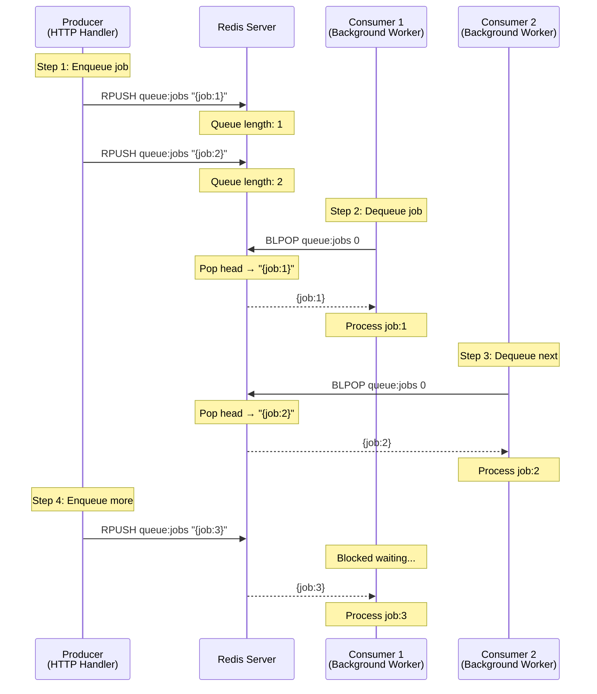
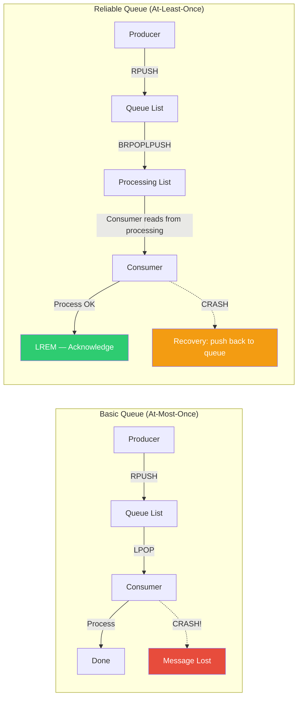
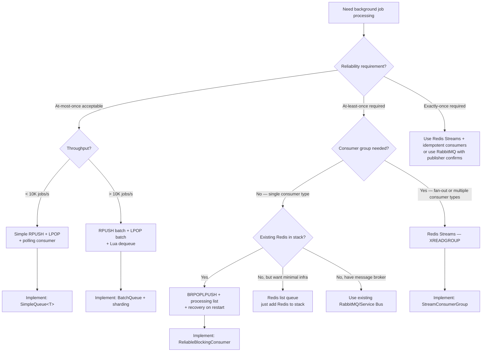

## 1. Navigation — Context & Prerequisites

**Domain:** [[8 — Databases]] > **Group:** Redis
**Previous:** [[8.971 — Redis — Lists — BLPOP, BRPOP — Blocking Pop]] | **Next:** [[8.973 — Redis — Lists — Stack Pattern]]

### Prerequisites

- [[8.969 — Redis — Lists — LPUSH, RPUSH, LPOP, RPOP]] — provides the atomic push and pop primitives that make the queue pattern possible. The FIFO queue uses RPUSH (append to tail) and LPOP (remove from head) — understanding which end is which is the foundation of the pattern.
- [[8.971 — Redis — Lists — BLPOP, BRPOP — Blocking Pop]] — extends the basic queue with blocking semantics. Instead of polling with LPOP, the consumer blocks until a job arrives, eliminating busy-wait overhead. Most production queue implementations use BLPOP or BRPOPLPUSH.

### Where This Fits

The Redis list queue pattern is the simplest and most widely deployed pattern for background job processing in .NET applications. A backend engineer uses it to decouple request handling from asynchronous work — an HTTP endpoint RPUSHes a job description and returns immediately, while a background worker LPOPs jobs and processes them. When this pattern is unknown, engineers either queue jobs to a relational database table (creating lock contention on the queue table and I/O amplification from polling queries like `SELECT TOP 1 ... ORDER BY CreatedAt WITH (UPDLOCK, READPAST)`) or use a dedicated message broker (RabbitMQ, Azure Service Bus) for workloads that Redis can handle with a fraction of the operational complexity. The interview signal is the "how do you schedule background work" question — the candidate who can describe the RPUSH + LPOP (or BLPOP) pattern, explain when it breaks (at-most-once delivery, worker crashes), and when to upgrade to Redis Streams is demonstrating production Redis experience.

---

## 2. Core Mental Model — Overview & Classification

A Redis list as a FIFO queue: the producer calls RPUSH to append a serialized job object to the tail of the list. The consumer calls LPOP to remove and return the job from the head. Because RPUSH appends at the tail and LPOP removes from the head, the oldest element in the list is always processed first — first-in, first-out. The invariant: every RPUSH increases the list length by 1; every LPOP decreases it by 1. When the queue is empty, the list key is automatically deleted by Redis (lazy deletion when the last element is popped).

The mental model is a physical queue — people join at the back (RPUSH) and are served from the front (LPOP). Redis's single-threaded execution ensures that concurrent producers and consumers never see a corrupted queue state: RPUSH and LPOP are atomic operations that execute sequentially on the event loop. However, the basic RPUSH + LPOP pattern provides at-most-once delivery — if the consumer crashes between LPOP and job processing, the job is lost.

### Classification

**For Redis usage patterns:** The list queue is the simplest competing-consumer pattern in Redis. It is a "brokerless" queue where the Redis server acts as both storage and coordination point. The pattern competes with Redis Streams (which add consumer groups, acknowledgment, and message persistence) and external message brokers (RabbitMQ, Azure Service Bus, Amazon SQS). The tradeoff is simplicity vs reliability: the list queue is ~30 lines of code, while Streams require understanding consumer groups, pending entries, and claim semantics.





### Key Properties

| Property | Value | Notes |
|---|---|---|
| FIFO guarantee | Yes — RPUSH + LPOP | Oldest element always at head (LPOP end), newest at tail (RPUSH end) |
| At-most-once | Default — LPOP removes before processing | Consumer crash = message loss |
| At-least-once | Via BRPOPLPUSH | Atomic pop from queue + push to processing list |
| Producer throughput | ~50K RPUSH/sec | Single Redis instance; scales with pipelining |
| Consumer throughput | ~50K LPOP/sec | Single Redis instance; scales with multiple consumers |
| Competing consumers | Yes — each element delivered to one consumer | BLPOP wakes oldest waiter only |
| Fan-out | No — each element consumed once | Use Pub/Sub or Streams for broadcast |
| Message ordering | Strict FIFO | Order preserved; cannot reorder or skip |
| Message persistence | Memory + optional RDB/AOF | Depends on Redis persistence configuration |
| Blocking consumer | BLPOP / BRPOPLPUSH | Zero CPU while waiting |
| .NET (SE.Redis) | `ListRightPushAsync`, `ListLeftPopAsync`, `ExecuteAsync("BRPOPLPUSH", ...)` | All methods are async, use multiplexer pool |

---

## 3. Deep Mechanics — How the Queue Pattern Works

### Step-by-Step Execution of Basic Queue (RPUSH + LPOP)

**Producer path — RPUSH:**

**Step 1 — Serialize:** The .NET application serializes the job object to JSON (or another format). For a typical job: `{ "Id": "guid", "Type": "send-email", "Payload": { "To": "user@example.com", "Template": "welcome" }, "CreatedAt": "2026-06-27T10:00:00Z" }`.

**Step 2 — RPUSH:** The application calls `db.ListRightPushAsync("queue:jobs", serializedJob)`. SE.Redis sends the RPUSH command via the multiplexer. Redis appends the element to the tail of the list, increments the length counter, and returns the new length.

**Step 3 — Producer continues:** The producer returns the HTTP response immediately. The job is in the queue awaiting consumption.

**Consumer path — LPOP:**

**Step 4 — LPOP:** The consumer calls `db.ListLeftPopAsync("queue:jobs")`. If the list has elements, Redis removes the head element and returns it. If the list is empty, Redis returns nil.

**Step 5 — Deserialize:** The consumer checks `result.IsNull`. If not null, deserializes the JSON.

**Step 6 — Process:** The consumer executes the job logic (send email, generate report, etc.).

**Step 7 — Completion:** The job is done. The consumer loops back to step 4 for the next job.

### Reliability Mechanics — BRPOPLPUSH

The basic RPUSH + LPOP loses messages when the consumer crashes between LPOP (step 4) and process completion (step 6). BRPOPLPUSH solves this by atomically popping from the source list and pushing to a destination list in a single Redis command.

**Consumer path — BRPOPLPUSH:**

**Step 1 — BRPOPLPUSH:** The consumer calls `db.ExecuteAsync("BRPOPLPUSH", "queue:jobs", "queue:processing", 30)`.

**Step 2 — Redis execution:** Redis atomically: (a) pops the tail element from `queue:jobs` (RPOP, not LPOP — BRPOPLPUSH pops from the right), and (b) pushes it to the head of `queue:processing`. Both operations execute in the same event loop tick — no other command can interleave.

**Step 3 — Process:** The consumer processes the job. If successful, it calls `db.ListRemoveAsync("queue:processing", jobValue, count: 1)` — this acknowledges the job by removing it from the processing list.

**Step 4 — Crash recovery:** If the consumer crashes after BRPOPLPUSH but before acknowledgment, the job remains in `queue:processing`. On restart, the recovery routine iterates `queue:processing` and RPUSHes each item back to `queue:jobs`, then clears the processing list.

### Redis CLI — Visibility

```bash
# --- Producer Terminal ---

# Enqueue jobs
127.0.0.1:6379> RPUSH queue:jobs '{"id":"job-1","type":"email","to":"alice@example.com"}'
(integer) 1
127.0.0.1:6379> RPUSH queue:jobs '{"id":"job-2","type":"sms","to":"+1234567890"}'
(integer) 2
127.0.0.1:6379> RPUSH queue:jobs '{"id":"job-3","type":"report","to":"bob@example.com"}'
(integer) 3

# Check queue depth
127.0.0.1:6379> LLEN queue:jobs
(integer) 3

# --- Consumer Terminal ---

# Non-blocking dequeue
127.0.0.1:6379> LPOP queue:jobs
"{\"id\":\"job-1\",\"type\":\"email\",\"to\":\"alice@example.com\"}"

127.0.0.1:6379> LPOP queue:jobs
"{\"id\":\"job-2\",\"type\":\"sms\",\"to\":\"+1234567890\"}"

127.0.0.1:6379> LPOP queue:jobs
"{\"id\":\"job-3\",\"type\":\"report\",\"to\":\"bob@example.com\"}"

# Queue is now empty — LPOP returns nil
127.0.0.1:6379> LPOP queue:jobs
(nil)

# Blocking dequeue (BLPOP)
127.0.0.1:6379> BLPOP queue:jobs 30

# In producer terminal, push a job:
127.0.0.1:6379> RPUSH queue:jobs '{"id":"job-4","type":"email","to":"carol@example.com"}'
(integer) 1

# Consumer terminal unblocks:
1) "queue:jobs"
2) "{\"id\":\"job-4\",\"type\":\"email\",\"to\":\"carol@example.com\"}"

# Reliable dequeue with BRPOPLPUSH
127.0.0.1:6379> BRPOPLPUSH queue:jobs queue:processing 30
"{\"id\":\"job-4\",\"type\":\"email\",\"to\":\"carol@example.com\"}"

# Check processing list
127.0.0.1:6379> LRANGE queue:processing 0 -1
1) "{\"id\":\"job-4\",\"type\":\"email\",\"to\":\"carol@example.com\"}"

# Acknowledge (remove from processing)
127.0.0.1:6379> LREM queue:processing 1 '{"id":"job-4","type":"email","to":"carol@example.com"}'
(integer) 1
```

### StackExchange.Redis — Queue Implementation

```csharp
/// <summary>
/// Complete Redis queue implementation with StackExchange.Redis.
/// Supports both basic (at-most-once) and reliable (at-least-once) modes.
/// </summary>
public class RedisJobQueue : IDisposable
{
    private readonly ConnectionMultiplexer _mainMux;
    private readonly ConnectionMultiplexer? _blockingMux;
    private readonly IDatabase _mainDb;
    private readonly IDatabase? _blockingDb;
    private readonly string _queueKey;
    private readonly string _processingKey;
    private readonly ILogger<RedisJobQueue> _logger;

    public RedisJobQueue(
        string connectionString,
        string queueKey,
        string processingKey,
        ILogger<RedisJobQueue> logger)
    {
        _queueKey = queueKey;
        _processingKey = processingKey;
        _logger = logger;

        // Main multiplexer for non-blocking operations (producer)
        _mainMux = ConnectionMultiplexer.Connect(new ConfigurationOptions
        {
            EndPoints = { connectionString },
            AbortOnConnectFail = false,
            ConnectTimeout = 5000,
            SyncTimeout = 3000,
            KeepAlive = 60,
            ClientName = $"Queue-Producer-{Environment.MachineName}"
        });
        _mainDb = _mainMux.GetDatabase();

        // Dedicated multiplexer for blocking operations (consumer)
        // Only created if this instance is used as a consumer
    }

    /// <summary>
    /// Initialize blocking multiplexer for consumer operations.
    /// Call this on the consumer side only.
    /// </summary>
    public void InitializeConsumer()
    {
        if (_blockingMux != null) return;

        var blockingMux = ConnectionMultiplexer.Connect(new ConfigurationOptions
        {
            EndPoints = { _mainMux.Configuration },
            AbortOnConnectFail = false,
            SyncTimeout = int.MaxValue, // Blocking calls can be long
            ConnectTimeout = 5000,
            KeepAlive = 60,
            ClientName = $"Queue-Consumer-{Environment.MachineName}"
        });
        // Use field assignment via reflection or separate constructor
        // For simplicity, this example uses a separate consumer class
    }

    // --- Producer Methods ---

    /// <summary>
    /// Enqueue a job — RPUSH to tail of queue.
    /// </summary>
    public async Task<long> EnqueueAsync(string jobType, string payload)
    {
        var job = new
        {
            Id = Guid.NewGuid().ToString("N"),
            Type = jobType,
            Payload = payload,
            CreatedAt = DateTime.UtcNow,
            Version = 1
        };
        var serialized = JsonSerializer.Serialize(job);

        try
        {
            var length = await _mainDb.ListRightPushAsync(_queueKey, serialized);
            _logger.LogDebug("Enqueued job {JobId} to {Queue}, length={Length}",
                job.Id, _queueKey, length);
            return length;
        }
        catch (RedisConnectionException ex)
        {
            _logger.LogError(ex, "Failed to enqueue job to {Queue}", _queueKey);
            throw new QueueException("Failed to enqueue job", ex);
        }
    }

    /// <summary>
    /// Enqueue multiple jobs in a single batch (pipeline).
    /// </summary>
    public async Task<long> EnqueueBatchAsync(IEnumerable<string> serializedJobs)
    {
        var values = serializedJobs.Select(j => (RedisValue)j).ToArray();
        try
        {
            return await _mainDb.ListRightPushAsync(_queueKey, values);
        }
        catch (RedisConnectionException ex)
        {
            _logger.LogError(ex, "Failed to enqueue batch of {Count}", values.Length);
            throw new QueueException("Failed to enqueue batch", ex);
        }
    }

    // --- Consumer Methods ---

    /// <summary>
    /// Dequeue a job (non-blocking, at-most-once).
    /// Returns null if queue is empty.
    /// </summary>
    public async Task<JobEnvelope?> DequeueAsync()
    {
        try
        {
            var result = await _mainDb.ListLeftPopAsync(_queueKey);
            if (result.IsNull) return null;

            var envelope = JsonSerializer.Deserialize<JobEnvelope>(result.ToString());
            return envelope;
        }
        catch (RedisConnectionException ex)
        {
            _logger.LogError(ex, "Failed to dequeue from {Queue}", _queueKey);
            throw;
        }
    }

    /// <summary>
    /// Dequeue a job (blocking, at-most-once).
    /// Blocks until a job arrives or timeout expires.
    /// </summary>
    public async Task<JobEnvelope?> DequeueBlockingAsync(TimeSpan timeout)
    {
        EnsureBlockingMux();
        try
        {
            var result = await _blockingDb!.ExecuteAsync(
                "BLPOP", _queueKey, (int)timeout.TotalSeconds);

            if (result.IsNull) return null;

            var items = (RedisResult[])result;
            var jobValue = items[1].ToString();
            var envelope = JsonSerializer.Deserialize<JobEnvelope>(jobValue);
            return envelope;
        }
        catch (RedisConnectionException ex)
        {
            _logger.LogError(ex, "Failed BLPOP from {Queue}", _queueKey);
            throw;
        }
    }

    /// <summary>
    /// Dequeue a job reliably (blocking, at-least-once).
    /// Uses BRPOPLPUSH to atomically move to processing list.
    /// </summary>
    public async Task<JobEnvelope?> DequeueReliableAsync(TimeSpan timeout)
    {
        EnsureBlockingMux();
        try
        {
            var result = await _blockingDb!.ExecuteAsync(
                "BRPOPLPUSH", _queueKey, _processingKey, (int)timeout.TotalSeconds);

            if (result.IsNull) return null;

            var jobValue = result.ToString();
            var envelope = JsonSerializer.Deserialize<JobEnvelope>(jobValue);
            envelope!.RawValue = jobValue; // Store raw for acknowledgment
            return envelope;
        }
        catch (RedisConnectionException ex)
        {
            _logger.LogError(ex, "Failed BRPOPLPUSH from {Queue}", _queueKey);
            throw;
        }
    }

    /// <summary>
    /// Acknowledge a job — remove from processing list.
    /// Call after successful processing.
    /// </summary>
    public async Task AcknowledgeAsync(JobEnvelope envelope)
    {
        if (string.IsNullOrEmpty(envelope.RawValue))
            throw new ArgumentException("RawValue is required for acknowledgment");

        try
        {
            await _mainDb.ListRemoveAsync(_processingKey, envelope.RawValue, count: 1);
        }
        catch (RedisConnectionException ex)
        {
            _logger.LogError(ex, "Failed to acknowledge job {JobId}", envelope.Id);
            throw;
        }
    }

    /// <summary>
    /// Recover unacknowledged jobs — push from processing back to queue.
    /// Call on consumer startup.
    /// </summary>
    public async Task<int> RecoverAsync()
    {
        try
        {
            var processingItems = await _mainDb.ListRangeAsync(_processingKey);
            if (processingItems.Length == 0) return 0;

            _logger.LogWarning("Recovering {Count} unacknowledged jobs", processingItems.Length);

            foreach (var item in processingItems)
            {
                await _mainDb.ListRightPushAsync(_queueKey, item.ToString());
            }

            await _mainDb.KeyDeleteAsync(_processingKey);
            return processingItems.Length;
        }
        catch (RedisConnectionException ex)
        {
            _logger.LogError(ex, "Failed to recover jobs");
            throw;
        }
    }

    /// <summary>
    /// Get approximate queue depth (LLEN).
    /// </summary>
    public async Task<long> GetQueueDepthAsync()
    {
        try
        {
            return await _mainDb.ListLengthAsync(_queueKey);
        }
        catch (RedisConnectionException ex)
        {
            _logger.LogError(ex, "Failed to check queue depth");
            throw;
        }
    }

    /// <summary>
    /// Peek at next job without dequeuing (for monitoring).
    /// </summary>
    public async Task<JobEnvelope?> PeekAsync()
    {
        var result = await _mainDb.ListGetByIndexAsync(_queueKey, 0);
        if (result.IsNull) return null;
        return JsonSerializer.Deserialize<JobEnvelope>(result.ToString());
    }

    private void EnsureBlockingMux()
    {
        if (_blockingMux != null) return;
        throw new InvalidOperationException(
            "Consumer not initialized. Call InitializeConsumer() first.");
    }

    public void Dispose()
    {
        _mainMux?.Dispose();
        _blockingMux?.Dispose();
    }
}

/// <summary>
/// Serialization envelope for queue jobs.
/// </summary>
public class JobEnvelope
{
    public string Id { get; set; } = "";
    public string Type { get; set; } = "";
    public string Payload { get; set; } = "";
    public DateTime CreatedAt { get; set; }
    public int Version { get; set; }

    [JsonIgnore]
    public string? RawValue { get; set; } // For acknowledgment
}

/// <summary>
/// Custom exception for queue operations.
/// </summary>
public class QueueException : Exception
{
    public QueueException(string message, Exception inner)
        : base(message, inner) { }
}
```

### StackExchange.Redis — Producer Middleware (ASP.NET Core)

```csharp
/// <summary>
/// Middleware that enqueues background work from HTTP requests.
/// </summary>
public class BackgroundJobMiddleware
{
    private readonly RequestDelegate _next;
    private readonly RedisJobQueue _queue;
    private readonly ILogger<BackgroundJobMiddleware> _logger;

    public BackgroundJobMiddleware(
        RequestDelegate next,
        RedisJobQueue queue,
        ILogger<BackgroundJobMiddleware> logger)
    {
        _next = next;
        _queue = queue;
        _logger = logger;
    }

    public async Task InvokeAsync(HttpContext context)
    {
        // Let the request complete first
        await _next(context);

        // Enqueue background work based on the response
        if (context.Response.StatusCode == 200)
        {
            var path = context.Request.Path;
            if (path.StartsWithSegments("/api/orders"))
            {
                var orderId = context.Request.RouteValues["id"]?.ToString();
                if (orderId != null)
                {
                    await _queue.EnqueueAsync("process-order",
                        JsonSerializer.Serialize(new { OrderId = orderId }));
                }
            }
            else if (path.StartsWithSegments("/api/email"))
            {
                // Read the email request from the response or stored context
                // Enqueue as background job
            }
        }
    }
}

// Program.cs registration
// builder.Services.AddSingleton(new RedisJobQueue(connectionString, "queue:jobs", "queue:processing", logger));
// builder.Services.AddHostedService<QueueConsumerService>();
```

### StackExchange.Redis — Consumer Background Service

```csharp
public class QueueConsumerService : BackgroundService
{
    private readonly RedisJobQueue _queue;
    private readonly ILogger<QueueConsumerService> _logger;

    public QueueConsumerService(RedisJobQueue queue, ILogger<QueueConsumerService> logger)
    {
        _queue = queue;
        _logger = logger;
    }

    protected override async Task ExecuteAsync(CancellationToken stoppingToken)
    {
        _logger.LogInformation("Queue consumer started");

        // Recover any unacknowledged jobs from previous crash
        var recovered = await _queue.RecoverAsync();
        if (recovered > 0)
            _logger.LogWarning("Recovered {Count} jobs from processing list", recovered);

        // Main consumer loop
        while (!stoppingToken.IsCancellationRequested)
        {
            try
            {
                // Use reliable dequeue with 30s timeout
                var job = await _queue.DequeueReliableAsync(TimeSpan.FromSeconds(30));

                if (job == null)
                {
                    // Timeout — loop back and check cancellation
                    continue;
                }

                _logger.LogInformation(
                    "Processing job {JobId}: {Type}", job.Id, job.Type);

                // Execute job based on type
                await DispatchJobAsync(job, stoppingToken);

                // Acknowledge successful processing
                await _queue.AcknowledgeAsync(job);

                _logger.LogInformation("Job {JobId} completed", job.Id);
            }
            catch (OperationCanceledException) when (stoppingToken.IsCancellationRequested)
            {
                break;
            }
            catch (QueueException ex)
            {
                _logger.LogError(ex, "Queue operation failed — retrying in 5s");
                await Task.Delay(5000, stoppingToken);
            }
            catch (Exception ex)
            {
                _logger.LogError(ex, "Unexpected error processing job — continuing");
                await Task.Delay(1000, stoppingToken);
            }
        }

        _logger.LogInformation("Queue consumer stopped");
    }

    private async Task DispatchJobAsync(JobEnvelope job, CancellationToken ct)
    {
        switch (job.Type)
        {
            case "email":
                await SendEmailAsync(job, ct);
                break;
            case "sms":
                await SendSmsAsync(job, ct);
                break;
            case "process-order":
                await ProcessOrderAsync(job, ct);
                break;
            case "generate-report":
                await GenerateReportAsync(job, ct);
                break;
            default:
                _logger.LogWarning("Unknown job type: {Type}", job.Type);
                break;
        }
    }

    private Task SendEmailAsync(JobEnvelope job, CancellationToken ct) => Task.CompletedTask;
    private Task SendSmsAsync(JobEnvelope job, CancellationToken ct) => Task.CompletedTask;
    private Task ProcessOrderAsync(JobEnvelope job, CancellationToken ct) => Task.CompletedTask;
    private Task GenerateReportAsync(JobEnvelope job, CancellationToken ct) => Task.CompletedTask;
}
```

### Execution Plan Analysis — Redis Queue Operation

```
RPUSH queue:jobs "{job payload}"
Command queue (single-threaded):
  1. Lookup key "queue:jobs" → creates list if not exist
  2. quicklistPushTail → append to tail node
  3. Increment length counter
  4. signalKeyAsReady("queue:jobs") → wake any blocked BLPOP clients
  5. Return new length

LPOP queue:jobs (by consumer)
  1. Lookup key "queue:jobs" → exists, is list
  2. quicklistPopHead → remove head element
  3. Decrement length counter
  4. If length == 0: delete key (lazy)
  5. Return element
```

### Cost Visibility — Redis Queue Monitoring

```bash
# Queue depth monitoring
127.0.0.1:6379> LLEN queue:jobs
(integer) 0

# Memory usage of queue
127.0.0.1:6379> MEMORY USAGE queue:jobs
(integer) 1048576

# Monitor command stats for queue operations
127.0.0.1:6379> INFO commandstats
# Commandstats
cmdstat_rpush:calls=1500,usec=12000,usec_per_call=8.00
cmdstat_lpop:calls=1498,usec=10500,usec_per_call=7.01
cmdstat_blpop:calls=2,usec=5000000,usec_per_call=2500000.00

# Slow log — check for slow operations
127.0.0.1:6379> SLOWLOG GET 10
```

```csharp
// StackExchange.Redis — queue health check
public class QueueHealthCheck
{
    private readonly IDatabase _db;
    private readonly ILogger<QueueHealthCheck> _logger;

    public QueueHealthCheck(IDatabase db, ILogger<QueueHealthCheck> logger)
    {
        _db = db;
        _logger = logger;
    }

    public async Task<QueueHealth> CheckHealthAsync(string queueKey)
    {
        var health = new QueueHealth { QueueKey = queueKey };

        try
        {
            health.Depth = await _db.ListLengthAsync(queueKey);
            health.KeyExists = await _db.KeyExistsAsync(queueKey);

            if (health.KeyExists)
            {
                var memoryResult = await _db.ExecuteAsync("MEMORY", "USAGE", queueKey);
                health.MemoryUsageBytes = (long)memoryResult;
            }

            health.IsHealthy = true;
        }
        catch (Exception ex)
        {
            health.IsHealthy = false;
            health.ErrorMessage = ex.Message;
            _logger.LogError(ex, "Queue health check failed for {Queue}", queueKey);
        }

        return health;
    }

    public class QueueHealth
    {
        public string QueueKey { get; set; } = "";
        public bool IsHealthy { get; set; }
        public long Depth { get; set; }
        public bool KeyExists { get; set; }
        public long MemoryUsageBytes { get; set; }
        public string? ErrorMessage { get; set; }
    }
}
```

### Failure Modes

**Consumer crash after LPOP (message loss):** The basic RPUSH + LPOP queue loses messages on consumer crash. The LPOP is destructive — once executed, the message is removed from Redis regardless of whether the consumer processes it. Mitigation: BRPOPLPUSH moves the message to a processing list atomically. On restart, the recovery routine pushes processing items back to the main queue.

**Queue grows unboundedly:** If producers RPUSH faster than consumers LPOP, the queue grows without bound. This consumes Redis memory and eventually hits `maxmemory`. Mitigation: monitor queue depth via LLEN, alert on threshold breaches, add backpressure by having producers check queue depth before enqueuing.

**Duplicate processing in reliable queue:** BRPOPLPUSH ensures at-least-once delivery, but a consumer that crashes after BRPOPLPUSH but before acknowledgment will cause the job to be processed twice (once by the crashed consumer, once by the recovery + another consumer). Mitigation: make job processing idempotent — check a "processed jobs" set before executing, or use a unique job ID that consumers can use for deduplication.

**Blocking multiplexer timeout:** If the SE.Redis `SyncTimeout` is exceeded during a blocking pop (BLPOP with a long timeout), SE.Redis throws `TimeoutException`. Mitigation: set `SyncTimeout = int.MaxValue` on the blocking multiplexer, or use short timeout values (5-30 seconds) and retry loops.

---

## 4. Production Patterns — Implementation & Code

### Pattern 1 — Basic Queue (RPUSH + LPOP) with Polling Consumer

```csharp
/// <summary>
/// Simplest possible queue — at-most-once delivery.
/// Suitable for non-critical work where message loss is acceptable.
/// </summary>
public class SimpleQueue<T>
{
    private readonly IDatabase _db;
    private readonly string _queueKey;

    public SimpleQueue(IDatabase db, string queueKey)
    {
        _db = db;
        _queueKey = queueKey;
    }

    /// <summary>
    /// Enqueue — serialize and RPUSH.
    /// </summary>
    public async Task EnqueueAsync(T item)
    {
        var json = JsonSerializer.Serialize(item);
        await _db.ListRightPushAsync(_queueKey, json);
    }

    /// <summary>
    /// Dequeue — LPOP and deserialize.
    /// Returns default if queue empty.
    /// </summary>
    public async Task<T?> DequeueAsync()
    {
        var result = await _db.ListLeftPopAsync(_queueKey);
        if (result.IsNull) return default;
        return JsonSerializer.Deserialize<T>(result.ToString());
    }

    /// <summary>
    /// Get approximate count.
    /// </summary>
    public async Task<long> CountAsync() =>
        await _db.ListLengthAsync(_queueKey);
}

// Consumer with polling
public class SimplePollingConsumer<T> : BackgroundService
{
    private readonly SimpleQueue<T> _queue;
    private readonly Func<T?, Task> _processor;
    private readonly TimeSpan _pollInterval;
    private readonly ILogger<SimplePollingConsumer<T>> _logger;

    public SimplePollingConsumer(
        SimpleQueue<T> queue,
        Func<T?, Task> processor,
        TimeSpan pollInterval,
        ILogger<SimplePollingConsumer<T>> logger)
    {
        _queue = queue;
        _processor = processor;
        _pollInterval = pollInterval;
        _logger = logger;
    }

    protected override async Task ExecuteAsync(CancellationToken stoppingToken)
    {
        while (!stoppingToken.IsCancellationRequested)
        {
            try
            {
                var item = await _queue.DequeueAsync();
                if (item != null)
                {
                    await _processor(item);
                }
                else
                {
                    await Task.Delay(_pollInterval, stoppingToken);
                }
            }
            catch (OperationCanceledException) { break; }
            catch (Exception ex)
            {
                _logger.LogError(ex, "Consumer error");
                await Task.Delay(1000, stoppingToken);
            }
        }
    }
}
```

### Pattern 2 — Batch Queue (RPUSH Multiple + LPOP Multiple)

For high-throughput scenarios where individual enqueue/dequeue round trips are too expensive:

```csharp
public class BatchQueue
{
    private readonly IDatabase _db;
    private const string QueueKey = "queue:batch";

    public BatchQueue(IDatabase db) => _db = db;

    /// <summary>
    /// Enqueue multiple items in a single RPUSH call.
    /// </summary>
    public async Task<long> EnqueueBatchAsync(IEnumerable<string> items)
    {
        var values = items.Select(i => (RedisValue)i).ToArray();
        return await _db.ListRightPushAsync(QueueKey, values);
    }

    /// <summary>
    /// Dequeue up to count items in a single LPOP call (Redis 6.2+).
    /// </summary>
    public async Task<List<string>> DequeueBatchAsync(int count)
    {
        var results = await _db.ListLeftPopAsync(QueueKey, count);
        return results.Where(r => !r.IsNull).Select(r => r.ToString()).ToList();
    }

    /// <summary>
    /// Dequeue with Lua — works on all Redis versions.
    /// </summary>
    public async Task<List<string>> DequeueBatchLuaAsync(int count)
    {
        var lua = @"
            local results = {}
            for i = 1, ARGV[1] do
                local val = redis.call('LPOP', KEYS[1])
                if val then
                    table.insert(results, val)
                else
                    break
                end
            end
            return results
        ";
        var result = await _db.ScriptEvaluateAsync(lua, new RedisKey[] { QueueKey }, new[] { (RedisValue)count });
        return ((RedisValue[])result).Select(r => r.ToString()).ToList();
    }
}
```

### Pattern 3 — Delayed Queue (RPUSH + TTL + BRPOPLPUSH)

For jobs that should not be processed before a certain time:

```csharp
public class DelayedQueue
{
    private readonly IDatabase _db;
    private const string ReadyQueueKey = "queue:delayed:ready";
    private const string PendingQueueKey = "queue:delayed:pending";

    public DelayedQueue(IDatabase db) => _db = db;

    /// <summary>
    /// Enqueue a job that should not be processed until a future time.
    /// Uses a sorted set for the delay mechanism.
    /// </summary>
    public async Task EnqueueDelayedAsync(string jobJson, TimeSpan delay)
    {
        var executeAt = DateTimeOffset.UtcNow.Add(delay).ToUnixTimeSeconds();
        var jobId = Guid.NewGuid().ToString("N");

        // Store the job payload in a hash (or string)
        await _db.StringSetAsync($"job:payload:{jobId}", jobJson);

        // Add to delayed sorted set with score = execution timestamp
        await _db.SortedSetAddAsync(PendingQueueKey, jobId, executeAt);
    }

    /// <summary>
    /// Move expired delayed jobs to the ready queue.
    /// Call this on a timer (e.g., every second).
    /// </summary>
    public async Task<int> MoveExpiredJobsAsync()
    {
        var now = DateTimeOffset.UtcNow.ToUnixTimeSeconds();

        // Find jobs whose score <= now
        var expiredJobs = await _db.SortedSetRangeByScoreAsync(
            PendingQueueKey, double.NegativeInfinity, now);

        if (expiredJobs.Length == 0) return 0;

        foreach (var jobId in expiredJobs)
        {
            // Get the payload
            var payload = await _db.StringGetAsync($"job:payload:{jobId}");
            if (!payload.IsNull)
            {
                // Move to ready queue
                await _db.ListRightPushAsync(ReadyQueueKey, payload.ToString());
            }

            // Clean up
            await _db.KeyDeleteAsync($"job:payload:{jobId}");
            await _db.SortedSetRemoveAsync(PendingQueueKey, jobId);
        }

        return expiredJobs.Length;
    }

    /// <summary>
    /// Consume from the ready queue (non-blocking).
    /// </summary>
    public async Task<string?> DequeueReadyAsync()
    {
        var result = await _db.ListLeftPopAsync(ReadyQueueKey);
        return result.IsNull ? null : result.ToString();
    }
}

// Background service to move delayed jobs
public class DelayedJobMover : BackgroundService
{
    private readonly DelayedQueue _queue;
    private readonly ILogger<DelayedJobMover> _logger;

    public DelayedJobMover(DelayedQueue queue, ILogger<DelayedJobMover> logger)
    {
        _queue = queue;
        _logger = logger;
    }

    protected override async Task ExecuteAsync(CancellationToken stoppingToken)
    {
        while (!stoppingToken.IsCancellationRequested)
        {
            try
            {
                var moved = await _queue.MoveExpiredJobsAsync();
                if (moved > 0)
                    _logger.LogInformation("Moved {Count} delayed jobs to ready queue", moved);
            }
            catch (Exception ex)
            {
                _logger.LogError(ex, "Failed to move delayed jobs");
            }
            await Task.Delay(1000, stoppingToken);
        }
    }
}
```

### Pattern 4 — Priority Queue with Multiple Lists

```csharp
public class PriorityQueue
{
    private readonly IDatabase _db;
    private readonly ILogger<PriorityQueue> _logger;

    public static readonly string[] LevelKeys = {
        "queue:critical",
        "queue:high",
        "queue:normal",
        "queue:low"
    };

    public PriorityQueue(IDatabase db, ILogger<PriorityQueue> logger)
    {
        _db = db;
        _logger = logger;
    }

    public async Task EnqueueAsync(PriorityLevel level, string jobJson)
    {
        var key = LevelKeys[(int)level];
        await _db.ListRightPushAsync(key, jobJson);
    }

    public async Task<string?> DequeueAsync()
    {
        // Check higher priority queues first
        foreach (var key in LevelKeys)
        {
            var result = await _db.ListLeftPopAsync(key);
            if (!result.IsNull)
                return result.ToString();
        }
        return null; // All queues empty
    }

    /// <summary>
    /// Blocking dequeue with priority.
    /// Uses BLPOP with all priority keys — Redis checks them in order.
    /// </summary>
    public async Task<(string Key, string Value)?> DequeueBlockingAsync(TimeSpan timeout)
    {
        var args = new List<RedisValue>(LevelKeys);
        args.Add((int)timeout.TotalSeconds);

        var result = await _db.ExecuteAsync("BLPOP", args.ToArray());
        if (result.IsNull) return null;

        var items = (RedisResult[])result;
        return (items[0].ToString(), items[1].ToString());
    }

    public enum PriorityLevel
    {
        Critical = 0, // Processed first
        High = 1,
        Normal = 2,
        Low = 3       // Processed last
    }
}
```

### Pattern 5 — Dead Letter Queue with Retry Tracking

```csharp
public class RetryQueue
{
    private readonly IDatabase _db;
    private readonly ILogger<RetryQueue> _logger;
    private const string MainQueueKey = "queue:jobs";
    private const string RetryQueueKey = "queue:retry";
    private const string DeadLetterKey = "queue:deadletter";
    private const int MaxRetries = 3;

    public RetryQueue(IDatabase db, ILogger<RetryQueue> logger)
    {
        _db = db;
        _logger = logger;
    }

    public async Task EnqueueAsync(string jobJson)
    {
        var job = AddRetryField(jobJson, 0);
        await _db.ListRightPushAsync(MainQueueKey, job);
    }

    /// <summary>
    /// Dequeue — if processing fails, re-enqueue or move to dead letter.
    /// </summary>
    public async Task<string?> DequeueAsync()
    {
        return (await _db.ListLeftPopAsync(MainQueueKey))?.ToString();
    }

    /// <summary>
    /// Handle a failed job: increment retry count, re-enqueue or dead-letter.
    /// </summary>
    public async Task HandleFailureAsync(string jobJson, string errorMessage)
    {
        var doc = JsonDocument.Parse(jobJson);
        var retryCount = doc.RootElement.GetProperty("RetryCount").GetInt32();

        if (retryCount < MaxRetries)
        {
            // Re-enqueue with incremented retry count
            var updated = UpdateRetryCount(jobJson, retryCount + 1);
            await _db.ListRightPushAsync(RetryQueueKey, updated);
            _logger.LogWarning("Job retry {RetryCount}/{MaxRetries}: {Error}",
                retryCount + 1, MaxRetries, errorMessage);
        }
        else
        {
            // Move to dead letter queue
            var deadLetter = new
            {
                OriginalJob = jobJson,
                Error = errorMessage,
                FailedAt = DateTime.UtcNow,
                RetryCount = retryCount
            };
            await _db.ListRightPushAsync(DeadLetterKey, JsonSerializer.Serialize(deadLetter));
            _logger.LogError("Job moved to dead letter after {RetryCount} retries: {Error}",
                retryCount, errorMessage);
        }
    }

    /// <summary>
    /// Move retry queue items back to main queue (when retry delay expires).
    /// Call on a timer.
    /// </summary>
    public async Task<int> DrainRetryQueueAsync()
    {
        var count = 0;
        while (true)
        {
            var job = await _db.ListLeftPopAsync(RetryQueueKey);
            if (job.IsNull) break;

            await _db.ListRightPushAsync(MainQueueKey, job.ToString());
            count++;
        }
        return count;
    }

    /// <summary>
    /// Inspect dead letter queue — never discard, always investigate.
    /// </summary>
    public async Task<List<string>> PeekDeadLetterAsync(int count = 10)
    {
        var results = await _db.ListRangeAsync(DeadLetterKey, 0, count - 1);
        return results.Where(r => !r.IsNull).Select(r => r.ToString()).ToList();
    }

    private static string AddRetryField(string jobJson, int retryCount)
    {
        var doc = JsonDocument.Parse(jobJson);
        var buffer = new MemoryStream();
        using var writer = new Utf8JsonWriter(buffer);
        writer.WriteStartObject();
        foreach (var prop in doc.RootElement.EnumerateObject())
            prop.WriteTo(writer);
        writer.WriteNumber("RetryCount", retryCount);
        writer.WriteEndObject();
        writer.Flush();
        return Encoding.UTF8.GetString(buffer.ToArray());
    }

    private static string UpdateRetryCount(string jobJson, int newCount)
    {
        // Same as AddRetryField but overwrites RetryCount
        var doc = JsonDocument.Parse(jobJson);
        var buffer = new MemoryStream();
        using var writer = new Utf8JsonWriter(buffer);
        writer.WriteStartObject();
        foreach (var prop in doc.RootElement.EnumerateObject())
        {
            if (prop.NameEquals("RetryCount"))
                writer.WriteNumber("RetryCount", newCount);
            else
                prop.WriteTo(writer);
        }
        writer.WriteEndObject();
        writer.Flush();
        return Encoding.UTF8.GetString(buffer.ToArray());
    }
}
```

### Configuration and Wiring — Full Queue Setup

```csharp
// Program.cs — Complete queue infrastructure
public static class QueueInfrastructureConfiguration
{
    public static IServiceCollection AddRedisQueueInfrastructure(
        this IServiceCollection services,
        string redisConnectionString)
    {
        // Main multiplexer (non-blocking)
        var mainMux = ConnectionMultiplexer.Connect(new ConfigurationOptions
        {
            EndPoints = { redisConnectionString },
            AbortOnConnectFail = false,
            ConnectTimeout = 5000,
            SyncTimeout = 3000,
            KeepAlive = 60,
            ClientName = $"QueueMain-{Environment.MachineName}"
        });
        services.AddSingleton(mainMux);
        services.AddSingleton(mainMux.GetDatabase(0));

        // Blocking multiplexer (for BLPOP/BRPOPLPUSH consumers)
        var blockingMux = ConnectionMultiplexer.Connect(new ConfigurationOptions
        {
            EndPoints = { redisConnectionString },
            AbortOnConnectFail = false,
            SyncTimeout = int.MaxValue,
            ConnectTimeout = 5000,
            KeepAlive = 60,
            ClientName = $"QueueBlocking-{Environment.MachineName}"
        });
        services.AddSingleton(blockingMux);
        services.AddKeyedSingleton<IDatabase>("blocking", (sp, _) => blockingMux.GetDatabase(0));

        // Register queue services
        services.AddSingleton<QueueHealthCheck>();
        services.AddSingleton<RetryQueue>();
        services.AddSingleton<BatchQueue>();
        services.AddSingleton<PriorityQueue>();
        services.AddSingleton<DelayedQueue>();
        services.AddSingleton<DelayedJobMover>();

        // Register background consumers
        services.AddHostedService<QueueConsumerService>();

        return services;
    }
}
```

---

## 5. Gotchas — Production Pitfalls

### Pitfall 1 — At-Most-Once Delivery Surprise

**Pitfall:** The developer uses RPUSH + LPOP and assumes jobs survive consumer crashes:

```csharp
// ❌ If consumer crashes after LPOP, job is lost
var job = await db.ListLeftPopAsync("queue:jobs");
// CRASH HERE — job is already removed from Redis
await ProcessAsync(job);
```

**Symptom:** Jobs disappear without being processed. Under normal load, the system works fine. Under high load (more consumer threads), the crash rate increases and job loss becomes visible. Customers report unfulfilled orders.

**Fix:** Use BRPOPLPUSH for reliable delivery:

```csharp
// ✅ BRPOPLPUSH — atomic pop + push to processing
var job = await blockingDb.ExecuteAsync("BRPOPLPUSH", "queue:jobs", "queue:processing", 30);
try
{
    await ProcessAsync(job.ToString());
    await db.ListRemoveAsync("queue:processing", job.ToString(), count: 1);
}
catch
{
    // Job stays in processing list — recovery will requeue it
}
```

**Cost of not fixing:** Hard to diagnose — logs show jobs being dequeued but never completed. No stack trace because the crash is at the process level. Requires manual reconciliation of the queue contents against a business audit log.

---

### Pitfall 2 — Producer Faster Than Consumer (Queue Growth)

**Pitfall:** The producer enqueues jobs at 1000/second but the consumer processes at 500/second:

```csharp
// Producer (in HTTP handler)
await db.ListRightPushAsync("queue:jobs", serializedJob);
// Returns immediately — no backpressure
```

**Symptom:** Queue grows by 500 jobs/second. After 1 hour, the queue has 1.8M jobs, consuming ~2GB of Redis memory. Redis hits `maxmemory` and starts evicting keys — possibly evicting the queue itself or other cache data.

**Fix:** Implement producer-side backpressure:

```csharp
public async Task<bool> TryEnqueueWithBackpressureAsync(string jobJson, long maxQueueDepth = 10000)
{
    var depth = await _db.ListLengthAsync("queue:jobs");
    if (depth >= maxQueueDepth)
    {
        _logger.LogWarning("Queue depth {Depth} exceeds limit {Max}. Rejecting job.",
            depth, maxQueueDepth);
        return false; // Return 503 Service Unavailable or retry-after
    }

    await _db.ListRightPushAsync("queue:jobs", jobJson);
    return true;
}
```

**Cost of not fixing:** Redis OOM kills the Redis process. All Redis data is lost (unless AOF + RDB persistence is configured). Cache miss storm on restart. Application downtime.

---

### Pitfall 3 — BRPOPLPUSH Blocking Multiplexer Exhaustion

**Pitfall:** Multiple consumers use the same `ConnectionMultiplexer` for BRPOPLPUSH:

```csharp
// ❌ 10 consumers, each blocking on the same multiplexer
for (int i = 0; i < 10; i++)
{
    Task.Run(async () => {
        while (true)
        {
            var job = await db.ExecuteAsync("BRPOPLPUSH", "queue", "processing", 0);
            // Each BRPOPLPUSH blocks one connection from the pool
        }
    });
}
```

**Symptom:** After 2-3 consumers, the multiplexer's connection pool is exhausted. Non-blocking operations start timing out with `TimeoutException`. The application is effectively disconnected from Redis for non-queue operations.

**Fix:** Use one multiplexer per consumer, or configure a larger connection pool:

```csharp
// ✅ Option 1: One multiplexer per consumer
var consumerConfig = new ConfigurationOptions
{
    EndPoints = { "localhost:6379" },
    SyncTimeout = int.MaxValue,
    ConnectTimeout = 5000,
    KeepAlive = 60,
    ClientName = $"Consumer-{index}",
    ConnectionPool = new ConnectionPoolConfiguration
    {
        // Allow more connections for blocking
        PoolSize = 2,
        MaxPoolSize = 2
    }
};
var consumerMux = ConnectionMultiplexer.Connect(consumerConfig);
var consumerDb = consumerMux.GetDatabase();

// ✅ Option 2: Short timeouts (not infinite) to free connections periodically
var job = await consumerDb.ExecuteAsync("BRPOPLPUSH", "queue", "processing", 30);
// After 30s timeout, the connection is freed
```

**Cost of not fixing:** Complete Redis outage for the application — cache, session, rate limiting all fail. Hard to diagnose because the queue consumers are separate from the main request pipeline.

---

### Pitfall 4 — Job Deserialization Failure

**Pitfall:** The producer serializes a job with one schema, but the consumer expects a different schema:

```csharp
// Producer v1:
await db.ListRightPushAsync("queue", JsonSerializer.Serialize(
    new { UserId = 42, Email = "a@b.com" }));

// Consumer v2 — expects different field names:
var job = JsonSerializer.Deserialize<V2Schema>(raw);
// V2Schema has UserEmail instead of Email → deserializes to null
```

**Symptom:** Silent null fields on the consumer side. The job processes with missing data — email goes to null address. No exception thrown because `JsonSerializer.Deserialize` with missing fields returns null.

**Fix:** Use a versioned schema envelope:

```csharp
public class JobEnvelope
{
    public int SchemaVersion { get; set; } = 1;
    public string Id { get; set; } = "";
    public string Type { get; set; } = "";
    public JsonElement Payload { get; set; }
}

// Producer
var envelope = new JobEnvelope
{
    SchemaVersion = 2,
    Id = Guid.NewGuid().ToString("N"),
    Type = "send-email",
    Payload = JsonSerializer.SerializeToElement(new { To = "a@b.com", Template = "welcome" })
};
await db.ListRightPushAsync("queue", JsonSerializer.Serialize(envelope));

// Consumer
var envelope = JsonSerializer.Deserialize<JobEnvelope>(raw);
if (envelope.SchemaVersion == 1) { /* handle v1 schema */ }
if (envelope.SchemaVersion == 2) { /* handle v2 schema */ }
```

**Cost of not fixing:** Production incident: emails sent to null, reports generated with null data. Data corruption that requires manual cleanup and apology emails to customers.

---

### Pitfall 5 — Single List, Multiple Consumers: Unbalanced Load

**Pitfall:** 10 consumers all BLPOP from the same queue list, but one consumer consistently gets more jobs:

```csharp
// All 10 consumers run identical BLPOP loops
await db.ExecuteAsync("BLPOP", "queue:jobs", 30);
```

**Symptom:** Redis wakes the oldest blocked consumer when a job arrives. If consumer A always blocks first (started earlier, faster processing), consumer A gets the most jobs. Consumers B through J may be starved. Monitoring shows consumer A at 80% CPU, consumer J at 5%.

**Fix:** Multiple lists with consumer-specific assignments, or accept the imbalance (single-list BLPOP is fair over long time horizons — the faster consumer processes more because it returns to BLPOP faster):

```csharp
// ✅ If load balancing is required, use multiple shard queues
public class ShardedQueue
{
    private readonly IDatabase _db;
    private readonly int _shardCount;

    public ShardedQueue(IDatabase db, int shardCount)
    {
        _db = db;
        _shardCount = shardCount;
    }

    public async Task EnqueueAsync(string jobJson)
    {
        // Route to a random shard
        var shard = Random.Shared.Next(_shardCount);
        await _db.ListRightPushAsync($"queue:shard:{shard}", jobJson);
    }

    public async Task ConsumeAsync(int consumerIndex, CancellationToken ct)
    {
        var shardKey = $"queue:shard:{consumerIndex % _shardCount}";
        while (!ct.IsCancellationRequested)
        {
            var result = await _db.ExecuteAsync("BLPOP", shardKey, 30);
            // Process...
        }
    }
}
```

**Cost of not fixing:** Suboptimal resource utilization. In extreme cases, consumer A becomes a bottleneck while consumers B-J are idle. The processing throughput is limited by the single fastest consumer instead of the aggregate.

---

### Pitfall 6 — Queue Monitoring: LLEN Returns 0 for Non-Existent Key

**Pitfall:** The monitoring dashboard uses LLEN to display queue depth and shows 0 when the queue key doesn't exist:

```csharp
// ❌ Returns 0 both when queue is empty AND when queue key was deleted
var depth = await db.ListLengthAsync("queue:jobs");
if (depth == 0) { /* show green — no jobs */ }
```

**Symptom:** The producer has a bug and has not enqueued any jobs for 2 hours. The monitoring dashboard shows depth 0 (green). No alert fires. Customers are not receiving their order confirmation emails.

**Fix:** Use EXISTS + LLEN to distinguish:

```csharp
// ✅ Accurate monitoring
var exists = await db.KeyExistsAsync("queue:jobs");
var depth = exists ? await db.ListLengthAsync("queue:jobs") : 0;

if (!exists)
{
    _logger.LogWarning("Queue key does not exist — no producer activity");
    // Alert: potential producer failure
}
else if (depth == 0)
{
    _logger.LogInformation("Queue is empty but key exists — waiting for jobs");
}
else
{
    _logger.LogInformation("Queue depth: {Depth}", depth);
}
```

**Cost of not fixing:** Silent queue failure. The team doesn't know the producer is down until a customer complains. Two hours of missed jobs = hundreds of failed business processes.

---

## 6. Performance — Benchmarks & Cost

### Benchmark: Queue Throughput by Pattern

```csharp
[MemoryDiagnoser]
[SimpleJob(RuntimeMoniker.Net90)]
public class QueuePatternBenchmark
{
    private ConnectionMultiplexer _mux = null!;
    private IDatabase _db = null!;
    private const string QueueKey = "bench:queue";

    [GlobalSetup]
    public void Setup()
    {
        _mux = ConnectionMultiplexer.Connect(TestConnectionString);
        _db = _mux.GetDatabase();
    }

    // Enqueue patterns
    [Benchmark]
    public async Task<long> Enqueue_Single()
    {
        return await _db.ListRightPushAsync(QueueKey, "single-job-payload");
    }

    [Benchmark]
    public async Task<long> Enqueue_Batch10()
    {
        var values = Enumerable.Range(0, 10).Select(i => (RedisValue)$"job-{i}").ToArray();
        return await _db.ListRightPushAsync(QueueKey, values);
    }

    // Dequeue patterns
    [Benchmark]
    public async Task<RedisValue?> Dequeue_Single()
    {
        return await _db.ListLeftPopAsync(QueueKey);
    }

    [Benchmark]
    public async Task<RedisValue[]> Dequeue_Batch10()
    {
        return await _db.ListLeftPopAsync(QueueKey, 10);
    }

    // Transaction with processing list
    [Benchmark]
    public async Task Dequeue_WithProcessingList()
    {
        // Simulate BRPOPLPUSH and acknowledge
        var job = await _db.ExecuteAsync("RPOPLPUSH", QueueKey, "bench:processing");
        if (!job.IsNull)
        {
            await _db.ListRemoveAsync("bench:processing", job.ToString(), count: 1);
        }
    }

    [GlobalCleanup]
    public void Cleanup()
    {
        _db.KeyDeleteAsync(QueueKey).Wait();
        _db.KeyDeleteAsync("bench:processing").Wait();
        _mux.Dispose();
    }
}
```

**Expected results (Redis 7.x, localhost):**

| Method | Mean | Ops/sec | Allocated |
|---|---|---|---|
| Enqueue Single | ~0.5ms | ~2,000/s | ~200 B |
| Enqueue Batch 10 | ~0.6ms | ~16,667 elements/s | ~400 B |
| Dequeue Single | ~0.4ms | ~2,500/s | ~200 B |
| Dequeue Batch 10 | ~0.5ms | ~20,000 elements/s | ~400 B |
| Dequeue + Processing | ~0.8ms | ~1,250/s | ~500 B |

### Throughput at Scale

| Pattern | 1 Producer, 1 Consumer | 10 Producers, 10 Consumers | Bottleneck |
|---|---|---|---|
| RPUSH + LPOP (single) | ~2,000 jobs/s | ~15,000 jobs/s | Redis single-threaded CPU (~50K ops/s max for simple operations) |
| RPUSH batch 10 + LPOP batch 10 | ~16,000 jobs/s | ~50,000 jobs/s | Network bandwidth, Redis CPU |
| RPUSH + BLPOP | ~2,000 jobs/s | ~15,000 jobs/s | Same as LPOP — BLPOP adds no CPU overhead when blocking |
| BRPOPLPUSH | ~1,200 jobs/s | ~10,000 jobs/s | Two operations per job (pop + push) vs one |
| Lua dequeue + ack | ~3,000 jobs/s | ~20,000 jobs/s | Server-side logic reduces round trips |

### Queue Size Impact on Performance

| Queue Size | LPOP Time | RPUSH Time | Memory per 100K jobs (1KB each) |
|---|---|---|---|
| 0 (empty) | ~0.02ms | ~0.02ms | 0 |
| 1,000 | ~0.02ms | ~0.02ms | ~1 MB |
| 100,000 | ~0.02ms | ~0.02ms | ~100 MB |
| 1,000,000 | ~0.02ms | ~0.02ms | ~1 GB |
| 10,000,000 | ~0.02ms | ~0.02ms | ~10 GB |

Note: LPOP and RPUSH are O(1) regardless of list size — the queue length does NOT affect per-operation performance. The concern is memory: a 10M-element queue consumes ~10GB of Redis memory.

---

## 7. Interview Arsenal — Questions & Answers

### Question Bank

1. How do you implement a FIFO queue using Redis lists? (Definition — RPUSH + LPOP)
2. What is the difference between at-most-once and at-least-once delivery in the queue pattern? (Reliability — LPOP vs BRPOPLPUSH)
3. How does BLPOP improve over polling LPOP for consumers? (Performance — zero CPU while blocked)
4. How do you handle message loss when a consumer crashes? (Recovery — BRPOPLPUSH + processing list + recovery)
5. Compare the Redis list queue to Redis Streams for background job processing. (Comparison — simplicity vs consumer groups)
6. How would you implement a priority queue with Redis lists? (Pattern — multiple lists, checked in priority order)
7. What happens when the queue grows faster than consumers can drain it? (Backpressure — monitor LLEN, apply backpressure to producer)
8. How do you monitor queue health in production? (Monitoring — LLEN, EXISTS, MEMORY USAGE, SLOWLOG)
9. How would you implement a delayed/message queue (jobs that execute at a future time)? (Pattern — sorted set + list combination)
10. What is the maximum throughput of a Redis list queue and how do you scale beyond it? (Scale — ~50K ops/s, sharding across instances)

### Spoken Answers

**Q: How do you implement a FIFO queue using Redis lists and what are the failure modes?**

> **Average answer:** "Use RPUSH to push and LPOP to pop. If the consumer crashes, the message is lost."
>
> **Great answer:** "A FIFO queue uses RPUSH to append at the tail and LPOP to remove from the head — oldest element is always processed first. Both operations are O(1) via the quicklist pointers. The basic RPUSH + LPOP pattern gives at-most-once delivery: if a consumer crashes between LPOP and processing completion, the message is permanently lost because LPOP is destructive — it removes the element from Redis before the consumer starts working. The production failure mode is silent message loss under high consumer churn. To achieve at-least-once delivery, I use BRPOPLPUSH (or RPOPLPUSH for non-blocking) which atomically pops from the source queue and pushes to a processing list in a single command. If the consumer crashes, the message stays in the processing list. On restart, I iterate the processing list and push items back to the main queue — the recovery routine. However, this gives at-least-once delivery with the risk of duplicate processing. The processing must be idempotent — the same job delivered twice produces the same result. For workloads where consumer groups, acknowledgment, and message persistence are critical (payment processing, order fulfillment), I recommend Redis Streams over the list queue pattern. Streams provide XREADGROUP with consumer group acknowledgment and automatic redelivery of unacknowledged messages — without the manual processing-list management."

**Q: Compare the Redis list queue to RabbitMQ / Azure Service Bus — when would you choose each?**

> **Average answer:** "Redis is simpler but RabbitMQ is more reliable. Use Redis for small stuff and RabbitMQ for important stuff."
>
> **Great answer:** "Redis list queues are ideal for internal, single-service job processing where the operational overhead of a dedicated message broker is not justified — sending emails after order placement, generating reports, resizing images. The Redis queue is ~50 lines of code, requires no additional infrastructure beyond the Redis instance you already run for caching, and achieves ~15K jobs/second with batching. However, Redis queues lack: (1) true persistent storage — RDB/AOF snapshot intervals mean a crash between snapshots loses the queue; (2) routing and exchange topologies — RabbitMQ's topic exchanges and bindings enable complex routing without consumer-side logic; (3) dead-letter exchanges with automatic retry policies; (4) per-message TTL and queue length limits; (5) monitoring and management UI (RabbitMQ Management Plugin). I choose Redis when: the team already runs Redis, the queue is internal (no cross-service messaging), throughput is below ~50K jobs/second, and message loss within the RDB/AOF snapshot window is acceptable. I choose RabbitMQ or Azure Service Bus when: messages must survive Redis process crashes, the queue is a cross-service integration point (order service → shipping service → billing service), I need per-message TTL and routing, or the operations team requires a management UI for monitoring queue depth and consumer lag."

### Interview Trigger

The interviewer asks: "How would you design a background job system for a .NET application?" The candidate who jumps to "Hangfire" or "RabbitMQ" is giving a framework answer. The candidate who says "It depends on the requirements — let me walk through the reliability, throughput, and deployment constraints" is demonstrating architectural thinking. The follow-up is: "What happens when the Redis server restarts — are your jobs safe?" The separating factor is whether the candidate knows Redis persistence (RDB and AOF), the difference in durability guarantees, and how to configure `save` directives or `appendfsync` for the desired reliability level.

### Comparison Table — Redis List Queue vs Redis Streams vs RabbitMQ

| | Redis List Queue | Redis Streams | RabbitMQ |
|---|---|---|---|
| What it does | Simple FIFO via RPUSH + LPOP | Append-only log with consumer groups | AMQP message broker with exchanges |
| Delivery guarantee | At-most-once (basic), at-least-once (BRPOPLPUSH) | At-least-once (XACK) | At-least-once (manual ack); exactly-once with publisher confirms |
| Persistence | Memory + RDB/AOF snapshots | Memory + RDB/AOF snapshots | Durable queues — disk-backed |
| Consumer groups | None — manual processing list | Native — XREADGROUP, XCLAIM, XPENDING | Native — competing consumers |
| Dead-letter | Manual via processing list | Manual via XCLAIM + separate stream | Native dead-letter exchanges |
| Throughput | ~50K ops/s (single instance) | ~40K ops/s (single instance) | ~100K msg/s (single node) |
| Monitoring | LLEN, CLIENT LIST, SLOWLOG | XLEN, XINFO, XINFO GROUPS | Management UI, per-queue metrics |
| .NET (SE.Redis) | `ListRightPushAsync`, `ListLeftPopAsync` | `StreamAddAsync`, `StreamReadGroupAsync` | `RabbitMQ.Client` — `BasicPublish`, `BasicConsume` |
| Complexity | Low — 2 commands | Medium — consumer group lifecycle | Medium-High — exchange bindings, routing keys |

---

## 8. Decision Framework — When & Why

### When to Apply the Redis List Queue



### Application Checklist

- [ ] At-most-once delivery is acceptable for the workload (non-critical jobs like analytics, logging, cache warming)
- [ ] OR at-least-once delivery is implemented via BRPOPLPUSH with processing list and crash recovery
- [ ] The queue has a size limit — producer backpressure prevents unbounded growth
- [ ] Consumer idempotency is implemented for at-least-once patterns (same job delivered twice is safe)
- [ ] A dedicated SE.Redis multiplexer is used for blocking operations (BLPOP, BRPOPLPUSH)
- [ ] Queue depth monitoring is in place (LLEN, EXISTS) with alerts on threshold breaches
- [ ] Dead-letter handling is implemented — jobs that exceed retry limits are moved to a dead-letter queue
- [ ] Job serialization uses a versioned envelope (schema evolution over time)
- [ ] Redis persistence is configured for the required durability level (RDB + AOF appendfsync everysec)
- [ ] The queue key has a naming convention that prevents type conflicts (e.g., `queue:*`, not reuse for other data structures)

### Tradeoff Summary

| What You Gain | What You Pay |
|---|---|
| Simple FIFO semantics — RPUSH + LPOP, ~30 lines | At-most-once delivery by default — messages lost on crash |
| BLPOP for zero-CPU waiting | Dedicated multiplexer connection per consumer |
| BRPOPLPUSH for at-least-once | Manual processing list management + recovery logic |
| O(1) push and pop regardless of queue size | Memory bound — queue size limited by Redis maxmemory |
| Single-instance throughput of ~50K ops/s | Cluster requires hash tags for multi-key operations |
| No additional infrastructure beyond Redis | No native consumer groups, no dead-letter exchanges |

### Scale Thresholds

- **Relevant when:** Any application that needs to decouple request handling from background processing — the Redis list queue is the simplest mechanism.
- **Critical when:** Queue exceeds ~100K elements — memory monitoring becomes essential. Redis maxmemory must be configured with a policy (prefer `noeviction` or `allkeys-lru` with monitoring that alerts on eviction).
- **Scale limit 1 — Redis CPU:** Single Redis instance handles ~50K operations/second. For RPUSH + LPOP (2 ops per job), maximum throughput is ~25K jobs/second per instance. Mitigation: shard across multiple queues (e.g., `queue:shard:0..N`).
- **Scale limit 2 — Memory:** Each job occupies ~1KB in memory. A queue of 10M jobs = ~10GB. Mitigation: move processed jobs to cold storage, set TTL on queue data, or use Redis Streams with capped stream size.
- **When to migrate:** When throughput exceeds ~25K jobs/second, or when consumer groups with acknowledgment become necessary, or when message durability beyond RDB/AOF snapshots is required.

---

## 9. Self-Check — Review & Challenges

### Conceptual Questions

1. What two Redis commands implement a basic FIFO queue, and why does this pair give FIFO ordering?
2. What is the delivery guarantee of the basic RPUSH + LPOP queue? What happens to a message when the consumer crashes?
3. How does BRPOPLPUSH improve reliability over LPOP? What is the atomic operation it performs?
4. What is the recovery pattern for BRPOPLPUSH — how do you handle jobs that were popped but never acknowledged?
5. Why does BLPOP require a dedicated ConnectionMultiplexer in SE.Redis?
6. How do you implement a priority queue with Redis lists?
7. What monitoring metrics should you track for a Redis queue in production?
8. Compare the Redis list queue to Redis Streams for reliability and consumer group support.
9. How do you limit queue size and prevent unbounded memory growth?
10. What happens to the queue when Redis restarts — does it survive? (Depends on persistence configuration.)

<details>
<summary>Answers</summary>

1. RPUSH (append to tail) + LPOP (remove from head). RPUSH adds new elements at the tail, so they are enqueued after all existing elements. LPOP removes from the head, so the oldest element (enqueued first) is always dequeued first. This gives FIFO ordering.

2. At-most-once delivery. LPOP removes the message from Redis before the consumer processes it. If the consumer crashes after LPOP but before processing completes, the message is permanently lost — it no longer exists in Redis.

3. BRPOPLPUSH atomically: (a) pops the tail element from the source list, and (b) pushes it to the head of the destination list. Both operations execute in a single Redis command, so no other operation can interleave. This prevents the "pop then crash" window because the message is safely stored in the processing list before the consumer begins processing.

4. On consumer startup, iterate all items in the processing list and push each back to the main queue, then clear the processing list. This recovers messages that were popped but never acknowledged due to a crash. Example:
   ```csharp
   var items = await db.ListRangeAsync("queue:processing");
   foreach (var item in items)
       await db.ListRightPushAsync("queue:jobs", item.ToString());
   await db.KeyDeleteAsync("queue:processing");
   ```

5. BLPOP blocks the Redis connection for the duration of the wait. SE.Redis's multiplexer maintains a limited pool of connections. If BLPOP ties up one connection, the pool is reduced for non-blocking operations. With enough blocking consumers, the pool is exhausted and non-blocking operations timeout.

6. Use multiple lists, one per priority level (e.g., `queue:critical`, `queue:high`, `queue:normal`, `queue:low`). The consumer checks higher-priority queues first: `BLPOP queue:critical queue:high queue:normal queue:low 30`. BLPOP checks keys in order, so elements in `queue:critical` are always consumed before `queue:high`.

7. Key metrics: (a) LLEN — queue depth; (b) EXISTS — whether the queue key exists (producer health); (c) MEMORY USAGE — memory consumed by the queue; (d) blocked_clients (INFO clients) — number of blocking consumers; (e) cmdstat_rpush/lpop/blpop (INFO commandstats) — operation rates; (f) SLOWLOG — slow operations on queue keys.

8. Redis Streams provide consumer groups (XREADGROUP) with automatic acknowledgment (XACK) and pending message management (XPENDING, XCLAIM). Lists require manual processing-list management. Streams also support message IDs for ordering, range queries, and capped stream size. Lists are simpler and faster (O(1) vs O(log N) for stream operations) but lack native consumer group semantics.

9. Implement producer-side backpressure: check LLEN before enqueueing and reject if above threshold. Or use LTRIM on enqueue to cap the list (less common for queues — better to reject at producer than silently discard). Monitor queue depth and alert on threshold breaches. Configure Redis maxmemory with a policy that suits the use case.

10. Depends on persistence configuration. Without persistence (default): all queue data is lost on restart. With RDB snapshots: data is as of the last snapshot (up to 5 minutes old by default). With AOF appendfsync everysec: data is at most 1 second old. For production queues, enable AOF with appendfsync everysec and RDB snapshots. For critical queues, consider Redis Streams with consumer groups for better persistence semantics.

</details>

---

### Query Challenges

**Challenge 1 — Design the Queue Infrastructure**

Design a queue system for an e-commerce application that needs to: (1) process 500 order confirmation emails per minute, (2) ensure no email is lost if the worker crashes, (3) retry failed emails up to 3 times, (4) track emails that fail all retries for manual inspection. Show the Redis keys, the SE.Redis code for enqueue/dequeue/retry, and the monitoring queries.

<details>
<summary>Solution</summary>

**Redis keys:**
- `queue:email` — main job queue
- `queue:email:processing` — processing list (BRPOPLPUSH destination)
- `queue:email:retry` — retry queue (failed jobs)
- `queue:email:deadletter` — permanently failed jobs

**Enqueue:**
```csharp
public async Task EnqueueEmailAsync(string to, string template, object data)
{
    var job = JsonSerializer.Serialize(new
    {
        Id = Guid.NewGuid().ToString("N"),
        Type = "email",
        To = to,
        Template = template,
        Data = data,
        CreatedAt = DateTime.UtcNow,
        RetryCount = 0
    });
    await _db.ListRightPushAsync("queue:email", job);
}
```

**Dequeue (reliable):**
```csharp
public async Task ProcessEmailsAsync(CancellationToken ct)
{
    await RecoverProcessingAsync();
    while (!ct.IsCancellationRequested)
    {
        var job = await _blockingDb.ExecuteAsync(
            "BRPOPLPUSH", "queue:email", "queue:email:processing", 30);
        if (job.IsNull) continue;
        try
        {
            await SendEmailAsync(job.ToString(), ct);
            await _db.ListRemoveAsync("queue:email:processing", job.ToString(), count: 1);
        }
        catch (Exception ex)
        {
            await HandleFailureAsync(job.ToString(), ex.Message);
        }
    }
}

private async Task HandleFailureAsync(string jobJson, string error)
{
    var doc = JsonDocument.Parse(jobJson);
    var retryCount = doc.RootElement.GetProperty("RetryCount").GetInt32();
    await _db.ListRemoveAsync("queue:email:processing", jobJson, count: 1);
    if (retryCount < 3)
    {
        var updated = UpdateRetryCount(jobJson, retryCount + 1);
        await _db.ListRightPushAsync("queue:email:retry", updated);
    }
    else
    {
        await _db.ListRightPushAsync("queue:email:deadletter", JsonSerializer.Serialize(
            new { Job = jobJson, Error = error, FailedAt = DateTime.UtcNow }));
    }
}
```

**Monitoring:**
```bash
# Queue health
LLEN queue:email
LLEN queue:email:processing
LLEN queue:email:retry
LLEN queue:email:deadletter
EXISTS queue:email
MEMORY USAGE queue:email
```

**Throughput:** ~2000 jobs/min easily handled. At 500/min, the bottleneck is the SMTP server, not Redis.

</details>

---

**Challenge 2 — Diagnose Queue Backlog**

Your application has a queue backlog growing at 1000 jobs/hour. The `queue:jobs` list has 50K items. Consumers are processing at 500 jobs/hour. The producer is enqueueing at 1500 jobs/hour. Identify the root cause and propose solutions.

<details>
<summary>Solution</summary>

**Root cause:** Producer rate (1500/hr) exceeds consumer rate (500/hr). The queue grows by 1000 jobs/hour. This is a classic "producer-consumer imbalance."

**Detection:**
```bash
# Check rates
LLEN queue:jobs  # Growing
INFO commandstats  # cmdstat_rpush rate > cmdstat_lpop rate

# Check consumer health
CLIENT LIST  # How many consumers are connected?
SLOWLOG GET 10  # Are consumers slow?
```

**Solutions:**

1. **Scale consumers:** Add more consumer instances (horizontal scaling). If each consumer does 500/hr, 3 consumers = 1500/hr.
2. **Optimize consumer:** Profile `ProcessAsync` — is it I/O bound or CPU bound? Add async I/O, batch database writes.
3. **Producer backpressure:** Have producer check LLEN and delay enqueue if queue exceeds threshold:
```csharp
public async Task<bool> TryEnqueueAsync(string job)
{
    var depth = await _db.ListLengthAsync("queue:jobs");
    if (depth > 100000) return false; // Reject with 503
    await _db.ListRightPushAsync("queue:jobs", job);
    return true;
}
```

4. **Short-term: drain the backlog** by adding temporary consumers (spot instances, Lambda).

**Prevention:** Set up monitoring alerts: alert if LLEN > 10,000 (warning) and > 50,000 (critical). Auto-scale consumers based on queue depth.

</details>

---

**Challenge 3 — Implement Idempotent Consumer**

The system uses BRPOPLPUSH for reliable delivery. A consumer crashes after processing the job but before acknowledging (LREM). The job is delivered to a second consumer. Implement idempotency to ensure the job is processed exactly once.

<details>
<summary>Solution</summary>

```csharp
public class IdempotentJobProcessor
{
    private readonly IDatabase _db;
    private const string ProcessedSetKey = "jobs:processed";

    public IdempotentJobProcessor(IDatabase db) => _db = db;

    public async Task<bool> TryProcessAsync(string jobJson)
    {
        // Extract job ID from JSON
        var doc = JsonDocument.Parse(jobJson);
        var jobId = doc.RootElement.GetProperty("Id").GetString();

        // Check if already processed
        var wasProcessed = await _db.SetAddAsync(ProcessedSetKey, jobId);
        if (!wasProcessed)
        {
            // Already in the set — this is a duplicate delivery
            _logger.LogInformation("Skipping duplicate job {JobId}", jobId);
            return true; // Already done
        }

        try
        {
            await ExecuteJobAsync(doc);
            return true;
        }
        catch
        {
            // Remove from processed set — allow retry
            await _db.SetRemoveAsync(ProcessedSetKey, jobId);
            throw;
        }
    }

    private async Task ExecuteJobAsync(JsonDocument job)
    {
        // Actual job logic
        await Task.CompletedTask;
    }
}
```

**TTL on the processed set** prevents unbounded growth:
```csharp
// Set TTL for auto-cleanup (or use a sorted set with score = timestamp)
await _db.KeyExpireAsync(ProcessedSetKey, TimeSpan.FromDays(7));
```

**Tradeoff:** The processed set grows with each unique job. For 1M jobs/day, the set consumes ~50MB after 7 days (1M × 50 bytes per ID). Use a sorted set with score = timestamp for periodic trimming.

</details>

---

**Challenge 4 — Diagnose Duplicate Processing**

After deploying the BRPOPLPUSH queue pattern with crash recovery, the team notices that approximately 0.1% of jobs are processed twice. The consumer acknowledges (LREM) after successful processing. Crash recovery iterates the processing list on restart. What is causing duplicates?

<details>
<summary>Solution</summary>

**Root cause:** The crash-recovery loop has a race condition. Scenario:
1. Consumer A BRPOPLPUSHes job X from `queue:jobs` to `queue:processing`.
2. Consumer A processes job X successfully.
3. Consumer A calls LREM to acknowledge — but before LREM executes, Consumer A crashes.
4. Job X remains in `queue:processing`.
5. Consumer A restarts, recovery routine runs: iterates `queue:processing`, finds job X, pushes it back to `queue:jobs`.
6. Consumer B (or restarted Consumer A) pops job X from `queue:jobs` — processes it again.

**The window:** Between successful processing and LREM acknowledgment.

**Solutions:**

1. **Make processing idempotent** (recommended — works regardless of the crash scenario):
```csharp
var wasProcessed = await _db.SetAddAsync("processed:jobs", jobId);
if (!wasProcessed) return; // Already done
```

2. **Shorten the acknowledgment window** — but the window always exists. No way to eliminate it with the BRPOPLPUSH + LREM pattern.

3. **Use Redis Streams** instead — XREADGROUP tracks pending entries. If a consumer crashes, the pending entry remains. XCLAIM moves it to another consumer. The processing is still at-least-once, but the pending list gives visibility into what needs redelivery.

**Conclusion:** 0.1% duplicates (1 in 1000) at the throughput level is within the expected at-least-once delivery semantics. Idempotent processing is the correct solution, not eliminating the race.

</details>

---

**Challenge 5 — Design the Dead Letter Queue**

Design a system where jobs that fail after 3 retries are moved to a dead letter queue and the operations team is alerted. Show the Redis data model, the SE.Redis code, and the monitoring dashboard query.

<details>
<summary>Solution</summary>

**Redis data model:**
- `queue:jobs` — main queue
- `queue:processing` — processing list (BRPOPLPUSH destination)
- `queue:deadletter` — sorted set, score = failed timestamp, member = job JSON

**Dead letter enqueue:**
```csharp
public async Task MoveToDeadLetterAsync(string jobJson, string error)
{
    var deadEntry = JsonSerializer.Serialize(new
    {
        Job = jobJson,
        Error = error,
        FailedAt = DateTime.UtcNow,
        FailedCount = 3
    });
    // Add to sorted set with score = Unix timestamp
    await _db.SortedSetAddAsync(
        "queue:deadletter",
        deadEntry,
        DateTimeOffset.UtcNow.ToUnixTimeSeconds());
}
```

**Monitoring dashboard query:**
```bash
# Dead letter count
ZCARD queue:deadletter
# Count since last N hours
ZCOUNT queue:deadletter 1719500000 1719586400
# Recent entries
ZREVRANGE queue:deadletter 0 19
```

**Alerting:**
```csharp
public async Task CheckDeadLetterAsync()
{
    var count = await _db.SortedSetLengthAsync("queue:deadletter");
    if (count > 100)
        await _alertService.SendAsync($"Dead letter queue has {count} items — investigate");
}
```

**Retry from dead letter (manual or scheduled):**
```csharp
public async Task ReplayFromDeadLetterAsync(int count)
{
    var entries = await _db.SortedSetRangeByRankAsync(
        "queue:deadletter", 0, count - 1);

    foreach (var entry in entries)
    {
        var doc = JsonDocument.Parse(entry.ToString());
        var original = doc.RootElement.GetProperty("Job").GetString();
        await _db.ListRightPushAsync("queue:jobs", original);
        await _db.SortedSetRemoveAsync("queue:deadletter", entry);
    }
}
```

</details>
