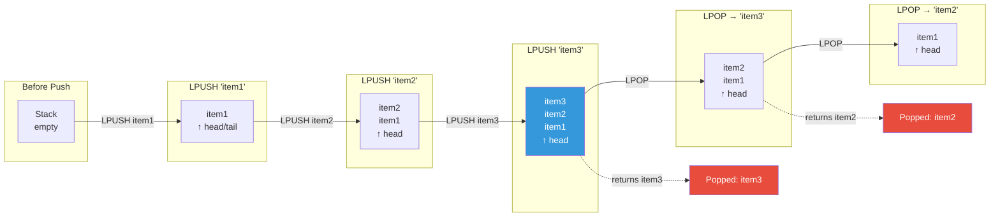
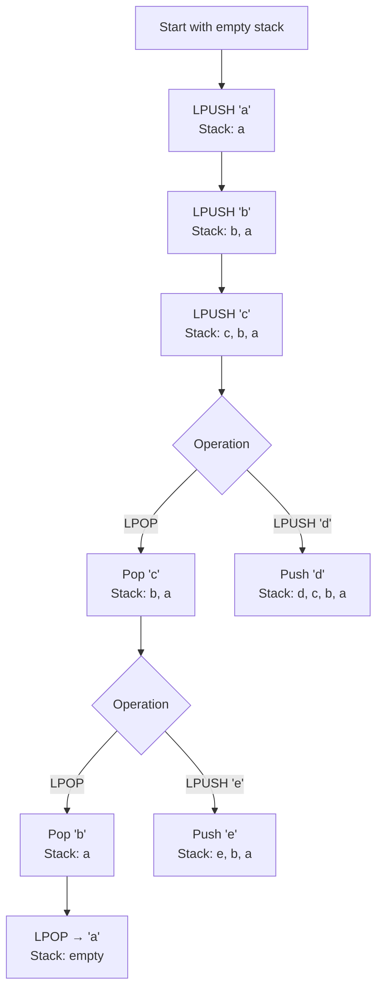
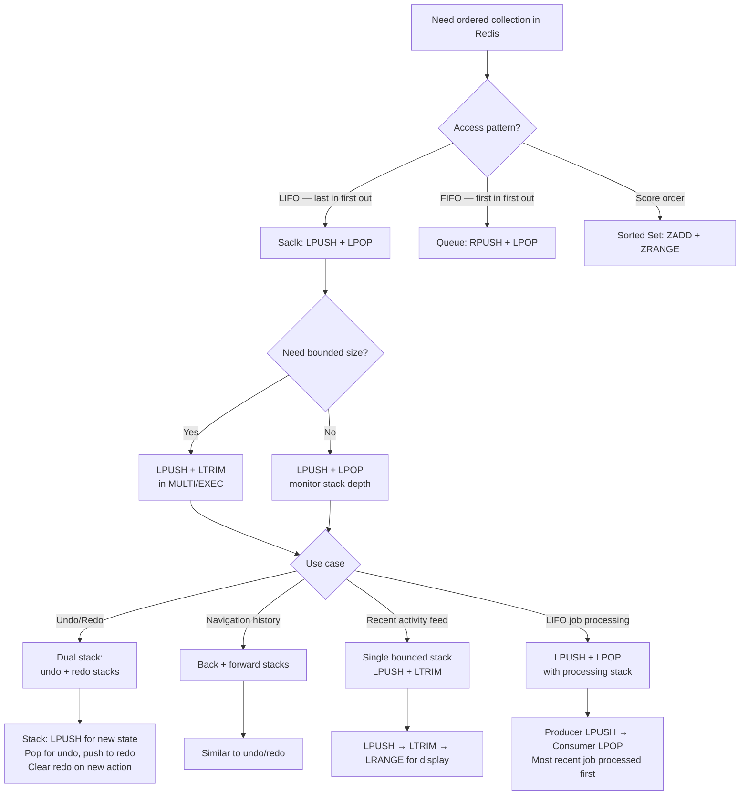

## 1. Navigation — Context & Prerequisites

**Domain:** [[8 — Databases]] > **Group:** Redis
**Previous:** [[8.972 — Redis — Lists — Queue Pattern]] | **Next:** [[8.974 — Redis — Sets — SADD, SREM, SMEMBERS, SCARD]]

### Prerequisites

- [[8.969 — Redis — Lists — LPUSH, RPUSH, LPOP, RPOP]] — provides the atomic push and pop primitives for the stack pattern. The LIFO stack uses LPUSH (push to head) and LPOP (pop from head) — both operations at the same end. Understanding that same-end operations give LIFO while opposite-end operations give FIFO is the conceptual foundation.

### Where This Fits

Redis lists as a stack enable LIFO (last-in-first-out) processing patterns that appear throughout production .NET applications: undo/redo history, navigation breadcrumbs, the most-recently-used list, and the "processing" list in reliable queue patterns (which is itself a stack — most recently pushed items are acknowledged first). A backend engineer reaches for the stack pattern when they need to access the most recent element first — the last undo action, the last page visited, the last notification. When the stack pattern is unknown, engineers implement LIFO behavior by maintaining indexed collections in memory (losing them on application restart) or by using SQL tables with `ORDER BY CreatedAt DESC` (creating I/O and lock contention). The interview signal is the "how do you implement undo/redo in a distributed application" question — the candidate who describes the Redis stack (LPUSH + LPOP) pattern understands the relationship between data structure choice and access pattern.

---

## 2. Core Mental Model — Overview & Classification

A Redis list as a stack: both push and pop operate on the same end — the head. LPUSH adds an element at index 0, shifting all existing elements right by one. LPOP removes and returns the element at index 0, shifting all remaining elements left by one. Because both operations modify the same end, the last element pushed is always the first element popped — last-in-first-out (LIFO).

The mental model is a physical stack of plates: you put a plate on top (push) and you take a plate from the top (pop). You cannot remove a plate from the bottom without first removing all plates above it. Redis implements this with O(1) head operations via the quicklist's head pointer — pushing and popping at the head are always fast, regardless of stack depth.

The key distinction from the queue pattern: a queue uses opposite ends (RPUSH + LPOP for FIFO), while a stack uses the same end (LPUSH + LPOP for LIFO). This single-character difference in the Redis command (R in RPUSH) determines the entire ordering behavior.

### Classification

**For Redis usage patterns:** The stack is the simplest Redis data structure pattern — it uses only 2 commands (LPUSH, LPOP) plus optionally LTRIM for bounded stacks and LRANGE for peeking. It competes with no other Redis structure for LIFO behavior because only lists provide O(1) same-end push/pop. Sorted sets can approximate LIFO with a monotonically increasing score, but at O(log N) cost per operation.





### Key Properties

| Property | Value | Notes |
|---|---|---|
| LIFO guarantee | Yes — LPUSH + LPOP | Same-end operations; most recent push is first pop |
| Time complexity — push | O(1) | quicklistPushHead via head pointer |
| Time complexity — pop | O(1) | quicklistPopHead via head pointer |
| Time complexity — peek (LINDEX 0) | O(1) | Head pointer dereference |
| Time complexity — full peek (LRANGE 0 -1) | O(N) | Returns all elements from head to tail |
| Bounded stack | LPUSH + LTRIM | Keep only the N most recent items |
| .NET (SE.Redis) push | `ListLeftPushAsync` | Async, returns new length |
| .NET (SE.Redis) pop | `ListLeftPopAsync` | Async, returns null if empty |
| .NET (SE.Redis) peek | `ListGetByIndexAsync(key, 0)` or `ListRangeAsync(key, 0, count-1)` | Non-destructive read |
| Memory | O(N) elements | Same as list — ~22 bytes overhead per element |
| Stack depth limit | 2^32 - 1 elements | Practical limit is Redis maxmemory |

---

## 3. Deep Mechanics — How the Stack Pattern Works

### Step-by-Step Execution of Stack Operations

**LPUSH — push to stack:**

**Step 1 — Command dispatch:** The .NET application calls `db.ListLeftPushAsync("stack:history", serializedState)`. SE.Redis serializes the LPUSH command and sends it to Redis via the multiplexer.

**Step 2 — Redis execution:** Redis receives LPUSH `stack:history` `state`. It looks up the key `stack:history`. If the key does not exist, Redis creates a new quicklist. It calls `quicklistPushHead`, which inserts the element at the beginning of the head node's ziplist (or creates a new head node if the current one is full). The list length counter is incremented.

**Step 3 — Response:** Redis returns the new stack depth (list length) as an integer.

**LPOP — pop from stack:**

**Step 4 — Command dispatch:** The consumer calls `db.ListLeftPopAsync("stack:history")`.

**Step 5 — Redis execution:** Redis looks up the key. If found and is a list, calls `quicklistPopHead`, which removes the first element from the head node's ziplist. Returns the element. Decrements the length counter. If the list is now empty, Redis deletes the key (lazy deletion).

**Step 6 — Response:** If the key existed and had elements, Redis returns the Popped element. If the key did not exist or the list was empty, Redis returns nil. SE.Redis maps this to a `RedisValue` with `IsNull == true`.

**LTRIM — bounded stack:**

**Step 7 — Trim after push:** To keep a stack at maximum N elements, call LTRIM after LPUSH: `LTRIM stack:history 0 99` keeps only the 100 most recent elements. LTRIM 0 N-1 keeps the first N elements (indices 0 to N-1), which are the most recently pushed because LPUSH inserts at 0.

### Redis CLI — Visibility

```bash
# Create a stack (push items to head)
127.0.0.1:6379> LPUSH stack:history "/page/home"
(integer) 1
127.0.0.1:6379> LPUSH stack:history "/page/products"
(integer) 2
127.0.0.1:6379> LPUSH stack:history "/page/product/42"
(integer) 3
127.0.0.1:6379> LPUSH stack:history "/page/cart"
(integer) 4

# Peek at the top (most recent) without popping
127.0.0.1:6379> LINDEX stack:history 0
"/page/cart"

# Peek at top 2 items
127.0.0.1:6379> LRANGE stack:history 0 1
1) "/page/cart"
2) "/page/product/42"

# Pop from stack (LIFO)
127.0.0.1:6379> LPOP stack:history
"/page/cart"

127.0.0.1:6379> LPOP stack:history
"/page/product/42"

127.0.0.1:6379> LRANGE stack:history 0 -1
1) "/page/products"
2) "/page/home"

127.0.0.1:6379> LPOP stack:history
"/page/products"

127.0.0.1:6379> LPOP stack:history
"/page/home"

127.0.0.1:6379> LPOP stack:history
(nil)    # Stack is empty

# Bounded stack: LPUSH then LTRIM to keep 3 most recent
127.0.0.1:6379> LPUSH stack:bounded "item1"
(integer) 1
127.0.0.1:6379> LPUSH stack:bounded "item2"
(integer) 2
127.0.0.1:6379> LPUSH stack:bounded "item3"
(integer) 3
127.0.0.1:6379> LPUSH stack:bounded "item4"
(integer) 4
127.0.0.1:6379> LTRIM stack:bounded 0 2
OK
127.0.0.1:6379> LRANGE stack:bounded 0 -1
1) "item4"    # Most recent
2) "item3"
3) "item2"    # Oldest kept
```

### StackExchange.Redis — Stack Implementation

```csharp
/// <summary>
/// Thread-safe Redis-backed stack implementation using LPUSH + LPOP.
/// </summary>
public class RedisStack<T>
{
    private readonly IDatabase _db;
    private readonly string _stackKey;
    private readonly long? _maxSize;
    private readonly ILogger<RedisStack<T>> _logger;

    public RedisStack(
        IDatabase db,
        string stackKey,
        long? maxSize = null,
        ILogger<RedisStack<T>>? logger = null)
    {
        _db = db;
        _stackKey = stackKey;
        _maxSize = maxSize;
        _logger = logger ?? NullLogger<RedisStack<T>>.Instance;
    }

    /// <summary>
    /// Push an item onto the stack (LPUSH at head).
    /// Returns the new stack depth.
    /// Optionally trims to max size.
    /// </summary>
    public async Task<long> PushAsync(T item)
    {
        var serialized = Serialize(item);
        long depth;

        if (_maxSize.HasValue)
        {
            // Use MULTI/EXEC to atomically push and trim
            var tran = _db.CreateTransaction();
            var pushTask = tran.ListLeftPushAsync(_stackKey, serialized);
            var trimTask = tran.ListTrimAsync(_stackKey, 0, _maxSize.Value - 1);
            var committed = await tran.ExecuteAsync();

            if (!committed)
            {
                // Transaction failed — fall back to sequential
                depth = await _db.ListLeftPushAsync(_stackKey, serialized);
                await _db.ListTrimAsync(_stackKey, 0, _maxSize.Value - 1);
            }
            else
            {
                depth = await pushTask;
            }
        }
        else
        {
            depth = await _db.ListLeftPushAsync(_stackKey, serialized);
        }

        _logger.LogDebug("Pushed to stack {Key}, depth={Depth}", _stackKey, depth);
        return depth;
    }

    /// <summary>
    /// Pop the top item from the stack (LPOP from head).
    /// Returns default if stack is empty.
    /// </summary>
    public async Task<T?> PopAsync()
    {
        try
        {
            var result = await _db.ListLeftPopAsync(_stackKey);
            if (result.IsNull)
            {
                _logger.LogDebug("Stack {Key} is empty", _stackKey);
                return default;
            }

            var item = Deserialize(result.ToString());
            _logger.LogDebug("Popped from stack {Key}", _stackKey);
            return item;
        }
        catch (RedisConnectionException ex)
        {
            _logger.LogError(ex, "Failed to pop from stack {Key}", _stackKey);
            throw new RedisOperationException($"Stack pop failed for {_stackKey}", ex);
        }
    }

    /// <summary>
    /// Peek at the top item without removing it.
    /// Returns default if stack is empty.
    /// </summary>
    public async Task<T?> PeekAsync()
    {
        try
        {
            var result = await _db.ListGetByIndexAsync(_stackKey, 0);
            if (result.IsNull) return default;
            return Deserialize(result.ToString());
        }
        catch (RedisConnectionException ex)
        {
            _logger.LogError(ex, "Failed to peek at stack {Key}", _stackKey);
            throw;
        }
    }

    /// <summary>
    /// Peek at top N items without popping.
    /// Returns in order: [most recent, ..., Nth most recent].
    /// </summary>
    public async Task<List<T>> PeekMultipleAsync(int count)
    {
        var results = await _db.ListRangeAsync(_stackKey, 0, count - 1);
        return results
            .Where(r => !r.IsNull)
            .Select(r => Deserialize(r.ToString()))
            .ToList();
    }

    /// <summary>
    /// Get the current stack depth.
    /// </summary>
    public async Task<long> CountAsync()
    {
        return await _db.ListLengthAsync(_stackKey);
    }

    /// <summary>
    /// Clear the entire stack.
    /// </summary>
    public async Task ClearAsync()
    {
        await _db.KeyDeleteAsync(_stackKey);
        _logger.LogInformation("Cleared stack {Key}", _stackKey);
    }

    /// <summary>
    /// Pop all items from the stack (drain).
    /// Returns items in LIFO order.
    /// </summary>
    public async Task<List<T>> DrainAsync()
    {
        var items = new List<T>();
        while (true)
        {
            var item = await PopAsync();
            if (item == null) break;
            items.Add(item);
        }
        return items;
    }

    /// <summary>
    /// Pop all items using Lua script (single round trip).
    /// </summary>
    public async Task<List<T>> DrainLuaAsync()
    {
        var lua = @"
            local results = {}
            while true do
                local val = redis.call('LPOP', KEYS[1])
                if val then
                    table.insert(results, val)
                else
                    break
                end
            end
            return results
        ";
        var result = await _db.ScriptEvaluateAsync(lua, new RedisKey[] { _stackKey });
        return ((RedisValue[])result).Select(r => Deserialize(r.ToString())).ToList();
    }

    private RedisValue Serialize(T item)
    {
        var bytes = JsonSerializer.SerializeToUtf8Bytes(item);
        return (RedisValue)bytes;
    }

    private T Deserialize(string value)
    {
        return JsonSerializer.Deserialize<T>(value)!;
    }
}
```

### StackExchange.Redis — Undo/Redo Stack System

```csharp
/// <summary>
/// Dual-stack undo/redo system using Redis lists.
/// </summary>
public class UndoRedoStack<T>
{
    private readonly IDatabase _db;
    private readonly string _undoKey;
    private readonly string _redoKey;
    private readonly long _maxUndoHistory;
    private readonly ILogger<UndoRedoStack<T>> _logger;

    public UndoRedoStack(
        IDatabase db,
        string sessionId,
        long maxUndoHistory = 50,
        ILogger<UndoRedoStack<T>>? logger = null)
    {
        _db = db;
        _undoKey = $"undo:{sessionId}";
        _redoKey = $"redo:{sessionId}";
        _maxUndoHistory = maxUndoHistory;
        _logger = logger ?? NullLogger<UndoRedoStack<T>>.Instance;
    }

    /// <summary>
    /// Record a state change — push current state to undo stack.
    /// Clears the redo stack (any new action invalidates redo history).
    /// </summary>
    public async Task RecordActionAsync(T state)
    {
        // Push to undo stack
        var serialized = Serialize(state);

        var tran = _db.CreateTransaction();
        _ = tran.ListLeftPushAsync(_undoKey, serialized);
        _ = tran.ListTrimAsync(_undoKey, 0, _maxUndoHistory - 1);
        _ = tran.KeyDeleteAsync(_redoKey); // Clear redo — new action invalidates redo
        await tran.ExecuteAsync();

        _logger.LogDebug("Recorded undo state for session");
    }

    /// <summary>
    /// Undo: pop from undo stack, push to redo stack.
    /// Returns the state to revert to, or default if nothing to undo.
    /// </summary>
    public async Task<T?> UndoAsync()
    {
        // Pop from undo stack (current state)
        var currentState = await _db.ListLeftPopAsync(_undoKey);
        if (currentState.IsNull)
        {
            _logger.LogDebug("Nothing to undo");
            return default;
        }

        // Peek at the new top of undo stack (state to restore to)
        var restoreState = await _db.ListGetByIndexAsync(_undoKey, 0);

        // Push current state to redo stack
        if (!currentState.IsNull)
        {
            await _db.ListLeftPushAsync(_redoKey, currentState);
            await _db.ListTrimAsync(_redoKey, 0, _maxUndoHistory - 1);
        }

        if (restoreState.IsNull)
        {
            // Undo stack is now empty — no state to restore
            _logger.LogDebug("Undo complete — stack now empty");
            return default;
        }

        _logger.LogDebug("Undo performed — restoring previous state");
        return Deserialize(restoreState.ToString());
    }

    /// <summary>
    /// Redo: pop from redo stack, push back to undo stack.
    /// Returns the state to re-apply.
    /// </summary>
    public async Task<T?> RedoAsync()
    {
        var redoState = await _db.ListLeftPopAsync(_redoKey);
        if (redoState.IsNull)
        {
            _logger.LogDebug("Nothing to redo");
            return default;
        }

        // Push back to undo stack
        await _db.ListLeftPushAsync(_undoKey, redoState);
        await _db.ListTrimAsync(_undoKey, 0, _maxUndoHistory - 1);

        _logger.LogDebug("Redo performed");
        return Deserialize(redoState.ToString());
    }

    /// <summary>
    /// Check if undo is available.
    /// </summary>
    public async Task<bool> CanUndoAsync()
    {
        var length = await _db.ListLengthAsync(_undoKey);
        return length > 0;
    }

    /// <summary>
    /// Check if redo is available.
    /// </summary>
    public async Task<bool> CanRedoAsync()
    {
        var length = await _db.ListLengthAsync(_redoKey);
        return length > 0;
    }

    /// <summary>
    /// Get undo history preview (most recent first).
    /// </summary>
    public async Task<List<T>> PeekUndoHistoryAsync(int count = 10)
    {
        var results = await _db.ListRangeAsync(_undoKey, 0, count - 1);
        return results.Where(r => !r.IsNull)
            .Select(r => Deserialize(r.ToString()))
            .ToList();
    }

    private RedisValue Serialize(T item)
    {
        var bytes = JsonSerializer.SerializeToUtf8Bytes(item);
        return (RedisValue)bytes;
    }

    private T Deserialize(string value)
    {
        return JsonSerializer.Deserialize<T>(value)!;
    }
}
```

### Execution Plan Analysis — Redis Stack

```
Stack with 4 elements: [d, c, b, a] where d is top (index 0)

LPUSH stack "e"
  quicklistPushHead → insert 'e' at position 0
  List: [e, d, c, b, a] (length 5)
  O(1) — head pointer swap

LPOP stack
  quicklistPopHead → remove and return 'e'
  List: [d, c, b, a] (length 4)
  O(1) — head pointer swap

LINDEX stack 0
  Return head element 'd' without removing
  O(1) — head pointer dereference

LPUSH + LTRIM (bounded stack)
  LPUSH 'f' → [f, d, c, b, a] (length 5)
  LTRIM 0 3 → keep indices [0,1,2,3] → [f, d, c, b]
  O(1) for LPUSH + O(N) for LTRIM removal of tail elements
```

### Cost Visibility — Redis Monitoring

```bash
# Stack depth
127.0.0.1:6379> LLEN stack:history
(integer) 42

# Memory usage of stack
127.0.0.1:6379> MEMORY USAGE stack:history
(integer) 10485

# Monitor stack operations
127.0.0.1:6379> INFO commandstats
# Commandstats
cmdstat_lpush:calls=500,usec=4000,usec_per_call=8.00
cmdstat_lpop:calls=300,usec=2400,usec_per_call=8.00
cmdstat_ltrim:calls=150,usec=3000,usec_per_call=20.00
```

```csharp
// StackExchange.Redis — stack monitoring
public class StackMonitor
{
    private readonly IDatabase _db;

    public StackMonitor(IDatabase db) => _db = db;

    public async Task<StackMetrics> GetMetricsAsync(string stackKey)
    {
        var exists = await _db.KeyExistsAsync(stackKey);
        if (!exists) return new StackMetrics { KeyExists = false };

        var length = await _db.ListLengthAsync(stackKey);
        var memResult = await _db.ExecuteAsync("MEMORY", "USAGE", stackKey);
        var topItem = await _db.ListGetByIndexAsync(stackKey, 0);

        return new StackMetrics
        {
            KeyExists = true,
            Depth = length,
            MemoryUsageBytes = (long)memResult,
            TopItemPreview = topItem.IsNull ? null : Truncate(topItem.ToString(), 50)
        };
    }

    private static string Truncate(string s, int max) =>
        s.Length <= max ? s : s[..max] + "...";

    public class StackMetrics
    {
        public bool KeyExists { get; set; }
        public long Depth { get; set; }
        public long MemoryUsageBytes { get; set; }
        public string? TopItemPreview { get; set; }
        public bool IsEmpty => !KeyExists || Depth == 0;
    }
}
```

### Failure Modes

**Empty stack pop:** LPOP on an empty list returns nil. The caller must check `IsNull` — attempting to deserialize a null `RedisValue` causes `NullReferenceException` or silent empty string.

**Unbounded stack growth:** Without LTRIM, a stack grows indefinitely. A user who performs 1M undo-able actions creates a 1M-element list. Mitigation: always push with LTRIM in a transaction (`MULTI LPUSH ... LTRIM 0 N-1 EXEC`).

**Stack vs queue confusion:** Using RPUSH (tail) instead of LPUSH (head) for push but LPOP (head) for pop gives FIFO behavior, not LIFO. If a consumer expects LIFO but the producer used RPUSH, items come out in FIFO order. Mitigation: document the pattern clearly — "stack = LPUSH + LPOP (same end)."

**Concurrent stack access:** Two consumers calling LPOP on the same stack get different elements — each LPOP is atomic, so they cannot get the same element. But the order of LPOPs interleaved with LPUSHes may surprise: consumer A pops an element that consumer B pushed after consumer A started its operation. This is correct LIFO behavior in concurrent environments, but may be unexpected if the developer assumes a single-threaded consumer.

---

## 4. Production Patterns — Implementation & Code

### Pattern 1 — Navigation History (Back/Forward)

```csharp
public class NavigationHistory
{
    private readonly IDatabase _db;
    private readonly string _sessionId;
    private const int MaxHistory = 100;

    // Two stacks: back and forward
    private readonly RedisStack<string> _backStack;
    private readonly RedisStack<string> _forwardStack;

    public NavigationHistory(IDatabase db, string sessionId)
    {
        _db = db;
        _sessionId = sessionId;
        _backStack = new RedisStack<string>(db, $"nav:back:{sessionId}", MaxHistory);
        _forwardStack = new RedisStack<string>(db, $"nav:forward:{sessionId}", MaxHistory);
    }

    /// <summary>
    /// Navigate to a new page.
    /// Pushes current page to back stack, resets forward stack.
    /// </summary>
    public async Task NavigateToAsync(string url)
    {
        // Current page becomes the back stack top
        await _backStack.PushAsync(url);
        // Clear forward stack — new navigation invalidates forward history
        await _forwardStack.ClearAsync();
    }

    /// <summary>
    /// Go back: pop from back stack, push current to forward stack.
    /// </summary>
    public async Task<string?> GoBackAsync()
    {
        // Pop the current page from back stack
        var currentPage = await _backStack.PopAsync();
        if (currentPage == null) return null;

        // Push to forward stack (so user can go forward again)
        await _forwardStack.PushAsync(currentPage);

        // Peek at the new top of back stack (page to navigate to)
        return await _backStack.PeekAsync();
    }

    /// <summary>
    /// Go forward: pop from forward stack, push to back stack.
    /// </summary>
    public async Task<string?> GoForwardAsync()
    {
        var forwardPage = await _forwardStack.PopAsync();
        if (forwardPage == null) return null;

        await _backStack.PushAsync(forwardPage);
        return forwardPage;
    }

    public async Task<bool> CanGoBackAsync() => await _backStack.CountAsync() > 1;
    public async Task<bool> CanGoForwardAsync() => await _forwardStack.CountAsync() > 0;
}
```

### Pattern 2 — Undo/Redo for Document Editing

```csharp
/// <summary>
/// Document state history using Redis stacks.
/// Each undo restores the document to its previous state.
/// </summary>
public class DocumentHistory
{
    private readonly IDatabase _db;
    private readonly string _documentId;
    private const int MaxStates = 50;

    // Stacks store serialized document snapshots
    private readonly RedisStack<string> _undoStack;
    private readonly RedisStack<string> _redoStack;

    public DocumentHistory(IDatabase db, string documentId)
    {
        _db = db;
        _documentId = documentId;
        _undoStack = new RedisStack<string>(db, $"doc:undo:{documentId}", MaxStates);
        _redoStack = new RedisStack<string>(db, $"doc:redo:{documentId}", MaxStates);
    }

    /// <summary>
    /// Save a document snapshot for undo.
    /// </summary>
    public async Task SaveSnapshotAsync(string documentJson)
    {
        await _undoStack.PushAsync(documentJson);
        // Any new change invalidates redo history
        await _redoStack.ClearAsync();
    }

    /// <summary>
    /// Undo: restore previous document state.
    /// </summary>
    public async Task<string?> UndoAsync()
    {
        // Pop current state from undo, push to redo
        var currentState = await _undoStack.PopAsync();
        if (currentState == null) return null;

        // Push current state to redo (so user can redo)
        await _redoStack.PushAsync(currentState);

        // The new top of undo stack is the state to restore
        return await _undoStack.PeekAsync();
    }

    /// <summary>
    /// Redo: restore a state that was undone.
    /// </summary>
    public async Task<string?> RedoAsync()
    {
        var redoState = await _redoStack.PopAsync();
        if (redoState == null) return null;

        await _undoStack.PushAsync(redoState);
        return redoState;
    }

    public async Task<int> UndoCountAsync() => (int)await _undoStack.CountAsync() - 1; // Exclude current
    public async Task<int> RedoCountAsync() => (int)await _redoStack.CountAsync();
}
```

### Pattern 3 — Recent Activity Feed (Bounded Stack)

```csharp
public class RecentActivityStack
{
    private readonly IDatabase _db;
    private readonly string _feedKey;
    private const int MaxActivities = 50;

    public RecentActivityStack(IDatabase db, string userId)
    {
        _db = db;
        _feedKey = $"feed:recent:{userId}";
    }

    /// <summary>
    /// Record an activity — push to top of feed, keep only N most recent.
    /// </summary>
    public async Task RecordActivityAsync(string activityJson)
    {
        var tran = _db.CreateTransaction();
        _ = tran.ListLeftPushAsync(_feedKey, activityJson);
        _ = tran.ListTrimAsync(_feedKey, 0, MaxActivities - 1);
        var committed = await tran.ExecuteAsync();

        if (!committed)
        {
            // Fall back to sequential
            await _db.ListLeftPushAsync(_feedKey, activityJson);
            await _db.ListTrimAsync(_feedKey, 0, MaxActivities - 1);
        }
    }

    /// <summary>
    /// Get recent activities (newest first).
    /// </summary>
    public async Task<List<string>> GetRecentActivitiesAsync(int count = 10)
    {
        var results = await _db.ListRangeAsync(_feedKey, 0, count - 1);
        return results.Where(r => !r.IsNull).Select(r => r.ToString()).ToList();
    }

    /// <summary>
    /// Clear activity feed.
    /// </summary>
    public async Task ClearAsync() => await _db.KeyDeleteAsync(_feedKey);
}
```

### Pattern 4 — Processing Stack (for BRPOPLPUSH Acknowledgment)

The processing list in the reliable queue pattern is itself a stack — most recently pushed items are at the top. This is used for LIFO processing acknowledgment:

```csharp
public class ProcessingStack
{
    private readonly IDatabase _db;
    private readonly string _processingKey;

    public ProcessingStack(IDatabase db, string processingKey)
    {
        _db = db;
        _processingKey = processingKey;
    }

    /// <summary>
    /// Add a job to the processing stack (LPUSH).
    /// Note: In BRPOPLPUSH, Redis uses RPOPLPUSH which pushes to head = stack.
    /// </summary>
    public async Task AddAsync(string jobJson)
    {
        await _db.ListLeftPushAsync(_processingKey, jobJson);
    }

    /// <summary>
    /// Acknowledge the most recently processed job (LPOP).
    /// In LIFO acknowledgment, we pop the most recent entry.
    /// </summary>
    public async Task<string?> AcknowledgeMostRecentAsync()
    {
        var result = await _db.ListLeftPopAsync(_processingKey);
        if (result.IsNull) return null;
        return result.ToString();
    }

    /// <summary>
    /// Acknowledge a specific job by value (LREM).
    /// </summary>
    public async Task<bool> AcknowledgeSpecificAsync(string jobJson)
    {
        var removed = await _db.ListRemoveAsync(_processingKey, jobJson, count: 1);
        return removed > 0;
    }

    /// <summary>
    /// Get the count of unacknowledged jobs.
    /// </summary>
    public async Task<long> GetPendingCountAsync()
    {
        return await _db.ListLengthAsync(_processingKey);
    }

    /// <summary>
    /// Recover: move all processing items back to queue (LIFO order).
    /// </summary>
    public async Task<List<string>> DrainAsync(string destinationKey)
    {
        var items = new List<string>();
        while (true)
        {
            var item = await _db.ListLeftPopAsync(_processingKey);
            if (item.IsNull) break;
            items.Add(item.ToString());
            await _db.ListRightPushAsync(destinationKey, item.ToString());
        }
        return items;
    }
}
```

### Pattern 5 — LIFO Job Distribution (Last Job Processed First)

```csharp
/// <summary>
/// For workloads where the most recent job should be processed first.
/// Example: cache invalidation — invalidate the latest entries first.
/// </summary>
public class LifoJobDistributor
{
    private readonly IDatabase _db;
    private const string JobsKey = "lifo:jobs";

    public LifoJobDistributor(IDatabase db) => _db = db;

    /// <summary>
    /// Submit a job — goes to the top of the LIFO stack.
    /// </summary>
    public async Task SubmitJobAsync(string jobJson)
    {
        await _db.ListLeftPushAsync(JobsKey, jobJson);
    }

    /// <summary>
    /// Claim the most recent job.
    /// </summary>
    public async Task<string?> ClaimLatestJobAsync()
    {
        var result = await _db.ListLeftPopAsync(JobsKey);
        return result.IsNull ? null : result.ToString();
    }

    /// <summary>
    /// Claim latest N jobs.
    /// </summary>
    public async Task<List<string>> ClaimLatestJobsAsync(int count)
    {
        var results = await _db.ListLeftPopAsync(JobsKey, count);
        return results.Where(r => !r.IsNull).Select(r => r.ToString()).ToList();
    }

    /// <summary>
    /// Preview the most recent job without claiming it.
    /// </summary>
    public async Task<string?> PeekLatestJobAsync()
    {
        var result = await _db.ListGetByIndexAsync(JobsKey, 0);
        return result.IsNull ? null : result.ToString();
    }

    /// <summary>
    /// Get all pending jobs in LIFO order (most recent first).
    /// </summary>
    public async Task<List<string>> GetAllPendingAsync()
    {
        var results = await _db.ListRangeAsync(JobsKey, 0, -1);
        return results.Where(r => !r.IsNull).Select(r => r.ToString()).ToList();
    }
}
```

### Configuration and Wiring — Stack Pattern Registration

```csharp
// Program.cs — Stack service registration
public static class StackPatternConfiguration
{
    public static IServiceCollection AddRedisStackPatterns(
        this IServiceCollection services,
        string redisConnectionString)
    {
        var mux = ConnectionMultiplexer.Connect(new ConfigurationOptions
        {
            EndPoints = { redisConnectionString },
            AbortOnConnectFail = false,
            ConnectTimeout = 5000,
            SyncTimeout = 3000,
            KeepAlive = 60,
            ClientName = $"StackPattern-{Environment.MachineName}"
        });

        services.AddSingleton(mux);
        services.AddSingleton(mux.GetDatabase());

        // Scoped by session — create per-request
        services.AddScoped(sp =>
        {
            var db = sp.GetRequiredService<IDatabase>();
            var httpContext = sp.GetRequiredService<IHttpContextAccessor>();
            var sessionId = httpContext.HttpContext?.Session?.Id ?? Guid.NewGuid().ToString("N");
            return new NavigationHistory(db, sessionId);
        });

        // Singleton stacks (shared across all users)
        services.AddSingleton<RecentActivityStack>(sp =>
        {
            var db = sp.GetRequiredService<IDatabase>();
            return new RecentActivityStack(db, "global");
        });

        services.AddSingleton<LifoJobDistributor>();

        return services;
    }
}

// ASP.NET Core controller using navigation history
[ApiController]
[Route("api/navigation")]
public class NavigationController : ControllerBase
{
    private readonly NavigationHistory _history;

    public NavigationController(NavigationHistory history) => _history = history;

    [HttpPost("navigate")]
    public async Task<IActionResult> Navigate([FromBody] string url)
    {
        await _history.NavigateToAsync(url);
        return Ok();
    }

    [HttpPost("back")]
    public async Task<ActionResult<string?>> GoBack()
    {
        var page = await _history.GoBackAsync();
        return Ok(page);
    }

    [HttpPost("forward")]
    public async Task<ActionResult<string?>> GoForward()
    {
        var page = await _history.GoForwardAsync();
        return Ok(page);
    }
}
```

---

## 5. Gotchas — Production Pitfalls

### Pitfall 1 — Confusing LPUSH with RPUSH (Stack vs Queue)

**Pitfall:** The developer intends a stack but uses RPUSH (tail) instead of LPUSH (head):

```csharp
// ❌ Intended: stack (LIFO). Actually: queue (FIFO).
// Producer uses RPUSH — appends to tail
await db.ListRightPushAsync("mystack", "first");
await db.ListRightPushAsync("mystack", "second");
await db.ListRightPushAsync("mystack", "third");

// Consumer pops from head — gets oldest element first
var item = await db.ListLeftPopAsync("mystack");
// item = "first" instead of "third" — consumer gets FIFO, not LIFO
```

**Symptom:** The "stack" processes elements in FIFO order. The most recently pushed element is processed last. If the stack is used for undo/redo, "undo" restores the oldest state, not the most recent.

**Fix:** Use LPUSH for push and LPOP for pop — both at the head:

```csharp
// ✅ Stack: LPUSH + LPOP — same end
await db.ListLeftPushAsync("mystack", "first");
await db.ListLeftPushAsync("mystack", "second");
await db.ListLeftPushAsync("mystack", "third");
var item = await db.ListLeftPopAsync("mystack"); // "third" — correct LIFO
```

**Cost of not fixing:** Silent behavioral bug. No exception thrown — the application produces wrong results. An undo system undoes the wrong action, corrupting the document state.

---

### Pitfall 2 — Unbounded Stack Growth Without LTRIM

**Pitfall:** The developer pushes to a stack without any size limit:

```csharp
// ❌ Every user action pushes to undo stack — never trimmed
await db.ListLeftPushAsync($"undo:{sessionId}", snapshotJson);
```

**Symptom:** A user who performs 100,000 actions over a year creates a 100K-element undo stack. This occupies ~100MB of Redis memory. If 1000 users are active, the undo stacks consume 100GB — likely exceeding Redis `maxmemory`. Keys are evicted, including unrelated cache data.

**Fix:** Always push with LTRIM in a transaction:

```csharp
// ✅ Bounded stack: LPUSH + LTRIM atomically
var tran = db.CreateTransaction();
tran.AddCondition(Condition.KeyExists($"undo:{sessionId}"));
_ = tran.ListLeftPushAsync($"undo:{sessionId}", snapshotJson);
_ = tran.ListTrimAsync($"undo:{sessionId}", 0, 49); // Max 50 undo states
await tran.ExecuteAsync();
```

**Cost of not fixing:** Redis memory exhaustion. The undo stacks are the largest keys. When `maxmemory` is hit, eviction removes the most idle keys (often the oldest undo stacks) — users suddenly lose their undo history without warning.

---

### Pitfall 3 — LPOP Returns nil on Empty Stack

**Pitfall:** The developer does not check `IsNull` before using the result:

```csharp
// ❌ No null check
var result = await db.ListLeftPopAsync("stack");
var item = result.ToString(); // If result is null, ToString() returns ""
await ProcessAsync(item); // Processes empty string
```

**Symptom:** The application processes empty strings as if they were valid stack items. Downstream deserialization may fail (empty string is not valid JSON) or produce objects with default values.

**Fix:**

```csharp
// ✅ Always check IsNull
var result = await db.ListLeftPopAsync("stack");
if (result.IsNull)
{
    _logger.LogDebug("Stack is empty");
    return null;
}
var item = result.ToString();
await ProcessAsync(item);
```

**Cost of not fixing:** Phantom items in the processing pipeline. If the stack is part of an undo system, the application "undoes" to an empty state without actually restoring anything. Subsequent "redo" operations push the empty string to the redo stack, propagating the corruption.

---

### Pitfall 4 — LTRIM After LPUSH without Transaction

**Pitfall:** LPUSH and LTRIM are called as separate commands without wrapping in a transaction:

```csharp
// ❌ Race condition: another push can interleave between LPUSH and LTRIM
await db.ListLeftPushAsync("stack", "item1");
// At this point, another thread pushes "item2" — stack is now ["item2", "item1"]
await db.ListTrimAsync("stack", 0, 49); // Keeps 50 items, but may keep wrong 50
```

**Symptom:** The stack occasionally exceeds the max size by 1-2 elements. The race window is small (microseconds), but under high concurrency it becomes statistically significant. Over time, the stack grows beyond the intended bound.

**Fix:** Use MULTI/EXEC transaction or SE.Redis `CreateTransaction`:

```csharp
// ✅ Atomic push + trim
var tran = db.CreateTransaction();
_ = tran.ListLeftPushAsync("stack", "item1");
_ = tran.ListTrimAsync("stack", 0, 49);
await tran.ExecuteAsync();
```

**Cost of not fixing:** Stack gradually exceeds the max size. Over days or weeks, an undo stack grows from 50 to 500 elements — consuming 10x the expected memory. The user doesn't notice until the memory increase affects the entire Redis instance.

---

### Pitfall 5 — Peeking with LPOP + LPUSH Instead of LINDEX

**Pitfall:** The developer peeks at the stack top by popping and pushing back:

```csharp
// ❌ Two round trips, destructive peek
var item = await db.ListLeftPopAsync("stack");
await db.ListLeftPushAsync("stack", item); // Push back — but what if another thread popped between?
```

**Symptom:** If a concurrent consumer pops between your LPOP and LPUSH, you push back an element that another thread already popped. The element appears twice in the stack, or the element you "peeked" is no longer the top.

**Fix:** Use LINDEX for non-destructive peek:

```csharp
// ✅ Non-destructive peek — single round trip, no mutation
var item = await db.ListGetByIndexAsync("stack", 0);
if (!item.IsNull)
{
    // item is the top of stack, stack unchanged
}
```

**Cost of not fixing:** Rare but catastrophic: a stack element is duplicated. The user sees the same undo state twice. If the element represents a destructive action (e.g., "delete document"), undoing twice causes data loss.

---

### Pitfall 6 — Stack Operations Blocking the Event Loop

**Pitfall:** Calling synchronous `.Result` or `.Wait()` on stack operations:

```csharp
// ❌ Synchronous wait blocks the SE.Redis reader loop
var item = db.ListLeftPopAsync("stack").Result;
```

**Symptom:** TimeoutException on all Redis operations. The multiplexer's reader loop is single-threaded — a synchronous wait blocks the reader from processing responses. All pending and future operations timeout.

**Fix:** Always use async/await:

```csharp
// ✅ Always await
var item = await db.ListLeftPopAsync("stack");
```

**Cost of not fixing:** Complete Redis connectivity failure in production. The multiplexer enters a faulted state after repeated timeouts. Application restart required.

---

## 6. Performance — Benchmarks & Cost

### Benchmark: Stack Operations

```csharp
[MemoryDiagnoser]
[SimpleJob(RuntimeMoniker.Net90)]
public class RedisStackBenchmark
{
    private ConnectionMultiplexer _mux = null!;
    private IDatabase _db = null!;
    private const string StackKey = "bench:stack";

    [GlobalSetup]
    public void Setup()
    {
        _mux = ConnectionMultiplexer.Connect(TestConnectionString);
        _db = _mux.GetDatabase();
    }

    [Benchmark]
    public async Task<long> LPUSH_Single()
    {
        return await _db.ListLeftPushAsync(StackKey, "push-item");
    }

    [Benchmark]
    public async Task<RedisValue?> LPOP_Single()
    {
        return await _db.ListLeftPopAsync(StackKey);
    }

    [Benchmark]
    public async Task<RedisValue> LINDEX_Peek()
    {
        return await _db.ListGetByIndexAsync(StackKey, 0);
    }

    [Benchmark]
    public async Task LPUSH_And_LTRIM()
    {
        var tran = _db.CreateTransaction();
        _ = tran.ListLeftPushAsync(StackKey, "push-item");
        _ = tran.ListTrimAsync(StackKey, 0, 49);
        await tran.ExecuteAsync();
    }

    [Benchmark]
    public async Task<RedisValue[]> LRANGE_Top10()
    {
        return await _db.ListRangeAsync(StackKey, 0, 9);
    }

    [Benchmark]
    public async Task<long> LLEN_Count()
    {
        return await _db.ListLengthAsync(StackKey);
    }

    [GlobalCleanup]
    public void Cleanup()
    {
        _db.KeyDeleteAsync(StackKey).Wait();
        _mux.Dispose();
    }
}
```

**Expected results (Redis 7.x, localhost, stack with 100K existing items):**

| Method | Mean | Ops/sec | Allocated |
|---|---|---|---|
| LPUSH Single | ~0.5ms | ~2,000/s | ~200 B |
| LPOP Single | ~0.4ms | ~2,500/s | ~200 B |
| LINDEX Peek (top) | ~0.05ms | ~20,000/s | ~100 B |
| LPUSH + LTRIM (transaction) | ~0.7ms | ~1,400/s | ~400 B |
| LRANGE Top 10 | ~0.3ms | ~3,300/s | ~1 KB |
| LLEN Count | ~0.03ms | ~33,000/s | ~50 B |

### Analysis

- **LPUSH vs LPOP:** Both are O(1) head operations — nearly identical performance.
- **LINDEX 0 (peek):** 10x faster than LPUSH/LPOP because it does not modify the list — only reads from the head pointer. Use peeks for monitoring, not pops.
- **LPUSH + LTRIM transaction:** ~40% slower than LPUSH alone because the transaction adds overhead (MULTI, EXEC, WATCH). For high-throughput scenarios where size limit enforcement is critical, batch trims separately (e.g., trim every 10th push).
- **LLEN:** Always O(1) — the fastest operation. Use for non-critical depth checks.

### Stack vs Queue Performance

| Operation | Stack (LPUSH + LPOP) | Queue (RPUSH + LPOP) |
|---|---|---|
| Push | ~0.5ms (LPUSH) | ~0.5ms (RPUSH) |
| Pop | ~0.4ms (LPOP) | ~0.4ms (LPOP) |
| Peek | ~0.05ms (LINDEX 0) | ~0.05ms (LINDEX 0) |
| Bounded push | ~0.7ms (LPUSH + LTRIM) | ~0.7ms (RPUSH + LTRIM) |

Same performance — the only difference is which end the push targets (head vs tail), both O(1).

### Memory Efficiency of Stacks

| Scenario | Stack Size | Memory | Notes |
|---|---|---|---|
| Undo stack, 50 items, 1KB each | 50 | ~52 KB | Negligible |
| Undo stack, 50 items, 100KB each (document snapshots) | 50 | ~5 MB | Significant for 1000 users |
| Navigation history, 100 URLs | 100 | ~10 KB | Trivial |
| Activity feed, 1000 items, 200B each | 1000 | ~220 KB | Small |
| Unbounded stack, 1M items, 1KB each | 1,000,000 | ~1 GB | Dangerous — monitor! |

---

## 7. Interview Arsenal — Questions & Answers

### Question Bank

1. How do you implement a LIFO stack using Redis lists? (Definition — LPUSH + LPOP)
2. What is the time complexity of push and pop on a Redis stack, and why? (Performance — O(1) via quicklist head pointer)
3. How does the stack pattern differ from the queue pattern in terms of Redis commands? (Comparison — same end vs opposite ends)
4. How do you implement a bounded stack (max N items) in Redis? (Pattern — LPUSH + LTRIM in transaction)
5. How would you implement undo/redo using Redis lists? (Application — dual stack pattern)
6. What happens when you pop from an empty stack in SE.Redis? (Gotcha — returns IsNull RedisValue)
7. How do you peek at the top of the stack without popping? (Method — LINDEX 0)
8. Compare the Redis list stack to a .NET Stack<T> in memory. (Comparison — distributed vs in-process)
9. How do you handle concurrent pops from the same stack? (Concurrency — each pop is atomic, different consumers get different items)
10. What is the memory overhead of storing a stack with 10,000 elements in Redis? (Scale — ~22 bytes + element size per element)

### Spoken Answers

**Q: How do you implement a LIFO stack using Redis lists and when would you use it?**

> **Average answer:** "Use LPUSH to push and LPOP to pop. It's like a .NET Stack<T> but in Redis."
>
> **Great answer:** "A Redis list stack uses LPUSH to insert at the head and LPOP to remove from the head — both operations on the same end of the quicklist, giving O(1) LIFO semantics. The mental model is a physical stack of plates: the last plate you put on top is the first one you take off. I use this pattern for: undo/redo in collaborative editing applications (where state must persist across application restarts and multiple devices), navigation breadcrumbs in web applications (the back button stack), and recent-activity feeds where the most recent item should appear first. The key design decision is bounding: without LTRIM, an unbounded stack grows indefinitely. Every LPUSH should be paired with LTRIM in a MULTI/EXEC transaction to keep the stack within a reasonable size. For undo/redo specifically, I use two stacks: an undo stack and a redo stack. Undo pops from the undo stack and pushes to the redo stack; redo reverses the operation. A new action clears the redo stack (because the user has started a new branch of history). The dual-stack pattern is the standard undo/redo implementation, and Redis makes it trivial to implement across distributed application instances."

**Q: How does the stack pattern differ from the queue pattern, and why is the distinction just one character in the Redis command?**

> **Average answer:** "Stack is LPUSH + LPOP and queue is RPUSH + LPOP. The R is the only difference."
>
> **Great answer:** "The stack pattern uses LPUSH (head) + LPOP (head) — same end, giving LIFO ordering. The queue pattern uses RPUSH (tail) + LPOP (head) — opposite ends, giving FIFO ordering. The single-character difference between RPUSH and LPUSH determines whether the new element goes to the tail (FIFO) or the head (LIFO). This is possible because Redis's quicklist maintains O(1) pointers to both ends — pushing to the head is as cheap as pushing to the tail. The production implication: a developer who accidentally uses RPUSH instead of LPUSH in a stack implementation gets silent FIFO behavior instead of LIFO. There is no compile-time or runtime error — the application produces wrong ordering. This is why I always use key naming conventions that encode the pattern: `stack:undo:session123` (stack), `queue:jobs` (queue). The naming makes the intended access pattern explicit and prevents the single-character bug during code review."

### Interview Trigger

The interviewer asks: "How would you implement undo in a distributed application?" The candidate who reaches for the dual-stack pattern (undo stack + redo stack) immediately is on the right track. The senior candidate discusses bounding (max undo depth), memory considerations (document snapshots vs command pattern), handling concurrent edits (conflict resolution), and the tradeoff between storing full state snapshots (simple, memory-heavy) vs storing inverse operations (complex, memory-efficient). The follow-up is: "How do you handle undo across multiple devices?" The separating factor is whether the candidate knows that Redis-backed stacks enable cross-device undo because the state lives in Redis, not in local memory.

### Comparison Table — Stack vs Queue vs Sorted Set

| | Stack (LPUSH + LPOP) | Queue (RPUSH + LPOP) | Sorted Set (ZADD + ZPOPMIN) |
|---|---|---|---|
| What it does | LIFO ordered collection | FIFO ordered collection | Score-ordered collection |
| Push complex | O(1) — LPUSH | O(1) — RPUSH | O(log N) — ZADD |
| Pop complex | O(1) — LPOP | O(1) — LPOP | O(log N) — ZPOPMIN |
| Peek complex | O(1) — LINDEX 0 | O(1) — LINDEX 0 | O(1) — ZRANGE 0 0 |
| Ordering | Insertion order (reversed) | Insertion order | Score order |
| Bounded | LPUSH + LTRIM | RPUSH + LTRIM | ZREMRANGEBYRANK |
| .NET (SE.Redis) push | `ListLeftPushAsync` | `ListRightPushAsync` | `SortedSetAddAsync` |
| .NET (SE.Redis) pop | `ListLeftPopAsync` | `ListLeftPopAsync` | `SortedSetPopAsync` |
| Primary use case | Undo, navigation, recent activity | Background jobs, task queues | Leaderboards, rate limiting, priority queues |

---

## 8. Decision Framework — When & Why

### When to Apply the Stack Pattern



### Application Checklist

- [ ] The access pattern requires LIFO ordering — most recent element must be processed first
- [ ] LPUSH is used for push (head), not RPUSH (tail) — single-character bug prevention via naming convention
- [ ] Stack size is bounded with LTRIM in a MULTI/EXEC transaction (or checked periodically)
- [ ] Empty-stack pops check `RedisValue.IsNull` before processing
- [ ] Peek operations use LINDEX 0 (not LPOP + LPUSH) — non-destructive, atomic
- [ ] For undo/redo, new actions clear the redo stack (MULTI or separate command)
- [ ] Stack keys use naming that encodes the pattern: `stack:*` not `queue:*` or `list:*`
- [ ] Concurrent access is understood — each pop is atomic, consumers get different elements
- [ ] Memory monitoring is in place — LLEN alerts on stack depth approaching configured max
- [ ] Serialization format is consistent — all pushes use the same schema version

### Tradeoff Summary

| What You Gain | What You Pay |
|---|---|
| O(1) LIFO push and pop — same-end operations via quicklist head pointer | Unbounded growth without LTRIM — memory leak risk |
| Distributed state — stack survives application restart (if Redis persisted) | Network round trip per operation — ~0.5ms vs nanoseconds for in-memory Stack<T> |
| Atomic operations — no race conditions on push/pop | Sequential access only — cannot pop from the middle |
| Simple API — 2 commands (LPUSH, LPOP) plus LINDEX for peek | No native "push multiple" atomic — batch requires MULTI |
| Trivially combinable with other Redis structures (undo + redo dual stack) | No native stack limit — manual LTRIM required |

### Scale Thresholds

- **Relevant when:** Any application that needs a stack distributed across instances — the Redis stack is the simplest option.
- **Critical when:** Stack exceeds ~10K elements — memory starts to matter for undo stacks with full document snapshots.
- **Performance limit:** ~2000 LPUSH or LPOP operations/second per Redis instance. For higher throughput, batch pushes or use pipelining.
- **Memory limit:** Stack of 100K 1KB elements = ~100MB. With `maxmemory` set to 1GB, 10 such stacks exhaust memory. Monitor stack depth and set reasonable bounds.

---

## 9. Self-Check — Review & Challenges

### Conceptual Questions

1. What two Redis commands implement a LIFO stack? What is the key insight about the end of the list they operate on?
2. How does the time complexity of stack push and pop compare to the same operations in a queue? Why are both O(1)?
3. What happens when you LPOP an empty stack in Redis — and how do you handle this in SE.Redis?
4. How do you implement a bounded stack that keeps only the N most recent items?
5. What is the difference between a stack and a queue in terms of the Redis commands used?
6. How do you peek at the top of a stack without removing the element? Name the Redis command and SE.Redis method.
7. How would you implement undo/redo with Redis stacks? What happens to the redo stack when a new action is performed?
8. What is the risk of using RPUSH + LPOP and calling it a "stack"? What ordering do you actually get?
9. How do you atomically push to a stack and trim it in SE.Redis? Why is atomicity important?
10. Compare the Redis list stack to a .NET Stack<T> in terms of performance, scope, and durability.

<details>
<summary>Answers</summary>

1. LPUSH (push to head) and LPOP (pop from head). Both operate on the same end (head), which gives LIFO ordering: the last element pushed is at index 0 and is the first one popped.

2. Stack push = O(1) via quicklistPushHead. Queue push = O(1) via quicklistPushTail. Stack pop = O(1) via quicklistPopHead. Queue pop = O(1) via quicklistPopHead. Both are O(1) because the quicklist maintains direct pointers to both head and tail — pushing or popping at either end is a constant-time pointer operation.

3. LPOP on an empty list returns nil. In SE.Redis, `ListLeftPopAsync` returns a `RedisValue` where `IsNull == true`. You must check `IsNull` before calling `.ToString()` — failing to check results in an empty string, not an exception from SE.Redis (though downstream deserialization may throw).

4. Pair LPUSH with LTRIM in a MULTI/EXEC transaction: `MULTI, LPUSH key item, LTRIM key 0 N-1, EXEC`. This atomically pushes the new element and trims the list to keep only the N most recent (indices 0 to N-1).

5. Stack: LPUSH (same end as pop) + LPOP. Queue: RPUSH (opposite end from pop) + LPOP. The difference is which command is used for push — LPUSH (head) for stack, RPUSH (tail) for queue. Pop is always LPOP (head).

6. Use LINDEX key 0 (Redis CLI) or `ListGetByIndexAsync(key, 0)` (SE.Redis). This returns the head element without removing it. For peeking at multiple items, use LRANGE key 0 N-1.

7. Two stacks: an undo stack and a redo stack. On "record action": LPUSH the new state to the undo stack, LPUSH + LTRIM to bound it, and DELETE the redo stack (clear it). On "undo": LPOP from undo stack (current state), LPUSH it to redo stack, then LINDEX the undo stack (state to restore). On "redo": LPOP from redo stack, LPUSH to undo stack. Clearing the redo stack on new action is critical — otherwise the user can redo into a state that conflicts with the new action.

8. RPUSH + LPOP gives FIFO (queue) behavior, not LIFO (stack). RPUSH appends at the tail, so the first element pushed is at index 0 and is popped first. The "stack" actually processes items in the order they were added, which is the opposite of LIFO.

9. Use `IDatabase.CreateTransaction()`:
   ```csharp
   var tran = db.CreateTransaction();
   _ = tran.ListLeftPushAsync(key, item);
   _ = tran.ListTrimAsync(key, 0, max - 1);
   await tran.ExecuteAsync();
   ```
   Atomicity is important because without a transaction, another concurrent push can interleave between LPUSH and LTRIM, causing the stack to exceed the max size or have items at unexpected indices.

10. .NET Stack<T> is in-process memory — nanoseconds per operation, GC-managed, lost on process restart. Redis stack is a network call (~0.5ms per operation), survives restarts (if Redis is persisted), shared across application instances. Redis is ~10,000x slower per operation but provides distribution and durability that .NET Stack<T> cannot match.

</details>

---

### Query Challenges

**Challenge 1 — Implement Undo/Redo for a Shopping Cart**

Implement an undo/redo system for a shopping cart application. Each action is "add item", "remove item", "update quantity". The system must support undo up to 20 actions and persist across page refreshes. Show the Redis data model, the SE.Redis code for the core operations, and explain how you handle the "clear redo on new action" requirement.

<details>
<summary>Solution</summary>

**Redis keys:**
- `cart:undo:{sessionId}` — stack of cart snapshots
- `cart:redo:{sessionId}` — stack of undone snapshots

**Data model (cart snapshot):**
```csharp
public class CartSnapshot
{
    public List<CartItem> Items { get; set; } = new();
    public string Action { get; set; } = ""; // "add", "remove", "update"
    public DateTime Timestamp { get; set; }
}

public class CartItem
{
    public string ProductId { get; set; } = "";
    public string Name { get; set; } = "";
    public int Quantity { get; set; }
    public decimal Price { get; set; }
}
```

**Implementation:**
```csharp
public class CartUndoRedo
{
    private readonly IDatabase _db;
    private readonly string _sessionId;
    private const int MaxUndo = 20;

    public CartUndoRedo(IDatabase db, string sessionId)
    {
        _db = db;
        _sessionId = sessionId;
    }

    public async Task RecordActionAsync(CartSnapshot snapshot)
    {
        var json = JsonSerializer.Serialize(snapshot);
        var undoKey = $"cart:undo:{_sessionId}";
        var redoKey = $"cart:redo:{_sessionId}";

        // Push to undo stack, clear redo, bound undo size
        var tran = _db.CreateTransaction();
        _ = tran.ListLeftPushAsync(undoKey, json);
        _ = tran.ListTrimAsync(undoKey, 0, MaxUndo - 1);
        _ = tran.KeyDeleteAsync(redoKey); // Clear redo — new action invalidates redo history
        await tran.ExecuteAsync();
    }

    public async Task<CartSnapshot?> UndoAsync()
    {
        var undoKey = $"cart:undo:{_sessionId}";
        var redoKey = $"cart:redo:{_sessionId}";

        // Pop current state from undo
        var currentState = await _db.ListLeftPopAsync(undoKey);
        if (currentState.IsNull) return null;

        // Push to redo
        await _db.ListLeftPushAsync(redoKey, currentState);

        // Peek at the next undo state (state to restore)
        var restoreState = await _db.ListGetByIndexAsync(undoKey, 0);
        if (restoreState.IsNull) return null;

        return JsonSerializer.Deserialize<CartSnapshot>(restoreState.ToString());
    }

    public async Task<CartSnapshot?> RedoAsync()
    {
        var undoKey = $"cart:undo:{_sessionId}";
        var redoKey = $"cart:redo:{_sessionId}";

        var redoState = await _db.ListLeftPopAsync(redoKey);
        if (redoState.IsNull) return null;

        await _db.ListLeftPushAsync(undoKey, redoState);
        return JsonSerializer.Deserialize<CartSnapshot>(redoState.ToString());
    }
}
```

**How "clear redo on new action" works:** When `RecordActionAsync` is called, the transaction includes `KeyDeleteAsync(redoKey)`. This atomically clears the redo stack along with pushing the new state to undo. The user cannot redo into an old state after performing a new action.

</details>

---

**Challenge 2 — Fix the Broken Stack**

```csharp
public class BrokenStack
{
    private readonly IDatabase _db;
    private const string StackKey = "my:stack";

    // Push — adds to stack
    public async Task PushAsync(string item)
    {
        await _db.ListRightPushAsync(StackKey, item); // ← BUG: should be ListLeftPushAsync
    }

    // Pop — removes from stack
    public async Task<string?> PopAsync()
    {
        var result = await _db.ListLeftPopAsync(StackKey);
        return result.IsNull ? null : result.ToString();
    }

    // Peek — look at top without removing
    public async Task<string?> PeekAsync()
    {
        var result = await _db.ListGetByIndexAsync(StackKey, -1); // ← BUG: should be index 0
        return result.IsNull ? null : result.ToString();
    }
}
```

Identify both bugs and explain the resulting behavior.

<details>
<summary>Solution</summary>

**Bug 1 — RPUSH instead of LPUSH:**
`ListRightPushAsync` appends to the tail. `ListLeftPopAsync` removes from the head. This creates FIFO (queue) behavior, not LIFO (stack).
- Push "a", push "b", push "c" → list is [a, b, c]
- Pop → returns "a" (oldest), not "c" (newest)
- The "stack" is actually a queue.

**Bug 2 — LINDEX -1 instead of 0:**
`ListGetByIndexAsync(key, -1)` returns the LAST element (tail), not the first (head). In a stack, the top is index 0 (head).
- After push "a", push "b", push "c" → list is [a, b, c]
- Peek returns "c" (correct, the last pushed)
- But after pop "a" → list is [b, c]
- Peek returns "c" (WRONG — should be "b", the current head)

The peek is wrong because it reads from the tail, not the head. After any pop, the peek returns the wrong element.

**Corrected version:**
```csharp
public class FixedStack
{
    private readonly IDatabase _db;
    private const string StackKey = "my:stack";

    public async Task PushAsync(string item)
    {
        await _db.ListLeftPushAsync(StackKey, item); // ✅ LPUSH — head
    }

    public async Task<string?> PopAsync()
    {
        var result = await _db.ListLeftPopAsync(StackKey);
        return result.IsNull ? null : result.ToString();
    }

    public async Task<string?> PeekAsync()
    {
        var result = await _db.ListGetByIndexAsync(StackKey, 0); // ✅ LINDEX 0 — head
        return result.IsNull ? null : result.ToString();
    }
}
```

</details>

---

**Challenge 3 — Design a Bounded Activity Feed Stack**

Design an activity feed for a social media application where: (1) each user has a feed of their last 100 activities, (2) new activities appear at the top, (3) the feed must not grow beyond 100 items, (4) the feed is accessible across devices, (5) old items beyond the 100 limit are automatically discarded. Implement using the Redis stack pattern.

<details>
<summary>Solution</summary>

```csharp
public class UserActivityFeed
{
    private readonly IDatabase _db;
    private const int MaxActivities = 100;

    public UserActivityFeed(IDatabase db) => _db = db;

    public async Task RecordActivityAsync(string userId, string activityJson)
    {
        var feedKey = $"feed:activities:{userId}";

        // Atomic push + trim — always keeps 100 most recent
        var tran = _db.CreateTransaction();
        _ = tran.ListLeftPushAsync(feedKey, activityJson);  // Push to head (newest first)
        _ = tran.ListTrimAsync(feedKey, 0, MaxActivities - 1); // Keep first 100
        _ = tran.KeyExpireAsync(feedKey, TimeSpan.FromDays(30)); // TTL for inactive users
        await tran.ExecuteAsync();
    }

    public async Task<List<string>> GetRecentActivitiesAsync(string userId, int count = 20)
    {
        var feedKey = $"feed:activities:{userId}";
        var results = await _db.ListRangeAsync(feedKey, 0, count - 1);
        return results.Where(r => !r.IsNull).Select(r => r.ToString()).ToList();
    }

    public async Task<long> GetActivityCountAsync(string userId)
    {
        return await _db.ListLengthAsync($"feed:activities:{userId}");
    }

    public async Task DeleteActivityFeedAsync(string userId)
    {
        await _db.KeyDeleteAsync($"feed:activities:{userId}");
    }
}

// ASP.NET Core API
[ApiController]
[Route("api/feed")]
public class FeedController : ControllerBase
{
    private readonly UserActivityFeed _feed;

    public FeedController(UserActivityFeed feed) => _feed = feed;

    [HttpPost("activity")]
    public async Task<IActionResult> RecordActivity(
        [FromQuery] string userId, [FromBody] object activity)
    {
        var json = JsonSerializer.Serialize(activity);
        await _feed.RecordActivityAsync(userId, json);
        return Ok();
    }

    [HttpGet("{userId}")]
    public async Task<ActionResult<List<string>>> GetFeed(
        string userId, [FromQuery] int count = 20)
    {
        var activities = await _feed.GetRecentActivitiesAsync(userId, count);
        return Ok(activities);
    }
}
```

**Performance:** Each activity = 2 Redis commands (LPUSH + LTRIM) in 1 transaction. At 1000 users each recording 1 activity/minute = 2000 commands/minute — negligible Redis load. Reading a feed = 1 LRANGE command.

</details>

---

**Challenge 4 — Diagnose Stack Corruption**

After deploying a Redis-backed undo system, users report that "undo sometimes restores the wrong state." Investigation shows the stack occasionally has duplicate entries. The code uses:

```csharp
public async Task PushUndoAsync(string state)
{
    await _db.ListLeftPushAsync("undo:session123", state);
    if (await _db.ListLengthAsync("undo:session123") > 50)
    {
        await _db.ListTrimAsync("undo:session123", 0, 49);
    }
}
```

Diagnose the root cause and fix it.

<details>
<summary>Solution</summary>

**Root cause:** The push and trim are NOT atomic — there is a race window between `ListLeftPushAsync` and `ListTrimAsync`. If two concurrent requests execute simultaneously:
1. Thread A: LPUSH stateA (list is now [stateA, ...])
2. Thread B: LPUSH stateB (list is now [stateB, stateA, ...])
3. Thread A: LLEN → 51 → LTRIM 0 49
4. Thread B: LLEN → 51 → LTRIM 0 49

But depending on timing:
1. Thread A: LPUSH stateA
2. Thread A: LLEN → 50 (not > 50, no trim)
3. Thread B: LPUSH stateB
4. Thread B: LLEN → 51 → LTRIM 0 49 (trims stateA, which was "just" above 50)
5. Thread A never trims — but stateA was trimmed by Thread B

Result: Instead of keeping 50 elements, the stack may have 49 or 51. The duplicates or missing entries occur because the trim decisions are based on stale length readings.

**Fix — use a transaction with WATCH or always trim:**

```csharp
// ✅ Option 1: Always trim in transaction
public async Task PushUndoAsync(string state)
{
    var tran = _db.CreateTransaction();
    _ = tran.ListLeftPushAsync("undo:session123", state);
    _ = tran.ListTrimAsync("undo:session123", 0, 49); // Always trim
    await tran.ExecuteAsync();
}

// ✅ Option 2: Lua script (single round trip, atomic)
public async Task PushUndoLuaAsync(string state)
{
    var lua = @"
        redis.call('LPUSH', KEYS[1], ARGV[1])
        redis.call('LTRIM', KEYS[1], 0, 49)
        return 1
    ";
    await _db.ScriptEvaluateAsync(lua,
        new RedisKey[] { "undo:session123" },
        new RedisValue[] { state });
}
```

**Prevention:** Always pair LPUSH with LTRIM in the same atomic operation (transaction or Lua script). Never conditionally trim based on a separate LLEN call that can become stale.

</details>

---

**Challenge 5 — Design a Cross-Device Clipboard with History**

Design a cross-device clipboard history system using the Redis stack pattern. Users can copy text on one device and paste it on another. The system keeps the last 10 clipboard entries per user. Show the full data model, the SE.Redis code for copy and paste, and explain how the "most recent copy appears at top" works.

<details>
<summary>Solution</summary>

**Redis keys:**
- `clipboard:{userId}` — stack of clipboard entries (most recent first)

**Data model:**
```csharp
public class ClipboardEntry
{
    public string Id { get; set; } = Guid.NewGuid().ToString("N");
    public string Text { get; set; } = "";
    public string Device { get; set; } = "";
    public DateTime CopiedAt { get; set; }
}
```

**Implementation:**
```csharp
public class CrossDeviceClipboard
{
    private readonly IDatabase _db;
    private const int MaxHistory = 10;

    public CrossDeviceClipboard(IDatabase db) => _db = db;

    /// <summary>
    /// Copy text to clipboard — push to top of user's clipboard stack.
    /// Available for paste on any device immediately.
    /// </summary>
    public async Task CopyAsync(string userId, string text, string device)
    {
        var entry = new ClipboardEntry
        {
            Text = text,
            Device = device,
            CopiedAt = DateTime.UtcNow
        };
        var json = JsonSerializer.Serialize(entry);
        var key = $"clipboard:{userId}";

        // Push to head (most recent copy is first) and trim to 10
        var tran = _db.CreateTransaction();
        _ = tran.ListLeftPushAsync(key, json);
        _ = tran.ListTrimAsync(key, 0, MaxHistory - 1);
        _ = tran.KeyExpireAsync(key, TimeSpan.FromDays(7)); // Auto-expire inactive users
        await tran.ExecuteAsync();
    }

    /// <summary>
    /// Paste the most recent clipboard entry.
    /// Returns null if clipboard is empty.
    /// </summary>
    public async Task<ClipboardEntry?> PasteLatestAsync(string userId)
    {
        var result = await _db.ListGetByIndexAsync($"clipboard:{userId}", 0);
        if (result.IsNull) return null;
        return JsonSerializer.Deserialize<ClipboardEntry>(result.ToString());
    }

    /// <summary>
    /// Paste the Nth most recent entry (1 = most recent, 2 = second, etc.).
    /// </summary>
    public async Task<ClipboardEntry?> PasteNthAsync(string userId, int n)
    {
        var result = await _db.ListGetByIndexAsync($"clipboard:{userId}", n - 1);
        if (result.IsNull) return null;
        return JsonSerializer.Deserialize<ClipboardEntry>(result.ToString());
    }

    /// <summary>
    /// Get clipboard history — most recent first.
    /// </summary>
    public async Task<List<ClipboardEntry>> GetHistoryAsync(string userId)
    {
        var results = await _db.ListRangeAsync($"clipboard:{userId}", 0, -1);
        return results
            .Where(r => !r.IsNull)
            .Select(r => JsonSerializer.Deserialize<ClipboardEntry>(r.ToString()))
            .ToList();
    }

    /// <summary>
    /// Clear clipboard for a user.
    /// </summary>
    public async Task ClearAsync(string userId)
    {
        await _db.KeyDeleteAsync($"clipboard:{userId}");
    }
}
```

**How it works:**
- `CopyAsync` uses LPUSH to insert at the head — the most recent copy is always at index 0.
- `PasteLatestAsync` uses LINDEX 0 to read the top entry without removing it (non-destructive paste — the entry stays in history).
- `PasteNthAsync` uses LINDEX n-1 to access older entries.
- The stack is bounded to 10 entries via LTRIM.
- TTL of 7 days cleans up inactive users automatically.
- Because Redis is the shared state, copy on device A is immediately visible to device B.

</details>
