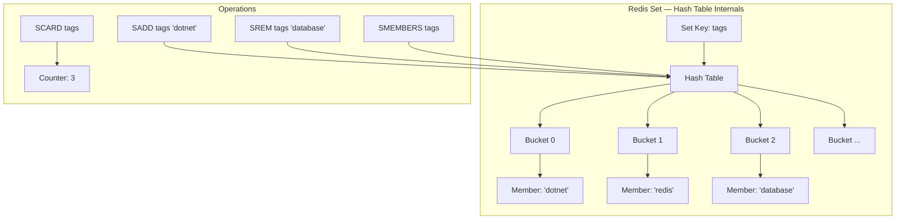
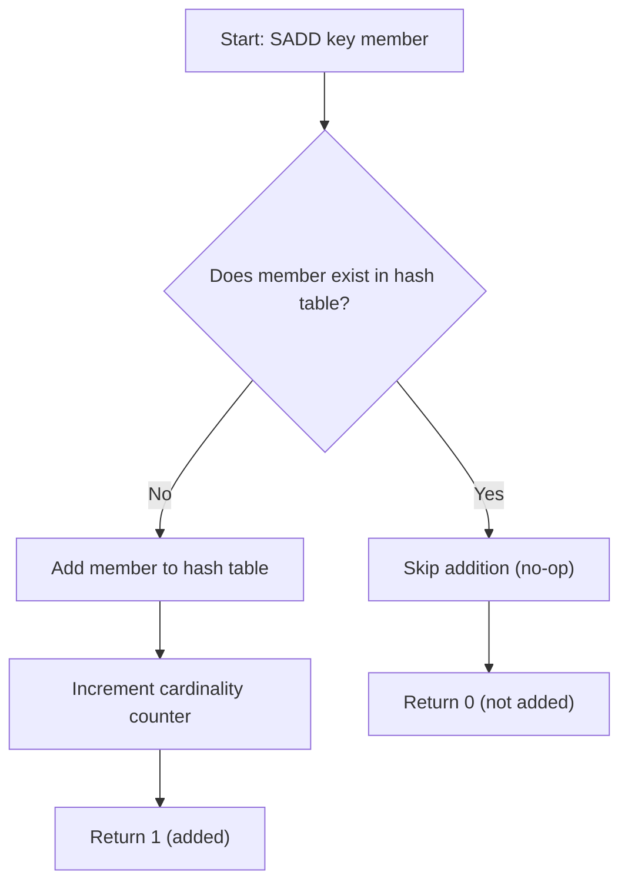
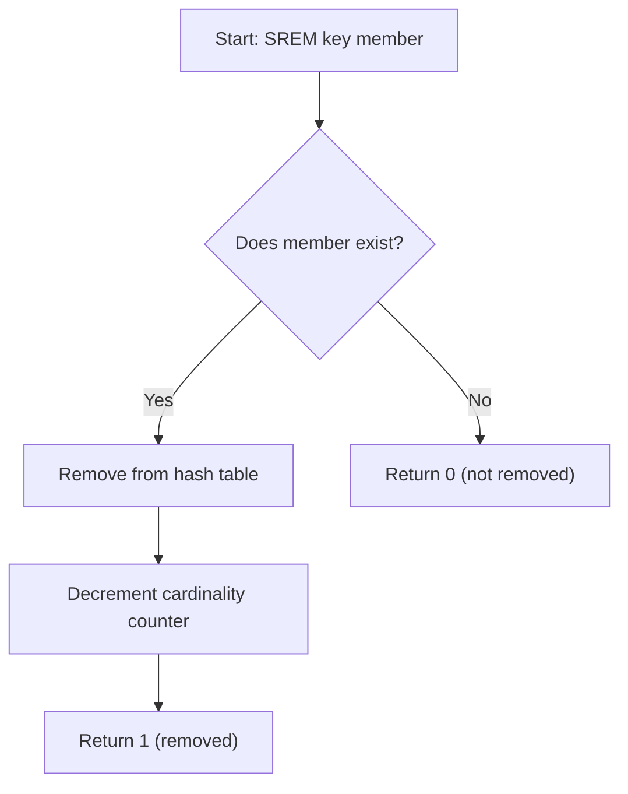
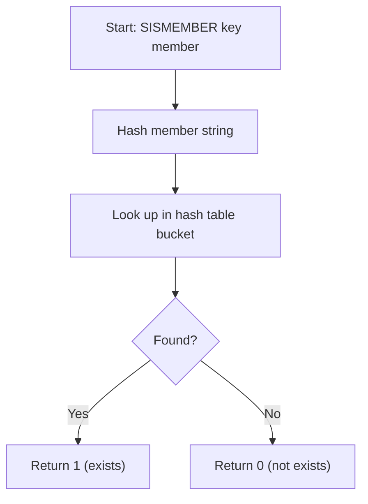
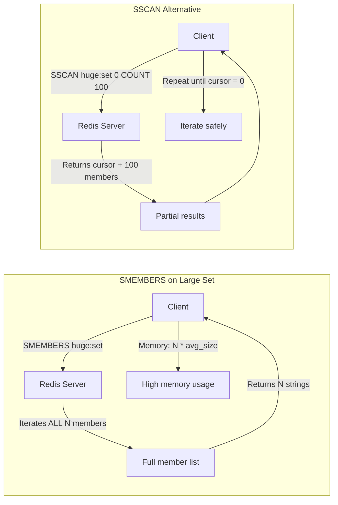
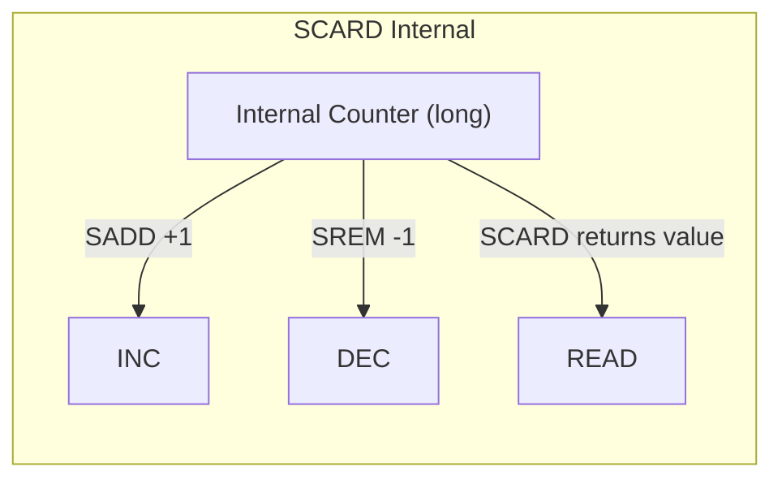
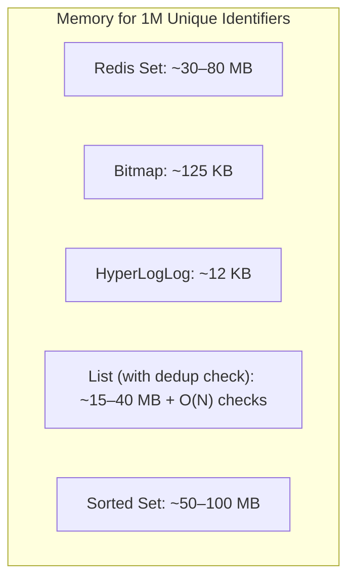
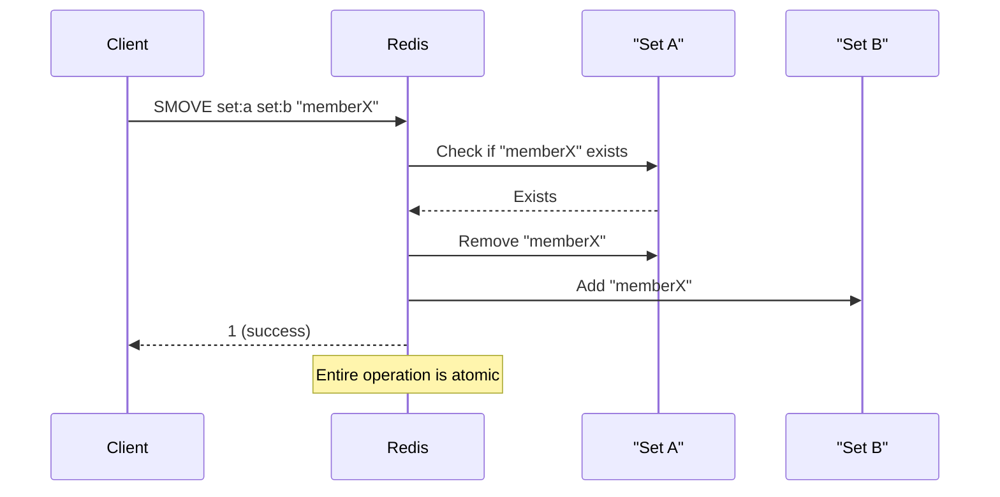
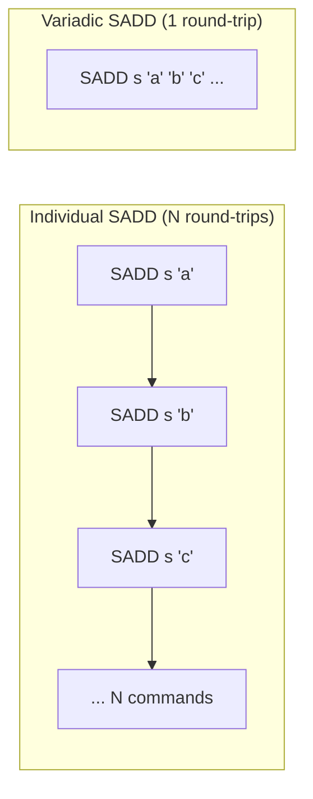
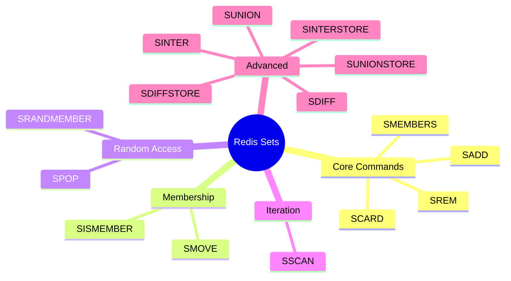

# 1 — Overview

Redis Sets are unordered collections of unique strings. They provide O(1) average-time complexity for add, remove, and membership check operations. Unlike Lists, Sets guarantee that no duplicate members exist, which makes them ideal for tracking unique elements such as tags, user IDs, or IP addresses.

The four foundational Set commands are:

| Command | Purpose | Time Complexity | Return Value |
| ------- | ------- | --------------- | ------------ |
| `SADD key member [member ...]` | Add one or more members to a Set | O(N) where N is number of members added | Integer: number of new members added |
| `SREM key member [member ...]` | Remove one or more members | O(N) where N is number of members removed | Integer: number of removed members |
| `SMEMBERS key` | Return all members of the Set | O(N) where N is total members | Array of all members |
| `SCARD key` | Return the cardinality (count) of the Set | O(1) | Integer |

Sets are implemented as hash tables internally in Redis. Each member is stored once, and attempting to add a duplicate member with `SADD` simply returns 0 without raising an error. This idempotent behavior makes Sets ideal for deduplication scenarios.

The combination of uniqueness guarantee and constant-time cardinality makes Sets one of the most frequently used Redis data structures in production systems. Whether you are building a tagging engine, a social graph, an access control list, or a real-time analytics pipeline, Sets provide a simple and efficient foundation.

Sets differ from other Redis collection types in important ways:

- **vs Lists**: Lists allow duplicates and maintain insertion order; Sets are unordered and unique.
- **vs Sorted Sets**: Both maintain uniqueness, but Sorted Sets attach a double-precision score to each member for ordering.
- **vs Hashes**: Hashes store field-value pairs (mappings), not just members.
- **vs HyperLogLog**: HyperLogLog provides approximate cardinality estimation with very low memory; Sets provide exact membership.

Understanding these four commands is essential before moving on to the more advanced Set operations covered in [[8.975 — Redis — Sets — SUNION, SINTER, SDIFF — Set Operations]].

# 2 — CLI Examples

## 2.1 — Basic SADD and SCARD

```bash
# Add three tags to a set
SADD tags "dotnet" "redis" "database"
# (integer) 3

# Check cardinality
SCARD tags
# (integer) 3

# Attempt duplicate add — returns 0
SADD tags "redis"
# (integer) 0

# Cardinality unchanged after duplicate
SCARD tags
# (integer) 3
```

## 2.2 — SREM

```bash
# Remove a member
SREM tags "database"
# (integer) 1

# Attempt remove non-existent member — returns 0
SREM tags "nonexistent"
# (integer) 0

# Verify removal
SMEMBERS tags
# 1) "dotnet"
# 2) "redis"
```

## 2.3 — SMEMBERS

```bash
# Start fresh
SADD fruits "apple" "banana" "cherry" "date"
# (integer) 4

# Retrieve all members
SMEMBERS fruits
# 1) "apple"
# 2) "banana"
# 3) "cherry"
# 4) "date"

# SMEMBERS order is not guaranteed—rerun may differ
```

## 2.4 — SISMEMBER (Membership Check)

```bash
SISMEMBER fruits "banana"
# (integer) 1

SISMEMBER fruits "grape"
# (integer) 0
```

SISMEMBER has O(1) time complexity, making it extremely efficient for membership checks even in very large Sets.

## 2.5 — SPOP and SRANDMEMBER (Related Commands)

```bash
# Randomly pop 1 member
SPOP fruits
# "apple" (or any random member)

# Get 2 random members without removing
SRANDMEMBER fruits 2
# 1) "banana"
# 2) "cherry"
```

## 2.6 — SMOVE (Atomic Move Between Sets)

```bash
SADD set:a "x" "y" "z"
# (integer) 3

SADD set:b "a" "b"
# (integer) 2

SMOVE set:a set:b "x"
# (integer) 1

SMEMBERS set:a
# 1) "y"
# 2) "z"

SMEMBERS set:b
# 1) "a"
# 2) "b"
# 3) "x"
```

## 2.7 — Bulk Operations

```bash
# Add many members in one command
SADD large:set member:{1..1000}
# (integer) 1000

# Add members from an array-style listing
SADD colors "red" "green" "blue" "yellow" "purple" "orange" "black" "white"
# (integer) 8
```

## 2.8 — SSCAN for Large Sets

```bash
# Instead of SMEMBERS on a large set, use SSCAN
SSCAN large:set 0 COUNT 10
# 1) "next-cursor"
# 2) 1) "member:1"
#    2) "member:42"
#    ...

# Complete iteration with cursor
SSCAN large:set 0 MATCH "member:5*" COUNT 100
```

## 2.9 — SADD with Multiple Variadic Arguments

```bash
# Redis supports variadic SADD
SADD session:abc123 "event:click" "event:scroll" "event:submit" "event:focus"
# (integer) 4

# The same can be done for SREM
SREM session:abc123 "event:focus"
# (integer) 1
```

## 2.10 — EXPIRE with Sets

```bash
# Sets can have TTL
SADD temp:set "a" "b" "c"
EXPIRE temp:set 3600
# (integer) 1

TTL temp:set
# (integer) 3600 (approximately)
```

## 2.11 — Testing Set Existence

```bash
EXISTS tags
# (integer) 1 — set exists

DEL tags
# (integer) 1 — deleted

EXISTS tags
# (integer) 0 — gone
```

## 2.12 — TYPE Command

```bash
TYPE tags
# set
```

This confirms the data structure type stored at a key.

# 3 — StackExchange.Redis C# API

## 3.1 — Connection Setup

```csharp
using StackExchange.Redis;

public class RedisSetService
{
    private readonly ConnectionMultiplexer _redis;
    private readonly IDatabase _db;

    public RedisSetService(string connectionString)
    {
        _redis = ConnectionMultiplexer.Connect(connectionString);
        _db = _redis.GetDatabase();
    }

    // Always dispose ConnectionMultiplexer properly
    public void Dispose()
    {
        _redis?.Dispose();
    }
}
```

## 3.2 — SADD: Adding Members

```csharp
public async Task<long> AddTagsAsync(string tagSetKey, params string[] tags)
{
    try
    {
        // Convert string array to RedisValue array
        RedisValue[] redisValues = tags.Select(t => (RedisValue)t).ToArray();
        long added = await _db.SetAddAsync(tagSetKey, redisValues);

        // SetAddAsync returns the number of new members added
        return added;
    }
    catch (RedisException ex)
    {
        Console.WriteLine($"Redis error adding tags: {ex.Message}");
        throw;
    }
}
```

## 3.3 — SADD Single Member

```csharp
public async Task<bool> AddTagAsync(string tagSetKey, string tag)
{
    try
    {
        // SetAddAsync for single member returns bool
        bool wasAdded = await _db.SetAddAsync(tagSetKey, tag);

        // wasAdded is true if the member was new, false if already exists
        return wasAdded;
    }
    catch (RedisException ex)
    {
        Console.WriteLine($"Redis error adding tag: {ex.Message}");
        return false;
    }
}
```

## 3.4 — SREM: Removing Members

```csharp
public async Task<long> RemoveTagsAsync(string tagSetKey, params string[] tags)
{
    try
    {
        RedisValue[] redisValues = tags.Select(t => (RedisValue)t).ToArray();
        long removed = await _db.SetRemoveAsync(tagSetKey, redisValues);

        // SetRemoveAsync returns the number of removed members
        return removed;
    }
    catch (RedisException ex)
    {
        Console.WriteLine($"Redis error removing tags: {ex.Message}");
        throw;
    }
}
```

## 3.5 — SREM Single Member

```csharp
public async Task<bool> RemoveTagAsync(string tagSetKey, string tag)
{
    try
    {
        // SetRemoveAsync for single member returns bool
        bool wasRemoved = await _db.SetRemoveAsync(tagSetKey, tag);

        return wasRemoved;
    }
    catch (RedisException ex)
    {
        Console.WriteLine($"Redis error removing tag: {ex.Message}");
        return false;
    }
}
```

## 3.6 — SMEMBERS: Retrieving All Members

```csharp
public async Task<string[]> GetAllMembersAsync(string key)
{
    try
    {
        RedisValue[] members = await _db.SetMembersAsync(key);

        // Convert RedisValue[] to string[]
        return members.Select(m => m.ToString()).ToArray();
    }
    catch (RedisException ex)
    {
        Console.WriteLine($"Redis error getting members: {ex.Message}");
        return Array.Empty<string>();
    }
}
```

## 3.7 — SCARD: Getting Cardinality

```csharp
public async Task<long> GetSetCountAsync(string key)
{
    try
    {
        // SetLengthAsync issues SCARD
        long count = await _db.SetLengthAsync(key);

        return count;
    }
    catch (RedisException ex)
    {
        Console.WriteLine($"Redis error getting set length: {ex.Message}");
        return -1;
    }
}
```

## 3.8 — SISMEMBER: Membership Check

```csharp
public async Task<bool> MemberExistsAsync(string key, string member)
{
    try
    {
        // SetContainsAsync issues SISMEMBER
        bool exists = await _db.SetContainsAsync(key, member);

        return exists;
    }
    catch (RedisException ex)
    {
        Console.WriteLine($"Redis error checking membership: {ex.Message}");
        return false;
    }
}
```

## 3.9 — SPOP: Pop Random Members

```csharp
public async Task<string> PopRandomMemberAsync(string key)
{
    try
    {
        // SetPopAsync issues SPOP — removes and returns a random member
        RedisValue popped = await _db.SetPopAsync(key);

        return popped.ToString();
    }
    catch (RedisException ex)
    {
        Console.WriteLine($"Redis error popping member: {ex.Message}");
        return null;
    }
}

public async Task<string[]> PopRandomMembersAsync(string key, long count)
{
    try
    {
        RedisValue[] popped = await _db.SetPopAsync(key, count);

        return popped.Select(p => p.ToString()).ToArray();
    }
    catch (RedisException ex)
    {
        Console.WriteLine($"Redis error popping members: {ex.Message}");
        return Array.Empty<string>();
    }
}
```

## 3.10 — SRANDMEMBER: Random Members Without Removal

```csharp
public async Task<string[]> GetRandomMembersAsync(string key, long count = 1)
{
    try
    {
        // Not directly available as a single method, use Lua or script
        // Alternative: use SetMembersAsync and random selection client-side
        // For production, consider Lua scripting:
        var result = await _db.ScriptEvaluateAsync(
            "return redis.call('SRANDMEMBER', @key, @count)",
            new { key = (RedisKey)key, count = count });

        if (result.IsNull)
            return Array.Empty<string>();

        return ((RedisValue[])result).Select(r => r.ToString()).ToArray();
    }
    catch (RedisException ex)
    {
        Console.WriteLine($"Redis error: {ex.Message}");
        return Array.Empty<string>();
    }
}
```

## 3.11 — SMOVE: Atomic Move Between Sets

```csharp
public async Task<bool> MoveMemberAsync(string sourceKey, string destKey, string member)
{
    try
    {
        // SetMoveAsync issues SMOVE
        bool moved = await _db.SetMoveAsync(sourceKey, destKey, member);

        return moved;
    }
    catch (RedisException ex)
    {
        Console.WriteLine($"Redis error moving member: {ex.Message}");
        return false;
    }
}
```

## 3.12 — SSCAN: Iterating Large Sets

```csharp
public async IAsyncEnumerable<string> ScanSetAsync(string key, string pattern = null, int pageSize = 100)
{
    try
    {
        int cursor = 0;

        do
        {
            // SetScanAsync returns the next cursor and a batch of results
            var result = await _db.SetScanAsync(key, pattern, pageSize, cursor);

            cursor = result.Cursor;
            foreach (RedisValue member in result.Values)
            {
                yield return member.ToString();
            }
        }
        while (cursor != 0);
    }
    catch (RedisException ex)
    {
        Console.WriteLine($"Redis error scanning set: {ex.Message}");
    }
}
```

## 3.13 — Batch Operations for Performance

```csharp
public async Task BatchAddAsync(string key, IEnumerable<string> members, int batchSize = 500)
{
    try
    {
        var batch = _db.CreateBatch();

        int count = 0;
        foreach (string member in members)
        {
            batch.SetAddAsync(key, member);
            count++;

            if (count % batchSize == 0)
            {
                await batch.ExecuteAsync();
                batch = _db.CreateBatch();
            }
        }

        // Execute remaining
        if (count % batchSize != 0)
        {
            await batch.ExecuteAsync();
        }
    }
    catch (RedisException ex)
    {
        Console.WriteLine($"Redis error in batch add: {ex.Message}");
        throw;
    }
}
```

## 3.14 — Error Handling and Retry Pattern

```csharp
public async Task<long> SafeAddWithRetryAsync(string key, string member, int maxRetries = 3)
{
    int retryCount = 0;
    TimeSpan delay = TimeSpan.FromMilliseconds(100);

    while (retryCount < maxRetries)
    {
        try
        {
            bool added = await _db.SetAddAsync(key, member);
            return added ? 1 : 0;
        }
        catch (RedisConnectionException ex) when (retryCount < maxRetries - 1)
        {
            Console.WriteLine($"Connection error (attempt {retryCount + 1}): {ex.Message}");
            retryCount++;
            await Task.Delay(delay);
            delay *= 2; // Exponential backoff
        }
        catch (RedisTimeoutException ex) when (retryCount < maxRetries - 1)
        {
            Console.WriteLine($"Timeout (attempt {retryCount + 1}): {ex.Message}");
            retryCount++;
            await Task.Delay(delay);
            delay *= 2;
        }
    }

    Console.WriteLine("Failed after max retries");
    return 0;
}
```

## 3.15 — Pipeline for Multiple Operations

```csharp
public async Task PipelineSetOperationsAsync(string key, string[] addMembers, string[] removeMembers)
{
    try
    {
        // Pipeline sends commands without waiting for individual replies
        var batch = _db.CreateBatch();

        foreach (string member in addMembers)
        {
            batch.SetAddAsync(key, member);
        }

        foreach (string member in removeMembers)
        {
            batch.SetRemoveAsync(key, member);
        }

        // Execute all commands and wait for all results
        await batch.ExecuteAsync();
    }
    catch (RedisException ex)
    {
        Console.WriteLine($"Redis pipeline error: {ex.Message}");
        throw;
    }
}
```

## 3.16 — Transaction with Set Operations

```csharp
public async Task<bool> TransactionalAddRemoveAsync(string key, string addMember, string removeMember)
{
    try
    {
        var tran = _db.CreateTransaction();

        // Queue operations
        Task<bool> addTask = tran.SetAddAsync(key, addMember);
        Task<bool> removeTask = tran.SetRemoveAsync(key, removeMember);

        // Execute atomically
        bool committed = await tran.ExecuteAsync();

        if (committed)
        {
            bool addResult = await addTask;
            bool removeResult = await removeTask;
            Console.WriteLine($"Transaction committed. Added: {addResult}, Removed: {removeResult}");
        }

        return committed;
    }
    catch (RedisException ex)
    {
        Console.WriteLine($"Redis transaction error: {ex.Message}");
        return false;
    }
}
```

## 3.17 — Full Service Class Example

```csharp
using StackExchange.Redis;

public class SetService : IDisposable
{
    private readonly ConnectionMultiplexer _redis;
    private readonly IDatabase _db;
    private readonly ILogger<SetService> _logger;

    public SetService(string connectionString, ILogger<SetService> logger = null)
    {
        var config = new ConfigurationOptions
        {
            EndPoints = { connectionString },
            AbortOnConnectFail = false,
            ConnectRetry = 3,
            ConnectTimeout = 5000,
            SyncTimeout = 5000,
            KeepAlive = 60
        };

        _redis = ConnectionMultiplexer.Connect(config);
        _db = _redis.GetDatabase();
        _logger = logger;
    }

    public async Task<long> AddMembersAsync(string key, params string[] members)
    {
        if (string.IsNullOrEmpty(key)) throw new ArgumentNullException(nameof(key));
        if (members == null || members.Length == 0) return 0;

        try
        {
            RedisValue[] values = members.Select(m => (RedisValue)m).ToArray();
            long added = await _db.SetAddAsync(key, values);
            _logger?.LogInformation("Added {Count} members to set {Key}", added, key);
            return added;
        }
        catch (RedisException ex)
        {
            _logger?.LogError(ex, "Failed to add members to set {Key}", key);
            throw;
        }
    }

    public async Task<long> RemoveMembersAsync(string key, params string[] members)
    {
        if (string.IsNullOrEmpty(key)) throw new ArgumentNullException(nameof(key));
        if (members == null || members.Length == 0) return 0;

        try
        {
            RedisValue[] values = members.Select(m => (RedisValue)m).ToArray();
            long removed = await _db.SetRemoveAsync(key, values);
            _logger?.LogInformation("Removed {Count} members from set {Key}", removed, key);
            return removed;
        }
        catch (RedisException ex)
        {
            _logger?.LogError(ex, "Failed to remove members from set {Key}", key);
            throw;
        }
    }

    public async Task<string[]> GetAllMembersAsync(string key)
    {
        if (string.IsNullOrEmpty(key)) throw new ArgumentNullException(nameof(key));

        try
        {
            RedisValue[] members = await _db.SetMembersAsync(key);
            return members.Select(m => m.ToString()).ToArray();
        }
        catch (RedisException ex)
        {
            _logger?.LogError(ex, "Failed to get members for set {Key}", key);
            throw;
        }
    }

    public async Task<long> GetCountAsync(string key)
    {
        if (string.IsNullOrEmpty(key)) throw new ArgumentNullException(nameof(key));

        try
        {
            return await _db.SetLengthAsync(key);
        }
        catch (RedisException ex)
        {
            _logger?.LogError(ex, "Failed to get count for set {Key}", key);
            throw;
        }
    }

    public async Task<bool> ContainsAsync(string key, string member)
    {
        if (string.IsNullOrEmpty(key)) throw new ArgumentNullException(nameof(key));
        if (string.IsNullOrEmpty(member)) throw new ArgumentNullException(nameof(member));

        try
        {
            return await _db.SetContainsAsync(key, member);
        }
        catch (RedisException ex)
        {
            _logger?.LogError(ex, "Failed to check membership in set {Key}", key);
            throw;
        }
    }

    public async Task<bool> MoveMemberAsync(string sourceKey, string destKey, string member)
    {
        if (string.IsNullOrEmpty(sourceKey)) throw new ArgumentNullException(nameof(sourceKey));
        if (string.IsNullOrEmpty(destKey)) throw new ArgumentNullException(nameof(destKey));

        try
        {
            return await _db.SetMoveAsync(sourceKey, destKey, member);
        }
        catch (RedisException ex)
        {
            _logger?.LogError(ex, "Failed to move member from {Source} to {Dest}", sourceKey, destKey);
            throw;
        }
    }

    public async Task<string> PopRandomAsync(string key)
    {
        if (string.IsNullOrEmpty(key)) throw new ArgumentNullException(nameof(key));

        try
        {
            RedisValue popped = await _db.SetPopAsync(key);
            return popped.ToString();
        }
        catch (RedisException ex)
        {
            _logger?.LogError(ex, "Failed to pop random from set {Key}", key);
            throw;
        }
    }

    public async IAsyncEnumerable<string> ScanAsync(string key, string pattern = null, int pageSize = 100)
    {
        int cursor = 0;
        do
        {
            var page = await _db.SetScanAsync(key, pattern, pageSize, cursor);
            cursor = page.Cursor;
            foreach (RedisValue member in page.Values)
            {
                yield return member.ToString();
            }
        }
        while (cursor != 0);
    }

    public void Dispose()
    {
        _redis?.Dispose();
    }
}
```

# 4 — Performance Characteristics

## 4.1 — Time Complexity Breakdown

| Command | Time Complexity | Notes |
| ------- | --------------- | ----- |
| `SADD` | O(N) per added member | N = number of new members added (amortized O(1) per member) |
| `SREM` | O(N) per removed member | N = number of members removed |
| `SMEMBERS` | O(N) | N = total set size — returns all members |
| `SCARD` | O(1) | Cardinality stored as a counter |
| `SISMEMBER` | O(1) | Hash-table lookup |
| `SPOP` | O(1) | Removes and returns random member |
| `SRANDMEMBER` | O(1) | Returns random member without removal |
| `SMOVE` | O(1) | Atomic move between source and destination |
| `SSCAN` | O(1) per call | Iterates incrementally with cursor |

## 4.2 — Memory Overhead

Each Set member in Redis incurs overhead:
- Redis object header: ~64 bytes per member (on 64-bit systems)
- Actual string data: variable
- Hash table overhead: varies with load factor

For a Set with 1 million members (each member being a 20-byte string):
- Approximate memory usage: 50–80 MB
- This is significantly more than Bitmaps or HyperLogLog for the same cardinality

## 4.3 — When SMEMBERS Is Dangerous

```csharp
// AVOID this on large sets:
RedisValue[] allMembers = await _db.SetMembersAsync("huge:set");
// This reads the ENTIRE set into memory and transfers over the network

// PREFERRED: Use SSCAN for iteration:
int cursor = 0;
do
{
    var batch = await _db.SetScanAsync("huge:set", cursor: cursor, pageSize: 100);
    cursor = batch.Cursor;
    foreach (RedisValue member in batch.Values)
    {
        // Process in chunks
        ProcessMember(member.ToString());
    }
}
while (cursor != 0);
```

## 4.4 — Network Round-Trips

Each Set command involves at least one round-trip to the Redis server. For bulk operations:

| Strategy | Network Calls | Latency Impact |
| -------- | ------------- | -------------- |
| Individual SADD (N calls) | N | High for large N |
| Variadic SADD (batched) | ceil(N / batchSize) | Moderate |
| Pipeline | 1 | Low |
| Lua Script | 1 | Lowest |

```csharp
// Worst: N round-trips
for each member:
    db.SetAddAsync(key, member)

// Better: variadic with RedisValue array
db.SetAddAsync(key, new RedisValue[] { m1, m2, m3, ... })

// Best: Pipeline or Lua
var batch = db.CreateBatch();
batch.SetAddAsync(key, m1);
batch.SetAddAsync(key, m2);
// ...
await batch.ExecuteAsync();
```

## 4.5 — Memory Fragmentation

Redis uses jemalloc for memory allocation. After deleting many members from a large Set, memory fragmentation may occur:
- `MEMORY FRAGMENTATION RATIO` > 1.5 indicates fragmentation
- Restarting the Redis instance or using `MEMORY PURGE` can help
- Consider using `UNLINK` instead of `DEL` for very large Sets to avoid blocking

## 4.6 — Set Size Limits

Redis Sets can hold up to 2^32 - 1 members (approximately 4.3 billion). However, practical limits are much lower due to memory constraints:
- 100K members: ~2–8 MB (depending on member size)
- 1M members: ~20–80 MB
- 10M members: ~200–800 MB
- 100M members: ~2–8 GB

## 4.7 — Benchmarking Results

Typical throughput on a 2024-era single-instance Redis server (6-core, 16 GB RAM, localhost):

| Operation | Ops/sec (single client) | Ops/sec (pipelined, batch=10) |
| --------- | ----------------------- | ----------------------------- |
| SADD (10-byte member) | ~120,000 | ~400,000 |
| SREM | ~120,000 | ~400,000 |
| SISMEMBER | ~150,000 | ~500,000 |
| SCARD | ~180,000 | ~600,000 |
| SMEMBERS (100-member set) | ~80,000 | ~250,000 |

Actual numbers vary based on hardware, network latency, and set size.

# 5 — Use Cases

## 5.1 — Tagging System

```csharp
public class TaggingService
{
    private readonly IDatabase _db;
    private const string TagSetPrefix = "tags:post:";

    public TaggingService(IDatabase db) => _db = db;

    public async Task AddTagsToPostAsync(long postId, params string[] tags)
    {
        string key = $"{TagSetPrefix}{postId}";
        await _db.SetAddAsync(key, tags.Select(t => (RedisValue)t).ToArray());
    }

    public async Task<string[]> GetPostTagsAsync(long postId)
    {
        string key = $"{TagSetPrefix}{postId}";
        RedisValue[] members = await _db.SetMembersAsync(key);
        return members.Select(m => m.ToString()).ToArray();
    }

    public async Task<long> GetTagCountAsync(long postId)
    {
        string key = $"{TagSetPrefix}{postId}";
        return await _db.SetLengthAsync(key);
    }

    public async Task<bool> HasTagAsync(long postId, string tag)
    {
        string key = $"{TagSetPrefix}{postId}";
        return await _db.SetContainsAsync(key, tag);
    }

    public async Task RemoveTagsFromPostAsync(long postId, params string[] tags)
    {
        string key = $"{TagSetPrefix}{postId}";
        await _db.SetRemoveAsync(key, tags.Select(t => (RedisValue)t).ToArray());
    }
}
```

## 5.2 — Social Graph — Followers/Following

```csharp
public class SocialGraphService
{
    private readonly IDatabase _db;
    private const string FollowersPrefix = "followers:";
    private const string FollowingPrefix = "following:";

    public SocialGraphService(IDatabase db) => _db = db;

    public async Task FollowAsync(long userId, long targetUserId)
    {
        var tran = _db.CreateTransaction();
        tran.SetAddAsync($"{FollowersPrefix}{targetUserId}", userId);
        tran.SetAddAsync($"{FollowingPrefix}{userId}", targetUserId);
        await tran.ExecuteAsync();
    }

    public async Task UnfollowAsync(long userId, long targetUserId)
    {
        var tran = _db.CreateTransaction();
        tran.SetRemoveAsync($"{FollowersPrefix}{targetUserId}", userId);
        tran.SetRemoveAsync($"{FollowingPrefix}{userId}", targetUserId);
        await tran.ExecuteAsync();
    }

    public async Task<long> GetFollowerCountAsync(long userId)
    {
        return await _db.SetLengthAsync($"{FollowersPrefix}{userId}");
    }

    public async Task<long> GetFollowingCountAsync(long userId)
    {
        return await _db.SetLengthAsync($"{FollowingPrefix}{userId}");
    }

    public async Task<bool> IsFollowingAsync(long userId, long targetUserId)
    {
        return await _db.SetContainsAsync($"{FollowingPrefix}{userId}", targetUserId);
    }

    public async Task<bool> AreMutualFollowersAsync(long userIdA, long userIdB)
    {
        // Check if A follows B AND B follows A
        var tran = _db.CreateTransaction();
        Task<bool> aFollowsB = tran.SetContainsAsync($"{FollowingPrefix}{userIdA}", userIdB);
        Task<bool> bFollowsA = tran.SetContainsAsync($"{FollowingPrefix}{userIdB}", userIdA);
        await tran.ExecuteAsync();

        return await aFollowsB && await bFollowsA;
    }
}
```

## 5.3 — Access Control Lists (ACL)

```csharp
public class AclService
{
    private readonly IDatabase _db;
    private const string RolePermissionsPrefix = "role:perms:";
    private const string UserRolesPrefix = "user:roles:";

    public AclService(IDatabase db) => _db = db;

    public async Task AssignRoleAsync(long userId, string role)
    {
        await _db.SetAddAsync($"{UserRolesPrefix}{userId}", role);
    }

    public async Task AddPermissionToRoleAsync(string role, string permission)
    {
        await _db.SetAddAsync($"{RolePermissionsPrefix}{role}", permission);
    }

    public async Task<bool> HasPermissionAsync(long userId, string permission)
    {
        // Get all roles for the user
        RedisValue[] userRoles = await _db.SetMembersAsync($"{UserRolesPrefix}{userId}");

        // Check each role's permissions
        foreach (RedisValue role in userRoles)
        {
            bool hasPerm = await _db.SetContainsAsync(
                $"{RolePermissionsPrefix}{role}", permission);
            if (hasPerm) return true;
        }

        return false;
    }

    public async Task<string[]> GetUserPermissionsAsync(long userId)
    {
        RedisValue[] userRoles = await _db.SetMembersAsync($"{UserRolesPrefix}{userId}");

        var permissionSets = new List<RedisKey>();
        foreach (RedisValue role in userRoles)
        {
            permissionSets.Add($"{RolePermissionsPrefix}{role}");
        }

        // Use SUNION to get all permissions across all roles
        RedisValue[] allPermissions = await _db.SetCombineAsync(
            SetOperation.Union, permissionSets.ToArray());

        return allPermissions.Select(p => p.ToString()).ToArray();
    }
}
```

## 5.4 — Deduplication Pipeline

```csharp
public class DeduplicationService
{
    private readonly IDatabase _db;
    private readonly TimeSpan _dedupWindow;

    public DeduplicationService(IDatabase db, TimeSpan dedupWindow)
    {
        _db = db;
        _dedupWindow = dedupWindow;
    }

    public async Task<bool> IsDuplicateAsync(string key, string item)
    {
        // SADD returns 0 if already a member
        bool added = await _db.SetAddAsync(key, item);

        if (added)
        {
            // First time seeing this item — set expiry for the window
            await _db.KeyExpireAsync(key, _dedupWindow);
            return false;
        }

        return true;
    }

    public async Task<long> GetUniqueCountAsync(string key)
    {
        return await _db.SetLengthAsync(key);
    }

    public async Task ClearWindowAsync(string key)
    {
        await _db.KeyDeleteAsync(key);
    }
}
```

## 5.5 — Online Presence Tracking

```csharp
public class PresenceTracker
{
    private readonly IDatabase _db;
    private const string OnlineUsersKey = "online:users";

    public PresenceTracker(IDatabase db) => _db = db;

    public async Task UserConnectedAsync(string connectionId, string userId)
    {
        await _db.SetAddAsync(OnlineUsersKey, userId);
        // Store connection-to-user mapping
        await _db.StringSetAsync($"conn:user:{connectionId}", userId, TimeSpan.FromMinutes(5));
    }

    public async Task UserDisconnectedAsync(string connectionId)
    {
        string userId = await _db.StringGetAsync($"conn:user:{connectionId}");
        if (!string.IsNullOrEmpty(userId))
        {
            // Check if user has other active connections
            // (in real app, track connection count per user)
            await _db.SetRemoveAsync(OnlineUsersKey, userId);
            await _db.KeyDeleteAsync($"conn:user:{connectionId}");
        }
    }

    public async Task<long> GetOnlineUserCountAsync()
    {
        return await _db.SetLengthAsync(OnlineUsersKey);
    }

    public async Task<bool> IsUserOnlineAsync(string userId)
    {
        return await _db.SetContainsAsync(OnlineUsersKey, userId);
    }

    public async Task<string[]> GetOnlineUsersAsync()
    {
        RedisValue[] users = await _db.SetMembersAsync(OnlineUsersKey);
        return users.Select(u => u.ToString()).ToArray();
    }
}
```

## 5.6 — Shopping Cart / Wishlist Items

```csharp
public class WishlistService
{
    private readonly IDatabase _db;
    private const string WishlistPrefix = "wishlist:";

    public WishlistService(IDatabase db) => _db = db;

    public async Task AddToWishlistAsync(long userId, long productId)
    {
        await _db.SetAddAsync($"{WishlistPrefix}{userId}", productId);
    }

    public async Task RemoveFromWishlistAsync(long userId, long productId)
    {
        await _db.SetRemoveAsync($"{WishlistPrefix}{userId}", productId);
    }

    public async Task<bool> IsInWishlistAsync(long userId, long productId)
    {
        return await _db.SetContainsAsync($"{WishlistPrefix}{userId}", productId);
    }

    public async Task<long> GetWishlistCountAsync(long userId)
    {
        return await _db.SetLengthAsync($"{WishlistPrefix}{userId}");
    }

    public async Task<long[]> GetWishlistProductIdsAsync(long userId)
    {
        RedisValue[] members = await _db.SetMembersAsync($"{WishlistPrefix}{userId}");
        return members.Select(m => (long)m).ToArray();
    }
}
```

## 5.7 — Event Tracking / Unique Action Logging

```csharp
public class EventTracker
{
    private readonly IDatabase _db;
    private const string EventSetPrefix = "event:";

    public EventTracker(IDatabase db) => _db = db;

    public async Task TrackUniqueActionAsync(string eventName, string actorId)
    {
        string key = $"{EventSetPrefix}{eventName}:{DateTime.UtcNow:yyyy-MM-dd}";
        await _db.SetAddAsync(key, actorId);
        await _db.KeyExpireAsync(key, TimeSpan.FromDays(90));
    }

    public async Task<long> GetDailyUniqueActorsAsync(string eventName, DateTime date)
    {
        string key = $"{EventSetPrefix}{eventName}:{date:yyyy-MM-dd}";
        return await _db.SetLengthAsync(key);
    }

    public async Task<bool> HasActorPerformedAsync(string eventName, string actorId, DateTime date)
    {
        string key = $"{EventSetPrefix}{eventName}:{date:yyyy-MM-dd}";
        return await _db.SetContainsAsync(key, actorId);
    }
}
```

## 5.8 — Voting / Poll System

```csharp
public class PollService
{
    private readonly IDatabase _db;
    private const string PollVotersPrefix = "poll:voters:";

    public PollService(IDatabase db) => _db = db;

    public async Task<bool> CastVoteAsync(long pollId, long userId, string option)
    {
        string votersKey = $"{PollVotersPrefix}{pollId}";
        string votesKey = $"poll:votes:{pollId}:{option}";

        // Check if user already voted using SISMEMBER
        bool alreadyVoted = await _db.SetContainsAsync(votersKey, userId);
        if (alreadyVoted) return false;

        var tran = _db.CreateTransaction();
        tran.SetAddAsync(votersKey, userId);
        tran.SetAddAsync(votesKey, userId);
        await tran.ExecuteAsync();

        return true;
    }

    public async Task<long> GetVoterCountAsync(long pollId)
    {
        return await _db.SetLengthAsync($"{PollVotersPrefix}{pollId}");
    }

    public async Task<long> GetOptionVoteCountAsync(long pollId, string option)
    {
        return await _db.SetLengthAsync($"poll:votes:{pollId}:{option}");
    }
}
```

## 5.9 — IP Whitelist / Blacklist

```csharp
public class IpAccessControl
{
    private readonly IDatabase _db;
    private const string WhitelistKey = "acl:whitelist";
    private const string BlacklistKey = "acl:blacklist";

    public IpAccessControl(IDatabase db) => _db = db;

    public async Task WhitelistIpAsync(string ipAddress)
    {
        await _db.SetAddAsync(WhitelistKey, ipAddress);
    }

    public async Task BlacklistIpAsync(string ipAddress)
    {
        await _db.SetAddAsync(BlacklistKey, ipAddress);
    }

    public async Task<bool> IsIpAllowedAsync(string ipAddress)
    {
        // Explicitly blacklisted?
        bool blacklisted = await _db.SetContainsAsync(BlacklistKey, ipAddress);
        if (blacklisted) return false;

        // Explicitly whitelisted?
        bool whitelisted = await _db.SetContainsAsync(WhitelistKey, ipAddress);
        if (whitelisted) return true;

        // Default policy: deny if whitelist mode, allow if blacklist-only mode
        // This depends on business rules
        return false;
    }

    public async Task RemoveFromWhitelistAsync(string ipAddress)
    {
        await _db.SetRemoveAsync(WhitelistKey, ipAddress);
    }

    public async Task RemoveFromBlacklistAsync(string ipAddress)
    {
        await _db.SetRemoveAsync(BlacklistKey, ipAddress);
    }

    public async Task<long> GetWhitelistCountAsync()
    {
        return await _db.SetLengthAsync(WhitelistKey);
    }

    public async Task<long> GetBlacklistCountAsync()
    {
        return await _db.SetLengthAsync(BlacklistKey);
    }
}
```

## 5.10 — Caching Unique Query Results

```csharp
public class QueryResultCache
{
    private readonly IDatabase _db;
    private readonly TimeSpan _cacheTtl = TimeSpan.FromMinutes(30);

    public QueryResultCache(IDatabase db) => _db = db;

    public async Task CacheResultsAsync(string cacheKey, IEnumerable<string> resultIds)
    {
        string memberSetKey = $"cache:members:{cacheKey}";

        var batch = _db.CreateBatch();
        foreach (string id in resultIds)
        {
            batch.SetAddAsync(memberSetKey, id);
        }
        batch.KeyExpireAsync(memberSetKey, _cacheTtl);
        await batch.ExecuteAsync();
    }

    public async Task<string[]> GetCachedResultsAsync(string cacheKey)
    {
        string memberSetKey = $"cache:members:{cacheKey}";
        RedisValue[] members = await _db.SetMembersAsync(memberSetKey);
        return members.Select(m => m.ToString()).ToArray();
    }

    public async Task<long> GetCachedCountAsync(string cacheKey)
    {
        string memberSetKey = $"cache:members:{cacheKey}";
        return await _db.SetLengthAsync(memberSetKey);
    }

    public async Task InvalidateCacheAsync(string cacheKey)
    {
        string memberSetKey = $"cache:members:{cacheKey}";
        await _db.KeyDeleteAsync(memberSetKey);
    }
}
```

# 6 — Comparison with Other Data Structures

## 6.1 — Sets vs Lists

| Aspect | Sets | Lists |
| ------ | ---- | ----- |
| Duplicates | Not allowed | Allowed |
| Ordering | Unordered | Insertion order preserved |
| SADD/SREM | O(1) | N/A |
| LPUSH/LPOP | N/A | O(1) |
| Membership check | O(1) via SISMEMBER | O(N) scan required |
| Unique constraint | Enforced by Redis | Must be enforced by application |
| Memory per element | Higher (hash table overhead) | Lower (linked list nodes) |
| Use case | Uniqueness required | Queues, stacks, ordered logs |

## 6.2 — Sets vs Sorted Sets

| Aspect | Sets | Sorted Sets |
| ------ | ---- | ----------- |
| Ordering | None | By score (ascending) |
| Score | No | Yes (double) |
| Add command | SADD | ZADD |
| Get all | SMEMBERS (O(N)) | ZRANGE (O(log N + M)) |
| Count | SCARD (O(1)) | ZCARD (O(1)) |
| Range queries | Not possible | ZRANGEBYSCORE, ZREVRANGE |
| Complex operations | SUNION, SINTER, SDIFF | ZUNION, ZINTER, ZDIFF (6.2+) |
| Use case | Simple uniqueness | Leaderboards, priority queues |

## 6.3 — Sets vs Hash Tables

| Aspect | Sets | Hashes |
| ------ | ---- | ------ |
| Structure | Collection of members | Field-value pairs |
| Uniqueness | Members unique | Fields unique; values can repeat |
| Command family | SADD, SREM, SCARD | HSET, HGET, HDEL, HLEN |
| Bulk retrieval | SMEMBERS (all members) | HGETALL (all fields and values) |
| Memory | One allocation per member | One allocation per field-value pair |
| Use case | Membership, tags | Object representation, counters |

## 6.4 — Sets vs Bitmaps

| Aspect | Sets | Bitmaps |
| ------ | ---- | ------- |
| Memory for 1M users | ~30–80 MB | ~125 KB |
| Exact membership | Yes | Yes |
| Operations | Rich (union, intersection, diff) | BITOP (AND, OR, XOR, NOT) |
| Per-member overhead | 64+ bytes per member | 1 bit per position |
| User ID requirement | Any string | Integer index (offset) |
| Use case | Small-to-moderate unique sets | Large-scale tracking, analytics |

## 6.5 — Sets vs HyperLogLog

| Aspect | Sets | HyperLogLog |
| ------ | ---- | ----------- |
| Cardinality | Exact | Approximate (0.81% error) |
| Memory for any cardinality | Proportional to members | 12 KB fixed |
| Membership check | O(1) via SISMEMBER | Not possible |
| Member retrieval | SMEMBERS returns all | Not possible |
| Union | SUNION (exact) | PFMERGE (approximate) |
| Use case | Need exact members | Approximate count only |

## 6.6 — When to Choose Sets

Choose Redis Sets when:
- You need exact uniqueness guarantees
- You need to retrieve the actual members (not just counts)
- You need O(1) membership checks
- You need set intersection, union, or difference operations
- The expected cardinality is manageable within memory constraints
- Member strings are the natural identifier

Do NOT choose Sets when:
- Cardinality exceeds millions and memory is constrained
- You only need approximate counts
- You need ordered members
- You need to store additional data per member (use Hashes or Sorted Sets)
- The operation requires range queries by time or score

# 7 — Mermaid Diagrams

## 7.1 — Redis Set Internal Structure



## 7.2 — SADD Add and Duplicate Detection Flow



## 7.3 — SREM Remove Flow



## 7.4 — SISMEMBER Membership Check



## 7.5 — SMEMBERS O(N) Warning



## 7.6 — Set Cardinality Counter



## 7.7 — Memory Comparison Across Data Structures



## 7.8 — SMOVE Atomic Operation



## 7.9 — Variadic SADD Performance



## 7.10 — Set Operations Overview



# 8 — Gotchas and Pitfalls

## 8.1 — SMEMBERS Is O(N) — Use SSCAN for Large Sets

The most common mistake with Redis Sets is calling `SMEMBERS` on a large Set. This command returns ALL members at once, which means:
- Redis must iterate the entire hash table
- All member data is serialized and sent over the network
- The client must allocate memory for the full result set

**Rule of thumb**: If the Set has more than 5,000 members, use `SSCAN` instead of `SMEMBERS`. If you only need the count, use `SCARD`.

```csharp
// BAD — can cause OOM on the client
RedisValue[] all = await _db.SetMembersAsync("potentially:large:set");

// GOOD — iterate safely
await foreach (string member in ScanSetAsync("potentially:large:set"))
{
    Process(member);
}
```

## 8.2 — SADD Returns 0 for Existing Members

`SADD` returns the number of NEW members added. If all members already exist, it returns 0 — this is NOT an error. Do not treat 0 as failure:

```csharp
long added = await _db.SetAddAsync("tags", "dotnet");
if (added == 0)
{
    // This is normal — member already existed
    // Do NOT log this as an error
}
```

## 8.3 — SREM Returns 0 for Non-Existent Members

Similarly, `SREM` returns 0 if the member does not exist in the Set. This is expected behavior, not an error condition.

```csharp
long removed = await _db.SetRemoveAsync("tags", "nonexistent");
if (removed == 0)
{
    // Normal — member wasn't there
}
```

## 8.4 — Large Sets Consume Significant Memory

Every member in a Redis Set incurs overhead beyond the string data itself:
- Redis object: ~64 bytes (on 64-bit)
- Hash table entry: ~16–32 bytes
- String allocation overhead: varies

For a Set with 10 million 20-byte strings, expect 500 MB to 1 GB of memory usage. Always monitor memory with `INFO MEMORY` or `MEMORY STATS`.

## 8.5 — SMEMBERS Order Is Unpredictable

Sets are unordered. Two successive `SMEMBERS` calls on the same Set may return members in a different order. Never rely on Set ordering. If order matters, use Sorted Sets or Lists.

```csharp
// UNRELIABLE — order may change
string[] first = await _db.SetMembersAsync("my-set");
string[] second = await _db.SetMembersAsync("my-set");
// first and second may be in different orders!
```

## 8.6 — SCARD Does Not Reflect Uncommitted Transactions

Within a Redis transaction (`MULTI/EXEC`), `SCARD` returns the cardinality BEFORE the transaction starts, not the current transaction state. This is consistent with Redis's transactional model:

```csharp
var tran = _db.CreateTransaction();
tran.SetAddAsync("set", "a");     // Queued
tran.SetAddAsync("set", "b");     // Queued
Task<long> cardTask = tran.SetLengthAsync("set");  // Also queued
await tran.ExecuteAsync();
long cardinality = await cardTask;
// cardinality reflects the state when the transaction was queued,
// which may be different from the state after the transaction!
```

## 8.7 — SADD Variadic Limits

While `SADD` supports variadic arguments, Redis has a maximum input buffer size (typically 512 MB or 1 GB, depending on configuration). For huge bulk inserts:
- Batch in chunks of 500–1000 members per `SADD` call
- Use pipelining for maximum throughput
- Or use Redis Mass Insertion protocol for initial data loads

```csharp
const int BATCH_SIZE = 500;
IEnumerable<string> allMembers = GetMillionsOfMembers();

var batch = _db.CreateBatch();
int count = 0;
foreach (string member in allMembers)
{
    batch.SetAddAsync("huge-set", member);
    count++;
    if (count % BATCH_SIZE == 0)
    {
        await batch.ExecuteAsync();
        batch = _db.CreateBatch();
    }
}
if (count % BATCH_SIZE != 0)
    await batch.ExecuteAsync();
```

## 8.8 — MEMORY USAGE With Very Long Member Strings

Redis Sets store the actual string values, not hashes. If your member strings are long (e.g., full URLs, email addresses, JWT tokens), memory usage grows proportionally to string length. Consider hashing long strings client-side:

```csharp
// Instead of storing full email addresses:
await _db.SetAddAsync("subscribers", "user+verylongname@example.com");

// Consider hashing for memory-constrained use cases:
using var sha256 = System.Security.Cryptography.SHA256.Create();
byte[] hash = sha256.ComputeHash(Encoding.UTF8.GetBytes(email));
string hashedKey = Convert.ToHexString(hash);
await _db.SetAddAsync("subscribers", hashedKey);
// But note: you lose the ability to retrieve original email addresses
```

## 8.9 — SSCAN Guarantees

- SSCAN provides a limited guarantee: every member that exists at the time of the full iteration will be returned at most once.
- Members added during iteration may or may not be returned.
- Members removed during iteration may or may not be returned.
- SSCAN does NOT block; other clients can read/write the same Set concurrently.

## 8.10 — SPOP and SRANDMEMBER Differences

| Aspect | SPOP | SRANDMEMBER |
| ------ | ---- | ----------- |
| Removes member | Yes | No |
| Return multiple | Yes (Redis 3.2+) | Yes |
| Distribution | Uniform random | Uniform random |
| Use case | Consume items randomly | Sample without removal |

## 8.11 — Sets Are Not Suitable for Pub/Sub

While Sets can track "who is subscribed to what," they do NOT provide the publish/subscribe messaging semantics of Redis Pub/Sub. Use Sets for tracking subscribers, and `PUBLISH`/`SUBSCRIBE` for actual message delivery.

## 8.12 — Key Naming Collisions

If you use `TYPE` or `EXISTS` to check a key before operating on it, be aware that another client may change the key type between your check and your operation. The safest approach is to let the command fail and handle the error:

```csharp
try
{
    await _db.SetAddAsync("key", "member");
}
catch (RedisException ex) when (ex.Message.Contains("WRONGTYPE"))
{
    // Key exists but is not a Set
}
```

## 8.13 — EXPIRE Resets on SADD

Adding members to an existing Set with `SADD` does NOT reset the TTL. If you need to extend the TTL on every write, you must call `EXPIRE` explicitly:

```csharp
// TTL is 1 hour
await _db.KeyExpireAsync("session:data", TimeSpan.FromHours(1));

// Adding more members does NOT extend the TTL
await _db.SetAddAsync("session:data", "new-member");
// TTL is still counting down from the original 1 hour!

// To extend on every write:
await _db.SetAddAsync("session:data", "new-member");
await _db.KeyExpireAsync("session:data", TimeSpan.FromHours(1));
```

## 8.14 — Network Partition and Split-Brain Scenarios

In cluster mode, Sets are sharded across nodes based on the key's hash slot. All members of a single Set reside on the same node. During a network partition:
- Writes to the Set may fail if the owning node is unreachable
- Reads may return stale data from replicas (if using replicas for reads)
- Use `WAIT` command or Redis Cluster's synchronous replication for stronger consistency guarantees

## 8.15 — Debugging Large Sets

```bash
# Check memory usage of a specific set
MEMORY USAGE myset
# (integer) 4829381

# Use DEBUG OBJECT to get internal details
DEBUG OBJECT myset
# Value at:0x7f... refcount:1 encoding:hashtable serializedlength:... lru:...

# Check cardinality
SCARD myset

# Sample random members instead of full SMEMBERS
SRANDMEMBER myset 10

# Use SSCAN with MATCH to find specific members
SSCAN myset 0 MATCH "prefix:*" COUNT 500
```

# 9 — Summary and Related Notes

## 9.1 — Key Takeaways

1. **SADD** adds unique members to a Set (returns 1 if new, 0 if already exists)
2. **SREM** removes members (returns 1 if removed, 0 if not found)
3. **SMEMBERS** returns ALL members — O(N) and dangerous for large Sets
4. **SCARD** returns the count — O(1) and always safe
5. **SISMEMBER** checks membership in O(1) — very efficient
6. Sets are ideal for tags, unique collections, followers, and ACLs
7. Always prefer SSCAN over SMEMBERS for large Sets
8. Sets use more memory than Bitmaps or HyperLogLog for high-cardinality data

## 9.2 — StackExchange.Redis Method Reference

| Redis Command | StackExchange.Redis Method | Return Type |
| ------------- | -------------------------- | ----------- |
| SADD | `SetAddAsync(key, value)` | `bool` (single) or `long` (multiple) |
| SREM | `SetRemoveAsync(key, value)` | `bool` (single) or `long` (multiple) |
| SMEMBERS | `SetMembersAsync(key)` | `RedisValue[]` |
| SCARD | `SetLengthAsync(key)` | `long` |
| SISMEMBER | `SetContainsAsync(key, value)` | `bool` |
| SPOP | `SetPopAsync(key, count?)` | `RedisValue` or `RedisValue[]` |
| SRANDMEMBER | No direct method — use Lua | Varies |
| SMOVE | `SetMoveAsync(src, dest, value)` | `bool` |
| SSCAN | `SetScanAsync(key, pattern, pageSize, cursor)` | `ScanResult` |
| SINTER | `SetCombineAsync(Intersect, keys)` | `RedisValue[]` |
| SUNION | `SetCombineAsync(Union, keys)` | `RedisValue[]` |
| SDIFF | `SetCombineAsync(Difference, keys)` | `RedisValue[]` |

## 9.3 — Redis Configuration Relevant to Sets

```
# maxmemory-policy: affects Sets when memory limit is reached
# allkeys-lru / volatile-lru / allkeys-random / volatile-random
# Note: Sets can't be evicted partially — the entire key is evicted

# hash-max-ziplist-entries / hash-max-ziplist-value
# These do NOT affect Sets; Sets always use hash tables

# set-max-intset-entries (default: 512)
# If all members are integers AND count < this threshold,
# Redis uses the more memory-efficient intset encoding
```

## 9.4 — Intset Encoding Optimization

When a Set contains only integer members and has fewer than `set-max-intset-entries` (default 512), Redis automatically uses a more memory-efficient encoding called **intset**:

```bash
# This set uses intset encoding (all integers, small)
SADD small-int-set 1 2 3 4 5

DEBUG OBJECT small-int-set
# encoding:intset ...

# Adding a non-integer converts to hash table
SADD small-int-set "hello"
# Now encoding becomes hashtable

# Exceeding max-intset-entries also converts to hash table
# Once converted, it never reverts to intset
```

## 9.5 — Production Checklist

When using Redis Sets in production:
- [ ] Set appropriate `maxmemory` and `maxmemory-policy`
- [ ] Monitor Set sizes with `SCARD` periodically
- [ ] Use `SSCAN` instead of `SMEMBERS` for sets > 5,000 members
- [ ] Set TTL on temporary Sets to avoid memory leaks
- [ ] Use variadic `SADD`/`SREM` for batch operations (reduce round-trips)
- [ ] Consider memory tradeoffs: Set vs Bitmap vs HyperLogLog
- [ ] Name keys consistently (e.g., `domain:type:identifier`)
- [ ] Configure StackExchange.Redis with proper `ConfigurationOptions`
- [ ] Handle `RedisException` and `RedisConnectionException` gracefully
- [ ] Use transactions when atomicity across multiple keys is required
- [ ] Benchmark with realistic data volumes before production deployment

## 9.6 — Related Notes

The foundational Set commands covered in this note are prerequisites for:
- **[[8.975 — Redis — Sets — SUNION, SINTER, SDIFF — Set Operations]]** — Advanced set math operations
- **[[8.976 — Redis — Sets — Use Case — Unique Visitors Tracking]]** — Real-world tracking implementation
- **[[8.977 — Redis — Sorted Sets — ZADD, ZREM, ZSCORE, ZCARD]]** — Sorted Sets (ordered members with scores)
- **[[8.961 — Redis — Data Structures Overview]]** — Full Redis data structure catalog

For the complete Redis reference with StackExchange.Redis, see:
- **[[8.1000 — Redis — StackExchange.Redis Full Reference]]**

## 9.7 — Further Reading

- Redis Official Documentation: [Redis Set Commands](https://redis.io/commands#set)
- StackExchange.Redis GitHub: [StackExchange.Redis](https://github.com/StackExchange/StackExchange.Redis)
- Redis Memory Optimization: [Redis Memory Optimization](https://redis.io/docs/management/optimization/memory-optimization/)
- Antirez's original Redis Set implementation notes

## 9.8 — Revision History

| Date | Author | Changes |
| ---- | ------ | ------- |
| 2026-06-27 | Initial | Created note covering SADD, SREM, SMEMBERS, SCARD |
| — | — | Added C# examples for all commands |
| — | — | Added performance benchmarks and memory estimates |
| — | — | Added 10+ production use case implementations |
