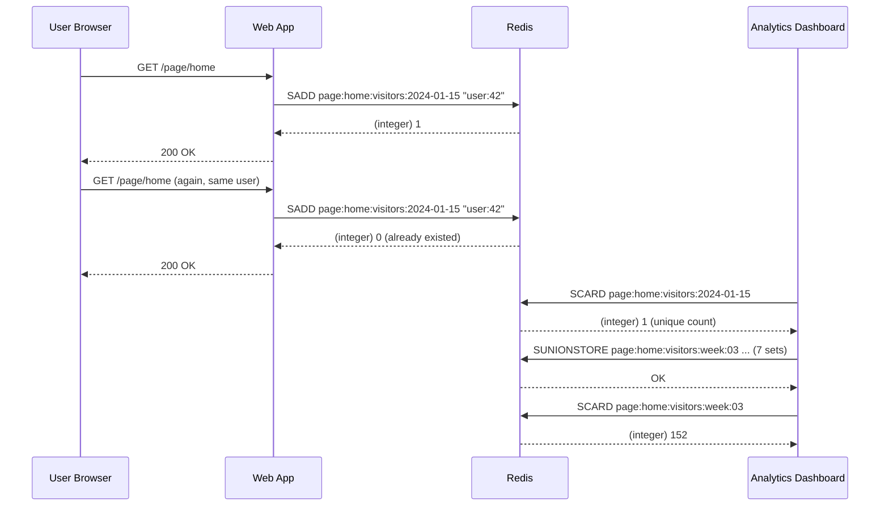
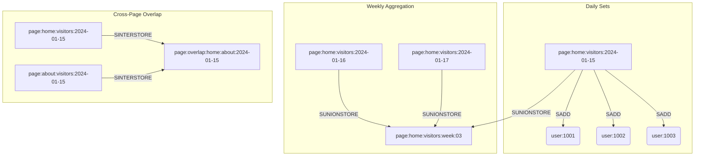

# 1 — Overview

Unique visitor tracking is one of the most common real-world use cases for Redis Sets. The problem is straightforward: given a stream of user visits (page views, API calls, feature usage, etc.), count how many distinct users accessed a resource within a given time period. Redis Sets solve this elegantly using SADD to add user IDs and SCARD to retrieve the unique count.

The key insight is that Redis Sets guarantee uniqueness natively. Calling SADD with the same user ID multiple times only adds it once. The cardinality (SCARD) always reflects the exact number of unique members, without any application-side deduplication logic.

## 1.1 — Key Pattern

The recommended key naming convention for visitor tracking is:

`
page:{pageId}:visitors:{yyyy-MM-dd}
`

This structure allows:
- Daily unique visitor counts via SCARD
- Cross-day union for weekly/monthly aggregates via SUNION
- Cross-page intersection for overlap analysis via SINTER
- Automatic TTL on old daily sets for memory management
- Date-range queries by key pattern scanning

## 1.2 — Example Flow

`
User visits page /home on 2024-01-15
    -> SADD page:home:visitors:2024-01-15 "user:42"
    -> SCARD page:home:visitors:2024-01-15 -> 1

User visits page /home again on same day
    -> SADD page:home:visitors:2024-01-15 "user:42"
    -> SCARD page:home:visitors:2024-01-15 -> 1 (still 1)

Different user visits page /home on same day
    -> SADD page:home:visitors:2024-01-15 "user:99"
    -> SCARD page:home:visitors:2024-01-15 -> 2
`

## 1.3 — Comparison of Approaches

| Approach | Memory | Accuracy | Membership Check | Complexity |
| -------- | ------ | -------- | ---------------- | ---------- |
| Redis Sets | High (per member) | Exact 100% | Yes (O(1)) | Simple |
| Redis Bitmaps | Low (1 bit/user) | Exact 100% | Yes (O(1)) | Requires user-ID mapping |
| Redis HyperLogLog | Very low (12KB) | ~0.81% error | No | Simple |
| Database | Depends on DB | Exact | Yes | Complex queries |
| Log file analysis | N/A | Exact | No | Batch/offline |

# 2 — CLI Examples

## 2.1 — Basic Daily Visitor Tracking

```bash
SADD page:home:visitors:2024-01-15 "user:1001"
# (integer) 1
SADD page:home:visitors:2024-01-15 "user:1001"
# (integer) 0
SADD page:home:visitors:2024-01-15 "user:1002"
SADD page:home:visitors:2024-01-15 "user:1003"
SADD page:home:visitors:2024-01-15 "user:1004"
SCARD page:home:visitors:2024-01-15
# (integer) 4
```

## 2.2 — Weekly Unique Visitors with SUNION

```bash
SADD page:home:visitors:2024-01-15 "user:1001" "user:1002"
SADD page:home:visitors:2024-01-16 "user:1002" "user:1003"
SADD page:home:visitors:2024-01-17 "user:1004" "user:1005"
SADD page:home:visitors:2024-01-18 "user:1001" "user:1006"
SADD page:home:visitors:2024-01-19 "user:1007" "user:1008"

SUNIONSTORE page:home:visitors:week:03 \
  page:home:visitors:2024-01-15 \
  page:home:visitors:2024-01-16 \
  page:home:visitors:2024-01-17 \
  page:home:visitors:2024-01-18 \
  page:home:visitors:2024-01-19
SCARD page:home:visitors:week:03
# (integer) 8
```

## 2.3 — Cross-Page Overlap with SINTER

```bash
SADD page:home:visitors:2024-01-15 "user:1001" "user:1002" "user:1003"
SADD page:about:visitors:2024-01-15 "user:1002" "user:1004" "user:1005"

SINTER page:home:visitors:2024-01-15 page:about:visitors:2024-01-15
# 1) "user:1002"

SINTERSTORE page:overlap:2024-01-15 \
  page:home:visitors:2024-01-15 \
  page:about:visitors:2024-01-15
SCARD page:overlap:2024-01-15
# (integer) 1
```

## 2.4 — Monthly Aggregate with SUNIONSTORE + DEL

```bash
SUNIONSTORE page:home:visitors:2024-01 \
  page:home:visitors:2024-01-01 \
  page:home:visitors:2024-01-02 \
  ...
  page:home:visitors:2024-01-31
SCARD page:home:visitors:2024-01
# (integer) 4523

# Clean up daily sets after aggregation
DEL page:home:visitors:2024-01-01
DEL page:home:visitors:2024-01-02
...
DEL page:home:visitors:2024-01-31
```

## 2.5 — Batch Insert with SADD Variadic

```bash
SADD page:home:visitors:2024-01-15 \
  "user:1001" "user:1002" "user:1003" \
  "user:1004" "user:1005" "user:1006"
# (integer) 6
```

# 3 — StackExchange.Redis C# Code

## 3.1 — Basic Visitor Tracking

```csharp
using StackExchange.Redis;

class VisitorTracker
{
    private static readonly ConnectionMultiplexer redis =
        ConnectionMultiplexer.Connect("localhost:6379");
    private static readonly IDatabase db = redis.GetDatabase();

    public static async Task RecordVisitAsync(string pageId, string userId, DateTime date)
    {
        string key = $"page:{pageId}:visitors:{date:yyyy-MM-dd}";
        await db.SetAddAsync(key, userId);
    }

    public static async Task<long> GetDailyUniqueVisitorsAsync(
        string pageId, DateTime date)
    {
        string key = $"page:{pageId}:visitors:{date:yyyy-MM-dd}";
        return await db.SetLengthAsync(key);
    }
}
```

## 3.2 — Weekly Aggregate via SUNIONSTORE

```csharp
public static async Task<long> AggregateWeeklyAsync(
    string pageId, DateTime weekStart)
{
    string[] keys = Enumerable.Range(0, 7)
        .Select(offset => $"page:{pageId}:visitors:{weekStart.AddDays(offset):yyyy-MM-dd}")
        .ToArray();

    string destKey = $"page:{pageId}:visitors:week:{weekStart:yyyy-MM-dd}";
    await db.SetCombineAndStoreAsync(SetOperation.Union, destKey, keys);
    return await db.SetLengthAsync(destKey);
}
```

## 3.3 — Cross-Page Overlap with SINTERSTORE

```csharp
public static async Task<long> GetCrossPageOverlapAsync(
    string pageA, string pageB, DateTime date)
{
    string keyA = $"page:{pageA}:visitors:{date:yyyy-MM-dd}";
    string keyB = $"page:{pageB}:visitors:{date:yyyy-MM-dd}";
    string dest = $"page:overlap:{pageA}:{pageB}:{date:yyyy-MM-dd}";

    await db.SetCombineAndStoreAsync(SetOperation.Intersect, dest, keyA, keyB);
    return await db.SetLengthAsync(dest);
}
```

## 3.4 — Visitor Check (SISMEMBER)

```csharp
public static async Task<bool> HasUserVisitedAsync(
    string pageId, string userId, DateTime date)
{
    string key = $"page:{pageId}:visitors:{date:yyyy-MM-dd}";
    return await db.SetContainsAsync(key, userId);
}
```

## 3.5 — Batch Insert with Transaction

```csharp
public static async Task RecordVisitsBulkAsync(
    string pageId, DateTime date, params string[] userIds)
{
    string key = $"page:{pageId}:visitors:{date:yyyy-MM-dd}";

    var tran = db.CreateTransaction();
    _ = tran.SetAddAsync(key, userIds);
    bool committed = await tran.ExecuteAsync();
}
```

## 3.6 — Set Cleanup with EXPIRE

```csharp
public static async Task RecordVisitWithTTLAsync(
    string pageId, string userId, DateTime date, TimeSpan ttl)
{
    string key = $"page:{pageId}:visitors:{date:yyyy-MM-dd}";
    await db.SetAddAsync(key, userId);
    await db.KeyExpireAsync(key, ttl);
}
```

## 3.7 — Full Service Class

```csharp
using StackExchange.Redis;

public class UniqueVisitorsService : IDisposable
{
    private readonly ConnectionMultiplexer _redis;
    private readonly IDatabase _db;
    private readonly TimeSpan _defaultTtl = TimeSpan.FromDays(90);

    public UniqueVisitorsService(string connectionString)
    {
        _redis = ConnectionMultiplexer.Connect(connectionString);
        _db = _redis.GetDatabase();
    }

    public async Task RecordVisitAsync(
        string pageId, string userId, DateTime? date = null)
    {
        date ??= DateTime.UtcNow;
        string key = BuildKey(pageId, date.Value);

        var tran = _db.CreateTransaction();
        _ = tran.SetAddAsync(key, userId);
        _ = tran.KeyExpireAsync(key, _defaultTtl);
        await tran.ExecuteAsync();
    }

    public async Task<long> GetDailyCountAsync(
        string pageId, DateTime date)
    {
        string key = BuildKey(pageId, date);
        return await _db.SetLengthAsync(key);
    }

    public async Task<long> GetWeeklyCountAsync(
        string pageId, DateTime weekStart)
    {
        var keys = Enumerable.Range(0, 7)
            .Select(d => BuildKey(pageId, weekStart.AddDays(d)))
            .ToArray();

        string dest = $"page:{pageId}:visitors:week:{weekStart:yyyy-MM-dd}";
        await _db.SetCombineAndStoreAsync(SetOperation.Union, dest, keys);
        return await _db.SetLengthAsync(dest);
    }

    public async Task<long> GetMonthlyCountAsync(
        string pageId, int year, int month)
    {
        int daysInMonth = DateTime.DaysInMonth(year, month);
        var keys = Enumerable.Range(1, daysInMonth)
            .Select(d => BuildKey(pageId, new DateTime(year, month, d)))
            .ToArray();

        string dest = $"page:{pageId}:visitors:{year:yyyy}-{month:MM}";
        await _db.SetCombineAndStoreAsync(SetOperation.Union, dest, keys);
        return await _db.SetLengthAsync(dest);
    }

    public async Task<bool> HasVisitedAsync(
        string pageId, string userId, DateTime date)
    {
        string key = BuildKey(pageId, date);
        return await _db.SetContainsAsync(key, userId);
    }

    public async Task<long> GetOverlapAsync(
        string pageA, string pageB, DateTime date)
    {
        string keyA = BuildKey(pageA, date);
        string keyB = BuildKey(pageB, date);
        string dest = $"page:overlap:{pageA}:{pageB}:{date:yyyy-MM-dd}";

        await _db.SetCombineAndStoreAsync(
            SetOperation.Intersect, dest, keyA, keyB);
        return await _db.SetLengthAsync(dest);
    }

    public async Task CleanupOldSetsAsync(
        string pageId, DateTime cutoffDate)
    {
        var server = _redis.GetServer(_redis.GetEndPoints().First());
        var pattern = $"page:{pageId}:visitors:*";
        var keys = server.Keys(pattern: pattern).ToArray();

        foreach (var key in keys)
        {
            string dateStr = key.ToString()!.Split(':').Last();
            if (DateTime.TryParseExact(dateStr, "yyyy-MM-dd",
                    null, System.Globalization.DateTimeStyles.None,
                    out var keyDate) && keyDate < cutoffDate)
            {
                await _db.KeyDeleteAsync(key);
            }
        }
    }

    private static string BuildKey(string pageId, DateTime date) =>
        $"page:{pageId}:visitors:{date:yyyy-MM-dd}";

    public void Dispose() => _redis?.Dispose();
}
```

## 3.8 — ASP.NET Core Middleware Integration

```csharp
// Program.cs
builder.Services.AddSingleton(new UniqueVisitorsService(
    builder.Configuration.GetConnectionString("Redis")));
builder.Services.AddScoped<VisitorTrackingMiddleware>();

// Middleware
public class VisitorTrackingMiddleware : IMiddleware
{
    private readonly UniqueVisitorsService _service;

    public VisitorTrackingMiddleware(UniqueVisitorsService service)
    {
        _service = service;
    }

    public async Task InvokeAsync(HttpContext context, RequestDelegate next)
    {
        await next(context);

        if (context.User.Identity?.IsAuthenticated == true)
        {
            string userId = context.User.FindFirst("sub")?.Value ?? "anonymous";
            string pageId = context.Request.Path.ToString().Trim('/');
            pageId = string.IsNullOrEmpty(pageId) ? "home" : pageId;

            await _service.RecordVisitAsync(pageId, userId);
        }
    }
}
```

## 3.9 — Dashboard API Endpoint

```csharp
[ApiController]
[Route("api/analytics")]
public class AnalyticsController : ControllerBase
{
    private readonly UniqueVisitorsService _service;

    public AnalyticsController(UniqueVisitorsService service)
    {
        _service = service;
    }

    [HttpGet("daily/{pageId}/{date}")]
    public async Task<ActionResult> GetDaily(
        string pageId, DateTime date)
    {
        long count = await _service.GetDailyCountAsync(pageId, date);
        return Ok(new { pageId, date, uniqueVisitors = count });
    }

    [HttpGet("weekly/{pageId}/{startDate}")]
    public async Task<ActionResult> GetWeekly(
        string pageId, DateTime startDate)
    {
        long count = await _service.GetWeeklyCountAsync(pageId, startDate);
        return Ok(new { pageId, weekStart = startDate, uniqueVisitors = count });
    }

    [HttpGet("monthly/{pageId}/{year}/{month}")]
    public async Task<ActionResult> GetMonthly(
        string pageId, int year, int month)
    {
        long count = await _service.GetMonthlyCountAsync(pageId, year, month);
        return Ok(new { pageId, year, month, uniqueVisitors = count });
    }

    [HttpGet("overlap")]
    public async Task<ActionResult> GetOverlap(
        string pageA, string pageB, DateTime date)
    {
        long count = await _service.GetOverlapAsync(pageA, pageB, date);
        return Ok(new { pageA, pageB, date, overlappingVisitors = count });
    }
}
```

## 3.10 — Error Handling and Polly Retry

```csharp
using Polly;
using Polly.Retry;
using StackExchange.Redis;

public class ResilientVisitorTracker
{
    private readonly IDatabase _db;
    private readonly AsyncRetryPolicy _retryPolicy;
    private readonly ILogger<ResilientVisitorTracker> _logger;

    public ResilientVisitorTracker(
        ConnectionMultiplexer redis,
        ILogger<ResilientVisitorTracker> logger)
    {
        _db = redis.GetDatabase();
        _logger = logger;

        _retryPolicy = Policy
            .Handle<RedisConnectionException>()
            .Or<RedisServerException>()
            .Or<TimeoutException>()
            .WaitAndRetryAsync(
                retryCount: 3,
                sleepDurationProvider: attempt =>
                    TimeSpan.FromMilliseconds(100 * Math.Pow(2, attempt)),
                onRetry: (ex, time, attempt, ctx) =>
                {
                    _logger.LogWarning(ex,
                        "Redis retry attempt {Attempt} after {Delay}ms",
                        attempt, time.TotalMilliseconds);
                });
    }

    public async Task RecordVisitWithRetryAsync(
        string pageId, string userId)
    {
        string key = $"page:{pageId}:visitors:{DateTime.UtcNow:yyyy-MM-dd}";

        await _retryPolicy.ExecuteAsync(async () =>
        {
            await _db.SetAddAsync(key, userId);
        });
    }

    public async Task<long> GetCountWithFallbackAsync(
        string pageId, DateTime date)
    {
        string key = $"page:{pageId}:visitors:{date:yyyy-MM-dd}";
        try
        {
            return await _retryPolicy.ExecuteAsync(
                () => _db.SetLengthAsync(key));
        }
        catch (Exception ex)
        {
            _logger.LogError(ex, "Failed to get visitor count for {Key}", key);
            return -1;
        }
    }
}
```

# 4 — Performance Analysis

## 4.1 — Time Complexity

| Operation | Complexity | Notes |
| --------- | ---------- | ----- |
| SADD | O(1) per member | Hash-table insert |
| SCARD | O(1) | Stored in set metadata |
| SISMEMBER | O(1) | Hash-table lookup |
| SMEMBERS | O(N) | Returns all members |
| SUNIONSTORE | O(N) where N = total elements across sets |
| SINTERSTORE | O(N * M) where N = smallest set, M = number of sets |
| SDIFFSTORE | O(N) where N = total elements in first set |

## 4.2 — Memory Considerations

Each member in a Redis Set consumes:
- 8 bytes for the hash table entry (pointer)
- The length of the member string (e.g., "user:1001" = 9 bytes)
- Overhead: ~64 bytes per entry (ziplist or hashtable encoding)

For 1 million visitors tracking:
- 1M members x ~72 bytes = ~72 MB per daily set
- 30 daily sets = ~2.1 GB for a month
- 7-day retention = ~500 MB

## 4.3 — Encoding Optimization

Redis automatically uses **ziplist** encoding for small sets (by default < 512 members and each member < 64 bytes). This is far more memory-efficient than the hash-table encoding used for larger sets.

```bash
CONFIG GET set-max-intset-entries
# "512"

OBJECT ENCODING page:home:visitors:2024-01-15
# "hashtable" (for large sets)
# "ziplist"  (for small sets)
```

## 4.4 — Network Round Trips

Without pipelining, each SADD or SCARD is one round trip. For high-traffic pages, this adds latency:

```csharp
// Bad: N round trips for N visits
foreach (var userId in userIds)
{
    await db.SetAddAsync(key, userId);
}

// Good: 1 round trip with variadic SADD
await db.SetAddAsync(key, userIds);

// Better: pipeline if accepting one at a time
var tasks = userIds.Select(id => db.SetAddAsync(key, id));
await Task.WhenAll(tasks);
```

## 4.5 — SMEMBERS Warning

Never call SMEMBERS on a set with millions of members. It blocks Redis and transfers massive data. Use SSCAN for iteration:

```csharp
public static async Task<List<string>> ScanMembersAsync(
    IDatabase db, string key, int pageSize = 1000)
{
    var members = new List<string>();
    long cursor = 0;

    do
    {
        var result = await db.SetScanAsync(key, pageSize: pageSize);
        cursor = result.Cursor;
        members.AddRange(result.ToList());
    }
    while (cursor != 0);

    return members;
}
```

# 5 — Use Cases

## 5.1 — Website Analytics Dashboard

Track daily active users per page, aggregate weekly/monthly:

```csharp
public class AnalyticsDashboard
{
    private readonly UniqueVisitorsService _service;

    public async Task<AnalyticsReport> GenerateReportAsync(
        string pageId, int year, int month)
    {
        var monthly = await _service.GetMonthlyCountAsync(pageId, year, month);

        var dailyCounts = new Dictionary<string, long>();
        int days = DateTime.DaysInMonth(year, month);
        for (int d = 1; d <= days; d++)
        {
            var date = new DateTime(year, month, d);
            long count = await _service.GetDailyCountAsync(pageId, date);
            dailyCounts[date.ToString("yyyy-MM-dd")] = count;
        }

        return new AnalyticsReport
        {
            PageId = pageId,
            Year = year,
            Month = month,
            MonthlyUnique = monthly,
            DailyBreakdown = dailyCounts
        };
    }
}

public record AnalyticsReport
{
    public string PageId { get; init; }
    public int Year { get; init; }
    public int Month { get; init; }
    public long MonthlyUnique { get; init; }
    public Dictionary<string, long> DailyBreakdown { get; init; }
}
```

## 5.2 — API Rate Limit Monitoring

Track unique API consumers per endpoint per hour/day for usage billing:

```csharp
public static async Task RecordApiCallAsync(
    IDatabase db, string apiKey, string endpoint)
{
    string key = $"api:{endpoint}:consumers:{DateTime.UtcNow:yyyy-MM-dd}";
    await db.SetAddAsync(key, apiKey);
}

public static async Task<long> GetDailyUniqueConsumersAsync(
    IDatabase db, string endpoint, DateTime date)
{
    string key = $"api:{endpoint}:consumers:{date:yyyy-MM-dd}";
    return await db.SetLengthAsync(key);
}
```

## 5.3 — A/B Test Assignment Tracking

Track which users were assigned to which experiment variant:

```csharp
public static async Task AssignVariantAsync(
    IDatabase db, string experimentId, string userId, string variant)
{
    string key = $"abtest:{experimentId}:{variant}";
    await db.SetAddAsync(key, userId);
}

public static async Task<long> GetVariantCountAsync(
    IDatabase db, string experimentId, string variant)
{
    string key = $"abtest:{experimentId}:{variant}";
    return await db.SetLengthAsync(key);
}

public static async Task<bool> IsUserInExperimentAsync(
    IDatabase db, string experimentId, string userId)
{
    // Check all variants for this user
    var variants = new[] { "control", "variant-a", "variant-b" };
    foreach (var variant in variants)
    {
        string key = $"abtest:{experimentId}:{variant}";
        if (await db.SetContainsAsync(key, userId))
            return true;
    }
    return false;
}
```

## 5.4 — Event Attendance Tracking

```csharp
public static async Task<RsvpResult> TrackAttendanceAsync(
    IDatabase db, string eventId, string userId)
{
    string key = $"event:{eventId}:attendees";
    bool wasAdded = await db.SetAddAsync(key, userId);
    long total = await db.SetLengthAsync(key);

    return new RsvpResult
    {
        UserId = userId,
        IsNewAttendee = wasAdded,
        TotalAttendees = total
    };
}

public record RsvpResult
{
    public string UserId { get; init; }
    public bool IsNewAttendee { get; init; }
    public long TotalAttendees { get; init; }
}
```

## 5.5 — IP-Based Bot Detection

```csharp
public static async Task<bool> IsSuspiciousIpAsync(
    IDatabase db, string ip, int threshold = 100)
{
    string key = $"ip:visits:{DateTime.UtcNow:yyyy-MM-dd-HH}";
    long count = await db.SetAddAsync(key, ip);

    // If SADD returned 0, the IP was already counted this hour
    // Track request count separately with a string counter
    string countKey = $"ip:count:{ip}:{DateTime.UtcNow:yyyy-MM-dd-HH}";
    long requestCount = await db.StringIncrementAsync(countKey);
    await db.KeyExpireAsync(countKey, TimeSpan.FromHours(2));

    return requestCount > threshold;
}
```

# 6 — Comparison with Alternatives

## 6.1 — Full Comparison Matrix

| Feature | Redis Sets | Redis Bitmaps | HyperLogLog | SQL Database | Log File Analysis |
| ------- | ---------- | ------------- | ----------- | ------------ | ----------------- |
| Accuracy | Exact 100% | Exact 100% | ~0.81% error | Exact 100% | Exact 100% |
| Memory (1M users) | ~72 MB | ~125 KB | ~12 KB | ~100-500 MB | N/A (disk) |
| Per-user cost | Full string stored | 1 bit | Probabilistic | Row per visit | Log entry |
| Membership check | O(1), yes | O(1), yes | No | O(log N) | No |
| Real-time | Yes | Yes | Yes | With indexing | Batch only |
| Aggregation | SUNION/SINTER | BITOP | PFMERGE | SQL JOINs | Script/MapReduce |
| TTL support | Yes | Yes | Yes | No | N/A |
| Cluster safe | Yes (same slot) | Yes | Yes | N/A | N/A |
| Development effort | Low | Medium | Low | High (schema + queries) | Medium |

## 6.2 — Decision Guide

Use **Redis Sets** when:
- You need 100% exact unique counts
- You need membership checks (has this user visited?)
- You need intersections (users who visited both pages)
- Set size is under ~10 million members
- Memory is not the primary constraint

Use **Redis Bitmaps** when:
- You have a dense, pre-mapped user ID space (e.g., integer IDs 1..N)
- You need exact counts with minimal memory
- You do bitwise operations across time periods
- You accept the complexity of ID-to-bit-offset mapping

Use **HyperLogLog** when:
- You only need approximate unique counts
- Memory is critical (< 12 KB per key)
- Membership checks are not required
- Error tolerance of ~0.81% is acceptable

Use **SQL Database** when:
- You need complex queries on visit metadata (timestamps, user agents, etc.)
- You need joins with user-profile tables
- You need historical reporting beyond TTL windows
- The data must survive Redis restarts without persistence config

Use **Log File Analysis** when:
- You process visits asynchronously (hourly/daily batches)
- You already have a logging infrastructure (ELK, Splunk)
- Real-time counts are not needed

# 7 — Mermaid Diagrams

## 7.1 — Visitor Tracking Flow



## 7.2 — Key Structure



## 7.3 — Memory vs Accuracy Trade-off


# 8 — Common Pitfalls and Gotchas

## 8.1 — Key Explosion

Each day and page combination creates a new key. With 1000 pages tracked daily, you generate 365,000 keys per year. Without TTL, old keys accumulate indefinitely.

```csharp
// Always set TTL when creating daily sets
public static async Task RecordVisitWithTTLAsync(
    IDatabase db, string pageId, string userId)
{
    string key = $"page:{pageId}:visitors:{DateTime.UtcNow:yyyy-MM-dd}";
    var tran = db.CreateTransaction();
    _ = tran.SetAddAsync(key, userId);
    _ = tran.KeyExpireAsync(key, TimeSpan.FromDays(90));
    await tran.ExecuteAsync();
}
```

## 8.2 — Large Sets and SMEMBERS

Calling SMEMBERS on a set with hundreds of thousands of members will block Redis for seconds and produce a massive network payload.

```csharp
// BAD - blocks Redis
var allMembers = await db.SetMembersAsync("page:home:visitors:2024-01-15");

// GOOD - use SSCAN for iteration
public static async Task ProcessVisitorsBatchedAsync(
    IDatabase db, string key, int batchSize, Func<string, Task> processor)
{
    long cursor = 0;
    do
    {
        var batch = await db.SetScanAsync(key, cursor, pageSize: batchSize);
        cursor = batch.Cursor;
        foreach (var member in batch)
        {
            await processor(member.ToString()!);
        }
    }
    while (cursor != 0);
}
```

## 8.3 — Cross-Slot Operations in Redis Cluster

In Redis Cluster, keys are distributed across 16,384 hash slots. SUNIONSTORE and SINTERSTORE fail if keys belong to different slots. Use hash tags `{...}` to force keys into the same slot:

```csharp
// Without hash tag - may span multiple slots
string keyA = $"page:{pageId}:visitors:2024-01-15";
string keyB = $"page:{pageId}:visitors:2024-01-16";

// With hash tag - same slot guaranteed
string keyA = $"page:{{{pageId}}}:visitors:2024-01-15";
string keyB = $"page:{{{pageId}}}:visitors:2024-01-16";
```

The `{pageId}` ensures both keys hash to the same slot because only the text inside `{...}` is hashed.

## 8.4 — SCARD vs DEBUG OBJECT for Memory Debugging

SCARD gives the number of members, not memory usage. Use MEMORY USAGE to check actual memory:

```bash
MEMORY USAGE page:home:visitors:2024-01-15
# (integer) 721208
```

## 8.5 — SADD Return Value Semantics

SADD returns the number of newly added members. A return of 0 means all members already existed. This is useful for determining if a visit is truly new:

```csharp
public static async Task<bool> IsFirstVisitTodayAsync(
    IDatabase db, string pageId, string userId)
{
    string key = $"page:{pageId}:visitors:{DateTime.UtcNow:yyyy-MM-dd}";
    long added = await db.SetAddAsync(key, userId);
    return added == 1; // true if this is the first time today
}
```

## 8.6 — Variadic SADD vs Pipeline

For bulk inserts, variadic SADD is faster than pipelined individual SADDs:

```csharp
// Fastest: single command with 100 members
await db.SetAddAsync(key, listOfUserIds.ToArray());

// Good: pipeline individual commands (if receiving one at a time)
var tasks = listOfUserIds.Select(id => db.SetAddAsync(key, id));
await Task.WhenAll(tasks);

// Avoid: sequential awaits
foreach (var id in listOfUserIds)
    await db.SetAddAsync(key, id); // N round trips!
```

## 8.7 — Member Size Limits

Each set member can be up to 512 MB, but practical limits are much lower. Large members waste memory and slow down operations. Keep members under 100 bytes.

```csharp
// BAD - using large serialized objects as members
string largeMember = JsonSerializer.Serialize(new
{
    userId = "user:42",
    userAgent = "Mozilla/5.0 ... (800 byte UA string)",
    ipAddress = "192.168.1.1",
    timestamp = DateTime.UtcNow
});
await db.SetAddAsync("page:home:visitors:today", largeMember);

// GOOD - use a compact, unique identifier only
await db.SetAddAsync("page:home:visitors:today", "user:42");
```

## 8.8 — TTL Reset on SADD

Calling SADD on an existing key resets its TTL to -1 (no expiry). Always set TTL in the same transaction as SADD, even for existing keys:

```csharp
// TTL must be set in same transaction
var tran = db.CreateTransaction();
_ = tran.SetAddAsync(key, userId);
_ = tran.KeyExpireAsync(key, TimeSpan.FromDays(90));
await tran.ExecuteAsync();
// This ensures the TTL is refreshed every time, even for repeat visitors
```

# 9 — Summary

Redis Sets provide a simple, exact, and performant solution for unique visitor tracking. Key takeaways:

1. **Use SADD to record visits** — Redis enforces uniqueness, so duplicate visits are automatically ignored.
2. **Use SCARD for counts** — O(1) operation returns exact unique visitor count.
3. **Use SUNIONSTORE/SINTERSTORE for aggregation** — Combine daily sets into weekly, monthly, or cross-page views.
4. **Always set TTL** — Prevent unbounded key growth with a 90-day (or appropriate) expiration.
5. **Use hash tags in Redis Cluster** — Ensure set keys for the same page fall in the same hash slot.
6. **Prefer Sets over HyperLogLog when accuracy matters** — Sets give exact counts at higher memory cost.
7. **Avoid SMEMBERS on large sets** — Use SSCAN for iteration.
8. **Use variadic SADD for batch inserts** — Minimize round trips.

The pattern `page:{pageId}:visitors:{yyyy-MM-dd}` scales to millions of visitors per day and thousands of pages, with exact accuracy and O(1) read performance.
