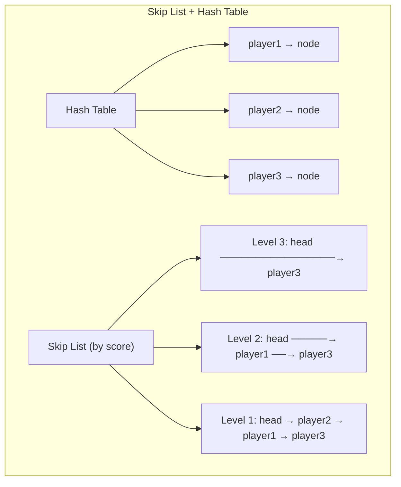
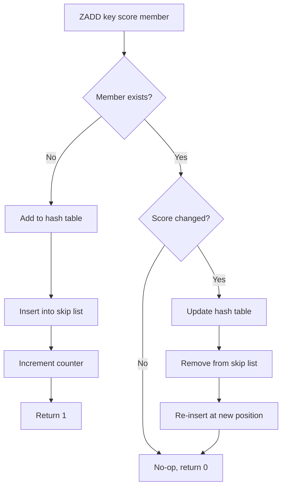
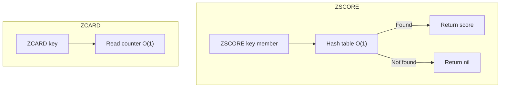
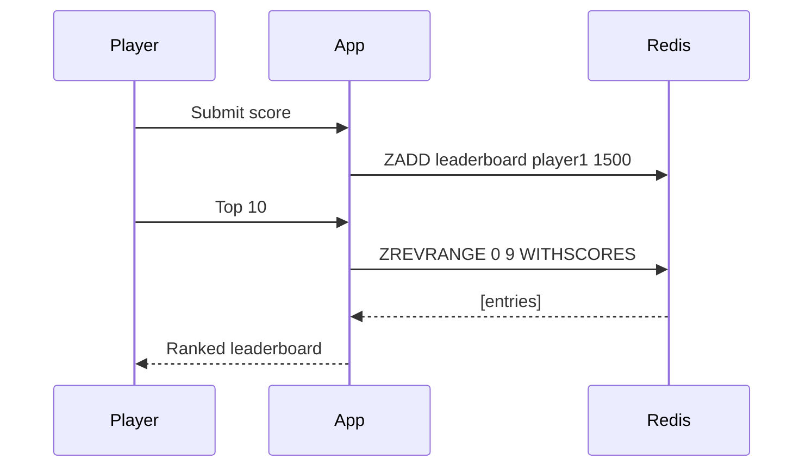
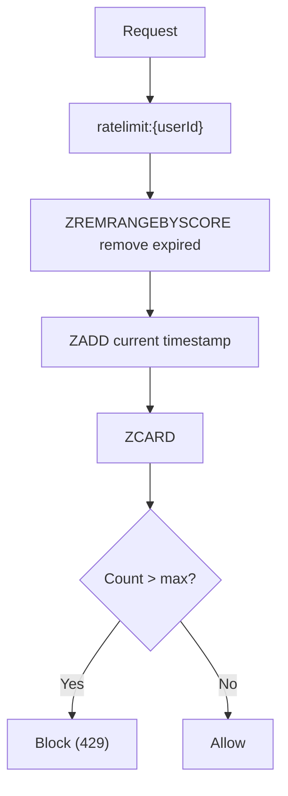
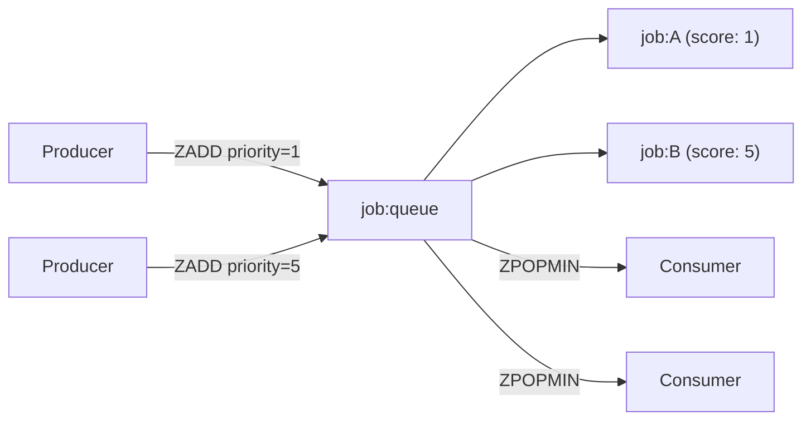
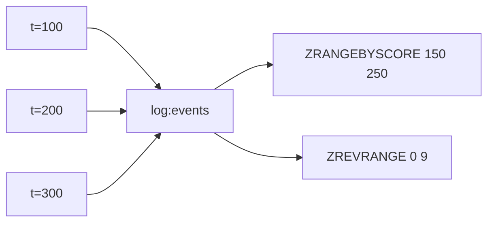
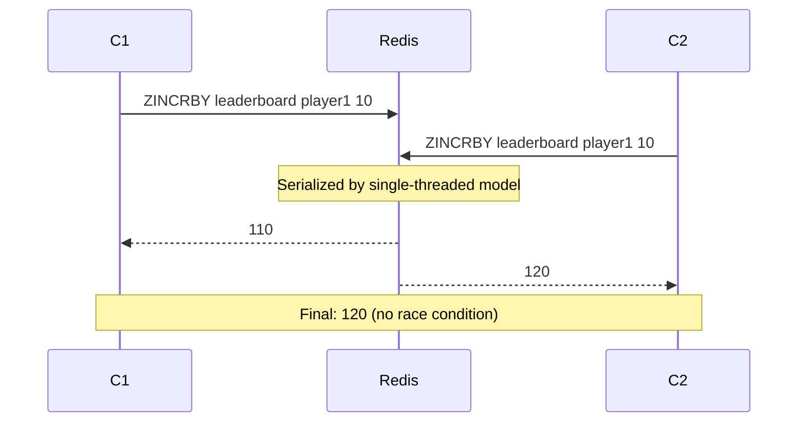
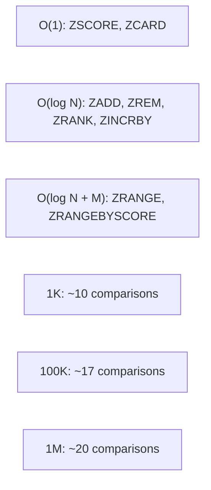
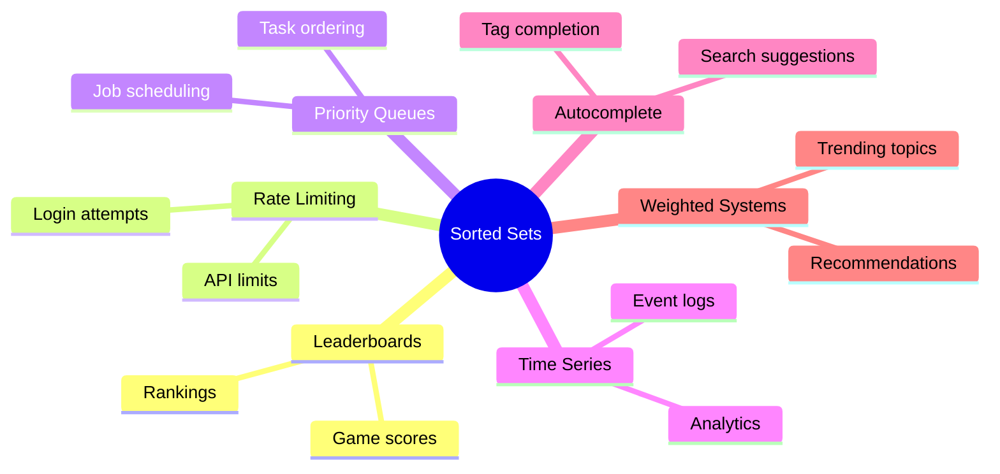

# 1 — Overview

Redis Sorted Sets combine the uniqueness guarantee of Sets with a scoring system that orders members. Each member has an associated double-precision score, and members are always ordered by score (ascending, with ties broken lexicographically).

The four foundational Sorted Set commands are:

| Command | Purpose | Time Complexity | Return Value |
| ------- | ------- | --------------- | ------------ |
| ZADD key [NX|XX] [GT|LT] [CH] [INCR] score member | Add/update member with score | O(log N) per item | Integer: number of new members added |
| ZREM key member [member ...] | Remove one or more members | O(log N) per item | Integer: number of removed members |
| ZSCORE key member | Get the score of a member | O(1) | Double (string) |
| ZCARD key | Return the cardinality (count) | O(1) | Integer |

## 1.1 — Internal Data Structure

Sorted Sets use a **skip list** combined with a **hash table**:
- **Skip list**: O(log N) insert, update, delete, and range queries
- **Hash table**: O(1) lookups for direct member access (ZSCORE, ZREM check)

## 1.2 — Score Properties

- Scores are **double-precision floating point** numbers
- Members with the **same score** are ordered **lexicographically**
- Scores can be **negative**
- ZINCRBY allows **atomic score updates**
- NX: only add new members, don't update existing
- XX: only update existing members, don't add new
- GT/LT (Redis 6.2+): only update if new score is greater/less than current

## 1.3 — Sorted Sets vs Regular Sets

| Aspect | Sets | Sorted Sets |
| ------ | ---- | ----------- |
| Ordering | None | By score (ascending) |
| Score | No | Yes (double) |
| Add command | SADD | ZADD |
| Get all | SMEMBERS (O(N)) | ZRANGE (O(log N + M)) |
| Count | SCARD (O(1)) | ZCARD (O(1)) |
| Range queries | Not possible | ZRANGEBYSCORE, ZREVRANGE |
| Rank queries | Not possible | ZRANK, ZREVRANK |
| Memory | Less | More (skip list) |

## 1.4 — Common Use Cases

- **Leaderboards**: Game scores, contest rankings
- **Rate Limiting**: Score = timestamp, window-based limiting
- **Priority Queues**: Score = priority, ordered processing
- **Autocomplete**: Score = frequency/rank
- **Time Series**: Score = Unix timestamp, ordered events
- **Weighted Random Sampling**: Score = weight

# 2 — CLI Examples

## 2.1 — Basic ZADD

```bash
ZADD leaderboard 100 "player1" 200 "player2" 50 "player3"
# (integer) 3

ZADD leaderboard 150 "player1"
# (integer) 0 — player1 existed, score updated

ZADD leaderboard NX 300 "player4"
# (integer) 1

ZADD leaderboard XX 175 "player1"
# (integer) 0 — player1 updated
```

## 2.2 — ZREM

```bash
ZREM leaderboard "player3"
# (integer) 1

ZREM leaderboard "player1" "player4"
# (integer) 2

ZREM leaderboard "nonexistent"
# (integer) 0
```

## 2.3 — ZSCORE

```bash
ZSCORE leaderboard "player2"
# "200"

ZSCORE leaderboard "nonexistent"
# (nil)
```

## 2.4 — ZCARD

```bash
ZCARD leaderboard
# (integer) 4
```

## 2.5 — ZINCRBY

```bash
ZINCRBY leaderboard 50 "player2"
# "250"

ZINCRBY leaderboard -30 "player2"
# "220"
```

## 2.6 — ZRANGE and ZREVRANGE

```bash
ZRANGE leaderboard 0 -1
# 1) "player3" 2) "player1" 3) "player2"

ZRANGE leaderboard 0 -1 WITHSCORES
# 1) "player3" 2) "50" 3) "player1" 4) "150" 5) "player2" 6) "200"

ZREVRANGE leaderboard 0 1
# 1) "player2" 2) "player1"
```

## 2.7 — ZRANGEBYSCORE

```bash
ZRANGEBYSCORE leaderboard 100 200
# 1) "player1" 2) "player2"

ZRANGEBYSCORE leaderboard 100 (200
# 1) "player1"

ZRANGEBYSCORE leaderboard 150 +inf
# 1) "player1" 2) "player2"
```

## 2.8 — ZRANK and ZREVRANK

```bash
ZRANK leaderboard "player1"
# (integer) 1

ZREVRANK leaderboard "player1"
# (integer) 1
```

## 2.9 — ZREMRANGEBYRANK and ZREMRANGEBYSCORE

```bash
ZREMRANGEBYRANK leaderboard 0 1
# (integer) 2

ZREMRANGEBYSCORE leaderboard -inf 100
# (integer) 1
```

## 2.10 — Rate Limiting with ZADD

```bash
ZADD rate:limiter:user:42 1700000000 "req:1"
ZADD rate:limiter:user:42 1700000001 "req:2"

ZREMRANGEBYSCORE rate:limiter:user:42 -inf 1699999940
ZCARD rate:limiter:user:42
# (integer) 2

EXPIRE rate:limiter:user:42 60
```

## 2.11 — Priority Queue Pattern

```bash
ZADD job:queue 1 "urgent:task:1"
ZADD job:queue 5 "normal:task:2"
ZADD job:queue 10 "background:task:3"

ZRANGE job:queue 0 0
ZPOPMIN job:queue
```

## 2.12 — ZCOUNT

```bash
ZCOUNT leaderboard 100 200
# (integer) 2

ZCOUNT leaderboard -inf +inf
# (integer) 3
```

## 2.13 — ZLEXCOUNT and ZRANGEBYLEX

```bash
ZADD dictionary 0 "apple" 0 "banana" 0 "cherry"

ZRANGEBYLEX dictionary [a [c
ZLEXCOUNT dictionary [a [c
# (integer) 3
```

## 2.14 — ZPOPMIN and ZPOPMAX

```bash
ZPOPMIN leaderboard
ZPOPMAX leaderboard 2
```

## 2.15 — BZPOPMIN and BZPOPMAX

```bash
BZPOPMIN leaderboard job:queue 5
```

# 3 — StackExchange.Redis C# API

## 3.1 — Connection Setup

```csharp
using StackExchange.Redis;

public class SortedSetService
{
    private readonly ConnectionMultiplexer _redis;
    private readonly IDatabase _db;

    public SortedSetService(string connectionString)
    {
        var config = new ConfigurationOptions
        {
            EndPoints = { connectionString },
            AbortOnConnectFail = false,
            ConnectRetry = 3,
            ConnectTimeout = 5000,
            SyncTimeout = 5000,
            KeepAlive = 60
        };

        _redis = ConnectionMultiplexer.Connect(config);
        _db = _redis.GetDatabase();
    }

    public void Dispose()
    {
        _redis?.Dispose();
    }
}
```

## 3.2 — ZADD

```csharp
public async Task<bool> AddPlayerScoreAsync(string key, string playerId, double score)
{
    try
    {
        bool added = await _db.SortedSetAddAsync(key, playerId, score);
        return added;
    }
    catch (RedisException ex)
    {
        Console.WriteLine($"Redis error: {ex.Message}");
        return false;
    }
}
```

## 3.3 — ZADD Multiple Members

```csharp
public async Task<long> AddPlayerScoresAsync(string key, params (string, double)[] players)
{
    try
    {
        var entries = players.Select(p =>
            new SortedSetEntry(p.Item1, p.Item2)).ToArray();
        return await _db.SortedSetAddAsync(key, entries);
    }
    catch (RedisException ex)
    {
        Console.WriteLine($"Redis error: {ex.Message}");
        throw;
    }
}
```

## 3.4 — ZADD with NX/XX

```csharp
public async Task<bool> AddNewPlayerOnlyAsync(string key, string playerId, double score)
{
    // WhenNotExists = NX
    return await _db.SortedSetAddAsync(key, playerId, score, When.NotExists);
}

public async Task<bool> UpdateExistingOnlyAsync(string key, string playerId, double score)
{
    // WhenExists = XX
    return await _db.SortedSetAddAsync(key, playerId, score, When.Exists);
}
```

## 3.5 — ZREM

```csharp
public async Task<bool> RemovePlayerAsync(string key, string playerId)
{
    return await _db.SortedSetRemoveAsync(key, playerId);
}

public async Task<long> RemovePlayersAsync(string key, params string[] playerIds)
{
    var redisValues = playerIds.Select(p => (RedisValue)p).ToArray();
    return await _db.SortedSetRemoveAsync(key, redisValues);
}
```

## 3.6 — ZSCORE

```csharp
public async Task<double?> GetPlayerScoreAsync(string key, string playerId)
{
    try
    {
        return await _db.SortedSetScoreAsync(key, playerId);
    }
    catch (RedisException ex)
    {
        Console.WriteLine($"Redis error: {ex.Message}");
        return null;
    }
}
```

## 3.7 — ZCARD

```csharp
public async Task<long> GetSortedSetSizeAsync(string key)
{
    return await _db.SortedSetLengthAsync(key);
}
```

## 3.8 — ZINCRBY

```csharp
public async Task<double> IncrementScoreAsync(string key, string playerId, double increment)
{
    return await _db.SortedSetIncrementAsync(key, playerId, increment);
}

public async Task<double> DecrementScoreAsync(string key, string playerId, double decrement)
{
    return await _db.SortedSetDecrementAsync(key, playerId, decrement);
}
```

## 3.9 — ZRANGE and ZREVRANGE

```csharp
public async Task<Dictionary<string, double>> GetLeaderboardAsync(
    string key, int start = 0, int stop = -1, bool ascending = true)
{
    var order = ascending ? Order.Ascending : Order.Descending;
    var entries = await _db.SortedSetRangeByRankWithScoresAsync(
        key, start, stop, order);
    return entries.ToDictionary(e => e.Element.ToString(), e => e.Score);
}
```

## 3.10 — ZRANGEBYSCORE

```csharp
public async Task<Dictionary<string, double>> GetPlayersByScoreRangeAsync(
    string key, double min, double max)
{
    var entries = await _db.SortedSetRangeByScoreWithScoresAsync(
        key, min, max, Exclude.None, Order.Ascending);
    return entries.ToDictionary(e => e.Element.ToString(), e => e.Score);
}
```

## 3.11 — ZRANK and ZREVRANK

```csharp
public async Task<long?> GetPlayerRankAsync(string key, string playerId, bool ascending = true)
{
    var order = ascending ? Order.Ascending : Order.Descending;
    return await _db.SortedSetRankAsync(key, playerId, order);
}
```

## 3.12 — ZREMRANGEBYRANK and ZREMRANGEBYSCORE

```csharp
public async Task<long> RemoveBottomPlayersAsync(string key, int count)
{
    return await _db.SortedSetRemoveRangeByRankAsync(key, 0, count - 1);
}

public async Task<long> RemoveByScoreRangeAsync(string key, double min, double max)
{
    return await _db.SortedSetRemoveRangeByScoreAsync(key, min, max);
}
```

## 3.13 — ZPOPMIN and ZPOPMAX

```csharp
public async Task<(string Member, double Score)?> PopMinAsync(string key)
{
    var popped = await _db.SortedSetPopAsync(key, Order.Ascending);
    return popped.HasValue
        ? (popped.Value.Element.ToString(), popped.Value.Score)
        : null;
}

public async Task<List<(string, double)>> PopMaxAsync(string key, int count = 1)
{
    var popped = await _db.SortedSetPopAsync(key, Order.Descending, count);
    return popped.Select(p => (p.Element.ToString(), p.Score)).ToList();
}
```

## 3.14 — ZCOUNT

```csharp
public async Task<long> CountByScoreAsync(string key, double min, double max)
{
    return await _db.SortedSetLengthAsync(key, min, max);
}
```

## 3.15 — Sorted Set Operations (ZUNION, ZINTER)

```csharp
public async Task<Dictionary<string, double>> CombineAndRankAsync(
    SetOperation operation, params (RedisKey Key, double Weight)[] weightedKeys)
{
    var keys = weightedKeys.Select(w => w.Key).ToArray();
    var weights = weightedKeys.Select(w => w.Weight).ToArray();
    var result = await _db.SortedSetCombineWithScoresAsync(
        operation, keys, weights);
    return result.ToDictionary(e => e.Element.ToString(), e => e.Score);
}
```

## 3.16 — Full Leaderboard Service

```csharp
using StackExchange.Redis;

public class LeaderboardService : IDisposable
{
    private readonly ConnectionMultiplexer _redis;
    private readonly IDatabase _db;
    private readonly ILogger<LeaderboardService> _logger;
    private const string DefaultKey = "leaderboard:global";

    public LeaderboardService(string connectionString, ILogger<LeaderboardService> logger = null)
    {
        var config = new ConfigurationOptions
        {
            EndPoints = { connectionString },
            AbortOnConnectFail = false,
            ConnectRetry = 3,
            ConnectTimeout = 5000,
            SyncTimeout = 5000,
            KeepAlive = 60
        };
        _redis = ConnectionMultiplexer.Connect(config);
        _db = _redis.GetDatabase();
        _logger = logger;
    }

    public async Task<bool> SetScoreAsync(string playerId, double score, string key = null)
    {
        key ??= DefaultKey;
        try
        {
            bool added = await _db.SortedSetAddAsync(key, playerId, score);
            _logger?.LogInformation("Score set for {Player}: {Score}", playerId, score);
            return added;
        }
        catch (RedisException ex)
        {
            _logger?.LogError(ex, "Failed to set score for {Player}", playerId);
            throw;
        }
    }

    public async Task<double> IncrementScoreAsync(string playerId, double increment, string key = null)
    {
        key ??= DefaultKey;
        return await _db.SortedSetIncrementAsync(key, playerId, increment);
    }

    public async Task<double?> GetScoreAsync(string playerId, string key = null)
    {
        key ??= DefaultKey;
        return await _db.SortedSetScoreAsync(key, playerId);
    }

    public async Task<long?> GetRankAsync(string playerId, bool descending = true, string key = null)
    {
        key ??= DefaultKey;
        var order = descending ? Order.Descending : Order.Ascending;
        return await _db.SortedSetRankAsync(key, playerId, order);
    }

    public async Task<List<LeaderboardEntry>> GetTopPlayersAsync(int count = 10, string key = null)
    {
        key ??= DefaultKey;
        var entries = await _db.SortedSetRangeByRankWithScoresAsync(
            key, 0, count - 1, Order.Descending);
        return entries.Select((e, i) => new LeaderboardEntry
        {
            Rank = i + 1,
            PlayerId = e.Element.ToString(),
            Score = e.Score
        }).ToList();
    }

    public async Task<List<LeaderboardEntry>> GetPlayersAroundRankAsync(
        string playerId, int neighbors = 3, string key = null)
    {
        key ??= DefaultKey;
        long? rank = await _db.SortedSetRankAsync(key, playerId, Order.Descending);
        if (rank == null) return new List<LeaderboardEntry>();

        int start = Math.Max(0, (int)rank.Value - neighbors);
        int stop = (int)rank.Value + neighbors;
        var entries = await _db.SortedSetRangeByRankWithScoresAsync(
            key, start, stop, Order.Descending);
        return entries.Select((e, i) => new LeaderboardEntry
        {
            Rank = start + i + 1,
            PlayerId = e.Element.ToString(),
            Score = e.Score
        }).ToList();
    }

    public async Task<long> GetTotalPlayersAsync(string key = null)
    {
        key ??= DefaultKey;
        return await _db.SortedSetLengthAsync(key);
    }

    public async Task<bool> RemovePlayerAsync(string playerId, string key = null)
    {
        key ??= DefaultKey;
        return await _db.SortedSetRemoveAsync(key, playerId);
    }

    public async Task<LeaderboardStats> GetStatsAsync(string key = null)
    {
        key ??= DefaultKey;
        var batch = _db.CreateBatch();
        Task<long> totalTask = batch.SortedSetLengthAsync(key);
        Task<RedisValue[]> topTask = batch.SortedSetRangeByRankWithScoresAsync(
            key, 0, 0, Order.Descending);
        Task<RedisValue[]> bottomTask = batch.SortedSetRangeByRankWithScoresAsync(
            key, 0, 0, Order.Ascending);
        await batch.ExecuteAsync();

        var top = await topTask;
        var bottom = await bottomTask;
        return new LeaderboardStats
        {
            TotalPlayers = await totalTask,
            HighestScore = top.Length > 0 ? top[0].Score : 0,
            LowestScore = bottom.Length > 0 ? bottom[0].Score : 0
        };
    }

    public void Dispose() => _redis?.Dispose();
}

public class LeaderboardEntry
{
    public int Rank { get; set; }
    public string PlayerId { get; set; }
    public double Score { get; set; }
}

public class LeaderboardStats
{
    public long TotalPlayers { get; set; }
    public double HighestScore { get; set; }
    public double LowestScore { get; set; }
}
```

## 3.17 — Rate Limiter Service

```csharp
public class SlidingWindowRateLimiter
{
    private readonly IDatabase _db;
    private readonly ILogger<SlidingWindowRateLimiter> _logger;

    public SlidingWindowRateLimiter(IDatabase db, ILogger<SlidingWindowRateLimiter> logger = null)
    {
        _db = db;
        _logger = logger;
    }

    public async Task<bool> IsRateLimitedAsync(string key, int maxRequests, TimeSpan window)
    {
        try
        {
            long now = DateTimeOffset.UtcNow.ToUnixTimeMilliseconds();
            long windowStart = now - (long)window.TotalMilliseconds;

            await _db.SortedSetRemoveRangeByScoreAsync(key, double.NegativeInfinity, windowStart);

            string member = Guid.NewGuid().ToString();
            await _db.SortedSetAddAsync(key, member, now);
            await _db.KeyExpireAsync(key, window);

            long count = await _db.SortedSetLengthAsync(key);
            return count > maxRequests;
        }
        catch (RedisException ex)
        {
            _logger?.LogError(ex, "Rate limiter error");
            return false;
        }
    }
}
```

## 3.18 — Priority Queue Service

```csharp
public class PriorityQueueService
{
    private readonly IDatabase _db;

    public PriorityQueueService(IDatabase db) => _db = db;

    public async Task EnqueueAsync(string queueKey, string item, double priority)
    {
        await _db.SortedSetAddAsync(queueKey, item, priority);
    }

    public async Task<(string Item, double Priority)?> DequeueAsync(string queueKey)
    {
        var popped = await _db.SortedSetPopAsync(queueKey, Order.Ascending);
        return popped.HasValue
            ? (popped.Value.Element.ToString(), popped.Value.Score)
            : null;
    }

    public async Task<List<(string, double)>> DequeueBatchAsync(string queueKey, int count)
    {
        var popped = await _db.SortedSetPopAsync(queueKey, Order.Ascending, count);
        return popped.Select(p => (p.Element.ToString(), p.Score)).ToList();
    }

    public async Task<long> GetQueueLengthAsync(string queueKey)
    {
        return await _db.SortedSetLengthAsync(queueKey);
    }

    public async Task<bool> UpdatePriorityAsync(string queueKey, string item, double newPriority)
    {
        return await _db.SortedSetAddAsync(queueKey, item, newPriority);
    }
}
```

## 3.19 — Time Series Store

```csharp
public class TimeSeriesStore
{
    private readonly IDatabase _db;

    public async Task RecordEventAsync(string seriesKey, string eventId, DateTime timestamp)
    {
        double score = new DateTimeOffset(timestamp).ToUnixTimeMilliseconds();
        await _db.SortedSetAddAsync(seriesKey, eventId, score);
        await _db.KeyExpireAsync(seriesKey, TimeSpan.FromDays(30));
    }

    public async Task<List<string>> GetEventsInRangeAsync(
        string seriesKey, DateTime from, DateTime to)
    {
        double minScore = new DateTimeOffset(from).ToUnixTimeMilliseconds();
        double maxScore = new DateTimeOffset(to).ToUnixTimeMilliseconds();
        var entries = await _db.SortedSetRangeByScoreAsync(seriesKey, minScore, maxScore);
        return entries.Select(e => e.ToString()).ToList();
    }

    public async Task<long> CountEventsInRangeAsync(string seriesKey, DateTime from, DateTime to)
    {
        double minScore = new DateTimeOffset(from).ToUnixTimeMilliseconds();
        double maxScore = new DateTimeOffset(to).ToUnixTimeMilliseconds();
        return await _db.SortedSetLengthAsync(seriesKey, minScore, maxScore);
    }

    public async Task CleanupBeforeAsync(string seriesKey, DateTime cutoff)
    {
        double maxScore = new DateTimeOffset(cutoff).ToUnixTimeMilliseconds();
        await _db.SortedSetRemoveRangeByScoreAsync(seriesKey, double.NegativeInfinity, maxScore);
    }
}
```

## 3.20 — Paginated Leaderboard

```csharp
public async Task<LeaderboardPage> GetLeaderboardPageAsync(
    string key, int page, int pageSize = 10)
{
    int start = (page - 1) * pageSize;
    int stop = start + pageSize - 1;

    var batch = _db.CreateBatch();
    Task<RedisValue[]> entriesTask = batch.SortedSetRangeByRankWithScoresAsync(
        key, start, stop, Order.Descending);
    Task<long> totalTask = batch.SortedSetLengthAsync(key);
    await batch.ExecuteAsync();

    var entries = await entriesTask;
    long total = await totalTask;

    return new LeaderboardPage
    {
        Page = page,
        PageSize = pageSize,
        TotalEntries = total,
        TotalPages = (int)Math.Ceiling((double)total / pageSize),
        Entries = entries.Select((e, i) => new LeaderboardEntry
        {
            Rank = start + i + 1,
            PlayerId = e.Element.ToString(),
            Score = e.Score
        }).ToList()
    };
}

public class LeaderboardPage
{
    public int Page { get; set; }
    public int PageSize { get; set; }
    public long TotalEntries { get; set; }
    public int TotalPages { get; set; }
    public List<LeaderboardEntry> Entries { get; set; }
}
```

# 4 — Performance Characteristics

## 4.1 — Time Complexity Breakdown

| Command | Time Complexity | Notes |
| ------- | --------------- | ----- |
| ZADD | O(log N) per item | Skip list insertion |
| ZREM | O(log N) per item | Skip list + hash table removal |
| ZSCORE | O(1) | Direct hash table lookup |
| ZCARD | O(1) | Maintained as a counter |
| ZINCRBY | O(log N) | Update score, re-sort |
| ZRANK/ZREVRANK | O(log N) | Traverse skip list |
| ZRANGE/ZREVRANGE | O(log N + M) | N = set size, M = returned count |
| ZRANGEBYSCORE | O(log N + M) | Range query on skip list |
| ZCOUNT | O(log N) | Count using skip list pointers |
| ZPOPMIN/ZPOPMAX | O(log N) | Remove and return min/max |
| ZREMRANGEBYRANK | O(log N + M) | M = removed count |

## 4.2 — Memory Overhead

| Component | Memory per Member |
| --------- | ----------------- |
| Hash table entry | ~16–32 bytes |
| Skip list node | ~32–64 bytes |
| Redis object header | ~32–64 bytes |
| String data | Variable |
| **Total estimate** | **~80–160 bytes + string data** |

For 1M members with 20-byte strings: ~100–180 MB

## 4.3 — ZRANGE vs ZRANGEBYSCORE

ZRANGE with start/stop indexes directly into the skip list. ZRANGEBYSCORE traverses from the first matching score. Both are O(log N + M).

## 4.4 — ZINCRBY Atomicity

ZINCRBY is atomic. Concurrent increments from multiple clients are serialized by Redis's single-threaded model, guaranteeing no race conditions.

## 4.5 — Benchmark Data

| Operation | Ops/sec (single) | Ops/sec (pipelined) |
| --------- | ---------------- | ------------------- |
| ZADD (10-byte member) | ~80,000 | ~300,000 |
| ZSCORE | ~120,000 | ~450,000 |
| ZCARD | ~150,000 | ~550,000 |
| ZRANK | ~100,000 | ~350,000 |
| ZRANGE (10 members) | ~90,000 | ~320,000 |
| ZINCRBY | ~80,000 | ~300,000 |

# 5 — Use Cases

## 5.1 — Game Leaderboard

```csharp
public async Task RecordGameScoreAsync(string playerId, int score)
{
    // Higher score = better
    await _db.SortedSetAddAsync("leaderboard:game", playerId, score);
}

public async Task<List<LeaderboardEntry>> GetTopPlayersAsync(int count = 10)
{
    var entries = await _db.SortedSetRangeByRankWithScoresAsync(
        "leaderboard:game", 0, count - 1, Order.Descending);
    return entries.Select((e, i) => new LeaderboardEntry
    {
        Rank = i + 1,
        PlayerId = e.Element.ToString(),
        Score = e.Score
    }).ToList();
}
```

## 5.2 — Sliding Window Rate Limiter

```csharp
public async Task<bool> CheckRateLimitAsync(string userId, int maxRequests, TimeSpan window)
{
    string key = $"ratelimit:{userId}";
    long now = DateTimeOffset.UtcNow.ToUnixTimeSeconds();
    long windowStart = now - (long)window.TotalSeconds;

    await _db.SortedSetRemoveRangeByScoreAsync(key, 0, windowStart);
    await _db.SortedSetAddAsync(key, Guid.NewGuid().ToString(), now);
    await _db.KeyExpireAsync(key, window);

    long count = await _db.SortedSetLengthAsync(key);
    return count <= maxRequests;
}
```

## 5.3 — Priority Job Queue

```csharp
public async Task EnqueueJobAsync(string jobId, int priority)
{
    await _db.SortedSetAddAsync("job:queue", jobId, priority);
}

public async Task<string> DequeueJobAsync()
{
    var job = await _db.SortedSetPopAsync("job:queue", Order.Ascending);
    return job?.Element.ToString();
}
```

## 5.4 — Autocomplete with Scores

```csharp
public async Task AddSearchTermAsync(string term, double score)
{
    await _db.SortedSetAddAsync("autocomplete:terms", term, score);
}

public async Task<string[]> GetTopSuggestionsAsync(string prefix, int count = 5)
{
    var entries = await _db.SortedSetRangeByRankWithScoresAsync(
        "autocomplete:terms", 0, count - 1, Order.Descending);
    return entries
        .Where(e => e.Element.ToString().StartsWith(prefix, StringComparison.OrdinalIgnoreCase))
        .Select(e => e.Element.ToString())
        .Take(count)
        .ToArray();
}
```

## 5.5 — Time-Ordered Event Log

```csharp
public async Task LogEventAsync(string logName, string eventData)
{
    double timestamp = DateTimeOffset.UtcNow.ToUnixTimeMilliseconds();
    await _db.SortedSetAddAsync($"log:{logName}", eventData, timestamp);
    await _db.SortedSetRemoveRangeByRankAsync($"log:{logName}", 0, -1001);
}

public async Task<string[]> GetRecentEventsAsync(string logName, int count = 100)
{
    var entries = await _db.SortedSetRangeByRankWithScoresAsync(
        $"log:{logName}", -count, -1, Order.Ascending);
    return entries.Select(e => e.Element.ToString()).ToArray();
}
```

## 5.6 — Weighted Random Selection

```csharp
public async Task AddWeightedItemAsync(string key, string item, double weight)
{
    await _db.SortedSetAddAsync(key, item, weight);
}

public async Task<string> SelectWeightedRandomAsync(string key)
{
    long totalWeight = (long)await _db.SortedSetLengthAsync(key);
    if (totalWeight == 0) return null;

    var random = new Random();
    long randomRank = random.Next(0, (int)totalWeight - 1);
    var entry = await _db.SortedSetRangeByRankWithScoresAsync(
        key, randomRank, randomRank, Order.Ascending);
    return entry.Length > 0 ? entry[0].Element.ToString() : null;
}
```

## 5.7 — Trending Topics

```csharp
public class TrendingService
{
    private readonly IDatabase _db;

    public async Task RecordActivityAsync(string topic, double weight = 1.0)
    {
        string key = $"trending:{DateTime.UtcNow:yyyy-MM-dd:HH}";
        await _db.SortedSetIncrementAsync(key, topic, weight);
        await _db.KeyExpireAsync(key, TimeSpan.FromHours(48));
    }

    public async Task<Dictionary<string, double>> GetTrendingAsync(int count = 10)
    {
        var keys = new List<RedisKey>();
        for (int i = 0; i < 6; i++)
        {
            string key = $"trending:{DateTime.UtcNow.AddHours(-i):yyyy-MM-dd:HH}";
            if (await _db.KeyExistsAsync(key))
                keys.Add(key);
        }
        if (keys.Count == 0) return new Dictionary<string, double>();

        var result = await _db.SortedSetCombineWithScoresAsync(
            SetOperation.Union, keys.ToArray());
        return result
            .OrderByDescending(e => e.Score)
            .Take(count)
            .ToDictionary(e => e.Element.ToString(), e => e.Score);
    }
}
```

## 5.8 — Matchmaking

```csharp
public class MatchmakingService
{
    private readonly IDatabase _db;
    private const string QueueKey = "matchmaking:queue";

    public async Task JoinQueueAsync(string playerId, int skillLevel)
    {
        await _db.SortedSetAddAsync(QueueKey, playerId, skillLevel);
        await _db.KeyExpireAsync(QueueKey, TimeSpan.FromMinutes(30));
    }

    public async Task<(string P1, string P2)?> FindMatchAsync(int maxSkillDiff = 100)
    {
        long size = await _db.SortedSetLengthAsync(QueueKey);
        if (size < 2) return null;

        var top2 = await _db.SortedSetPopAsync(QueueKey, Order.Ascending, 2);
        if (top2.Length < 2) return null;

        double diff = Math.Abs(top2[0].Score - top2[1].Score);
        if (diff <= maxSkillDiff)
            return (top2[0].Element.ToString(), top2[1].Element.ToString());

        foreach (var e in top2)
            await _db.SortedSetAddAsync(QueueKey, e.Element, e.Score);
        return null;
    }
}
```

## 5.9 — Expiring Cache Index

```csharp
public class TimestampCache
{
    private readonly IDatabase _db;

    public async Task SetAsync(string key, string value, TimeSpan ttl)
    {
        await _db.StringSetAsync(key, value, ttl);
        double expiry = DateTimeOffset.UtcNow.Add(ttl).ToUnixTimeMilliseconds();
        await _db.SortedSetAddAsync("cache:expiry", key, expiry);
    }

    public async Task<int> PurgeExpiredAsync()
    {
        double now = DateTimeOffset.UtcNow.ToUnixTimeMilliseconds();
        var expired = await _db.SortedSetRangeByScoreAsync("cache:expiry", 0, now);
        if (expired.Length == 0) return 0;

        var batch = _db.CreateBatch();
        foreach (var key in expired)
            batch.KeyDeleteAsync(key.ToString());
        batch.SortedSetRemoveRangeByScoreAsync("cache:expiry", 0, now);
        await batch.ExecuteAsync();
        return expired.Length;
    }
}
```

## 5.10 — High Score with GT Condition (Lua)

```csharp
public async Task<bool> SetHighScoreAsync(string key, string playerId, double score)
{
    string lua = @"
        local cur = redis.call('ZSCORE', KEYS[1], ARGV[1])
        if not cur or tonumber(ARGV[2]) > tonumber(cur) then
            redis.call('ZADD', KEYS[1], ARGV[2], ARGV[1])
            return 1
        end
        return 0
    ";
    var result = await _db.ScriptEvaluateAsync(lua,
        new RedisKey[] { key },
        new RedisValue[] { playerId, score });
    return (int)result == 1;
}
```

# 6 — Comparison with Other Data Structures

## 6.1 — Sorted Sets vs Regular Sets

| Aspect | Sorted Sets | Sets |
| ------ | ----------- | ---- |
| Ordering | By score | None |
| Add | ZADD (with score) | SADD |
| Range queries | ZRANGE, ZRANGEBYSCORE | Not possible |
| Rank | ZRANK, ZREVRANK | Not possible |
| Memory | More (skip list) | Less (hash table) |
| Complexity | O(log N) | O(1) |

## 6.2 — Sorted Sets vs Lists

| Aspect | Sorted Sets | Lists |
| ------ | ----------- | ----- |
| Ordering | By score (automatic) | Insertion order (fixed) |
| Duplicates | Not allowed | Allowed |
| Score-based retrieval | ZRANGEBYSCORE | Not possible |
| Use case | Dynamic ordering | Queue, stack, fixed order |

## 6.3 — Sorted Sets vs Hashes

Sorted Sets map member to score with automatic ordering. Hashes map field to value without inherent order. Use Sorted Sets when ordering matters.

## 6.4 — Sorted Sets vs SQL ORDER BY

Redis: O(log N) insert and query. SQL: O(N log N) with index. Redis is faster for real-time, in-memory ordered collections.

# 7 — Mermaid Diagrams

## 7.1 — Sorted Set Internal Structure



## 7.2 — ZADD Flow



## 7.3 — ZSCORE and ZCARD



## 7.4 — Leaderboard Display



## 7.5 — Sliding Window Rate Limiter



## 7.6 — Priority Queue



## 7.7 — Time Series Storage



## 7.8 — ZINCRBY Atomicity



## 7.9 — Time Complexity Visualization



## 7.10 — Use Cases Mind Map



# 8 — Gotchas and Pitfalls

## 8.1 — Score Precision Limitations

Scores are IEEE 754 double-precision. Integers up to 2^53 (~9 quadrillion) are exact. Beyond that, precision is lost. ZINCRBY with fractional values may have rounding errors.

```csharp
// OK: within 2^53
await db.SortedSetAddAsync("scores", "p1", 9007199254740992);
// Problem: beyond 2^53 — precision may be lost
```

## 8.2 — Same Score = Lexicographic Order

When members have the same score, they are ordered lexicographically by their string value, not by insertion order.

```bash
ZADD same-score 0 "banana" 0 "apple" 0 "cherry"
ZRANGE same-score 0 -1
# 1) "apple" 2) "banana" 3) "cherry"
```

## 8.3 — ZADD Returns 0 When Updating

ZADD returns 0 for existing members even when the score is updated. The return value indicates new members added, not modifications.

```csharp
bool added = await db.SortedSetAddAsync("lb", "p1", 200); // true
bool again = await db.SortedSetAddAsync("lb", "p1", 300); // false (score updated)
```

## 8.4 — ZREM Returns 0 for Non-Existent Members

This is normal behavior, not an error.

## 8.5 — ZINCRBY Creates Member If Not Exists

Calling ZINCRBY on a non-existent member creates it with score = increment. This is usually desired but be aware.

```csharp
double newScore = await db.SortedSetIncrementAsync("lb", "new", 100);
// newScore = 100 — member created
```

## 8.6 — ZRANGE 0 -1 Returns ALL

For large Sorted Sets, ZRANGE with 0 -1 returns all members. Always paginate:

```csharp
for (int i = 0; i < total; i += 100)
{
    var page = await db.SortedSetRangeByRankWithScoresAsync(key, i, i + 99);
}
```

## 8.7 — Negative Scores Are Valid

Scores can be negative, useful for patterns like hotness ranking where newer items should rank higher.

## 8.8 — Memory Usage

Sorted Sets use more memory than regular Sets (skip list overhead). For >10M members, consider partitioning.

```csharp
string GetShardKey(string key, string member)
{
    int shard = Math.Abs(member.GetHashCode()) % 10;
    return $"{key}:shard:{shard}";
}
```

## 8.9 — ZRANK Returns Null for Non-Existent

Always check for null before using the rank value.

## 8.10 — ZADD NX/XX/GT/LT (Redis 6.2+)

Use NX to avoid lowering existing scores, GT to only allow higher scores. For older Redis, use Lua scripts.

## 8.11 — EXPIRE and ZADD

Adding/updating a member does NOT reset TTL. Call EXPIRE explicitly for per-write TTL extension.

## 8.12 — Debugging Sorted Sets

```bash
ZCARD leaderboard
ZSCORE leaderboard "player1"
ZRANK leaderboard "player1"
ZRANGE leaderboard 0 10 WITHSCORES
MEMORY USAGE leaderboard
DEBUG OBJECT leaderboard
```

# 9 — Summary and Related Notes

## 9.1 — Key Takeaways

1. **ZADD** adds/updates members with scores (O(log N))
2. **ZREM** removes members (O(log N))
3. **ZSCORE** gets a member's score (O(1))
4. **ZCARD** returns set cardinality (O(1))
5. **ZINCRBY** atomically increments a member's score
6. Sorted Sets use skip list + hash table: O(log N) for ordered ops, O(1) for lookups
7. Scores are double-precision; beware of precision limits beyond 2^53
8. Same score = lexicographic ordering by member string
9. Always paginate ZRANGE/ZREVRANGE for large sets
10. ZADD options (NX, XX, GT, LT) enable conditional updates

## 9.2 — StackExchange.Redis Method Reference

| Command | Method | Return |
| ------- | ------ | ------ |
| ZADD | SortedSetAddAsync(key, member, score) | bool/long |
| ZREM | SortedSetRemoveAsync(key, member) | bool/long |
| ZSCORE | SortedSetScoreAsync(key, member) | double? |
| ZCARD | SortedSetLengthAsync(key) | long |
| ZINCRBY | SortedSetIncrementAsync(key, member, inc) | double |
| ZRANK | SortedSetRankAsync(key, member, order) | long? |
| ZRANGE | SortedSetRangeByRankWithScoresAsync(key, start, stop, order) | SortedSetEntry[] |
| ZRANGEBYSCORE | SortedSetRangeByScoreWithScoresAsync(key, min, max) | SortedSetEntry[] |
| ZCOUNT | SortedSetLengthAsync(key, min, max) | long |
| ZPOPMIN | SortedSetPopAsync(key, Ascending) | SortedSetEntry? |
| ZPOPMAX | SortedSetPopAsync(key, Descending) | SortedSetEntry? |
| ZREMRANGEBYRANK | SortedSetRemoveRangeByRankAsync(key, start, stop) | long |
| ZREMRANGEBYSCORE | SortedSetRemoveRangeByScoreAsync(key, min, max) | long |

## 9.3 — Production Checklist

- [ ] Choose appropriate score type (double precision limits)
- [ ] Paginate ZRANGE/ZREVRANGE for large sets
- [ ] Handle ZRANK null returns gracefully
- [ ] Set TTL for rate limiter and time-series keys
- [ ] Use ZADD NX/XX/GT/LT for conditional updates
- [ ] Monitor memory usage (Sorted Sets use more memory than Sets)
- [ ] Partition large Sorted Sets (>10M members)
- [ ] Use Lua scripts for atomic conditional score updates
- [ ] Configure appropriate SyncTimeout for large range queries
- [ ] Consider Redis Cluster hash slots for multi-key operations

## 9.4 — Related Notes

- **[[8.978 — Redis — Sorted Sets — ZRANGE, ZREVRANGE]]** — Range queries
- **[[8.979 — Redis — Sorted Sets — ZRANK, ZREVRANK]]** — Ranking queries
- **[[8.980 — Redis — Sorted Sets — Leaderboard Pattern]]** — Leaderboard implementation
- **[[8.981 — Redis — Sorted Sets — Rate Limiting Pattern]]** — Rate limiting implementation
- **[[8.961 — Redis — Data Structures Overview]]** — Full Redis catalog
- **[[8.1000 — Redis — StackExchange.Redis Full Reference]]** — Complete C# reference

## 9.5 — Further Reading

- Redis Official: redis.io/commands#sorted_set
- Sorted Set internals: Redis skip list implementation
- StackExchange.Redis: github.com/StackExchange/StackExchange.Redis
- Antirez's blog on Sorted Set implementation

## 9.6 — Revision History

| Date | Author | Changes |
| ---- | ------ | ------- |
| 2026-06-27 | Initial | Created note: ZADD, ZREM, ZSCORE, ZCARD |
