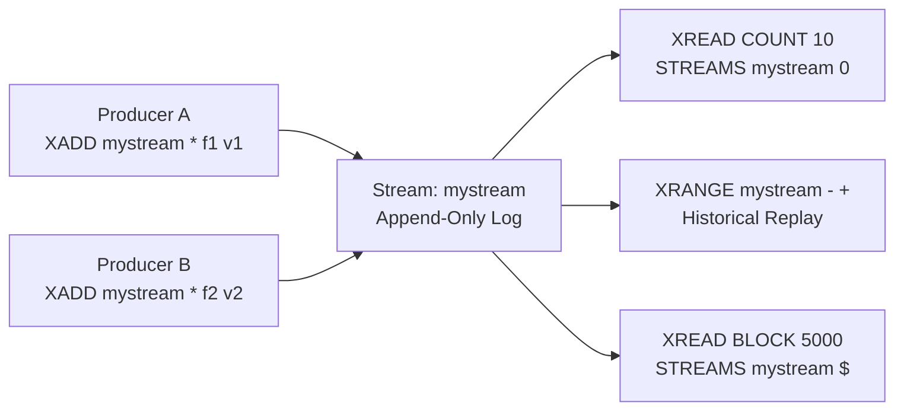
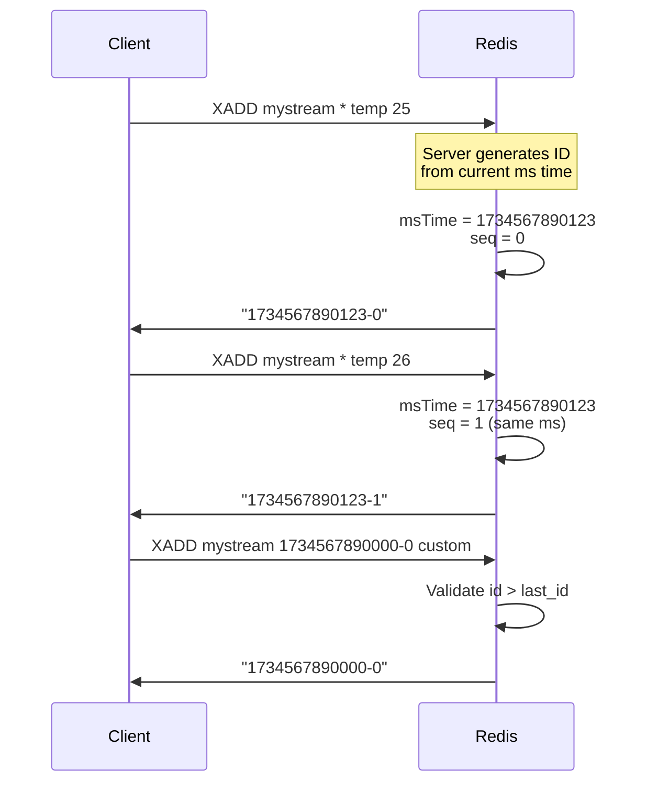

## 1 — Overview — Streams as Append-Only Logs

Redis Streams are an append-only log data structure introduced in Redis 5.0. They function similarly to a Kafka topic — entries are written to the end of the log and each entry carries a unique, monotonically increasing ID. Streams are the foundation for event sourcing, message queuing, activity feeds, and log aggregation in Redis.

A stream is identified by a key and holds an ordered sequence of entries. Each entry contains:
- A unique ID — composed of a millisecond timestamp and a sequence number (`<millisecondsTime>-<sequenceNumber>`).
- One or more field-value pairs (like a hash).

The three fundamental operations on streams are:
- **XADD** — Append a new entry to the stream.
- **XREAD** — Read entries from the stream starting at a given ID (or from the beginning).
- **XRANGE** — Read a range of entries between two IDs (inclusive).

These commands form the read and write primitives that all higher-level stream features (consumer groups, acknowledgments, claiming) build upon.

### 1.1 — Stream Entry ID Format

Every entry in a stream has an ID of the form:
```
<millisecondsTimestamp>-<sequenceNumber>
```

Examples:
- `1734567890000-0` — Entry at timestamp 1734567890000 ms, sequence 0
- `1734567890000-1` — Entry at same timestamp, next sequence
- `1734567891000-0` — Entry at a later timestamp

The `*` wildcard in XADD tells Redis to auto-generate an ID based on the current server time.

### 1.2 — Why Streams Over Lists or PubSub

| Feature | Streams | Lists (BLPOP) | PubSub |
|---------|---------|---------------|--------|
| Persistence | Yes (RDB/AOF) | Yes | No (fire-and-forget) |
| Multiple consumers | Consumer groups | Each pop removes | All subscribers |
| Historical replay | XRANGE | Not possible (destructive) | Not possible |
| Blocking reads | XREAD BLOCK | BLPOP/BRPOP | SUBSCRIBE |
| Message acknowledgment | XACK | N/A | N/A |

## 2 — XADD — Appending Entries to a Stream

XADD is the command to add a new entry to the end of a stream. If the stream key does not exist, it is created automatically.

### 2.1 — Redis CLI Syntax

```bash
XADD key [NOMKSTREAM] [MAXLEN|MINID [=|~] threshold [LIMIT count]] *|id field value [field value ...]
```

Parameters:
- `key` — The stream key.
- `NOMKSTREAM` — Do not create the stream if it does not exist (Redis 7.0+).
- `MAXLEN` — Cap the stream length; evict oldest entries.
- `MINID` — Evict entries with IDs lower than the threshold.
- `*` — Auto-generate the entry ID from server timestamp.
- `id` — Provide a custom ID (must be greater than the last ID).
- `field value` — One or more field-value pairs.

### 2.2 — CLI Examples

```bash
# Simple append with auto-ID
XADD mystream * temp 25.5 humidity 68

# Append with a custom ID
XADD mystream 1734567890000-0 city "NYC" temp 22.0

# Capped stream — keep only last 1000 entries
XADD mystream MAXLEN ~ 1000 * event "login" user "alice"

# Do not create stream if missing
XADD mystream NOMKSTREAM * data "payload"
```

### 2.3 — StackExchange.Redis — StreamAddAsync

```csharp
using StackExchange.Redis;

public class StreamProducer
{
    private readonly IDatabase _db;

    public StreamProducer(ConnectionMultiplexer redis)
    {
        _db = redis.GetDatabase();
    }

    /// <summary>
    /// Append a simple entry with auto-generated ID.
    /// </summary>
    public async Task<EntryId> AppendAsync(string streamKey, string field1, string value1, string field2, string value2)
    {
        try
        {
            var fields = new NameValueEntry[]
            {
                new NameValueEntry(field1, value1),
                new NameValueEntry(field2, value2)
            };
            EntryId entryId = await _db.StreamAddAsync(streamKey, fields);
            return entryId;
        }
        catch (RedisException ex)
        {
            Console.WriteLine($"Redis error appending to stream '{streamKey}': {ex.Message}");
            throw;
        }
    }

    /// <summary>
    /// Append with a capped stream (MAXLEN ~ 1000).
    /// </summary>
    public async Task<EntryId> AppendCappedAsync(string streamKey, NameValueEntry[] fields, int maxLength = 1000)
    {
        try
        {
            EntryId entryId = await _db.StreamAddAsync(
                streamKey,
                fields,
                maxLength: maxLength,
                useApproximateMaxLength: true
            );
            return entryId;
        }
        catch (RedisException ex)
        {
            Console.WriteLine($"Redis error capping stream '{streamKey}': {ex.Message}");
            throw;
        }
    }

    /// <summary>
    /// Append with a custom ID (e.g., for replay or migration).
    /// </summary>
    public async Task<EntryId> AppendWithIdAsync(string streamKey, EntryId entryId, NameValueEntry[] fields)
    {
        try
        {
            EntryId result = await _db.StreamAddAsync(
                streamKey,
                fields,
                messageId: entryId
            );
            return result;
        }
        catch (RedisException ex)
        {
            Console.WriteLine($"Redis error appending with custom ID '{entryId}' to '{streamKey}': {ex.Message}");
            throw;
        }
    }

    /// <summary>
    /// Append multiple entries in a batch (pipelined).
    /// </summary>
    public async Task<EntryId[]> AppendBatchAsync(string streamKey, List<NameValueEntry[]> batch)
    {
        try
        {
            var tasks = batch.Select(fields => _db.StreamAddAsync(streamKey, fields));
            EntryId[] results = await Task.WhenAll(tasks);
            return results;
        }
        catch (RedisException ex)
        {
            Console.WriteLine($"Redis error batch appending to '{streamKey}': {ex.Message}");
            throw;
        }
    }
}
```

### 2.4 — Batch Append with Pipeline

```csharp
public async Task<EntryId[]> AppendBatchPipelinedAsync(string streamKey, List<NameValueEntry[]> batch)
{
    try
    {
        var batchOp = _db.CreateBatch();
        var tasks = new List<Task<EntryId>>();

        foreach (var fields in batch)
        {
            Task<EntryId> task = batchOp.StreamAddAsync(streamKey, fields);
            tasks.Add(task);
        }

        batchOp.Execute();
        EntryId[] results = await Task.WhenAll(tasks);
        return results;
    }
    catch (RedisException ex)
    {
        Console.WriteLine($"Pipeline batch append failed: {ex.Message}");
        throw;
    }
}
```

### 2.5 — XADD Return Value

XADD returns the ID of the newly created entry. In StackExchange.Redis, this is an `EntryId` struct containing `Timestamp` (long) and `Sequence` (long) properties.

```csharp
public static void InspectEntryId(EntryId id)
{
    Console.WriteLine($"Timestamp: {id.Timestamp}, Sequence: {id.Sequence}");
    Console.WriteLine($"ToString: {id.ToString()}");
    // Output: Timestamp: 1734567890000, Sequence: 0
    // Output: ToString: 1734567890000-0
}
```

### 2.6 — Error Handling Patterns

```csharp
public async Task<EntryId> SafeAppendAsync(string streamKey, NameValueEntry[] fields)
{
    const int maxRetries = 3;
    int attempt = 0;

    while (attempt < maxRetries)
    {
        try
        {
            return await _db.StreamAddAsync(streamKey, fields);
        }
        catch (RedisConnectionException ex)
        {
            attempt++;
            if (attempt >= maxRetries) throw;
            Console.WriteLine($"Connection error (attempt {attempt}): {ex.Message}");
            await Task.Delay(TimeSpan.FromMilliseconds(100 * attempt));
        }
        catch (RedisServerException ex) when (ex.Message.Contains("ERR"))
        {
            // Server-side error — do not retry
            Console.WriteLine($"Server error: {ex.Message}");
            throw;
        }
    }

    throw new InvalidOperationException("Should not reach here");
}
```

## 3 — XREAD — Reading from a Stream

XREAD reads entries from one or more streams, starting at a specified ID for each stream. It is the primary command for consumers to fetch new messages.

### 3.1 — Redis CLI Syntax

```bash
XREAD [COUNT count] [BLOCK milliseconds] STREAMS key [key ...] id [id ...]
```

Parameters:
- `COUNT` — Maximum number of entries to return per stream.
- `BLOCK` — Block for up to `milliseconds` if no data (0 = block forever).
- `STREAMS` — List of stream keys followed by corresponding IDs to read from.
- `id` — For each stream, the ID to start reading after. `0` means from the beginning, `$` means only new messages, `>` means undelivered (consumer groups only).

### 3.2 — CLI Examples

```bash
# Read up to 10 entries from the beginning of mystream
XREAD COUNT 10 STREAMS mystream 0

# Read only new messages (those after the latest)
XREAD COUNT 5 STREAMS mystream $

# Block for 5 seconds waiting for new messages
XREAD COUNT 1 BLOCK 5000 STREAMS mystream $

# Read from multiple streams
XREAD COUNT 5 STREAMS stream1 stream2 0 0

# Non-blocking read from a specific ID
XREAD COUNT 100 STREAMS mystream 1734567890000-0
```

### 3.3 — StackExchange.Redis — StreamReadAsync

```csharp
public class StreamConsumer
{
    private readonly IDatabase _db;

    public StreamConsumer(ConnectionMultiplexer redis)
    {
        _db = redis.GetDatabase();
    }

    /// <summary>
    /// Read entries from a stream starting at a given position.
    /// </summary>
    public async Task<List<StreamEntry>> ReadAsync(string streamKey, string position = "0", int count = 10)
    {
        try
        {
            StreamEntry[] entries = await _db.StreamReadAsync(
                streamKey,
                position,
                count: count
            );
            return entries.ToList();
        }
        catch (RedisException ex)
        {
            Console.WriteLine($"Error reading from '{streamKey}': {ex.Message}");
            throw;
        }
    }

    /// <summary>
    /// Read only new messages (position = "$").
    /// </summary>
    public async Task<List<StreamEntry>> ReadNewAsync(string streamKey, int count = 10)
    {
        try
        {
            StreamEntry[] entries = await _db.StreamReadAsync(
                streamKey,
                StreamPosition.NewMessages,
                count: count
            );
            return entries.ToList();
        }
        catch (RedisException ex)
        {
            Console.WriteLine($"Error reading new messages from '{streamKey}': {ex.Message}");
            throw;
        }
    }

    /// <summary>
    /// Blocking read — wait up to 5 seconds for new messages.
    /// </summary>
    public async Task<List<StreamEntry>> ReadBlockingAsync(string streamKey, int count = 1, int timeoutMs = 5000)
    {
        try
        {
            StreamEntry[] entries = await _db.StreamReadAsync(
                streamKey,
                StreamPosition.NewMessages,
                count: count
            );
            return entries.ToList();
        }
        catch (RedisException ex)
        {
            Console.WriteLine($"Blocking read error: {ex.Message}");
            throw;
        }
    }

    /// <summary>
    /// Read from a specific EntryId position.
    /// </summary>
    public async Task<List<StreamEntry>> ReadFromIdAsync(string streamKey, EntryId fromId, int count = 100)
    {
        try
        {
            StreamEntry[] entries = await _db.StreamReadAsync(
                streamKey,
                fromId,
                count: count
            );
            return entries.ToList();
        }
        catch (RedisException ex)
        {
            Console.WriteLine($"Error reading from ID {fromId}: {ex.Message}");
            throw;
        }
    }
}
```

### 3.4 — Blocking XREAD with Polling Fallback

StackExchange.Redis does not have a direct blocking XREAD API at the `IDatabase` level (the blocking is handled server-side). Here is a pattern using a loop with optional delay:

```csharp
public async IAsyncEnumerable<StreamEntry> ListenAsync(
    string streamKey,
    string position,
    int batchSize = 10,
    int pollIntervalMs = 100,
    CancellationToken ct = default)
{
    string lastId = position;

    while (!ct.IsCancellationRequested)
    {
        StreamEntry[] entries = await _db.StreamReadAsync(
            streamKey,
            lastId,
            count: batchSize
        );

        if (entries.Length == 0)
        {
            await Task.Delay(pollIntervalMs, ct);
            continue;
        }

        foreach (StreamEntry entry in entries)
        {
            yield return entry;
            lastId = entry.Id.ToString();
        }
    }
}
```

### 3.5 — Reading from Multiple Streams

```csharp
public async Task<Dictionary<string, List<StreamEntry>>> ReadMultipleAsync(
    Dictionary<string, string> streamPositions,
    int countPerStream = 10)
{
    try
    {
        var streams = streamPositions.Keys.ToArray();
        var positions = streamPositions.Values.Select(StreamPosition.Parse).ToArray();

        StreamEntry[][] results = await _db.StreamReadAsync(streams, positions, countPerStream);

        var dict = new Dictionary<string, List<StreamEntry>>();
        for (int i = 0; i < streams.Length; i++)
        {
            dict[streams[i]] = results[i].ToList();
        }
        return dict;
    }
    catch (RedisException ex)
    {
        Console.WriteLine($"Error reading multiple streams: {ex.Message}");
        throw;
    }
}
```

## 4 — XRANGE — Reading a Range by ID

XRANGE reads a range of entries between two stream IDs (inclusive). It is used for historical replay, backfilling, and inspection.

### 4.1 — Redis CLI Syntax

```bash
XRANGE key start end [COUNT count]
```

Parameters:
- `start` — Start ID (inclusive). Use `-` for the first entry.
- `end` — End ID (inclusive). Use `+` for the last entry.
- `COUNT` — Maximum number of entries to return.

### 4.2 — CLI Examples

```bash
# Read all entries
XRANGE mystream - +

# Read first 10 entries
XRANGE mystream - + COUNT 10

# Read entries in a specific time range
XRANGE mystream 1734567890000-0 1734567899999-0

# Read entries after a specific ID
XRANGE mystream 1734567890500-0 +

# Read entries in reverse (XREVRANGE)
XREVRANGE mystream + - COUNT 5
```

### 4.3 — StackExchange.Redis — StreamRangeAsync

```csharp
public class StreamRangeReader
{
    private readonly IDatabase _db;

    public StreamRangeReader(ConnectionMultiplexer redis)
    {
        _db = redis.GetDatabase();
    }

    /// <summary>
    /// Read all entries in a stream.
    /// </summary>
    public async Task<List<StreamEntry>> ReadAllAsync(string streamKey)
    {
        try
        {
            StreamEntry[] entries = await _db.StreamRangeAsync(
                streamKey,
                minId: "-",
                maxId: "+"
            );
            return entries.ToList();
        }
        catch (RedisException ex)
        {
            Console.WriteLine($"Error reading all entries from '{streamKey}': {ex.Message}");
            throw;
        }
    }

    /// <summary>
    /// Read entries between two IDs (inclusive).
    /// </summary>
    public async Task<List<StreamEntry>> ReadRangeAsync(
        string streamKey,
        EntryId from,
        EntryId to,
        int count = 500)
    {
        try
        {
            StreamEntry[] entries = await _db.StreamRangeAsync(
                streamKey,
                minId: from.ToString(),
                maxId: to.ToString(),
                count: count
            );
            return entries.ToList();
        }
        catch (RedisException ex)
        {
            Console.WriteLine($"Error reading range from '{streamKey}': {ex.Message}");
            throw;
        }
    }

    /// <summary>
    /// Read a range using string IDs (e.g., "-", "+", or timestamp IDs).
    /// </summary>
    public async Task<List<StreamEntry>> ReadRangeStringAsync(
        string streamKey,
        string minId = "-",
        string maxId = "+",
        int? count = null)
    {
        try
        {
            StreamEntry[] entries = await _db.StreamRangeAsync(
                streamKey,
                minId: minId,
                maxId: maxId,
                count: count
            );
            return entries.ToList();
        }
        catch (RedisException ex)
        {
            Console.WriteLine($"Error reading range with string IDs from '{streamKey}': {ex.Message}");
            throw;
        }
    }

    /// <summary>
    /// Read reverse range (newest first) using XREVRANGE.
    /// </summary>
    public async Task<List<StreamEntry>> ReadReverseRangeAsync(
        string streamKey,
        string maxId = "+",
        string minId = "-",
        int count = 10)
    {
        try
        {
            // SE.Redis uses StreamRangeAsync with the same method but the order
            // of minId/maxId determines direction. For reverse, use XREVRANGE
            // via the ExecuteAsync method.
            RedisResult result = await _db.ExecuteAsync(
                "XREVRANGE",
                streamKey,
                maxId,
                minId,
                "COUNT",
                count
            );

            // Parse the result into StreamEntry[]
            var entries = new List<StreamEntry>();
            if (result.IsArray)
            {
                foreach (var entryResult in (RedisResult[])result)
                {
                    var entryArray = (RedisResult[])entryResult;
                    var id = EntryId.Parse((string)entryArray[0]);
                    var fieldValues = (RedisResult[])entryArray[1];
                    var fields = new NameValueEntry[fieldValues.Length / 2];
                    for (int i = 0; i < fieldValues.Length; i += 2)
                    {
                        fields[i / 2] = new NameValueEntry(
                            (string)fieldValues[i],
                            (string)fieldValues[i + 1]
                        );
                    }
                    entries.Add(new StreamEntry(id, fields));
                }
            }
            return entries;
        }
        catch (RedisException ex)
        {
            Console.WriteLine($"Error reading reverse range from '{streamKey}': {ex.Message}");
            throw;
        }
    }
}
```

### 4.4 — Paginating Through a Stream with XRANGE

```csharp
public async IAsyncEnumerable<List<StreamEntry>> PaginateStreamAsync(
    string streamKey,
    int pageSize = 100)
{
    string start = "-";
    bool hasMore = true;

    while (hasMore)
    {
        StreamEntry[] page = await _db.StreamRangeAsync(
            streamKey,
            minId: start,
            maxId: "+",
            count: pageSize
        );

        if (page.Length == 0)
        {
            yield break;
        }

        yield return page.ToList();

        // Move start to after the last entry in this page
        if (page.Length < pageSize)
        {
            hasMore = false;
        }
        else
        {
            StreamEntry last = page[^1];
            // Use the last ID as the new start (exclusive — need to increment)
            start = new EntryId(last.Id.Timestamp, last.Id.Sequence + 1).ToString();
        }
    }
}
```

### 4.5 — XRANGE with Time-Bounded Queries

```csharp
public async Task<List<StreamEntry>> ReadTimeRangeAsync(
    string streamKey,
    DateTimeOffset from,
    DateTimeOffset to,
    int maxEntries = 1000)
{
    // Convert timestamps to Redis stream IDs
    long fromMs = from.ToUnixTimeMilliseconds();
    long toMs = to.ToUnixTimeMilliseconds();

    string minId = $"{fromMs}-0";
    string maxId = $"{toMs}-{long.MaxValue}";

    try
    {
        StreamEntry[] entries = await _db.StreamRangeAsync(
            streamKey,
            minId: minId,
            maxId: maxId,
            count: maxEntries
        );
        return entries.ToList();
    }
    catch (RedisException ex)
    {
        Console.WriteLine($"Error reading time range from '{streamKey}': {ex.Message}");
        throw;
    }
}
```

## 5 — Architecture — Stream Data Model and Memory

### 5.1 — Internal Stream Structure

Redis Streams are implemented as a radix tree (rax) internally. Each stream maintains:
- A **radix tree** mapping entry IDs to field-value pairs.
- A **consumer group dictionary** (if groups exist) mapping group names to consumer group data.
- A **pending entries list (PEL)** per consumer in a group.

### 5.2 — Memory Considerations

```csharp
public static void EstimateStreamMemory(long entryCount, int avgFieldCount, int avgFieldSize)
{
    // Rough estimate: ~40 bytes overhead per entry + fields + IDs
    long overheadPerEntry = 40 + 16; // ID (8+8) + radix tree node
    long fieldsSize = avgFieldCount * avgFieldSize * 2; // key + value
    long totalBytes = entryCount * (overheadPerEntry + fieldsSize);

    Console.WriteLine($"Estimated memory for {entryCount} entries: {totalBytes:N0} bytes ({totalBytes / 1024 / 1024} MB)");
    Console.WriteLine($"Per-entry average: {overheadPerEntry + fieldsSize} bytes");
}
```

### 5.3 — Capped Streams (MAXLEN)

Use `MAXLEN` to prevent unbounded memory growth:

```bash
# Exact trimming — keep exactly 1000 entries
XADD mystream MAXLEN 1000 * event "data"

# Approximate trimming (more efficient) — keep ~1000 entries
XADD mystream MAXLEN ~ 1000 * event "data"
```

```csharp
public async Task<EntryId> AppendWithMaxLenAsync(string streamKey, NameValueEntry[] fields, int maxLen = 1000)
{
    try
    {
        return await _db.StreamAddAsync(
            streamKey,
            fields,
            maxLength: maxLen,
            useApproximateMaxLength: true
        );
    }
    catch (RedisException ex)
    {
        Console.WriteLine($"Error appending with MAXLEN: {ex.Message}");
        throw;
    }
}
```

### 5.4 — Stream Info

```csharp
public async Task PrintStreamInfoAsync(string streamKey)
{
    try
    {
        RedisResult result = await _db.ExecuteAsync("XINFO", "STREAM", streamKey);
        // Parse and display stream information
        Console.WriteLine($"Stream info for '{streamKey}':");
        if (result.IsArray)
        {
            var arr = (RedisResult[])result;
            for (int i = 0; i < arr.Length; i += 2)
            {
                Console.WriteLine($"  {arr[i]}: {arr[i + 1]}");
            }
        }
    }
    catch (RedisException ex)
    {
        Console.WriteLine($"Error getting stream info: {ex.Message}");
    }
}
```

### 5.5 — Mermaid: Stream Data Flow



### 5.6 — Mermaid: Entry ID Generation



## 6 — Use Cases — Streams in Production

### 6.1 — Event Sourcing

```csharp
public class EventStore
{
    private readonly IDatabase _db;
    private const string StreamPrefix = "events:";

    public EventStore(ConnectionMultiplexer redis)
    {
        _db = redis.GetDatabase();
    }

    public async Task<EntryId> AppendEventAsync(string aggregateId, string eventType, string jsonPayload)
    {
        var fields = new NameValueEntry[]
        {
            new NameValueEntry("eventType", eventType),
            new NameValueEntry("timestamp", DateTime.UtcNow.ToString("O")),
            new NameValueEntry("data", jsonPayload),
            new NameValueEntry("version", "1")
        };

        return await _db.StreamAddAsync($"{StreamPrefix}{aggregateId}", fields);
    }

    public async Task<List<StreamEntry>> ReadEventsAsync(string aggregateId, string fromId = "0")
    {
        StreamEntry[] entries = await _db.StreamReadAsync(
            $"{StreamPrefix}{aggregateId}",
            fromId
        );
        return entries.ToList();
    }

    public async Task<List<StreamEntry>> ReplayAllAsync(string aggregateId)
    {
        return await ReadEventsAsync(aggregateId, "0");
    }
}
```

### 6.2 — Activity Feed

```csharp
public class ActivityFeed
{
    private readonly IDatabase _db;
    private const string FeedKey = "feed:global";

    public ActivityFeed(ConnectionMultiplexer redis)
    {
        _db = redis.GetDatabase();
    }

    public async Task<EntryId> PublishActivityAsync(string userId, string activity, string details)
    {
        var fields = new NameValueEntry[]
        {
            new NameValueEntry("userId", userId),
            new NameValueEntry("activity", activity),
            new NameValueEntry("details", details),
            new NameValueEntry("timestamp", DateTime.UtcNow.ToString("O"))
        };

        // Keep only the latest 1000 activities
        return await _db.StreamAddAsync(FeedKey, fields, maxLength: 1000, useApproximateMaxLength: true);
    }

    public async Task<List<StreamEntry>> GetRecentActivitiesAsync(int count = 20)
    {
        // Read newest first using XREVRANGE
        RedisResult result = await _db.ExecuteAsync("XREVRANGE", FeedKey, "+", "-", "COUNT", count);
        // Parse result...
        return ParseStreamEntries(result);
    }

    private static List<StreamEntry> ParseStreamEntries(RedisResult result)
    {
        var entries = new List<StreamEntry>();
        if (result.IsArray)
        {
            foreach (var entryResult in (RedisResult[])result)
            {
                var entryArray = (RedisResult[])entryResult;
                var id = EntryId.Parse((string)entryArray[0]);
                var fieldValues = (RedisResult[])entryArray[1];
                var fields = new NameValueEntry[fieldValues.Length / 2];
                for (int i = 0; i < fieldValues.Length; i += 2)
                {
                    fields[i / 2] = new NameValueEntry(
                        (string)fieldValues[i],
                        (string)fieldValues[i + 1]
                    );
                }
                entries.Add(new StreamEntry(id, fields));
            }
        }
        return entries;
    }
}
```

### 6.3 — Message Queue (Simple)

```csharp
public class SimpleMessageQueue
{
    private readonly IDatabase _db;
    private readonly string _queueKey;

    public SimpleMessageQueue(ConnectionMultiplexer redis, string queueKey = "queue:tasks")
    {
        _db = redis.GetDatabase();
        _queueKey = queueKey;
    }

    public async Task<EntryId> EnqueueAsync(string messageType, string payload)
    {
        var fields = new NameValueEntry[]
        {
            new NameValueEntry("type", messageType),
            new NameValueEntry("payload", payload),
            new NameValueEntry("enqueuedAt", DateTime.UtcNow.Ticks.ToString())
        };

        return await _db.StreamAddAsync(_queueKey, fields, maxLength: 10000, useApproximateMaxLength: true);
    }

    public async Task<List<StreamEntry>> DequeueAsync(int count = 1, string lastId = "0")
    {
        StreamEntry[] entries = await _db.StreamReadAsync(_queueKey, lastId, count: count);
        return entries.ToList();
    }
}
```

### 6.4 — Log Aggregation

```csharp
public class LogAggregator
{
    private readonly IDatabase _db;
    private readonly string _streamKey;

    public LogAggregator(ConnectionMultiplexer redis, string serviceName)
    {
        _db = redis.GetDatabase();
        _streamKey = $"logs:{serviceName}:{DateTime.UtcNow:yyyy-MM-dd}";
    }

    public async Task<EntryId> WriteLogAsync(string level, string message, Dictionary<string, string>? extraFields = null)
    {
        var fieldsList = new List<NameValueEntry>
        {
            new NameValueEntry("level", level),
            new NameValueEntry("message", message),
            new NameValueEntry("timestamp", DateTime.UtcNow.ToString("O"))
        };

        if (extraFields != null)
        {
            foreach (var kvp in extraFields)
            {
                fieldsList.Add(new NameValueEntry(kvp.Key, kvp.Value));
            }
        }

        return await _db.StreamAddAsync(_streamKey, fieldsList.ToArray());
    }

    public async Task<List<StreamEntry>> QueryLogsAsync(DateTimeOffset date, string level, int count = 100)
    {
        string streamKey = $"logs:service:{date:yyyy-MM-dd}";
        StreamEntry[] entries = await _db.StreamRangeAsync(streamKey, "-", "+", count: count);

        // Filter by level client-side if needed
        return entries
            .Where(e => e.Values.Any(v => v.Name == "level" && v.Value == level))
            .ToList();
    }
}
```

## 7 — Gotchas — Common Pitfalls with XADD, XREAD, XRANGE

### 7.1 — XADD Returns EntryId, Not String

```csharp
// CORRECT:
EntryId id = await _db.StreamAddAsync("mystream", fields);
Console.WriteLine(id.ToString()); // "1734567890000-0"

// WRONG — assuming string return:
// string id = (string)await _db.StreamAddAsync("mystream", fields); // Compile error
```

### 7.2 — Stream Max Length Management

If you do not cap stream length, memory grows unbounded:

```csharp
// BAD — unbounded growth
await _db.StreamAddAsync("mystream", fields);

// GOOD — capped at 10,000 entries
await _db.StreamAddAsync("mystream", fields, maxLength: 10000, useApproximateMaxLength: true);

// Also good — periodic trim
await _db.StreamTrimAsync("mystream", 10000); // XTRIM
```

### 7.3 — XREAD with "0" vs "$"

```csharp
// "0" — reads from the beginning (all history)
StreamEntry[] all = await _db.StreamReadAsync("mystream", "0");

// "$" — reads only new messages (after last entry)
StreamEntry[] new = await _db.StreamReadAsync("mystream", StreamPosition.NewMessages);

// EntryId — reads after a specific position
StreamEntry[] after = await _db.StreamReadAsync("mystream", lastEntryId);
```

### 7.4 — XREAD is Non-Destructive

Unlike List BLPOP, XREAD does not remove entries from the stream:

```csharp
// Multiple consumers can read the same entry
StreamEntry[] batch1 = await _db.StreamReadAsync("mystream", "0", count: 10);
StreamEntry[] batch2 = await _db.StreamReadAsync("mystream", "0", count: 10);
// batch1 and batch2 contain the same entries!
```

### 7.5 — XRANGE Inclusive Boundaries

Both start and end IDs are inclusive. To make the start exclusive, increment the sequence:

```csharp
// Read entries AFTER a given ID (exclusive start)
EntryId exclusiveStart = new EntryId(lastId.Timestamp, lastId.Sequence + 1);
StreamEntry[] nextPage = await _db.StreamRangeAsync("mystream", exclusiveStart.ToString(), "+", count: 100);
```

### 7.6 — Custom ID Validation

When providing a custom ID to XADD, it must be greater than the last ID in the stream:

```csharp
// This will succeed if stream is empty or last ID < custom ID
await _db.StreamAddAsync("mystream", fields, messageId: new EntryId(1734567890000, 0));

// This will fail with "ERR The ID specified in XADD is equal or smaller than the target stream top item"
await _db.StreamAddAsync("mystream", fields, messageId: new EntryId(1734567890000, 0)); // If already exists
```

### 7.7 — Blocking XREAD and Connection Management

```csharp
// Blocking XREAD holds a connection. In StackExchange.Redis, use the multiplexer
// with enough connections to avoid starvation.

var config = new ConfigurationOptions
{
    EndPoints = { "localhost:6379" },
    // Ensure enough connections for blocking operations
    AbortOnConnectFail = false,
    ConnectTimeout = 5000,
    SyncTimeout = 5000,
    // Use async for blocking operations
};

// Do not use blocking XREAD synchronously — use async only
// BAD: var entries = db.StreamReadAsync("mystream", "$").Result; // Can deadlock
// GOOD: var entries = await db.StreamReadAsync("mystream", "$");
```

### 7.8 — NOMKSTREAM Protection

```csharp
// Prevent accidental stream creation from producer
public async Task<EntryId?> TryAppendAsync(string streamKey, NameValueEntry[] fields)
{
    try
    {
        // Redis 7.0+ — NOMKSTREAM prevents creating the stream if it doesn't exist
        RedisResult result = await _db.ExecuteAsync("XADD", streamKey, "NOMKSTREAM", "*", fields);
        return result.IsNull ? null : EntryId.Parse((string)result);
    }
    catch (RedisServerException ex) when (ex.Message.Contains("ERR"))
    {
        // Stream does not exist and NOMKSTREAM was specified
        return null;
    }
}
```

### 7.9 — Network and Timeout Handling

```csharp
public async Task<EntryId> AppendWithTimeoutAsync(string streamKey, NameValueEntry[] fields, TimeSpan timeout)
{
    using var cts = new CancellationTokenSource(timeout);
    try
    {
        Task<EntryId> task = _db.StreamAddAsync(streamKey, fields);
        if (await Task.WhenAny(task, Task.Delay(timeout, cts.Token)) == task)
        {
            return await task;
        }
        throw new TimeoutException($"StreamAddAsync timed out after {timeout.TotalMilliseconds}ms");
    }
    catch (OperationCanceledException)
    {
        throw new TimeoutException($"StreamAddAsync cancelled after {timeout.TotalMilliseconds}ms");
    }
}
```

### 7.10 — Stream ID Parsing

```csharp
public static bool TryParseEntryId(string id, out EntryId result)
{
    result = default;
    if (string.IsNullOrEmpty(id)) return false;

    string[] parts = id.Split('-');
    if (parts.Length != 2) return false;

    if (long.TryParse(parts[0], out long timestamp) &&
        long.TryParse(parts[1], out long sequence))
    {
        result = new EntryId(timestamp, sequence);
        return true;
    }
    return false;
}
```

## 8 — Comparison — Streams vs Other Redis Data Structures

### 8.1 — Streams vs Lists for Queuing

| Aspect | Streams | Lists |
|--------|---------|-------|
| Read semantics | Non-destructive (XREAD) | Destructive (LPOP/RPOP) |
| Multiple consumers | Consumer groups | Not built-in |
| Historical replay | XRANGE any position | Not possible |
| Blocking reads | XREAD BLOCK | BLPOP/BRPOP |
| Memory efficiency | Radix tree (higher overhead) | Linked list (lower overhead) |
| Max length capping | MAXLEN with approximate | LTRIM |
| Entry ID | Auto-generated (timestamp-seq) | Index-based (0, 1, 2...) |

### 8.2 — Streams vs PubSub

| Aspect | Streams | PubSub |
|--------|---------|--------|
| Persistence | Yes (RDB/AOF) | No |
| Message delivery | Pull-based (XREAD) | Push-based (subscribe) |
| Message replay | XRANGE from any ID | Not possible |
| Acknowledgment | XACK (consumer groups) | Fire-and-forget |
| Backpressure | Consumer controls read rate | Redis buffers, can drop |
| Memory management | Capped streams | Fixed buffer (client-output-buffer-limit) |

### 8.3 — Streams vs Sorted Sets for Time-Series

| Aspect | Streams | Sorted Sets |
|--------|---------|-------------|
| Data model | Entry with multiple fields | Member with single score |
| Query by time | XRANGE by ID (timestamp-seq) | ZRANGEBYSCORE |
| Auto-ID | Yes (timestamp-seq) | Manual timestamp score |
| Consumer groups | Yes | No |
| Blocking reads | Yes | No |

## 9 — Quick Reference — Command Summary and Cheat Sheet

### 9.1 — Command Reference Table

| Command | CLI Example | SE.Redis Method | Description |
|---------|-------------|-----------------|-------------|
| XADD | `XADD mystream * f v` | `StreamAddAsync` | Append entry, returns EntryId |
| XREAD | `XREAD COUNT 10 STREAMS mystream 0` | `StreamReadAsync` | Read from a position |
| XRANGE | `XRANGE mystream - +` | `StreamRangeAsync` | Read range by ID |
| XREVRANGE | `XREVRANGE mystream + -` | `ExecuteAsync("XREVRANGE", ...)` | Read range in reverse |
| XLEN | `XLEN mystream` | `StreamLengthAsync` | Get stream length |
| XTRIM | `XTRIM mystream MAXLEN ~ 1000` | `StreamTrimAsync` | Trim stream to max length |
| XDEL | `XDEL mystream id` | `StreamDeleteAsync` | Delete specific entries |
| XINFO | `XINFO STREAM mystream` | `ExecuteAsync("XINFO", ...)` | Stream info and metadata |

### 9.2 — SE.Redis Method Signatures

```csharp
// XADD
Task<EntryId> StreamAddAsync(
    RedisKey key,
    NameValueEntry[] fields,
    EntryId? messageId = null,
    int? maxLength = null,
    bool useApproximateMaxLength = false,
    CommandFlags flags = CommandFlags.None
);

// XREAD (single stream)
Task<StreamEntry[]> StreamReadAsync(
    RedisKey key,
    RedisValue position,
    int? count = null,
    CommandFlags flags = CommandFlags.None
);

// XREAD (multiple streams)
Task<StreamEntry[]> StreamReadAsync(
    RedisKey[] keys,
    RedisValue[] positions,
    int? countPerStream = null,
    CommandFlags flags = CommandFlags.None
);

// XRANGE
Task<StreamEntry[]> StreamRangeAsync(
    RedisKey key,
    RedisValue minId = default,
    RedisValue maxId = default,
    int? count = null,
    CommandFlags flags = CommandFlags.None
);

// XLEN
Task<long> StreamLengthAsync(
    RedisKey key,
    CommandFlags flags = CommandFlags.None
);

// XTRIM
Task<long> StreamTrimAsync(
    RedisKey key,
    int maxLength,
    bool useApproximateMaxLength = false,
    CommandFlags flags = CommandFlags.None
);

// XDEL
Task<long> StreamDeleteAsync(
    RedisKey key,
    EntryId[] entryIds,
    CommandFlags flags = CommandFlags.None
);
```

### 9.3 — StreamPosition Constants

```csharp
public static class StreamPosition
{
    public static readonly RedisValue Beginning = "0";
    public static readonly RedisValue NewMessages = "$";
    public static readonly RedisValue UndeliveredMessages = ">";
    public static readonly RedisValue AutomaticId = "*";
}
```

### 9.4 — EntryId Helper Utilities

```csharp
public static class EntryIdHelper
{
    /// <summary>
    /// Create an EntryId from a Unix timestamp in milliseconds.
    /// </summary>
    public static EntryId FromUnixMs(long unixMs, long sequence = 0)
        => new EntryId(unixMs, sequence);

    /// <summary>
    /// Create an EntryId from a DateTimeOffset.
    /// </summary>
    public static EntryId FromDateTime(DateTimeOffset dt, long sequence = 0)
        => new EntryId(dt.ToUnixTimeMilliseconds(), sequence);

    /// <summary>
    /// Get the next EntryId after this one (exclusive upper bound).
    /// </summary>
    public static EntryId Increment(this EntryId id)
        => new EntryId(id.Timestamp, id.Sequence + 1);

    /// <summary>
    /// Get the minimum EntryId for a given timestamp (seq = 0).
    /// </summary>
    public static EntryId MinForTimestamp(long unixMs)
        => new EntryId(unixMs, 0);

    /// <summary>
    /// Get the maximum EntryId for a given timestamp (seq = long.MaxValue).
    /// </summary>
    public static EntryId MaxForTimestamp(long unixMs)
        => new EntryId(unixMs, long.MaxValue);

    /// <summary>
    /// Create an EntryId representing "beginning of time" for the stream.
    /// </summary>
    public static EntryId Earliest => new EntryId(0, 0);
}
```

### 9.5 — Complete Worker Example

```csharp
public class StreamWorker : IHostedService
{
    private readonly IDatabase _db;
    private readonly ILogger<StreamWorker> _logger;
    private readonly string _streamKey;
    private string _lastProcessedId = "0";

    public StreamWorker(
        ConnectionMultiplexer redis,
        ILogger<StreamWorker> logger,
        string streamKey = "tasks:stream")
    {
        _db = redis.GetDatabase();
        _logger = logger;
        _streamKey = streamKey;
    }

    public async Task StartAsync(CancellationToken cancellationToken)
    {
        _logger.LogInformation("StreamWorker started for {StreamKey}", _streamKey);

        while (!cancellationToken.IsCancellationRequested)
        {
            try
            {
                StreamEntry[] entries = await _db.StreamReadAsync(
                    _streamKey,
                    _lastProcessedId,
                    count: 10
                );

                foreach (StreamEntry entry in entries)
                {
                    await ProcessEntryAsync(entry);
                    _lastProcessedId = entry.Id.ToString();
                }

                if (entries.Length == 0)
                {
                    await Task.Delay(500, cancellationToken);
                }
            }
            catch (RedisConnectionException ex)
            {
                _logger.LogWarning("Redis connection lost: {Message}. Reconnecting...", ex.Message);
                await Task.Delay(1000, cancellationToken);
            }
            catch (OperationCanceledException)
            {
                break;
            }
            catch (Exception ex)
            {
                _logger.LogError(ex, "Error processing stream {StreamKey}", _streamKey);
                await Task.Delay(1000, cancellationToken);
            }
        }
    }

    private async Task ProcessEntryAsync(StreamEntry entry)
    {
        _logger.LogInformation("Processing entry {EntryId}", entry.Id);
        string? type = entry["type"];
        string? payload = entry["payload"];

        if (type != null && payload != null)
        {
            // Process based on type
            await HandleMessageAsync(type, payload);
        }
    }

    private Task HandleMessageAsync(string type, string payload)
    {
        // Business logic here
        return Task.CompletedTask;
    }

    public Task StopAsync(CancellationToken cancellationToken)
    {
        _logger.LogInformation("StreamWorker stopped");
        return Task.CompletedTask;
    }
}
```

### 9.6 — Program.cs Setup

```csharp
using Microsoft.Extensions.DependencyInjection;
using Microsoft.Extensions.Hosting;
using StackExchange.Redis;

var host = Host.CreateDefaultBuilder(args)
    .ConfigureServices((context, services) =>
    {
        var redis = ConnectionMultiplexer.Connect("localhost:6379");
        services.AddSingleton(redis);

        // Stream producer
        services.AddSingleton<StreamProducer>();

        // Stream consumer as hosted service
        services.AddHostedService<StreamWorker>();

        // Range reader (for historical queries)
        services.AddSingleton<StreamRangeReader>();
    })
    .Build();

await host.RunAsync();
```

### 9.7 — Testing with Testcontainers

```csharp
// Integration test setup using Testcontainers for Redis
// Install-Package Testcontainers -Version 3.6.0

public class StreamTests : IAsyncLifetime
{
    private RedisContainer _redisContainer = null!;
    private ConnectionMultiplexer _redis = null!;
    private IDatabase _db = null!;
    private StreamProducer _producer = null!;

    public async Task InitializeAsync()
    {
        _redisContainer = new RedisBuilder()
            .WithImage("redis:7-alpine")
            .Build();

        await _redisContainer.StartAsync();

        var endpoint = $"{_redisContainer.Hostname}:{_redisContainer.GetMappedPublicPort(6379)}";
        _redis = await ConnectionMultiplexer.ConnectAsync(endpoint);
        _db = _redis.GetDatabase();
        _producer = new StreamProducer(_redis);
    }

    [Fact]
    public async Task XADD_XREAD_RoundTrip_Test()
    {
        // Arrange
        var fields = new NameValueEntry[]
        {
            new NameValueEntry("field1", "value1"),
            new NameValueEntry("field2", "value2")
        };

        // Act
        EntryId entryId = await _producer.AppendAsync("test:stream", "field1", "value1", "field2", "value2");
        StreamEntry[] entries = await _db.StreamReadAsync("test:stream", "0");

        // Assert
        Assert.NotEqual(default, entryId);
        Assert.NotEmpty(entries);
        Assert.Equal(entryId.ToString(), entries[0].Id.ToString());
        Assert.Equal("value1", (string)entries[0]["field1"]);
        Assert.Equal("value2", (string)entries[0]["field2"]);
    }

    [Fact]
    public async Task XRANGE_Returns_Correct_Range()
    {
        // Arrange
        var fields = new NameValueEntry[] { new NameValueEntry("data", "test") };
        EntryId id1 = await _db.StreamAddAsync("test:range", fields);
        EntryId id2 = await _db.StreamAddAsync("test:range", fields);
        EntryId id3 = await _db.StreamAddAsync("test:range", fields);

        // Act
        StreamEntry[] range = await _db.StreamRangeAsync("test:range", id1.ToString(), id2.ToString());

        // Assert
        Assert.Equal(2, range.Length);
        Assert.Equal(id1.ToString(), range[0].Id.ToString());
        Assert.Equal(id2.ToString(), range[1].Id.ToString());
    }

    [Fact]
    public async Task CappedStream_Respects_MaxLen()
    {
        // Arrange
        var fields = new NameValueEntry[] { new NameValueEntry("data", "x") };

        // Act — add 5 entries with MAXLEN = 3
        for (int i = 0; i < 5; i++)
        {
            await _db.StreamAddAsync("test:capped", fields, maxLength: 3, useApproximateMaxLength: false);
        }

        // Assert
        long len = await _db.StreamLengthAsync("test:capped");
        Assert.Equal(3, len);
    }

    public async Task DisposeAsync()
    {
        _redis?.Dispose();
        if (_redisContainer != null)
        {
            await _redisContainer.DisposeAsync();
        }
    }
}
```

### 9.8 — Performance Benchmarks

```csharp
public static class StreamBenchmark
{
    public static async Task RunBenchmarkAsync(IDatabase db, string streamKey, int entryCount = 10000)
    {
        var sw = System.Diagnostics.Stopwatch.StartNew();

        for (int i = 0; i < entryCount; i++)
        {
            var fields = new NameValueEntry[]
            {
                new NameValueEntry("counter", i.ToString()),
                new NameValueEntry("timestamp", DateTime.UtcNow.Ticks.ToString())
            };
            await db.StreamAddAsync(streamKey, fields);
        }

        sw.Stop();
        double opsPerSec = entryCount / sw.Elapsed.TotalSeconds;
        double msPerOp = sw.Elapsed.TotalMilliseconds / entryCount;

        Console.WriteLine($"XADD {entryCount} entries: {sw.Elapsed.TotalSeconds:F2}s");
        Console.WriteLine($"Throughput: {opsPerSec:F0} ops/sec");
        Console.WriteLine($"Avg latency: {msPerOp:F3} ms/op");

        long streamLength = await db.StreamLengthAsync(streamKey);
        Console.WriteLine($"Stream length: {streamLength}");
    }
}
```

### 9.9 — Further Reading

- Redis Streams documentation: https://redis.io/docs/data-types/streams/
- StackExchange.Redis Streams documentation: https://stackexchange.github.io/StackExchange.Redis/Streams.html
- Related notes: [[8.961 — Redis — Data Structures Overview]], [[8.1000 — Redis — StackExchange.Redis Full Reference]]

## 10 — Revision History

| Date | Version | Changes |
|------|---------|---------|
| 2026-06-27 | 1.0 | Initial version — XADD, XREAD, XRANGE deep dive with SE.Redis code |

---

*End of note 8.982*
