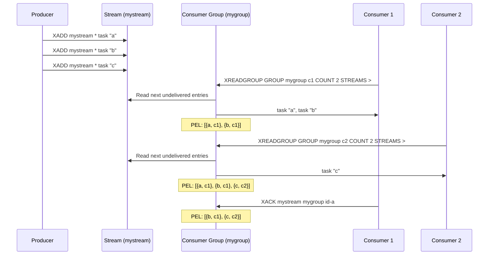
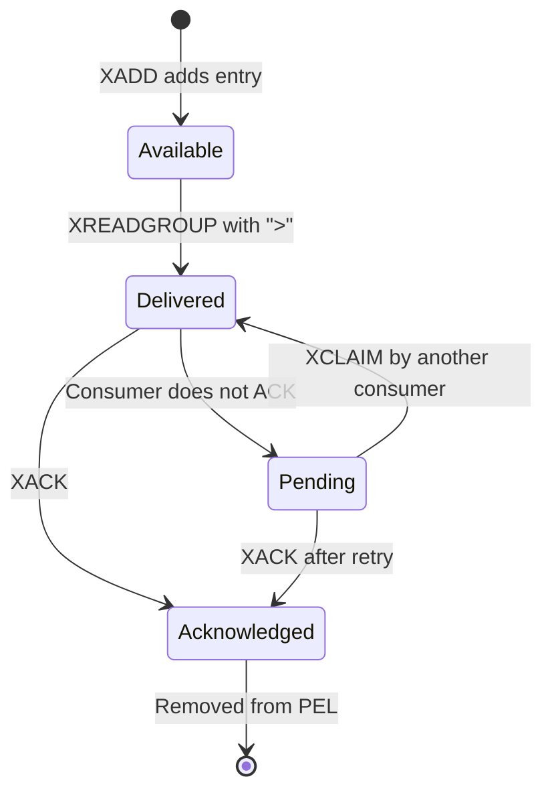

## 1 — Overview — Consumer Groups for Competing Consumers

Consumer groups in Redis Streams enable multiple consumers to cooperatively process messages from a single stream. Each message is delivered to exactly one consumer within the group, enabling load-balanced, reliable message processing. This is conceptually similar to Kafka consumer groups.

Consumer groups add several capabilities on top of basic XADD/XREAD:
- **Message routing** — Each message is delivered to one consumer in the group.
- **Acknowledgment tracking** — Track which messages have been processed.
- **Pending entry list (PEL)** — Track messages delivered but not yet acknowledged.
- **Failure recovery** — Claim pending messages from failed consumers.

### 1.1 — Key Concepts

| Concept | Description |
|---------|-------------|
| Consumer Group | A named group of consumers sharing a stream |
| Consumer | A named consumer within a group (tracks its own PEL) |
| PEL | Pending Entries List — messages delivered but not acknowledged |
| Last Delivered ID | Tracks the last message delivered to the group |
| Stream | The underlying append-only log of entries |

### 1.2 — When to Use Consumer Groups

Consumer groups are ideal for:
- **Work queues** — Distribute tasks among worker instances.
- **Reliable message processing** — Track and retry failed messages.
- **Load-balanced consumption** — Scale consumers horizontally.
- **Exactly-once processing** — Combine XREADGROUP + XACK for at-least-once semantics.

## 2 — XGROUP CREATE — Managing Consumer Groups

The `XGROUP CREATE` command creates a consumer group associated with a stream. The group starts at a specified position in the stream.

### 2.1 — Redis CLI Syntax

```bash
XGROUP CREATE key groupname id|$ [MKSTREAM] [ENTRIESREAD entries_read]
```

Parameters:
- `key` — The stream key.
- `groupname` — Name of the consumer group.
- `id` — Starting ID. `0` means from the beginning, `$` means only new messages.
- `MKSTREAM` — Create the stream if it does not exist (Redis 6.2+).
- `ENTRIESREAD` — Pre-populate the entries_read counter (Redis 7.0+).

### 2.2 — CLI Examples

```bash
# Create group starting from the beginning of the stream
XGROUP CREATE mystream mygroup 0

# Create group for only new messages (like Kafka "latest")
XGROUP CREATE mystream mygroup $

# Create group with MKSTREAM (auto-create stream)
XGROUP CREATE mystream mygroup $ MKSTREAM

# Create group with entries_read tracking
XGROUP CREATE mystream mygroup 0 ENTRIESREAD 0
```

### 2.3 — StackExchange.Redis — StreamCreateConsumerGroupAsync

```csharp
using StackExchange.Redis;

public class ConsumerGroupManager
{
    private readonly IDatabase _db;

    public ConsumerGroupManager(ConnectionMultiplexer redis)
    {
        _db = redis.GetDatabase();
    }

    /// <summary>
    /// Create a consumer group starting from the beginning of the stream.
    /// </summary>
    public async Task CreateFromBeginningAsync(string streamKey, string groupName)
    {
        try
        {
            bool created = await _db.StreamCreateConsumerGroupAsync(
                streamKey,
                groupName,
                StreamPosition.Beginning
            );
            Console.WriteLine($"Consumer group '{groupName}' created on '{streamKey}': {created}");
        }
        catch (RedisServerException ex) when (ex.Message.Contains("BUSYGROUP"))
        {
            Console.WriteLine($"Consumer group '{groupName}' already exists on '{streamKey}'");
        }
        catch (RedisException ex)
        {
            Console.WriteLine($"Error creating consumer group: {ex.Message}");
            throw;
        }
    }

    /// <summary>
    /// Create a consumer group for new messages only.
    /// </summary>
    public async Task CreateForNewMessagesAsync(string streamKey, string groupName)
    {
        try
        {
            bool created = await _db.StreamCreateConsumerGroupAsync(
                streamKey,
                groupName,
                StreamPosition.NewMessages
            );
            Console.WriteLine($"Consumer group '{groupName}' created for new messages: {created}");
        }
        catch (RedisException ex)
        {
            Console.WriteLine($"Error creating consumer group for new messages: {ex.Message}");
            throw;
        }
    }

    /// <summary>
    /// Create a consumer group with MKSTREAM option (create stream if missing).
    /// Uses raw ExecuteAsync since SE.Redis does not expose MKSTREAM directly.
    /// </summary>
    public async Task CreateWithStreamAsync(string streamKey, string groupName, string startingId = "$")
    {
        try
        {
            RedisResult result = await _db.ExecuteAsync(
                "XGROUP", "CREATE", streamKey, groupName, startingId, "MKSTREAM"
            );
            Console.WriteLine($"Consumer group created with MKSTREAM: {result}");
        }
        catch (RedisException ex)
        {
            Console.WriteLine($"Error creating group with MKSTREAM: {ex.Message}");
            throw;
        }
    }

    /// <summary>
    /// Delete a consumer group.
    /// </summary>
    public async Task DeleteGroupAsync(string streamKey, string groupName)
    {
        try
        {
            await _db.ExecuteAsync("XGROUP", "DESTROY", streamKey, groupName);
            Console.WriteLine($"Consumer group '{groupName}' deleted from '{streamKey}'");
        }
        catch (RedisException ex)
        {
            Console.WriteLine($"Error deleting consumer group: {ex.Message}");
            throw;
        }
    }

    /// <summary>
    /// List all consumer groups for a stream.
    /// </summary>
    public async Task ListGroupsAsync(string streamKey)
    {
        try
        {
            RedisResult result = await _db.ExecuteAsync("XINFO", "GROUPS", streamKey);
            Console.WriteLine($"Consumer groups for '{streamKey}':");
            if (result.IsArray)
            {
                foreach (var groupResult in (RedisResult[])result)
                {
                    var groupArr = (RedisResult[])groupResult;
                    for (int i = 0; i < groupArr.Length; i += 2)
                    {
                        Console.WriteLine($"  {groupArr[i]}: {groupArr[i + 1]}");
                    }
                    Console.WriteLine();
                }
            }
        }
        catch (RedisException ex)
        {
            Console.WriteLine($"Error listing consumer groups: {ex.Message}");
        }
    }

    /// <summary>
    /// Check if a consumer group exists.
    /// </summary>
    public async Task<bool> GroupExistsAsync(string streamKey, string groupName)
    {
        try
        {
            RedisResult result = await _db.ExecuteAsync("XINFO", "GROUPS", streamKey);
            if (result.IsArray)
            {
                foreach (var groupResult in (RedisResult[])result)
                {
                    var groupArr = (RedisResult[])groupResult;
                    for (int i = 0; i < groupArr.Length; i += 2)
                    {
                        if ((string)groupArr[i] == "name" && (string)groupArr[i + 1] == groupName)
                        {
                            return true;
                        }
                    }
                }
            }
            return false;
        }
        catch (RedisException)
        {
            return false;
        }
    }
}
```

### 2.4 — Idempotent Group Creation

```csharp
public async Task CreateGroupIfNotExistsAsync(string streamKey, string groupName, string startingId = "0")
{
    try
    {
        await _db.StreamCreateConsumerGroupAsync(streamKey, groupName, startingId);
    }
    catch (RedisServerException ex) when (ex.Message.Contains("BUSYGROUP"))
    {
        // Group already exists — this is expected on restart
        Console.WriteLine($"Group '{groupName}' already exists (idempotent)");
    }
}
```

## 3 — XREADGROUP — Reading Messages with Consumer Groups

`XREADGROUP` reads messages assigned to a consumer group. It is the consumer-side counterpart to XADD, enabling competing consumer semantics.

### 3.1 — Redis CLI Syntax

```bash
XREADGROUP GROUP group consumer [COUNT count] [BLOCK milliseconds] [NOACK] STREAMS key [key ...] id [id ...]
```

Parameters:
- `GROUP` — Specifies the group name and consumer name.
- `COUNT` — Max entries per stream.
- `BLOCK` — Block timeout (0 = forever).
- `NOACK` — Auto-acknowledge messages on read (no separate XACK needed).
- `STREAMS` — Stream keys and IDs. `>` means "only undelivered messages", `0` means "all messages including pending".

### 3.2 — CLI Examples

```bash
# Read undelivered messages for consumer1
XREADGROUP GROUP mygroup consumer1 COUNT 10 STREAMS mystream >

# Read all pending messages (re-delivery of unacknowledged)
XREADGROUP GROUP mygroup consumer1 COUNT 10 STREAMS mystream 0

# Blocking read, waiting for new messages with NOACK
XREADGROUP GROUP mygroup consumer1 COUNT 1 BLOCK 5000 NOACK STREAMS mystream >

# Read from multiple streams
XREADGROUP GROUP mygroup consumer2 COUNT 5 STREAMS stream1 stream2 > >
```

### 3.3 — StackExchange.Redis — StreamReadGroupAsync

```csharp
public class ConsumerGroupConsumer
{
    private readonly IDatabase _db;
    private readonly ILogger<ConsumerGroupConsumer> _logger;
    private readonly string _groupName;
    private readonly string _consumerName;

    public ConsumerGroupConsumer(
        ConnectionMultiplexer redis,
        ILogger<ConsumerGroupConsumer> logger,
        string groupName = "mygroup",
        string consumerName = "consumer1")
    {
        _db = redis.GetDatabase();
        _logger = logger;
        _groupName = groupName;
        _consumerName = consumerName;
    }

    /// <summary>
    /// Read only new (undelivered) messages for this consumer.
    /// Uses ">" position — the special ID meaning "messages not yet delivered to any consumer".
    /// </summary>
    public async Task<List<StreamEntry>> ReadNewMessagesAsync(string streamKey, int count = 10)
    {
        try
        {
            StreamEntry[] entries = await _db.StreamReadGroupAsync(
                streamKey,
                _groupName,
                _consumerName,
                StreamPosition.UndeliveredMessages,
                count: count
            );
            return entries.ToList();
        }
        catch (RedisException ex)
        {
            _logger.LogError(ex, "Error reading new messages from '{StreamKey}'", streamKey);
            throw;
        }
    }

    /// <summary>
    /// Read pending (unacknowledged) messages for this consumer.
    /// Uses "0" position — the special ID meaning "all pending messages".
    /// </summary>
    public async Task<List<StreamEntry>> ReadPendingMessagesAsync(string streamKey, int count = 10)
    {
        try
        {
            StreamEntry[] entries = await _db.StreamReadGroupAsync(
                streamKey,
                _groupName,
                _consumerName,
                StreamPosition.Beginning,
                count: count
            );
            return entries.ToList();
        }
        catch (RedisException ex)
        {
            _logger.LogError(ex, "Error reading pending messages from '{StreamKey}'", streamKey);
            throw;
        }
    }

    /// <summary>
    /// Blocking read — wait for new messages with NOACK.
    /// </summary>
    public async Task<List<StreamEntry>> ReadBlockingAsync(string streamKey, int count = 1, int timeoutMs = 5000, bool noAck = false)
    {
        try
        {
            // SE.Redis does not directly support NOACK in StreamReadGroupAsync.
            // Use ExecuteAsync for NOACK support.
            if (noAck)
            {
                RedisResult result = await _db.ExecuteAsync(
                    "XREADGROUP",
                    "GROUP", _groupName, _consumerName,
                    "COUNT", count.ToString(),
                    "BLOCK", timeoutMs.ToString(),
                    "NOACK",
                    "STREAMS", streamKey,
                    StreamPosition.UndeliveredMessages
                );
                return ParseXReadGroupResult(result);
            }

            StreamEntry[] entries = await _db.StreamReadGroupAsync(
                streamKey,
                _groupName,
                _consumerName,
                StreamPosition.UndeliveredMessages,
                count: count
            );
            return entries.ToList();
        }
        catch (RedisException ex)
        {
            _logger.LogError(ex, "Blocking read error from '{StreamKey}'", streamKey);
            throw;
        }
    }

    /// <summary>
    /// Read from multiple streams with consumer group.
    /// </summary>
    public async Task<Dictionary<string, List<StreamEntry>>> ReadMultipleAsync(
        string[] streamKeys,
        int countPerStream = 10)
    {
        try
        {
            var keys = streamKeys.Select(k => (RedisKey)k).ToArray();
            var positions = streamKeys.Select(_ => StreamPosition.UndeliveredMessages).ToArray();

            StreamEntry[][] results = await _db.StreamReadGroupAsync(
                keys,
                positions,
                _groupName,
                _consumerName,
                countPerStream
            );

            var dict = new Dictionary<string, List<StreamEntry>>();
            for (int i = 0; i < streamKeys.Length; i++)
            {
                dict[streamKeys[i]] = results[i].ToList();
            }
            return dict;
        }
        catch (RedisException ex)
        {
            _logger.LogError(ex, "Error reading multiple streams with consumer group");
            throw;
        }
    }

    private static List<StreamEntry> ParseXReadGroupResult(RedisResult result)
    {
        var entries = new List<StreamEntry>();
        if (result.IsNull) return entries;

        // XREADGROUP returns: [[streamKey, [[id, [f1, v1, f2, v2]], ...]], ...]
        if (result.IsArray)
        {
            foreach (var streamResult in (RedisResult[])result)
            {
                var streamArr = (RedisResult[])streamResult;
                // streamArr[0] = stream key, streamArr[1] = entries array
                if (streamArr.Length >= 2 && streamArr[1].IsArray)
                {
                    foreach (var entryResult in (RedisResult[])streamArr[1])
                    {
                        var entryArr = (RedisResult[])entryResult;
                        var id = EntryId.Parse((string)entryArr[0]);
                        var fieldValues = (RedisResult[])entryArr[1];
                        var fields = new NameValueEntry[fieldValues.Length / 2];
                        for (int i = 0; i < fieldValues.Length; i += 2)
                        {
                            fields[i / 2] = new NameValueEntry(
                                (string)fieldValues[i],
                                (string)fieldValues[i + 1]
                            );
                        }
                        entries.Add(new StreamEntry(id, fields));
                    }
                }
            }
        }
        return entries;
    }
}
```

### 3.4 — Consumer Group Loop with Acknowledgment

```csharp
public class ReliableConsumer : BackgroundService
{
    private readonly IDatabase _db;
    private readonly ILogger<ReliableConsumer> _logger;
    private readonly string _streamKey;
    private readonly string _groupName;
    private readonly string _consumerName;

    public ReliableConsumer(
        ConnectionMultiplexer redis,
        ILogger<ReliableConsumer> logger,
        string streamKey = "tasks:stream",
        string groupName = "workers",
        string consumerName = null!)
    {
        _db = redis.GetDatabase();
        _logger = logger;
        _streamKey = streamKey;
        _groupName = groupName;
        _consumerName = consumerName ?? $"consumer-{Environment.MachineName}-{Guid.NewGuid():N}";
    }

    protected override async Task ExecuteAsync(CancellationToken stoppingToken)
    {
        _logger.LogInformation(
            "Consumer '{Consumer}' in group '{Group}' starting for '{Stream}'",
            _consumerName, _groupName, _streamKey);

        // Ensure group exists on startup
        await EnsureGroupExistsAsync();

        while (!stoppingToken.IsCancellationRequested)
        {
            try
            {
                // Read new messages
                StreamEntry[] entries = await _db.StreamReadGroupAsync(
                    _streamKey,
                    _groupName,
                    _consumerName,
                    StreamPosition.UndeliveredMessages,
                    count: 10
                );

                foreach (StreamEntry entry in entries)
                {
                    bool success = await ProcessWithRetryAsync(entry, stoppingToken);

                    if (success)
                    {
                        // Acknowledge only after successful processing
                        await _db.StreamAcknowledgeAsync(_streamKey, _groupName, entry.Id);
                        _logger.LogInformation("Acknowledged entry {EntryId}", entry.Id);
                    }
                    else
                    {
                        _logger.LogWarning(
                            "Failed to process entry {EntryId} — will be retried via XCLAIM",
                            entry.Id);
                    }
                }

                if (entries.Length == 0)
                {
                    await Task.Delay(500, stoppingToken);
                }
            }
            catch (RedisConnectionException ex)
            {
                _logger.LogWarning("Redis connection lost: {Message}", ex.Message);
                await Task.Delay(1000, stoppingToken);
            }
            catch (OperationCanceledException)
            {
                break;
            }
            catch (Exception ex)
            {
                _logger.LogError(ex, "Unexpected error in consumer loop");
                await Task.Delay(1000, stoppingToken);
            }
        }
    }

    private async Task EnsureGroupExistsAsync()
    {
        try
        {
            await _db.StreamCreateConsumerGroupAsync(
                _streamKey,
                _groupName,
                StreamPosition.NewMessages
            );
        }
        catch (RedisServerException ex) when (ex.Message.Contains("BUSYGROUP"))
        {
            // Group already exists — expected
        }
    }

    private async Task<bool> ProcessWithRetryAsync(StreamEntry entry, CancellationToken ct)
    {
        const int maxRetries = 3;
        for (int attempt = 1; attempt <= maxRetries; attempt++)
        {
            try
            {
                ct.ThrowIfCancellationRequested();
                await ProcessMessageAsync(entry);
                return true;
            }
            catch (OperationCanceledException)
            {
                throw;
            }
            catch (Exception ex)
            {
                _logger.LogWarning(ex,
                    "Processing attempt {Attempt}/{MaxRetries} failed for {EntryId}",
                    attempt, maxRetries, entry.Id);

                if (attempt == maxRetries) return false;
                await Task.Delay(TimeSpan.FromMilliseconds(100 * attempt), ct);
            }
        }
        return false;
    }

    private Task ProcessMessageAsync(StreamEntry entry)
    {
        // Extract fields and process
        string? type = entry["type"];
        string? payload = entry["payload"];

        _logger.LogInformation(
            "Processing {Type} message {EntryId}: {Payload}",
            type, entry.Id, payload);

        // Business logic here
        return Task.CompletedTask;
    }
}
```

### 3.5 — NOACK Mode for Fire-and-Forget

When processing does not require guaranteed delivery, use NOACK to avoid the overhead of XACK:

```csharp
public async Task<List<StreamEntry>> ReadWithNoAckAsync(string streamKey, int count = 10)
{
    try
    {
        RedisResult result = await _db.ExecuteAsync(
            "XREADGROUP",
            "GROUP", _groupName, _consumerName,
            "COUNT", count.ToString(),
            "NOACK",
            "STREAMS", streamKey,
            StreamPosition.UndeliveredMessages
        );

        return ParseXReadGroupResult(result);
    }
    catch (RedisException ex)
    {
        _logger.LogError(ex, "Error reading with NOACK from '{StreamKey}'", streamKey);
        throw;
    }
}
```

## 4 — Architecture — How Consumer Groups Work Internally

### 4.1 — Group State in Redis

Each consumer group stores:
- **Last delivered ID** — The ID of the last message delivered to the group.
- **Pending Entries List (PEL)** — A list of entries delivered to consumers but not acknowledged.
- **Consumer list** — Map of consumer names to their individual PELs.
- **Entries read counter** — Total entries read by the group (Redis 7.0+).

### 4.2 — Message Delivery Flow



### 4.3 — The ">" Special ID

The `>` ID in XREADGROUP is a special token meaning "only messages that have never been delivered to any consumer in this group". It is the key to competing consumer semantics.

```csharp
// ">" — undelivered messages only
var undelivered = StreamPosition.UndeliveredMessages; // ">"

// "0" — all messages including pending (re-delivery)
var allMessages = StreamPosition.Beginning; // "0"

// Specific ID — messages after that ID
var afterPosition = new EntryId(1734567890000, 0);
```

### 4.4 — Mermaid: Consumer Group State Machine



### 4.5 — Consumer Group Memory Usage

```csharp
public static void EstimateGroupMemory(int pendingCount, int consumerCount)
{
    const int pelEntryOverhead = 64; // bytes per PEL entry
    const int consumerOverhead = 128; // bytes per consumer entry

    long totalBytes = (pendingCount * pelEntryOverhead) + (consumerCount * consumerOverhead);
    Console.WriteLine($"PEL entries: {pendingCount} × {pelEntryOverhead}B = {pendingCount * pelEntryOverhead:N0} bytes");
    Console.WriteLine($"Consumers: {consumerCount} × {consumerOverhead}B = {consumerCount * consumerOverhead:N0} bytes");
    Console.WriteLine($"Total: {totalBytes:N0} bytes ({totalBytes / 1024.0:F2} KB)");
}
```

## 5 — Use Cases — Consumer Groups in Production

### 5.1 — Reliable Work Queue

```csharp
public class WorkQueue
{
    private readonly IDatabase _db;
    private readonly string _streamKey;
    private readonly string _groupName;

    public WorkQueue(ConnectionMultiplexer redis, string queueName = "work:queue")
    {
        _db = redis.GetDatabase();
        _streamKey = queueName;
        _groupName = "workers";
    }

    public async Task<EntryId> EnqueueAsync(string jobType, string payload)
    {
        var fields = new NameValueEntry[]
        {
            new NameValueEntry("type", jobType),
            new NameValueEntry("payload", payload),
            new NameValueEntry("enqueuedAt", DateTime.UtcNow.Ticks.ToString())
        };

        return await _db.StreamAddAsync(_streamKey, fields, maxLength: 100_000, useApproximateMaxLength: true);
    }

    public async Task InitializeGroupAsync()
    {
        await CreateGroupIfNotExistsAsync(_streamKey, _groupName);
    }

    public async Task<List<StreamEntry>> DequeueAsync(string consumerId, int count = 1)
    {
        try
        {
            StreamEntry[] entries = await _db.StreamReadGroupAsync(
                _streamKey,
                _groupName,
                consumerId,
                StreamPosition.UndeliveredMessages,
                count: count
            );
            return entries.ToList();
        }
        catch (RedisException ex)
        {
            Console.WriteLine($"Dequeue error: {ex.Message}");
            throw;
        }
    }

    public async Task AcknowledgeAsync(string consumerId, EntryId entryId)
    {
        await _db.StreamAcknowledgeAsync(_streamKey, _groupName, entryId);
    }

    private static async Task CreateGroupIfNotExistsAsync(string streamKey, string groupName)
    {
        try
        {
            using var redis = await ConnectionMultiplexer.ConnectAsync("localhost:6379");
            var db = redis.GetDatabase();
            await db.StreamCreateConsumerGroupAsync(streamKey, groupName, StreamPosition.NewMessages);
        }
        catch (RedisServerException ex) when (ex.Message.Contains("BUSYGROUP"))
        {
            // Expected on subsequent runs
        }
    }
}
```

### 5.2 — Email Notification Dispatcher

```csharp
public class EmailDispatcher
{
    private readonly IDatabase _db;
    private readonly string _streamKey = "notifications:email";
    private readonly string _groupName = "email-dispatchers";

    public EmailDispatcher(ConnectionMultiplexer redis)
    {
        _db = redis.GetDatabase();
    }

    public async Task SendEmailAsync(string to, string subject, string body)
    {
        var fields = new NameValueEntry[]
        {
            new NameValueEntry("to", to),
            new NameValueEntry("subject", subject),
            new NameValueEntry("body", body),
            new NameValueEntry("createdAt", DateTime.UtcNow.ToString("O"))
        };

        await _db.StreamAddAsync(_streamKey, fields);
    }

    public async Task ProcessEmailsAsync(string consumerId, CancellationToken ct)
    {
        while (!ct.IsCancellationRequested)
        {
            StreamEntry[] entries = await _db.StreamReadGroupAsync(
                _streamKey,
                _groupName,
                consumerId,
                StreamPosition.UndeliveredMessages,
                count: 5
            );

            foreach (var entry in entries)
            {
                try
                {
                    string to = entry["to"]!;
                    string subject = entry["subject"]!;
                    string body = entry["body"]!;

                    // Send email via SMTP or third-party API
                    await SendEmailViaSmtpAsync(to, subject, body);

                    // Acknowledge on success
                    await _db.StreamAcknowledgeAsync(_streamKey, _groupName, entry.Id);
                }
                catch (Exception ex)
                {
                    Console.WriteLine($"Failed to send email {entry.Id}: {ex.Message}");
                    // Do not ACK — will be retried via XCLAIM
                }
            }

            if (entries.Length == 0)
            {
                await Task.Delay(200, ct);
            }
        }
    }

    private Task SendEmailViaSmtpAsync(string to, string subject, string body)
    {
        // SMTP sending logic
        return Task.CompletedTask;
    }
}
```

### 5.3 — Event Processing Pipeline

```csharp
public class EventPipeline
{
    private readonly IDatabase _db;
    private readonly string _streamKey = "events:pipeline";
    private readonly string _groupName = "processors";

    public EventPipeline(ConnectionMultiplexer redis)
    {
        _db = redis.GetDatabase();
    }

    public async Task PublishEventAsync(string eventType, string entityId, string jsonPayload)
    {
        var fields = new NameValueEntry[]
        {
            new NameValueEntry("eventType", eventType),
            new NameValueEntry("entityId", entityId),
            new NameValueEntry("payload", jsonPayload),
            new NameValueEntry("timestamp", DateTime.UtcNow.ToString("O"))
        };

        await _db.StreamAddAsync(_streamKey, fields);
    }

    public async Task ProcessEventsAsync(string consumerId, Func<StreamEntry, Task<bool>> processor, CancellationToken ct)
    {
        while (!ct.IsCancellationRequested)
        {
            StreamEntry[] entries = await _db.StreamReadGroupAsync(
                _streamKey,
                _groupName,
                consumerId,
                StreamPosition.UndeliveredMessages,
                count: 10
            );

            foreach (var entry in entries)
            {
                bool processed = await processor(entry);
                if (processed)
                {
                    await _db.StreamAcknowledgeAsync(_streamKey, _groupName, entry.Id);
                }
            }

            if (entries.Length == 0)
            {
                await Task.Delay(100, ct);
            }
        }
    }
}
```

## 6 — Gotchas — Consumer Group Pitfalls

### 6.1 — Group Must Be Created Before First Read

Consumer groups must be explicitly created — they are not auto-created on first XREADGROUP:

```csharp
// THIS WILL FAIL if group does not exist:
StreamEntry[] entries = await _db.StreamReadGroupAsync("mystream", "mygroup", "consumer1", ">");

// Always create group first:
await _db.StreamCreateConsumerGroupAsync("mystream", "mygroup", StreamPosition.NewMessages);
```

### 6.2 — ">" vs "0" in XREADGROUP

```csharp
// ">" — read only messages that have never been delivered to ANY consumer in the group
StreamEntry[] newEntries = await _db.StreamReadGroupAsync(
    "mystream", "mygroup", "consumer1", StreamPosition.UndeliveredMessages);

// "0" — read all messages including pending (re-delivery of unacknowledged)
StreamEntry[] pendingEntries = await _db.StreamReadGroupAsync(
    "mystream", "mygroup", "consumer1", StreamPosition.Beginning);
```

### 6.3 — PEL Can Grow Unbounded

If consumers fail without acknowledging, the PEL grows indefinitely:

```csharp
// BAD — no acknowledgment, PEL grows forever
StreamEntry[] entries = await _db.StreamReadGroupAsync("mystream", "mygroup", "c1", ">");
// process but never XACK...

// GOOD — always acknowledge
foreach (var entry in entries)
{
    await ProcessAsync(entry);
    await _db.StreamAcknowledgeAsync("mystream", "mygroup", entry.Id);
}

// MONITOR — check PEL size periodically
public async Task<long> GetPelSizeAsync(string streamKey, string groupName)
{
    RedisResult result = await _db.ExecuteAsync("XPENDING", streamKey, groupName);
    if (result.IsArray)
    {
        var arr = (RedisResult[])result;
        return (long)arr[0]; // Total pending entries
    }
    return 0;
}
```

### 6.4 — Consumer Group Idempotency

```csharp
// Ensure idempotent consumer group creation on application startup
public static async Task InitializeInfrastructureAsync(ConnectionMultiplexer redis, string streamKey, string groupName)
{
    IDatabase db = redis.GetDatabase();

    // Create stream if it doesn't exist (by adding a dummy entry and deleting it)
    bool streamExists = (await db.KeyExistsAsync(streamKey));
    if (!streamExists)
    {
        // XGROUP CREATE with MKSTREAM option
        await db.ExecuteAsync("XGROUP", "CREATE", streamKey, groupName, "$", "MKSTREAM");
        Console.WriteLine($"Created stream '{streamKey}' and group '{groupName}'");
        return;
    }

    // Create consumer group if it doesn't exist
    try
    {
        await db.StreamCreateConsumerGroupAsync(streamKey, groupName, StreamPosition.NewMessages);
    }
    catch (RedisServerException ex) when (ex.Message.Contains("BUSYGROUP"))
    {
        // Group already exists
    }
}
```

### 6.5 — Consumer Reconnection and Consumer Names

```csharp
// Each consumer instance should have a unique name
// On reconnection, messages pending to the old consumer are still tracked

// BAD — same name for all instances:
string consumerName = "worker";

// GOOD — unique name per instance:
string consumerName = $"worker-{Environment.MachineName}-{Guid.NewGuid():N}";

// Or use a deterministic unique name:
string consumerName = $"worker-{Environment.MachineName}-{Process.GetCurrentProcess().Id}";
```

### 6.6 — Blocking XREADGROUP and Connection Pool

```csharp
// Blocking XREADGROUP holds a connection for the duration of the block
// Ensure enough connections in the pool:

var config = new ConfigurationOptions
{
    EndPoints = { "localhost:6379" },
    ConnectTimeout = 5000,
    SyncTimeout = 5000,
    // Reserve connections for blocking operations
    AbortOnConnectFail = false
};

// Use async to avoid thread-pool starvation
// BAD: .Result or .Wait() with blocking reads
// GOOD: await
```

### 6.7 — Consumer Group Auto-Claiming

```csharp
// If a consumer disconnects, its pending messages must be claimed by another consumer
// Use XAUTOCLAIM (Redis 6.2+) or XCLAIM

public async Task ClaimStaleMessagesAsync(
    string streamKey,
    string groupName,
    string targetConsumer,
    TimeSpan minIdleTime,
    int count = 100)
{
    try
    {
        // XAUTOCLAIM (Redis 6.2+)
        RedisResult result = await _db.ExecuteAsync(
            "XAUTOCLAIM",
            streamKey,
            groupName,
            targetConsumer,
            ((long)minIdleTime.TotalMilliseconds).ToString(),
            "0-0",  // Start from the beginning
            "COUNT",
            count.ToString()
        );

        var arr = (RedisResult[])result;
        string nextCursor = (string)arr[0];
        Console.WriteLine($"XAUTOCLAIM next cursor: {nextCursor}");
    }
    catch (RedisException ex)
    {
        Console.WriteLine($"XAUTOCLAIM error: {ex.Message}");
    }
}
```

### 6.8 — Debugging Consumer Groups

```csharp
public async Task DebugGroupAsync(string streamKey, string groupName)
{
    try
    {
        // XINFO GROUPS
        Console.WriteLine("=== XINFO GROUPS ===");
        RedisResult groups = await _db.ExecuteAsync("XINFO", "GROUPS", streamKey);
        Console.WriteLine(groups.ToString());

        // XINFO CONSUMERS
        Console.WriteLine("=== XINFO CONSUMERS ===");
        RedisResult consumers = await _db.ExecuteAsync("XINFO", "CONSUMERS", streamKey, groupName);
        Console.WriteLine(consumers.ToString());

        // XPENDING summary
        Console.WriteLine("=== XPENDING ===");
        RedisResult pending = await _db.ExecuteAsync("XPENDING", streamKey, groupName);
        Console.WriteLine(pending.ToString());
    }
    catch (RedisException ex)
    {
        Console.WriteLine($"Debug error: {ex.Message}");
    }
}
```

### 6.9 — Stream Deletion and Group Cleanup

```csharp
// Deleting the stream also deletes all groups and PELs
await _db.KeyDeleteAsync("mystream");

// To delete a single group:
await _db.ExecuteAsync("XGROUP", "DESTROY", "mystream", "mygroup");

// To delete a consumer from a group:
await _db.ExecuteAsync("XGROUP", "DELCONSUMER", "mystream", "mygroup", "consumer1");
```

## 7 — Comparison — Consumer Groups vs Other Patterns

### 7.1 — Consumer Groups vs Simple XREAD

| Aspect | XREADGROUP (with ">") | XREAD |
|--------|----------------------|-------|
| Message routing | Each message to one consumer | All consumers see all messages |
| Delivery tracking | Yes (PEL) | No |
| Acknowledgment | Required (XACK) | Not needed |
| Failure recovery | XCLAIM/XAUTOCLAIM | Not built-in |
| Use case | Competing consumers | Fan-out, monitoring |

### 7.2 — Consumer Groups vs Kafka Consumer Groups

| Aspect | Redis Streams | Apache Kafka |
|--------|---------------|--------------|
| Partitioning | One stream (no partitions) | Partitioned topics |
| Scalability | Single node (Cluster for scale) | Distributed by design |
| Rebalancing | Manual (XCLAIM) | Automatic rebalance protocol |
| Offset management | Redis-managed (PEL) | Kafka-managed (offsets) |
| Ordering | Within stream | Within partition |
| Throughput | ~1M entries/sec node | >1M msg/sec cluster |

### 7.3 — Consumer Groups vs PubSub

| Aspect | Consumer Groups | PubSub |
|--------|-----------------|--------|
| Delivery guarantee | At-least-once with XACK | At-most-once |
| Competing consumers | Yes | No (broadcast) |
| Message persistence | Yes | No |
| Backpressure | Client controls read rate | Redis buffer, possible drop |
| Use case | Work queues, reliable processing | Real-time notifications |

## 8 — Related Notes — Consumer Group Connections

### 8.1 — Dependency Graph

- Must understand [[8.982 — Redis — Streams — XADD, XREAD, XRANGE]] before consumer groups
- Consumer groups lead to [[8.984 — Redis — Streams — XACK, XPENDING, XCLAIM]] for reliability
- Decision guidance in [[8.985 — Redis — Streams — vs Kafka Decision]]

### 8.2 — Prerequisite Knowledge

```csharp
// Before using consumer groups, ensure you understand:
// 1. XADD — how entries are created
// 2. XREAD — how to read from a stream
// 3. XRANGE — how to query historical data

// Consumer groups build on these primitives by adding:
// - Delivery tracking per consumer
// - Pending entry management
// - Acknowledgment protocol
```

## 9 — Quick Reference — Consumer Group Commands

### 9.1 — Command Reference Table

| Command | CLI Example | SE.Redis Method | Description |
|---------|-------------|-----------------|-------------|
| XGROUP CREATE | `XGROUP CREATE mystream mygroup $` | `StreamCreateConsumerGroupAsync` | Create consumer group |
| XGROUP DESTROY | `XGROUP DESTROY mystream mygroup` | `ExecuteAsync("XGROUP", "DESTROY", ...)` | Delete consumer group |
| XGROUP DELCONSUMER | `XGROUP DELCONSUMER mystream mygroup c1` | `ExecuteAsync("XGROUP", "DELCONSUMER", ...)` | Remove consumer |
| XGROUP SETID | `XGROUP SETID mystream mygroup $` | `ExecuteAsync("XGROUP", "SETID", ...)` | Change last delivered ID |
| XREADGROUP | `XREADGROUP GROUP mygroup c1 STREAMS mystream >` | `StreamReadGroupAsync` | Read with consumer group |
| XINFO GROUPS | `XINFO GROUPS mystream` | `ExecuteAsync("XINFO", "GROUPS", ...)` | List consumer groups |
| XINFO CONSUMERS | `XINFO CONSUMERS mystream mygroup` | `ExecuteAsync("XINFO", "CONSUMERS", ...)` | List consumers in group |

### 9.2 — SE.Redis Method Signatures

```csharp
// Create consumer group
Task<bool> StreamCreateConsumerGroupAsync(
    RedisKey key,
    RedisValue groupName,
    RedisValue position,
    CommandFlags flags = CommandFlags.None
);

// Read with consumer group (single stream)
Task<StreamEntry[]> StreamReadGroupAsync(
    RedisKey key,
    RedisValue groupName,
    RedisValue consumerName,
    RedisValue position,
    int? count = null,
    CommandFlags flags = CommandFlags.None
);

// Read with consumer group (multiple streams)
Task<StreamEntry[]> StreamReadGroupAsync(
    RedisKey[] keys,
    RedisValue[] positions,
    RedisValue groupName,
    RedisValue consumerName,
    int? countPerStream = null,
    CommandFlags flags = CommandFlags.None
);

// Acknowledge message
Task<long> StreamAcknowledgeAsync(
    RedisKey key,
    RedisValue groupName,
    EntryId entryId,
    CommandFlags flags = CommandFlags.None
);
```

### 9.3 — StreamPosition Constants for Consumer Groups

```csharp
public static class ConsumerGroupPosition
{
    /// <summary>
    /// Read only undelivered messages (messages not yet sent to any consumer).
    /// </summary>
    public static readonly RedisValue Undelivered = ">";

    /// <summary>
    /// Read all messages including pending (for re-delivery).
    /// </summary>
    public static readonly RedisValue AllIncludingPending = "0";

    /// <summary>
    /// Create group from the beginning of the stream.
    /// </summary>
    public static readonly RedisValue CreateFromBeginning = "0";

    /// <summary>
    /// Create group for new messages only.
    /// </summary>
    public static readonly RedisValue CreateForNewMessages = "$";
}
```

### 9.4 — Complete Program.cs for Consumer Group Worker

```csharp
using Microsoft.Extensions.DependencyInjection;
using Microsoft.Extensions.Hosting;
using StackExchange.Redis;

var host = Host.CreateDefaultBuilder(args)
    .ConfigureServices((context, services) =>
    {
        // Redis connection
        var redis = ConnectionMultiplexer.Connect("localhost:6379");
        services.AddSingleton(redis);

        // Consumer group manager
        services.AddSingleton<ConsumerGroupManager>();

        // Reliable consumer (background service)
        services.AddSingleton<ReliableConsumer>();

        // Work queue producer
        services.AddSingleton<WorkQueue>();
    })
    .Build();

// Initialize infrastructure
var manager = host.Services.GetRequiredService<ConsumerGroupManager>();
await manager.CreateFromBeginningAsync("tasks:stream", "workers");

await host.RunAsync();
```

### 9.5 — Integration Tests for Consumer Groups

```csharp
public class ConsumerGroupTests : IAsyncLifetime
{
    private RedisContainer _container = null!;
    private ConnectionMultiplexer _redis = null!;
    private IDatabase _db = null!;
    private readonly string _streamKey = "test:stream";
    private readonly string _groupName = "testgroup";

    public async Task InitializeAsync()
    {
        _container = new RedisBuilder()
            .WithImage("redis:7-alpine")
            .Build();
        await _container.StartAsync();

        var endpoint = $"{_container.Hostname}:{_container.GetMappedPublicPort(6379)}";
        _redis = await ConnectionMultiplexer.ConnectAsync(endpoint);
        _db = _redis.GetDatabase();
    }

    [Fact]
    public async Task CreateGroup_Then_ReadWithGroup_Succeeds()
    {
        // Arrange
        await _db.StreamCreateConsumerGroupAsync(_streamKey, _groupName, StreamPosition.Beginning);
        var fields = new NameValueEntry[] { new("data", "test") };
        await _db.StreamAddAsync(_streamKey, fields);

        // Act
        StreamEntry[] entries = await _db.StreamReadGroupAsync(
            _streamKey, _groupName, "consumer1", StreamPosition.UndeliveredMessages);

        // Assert
        Assert.NotEmpty(entries);
        Assert.Equal("test", (string)entries[0]["data"]);
    }

    [Fact]
    public async Task Message_Delivered_To_Only_One_Consumer()
    {
        // Arrange
        await _db.StreamCreateConsumerGroupAsync(_streamKey, _groupName, StreamPosition.Beginning);
        await _db.StreamAddAsync(_streamKey, new[] { new NameValueEntry("msg", "1") });

        // Act
        StreamEntry[] c1 = await _db.StreamReadGroupAsync(
            _streamKey, _groupName, "consumer1", StreamPosition.UndeliveredMessages);
        StreamEntry[] c2 = await _db.StreamReadGroupAsync(
            _streamKey, _groupName, "consumer2", StreamPosition.UndeliveredMessages);

        // Assert
        Assert.Single(c1);
        Assert.Empty(c2); // Second consumer gets nothing
    }

    [Fact]
    public async Task Acknowledged_Message_Removed_From_PEL()
    {
        // Arrange
        await _db.StreamCreateConsumerGroupAsync(_streamKey, _groupName, StreamPosition.Beginning);
        await _db.StreamAddAsync(_streamKey, new[] { new NameValueEntry("msg", "ack-test") });
        StreamEntry[] entries = await _db.StreamReadGroupAsync(
            _streamKey, _groupName, "consumer1", StreamPosition.UndeliveredMessages);

        // Act
        await _db.StreamAcknowledgeAsync(_streamKey, _groupName, entries[0].Id);

        // Assert — pending should be 0
        RedisResult pending = await _db.ExecuteAsync("XPENDING", _streamKey, _groupName);
        var pendingArr = (RedisResult[])pending;
        long totalPending = (long)pendingArr[0];
        Assert.Equal(0, totalPending);
    }

    [Fact]
    public async Task GroupDoesNotExist_Throws()
    {
        // Act & Assert
        var ex = await Assert.ThrowsAsync<RedisServerException>(() =>
            _db.StreamReadGroupAsync(_streamKey, "nonexistent", "c1", StreamPosition.UndeliveredMessages));
        Assert.Contains("NOGROUP", ex.Message);
    }

    [Fact]
    public async Task PendingRead_Returns_Unacknowledged()
    {
        // Arrange
        await _db.StreamCreateConsumerGroupAsync(_streamKey, _groupName, StreamPosition.Beginning);
        await _db.StreamAddAsync(_streamKey, new[] { new NameValueEntry("msg", "pending-test") });
        await _db.StreamReadGroupAsync(
            _streamKey, _groupName, "consumer1", StreamPosition.UndeliveredMessages);

        // Act — read pending (position "0")
        StreamEntry[] pending = await _db.StreamReadGroupAsync(
            _streamKey, _groupName, "consumer1", StreamPosition.Beginning);

        // Assert
        Assert.NotEmpty(pending);
        Assert.Equal("pending-test", (string)pending[0]["msg"]);
    }

    public async Task DisposeAsync()
    {
        _redis?.Dispose();
        if (_container != null) await _container.DisposeAsync();
    }
}
```

### 9.6 — Performance Considerations

```csharp
public static class ConsumerGroupPerformance
{
    /// <summary>
    /// Benchmark XREADGROUP vs XREAD throughput.
    /// </summary>
    public static async Task BenchmarkAsync(IDatabase db, string streamKey, string groupName, int messageCount = 5000)
    {
        // Seed messages
        for (int i = 0; i < messageCount; i++)
        {
            await db.StreamAddAsync(streamKey, new[] { new NameValueEntry("i", i.ToString()) });
        }

        // Measure XREADGROUP throughput
        var sw = System.Diagnostics.Stopwatch.StartNew();
        int readCount = 0;
        string cursor = StreamPosition.UndeliveredMessages;
        while (readCount < messageCount)
        {
            StreamEntry[] entries = await db.StreamReadGroupAsync(
                streamKey, groupName, "bench", cursor, count: 100);
            readCount += entries.Length;
            cursor = entries.Length > 0
                ? entries[^1].Id.ToString()
                : cursor;
        }
        sw.Stop();
        Console.WriteLine($"XREADGROUP: {messageCount} msgs in {sw.Elapsed.TotalSeconds:F2}s " +
                          $"({messageCount / sw.Elapsed.TotalSeconds:F0} ops/sec)");
    }
}
```

### 9.7 — Checklist for Production Use

- [ ] Create consumer group before first consumer starts
- [ ] Use unique consumer names across instances
- [ ] Always XACK after successful processing
- [ ] Monitor PEL size (XPENDING summary)
- [ ] Implement XCLAIM or XAUTOCLAIM for failure recovery
- [ ] Use capped streams (MAXLEN) to bound memory
- [ ] Set up consumer group monitoring alerts
- [ ] Test consumer reconnection behavior
- [ ] Validate idempotent message processing
- [ ] Benchmark max throughput for your use case

### 9.8 — Further Reading

- Redis Streams consumer groups documentation: https://redis.io/docs/data-types/streams-tutorial/
- StackExchange.Redis Streams: https://stackexchange.github.io/StackExchange.Redis/Streams.html
- Related: [[8.984 — Redis — Streams — XACK, XPENDING, XCLAIM]], [[8.1000 — Redis — StackExchange.Redis Full Reference]]

## 10 — Revision History

| Date | Version | Changes |
|------|---------|---------|
| 2026-06-27 | 1.0 | Initial version — Consumer Groups and XREADGROUP deep dive |

---

*End of note 8.983*
