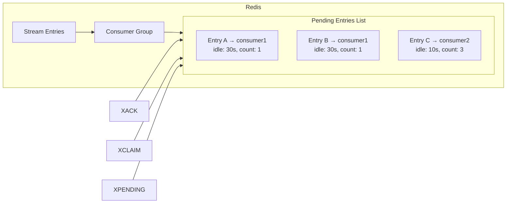
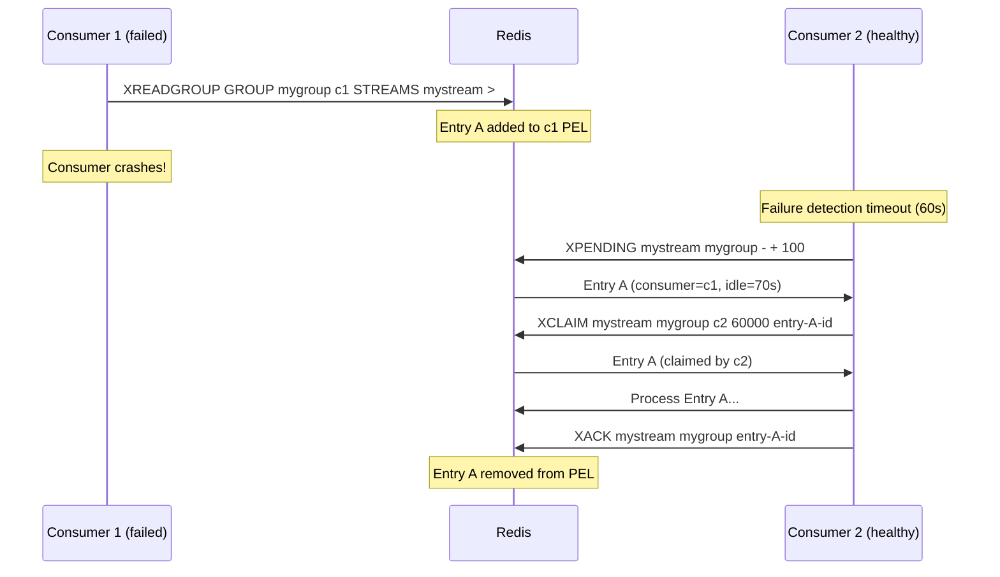

## 1 — Overview — Message Lifecycle and Reliability

XACK, XPENDING, and XCLAIM form the reliability layer of Redis Streams consumer groups. They provide the mechanisms to track, verify, and recover message delivery within a consumer group — enabling at-least-once processing guarantees and failure recovery.

### 1.1 — The Message Lifecycle

Messages in a consumer group pass through distinct stages:

1. **Added** — Producer calls XADD, entry enters the stream.
2. **Delivered** — Consumer calls XREADGROUP, message enters the consumer's PEL (Pending Entries List).
3. **Acknowledged** — Consumer calls XACK, message is removed from PEL.
4. **Claimed** — If the consumer does not XACK within a timeout, another consumer XCLAIMs the message.

### 1.2 — Command Overview

| Command | Purpose | Redis Version |
|---------|---------|---------------|
| XACK | Acknowledge message as processed, remove from PEL | 5.0 |
| XPENDING | Inspect pending entries (unacknowledged) | 5.0 |
| XCLAIM | Transfer pending entry to another consumer | 5.0 |
| XAUTOCLAIM | Auto-claim timed-out pending entries | 6.2 |

### 1.3 — Why These Are Important

Without XACK, messages remain in the PEL forever, consuming memory and preventing Redis from knowing the processing state. XPENDING is the diagnostic tool to inspect stuck messages. XCLAIM is the recovery mechanism for failed consumers.

## 2 — XACK — Acknowledging Successful Processing

XACK tells Redis that a consumer has successfully processed a message. Redis removes the message from the PEL.

### 2.1 — Redis CLI Syntax

```bash
XACK key groupname id [id ...]
```

Parameters:
- `key` — The stream key.
- `groupname` — The consumer group name.
- `id` — One or more entry IDs to acknowledge.

### 2.2 — CLI Examples

```bash
# Acknowledge a single entry
XACK mystream mygroup 1734567890000-0

# Acknowledge multiple entries
XACK mystream mygroup 1734567890000-0 1734567890001-0 1734567890002-0

# Acknowledge all entries in a batch
XACK mystream mygroup 1734567890000-0 1734567890001-0
```

### 2.3 — StackExchange.Redis — StreamAcknowledgeAsync

```csharp
using StackExchange.Redis;

public class AcknowledgmentService
{
    private readonly IDatabase _db;

    public AcknowledgmentService(ConnectionMultiplexer redis)
    {
        _db = redis.GetDatabase();
    }

    /// <summary>
    /// Acknowledge a single entry as processed.
    /// </summary>
    public async Task<long> AcknowledgeAsync(string streamKey, string groupName, EntryId entryId)
    {
        try
        {
            long count = await _db.StreamAcknowledgeAsync(streamKey, groupName, entryId);
            Console.WriteLine($"Acknowledged entry {entryId}: {count} entries affected");
            return count;
        }
        catch (RedisException ex)
        {
            Console.WriteLine($"Error acknowledging entry {entryId}: {ex.Message}");
            throw;
        }
    }

    /// <summary>
    /// Acknowledge multiple entries in a single call.
    /// </summary>
    public async Task<long> AcknowledgeBatchAsync(string streamKey, string groupName, List<EntryId> entryIds)
    {
        try
        {
            long count = 0;
            foreach (EntryId id in entryIds)
            {
                count += await _db.StreamAcknowledgeAsync(streamKey, groupName, id);
            }
            return count;
        }
        catch (RedisException ex)
        {
            Console.WriteLine($"Error acknowledging batch: {ex.Message}");
            throw;
        }
    }

    /// <summary>
    /// Acknowledge entries from a batch of StreamEntry objects.
    /// </summary>
    public async Task<long> AcknowledgeEntriesAsync(string streamKey, string groupName, IEnumerable<StreamEntry> entries)
    {
        try
        {
            var ids = entries.Select(e => e.Id).ToArray();
            return await AcknowledgeBatchAsync(streamKey, groupName, ids.ToList());
        }
        catch (RedisException ex)
        {
            Console.WriteLine($"Error acknowledging entries: {ex.Message}");
            throw;
        }
    }

    /// <summary>
    /// Acknowledge with retry on transient errors.
    /// </summary>
    public async Task<long> AcknowledgeWithRetryAsync(string streamKey, string groupName, EntryId entryId, int maxRetries = 3)
    {
        int attempt = 0;
        while (attempt < maxRetries)
        {
            try
            {
                return await _db.StreamAcknowledgeAsync(streamKey, groupName, entryId);
            }
            catch (RedisConnectionException ex)
            {
                attempt++;
                if (attempt >= maxRetries) throw;
                Console.WriteLine($"Retry {attempt}/{maxRetries} for ACK {entryId}: {ex.Message}");
                await Task.Delay(TimeSpan.FromMilliseconds(50 * attempt));
            }
        }
        throw new InvalidOperationException("Should not reach here");
    }
}
```

### 2.4 — Auto-Acknowledgment Pattern

```csharp
public class AutoAckConsumer
{
    private readonly IDatabase _db;
    private readonly string _streamKey;
    private readonly string _groupName;
    private readonly string _consumerName;

    public AutoAckConsumer(ConnectionMultiplexer redis, string streamKey, string groupName, string consumerName)
    {
        _db = redis.GetDatabase();
        _streamKey = streamKey;
        _groupName = groupName;
        _consumerName = consumerName;
    }

    public async Task ProcessAndAckAsync(Func<StreamEntry, Task> processor, CancellationToken ct)
    {
        StreamEntry[] entries = await _db.StreamReadGroupAsync(
            _streamKey, _groupName, _consumerName,
            StreamPosition.UndeliveredMessages, count: 10
        );

        foreach (StreamEntry entry in entries)
        {
            try
            {
                await processor(entry);
                await _db.StreamAcknowledgeAsync(_streamKey, _groupName, entry.Id);
            }
            catch (Exception ex)
            {
                Console.WriteLine($"Processing failed for {entry.Id}: {ex.Message}");
                // Do NOT acknowledge — message stays in PEL for retry
            }
        }
    }
}
```

### 2.5 — Ack After Processing Pipeline

```csharp
public class ProcessingPipeline
{
    private readonly IDatabase _db;
    private readonly string _streamKey;
    private readonly string _groupName;

    public ProcessingPipeline(ConnectionMultiplexer redis, string streamKey, string groupName)
    {
        _db = redis.GetDatabase();
        _streamKey = streamKey;
        _groupName = groupName;
    }

    public async Task ProcessEntryAsync(StreamEntry entry, CancellationToken ct)
    {
        try
        {
            // Step 1: Validate
            ValidateEntry(entry);

            // Step 2: Transform
            var transformed = TransformEntry(entry);

            // Step 3: Persist
            await PersistAsync(transformed, ct);

            // Step 4: Acknowledge
            await _db.StreamAcknowledgeAsync(_streamKey, _groupName, entry.Id);

            Console.WriteLine($"Entry {entry.Id} processed and acknowledged");
        }
        catch (Exception ex)
        {
            Console.WriteLine($"Entry {entry.Id} processing failed at step X: {ex.Message}");
            // No ACK — remains pending for retry
            throw;
        }
    }

    private void ValidateEntry(StreamEntry entry)
    {
        if (entry.Values.Length == 0)
            throw new InvalidOperationException("Empty entry");
    }

    private Dictionary<string, string> TransformEntry(StreamEntry entry)
    {
        return entry.Values.ToDictionary(v => (string)v.Name!, v => (string)v.Value!);
    }

    private async Task PersistAsync(Dictionary<string, string> data, CancellationToken ct)
    {
        // Simulate database write
        await Task.Delay(10, ct);
    }
}
```

### 2.6 — XACK Beyond Last Delivered ID

XACK is silent if you acknowledge an ID beyond the last delivered ID. It does not throw an error:

```csharp
// This will return 0 (no entries acknowledged), but no error
long count = await _db.StreamAcknowledgeAsync("mystream", "mygroup", new EntryId(9999999999999, 0));
Console.WriteLine(count); // 0 — ID not in PEL
```

## 3 — XPENDING — Inspecting Pending Entries

XPENDING shows the list of entries that have been delivered to consumers but not yet acknowledged. It provides both a summary and detailed per-entry information.

### 3.1 — Redis CLI Syntax

```bash
XPENDING key groupname [[start end count] [consumer]]
```

Parameters:
- `key` — The stream key.
- `groupname` — The consumer group name.
- `start` — Start ID (range query, use `-` for beginning).
- `end` — End ID (use `+` for end).
- `count` — Max entries to return.
- `consumer` — Filter by specific consumer.

### 3.2 — CLI Examples

```bash
# Summary view — total pending, first/last ID, consumers
XPENDING mystream mygroup

# Detailed view — up to 10 pending entries
XPENDING mystream mygroup - + 10

# Detailed view for a specific consumer
XPENDING mystream mygroup - + 10 consumer1

# Full pending list
XPENDING mystream mygroup - + 1000
```

### 3.3 — XPENDING Summary Output Format

```
1) (integer) 3          — Total pending entries
2) "1734567890000-0"    — Oldest pending entry ID
3) "1734567890002-0"    — Newest pending entry ID
4) 1) 1) "consumer1"    — Consumer with pending
      2) "2"           — Their pending count
```

### 3.4 — StackExchange.Redis — StreamPendingAsync

```csharp
public class PendingInspector
{
    private readonly IDatabase _db;

    public PendingInspector(ConnectionMultiplexer redis)
    {
        _db = redis.GetDatabase();
    }

    /// <summary>
    /// Get the pending message summary for a consumer group.
    /// </summary>
    public async Task<StreamPendingInfo> GetPendingSummaryAsync(string streamKey, string groupName)
    {
        try
        {
            StreamPendingInfo info = await _db.StreamPendingAsync(streamKey, groupName);
            Console.WriteLine($"Pending summary for '{streamKey}' group '{groupName}':");
            Console.WriteLine($"  Total pending: {info.PendingCount}");
            Console.WriteLine($"  Oldest pending: {info.OldestPendingId}");
            Console.WriteLine($"  Newest pending: {info.NewestPendingId}");
            Console.WriteLine($"  Consumers with pending: {info.ConsumerCount}");

            foreach (var consumer in info.Consumers)
            {
                Console.WriteLine($"  Consumer '{consumer.Name}': {consumer.PendingCount} pending");
            }

            return info;
        }
        catch (RedisException ex)
        {
            Console.WriteLine($"Error getting pending summary: {ex.Message}");
            throw;
        }
    }

    /// <summary>
    /// Get detailed pending entries (individual message info).
    /// </summary>
    public async Task<List<PendingEntryInfo>> GetPendingDetailsAsync(
        string streamKey,
        string groupName,
        int count = 100,
        string? consumerName = null)
    {
        try
        {
            // SE.Redis does not directly expose XPENDING detail.
            // Use ExecuteAsync for the extended form.
            var args = new List<object> { streamKey, groupName, "-", "+", count.ToString() };
            if (consumerName != null)
            {
                args.Add(consumerName);
            }

            RedisResult result = await _db.ExecuteAsync("XPENDING", args);
            return ParsePendingDetails(result);
        }
        catch (RedisException ex)
        {
            Console.WriteLine($"Error getting pending details: {ex.Message}");
            throw;
        }
    }

    private static List<PendingEntryInfo> ParsePendingDetails(RedisResult result)
    {
        var entries = new List<PendingEntryInfo>();

        if (result.IsNull || !result.IsArray) return entries;

        foreach (var item in (RedisResult[])result)
        {
            var arr = (RedisResult[])item;
            // arr[0] = id, arr[1] = consumer, arr[2] = idle ms, arr[3] = delivery count
            var info = new PendingEntryInfo(
                EntryId.Parse((string)arr[0]),
                (string)arr[1],
                (long)arr[2],
                (long)arr[3]
            );
            entries.Add(info);
        }

        return entries;
    }

    /// <summary>
    /// Check if a specific entry is pending.
    /// </summary>
    public async Task<bool> IsPendingAsync(string streamKey, string groupName, EntryId entryId)
    {
        try
        {
            // Query pending for this specific ID
            RedisResult result = await _db.ExecuteAsync(
                "XPENDING",
                streamKey,
                groupName,
                entryId.ToString(),
                entryId.ToString(),
                "1"
            );

            if (result.IsArray)
            {
                var arr = (RedisResult[])result;
                return arr.Length > 0 && ((RedisResult[])arr[0]).Length > 0;
            }
            return false;
        }
        catch (RedisException ex)
        {
            Console.WriteLine($"Error checking pending status: {ex.Message}");
            throw;
        }
    }
}

/// <summary>
/// Represents detailed info about a single pending entry.
/// </summary>
public class PendingEntryInfo
{
    public EntryId Id { get; }
    public string ConsumerName { get; }
    public long IdleTimeMs { get; }
    public long DeliveryCount { get; }

    public PendingEntryInfo(EntryId id, string consumerName, long idleTimeMs, long deliveryCount)
    {
        Id = id;
        ConsumerName = consumerName;
        IdleTimeMs = idleTimeMs;
        DeliveryCount = deliveryCount;
    }

    public override string ToString()
        => $"ID: {Id}, Consumer: {ConsumerName}, Idle: {IdleTimeMs}ms, Delivered: {DeliveryCount}x";
}
```

### 3.5 — Monitoring PEL Size

```csharp
public class PelMonitor
{
    private readonly IDatabase _db;
    private readonly ILogger<PelMonitor> _logger;
    private readonly long _warningThreshold;
    private readonly long _criticalThreshold;

    public PelMonitor(
        ConnectionMultiplexer redis,
        ILogger<PelMonitor> logger,
        long warningThreshold = 10_000,
        long criticalThreshold = 100_000)
    {
        _db = redis.GetDatabase();
        _logger = logger;
        _warningThreshold = warningThreshold;
        _criticalThreshold = criticalThreshold;
    }

    public async Task<long> GetPendingCountAsync(string streamKey, string groupName)
    {
        try
        {
            StreamPendingInfo info = await _db.StreamPendingAsync(streamKey, groupName);
            long count = info.PendingCount;

            if (count >= _criticalThreshold)
            {
                _logger.LogCritical(
                    "PEL for '{StreamKey}/{Group}' has {Count} pending entries (threshold: {Threshold})",
                    streamKey, groupName, count, _criticalThreshold);
            }
            else if (count >= _warningThreshold)
            {
                _logger.LogWarning(
                    "PEL for '{StreamKey}/{Group}' has {Count} pending entries (threshold: {Threshold})",
                    streamKey, groupName, count, _warningThreshold);
            }

            return count;
        }
        catch (RedisException ex)
        {
            _logger.LogError(ex, "Error monitoring PEL for '{StreamKey}/{Group}'", streamKey, groupName);
            return -1;
        }
    }

    public async Task<Dictionary<string, long>> GetConsumerPendingCountsAsync(string streamKey, string groupName)
    {
        try
        {
            var counts = new Dictionary<string, long>();
            StreamPendingInfo info = await _db.StreamPendingAsync(streamKey, groupName);

            foreach (var consumer in info.Consumers)
            {
                counts[consumer.Name!] = consumer.PendingCount;
            }

            return counts;
        }
        catch (RedisException ex)
        {
            _logger.LogError(ex, "Error getting consumer pending counts");
            return new Dictionary<string, long>();
        }
    }
}
```

## 4 — XCLAIM — Claiming Pending Entries from Failed Consumers

XCLAIM transfers ownership of pending entries from one consumer to another. This is the core mechanism for failure recovery — when a consumer fails, its pending messages can be claimed and reprocessed by a healthy consumer.

### 4.1 — Redis CLI Syntax

```bash
XCLAIM key groupname consumer min-idle-time id [id ...] [JUSTID] [LASTID lastid]
```

Parameters:
- `key` — The stream key.
- `groupname` — The consumer group.
- `consumer` — The target consumer (will own the messages).
- `min-idle-time` — Minimum idle time in ms (only claim messages idle longer than this).
- `id` — One or more entry IDs to claim.
- `JUSTID` — Return only IDs (no full entry data).

### 4.2 — CLI Examples

```bash
# Claim a message after 60 seconds idle
XCLAIM mystream mygroup consumer2 60000 1734567890000-0

# Claim multiple messages
XCLAIM mystream mygroup consumer2 60000 1734567890000-0 1734567890001-0

# Claim with JUSTID (faster, no payload)
XCLAIM mystream mygroup consumer2 60000 1734567890000-0 JUSTID

# Claim with LASTID (prevent message duplication)
XCLAIM mystream mygroup consumer2 60000 1734567890000-0 LASTID 1734567889999-0
```

### 4.3 — StackExchange.Redis — StreamClaimAsync

```csharp
public class ClaimService
{
    private readonly IDatabase _db;

    public ClaimService(ConnectionMultiplexer redis)
    {
        _db = redis.GetDatabase();
    }

    /// <summary>
    /// Claim pending entries from another consumer.
    /// </summary>
    public async Task<List<StreamEntry>> ClaimAsync(
        string streamKey,
        string groupName,
        string targetConsumer,
        long minIdleTimeMs,
        EntryId[] entryIds)
    {
        try
        {
            StreamEntry[] claimed = await _db.StreamClaimAsync(
                streamKey,
                groupName,
                targetConsumer,
                minIdleTimeMs,
                entryIds
            );
            Console.WriteLine($"Claimed {claimed.Length} entries for consumer '{targetConsumer}'");
            return claimed.ToList();
        }
        catch (RedisException ex)
        {
            Console.WriteLine($"Error claiming entries: {ex.Message}");
            throw;
        }
    }

    /// <summary>
    /// Claim entries with JUSTID (returns only IDs, no payload).
    /// Uses raw ExecuteAsync for JUSTID support.
    /// </summary>
    public async Task<EntryId[]> ClaimJustIdsAsync(
        string streamKey,
        string groupName,
        string targetConsumer,
        long minIdleTimeMs,
        EntryId[] entryIds)
    {
        try
        {
            var args = new List<object>
            {
                streamKey, groupName, targetConsumer, minIdleTimeMs.ToString()
            };
            foreach (var id in entryIds) args.Add(id.ToString());
            args.Add("JUSTID");

            RedisResult result = await _db.ExecuteAsync("XCLAIM", args);
            return ParseClaimedIds(result);
        }
        catch (RedisException ex)
        {
            Console.WriteLine($"Error claiming entries with JUSTID: {ex.Message}");
            throw;
        }
    }

    /// <summary>
    /// Claim entries that have been idle for a given time, based on XPENDING scan.
    /// </summary>
    public async Task<List<StreamEntry>> ClaimStaleAsync(
        string streamKey,
        string groupName,
        string targetConsumer,
        long minIdleTimeMs,
        int maxCount = 100)
    {
        try
        {
            // First find stale pending entries
            RedisResult pendingResult = await _db.ExecuteAsync(
                "XPENDING", streamKey, groupName, "-", "+", maxCount.ToString()
            );

            if (!pendingResult.IsArray) return new List<StreamEntry>();

            var staleIds = new List<EntryId>();
            foreach (var item in (RedisResult[])pendingResult)
            {
                var arr = (RedisResult[])item;
                long idleTime = (long)arr[2]; // idle time in ms
                if (idleTime >= minIdleTimeMs)
                {
                    staleIds.Add(EntryId.Parse((string)arr[0]));
                }
            }

            if (staleIds.Count == 0) return new List<StreamEntry>();

            // Claim the stale entries
            return await ClaimAsync(streamKey, groupName, targetConsumer, minIdleTimeMs, staleIds.ToArray());
        }
        catch (RedisException ex)
        {
            Console.WriteLine($"Error claiming stale entries: {ex.Message}");
            throw;
        }
    }

    private static EntryId[] ParseClaimedIds(RedisResult result)
    {
        if (result.IsNull || !result.IsArray) return Array.Empty<EntryId>();

        var arr = (RedisResult[])result;
        return arr
            .Select(r => EntryId.Parse((string)r))
            .ToArray();
    }
}
```

### 4.4 — min-idle-time Protection

The `min-idle-time` parameter prevents claiming messages that are currently being processed:

```csharp
// SAFE — only claim messages idle for 60+ seconds
// This gives the original consumer time to process and ACK
await _db.StreamClaimAsync(
    "mystream", "mygroup", "healthy-consumer",
    60_000, // 60 seconds
    new[] { entryId }
);

// DANGEROUS — claiming with 0 idle time steals active messages
// This can cause duplicate processing!
await _db.StreamClaimAsync(
    "mystream", "mygroup", "thief-consumer",
    0, // No idle time — steals even active messages
    new[] { entryId }
);
```

## 5 — XAUTOCLAIM — Auto-Claiming (Redis 6.2+)

XAUTOCLAIM is an improved version of XCLAIM that automatically scans and claims timed-out messages, returning a cursor for continuation.

### 5.1 — Redis CLI Syntax

```bash
XAUTOCLAIM key groupname consumer min-idle-time start [COUNT count] [JUSTID]
```

### 5.2 — CLI Examples

```bash
# Auto-claim from the beginning, messages idle > 60s
XAUTOCLAIM mystream mygroup consumer2 60000 0-0

# Auto-claim with COUNT limit
XAUTOCLAIM mystream mygroup consumer2 60000 0-0 COUNT 100

# Auto-claim with JUSTID
XAUTOCLAIM mystream mygroup consumer2 60000 0-0 COUNT 100 JUSTID
```

### 5.3 — StackExchange.Redis — Using ExecuteAsync for XAUTOCLAIM

```csharp
public class AutoClaimService
{
    private readonly IDatabase _db;

    public AutoClaimService(ConnectionMultiplexer redis)
    {
        _db = redis.GetDatabase();
    }

    /// <summary>
    /// Auto-claim stale messages. Returns claimed entries and a cursor for continuation.
    /// </summary>
    public async Task<(EntryId NextCursor, List<StreamEntry> Entries)> AutoClaimAsync(
        string streamKey,
        string groupName,
        string targetConsumer,
        long minIdleTimeMs,
        string startCursor = "0-0",
        int count = 100)
    {
        try
        {
            RedisResult result = await _db.ExecuteAsync(
                "XAUTOCLAIM",
                streamKey,
                groupName,
                targetConsumer,
                minIdleTimeMs.ToString(),
                startCursor,
                "COUNT",
                count.ToString()
            );

            return ParseAutoClaimResult(result);
        }
        catch (RedisException ex)
        {
            Console.WriteLine($"XAUTOCLAIM error: {ex.Message}");
            throw;
        }
    }

    /// <summary>
    /// Auto-claim with JUSTID (faster, returns only IDs).
    /// </summary>
    public async Task<(EntryId NextCursor, EntryId[] ClaimedIds)> AutoClaimJustIdsAsync(
        string streamKey,
        string groupName,
        string targetConsumer,
        long minIdleTimeMs,
        string startCursor = "0-0",
        int count = 100)
    {
        try
        {
            RedisResult result = await _db.ExecuteAsync(
                "XAUTOCLAIM",
                streamKey,
                groupName,
                targetConsumer,
                minIdleTimeMs.ToString(),
                startCursor,
                "COUNT",
                count.ToString(),
                "JUSTID"
            );

            var arr = (RedisResult[])result;
            EntryId nextCursor = EntryId.Parse((string)arr[0]);
            var claimedIds = ((RedisResult[])arr[2])
                .Select(r => EntryId.Parse((string)r))
                .ToArray();

            return (nextCursor, claimedIds);
        }
        catch (RedisException ex)
        {
            Console.WriteLine($"XAUTOCLAIM JUSTID error: {ex.Message}");
            throw;
        }
    }

    /// <summary>
    /// Repeatedly auto-claim until all stale messages are claimed.
    /// </summary>
    public async Task<int> AutoClaimAllAsync(
        string streamKey,
        string groupName,
        string targetConsumer,
        long minIdleTimeMs,
        int batchSize = 100)
    {
        int totalClaimed = 0;
        string cursor = "0-0";

        while (true)
        {
            var (nextCursor, entries) = await AutoClaimAsync(
                streamKey, groupName, targetConsumer, minIdleTimeMs, cursor, batchSize
            );

            totalClaimed += entries.Count;
            Console.WriteLine($"Claimed {entries.Count} entries (total: {totalClaimed}, cursor: {nextCursor})");

            if (nextCursor.ToString() == "0-0")
            {
                // "0-0" means the scan is complete
                break;
            }
            cursor = nextCursor.ToString();
        }

        Console.WriteLine($"Auto-claim complete: {totalClaimed} entries claimed");
        return totalClaimed;
    }

    private static (EntryId NextCursor, List<StreamEntry> Entries) ParseAutoClaimResult(RedisResult result)
    {
        var arr = (RedisResult[])result;
        // arr[0] = next cursor, arr[1] = claimed entries array
        EntryId nextCursor = EntryId.Parse((string)arr[0]);
        var entries = new List<StreamEntry>();

        if (arr[1].IsArray)
        {
            foreach (var entryResult in (RedisResult[])arr[1])
            {
                var entryArr = (RedisResult[])entryResult;
                var id = EntryId.Parse((string)entryArr[0]);
                var fieldValues = (RedisResult[])entryArr[1];
                var fields = new NameValueEntry[fieldValues.Length / 2];
                for (int i = 0; i < fieldValues.Length; i += 2)
                {
                    fields[i / 2] = new NameValueEntry(
                        (string)fieldValues[i],
                        (string)fieldValues[i + 1]
                    );
                }
                entries.Add(new StreamEntry(id, fields));
            }
        }

        return (nextCursor, entries);
    }
}
```

### 5.4 — XAUTOCLAIM vs XCLAIM Comparison

| Aspect | XCLAIM | XAUTOCLAIM (6.2+) |
|--------|--------|-------------------|
| Entry selection | Must specify IDs | Scans PEL automatically |
| Cursor | No | Yes (for large PELs) |
| Batch size | Manual (loop) | Built-in COUNT |
| Error handling | Entry-level | Batch-level |
| Idle time | Per-claim | Per-claim |
| Complexity | Higher (scan + claim) | Lower (single call) |

## 6 — Architecture — PEL Internals and Memory

### 6.1 — How the PEL Works

The PEL (Pending Entries List) is a per-consumer data structure that tracks:
- Entry IDs delivered to the consumer
- Idle time (time since delivery)
- Delivery count (number of times delivered)



### 6.2 — PEL Memory Overhead

```csharp
public static void CalculatePelMemory(int pendingCount, int avgIdLength = 20)
{
    // Per PEL entry overhead
    const int entryOverhead = 40;    // Redis dict entry
    const int idOverhead = 16;       // EntryId (8+8 bytes)
    const int idleTime = 8;          // long
    const int deliveryCount = 8;     // long
    const int consumerRef = 8;       // pointer to consumer name

    int perEntry = entryOverhead + idOverhead + idleTime + deliveryCount + consumerRef + avgIdLength;
    long total = pendingCount * perEntry;

    Console.WriteLine($"PEL with {pendingCount} entries:");
    Console.WriteLine($"  Per-entry: {perEntry} bytes");
    Console.WriteLine($"  Total: {total:N0} bytes ({total / 1024.0:F2} KB / {total / 1024 / 1024:F2} MB)");
}

// Example:
// PEL with 100,000 entries → ~8 MB (80 bytes each)
// PEL with 1,000,000 entries → ~80 MB
```

### 6.3 — Mermaid: Failure Recovery Flow



### 6.4 — Delivery Count and Poison Messages

```csharp
/// <summary>
/// Track delivery count to detect poison messages (messages that repeatedly fail).
/// </summary>
public class PoisonMessageDetector
{
    private readonly IDatabase _db;
    private readonly int _maxDeliveryCount;

    public PoisonMessageDetector(ConnectionMultiplexer redis, int maxDeliveryCount = 5)
    {
        _db = redis.GetDatabase();
        _maxDeliveryCount = maxDeliveryCount;
    }

    public async Task<bool> IsPoisonAsync(string streamKey, string groupName, EntryId entryId)
    {
        try
        {
            // Check delivery count via XPENDING detail
            RedisResult result = await _db.ExecuteAsync(
                "XPENDING", streamKey, groupName,
                entryId.ToString(), entryId.ToString(), "1"
            );

            if (result.IsNull || !result.IsArray) return false;
            var arr = (RedisResult[])result;
            if (arr.Length == 0) return false;

            var detail = (RedisResult[])arr[0];
            long deliveryCount = (long)detail[3]; // arr[3] = delivery count

            return deliveryCount >= _maxDeliveryCount;
        }
        catch (RedisException ex)
        {
            Console.WriteLine($"Error checking poison status: {ex.Message}");
            return false;
        }
    }

    /// <summary>
    /// Move a poison message to a dead-letter stream.
    /// </summary>
    public async Task MoveToDeadLetterAsync(string sourceStream, string groupName, EntryId entryId, string dlqStream = "dlq:stream")
    {
        try
        {
            // Read the entry content
            StreamEntry[] entries = await _db.StreamRangeAsync(sourceStream, entryId.ToString(), entryId.ToString());
            if (entries.Length == 0)
            {
                Console.WriteLine($"Entry {entryId} not found in stream");
                return;
            }

            // Write to DLQ stream
            await _db.StreamAddAsync(dlqStream, entries[0].Values);

            // Acknowledge the original (remove from PEL so it won't be retried)
            await _db.StreamAcknowledgeAsync(sourceStream, groupName, entryId);

            Console.WriteLine($"Moved poison message {entryId} to {dlqStream}");
        }
        catch (RedisException ex)
        {
            Console.WriteLine($"Error moving to dead letter: {ex.Message}");
            throw;
        }
    }
}
```

## 7 — Gotchas — Reliability Command Pitfalls

### 7.1 — XACK Is Silent on Non-Existent Entries

```csharp
// XACK on an ID not in the PEL returns 0 — no error, no exception
long acked = await _db.StreamAcknowledgeAsync("mystream", "mygroup", someEntryId);
// acked == 0 means the entry was not in the PEL
// This could mean: already acked, or never delivered, or wrong group
```

### 7.2 — XPENDING Summary vs Detail

```csharp
// Summary version — returns counts only
StreamPendingInfo summary = await _db.StreamPendingAsync("mystream", "mygroup");
// summary.PendingCount, summary.OldestPendingId, summary.Consumers

// Detail version — returns per-entry information (use ExecuteAsync)
RedisResult detail = await _db.ExecuteAsync("XPENDING", "mystream", "mygroup", "-", "+", "100");
// Each entry: [id, consumerName, idleMs, deliveryCount]
```

### 7.3 — XCLAIM Idle Time Units

```csharp
// XCLAIM min-idle-time is in MILLISECONDS
// 60_000 = 60 seconds
// 300_000 = 5 minutes
// 3_600_000 = 1 hour

// WRONG: passing seconds
await _db.StreamClaimAsync("mystream", "mygroup", "c2", 60, ids);
// This would claim after only 60ms!

// CORRECT: pass milliseconds
await _db.StreamClaimAsync("mystream", "mygroup", "c2", 60_000, ids);
```

### 7.4 — XCLAIM Returns Empty for Non-Stale Entries

```csharp
// If the entry's idle time is less than min-idle-time, XCLAIM returns empty:
StreamEntry[] claimed = await _db.StreamClaimAsync(
    "mystream", "mygroup", "c2", 60_000, new[] { entryId }
);
// claimed.Length == 0 if entry is not idle enough

// Always check the return value — don't assume the claim succeeded
if (claimed.Length == 0)
{
    Console.WriteLine($"Entry {entryId} was not claimed (not stale yet)");
}
```

### 7.5 — XPENDING With Large PEL

```csharp
// XPENDING with a very large PEL can be slow and memory-intensive
// Always use COUNT to limit the result:

// GOOD — paginate through pending entries
int pageSize = 100;
string start = "-";
while (true)
{
    RedisResult result = await _db.ExecuteAsync(
        "XPENDING", "mystream", "mygroup", start, "+", pageSize.ToString()
    );
    // Process...
    break; // In practice, iterate using the last ID
}

// BAD — requesting all pending entries at once:
// XPENDING mystream mygroup - + 1000000  — DANGER with large PEL
```

### 7.6 — Consumer Reconnection and Duplicate Processing

```csharp
// When consumer reconnects, it may receive the same messages again
// via XREADGROUP with "0" (pending read)

// POTENTIAL DUPLICATE: consumer restarts, reads pending
StreamEntry[] pendingOnRestart = await _db.StreamReadGroupAsync(
    "mystream", "mygroup", "consumer1", StreamPosition.Beginning // "0"
);

// Design processing to be idempotent:
public async Task ProcessIdempotentAsync(StreamEntry entry)
{
    string? eventId = entry["eventId"]; // Unique event identifier
    if (await HasBeenProcessedAsync(eventId!))
    {
        // Already processed — just ACK and skip
        await _db.StreamAcknowledgeAsync("mystream", "mygroup", entry.Id);
        return;
    }

    // Process normally
    await DoWorkAsync(entry);
    await _db.StreamAcknowledgeAsync("mystream", "mygroup", entry.Id);
}
```

### 7.7 — XACK After Key Deletion

```csharp
// If the stream key is deleted, XACK will fail
await _db.KeyDeleteAsync("mystream");

// This will throw: RedisServerException: NOGROUP No such consumer group 'mygroup'...
await _db.StreamAcknowledgeAsync("mystream", "mygroup", entryId);

// Always handle XACK exceptions gracefully
```

### 7.8 — Delivery Count Overflows

```csharp
// Delivery count is a long but in practice should be bounded
// If delivery count is very high, the consumer group likely needs manual intervention

public async Task<List<PendingEntryInfo>> FindHighDeliveryEntriesAsync(
    string streamKey, string groupName, long threshold = 10)
{
    var highDelivery = new List<PendingEntryInfo>();

    RedisResult result = await _db.ExecuteAsync(
        "XPENDING", streamKey, groupName, "-", "+", "1000"
    );

    if (result.IsArray)
    {
        foreach (var item in (RedisResult[])result)
        {
            var arr = (RedisResult[])item;
            long deliveryCount = (long)arr[3];
            if (deliveryCount >= threshold)
            {
                highDelivery.Add(new PendingEntryInfo(
                    EntryId.Parse((string)arr[0]),
                    (string)arr[1],
                    (long)arr[2],
                    deliveryCount
                ));
            }
        }
    }

    return highDelivery;
}
```

## 8 — Comparison — Reliability Strategies

### 8.1 — XACK vs NOACK

| Aspect | XACK | NOACK |
|--------|------|-------|
| Reliability | At-least-once | At-most-once |
| Performance | Extra round trip | No ACK overhead |
| PEL growth | Managed by ACKs | No PEL entries |
| Failure recovery | XCLAIM available | Messages lost on crash |
| Use case | Critical processing | Logging, monitoring |

### 8.2 — XCLAIM vs XAUTOCLAIM

| Aspect | XCLAIM | XAUTOCLAIM |
|--------|--------|------------|
| Redis version | 5.0+ | 6.2+ |
| Entry selection | Manual (list IDs) | Automatic (scans PEL) |
| Cursor for large PEL | No (manual pagination) | Yes |
| Batch size | Single or multi-ID | COUNT parameter |
| Complexity | Higher | Lower |

### 8.3 — XPENDING Monitoring Approaches

```csharp
// Approach 1: Periodic polling (simple)
public async Task MonitorPollingAsync(string streamKey, string groupName, TimeSpan interval, CancellationToken ct)
{
    while (!ct.IsCancellationRequested)
    {
        long pending = (await _db.StreamPendingAsync(streamKey, groupName)).PendingCount;
        Console.WriteLine($"[{DateTime.UtcNow:O}] Pending: {pending}");
        await Task.Delay(interval, ct);
    }
}

// Approach 2: Event-driven via Redis keyspace notifications
// Requires configuring Redis for notify-keyspace-events

// Approach 3: Monitoring via Prometheus metrics
// Export pending counts as gauges
```

## 9 — Quick Reference — Reliability Command Reference

### 9.1 — Command Reference Table

| Command | CLI Example | SE.Redis Method | Description |
|---------|-------------|-----------------|-------------|
| XACK | `XACK mystream mygroup 1734567890000-0` | `StreamAcknowledgeAsync` | Acknowledge entry as processed |
| XPENDING | `XPENDING mystream mygroup` | `StreamPendingAsync` | Pending entries summary |
| XPENDING (detail) | `XPENDING mystream mygroup - + 100` | `ExecuteAsync("XPENDING", ...)` | Detailed pending entries |
| XCLAIM | `XCLAIM mystream mygroup c2 60000 id` | `StreamClaimAsync` | Claim pending entries |
| XAUTOCLAIM | `XAUTOCLAIM mystream mygroup c2 60000 0-0` | `ExecuteAsync("XAUTOCLAIM", ...)` | Auto-claim stale entries |
| XGROUP SETID | `XGROUP SETID mystream mygroup $` | `ExecuteAsync("XGROUP", "SETID", ...)` | Reset last delivered ID |

### 9.2 — SE.Redis Method Signatures

```csharp
// XACK
Task<long> StreamAcknowledgeAsync(
    RedisKey key,
    RedisValue groupName,
    EntryId entryId,
    CommandFlags flags = CommandFlags.None
);

// XPENDING (summary)
Task<StreamPendingInfo> StreamPendingAsync(
    RedisKey key,
    RedisValue groupName,
    CommandFlags flags = CommandFlags.None
);

// XPENDING (detailed — via ExecuteAsync)
// ExecuteAsync("XPENDING", key, groupName, start, end, count, [consumer])

// XCLAIM
Task<StreamEntry[]> StreamClaimAsync(
    RedisKey key,
    RedisValue groupName,
    RedisValue consumerName,
    long minIdleTimeInMs,
    EntryId[] entryIds,
    CommandFlags flags = CommandFlags.None
);
```

### 9.3 — Error Handling Cheat Sheet

```csharp
// NOGROUP — group doesn't exist
// XREADGROUP, XACK, XCLAIM all throw RedisServerException with "NOGROUP"
try
{
    await _db.StreamAcknowledgeAsync("mystream", "nonexistent", entryId);
}
catch (RedisServerException ex) when (ex.Message.Contains("NOGROUP"))
{
    Console.WriteLine("Consumer group does not exist");
}

// BUSYGROUP — group already exists (on CREATE)
try
{
    await _db.StreamCreateConsumerGroupAsync("mystream", "mygroup", StreamPosition.Beginning);
}
catch (RedisServerException ex) when (ex.Message.Contains("BUSYGROUP"))
{
    Console.WriteLine("Group already exists — this is fine");
}
```

### 9.4 — Complete Dead Letter Queue Example

```csharp
public class DeadLetterQueue
{
    private readonly IDatabase _db;
    private readonly string _dlqKey = "dlq:failed-messages";
    private readonly int _maxDeliveryCount;

    public DeadLetterQueue(ConnectionMultiplexer redis, int maxDeliveryCount = 5)
    {
        _db = redis.GetDatabase();
        _maxDeliveryCount = maxDeliveryCount;
    }

    public async Task CheckAndMoveToDlqAsync(string streamKey, string groupName)
    {
        // Get pending entries with delivery count
        RedisResult result = await _db.ExecuteAsync(
            "XPENDING", streamKey, groupName, "-", "+", "1000"
        );

        if (!result.IsArray) return;

        foreach (var item in (RedisResult[])result)
        {
            var arr = (RedisResult[])item;
            var id = EntryId.Parse((string)arr[0]);
            long deliveryCount = (long)arr[3];

            if (deliveryCount >= _maxDeliveryCount)
            {
                // Move to DLQ
                StreamEntry[] entries = await _db.StreamRangeAsync(streamKey, id.ToString(), id.ToString());
                if (entries.Length > 0)
                {
                    var fields = new List<NameValueEntry>(entries[0].Values)
                    {
                        new NameValueEntry("_originalStream", streamKey),
                        new NameValueEntry("_groupId", groupName),
                        new NameValueEntry("_deliveryCount", deliveryCount.ToString()),
                        new NameValueEntry("_movedAt", DateTime.UtcNow.ToString("O"))
                    };

                    await _db.StreamAddAsync(_dlqKey, fields.ToArray());
                    await _db.StreamAcknowledgeAsync(streamKey, groupName, id);
                    Console.WriteLine($"Moved {id} to DLQ (delivered {deliveryCount}x)");
                }
            }
        }
    }
}
```

### 9.5 — Health Check for Consumer Groups

```csharp
public class ConsumerGroupHealthCheck
{
    private readonly IDatabase _db;

    public ConsumerGroupHealthCheck(ConnectionMultiplexer redis)
    {
        _db = redis.GetDatabase();
    }

    public async Task<ConsumerGroupHealth> CheckHealthAsync(string streamKey, string groupName)
    {
        try
        {
            // Check stream exists
            bool streamExists = await _db.KeyExistsAsync(streamKey);
            if (!streamExists) return ConsumerGroupHealth.Unhealthy("Stream does not exist");

            // Get pending summary
            StreamPendingInfo pending = await _db.StreamPendingAsync(streamKey, groupName);

            var health = new ConsumerGroupHealth
            {
                StreamKey = streamKey,
                GroupName = groupName,
                PendingCount = pending.PendingCount,
                ConsumerCount = pending.ConsumerCount,
                OldestPendingId = pending.OldestPendingId,
                IsHealthy = pending.PendingCount < 10_000
            };

            return health;
        }
        catch (RedisServerException ex) when (ex.Message.Contains("NOGROUP"))
        {
            return ConsumerGroupHealth.Unhealthy("Consumer group does not exist");
        }
        catch (RedisException ex)
        {
            return ConsumerGroupHealth.Unhealthy(ex.Message);
        }
    }
}

public class ConsumerGroupHealth
{
    public string StreamKey { get; set; } = "";
    public string GroupName { get; set; } = "";
    public long PendingCount { get; set; }
    public long ConsumerCount { get; set; }
    public EntryId? OldestPendingId { get; set; }
    public bool IsHealthy { get; set; }
    public string? ErrorMessage { get; set; }

    public static ConsumerGroupHealth Unhealthy(string message)
        => new ConsumerGroupHealth { IsHealthy = false, ErrorMessage = message };

    public override string ToString()
        => IsHealthy
            ? $"Healthy — {PendingCount} pending, {ConsumerCount} consumers"
            : $"Unhealthy — {ErrorMessage}";
}
```

### 9.6 — Performance Comparison

```csharp
public static async Task BenchmarkReliabilityCommandsAsync(IDatabase db, string streamKey, string groupName)
{
    var sw = new System.Diagnostics.Stopwatch();

    // Benchmark XACK
    var fields = new[] { new NameValueEntry("x", "1") };
    var ids = new List<EntryId>();
    for (int i = 0; i < 1000; i++)
    {
        ids.Add(await db.StreamAddAsync(streamKey, fields));
    }

    sw.Start();
    foreach (var id in ids)
    {
        await db.StreamAcknowledgeAsync(streamKey, groupName, id);
    }
    sw.Stop();
    Console.WriteLine($"XACK 1000 entries: {sw.Elapsed.TotalMilliseconds:F1}ms ({1000 / sw.Elapsed.TotalSeconds:F0} ops/sec)");

    // Benchmark XPENDING summary
    sw.Restart();
    for (int i = 0; i < 100; i++)
    {
        await db.StreamPendingAsync(streamKey, groupName);
    }
    sw.Stop();
    Console.WriteLine($"XPENDING summary 100x: {sw.Elapsed.TotalMilliseconds:F1}ms avg");
}
```

### 9.7 — Further Reading

- Redis Streams documentation: https://redis.io/docs/data-types/streams/
- StackExchange.Redis Streams: https://stackexchange.github.io/StackExchange.Redis/Streams.html
- Related: [[8.982 — Redis — Streams — XADD, XREAD, XRANGE]], [[8.983 — Redis — Streams — Consumer Groups]], [[8.1000 — Redis — StackExchange.Redis Full Reference]]

## 10 — Revision History

| Date | Version | Changes |
|------|---------|---------|
| 2026-06-27 | 1.0 | Initial version — XACK, XPENDING, XCLAIM deep dive with SE.Redis code |

---

*End of note 8.984*
