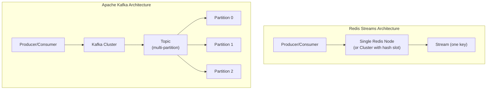
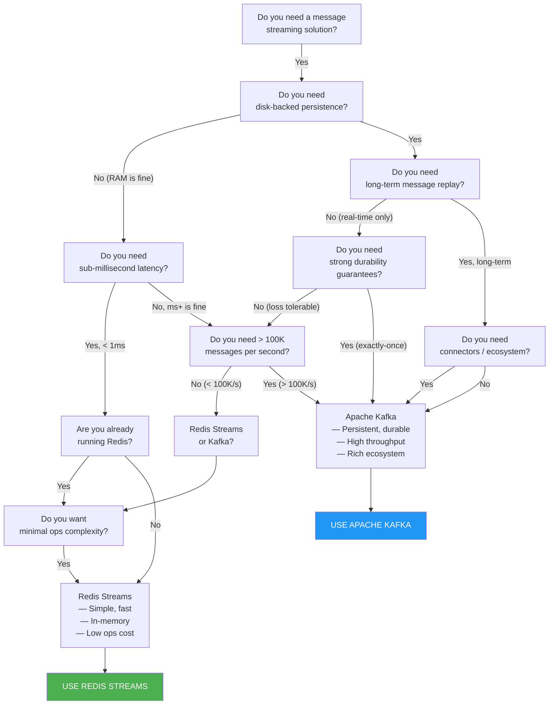

## 1 — Overview — When to Use Redis Streams vs Apache Kafka

Choosing between Redis Streams and Apache Kafka is one of the most common architectural decisions in event-driven systems. Both provide append-only logs with consumer groups, but they differ fundamentally in persistence model, throughput characteristics, operational complexity, and data durability guarantees.

### 1.1 — Redis Streams Summary

Redis Streams are a lightweight, in-memory-first streaming data structure. They are part of the Redis ecosystem, meaning you get streams alongside all of Redis's other capabilities (caching, pub/sub, data structures). Streams were added in Redis 5.0 and have evolved with consumer groups (5.0), XAUTOCLAIM (6.2), and NOMKSTREAM (7.0).

### 1.2 — Apache Kafka Summary

Apache Kafka is a distributed streaming platform designed for high-throughput, persistent, replayable event storage. It runs as a cluster, partitions topics across brokers, and provides strong durability guarantees. Kafka is an independent system with its own operational model.

### 1.3 — Decision Criterias

The decision depends on:
- **Durability requirements** — Can you tolerate data loss on failover?
- **Throughput needs** — How many messages per second?
- **Retention needs** — How long must messages be available?
- **Replay needs** — Must consumers replay from arbitrary points?
- **Operational complexity** — What infrastructure can you support?
- **Existing stack** — Do you already run Redis or Kafka?

## 2 — Architecture Comparison

### 2.1 — Storage Model

| Aspect | Redis Streams | Apache Kafka |
|--------|---------------|--------------|
| Storage | In-memory (optionally persisted via RDB/AOF) | Disk-based, page cache |
| Primary location | RAM | Disk |
| Data structure | Radix tree (stream) + PEL | Segmented log files |
| Persistence | Async: RDB snapshots, AOF append-only log | Sync: Flush to disk per segment |
| Replication | Async master-replica (potential data loss) | ISR (in-sync replicas), configurable acks |
| Single node limit | RAM size | Disk size |
| Scaling | Redis Cluster (hash slots, limited) | Native partitioning across brokers |

### 2.2 — Data Distribution



### 2.3 — Kafka Partitioning Model

Kafka topics are split into partitions, each ordered independently. Partitions are distributed across brokers:

```csharp
// Kafka partitioning in C# with Confluent.Kafka
using Confluent.Kafka;

public class KafkaProducer
{
    private readonly IProducer<string, string> _producer;

    public KafkaProducer(string bootstrapServers)
    {
        var config = new ProducerConfig { BootstrapServers = bootstrapServers };
        _producer = new ProducerBuilder<string, string>(config).Build();
    }

    public async Task ProduceAsync(string topic, string key, string value)
    {
        try
        {
            DeliveryResult<string, string> result = await _producer.ProduceAsync(
                topic,
                new Message<string, string> { Key = key, Value = value }
            );
            Console.WriteLine($"Produced to partition {result.Partition} offset {result.Offset}");
        }
        catch (ProduceException<string, string> ex)
        {
            Console.WriteLine($"Kafka produce error: {ex.Error.Reason}");
            throw;
        }
    }
}
```

### 2.4 — Redis Streams (Single Node) Model

```csharp
// Redis Streams — single stream, no partitioning
using StackExchange.Redis;

public class RedisStreamProducer
{
    private readonly IDatabase _db;

    public RedisStreamProducer(ConnectionMultiplexer redis)
    {
        _db = redis.GetDatabase();
    }

    /// <summary>
    /// Produce to a Redis stream. All entries go to one stream (no partitioning).
    /// For ordering across consumers, use consumer groups.
    /// </summary>
    public async Task<EntryId> ProduceAsync(string streamKey, NameValueEntry[] fields)
    {
        try
        {
            EntryId entryId = await _db.StreamAddAsync(streamKey, fields);
            return entryId;
        }
        catch (RedisException ex)
        {
            Console.WriteLine($"Redis produce error: {ex.Message}");
            throw;
        }
    }
}
```

### 2.5 — Redis Cluster with Streams

```csharp
// Redis Cluster — streams are assigned to a single hash slot
// All entries in one stream go to one node
// Cross-slot operations are not possible

public class RedisClusterStreamProducer
{
    private readonly ConnectionMultiplexer _redis;
    private const string StreamKey = "mystream";

    public RedisClusterStreamProducer(ConnectionMultiplexer redis)
    {
        _redis = redis;
    }

    /// <summary>
    /// In Redis Cluster, each stream lives on a single node.
    /// There is no partition-level parallelism within a stream.
    /// You must use multiple streams for parallelism.
    /// </summary>
    public async Task ProduceToShardedStreamAsync(string shardKey, NameValueEntry[] fields)
    {
        // Hash-tag to ensure related streams on same node (optional)
        IDatabase db = _redis.GetDatabase();
        string streamKey = $"{{streams}}:{shardKey}";
        await db.StreamAddAsync(streamKey, fields);
    }
}
```

## 3 — Durability and Persistence Comparison

### 3.1 — Redis Durability Options

```csharp
// Redis Streams durability depends on Redis persistence configuration
// RDB snapshots — periodic, not durable
// AOF everysec — up to 1 second data loss
// AOF always — synchronous write to AOF (slow)

public class RedisDurabilityExample
{
    /// <summary>
    /// Configure Redis for maximum stream durability (AOF with appendfsync always).
    /// WARNING: This impacts performance significantly.
    /// </summary>
    public static ConfigurationOptions MaxDurabilityConfig()
    {
        return new ConfigurationOptions
        {
            EndPoints = { "localhost:6379" },
            AbortOnConnectFail = false,
            // These are server-side settings, not client config.
            // Must be set in redis.conf:
            // appendonly yes
            // appendfsync always
        };
    }

    /// <summary>
    /// Use WAIT command to ensure replication to at least N replicas.
    /// </summary>
    public async Task<long> WaitForReplicationAsync(IDatabase db, int replicas, int timeoutMs)
    {
        // WAIT replicates writes to N replicas before returning
        RedisResult result = await db.ExecuteAsync("WAIT", replicas, timeoutMs);
        return (long)result;
    }
}
```

### 3.2 — Kafka Durability Controls

```csharp
// Kafka durability — configurable per producer via acks

public class KafkaDurableProducer
{
    private readonly IProducer<string, string> _producer;

    public KafkaDurableProducer(string bootstrapServers, string acksMode = "all")
    {
        var config = new ProducerConfig
        {
            BootstrapServers = bootstrapServers,
            // acks=0: fire-and-forget (fastest, data loss on error)
            // acks=1: leader acknowledges (moderate)
            // acks=all: all ISR replicas acknowledge (strongest)
            Acks = acksMode switch
            {
                "0" => Acks.None,
                "1" => Acks.Leader,
                "all" => Acks.All,
                _ => Acks.All
            },
            // Enable idempotent producer for exactly-once semantics
            EnableIdempotence = acksMode == "all",
            MessageSendMaxRetries = 3
        };

        _producer = new ProducerBuilder<string, string>(config).Build();
    }
}
```

### 3.3 — Data Loss Risk Summary

| Scenario | Redis Streams | Apache Kafka |
|----------|---------------|--------------|
| Master crash (async replication) | Loss of latest entries not replicated | No loss if min.insync.replicas configured |
| Network partition | Potential split-brain | Controlled via controller epoch |
| Hardware failure | Data in RDB/AOF (may be stale) | Replicated to multiple brokers |
| Memory pressure (eviction) | Data loss if maxmemory-policy evicts | Disk-based, no eviction |
| Operator error (FLUSHALL) | Data lost (if RDB saved after) | Data lost (if log segments not backed up) |

## 4 — Throughput and Performance

### 4.1 — Redis Streams Throughput

```csharp
public static class RedisStreamBenchmark
{
    /// <summary>
    /// Benchmark Redis Streams XADD throughput.
    /// Results: ~500K-1M entries/sec on modern hardware (depends on entry size).
    /// </summary>
    public static async Task BenchmarkXaddAsync(IDatabase db, string streamKey, int count = 100_000)
    {
        var fields = new NameValueEntry[]
        {
            new NameValueEntry("timestamp", DateTime.UtcNow.Ticks.ToString()),
            new NameValueEntry("data", "x".PadLeft(100, 'x')), // ~100 byte payload
            new NameValueEntry("source", "benchmark"),
            new NameValueEntry("type", "test")
        };

        var sw = System.Diagnostics.Stopwatch.StartNew();

        for (int i = 0; i < count; i++)
        {
            await db.StreamAddAsync(streamKey, fields);
        }

        sw.Stop();
        double opsPerSec = count / sw.Elapsed.TotalSeconds;
        Console.WriteLine($"XADD {count} entries: {sw.Elapsed.TotalSeconds:F2}s");
        Console.WriteLine($"Throughput: {opsPerSec:F0} ops/sec");
        Console.WriteLine($"Latency: {sw.Elapsed.TotalMilliseconds / count:F3} ms/op");
    }

    /// <summary>
    /// Benchmark Redis Streams XREAD throughput.
    /// </summary>
    public static async Task BenchmarkXreadAsync(IDatabase db, string streamKey, int batchSize = 100)
    {
        var sw = System.Diagnostics.Stopwatch.StartNew();
        int totalRead = 0;
        string lastId = "0";

        while (totalRead < 100_000)
        {
            StreamEntry[] entries = await db.StreamReadAsync(streamKey, lastId, count: batchSize);
            totalRead += entries.Length;
            if (entries.Length > 0)
                lastId = entries[^1].Id.ToString();
            else
                break;
        }

        sw.Stop();
        Console.WriteLine($"XREAD {totalRead} entries: {sw.Elapsed.TotalSeconds:F2}s");
        Console.WriteLine($"Throughput: {totalRead / sw.Elapsed.TotalSeconds:F0} ops/sec");
    }
}
```

### 4.2 — Kafka Throughput

```csharp
// Kafka throughput benchmark with Confluent.Kafka

public class KafkaThroughputBenchmark
{
    private readonly string _bootstrapServers;

    public KafkaThroughputBenchmark(string bootstrapServers)
    {
        _bootstrapServers = bootstrapServers;
    }

    public async Task BenchmarkProduceAsync(string topic, int count = 100_000, int payloadSize = 100)
    {
        var config = new ProducerConfig
        {
            BootstrapServers = _bootstrapServers,
            Acks = Acks.Leader, // 1 — moderate durability
            LingerMs = 5,       // Batch for 5ms
            BatchSize = 65536,  // 64KB batch
        };

        using var producer = new ProducerBuilder<string, string>(config).Build();
        string payload = new string('x', payloadSize);
        var sw = System.Diagnostics.Stopwatch.StartNew();

        for (int i = 0; i < count; i++)
        {
            await producer.ProduceAsync(topic, new Message<string, string>
            {
                Key = (i % 100).ToString(),
                Value = payload
            });
        }

        sw.Stop();
        double opsPerSec = count / sw.Elapsed.TotalSeconds;
        Console.WriteLine($"Kafka produce {count} messages: {sw.Elapsed.TotalSeconds:F2}s");
        Console.WriteLine($"Throughput: {opsPerSec:F0} msg/sec");
    }
}
```

### 4.3 — Expected Throughput Ranges

| Scenario | Redis Streams | Apache Kafka |
|----------|---------------|--------------|
| Single producer, 100B payload | ~500K-1M entries/sec | ~100K-500K msg/sec (per partition) |
| Multiple producers | ~Same (single-threaded per stream) | Scales with partitions |
| Consumer group throughput | ~Same as produce | Scales with partitions |
| Large payload (10KB) | ~50K-100K entries/sec | ~50K-100K msg/sec |
| Batch produce | Pipeline (2-5x faster) | Native batching (5-10x faster) |

## 5 — Feature Comparison Table

### 5.1 — Core Features

| Feature | Redis Streams | Apache Kafka |
|---------|---------------|--------------|
| Append-only log | Yes | Yes |
| Message ID | Auto: `<ms>-<seq>` | Auto: partition + offset |
| Consumer groups | Yes | Yes |
| Partitioning | No (single stream = single shard) | Yes (multi-partition topics) |
| Message replay | XRANGE from any ID | Seek to any offset |
| Time-based query | XRANGE with timestamp IDs | Timestamp index (configurable) |
| Blocking reads | XREAD BLOCK | poll() loop |
| Exactly-once | At-least-once (XACK) | Exactly-once (transactions, idempotence) |
| Dead-letter queue | Manual (XPENDING + XCLAIM) | Built-in (DLC with retry topics) |
| Schema support | No | Schema Registry (Avro, Protobuf, JSON) |
| Wire format | RESP (binary-safe) | Binary protocol |
| Client libraries | SE.Redis, NRediSearch, etc. | Confluent.Kafka, Kafka .NET |

### 5.2 — Operations Features

| Feature | Redis Streams | Apache Kafka |
|---------|---------------|--------------|
| Setup | Single binary (redis-server) | ZooKeeper/KRaft + brokers |
| Dependencies | None (standalone or Cluster) | ZooKeeper (or KRaft) |
| Monitoring | RedisInsight, INFO, XINFO | Kafka Exporter, JMX, Cruise Control |
| Security | ACLs, TLS | ACLs, SASL, TLS, RBAC |
| Multi-datacenter | Active-Passive (replica) | MirrorMaker, Confluent Replicator |
| Upgrade | Rolling restart | Rolling restart (broker by broker) |
| Backup | RDB/AOF files | Backup log segments |

### 5.3 — Development Experience

| Aspect | Redis Streams | Apache Kafka |
|--------|---------------|--------------|
| Learning curve | Low (familiar Redis commands) | Medium-high (many concepts) |
| Debugging | redis-cli, MONITOR | kafka-console-consumer, kafkacat |
| Local dev | Single docker container | docker-compose (ZooKeeper + broker) |
| Testcontainers support | Yes (`new RedisBuilder()`) | Yes (`new KafkaBuilder()`) |
| Mocking | Easy (in-memory Redis) | Complex (need Embedded Kafka) |

## 6 — Decision Framework

### 6.1 — Decision Flowchart



### 6.2 — Decision Rules (Flowchart Format)

```
Q1: Do you need disk-backed persistence?
├── No  → Q2: Do you need sub-millisecond latency?
│         ├── Yes → Q3: Already using Redis?
│         │         ├── Yes → Use Redis Streams
│         │         └── No  → Use Redis Streams (simple, fast)
│         └── No  → Q4: Throughput > 100K/s?
│                   ├── No  → Use Redis Streams
│                   └── Yes → Use Kafka
└── Yes → Q5: Do you need long-term replay?
          ├── No  → Q6: Strong durability?
          │         ├── No  → Use Redis Streams
          │         └── Yes → Use Kafka
          └── Yes → Use Kafka (replay, connectors)
```

### 6.3 — Decision Matrix Scoring

```csharp
public class StreamDecisionEngine
{
    public record DecisionFactors
    {
        public bool RequiresDiskPersistence { get; init; }
        public bool RequiresLongTermReplay { get; init; }
        public bool RequiresHighThroughput { get; init; } // > 100K/s
        public bool RequiresStrongDurability { get; init; }
        public bool RequiresExactlyOnce { get; init; }
        public bool RequiresSubMsLatency { get; init; }
        public bool AlreadyUsingRedis { get; init; }
        public bool RequiresEcosystemConnectors { get; init; }
        public bool RequiresPartitioning { get; init; }
        public bool RequiresSchemaRegistry { get; init; }
        public int MaxMessagesPerSecond { get; init; }
        public int MessageRetentionHours { get; init; }
        public int MaxMessageSizeBytes { get; init; }
    }

    public enum Recommendation { RedisStreams, ApacheKafka, Either }

    public static Recommendation Decide(DecisionFactors factors)
    {
        int redisScore = 0;
        int kafkaScore = 0;

        // Persistence
        if (!factors.RequiresDiskPersistence) redisScore += 3;
        else kafkaScore += 3;

        // Throughput
        if (factors.RequiresHighThroughput) kafkaScore += 3;
        else redisScore += 1;

        // Durability
        if (factors.RequiresStrongDurability) kafkaScore += 3;
        if (factors.RequiresExactlyOnce) kafkaScore += 2;

        // Latency
        if (factors.RequiresSubMsLatency) redisScore += 3;

        // Existing infrastructure
        if (factors.AlreadyUsingRedis) redisScore += 2;

        // Ecosystem
        if (factors.RequiresEcosystemConnectors) kafkaScore += 3;
        if (factors.RequiresPartitioning) kafkaScore += 3;
        if (factors.RequiresSchemaRegistry) kafkaScore += 2;

        // Retention
        if (factors.MessageRetentionHours > 24) kafkaScore += 3;
        else redisScore += 1;

        // Message size
        if (factors.MaxMessageSizeBytes > 1_000_000) kafkaScore += 2; // Kafka supports up to default 1MB

        Console.WriteLine($"Redis Streams score: {redisScore}");
        Console.WriteLine($"Apache Kafka score: {kafkaScore}");

        if (redisScore >= kafkaScore + 2) return Recommendation.RedisStreams;
        if (kafkaScore >= redisScore + 2) return Recommendation.ApacheKafka;
        return Recommendation.Either;
    }

    public static void RunDecisionExample()
    {
        var factors = new DecisionFactors
        {
            RequiresDiskPersistence = false,
            RequiresLongTermReplay = false,
            RequiresHighThroughput = false,
            RequiresStrongDurability = false,
            RequiresExactlyOnce = false,
            RequiresSubMsLatency = true,
            AlreadyUsingRedis = true,
            RequiresEcosystemConnectors = false,
            RequiresPartitioning = false,
            RequiresSchemaRegistry = false,
            MaxMessagesPerSecond = 10_000,
            MessageRetentionHours = 2,
            MaxMessageSizeBytes = 10_000
        };

        Recommendation result = Decide(factors);
        Console.WriteLine($"Recommendation: {result}");
    }
}
```

## 7 — Gotchas — Common Migration and Decision Mistakes

### 7.1 — Redis Streams Data Loss on Failover

```csharp
// KEY GOTCHA: Redis Streams can lose data on master failover
// because replication is asynchronous.

// Scenario:
// 1. Producer XADD entry → master acknowledges
// 2. Master crashes before replicating to replica
// 3. Replica promotes to master → entry is lost!

// Mitigation with WAIT:
public async Task<EntryId> ProduceWithWaitAsync(IDatabase db, string streamKey, NameValueEntry[] fields)
{
    // Produce
    EntryId entryId = await db.StreamAddAsync(streamKey, fields);

    // Wait for replication to at least 1 replica (timeout: 1 second)
    // WAIT returns the number of replicas that acknowledged
    RedisResult result = await db.ExecuteAsync("WAIT", 1, 1000);
    long replicasAcknowledged = (long)result;

    if (replicasAcknowledged < 1)
    {
        Console.WriteLine($"WARNING: Entry {entryId} not replicated!");
        // Decision: retry, log, or accept risk
    }

    return entryId;
}

// Note: WAIT adds latency and reduces throughput.
// In Redis Cluster, use the WAIT command similarly.
```

### 7.2 — Kafka Consumer Group Rebalancing

```csharp
// KEY GOTCHA: Kafka consumer group rebalancing stops all consumers
// in the group (stop-the-world) until reassignment completes.

public class KafkaConsumerWithRebalanceHandler
{
    private readonly IConsumer<string, string> _consumer;

    public KafkaConsumerWithRebalanceHandler(string bootstrapServers, string groupId)
    {
        var config = new ConsumerConfig
        {
            BootstrapServers = bootstrapServers,
            GroupId = groupId,
            AutoOffsetReset = AutoOffsetReset.Earliest,
            EnableAutoCommit = false // Manual commit for control
        };

        _consumer = new ConsumerBuilder<string, string>(config)
            .SetPartitionsRevokedHandler((consumer, partitions) =>
            {
                // Commit offsets before revocation
                consumer.Commit();
                Console.WriteLine($"Partitions revoked: {string.Join(", ", partitions)}");
            })
            .SetPartitionsAssignedHandler((consumer, partitions) =>
            {
                Console.WriteLine($"Partitions assigned: {string.Join(", ", partitions)}");
            })
            .SetPartitionsLostHandler((consumer, partitions) =>
            {
                // Partitions lost due to consumer failure
                Console.WriteLine($"Partitions lost: {string.Join(", ", partitions)}");
            })
            .Build();
    }
}
```

### 7.3 — Redis Streams Memory Management

Redis Streams live in RAM. Without careful capping, they consume all available memory:

```csharp
// BAD — unbounded stream growth
await db.StreamAddAsync("mystream", fields);
// Memory grows until maxmemory-policy kicks in (eviction deletes entire stream!)

// GOOD — capped stream
await db.StreamAddAsync("mystream", fields, maxLength: 10_000, useApproximateMaxLength: true);

// ALSO GOOD — periodic trimming
await db.StreamTrimAsync("mystream", 10_000); // XTRIM

// MONITOR — stream memory usage
public async Task<long> GetStreamMemoryAsync(IDatabase db, string streamKey)
{
    RedisResult result = await db.ExecuteAsync("MEMORY", "USAGE", streamKey);
    return (long)result;
}
```

### 7.4 — Kafka Retention vs Compaction

```csharp
// KEY GOTCHA: Kafka retention by time or size can delete data unexpectedly.

public class KafkaRetentionConfig
{
    // Topic-level retention settings:
    // retention.ms — Delete segments older than this (default: 7 days)
    // retention.bytes — Delete oldest segments when topic exceeds this size
    // cleanup.policy=delete — Default: delete old segments
    // cleanup.policy=compact — Keep latest value for each key (log compaction)

    // Example: Compacted topic retains only the latest value per key
    public static string CompactedTopicConfig()
    {
        return @"
            cleanup.policy=compact
            delete.retention.ms=86400000  ; Wait 1 day before deleting tombstone records
            min.compaction.lag.ms=60000   ; Wait 1 min before compacting a segment
            segment.ms=3600000            ; Rotate segment every hour
        ";
    }
}
```

### 7.5 — Migrating from Redis Streams to Kafka

```csharp
public class StreamMigrator
{
    private readonly IDatabase _redis;
    private readonly IProducer<string, string> _kafka;

    public StreamMigrator(ConnectionMultiplexer redis, string kafkaBootstrapServers)
    {
        _redis = redis.GetDatabase();
        var config = new ProducerConfig { BootstrapServers = kafkaBootstrapServers };
        _kafka = new ProducerBuilder<string, string>(config).Build();
    }

    /// <summary>
    /// Migrate all entries from a Redis stream to a Kafka topic.
    /// </summary>
    public async Task MigrateStreamAsync(string redisStreamKey, string kafkaTopic, int batchSize = 100)
    {
        string cursor = "0";
        long totalMigrated = 0;

        while (true)
        {
            StreamEntry[] entries = await _redis.StreamReadAsync(redisStreamKey, cursor, count: batchSize);
            if (entries.Length == 0) break;

            foreach (StreamEntry entry in entries)
            {
                var jsonPayload = new Dictionary<string, string>();
                foreach (var field in entry.Values)
                {
                    jsonPayload[(string)field.Name!] = (string)field.Value!;
                }

                string json = System.Text.Json.JsonSerializer.Serialize(jsonPayload);
                await _kafka.ProduceAsync(kafkaTopic, new Message<string, string>
                {
                    Key = entry.Id.ToString(),
                    Value = json
                });

                totalMigrated++;
            }

            cursor = entries[^1].Id.ToString();
            Console.WriteLine($"Migrated {totalMigrated} entries...");
        }

        Console.WriteLine($"Migration complete: {totalMigrated} entries migrated");
    }
}
```

### 7.6 — Choosing Wrong for Your Scale

```csharp
// Choosing Redis Streams when you need Kafka's scale:
// - One stream cannot exceed single-node memory
// - No partition-level parallelism
// - Single-node CPU bottleneck at ~1M entries/sec

// Choosing Kafka when you need Redis's simplicity:
// - Requires ZooKeeper/KRaft cluster management
// - Higher operational cost
// - Overkill for < 10K messages/day with short retention
```

### 7.7 — Redis Cluster and Stream Keys

```csharp
// KEY GOTCHA: In Redis Cluster, each stream key maps to one hash slot.
// All entries for that key are on one node.
// You cannot split a single stream across nodes.

// Workaround: Use multiple streams with a sharding strategy
public class ShardedStreamProducer
{
    private readonly ConnectionMultiplexer _redis;
    private const int ShardCount = 16;

    public ShardedStreamProducer(ConnectionMultiplexer redis)
    {
        _redis = redis;
    }

    public async Task ProduceShardedAsync(string entityId, NameValueEntry[] fields)
    {
        // Shard by entity ID to distribute load
        int shard = Math.Abs(entityId.GetHashCode()) % ShardCount;
        string streamKey = $"stream:{shard}:events";
        IDatabase db = _redis.GetDatabase();
        await db.StreamAddAsync(streamKey, fields);
    }

    public string[] GetAllStreamKeys()
    {
        return Enumerable.Range(0, ShardCount)
            .Select(i => $"stream:{i}:events")
            .ToArray();
    }
}
```

## 8 — Comparison — Code Examples Side by Side

### 8.1 — Producing Messages

```csharp
// REDIS STREAMS — StackExchange.Redis
using StackExchange.Redis;

public async Task<EntryId> RedisProduceAsync(IDatabase db, string key, NameValueEntry[] fields)
{
    return await db.StreamAddAsync(key, fields, maxLength: 10_000, useApproximateMaxLength: true);
}

// APACHE KAFKA — Confluent.Kafka
using Confluent.Kafka;

public async Task KafkaProduceAsync(IProducer<string, string> producer, string topic, string key, string value)
{
    await producer.ProduceAsync(topic, new Message<string, string> { Key = key, Value = value });
}
```

### 8.2 — Consuming Messages with Consumer Groups

```csharp
// REDIS STREAMS — Consumer Group Consumer
public async Task<List<StreamEntry>> RedisConsumeAsync(IDatabase db, string streamKey, string group, string consumer)
{
    return (await db.StreamReadGroupAsync(
        streamKey, group, consumer, StreamPosition.UndeliveredMessages, count: 10
    )).ToList();
}

// APACHE KAFKA — Consumer Group Consumer
public async Task KafkaConsumeAsync(IConsumer<string, string> consumer, CancellationToken ct)
{
    while (!ct.IsCancellationRequested)
    {
        ConsumeResult<string, string> result = consumer.Consume(ct);
        Console.WriteLine($"Partition: {result.TopicPartitionOffset}, Value: {result.Message.Value}");
        consumer.Commit(result);
    }
}
```

### 8.3 — Acknowledging Messages

```csharp
// REDIS STREAMS — XACK
public async Task RedisAckAsync(IDatabase db, string streamKey, string group, EntryId id)
{
    await db.StreamAcknowledgeAsync(streamKey, group, id);
}

// APACHE KAFKA — Commit offset
public void KafkaAck(IConsumer<string, string> consumer, ConsumeResult<string, string> result)
{
    consumer.Commit(result); // Commit specific offset
    // or consumer.Commit(); // Commit current positions
}
```

### 8.4 — Message Replay

```csharp
// REDIS STREAMS — XRANGE from any ID
public async Task<List<StreamEntry>> RedisReplayAsync(IDatabase db, string streamKey, EntryId fromId)
{
    return (await db.StreamRangeAsync(streamKey, fromId.ToString(), "+")).ToList();
}

// APACHE KAFKA — Seek to offset
public void KafkaReplay(IConsumer<string, string> consumer, TopicPartition tp, Offset offset)
{
    consumer.Seek(tp, offset); // Seek to specific offset
    // Or: consumer.Assign(tp); // Auto-reset based on AutoOffsetReset
}
```

## 9 — Quick Reference — Decision Summary

### 9.1 — Quick Decision Table

| Your Situation | Recommended Choice | Why |
|----------------|-------------------|-----|
| Already using Redis, need simple queuing | Redis Streams | No new infrastructure, familiar ops |
| Need sub-millisecond latency | Redis Streams | In-memory, single-digit ms |
| Throughput < 50K messages/sec | Redis Streams | Sufficient capacity, simpler |
| Short retention (hours) | Redis Streams | Capped streams manage memory |
| Need exactly-once semantics | Apache Kafka | Transactions + idempotent producer |
| Throughput > 100K messages/sec | Apache Kafka | Partition scaling |
| Long retention (days/weeks) | Apache Kafka | Disk-based, configurable retention |
| Need connectors (S3, Elastic, etc.) | Apache Kafka | Kafka Connect ecosystem |
| Need schema registry | Apache Kafka | Avro/Protobuf/JSON Schema |
| Team has Redis expertise | Redis Streams | Faster time-to-production |
| Team has Kafka expertise | Apache Kafka | Leverage existing knowledge |

### 9.2 — SE.Redis vs Confluent.Kafka API Comparison

| Operation | StackExchange.Redis (Streams) | Confluent.Kafka |
|-----------|-------------------------------|-----------------|
| Connect | `ConnectionMultiplexer.Connect()` | `new ProducerBuilder/ConsumerBuilder` |
| Produce | `StreamAddAsync()` | `producer.ProduceAsync()` |
| Consume | `StreamReadGroupAsync()` | `consumer.Consume()` |
| Ack | `StreamAcknowledgeAsync()` | `consumer.Commit()` |
| Replay | `StreamRangeAsync()` | `consumer.Seek()` |
| Create group | `StreamCreateConsumerGroupAsync()` | Auto-created on first consume |
| List groups | `ExecuteAsync("XINFO", "GROUPS")` | `adminClient.ListConsumerGroups()` |
| Monitor | `StreamPendingAsync()` | `consumer.MemberId`, `consumer.Position` |

### 9.3 — Setup Comparison

```csharp
// REDIS STREAMS — Start fresh
// docker run -d --name redis -p 6379:6379 redis:7-alpine
var redis = await ConnectionMultiplexer.ConnectAsync("localhost:6379");
var db = redis.GetDatabase();
// Streams work immediately — no configuration required

// APACHE KAFKA — Start fresh (requires ZooKeeper or KRaft)
// docker-compose with ZooKeeper + Kafka broker
// docker run -d --name zookeeper -p 2181:2181 zookeeper
// docker run -d --name kafka -p 9092:9092 --link zookeeper kafka
var config = new ProducerConfig { BootstrapServers = "localhost:9092" };
var producer = new ProducerBuilder<string, string>(config).Build();
// Topics can be auto-created (auto.create.topics.enable=true)
```

### 9.4 — Cost Comparison (2026 Estimates)

| Factor | Redis Streams | Apache Kafka |
|--------|---------------|--------------|
| Infrastructure | 1-3 nodes (standalone/Cluster) | 3+ brokers + ZooKeeper/KRaft |
| Memory cost | High (RAM-based) | Low (disk-based + page cache) |
| Storage cost | None (RAM) | Disk (SSD recommended) |
| Ops cost | Low (single binary) | Medium (cluster management) |
| dev time | Low (simple API) | Medium (many concepts) |

### 9.5 — Migration Checklist

```markdown
## Redis Streams → Apache Kafka Migration Checklist

### Pre-Migration
- [ ] Identify all stream consumers and producers
- [ ] Map stream keys to Kafka topics
- [ ] Define topic partitioning strategy
- [ ] Set up Kafka cluster (dev/test/prod)

### Migration
- [ ] Dual-write to both Redis Streams and Kafka
- [ ] Compare message counts and ordering
- [ ] Migrate consumers one by one
- [ ] Monitor consumer lag and PEL size

### Post-Migration
- [ ] Remove Redis Streams code
- [ ] Decommission Redis stream keys
- [ ] Update monitoring dashboards
- [ ] Document Kafka topic configuration

### Rollback Plan
- [ ] Keep Redis Streams running during migration
- [ ] Maintain dual-write capability for 1 week
- [ ] Test rollback procedure
```

### 9.6 — Testing with Testcontainers

```csharp
// Testcontainers for both Redis and Kafka

public class StreamDecisionTests
{
    // Test with Redis
    [Fact]
    public async Task RedisStream_ProduceAndConsume_Works()
    {
        await using var container = new RedisBuilder()
            .WithImage("redis:7-alpine")
            .Build();
        await container.StartAsync();

        var redis = await ConnectionMultiplexer.ConnectAsync(
            $"{container.Hostname}:{container.GetMappedPublicPort(6379)}");
        var db = redis.GetDatabase();

        var id = await db.StreamAddAsync("test", new[] { new NameValueEntry("x", "1") });
        var entries = await db.StreamReadAsync("test", "0");

        Assert.NotEqual(default, id);
        Assert.Single(entries);
    }

    // Test with Kafka
    [Fact]
    public async Task Kafka_ProduceAndConsume_Works()
    {
        await using var container = new KafkaBuilder()
            .WithImage("confluentinc/cp-kafka:latest")
            .Build();
        await container.StartAsync();

        var config = new ProducerConfig
        {
            BootstrapServers = $"{container.Hostname}:{container.GetMappedPublicPort(9093)}"
        };

        using var producer = new ProducerBuilder<string, string>(config).Build();
        var result = await producer.ProduceAsync("test-topic",
            new Message<string, string> { Key = "k", Value = "v" });

        Assert.Equal("k", result.Key);
        Assert.Equal("v", result.Value);
    }
}
```

### 9.7 — Further Reading

- Redis Streams: https://redis.io/docs/data-types/streams/
- Apache Kafka: https://kafka.apache.org/documentation/
- Confluent.Kafka: https://docs.confluent.io/kafka-clients/dotnet/current/
- StackExchange.Redis: https://stackexchange.github.io/StackExchange.Redis/
- Related: [[8.982 — Redis — Streams — XADD, XREAD, XRANGE]], [[8.983 — Redis — Streams — Consumer Groups]], [[8.988 — Redis — PubSub vs Streams — Decision]], [[7.480 — Kafka vs Redis Streams]], [[8.1000 — Redis — StackExchange.Redis Full Reference]]

## 10 — Revision History

| Date | Version | Changes |
|------|---------|---------|
| 2026-06-27 | 1.0 | Initial version — Redis Streams vs Kafka decision framework |

---

*End of note 8.985*
