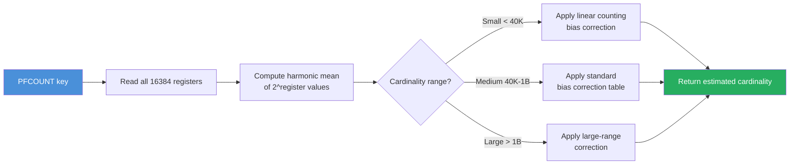

# 8.986 — Redis — HyperLogLog — PFADD, PFCOUNT, PFMERGE

## Overview — What is HyperLogLog

HyperLogLog is a probabilistic data structure introduced in Redis 2.8.9 that solves the problem of counting unique elements in a multiset using a fixed, tiny amount of memory — approximately 12 KB regardless of how many unique elements are counted. It is not an exact data structure; it trades a small margin of error for enormous memory savings. The standard error rate is 0.81%, which means for 1 million unique visitors, HyperLogLog will return a count very close to 1,000,000, typically within ±8,100.

The mathematical foundation of HyperLogLog is based on the observation that the probability of observing a run of consecutive leading zeros in the hash of a value is inversely proportional to the cardinality of the set. If you hash each element and look at the longest streak of leading zeros across all hashes, you can estimate how many unique elements produced those hashes. Redis's implementation uses 16384 registers (2^14) and a 64-bit hash function (MurmurHash64A via the Hash128 algorithm in newer versions). Each register stores a 6-bit value representing the maximum observed leading-zero run length for the elements that mapped to that register. The total memory is 16384 × 6 bits = 98304 bits = 12288 bytes ≈ 12 KB.

When you call PFADD, each element is hashed to a 64-bit value. The first 14 bits determine which register (0–16383) to update. The remaining 50 bits are examined to count the number of leading zeros plus one — this is the run length. If the computed run length is greater than the current value stored in that register, the register is overwritten with the new, higher value. This means each register tracks the maximum run length observed for elements assigned to it.

PFCOUNT then reads all 16384 registers and applies a harmonic mean and bias correction to produce the cardinality estimate. The harmonic mean is used because it is less sensitive to outliers than a simple average — a single register with an anomalously high value would skew an arithmetic mean but has a dampened effect on the harmonic mean. Redis also applies bias correction for small and large cardinalities using empirically derived constants.

PFMERGE combines multiple HyperLogLog keys into a single destination key. For each of the 16384 registers, the merged value is the maximum value among all source registers at that position. This is mathematically correct because taking the maximum of observed run lengths preserves all information about the highest run length ever observed for any element in any of the source sets. The merge is both associative and commutative, meaning you can merge in any order and get the same result.

HyperLogLog in Redis has several important properties. First, it is constant-memory: whether you add 1 element or 1 billion elements, memory usage remains ~12 KB. Second, the time complexity for PFADD is O(1) per element, PFCOUNT is O(1) with a small constant (reading 16384 registers), and PFMERGE is O(N) where N is the number of source keys (each source requires reading all 16384 registers). Third, HyperLogLog is idempotent in the sense that adding the same element multiple times does not change the count — the register value is already at or above the run length for that element's hash.

It is critical to understand that HyperLogLog is a "count distinct" structure only. You cannot retrieve the elements that were added, unlike a Redis Set. If you need to know which users visited on a given day, you need a Set. If you only need to know how many unique users visited, HyperLogLog is far more memory-efficient. The error distribution is roughly Gaussian with mean 0 and standard deviation 0.81%. In practice, 68% of estimates are within 0.81% of the true count, 95% within 1.63%, and 99.7% within 2.44%.

Redis has also introduced the `PFADD ... REGISTERCOUNT` variant and, since Redis 7, there is support for `PFMERGE` with `MAX` behavior. The HyperLogLog implementation in Redis is non-streaming — the entire data structure is serialized into a Redis string value (the "dense" representation). When a HyperLogLog has very few elements (cardinality < 100 or so), Redis uses a "sparse" representation that uses significantly less memory, auto-converting to dense when the sparse representation would exceed the dense size.

## Section 1 — PFADD Command Syntax and Usage

PFADD is the command that adds elements to a HyperLogLog key. The syntax is:

```
PFADD key [element [element ...]]
```

If the key does not exist, Redis creates an empty HyperLogLog structure. Each element is added as a member of the HyperLogLog — duplicates are automatically handled by the probabilistic structure (re-adding the same element does not further change the registers). PFADD returns 1 if the key's HyperLogLog internal representation was modified (meaning at least one register value was updated), and 0 if no registers changed (either the element was already represented or adding it did not increase any run length). This return value can be used as an optimization hint: if PFADD returns 0, the element is probably not new, though due to the probabilistic nature, it is not guaranteed.

Examples using Redis CLI:

```
> PFADD visitors:2024-06-27 "user:1001" "user:1002" "user:1003"
(integer) 1
> PFADD visitors:2024-06-27 "user:1001"
(integer) 0
> PFADD visitors:2024-06-27 "user:9999"
(integer) 1
```

The first PFADD adds three new elements and returns 1 because at least one register was modified. The second PFADD adds "user:1001" which was already added in the first call — HyperLogLog may or may not modify registers, but the return value is typically 0 for elements already observed. The third adds a genuinely new element and returns 1.

You can add multiple elements in a single PFADD call. This is more efficient than calling PFADD once per element because it avoids multiple round trips and the internal processing overhead is amortized across all elements.

```
> PFADD visitors:2024-06-27 "user:2001" "user:2002" "user:2003" "user:2004" "user:2005" "user:2006"
(integer) 1
```

You can also call PFADD with no elements (just a key). This is useful for initializing an empty HyperLogLog:

```
> PFADD visitors:2024-06-28
(integer) 1
```

The key difference between PFADD and SADD (for Sets) is that SADD stores each element verbatim, consuming memory proportional to the size of the element times the number of unique elements. PFADD, in contrast, hashes each element and only updates a 6-bit register, regardless of the element size. A 1 KB string element has the same memory impact on HyperLogLog as a 2-byte integer — approximately 6 bits of register storage.

PFADD on a non-existent key creates the key. PFADD on an existing key of a different type (e.g., a String) returns an error. PFADD is not multi-threaded internally; Redis processes the command in the main event loop, though adding many elements in one call blocks the event loop proportionally.

When PFADD is used with a single element, it is essentially a probabilistic set membership test with a side effect. You can think of it as "add element to set if not already present (estimated)." The probabilistic nature means there is a false positive rate for "is this element new?" — a previously unseen element might not increase any register count, leading PFADD to return 0 and the element not being "counted" in the sense of contributing to the cardinality estimate. This is known as "collision" in the hash space.

The internal hash function used by Redis HyperLogLog is variant-dependent. In Redis 5+, the hash is computed using the SipHash algorithm for its keyed nature and resistance to hash-flooding attacks. In earlier versions, MurmurHash64A was used. The choice of hash function influences the distribution quality and thus the accuracy of the estimate.

## Section 2 — PFCOUNT Command Syntax and Usage

PFCOUNT returns the approximate cardinality (number of unique elements) of a HyperLogLog. The syntax:

```
PFCOUNT key [key ...]
```

When called with a single key, PFCOUNT reads the 16384 registers of that HyperLogLog, computes the harmonic mean of 2^register values, applies bias correction, and returns the estimated cardinality. The computation involves reading all registers and performing floating-point arithmetic, which is why PFCOUNT is not O(1) in the sense of constant time regardless of structure size — but since the structure is always 12 KB, the constant time is effectively ~12 KB read + arithmetic.

```
> PFADD visitors:2024-06-27 "user:1" "user:2" "user:3"
(integer) 1
> PFCOUNT visitors:2024-06-27
(integer) 3
> PFADD visitors:2024-06-27 "user:4" "user:5"
(integer) 1
> PFCOUNT visitors:2024-06-27
(integer) 5
```

For very low cardinalities (below ~1000), the estimate is exact or very close due to the "sparse" representation and a small-range correction algorithm that Redis applies. As cardinality increases toward millions, the 0.81% standard error applies.

When PFCOUNT is called with multiple keys, Redis performs an internal PFMERGE on the fly — it reads all registers from all specified keys, takes the maximum at each register position, computes the cardinality from the merged registers, and returns it without persisting the merged HyperLogLog. This is extremely useful for querying "what is the total unique count across multiple time periods?" without first needing to perform an explicit PFMERGE.

```
> PFADD visitors:day:1 "user:1" "user:2"
(integer) 1
> PFADD visitors:day:2 "user:2" "user:3"
(integer) 1
> PFADD visitors:day:3 "user:3" "user:4"
(integer) 1
> PFCOUNT visitors:day:1 visitors:day:2 visitors:day:3
(integer) 4
```

Here, across three days with overlapping users, the total unique count is 4 (users 1, 2, 3, 4). Computing this with PFCOUNT in one command avoids writing a temporary merged key. The overhead is proportional to the number of keys × 16384 register reads.

Important considerations for PFCOUNT:

- PFCOUNT on an empty (non-existent) key returns 0.
- PFCOUNT returns an integer (as a string in RESP). Redis does not expose standard error or confidence intervals — it returns a single integer estimate.
- Multiple-key PFCOUNT is not atomic with respect to the individual keys — if keys are being concurrently modified by PFADD from other clients, the result is best-effort.
- The computation time for multiple-key PFCOUNT is O(N × 16384) register reads, which for small N is microseconds but for N=1000 becomes tens of milliseconds.
- PFCOUNT on a key that has been PFADDed but never PFCOUNTed before may trigger conversion from sparse to dense representation inside Redis, causing a brief CPU spike proportional to the current cardinality.

The bias correction applied by Redis for PFCOUNT involves three regimes:
1. Small cardinality (< 2.5 × 16384 = ~40960): Redis uses linear counting (counting empty registers) in addition to the harmonic mean, because at small cardinalities, the number of registers that remain at zero provides additional information.
2. Medium cardinality (40960 to ~10^9): Standard harmonic mean with bias correction using precomputed lookup tables derived from empirical testing.
3. Large cardinality (> 10^9): Redis caps at 2^64 and applies a special correction because the 64-bit hash space means the maximum representable cardinality is bounded.

PFCOUNT is the only way to get cardinality from HyperLogLog. There is no command to list elements, no command to check if a specific element is present, and no command to get the raw register values. If you need element enumeration, use a Set.

## Section 3 — PFMERGE Command Syntax and Usage

PFMERGE combines multiple HyperLogLog data structures into a single destination key. The syntax:

```
PFMERGE destkey sourcekey [sourcekey ...]
```

For each of the 16384 register positions, PFMERGE reads all source keys, computes the maximum register value across sources, and writes that maximum to the destination key. If the destination key already exists, it is overwritten.

```
> PFADD visitors:d1 "user:1" "user:2" "user:3"
(integer) 1
> PFADD visitors:d2 "user:3" "user:4" "user:5"
(integer) 1
> PFMERGE visitors:week1 visitors:d1 visitors:d2
OK
> PFCOUNT visitors:week1
(integer) 5
```

After PFMERGE, visitors:week1 contains the merged HyperLogLog with all four unique users. PFMERGE preserves all information from the source HyperLogLogs because the maximum operator is monotonic — if an element was present in any source, its run length contribution is preserved in the destination.

Key properties of PFMERGE:

- PFMERGE only accepts keys that are HyperLogLogs. If any source key does not exist, it is treated as an empty HyperLogLog (all registers zero). If a source key is of a non-HyperLogLog type, an error is returned.
- The destination key can be one of the source keys. In that case, the merge modifies the source key in place to be the union of itself and the other sources. This is a common pattern for incremental aggregation: "merge today's data into the weekly total."
```
> PFMERGE visitors:week visitors:week visitors:d6
```
- PFMERGE is idempotent: merging the same HyperLogLog twice into the same destination yields the same result as merging once, because max(max(A, B), B) = max(A, B).
- PFMERGE is associative: PFMERGE d A (B C) equals PFMERGE d (A B) C. This allows distributed or incremental merging.
- PFMERGE cannot subtract or remove sources. There is no PFDELETE or PFDIFF command. The only way to "remove" elements from a HyperLogLog is to discard the entire key and rebuild it from the source data.
- PFMERGE is commutative: merging A into B gives the same result as merging B into A.

PFMERGE time complexity is O(N × 16384) where N is the number of source keys. Each source key requires reading 16384 6-bit register values. For 100 source keys, this is 1.6 million register reads, which on modern hardware takes a few milliseconds. PFMERGE can be parallelized across source keys at the application level if needed, though Redis itself processes it sequentially.

Since Redis 7.0, PFMERGE supports the MAX modifier explicitly, though the default behavior has always been max-based. The explicit MAX keyword makes the operation clearer:

```
PFMERGE destkey sourcekey [sourcekey ...] MAX
```

PFMERGE is useful in several aggregation patterns:
1. **Daily to weekly**: Merge 7 daily HyperLogLogs into one weekly.
2. **Regional to global**: Merge per-region HyperLogLogs into a global unique count.
3. **Incremental rollup**: Maintain a "total" key and merge each day's key into it.
4. **Sharded counting**: If multiple app instances produce independent HyperLogLogs, merge them centrally.

A practical example — tracking unique visitors by hour, with daily and weekly rollups:

```
# Hourly (raw, collected by app)
PFADD visits:2024-06-27:14 "user:1" "user:2"
PFADD visits:2024-06-27:15 "user:2" "user:3"
# Daily rollup
PFMERGE visits:2024-06-27 visits:2024-06-27:14 visits:2024-06-27:15
PFCOUNT visits:2024-06-27
# Weekly rollup
PFMERGE visits:2024-W26 visits:2024-W26 visits:2024-06-27
PFCOUNT visits:2024-W26
```

This pattern uses ~12 KB per hourly key, ~12 KB per daily key, and ~12 KB per weekly key. A year of hourly data is 365 × 24 × 12 KB ≈ 105 MB, which is manageable. Daily-only for a year is ~4.4 MB.

## Section 4 — StackExchange.Redis C# Code — PFADD

The StackExchange.Redis library provides the `HyperLogLogAddAsync` method on `IDatabase` for PFADD. The method has several overloads accepting a single `RedisValue`, multiple values, or a `RedisValue[]` array. The return value is a `bool` indicating whether the HyperLogLog's internal representation was modified (corresponding to the integer 0/1 returned by the Redis PFADD command).

**Basic single-element PFADD:**

```csharp
using StackExchange.Redis;
using System;
using System.Threading.Tasks;

public class HyperLogLogExamples
{
    private static readonly ConnectionMultiplexer _redis = ConnectionMultiplexer.Connect(
        new ConfigurationOptions
        {
            EndPoints = { "localhost:6379" },
            AbortOnConnectFail = false,
            ConnectTimeout = 5000,
            SyncTimeout = 5000,
            KeepAlive = 60,
            ConnectRetry = 3
        });

    private static readonly IDatabase _db = _redis.GetDatabase();

    public static async Task AddVisitorAsync(string visitorId)
    {
        // Build the HyperLogLog key based on today's date
        string key = $"visitors:{DateTime.UtcNow:yyyy-MM-dd}";

        try
        {
            bool modified = await _db.HyperLogLogAddAsync(key, visitorId);

            if (modified)
            {
                Console.WriteLine($"[HLL] Visitor {visitorId} was a new unique (register modified).");
            }
            else
            {
                Console.WriteLine($"[HLL] Visitor {visitorId} was already counted (no register change).");
            }
        }
        catch (RedisServerException ex)
        {
            // e.g., WRONGTYPE against a non-HLL key
            Console.Error.WriteLine($"[HLL ERROR] {ex.Message}");
        }
        catch (RedisConnectionException ex)
        {
            // Connection lost
            Console.Error.WriteLine($"[HLL CONNECTION ERROR] {ex.Message}");
        }
    }
}
```

**Batch PFADD (multiple elements at once):**

```csharp
public static async Task AddVisitorsBatchAsync(string dateKey, params string[] visitorIds)
{
    string key = $"visitors:{dateKey}";

    try
    {
        // Convert string[] to RedisValue[]
        RedisValue[] values = Array.ConvertAll(visitorIds, id => (RedisValue)id);

        bool modified = await _db.HyperLogLogAddAsync(key, values);

        Console.WriteLine($"[HLL] Batch add of {values.Length} visitors to {key}. Modified: {modified}");
    }
    catch (RedisException ex)
    {
        Console.Error.WriteLine($"[HLL ERROR] {ex.Message}");
    }
}
```

**Fire-and-forget PFADD (no return value needed):**

```csharp
public static void AddVisitorFireAndForget(string visitorId)
{
    string key = $"visitors:{DateTime.UtcNow:yyyy-MM-dd}";

    // CommandFlags.FireAndForget tells Redis not to send a reply
    // This is faster when we don't care about the result
    _db.HyperLogLogAddAsync(key, visitorId, CommandFlags.FireAndForget);
}
```

**PFADD with error handling using Polly (retry on transient failure):**

```csharp
using Polly;
using Polly.Retry;

private static readonly AsyncRetryPolicy _retryPolicy = Policy
    .Handle<RedisConnectionException>()
    .Or<RedisTimeoutException>()
    .WaitAndRetryAsync(3, retryAttempt => TimeSpan.FromMilliseconds(100 * Math.Pow(2, retryAttempt)));

public static async Task AddVisitorWithRetryAsync(string visitorId)
{
    string key = $"visitors:{DateTime.UtcNow:yyyy-MM-dd}";

    await _retryPolicy.ExecuteAsync(async () =>
    {
        // ConnectionMultiplexer may need reconnection after failover
        if (!_redis.IsConnected)
        {
            await _redis.ReconnectAsync();
        }

        IDatabase db = _redis.GetDatabase();
        await db.HyperLogLogAddAsync(key, visitorId);
    });
}
```

**PFADD inside a Redis transaction (with other operations):**

```csharp
public static async Task TrackVisitorInTransactionAsync(string visitorId, string pageUrl)
{
    string key = $"visitors:{DateTime.UtcNow:yyyy-MM-dd}";
    string pageKey = $"pageviews:{DateTime.UtcNow:yyyy-MM-dd}";

    ITransaction transaction = _db.CreateTransaction();

    // Both commands execute atomically
    Task<bool> hllAdded = transaction.HyperLogLogAddAsync(key, visitorId);
    Task<long> pageCount = transaction.StringIncrementAsync(pageKey);

    bool committed = await transaction.ExecuteAsync();

    if (committed)
    {
        Console.WriteLine($"Transaction committed. HLL modified: {await hllAdded}, Page count: {await pageCount}");
    }
    else
    {
        Console.WriteLine("[HLL] Transaction failed to execute.");
    }
}
```

## Section 5 — StackExchange.Redis C# Code — PFCOUNT

StackExchange.Redis provides `HyperLogLogLengthAsync` for PFCOUNT. The method returns a `long` representing the estimated cardinality. It has overloads for single key and multiple keys (for the multi-key PFCOUNT behavior that merges on the fly).

**Single key PFCOUNT:**

```csharp
public static async Task<long> GetDailyVisitorEstimateAsync(string dateString)
{
    string key = $"visitors:{dateString}";

    try
    {
        long estimate = await _db.HyperLogLogLengthAsync(key);
        return estimate;
    }
    catch (RedisServerException ex) when (ex.Message.Contains("WRONGTYPE"))
    {
        Console.Error.WriteLine($"[HLL] Key {key} is not a HyperLogLog.");
        return -1;
    }
    catch (RedisException ex)
    {
        Console.Error.WriteLine($"[HLL] Error getting length: {ex.Message}");
        return -1;
    }
}

// Usage
long uniqueVisitors = await GetDailyVisitorEstimateAsync("2024-06-27");
double errorMargin = uniqueVisitors * 0.0081; // ±0.81%
Console.WriteLine($"Estimated unique visitors: {uniqueVisitors} ±{errorMargin:F0}");
```

**Multi-key PFCOUNT (merge on the fly):**

```csharp
public static async Task<long> GetWeeklyUniqueEstimateAsync(int year, int weekNumber)
{
    // Build keys for all 7 days of the week
    // This is a simplified ISO week date calculation
    string[] dayKeys = Enumerable.Range(0, 7)
        .Select(dayOffset => $"visitors:{year}-W{weekNumber:D2}-{dayOffset + 1}")
        .ToArray();

    try
    {
        // Convert to RedisKey[]
        RedisKey[] keys = Array.ConvertAll(dayKeys, k => (RedisKey)k);

        // HyperLogLogLengthAsync with multiple keys
        long estimate = await _db.HyperLogLogLengthAsync(keys);
        return estimate;
    }
    catch (RedisException ex)
    {
        Console.Error.WriteLine($"[HLL] Error estimating weekly unique: {ex.Message}");
        return -1;
    }
}
```

**PFCOUNT with progress tracking and caching:**

```csharp
private static readonly TimeSpan CacheDuration = TimeSpan.FromMinutes(5);
private static readonly MemoryCache _estimateCache = new MemoryCache(new MemoryCacheOptions());

public static async Task<long> GetCachedDailyEstimateAsync(string dateString)
{
    string cacheKey = $"hll:estimate:{dateString}";

    // Check local memory cache first
    if (_estimateCache.TryGetValue(cacheKey, out long cachedEstimate))
    {
        return cachedEstimate;
    }

    // Not in cache — query Redis
    string key = $"visitors:{dateString}";
    long estimate = await _db.HyperLogLogLengthAsync(key);

    // Cache for CacheDuration
    _estimateCache.Set(cacheKey, estimate, CacheDuration);

    return estimate;
}
```

**PFCOUNT with error margin reporting:**

```csharp
public class HyperLogLogResult
{
    public long Estimate { get; set; }
    public double StandardErrorFraction { get; set; } = 0.0081;
    public double AbsoluteError95Percent { get; set; }
    public long LowerBound95 { get; set; }
    public long UpperBound95 { get; set; }
}

public static async Task<HyperLogLogResult> GetEstimateWithConfidenceAsync(params string[] dateKeys)
{
    RedisKey[] keys = Array.ConvertAll(dateKeys, k => (RedisKey)k);

    long estimate = await _db.HyperLogLogLengthAsync(keys);

    // 95% confidence interval is approximately ±2 standard errors
    double stdError = estimate * 0.0081;
    double error95 = stdError * 1.96;

    return new HyperLogLogResult
    {
        Estimate = estimate,
        AbsoluteError95Percent = error95,
        LowerBound95 = (long)Math.Max(0, estimate - error95),
        UpperBound95 = (long)(estimate + error95)
    };
}
```

**PFCOUNT checking if a key exists (empty check):**

```csharp
public static async Task<bool> IsHyperLogLogEmptyAsync(string key)
{
    // PFCOUNT on a non-existent key returns 0
    // PFCOUNT on an empty HLL also returns 0
    // But there's no way to distinguish between "never existed" and "empty"
    // Using EXISTS to differentiate
    bool exists = await _db.KeyExistsAsync(key);
    if (!exists)
    {
        return true; // Treated as empty
    }

    long count = await _db.HyperLogLogLengthAsync(key);
    return count == 0;
}
```

## Section 6 — StackExchange.Redis C# Code — PFMERGE

StackExchange.Redis provides `HyperLogLogMergeAsync` for PFMERGE. The method accepts a destination key and a `RedisKey[]` of source keys.

**Basic PFMERGE:**

```csharp
public static async Task MergeDailyIntoWeeklyAsync(string weekKey, params string[] dayKeys)
{
    // Merge multiple daily HyperLogLogs into a weekly key
    RedisKey destination = weekKey;
    RedisKey[] sources = Array.ConvertAll(dayKeys, k => (RedisKey)k);

    try
    {
        await _db.HyperLogLogMergeAsync(destination, sources);
        Console.WriteLine($"[HLL] Merged {sources.Length} keys into {destination}.");
    }
    catch (RedisException ex)
    {
        Console.Error.WriteLine($"[HLL MERGE ERROR] {ex.Message}");
    }
}
```

**Incremental merge (merge into self):**

```csharp
public static async Task MergeIncrementalAsync(string aggregateKey, string newDailyKey)
{
    // Merge the daily key into the existing aggregate
    // The aggregate key is both the destination and one of the sources
    try
    {
        await _db.HyperLogLogMergeAsync(aggregateKey, aggregateKey, newDailyKey);
        Console.WriteLine($"[HLL] Incrementally merged {newDailyKey} into {aggregateKey}.");
    }
    catch (RedisException ex)
    {
        Console.Error.WriteLine($"[HLL MERGE ERROR] {ex.Message}");
    }
}
```

**Bulk merge of many sources (chunked to avoid huge Redis calls):**

```csharp
private const int MergeChunkSize = 100;

public static async Task BulkMergeAsync(string destinationKey, IEnumerable<string> sourceKeys)
{
    List<string> sources = sourceKeys.ToList();

    // First, initialize destination with the first chunk
    int index = 0;
    while (index < sources.Count)
    {
        var chunk = sources.Skip(index).Take(MergeChunkSize).ToList();

        if (index == 0)
        {
            // First chunk — write to destination
            RedisKey[] firstSources = Array.ConvertAll(chunk.ToArray(), k => (RedisKey)k);
            await _db.HyperLogLogMergeAsync(destinationKey, firstSources);
        }
        else
        {
            // Subsequent chunks — merge into existing destination
            RedisKey[] moreSources = Array.ConvertAll(chunk.ToArray(), k => (RedisKey)k);
            await _db.HyperLogLogMergeAsync(destinationKey, new[] { (RedisKey)destinationKey }
                .Concat(moreSources).ToArray());
        }

        index += MergeChunkSize;
    }

    Console.WriteLine($"[HLL] Bulk merged {sources.Count} keys into {destinationKey}.");
}
```

**Parallel merge for isolated destination shards:**

```csharp
public static async Task<long> MergerRegionalEstimatesAsync(
    Dictionary<string, string[]> regionDayKeys)
{
    // Merge each region into a regional key, then merge all regions
    var mergeTasks = new List<Task>();

    foreach (var (region, dayKeys) in regionDayKeys)
    {
        string regionKey = $"visitors:region:{region}";
        Task mergeTask = _db.HyperLogLogMergeAsync(regionKey,
            Array.ConvertAll(dayKeys, k => (RedisKey)k));
        mergeTasks.Add(mergeTask);
    }

    await Task.WhenAll(mergeTasks);

    // Now merge all regional keys into a global key
    string globalKey = "visitors:global";
    RedisKey[] regionalKeys = regionDayKeys.Keys
        .Select(region => (RedisKey)$"visitors:region:{region}")
        .ToArray();

    await _db.HyperLogLogMergeAsync(globalKey, regionalKeys);

    return await _db.HyperLogLogLengthAsync(globalKey);
}
```

**PFMERGE with Lua scripting (for atomic conditional merge):**

```csharp
private static readonly string MergeOnlyIfNewerScript = @"
    -- KEYS[1]: destination key
    -- KEYS[2..N]: source keys
    -- ARGV[1]: minimum TTL for destination (if destination exists and has TTL < this, skip)
    local dest = KEYS[1]
    local minTtl = tonumber(ARGV[1])

    if minTtl then
        local currentTtl = redis.call('TTL', dest)
        if currentTtl >= 0 and currentTtl < minTtl then
            return 0
        end
    end

    return redis.call('PFMERGE', dest, unpack(KEYS, 2, #KEYS))
";

public static async Task<bool> MergeConditionallyAsync(
    string destinationKey, int minTtlSeconds, params string[] sourceKeys)
{
    RedisKey[] keys = new RedisKey[] { destinationKey }
        .Concat(Array.ConvertAll(sourceKeys, k => (RedisKey)k))
        .ToArray();

    RedisValue[] args = new RedisValue[] { minTtlSeconds };

    RedisResult result = await _db.ScriptEvaluateAsync(MergeOnlyIfNewerScript, keys, args);
    return (int)result == 1;
}
```

## Section 7 — Use Cases and Practical Patterns

**Use Case 1 — Unique Visitor Counting (most common):**

The canonical use case for HyperLogLog is counting unique visitors to a website or application. Each action (page view, login, API call) can be tracked per user ID or IP address. Instead of storing every visitor ID in a Set (which grows linearly with traffic), HyperLogLog maintains a fixed 12 KB data structure.

```
Key naming convention: visitors:{yyyy-MM-dd} for daily, visitors:{yyyy-Www} for weekly.
```

A real-world pattern with ~1 billion monthly visitors would require ~12 KB for the monthly count, versus gigabytes with a Set. The 0.81% error means ±8.1M visitors at 1B, which is acceptable for reporting trends.

**Use Case 2 — Cardinality estimation for analytics pipelines:**

When processing event streams (e.g., Kafka topics, Redis Streams, or log files), HyperLogLog can be used at the ingestion point to produce low-latency estimates of distinct counts before the data is fully processed by the batch pipeline. This enables real-time dashboards with "approximate unique users so far today" without waiting for the ETL job.

**Use Case 3 — Merging daily counts into weekly/monthly/quarterly:**

The PFMERGE command makes it trivial to maintain fine-grained HyperLogLogs (hourly or daily) and then merge them into coarser aggregates. This is useful for reporting at multiple time granularities without storing raw data at each level. The merge is lossless in terms of cardinality estimation — merging daily HLLs into a monthly HLL yields the same estimate as if you had directly added all elements to the monthly HLL.

**Use Case 4 — IP address uniqueness for rate limiting:**

HyperLogLog can estimate how many unique IPs have accessed an endpoint. This is useful for detecting spikes in unique sources (potential DDoS) without storing all IPs. The 12 KB memory footprint means you can track thousands of endpoints independently.

**Use Case 5 — Counting distinct search queries:**

A search engine can use HyperLogLog to estimate how many unique search queries were performed in a given time period. The exact set of queries is not useful for this metric — only the count matters.

**Use Case 6 — Social network "unique viewers" of content:**

Platforms like Twitter, Instagram, or Facebook can track unique views of posts using HyperLogLog. Instead of storing every user ID who viewed a post (potentially millions for viral content), they store a 12 KB HyperLogLog per post. The estimate of unique views is shown to content creators and advertisers.

**Use Case 7 — Approximate distinct count in streaming / real-time:**

Combined with Redis Streams, HyperLogLog can be used as a sliding window distinct counter. A worker reads from a stream and PFADDs element IDs to a HyperLogLog key that expires after the window duration. PFCOUNT on the key gives the live distinct count.

**Pattern — HyperLogLog with TTL for sliding windows:**

```csharp
// Track unique users in a 1-hour sliding window
public static async Task TrackUniqueInWindowAsync(string userId)
{
    string key = $"unique:sliding:{DateTime.UtcNow:yyyy-MM-dd:HH}";

    await _db.HyperLogLogAddAsync(key, userId);

    // Set the key to expire after 2 hours (gives buffer)
    await _db.KeyExpireAsync(key, TimeSpan.FromHours(2));
}
```

**Pattern — Hierarchical aggregation with auto-merge using Lua:**

```csharp
private static readonly string HierarchicalMergeScript = @"
    local hourly_key = KEYS[1]
    local daily_key  = KEYS[2]
    local weekly_key = KEYS[3]

    -- Merge hourly into daily (incremental)
    redis.call('PFMERGE', daily_key, daily_key, hourly_key)

    -- Merge daily into weekly (incremental)
    redis.call('PFMERGE', weekly_key, weekly_key, daily_key)

    return 1
";
```

## Section 8 — Comparison: HyperLogLog vs Set vs Bitmap vs Bloom Filter

| Feature | HyperLogLog | Set | Bitmap | Bloom Filter |
|---------|-------------|-----|--------|-------------|
| **Memory** | ~12 KB fixed | O(N) — grows with elements | O(range) — depends on max ID | ~1–16 KB per filter (tunable) |
| **Cardinality limit** | 2^64 | No limit (until RAM fills) | Max ID value – min ID value | No limit (more elements → higher FP) |
| **Error rate** | 0.81% standard | 0% (exact) | 0% (exact) | Configurable FP rate (e.g., 1%) |
| **Can enumerate elements?** | No | Yes | No (without extra work) | No |
| **Can check element membership?** | No | Yes (SISMEMBER) | Yes (GETBIT) | Yes (may have false positives) |
| **Merge cardinalities?** | Yes (PFMERGE) | Yes (SUNIONSTORE) | Yes (BITOP OR) | Yes (bitwise OR) |
| **Time to add 1 element** | O(1) hash + register | O(1) hash + set insert | O(1) bit set | O(k) hashes |
| **Time to get count** | O(1) ~12KB read | O(1) SCARD | O(N) BITCOUNT (or cached) | O(1) ~ reg count |
| **Max cardinality (example)** | Unlimited (12KB) | 10M → ~200MB+ | 10M → ~1.2MB (bitmap) + range | Depends on size |
| **Best for** | Approx unique count | Exact set + enum | Exact flag per ID | Approx membership test |

**Detailed comparison:**

- **Set** is the simplest and most accurate. Use it when you need exact counts and can afford the memory, or when you need to retrieve the actual unique elements (e.g., showing "users who visited today"). Sets are also useful when cardinalities are small (e.g., < 100,000 elements) because memory usage is manageable. Sets are O(N) memory where N is the number of elements times their average size. For large element counts (millions of 36-byte UUIDs), this becomes gigabytes.

- **Bitmap** (via Redis Strings + SETBIT/GETBIT/BITCOUNT) is useful when the universe of possible elements is known and bounded (e.g., user IDs from 1 to 10 million). Each ID maps to a bit position. BITCOUNT returns the number of set bits (unique IDs). Bitmaps are exact and memory-efficient when the range is dense but wasteful when the range is sparse. A bitmap for user IDs up to 10M uses ~1.2 MB regardless of how many IDs are actually set — 1.2 MB for 10 unique users or 10 million.

- **Bloom Filter** is another probabilistic structure (Redis module RediSearch or RedisBloom) used for approximate membership testing (is element "probably" in the set?). Unlike HyperLogLog, Bloom Filters cannot estimate cardinality. They support add and exists-check operations. The false positive rate is configurable. Bloom Filters are useful for deduplication at the application level (e.g., "have we processed this event UUID before?").

- **HyperLogLog** fills the specific niche of "approximate unique count with fixed memory." It cannot do membership tests, cannot enumerate elements, and has a fixed error rate of 0.81%. Its killer feature is the ~12 KB fixed memory regardless of count, which enables billions-scale cardinality estimation on a single Redis instance.

**Decision matrix:**
- Need exact count? → Set
- Need exact count with bounded ID range and compact memory? → Bitmap
- Need approximate unique count with fixed memory? → HyperLogLog
- Need approximate membership test? → Bloom Filter
- Need both approximate count AND membership test? → HyperLogLog for count + Bloom Filter for membership, or use Set

## Section 9 — Gotchas, Limitations, and Best Practices

**Gotcha 1: The 0.81% error is irreducible.** You cannot reduce HyperLogLog's error by simply adding more elements — the error is a property of the 16384-register structure. To reduce error, you must increase the number of registers, which Redis does not support natively (the structure is fixed). If you need < 0.1% error, use a Set.

**Gotcha 2: PFADD returns 0/1, but this is probabilistic.** A return of 0 does NOT guarantee the element was already counted. Due to hash collisions, a genuinely new element might not change any register if its hash falls into a register that already has a higher run length from a different element. This means the "was this a new unique?" optimization hint is unreliable for individual elements, though it is statistically correct in aggregate.

**Gotcha 3: Low cardinality accuracy is not perfect.** Redis applies a small-range correction, but for cardinalities below ~100, the estimate may be slightly off. In practice, for N < 100, HyperLogLog typically returns an exact or near-exact count due to the linear counting phase, but you should not rely on this behavior being exact in all cases. The Redis documentation notes that the error is "0.81%" for "large" (typically > 1000) cardinalities.

**Gotcha 4: PFMERGE is not free.** Merging 1000 HyperLogLogs requires reading 1000 × 16384 = 16.4 million register values. On a busy Redis instance, this can take tens of milliseconds and block the event loop. Use PFMERGE during off-peak hours or batch the merge incrementally (merge 100 at a time into an intermediate aggregate, then merge intermediates).

**Gotcha 5: HyperLogLog serialization is large for small sets.** Redis uses a "sparse" representation for empty or near-empty HyperLogLogs (cardinality < ~100). The sparse representation can be as small as a few bytes. When it converts to dense (the 12 KB representation), it happens during PFCOUNT or PFMERGE. This means reading a sparse HyperLogLog may trigger an O(sparse size) conversion CPU cost. In practice, this is negligible but can be surprising if thousands of sparse HLLs are read simultaneously.

**Gotcha 6: You cannot remove elements.** HyperLogLog is a "set" that only supports adding. There is no PFREMOVE, PFDIFF, or PFPOP. If you need to "subtract" a day's visitors from a week (e.g., because the data was corrected), you must rebuild the week from scratch. This is a fundamental limitation of the max-of-registers approach.

**Gotcha 7: TTL on HyperLogLog.** You can set TTL on HyperLogLog keys just like any other Redis key: `EXPIRE visitors:2024-06-27 86400`. This is useful for auto-expiring raw data after it has been merged into aggregates. However, there is an interaction with sparse-to-dense conversion: if a HyperLogLog is sparse and is accessed (PFCOUNT/PFMERGE), it converts to dense, and the new dense representation may exceed the original memory, but the TTL still applies to the key as a whole.

**Gotcha 8: Replication and persistence.** HyperLogLog is stored as a Redis String value internally (with special encoding). It is replicated via RDB/AOF like any other key. When a replica is promoted to primary after a failover, the HyperLogLog data is intact. No special handling is needed beyond standard Redis replication.

**Gotcha 9: StackExchange.Redis connection multiplexer and HLL operations.** Always use the same `IDatabase` instance (obtained from `ConnectionMultiplexer.GetDatabase()`) for all HLL operations. The library handles pipelining internally. For high-throughput PFADD, use `CommandFlags.FireAndForget` to avoid waiting for the reply. This is the most common performance optimization.

```csharp
// High-throughput PFADD pattern
public static void AddVisitorHighThroughput(string visitorId)
{
    string key = $"visitors:{DateTime.UtcNow:yyyy-MM-dd}";
    // Fire-and-forget: no reply expected, reduces network round trips by 50%
    _db.HyperLogLogAddAsync(key, visitorId, CommandFlags.FireAndForget);
}
```

**Gotcha 10: Pipelining multiple PFADDs.** StackExchange.Redis automatically pipelines commands on the same multiplexer. You can batch PFADDs without awaiting each one, then await all at once:

```csharp
public static async Task AddManyVisitorsAsync(IEnumerable<string> visitorIds)
{
    string key = $"visitors:{DateTime.UtcNow:yyyy-MM-dd}";
    var tasks = new List<Task<bool>>();

    foreach (string id in visitorIds)
    {
        // These are all queued on the multiplexer's pipeline
        tasks.Add(_db.HyperLogLogAddAsync(key, id));
    }

    // All requests sent in batch, now await responses
    bool[] results = await Task.WhenAll(tasks);
    int modified = results.Count(r => r);
    Console.WriteLine($"{modified} out of {results.Length} PFADDs modified registers.");
}
```

**Gotcha 11: HyperLogLog with Redis Cluster.** HyperLogLog keys are subject to standard Redis Cluster key distribution based on the key hash slot. All keys with the same hash slot (using hash tags like `{visitors}:2024-06-27`) will be on the same node. Without hash tags, multi-key PFCOUNT and PFMERGE commands can only operate on keys that hash to the same slot, or they will return a CROSSSLOT error. In Cluster mode, either use hash tags to colocate related keys, or perform the merge at the application level by reading each key's raw value and merging client-side (though this is not recommended because the raw encoding is Redis-internal).

**Gotcha 12: Error compounding in hierarchical merges.** When you merge daily HLLs into a weekly HLL, the weekly estimate has its own 0.81% error. If you then merge weekly into monthly, the error does NOT compound additively — it is always based on the final 12 KB structure. The error of the monthly HLL is still 0.81% of the true monthly cardinality, not the sum of daily errors. Each PFCOUNT call is an independent estimate from the 12 KB structure at that point.

**Best Practice 1: Use key naming conventions.** Use a consistent naming scheme like `hll:{entity}:{granularity}:{timeperiod}`. Examples: `hll:visitors:d:20240627`, `hll:visitors:w:2024W26`, `hll:visitors:m:202406`. This makes it easy to write automated merge scripts.

**Best Practice 2: Set TTL on raw data, not on aggregates.** Hourly HLLs can have TTL of 48 hours (enough to survive one missed merge cycle). Daily HLLs can have TTL of 14 days. Weekly HLLs can be permanent or have long TTL (e.g., 1 year). Aggregates are your long-term data; raw data is transient.

**Best Practice 3: Use PFCOUNT with multiple keys for ad-hoc queries.** Instead of maintaining pre-merged aggregates for every possible time range, use the multi-key PFCOUNT feature for ad-hoc querying. For example, "what was the unique count for any 3-day window in the last month?" can be answered by calling `PFCOUNT day1 day2 day3` without a PFMERGE.

**Best Practice 4: Monitor sparse-to-dense conversion.** If you PFMERGE or PFCOUNT thousands of sparse HLLs simultaneously, the CPU spike can affect latency of other Redis operations. Schedule these operations during maintenance windows or use a dedicated Redis instance for analytics.

**Best Practice 5: Validate with a Set for small samples.** For quality assurance, periodically maintain a Redis Set for a small percentage of traffic (e.g., 1%) alongside HyperLogLog and compare the PFCOUNT estimate to the exact SCARD result. This helps detect systemic issues with hash function or merging logic.

## Mermaid Diagram — HyperLogLog Internal Architecture

```mermaid
flowchart TD
    A[Input Element e<br/>e.g. 'user:12345'] --> B[HASH e with<br/>MurmurHash64A / SipHash]
    B --> C[64-bit hash value]
    C --> D{First 14 bits<br/>= Register Index}
    C --> E{Remaining 50 bits<br/>= Leading Zero Count + 1}
    D --> F[Register [0..16383]<br/>Current value: p]
    E --> G[Computed run length: q]
    F --> H{Compare: q > p?}
    G --> H
    H -->|Yes| I[Register[Idx] = q<br/>New maximum]
    H -->|No| J[Register unchanged]
    I --> K[PFADD returns 1<br/>Structure modified]
    J --> L[PFADD returns 0<br/>No change]
    
    style A fill:#4a90d9,color:#fff
    style K fill:#27ae60,color:#fff
    style L fill:#e74c3c,color:#fff
```



```mermaid
flowchart TD
    subgraph "Daily HyperLogLogs"
        D1[visitors:d1<br/>Registers: 16384 x 6-bit]
        D2[visitors:d2<br/>Registers: 16384 x 6-bit]
        D3[visitors:d3<br/>Registers: 16384 x 6-bit]
    end
    
    subgraph "PFMERGE Operation"
        M[PFMERGE visitors:week<br/>visitors:d1 visitors:d2 visitors:d3]
        M --> R[For each register i:<br/>Result[i] = MAX(d1[i], d2[i], d3[i])]
    end
    
    subgraph "Weekly Aggregate"
        W[visitors:week<br/>Registers: 16384 x 6-bit]
    end
    
    R --> W
    W --> C[PFCOUNT visitors:week<br/>→ Harmonic mean → Estimate]
    
    style M fill:#e67e22,color:#fff
    style W fill:#8e44ad,color:#fff
    style C fill:#27ae60,color:#fff
```

```mermaid
flowchart LR
    subgraph "Memory Comparison at 10M Unique Elements"
        S[Set<br/>~200-500 MB<br/>Exact O(N)]
        B[Bitmap<br/>~1.2 MB + range<br/>Exact O(range)]
        H[HyperLogLog<br/>~12 KB<br/>Approx 0.81% error]
    end
    
    S --> |Best for| S1[Exact counts<br/>Element enumeration]
    B --> |Best for| B1[Exact counts<br/>Bounded ID space]
    H --> |Best for| H1[Approx counts<br/>at billion scale]
    
    style H fill:#e67e22,color:#fff
    style H1 fill:#e67e22,color:#fff
```

## Related Notes

- **[[8.961 — Redis — Data Structures Overview]]** — Foundational overview of all Redis data structures, including HyperLogLog's position in the ecosystem.
- **[[8.976 — Redis — Sets — Unique Visitors Tracking]]** — Exact unique visitor tracking using Redis Sets, with trade-offs against HyperLogLog.
- **[[8.965 — Redis — Bit Operations — BITCOUNT]]** — Bitmap-based counting as an alternative to HyperLogLog for exact counting in bounded ID spaces.
- **[[8.975 — Redis — Bloom Filters]]** — Another probabilistic data structure (for membership testing, not cardinality estimation).
- **[[8.1000 — Redis — StackExchange.Redis Full Reference]]** — Comprehensive reference for all StackExchange.Redis operations including HyperLogLog methods.
- **[[8.990 — Redis — Eviction Policies]]** — How Redis memory management interacts with HyperLogLog keys under eviction pressure.
- **[[8.962 — Redis — Strings — INCR]]** — Simple integer counters as an alternative for exact counting when each increment represents one event.
- **[[8.991 — Redis — Persistence — RDB Snapshots]]** — How HyperLogLog data is persisted in RDB snapshots and AOF logs.

> **Summary:** HyperLogLog is the most memory-efficient Redis data structure for approximate unique counting. Use it when you need billions-scale cardinality estimation, can tolerate 0.81% error, and do not need element enumeration or membership testing. The ~12 KB fixed memory footprint makes it suitable for high-cardinality tracking in resource-constrained environments. Combine with PFMERGE for hierarchical time-series aggregation, and use StackExchange.Redis's `HyperLogLogAddAsync`, `HyperLogLogLengthAsync`, and `HyperLogLogMergeAsync` for .NET integration.
