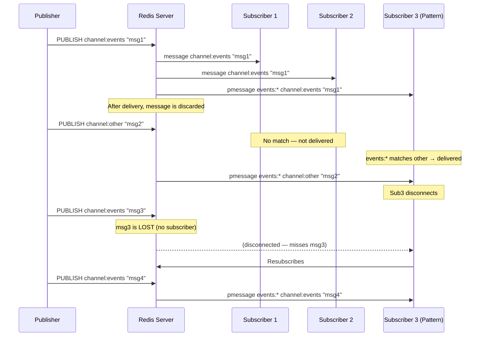
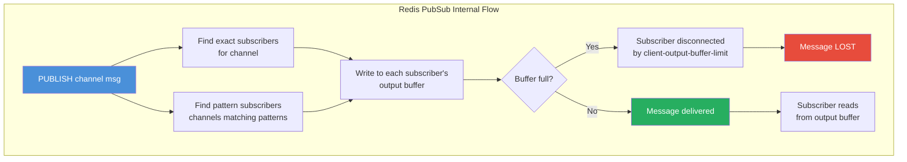
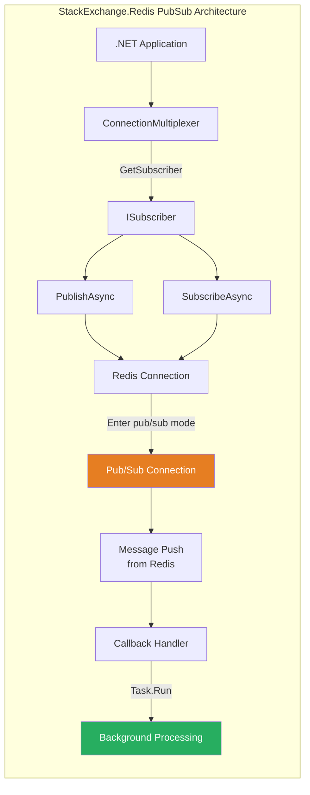

# 8.987 — Redis — PubSub — SUBSCRIBE, PUBLISH, PSUBSCRIBE

## Overview — What is Redis PubSub

Redis PubSub (Publish/Subscribe) is a messaging paradigm implemented natively in Redis since version 2.0. It implements a fire-and-forget broadcast pattern where publishers send messages to channels without knowing which subscribers (if any) will receive them, and subscribers listen to channels without knowing which publishers sent the messages. This decoupling of senders and receivers is the fundamental advantage of the PubSub pattern.

The core operations are three Redis commands: PUBLISH, SUBSCRIBE, and PSUBSCRIBE. PUBLISH sends a message to a named channel. SUBSCRIBE listens for messages on one or more specific channels. PSUBSCRIBE listens for messages on channels matching a glob-style pattern (e.g., `orders:*` matches `orders:new`, `orders:shipped`, etc.). There is also UNSUBSCRIBE and PUNSUBSCRIBE for removing subscriptions, and the PUBSUB command group for introspection (PUBSUB CHANNELS, PUBSUB NUMSUB, PUBSUB NUMPAT).

A critical architectural property of Redis PubSub is that messages are NOT persisted. When a publisher sends a message via PUBLISH, Redis immediately delivers it to all currently connected subscribers on that channel and then discards it. If no subscribers are listening, the message is lost forever. There is no message queue, no backlog, no replay, and no acknowledgment mechanism. This makes PubSub suitable for real-time notifications but unsuitable for reliable message delivery or event sourcing.

The Redis PubSub implementation uses a dedicated connection model. When a client issues SUBSCRIBE, PSUBSCRIBE, UNSUBSCRIBE, or PUNSUBSCRIBE, the connection enters "pub/sub mode." In this mode, the client can no longer issue standard Redis commands (like GET, SET, PFADD) on that connection — it can only issue pub/sub commands. This is because the connection is used to continuously push messages from Redis to the client as they arrive. The client must maintain a separate connection for database commands if it needs both.

In StackExchange.Redis, this dedicated connection model is handled transparently. When you call `GetSubscriber()`, the library may use a dedicated connection (depending on configuration) or share the multiplexer's internal connections. StackExchange.Redis handles the protocol-level details of entering pub/sub mode and maintaining the connection for message push.

Messages in Redis PubSub are byte strings. The channel name is also a byte string (though typically ASCII/UTF-8). When using PSUBSCRIBE with pattern matching, the message includes both the pattern that matched and the actual channel name the message was published to. This allows the subscriber to distinguish between messages from different channels that match the same pattern.

Redis PubSub has limited scalability. Each subscriber requires a persistent TCP connection to Redis. For a small number of subscribers (tens to hundreds), this is fine. For thousands or millions of subscribers, the connection overhead becomes prohibitive. In such scenarios, you would typically use a dedicated message broker (RabbitMQ, Kafka, NATS) or a fan-out mechanism at the application layer.

There is no built-in access control for PubSub channels beyond what Redis ACLs (Access Control Lists, available since Redis 6) provide. You can restrict which users can PUBLISH, SUBSCRIBE, or PSUBSCRIBE to specific channels using ACL rules like `+@pubsub`, `-@pubsub`, or channel-specific rules. In Redis 7+, you can use channel-specific ACL rules to restrict access per channel pattern.

Redis PubSub is not designed for transactional or atomic messaging. There is no concept of a "transaction" that includes both a PUBLISH and some other operation. If you need atomicity (e.g., "update a counter and then publish a notification"), you must use a Redis Transaction (MULTI/EXEC) or Lua scripting to ensure both operations occur together, but note that the PUBLISH inside a transaction is not visible to subscribers until the transaction commits.

The message ordering in PubSub is FIFO per channel. If publisher A sends message M1 and then M2 on the same channel, all subscribers will receive M1 before M2. There is no ordering guarantee across different channels or across messages from different publishers on the same channel (if they interleave at the network layer, the order is determined by when Redis processes each PUBLISH command).

## Section 1 — PUBLISH Command

PUBLISH sends a message to a channel. The syntax:

```
PUBLISH channel message
```

The return value is the number of clients that received the message (the count of subscribers on that channel at the time of publication). This does NOT count pattern subscribers (PSUBSCRIBE). Only exact-match subscribers are counted.

```
> PUBLISH channel:notifications "Hello, World!"
(integer) 2    # Two subscribers received this message
> PUBLISH channel:empty "This is lost"
(integer) 0    # No subscribers — message discarded
```

Important characteristics of PUBLISH:

- PUBLISH is O(N) where N is the number of subscribers on that channel. Redis iterates over all subscribed clients and writes the message to each client's output buffer.
- PUBLISH is synchronous from the publisher's perspective. The call blocks until the message is written to all subscriber output buffers (but not until subscribers have actually read it). This means a slow subscriber with a full output buffer can slow down PUBLISH.
- PUBLISH returns after all subscriber buffers are written. If a subscriber's output buffer is full (client-output-buffer-limit pubsub), Redis may disconnect that subscriber. The PUBLISH still succeeds for other subscribers.
- PUBLISH on a non-existent channel (no subscribers) returns 0 and is essentially a no-op.
- Message size is limited by the Redis `proto-max-bulk-len` configuration (default 512 MB in recent versions). Typical messages are small (a few KB).

**PUBLISH with Lua scripting:**

```
> EVAL "redis.call('PUBLISH', KEYS[1], ARGV[1]) return 1" 1 channel:test "from Lua"
```

**PUBLISH inside a transaction:**

```
> MULTI
OK
> SET order:123 "processed"
QUEUED
> PUBLISH channel:orders "order:123:processed"
QUEUED
> EXEC
1) OK
2) (integer) 0
```

The PUBLISH inside the transaction is not actually sent until EXEC executes. Subscribers will receive it only after the EXEC completes.

## Section 2 — SUBSCRIBE Command

SUBSCRIBE subscribes the client to one or more channels. The syntax:

```
SUBSCRIBE channel [channel ...]
```

After SUBSCRIBE, the client enters "pub/sub mode." It can no longer issue non-pub/sub commands on this connection. Redis sends a subscription confirmation message for each channel:

```
> SUBSCRIBE channel:orders channel:notifications
Reading messages... (press Ctrl-C to quit)
1) "subscribe"        # Message type
2) "channel:orders"   # Channel name
3) (integer) 1        # Number of subscriptions (this client)

1) "subscribe"
2) "channel:notifications"
3) (integer) 2
```

When a message is published to a subscribed channel, the client receives:

```
1) "message"              # Message type
2) "channel:orders"       # Channel name
3) "order:123:created"    # Message payload
```

The connection remains in pub/sub mode until UNSUBSCRIBE is called for all channels, at which point the client can issue a new SUBSCRIBE or exit pub/sub mode (though in practice, clients typically maintain a dedicated pub/sub connection).

Subscribing to the same channel twice has no additional effect — the channel is only subscribed once.

**UNSUBSCRIBE syntax:**

```
UNSUBSCRIBE [channel [channel ...]]
```

Without arguments, UNSUBSCRIBE unsubscribes from all channels and exits pub/sub mode.

The maximum number of channels a single client can subscribe to is limited only by memory and the `client-query-buffer-limit` setting.

## Section 3 — PSUBSCRIBE Command (Pattern Subscribe)

PSUBSCRIBE subscribes to channels matching a glob-style pattern. The syntax:

```
PSUBSCRIBE pattern [pattern ...]
```

Supported glob patterns:
- `h?llo` matches `hello`, `hallo`, `hxllo`
- `h*llo` matches `hllo`, `heeeello`
- `h[ae]llo` matches `hello` and `hallo`, but not `hillo`
- `h[^e]llo` matches `hallo`, `hbllo`, ... but not `hello`
- `h[a-b]llo` matches `hallo` and `hbllo`

```
> PSUBSCRIBE orders:* users:*
Reading messages... (press Ctrl-C to quit)
1) "psubscribe"
2) "orders:*"
3) (integer) 1

1) "psubscribe"
2) "users:*"
3) (integer) 2
```

When a message is published to a channel matching a pattern, the subscriber receives:

```
1) "pmessage"             # Message type
2) "orders:*"             # Pattern that matched
3) "orders:new"           # Actual channel name
4) "order:456:created"    # Message payload
```

The extra field (pattern) allows the subscriber to know which pattern matched, which is useful when subscribing to multiple patterns with different semantics.

**Interaction between SUBSCRIBE and PSUBSCRIBE:** If a client subscribes to both `orders:new` (exact) and `orders:*` (pattern), a message published to `orders:new` will be received twice — once from the exact subscription and once from the pattern subscription. The client receives separate messages for each matching subscription. In StackExchange.Redis, you can handle deduplication if needed by tracking message IDs.

**Pattern subscription count:** The PUBSUB NUMPAT command returns the number of unique pattern subscriptions across all clients. PUBSUB NUMSUB returns the exact subscriber count per channel.

```
> PUBSUB NUMPAT
(integer) 3
> PUBSUB NUMSUB channel:orders
1) "channel:orders"
2) (integer) 2
```

Pattern subscriptions are more expensive for Redis than exact subscriptions. Each PUBLISH must check all registered patterns (O(N) on number of patterns × number of exact subscribers). For high-throughput scenarios with many patterns, this can become a bottleneck. Redis recommends limiting the number of pattern subscriptions to a few hundred or less.

## Section 4 — StackExchange.Redis C# Code — ISubscriber and Subscription

StackExchange.Redis provides the `ISubscriber` interface for pub/sub operations. You obtain it from `ConnectionMultiplexer.GetSubscriber()`. The `ISubscriber` exposes `SubscribeAsync`, `Subscribe`, `UnsubscribeAsync`, `UnsubscribeAllAsync`, `PublishAsync`, `Publish`, and related methods.

**Basic subscription setup:**

```csharp
using StackExchange.Redis;
using System;
using System.Threading.Tasks;

public class PubSubService : IDisposable
{
    private readonly ConnectionMultiplexer _redis;
    private readonly ISubscriber _subscriber;
    private bool _disposed;

    public PubSubService(string connectionString = "localhost:6379")
    {
        var config = new ConfigurationOptions
        {
            EndPoints = { connectionString },
            AbortOnConnectFail = false,
            ConnectTimeout = 5000,
            SyncTimeout = 5000,
            KeepAlive = 60,
            ConnectRetry = 3,
            // Important: preserve async context for pub/sub callbacks
            PreserveAsyncOrder = true
        };

        _redis = ConnectionMultiplexer.Connect(config);
        _subscriber = _redis.GetSubscriber();

        // Handle reconnection — subscriptions are lost on disconnect
        _redis.ConnectionRestored += OnReconnected;
    }

    private void OnReconnected(object sender, ConnectionFailedEventArgs e)
    {
        Console.WriteLine($"[PubSub] Reconnected to Redis. Resubscribing...");
        // Re-establish subscriptions after reconnect
        // This is handled by registering persistent subscriptions
        // via SubscribeAsync with the onNextHandler that re-subscribes
    }

    /// <summary>
    /// Subscribe to a specific channel with a message handler.
    /// The handler is called on the multiplexer's worker thread.
    /// Do NOT block in the handler — use Task.Run or process asynchronously.
    /// </summary>
    public async Task SubscribeToChannelAsync(string channel, Action<string, string> onMessage)
    {
        await _subscriber.SubscribeAsync(new RedisChannel(channel, RedisChannel.PatternMode.Literal),
            (redisChannel, redisValue) =>
            {
                // This callback runs on the multiplexer's receive thread
                // Do NOT perform blocking operations here
                onMessage(redisChannel.ToString(), redisValue.ToString());
            });

        Console.WriteLine($"[PubSub] Subscribed to channel: {channel}");
    }

    /// <summary>
    /// Subscribe to a pattern with a message handler.
    /// </summary>
    public async Task SubscribeToPatternAsync(string pattern, Action<string, string, string> onMessage)
    {
        await _subscriber.SubscribeAsync(new RedisChannel(pattern, RedisChannel.PatternMode.Pattern),
            (redisChannel, redisValue) =>
            {
                // For pattern subscriptions, the channel is the actual matching channel
                onMessage(pattern.ToString(), redisChannel.ToString(), redisValue.ToString());
            });

        Console.WriteLine($"[PubSub] Subscribed to pattern: {pattern}");
    }

    /// <summary>
    /// Subscribe with async message processing — offloads work to thread pool.
    /// Critical: never await inside the Redis callback directly.
    /// </summary>
    public async Task SubscribeWithAsyncHandlerAsync(string channel, Func<string, string, Task> asyncHandler)
    {
        await _subscriber.SubscribeAsync(new RedisChannel(channel, RedisChannel.PatternMode.Literal),
            (redisChannel, redisValue) =>
            {
                // Capture the message and process on a background thread
                string ch = redisChannel.ToString();
                string val = redisValue.ToString();

                // Fire-and-forget the async work (handled by UnobservedTaskException handler)
                Task.Run(async () =>
                {
                    try
                    {
                        await asyncHandler(ch, val);
                    }
                    catch (Exception ex)
                    {
                        Console.Error.WriteLine($"[PubSub] Handler error on {ch}: {ex.Message}");
                    }
                });
            });
    }

    public void Dispose()
    {
        if (!_disposed)
        {
            _disposed = true;
            _redis.ConnectionRestored -= OnReconnected;
            _subscriber.UnsubscribeAllAsync(CommandFlags.FireAndForget);
            _redis.Dispose();
        }
    }
}
```

**Subscribing with a dedicated handler class — better separation of concerns:**

```csharp
public class OrderPubSubHandler
{
    private readonly ISubscriber _subscriber;
    private readonly OrderService _orderService;

    public OrderPubSubHandler(ISubscriber subscriber, OrderService orderService)
    {
        _subscriber = subscriber;
        _orderService = orderService;
    }

    public async Task StartAsync()
    {
        // Subscribe to specific order channels
        await _subscriber.SubscribeAsync("orders:new", OnOrderNew);
        await _subscriber.SubscribeAsync("orders:shipped", OnOrderShipped);
        await _subscriber.SubscribeAsync("orders:cancelled", OnOrderCancelled);

        // Subscribe to all order events via pattern
        await _subscriber.SubscribeAsync(new RedisChannel("orders:*", RedisChannel.PatternMode.Pattern),
            OnAnyOrderEvent);
    }

    private void OnOrderNew(RedisChannel channel, RedisValue message)
    {
        Console.WriteLine($"[Orders] New order: {message}");
        // Fast, non-blocking processing only
    }

    private void OnOrderShipped(RedisChannel channel, RedisValue message)
    {
        Console.WriteLine($"[Orders] Order shipped: {message}");
    }

    private void OnOrderCancelled(RedisChannel channel, RedisValue message)
    {
        Console.WriteLine($"[Orders] Order cancelled: {message}");
    }

    private void OnAnyOrderEvent(RedisChannel channel, RedisValue message)
    {
        // This is called for every order:* message that matches
        // The channel parameter has the actual channel name
        Console.WriteLine($"[Orders] Event on {channel}: {message}");
    }
}
```

**Unsubscribing:**

```csharp
public async Task UnsubscribeFromChannelAsync(string channel)
{
    await _subscriber.UnsubscribeAsync(new RedisChannel(channel, RedisChannel.PatternMode.Literal));
    Console.WriteLine($"[PubSub] Unsubscribed from channel: {channel}");
}

public async Task UnsubscribeAllAsync()
{
    await _subscriber.UnsubscribeAllAsync();
    Console.WriteLine("[PubSub] Unsubscribed from all channels.");
}
```

## Section 5 — StackExchange.Redis C# Code — PUBLISH

Publishing messages using StackExchange.Redis is straightforward via `ISubscriber.PublishAsync`. The method publishes a message to a channel and returns a `long` representing the number of subscribers that received it.

**Basic publish:**

```csharp
public class NotificationPublisher
{
    private readonly ISubscriber _subscriber;

    public NotificationPublisher(ConnectionMultiplexer redis)
    {
        _subscriber = redis.GetSubscriber();
    }

    /// <summary>
    /// Publish a message to a channel. Returns subscriber count.
    /// </summary>
    public async Task<long> PublishAsync(string channel, string message)
    {
        try
        {
            RedisChannel ch = new RedisChannel(channel, RedisChannel.PatternMode.Literal);
            RedisValue msg = new RedisValue(message);

            long subscriberCount = await _subscriber.PublishAsync(ch, msg);

            Console.WriteLine($"[PubSub] Published to {channel}: {message} ({subscriberCount} subscribers)");
            return subscriberCount;
        }
        catch (RedisConnectionException ex)
        {
            Console.Error.WriteLine($"[PubSub] Connection error publishing: {ex.Message}");
            return 0;
        }
        catch (RedisServerException ex)
        {
            Console.Error.WriteLine($"[PubSub] Server error publishing: {ex.Message}");
            return 0;
        }
    }
}
```

**Fire-and-forget publish (no reply expected, maximum throughput):**

```csharp
public void PublishFireAndForget(string channel, string message)
{
    // CommandFlags.FireAndForget means Redis won't send a reply
    // This gives the highest possible publish throughput
    _subscriber.PublishAsync(
        new RedisChannel(channel, RedisChannel.PatternMode.Literal),
        new RedisValue(message),
        CommandFlags.FireAndForget);
}
```

**Publishing complex messages (JSON serialized):**

```csharp
using System.Text.Json;

public class OrderMessage
{
    public string OrderId { get; set; }
    public string Status { get; set; }
    public decimal Amount { get; set; }
    public DateTime Timestamp { get; set; }
}

public async Task PublishOrderEventAsync(OrderMessage orderEvent)
{
    string channel = $"orders:{orderEvent.Status}";
    string json = JsonSerializer.Serialize(orderEvent, new JsonSerializerOptions
    {
        PropertyNamingPolicy = JsonNamingPolicy.CamelCase
    });

    long count = await _subscriber.PublishAsync(
        new RedisChannel(channel, RedisChannel.PatternMode.Literal),
        new RedisValue(json));

    Console.WriteLine($"[Orders] Published {orderEvent.OrderId} to {channel} ({count} subscribers)");
}
```

**Publishing binary messages:**

```csharp
public async Task PublishBinaryAsync(string channel, byte[] data)
{
    await _subscriber.PublishAsync(
        new RedisChannel(channel, RedisChannel.PatternMode.Literal),
        (RedisValue)data);
}
```

**Publishing with retry (transient error handling):**

```csharp
using Polly;
using Polly.Retry;

private static readonly AsyncRetryPolicy _publishRetry = Policy
    .Handle<RedisConnectionException>()
    .Or<RedisTimeoutException>()
    .WaitAndRetryAsync(3,
        retryAttempt => TimeSpan.FromMilliseconds(50 * Math.Pow(2, retryAttempt)),
        onRetry: (exception, timeSpan, retryCount, context) =>
        {
            Console.WriteLine($"[PubSub] Publish retry {retryCount} after {timeSpan.TotalMilliseconds}ms");
        });

public async Task<long> PublishWithRetryAsync(string channel, string message)
{
    return await _publishRetry.ExecuteAsync(async () =>
    {
        if (!_subscriber.Multiplexer.IsConnected)
        {
            await _subscriber.Multiplexer.ReconnectAsync();
        }

        return await _subscriber.PublishAsync(
            new RedisChannel(channel, RedisChannel.PatternMode.Literal),
            new RedisValue(message));
    });
}
```

## Section 6 — StackExchange.Redis — Reconnection and Resubscription

One of the most critical aspects of using Redis PubSub with StackExchange.Redis is handling reconnection. When the connection to Redis is lost (network issue, failover, Redis restart), all subscriptions are lost. The `ConnectionMultiplexer` does NOT automatically resubscribe — you must handle this in your application.

**Reconnection handler with automatic resubscription:**

```csharp
public class ResilientPubSubSubscriber : IDisposable
{
    private readonly ConnectionMultiplexer _redis;
    private readonly ISubscriber _subscriber;
    private readonly List<SubscriptionEntry> _subscriptions = new List<SubscriptionEntry>();
    private readonly object _lock = new object();
    private bool _disposed;

    private class SubscriptionEntry
    {
        public RedisChannel Channel { get; set; }
        public Action<RedisChannel, RedisValue> Handler { get; set; }
        public bool IsPattern { get; set; }
    }

    public ResilientPubSubSubscriber(ConnectionMultiplexer redis)
    {
        _redis = redis;
        _subscriber = redis.GetSubscriber();

        _redis.ConnectionRestored += async (s, e) =>
        {
            Console.WriteLine($"[PubSub] Connection restored (type: {e.ConnectionType}). Resubscribing...");
            await ResubscribeAllAsync();
        };
    }

    public async Task SubscribeAsync(string channel, Action<RedisChannel, RedisValue> handler)
    {
        var entry = new SubscriptionEntry
        {
            Channel = new RedisChannel(channel, RedisChannel.PatternMode.Literal),
            Handler = handler,
            IsPattern = false
        };

        lock (_lock)
        {
            _subscriptions.Add(entry);
        }

        await _subscriber.SubscribeAsync(entry.Channel, handler);
        Console.WriteLine($"[PubSub] Subscribed to {channel}");
    }

    public async Task SubscribePatternAsync(string pattern, Action<RedisChannel, RedisValue> handler)
    {
        var entry = new SubscriptionEntry
        {
            Channel = new RedisChannel(pattern, RedisChannel.PatternMode.Pattern),
            Handler = handler,
            IsPattern = true
        };

        lock (_lock)
        {
            _subscriptions.Add(entry);
        }

        await _subscriber.SubscribeAsync(entry.Channel, handler);
        Console.WriteLine($"[PubSub] Subscribed to pattern {pattern}");
    }

    private async Task ResubscribeAllAsync()
    {
        List<SubscriptionEntry> subs;
        lock (_lock)
        {
            subs = new List<SubscriptionEntry>(_subscriptions);
        }

        foreach (var entry in subs)
        {
            try
            {
                await _subscriber.SubscribeAsync(entry.Channel, entry.Handler);
                Console.WriteLine($"[PubSub] Resubscribed to {entry.Channel}");
            }
            catch (Exception ex)
            {
                Console.Error.WriteLine($"[PubSub] Failed to resubscribe to {entry.Channel}: {ex.Message}");
            }
        }
    }

    public void Dispose()
    {
        if (!_disposed)
        {
            _disposed = true;
            _subscriber.UnsubscribeAllAsync(CommandFlags.FireAndForget);
        }
    }
}
```

**Handling the ConnectionFailed event for logging:**

```csharp
_redis.ConnectionFailed += (s, e) =>
{
    Console.Error.WriteLine($"[PubSub] Connection FAILED: {e.Exception?.Message}, " +
        $"Type: {e.ConnectionType}, Failure: {e.FailureType}");
};
```

**Important reconnection notes:**

- `ConnectionRestored` fires after a successful reconnect. This is where you resubscribe.
- `ConnectionFailed` fires when a connection attempt fails (initial or reconnect).
- Do NOT create a new `ISubscriber` after reconnect — the same `ISubscriber` instance remains valid. You only need to re-call `SubscribeAsync`.
- During reconnection, messages published to the channel are lost. There is no buffering.
- For critical messages that must not be lost, use Redis Streams instead.

## Section 7 — StackExchange.Redis — Advanced PubSub Patterns

**Pattern 1 — Subscriber with message deduplication:**

When using both exact and pattern subscriptions, the same message may arrive twice. Deduplicate using message IDs.

```csharp
public class DeduplicatingSubscriber
{
    private readonly ISubscriber _subscriber;
    private readonly HashSet<string> _recentMessageIds = new HashSet<string>();
    private readonly TimeSpan _dedupWindow = TimeSpan.FromSeconds(5);
    private readonly object _lock = new object();

    public DeduplicatingSubscriber(ConnectionMultiplexer redis)
    {
        _subscriber = redis.GetSubscriber();
    }

    public async Task SubscribeWithDedupAsync(string channel)
    {
        await _subscriber.SubscribeAsync(channel, (ch, msg) =>
        {
            // Assume message is JSON with an "id" field
            string messageId = ExtractMessageId(msg);

            lock (_lock)
            {
                if (_recentMessageIds.Contains(messageId))
                {
                    Console.WriteLine($"[PubSub] Duplicate message skipped: {messageId}");
                    return; // Skip duplicate
                }

                _recentMessageIds.Add(messageId);
            }

            // Process message
            Console.WriteLine($"[PubSub] Processing message {messageId}");
        });
    }

    private string ExtractMessageId(RedisValue message)
    {
        // Simple extraction — in production, use JSON deserialization
        string msg = message.ToString();
        int idIndex = msg.IndexOf("\"id\":\"") + 6;
        int endIndex = msg.IndexOf("\"", idIndex);
        return msg.Substring(idIndex, endIndex - idIndex);
    }
}
```

**Pattern 2 — Reactive Extensions (Rx.NET) bridge for PubSub:**

```csharp
using System;
using System.Reactive.Linq;
using System.Reactive.Threading.Tasks;

public static class RedisPubSubRxExtensions
{
    /// <summary>
    /// Converts a Redis PubSub channel to an IObservable for Rx.NET consumers.
    /// </summary>
    public static IObservable<(string Channel, string Message)> AsObservable(
        this ISubscriber subscriber, string channel, bool isPattern = false)
    {
        RedisChannel.PatternMode mode = isPattern
            ? RedisChannel.PatternMode.Pattern
            : RedisChannel.PatternMode.Literal;

        return Observable.Create<(string Channel, string Message)>(observer =>
        {
            var handler = new Action<RedisChannel, RedisValue>((ch, val) =>
            {
                observer.OnNext((ch.ToString(), val.ToString()));
            });

            var task = subscriber.SubscribeAsync(new RedisChannel(channel, mode), handler);

            return task.ToObservable()
                .SelectMany(_ => Observable.Empty<Unit>())
                .Subscribe(_ => { }, observer.OnError);
        });
    }
}

// Usage
public class RxPubSubConsumer
{
    private readonly ISubscriber _subscriber;

    public RxPubSubConsumer(ConnectionMultiplexer redis)
    {
        _subscriber = redis.GetSubscriber();
    }

    public IDisposable StartListening()
    {
        return _subscriber
            .AsObservable("orders:*", isPattern: true)
            .Where(msg => msg.Channel.StartsWith("orders:"))
            .Select(msg => ParseOrderMessage(msg.Message))
            .Where(order => order != null)
            .Subscribe(
                order => Console.WriteLine($"Rx received order: {order.OrderId}"),
                ex => Console.Error.WriteLine($"Rx error: {ex.Message}"));
    }

    private OrderMessage ParseOrderMessage(string json)
    {
        try
        {
            return System.Text.Json.JsonSerializer.Deserialize<OrderMessage>(json);
        }
        catch
        {
            return null;
        }
    }
}
```

**Pattern 3 — Channel-based message router:**

```csharp
public class MessageRouter
{
    private readonly ISubscriber _subscriber;
    private readonly Dictionary<string, Func<string, Task>> _routes;

    public MessageRouter(ConnectionMultiplexer redis)
    {
        _subscriber = redis.GetSubscriber();
        _routes = new Dictionary<string, Func<string, Task>>(StringComparer.OrdinalIgnoreCase);
    }

    public void RegisterRoute(string channelPrefix, Func<string, Task> handler)
    {
        _routes[channelPrefix] = handler;
    }

    public async Task StartAsync()
    {
        // Subscribe to all channels with a wildcard pattern
        // WARNING: This can be expensive on Redis — use judiciously
        await _subscriber.SubscribeAsync(
            new RedisChannel("*", RedisChannel.PatternMode.Pattern),
            async (channel, message) =>
            {
                string ch = channel.ToString();
                string msg = message.ToString();

                // Find matching route
                foreach (var (prefix, handler) in _routes)
                {
                    if (ch.StartsWith(prefix, StringComparison.OrdinalIgnoreCase))
                    {
                        await handler(msg);
                        return;
                    }
                }

                Console.WriteLine($"[Router] No route for channel: {ch}");
            });
    }
}
```

**Pattern 4 — Bridging PubSub to a .NET Channel for background processing:**

```csharp
using System.Threading.Channels;

public class PubSubChannelBridge
{
    private readonly Channel<(string Channel, string Message)> _channel;
    private readonly ISubscriber _subscriber;

    public PubSubChannelBridge(ConnectionMultiplexer redis, int maxQueuedMessages = 1000)
    {
        _subscriber = redis.GetSubscriber();
        _channel = System.Threading.Channels.Channel.CreateBounded<(string, string)>(
            new BoundedChannelOptions(maxQueuedMessages)
            {
                FullMode = BoundedChannelFullMode.DropOldest
            });
    }

    public ChannelReader<(string Channel, string Message)> Reader => _channel.Reader;

    public async Task StartAsync(string channelPattern)
    {
        await _subscriber.SubscribeAsync(
            new RedisChannel(channelPattern, RedisChannel.PatternMode.Pattern),
            (ch, msg) =>
            {
                // Non-blocking write to the channel
                _channel.Writer.TryWrite((ch.ToString(), msg.ToString()));
            });
    }

    public async Task ProcessMessagesAsync(CancellationToken cancellationToken)
    {
        await foreach (var (channel, message) in Reader.ReadAllAsync(cancellationToken))
        {
            // Background processing of pub/sub messages
            Console.WriteLine($"[Bridge] Processing from {channel}: {message}");
        }
    }
}
```

## Section 8 — Use Cases and Real-World Patterns

**Use Case 1 — Cache Invalidation Across Application Instances:**

One of the most common uses of Redis PubSub is broadcasting cache invalidation events to all application instances. When one instance updates or deletes a cached value, it publishes an invalidation message. All instances (including the publishing one) clear the local cache entry.

```csharp
public class DistributedCacheInvalidator
{
    private readonly ISubscriber _subscriber;
    private readonly IMemoryCache _localCache;
    private const string Channel = "cache:invalidate";

    public DistributedCacheInvalidator(ConnectionMultiplexer redis, IMemoryCache localCache)
    {
        _subscriber = redis.GetSubscriber();
        _localCache = localCache;
    }

    public async Task StartListeningAsync()
    {
        await _subscriber.SubscribeAsync(Channel, (ch, msg) =>
        {
            string cacheKey = msg.ToString();
            _localCache.Remove(cacheKey);
            Console.WriteLine($"[Cache] Invalidated local cache key: {cacheKey}");
        });
    }

    public async Task InvalidateAsync(string cacheKey)
    {
        // Remove from local cache
        _localCache.Remove(cacheKey);

        // Broadcast to all other instances
        await _subscriber.PublishAsync(Channel, cacheKey);

        Console.WriteLine($"[Cache] Published invalidation for: {cacheKey}");
    }
}
```

**Use Case 2 — Real-Time Notifications to Web Clients (via SignalR bridge):**

```
Web Client ← SignalR Hub ← .NET Backend ← Redis PubSub ← Publisher Service
```

The .NET backend subscribes to Redis PubSub channels. When a message arrives, it forwards it to connected SignalR clients.

**Use Case 3 — Presence Detection (online/offline status):**

```csharp
public class PresenceService
{
    private const string PresenceChannel = "presence:heartbeat";
    private readonly ISubscriber _subscriber;
    private readonly ConcurrentDictionary<string, DateTime> _onlineUsers = new();

    public PresenceService(ConnectionMultiplexer redis)
    {
        _subscriber = redis.GetSubscriber();
    }

    public async Task StartAsync()
    {
        await _subscriber.SubscribeAsync(PresenceChannel, (ch, msg) =>
        {
            // msg format: "userId:timestamp"
            string[] parts = msg.ToString().Split(':');
            if (parts.Length == 2 && long.TryParse(parts[1], out long unixTs))
            {
                string userId = parts[0];
                DateTime timestamp = DateTimeOffset.FromUnixTimeMilliseconds(unixTs).UtcDateTime;

                _onlineUsers[userId] = timestamp;

                // Cleanup stale entries (>30 seconds old)
                var cutoff = DateTime.UtcNow.AddSeconds(-30);
                foreach (var (uid, ts) in _onlineUsers.Where(kv => kv.Value < cutoff).ToList())
                {
                    _onlineUsers.TryRemove(uid, out _);
                }
            }
        });
    }

    public bool IsOnline(string userId)
    {
        return _onlineUsers.TryGetValue(userId, out DateTime lastSeen) &&
               lastSeen > DateTime.UtcNow.AddSeconds(-30);
    }

    public async Task SendHeartbeatAsync(string userId)
    {
        string message = $"{userId}:{DateTimeOffset.UtcNow.ToUnixTimeMilliseconds()}";
        await _subscriber.PublishAsync(PresenceChannel, message, CommandFlags.FireAndForget);
    }
}
```

**Use Case 4 — Live Dashboard / Metrics Broadcasting:**

```
Application Metrics Collector → Redis PubSub → Dashboard API → WebSocket → Browser
```

Each application instance publishes metrics (request count, error rate, latency) to a channel like `metrics:requests`. The dashboard server subscribes and pushes to web clients.

**Use Case 5 — Inter-Service Communication within a Microservices Architecture:**

Microservices can communicate asynchronously via Redis PubSub for non-critical events. For example, when a User Service creates a new user, it publishes to `users:created`. The Email Service subscribes and sends a welcome email. The Analytics Service subscribes and logs the event. If any service is down, the message is lost — this is acceptable for non-critical notifications.

**Use Case 6 — Server-Sent Events (SSE) push mechanism:**

```csharp
// ASP.NET Core middleware that uses Redis PubSub to push SSE to browsers
public class SseMiddleware
{
    private readonly ConnectionMultiplexer _redis;
    private static readonly HttpClient _httpClient = new();

    public SseMiddleware(ConnectionMultiplexer redis)
    {
        _redis = redis;
    }

    public async Task HandleAsync(HttpContext context)
    {
        context.Response.ContentType = "text/event-stream";
        context.Response.Headers["Cache-Control"] = "no-cache";
        context.Response.Headers["Connection"] = "keep-alive";

        var subscriber = _redis.GetSubscriber();
        var channel = context.Request.Query["channel"].FirstOrDefault() ?? "events:*";

        var tcs = new TaskCompletionSource<bool>();

        await subscriber.SubscribeAsync(
            new RedisChannel(channel, RedisChannel.PatternMode.Pattern),
            (ch, msg) =>
            {
                string eventData = $"data: {msg}\n\n";
                context.Response.WriteAsync(eventData, context.RequestAborted);
            });

        // Keep connection open until client disconnects
        try
        {
            await Task.Delay(Timeout.Infinite, context.RequestAborted);
        }
        catch (TaskCanceledException)
        {
            // Client disconnected
        }
    }
}
```

## Section 9 — Comparison Table and Decision Framework

### PubSub vs Other Messaging Patterns

| Feature | Redis PubSub | Redis Streams | RabbitMQ | Kafka |
|---------|-------------|---------------|----------|-------|
| **Persistence** | None | Yes (configurable retention) | Yes | Yes |
| **Delivery guarantee** | At-most-once | At-least-once (consumer groups) | At-least-once / At-most-once | At-least-once / Exactly-once |
| **Message ordering** | Per channel, FIFO | Per stream, FIFO | Per queue, FIFO | Per partition, FIFO |
| **Consumer groups** | No | Yes | Yes | Yes |
| **Replay** | No | Yes (from any offset) | No (after ack) | Yes |
| **Acknowledgment** | No (fire-and-forget) | Yes (XACK) | Yes | Yes |
| **Fan-out** | Yes (multiple subscribers) | Yes (consumer groups + fan-out) | Yes (exchanges) | Yes (consumer groups) |
| **Scalability** | Low (connection per subscriber) | Medium | High | Very High |
| **Latency** | Microseconds | Microseconds (no disk) | Milliseconds | Milliseconds |
| **Memory** | RAM only | RAM + optional disk | Disk + RAM | Disk + RAM |
| **Use when** | Fire-and-forget notifications | Reliable queuing, event sourcing | Enterprise messaging | Event streaming, data pipelines |

### PubSub Gotchas and Limitations

**Gotcha 1: At-most-once delivery.** If a subscriber disconnects between the PUBLISH and the message delivery, the message is lost. There is no retry, no acknowledgment, no stored offset. The subscriber reconnecting will only receive future messages.

**Gotcha 2: Blocking subscriber.** The subscribe handler runs on the Redis connection's receive thread. If you block this thread (e.g., with a synchronous database call), you block ALL message processing for that subscriber. Always offload heavy work to a background thread or use `Task.Run`.

**Gotcha 3: Reconnection loses subscriptions.** When the Redis connection drops and reconnects, all active subscriptions are lost. You must manually resubscribe. StackExchange.Redis's `ConnectionRestored` event is the right place to do this. Always maintain a list of active subscriptions and re-register them on reconnect.

**Gotcha 4: Pattern matching overhead.** PSUBSCRIBE with patterns is O(N) per published message where N is the number of unique patterns across all clients. For high-traffic channels with hundreds of patterns, this adds measurable CPU overhead on the Redis server.

**Gotcha 5: Output buffer limits.** Redis has a `client-output-buffer-limit pubsub` configuration (default 32 MB normal / 8 MB continuous / 60 second hard limit). If a subscriber cannot read messages fast enough, the buffer fills up and Redis disconnects that subscriber. The subscriber will miss all messages until it reconnects and resubscribes. This is a common issue with slow consumers.

**Gotcha 6: Scalability ceiling.** Each subscriber is a persistent TCP connection to Redis. At ~10,000 simultaneous subscribers, a single Redis instance may struggle with connection overhead, CPU for message fan-out, and memory for output buffers. For large-scale fan-out, use a dedicated message broker or a Redis Cluster (though Cluster adds complexity for pub/sub).

**Gotcha 7: No built-in rate limiting.** A fast publisher can overwhelm slow subscribers. Redis has no per-channel or per-subscriber rate limiting. You must implement back-pressure at the application level (e.g., using Channels with bounded capacity, dropping messages, or slowing the publisher).

**Gotcha 8: PUBLISH is synchronous.** The PUBLISH command blocks until the message is written to all subscriber output buffers. A single slow subscriber with a nearly-full buffer can delay PUBLISH for all other subscribers. This can create a latency chain reaction across the system.

**Gotcha 9: No payload validation.** Redis PubSub accepts any byte string as a message. There is no schema validation, no message header, no metadata (beyond the channel name). If you need structured messages with routing metadata, embed it in the payload (e.g., JSON with a `type` field).

**Gotcha 10: StackExchange.Redis and the `PreserveAsyncOrder` setting.** By default, StackExchange.Redis processes messages in order on a single thread. If you set `PreserveAsyncOrder = false`, messages may be processed concurrently, improving throughput but potentially breaking ordering guarantees. The default (`true`) is safest.

**Gotcha 11: Cannot subscribe on a connection used for database commands.** The Redis protocol requires a dedicated connection for pub/sub (it enters a special mode). StackExchange.Redis handles this transparently, but you should always obtain the subscriber via `GetSubscriber()` (not `GetDatabase()`) to ensure proper connection management.

**Gotcha 12: Cluster mode behavior.** In Redis Cluster, PubSub messages are broadcast to all nodes in the cluster. A subscriber connected to any node receives messages published to any node. However, the connection model still requires the subscriber to be connected to receive the message. If the subscriber connects to node A and the publisher publishes on node B, the message is forwarded internally, but the subscriber must still be connected to receive it.

### Best Practices

1. **Always handle reconnection and resubscription.** Use the `ConnectionRestored` event to re-register all subscriptions.

2. **Offload work from the message handler.** Never block in the subscribe callback. Use `Task.Run` or a producer-consumer pattern (e.g., `System.Threading.Channels.Channel`) to process messages asynchronously.

3. **Use structured messages.** Prefer JSON or MessagePack for message payloads so the content is self-describing and version-tolerant.

4. **Set reasonable output buffer limits.** Monitor `client-output-buffer-limit pubsub` and adjust based on your message size and throughput.

5. **Avoid pattern subscriptions for high-throughput channels.** Each pattern match adds CPU overhead. If you need pattern matching for high-traffic channels, consider publishing to a single channel and doing pattern matching client-side.

6. **Use a dedicated `ConnectionMultiplexer` for pub/sub if you have high-throughput database operations.** This prevents a high-volume subscriber from interfering with database command latency.

7. **Monitor `PUBSUB NUMSUB` and `PUBSUB NUMPAT`** to track subscription counts and detect zombie subscriptions (subscribers that disconnected but the server hasn't cleaned up yet).

8. **Implement message versioning.** Include a version field in your message payload so you can evolve the schema without breaking existing subscribers.

9. **Consider using Streams instead of PubSub when you need at-least-once delivery, replay, or consumer groups.** The decision is detailed in [[8.988 — Redis — PubSub vs Streams — Decision]].

10. **Test your reconnection logic.** Simulate a Redis failover and verify that subscribers resubscribe and continue processing after reconnection.

### Mermaid — PubSub Architecture Flow







### Related Notes

- **[[8.988 — Redis — PubSub vs Streams — Decision]]** — Comprehensive decision guide for choosing between PubSub and Redis Streams.
- **[[8.982 — Redis — Streams — XADD, XREAD, XRANGE]]** — Streams as the persistent alternative to PubSub for reliable messaging.
- **[[8.985 — Redis — Streams — vs Kafka Decision]]** — Higher-level comparison between Redis Streams and Kafka for event streaming.
- **[[8.1000 — Redis — StackExchange.Redis Full Reference]]** — Complete reference for StackExchange.Redis APIs including all pub/sub methods.
- **[[8.961 — Redis — Data Structures Overview]]** — Foundational overview showing PubSub's role in Redis's data structure ecosystem.
- **[[8.989 — Redis — Key Expiry — TTL, PTTL, EXPIRE, PERSIST]]** — Using key expiry for auto-expiring subscription-related keys.
- **[[8.990 — Redis — Eviction Policies]]** — How Redis eviction interacts with PubSub (messages are not evicted, but subscriber output buffers may be).

> **Summary:** Redis PubSub provides simple, low-latency fire-and-forget messaging for real-time notifications and broadcast patterns. It is best suited for scenarios where message loss is acceptable and subscribers are always online. The at-most-once delivery guarantee, lack of persistence, and connection-per-subscriber scalability model are the primary limitations. For reliable message delivery, consumer groups, or message replay, use Redis Streams instead. With StackExchange.Redis, use `ISubscriber` for all pub/sub operations, always handle reconnection and resubscription, and never block in message handlers.
