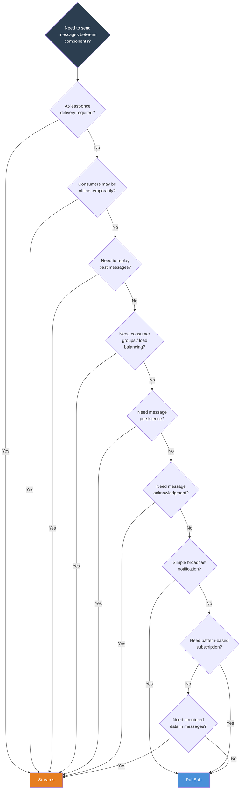
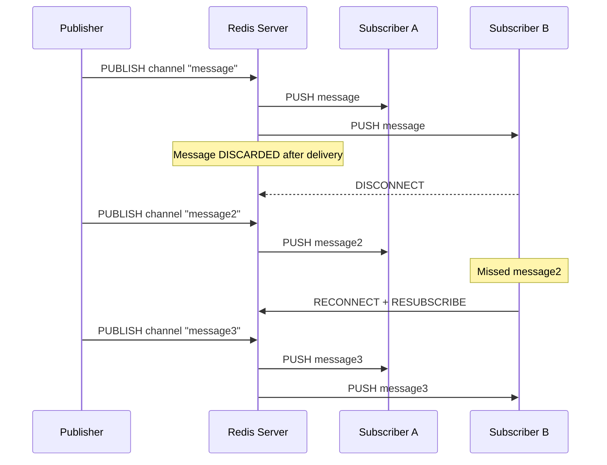
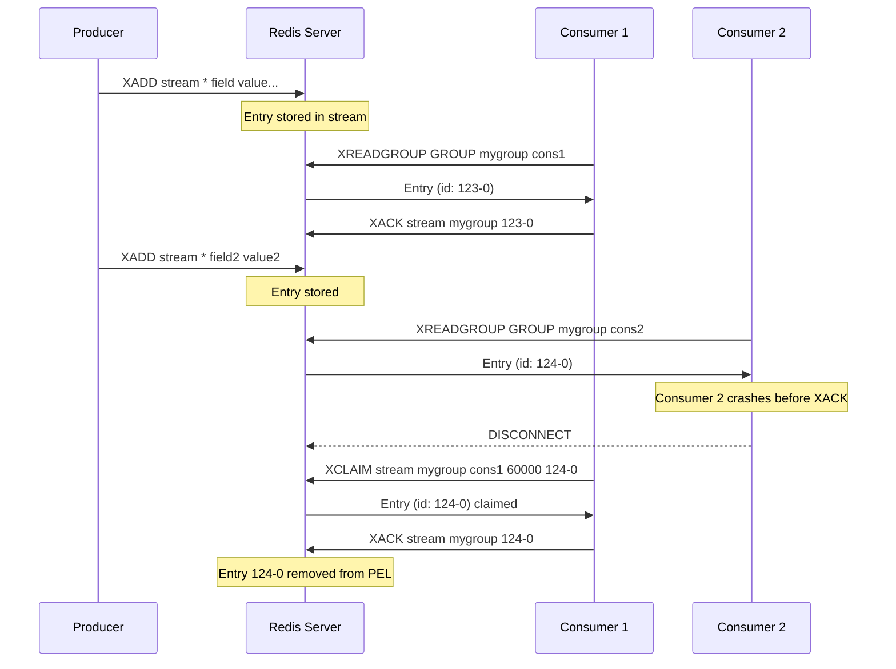
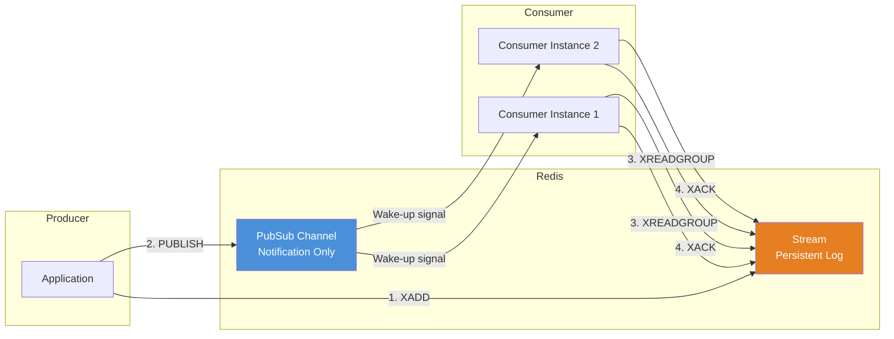

# 8.988 — Redis — PubSub vs Streams — Decision

## Overview — Two Messaging Paradigms in Redis

Redis offers two fundamentally different messaging mechanisms: PubSub (introduced in Redis 2.0) and Streams (introduced in Redis 5.0). Both allow applications to send messages from producers to consumers, but they differ in almost every other respect — persistence, delivery guarantees, consumer coordination, scalability, and use cases.

**PubSub** is a fire-and-forget broadcast system. Publishers send messages to named channels. Redis delivers the message to all currently connected subscribers and then discards it. There is no message storage, no acknowledgment, no consumer groups, and no replay capability. The delivery guarantee is at-most-once: a message is delivered zero or one times, and if a subscriber is offline at the time of publication, the message is permanently lost. PubSub excels at scenarios where latency is the primary concern and occasional message loss is acceptable.

**Streams** is an append-only log data structure. Producers append messages (called entries) to a stream using XADD. Consumers read from the stream using XREAD or XRANGE. Streams support consumer groups (XGROUP) for coordinated consumption with load balancing and at-least-once delivery. Messages persist in Redis memory (and optionally on disk via RDB/AOF) until explicitly trimmed (XTRIM, XDEL) or until a maximum retention policy is met. Streams support replay from any point in the stream, including from the beginning, from a specific timestamp, from a specific entry ID, or from the last delivered message for a consumer group (via PEL — Pending Entries List).

The decision between PubSub and Streams is one of the most important architectural choices when building messaging on Redis. Choosing incorrectly can lead to data loss, excessive complexity, or operational issues. This note provides a comprehensive decision framework with detailed analysis of each dimension, code examples for both approaches in StackExchange.Redis, and concrete guidance for common scenarios.

### Core Differences at a Glance

| Dimension | PubSub | Streams |
|-----------|--------|---------|
| **Introduced** | Redis 2.0 | Redis 5.0 |
| **Persistence** | None (in-memory only, discarded after delivery) | Configurable (RDB/AOF, maxlen, TTL) |
| **Delivery guarantee** | At-most-once | At-least-once (consumer groups) |
| **Message ordering** | Per channel, FIFO | Per stream, FIFO (entry ID based) |
| **Consumer groups** | Not supported | Supported (XGROUP, XREADGROUP) |
| **Load balancing** | None (fan-out only) | Yes (among group consumers) |
| **Replay / history** | Not possible | Full replay from any entry ID or timestamp |
| **Acknowledgments** | None | XACK — acknowledgments required |
| **Failure handling** | Subscriber disconnects → messages lost | PEL tracks pending messages; XCLAIM for reassignment |
| **Backpressure** | Subscriber output buffer limit (disconnect) | Consumer group pending entries; monitoring XRANGE |
| **Message structure** | Single byte string per message | Field-value pairs (like a hash per entry) |
| **Max message size** | ~512 MB (proto-max-bulk-len) | ~512 MB per entry (field+value sizes) |
| **Trim / retention** | N/A | XTRIM, XDEL, MAXLEN, MINID |
| **Blocking read** | SUBSCRIBE blocks connection | XREAD BLOCK, XREADGROUP BLOCK |
| **Pattern matching** | PSUBSCRIBE (glob patterns) | Not supported natively (filter client-side) |
| **Scalability** | Connection per subscriber (limited) | Multiple consumers per group, capped stream |
| **Latency** | Microseconds (no disk I/O) | Microseconds (no disk I/O for read/write) |
| **Use case** | Real-time notifications, cache invalidation | Event sourcing, job queues, reliable messaging |

## Section 1 — Deep Dive: PubSub Characteristics

### Fire-and-Forget Nature

PubSub's defining characteristic is that messages are not stored. When a publisher issues PUBLISH, Redis performs the following steps atomically:

1. Look up the channel in the internal channel dictionary.
2. Iterate over all subscribed clients (exact matches and pattern matches).
3. For each subscribed client, write the message to the client's output buffer.
4. Return the count of exact-match subscribers to the publisher.
5. The message is now gone from Redis memory.

If step 2 finds zero subscribers, the message is effectively a no-op — it returns 0 and is discarded. This has profound implications: PubSub cannot be used for any scenario where message delivery must be guaranteed, where consumers may be temporarily offline, or where auditing/replay is required.

### Connection Model

When a client issues SUBSCRIBE, the Redis connection enters "pub/sub mode." In this mode, the client can no longer issue standard Redis commands (GET, SET, etc.) on that connection. The connection is dedicated to receiving pushed messages. This means:

- A client that needs both database operations and pub/sub must use two connections.
- The client must maintain an open TCP connection indefinitely to receive messages.
- If the client disconnects for any reason (network, restart, timeout), all subscriptions are lost.
- Reconnecting client must re-subscribe to all channels.

StackExchange.Redis abstracts this complexity by providing `GetSubscriber()` which manages a dedicated connection internally. When the multiplexer detects that you've called `SubscribeAsync`, it transitions the appropriate connection to pub/sub mode.

### At-Most-Once Guarantee

At-most-once means a message is delivered at most one time. It may be delivered zero times if:

- There were no subscribers at the time of publication.
- A subscriber disconnected between the PUBLISH and the write to its output buffer.
- A subscriber's output buffer was full and Redis disconnected it before writing the message.
- A network partition occurred during message delivery.

There is no mechanism to detect that a message was not received. There is no retry, no persistence, no acknowledgment protocol. This is acceptable for:

- Cache invalidation notifications (stale data is acceptable for a short window).
- Presence heartbeats (the latest heartbeat supersedes previous ones).
- Live dashboards (a missed update is replaced by the next update).
- Non-critical notifications where occasional loss is tolerable.

It is NOT acceptable for:

- Financial transactions.
- Order processing.
- Any system with compliance or audit requirements.
- Any scenario where every message must be processed at least once.

### Fan-Out Only

PubSub is inherently a fan-out mechanism. Every subscriber on a channel receives every message published to that channel. There is no way to have "competing consumers" (where each message is processed by only one consumer). If you need load-balanced consumption where messages are distributed among worker instances, PubSub is the wrong choice.

### No Backpressure

Redis PubSub has no built-in backpressure mechanism. If a publisher produces messages faster than a subscriber can consume them, the subscriber's output buffer in Redis fills up. When the buffer exceeds `client-output-buffer-limit pubsub` (default 32 MB hard limit), Redis disconnects the subscriber without warning. The subscriber will miss all subsequent messages until it reconnects and resubscribes.

This makes PubSub unsuitable for high-throughput scenarios where consumer processing time varies significantly. Instead, Streams with consumer groups handle backpressure naturally — unacknowledged messages accumulate in the PEL (Pending Entries List), and consumers can process them at their own pace.

## Section 2 — Deep Dive: Streams Characteristics

### Append-Only Log

Redis Streams is implemented as an append-only log data structure. Each stream is identified by a key and contains a sequence of entries. Each entry has:

- A unique **entry ID** consisting of a millisecond timestamp and a sequence number (e.g., `1734567890123-0`). The IDs are monotonically increasing and can be server-generated or client-specified.
- A set of **field-value pairs** (like a Redis Hash). This allows each entry to carry structured data.

The append-only nature means entries are always added to the end of the stream. Entries are never modified in place (except via XDEL for explicit deletion or XTRIM for range deletion). This makes Streams ideal for event sourcing, audit logs, and message queuing.

### Consumer Groups for Load Balancing

Consumer groups are the killer feature of Redis Streams for messaging use cases. A consumer group:

- Is created with `XGROUP CREATE mystream mygroup $` (the `$` means "start from new messages only").
- Has one or more **consumers** that process messages from the stream.
- Each message in the stream is delivered to exactly one consumer in the group (using a round-robin or least-unread approach).
- Consumers acknowledge messages with `XACK` after successful processing.
- Unacknowledged messages remain in the **Pending Entries List (PEL)**, allowing recovery if a consumer crashes.

This gives at-least-once delivery: each message is delivered to a consumer and stays in the PEL until explicitly acknowledged. If a consumer fails before acknowledging, another consumer can claim the message using XCLAIM.

### Persistence and Retention

Streams persist in Redis memory and can be persisted to disk via RDB snapshots and AOF logs. This means:

- If Redis restarts, the stream data is recovered (subject to RDB/AOF durability settings).
- Messages are retained indefinitely unless explicitly trimmed.
- XTRIM can cap the stream by length (`MAXLEN ~ 10000` — approximate trimming) or by minimum ID (`MINID`).
- XDEL removes specific entries by ID.

The ability to replay messages from any point is transformative. A consumer that was offline can catch up by reading from the last entry ID it processed. A new consumer can start from the beginning to build a read-model projection.

### Blocking Reads

Streams support blocking reads with `XREAD BLOCK 0` and `XREADGROUP BLOCK 0`. Unlike PubSub's SUBSCRIBE which pushes messages continuously, blocking reads use a long-poll pattern:

1. The client sends XREAD with BLOCK and a timeout (0 = indefinite).
2. If messages are available, they are returned immediately.
3. If no messages are available, the connection is parked until a new message arrives or the timeout expires.
4. After receiving messages, the client sends another XREAD.

This model has several advantages over push-based PubSub:

- The connection is not permanently in "pub/sub mode" — it can be used for other commands between reads.
- Backpressure is natural — the consumer controls the read rate.
- Reconnection is simpler — just reissue XREAD when disconnected.
- Scalability is better — fewer connections, since the same connection can be used for multiple operations.

### Entry ID Semantics

The entry ID in Redis Streams is a composite of `<millisecondsTime>-<sequenceNumber>`. This provides:

- **Implicit ordering by time:** Entries can be sorted and sliced by time range (XRANGE, XREVRANGE).
- **Unique identification:** Each entry has a unique ID even within the same millisecond.
- **Client-side ID generation:** Clients can specify IDs for exactly-once semantics (e.g., use a unique business key as the ID).
- **Range queries:** `XRANGE mystream - +` returns all entries; `XRANGE mystream 1734567890000 1734567899999` returns entries within a time window.

The entry ID is how Streams achieve message ordering, replay, and consumer group tracking. It is central to all Streams operations.

## Section 3 — Decision Criteria: When to Use PubSub

### Criterion 1: Can You Tolerate Message Loss?

If the answer is YES (occasional message loss does not affect business outcomes), PubSub is a candidate. If NO (every message must be processed), use Streams.

**Acceptable loss examples:**
- A live "active users" counter — if one update is lost, the next update corrects it.
- Cache invalidation — a stale cache entry is acceptable until the next invalidation.
- Non-critical monitoring telemetry — a missed metric point doesn't affect operations.

**Unacceptable loss examples:**
- Payment processing instructions.
- Order shipment notifications.
- Email/SMS delivery triggers.
- Any system with compliance, auditing, or legal requirements.

### Criterion 2: Do You Need Consumer Groups / Load Balancing?

If you have multiple worker instances and need each message to be processed by only one worker (competing consumers), use Streams. PubSub sends every message to every subscriber.

**When load balancing matters:**
- Job queue with multiple workers — each job should be processed once.
- Event processing pipeline with multiple instances — each event handled by one instance.
- Rate-limited processing — distribute load across workers.

**When fan-out is sufficient:**
- Broadcast notifications — every instance needs to know.
- Configuration changes — every instance must apply the update.
- Live updates to all connected web clients.

### Criterion 3: Do You Need Message Replay / History?

If you need to process messages that were published while the consumer was offline, or reprocess messages after a bug fix, use Streams. PubSub has no history. Once a message is published, it is gone forever.

**Examples requiring replay:**
- Consumer restarts after deployment — catch up on missed events.
- Bug fix — reprocess events that were handled incorrectly.
- New consumer joins — build state from historical events.
- Audit/compliance — need a record of all messages.

### Criterion 4: What Latency Do You Need?

PubSub has microsecond latency — the message is pushed to subscribers inline with the PUBLISH command. Streams with blocking reads also has microsecond latency when messages are available (the XREAD BLOCK returns immediately if there's data). The difference is negligible in practice.

However, there is a subtle latency trade-off: PubSub push is immediate, while Streams uses a poll (or long-poll) model. With BLOCK 0, the latency is essentially the same as PubSub — the blocking read returns as soon as a new message arrives. The only difference is one round trip for the initial XREAD. After that, messages are delivered in the next response.

PubSub has a latency advantage only in the absolute sense — microseconds vs microseconds. For practical purposes, latency is not a differentiating factor.

### Criterion 5: Do You Need Structured Messages?

PubSub messages are unstructured byte strings. If you need multiple fields per message (e.g., event type, timestamp, payload, metadata), you must serialize/deserialize (JSON, MessagePack, etc.) them yourself.

Streams entries are natively structured as field-value pairs. Each entry can contain multiple fields, which maps naturally to structured events. This eliminates the need for serialization overhead for simple cases.

```csharp
// PubSub: must serialize
var msg = JsonSerializer.Serialize(new { type = "order_created", id = "123" });
await subscriber.PublishAsync("orders", msg);

// Streams: native field-value pairs
var fields = new NameValueEntry[]
{
    new NameValueEntry("type", "order_created"),
    new NameValueEntry("id", "123"),
    new NameValueEntry("amount", 99.95)
};
await db.StreamAddAsync("orders", fields);
```

### Decision Flow Summary for PubSub

USE PubSub when:
- Message loss is acceptable.
- You need fan-out to all subscribers (not load-balanced consumption).
- You don't need replay/history.
- You want the absolute simplest Redis messaging pattern.
- You need real-time push without polling infrastructure.

DO NOT USE PubSub when:
- Every message must be processed (at-least-once required).
- Consumers may be offline for any duration.
- You need to replay messages.
- You need load-balanced consumption across workers.
- You need a message audit trail.

## Section 4 — Decision Criteria: When to Use Streams

### Criterion 1: Need At-Least-Once Delivery

If your application requires that every message is processed at least once, Streams with consumer groups is the solution. The Pending Entries List (PEL) on the consumer group tracks which messages have been delivered but not yet acknowledged.

**How at-least-once works in Streams:**

1. Consumer reads messages with XREADGROUP.
2. Messages are added to the consumer's PEL in the consumer group.
3. Consumer processes the message.
4. Consumer acknowledges with XACK, removing the message from PEL.
5. If consumer crashes before XACK, another consumer can XCLAIM the message after a timeout.
6. The message is not removed from the stream until XTRIM or XDEL — it can always be re-read.

This mechanism guarantees that every message is processed at least once, assuming at least one consumer remains healthy.

### Criterion 2: Need Message Persistence

If messages must survive a Redis restart (or a failover in Redis Cluster), Streams with RDB/AOF persistence is required. PubSub messages exist only in memory and only while being delivered.

Streams persistence is configured through standard Redis persistence settings:
- **RDB (default):** Streams are saved to disk at configurable intervals. A crash between snapshots may lose the most recent messages.
- **AOF (Append-Only File):** Each write operation (XADD, XTRIM, XDEL) is logged to AOF. More durable but has higher I/O overhead.
- **AOF rewrite:** Periodic compaction of AOF to reduce size.

### Criterion 3: Need Consumer Groups / Competing Consumers

If you have multiple application instances that should split the work of processing messages, Streams consumer groups provide this natively. Each message is delivered to exactly one consumer in the group.

**Consumer group features:**
- Round-robin or least-unread message distribution.
- Per-consumer PEL for tracking pending messages.
- XCLAIM for reassigning messages from failed consumers.
- XAUTOCLAIM (Redis 7.0+) for automated claiming.
- XPENDING for monitoring pending messages.
- Consumer group auto-creation with MKSTREAM option.

### Criterion 4: Need Message Replay

If you need to process messages that were previously published (e.g., a new service that joins late and needs to build state from all past events), Streams is the only option.

**Replay scenarios:**
- **Catch-up after downtime:** Consumer reads from the last processed ID after reconnecting.
- **CQRS / Event Sourcing:** Build projections by replaying all events from the beginning.
- **Bug recovery:** Reprocess events that were mishandled due to a software bug.
- **Analytics:** Run new analytics queries over historical data.

### Criterion 5: Need Message TTL / Retention Control

Streams allow fine-grained control over message retention:
- `XTRIM mystream MAXLEN ~ 10000` — Keep approximately the latest 10000 entries.
- `XTRIM mystream MINID 1734567890000` — Remove entries older than a specific ID.
- `XDEL mystream 1734567890123-0` — Delete specific entries by ID.

You can also set a TTL on the stream key itself using EXPIRE, though this is a blunt instrument (deletes the entire stream).

### Criterion 6: Need Observability / Monitoring

Streams provide rich observability:
- **XLEN:** Number of entries in the stream.
- **XINFO STREAM:** Detailed stream info (length, first/last entry, groups, etc.).
- **XINFO GROUPS:** Consumer groups and their pending counts.
- **XINFO CONSUMERS:** Per-consumer stats (pending, idle, etc.).
- **XPENDING:** Detailed view of pending entries.

PubSub provides minimal observability:
- PUBSUB CHANNELS: List active channels.
- PUBSUB NUMSUB: Subscriber count per channel.
- PUBSUB NUMPAT: Pattern subscription count.

### Decision Flow Summary for Streams

USE Streams when:
- Every message must be processed (at-least-once delivery).
- Consumers may be temporarily offline and need to catch up.
- You need load-balanced consumption across workers.
- You need a persistent log of events for audit, replay, or compliance.
- You need structured messages (field-value pairs natively).
- You need to trim or expire old messages.
- You need monitoring of pending messages and consumer health.

CONSIDER Streams for:
- Job queues.
- Event sourcing / CQRS.
- Activity feeds.
- Inter-service messaging.
- Metrics collection and aggregation.

## Section 5 — StackExchange.Redis C# Code — PubSub Pattern

**Complete PubSub publisher-subscriber example:**

```csharp
using StackExchange.Redis;
using System;
using System.Text.Json;
using System.Threading;
using System.Threading.Tasks;

public class PubSubExample
{
    private readonly ConnectionMultiplexer _redis;
    private readonly ISubscriber _subscriber;

    public PubSubExample(string connectionString = "localhost:6379")
    {
        var config = new ConfigurationOptions
        {
            EndPoints = { connectionString },
            AbortOnConnectFail = false,
            ConnectTimeout = 5000,
            SyncTimeout = 5000,
            KeepAlive = 60,
            ConnectRetry = 3
        };

        _redis = ConnectionMultiplexer.Connect(config);
        _subscriber = _redis.GetSubscriber();

        // Handle reconnection
        _redis.ConnectionRestored += async (s, e) =>
        {
            Console.WriteLine("[PubSub] Reconnected. Resubscribing...");
            await SubscribeToChannelsAsync();
        };
    }

    private async Task SubscribeToChannelsAsync()
    {
        // This method is idempotent — StackExchange.Redis handles
        // replacing existing subscriptions
        await _subscriber.SubscribeAsync("notifications:orders", (channel, message) =>
        {
            Console.WriteLine($"[PubSub] Order notification: {message}");
        });

        await _subscriber.SubscribeAsync("notifications:users", (channel, message) =>
        {
            Console.WriteLine($"[PubSub] User notification: {message}");
        });

        await _subscriber.SubscribeAsync(
            new RedisChannel("notifications:*", RedisChannel.PatternMode.Pattern),
            (channel, message) =>
            {
                Console.WriteLine($"[PubSub] Pattern match: {channel} -> {message}");
            });
    }

    public async Task PublishAsync(string channel, object message)
    {
        string json = JsonSerializer.Serialize(message);
        long subscribers = await _subscriber.PublishAsync(channel, json);
        Console.WriteLine($"[PubSub] Published to {channel}: {subscribers} subscribers");
    }

    /// <summary>
    /// PubSub publisher — fire and forget, no subscriber count needed.
    /// </summary>
    public void PublishFireAndForget(string channel, object message)
    {
        string json = JsonSerializer.Serialize(message);
        _subscriber.PublishAsync(channel, json, CommandFlags.FireAndForget);
    }

    /// <summary>
    /// PubSub subscriber with async handler — offloads work to thread pool.
    /// WARNING: The Subscribe callback runs on the IO thread.
    /// Never block or await directly in the callback.
    /// </summary>
    public async Task SubscribeWithAsyncHandlerAsync(string channel,
        Func<string, string, Task> asyncHandler)
    {
        await _subscriber.SubscribeAsync(channel, (redisChannel, redisValue) =>
        {
            string ch = redisChannel.ToString();
            string val = redisValue.ToString();

            // Fire-and-forget to avoid blocking the IO thread
            Task.Run(async () =>
            {
                try
                {
                    await asyncHandler(ch, val);
                }
                catch (Exception ex)
                {
                    Console.Error.WriteLine($"[PubSub] Handler error: {ex.Message}");
                }
            });
        });
    }

    public void Dispose()
    {
        _subscriber.UnsubscribeAllAsync(CommandFlags.FireAndForget);
        _redis.Dispose();
    }
}
```

**PubSub cache invalidation pattern (common production use case):**

```csharp
public class CacheInvalidationPubSub
{
    private const string ChannelName = "cache:invalidate";
    private readonly ISubscriber _subscriber;
    private readonly IMemoryCache _localCache;

    public CacheInvalidationPubSub(ConnectionMultiplexer redis, IMemoryCache localCache)
    {
        _subscriber = redis.GetSubscriber();
        _localCache = localCache;
    }

    public async Task StartListeningAsync()
    {
        await _subscriber.SubscribeAsync(ChannelName, (channel, message) =>
        {
            string keyToInvalidate = message.ToString();
            _localCache.Remove(keyToInvalidate);

            Console.WriteLine($"[Cache] Local cache invalidated: {keyToInvalidate}");
        });

        Console.WriteLine("[Cache] Listening for invalidation messages...");
    }

    public async Task InvalidateAsync(string cacheKey)
    {
        // Remove from local cache immediately
        _localCache.Remove(cacheKey);

        // Broadcast to all other instances via Redis PubSub
        await _subscriber.PublishAsync(ChannelName, cacheKey);

        Console.WriteLine($"[Cache] Published invalidation: {cacheKey}");
    }

    /// <summary>
    /// Invalidate without waiting for acknowledgment.
    /// Higher throughput but no confirmation of delivery.
    /// </summary>
    public void InvalidateFireAndForget(string cacheKey)
    {
        _localCache.Remove(cacheKey);
        _subscriber.PublishAsync(ChannelName, cacheKey, CommandFlags.FireAndForget);
    }
}
```

## Section 6 — StackExchange.Redis C# Code — Streams Pattern

**Complete Streams producer-consumer example:**

```csharp
using StackExchange.Redis;
using System;
using System.Collections.Generic;
using System.Linq;
using System.Text.Json;
using System.Threading;
using System.Threading.Tasks;

public class StreamsExample
{
    private readonly ConnectionMultiplexer _redis;
    private readonly IDatabase _db;

    // Naming convention: streams:{entity}:{purpose}
    private const string OrderStream = "streams:orders:new";
    private const string ConsumerGroup = "order-processors";

    public StreamsExample(string connectionString = "localhost:6379")
    {
        var config = new ConfigurationOptions
        {
            EndPoints = { connectionString },
            AbortOnConnectFail = false,
            ConnectTimeout = 5000,
            SyncTimeout = 5000,
            KeepAlive = 60,
            ConnectRetry = 3
        };

        _redis = ConnectionMultiplexer.Connect(config);
        _db = _redis.GetDatabase();
    }

    /// <summary>
    /// Producer: Add a message to the stream.
    /// Each message is a set of field-value pairs.
    /// </summary>
    public async Task<string> ProduceOrderAsync(OrderMessage order)
    {
        string json = JsonSerializer.Serialize(order);

        // Each stream entry contains field-value pairs
        var entries = new NameValueEntry[]
        {
            new NameValueEntry("type", "order_created"),
            new NameValueEntry("order_id", order.OrderId),
            new NameValueEntry("customer_id", order.CustomerId),
            new NameValueEntry("amount", order.Amount),
            new NameValueEntry("payload", json),
            new NameValueEntry("timestamp", DateTimeOffset.UtcNow.ToUnixTimeMilliseconds().ToString())
        };

        // XADD with auto-generated ID (timestamp-sequence)
        string entryId = await _db.StreamAddAsync(OrderStream, entries);

        Console.WriteLine($"[Streams] Produced order {order.OrderId} as entry {entryId}");
        return entryId;
    }

    /// <summary>
    /// Producer: Add with maximum stream length (capped collection).
    /// </summary>
    public async Task<string> ProduceWithMaxLenAsync(OrderMessage order, int maxLen = 10000)
    {
        string json = JsonSerializer.Serialize(order);

        var entries = new NameValueEntry[]
        {
            new NameValueEntry("order_id", order.OrderId),
            new NameValueEntry("payload", json)
        };

        // XADD with MAXLEN ~ approximate trimming for performance
        string entryId = await _db.StreamAddAsync(OrderStream, entries, maxLength: maxLen);
        return entryId;
    }

    /// <summary>
    /// Consumer: Read from stream without consumer group (raw read).
    /// </summary>
    public async Task<List<StreamEntry>> ReadNewMessagesAsync(string lastProcessedId = "0")
    {
        // XREAD: read from stream, blocking if no messages
        StreamEntry[] entries = await _db.StreamReadAsync(OrderStream, lastProcessedId, count: 100);

        if (entries.Length > 0)
        {
            Console.WriteLine($"[Streams] Read {entries.Length} new messages from stream.");
        }

        return entries.ToList();
    }

    /// <summary>
    /// Consumer: Blocking read (long poll).
    /// </summary>
    public async Task ReadBlockingAsync(CancellationToken cancellationToken)
    {
        string lastId = "0";

        while (!cancellationToken.IsCancellationRequested)
        {
            // BLOCK 5000 = wait up to 5 seconds for new messages
            StreamEntry[] entries = await _db.StreamReadAsync(OrderStream, lastId, count: 10);

            foreach (var entry in entries)
            {
                ProcessEntry(entry);
                lastId = entry.Id; // Update last processed ID
            }

            if (entries.Length == 0)
            {
                await Task.Delay(100, cancellationToken); // Avoid busy-waiting
            }
        }
    }

    /// <summary>
    /// Consumer Group: Create group and consume with at-least-once.
    /// </summary>
    public async Task<string> CreateConsumerGroupAsync(string consumerName)
    {
        try
        {
            // Create consumer group if it doesn't exist
            // $ means "start from new messages only"
            // Use "0" to start from the beginning of the stream
            await _db.StreamCreateConsumerGroupAsync(OrderStream, ConsumerGroup, StreamPosition.NewMessages);
            Console.WriteLine($"[Streams] Consumer group '{ConsumerGroup}' created or already exists.");
        }
        catch (RedisServerException ex) when (ex.Message.Contains("BUSYGROUP"))
        {
            // Consumer group already exists — this is fine
            Console.WriteLine($"[Streams] Consumer group already exists.");
        }

        return ConsumerGroup;
    }

    /// <summary>
    /// Consumer Group: Read messages with acknowledgment.
    /// This is the core at-least-once pattern.
    /// </summary>
    public async Task ConsumeWithGroupAsync(string consumerName, CancellationToken cancellationToken)
    {
        await CreateConsumerGroupAsync(consumerName);

        while (!cancellationToken.IsCancellationRequested)
        {
            try
            {
                // XREADGROUP: read messages for this consumer in the group
                StreamEntry[] entries = await _db.StreamReadGroupAsync(
                    OrderStream,
                    ConsumerGroup,
                    consumerName,
                    StreamPosition.NewMessages,
                    count: 10,
                    messageOrder: Order.Ascending);

                foreach (var entry in entries)
                {
                    try
                    {
                        // Process the message
                        await ProcessEntryAsync(entry);

                        // Acknowledge — message will be removed from PEL
                        await _db.StreamAcknowledgeAsync(OrderStream, ConsumerGroup, entry.Id);

                        Console.WriteLine($"[Streams] Processed and acknowledged: {entry.Id}");
                    }
                    catch (Exception ex)
                    {
                        // Processing failed — do NOT acknowledge
                        // Message stays in PEL and can be claimed by another consumer
                        Console.Error.WriteLine($"[Streams] Processing failed for {entry.Id}: {ex.Message}");
                    }
                }

                if (entries.Length == 0)
                {
                    // No new messages — wait briefly before polling again
                    await Task.Delay(1000, cancellationToken);
                }
            }
            catch (RedisConnectionException ex)
            {
                Console.Error.WriteLine($"[Streams] Connection lost: {ex.Message}");
                await Task.Delay(5000, cancellationToken);
            }
        }
    }

    /// <summary>
    /// Consumer Group: Claim pending messages from failed consumers.
    /// XCLAIM allows reassigning messages that were delivered but not acknowledged.
    /// </summary>
    public async Task ClaimPendingMessagesAsync(string consumerName, string fromConsumer)
    {
        // Check for pending messages
        StreamPendingInfo pendingInfo = await _db.StreamPendingAsync(OrderStream, ConsumerGroup);
        Console.WriteLine($"[Streams] Pending messages: {pendingInfo.PendingCount}");

        if (pendingInfo.PendingCount > 0)
        {
            // Get details of pending messages
            StreamPendingMessageInfo[] pending = await _db.StreamPendingMessagesAsync(
                OrderStream, ConsumerGroup, count: 100, consumerName: fromConsumer);

            foreach (var msg in pending)
            {
                // Claim messages that have been pending for > 1 minute
                if (msg.IdleTimeInMilliseconds > 60_000)
                {
                    StreamEntry claimedEntry = await _db.StreamClaimAsync(
                        OrderStream,
                        ConsumerGroup,
                        consumerName,
                        minIdleTimeInMs: 60_000,
                        messageIds: new RedisValue[] { msg.MessageId });

                    if (claimedEntry.HasValue)
                    {
                        Console.WriteLine($"[Streams] Claimed message {msg.MessageId}");
                    }
                }
            }
        }
    }

    /// <summary>
    /// Consumer Group: Auto-claim pending messages (Redis 7.0+).
    /// XAUTOCLAIM is more efficient than manual XCLAIM for each message.
    /// </summary>
    public async Task AutoClaimPendingMessagesAsync(string consumerName)
    {
        try
        {
            // XAUTOCLAIM claims up to 100 pending messages from any consumer
            // that have been idle for at least 60 seconds
            var autoClaimResult = await _db.StreamAutoClaimAsync(
                OrderStream,
                ConsumerGroup,
                consumerName,
                minIdleTimeInMs: 60_000,
                startId: "0",
                count: 100);

            foreach (var entry in autoClaimResult.ClaimedEntries)
            {
                Console.WriteLine($"[Streams] Auto-claimed: {entry.Id}");
            }

            // The next start ID for subsequent calls
            Console.WriteLine($"[Streams] Next auto-claim cursor: {autoClaimResult.NextStartId}");
        }
        catch (RedisServerException ex)
        {
            Console.Error.WriteLine($"[Streams] XAUTOCLAIM not available: {ex.Message}");
        }
    }

    /// <summary>
    /// Consumer Group: Check pending messages count without claiming.
    /// Useful for monitoring dashboards.
    /// </summary>
    public async Task<StreamPendingInfo> GetPendingInfoAsync()
    {
        return await _db.StreamPendingAsync(OrderStream, ConsumerGroup);
    }

    /// <summary>
    /// Consumer Group: Get detailed consumer info.
    /// </summary>
    public async Task<List<StreamConsumerInfo>> GetConsumerInfoAsync()
    {
        StreamGroupInfo[] groups = await _db.StreamGroupInfoAsync(OrderStream);
        var allConsumers = new List<StreamConsumerInfo>();

        foreach (var group in groups)
        {
            StreamConsumerInfo[] consumers = await _db.StreamConsumerInfoAsync(
                OrderStream, group.Name);
            allConsumers.AddRange(consumers);
        }

        return allConsumers;
    }

    private Task ProcessEntryAsync(StreamEntry entry)
    {
        // Process the stream entry
        string orderId = entry["order_id"];
        string payload = entry["payload"];
        Console.WriteLine($"[Streams] Processing order {orderId}: {payload}");
        return Task.CompletedTask;
    }

    private void ProcessEntry(StreamEntry entry)
    {
        Console.WriteLine($"[Streams] Entry {entry.Id}: {string.Join(", ", entry.Values)}");
    }
}

public class OrderMessage
{
    public string OrderId { get; set; }
    public string CustomerId { get; set; }
    public decimal Amount { get; set; }
    public DateTime CreatedAt { get; set; }
}
```

**Streams producer with custom entry IDs (idempotent production):**

```csharp
/// <summary>
/// Produces a message with a deterministic entry ID (e.g., based on a business key).
/// This enables exactly-once semantics — if the same ID is used, XADD returns the
/// existing entry ID instead of creating a duplicate.
/// </summary>
public async Task<string> ProduceIdempotentAsync(string businessKey, NameValueEntry[] entries)
{
    // Use the business key as the entry ID
    // The ID must be greater than the last entry ID in the stream
    // Format: millisecondsTime-sequenceNumber
    // For custom IDs, use: "sequenceNumber-0" (e.g., "order-123-0")
    string entryId = $"{businessKey}-0";

    try
    {
        string result = await _db.StreamAddAsync(OrderStream, entries, messageId: entryId);
        Console.WriteLine($"[Streams] Idempotent produce: {result}");
        return result;
    }
    catch (RedisServerException ex) when (ex.Message.Contains("ID smaller"))
    {
        // The ID already exists and is smaller — entry was already produced
        Console.WriteLine($"[Streams] Entry already exists: {businessKey}");
        return businessKey;
    }
}
```

## Section 7 — StackExchange.Redis C# Code — Hybrid Approach (Both PubSub and Streams)

Some applications benefit from using both PubSub and Streams for different aspects of the same event flow. A common pattern is:

1. **Streams for persistent storage and reliable processing** — all events are written to a stream for at-least-once processing.
2. **PubSub for real-time notification** — after writing to the stream, publish a short notification to PubSub so that active consumers can wake up immediately (or process instantly) rather than polling.

```csharp
public class HybridEventBus
{
    private readonly ConnectionMultiplexer _redis;
    private readonly IDatabase _db;
    private readonly ISubscriber _subscriber;

    // Events are stored persistently in streams
    private const string EventStream = "streams:events:all";
    private const string ConsumerGroup = "event-processors";

    // Real-time notifications via PubSub
    private const string NotificationChannel = "events:new";

    public HybridEventBus(string connectionString = "localhost:6379")
    {
        var config = new ConfigurationOptions
        {
            EndPoints = { connectionString },
            AbortOnConnectFail = false,
            ConnectTimeout = 5000,
            SyncTimeout = 5000,
            KeepAlive = 60,
            ConnectRetry = 3
        };

        _redis = ConnectionMultiplexer.Connect(config);
        _db = _redis.GetDatabase();
        _subscriber = _redis.GetSubscriber();
    }

    /// <summary>
    /// Produce an event: write to Stream for persistence,
    /// then notify via PubSub for low-latency wake-up.
    /// </summary>
    public async Task ProduceEventAsync(string eventType, string payload)
    {
        var entries = new NameValueEntry[]
        {
            new NameValueEntry("type", eventType),
            new NameValueEntry("payload", payload),
            new NameValueEntry("timestamp", DateTimeOffset.UtcNow.ToUnixTimeMilliseconds().ToString())
        };

        // 1. Write to stream (persistent, replayable)
        string entryId = await _db.StreamAddAsync(EventStream, entries);

        // 2. Publish notification (low-latency, fire-and-forget)
        // The notification just contains the entry ID — consumer reads full data from stream
        await _subscriber.PublishAsync(NotificationChannel, entryId, CommandFlags.FireAndForget);

        Console.WriteLine($"[Hybrid] Event {entryId} produced and notified.");
    }

    /// <summary>
    /// Consumer: Uses PubSub for instant notification but processes from Stream for reliability.
    /// This gives the latency of PubSub with the reliability of Streams.
    /// </summary>
    public async Task StartHybridConsumerAsync(string consumerName, CancellationToken ct)
    {
        // Ensure consumer group exists
        try
        {
            await _db.StreamCreateConsumerGroupAsync(EventStream, ConsumerGroup,
                StreamPosition.NewMessages);
        }
        catch (RedisServerException ex) when (ex.Message.Contains("BUSYGROUP")) { }

        // Subscribe to PubSub notifications for instant wake-up
        var notificationTcs = new TaskCompletionSource<string>();

        await _subscriber.SubscribeAsync(NotificationChannel, (channel, value) =>
        {
            // A new event was published — wake up the consumer
            string entryId = value.ToString();
            Console.WriteLine($"[Hybrid] Notification received: {entryId}");
            notificationTcs.TrySetResult(entryId);
        });

        Console.WriteLine($"[Hybrid] Consumer '{consumerName}' started.");

        while (!ct.IsCancellationRequested)
        {
            try
            {
                // Try to read from stream (may return immediately if messages are queued)
                StreamEntry[] entries = await _db.StreamReadGroupAsync(
                    EventStream, ConsumerGroup, consumerName,
                    StreamPosition.NewMessages, count: 10);

                if (entries.Length > 0)
                {
                    foreach (var entry in entries)
                    {
                        await ProcessEntryAsync(entry);
                        await _db.StreamAcknowledgeAsync(EventStream, ConsumerGroup, entry.Id);
                    }
                }
                else
                {
                    // No messages — wait for PubSub notification or timeout
                    // Use a timeout so we also pick up any missed messages
                    var timeoutTask = Task.Delay(30000, ct);
                    var completed = await Task.WhenAny(notificationTcs.Task, timeoutTask);

                    if (completed == notificationTcs.Task)
                    {
                        // We got a notification — loop back and read from stream
                        string notifiedId = await notificationTcs.Task;
                        Console.WriteLine($"[Hybrid] Woken by notification: {notifiedId}");
                    }

                    // Reset for next notification
                    Interlocked.Exchange(ref notificationTcs,
                        new TaskCompletionSource<string>());
                }
            }
            catch (OperationCanceledException)
            {
                break;
            }
            catch (Exception ex)
            {
                Console.Error.WriteLine($"[Hybrid] Error: {ex.Message}");
                await Task.Delay(1000, ct);
            }
        }
    }

    private async Task ProcessEntryAsync(StreamEntry entry)
    {
        string eventType = entry["type"];
        string payload = entry["payload"];
        Console.WriteLine($"[Hybrid] Processing {eventType}: {payload}");
        await Task.CompletedTask;
    }

    /// <summary>
    /// Recovery consumer: Replays all unprocessed events from the stream.
    /// Used after a deployment or crash recovery.
    /// </summary>
    public async Task RecoverUnprocessedEventsAsync(string consumerName)
    {
        // Read all pending messages for this consumer group
        StreamPendingMessageInfo[] pending = await _db.StreamPendingMessagesAsync(
            EventStream, ConsumerGroup, count: 1000, consumerName: null);

        Console.WriteLine($"[Hybrid] Recovering {pending.Length} pending messages...");

        // Claim and process each pending message
        foreach (var pendingMsg in pending)
        {
            if (pendingMsg.IdleTimeInMilliseconds > 5000) // Only reclaim old ones
            {
                var claimed = await _db.StreamClaimAsync(
                    EventStream, ConsumerGroup, consumerName,
                    minIdleTimeInMs: 5000,
                    messageIds: new RedisValue[] { pendingMsg.MessageId });

                foreach (var entry in claimed)
                {
                    await ProcessEntryAsync(entry);
                    await _db.StreamAcknowledgeAsync(EventStream, ConsumerGroup, entry.Id);
                }
            }
        }
    }
}
```

## Section 8 — Comparison Tables and Decision Matrices

### Decision Matrix

| Question | If YES → | If NO → |
|----------|----------|---------|
| **Every message must be processed?** | Streams (at-least-once via consumer groups) | Consider PubSub |
| **Consumer may be offline for minutes/hours?** | Streams (replay from last processed ID) | PubSub (but messages will be lost) |
| **Need to replay past messages?** | Streams (XRANGE, XREAD from 0) | PubSub cannot replay |
| **Multiple workers needing load balancing?** | Streams (consumer groups) | PubSub (fan-out only) |
| **Need message acknowledgment?** | Streams (XACK) | PubSub (no ack) |
| **Sub-second latency critical?** | Either (both are fast) | — |
| **Simplest possible implementation?** | PubSub (2 commands) | Streams (4+ commands + group management) |
| **Need structured message fields?** | Streams (native field-value) | PubSub (manual serialization) |
| **Need message TTL / trimming?** | Streams (XTRIM, MAXLEN) | PubSub (not applicable) |
| **Need monitoring of pending/unprocessed?** | Streams (XPENDING, XINFO) | PubSub (limited to NUMSUB) |
| **Need to audit all messages ever sent?** | Streams (persistent log) | PubSub (impossible) |
| **High throughput with many consumers?** | Streams (better connection usage) | PubSub (connection per consumer) |
| **Broadcast to all instances?** | PubSub (native) | Streams (fan-out via consumer groups) |
| **Pattern-based subscription?** | PubSub (PSUBSCRIBE) | Streams (filter client-side) |

### Operational Comparison

| Aspect | PubSub | Streams |
|--------|--------|---------|
| **Memory usage** | Message buffer per subscriber | Stream data + PEL per consumer group |
| **CPU on Redis** | Low (write to output buffers) | Low-Medium (XADD, XTRIM, PEL management) |
| **Network usage** | High (push to all subscribers) | Medium (poll-based, batched) |
| **Connection management** | One connection per subscriber | Shared connection pool |
| **Reconnection handling** | Must resubscribe | Just reissue XREAD |
| **Backpressure handling** | None (subscriber disconnect) | PEL grows (monitor XPENDING) |
| **Data eviction** | Not applicable (no storage) | XTRIM, MAXLEN, MINID |
| **Persistence (RDB/AOF)** | Not applicable | Full persistence of stream data |
| **Cluster compatibility** | Full (cross-node broadcast) | Full (per-node streams, CROSSSLOT careful) |
| **Monitoring** | PUBSUB commands | XINFO, XPENDING, XLEN |
| **Client library support** | Universal | Universal (since Redis 5.0) |
| **Learning curve** | Very low | Medium |

### Performance Characteristics

| Operation | PubSub Latency | Streams Latency |
|-----------|---------------|-----------------|
| Publish / XADD (no subscribers) | ~1-5 µs | ~1-10 µs |
| Publish / XADD (1 subscriber) | ~5-20 µs | ~5-20 µs |
| Publish / XADD (100 subscribers) | ~100-500 µs | ~5-20 µs (XADD only; no fan-out) |
| Receive (push vs poll) | ~1-10 µs (push) | ~5-50 µs (poll) |
| Blocking read (no messages) | N/A | ~1 µs overhead + network RTT |
| Consumer group overhead | N/A | ~10-30 µs per XREADGROUP |
| Acknowledgment (XACK) | N/A | ~1-10 µs |
| Replay (1000 entries) | Not possible | ~1-10 ms (depends on entry size) |
| PEL with 10K pending | N/A | ~50-200 µs per XREADGROUP |
| XCLAIM | N/A | ~10-50 µs per claim |

### Gotchas Shared by Both

**Gotcha 1: Redis single-threaded model.** Both PubSub and Streams operations run on Redis's main event loop. A slow operation (e.g., many subscriber output buffers, large XTRIM) blocks all other operations. For high-throughput messaging, consider a dedicated Redis instance or cluster.

**Gotcha 2: Memory limits.** Both mechanisms consume Redis memory. PubSub uses output buffer memory per subscriber. Streams use memory for stored entries and PEL. Monitor `used_memory` and set memory limits via `maxmemory` and eviction policies.

**Gotcha 3: StackExchange.Redis timeout handling.** Both SyncTimeout and ConnectTimeout affect pub/sub and stream operations. For blocking operations (SUBSCRIBE, XREAD BLOCK), ensure `SyncTimeout` is set appropriately (or avoid synchronous calls). The default 5000ms SyncTimeout can cause TimeoutExceptions on long-blocking XREAD calls.

```csharp
// WRONG: synchronous call with BLOCK 0 will timeout
db.StreamRead(stream, "0"); // Default SyncTimeout = 5000ms

// CORRECT: use async methods for blocking operations
await db.StreamReadAsync(stream, "0"); // No timeout for async
```

### Mermaid Diagrams

**Decision Tree:**



**PubSub Workflow:**



**Streams Workflow:**



**Hybrid Architecture:**



### StackExchange.Redis Gotchas for Both Patterns

**Gotcha 1: `PreserveAsyncOrder` behavior.** When `PreserveAsyncOrder = true` (default), StackExchange.Redis serializes all message processing on a single thread. For PubSub, this means messages from all channels are processed sequentially. For Streams, this is not directly applicable since the application controls the read loop. If you need parallel processing, set `PreserveAsyncOrder = false` or offload to `Task.Run`.

**Gotcha 2: `ChannelMessageQueue` for PubSub.** StackExchange.Redis provides `ChannelMessageQueue` as an alternative to the callback-based subscription. It works like a .NET `Channel` — messages can be read asynchronously by the consumer's code without blocking the IO thread.

```csharp
// ChannelMessageQueue approach — no callback, consumer pulls messages
ChannelMessageQueue queue = await subscriber.SubscribeAsync("channel");
await foreach (ChannelMessage msg in queue.Reader.ReadAllAsync())
{
    Console.WriteLine($"Received: {msg.Message}");
}
```

**Gotcha 3: Streams and `SyncTimeout`.** Blocking stream reads (XREAD BLOCK, XREADGROUP BLOCK) should always use the async variants. The synchronous versions block the calling thread for the full BLOCK duration, which can cause thread pool starvation in ASP.NET Core applications.

```csharp
// BAD: blocks thread for up to BLOCK milliseconds
StreamEntry[] entries = db.StreamRead(stream, "0");

// GOOD: non-blocking, uses async I/O
StreamEntry[] entries = await db.StreamReadAsync(stream, "0");
```

**Gotcha 4: Consumer group reconnection.** When using Streams consumer groups and the connection is lost, the consumer must:
1. Reconnect (handled by ConnectionMultiplexer).
2. Re-issue XREADGROUP to continue receiving messages.
3. The consumer group state (PEL) is preserved on the Redis server — no need to re-create the group.

This is simpler than PubSub reconnection, where all subscriptions must be re-registered.

## Section 9 — Production Considerations and Best Practices

### Monitoring and Alerting

**For PubSub:**
- Monitor `PUBSUB NUMSUB` for each channel — sudden drops indicate subscriber disconnects.
- Monitor `client-list` for output buffer sizes — growing buffers indicate slow consumers.
- Set up alerts for `client-output-buffer-limit` disconnections.
- Monitor `connected_clients` — unexpected high counts may indicate stuck subscriptions.

**For Streams:**
- Monitor `XLEN` for stream growth — unbounded growth may indicate a stalled consumer.
- Monitor `XPENDING` count — growing PEL indicates consumers failing to keep up.
- Monitor `XINFO GROUPS` for per-consumer pending counts.
- Set alerts for stale pending entries (XCLAIM not working).
- Monitor `used_memory` for stream data — set MAXLEN appropriately.

### Capacity Planning

**PubSub capacity:**
- Each subscriber = 1 connection.
- Each connection ~ 4-8 KB base overhead + output buffer.
- Output buffer growth depends on pub rate / consume rate mismatch.
- Max connections on a single Redis instance: typically 10,000 (configurable via `maxclients`).

**Streams capacity:**
- Stream data size = sum of all field-value pairs for all entries.
- PEL size = pending message count × entry ID overhead.
- XTRIM with `MAXLEN ~ N` keeps stream at approximately N entries.
- A stream with 1 million entries at 100 bytes each = 100 MB.

### Migration Path

**From PubSub to Streams (when PubSub is no longer sufficient):**

1. Keep PubSub running for existing consumers.
2. Add Streams alongside — producers write to both PubSub and Streams.
3. Migrate consumers one by one to use Streams consumer groups.
4. Once all consumers are migrated, remove PubSub publishing.

```csharp
// Dual-write during migration
public async Task PublishDuringMigrationAsync(string channel, string message)
{
    // Write to stream for new consumers
    await _db.StreamAddAsync($"stream:{channel}", new NameValueEntry[]
    {
        new("payload", message),
        new("channel", channel)
    });

    // Publish to PubSub for legacy consumers
    await _subscriber.PublishAsync(channel, message);
}
```

### Summary Checklist

| Requirement | PubSub | Streams |
|-------------|--------|---------|
| At-most-once delivery | ✅ Native | ❌ At-least-once |
| At-least-once delivery | ❌ Not possible | ✅ Consumer groups + XACK |
| Exactly-once delivery | ❌ Not possible | ✅ With idempotent IDs + dedup |
| Fan-out (all get all) | ✅ Native | ✅ Multiple consumer groups |
| Competing consumers | ❌ Not possible | ✅ Consumer groups |
| Message replay | ❌ Not possible | ✅ XRANGE from any ID |
| Persistence | ❌ None | ✅ RDB/AOF + retention |
| Low latency | ✅ Microseconds | ✅ Microseconds |
| Structured messages | ❌ Manual serialization | ✅ Native field-value pairs |
| Pattern subscription | ✅ PSUBSCRIBE | ❌ Client-side filtering |
| Reconnection simplicity | ❌ Resubscribe required | ✅ Re-issue XREAD |
| Monitoring | ⚠️ Limited | ✅ XINFO, XPENDING |
| Scalability | ⚠️ Connection per subscriber | ✅ Shared connections |
| Operational complexity | Low | Medium |
| Learning curve | Very low | Medium |

### Related Notes

- **[[8.987 — Redis — PubSub — SUBSCRIBE, PUBLISH, PSUBSCRIBE]]** — Full reference for PubSub commands and StackExchange.Redis usage.
- **[[8.982 — Redis — Streams — XADD, XREAD, XRANGE]]** — Full reference for Streams commands and StackExchange.Redis usage.
- **[[8.985 — Redis — Streams — vs Kafka Decision]]** — Higher-level comparison between Redis Streams and Apache Kafka for event streaming.
- **[[8.1000 — Redis — StackExchange.Redis Full Reference]]** — Complete reference for all StackExchange.Redis APIs including pub/sub and streams.
- **[[8.961 — Redis — Data Structures Overview]]** — Overview of all Redis data structures including PubSub and Streams.
- **[[8.990 — Redis — Eviction Policies]]** — How Redis memory eviction interacts with Streams (PubSub is not affected by eviction).
- **[[8.991 — Redis — Persistence — RDB Snapshots]]** — Persistence configuration that affects Streams durability.

> **Summary:** Choose PubSub for simple, fast, fire-and-forget broadcast notifications where occasional message loss is acceptable. Choose Streams for reliable, persistent, at-least-once messaging with consumer groups, replay, and monitoring. There is significant overlap in latency (both are sub-millisecond), so the decision should be driven by delivery guarantees, persistence, and consumer coordination requirements. The hybrid approach (Streams for storage + PubSub for notification) combines the reliability of Streams with the low-latency wake-up of PubSub. With StackExchange.Redis, use `ISubscriber` for PubSub and `IDatabase.Stream*` methods for Streams, always preferring async methods for blocking operations.
