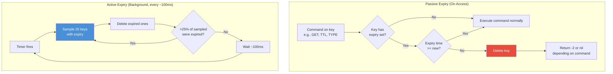
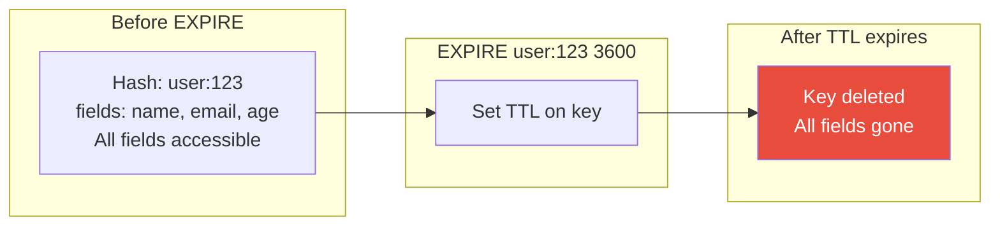
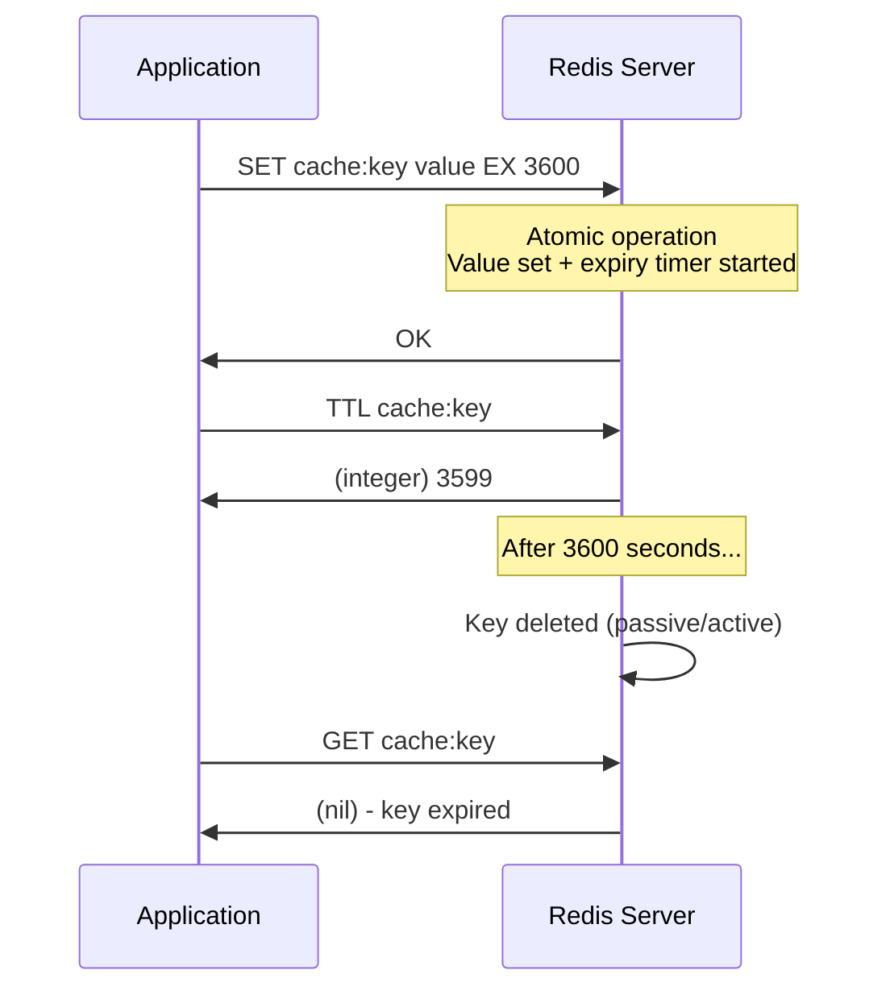
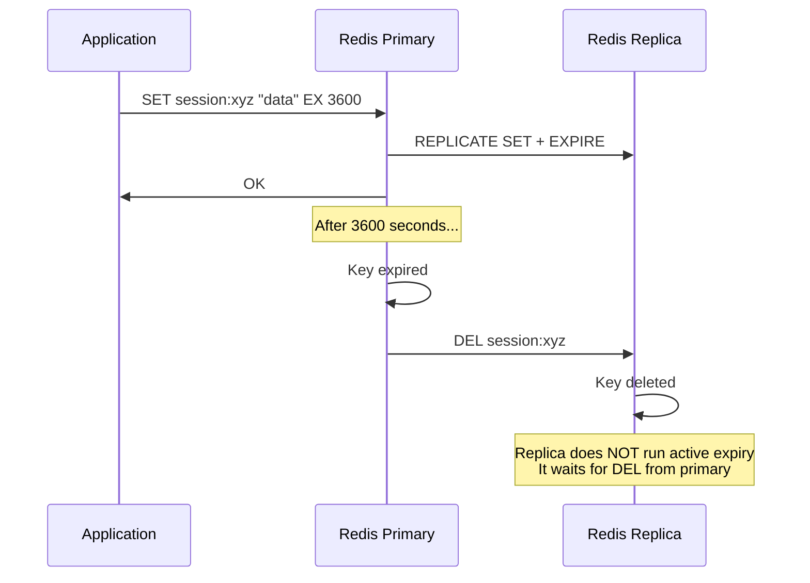
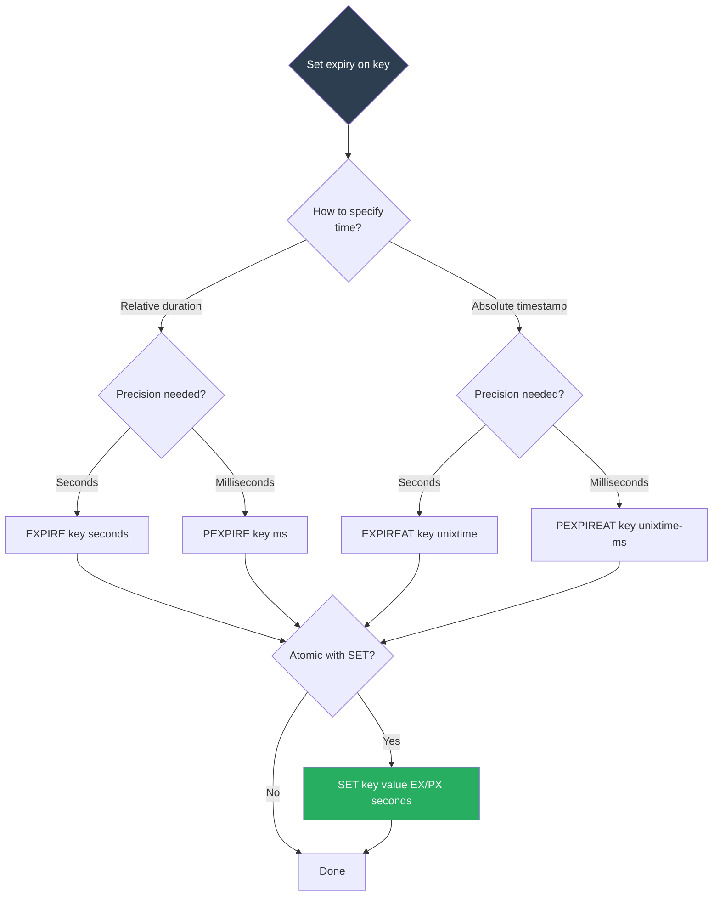

# 8.989 — Redis — Key Expiry — TTL, PTTL, EXPIRE, PERSIST

## Overview — Key Expiry in Redis

Key expiry is one of Redis's most fundamental and widely used features. Every key in Redis can have an optional time-to-live (TTL) — a countdown timer that, when it reaches zero, causes the key to be automatically deleted. This feature is essential for caching, session management, temporary locks, rate limiting, and any scenario where data should self-destruct after a certain period.

Redis implements key expiry using two complementary mechanisms: **passive expiry** and **active expiry**. Passive expiry occurs when a key is accessed (via any command like GET, SET, TTL, TYPE, etc.) — Redis checks the key's expiration timestamp, and if it has passed, the key is deleted before the command is executed. This means expired keys are not immediately removed from memory; they are removed lazily when accessed. Active expiry runs in the background every 100 milliseconds. Redis samples a random set of 20 keys from the keyspace that have an expiration set. If more than 25% of those sampled keys are expired, Redis repeats the sampling and deletion process. This active expiry loop runs continuously to prevent expired keys from accumulating indefinitely, especially keys that are never accessed again.

The expiration time is stored internally as a Unix timestamp in milliseconds (with resolution depending on the command used — EXPIRE uses seconds, PEXPIRE uses milliseconds, EXPIREAT uses a Unix timestamp in seconds, PEXPIREAT uses a Unix timestamp in milliseconds). When a key is created with expiry, Redis stores the absolute expiration time (not a relative TTL). This means that if the server clock changes or if the key is persisted and restored, the expiry behavior is based on the absolute time.

Key expiry applies to the key itself, not to individual elements within a data structure. If you set EXPIRE on a key holding a Hash, Set, or List, the entire key (and all its elements) is deleted when the TTL expires. You cannot expire individual fields of a Hash or individual members of a Set separately. If you need per-element expiry, you must manage it at the application level (e.g., by storing each element as a separate key with its own TTL).

TTL and PTTL return the remaining time to live of a key that has an expiry. TTL returns seconds, PTTL returns milliseconds. If the key does not exist, both return -2. If the key exists but has no associated expiry, both return -1. If the key has expired (and has been deleted by passive/active expiry), TTL returns -2.

EXPIRE, PEXPIRE, EXPIREAT, and PEXPIREAT all set or modify the expiry on a key. EXPIRE sets the expiry in seconds, PEXPIRE in milliseconds, EXPIREAT sets the expiry as a Unix timestamp in seconds, and PEXPIREAT as a Unix timestamp in milliseconds. All four commands return 1 if the timeout was set successfully and 0 if the key does not exist.

PERSIST removes the expiry from a key, making it permanent. It returns 1 if the timeout was removed successfully, and 0 if the key did not have an associated timeout (or did not exist).

Since Redis 7.0, the EXPIRE and PEXPIRE commands support additional options: `NX` (set expiry only if the key has no expiry), `XX` (set expiry only if the key already has an expiry), `GT` (set expiry only if the new expiry is greater than the current one), and `LT` (set expiry only if the new expiry is less than the current one). These options provide fine-grained control over expiry updates.

A critical interaction with expiry is with the SET command. Since Redis 2.6.12, SET supports the `EX`, `PX`, `EXAT`, and `PXAT` options that set both the value and the expiry in a single atomic command:

```
SET cache:key "value" EX 3600
SET cache:key "value" PX 3600000
SET cache:key "value" EXAT 1734567890
SET cache:key "value" PXAT 1734567890123
```

This atomic SET + EXPIRE pattern is recommended over separate SET and EXPIRE calls because it eliminates the race condition where the key is set but not yet expired before a crash.

Expiry interacts with persistence (RDB and AOF) in specific ways. When an RDB snapshot is saved, expired keys are **not** included — Redis filters them out during snapshot creation. When loading an RDB snapshot, Redis checks the expiration timestamps and does not load keys that have already expired (using the server's current clock). For AOF persistence, when a key expires and is deleted, Redis appends a DEL command to the AOF log, ensuring that the deletion is persisted.

In replication scenarios, expired keys are handled by the primary node. The primary node drives the expiry process — it deletes expired keys and propagates the DEL command to all replicas. Replicas do NOT independently expire keys (they do not run the active expiry loop). Instead, they rely on the primary's DEL command. This ensures data consistency between primary and replicas. However, a replica may serve a stale response for a key that has expired on the primary but has not yet received the DEL command. To mitigate this, replicas track logical clocks and can reject reads of expired keys if they have received the relevant DEL.

## Section 1 — EXPIRE Command

EXPIRE sets a timeout on a key, specified in seconds. After the timeout has elapsed, the key is automatically deleted. The syntax:

```
EXPIRE key seconds [NX | XX | GT | LT]
```

**Basic usage:**

```
> SET session:token:abc123 "user:456"
OK
> EXPIRE session:token:abc123 3600
(integer) 1
> TTL session:token:abc123
(integer) 3598
```

After 3600 seconds, the key `session:token:abc123` is automatically deleted.

**Return values:**
- `1` if the timeout was set successfully.
- `0` if the key does not exist.

If the key already has an expiry, EXPIRE overwrites the existing timeout with the new value:

```
> EXPIRE session:token:abc123 60      # Overwrite with 60 seconds
(integer) 1
> TTL session:token:abc123
(integer) 58
```

**EXPIRE with modifiers (Redis 7.0+):**

```
> EXPIRE cache:key 3600 NX    # Set expiry only if key has no existing expiry
(integer) 1

> EXPIRE cache:key 7200 XX    # Set expiry only if key already has one
(integer) 1

> EXPIRE cache:key 3600 GT    # Set expiry only if 3600 > current TTL
(integer) 0                   # Current TTL was 7200, so GT rejects

> EXPIRE cache:key 7200 LT    # Set expiry only if 7200 < current TTL
(integer) 0                   # Current TTL was 3600, so LT rejects
```

**Non-positive values:**
If the seconds argument is not a positive integer, Redis deletes the key immediately:

```
> SET temp:key "value"
OK
> EXPIRE temp:key -1
(integer) 1
> EXISTS temp:key
(integer) 0
```

EXPIRE with a value of 0 or negative is equivalent to DEL.

**Time complexity:** O(1). Setting an expiry involves updating an internal data structure (the expiry dictionary) which is a simple hash table operation.

**EXPIRE on a key that already has a TTL:**
The new TTL completely replaces the old one. The NX/XX/GT/LT modifiers provide conditional behavior.

**EXPIRE in transactions and Lua:**

```
MULTI
SET cache:key "value"
EXPIRE cache:key 3600
EXEC
```

In Lua scripts, expiry operations inside the script are applied after the script completes. This means you cannot reliably read a key's TTL and then set a new TTL based on it within the same Lua script if you rely on the expiry taking effect immediately. However, getting and setting TTL within a script is fine — the expiry is set when the script finishes.

## Section 2 — PEXPIRE, EXPIREAT, PEXPIREAT Commands

**PEXPIRE** is the millisecond-precision variant of EXPIRE:

```
PEXPIRE key milliseconds [NX | XX | GT | LT]
```

```
> PEXPIRE cache:key 5000       # Expire in 5000 milliseconds (5 seconds)
(integer) 1
> PTTL cache:key
(integer) 4992
```

PEXPIRE accepts the same NX/XX/GT/LT modifiers as EXPIRE.

**EXPIREAT** sets the expiry as a Unix timestamp in seconds:

```
EXPIREAT key unix-time-seconds [NX | XX | GT | LT]
```

```
> EXPIREAT cache:key 1734567890   # Expire at this absolute Unix time
(integer) 1
> TTL cache:key
(integer) 3600                    # Remaining seconds until that timestamp
```

EXPIREAT is useful when you know the absolute expiry time (e.g., from an external system or from the data itself) rather than a relative duration.

**PEXPIREAT** is the millisecond-precision variant:

```
PEXPIREAT key unix-time-milliseconds [NX | XX | GT | LT]
```

```
> PEXPIREAT cache:key 1734567890123
(integer) 1
> PTTL cache:key
(integer) 3599999                # Remaining milliseconds
```

**Timestamp in the past:** If the specified Unix timestamp is in the past, the key is immediately deleted:

```
> PEXPIREAT cache:key 1          # Timestamp in 1970
(integer) 1
> EXISTS cache:key
(integer) 0
```

**Use cases for absolute timestamps:**
- Sessions that expire at midnight (regardless of when they were created).
- Tokens from external auth providers that have a specific `exp` claim.
- Data retention policies tied to calendar dates.
- Scheduled key deletion at a fixed time.

**Accuracy and resolution:**
- EXPIRE/PEXPIRE: timer starts when the command is executed (relative).
- EXPIREAT/PEXPIREAT: timer is based on the server's clock (absolute).
- Resolution: EXPIRE/EXPIREAT use seconds; PEXPIRE/PEXPIREAT use milliseconds.
- In all cases, Redis stores the expiry as a millisecond-precision timestamp internally.
- The active expiry loop runs every 100ms, so keys are deleted within ~100ms of their theoretical expiry time.
- Passive expiry is immediate — if a key is accessed exactly at or after its expiry, it is deleted before the command executes.

## Section 3 — TTL and PTTL Commands

TTL returns the remaining time to live of a key in seconds. PTTL returns it in milliseconds. The syntax:

```
TTL key
PTTL key
```

**Return values:**

| Condition | TTL | PTTL |
|-----------|-----|------|
| Key exists and has expiry | Remaining seconds (≥ 0) | Remaining milliseconds (≥ 0) |
| Key exists but no expiry | -1 | -1 |
| Key does not exist | -2 | -2 |
| Key has expired (deleted) | -2 | -2 |

**Examples:**

```
> SET cache:key "value" EX 3600
OK
> TTL cache:key
(integer) 3597
> PTTL cache:key
(integer) 3596992

> SET permanent:key "value"
OK
> TTL permanent:key
(integer) -1
> PTTL permanent:key
(integer) -1

> TTL nonexistent:key
(integer) -2
> PTTL nonexistent:key
(integer) -2
```

**TTL for debugging and monitoring:**

TTL is frequently used in monitoring scripts and debugging to check how much time remains before a key expires. For example, checking session expiry:

```bash
while true; do
    ttl=$(redis-cli TTL session:token:$TOKEN)
    echo "Session TTL: $ttl seconds"
    if [ "$ttl" -lt 60 ]; then
        echo "Session about to expire — refreshing..."
        redis-cli EXPIRE session:token:$TOKEN 3600
    fi
    sleep 10
done
```

**TTL with data structures:**
TTL on a key holding a Hash, Set, List, Sorted Set, or Stream returns the TTL of the key itself, not of individual elements:

```
> HSET user:456 name "Alice" email "alice@example.com"
(integer) 2
> EXPIRE user:456 3600
(integer) 1
> TTL user:456
(integer) 3599
> HGET user:456 name
"Alice"          # The hash still exists — TTL applies to the key, not fields
```

After TTL expires, the entire hash is deleted.

**TTL precision note:**
TTL truncates to seconds (floor). PTTL gives the remaining milliseconds. For keys with TTL less than 1 second, TTL returns 0 (not -2, because the key still exists in theory until the active expiry loop deletes it). PTTL returns the exact remaining milliseconds.

```
> SET temp:key "value" PX 500    # Expire in 500ms
OK
> TTL temp:key                     # Immediately
(integer) 0                        # Less than 1 second remaining
> PTTL temp:key
(integer) 483                      # Exact milliseconds remaining
```

## Section 4 — PERSIST Command

PERSIST removes the expiration from a key, making it permanent (non-volatile). The syntax:

```
PERSIST key
```

**Return values:**
- `1` if the timeout was removed successfully.
- `0` if the key did not have an associated timeout (or did not exist).

**Examples:**

```
> SET cache:key "value" EX 3600
OK
> TTL cache:key
(integer) 3598
> PERSIST cache:key
(integer) 1
> TTL cache:key
(integer) -1
> EXISTS cache:key
(integer) 1
```

**PERSIST on a key without expiry:**

```
> SET permanent:key "value"
OK
> PERSIST permanent:key
(integer) 0        # No timeout to remove
> TTL permanent:key
(integer) -1
```

**PERSIST on a non-existent key:**

```
> PERSIST nonexistent:key
(integer) 0
```

**Use cases for PERSIST:**
- Promoting a cache entry to permanent (e.g., "hot" data that should not expire).
- Extending a session indefinitely (admin override).
- Debugging — temporarily disable expiry on a key for investigation.
- Data migration — removing TTL before moving data to a permanent store.

**Interaction with EXPIRE modifiers:**
PERSIST is the complement of EXPIRE NX. While EXPIRE NX sets expiry only if none exists, PERSIST removes expiry if it exists. They can be used together for conditional expirations.

**PERSIST in transactions:**
PERSIST can be used inside a MULTI/EXEC transaction or Lua script to atomically remove a timeout as part of a larger operation.

## Section 5 — StackExchange.Redis C# Code — Setting Expiry

StackExchange.Redis provides the `KeyExpireAsync` method on `IDatabase` for setting expiry. It accepts a `TimeSpan` or a `DateTime?` for absolute expiry. The method returns `bool` indicating success (key exists and expiry was set).

**Setting relative expiry with TimeSpan:**

```csharp
using StackExchange.Redis;
using System;
using System.Threading.Tasks;

public class CacheService
{
    private static readonly ConnectionMultiplexer _redis = ConnectionMultiplexer.Connect(
        new ConfigurationOptions
        {
            EndPoints = { "localhost:6379" },
            AbortOnConnectFail = false,
            ConnectTimeout = 5000,
            SyncTimeout = 5000,
            KeepAlive = 60,
            ConnectRetry = 3
        });

    private static readonly IDatabase _db = _redis.GetDatabase();

    /// <summary>
    /// Set a value with expiry using TimeSpan.
    /// TimeSpan.FromSeconds(3600) = 1 hour
    /// </summary>
    public static async Task<bool> SetWithExpiryAsync(string key, string value, TimeSpan expiry)
    {
        bool set = await _db.StringSetAsync(key, value);
        if (set)
        {
            bool expirySet = await _db.KeyExpireAsync(key, expiry);
            Console.WriteLine($"[Cache] Set '{key}' with expiry {expiry.TotalSeconds}s. Expiry set: {expirySet}");
            return expirySet;
        }
        return false;
    }

    /// <summary>
    /// Atomic SET with expiry using the EX/PX options (recommended).
    /// This avoids the race condition of SET followed by EXPIRE.
    /// </summary>
    public static async Task SetAtomicWithExpiryAsync(string key, string value, TimeSpan expiry)
    {
        // Use the EX option directly in SET — atomic, no race condition
        await _db.StringSetAsync(key, value, expiry);
        Console.WriteLine($"[Cache] Atomic SET '{key}' with expiry {expiry.TotalSeconds}s.");
    }

    /// <summary>
    /// Set expiry on an existing key (e.g., a Hash, Set, or List).
    /// </summary>
    public static async Task ExpireExistingKeyAsync(string key, TimeSpan expiry)
    {
        bool result = await _db.KeyExpireAsync(key, expiry);
        Console.WriteLine($"[Cache] Expiry on '{key}': {result} (key exists: {result})");
    }

    /// <summary>
    /// Set expiry with NX flag (only if key has no existing expiry).
    /// StackExchange.Redis does not expose NX/XX/GT/LT directly in KeyExpireAsync,
    /// so we use the EVAL command for conditional expiry.
    /// </summary>
    public static async Task<bool> ExpireIfNoExpiryAsync(string key, TimeSpan expiry)
    {
        // Lua: set expiry only if key has no existing expiry
        string script = @"
            local ttl = redis.call('TTL', KEYS[1])
            if ttl == -1 then
                return redis.call('EXPIRE', KEYS[1], ARGV[1])
            end
            return 0
        ";

        RedisResult result = await _db.ScriptEvaluateAsync(script,
            new RedisKey[] { key },
            new RedisValue[] { (long)expiry.TotalSeconds });

        return (int)result == 1;
    }

    /// <summary>
    /// Set absolute expiry using DateTime (equivalent to EXPIREAT).
    /// </summary>
    public static async Task ExpireAtAbsoluteTimeAsync(string key, DateTime expiryTime)
    {
        // KeyExpireAsync accepts DateTime? for absolute expiry
        if (expiryTime.Kind == DateTimeKind.Local)
        {
            expiryTime = expiryTime.ToUniversalTime();
        }

        bool result = await _db.KeyExpireAsync(key, expiryTime);
        Console.WriteLine($"[Cache] Absolute expiry on '{key}' at {expiryTime:O}: {result}");
    }

    /// <summary>
    /// Set expiry on a key using milliseconds (PEXPIRE equivalent).
    /// </summary>
    public static async Task ExpireInMillisecondsAsync(string key, long milliseconds)
    {
        // Use TimeSpan.FromMilliseconds
        TimeSpan expiry = TimeSpan.FromMilliseconds(milliseconds);
        await _db.KeyExpireAsync(key, expiry);
    }

    /// <summary>
    /// Extend expiry of a key (sliding expiration pattern).
    /// Resets the TTL to the full duration from now.
    /// </summary>
    public static async Task TouchExpiryAsync(string key, TimeSpan slidingWindow)
    {
        bool result = await _db.KeyExpireAsync(key, slidingWindow);
        if (result)
        {
            Console.WriteLine($"[Cache] Sliding expiry extended for '{key}' to {slidingWindow.TotalSeconds}s.");
        }
        else
        {
            Console.WriteLine($"[Cache] Key '{key}' not found — cannot extend expiry.");
        }
    }

    /// <summary>
    /// Set expiry only if it would increase the TTL (GT modifier equivalent).
    /// Need Lua since StackExchange.Redis doesn't directly expose GT/LT.
    /// </summary>
    public static async Task<bool> ExpireWithGtAsync(string key, TimeSpan newExpiry)
    {
        // GT: only set if new seconds > current TTL
        string script = @"
            local current = redis.call('TTL', KEYS[1])
            if current >= 0 and tonumber(ARGV[1]) > current then
                return redis.call('EXPIRE', KEYS[1], ARGV[1])
            end
            return 0
        ";

        RedisResult result = await _db.ScriptEvaluateAsync(script,
            new RedisKey[] { key },
            new RedisValue[] { (long)newExpiry.TotalSeconds });

        return (int)result == 1;
    }
}
```

**Setting expiry during key creation with various data structures:**

```csharp
/// <summary>
/// Pattern: Create key + set expiry atomically.
/// </summary>
public static async Task CreateWithExpiryAsync()
{
    // String with SET EX (equivalent to SET key value EX seconds)
    await _db.StringSetAsync("session:token:abc", "user:456",
        TimeSpan.FromHours(1));

    // Hash — set expiry after creation
    await _db.HashSetAsync("user:789", new HashEntry[]
    {
        new HashEntry("name", "Alice"),
        new HashEntry("email", "alice@example.com")
    });
    await _db.KeyExpireAsync("user:789", TimeSpan.FromDays(7));

    // Set — set expiry atomically using transaction
    ITransaction transaction = _db.CreateTransaction();
    transaction.SetAddAsync("temp:set", "member1");
    transaction.SetAddAsync("temp:set", "member2");
    transaction.KeyExpireAsync("temp:set", TimeSpan.FromMinutes(5));
    bool committed = await transaction.ExecuteAsync();

    // Sorted Set with expiry
    await _db.SortedSetAddAsync("leaderboard:daily", "player:1", 1500);
    await _db.KeyExpireAsync("leaderboard:daily", TimeSpan.FromDays(1));

    // List with expiry
    await _db.ListRightPushAsync("queue:tasks", "task1");
    await _db.KeyExpireAsync("queue:tasks", TimeSpan.FromHours(2));
}
```

**Error handling for KeyExpireAsync:**

```csharp
public static async Task SafeSetExpiryAsync(string key, TimeSpan expiry)
{
    try
    {
        bool result = await _db.KeyExpireAsync(key, expiry);

        if (result)
        {
            Console.WriteLine($"[Cache] Expiry set on '{key}'.");
        }
        else
        {
            // Key doesn't exist or other issue
            // Check if key exists
            bool exists = await _db.KeyExistsAsync(key);
            if (!exists)
            {
                Console.WriteLine($"[Cache] Cannot set expiry: key '{key}' does not exist.");
            }
            else
            {
                Console.WriteLine($"[Cache] Expiry set returned false for '{key}'.");
            }
        }
    }
    catch (RedisServerException ex)
    {
        Console.Error.WriteLine($"[Cache] Redis error: {ex.Message}");
    }
    catch (RedisConnectionException ex)
    {
        Console.Error.WriteLine($"[Cache] Connection error: {ex.Message}");
    }
}
```

## Section 6 — StackExchange.Redis C# Code — Reading TTL

StackExchange.Redis provides `KeyTimeToLiveAsync` which returns a `TimeSpan?` — the remaining TTL as a TimeSpan if the key has one, or null if the key does not exist or has no expiry.

**Basic TTL reading:**

```csharp
public static async Task CheckTtlAsync(string key)
{
    TimeSpan? ttl = await _db.KeyTimeToLiveAsync(key);

    if (ttl == null)
    {
        // Check if the key exists or has no expiry
        bool exists = await _db.KeyExistsAsync(key);
        if (exists)
        {
            Console.WriteLine($"[TTL] Key '{key}' exists with no expiry.");
        }
        else
        {
            Console.WriteLine($"[TTL] Key '{key}' does not exist.");
        }
    }
    else
    {
        Console.WriteLine($"[TTL] Key '{key}' expires in {ttl.Value.TotalSeconds:F2} seconds " +
            $"({ttl.Value.TotalMilliseconds:F0} ms).");
    }
}
```

**Background TTL monitor (for debugging):**

```csharp
public static async Task MonitorTtlAsync(string key, CancellationToken cancellationToken)
{
    Console.WriteLine($"[Monitor] Monitoring TTL of '{key}'. Press Ctrl+C to stop.");

    while (!cancellationToken.IsCancellationRequested)
    {
        TimeSpan? ttl = await _db.KeyTimeToLiveAsync(key);

        if (ttl == null)
        {
            bool exists = await _db.KeyExistsAsync(key);
            if (!exists)
            {
                Console.WriteLine($"[Monitor] Key '{key}' has been deleted (expired).");
                break;
            }
            Console.WriteLine($"[Monitor] Key '{key}' has no expiry.");
        }
        else
        {
            Console.WriteLine($"[Monitor] '{key}' TTL: {ttl.Value.TotalSeconds:F1}s / {ttl.Value.TotalMilliseconds:F0}ms");
        }

        try
        {
            await Task.Delay(1000, cancellationToken);
        }
        catch (TaskCanceledException)
        {
            break;
        }
    }
}
```

**Checking if key will expire soon (for proactive refresh):**

```csharp
public static async Task<bool> ShouldRefreshKeyAsync(string key, TimeSpan threshold)
{
    TimeSpan? ttl = await _db.KeyTimeToLiveAsync(key);

    if (ttl == null)
    {
        // Key doesn't exist or has no expiry — refresh
        return true;
    }

    // Refresh if TTL is below threshold
    return ttl.Value < threshold;
}

// Usage: background cache refresh
public static async Task ProactiveCacheRefreshAsync(string key, Func<Task<string>> refreshFunc,
    TimeSpan expiry, TimeSpan refreshThreshold)
{
    if (await ShouldRefreshKeyAsync(key, refreshThreshold))
    {
        string newValue = await refreshFunc();
        await _db.StringSetAsync(key, newValue, expiry);
        Console.WriteLine($"[Cache] Proactively refreshed '{key}'.");
    }
}
```

**TTL with FireAndForget (for monitoring without affecting latency):**

```csharp
public static async Task CheckTtlFastAsync(string key)
{
    // Use FireAndForget to avoid waiting for the response
    // but this means we don't get the result
    await _db.KeyTimeToLiveAsync(key, CommandFlags.FireAndForget);
}

// For cases where we do need the result but want to batch:
public static async Task BatchTtlCheckAsync(IEnumerable<string> keys)
{
    var tasks = keys.Select(key => _db.KeyTimeToLiveAsync(key));
    TimeSpan?[] results = await Task.WhenAll(tasks);

    foreach (var key in keys.Zip(results, (k, ttl) => new { Key = k, Ttl = ttl }))
    {
        Console.WriteLine($"[TTL] '{key.Key}': {(key.Ttl.HasValue ? $"{key.Ttl.Value.TotalSeconds:F1}s" : "no expiry")}");
    }
}
```

## Section 7 — StackExchange.Redis C# Code — PERSIST

StackExchange.Redis provides `KeyPersistAsync` for removing expiry. It returns `bool` indicating whether a timeout was removed.

**Basic PERSIST:**

```csharp
public static async Task MakePermanentAsync(string key)
{
    bool result = await _db.KeyPersistAsync(key);

    if (result)
    {
        Console.WriteLine($"[Cache] Removed expiry from '{key}'. Key is now permanent.");
    }
    else
    {
        Console.WriteLine($"[Cache] Key '{key}' had no expiry or does not exist.");
    }
}
```

**Conditional persist (only if TTL is low — "keep if frequently accessed"):**

```csharp
public static async Task ConditionallyPersistAsync(string key, TimeSpan minTtlThreshold)
{
    TimeSpan? ttl = await _db.KeyTimeToLiveAsync(key);

    if (ttl == null)
    {
        // Key has no expiry or doesn't exist
        Console.WriteLine($"[Cache] Key '{key}' is already permanent or missing.");
        return;
    }

    if (ttl.Value < minTtlThreshold)
    {
        // Low TTL means frequently accessed — make permanent
        bool persisted = await _db.KeyPersistAsync(key);
        Console.WriteLine($"[Cache] Key '{key}' had low TTL ({ttl.Value.TotalSeconds:F1}s) — persisted: {persisted}");
    }
    else
    {
        Console.WriteLine($"[Cache] Key '{key}' TTL is still adequate ({ttl.Value.TotalSeconds:F1}s).");
    }
}
```

**Bulk persist (remove expiry from many keys):**

```csharp
public static async Task<int> BulkPersistAsync(params string[] keys)
{
    var tasks = keys.Select(key => _db.KeyPersistAsync(key));
    bool[] results = await Task.WhenAll(tasks);

    int persisted = results.Count(r => r);
    Console.WriteLine($"[Cache] Bulk persist: {persisted}/{keys.Length} keys made permanent.");
    return persisted;
}
```

**PERSIST with Lua for atomic conditional removal:**

```csharp
/// <summary>
/// Persist only if the key was accessed recently (tracked via a separate key).
/// </summary>
public static async Task<bool> PersistIfRecentlyAccessedAsync(string dataKey, string accessKey, TimeSpan recentWindow)
{
    // Lua: check if accessKey was updated within the window, if so persist dataKey
    string script = @"
        local access_exists = redis.call('EXISTS', KEYS[2])
        if access_exists == 1 then
            local access_ttl = redis.call('TTL', KEYS[2])
            -- If accessKey exists and its TTL is less than the window, data is "hot"
            if access_ttl >= 0 and access_ttl < tonumber(ARGV[1]) then
                return redis.call('PERSIST', KEYS[1])
            end
        end
        return 0
    ";

    RedisResult result = await _db.ScriptEvaluateAsync(script,
        new RedisKey[] { dataKey, accessKey },
        new RedisValue[] { (long)recentWindow.TotalSeconds });

    return (int)result == 1;
}
```

## Section 8 — Expiry Internals, Use Cases, and Gotchas

### Expiry Internals — Passive and Active Expiry

**Passive Expiry:**
When a key is accessed via any command (GET, SET, TTL, EXISTS, TYPE, HGET, etc.), Redis checks if the key has an expiration timestamp. If the current time ≥ the expiration timestamp, the key is deleted before the command is executed. This is a lazy approach — it only cleans keys that are accessed. Keys that are never accessed after expiry remain in memory indefinitely unless active expiry cleans them.

**Active Expiry:**
The active expiry mechanism runs in the Redis event loop approximately every 100 milliseconds. The algorithm:

1. Sample 20 random keys from the set of keys that have an expiry.
2. Delete all expired keys among the sampled 20.
3. If more than 25% (5 out of 20) of sampled keys were expired, repeat from step 1.
4. Active expiry runs at most 25% of the time (adaptive frequency).

This algorithm ensures that the number of expired-but-not-yet-deleted keys is bounded. In the worst case, if each sampling finds >25% expired, Redis continues sampling until it drops below 25% or until it has spent 25% of its time on expiry. This prevents expired keys from accumulating indefinitely while limiting the CPU impact of the expiry process.

**Memory overhead:**
Each key with an expiry has an additional 8 bytes (for the expiration timestamp) in the Redis object header. The expiry dictionary (a hash table mapping keys to their expiration timestamps) has its own overhead: approximately 8-16 bytes per entry plus hash table overhead. For 1 million keys with expiry, the total overhead is approximately 20-30 MB.

**Expiry and RDB/AOF:**

| Event | RDB Behavior | AOF Behavior |
|-------|-------------|--------------|
| Save RDB | Expired keys are excluded from snapshot | N/A |
| Load RDB | Expired keys are filtered out (by timestamp) | N/A |
| Key expires during runtime | N/A | DEL command appended to AOF |
| AOF rewrite | Expired keys are excluded | Expired keys are excluded |
| Redis restart with RDB | Keys that expired during shutdown are excluded | DEL commands from AOF replay deletions |

**Expiry and replication:**

```
Primary: SET key "value" EX 3600
Primary: (key expires after 3600s)
Primary: DEL key          ← propagated to replica
Replica: DEL key          ← replica deletes its copy
```

Key points:
- Expiry is driven by the primary node only.
- Replicas do not run the active expiry loop.
- When a key expires on the primary, it sends a DEL command to all replicas.
- A replica may serve a stale read (key exists on replica but should be expired) if the DEL has not arrived yet.
- In Redis 7.0+, replicas can reject reads of keys that are logically expired by tracking the replication lag.

### Use Cases for Key Expiry

**Use Case 1 — Cache TTL (most common):**

The most widespread use of key expiry is for caching. A cache entry is set with a TTL that matches the acceptable staleness window:

```csharp
// Cache API responses for 5 minutes
public async Task<string> GetCachedDataAsync(string cacheKey)
{
    // Try cache first
    string cached = await _db.StringGetAsync(cacheKey);
    if (cached.HasValue)
    {
        return cached;
    }

    // Fetch from origin
    string freshData = await FetchFromOriginAsync();

    // Cache with 5-minute TTL
    await _db.StringSetAsync(cacheKey, freshData, TimeSpan.FromMinutes(5));

    return freshData;
}
```

TTL-based caching is the foundation of the cache-aside pattern, where the application checks the cache first, falls back to the database on miss, and populates the cache with a TTL.

**Use Case 2 — Session Management:**

Web application sessions stored in Redis have a TTL that extends on each request (sliding expiration):

```csharp
public static async Task<string> GetOrCreateSessionAsync(string sessionId)
{
    string sessionKey = $"session:{sessionId}";

    // Check if session exists
    string sessionData = await _db.StringGetAsync(sessionKey);
    if (sessionData.HasValue)
    {
        // Extend TTL on each access (sliding expiration)
        await _db.KeyExpireAsync(sessionKey, TimeSpan.FromHours(1));
        return sessionData;
    }

    // Create new session
    string newSession = JsonSerializer.Serialize(new { created = DateTime.UtcNow });
    await _db.StringSetAsync(sessionKey, newSession, TimeSpan.FromHours(1));
    return newSession;
}
```

**Use Case 3 — Distributed Locks:**

Redis distributed locks (Redlock algorithm) use key expiry as a safety mechanism. If the lock holder crashes without releasing the lock, the key expires and the lock is automatically released:

```csharp
public static async Task<bool> AcquireLockAsync(string lockKey, string ownerId, TimeSpan ttl)
{
    // SET NX EX — atomic "set if not exists" with expiry
    return await _db.StringSetAsync(lockKey, ownerId, ttl, When.NotExists);
}

public static async Task ReleaseLockAsync(string lockKey, string ownerId)
{
    // Lua: only release if we own the lock
    string script = @"
        if redis.call('GET', KEYS[1]) == ARGV[1] then
            return redis.call('DEL', KEYS[1])
        else
            return 0
        end
    ";

    await _db.ScriptEvaluateAsync(script, new RedisKey[] { lockKey }, new RedisValue[] { ownerId });
}
```

**Use Case 4 — Rate Limiting (Sliding Window):**

Key expiry is essential for implementing rate limits. A common pattern uses a key with a TTL equal to the rate limit window:

```csharp
public static async Task<bool> CheckRateLimitAsync(string userId, int maxRequests, TimeSpan window)
{
    string key = $"ratelimit:{userId}:{DateTime.UtcNow:yyyy-MM-dd-HH-mm}";

    long current = await _db.StringIncrementAsync(key);

    if (current == 1)
    {
        // First request in this window — set TTL
        await _db.KeyExpireAsync(key, window);
    }

    return current <= maxRequests;
}
```

**Use Case 5 — Temporary Data / One-Time Tokens:**

Email verification tokens, password reset links, and other one-time-use data should auto-expire:

```csharp
// Token valid for 1 hour
await _db.StringSetAsync($"token:verify:{token}", userId,
    TimeSpan.FromHours(1));
```

**Use Case 6 — Auto-Cleanup of Temporary Locks, Leases, and Semaphores:**

Any temporary state that must not persist indefinitely should have a TTL:

```csharp
// Processing lease — if worker crashes, lease auto-expires
await _db.StringSetAsync($"lease:worker:{workerId}", "processing",
    TimeSpan.FromMinutes(5));
```

### Gotchas and Limitations

**Gotcha 1: EXPIRE on a key that already has TTL overwrites it.** If you call EXPIRE twice, the second call completely replaces the first. Use NX/XX/GT/LT modifiers (Redis 7.0+) for conditional updates. In earlier versions, always check the current TTL before overwriting if you need conditional behavior.

```csharp
// Wrong — blindly overwrites TTL
await _db.KeyExpireAsync(key, TimeSpan.FromHours(2));

// Right — set TTL to 1 hour but only if current TTL < 1 hour
await _db.KeyExpireAsync(key, TimeSpan.FromHours(1), When.LessThan); // StackExchange 2.7+
```

**Gotcha 2: EXPIRE with non-positive value deletes the key immediately.** Calling `EXPIRE key 0` or `EXPIRE key -1` is equivalent to DEL. This is occasionally used intentionally but more often is a bug.

**Gotcha 3: TTL precision is seconds; PTTL is milliseconds.** For short-lived keys (<1 second), TTL returns 0 even though the key still exists. Use PTTL for sub-second precision.

**Gotcha 4: Expiry on data structures applies to the KEY, not individual elements.** If you need per-field expiration in a Hash, you must implement it manually:

```csharp
// Per-field expiry pattern using individual keys
public static async Task SetHashFieldWithExpiryAsync(string hashKey, string field,
    string value, TimeSpan expiry)
{
    // Store the field value with a key that includes field name and has its own TTL
    string fieldKey = $"{hashKey}:field:{field}";
    await _db.StringSetAsync(fieldKey, value, expiry);

    // Also store a mapping from field to per-field key in a hash
    await _db.HashSetAsync(hashKey, field, fieldKey);
}

public static async Task<string> GetHashFieldWithExpiryAsync(string hashKey, string field)
{
    RedisValue fieldKey = await _db.HashGetAsync(hashKey, field);
    if (!fieldKey.HasValue) return null;

    // Read the individual key (which may have expired)
    RedisValue value = await _db.StringGetAsync(fieldKey);
    return value;
}
```

**Gotcha 5: EXPIRE inside a Lua script is deferred.** Expirations set inside a Lua script do not take effect until the script completes. You cannot set an expiry and then read it back within the same script:

```lua
-- This does NOT work as expected:
redis.call('SET', KEYS[1], ARGV[1])
redis.call('EXPIRE', KEYS[1], 10)
local ttl = redis.call('TTL', KEYS[1])  -- Returns -1 or stale value!
return ttl
```

The TTL will be -1 (no expiry) because the expiry has not been applied yet. It is applied after the script finishes.

**Gotcha 6: Replication delay and stale reads.** On a Redis replica, an expired key may still be accessible if the DEL command from the primary has not yet been processed. The maximum staleness is bounded by the replication lag. For read-heavy applications where absolute consistency is required, consider reading from the primary.

**Gotcha 7: SET with EX/PX is atomic; separate SET + EXPIRE is not.** Between the SET and the EXPIRE, another client could modify the key or the server could crash. Always use the EX/PX options on SET when setting both value and expiry:

```csharp
// WRONG: race condition possible
await _db.StringSetAsync(key, value);
await _db.KeyExpireAsync(key, expiry);   // Server crash between these = no expiry

// CORRECT: atomic
await _db.StringSetAsync(key, value, expiry);
```

**Gotcha 8: StackExchange.Redis `KeyExpireAsync` with `TimeSpan.Zero` or negative.** Passing `TimeSpan.Zero` or a negative TimeSpan causes an immediate key deletion (equivalent to DEL). This is consistent with the Redis EXPIRE command behavior, but can be surprising.

```csharp
// This deletes the key immediately!
await _db.KeyExpireAsync(key, TimeSpan.Zero);
```

**Gotcha 9: Memory fragmentation from many expiring keys.** When many keys expire simultaneously (e.g., at the top of the hour), Redis deletes them all in the active expiry loop. Deleting keys frees memory, but the memory may be fragmented. Over time, this can lead to higher `used_memory_rss` than `used_memory`. Monitor memory fragmentation ratio (`mem_fragmentation_ratio`) when using large numbers of ephemeral keys.

**Gotcha 10: The active expiry loop has a CPU cost.** The default configuration (~100ms cycle, 20 keys per sample) is designed to use at most 25% of a CPU core. For workloads with millions of expiring keys, this can become significant. Monitor `expired_keys` in INFO stats to track deletion throughput. If you see high numbers, consider whether all TTLs are necessary.

**Gotcha 11: EXPIRE with `When` conditions in StackExchange.Redis.** StackExchange.Redis 2.7+ added `When.LessThan`, `When.GreaterThan` etc. on `KeyExpireAsync`. Check the API version and documentation for the exact API.

```csharp
// StackExchange.Redis 2.7+ conditional expiry
await _db.KeyExpireAsync(key, TimeSpan.FromHours(1), When.GreaterThan);
```

**Gotcha 12: Key expiry and UNLINK.** When a key expires, Redis uses DEL by default. If you want the key to be unlinked (lazy deletion, non-blocking), you must manually use UNLINK before the expiry would fire. There is no "EXPIRE with UNLINK" option. For large keys (big lists, large sets), DEL can block Redis. Use UNLINK manually if expiration of a large key is expected.

## Section 9 — Advanced Patterns and Best Practices

### Pattern 1 — Sliding Expiration

Sliding expiration extends the TTL each time the key is accessed. This is useful for sessions and caches where frequently accessed data should stay alive:

```csharp
public class SlidingExpirationCache
{
    private readonly IDatabase _db;
    private readonly TimeSpan _defaultSlidingWindow;

    public SlidingExpirationCache(ConnectionMultiplexer redis, TimeSpan slidingWindow)
    {
        _db = redis.GetDatabase();
        _defaultSlidingWindow = slidingWindow;
    }

    public async Task<string> GetWithSlidingExpiryAsync(string key)
    {
        string value = await _db.StringGetAsync(key);

        if (value != null)
        {
            // Extend TTL on access (sliding)
            await _db.KeyExpireAsync(key, _defaultSlidingWindow);
        }

        return value;
    }

    public async Task SetWithSlidingExpiryAsync(string key, string value)
    {
        await _db.StringSetAsync(key, value, _defaultSlidingWindow);
    }
}
```

### Pattern 2 — Time-Bucketed Data with Auto-Expiry

For data that is organized by time bucket (e.g., hourly metrics), set TTL on the entire bucket to auto-clean old data:

```csharp
public class TimeBucketedMetrics
{
    private readonly IDatabase _db;

    public TimeBucketedMetrics(ConnectionMultiplexer redis)
    {
        _db = redis.GetDatabase();
    }

    public async Task RecordMetricAsync(string metricName, string value)
    {
        // Key includes the hour — data auto-expires after 7 days
        string key = $"metrics:{metricName}:{DateTime.UtcNow:yyyy-MM-dd:HH}";

        await _db.HyperLogLogAddAsync(key, value);

        // Set TTL only if this is a new key (NX effect via Lua)
        // to avoid resetting TTL on every update
        string setTtlScript = @"
            local ttl = redis.call('TTL', KEYS[1])
            if ttl == -1 then
                redis.call('EXPIRE', KEYS[1], ARGV[1])
            end
        ";

        await _db.ScriptEvaluateAsync(setTtlScript,
            new RedisKey[] { key },
            new RedisValue[] { (long)TimeSpan.FromDays(7).TotalSeconds });
    }
}
```

### Pattern 3 — Delayed Execution with TTL + Keyspace Notifications

Using Redis keyspace notifications (requires `notify-keyspace-events Ex`), you can trigger actions when keys expire:

```csharp
public class DelayedExecutionService
{
    private readonly ConnectionMultiplexer _redis;
    private readonly IDatabase _db;
    private readonly ISubscriber _subscriber;

    public DelayedExecutionService(string connectionString)
    {
        _redis = ConnectionMultiplexer.Connect(connectionString);
        _db = _redis.GetDatabase();
        _subscriber = _redis.GetSubscriber();

        // Subscribe to key expiry events
        // Requires: CONFIG SET notify-keyspace-events Ex
        string expiryChannel = "__keyevent@0__:expired";

        _subscriber.SubscribeAsync(expiryChannel, (channel, value) =>
        {
            string expiredKey = value.ToString();
            Console.WriteLine($"[Delayed] Key expired: {expiredKey}");

            // Handle the expiration — e.g., trigger a job
            if (expiredKey.StartsWith("delayed:task:"))
            {
                // Task key expired — execute the scheduled task
                string taskId = expiredKey.Replace("delayed:task:", "");
                Console.WriteLine($"[Delayed] Executing task: {taskId}");
            }
        });
    }

    /// <summary>
    /// Schedule a delayed task by setting a key with TTL.
    /// When the key expires, the notification handler runs.
    /// </summary>
    public async Task ScheduleTaskAsync(string taskId, TimeSpan delay)
    {
        string key = $"delayed:task:{taskId}";

        // Store task metadata
        await _db.StringSetAsync(key, JsonSerializer.Serialize(new
        {
            taskId,
            scheduledAt = DateTimeOffset.UtcNow.ToUnixTimeMilliseconds(),
            delaySeconds = delay.TotalSeconds
        }));

        // Set TTL for delayed execution
        await _db.KeyExpireAsync(key, delay);

        Console.WriteLine($"[Delayed] Task {taskId} scheduled in {delay.TotalSeconds}s.");
    }
}
```

### Pattern 4 — TTL-Based Priority Queue (for retry semantics)

Combine TTL with a sorted set or list for time-based retry:

```csharp
public class RetryQueue
{
    private readonly IDatabase _db;

    public RetryQueue(ConnectionMultiplexer redis)
    {
        _db = redis.GetDatabase();
    }

    /// <summary>
    /// Enqueue a message for retry with a delay.
    /// The message key expires after the delay, signaling it's ready for retry.
    /// </summary>
    public async Task EnqueueForRetryAsync(string queue, string messageId,
        string payload, TimeSpan delay)
    {
        string retryKey = $"retry:{queue}:{messageId}";
        await _db.StringSetAsync(retryKey, payload, delay);
    }

    /// <summary>
    /// Get all messages that are ready for retry (keyspace notifications or polling).
    /// </summary>
    public async Task<IEnumerable<string>> GetReadyForRetryAsync(string queue)
    {
        // Scan for retry keys that have expired
        // In practice, use keyspace notifications instead
        var server = _redis.GetServer(_redis.GetEndPoints().First());
        var keys = server.Keys(pattern: $"retry:{queue}:*");

        var ready = new List<string>();
        foreach (var key in keys)
        {
            // Key exists — still pending (not expired yet)
            if (!await _db.KeyExistsAsync(key))
            {
                // Key expired — ready for retry
                string messageId = key.ToString().Replace($"retry:{queue}:", "");
                ready.Add(messageId);
            }
        }
        return ready;
    }
}
```

### Best Practices

1. **Always use atomic SET with EX/PX options.** Never follow a SET with a separate EXPIRE. This eliminates the race condition where the key is set without expiry.

2. **Monitor `expired_keys` in INFO stats.** A sudden spike in expired keys can indicate a thundering herd of expiring cached data (common when all cache entries have the same TTL). Introduce jitter:

```csharp
// Add jitter to prevent thundering herd of expiry
Random rng = new Random();
TimeSpan baseExpiry = TimeSpan.FromHours(1);
TimeSpan jitter = TimeSpan.FromSeconds(rng.Next(0, 300)); // 0-5 min jitter
await _db.StringSetAsync(key, value, baseExpiry + jitter);
```

3. **Use PTTL for monitoring, TTL for application logic.** TTL (seconds) is sufficient for most application decisions (should we refresh?). PTTL is useful for precise monitoring and debugging.

4. **Set TTL on ALL cache keys, but NOT on reference data.** Every cache key should have a TTL — even if it's very long (e.g., 24 hours). This provides a safety net for eviction. Reference data (configuration, master data) should be permanent.

5. **Avoid EXPIRE in high-frequency loops.** Each EXPIRE call is a round trip. If you're extending TTL frequently (e.g., every request), batch the TTL extension or use a longer initial TTL.

6. **Consider using `MEMORY USAGE key` to estimate overhead** for keys with expiry. The expiry dictionary adds memory beyond the key's value.

7. **For scheduled tasks, prefer Redis Streams or a dedicated job queue** over EXPIRE + keyspace notifications. The TTL + notification pattern is unreliable: notifications can be lost if a subscriber is down, and there is no at-least-once guarantee.

8. **Use `EXPIREAT` for calendar-based expiry.** If data should expire at midnight UTC every day, calculate the seconds until midnight and pass to EXPIREAT:

```csharp
public static async Task ExpireAtMidnightAsync(string key)
{
    DateTime now = DateTime.UtcNow;
    DateTime midnight = now.Date.AddDays(1);
    double secondsUntilMidnight = (midnight - now).TotalSeconds;

    await _db.KeyExpireAsync(key, TimeSpan.FromSeconds(secondsUntilMidnight));
}
```

9. **Check for StackExchange.Redis version support.** Older versions of StackExchange.Redis may not support `When.LessThan` / `When.GreaterThan` on `KeyExpireAsync`. Use Lua scripting as a fallback for conditional expiry on older library versions.

10. **Test expiry behavior with replication and failover.** During a Redis failover, the new primary may have a different clock. Ensure that absolute timestamps (EXPIREAT/PEXPIREAT) are not affected by clock skew between nodes. For safety, prefer relative TTL (EXPIRE/PEXPIRE) over absolute timestamps unless you control the clock synchronization.

### Mermaid Diagrams

**Passive and Active Expiry Flow:**



**EXPIRE on Data Structures:**



**SET with EX option (recommended atomic pattern):**



**Replication and Expiry:**



**Key Expiry Command Decision Tree:**



### Related Notes

- **[[8.990 — Redis — Eviction Policies]]** — How Redis evicts keys under memory pressure when maxmemory is reached, which interacts with key expiry.
- **[[8.991 — Redis — Persistence — RDB Snapshots]]** — How key expiry interacts with RDB persistence (expired keys are excluded from snapshots).
- **[[8.962 — Redis — Strings — INCR]]** — Using INCR with TTL for rate limiting and counter patterns.
- **[[8.997 — Redis — Lua Scripting — EVAL, EVALSHA]]** — Using Lua for conditional expiry operations.
- **[[8.1000 — Redis — StackExchange.Redis Full Reference]]** — Complete reference for StackExchange.Redis including KeyExpireAsync, KeyTimeToLiveAsync, KeyPersistAsync.
- **[[8.961 — Redis — Data Structures Overview]]** — Foundational overview of Redis data structures and how TTL applies to each.
- **[[8.992 — Redis — Keyspace Notifications]]** — Using __keyevent@*__:expired notifications for expiry-driven triggers.

> **Summary:** Key expiry is a cornerstone Redis feature that enables automatic data lifecycle management for caches, sessions, locks, and temporary data. EXPIRE/PEXPIRE set relative TTL in seconds/milliseconds, EXPIREAT/PEXPIREAT use absolute timestamps, TTL/PTTL query remaining lifetime, and PERSIST removes expiry. Redis uses both passive (on-access) and active (~100ms background sampling) expiry mechanisms. Always prefer atomic SET with EX/PX options over separate SET + EXPIRE calls. With StackExchange.Redis, use `KeyExpireAsync(TimeSpan)` for relative expiry, `KeyExpireAsync(DateTime)` for absolute, `KeyTimeToLiveAsync()` for TTL queries, and `KeyPersistAsync()` to remove expiry. Key expiry applies to the entire key and all its elements — not to individual data structure members. For replication, the primary drives all expiry deletions, propagating DEL commands to replicas.
