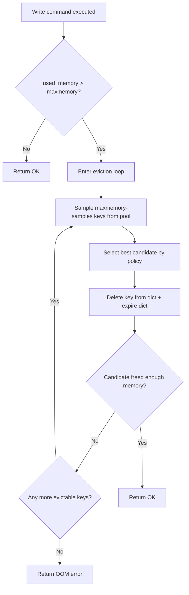

# Redis — Eviction Policies — allkeys-lru, volatile-lru, LFU

## 1 — Overview

When the Redis `maxmemory` limit is reached, the server must decide which keys to remove to free space for new writes. This decision is governed by the **eviction policy** configured via `maxmemory-policy`. Redis offers 8 distinct policies spanning three algorithmic categories: LRU (Least Recently Used, approximate), LFU (Least Frequently Used, Redis 4.0+), and TTL-based. There is also a `noeviction` mode that returns errors on write operations instead of removing data.

Understanding eviction is critical for any production Redis deployment. Choosing the wrong policy leads to unexpected data loss, performance degradation from write errors, or inefficient use of memory. The policy interacts with key expiry (`EXPIRE`, `TTL`), persistence (RDB/AOF), and the access pattern of your application.

**Key concepts:**
- `maxmemory` — hard memory limit in bytes. Redis stops accepting writes (or evicts) when `used_memory` exceeds this value.
- `maxmemory-policy` — the eviction algorithm to apply once the limit is hit.
- `maxmemory-samples` — quality knob for LRU/LFU/TTL approximate algorithms (default 5).
- Eviction is triggered on every command that allocates memory (write commands), not on a timer.

**Default behavior:** Redis ships with `noeviction` in many distributions and `maxmemory 0` (no limit). In cloud-managed Redis (AWS ElastiCache, Azure Cache for Redis), the default policy varies; Azure defaults to `volatile-lru`.

```csharp
// StackExchange.Redis — Checking current eviction policy via CONFIG GET
using StackExchange.Redis;

var muxer = await ConnectionMultiplexer.ConnectAsync("localhost:6379");
var server = muxer.GetServer("localhost:6379");
var policy = await server.ConfigGetAsync("maxmemory-policy");
Console.WriteLine($"Policy: {policy[0].Value}");

var maxMem = await server.ConfigGetAsync("maxmemory");
Console.WriteLine($"MaxMemory: {maxMem[0].Value} bytes");

// Reading actual memory usage — INFO memory
var db = muxer.GetDatabase();
var info = await db.ExecuteAsync("INFO", "memory");
Console.WriteLine(info.ToString());
```

## 2 — Policy Categories

Redis eviction policies divide into three groups based on which keys they consider for removal and which algorithm they use.

### 2.1 — Allkeys Policies

These policies consider **every key** in the database regardless of whether it has an expiry set.

| Policy | Algorithm | Description |
|--------|-----------|-------------|
| `allkeys-lru` | Approximate LRU | Evicts the least recently used key among sampled keys |
| `allkeys-lfu` | Approximate LFU | Evicts the least frequently used key among sampled keys |
| `allkeys-random` | Random | Evicts a random key |

**allkeys-lru** is the most common choice for cache-only Redis deployments. When Redis acts purely as a cache (data can be regenerated from a primary database), there is no reason to preserve any particular key. LRU ensures that keys accessed less recently are evicted first, which approximates the optimal cache replacement strategy.

**allkeys-lfu** is useful when access frequency matters more than recency. For example, if a small set of keys accounts for 90% of reads and a large set of keys is written once and never read again, LFU preserves the hot keys better than LRU.

**allkeys-random** is rarely used. It offers predictable O(1) eviction but no cache-efficiency guarantees.

### 2.2 — Volatile Policies

These policies consider **only keys that have an associated TTL** (keys set with `EXPIRE`, `PEXPIRE`, `SETEX`, etc.). Keys without an expiry are never evicted.

| Policy | Algorithm | Description |
|--------|-----------|-------------|
| `volatile-lru` | Approximate LRU | Evicts the least recently used among keys with TTL |
| `volatile-lfu` | Approximate LFU | Evicts the least frequently used among keys with TTL |
| `volatile-random` | Random | Evicts a random key among keys with TTL |
| `volatile-ttl` | TTL | Evicts the key with the shortest remaining TTL |

**volatile-lru** is the recommended policy for mixed workloads where some keys must persist indefinitely (configuration, user sessions that must not be lost) while others are cache-like and can be evicted. By only considering keys with TTL, Redis leaves persistent keys untouched.

**volatile-ttl** is useful when you want Redis to preferentially evict keys that are about to expire anyway. However, this policy has a subtle issue: keys with identical TTL values are evicted in LRU order among them. In practice, `volatile-lru` often outperforms `volatile-ttl` because LRU provides better cache behavior.

### 2.3 — No Eviction

**noeviction** is the strictest policy. When `maxmemory` is reached, every write command (`SET`, `LPUSH`, `SADD`, etc.) returns an error:

```
(error) OOM command not allowed when used memory > 'maxmemory'.
```

Read commands (`GET`, `EXISTS`, `TTL`) continue to work. This policy is appropriate when data loss is unacceptable and the application handles write errors gracefully (e.g., by queueing writes or scaling up).

## 3 — Policy Deep Dive

### 3.1 — Approximate LRU (allkeys-lru, volatile-lru)

Redis does **not** implement true LRU because true LRU requires tracking every key access in a linked list, which is memory-intensive. Instead, Redis uses an **approximate LRU** algorithm:

1. When eviction is needed, Redis samples `maxmemory-samples` keys (default 5) from the relevant key pool (all keys or just volatile keys).
2. Among the sampled keys, Redis evicts the one with the oldest `idle` time — the key that has not been accessed for the longest duration.
3. If the freed memory is insufficient, Redis repeats the process until `used_memory ≤ maxmemory`.

The approximation quality improves with higher `maxmemory-samples` values. At the default of 5, the eviction is roughly comparable to true LRU. At the maximum of 64, it approaches true LRU accuracy but increases CPU cost per eviction cycle.

```csharp
// StackExchange.Redis — Setting maxmemory-samples
using StackExchange.Redis;

var muxer = await ConnectionMultiplexer.ConnectAsync("localhost:6379");
var server = muxer.GetServer("localhost:6379");
await server.ConfigSetAsync("maxmemory-samples", "10");

// Verify
var samples = await server.ConfigGetAsync("maxmemory-samples");
Console.WriteLine($"Samples: {samples[0].Value}");
```

**LRU eviction pool:** Redis maintains an internal eviction pool (a fixed-size array) that holds the best candidate keys across multiple eviction cycles. This pool persists across evictions, so Redis learns about good eviction candidates over time and can make better decisions without re-scanning every time.

### 3.2 — Approximate LFU (allkeys-lfu, volatile-lfu)

LFU was added in Redis 4.0 and uses a **Morris counter** (a probabilistic counter) to track access frequency with logarithmic resolution. Each object header stores an 8-bit counter (0–255) and a 16-bit access timestamp (in deciseconds — 1/10th of a second).

**Frequency aging:** To prevent keys from retaining high frequency forever (a key that was popular months ago should eventually be evictable), Redis applies a **frequency aging** mechanism. Every `lfu-decay-time` minutes, the counter value is halved (divided by 2). This allows the eviction algorithm to adapt to changing access patterns.

```csharp
// StackExchange.Redis — Viewing LFU metadata (Redis 4.0+)
using StackExchange.Redis;

var muxer = await ConnectionMultiplexer.ConnectAsync("localhost:6379");
var db = muxer.GetDatabase();

// OBJECT FREQ returns the logarithmic frequency counter (requires LFU policy or maxmemory-policy)
// Only available when LFU policy is active
var freq = await db.ExecuteAsync("OBJECT", "FREQ", "mykey");
Console.WriteLine($"Frequency counter: {freq}");

// OBJECT IDLETIME returns approximate idle time in seconds (always available)
var idle = await db.ExecuteAsync("OBJECT", "IDLETIME", "mykey");
Console.WriteLine($"Idle time: {idle} seconds");
```

**LFU configuration directives:**

| Directive | Default | Description |
|-----------|---------|-------------|
| `lfu-log-factor` | 10 | Controls the counter growth rate (higher = slower growth) |
| `lfu-decay-time` | 1 | Minutes before the counter is halved (0 = no decay) |

The counter growth follows: `counter = 1 / (p * log_factor) + 1` where `p` is the probability of increment. At `lfu-log-factor 10`, about 1 million requests are needed to saturate the counter to 255.

### 3.3 — Volatile-TTL

When `volatile-ttl` is configured, Redis samples keys with TTL and evicts the one with the shortest remaining time to live. If multiple keys have identical TTL values, the eviction falls back to LRU order among those keys.

**Important:** Keys without a TTL are **never** evicted under `volatile-ttl` or any volatile-* policy. This makes volatile-* policies safe for mixed persistent/cache workloads.

```csharp
// StackExchange.Redis — Setting a key with TTL (volatile-lru eligible)
using StackExchange.Redis;

var muxer = await ConnectionMultiplexer.ConnectAsync("localhost:6379");
var db = muxer.GetDatabase();

// Key with expiry — eligible for eviction under volatile-*
await db.StringSetAsync("session:1234", "user_data", TimeSpan.FromMinutes(30));

// Key without expiry — NEVER evicted under volatile-*
await db.StringSetAsync("config:app_name", "myapp");
```

## 4 — Configuration

### 4.1 — Core Eviction Settings

| Configuration Directive | Default | Description |
|------------------------|---------|-------------|
| `maxmemory` | 0 (no limit) | Maximum memory Redis can use, in bytes. Supports `gb`, `mb`, `kb` suffixes |
| `maxmemory-policy` | `noeviction` | Eviction algorithm to apply at limit |
| `maxmemory-samples` | 5 | Number of keys to sample per eviction cycle (LRU/LFU/TTL quality) |
| `lfu-log-factor` | 10 | LFU counter growth factor (increase for slower growth) |
| `lfu-decay-time` | 1 | LFU counter half-life in minutes |

### 4.2 — Setting maxmemory

```bash
# redis-cli
CONFIG SET maxmemory 4gb
CONFIG SET maxmemory-policy allkeys-lru
CONFIG SET maxmemory-samples 10
```

```csharp
// StackExchange.Redis — Server-side configuration
using StackExchange.Redis;

var muxer = await ConnectionMultiplexer.ConnectAsync("localhost:6379");
var server = muxer.GetServer("localhost:6379");

await server.ConfigSetAsync("maxmemory", "4gb");
await server.ConfigSetAsync("maxmemory-policy", "allkeys-lru");

// Verify configuration was applied
var configs = await server.ConfigGetAsync("maxmemory", "maxmemory-policy");
foreach (var config in configs)
{
    Console.WriteLine($"{config.Key} = {config.Value}");
}
```

### 4.3 — Configuration File Example (redis.conf)

```conf
# Memory limit: 4 GB
maxmemory 4gb

# Eviction policy: LRU across all keys
maxmemory-policy allkeys-lru

# Sample 10 keys per eviction (better LRU approximation)
maxmemory-samples 10

# LFU tuning (only relevant if using LFU policy)
lfu-log-factor 10
lfu-decay-time 1
```

### 4.4 — Configuration via Azure / AWS

**Azure Cache for Redis:**
- Default `maxmemory-policy` is `volatile-lru`
- `maxmemory` is fixed by the tier (e.g., C1 = 1 GB, C6 = 53 GB)
- Configurable via Portal, CLI, or ARM templates

**AWS ElastiCache for Redis:**
- Default `maxmemory-policy` is `volatile-lru`
- `maxmemory` is set to the instance memory minus overhead
- Configurable via Parameter Groups or `CONFIG SET`

```csharp
// StackExchange.Redis — Checking Azure Redis eviction stats
using StackExchange.Redis;

var muxer = await ConnectionMultiplexer.ConnectAsync("mycache.redis.cache.windows.net:6380,ssl=true,password=...");
var db = muxer.GetDatabase();
var info = await db.ExecuteAsync("INFO", "stats");
var infoStr = info.ToString();

// Parse evicted_keys
using var reader = new StringReader(infoStr);
string line;
while ((line = reader.ReadLine()) != null)
{
    if (line.StartsWith("evicted_keys:"))
    {
        Console.WriteLine($"Evicted keys: {line.Split(':')[1]}");
        break;
    }
}
```

## 5 — How Eviction Works Internally

### 5.1 — Eviction Trigger

Every command that allocates memory (`SET`, `LPUSH`, `SADD`, `ZADD`, `SETBIT`, etc.) calls `freeMemoryIfNeeded()` at the end of its execution. This function:
1. Checks `used_memory` against `maxmemory`.
2. If `used_memory > maxmemory`, enters the eviction loop.
3. The loop runs until `used_memory ≤ maxmemory` or no more keys can be evicted.

### 5.2 — The Eviction Loop



### 5.3 — Eviction Pool

Redis maintains an **eviction pool** (a fixed array of `EVPOOL_SIZE = 16` entries) across successive calls to `freeMemoryIfNeeded()`. This pool stores the best eviction candidates discovered so far. On each eviction cycle:

1. Redis takes the current sample of keys.
2. For each sampled key, it computes the eviction score (idle time for LRU, frequency counter for LFU, TTL for volatile-ttl).
3. If the score is better than the worst entry in the pool, the candidate replaces that entry.
4. The best candidate in the pool is evicted.

This pooling mechanism means that Redis incrementally improves its eviction decisions and doesn't start from scratch on each eviction cycle.

### 5.4 — Memory Overhead During Eviction

Eviction itself does not allocate additional memory (the key deletion frees memory), but the **act of sampling** requires reading key metadata from the hash table. On large databases, repeated sampling can add latency to write commands during memory pressure. Special considerations:

- Keys with many TTLs or complex data structures take longer to free.
- Deleting large hashes, lists, or sets delays the response to the client.
- Redis 6.0+ added lazy-free (`lazyfree-lazy-eviction yes`) to offload large key deletion to a background thread.

```csharp
// StackExchange.Redis — Enabling lazy-free eviction
using StackExchange.Redis;

var muxer = await ConnectionMultiplexer.ConnectAsync("localhost:6379");
var server = muxer.GetServer("localhost:6379");
await server.ConfigSetAsync("lazyfree-lazy-eviction", "yes");

// Verify
var lazyFree = await server.ConfigGetAsync("lazyfree-lazy-eviction");
Console.WriteLine($"Lazy free eviction: {lazyFree[0].Value}");
```

## 6 — Monitoring & Metrics

### 6.1 — INFO Memory Section

```bash
redis-cli INFO memory
```

Key metrics:

| Metric | Description |
|--------|-------------|
| `used_memory` | Total bytes allocated by Redis (including overhead) |
| `used_memory_rss` | Resident Set Size — actual physical memory used by OS |
| `maxmemory` | Configured maxmemory limit (0 if no limit) |
| `maxmemory_policy` | Current eviction policy |
| `used_memory_lua` | Memory used by Lua scripts |
| `used_memory_overhead` | Memory used for internal management (redis-cluster, replication, etc.) |
| `used_memory_startup` | Memory consumed by Redis on startup (fixed overhead) |
| `used_memory_dataset` | Memory used for actual key-value data |

### 6.2 — INFO Stats Section — Eviction Counters

```bash
redis-cli INFO stats
```

| Metric | Description |
|--------|-------------|
| `evicted_keys` | Total number of keys evicted since Redis started |
| `evicted_keys_per_second` | Instantaneous eviction rate (Redis 7+) |

A rising `evicted_keys` counter indicates memory pressure. Sustained high eviction rates suggest the `maxmemory` limit is too low for the workload or the eviction policy is inefficient.

```csharp
// StackExchange.Redis — Monitoring eviction rate
using StackExchange.Redis;

async Task<long> GetEvictedKeysAsync(IConnectionMultiplexer muxer)
{
    var db = muxer.GetDatabase();
    var info = await db.ExecuteAsync("INFO", "stats");
    var infoStr = info.ToString();
    foreach (var line in infoStr.Split('\n'))
    {
        if (line.StartsWith("evicted_keys:"))
        {
            return long.Parse(line.Split(':')[1].Trim());
        }
    }
    return -1;
}

async Task MonitorEvictionAsync(IConnectionMultiplexer muxer, int intervalSeconds = 30)
{
    var prev = await GetEvictedKeysAsync(muxer);
    while (true)
    {
        await Task.Delay(TimeSpan.FromSeconds(intervalSeconds));
        var current = await GetEvictedKeysAsync(muxer);
        var rate = (current - prev) / intervalSeconds;
        Console.WriteLine($"Eviction rate: {rate}/sec (total: {current})");
        prev = current;
    }
}
```

### 6.3 — MEMORY STATS Command (Redis 4.0+)

```bash
redis-cli MEMORY STATS
```

Returns a detailed breakdown of memory allocation by subsystem (hash tables, replication buffers, Lua scripts, etc.). Useful for identifying which data structures consume the most memory.

```csharp
// StackExchange.Redis — MEMORY STATS
using StackExchange.Redis;

var muxer = await ConnectionMultiplexer.ConnectAsync("localhost:6379");
var db = muxer.GetDatabase();
var stats = await db.ExecuteAsync("MEMORY", "STATS");

// stats is a RedisResult array with alternating key-value pairs
for (int i = 0; i < stats.Length; i += 2)
{
    var key = stats[i].ToString();
    var value = stats[i + 1];
    Console.WriteLine($"{key}: {value}");
}
```

### 6.4 — MEMORY USAGE Key (Redis 4.0+)

Estimates memory usage of a specific key:

```bash
redis-cli MEMORY USAGE mykey
redis-cli MEMORY USAGE mykey SAMPLES 10  # for aggregates, sample N items
```

```csharp
// StackExchange.Redis — MEMORY USAGE
using StackExchange.Redis;

var muxer = await ConnectionMultiplexer.ConnectAsync("localhost:6379");
var db = muxer.GetDatabase();

// Single key
var memUsage = await db.ExecuteAsync("MEMORY", "USAGE", "mykey");
Console.WriteLine($"Memory usage of mykey: {memUsage} bytes");

// With samples (for hashes, lists, sets, sorted sets)
var memUsageSamples = await db.ExecuteAsync("MEMORY", "USAGE", "myhash", "SAMPLES", "10");
Console.WriteLine($"Memory usage of myhash (10 samples): {memUsageSamples} bytes");
```

### 6.5 — OBJECT IDLETIME and OBJECT FREQ

```bash
redis-cli OBJECT IDLETIME mykey    # seconds since last access (LRU metrics)
redis-cli OBJECT FREQ mykey        # LFU counter (only with LFU policy)
```

```csharp
// StackExchange.Redis — OBJECT introspection
using StackExchange.Redis;

var muxer = await ConnectionMultiplexer.ConnectAsync("localhost:6379");
var db = muxer.GetDatabase();

// Idle time
var idleTime = await db.ExecuteAsync("OBJECT", "IDLETIME", "mykey");
Console.WriteLine($"Idle time: {idleTime} seconds");

// Reference count
var refCount = await db.ExecuteAsync("OBJECT", "REFCOUNT", "mykey");
Console.WriteLine($"Ref count: {refCount}");

// Encoding
var encoding = await db.ExecuteAsync("OBJECT", "ENCODING", "mykey");
Console.WriteLine($"Encoding: {encoding}");

// LFU frequency (requires LFU policy)
try
{
    var freq = await db.ExecuteAsync("OBJECT", "FREQ", "mykey");
    Console.WriteLine($"LFU freq: {freq}");
}
catch (RedisServerException ex) when (ex.Message.Contains("FREQ"))
{
    Console.WriteLine("LFU not enabled (need LFU eviction policy)");
}
```

### 6.6 — Key Space Miss / Hit Ratios

While not directly eviction metrics, cache hit ratio provides indirect insight into eviction effectiveness.

```csharp
// StackExchange.Redis — Cache hit ratio
using StackExchange.Redis;

async Task<(long hits, long misses)> GetKeyspaceHitsAsync(IConnectionMultiplexer muxer)
{
    var db = muxer.GetDatabase();
    var info = await db.ExecuteAsync("INFO", "stats");
    var infoStr = info.ToString();
    long hits = 0, misses = 0;
    foreach (var line in infoStr.Split('\n'))
    {
        if (line.StartsWith("keyspace_hits:"))
            hits = long.Parse(line.Split(':')[1].Trim());
        if (line.StartsWith("keyspace_misses:"))
            misses = long.Parse(line.Split(':')[1].Trim());
    }
    return (hits, misses);
}
```

## 7 — StackExchange.Redis Integration

### 7.1 — ConnectionMultiplexer Setup for Eviction Monitoring

```csharp
using StackExchange.Redis;
using System.Text.RegularExpressions;

public class RedisEvictionMonitor
{
    private readonly IConnectionMultiplexer _muxer;
    private readonly IServer _server;
    private readonly IDatabase _db;

    public RedisEvictionMonitor(string connectionString)
    {
        _muxer = ConnectionMultiplexer.Connect(connectionString);
        _server = _muxer.GetServer(_muxer.GetEndPoints().First());
        _db = _muxer.GetDatabase();
    }

    public async Task<EvictionInfo> GetEvictionInfoAsync()
    {
        var info = await _db.ExecuteAsync("INFO", "memory");
        var infoStr = info.ToString();
        var result = new EvictionInfo();

        foreach (var line in infoStr.Split('\n', StringSplitOptions.RemoveEmptyEntries))
        {
            var parts = line.Split(':');
            if (parts.Length < 2) continue;
            var key = parts[0].Trim();
            var val = parts[1].Trim();

            switch (key)
            {
                case "used_memory":
                    result.UsedMemory = long.Parse(val);
                    break;
                case "maxmemory":
                    result.MaxMemory = long.Parse(val);
                    break;
                case "maxmemory_policy":
                    result.Policy = val;
                    break;
                case "evicted_keys":
                    result.EvictedKeys = long.Parse(val);
                    break;
            }
        }

        return result;
    }

    public async Task<bool> IsMemoryPressureAsync(double thresholdPercent = 80)
    {
        var info = await GetEvictionInfoAsync();
        if (info.MaxMemory == 0) return false;
        return (double)info.UsedMemory / info.MaxMemory * 100 > thresholdPercent;
    }

    public async Task<string> GetEvictionPolicyAsync()
    {
        var config = await _server.ConfigGetAsync("maxmemory-policy");
        return config[0].Value;
    }

    public async Task SetEvictionPolicyAsync(string policy)
    {
        var validPolicies = new[] {
            "noeviction", "allkeys-lru", "allkeys-lfu", "allkeys-random",
            "volatile-lru", "volatile-lfu", "volatile-random", "volatile-ttl"
        };
        if (!validPolicies.Contains(policy))
            throw new ArgumentException($"Invalid policy: {policy}");

        await _server.ConfigSetAsync("maxmemory-policy", policy);
    }
}

public class EvictionInfo
{
    public long UsedMemory { get; set; }
    public long MaxMemory { get; set; }
    public string Policy { get; set; } = "noeviction";
    public long EvictedKeys { get; set; }
    public double UsagePercent => MaxMemory > 0 ? (double)UsedMemory / MaxMemory * 100 : 0;
}
```

### 7.2 — Handling Eviction Errors in Application Code

When `maxmemory-policy` is set to `noeviction` and the limit is reached, StackExchange.Redis throws a `RedisServerException` with the OOM message. Applications should handle this gracefully.

```csharp
using StackExchange.Redis;

public class EvictionAwareCache
{
    private readonly IDatabase _db;
    private readonly ILogger _logger;

    public EvictionAwareCache(IConnectionMultiplexer muxer, ILogger logger)
    {
        _db = muxer.GetDatabase();
        _logger = logger;
    }

    public async Task<bool> SetWithEvictionFallbackAsync(string key, string value, TimeSpan? expiry = null)
    {
        try
        {
            return await _db.StringSetAsync(key, value, expiry);
        }
        catch (RedisServerException ex) when (ex.Message.Contains("OOM"))
        {
            _logger.Warn($"Redis OOM — maxmemory reached. Key: {key}");

            // Option 1: Wait and retry after eviction or expiry frees memory
            await Task.Delay(100);
            try
            {
                return await _db.StringSetAsync(key, value, expiry);
            }
            catch
            {
                return false;
            }
        }
    }

    public async Task<long> GetCurrentMemoryAsync()
    {
        var info = await _db.ExecuteAsync("INFO", "memory");
        var infoStr = info.ToString();
        foreach (var line in infoStr.Split('\n'))
        {
            if (line.StartsWith("used_memory:"))
                return long.Parse(line.Split(':')[1].Trim());
        }
        return -1;
    }

    public async Task<double> GetMemoryUsagePercentAsync()
    {
        var info = await _db.ExecuteAsync("INFO", "memory");
        var infoStr = info.ToString();
        long used = 0, max = 0;
        foreach (var line in infoStr.Split('\n'))
        {
            if (line.StartsWith("used_memory:"))
                used = long.Parse(line.Split(':')[1].Trim());
            if (line.StartsWith("maxmemory:"))
                max = long.Parse(line.Split(':')[1].Trim());
        }
        if (max == 0) return 0;
        return (double)used / max * 100;
    }
}
```

### 7.3 — Proactive Memory Management

Instead of waiting for eviction to happen, applications can proactively manage memory by setting TTLs on keys and monitoring memory usage.

```csharp
using StackExchange.Redis;

public class ProactiveCacheManager
{
    private readonly IDatabase _db;
    private readonly long _softLimitBytes;
    private readonly double _evictionThresholdPercent;

    public ProactiveCacheManager(
        IConnectionMultiplexer muxer,
        long softLimitBytes = 3L * 1024 * 1024 * 1024, // 3 GB soft limit
        double evictionThresholdPercent = 80)
    {
        _db = muxer.GetDatabase();
        _softLimitBytes = softLimitBytes;
        _evictionThresholdPercent = evictionThresholdPercent;
    }

    public async Task<bool> TrySetAsync(string key, string value, TimeSpan ttl)
    {
        var memInfo = await GetMemoryInfoAsync();

        if (memInfo.usedMemory > _softLimitBytes)
        {
            // Proactively wait or reject instead of letting Redis evict randomly
            var usagePercent = (double)memInfo.usedMemory / memInfo.maxMemory * 100;
            if (usagePercent > _evictionThresholdPercent)
            {
                return false; // Back off — memory too high
            }
        }

        return await _db.StringSetAsync(key, value, ttl);
    }

    private async Task<(long usedMemory, long maxMemory)> GetMemoryInfoAsync()
    {
        var info = await _db.ExecuteAsync("INFO", "memory");
        var infoStr = info.ToString();
        long used = 0, max = 0;
        foreach (var line in infoStr.Split('\n'))
        {
            if (line.StartsWith("used_memory:"))
                used = long.Parse(line.Split(':')[1].Trim());
            if (line.StartsWith("maxmemory:"))
                max = long.Parse(line.Split(':')[1].Trim());
        }
        return (used, max);
    }
}
```

### 7.4 — Checking Eviction Impact on a Key-by-Key Basis

```csharp
using StackExchange.Redis;

public class KeyEvictionAnalyzer
{
    private readonly IDatabase _db;

    public KeyEvictionAnalyzer(IConnectionMultiplexer muxer)
    {
        _db = muxer.GetDatabase();
    }

    public async Task<KeyEvictionRisk> AnalyzeKeyAsync(string key)
    {
        var risk = new KeyEvictionRisk { Key = key };

        // Check if key exists
        risk.Exists = await _db.KeyExistsAsync(key);
        if (!risk.Exists) return risk;

        // Get TTL
        risk.TTL = await _db.KeyTimeToLiveAsync(key);
        risk.HasExpiry = risk.TTL.HasValue;

        // Get idle time
        try
        {
            var idleResult = await _db.ExecuteAsync("OBJECT", "IDLETIME", key);
            risk.IdleSeconds = (int)idleResult;
        }
        catch { /* ignore */ }

        // Get memory usage
        try
        {
            var memResult = await _db.ExecuteAsync("MEMORY", "USAGE", key);
            risk.MemoryBytes = (int)memResult;
        }
        catch { /* ignore */ }

        // Determine eviction vulnerability
        risk.Vulnerability = CalculateVulnerability(risk);
        return risk;
    }

    private EvictionVulnerability CalculateVulnerability(KeyEvictionRisk risk)
    {
        // Under allkeys-lru: high idle time + no expiry => eviction-prone
        // Under volatile-lru: no expiry => safe
        // Under noeviction: always safe
        if (!risk.Exists) return EvictionVulnerability.None;

        bool hasHighIdle = risk.IdleSeconds > 3600; // > 1 hour idle
        bool hasNoExpiry = !risk.HasExpiry;

        if (hasHighIdle && hasNoExpiry)
            return EvictionVulnerability.High;
        if (hasHighIdle || hasNoExpiry)
            return EvictionVulnerability.Medium;
        return EvictionVulnerability.Low;
    }
}

public class KeyEvictionRisk
{
    public string Key { get; set; } = "";
    public bool Exists { get; set; }
    public TimeSpan? TTL { get; set; }
    public bool HasExpiry { get; set; }
    public int IdleSeconds { get; set; }
    public int MemoryBytes { get; set; }
    public EvictionVulnerability Vulnerability { get; set; }
}

public enum EvictionVulnerability { None, Low, Medium, High }
```

### 7.5 — Batch Checking Memory for Many Keys

```csharp
using StackExchange.Redis;

public class BatchMemoryAnalyzer
{
    private readonly IDatabase _db;
    private readonly int _batchSize;

    public BatchMemoryAnalyzer(IConnectionMultiplexer muxer, int batchSize = 100)
    {
        _db = muxer.GetDatabase();
        _batchSize = batchSize;
    }

    public async Task<Dictionary<string, long>> GetMemoryUsageAsync(IEnumerable<string> keys)
    {
        var result = new Dictionary<string, long>();
        var batches = keys.Chunk(_batchSize);

        foreach (var batch in batches)
        {
            var tasks = batch.Select(async key =>
            {
                try
                {
                    var mem = await _db.ExecuteAsync("MEMORY", "USAGE", key);
                    return (key, bytes: (long)mem);
                }
                catch
                {
                    return (key, bytes: -1L);
                }
            });

            var batchResults = await Task.WhenAll(tasks);
            foreach (var (key, bytes) in batchResults)
            {
                result[key] = bytes;
            }
        }

        return result;
    }
}
```

## 8 — Use Cases & Recommendations

### 8.1 — Cache-Only Redis (allkeys-lru)

**Scenario:** Redis is used exclusively as a cache in front of a primary database (PostgreSQL, SQL Server, MongoDB). All data is regeneratable.

**Recommendation:** `allkeys-lru` or `allkeys-lfu`.

**Rationale:** No key is sacred. LRU provides the best cache hit ratio for most workloads (recency-based access). LFU is better if access follows a power-law distribution (small hot set, large cold set).

```csharp
// Cache-only pattern with allkeys-lru
using StackExchange.Redis;

public class RedisCache<T>
{
    private readonly IDatabase _db;
    private readonly TimeSpan _defaultTtl;

    public RedisCache(IConnectionMultiplexer muxer, TimeSpan? defaultTtl = null)
    {
        _db = muxer.GetDatabase();
        _defaultTtl = defaultTtl ?? TimeSpan.FromMinutes(10);
    }

    public async Task<T?> GetAsync<T>(string key, Func<Task<T>> factory) where T : class
    {
        var cached = await _db.StringGetAsync(key);
        if (cached.HasValue)
        {
            return System.Text.Json.JsonSerializer.Deserialize<T>(cached.ToString());
        }

        var value = await factory();
        if (value != null)
        {
            var serialized = System.Text.Json.JsonSerializer.Serialize(value);
            await _db.StringSetAsync(key, serialized, _defaultTtl);
        }
        return value;
    }
}
```

### 8.2 — Mixed Cache + Persistent (volatile-lru)

**Scenario:** Some keys must never be evicted (configuration, user identifiers, rate limit counters). Other keys are cached data with TTLs.

**Recommendation:** `volatile-lru` and ensure all cache keys have TTLs. Persistent keys do not have TTLs and are therefore never considered for eviction.

```csharp
// Mixed pattern — persistent keys without TTL, cache keys with TTL
using StackExchange.Redis;

public class MixedRedisStore
{
    private readonly IDatabase _db;

    public MixedRedisStore(IConnectionMultiplexer muxer)
    {
        _db = muxer.GetDatabase();
    }

    // Persistent — no TTL, never evicted under volatile-lru
    public async Task SetPersistentAsync(string key, string value)
    {
        await _db.StringSetAsync(key, value);
    }

    // Cache — TTL set, eligible for eviction under volatile-lru
    public async Task SetCacheAsync(string key, string value, TimeSpan ttl)
    {
        await _db.StringSetAsync(key, value, ttl);
    }

    public async Task<string?> GetAsync(string key)
    {
        return await _db.StringGetAsync(key);
    }
}
```

### 8.3 — Frequency-Based Access (allkeys-lfu)

**Scenario:** The workload has a clear "hot" dataset with high access frequency, and a "cold" dataset that expands over time. You want to keep the hot keys regardless of when they were last accessed.

**Recommendation:** `allkeys-lfu` with tuned `lfu-log-factor` and `lfu-decay-time`.

```csharp
// LFU-optimized configuration
using StackExchange.Redis;

async Task ConfigureLfuAsync(IServer server)
{
    await server.ConfigSetAsync("maxmemory-policy", "allkeys-lfu");
    await server.ConfigSetAsync("lfu-log-factor", "10");
    await server.ConfigSetAsync("lfu-decay-time", "1");
}
```

### 8.4 — No Data Loss Acceptable (noeviction)

**Scenario:** Redis must not lose any data. Used as a persistent database, not a cache. The application handles write failures gracefully (e.g., queues writes, or Redis is oversized to accommodate peak load).

**Recommendation:** `noeviction` with generous `maxmemory` and monitoring alerts at 70-80% usage.

```csharp
// noeviction — handle write errors gracefully
using StackExchange.Redis;

public class NoEvictionStore
{
    private readonly IDatabase _db;
    private readonly ILogger _logger;

    public NoEvictionStore(IConnectionMultiplexer muxer, ILogger logger)
    {
        _db = muxer.GetDatabase();
        _logger = logger;
    }

    public async Task<StoreResult> SetAsync(string key, string value)
    {
        try
        {
            await _db.StringSetAsync(key, value);
            return StoreResult.Success;
        }
        catch (RedisServerException ex) when (ex.Message.Contains("OOM"))
        {
            _logger.Error("Redis OOM — cannot write", ex);
            return StoreResult.OutOfMemory;
        }
    }
}

public enum StoreResult { Success, OutOfMemory, Error }
```

### 8.5 — Decision Flowchart

```mermaid
flowchart TD
    A[Start] --> B{Is Redis a cache?}
    B -->|Yes — all data regeneratable| C{Access pattern?}
    C -->|Recency-based (CDN, session)| D[allkeys-lru]
    C -->|Frequency-based (hot/cold)| E[allkeys-lfu]
    C -->|Unpredictable| F[allkeys-random]
    B -->|No — persistent data| G{Are some keys safe to lose?}
    G -->|Yes — cache-like volatile keys| H{Access pattern for volatile keys?}
    H -->|Recency| I[volatile-lru]
    H -->|Frequency| J[volatile-lfu]
    H -->|Shortest expiry| K[volatile-ttl]
    G -->|No — no data loss acceptable| L[noeviction + monitor + scale]
```

### 8.6 — Sizing maxmemory

The `maxmemory` value should be set based on the expected dataset size plus headroom:

| Factor | Recommendation |
|--------|---------------|
| Dataset size | Measure with `INFO memory` (used_memory_dataset) |
| Overhead | Add 20-30% for internal fragmentation, replication buffers, Lua scripts |
| Peak growth | Allow 50% headroom above normal peak |
| Instance RAM | Never set maxmemory above 80% of instance RAM (leaves room for fork() COW during BGSAVE) |

**Formula:** `maxmemory = min(dataset * 1.5, instance_ram * 0.8)`

```csharp
// StackExchange.Redis — Calculating safe maxmemory
using StackExchange.Redis;

async Task<long> CalculateSafeMaxMemoryAsync(IServer server, double maxMemoryRatio = 0.8)
{
    // Get total system memory from INFO
    var info = await server.InfoAsync("memory");
    // Fall back to config if INFO not available
    var config = await server.ConfigGetAsync("maxmemory");
    return (long)(config[0].Value == "0" ? 4L * 1024 * 1024 * 1024 : long.Parse(config[0].Value));
}
```

## 9 — Gotchas & Pitfalls

### 9.1 — allkeys-lru Can Evict Persistent Keys

**Problem:** If you set `allkeys-lru`, Redis will evict **any** key regardless of whether it has a TTL. Keys you expected to persist indefinitely (configuration, user accounts) can be silently removed.

**Solution:** Use `volatile-lru` for mixed workloads. Ensure all cache keys have TTLs and persistent keys do not.

```csharp
// Wrong — persistent key may be evicted
await db.StringSetAsync("config:app_name", "myapp"); // No TTL — still evictable under allkeys-lru

// Right — persistent key is safe under volatile-lru (no TTL = never evicted)
// Set maxmemory-policy to volatile-lru
await db.StringSetAsync("config:app_name", "myapp"); // No TTL — safe
await db.StringSetAsync("cache:data", "cached", TimeSpan.FromMinutes(5)); // TTL — evictable
```

### 9.2 — noeviction Causes Write Errors

**Problem:** When `maxmemory` is reached with `noeviction`, every write command fails with an OOM error. Many applications do not handle these errors, leading to silent data loss, retry storms, or application crashes.

**Solution:** Set monitoring alerts at 70-80% memory usage. Implement fallback behavior in application code (see Section 7.2). Consider switching to `volatile-lru` if some data loss is acceptable.

### 9.3 — LRU Is Approximate, Not Exact

**Problem:** The default `maxmemory-samples 5` means Redis only samples 5 keys per eviction cycle. The evicted key might not be the true LRU key. With large databases, the approximation error can be significant.

**Solution:** Increase `maxmemory-samples` to 10-20 for better LRU accuracy. Each doubling of samples roughly halves the error but increases CPU cost per eviction.

```csharp
// Increase LRU sample size for better accuracy
using StackExchange.Redis;

var server = muxer.GetServer("localhost:6379");
await server.ConfigSetAsync("maxmemory-samples", "20");
```

### 9.4 — LFU Aging Can Evict Recently Hot Keys

**Problem:** The LFU decay mechanism (`lfu-decay-time`) halves the frequency counter periodically. If the decay time is too short, recently hot keys can have their counter decay before they are accessed again, allowing newly inserted keys (which start with a higher initial counter) to stay in memory instead.

**Solution:** Tune `lfu-decay-time` based on your access pattern. Set it higher (e.g., 10 minutes) if hot keys remain stable for hours. Set it lower (e.g., 1) if the workload changes rapidly.

### 9.5 — Eviction Adds Latency During Memory Pressure

**Problem:** The eviction loop executes synchronously within the write command handler. When there is significant memory pressure and many keys must be evicted to free space, each write command is delayed. This can cause latency spikes.

**Solution:**
- Use `lazyfree-lazy-eviction yes` to offload large key deletion to a background thread.
- Monitor `evicted_keys` and `latency` metrics.
- Consider scaling up memory before average usage reaches 80%.
- Use Redis 7.0+ where eviction was optimized for better performance.

```csharp
// Enable lazy-free for eviction
await server.ConfigSetAsync("lazyfree-lazy-eviction", "yes");
```

### 9.6 — Keys with Same Name in Different Databases

Redis supports multiple logical databases (SELECT 0-15). Eviction policies operate at the database level in some implementations, but in Redis OSS, eviction considers keys from all databases. This can cause unexpected eviction patterns if multiple databases are in use.

### 9.7 — Eviction + Replication

When Redis runs with replication (master-replica), eviction on the master generates DEL commands that are propagated to replicas. If replicas have a different `maxmemory` setting, they might evict keys independently, causing divergence.

**Solution:** Set the same `maxmemory-policy` on master and all replicas. Ensure replicas have at least as much memory as the master.

### 9.8 — Eviction and AOF Rewrite

During an AOF rewrite, the child process reads the entire database. If eviction removes keys during the rewrite, the RDB preamble in the new AOF file may contain keys that were evicted, causing an inconsistency. Redis handles this with copy-on-write: the child gets a snapshot of the database at fork time, and subsequent evictions affect only the parent's copy.

### 9.9 — Monitoring Blind Spots

**Problem:** Many teams monitor `used_memory` but not `evicted_keys`. A low memory usage does not guarantee low eviction rates; for example, a workload with many short-lived keys might have high eviction even at 50% memory usage.

**Solution:** Always monitor both `used_memory` and `evicted_keys`. Set alerts on eviction rate exceeding a threshold (e.g., > 100/sec).

```csharp
// Prometheus-style eviction monitoring
using StackExchange.Redis;

class EvictionAlert
{
    private readonly IDatabase _db;
    private long _lastEvictedKeys;
    private DateTime _lastCheck = DateTime.UtcNow;

    public EvictionAlert(IConnectionMultiplexer muxer)
    {
        _db = muxer.GetDatabase();
    }

    public async Task<double> GetEvictionRatePerSecondAsync()
    {
        var info = await _db.ExecuteAsync("INFO", "stats");
        var infoStr = info.ToString();
        long currentEvicted = 0;
        foreach (var line in infoStr.Split('\n'))
        {
            if (line.StartsWith("evicted_keys:"))
                currentEvicted = long.Parse(line.Split(':')[1].Trim());
        }

        var now = DateTime.UtcNow;
        var elapsed = (now - _lastCheck).TotalSeconds;
        var rate = (currentEvicted - _lastEvictedKeys) / Math.Max(elapsed, 1);

        _lastEvictedKeys = currentEvicted;
        _lastCheck = now;

        return rate;
    }
}
```

### 9.10 — Cluster Mode Eviction

In Redis Cluster, each node has its own `maxmemory` and eviction policy. The hash slot distribution means eviction is node-local. A hot key in one slot can cause that node to evict aggressively while other nodes have free memory.

**Solution:** Monitor eviction per node in cluster mode. Use hashing to distribute hot keys across slots. Consider `volatile-lru` to at least protect persistent keys from node-local eviction.
