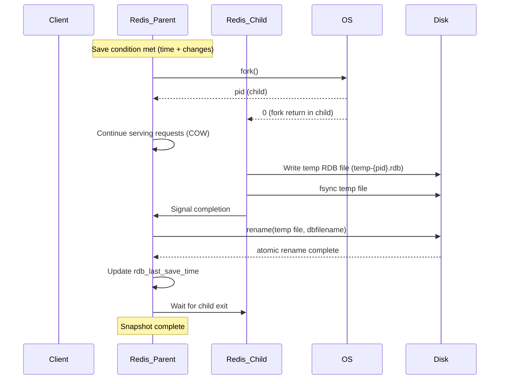

# Redis — Persistence — RDB Snapshots

## 1 — Overview

RDB (Redis Database) persistence creates point-in-time snapshots of the entire in-memory dataset to disk. It is the most commonly used persistence mechanism in production, valued for its compact file format, fast restart times, and suitability for backups.

RDB works by forking the Redis process. The child process writes a complete snapshot of all data to a temporary RDB file, then atomically renames it to the configured `dbfilename`. The parent process continues serving requests using copy-on-write (COW) semantics, ensuring zero downtime for snapshot creation.

**Key characteristics:**
- **Point-in-time snapshot** — captures the full dataset at a specific moment
- **Compact binary format** — compressed with LZF (default) or LZ4 (Redis 7.4+)
- **Fast restart** — loading an RDB file on startup is significantly faster than replaying AOF
- **Configurable frequency** — controlled by save intervals based on key change counts
- **fork() required** — creates a child process, which can be slow on large datasets

**When to use RDB:**
- Backups for disaster recovery
- Fast restarts after maintenance or reboot
- Replicas syncing from master (initial SYNC uses RDB)
- Use cases where losing a few minutes of data on crash is acceptable

```csharp
// StackExchange.Redis — Checking RDB persistence info
using StackExchange.Redis;

var muxer = await ConnectionMultiplexer.ConnectAsync("localhost:6379");
var server = muxer.GetServer("localhost:6379");

// Get persistence information
var persistenceInfo = await server.InfoAsync("persistence");
Console.WriteLine("Persistence Info:");
foreach (var kvp in persistenceInfo)
{
    Console.WriteLine($"  {kvp.Key} = {kvp.Value}");
}

// Check last RDB save time
var lastSave = await server.LastSaveAsync();
Console.WriteLine($"Last RDB save: {DateTimeOffset.FromUnixTimeSeconds(lastSave):O}");
```

## 2 — RDB Configuration

### 2.1 — Core Configuration Directives

| Directive | Default | Description |
|-----------|---------|-------------|
| `save` | `save 900 1\nsave 300 10\nsave 60 10000` | Snapshot triggers: `save <seconds> <changes>` |
| `dbfilename` | `dump.rdb` | Name of the RDB file |
| `dir` | `./` | Directory for RDB file (and AOF if enabled) |
| `rdbcompression` | `yes` | Enable LZF compression (use `lzf` or `lz4` in 7.4+) |
| `rdbchecksum` | `yes` | Add CRC64 checksum at end of RDB file |
| `rdb-del-sync-files` | `no` | Delete RDB files used for replication sync after loading |
| `rdb-save-incremental-fsync` | `yes` | fsync RDB file in 8 MB increments during save |

### 2.2 — Save Interval Configuration

The `save` directive can be specified multiple times in the configuration file. Redis triggers a BGSAVE when any of the conditions are met.

```conf
# redis.conf — default save configuration
save 900 1        # At least 1 key changed in 900 seconds (15 min)
save 300 10       # At least 10 keys changed in 300 seconds (5 min)
save 60 10000     # At least 10,000 keys changed in 60 seconds (1 min)

# Disable RDB persistence entirely
save ""

# Aggressive — snapshot every minute if any change
save 60 1
```

```csharp
// StackExchange.Redis — Reading and setting save configuration
using StackExchange.Redis;

var muxer = await ConnectionMultiplexer.ConnectAsync("localhost:6379");
var server = muxer.GetServer("localhost:6379");

// Read current save config
var saveConfigs = await server.ConfigGetAsync("save");
Console.WriteLine("Save configurations:");
foreach (var config in saveConfigs)
{
    Console.WriteLine($"  save {config.Value}");
}

// Set custom save intervals
await server.ConfigSetAsync("save", "900 1 300 10 60 10000");

// Verify
var updated = await server.ConfigGetAsync("save");
foreach (var c in updated)
{
    Console.WriteLine($"  save {c.Value}");
}
```

### 2.3 — RDB File Location and Naming

```conf
# Specify the directory for RDB and AOF files
dir /var/lib/redis

# RDB file name
dbfilename dump.rdb

# Full path: /var/lib/redis/dump.rdb
```

```csharp
// StackExchange.Redis — Checking RDB file path
using StackExchange.Redis;

var muxer = await ConnectionMultiplexer.ConnectAsync("localhost:6379");
var server = muxer.GetServer("localhost:6379");

var dir = await server.ConfigGetAsync("dir");
var filename = await server.ConfigGetAsync("dbfilename");
Console.WriteLine($"RDB path: {dir[0].Value}/{filename[0].Value}");
```

### 2.4 — Compression Settings

```conf
# Enable RDB compression (LZF by default)
rdbcompression yes

# Redis 7.4+ supports LZ4 for faster compression/decompression
# Use: rdbcompression lz4
```

RDB compression reduces disk space but adds CPU overhead during save. On CPU-bound instances, disabling compression can reduce save time at the cost of larger files.

### 2.5 — Checksum Settings

```conf
# Add CRC64 checksum to RDB file (detects corruption)
rdbchecksum yes

# Disable to save ~10% CPU during save/load (increases corruption risk)
rdbchecksum no
```

The CRC64 checksum adds approximately 10 bytes to the RDB file. When loading, Redis verifies the checksum and refuses to load corrupted files.

## 3 — Save Mechanism: fork(), COW, and Atomic Rename

### 3.1 — The RDB Save Lifecycle



### 3.2 — The fork() Call

When Redis decides to create an RDB snapshot, it calls `fork()`:

1. **Parent process:** The original Redis process that continues serving all client requests.
2. **Child process:** A near-exact copy of the parent's memory, created by the OS's copy-on-write mechanism.
3. **Return values:** Parent receives the child PID. Child receives 0.

The fork() call itself can take significant time (hundreds of milliseconds to seconds) on large instances because the OS must duplicate page table entries. Redis logs this as `Fork time:` in the log file.

```csharp
// StackExchange.Redis — Checking fork timing
using StackExchange.Redis;

async Task<TimeSpan?> GetLastForkDurationAsync(IConnectionMultiplexer muxer)
{
    var server = muxer.GetServer(muxer.GetEndPoints().First());
    var info = await server.InfoAsync("stats");
    foreach (var kvp in info)
    {
        if (kvp.Key == "latest_fork_usec")
        {
            return TimeSpan.FromMicroseconds(double.Parse(kvp.Value));
        }
    }
    return null;
}
```

### 3.3 — Copy-on-Write (COW) Semantics

After fork(), the parent and child share the same physical memory pages. When either process modifies a page, the OS creates a private copy for the modifying process. This is copy-on-write.

**Implications:**
- If no writes occur during the snapshot, the child needs no additional memory (all pages are shared).
- If the parent writes heavily during the save, modified pages are duplicated, increasing memory usage.
- The child's memory usage (RSS) can grow up to the full dataset size if the parent modifies every page during the save.

**Memory equation during BGSAVE:**
```
Total RSS ≈ dataset * (1 + write_fraction_during_save)
```

If 50% of pages are modified during the save, RSS grows to 1.5× the dataset size.

```csharp
// StackExchange.Redis — Monitoring COW memory during BGSAVE
using StackExchange.Redis;

async Task MonitorBgsaveCowMemoryAsync(IConnectionMultiplexer muxer, int checkIntervalMs = 1000)
{
    var server = muxer.GetServer(muxer.GetEndPoints().First());
    var db = muxer.GetDatabase();

    while (true)
    {
        var info = await db.ExecuteAsync("INFO", "persistence");
        var infoStr = info.ToString();
        foreach (var line in infoStr.Split('\n'))
        {
            if (line.StartsWith("rdb_changed_since_last_save:"))
                Console.WriteLine($"Changed since last save: {line.Split(':')[1]}");
            if (line.StartsWith("rdb_bgsave_in_progress:"))
                Console.WriteLine($"BGSAVE in progress: {line.Split(':')[1]}");
            if (line.StartsWith("rdb_current_bgsave_time_sec:"))
                Console.WriteLine($"Current BGSAVE time: {line.Split(':')[1]} sec");
        }

        await Task.Delay(checkIntervalMs);
    }
}
```

### 3.4 — Atomic Rename

The child writes to a temporary file: `temp-{pid}.rdb`. When the child finishes writing and fsyncs, it signals the parent. The parent then performs an atomic `rename()` system call to replace the old RDB file with the new one.

**Why atomic rename matter:**
- If the save fails (crash, disk full), the old RDB file remains intact.
- If the parent crashes during rename, the file system either has the old or new RDB — never a partial file.
- The rename is an atomic operation on POSIX file systems.

```csharp
// StackExchange.Redis — Checking RDB save status
using StackExchange.Redis;

public class RdbStatus
{
    private readonly IDatabase _db;

    public RdbStatus(IConnectionMultiplexer muxer)
    {
        _db = muxer.GetDatabase();
    }

    public async Task<bool> IsBgsaveRunningAsync()
    {
        var info = await _db.ExecuteAsync("INFO", "persistence");
        var infoStr = info.ToString();
        foreach (var line in infoStr.Split('\n'))
        {
            if (line.StartsWith("rdb_bgsave_in_progress:") && line.EndsWith("1"))
                return true;
        }
        return false;
    }

    public async Task<DateTime?> GetLastSaveTimeAsync()
    {
        var info = await _db.ExecuteAsync("INFO", "persistence");
        var infoStr = info.ToString();
        foreach (var line in infoStr.Split('\n'))
        {
            if (line.StartsWith("rdb_last_save_time:"))
            {
                var timestamp = long.Parse(line.Split(':')[1].Trim());
                return DateTimeOffset.FromUnixTimeSeconds(timestamp).DateTime;
            }
        }
        return null;
    }

    public async Task<string?> GetLastBgsaveStatusAsync()
    {
        var info = await _db.ExecuteAsync("INFO", "persistence");
        var infoStr = info.ToString();
        foreach (var line in infoStr.Split('\n'))
        {
            if (line.StartsWith("rdb_last_bgsave_status:"))
                return line.Split(':')[1].Trim();
        }
        return null;
    }
}
```

## 4 — RDB Commands

### 4.1 — BGSAVE (Background Save)

```bash
redis-cli BGSAVE
```

The recommended way to trigger an RDB snapshot. Returns `Background saving started` immediately. The server continues serving requests while the child creates the snapshot.

```csharp
// StackExchange.Redis — Trigger BGSAVE
using StackExchange.Redis;

var muxer = await ConnectionMultiplexer.ConnectAsync("localhost:6379");
var server = muxer.GetServer("localhost:6379");

// Using IServer
await server.SaveAsync(SaveType.Background);

// Alternative via IDatabase.ExecuteAsync
var db = muxer.GetDatabase();
var result = await db.ExecuteAsync("BGSAVE");
Console.WriteLine(result.ToString()); // "Background saving started"
```

**BGSAVE SCHEDULE (Redis 5.0+):**
```bash
redis-cli BGSAVE SCHEDULE
```
If another BGSAVE is running, this schedules a new save to run as soon as the current one finishes, rather than returning an error.

### 4.2 — SAVE (Blocking Save)

```bash
redis-cli SAVE
```

Creates a snapshot **in the main thread**, blocking all client requests until completion. Useful for maintenance windows when you need to ensure no fork overhead. **Never use SAVE in production.**

```csharp
// StackExchange.Redis — Trigger SAVE (blocking)
using StackExchange.Redis;

var muxer = await ConnectionMultiplexer.ConnectAsync("localhost:6379");
var server = muxer.GetServer("localhost:6379");

// Warning: blocks Redis for the duration of the save
await server.SaveAsync(SaveType.ForegroundSave);
```

### 4.3 — LASTSAVE

```bash
redis-cli LASTSAVE
```

Returns the Unix timestamp of the last successful RDB save. Useful for monitoring staleness of the snapshot on disk.

```csharp
// StackExchange.Redis — LASTSAVE
using StackExchange.Redis;

var muxer = await ConnectionMultiplexer.ConnectAsync("localhost:6379");
var server = muxer.GetServer("localhost:6379");
var lastSave = await server.LastSaveAsync();
Console.WriteLine($"Last save: {DateTimeOffset.FromUnixTimeSeconds(lastSave):O}");
```

### 4.4 — DEBUG RELOAD

```bash
redis-cli DEBUG RELOAD
```

Reloads the current RDB file. Useful for testing RDB load behavior. **Never use in production.**

### 4.5 — SHUTDOWN with Save

```bash
redis-cli SHUTDOWN SAVE
redis-cli SHUTDOWN NOSAVE
```

- `SHUTDOWN SAVE` — Performs a blocking SAVE before shutting down.
- `SHUTDOWN NOSAVE` — Shuts down without saving (data loss).
- `SHUTDOWN` (no flag) — Saves if RDB persistence is configured.

```csharp
// StackExchange.Redis — Shutdown with save
using StackExchange.Redis;

var muxer = await ConnectionMultiplexer.ConnectAsync("localhost:6379");
var server = muxer.GetServer("localhost:6379");

// Shutdown and save (blocking)
await server.ShutdownAsync(ShutdownMode.Always);

// Shutdown without save
await server.ShutdownAsync(ShutdownMode.Never);
```

## 5 — Monitoring & Metrics

### 5.1 — INFO Persistence Section

```bash
redis-cli INFO persistence
```

| Metric | Description |
|--------|-------------|
| `rdb_changes_since_last_save` | Number of key changes since last RDB save |
| `rdb_bgsave_in_progress` | 1 if BGSAVE is currently running |
| `rdb_last_save_time` | Unix timestamp of last successful RDB save |
| `rdb_last_bgsave_status` | `ok` or `err` — status of last BGSAVE |
| `rdb_last_bgsave_time_sec` | Duration of last BGSAVE in seconds |
| `rdb_current_bgsave_time_sec` | Elapsed seconds of current BGSAVE (if any) |
| `rdb_last_cow_size` | Copy-on-write memory during last BGSAVE (in bytes) |

```csharp
// StackExchange.Redis — Full persistence monitoring
using StackExchange.Redis;

public class PersistenceMonitor
{
    private readonly IConnectionMultiplexer _muxer;
    private readonly IDatabase _db;

    public PersistenceMonitor(IConnectionMultiplexer muxer)
    {
        _muxer = muxer;
        _db = muxer.GetDatabase();
    }

    public async Task<RdbPersistenceInfo> GetRdbInfoAsync()
    {
        var info = await _db.ExecuteAsync("INFO", "persistence");
        var infoStr = info.ToString();
        var rdb = new RdbPersistenceInfo();

        foreach (var line in infoStr.Split('\n', StringSplitOptions.RemoveEmptyEntries))
        {
            var parts = line.Split(':');
            if (parts.Length < 2) continue;
            var key = parts[0].Trim();
            var val = parts[1].Trim();

            switch (key)
            {
                case "rdb_changes_since_last_save":
                    rdb.ChangesSinceLastSave = long.Parse(val);
                    break;
                case "rdb_bgsave_in_progress":
                    rdb.BgsaveInProgress = val == "1";
                    break;
                case "rdb_last_save_time":
                    rdb.LastSaveTime = DateTimeOffset.FromUnixTimeSeconds(long.Parse(val)).DateTime;
                    break;
                case "rdb_last_bgsave_status":
                    rdb.LastBgsaveStatus = val;
                    break;
                case "rdb_last_bgsave_time_sec":
                    rdb.LastBgsaveDurationSec = long.Parse(val);
                    break;
                case "rdb_current_bgsave_time_sec":
                    rdb.CurrentBgsaveElapsedSec = long.Parse(val);
                    break;
                case "rdb_last_cow_size":
                    rdb.LastCowSizeBytes = long.Parse(val);
                    break;
            }
        }

        return rdb;
    }
}

public class RdbPersistenceInfo
{
    public long ChangesSinceLastSave { get; set; }
    public bool BgsaveInProgress { get; set; }
    public DateTime? LastSaveTime { get; set; }
    public string LastBgsaveStatus { get; set; } = "unknown";
    public long LastBgsaveDurationSec { get; set; }
    public long CurrentBgsaveElapsedSec { get; set; }
    public long LastCowSizeBytes { get; set; }
    public double LastCowSizeMb => Math.Round(LastCowSizeBytes / 1024.0 / 1024.0, 2);
}
```

### 5.2 — INFO Stats Section — Latest Fork

```bash
redis-cli INFO stats
```

| Metric | Description |
|--------|-------------|
| `latest_fork_usec` | Microseconds taken by the last fork() call |

A high `latest_fork_usec` value ( > 1 second) indicates the instance has a very large memory footprint. This is a warning sign for potential latency during BGSAVE.

```csharp
// StackExchange.Redis — Check fork duration
using StackExchange.Redis;

async Task<double> GetLastForkMsAsync(IConnectionMultiplexer muxer)
{
    var db = muxer.GetDatabase();
    var info = await db.ExecuteAsync("INFO", "stats");
    var infoStr = info.ToString();
    foreach (var line in infoStr.Split('\n'))
    {
        if (line.StartsWith("latest_fork_usec:"))
        {
            var microsec = double.Parse(line.Split(':')[1].Trim());
            return microsec / 1000.0;
        }
    }
    return -1;
}
```

### 5.3 — Monitoring RDB File Size

```bash
ls -lh /var/lib/redis/dump.rdb
```

The RDB file is typically much smaller than the dataset in memory due to compression. A 10 GB dataset often compresses to 3-5 GB RDB file.

```csharp
// StackExchange.Redis — Approximate RDB file size via INFO
// (No direct command — use server-side info or OS monitoring)
using StackExchange.Redis;

async Task<long> GetRdbFileSizeViaKeyspaceAsync(IConnectionMultiplexer muxer)
{
    // Estimate based on total memory usage (rough approximation)
    var db = muxer.GetDatabase();
    var info = await db.ExecuteAsync("INFO", "memory");
    var infoStr = info.ToString();
    foreach (var line in infoStr.Split('\n'))
    {
        if (line.StartsWith("used_memory_dataset:"))
            return long.Parse(line.Split(':')[1].Trim());
    }
    return -1;
}
```

### 5.4 — Alerts for RDB Failures

```csharp
// StackExchange.Redis — RDB failure monitoring
using StackExchange.Redis;

public class RdbAlertChecker
{
    private readonly IConnectionMultiplexer _muxer;
    private readonly int _maxStalenessMinutes;

    public RdbAlertChecker(IConnectionMultiplexer muxer, int maxStalenessMinutes = 60)
    {
        _muxer = muxer;
        _maxStalenessMinutes = maxStalenessMinutes;
    }

    public async Task<RdbHealth> CheckHealthAsync()
    {
        var db = _muxer.GetDatabase();
        var info = await db.ExecuteAsync("INFO", "persistence");
        var infoStr = info.ToString();
        string? lastStatus = null;
        long lastSaveTime = 0;

        foreach (var line in infoStr.Split('\n'))
        {
            if (line.StartsWith("rdb_last_bgsave_status:"))
                lastStatus = line.Split(':')[1].Trim();
            if (line.StartsWith("rdb_last_save_time:"))
                lastSaveTime = long.Parse(line.Split(':')[1].Trim());
        }

        var health = new RdbHealth
        {
            LastSaveSuccessful = lastStatus == "ok",
            LastSaveTime = DateTimeOffset.FromUnixTimeSeconds(lastSaveTime).DateTime,
            IsStale = (DateTime.UtcNow - DateTimeOffset.FromUnixTimeSeconds(lastSaveTime).DateTime).TotalMinutes > _maxStalenessMinutes
        };

        return health;
    }
}

public class RdbHealth
{
    public bool LastSaveSuccessful { get; set; }
    public DateTime LastSaveTime { get; set; }
    public bool IsStale { get; set; }
}
```

## 6 — StackExchange.Redis Integration

### 6.1 — Checking RDB and Persistence via IServer

```csharp
using StackExchange.Redis;

public class RdbManager
{
    private readonly IConnectionMultiplexer _muxer;
    private readonly IServer _server;
    private readonly IDatabase _db;

    public RdbManager(string connectionString)
    {
        _muxer = ConnectionMultiplexer.Connect(connectionString);
        _server = _muxer.GetServer(_muxer.GetEndPoints().First());
        _db = _muxer.GetDatabase();
    }

    /// <summary>
    /// Returns detailed persistence information from the Redis server.
    /// </summary>
    public async Task<Dictionary<string, string>> GetPersistenceInfoAsync()
    {
        var info = await _server.InfoAsync("persistence");
        var result = new Dictionary<string, string>();
        foreach (var kvp in info)
        {
            result[kvp.Key] = kvp.Value;
        }
        return result;
    }

    /// <summary>
    /// Triggers a background RDB save.
    /// </summary>
    public async Task<string> TriggerBgsaveAsync()
    {
        try
        {
            await _server.SaveAsync(SaveType.Background);
            return "BGSAVE triggered successfully";
        }
        catch (RedisServerException ex)
        {
            return $"BGSAVE failed: {ex.Message}";
        }
    }

    /// <summary>
    /// Checks whether a BGSAVE is currently in progress.
    /// </summary>
    public async Task<bool> IsBgsaveRunningAsync()
    {
        var info = await _server.InfoAsync("persistence");
        foreach (var kvp in info)
        {
            if (kvp.Key == "rdb_bgsave_in_progress" && kvp.Value == "1")
                return true;
        }
        return false;
    }

    /// <summary>
    /// Waits for the current BGSAVE to finish (with timeout).
    /// </summary>
    public async Task<bool> WaitForBgsaveCompletionAsync(TimeSpan timeout)
    {
        var deadline = DateTime.UtcNow + timeout;
        while (DateTime.UtcNow < deadline)
        {
            if (!await IsBgsaveRunningAsync())
                return true;
            await Task.Delay(500);
        }
        return false; // timed out
    }

    /// <summary>
    /// Gets the last RDB save time as a DateTime.
    /// </summary>
    public async Task<DateTime?> GetLastSaveTimeAsync()
    {
        var lastSave = await _server.LastSaveAsync();
        return DateTimeOffset.FromUnixTimeSeconds(lastSave).DateTime;
    }
}
```

### 6.2 — Async Health Check for Persistence

```csharp
using StackExchange.Redis;

public class RedisPersistenceHealthCheck
{
    private readonly IConnectionMultiplexer _muxer;
    private readonly ILogger _logger;
    private readonly int _rdbStaleThresholdMinutes;

    public RedisPersistenceHealthCheck(
        IConnectionMultiplexer muxer,
        ILogger logger,
        int rdbStaleThresholdMinutes = 30)
    {
        _muxer = muxer;
        _logger = logger;
        _rdbStaleThresholdMinutes = rdbStaleThresholdMinutes;
    }

    public async Task<PersistenceHealth> CheckAsync()
    {
        var health = new PersistenceHealth();
        try
        {
            var db = _muxer.GetDatabase();
            var info = await db.ExecuteAsync("INFO", "persistence");
            var infoStr = info.ToString();

            foreach (var line in infoStr.Split('\n', StringSplitOptions.RemoveEmptyEntries))
            {
                var parts = line.Split(':');
                if (parts.Length < 2) continue;
                var key = parts[0].Trim();
                var val = parts[1].Trim();

                switch (key)
                {
                    case "rdb_last_bgsave_status":
                        health.RdbLastStatus = val;
                        break;
                    case "rdb_last_save_time":
                        var unixTime = long.Parse(val);
                        health.RdbLastSaveTime = DateTimeOffset.FromUnixTimeSeconds(unixTime).DateTime;
                        break;
                    case "rdb_bgsave_in_progress":
                        health.RdbInProgress = val == "1";
                        break;
                    case "rdb_changes_since_last_save":
                        health.ChangesSinceLastSave = long.Parse(val);
                        break;
                    case "rdb_last_cow_size":
                        health.LastCowSizeBytes = long.Parse(val);
                        break;
                }
            }

            // Determine staleness
            if (health.RdbLastSaveTime.HasValue)
            {
                var elapsed = DateTime.UtcNow - health.RdbLastSaveTime.Value;
                health.RdbIsStale = elapsed.TotalMinutes > _rdbStaleThresholdMinutes;
            }

            health.RdbHealthy = health.RdbLastStatus == "ok" && !health.RdbIsStale;
        }
        catch (Exception ex)
        {
            _logger.Error("Failed to check Redis persistence", ex);
            health.RdbHealthy = false;
            health.Exception = ex.Message;
        }

        return health;
    }
}

public class PersistenceHealth
{
    public bool RdbHealthy { get; set; }
    public string RdbLastStatus { get; set; } = "unknown";
    public DateTime? RdbLastSaveTime { get; set; }
    public bool RdbInProgress { get; set; }
    public bool RdbIsStale { get; set; }
    public long ChangesSinceLastSave { get; set; }
    public long LastCowSizeBytes { get; set; }
    public string? Exception { get; set; }
}
```

### 6.3 — Error Handling for RDB Operations

```csharp
using StackExchange.Redis;

public class RdbOperationException : Exception
{
    public RdbOperationException(string message) : base(message) { }
    public RdbOperationException(string message, Exception inner) : base(message, inner) { }
}

public class SafeRdbManager
{
    private readonly IConnectionMultiplexer _muxer;

    public SafeRdbManager(IConnectionMultiplexer muxer)
    {
        _muxer = muxer;
    }

    public async Task<bool> TrySaveAsync()
    {
        try
        {
            var server = _muxer.GetServer(_muxer.GetEndPoints().First());
            await server.SaveAsync(SaveType.Background);
            return true;
        }
        catch (RedisServerException ex) when (ex.Message.Contains("background save already in progress"))
        {
            // BGSAVE already running — not an error
            return true;
        }
        catch (RedisConnectionException ex)
        {
            throw new RdbOperationException("Redis connection lost during BGSAVE", ex);
        }
        catch (Exception ex)
        {
            throw new RdbOperationException($"Unexpected error during BGSAVE: {ex.Message}", ex);
        }
    }

    public async Task<bool> TrySaveAndWaitAsync(TimeSpan timeout)
    {
        if (!await TrySaveAsync())
            return false;

        // Wait for BGSAVE to complete
        var deadline = DateTime.UtcNow + timeout;
        while (DateTime.UtcNow < deadline)
        {
            var server = _muxer.GetServer(_muxer.GetEndPoints().First());
            var info = await server.InfoAsync("persistence");
            var inProgress = info.Any(kvp => kvp.Key == "rdb_bgsave_in_progress" && kvp.Value == "1");

            if (!inProgress)
            {
                // Verify last save was OK
                var lastStatus = info.FirstOrDefault(kvp => kvp.Key == "rdb_last_bgsave_status");
                return lastStatus.Value == "ok";
            }

            await Task.Delay(500);
        }

        return false; // timed out
    }
}
```

### 6.4 — Monitoring COW Memory During BGSAVE

```csharp
using StackExchange.Redis;

public class CowMemoryMonitor
{
    private readonly IConnectionMultiplexer _muxer;

    public CowMemoryMonitor(IConnectionMultiplexer muxer)
    {
        _muxer = muxer;
    }

    public async Task<CowMetrics> GetCowMetricsAsync()
    {
        var db = _muxer.GetDatabase();
        var info = await db.ExecuteAsync("INFO", "persistence");
        var infoStr = info.ToString();
        var metrics = new CowMetrics();

        foreach (var line in infoStr.Split('\n'))
        {
            if (line.StartsWith("rdb_last_cow_size:"))
                metrics.LastCowSizeBytes = long.Parse(line.Split(':')[1].Trim());
            if (line.StartsWith("rdb_current_cow_size:"))
                metrics.CurrentCowSizeBytes = long.Parse(line.Split(':')[1].Trim());
            if (line.StartsWith("rdb_current_cow_size_age:"))
                metrics.CurrentCowAgeSec = long.Parse(line.Split(':')[1].Trim());
        }

        // Also check memory info for overall RSS
        var memInfo = await db.ExecuteAsync("INFO", "memory");
        var memStr = memInfo.ToString();
        foreach (var line in memStr.Split('\n'))
        {
            if (line.StartsWith("used_memory_rss:"))
                metrics.RssBytes = long.Parse(line.Split(':')[1].Trim());
            if (line.StartsWith("used_memory:"))
                metrics.UsedMemoryBytes = long.Parse(line.Split(':')[1].Trim());
        }

        return metrics;
    }
}

public class CowMetrics
{
    public long LastCowSizeBytes { get; set; }
    public long CurrentCowSizeBytes { get; set; }
    public long CurrentCowAgeSec { get; set; }
    public long RssBytes { get; set; }
    public long UsedMemoryBytes { get; set; }
    public double CowOverheadPercent =>
        RssBytes > 0 ? Math.Round((double)(RssBytes - UsedMemoryBytes) / UsedMemoryBytes * 100, 2) : 0;
}
```

### 6.5 — Restoring from RDB (External Process)

Restoring from an RDB file requires a Redis restart. StackExchange.Redis does not provide a direct API for this; it is a server-side operation.

```csharp
// StackExchange.Redis — This code runs BEFORE connecting to Redis to restore from RDB
// In practice, restoring from RDB involves:
//   1. Stop Redis
//   2. Copy RDB file to Redis data directory
//   3. Start Redis
// This is typically orchestrated via scripts, not StackExchange.Redis.

// However, you can check if Redis loaded from RDB on startup:
using StackExchange.Redis;

async Task CheckRdbLoadAsync(IConnectionMultiplexer muxer)
{
    var db = muxer.GetDatabase();
    var info = await db.ExecuteAsync("INFO", "persistence");
    var infoStr = info.ToString();
    foreach (var line in infoStr.Split('\n'))
    {
        if (line.StartsWith("rdb_last_load_status:"))
            Console.WriteLine($"Last RDB load: {line.Split(':')[1].Trim()}");
        if (line.StartsWith("loading_total_duration:"))
            Console.WriteLine($"RDB load duration: {line.Split(':')[1].Trim()} ms");
    }
}
```

## 7 — RDB in Production

### 7.1 — Sizing Memory for BGSAVE

The most critical production consideration is ensuring enough memory for fork() COW overhead.

**Rule of thumb:** Set `maxmemory` to no more than **70-80%** of the instance's physical RAM. The remaining 20-30% is headroom for:
- Fork COW during BGSAVE
- AOF rewrite COW (if AOF is enabled)
- Connection output buffers
- Replication buffers
- Lua script memory

```csharp
// StackExchange.Redis — Memory sizing calculation
using StackExchange.Redis;

class MemorySizer
{
    public static double CalculateRecommendedMaxMemory(long totalInstanceRamBytes, double safetyFactor = 0.75)
    {
        return (long)(totalInstanceRamBytes * safetyFactor);
    }

    public static async Task<MemorySizingRecommendation> GetRecommendationAsync(IServer server)
    {
        var memInfo = await server.InfoAsync("memory");
        long usedMemory = 0, rss = 0;
        foreach (var kvp in memInfo)
        {
            if (kvp.Key == "used_memory") usedMemory = long.Parse(kvp.Value);
            if (kvp.Key == "used_memory_rss") rss = long.Parse(kvp.Value);
        }

        var rec = new MemorySizingRecommendation
        {
            CurrentUsedMemory = usedMemory,
            CurrentRss = rss,
            RecommendedMaxMemory = (long)(rss * 0.75),
            HeadroomBytes = (long)(rss * 0.25)
        };

        return rec;
    }
}

class MemorySizingRecommendation
{
    public long CurrentUsedMemory { get; set; }
    public long CurrentRss { get; set; }
    public long RecommendedMaxMemory { get; set; }
    public long HeadroomBytes { get; set; }
}
```

### 7.2 — Scheduling BGSAVE Off-Peak

While BGSAVE is designed to be non-blocking, the fork() call and COW memory overhead can impact latency. Consider scheduling BGSAVE during low-traffic periods.

```csharp
// StackExchange.Redis — Schedule BGSAVE during low traffic
using StackExchange.Redis;

class ScheduledBgsave
{
    private readonly IConnectionMultiplexer _muxer;
    private readonly TimeSpan _saveTimeOfDay; // e.g., 03:00

    public ScheduledBgsave(IConnectionMultiplexer muxer, TimeSpan saveTimeOfDay)
    {
        _muxer = muxer;
        _saveTimeOfDay = saveTimeOfDay;
    }

    public async Task RunSchedulerAsync()
    {
        while (true)
        {
            var now = DateTime.UtcNow.TimeOfDay;
            var nextRun = _saveTimeOfDay;
            if (nextRun <= now)
                nextRun = nextRun.Add(TimeSpan.FromDays(1));

            var delay = nextRun - now;
            await Task.Delay(delay);

            await TriggerSaveWithRetryAsync();
        }
    }

    private async Task TriggerSaveWithRetryAsync(int maxRetries = 3)
    {
        for (int i = 0; i < maxRetries; i++)
        {
            try
            {
                var server = _muxer.GetServer(_muxer.GetEndPoints().First());
                await server.SaveAsync(SaveType.Background);
                return;
            }
            catch (RedisServerException ex) when (ex.Message.Contains("already in progress"))
            {
                await Task.Delay(TimeSpan.FromSeconds(30));
            }
        }
    }
}
```

### 7.3 — RDB Backup Strategy

RDB files are ideal for backups because they are compact and can be copied while Redis is running (the rename is atomic).

```csharp
// StackExchange.Redis — Coordinating RDB backup with external tooling
using StackExchange.Redis;

class RdbBackupCoordinator
{
    private readonly IConnectionMultiplexer _muxer;
    private readonly string _backupDirectory;

    public RdbBackupCoordinator(IConnectionMultiplexer muxer, string backupDirectory)
    {
        _muxer = muxer;
        _backupDirectory = backupDirectory;
    }

    public async Task<bool> PrepareForBackupAsync()
    {
        // 1. Ensure no BGSAVE is running
        var server = _muxer.GetServer(_muxer.GetEndPoints().First());
        var info = await server.InfoAsync("persistence");
        var inProgress = info.Any(kvp => kvp.Key == "rdb_bgsave_in_progress" && kvp.Value == "1");
        if (inProgress)
        {
            // Wait for current save to complete
            while (true)
            {
                info = await server.InfoAsync("persistence");
                inProgress = info.Any(kvp => kvp.Key == "rdb_bgsave_in_progress" && kvp.Value == "1");
                if (!inProgress) break;
                await Task.Delay(1000);
            }
        }

        // 2. Get current RDB file info
        var dir = (await server.ConfigGetAsync("dir"))[0].Value;
        var filename = (await server.ConfigGetAsync("dbfilename"))[0].Value;
        var rdbPath = Path.Combine(dir, filename);

        // 3. Copy RDB to backup location
        var backupFileName = $"dump_{DateTime.UtcNow:yyyyMMddHHmmss}.rdb";
        var backupPath = Path.Combine(_backupDirectory, backupFileName);

        // The actual file copy happens externally (StackExchange.Redis doesn't copy files)
        Console.WriteLine($"Backup ready: copy {rdbPath} to {backupPath}");
        return true;
    }
}
```

### 7.4 — RDB with Replication

When a replica connects to a master, the master performs a BGSAVE (unless a newer RDB is available) and sends the RDB file to the replica. This is the initial synchronization step.

```csharp
// StackExchange.Redis — Check replication + RDB status
using StackExchange.Redis;

async Task CheckReplicationSyncAsync(IConnectionMultiplexer muxer)
{
    var server = muxer.GetServer(muxer.GetEndPoints().First());
    var replicationInfo = await server.InfoAsync("replication");

    foreach (var kvp in replicationInfo)
    {
        if (kvp.Key == "master_sync_in_progress")
            Console.WriteLine($"Sync in progress: {kvp.Value}");
        if (kvp.Key == "master_last_io_seconds_ago")
            Console.WriteLine($"Last I/O: {kvp.Value}s ago");
        if (kvp.Key == "master_sync_total_bytes")
            Console.WriteLine($"Sync total bytes: {kvp.Value}");
    }
}
```

## 8 — Comparison with AOF

### 8.1 — RDB vs AOF Quick Comparison

| Factor | RDB | AOF |
|--------|-----|-----|
| **Data loss window** | Up to save interval (default minutes) | Up to 1 second (everysec) or 0 (always) |
| **File size** | Compact (compressed binary) | Larger (append-only log, rewritten) |
| **Restart speed** | Fast (load binary snapshot) | Slow (replay all commands) |
| **Backup suitability** | Excellent (single file, compressed) | Poor (large, many files without rewrite) |
| **Human-readable** | No (binary) | Yes (protocol text) |
| **Write performance** | No impact (BGSAVE uses fork) | Modest impact (appendfsync) |
| **Memory overhead** | High during fork (COW) | High during AOF rewrite (fork) |
| **Corruption recovery** | Replace with backup | redis-check-aof tool |

### 8.2 — When to Choose RDB Over AOF

- **Backup-focused workloads:** RDB files are ideal for periodic backups to S3/Blob Storage.
- **Cache-only Redis:** Data loss of a few minutes is acceptable → RDB is simpler.
- **Fast restart required:** RDB loads much faster than AOF, critical for high availability failover.
- **Disk space constrained:** RDB is 3-10× smaller than AOF.
- **Replica sync:** Masters use RDB for initial replica synchronization.

### 8.3 — When to Avoid RDB

- **Sub-second durability required:** RDB can lose minutes of data. Use AOF or RDB+AOF.
- **Very large datasets (> 50 GB):** Fork time and COW memory become problematic. Consider AOF with rewrite tuning or RDB+AOF.
- **Write-heavy workloads:** High write rates during BGSAVE cause significant COW memory usage.

## 9 — Gotchas & Pitfalls

### 9.1 — fork() Latency on Large Instances

**Problem:** The fork() system call duplicates page table entries. On instances with 50+ GB of memory, fork() can take 1-5 seconds, during which the parent process is blocked. All client requests are delayed during this time.

**Solution:**
- Keep single Redis instances under 25-50 GB.
- Use Redis Cluster to distribute data across smaller nodes.
- Monitor `latest_fork_usec` in INFO stats.
- Consider using Redis on more efficient hardware (faster CPU, larger page sizes).

```csharp
// StackExchange.Redis — Alert on long fork times
using StackExchange.Redis;

async Task CheckForkTimeAsync(IConnectionMultiplexer muxer, double warningMs = 500)
{
    var db = muxer.GetDatabase();
    var info = await db.ExecuteAsync("INFO", "stats");
    var infoStr = info.ToString();
    foreach (var line in infoStr.Split('\n'))
    {
        if (line.StartsWith("latest_fork_usec:"))
        {
            var forkUsec = double.Parse(line.Split(':')[1].Trim());
            var forkMs = forkUsec / 1000.0;
            if (forkMs > warningMs)
            {
                Console.WriteLine($"WARNING: Fork took {forkMs:F1} ms (threshold: {warningMs} ms)");
            }
        }
    }
}
```

### 9.2 — COW Memory Can Double RSS

**Problem:** During BGSAVE, if the write rate is high, the parent process modifies many memory pages. Each modified page is copied (COW), causing RSS to approach 2× the dataset size. If the machine runs out of memory, the OOM killer may terminate Redis.

**Solution:**
- Reserve 20-50% headroom above `maxmemory` for COW.
- Configure `maxmemory` to leave enough system memory.
- Use `vm.overcommit_memory=1` in the OS (prevents fork failure but not OOM).
- Schedule BGSAVE during low-write periods.

```csharp
// StackExchange.Redis — Estimate safe maxmemory based on COW headroom
using StackExchange.Redis;

async Task<long> EstimateSafeMaxmemoryAsync(IConnectionMultiplexer muxer, double cowHeadroomPercent = 0.3)
{
    var db = muxer.GetDatabase();
    var memInfo = await db.ExecuteAsync("INFO", "memory");
    var memStr = memInfo.ToString();
    long rss = 0;

    foreach (var line in memStr.Split('\n'))
    {
        if (line.StartsWith("used_memory_rss:"))
        {
            rss = long.Parse(line.Split(':')[1].Trim());
            break;
        }
    }

    // Safe maxmemory = total RSS / (1 + COW headroom)
    return (long)(rss / (1 + cowHeadroomPercent));
}
```

### 9.3 — RDB Saves Fail on Disk Full

**Problem:** If the disk is full, the child process cannot write the temp RDB file. The BGSAVE fails, and `rdb_last_bgsave_status` becomes `err`.

**Solution:**
- Monitor disk space on the Redis data volume.
- Set up alerts for disk usage > 80%.
- Use a separate disk or partition for RDB/AOF files.
- Configure `stop-writes-on-bgsave-error yes` to prevent writes when BGSAVE fails (default behavior).

```csharp
// StackExchange.Redis — Check BGSAVE error status
using StackExchange.Redis;

async Task<bool> HasBgsaveErrorAsync(IConnectionMultiplexer muxer)
{
    var server = muxer.GetServer(muxer.GetEndPoints().First());
    var info = await server.InfoAsync("persistence");
    foreach (var kvp in info)
    {
        if (kvp.Key == "rdb_last_bgsave_status" && kvp.Value == "err")
            return true;
    }
    return false;
}
```

### 9.4 — Data Loss Between Saves

**Problem:** With default save intervals (900s / 300s / 60s), Redis can lose up to 15 minutes of data on a crash. For many applications this is acceptable, but for transactional data it is not.

**Solution:**
- Shorten save intervals (e.g., `save 60 1` — save every minute if any change).
- Use AOF for better durability.
- Use RDB+AOF combined mode (see [[8.993 — Redis — Persistence — RDB + AOF Combined]]).

### 9.5 — SAVE Blocks All Clients

**Problem:** The `SAVE` command (foreground) blocks the Redis event loop. No client requests are processed during the save. On a large instance with 50 GB of data, this can block for minutes.

**Solution:** Never use `SAVE` in production. Always use `BGSAVE`. If you must use `SAVE` (e.g., during maintenance), ensure the instance is not serving traffic.

```csharp
// StackExchange.Redis — Never call this in production
public async Task DangerousSaveAsync(IConnectionMultiplexer muxer)
{
    var server = muxer.GetServer(muxer.GetEndPoints().First());
    await server.SaveAsync(SaveType.ForegroundSave); // BLOCKS REDIS
}
```

### 9.6 — RDB Corruption

**Problem:** RDB files can become corrupted due to disk errors, partial writes (if the atomic rename fails), or bugs in Redis.

**Solution:**
- Enable `rdbchecksum yes` (default) to detect corruption on load.
- Keep multiple backup copies of RDB files.
- Redis will refuse to load a corrupted RDB file and log an error.
- Use `redis-check-rdb` tool to verify and repair RDB files.

```bash
# Check RDB file integrity
redis-check-rdb /var/lib/redis/dump.rdb
```

### 9.7 — RDB File Ownership and Permissions

**Problem:** The RDB file is written by the Redis user (typically `redis:redis`). If backup scripts run as a different user, they may not be able to read the file.

**Solution:**
- Ensure the backup user has read access to the RDB file and directory.
- Consider using a shared group (`redis`) and adding the backup user to it.
- Never run Redis as root.

### 9.8 — RDB and Redis Cluster

In Redis Cluster, each node has its own RDB file. A failover triggers a new master to start serving, which loads its own RDB. The data is only as recent as the last RDB save on that node.

**Consideration:** In cluster mode, if you have 3 masters and 3 replicas (6 nodes total), you need enough memory for COW on all nodes simultaneously. This can strain the cluster's total memory budget.

### 9.9 — RDB with Transparent Huge Pages (THP)

**Problem:** Linux Transparent Huge Pages (THP) causes significant memory overhead during fork(). With THP enabled, the kernel must copy 2 MB pages (huge pages) instead of 4 KB pages, dramatically increasing COW memory.

**Solution:** Disable THP on Redis servers:

```bash
echo never > /sys/kernel/mm/transparent_hugepage/enabled
```

Add to `/etc/rc.local` or use a systemd unit to persist across reboots.

```csharp
// StackExchange.Redis — Cannot check THP from within Redis
// This is an OS-level configuration. Verify via:
// cat /sys/kernel/mm/transparent_hugepage/enabled
```

### 9.10 — RDB with Redis on Flash (Redis Enterprise)

In Redis Enterprise with Flash (RSS), RDB persistence behaves differently because data spans RAM and flash storage. RDB saves on Flash-based instances may take longer and require careful configuration.
