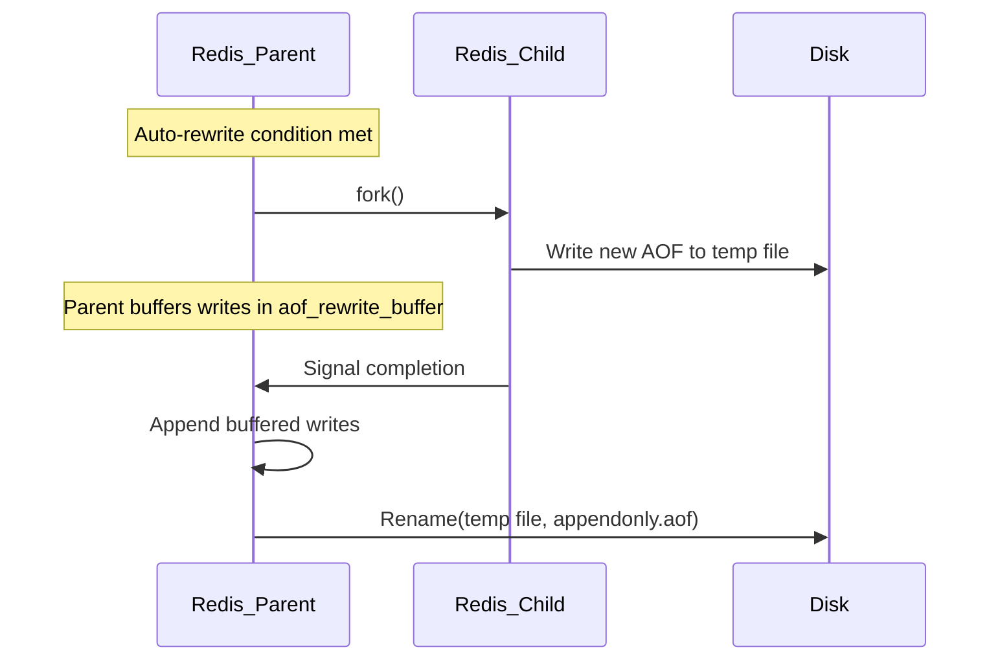

# Redis — Persistence — AOF Append-Only File

## 1 — Overview

AOF (Append-Only File) persistence logs every write operation received by Redis in Redis Serialization Protocol (RESP) format. On restart, Redis replays these commands to reconstruct the dataset. Unlike RDB snapshots, AOF provides finer-grained durability — at the default `appendfsync everysec` setting, at most one second of data is lost on a crash.

AOF is implemented as a continuously growing file of protocol-level commands. To prevent unbounded growth, Redis supports AOF rewrite (BGREWRITEAOF), which creates a compact version containing only the minimal commands needed to represent the current dataset.

**Key characteristics:**
- **Append-only semantic:** New write commands are appended to the end of the file. Old data is never modified in place.
- **Protocol-based format:** The file contains valid Redis commands (SET, LPUSH, SADD, etc.) in RESP format, making it human-readable and debuggable.
- **Rewrite mechanism:** Periodic rewrites compact the AOF by eliminating redundant commands.
- **Fsync control:** Three modes — always (every write), everysec (default, every second), no (OS-managed).
- **Larger than RDB:** The same dataset stored as AOF is typically 2-10x larger than the equivalent RDB.

**When to use AOF:**
- Applications requiring sub-second data loss tolerance
- Write-heavy workloads where losing minutes of data is unacceptable
- Scenarios requiring a human-readable audit log of all write operations
- Combined with RDB for both fast restart and durability


```csharp
// StackExchange.Redis — Checking AOF status
using StackExchange.Redis;
var muxer = await ConnectionMultiplexer.ConnectAsync("localhost:6379");
var server = muxer.GetServer("localhost:6379");
var appendonly = await server.ConfigGetAsync("appendonly");
Console.WriteLine($"AOF enabled: {appendonly[0].Value}");
var appendfsync = await server.ConfigGetAsync("appendfsync");
Console.WriteLine($"Appendfsync: {appendfsync[0].Value}");
var persistence = await server.InfoAsync("persistence");
foreach (var kvp in persistence)
{
    if (kvp.Key.StartsWith("aof_"))
        Console.WriteLine($"{kvp.Key}: {kvp.Value}");
}
```

## 2 — AOF Configuration

### 2.1 — Core Configuration Directives

| Directive | Default | Description |
|-----------|---------|-------------|
| appendonly | no | Enable or disable AOF persistence |
| appendfilename | appendonly.aof | Name of the AOF file |
| appendfsync | everysec | fsync policy: always, everysec, no |
| auto-aof-rewrite-percentage | 100 | AOF rewrite trigger: file growth percentage |
| auto-aof-rewrite-min-size | 64mb | Minimum AOF size to trigger rewrite |
| aof-load-truncated | yes | Load truncated AOF (ignore last incomplete command) |
| aof-use-rdb-preamble | yes | Use RDB preamble in rewritten AOF (Redis 5.0+) |
| aof-timestamp-enabled | no | Add timestamp annotations to AOF (Redis 7.0+) |

### 2.2 — Enabling AOF

```conf
appendonly yes
appendfilename "appendonly.aof"
dir /var/lib/redis
```

```csharp
// StackExchange.Redis — Enable AOF at runtime
using StackExchange.Redis;
var muxer = await ConnectionMultiplexer.ConnectAsync("localhost:6379");
var server = muxer.GetServer("localhost:6379");
await server.ConfigSetAsync("appendonly", "yes");
var status = await server.ConfigGetAsync("appendonly");
Console.WriteLine($"AOF enabled: {status[0].Value}");
```

### 2.3 — Appendfsync Modes

```conf
appendfsync always    # fsync on every write, max durability, ~100x slower writes
appendfsync everysec  # fsync once per second, best balance (default)
appendfsync no        # OS controls fsync, fastest writes, least durable
```

```csharp
// StackExchange.Redis — Configure appendfsync
using StackExchange.Redis;
var muxer = await ConnectionMultiplexer.ConnectAsync("localhost:6379");
var server = muxer.GetServer("localhost:6379");
await server.ConfigSetAsync("appendfsync", "everysec");
var fsync = await server.ConfigGetAsync("appendfsync");
Console.WriteLine($"Appendfsync: {fsync[0].Value}");
```

**Performance impact of appendfsync always:**
- Each write command issues an fsync() system call.
- On typical SSDs, throughput limited to ~100-200 writes/sec.
- Use always only for critical financial or transactional data.
- For most applications, everysec provides best balance (<= 1 second data loss, up to 100K+ writes/sec).

### 2.4 — Auto-Rewrite Configuration

```conf
auto-aof-rewrite-percentage 100
auto-aof-rewrite-min-size 64mb
```

The rewrite triggers when both conditions are met:
1. Current AOF size >= auto-aof-rewrite-min-size
2. AOF size grew by >= auto-aof-rewrite-percentage since last rewrite

```csharp
// StackExchange.Redis — Check rewrite configuration
using StackExchange.Redis;
var muxer = await ConnectionMultiplexer.ConnectAsync("localhost:6379");
var server = muxer.GetServer("localhost:6379");
var rewritePct = await server.ConfigGetAsync("auto-aof-rewrite-percentage");
var rewriteMin = await server.ConfigGetAsync("auto-aof-rewrite-min-size");
Console.WriteLine($"Rewrite percentage: {rewritePct[0].Value}%");
Console.WriteLine($"Rewrite min size: {rewriteMin[0].Value}");
```

### 2.5 — AOF with RDB Preamble (Redis 5.0+)

```conf
aof-use-rdb-preamble yes
```

When enabled, rewritten AOF files start with an RDB binary section (full dataset) followed by incremental RESP commands. This reduces rewrite time and file size.

```csharp
// StackExchange.Redis — Check RDB preamble setting
using StackExchange.Redis;
var muxer = await ConnectionMultiplexer.ConnectAsync("localhost:6379");
var server = muxer.GetServer("localhost:6379");
var preamble = await server.ConfigGetAsync("aof-use-rdb-preamble");
Console.WriteLine($"RDB preamble in AOF: {preamble[0].Value}");
```

## 3 — Append-Fsync Mechanics

### 3.1 — The Write Path

```mermaid
flowchart LR
    A[Client sends SET key value] --> B[Redis validates command]
    B --> C[Redis modifies in-memory data]
    C --> D[Command appended to AOF buffer]
    D --> E{appendfsync mode?}
    E -->|always| F[fsync() on every write]
    E -->|everysec| G[fsync() once per second]
    E -->|no| H[OS flushes when ready]
    F --> I[Command persisted to disk]
    G --> I
    H --> I
    I --> J[Response sent to client]
```

### 3.2 — AOF Buffer and Flush

Redis maintains server.aof_buf — a dynamic buffer accumulating write commands. The buffer flushes to the AOF file via write() on each event loop iteration.

**appendfsync everysec flow:**
1. Write commands appended to server.aof_buf
2. On next event loop iteration, flushAppendOnlyFile() writes buffer to AOF using write()
3. Background thread performs fsync once per second
4. Between fsyncs, data is in OS page cache but not on disk


```csharp
// StackExchange.Redis — Monitoring AOF pending writes
using StackExchange.Redis;
async Task MonitorAofWritesAsync(IConnectionMultiplexer muxer)
{
    var db = muxer.GetDatabase();
    var info = await db.ExecuteAsync("INFO", "persistence");
    var infoStr = info.ToString();
    foreach (var line in infoStr.Split('\n'))
    {
        if (line.StartsWith("aof_pending_bio_fsync:"))
            Console.WriteLine($"Pending fsync: {line.Split(':')[1]}");
        if (line.StartsWith("aof_pending_rewrite:"))
            Console.WriteLine($"Pending rewrite: {line.Split(':')[1]}");
        if (line.StartsWith("aof_write_in_progress:"))
            Console.WriteLine($"Write in progress: {line.Split(':')[1]}");
    }
}
```

### 3.3 — Durability Guarantees by appendfsync Mode

| Mode | Data loss on crash | Write throughput | CPU overhead | Use case |
|------|-------------------|-----------------|--------------|----------|
| always | 0 (one command) | ~100-200 ops/s | High (fsync per op) | Financial, transactions |
| everysec | <= 1 second | 10K-100K+ ops/s | Low (fsync per sec) | General production |
| no | Multiple seconds | Max throughput | None | Cache, analytics |

### 3.4 — AOF Write Errors

If write() to the AOF file fails (disk full, permissions), Redis logs an error and increments aof_write_error. The command still returns success. On restart, data since last successful write is lost.

```csharp
// StackExchange.Redis — Checking AOF write errors
using StackExchange.Redis;
async Task<long> GetAofWriteErrorCountAsync(IConnectionMultiplexer muxer)
{
    var server = muxer.GetServer(muxer.GetEndPoints().First());
    var info = await server.InfoAsync("persistence");
    foreach (var kvp in info)
    {
        if (kvp.Key == "aof_write_error")
            return long.Parse(kvp.Value);
    }
    return 0;
}
```

## 4 — AOF Rewrite

### 4.1 — Why AOF Rewrite Is Necessary

Without rewrite, the AOF file grows indefinitely. Consider a key updated 1 million times:

```
SET counter 1
SET counter 2
...
SET counter 1000000
```

All 1 million commands are logged, but only the last matters. Rewrite compacts this to:
```
SET counter 1000000
```

### 4.2 — The Rewrite Process



**Key details:**
1. **fork():** Same COW mechanism as RDB BGSAVE
2. **RDB preamble (Redis 5+):** Child writes RDB first, then incremental commands
3. **Parent buffers:** Stores new writes in server.aof_rewrite_buffer
4. **Atomic rename:** New file atomically replaces old AOF


```csharp
// StackExchange.Redis — Monitoring AOF rewrite progress
using StackExchange.Redis;

public class AofRewriteMonitor
{
    private readonly IConnectionMultiplexer _muxer;
    public AofRewriteMonitor(IConnectionMultiplexer muxer) => _muxer = muxer;

    public async Task<AofRewriteInfo> GetRewriteInfoAsync()
    {
        var db = _muxer.GetDatabase();
        var info = await db.ExecuteAsync("INFO", "persistence");
        var result = new AofRewriteInfo();
        foreach (var line in info.ToString().Split('\n', StringSplitOptions.RemoveEmptyEntries))
        {
            var parts = line.Split(':');
            if (parts.Length < 2) continue;
            var key = parts[0].Trim();
            var val = parts[1].Trim();
            switch (key)
            {
                case "aof_rewrite_in_progress": result.IsRunning = val == "1"; break;
                case "aof_current_size": result.CurrentSizeBytes = long.Parse(val); break;
                case "aof_base_size": result.BaseSizeBytes = long.Parse(val); break;
                case "aof_last_rewrite_status": result.LastRewriteStatus = val; break;
            }
        }
        return result;
    }
}

public class AofRewriteInfo
{
    public bool IsRunning { get; set; }
    public long CurrentSizeBytes { get; set; }
    public long BaseSizeBytes { get; set; }
    public string LastRewriteStatus { get; set; } = "unknown";
    public double CurrentSizeMb => Math.Round(CurrentSizeBytes / 1024.0 / 1024.0, 2);
    public long GrowthSinceLastRewrite => CurrentSizeBytes - BaseSizeBytes;
}
```

### 4.3 — Manual AOF Rewrite

```bash
redis-cli BGREWRITEAOF
redis-cli BGREWRITEAOF SCHEDULE
```

```csharp
// StackExchange.Redis — Trigger AOF rewrite
using StackExchange.Redis;
var muxer = await ConnectionMultiplexer.ConnectAsync("localhost:6379");
var db = muxer.GetDatabase();
var result = await db.ExecuteAsync("BGREWRITEAOF");
Console.WriteLine(result.ToString());
```

### 4.4 — Rewrite Scheduling and Throttling

**Tuning guidance:**
- **High-write workloads:** Increase auto-aof-rewrite-percentage to 200-300
- **Low-write workloads:** Decrease to 50-75 for tighter AOF control
- **Large instances:** Set auto-aof-rewrite-min-size to 1-4 GB

```csharp
// StackExchange.Redis — Tuning rewrite frequency
using StackExchange.Redis;
async Task ConfigureAofRewriteAsync(IServer server, int pct = 200, long minBytes = 256L*1024*1024)
{
    await server.ConfigSetAsync("auto-aof-rewrite-percentage", pct.ToString());
    await server.ConfigSetAsync("auto-aof-rewrite-min-size", minBytes.ToString());
}
```

## 5 — Monitoring & Metrics

### 5.1 — INFO Persistence — AOF Metrics

```bash
redis-cli INFO persistence
```

| Metric | Description |
|--------|-------------|
| aof_enabled | 1 if AOF is enabled |
| aof_rewrite_in_progress | 1 if BGREWRITEAOF is running |
| aof_last_rewrite_time_sec | Duration of last rewrite in seconds |
| aof_current_rewrite_time_sec | Elapsed time of current rewrite |
| aof_last_bgrewrite_status | ok or err |
| aof_current_size | Current AOF file size in bytes |
| aof_base_size | AOF size after last rewrite |
| aof_buffer_length | Size of AOF buffer in bytes |
| aof_rewrite_buffer_length | Size of rewrite buffer |
| aof_pending_bio_fsync | Pending fsync in background I/O thread |
| aof_delayed_fsync | Count of fsync delays |
| aof_write_error | Count of AOF write errors |


```csharp
// StackExchange.Redis — Comprehensive AOF monitoring
using StackExchange.Redis;

public class AofMonitor
{
    private readonly IConnectionMultiplexer _muxer;
    private readonly IDatabase _db;
    public AofMonitor(IConnectionMultiplexer muxer) { _muxer = muxer; _db = muxer.GetDatabase(); }

    public async Task<AofMetricsSnapshot> GetMetricsAsync()
    {
        var info = await _db.ExecuteAsync("INFO", "persistence");
        var metrics = new AofMetricsSnapshot();
        foreach (var line in info.ToString().Split('\n', StringSplitOptions.RemoveEmptyEntries))
        {
            var parts = line.Split(':');
            if (parts.Length < 2) continue;
            var key = parts[0].Trim();
            var val = parts[1].Trim();
            switch (key)
            {
                case "aof_enabled": metrics.Enabled = val == "1"; break;
                case "aof_rewrite_in_progress": metrics.RewriteInProgress = val == "1"; break;
                case "aof_current_size": metrics.CurrentSizeBytes = long.Parse(val); break;
                case "aof_base_size": metrics.BaseSizeBytes = long.Parse(val); break;
                case "aof_last_rewrite_time_sec": metrics.LastRewriteDurationSec = long.Parse(val); break;
                case "aof_last_bgrewrite_status": metrics.LastRewriteStatus = val; break;
                case "aof_delayed_fsync": metrics.DelayedFsync = long.Parse(val); break;
                case "aof_pending_bio_fsync": metrics.PendingBioFsync = long.Parse(val); break;
                case "aof_buffer_length": metrics.BufferLengthBytes = long.Parse(val); break;
                case "aof_write_error": metrics.WriteErrors = long.Parse(val); break;
            }
        }
        return metrics;
    }
}

public class AofMetricsSnapshot
{
    public bool Enabled { get; set; }
    public bool RewriteInProgress { get; set; }
    public long CurrentSizeBytes { get; set; }
    public long BaseSizeBytes { get; set; }
    public long LastRewriteDurationSec { get; set; }
    public string LastRewriteStatus { get; set; } = "unknown";
    public long DelayedFsync { get; set; }
    public long PendingBioFsync { get; set; }
    public long BufferLengthBytes { get; set; }
    public long WriteErrors { get; set; }
    public double CurrentSizeMb => Math.Round(CurrentSizeBytes / 1024.0 / 1024.0, 2);
}
```

### 5.2 — Monitoring AOF File Size Growth

```csharp
// StackExchange.Redis — Track AOF growth rate
using StackExchange.Redis;

public class AofGrowthTracker
{
    private readonly IConnectionMultiplexer _muxer;
    private long _previousSize;
    private DateTime _previousTime;
    public AofGrowthTracker(IConnectionMultiplexer muxer) => _muxer = muxer;

    public async Task<AofGrowthRate> GetGrowthRateAsync()
    {
        var db = _muxer.GetDatabase();
        var info = await db.ExecuteAsync("INFO", "persistence");
        long currentSize = 0;
        foreach (var line in info.ToString().Split('\n'))
        {
            if (line.StartsWith("aof_current_size:"))
            { currentSize = long.Parse(line.Split(':')[1].Trim()); break; }
        }
        var now = DateTime.UtcNow;
        var rate = new AofGrowthRate { CurrentSizeMb = Math.Round(currentSize / 1024.0 / 1024.0, 2) };
        if (_previousSize > 0)
        {
            var elapsedMinutes = (now - _previousTime).TotalMinutes;
            if (elapsedMinutes > 0)
                rate.GrowthPerMinuteMb = Math.Round((double)(currentSize - _previousSize) / 1024.0 / 1024.0 / elapsedMinutes, 2);
        }
        _previousSize = currentSize; _previousTime = now;
        return rate;
    }
}

public class AofGrowthRate
{
    public double CurrentSizeMb { get; set; }
    public double GrowthPerMinuteMb { get; set; }
}
```

### 5.3 — Latency Impact of AOF

AOF introduces latency via: appendfsync always (each write waits for fsync) and AOF rewrite (fork + COW overhead).

```csharp
// StackExchange.Redis — Checking AOF latency
using StackExchange.Redis;
public class AofLatencyChecker
{
    private readonly IConnectionMultiplexer _muxer;
    public AofLatencyChecker(IConnectionMultiplexer muxer) => _muxer = muxer;
    public async Task<AofLatencyInfo> GetLatencyInfoAsync()
    {
        var db = _muxer.GetDatabase();
        var info = await db.ExecuteAsync("INFO", "persistence");
        var latency = new AofLatencyInfo();
        foreach (var line in info.ToString().Split('\n'))
        {
            if (line.StartsWith("aof_delayed_fsync:"))
                latency.DelayedFsyncCount = long.Parse(line.Split(':')[1].Trim());
        }
        return latency;
    }
}
public class AofLatencyInfo { public long DelayedFsyncCount { get; set; } }
```

## 6 — StackExchange.Redis Integration

### 6.1 — Full AOF Manager

```csharp
using StackExchange.Redis;

public class AofManager
{
    private readonly IConnectionMultiplexer _muxer;
    private readonly IServer _server;
    private readonly IDatabase _db;
    public AofManager(IConnectionMultiplexer muxer)
    {
        _muxer = muxer;
        _server = muxer.GetServer(muxer.GetEndPoints().First());
        _db = muxer.GetDatabase();
    }

    public async Task<bool> EnableAsync()
    {
        try { await _server.ConfigSetAsync("appendonly", "yes"); return true; }
        catch (RedisServerException ex) { Console.Error.WriteLine($"Failed: {ex.Message}"); return false; }
    }

    public async Task<bool> DisableAsync()
    {
        try { await _server.ConfigSetAsync("appendonly", "no"); return true; }
        catch (RedisServerException ex) { Console.Error.WriteLine($"Failed: {ex.Message}"); return false; }
    }

    public async Task<bool> IsEnabledAsync()
    {
        var c = await _server.ConfigGetAsync("appendonly");
        return c.Length > 0 && c[0].Value == "yes";
    }
}
```

### 6.2 — Error Handling for AOF Operations

```csharp
using StackExchange.Redis;

public class SafeAofManager
{
    private readonly IConnectionMultiplexer _muxer;
    public SafeAofManager(IConnectionMultiplexer muxer) => _muxer = muxer;

    public async Task<AofOperationResult> TriggerRewriteWithRetryAsync(int maxRetries = 3)
    {
        for (int i = 0; i < maxRetries; i++)
        {
            try
            {
                var db = _muxer.GetDatabase();
                var r = await db.ExecuteAsync("BGREWRITEAOF");
                return new AofOperationResult { Success = true, Message = r.ToString() };
            }
            catch (RedisServerException ex) when (ex.Message.Contains("already in progress"))
            {
                if (i == maxRetries - 1)
                    return new AofOperationResult { Success = false, Message = "Rewrite in progress" };
                await Task.Delay(TimeSpan.FromSeconds(5 * (i + 1)));
            }
            catch (Exception ex)
            {
                return new AofOperationResult { Success = false, Message = ex.Message };
            }
        }
        return new AofOperationResult { Success = false, Message = "Max retries" };
    }
}

public class AofOperationResult
{
    public bool Success { get; set; }
    public string Message { get; set; } = "";
    public Exception? Exception { get; set; }
}
```

### 6.3 — AOF Rewrite Status Watcher

```csharp
using StackExchange.Redis;
public class AofRewriteWatcher
{
    private readonly IConnectionMultiplexer _muxer;
    private readonly Action<AofRewriteEvent> _onEvent;
    private CancellationTokenSource? _cts;
    public AofRewriteWatcher(IConnectionMultiplexer muxer, Action<AofRewriteEvent> onEvent)
    { _muxer = muxer; _onEvent = onEvent; }
    public void Start(TimeSpan interval) { _cts = new CancellationTokenSource(); _ = PollAsync(interval, _cts.Token); }
    public void Stop() => _cts?.Cancel();
    private async Task PollAsync(TimeSpan interval, CancellationToken ct)
    {
        bool wasRunning = false;
        while (!ct.IsCancellationRequested)
        {
            try
            {
                var db = _muxer.GetDatabase();
                var info = await db.ExecuteAsync("INFO", "persistence");
                var s = info.ToString();
                bool running = false; long sz = 0; string? st = null;
                foreach (var line in s.Split('\n'))
                {
                    if (line.StartsWith("aof_rewrite_in_progress:")) running = line.Split(':')[1].Trim() == "1";
                    if (line.StartsWith("aof_current_size:")) sz = long.Parse(line.Split(':')[1].Trim());
                    if (line.StartsWith("aof_last_bgrewrite_status:")) st = line.Split(':')[1].Trim();
                }
                if (running && !wasRunning) _onEvent(new AofRewriteEvent("started", sz));
                else if (!running && wasRunning) _onEvent(new AofRewriteEvent("completed", sz, st));
                wasRunning = running;
            }
            catch (Exception ex) { _onEvent(new AofRewriteEvent("error", 0, ex.Message)); }
            await Task.Delay(interval, ct);
        }
    }
}
public class AofRewriteEvent
{
    public string Type { get; } public long Size { get; } public string? Detail { get; }
    public AofRewriteEvent(string type, long size, string? detail = null)
    { Type = type; Size = size; Detail = detail; }
}
```

### 6.4 — Handling AOF-Enabled Redis Startup

```csharp
// StackExchange.Redis — Connection with AOF-load awareness
using StackExchange.Redis;
public class AofAwareConnection
{
    public async Task<ConnectionMultiplexer> ConnectAsync(string connectionString)
    {
        var config = ConfigurationOptions.Parse(connectionString);
        config.ConnectTimeout = 30000; config.SyncTimeout = 30000; config.AbortOnConnectFail = false;
        var muxer = await ConnectionMultiplexer.ConnectAsync(config);
        var db = muxer.GetDatabase();
        while (true)
        {
            try { await db.PingAsync(); break; }
            catch (RedisServerException ex) when (ex.Message.Contains("LOADING"))
            { await Task.Delay(1000); }
        }
        return muxer;
    }
}
```


## 7 — Durability Trade-offs

### 7.1 — AOF Appendfsync Modes Comparison

| Aspect | always | everysec | no |
|--------|--------|----------|----|
| Data loss window | 0 (one command) | <= 1 second | Multiple seconds |
| Write throughput | ~100-200 ops/s | ~10K-100K+ ops/s | Max possible |
| CPU overhead | High | Low | None |
| Use case | Financial | General production | Cache, analytics |

### 7.2 — RDB vs AOF Quick Comparison

| Factor | RDB | AOF |
|--------|-----|-----|
| Data loss window | Up to save interval (minutes) | Up to 1 second (everysec) |
| File size | Compact (compressed binary) | Larger (append-only log) |
| Restart speed | Fast (load binary) | Slow (replay commands) |
| Backup suitability | Excellent | Poor |
| Human-readable | No (binary) | Yes (RESP text) |
| Memory overhead | High during fork (COW) | High during rewrite (fork) |

### 7.3 — When to Choose AOF Over RDB

- Sub-second durability required
- Human-readable audit trail needed
- Combined with RDB for fast restart + durability

### 7.4 — When to Avoid AOF

- Disk space constrained (AOF 2-10x larger than RDB)
- Very fast restart critical
- Extreme write throughput with appendfsync always

## 8 — AOF Repair & Recovery

### 8.1 — AOF Corruption

Symptoms on restart:
```
Can't open the append-only file: Input/output error
Bad file format reading the append-only file
```

### 8.2 — redis-check-aof Tool

```bash
# Fix AOF (removes partial last command)
redis-check-aof --fix appendonly.aof
# Check for errors
redis-check-aof appendonly.aof
```

### 8.3 — aof-load-truncated Configuration

```conf
# Load truncated AOF (missing last command) — default yes
aof-load-truncated yes
```

When yes, Redis loads AOF even if last command incomplete. When no, refuses to load truncated file.

```csharp
// StackExchange.Redis — Check aof-load-truncated setting
using StackExchange.Redis;
var muxer = await ConnectionMultiplexer.ConnectAsync("localhost:6379");
var server = muxer.GetServer("localhost:6379");
var truncated = await server.ConfigGetAsync("aof-load-truncated");
Console.WriteLine($"AOF load truncated: {truncated[0].Value}");
```

### 8.4 — Manual Recovery Steps

```bash
# 1. Stop Redis
# 2. Backup AOF
cp /var/lib/redis/appendonly.aof /var/lib/redis/appendonly.aof.bak
# 3. Run repair
redis-check-aof --fix /var/lib/redis/appendonly.aof
# 4. Start Redis
# 5. Verify data
redis-cli DBSIZE
```

## 9 — Gotchas & Pitfalls

### 9.1 — AOF File Can Grow Very Large

**Problem:** Without rewrite, AOF grows unboundedly, reaching tens of GB in hours on write-heavy workloads.

**Solution:** Configure auto-aof-rewrite-percentage and auto-aof-rewrite-min-size. Monitor aof_current_size.

### 9.2 — appendfsync always Kills Throughput

**Problem:** Each write calls fsync(), limiting throughput to ~100-200 writes/sec on SSDs.

**Solution:** Use everysec for most workloads. Batch writes using pipelines.

```csharp
// StackExchange.Redis — Batch writes to reduce AOF impact
using StackExchange.Redis;
var muxer = await ConnectionMultiplexer.ConnectAsync("localhost:6379");
var db = muxer.GetDatabase();
var batch = db.CreateBatch();
batch.StringSetAsync("k1", "v1");
batch.StringSetAsync("k2", "v2");
batch.StringSetAsync("k3", "v3");
batch.Execute();
```

### 9.3 — AOF Rewrite Uses fork() Too

Same COW memory overhead as RDB BGSAVE. RSS can approach 2x dataset size. Reserve 20-50% headroom.

### 9.4 — AOF + RDB Combined Is Recommended

AOF alone: slower restarts, larger files. RDB alone: greater data loss. Enable both for best results.

### 9.5 — Loading AOF on Restart Is Slower Than RDB

A 50 GB AOF can take 10-30 minutes to load. Use RDB preamble (aof-use-rdb-preamble yes) to speed loading.

### 9.6 — AOF Corruption Is Rare But Possible

Set aof-load-truncated yes. Use redis-check-aof --fix. Keep RDB backups as safety net.

### 9.7 — AOF with Network Filesystems

NFS/EFS adds latency and corruption risk. Always use local SSD for AOF files.

### 9.8 — AOF Rewrite Disk Space Requirements

Need 2x current AOF size in free disk during rewrite (old + new AOF coexist).

### 9.9 — AOF with Redis Cluster

Each cluster node has its own AOF. Simultaneous rewrites cause resource contention.

### 9.10 — AOF Write Errors Are Silent

**Problem:** When AOF write fails, Redis logs the error but the command returns success. Application has no visibility.

**Solution:** Monitor aof_write_error in INFO persistence. Set alerts on non-zero values.


### 9.11 — AOF and Transaction Atomicity

Redis transactions (MULTI/EXEC) are logged atomically in AOF. The entire transaction is flushed as a single unit. If a crash occurs during a transaction, the entire transaction is replayed or not — never partially.

```csharp
// StackExchange.Redis — AOF-safe transaction
using StackExchange.Redis;
var muxer = await ConnectionMultiplexer.ConnectAsync("localhost:6379");
var db = muxer.GetDatabase();
var tran = db.CreateTransaction();
tran.AddCondition(Condition.KeyExists("account:1"));
tran.StringDecrementAsync("account:1", 100);
tran.StringIncrementAsync("account:2", 100);
bool committed = await tran.ExecuteAsync();
Console.WriteLine($"Transaction committed: {committed}");
```

### 9.12 — AOF with Redis on Flash

In Redis Enterprise with Flash, AOF behavior differs because data spans RAM and SSD. AOF writes go to SSD-backed storage but fsync overhead still applies. The AOF rewrite process must traverse both RAM-resident and Flash-resident data, which can be slower.

### 9.13 — AOF and maxmemory-policy Interaction

Eviction DEL commands are also logged in AOF. On replay, these DEL commands execute, so restored dataset reflects the eviction state. This is typically desired but can surprise teams expecting AOF to contain only application-generated writes.

### 9.14 — AOF File Permissions and Security

AOF contains every write command in plain-text RESP format, including sensitive values (passwords, tokens, PII).

**Mitigations:**
- Restrict permissions: chmod 600 appendonly.aof
- Ensure Redis data directory is not publicly accessible
- Consider encryption at rest (LUKS, BitLocker)
- Managed Redis providers handle file permissions

### 9.15 — AOF Rewrite Failures Due to Memory

If system is under memory pressure, fork() for AOF rewrite fails. Redis logs: "Can't save in background: fork: Cannot allocate memory".

**Solution:**
- Configure vm.overcommit_memory=1 in sysctl
- Ensure sufficient swap space
- Reduce maxmemory to leave headroom for fork()
- Schedule rewrites during low-traffic periods

### 9.16 — Benchmarking AOF Performance

```csharp
// StackExchange.Redis — Benchmark AOF write impact
using StackExchange.Redis;
using System.Diagnostics;

async Task<double> BenchmarkAofWriteImpactAsync(IConnectionMultiplexer muxer, int iterations = 1000)
{
    var db = muxer.GetDatabase();
    var sw = Stopwatch.StartNew();
    for (int i = 0; i < iterations; i++)
    {
        await db.StringSetAsync($"bench:{i}", "x".PadLeft(100, 'x'));
    }
    sw.Stop();
    return (double)sw.ElapsedMilliseconds / iterations;
}
// Compare with appendfsync=everysec vs appendfsync=always by changing config
```

### 9.17 — AOF and Lua Scripts

Lua scripts executed via EVAL/EVALSHA are logged atomically in AOF. The entire script is written as a single EVAL command with its arguments. On AOF replay, the script is re-executed. This ensures deterministic replay but requires scripts to be pure (no random functions or external state dependencies).

### 9.18 — AOF with Redis 7.0+ Timestamps

Redis 7.0 added aof-timestamp-enabled which inserts timestamp annotations into the AOF file. This enables point-in-time recovery: you can truncate the AOF at a specific timestamp and replay only commands up to that point.

```conf
aof-timestamp-enabled yes
```

```csharp
// StackExchange.Redis — Check AOF timestamp feature
using StackExchange.Redis;
var muxer = await ConnectionMultiplexer.ConnectAsync("localhost:6379");
var server = muxer.GetServer("localhost:6379");
var ts = await server.ConfigGetAsync("aof-timestamp-enabled");
Console.WriteLine($"AOF timestamps enabled: {ts[0].Value}");
```
