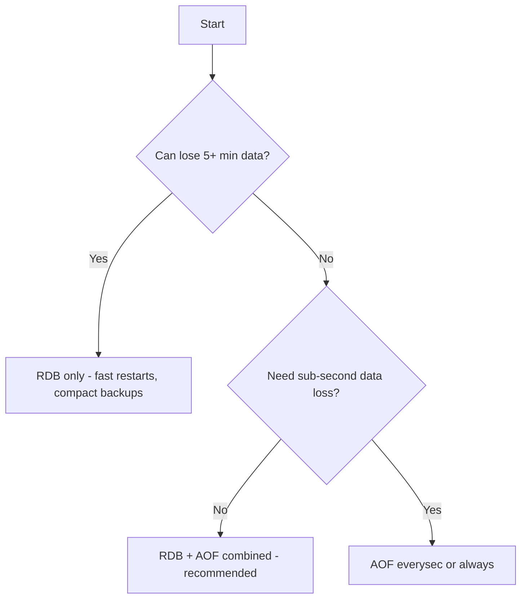

# Redis — Persistence — RDB + AOF Combined

## 1 — Overview

Redis supports running both RDB snapshot persistence and AOF (Append-Only File) persistence simultaneously. This combined mode, enabled by default in newer Redis versions, provides the best of both worlds: RDB for fast recovery and efficient backups, plus AOF for superior durability with at most one second of data loss.

When both persistence mechanisms are enabled, Redis uses the AOF file as the source of truth during restart. The AOF is loaded first because it contains the most complete data. The RDB file is still generated on schedule for backup purposes and can serve as a fallback if the AOF file is corrupted.

**Key characteristics:**
- RDB provides periodic snapshots for fast restarts and easy backups
- AOF provides continuous logging for sub-second data loss protection
- On restart, Redis loads AOF (which may contain an RDB preamble for speed)
- RDB + AOF = maximum durability with reasonable restart time
- Both use fork() for background operations (RDB BGSAVE, AOF BGREWRITEAOF)
- More disk I/O than either alone (both files are written)
- Redis 7.4+ introduced combined RDB+AOF in a single file for better efficiency

```csharp
// StackExchange.Redis — Checking combined persistence status
using StackExchange.Redis;
var muxer = await ConnectionMultiplexer.ConnectAsync("localhost:6379");
var server = muxer.GetServer("localhost:6379");
var rdbEnabled = (await server.ConfigGetAsync("save")).Length > 0;
var aofEnabled = (await server.ConfigGetAsync("appendonly"))[0].Value == "yes";
Console.WriteLine($"RDB enabled: {rdbEnabled}");
Console.WriteLine($"AOF enabled: {aofEnabled}");
var persistence = await server.InfoAsync("persistence");
foreach (var kvp in persistence)
    Console.WriteLine($"  {kvp.Key}: {kvp.Value}");
```

## 2 — Combined Configuration

### 2.1 — Sample Configuration

```conf
# redis.conf — Combined RDB + AOF configuration

# RDB settings
save 900 1
save 300 10
save 60 10000
dbfilename dump.rdb
dir /var/lib/redis
rdbcompression yes
rdbchecksum yes

# AOF settings
appendonly yes
appendfilename "appendonly.aof"
appendfsync everysec
auto-aof-rewrite-percentage 100
auto-aof-rewrite-min-size 64mb
aof-use-rdb-preamble yes
```

```csharp
// StackExchange.Redis — Configure both RDB and AOF
using StackExchange.Redis;
async Task ConfigureCombinedPersistenceAsync(IServer server)
{
    await server.ConfigSetAsync("save", "900 1 300 10 60 10000");
    await server.ConfigSetAsync("appendonly", "yes");
    await server.ConfigSetAsync("appendfsync", "everysec");
    await server.ConfigSetAsync("auto-aof-rewrite-percentage", "100");
    await server.ConfigSetAsync("auto-aof-rewrite-min-size", "64mb");
    await server.ConfigSetAsync("aof-use-rdb-preamble", "yes");
}
```

### 2.2 — Configuration Directives Summary

| Directive | Value | Purpose |
|-----------|-------|---------|
| save | 900 1 (and others) | RDB snapshot triggers |
| dbfilename | dump.rdb | RDB file name |
| rdbcompression | yes | Compress RDB file |
| rdbchecksum | yes | CRC64 checksum |
| appendonly | yes | Enable AOF |
| appendfilename | appendonly.aof | AOF file name |
| appendfsync | everysec | AOF fsync policy |
| auto-aof-rewrite-percentage | 100 | AOF rewrite trigger |
| auto-aof-rewrite-min-size | 64mb | Min AOF size for rewrite |
| aof-use-rdb-preamble | yes | RDB preamble in rewritten AOF |
| dir | /var/lib/redis | Directory for both files |

### 2.3 — Disabling One or Both

```conf
# RDB only (disable AOF)
appendonly no

# AOF only (disable RDB)
save ""

# Neither (volatile cache only)
save ""
appendonly no
```

```csharp
// StackExchange.Redis — Toggle persistence modes
using StackExchange.Redis;
public class PersistenceConfigurator
{
    private readonly IServer _server;
    public PersistenceConfigurator(IServer server) => _server = server;
    public async Task SetRdbOnlyAsync()
    { await _server.ConfigSetAsync("save", "900 1 300 10 60 10000"); await _server.ConfigSetAsync("appendonly", "no"); }
    public async Task SetAofOnlyAsync()
    { await _server.ConfigSetAsync("save", ""); await _server.ConfigSetAsync("appendonly", "yes"); }
    public async Task SetCombinedAsync()
    { await _server.ConfigSetAsync("save", "900 1 300 10 60 10000"); await _server.ConfigSetAsync("appendonly", "yes"); }
    public async Task SetNoneAsync()
    { await _server.ConfigSetAsync("save", ""); await _server.ConfigSetAsync("appendonly", "no"); }
}
```

## 3 — Redis 7.4+ Improvements

### 3.1 — Unified Persistence File

Redis 7.4 introduced combining RDB and AOF into a single file. Benefits:
- Single file simplifies backup and management
- Atomic writes ensure consistency between RDB and AOF data
- Reduced disk I/O compared to writing two separate files

### 3.2 — AOF Rewrite with RDB Preamble (Redis 5.0+)

Starting Redis 5.0, AOF rewrite generates a file with an RDB preamble followed by incremental AOF commands. This is default with aof-use-rdb-preamble yes.

**Rewrite file structure:**
[RDB binary section — full dataset snapshot]
[Incremental RESP commands — writes during rewrite]

On restart, Redis loads the RDB preamble (fast binary load) and replays incremental commands.

```csharp
// StackExchange.Redis — Check RDB preamble
using StackExchange.Redis;
var muxer = await ConnectionMultiplexer.ConnectAsync("localhost:6379");
var server = muxer.GetServer("localhost:6379");
var preamble = await server.ConfigGetAsync("aof-use-rdb-preamble");
Console.WriteLine($"RDB preamble in AOF: {preamble[0].Value}");
```

### 3.3 — Combined Mode Flow Diagram

```mermaid
flowchart TD
    subgraph Runtime
        A[Write command] --> B[Update in-memory data]
        B --> C[Append to AOF buffer]
        C --> D[Flush + fsync -> AOF file]
        B --> E{Save condition met?}
        E -->|Yes| F[fork() -> BGSAVE -> RDB file]
    end
    subgraph Restart
        H[Redis starts] --> I{AOF enabled?}
        I -->|Yes| J[Load AOF (with RDB preamble)]
        I -->|No| K{RDB enabled?}
        K -->|Yes| L[Load RDB file]
        K -->|No| M[Start empty]
        J --> N[Redis ready]
        L --> N
        M --> N
    end
```

## 4 — Restart Behavior

### 4.1 — Restart Decision Logic

When both RDB and AOF are configured, restart sequence:

1. Check AOF file existence and validity
2. If AOF valid: Load AOF (with or without RDB preamble)
3. If AOF missing/corrupted and aof-load-truncated yes: Load truncated AOF
4. If AOF missing/corrupted and aof-load-truncated no: Fail startup
5. If AOF disabled: Load RDB
6. Both disabled: Start empty

**Key insight:** AOF is always the source of truth when both are enabled.

```csharp
// StackExchange.Redis — Check which persistence was loaded
using StackExchange.Redis;
async Task CheckStartupLoadSourceAsync(IConnectionMultiplexer muxer)
{
    var db = muxer.GetDatabase();
    var info = await db.ExecuteAsync("INFO", "persistence");
    var s = info.ToString();
    long duration = 0; string? status = null;
    foreach (var line in s.Split('\n'))
    {
        if (line.StartsWith("loading_total_duration:")) duration = long.Parse(line.Split(':')[1].Trim());
        if (line.StartsWith("rdb_last_load_status:")) status = line.Split(':')[1].Trim();
    }
    Console.WriteLine($"Load duration: {duration} ms");
    Console.WriteLine($"RDB load status: {status}");
}
```

### 4.2 — Restart Performance

| Mode | 10 GB dataset | 50 GB dataset |
|------|---------------|---------------|
| RDB only | ~10-20s | ~50-100s |
| AOF only (no preamble) | ~2-5 min | ~10-30 min |
| AOF with RDB preamble | ~15-30s | ~60-120s |
| RDB + AOF combined | ~15-30s | ~60-120s |

### 4.3 — Handling AOF Failure at Startup

If AOF is corrupted and aof-load-truncated no, Redis refuses to start:
```bash
mv /var/lib/redis/appendonly.aof /var/lib/redis/appendonly.aof.corrupt
redis-server /etc/redis/redis.conf  # Loads RDB instead
redis-cli DBSIZE                     # Verify data
```

## 5 — Decision Framework

### 5.1 — Flowchart



### 5.2 — Use Case Recommendations

| Use case | Recommended mode | Rationale |
|----------|-----------------|-----------|
| Cache (regeneratable) | RDB only or none | Data loss acceptable, fast restarts |
| General production | RDB + AOF combined | Best balance durability/restart speed |
| Financial / transactions | AOF always | Zero data loss |
| Analytics / logging | AOF everysec | Durability important |
| Large dataset > 50 GB | RDB + AOF combined | RDB provides fast restart fallback |

### 5.3 — Config Templates

**Production web app (default):**
```conf
save 900 1
save 300 10
save 60 10000
appendonly yes
appendfsync everysec
aof-use-rdb-preamble yes
auto-aof-rewrite-percentage 100
auto-aof-rewrite-min-size 64mb
```

**Cache layer:**
```conf
save 3600 1
appendonly no
```

**Financial transaction system:**
```conf
save 60 1
appendonly yes
appendfsync always
auto-aof-rewrite-percentage 50
auto-aof-rewrite-min-size 256mb
```

### 5.4 — Sizing Storage for Combined Mode

Total disk space = RDB_size + AOF_size + headroom

- RDB size: typically 30-50% of in-memory dataset (compressed)
- AOF size: varies by write rate (1-5x dataset between rewrites)
- Add 50% headroom for AOF rewrite (old + new AOF coexist)

**Example for 10 GB dataset:**
- RDB: ~3-5 GB
- AOF: ~10-20 GB
- Headroom: ~15 GB (for AOF rewrite)
- **Total recommended: ~40-50 GB**

```csharp
// StackExchange.Redis — Estimate disk space needs
using StackExchange.Redis;

public class DiskSpaceEstimator
{
    public static async Task<DiskSpaceEstimate> EstimateAsync(IConnectionMultiplexer muxer)
    {
        var db = muxer.GetDatabase();
        var p = await db.ExecuteAsync("INFO", "persistence");
        var m = await db.ExecuteAsync("INFO", "memory");
        long aofCurrent = 0, usedMem = 0;
        foreach (var line in p.ToString().Split('\n'))
            if (line.StartsWith("aof_current_size:")) aofCurrent = long.Parse(line.Split(':')[1].Trim());
        foreach (var line in m.ToString().Split('\n'))
            if (line.StartsWith("used_memory:")) { usedMem = long.Parse(line.Split(':')[1].Trim()); break; }
        var estRdb = (long)(usedMem * 0.4);
        return new DiskSpaceEstimate
        {
            DatasetMb = Math.Round(usedMem / 1024.0 / 1024.0, 1),
            EstRdbMb = Math.Round(estRdb / 1024.0 / 1024.0, 1),
            AofMb = Math.Round(aofCurrent / 1024.0 / 1024.0, 1),
            RecommendedGb = Math.Round((estRdb + aofCurrent * 2.0) / 1024.0 / 1024.0 / 1024.0, 1)
        };
    }
}

public class DiskSpaceEstimate
{
    public double DatasetMb { get; set; }
    public double EstRdbMb { get; set; }
    public double AofMb { get; set; }
    public double RecommendedGb { get; set; }
}
```

## 6 — Monitoring & Metrics

### 6.1 — Combined INFO Persistence Output

```bash
redis-cli INFO persistence
```

**RDB metrics:**
| Metric | Description |
|--------|-------------|
| rdb_changes_since_last_save | Key changes since last snapshot |
| rdb_bgsave_in_progress | 1 if BGSAVE running |
| rdb_last_save_time | Unix timestamp of last save |
| rdb_last_bgsave_status | ok or err |

**AOF metrics:**
| Metric | Description |
|--------|-------------|
| aof_enabled | 1 if AOF enabled |
| aof_rewrite_in_progress | 1 if BGREWRITEAOF running |
| aof_current_size | Current AOF size in bytes |
| aof_base_size | AOF size after last rewrite |
| aof_last_bgrewrite_status | ok or err |
| aof_delayed_fsync | Count of fsync delays |
| aof_write_error | Count of AOF write errors |

```csharp
// StackExchange.Redis — Full combined persistence monitoring
using StackExchange.Redis;

public class CombinedPersistenceMonitor
{
    private readonly IConnectionMultiplexer _muxer;
    public CombinedPersistenceMonitor(IConnectionMultiplexer muxer) => _muxer = muxer;

    public async Task<CombinedInfo> GetInfoAsync()
    {
        var db = _muxer.GetDatabase();
        var info = await db.ExecuteAsync("INFO", "persistence");
        var r = new CombinedInfo();
        foreach (var line in info.ToString().Split('\n', StringSplitOptions.RemoveEmptyEntries))
        {
            var parts = line.Split(':');
            if (parts.Length < 2) continue;
            var k = parts[0].Trim(); var v = parts[1].Trim();
            switch (k)
            {
                case "rdb_changes_since_last_save": r.RdbChanges = long.Parse(v); break;
                case "rdb_bgsave_in_progress": r.RdbBgsaveRunning = v == "1"; break;
                case "rdb_last_bgsave_status": r.RdbStatus = v; break;
                case "aof_enabled": r.AofEnabled = v == "1"; break;
                case "aof_rewrite_in_progress": r.AofRewriteRunning = v == "1"; break;
                case "aof_current_size": r.AofSize = long.Parse(v); break;
                case "aof_last_bgrewrite_status": r.AofRewriteStatus = v; break;
                case "aof_delayed_fsync": r.AofDelayedFsync = long.Parse(v); break;
                case "aof_write_error": r.AofWriteErrors = long.Parse(v); break;
            }
        }
        return r;
    }
}

public class CombinedInfo
{
    public long RdbChanges { get; set; }
    public bool RdbBgsaveRunning { get; set; }
    public string RdbStatus { get; set; } = "unknown";
    public bool AofEnabled { get; set; }
    public bool AofRewriteRunning { get; set; }
    public long AofSize { get; set; }
    public string AofRewriteStatus { get; set; } = "unknown";
    public long AofDelayedFsync { get; set; }
    public long AofWriteErrors { get; set; }
    public bool IsHealthy => RdbStatus == "ok" && AofRewriteStatus == "ok" && AofWriteErrors == 0;
}
```

### 6.2 — Monitor Combined Fork Overhead

Both BGSAVE and AOF rewrite use fork(). When both run, COW overhead doubles.

```csharp
// StackExchange.Redis — Monitor fork overhead
using StackExchange.Redis;
public class ForkOverheadMonitor
{
    private readonly IConnectionMultiplexer _muxer;
    public ForkOverheadMonitor(IConnectionMultiplexer muxer) => _muxer = muxer;
    public async Task<ForkInfo> GetAsync()
    {
        var db = _muxer.GetDatabase();
        var info = await db.ExecuteAsync("INFO", "persistence");
        var s = info.ToString();
        var fi = new ForkInfo();
        foreach (var line in s.Split('\n'))
        {
            if (line.StartsWith("rdb_bgsave_in_progress:")) fi.RdbRunning = line.Split(':')[1].Trim() == "1";
            if (line.StartsWith("aof_rewrite_in_progress:")) fi.AofRunning = line.Split(':')[1].Trim() == "1";
            if (line.StartsWith("rdb_last_cow_size:")) fi.LastRdbCowBytes = long.Parse(line.Split(':')[1].Trim());
        }
        fi.BothActive = fi.RdbRunning && fi.AofRunning;
        return fi;
    }
}
public class ForkInfo
{
    public bool RdbRunning { get; set; }
    public bool AofRunning { get; set; }
    public bool BothActive { get; set; }
    public long LastRdbCowBytes { get; set; }
}
```

## 7 — StackExchange.Redis Integration

### 7.1 — Complete Persistence Manager

```csharp
using StackExchange.Redis;

public class PersistenceManager
{
    private readonly IConnectionMultiplexer _muxer;
    private readonly IServer _server;
    private readonly IDatabase _db;

    public PersistenceManager(string connectionString)
    {
        _muxer = ConnectionMultiplexer.Connect(connectionString);
        _server = _muxer.GetServer(_muxer.GetEndPoints().First());
        _db = muxer.GetDatabase();
    }

    public async Task<PersistenceMode> GetCurrentModeAsync()
    {
        var save = await _server.ConfigGetAsync("save");
        var appendonly = await _server.ConfigGetAsync("appendonly");
        var hasRdb = save.Length > 0 && !string.IsNullOrEmpty(save[0].Value);
        var hasAof = appendonly[0].Value == "yes";
        if (hasRdb && hasAof) return PersistenceMode.RdbPlusAof;
        if (hasRdb) return PersistenceMode.RdbOnly;
        if (hasAof) return PersistenceMode.AofOnly;
        return PersistenceMode.None;
    }

    public async Task<PersistenceSummary> GetSummaryAsync()
    {
        var mode = await GetCurrentModeAsync();
        var info = await _db.ExecuteAsync("INFO", "persistence");
        var s = info.ToString();
        var summary = new PersistenceSummary { Mode = mode };

        foreach (var line in s.Split('\n'))
        {
            if (line.StartsWith("rdb_last_bgsave_status:")) summary.RdbStatus = line.Split(':')[1].Trim();
            if (line.StartsWith("aof_last_bgrewrite_status:")) summary.AofRewritesStatus = line.Split(':')[1].Trim();
            if (line.StartsWith("aof_current_size:"))
                summary.AofSizeMb = Math.Round(long.Parse(line.Split(':')[1].Trim()) / 1024.0 / 1024.0, 2);
            if (line.StartsWith("rdb_changes_since_last_save:"))
                summary.Changes = long.Parse(line.Split(':')[1].Trim());
        }
        summary.Healthy = summary.RdbStatus == "ok" && summary.AofRewritesStatus == "ok";
        return summary;
    }
}

public enum PersistenceMode { None, RdbOnly, AofOnly, RdbPlusAof }

public class PersistenceSummary
{
    public PersistenceMode Mode { get; set; }
    public string RdbStatus { get; set; } = "unknown";
    public string AofRewritesStatus { get; set; } = "unknown";
    public double AofSizeMb { get; set; }
    public long Changes { get; set; }
    public bool Healthy { get; set; }
}
```

### 7.2 — Health Check for Combined Persistence

```csharp
using StackExchange.Redis;

public class CombinedHealthCheck
{
    private readonly IConnectionMultiplexer _muxer;
    private readonly int _rdbStaleMinutes;
    public CombinedHealthCheck(IConnectionMultiplexer muxer, int rdbStaleMinutes = 30)
    { _muxer = muxer; _rdbStaleMinutes = rdbStaleMinutes; }

    public async Task<HealthResult> CheckAsync()
    {
        var r = new HealthResult();
        try
        {
            var db = _muxer.GetDatabase();
            var info = await db.ExecuteAsync("INFO", "persistence");
            foreach (var line in info.ToString().Split('\n'))
            {
                if (line.StartsWith("rdb_last_bgsave_status:")) r.RdbOk = line.Split(':')[1].Trim() == "ok";
                if (line.StartsWith("rdb_last_save_time:"))
                {
                    var t = long.Parse(line.Split(':')[1].Trim());
                    r.LastRdbSave = DateTimeOffset.FromUnixTimeSeconds(t).DateTime;
                    r.IsStale = (DateTime.UtcNow - r.LastRdbSave.Value).TotalMinutes > _rdbStaleMinutes;
                }
                if (line.StartsWith("aof_last_bgrewrite_status:")) r.AofRewriteOk = line.Split(':')[1].Trim() == "ok";
                if (line.StartsWith("aof_write_error:")) r.AofErrors = long.Parse(line.Split(':')[1].Trim());
            }
            r.OverallOk = r.RdbOk && !r.IsStale && r.AofRewriteOk && r.AofErrors == 0;
        }
        catch (Exception ex) { r.OverallOk = false; r.Error = ex.Message; }
        return r;
    }
}

public class HealthResult
{
    public bool RdbOk { get; set; }
    public DateTime? LastRdbSave { get; set; }
    public bool IsStale { get; set; }
    public bool AofRewriteOk { get; set; }
    public long AofErrors { get; set; }
    public bool OverallOk { get; set; }
    public string? Error { get; set; }
}
```

### 7.3 — Backup Coordination

```csharp
using StackExchange.Redis;

public class BackupCoordinator
{
    private readonly IConnectionMultiplexer _muxer;
    public BackupCoordinator(IConnectionMultiplexer muxer) => _muxer = muxer;

    public async Task<bool> PrepareAsync(TimeSpan maxWait)
    {
        var server = _muxer.GetServer(muxer.GetEndPoints().First());
        var deadline = DateTime.UtcNow + maxWait;
        while (DateTime.UtcNow < deadline)
        {
            var info = await server.InfoAsync("persistence");
            var bg = info.Any(kvp => kvp.Key == "rdb_bgsave_in_progress" && kvp.Value == "1");
            var rw = info.Any(kvp => kvp.Key == "aof_rewrite_in_progress" && kvp.Value == "1");
            if (!bg && !rw)
            {
                await server.SaveAsync(SaveType.Background);
                while (DateTime.UtcNow < deadline)
                {
                    info = await server.InfoAsync("persistence");
                    if (!info.Any(kvp => kvp.Key == "rdb_bgsave_in_progress" && kvp.Value == "1"))
                    {
                        var st = info.FirstOrDefault(kvp => kvp.Key == "rdb_last_bgsave_status");
                        return st.Value == "ok";
                    }
                    await Task.Delay(500);
                }
                return false;
            }
            await Task.Delay(500);
        }
        return false;
    }
}
```

## 8 — Backup Strategy

### 8.1 — Combined Backup Approach

With both RDB and AOF enabled:
1. **RDB file copy:** Periodically copy RDB to backup storage (S3, Azure Blob, NAS)
2. **AOF as safety net:** AOF provides point-in-time recovery between RDB backups
3. **AOF rewrite check:** Ensure AOF rewrite completes before backup

```bash
cp /var/lib/redis/dump.rdb /backup/dump_$(date +%Y%m%d_%H%M%S).rdb
redis-cli BGSAVE
sleep 5
cp /var/lib/redis/dump.rdb /backup/dump_forced_$(date +%Y%m%d_%H%M%S).rdb
```

### 8.2 — Point-in-Time Recovery

With RDB + AOF:
1. Restore latest RDB backup
2. Replay AOF commands from that point forward
3. Optionally truncate AOF to specific timestamp (Redis 7.0+ AOF timestamps)

```bash
cp /backup/dump_20260627.rdb /var/lib/redis/dump.rdb
redis-server /etc/redis/redis.conf
```

## 9 — Gotchas & Pitfalls

### 9.1 — More Disk I/O for Both Files

**Problem:** Two persistence mechanisms writing simultaneously. Combined I/O can be significant.

**Solution:** Use separate disks for RDB and AOF. Stagger BGSAVE and rewrite schedules. Monitor disk latency.

### 9.2 — AOF Is the Source of Truth on Restart

**Problem:** Many assume RDB is loaded when both are enabled. Redis always loads AOF first.

**Solution:** If AOF corrupted but RDB healthy, manually rename AOF before restart.

### 9.3 — AOF Rewrite Uses RDB Format

With aof-use-rdb-preamble yes (default Redis 5+), rewritten AOF starts with RDB section. File extension remains .aof.

### 9.4 — Memory Pressure from Two fork() Processes

**Problem:** If BGSAVE and rewrite run simultaneously, two children exist, RSS spikes.

**Solution:** Redis prevents simultaneous BGSAVE and BGREWRITEAOF by design. Confirm with INFO persistence.

```csharp
// Check if both persistence ops running
async Task CheckConcurrentForkAsync(IConnectionMultiplexer muxer)
{
    var db = muxer.GetDatabase();
    var info = await db.ExecuteAsync("INFO", "persistence");
    var s = info.ToString();
    bool bg = false, rw = false;
    foreach (var line in s.Split('\n'))
    {
        if (line.StartsWith("rdb_bgsave_in_progress:")) bg = line.Split(':')[1].Trim() == "1";
        if (line.StartsWith("aof_rewrite_in_progress:")) rw = line.Split(':')[1].Trim() == "1";
    }
    Console.WriteLine(bg && rw ? "WARNING: Both BGSAVE and rewrite running!" : "Normal - only one persistence op at a time");
}
```

### 9.5 — Disk Space for Both Files

**Problem:** AOF + RDB requires more disk space than either alone. During AOF rewrite, both old and new AOF exist.

**Solution:** Ensure 2x current AOF size free. Monitor disk at 70%/80%/90% thresholds.

### 9.6 — Restart Time Depends on AOF Size

Even with RDB+AOF, restart time is determined by AOF load time. Ensure rewrite completes regularly.

### 9.7 — Replication and Combined Persistence

Master initiates BGSAVE for replica sync (sends RDB). Combined persistence on master provides best experience.

### 9.8 — Monitoring Blind Spots

**Problem:** Teams monitor RDB or AOF individually but miss combined interactions.

**Solution:** Monitor both together. Set alerts for:
- rdb_last_bgsave_status != ok
- aof_last_bgrewrite_status != ok
- aof_write_error > 0
- Both persistence ops running simultaneously

### 9.9 — Cloud Provider Limitations

| Provider | Persistence Support |
|----------|-------------------|
| Azure Basic | No RDB or AOF |
| Azure Standard/Premium | RDB and AOF supported |
| AWS ElastiCache | RDB and AOF via Parameter Groups |
| Redis Cloud (Redis Labs) | Full persistence support |

### 9.10 — Combined Mode in Containers/Kubernetes

Running combined persistence in Docker/Kubernetes requires:
- Persistent volume mounted to Redis data directory
- Sufficient disk space on the volume
- Readiness probes that wait for persistence operations
- StatefulSet for stable network identities and storage

```yaml
# Kubernetes PVC for Redis
apiVersion: v1
kind: PersistentVolumeClaim
metadata:
  name: redis-data
spec:
  accessModes:
    - ReadWriteOnce
  resources:
    requests:
      storage: 50Gi
```


### 9.11 — RDB and AOF with Different Save Intervals

When both are enabled, RDB saves and AOF fsyncs happen on independent schedules:
- BGSAVE can start during AOF rewrite (though Redis serializes these)
- RDB may capture data not yet fsynced to AOF
- On crash, data recovered from AOF may be more recent than last RDB

### 9.12 — AOF Rewrite During RDB BGSAVE

Redis prevents concurrent BGSAVE and BGREWRITEAOF. If BGSAVE is in progress and AOF rewrite triggers, rewrite is postponed (aof_pending_rewrite = 1).

```csharp
// StackExchange.Redis — Check pending rewrite
using StackExchange.Redis;
async Task CheckPendingRewriteAsync(IConnectionMultiplexer muxer)
{
    var db = muxer.GetDatabase();
    var info = await db.ExecuteAsync("INFO", "persistence");
    foreach (var line in info.ToString().Split('\n'))
    {
        if (line.StartsWith("aof_pending_rewrite:"))
            Console.WriteLine($"AOF rewrite pending: {line.Split(':')[1].Trim()}");
    }
}
```

### 9.13 — Combined Persistence with Replication

In master-replica setup:
- **Master:** Both RDB and AOF enabled
- **Replica:** AOF typically disabled (replication stream provides data), RDB optional
- When replica connects, master sends RDB (from disk or live BGSAVE)
- Replica loads RDB, then replays replication buffer

**Recommendation:** Enable RDB on replicas for faster restart. Disable AOF on replicas unless you need point-in-time recovery per node.

### 9.14 — Disaster Recovery with Combined Persistence

For DR, use RDB file (not AOF) as off-site backup:
1. RDB is compact/compressed — cheaper to store, faster to transfer
2. AOF provides local durability
3. In DR, restore RDB to new instance, optionally replay saved AOF segments

**Backup rotation:**
```bash
# Hourly: RDB snapshot to local backup
cp /var/lib/redis/dump.rdb /backup/hourly/dump_$(date +%Y%m%d_%H).rdb
find /backup/hourly -mtime +7 -delete
# Daily: RDB to off-site storage
cp /var/lib/redis/dump.rdb /backup/daily/dump_$(date +%Y%m%d).rdb
```

### 9.15 — Memory Sizing for Combined Persistence

Peak RSS during persistence:
```
Peak RSS = dataset + max(COW_BGSAVE, COW_REWRITE)
```
Since Redis serializes BGSAVE and rewrite, only one COW overhead at a time.

If dataset = 20 GB and COW overhead = 30%:
```
Peak RSS = 20 GB + 6 GB = 26 GB
```

**Sizing formula:**
```
maxmemory = min(instance_RAM * 0.7, dataset * 1.4)
```

### 9.16 — Combined Persistence in Redis Cluster

In cluster mode:
- Each of N master nodes writes its own RDB and AOF files
- N replicas also write persistence files (if enabled)
- Multiplies disk I/O by number of nodes
- Consider staggering persistence schedules across nodes

```csharp
// StackExchange.Redis — Cluster persistence check
using StackExchange.Redis;
async Task CheckClusterPersistenceAsync(IConnectionMultiplexer muxer)
{
    var server = muxer.GetServer(muxer.GetEndPoints().First());
    var persist = await server.InfoAsync("persistence");
    Console.WriteLine("Cluster persistence:");
    foreach (var kvp in persist)
    {
        if (kvp.Key.StartsWith("aof_") || kvp.Key.StartsWith("rdb_"))
            Console.WriteLine($"  {kvp.Key}: {kvp.Value}");
    }
}
```

### 9.17 — File System Choices for Combined Persistence

| File System | Recommended | Notes |
|-------------|-------------|-------|
| ext4 | Yes | Good all-rounder, fast fsync |
| XFS | Yes | Excellent for large files |
| ZFS | With caution | COW on COW = double overhead |
| NTFS | Yes (Win Redis) | Prefer ext4 on Linux |
| NFS/CIFS | No | fsync slow/unreliable |

### 9.18 — Monitoring Combined Persistence Dashboard

```csharp
// StackExchange.Redis — Comprehensive dashboard
using StackExchange.Redis;

public class PersistenceDashboard
{
    private readonly IConnectionMultiplexer _muxer;
    public PersistenceDashboard(IConnectionMultiplexer muxer) => _muxer = muxer;

    public async Task<string> GenerateReportAsync()
    {
        var db = _muxer.GetDatabase();
        var persistInfo = await db.ExecuteAsync("INFO", "persistence");
        var memInfo = await db.ExecuteAsync("INFO", "memory");
        var sb = new System.Text.StringBuilder();

        sb.AppendLine("=== Redis Persistence Report ===");

        foreach (var line in persistInfo.ToString().Split('\n'))
        {
            if (line.StartsWith("rdb_") || line.StartsWith("aof_"))
                sb.AppendLine($"  {line}");
        }

        sb.AppendLine();
        sb.AppendLine("--- Memory ---");
        foreach (var line in memInfo.ToString().Split('\n'))
        {
            if (line.StartsWith("used_memory:") || line.StartsWith("used_memory_rss:") || line.StartsWith("maxmemory:"))
                sb.AppendLine($"  {line}");
        }

        // Health check
        var pStr = persistInfo.ToString();
        bool rdbOk = pStr.Contains("rdb_last_bgsave_status:ok");
        bool aofOk = pStr.Contains("aof_last_bgrewrite_status:ok");
        sb.AppendLine();
        sb.AppendLine($"Overall Health: {(rdbOk && aofOk ? "OK" : "ISSUES")}");
        if (!rdbOk) sb.AppendLine("  ERROR: Last RDB BGSAVE failed!");
        if (!aofOk) sb.AppendLine("  ERROR: Last AOF rewrite failed!");

        return sb.ToString();
    }
}
```

### 9.19 — Zero-Downtime Restart with Combined Persistence

To restart Redis with minimal data loss when both persistence modes are enabled:
1. Ensure AOF appendfsync is set to everysec (default)
2. Trigger BGREWRITEAOF to compact the AOF
3. Wait for rewrite to complete (monitor aof_rewrite_in_progress)
4. Trigger BGSAVE for a fresh RDB
5. Perform SHUTDOWN SAVE (creates final RDB)
6. Restart Redis — loads AOF (compact and recent)

```csharp
// StackExchange.Redis — Graceful restart preparation
using StackExchange.Redis;
async Task PrepareForRestartAsync(IConnectionMultiplexer muxer)
{
    var server = muxer.GetServer(muxer.GetEndPoints().First());
    var db = muxer.GetDatabase();

    // Compact AOF
    await db.ExecuteAsync("BGREWRITEAOF");
    while (true)
    {
        var info = await db.ExecuteAsync("INFO", "persistence");
        if (!info.ToString().Contains("aof_rewrite_in_progress:1")) break;
        await Task.Delay(1000);
    }

    // Fresh RDB snapshot
    await server.SaveAsync(SaveType.Background);
    while (true)
    {
        var info = await db.ExecuteAsync("INFO", "persistence");
        if (!info.ToString().Contains("rdb_bgsave_in_progress:1")) break;
        await Task.Delay(1000);
    }

    Console.WriteLine("Ready for restart with minimal data loss");
}
```

### 9.20 — Tuning Trade-offs Summary

| Goal | RDB setting | AOF setting | Trade-off |
|------|-------------|-------------|-----------|
| Fast restart | save 60 1 (frequent) | aof-use-rdb-preamble yes | More writes during normal operation |
| Minimize data loss | save 60 1 | appendfsync always | Slow writes, larger AOF |
| Minimize disk I/O | save 3600 1 (hourly) | appendfsync no | More data loss potential |
| Balance (default) | save 900 1 300 10 60 10000 | appendfsync everysec | Good for most workloads |
