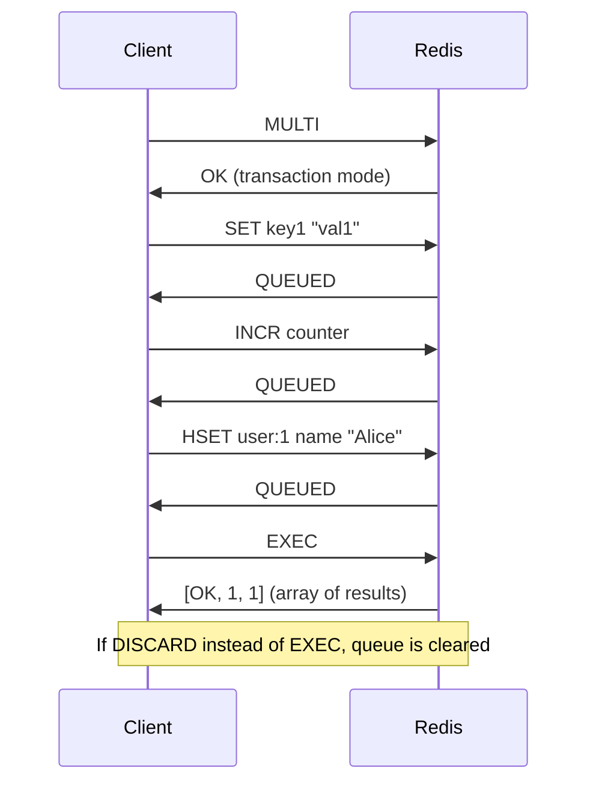

# 8.994 Redis — Transactions — MULTI, EXEC, DISCARD

## Section 1 — Overview

Redis transactions provide a mechanism to queue multiple commands and execute them atomically as a single unit. The transaction lifecycle consists of three commands: MULTI (start queuing), EXEC (execute all queued commands atomically), and DISCARD (cancel the transaction and discard all queued commands). Unlike traditional SQL database transactions, Redis transactions do NOT support rollback. If a queued command fails syntactically or produces a runtime error, the remaining commands in the queue still execute. Redis transactions are described as "all-or-nothing" in the sense that the entire block is executed sequentially without interleaving from other clients — but failed commands are simply skipped.

When a client issues MULTI, Redis switches the connection into transaction mode. All subsequent commands are queued rather than executed immediately. The client receives QUEUED responses for each command as confirmation of queuing. When EXEC is called, Redis executes all queued commands in FIFO order without interruption. The results of all commands are returned as a multi-bulk reply array. If DISCARD is called instead of EXEC, all queued commands are discarded and the connection returns to normal mode.

Redis transactions provide isolation: commands from other clients will not interleave with the transaction's commands. However, the commands within a transaction do not see each other's results. Each command operates on the state of the database as it existed when EXEC was called, not as modified by earlier commands in the same transaction. For operations that depend on the result of a previous command, Lua scripting is more appropriate.

The atomicity guarantee of Redis transactions means that either all commands are executed (by EXEC) or none are processed (by DISCARD or connection drop). However, if a queued command has a syntax error, Redis will refuse to execute the entire transaction and return an error. Runtime errors (e.g., applying a list operation to a string key) cause the failing command to return an error in the result array, but other commands in the transaction still execute normally. This behavior is fundamentally different from SQL transactions where a failure can roll back all changes.

Redis transactions also work in conjunction with WATCH for optimistic concurrency control. The WATCH command monitors one or more keys for changes. If any watched key is modified before EXEC, the transaction is aborted and returns nil. This provides a compare-and-set (CAS) mechanism without explicit locking. WATCH is covered in detail in note 8.995.

StackExchange.Redis exposes Redis transactions through the CreateTransaction method on IDatabase. It returns an ITransaction object that supports conditional execution via conditions. The library internally uses WATCH to implement conditions and automatically retries the transaction if a condition fails. This provides a high-level abstraction over the raw WATCH/MULTI/EXEC pattern.

Transactions in Redis have practical limitations. Since commands are queued but not executed until EXEC, you cannot branch logic based on intermediate results. Each command is executed in isolation and the output of one command cannot feed into another within the same transaction. For complex atomic operations, Redis recommends Lua scripting (EVAL/EVALSHA) which provides full control flow.

The NETWORK round-trips involved in a transaction add latency. MULTI, each queued command's acknowledgment, and EXEC each require at least one network exchange. In Redis Cluster mode, transactions are limited to keys that hash to the same slot. Multi-key transactions across slots will fail with a CROSSSLOT error. For cluster transactions, use hash tags to force related keys into the same slot.

Transaction queuing has a configurable upper bound. If the queue grows too large (exceeding the client-output-buffer-limit), Redis may disconnect the client. In practice, keep transactions small — typically fewer than 20-50 commands. For very large atomic batches, Lua scripting is more efficient because the entire script is sent as a single command.

### Transaction Lifecycle



### Key Characteristics

- **Atomic execution** — all commands execute sequentially without interleaving
- **No rollback** — runtime errors skip the failing command but others continue
- **Isolation** — no other client commands interleave with the transaction block
- **Command independence** — queued commands cannot use results of previous commands in the transaction
- **No nested transactions** — Redis does not support nested MULTI calls
- **WATCH integration** — optimistic locking via WATCH can abort the transaction

### When to Use Transactions vs Lua Scripting

| Criteria | Transactions (MULTI/EXEC) | Lua Scripting (EVAL) |
|----------|--------------------------|---------------------|
| Complexity | Simple batch of independent commands | Complex logic with branching |
| Command dependencies | No — commands are independent | Yes — use results of previous commands |
| Network round-trips | Multiple (MULTI + each command + EXEC) | Single (one EVAL command) |
| Error handling | Skip errors, continue execution | Full error handling with pcall |
| Performance | Good for small batches | Better for complex operations |
| Rollback support | None | None (but can implement manually) |
| Cluster support | Same-slot keys only | Same-slot keys only |

### Transaction Queuing Details

When a connection enters transaction mode via MULTI, Redis appends each subsequent command to a transaction queue. The server returns QUEUED for each command instead of executing it. Commands that cannot be queued (e.g., syntax errors) are rejected immediately and the transaction may be aborted depending on error type. Redis distinguishes between:

1. **Syntax errors** — command name is wrong or argument count is invalid. Redis rejects the entire transaction at EXEC time, returning an error.
2. **Runtime errors** — command is syntactically valid but fails during execution (e.g., LPUSH on a string value). The transaction executes but that particular command returns an error in the result array.

Commands queued in a transaction do not consume server CPU for execution — they are simply stored in memory. Only EXEC triggers actual execution. This means a transaction with thousands of queued commands will consume client output buffer memory proportional to the expected response sizes.

### Connection Behavior During Transactions

A connection in MULTI mode cannot execute commands outside the transaction. All commands are queued until EXEC or DISCARD. If the connection drops unexpectedly while in transaction mode, Redis discards the queued commands. The client library must detect this state and reinitialize accordingly. StackExchange.Redis handles this transparently — if a transaction fails due to connection issues, the ExecuteAsync method returns false and the application should retry.

The CLIENT command exposes information about the current connection state including whether it is in MULTI mode. The CLIENT LIST output shows flags indicating transaction state. This is useful for debugging stuck transactions or detecting abandoned transactions.

### Transactional Guarantees Summary

Redis transactions provide four of the five ACID properties under specific conditions:

- **Atomicity** — guaranteed: all commands execute or none (with the caveat that runtime errors do not stop execution)
- **Consistency** — guaranteed: Redis data type constraints are always enforced
- **Isolation** — guaranteed: no other client commands interleave
- **Durability** — depends on persistence configuration: no durability by default, requires AOF with appendfsync always for true durability

The "C" in ACID (consistency) is maintained by Redis's type system — you cannot store a list in a string key without conversion. Transaction execution does not violate data type constraints.

### Transaction Size Limits

The maximum number of commands in a transaction is limited by:
1. **Client output buffer** — 256 MB default soft limit, 512 MB hard limit for normal clients
2. **Network timeout** — long transactions may exceed client timeout
3. **Redis maxmemory** — if a transaction causes memory to exceed maxmemory, eviction may occur during execution
4. **Hard limit** — no explicit limit in Redis source, but practical constraints apply

For production systems, keep transactions to 10-50 commands and ensure each command is O(1) or low O(N). Transactions that include expensive commands like SINTER on large sets or KEYS on large databases can block Redis for extended periods.

## Section 2 — Command Reference

### Transaction Commands

| Command | Complexity | Description |
|---------|-----------|-------------|
| MULTI | O(1) | Start a transaction — switch connection to queuing mode |
| EXEC | O(N) where N is queued command count | Execute all queued commands atomically |
| DISCARD | O(1) | Discard all queued commands and exit transaction mode |
| WATCH key [keys...] | O(1) per key | Mark keys for optimistic locking (must be called before MULTI) |
| UNWATCH | O(1) | Unwatch all keys previously watched |

### MULTI Command Details

MULTI marks the start of a transaction block. After MULTI, the connection enters a special mode where every subsequent command is queued for later execution rather than being executed immediately. The server replies with +OK. MULTI cannot be called inside an existing transaction — Redis will return an error if you attempt nested transactions. Calling EXEC or DISCARD ends the transaction mode and returns the connection to normal command execution.

```bash
MULTI
# Output: OK
```

Nested MULTI is not supported:
```bash
MULTI
# Output: OK
MULTI
# Output: (error) ERR MULTI calls can not be nested
```

### EXEC Command Details

EXEC executes all commands queued since the previous MULTI. The commands execute sequentially and atomically — no other clients can execute commands during the execution of the transaction. EXEC returns a multi-bulk reply containing the results of each command in the order they were queued. Each element in the reply corresponds to the result of one command.

If the transaction was aborted by WATCH (i.e., a watched key was modified), EXEC returns nil (not an empty array). This signals to the client that the transaction did not execute and should be retried.

```bash
MULTI
SET k1 v1
INCR counter
HSET h1 f1 val1
EXEC
# Output: 1) OK  2) (integer) 1  3) (integer) 1
```

If any queued command has a syntax error, EXEC returns an error and the transaction is not executed:
```bash
MULTI
SET k1 v1
BADCOMMAND arg
EXEC
# Output: (error) EXECABORT Transaction discarded because of previous errors.
```

If a queued command fails at runtime, EXEC still executes the transaction but returns an error for the failed command:
```bash
MULTI
SET k1 v1
LPUSH k1 "should-not-work"  # type error — k1 is a string, not a list
INCR counter
EXEC
# Output: 1) OK  2) (error) WRONGTYPE Operation against a key holding the wrong kind of value  3) (integer) 1
```

Note that counter was still incremented even though LPUSH failed. This is the "no rollback" behavior of Redis transactions.

### DISCARD Command Details

DISCARD flushes all commands queued since MULTI and exits transaction mode. The server replies with +OK. Any WATCH conditions remain in effect after DISCARD if they were set before MULTI. To clear WATCH, call UNWATCH explicitly.

```bash
MULTI
SET k1 v1
SET k2 v2
DISCARD
# Output: OK
# Neither SET command was executed
```

### WATCH Command Details

WATCH marks one or more keys for optimistic locking. WATCH must be called before MULTI — calling WATCH inside a transaction returns an error. When WATCH is active on a key and that key is modified (by any client, including the watching client via commands outside a transaction before EXEC), the subsequent EXEC will return nil and no commands are executed.

```bash
WATCH key1 key2
GET key1
MULTI
SET key1 "newvalue"
EXEC
# If key1 was modified by another client between WATCH and EXEC, EXEC returns nil
```

UNWATCH clears all previously watched keys. This is useful after a transaction is abandoned (DISCARD) when you want to clear the watching state.

### UNWATCH Command Details

UNWATCH removes all watched keys from the current connection. This command works in normal mode (not inside a transaction). It returns OK. UNWATCH is automatically called on EXEC (whether the transaction succeeds or fails). DISCARD does NOT automatically un-watch keys — you must call UNWATCH explicitly if you want to clear WATCH after DISCARD.

### EXEC Result Array Interpretation

The return value of EXEC is a multi-bulk array. The length of the array equals the number of commands queued in the transaction. Each element in the array corresponds to the return value of one command in the order queued. The type of each element depends on the command:

| Command Example | Return Type | Example Value |
|----------------|-------------|---------------|
| SET key value | Status reply | OK |
| GET key | Bulk string | "value" |
| INCR key | Integer | 5 |
| EXISTS key | Integer | 1 or 0 |
| LPOP key | Bulk string or nil | "element" or nil for empty list |
| SMEMBERS key | Array | ["a", "b", "c"] |
| KEYS * | Array | ["k1", "k2"] |
| Runtime error | Error | WRONGTYPE error message |

When EXEC returns nil (not an array), it means the transaction was aborted by WATCH. The client should retry the entire transaction from the WATCH step.

### Transaction-Related Configuration

| Configuration | Default | Description |
|--------------|---------|-------------|
| client-output-buffer-limit normal | 0 0 0 | Soft/hard limit for normal clients (0 = unlimited) |
| client-output-buffer-limit pubsub | 32mb 8mb 60 | Limits for pub/sub clients |
| client-output-buffer-limit slave | 256mb 64mb 60 | Limits for replica clients |

Large transactions produce large EXEC results. If the combined result size exceeds the client output buffer limit, Redis may close the connection. Monitor `client-output-buffer-limit` in production when using large transactions.

### Transaction Command Flow Summary

```
Normal Mode → MULTI → Transaction Mode → (commands queued) → EXEC → Normal Mode
                                                          → DISCARD → Normal Mode
                                                          → Disconnect → (queue discarded)
```

```
Preparing for Transaction → WATCH keys → MULTI → Transaction Mode → commands → EXEC
                                                             (if WATCH key changed) → nil
```

## Section 3 — Redis CLI Examples

### Basic Transaction — Atomic Increment Multiple Counters

```bash
# Start transaction
MULTI

# Queue multiple counter increments
INCR page:visits
INCR page:impressions
INCR page:clicks

# Execute all at once
EXEC
```

Output:
```
1) (integer) 1
2) (integer) 1
3) (integer) 1
```

All three counters are incremented atomically — no other client can see an intermediate state where only some counters were updated.

### Transaction with Mixed Command Types

```bash
MULTI
SET user:active "true"
SADD online:users "alice"
ZADD leaderboard 100 "alice"
EXEC
```

Output:
```
1) OK
2) (integer) 1
3) (integer) 1
```

### Transaction with GET and SET — Non-Atomic for Read-Then-Write

Note that GET and SET in the same transaction do NOT see each other's results:

```bash
MULTI
GET counter
SET counter 100
EXEC
```

Output:
```
1) "42"      # GET returns the value BEFORE the transaction
2) OK        # SET executes after GET, but GET already returned the old value
```

If you need "read current value, modify, write new value" atomically, you must use either:
- WATCH (optimistic locking with retry)
- Lua scripting (EVAL/EVALSHA)

### Discarding a Transaction

```bash
MULTI
SET key1 "will-not-be-set"
SET key2 "will-not-be-set-either"
DISCARD
```

Output:
```
QUEUED
QUEUED
OK
```

After DISCARD, GET key1 returns nil — the SET commands were never executed.

### Transaction with Error Handling — Syntax Error Before EXEC

```bash
MULTI
SET key1 "value1"
SET key2   # missing argument — syntax error
SET key3 "value3"
EXEC
```

Output:
```
QUEUED
(error) ERR wrong number of arguments for 'set' command
QUEUED
(error) EXECABORT Transaction discarded because of previous errors.
```

The entire transaction is discarded because Redis detected the syntax error at queue time.

### Transaction with Error Handling — Runtime Error During EXEC

```bash
SET stringkey "hello"
MULTI
SET key1 "value1"
LPUSH stringkey "world"    # runtime error — stringkey is a string, not a list
SET key3 "value3"
EXEC
```

Output:
```
QUEUED
QUEUED
QUEUED
1) OK
2) (error) WRONGTYPE Operation against a key holding the wrong kind of value
3) OK
```

Key1 was set, key3 was set, but LPUSH failed. No rollback — the other commands still executed.

### Transaction with WATCH — Optimistic Locking

```bash
# Client A
WATCH account:balance
GET account:balance
# Output: "100"

MULTI
DECRBY account:balance 20
EXEC
# Output: 1) (integer) 80   (success — no one modified the key)
```

If another client modifies account:balance between WATCH and EXEC:

```bash
# Client B (modifies between Client A's WATCH and EXEC)
SET account:balance 50
```

Then Client A's EXEC returns nil — the transaction was aborted. Client A must retry the entire sequence.

### Transaction with Conditional Execution Pattern

Redis CLI does not support conditions (those are a StackExchange.Redis feature), but the underlying WATCH/MULTI/EXEC pattern enables conditional updates:

```bash
# Atomic INCR using WATCH (read current value, increment, write)
WATCH counter
current = GET counter
# Suppose current = "10"
MULTI
SET counter 11
EXEC
# If successful, counter is now 11
# If nil returned, some client modified counter — retry
```

This is the classic optimistic concurrency control pattern in Redis.

### Transaction with Multiple Queued Operations — E-Commerce Order Example

```bash
# Atomic order processing
WATCH stock:item42
remaining = GET stock:item42
# remaining = "5"

MULTI
DECR stock:item42
SADD orders:processed "order-abc-123"
INCR metrics:total-orders
EXEC
```

If stock changed during the process, EXEC returns nil and the application must retry (re-check stock, re-queue).

### Transaction Result Parsing in a Script

```bash
MULTI
SET key1 "a"
SET key2 "b"
SET key3 "c"
EXEC
```

Parse the result array:
```
1) OK
2) OK
3) OK
```

Each OK corresponds to one SET command, in order.

### Transaction with Mixed Results

```bash
MULTI
SET k v
STRLEN k
EXISTS k
DEL k
EXISTS k
EXEC
```

Output:
```
1) OK
2) (integer) 5    # STRLEN returned length of "value"
3) (integer) 1    # EXISTS returned 1 (key exists)
4) (integer) 1    # DEL returned 1 (deleted one key)
5) (integer) 0    # EXISTS returned 0 (key gone)
```

### Transaction with Nil Results

```bash
MULTI
GET nonexistent
LPOP emptylist
EXEC
```

Output:
```
1) (nil)          # GET returns nil for missing key
2) (nil)          # LPOP returns nil for empty list
```

## Section 4 — StackExchange.Redis Code

### Creating a Transaction — Basic Setup

```csharp
using StackExchange.Redis;

/// <summary>
/// Demonstrates basic Redis transaction usage with StackExchange.Redis.
/// Shows how to create a transaction, queue commands, and execute atomically.
/// </summary>
public class RedisTransactionDemo
{
    private readonly ConnectionMultiplexer _muxer;
    private readonly IDatabase _db;

    public RedisTransactionDemo(ConnectionMultiplexer muxer, int database = 0)
    {
        _muxer = muxer;
        _db = muxer.GetDatabase(database);
    }

    /// <summary>
    /// Executes a basic transaction — sets multiple keys atomically.
    /// If the transaction fails (e.g., connection issue), ExecuteAsync returns false.
    /// </summary>
    public async Task<bool> AtomicBulkSetAsync(string userId, string name, string email, int age)
    {
        var tran = _db.CreateTransaction();

        // Queue commands — they are NOT executed yet
        tran.StringSetAsync($"user:{userId}:name", name);
        tran.StringSetAsync($"user:{userId}:email", email);
        tran.StringSetAsync($"user:{userId}:age", age.ToString());

        // Execute all queued commands atomically
        bool committed = await tran.ExecuteAsync();

        if (committed)
        {
            Console.WriteLine($"[Transaction] User {userId} data set atomically.");
        }
        else
        {
            Console.WriteLine($"[Transaction] Failed — no commands were executed.");
        }

        return committed;
    }

    /// <summary>
    /// Transaction with a condition — only execute if a key exists.
    /// StackExchange.Redis internally uses WATCH to implement conditions.
    /// </summary>
    public async Task<bool> ConditionalUpdateAsync(string userId, string newEmail)
    {
        var tran = _db.CreateTransaction();

        // Add condition: only execute if the user key exists
        tran.AddCondition(Condition.KeyExists($"user:{userId}:name"));

        tran.StringSetAsync($"user:{userId}:email", newEmail);

        bool committed = await tran.ExecuteAsync();

        return committed;
    }

    /// <summary>
    /// Transaction with a key-not-exists condition (NX pattern).
    /// Only sets the value if the key does NOT exist.
    /// </summary>
    public async Task<bool> SetIfNotExistsAsync(string key, string value)
    {
        var tran = _db.CreateTransaction();

        tran.AddCondition(Condition.KeyNotExists(key));
        tran.StringSetAsync(key, value);

        return await tran.ExecuteAsync();
    }

    /// <summary>
    /// Transaction with string equality condition — compare-and-set.
    /// Only executes if the key currently holds the expected value.
    /// </summary>
    public async Task<bool> CompareAndSwapAsync(string key, string expectedValue, string newValue)
    {
        var tran = _db.CreateTransaction();

        tran.AddCondition(Condition.StringEqual(key, expectedValue));
        tran.StringSetAsync(key, newValue);

        return await tran.ExecuteAsync();
    }
}
```

### Transaction with WATCH Pattern — Manual Optimistic Locking

While StackExchange.Redis conditions use WATCH internally, you can also use WATCH directly for custom scenarios:

```csharp
public class OptimisticTransactionDemo
{
    private readonly ConnectionMultiplexer _muxer;
    private readonly IDatabase _db;

    public OptimisticTransactionDemo(ConnectionMultiplexer muxer)
    {
        _muxer = muxer;
        _db = muxer.GetDatabase();
    }

    /// <summary>
    /// Atomic counter increment using WATCH/MULTI/EXEC pattern.
    /// Reads current value, increments, writes — retries if concurrent modification detected.
    /// </summary>
    public async Task<long> AtomicIncrementAsync(string key, int retryCount = 5)
    {
        for (int attempt = 0; attempt < retryCount; attempt++)
        {
            // Create transaction — no conditions this time, we'll use WATCH manually
            var tran = _db.CreateTransaction();

            // Read current value
            var value = await _db.StringGetAsync(key);
            long currentValue = value.HasValue ? (long)value : 0;
            long newValue = currentValue + 1;

            // Queue the write
            tran.StringSetAsync(key, newValue);

            // Execute with retry
            if (await tran.ExecuteAsync())
            {
                return newValue;
            }

            // If we get here, the transaction was aborted (WATCH triggered).
            // Backoff slightly before retrying.
            if (attempt < retryCount - 1)
            {
                await Task.Delay(TimeSpan.FromMilliseconds(50 * (attempt + 1)));
            }
        }

        throw new InvalidOperationException($"Failed to increment {key} after {retryCount} attempts.");
    }

    /// <summary>
    /// Atomic check-and-set with hash field equality check.
    /// </summary>
    public async Task<bool> AtomicHashUpdateAsync(string hashKey, string field, string expectedValue, string newValue)
    {
        var tran = _db.CreateTransaction();

        tran.AddCondition(Condition.HashEqual(hashKey, field, expectedValue));
        tran.HashSetAsync(hashKey, field, newValue);

        return await tran.ExecuteAsync();
    }

    /// <summary>
    /// Atomic list push with length check — only push if list is shorter than maxLength.
    /// </summary>
    public async Task<bool> PushIfBelowMaxLengthAsync(string listKey, string value, long maxLength)
    {
        var tran = _db.CreateTransaction();

        tran.AddCondition(Condition.ListLengthLessThan(listKey, maxLength));
        tran.ListRightPushAsync(listKey, value);

        return await tran.ExecuteAsync();
    }

    /// <summary>
    /// Multi-condition transaction — all conditions must pass.
    /// </summary>
    public async Task<bool> TransferFundsAsync(string fromAccount, string toAccount, decimal amount)
    {
        var tran = _db.CreateTransaction();

        // Both accounts must exist
        tran.AddCondition(Condition.KeyExists(fromAccount));
        tran.AddCondition(Condition.KeyExists(toAccount));

        // Source account must have sufficient balance
        var fromBalance = await _db.StringGetAsync(fromAccount);
        if (!fromBalance.HasValue || (decimal)fromBalance < amount)
        {
            return false;
        }

        tran.StringDecrementAsync(fromAccount, (double)amount);
        tran.StringIncrementAsync(toAccount, (double)amount);

        return await tran.ExecuteAsync();
    }
}
```

### Transaction with Retry Logic — Production Pattern

```csharp
public class TransactionRetryHandler
{
    private readonly ConnectionMultiplexer _muxer;
    private readonly ILogger<TransactionRetryHandler> _logger;

    public TransactionRetryHandler(ConnectionMultiplexer muxer, ILogger<TransactionRetryHandler> logger)
    {
        _muxer = muxer;
        _logger = logger;
    }

    /// <summary>
    /// Executes a transaction with exponential backoff retry.
    /// The operation delegate constructs the transaction each attempt.
    /// </summary>
    public async Task<TResult> ExecuteWithRetryAsync<TResult>(
        Func<IDatabase, Task<(ITransaction transaction, TResult successValue)>> operationFactory,
        int maxRetries = 5,
        TimeSpan? baseDelay = null)
    {
        baseDelay ??= TimeSpan.FromMilliseconds(50);
        var db = _muxer.GetDatabase();

        for (int attempt = 0; attempt < maxRetries; attempt++)
        {
            try
            {
                var (tran, successValue) = await operationFactory(db);

                if (await tran.ExecuteAsync())
                {
                    return successValue;
                }

                _logger.LogWarning(
                    "Transaction attempt {Attempt}/{MaxRetries} failed (WATCH conflict). Retrying...",
                    attempt + 1, maxRetries);
            }
            catch (RedisTimeoutException ex)
            {
                _logger.LogError(ex,
                    "Transaction attempt {Attempt}/{MaxRetries} timed out.",
                    attempt + 1, maxRetries);
            }
            catch (RedisConnectionException ex) when (attempt < maxRetries - 1)
            {
                _logger.LogError(ex,
                    "Transaction attempt {Attempt}/{MaxRetries} connection error. Retrying...",
                    attempt + 1, maxRetries);
            }
            catch (RedisServerException ex) when (ex.Message.Contains("EXECABORT"))
            {
                _logger.LogError(ex,
                    "Transaction aborted — syntax error in queued commands.");
                throw; // Syntax errors will never succeed — don't retry
            }

            if (attempt < maxRetries - 1)
            {
                var delay = TimeSpan.FromMilliseconds(
                    baseDelay.Value.TotalMilliseconds * Math.Pow(2, attempt));
                await Task.Delay(delay);
            }
        }

        throw new InvalidOperationException(
            $"Transaction failed after {maxRetries} attempts.");
    }

    /// <summary>
    /// Example usage: atomic counter update with retry.
    /// </summary>
    public async Task<long> AtomicCounterUpdateAsync(string counterKey, long incrementBy)
    {
        return await ExecuteWithRetryAsync(async (db) =>
        {
            var currentValue = await db.StringGetAsync(counterKey);
            long newValue = (currentValue.HasValue ? (long)currentValue : 0) + incrementBy;

            var tran = db.CreateTransaction();
            tran.AddCondition(Condition.StringEqual(counterKey, currentValue));
            tran.StringSetAsync(counterKey, newValue);

            return (tran, newValue);
        });
    }
}
```

### Transaction with Result Handling — Reading Command Outputs

```csharp
public class TransactionResultHandler
{
    private readonly ConnectionMultiplexer _muxer;

    public TransactionResultHandler(ConnectionMultiplexer muxer)
    {
        _muxer = muxer;
    }

    /// <summary>
    /// Executes a transaction and reads results from individual queued commands.
    /// Each command returns a Task<T> that resolves when ExecuteAsync completes.
    /// </summary>
    public async Task<TransactionResults> ExecuteBatchAsync(string keyPrefix)
    {
        var db = _muxer.GetDatabase();
        var tran = db.CreateTransaction();

        // Queue commands and capture their result tasks
        var setResult1 = tran.StringSetAsync($"{keyPrefix}:1", "value1");
        var setResult2 = tran.StringSetAsync($"{keyPrefix}:2", "value2");
        var getResult1 = tran.StringGetAsync($"{keyPrefix}:1");
        var incrementResult = tran.StringIncrementAsync($"{keyPrefix}:counter");
        var existsResult = tran.KeyExistsAsync($"{keyPrefix}:1");
        var deleteResult = tran.KeyDeleteAsync($"{keyPrefix}:1");
        var typeResult = tran.KeyTypeAsync($"{keyPrefix}:2");

        // Execute — this resolves all queued command tasks
        bool committed = await tran.ExecuteAsync();

        if (!committed)
        {
            return new TransactionResults { Committed = false };
        }

        // Read results from the queued command tasks
        return new TransactionResults
        {
            Committed = true,
            Set1Ok = await setResult1,
            Set2Ok = await setResult2,
            Get1Value = await getResult1,
            IncrementedValue = await incrementResult,
            KeyExists = await existsResult,
            KeyDeleted = await deleteResult,
            KeyType = await typeResult
        };
    }

    public class TransactionResults
    {
        public bool Committed { get; set; }
        public bool Set1Ok { get; set; }
        public bool Set2Ok { get; set; }
        public RedisValue Get1Value { get; set; }
        public long IncrementedValue { get; set; }
        public bool KeyExists { get; set; }
        public bool KeyDeleted { get; set; }
        public RedisType KeyType { get; set; }
    }
}
```

### Transaction with Multiple Conditions

```csharp
public class MultiConditionTransaction
{
    private readonly ConnectionMultiplexer _muxer;

    public MultiConditionTransaction(ConnectionMultiplexer muxer)
    {
        _muxer = muxer;
    }

    /// <summary>
    /// Transaction with multiple conditions — all must pass for execution.
    /// Demonstrates atomic user registration: only register if username and email are both available.
    /// </summary>
    public async Task<bool> AtomicUserRegistrationAsync(
        string username, string email, string displayName)
    {
        var db = _muxer.GetDatabase();
        var tran = db.CreateTransaction();

        // Conditions: username and email must not already exist
        tran.AddCondition(Condition.KeyNotExists($"user:{username}"));
        tran.AddCondition(Condition.KeyNotExists($"email:{email}"));

        // Queue the registration commands
        tran.HashSetAsync($"user:{username}", new HashEntry[]
        {
            new("email", email),
            new("display_name", displayName),
            new("created_at", DateTimeOffset.UtcNow.ToUnixTimeSeconds().ToString()),
            new("status", "active")
        });
        tran.StringSetAsync($"email:{email}", username);

        return await tran.ExecuteAsync();
    }

    /// <summary>
    /// Atomic inventory reservation — decrement stock only if sufficient quantity.
    /// </summary>
    public async Task<bool> TryReserveInventoryAsync(
        string sku, int quantity, string orderId)
    {
        var db = _muxer.GetDatabase();
        var currentStock = await db.StringGetAsync($"stock:{sku}");
        int currentQty = currentStock.HasValue ? (int)currentStock : 0;

        if (currentQty < quantity)
            return false;

        var tran = db.CreateTransaction();

        // Condition: stock must have the same value as when we read it
        tran.AddCondition(Condition.StringEqual($"stock:{sku}", currentStock));

        tran.StringDecrementAsync($"stock:{sku}", quantity);
        tran.HashSetAsync($"order:{orderId}", new HashEntry[]
        {
            new("sku", sku),
            new("quantity", quantity.ToString()),
            new("status", "reserved"),
            new("reserved_at", DateTimeOffset.UtcNow.ToUnixTimeSeconds().ToString())
        });

        return await tran.ExecuteAsync();
    }

    /// <summary>
    /// Demonstrates using Condition.HashEqual for atomic hash field updates.
    /// </summary>
    public async Task<bool> UpdateHashFieldIfUnchangedAsync(
        string hashKey, string field, string expectedValue, string newValue)
    {
        var db = _muxer.GetDatabase();
        var tran = db.CreateTransaction();

        tran.AddCondition(Condition.HashEqual(hashKey, field, expectedValue));
        tran.HashSetAsync(hashKey, field, newValue);

        return await tran.ExecuteAsync();
    }

    /// <summary>
    /// Transaction with sorted set score condition.
    /// Only increments score if the member exists and score is within expected range.
    /// </summary>
    public async Task<bool> ConditionalScoreIncrementAsync(
        string sortedSetKey, string member, double incrementBy, double expectedScore)
    {
        var db = _muxer.GetDatabase();
        var currentScore = await db.SortedSetScoreAsync(sortedSetKey, member);

        if (!currentScore.HasValue)
            return false;

        var tran = db.CreateTransaction();

        // Condition: member must still have the same score
        tran.AddCondition(Condition.SortedSetEqual(sortedSetKey, member, expectedScore));

        tran.SortedSetIncrementAsync(sortedSetKey, member, incrementBy);

        return await tran.ExecuteAsync();
    }
}
```

### Transaction Performance Benchmarking

```csharp
public class TransactionBenchmark
{
    private readonly ConnectionMultiplexer _muxer;

    public TransactionBenchmark(ConnectionMultiplexer muxer)
    {
        _muxer = muxer;
    }

    /// <summary>
    /// Benchmarks transaction throughput for different batch sizes.
    /// </summary>
    public async Task<BenchmarkResult> RunBenchmarkAsync(int batchSize, int iterations)
    {
        var db = _muxer.GetDatabase();
        var results = new BenchmarkResult();

        var stopwatch = System.Diagnostics.Stopwatch.StartNew();

        for (int i = 0; i < iterations; i++)
        {
            var tran = db.CreateTransaction();

            for (int j = 0; j < batchSize; j++)
            {
                tran.StringSetAsync($"bench:{i}:{j}", j.ToString());
            }

            bool committed = await tran.ExecuteAsync();
            if (!committed) results.Failures++;
        }

        stopwatch.Stop();
        results.Elapsed = stopwatch.Elapsed;
        results.TotalOperations = iterations * batchSize;
        results.BatchSize = batchSize;

        return results;
    }
}

public class BenchmarkResult
{
    public TimeSpan Elapsed { get; set; }
    public int TotalOperations { get; set; }
    public int BatchSize { get; set; }
    public int Failures { get; set; }

    public double OperationsPerSecond =>
        TotalOperations / Elapsed.TotalSeconds;

    public double AverageLatencyMs =>
        Elapsed.TotalMilliseconds / (TotalOperations / BatchSize);
}
```

### Transaction Error Handling — Complete Example

```csharp
public class TransactionErrorHandling
{
    private readonly ConnectionMultiplexer _muxer;
    private readonly ILogger _logger;

    public TransactionErrorHandling(ConnectionMultiplexer muxer, ILogger logger)
    {
        _muxer = muxer;
        _logger = logger;
    }

    /// <summary>
    /// Demonstrates proper error handling for Redis transactions.
    /// Covers connection failures, WATCH conflicts, and syntax errors.
    /// </summary>
    public async Task<TransactionResult> SafeTransactionAsync(string key, string value)
    {
        try
        {
            var db = _muxer.GetDatabase();
            var tran = db.CreateTransaction();

            tran.StringSetAsync(key, value);
            tran.StringSetAsync($"{key}:meta", value);

            bool committed = await tran.ExecuteAsync();

            if (!committed)
            {
                _logger.LogWarning("Transaction aborted — WATCH conflict on key {Key}.", key);
                return TransactionResult.Conflict();
            }

            return TransactionResult.Success();
        }
        catch (RedisConnectionException ex)
        {
            _logger.LogError(ex, "Redis connection lost during transaction on key {Key}.", key);
            return TransactionResult.Failure("Connection lost: " + ex.Message);
        }
        catch (RedisTimeoutException ex)
        {
            _logger.LogError(ex, "Redis timeout during transaction on key {Key}.", key);
            return TransactionResult.Failure("Timeout: " + ex.Message);
        }
        catch (RedisServerException ex)
        {
            _logger.LogError(ex, "Redis server error during transaction on key {Key}.", key);
            return TransactionResult.Failure("Server error: " + ex.Message);
        }
        catch (ObjectDisposedException ex)
        {
            _logger.LogError(ex, "ConnectionMultiplexer was disposed during transaction.");
            return TransactionResult.Failure("Connection disposed: " + ex.Message);
        }
    }

    public record TransactionResult
    {
        public bool Success { get; init; }
        public bool Conflict { get; init; }
        public string ErrorMessage { get; init; }
        public bool IsError => !Success && !Conflict;

        public static TransactionResult Success() =>
            new() { Success = true, Conflict = false };

        public static TransactionResult Conflict() =>
            new() { Success = false, Conflict = true };

        public static TransactionResult Failure(string message) =>
            new() { Success = false, Conflict = false, ErrorMessage = message };
    }
}
```

### Transaction with AsyncLazy — Connection Resilient Pattern

```csharp
public class ResilientTransactionExecutor
{
    private readonly Func<Task<ConnectionMultiplexer>> _muxerFactory;
    private readonly ILogger _logger;

    public ResilientTransactionExecutor(
        Func<Task<ConnectionMultiplexer>> muxerFactory,
        ILogger logger)
    {
        _muxerFactory = muxerFactory;
        _logger = logger;
    }

    /// <summary>
    /// Executes a transaction with automatic reconnection on failure.
    /// If the connection is lost, it recreates the muxer and retries once.
    /// </summary>
    public async Task<bool> ExecuteWithReconnectAsync(
        Func<IDatabase, ITransaction> buildTransaction)
    {
        var muxer = await _muxerFactory();
        var db = muxer.GetDatabase();

        try
        {
            var tran = buildTransaction(db);
            return await tran.ExecuteAsync();
        }
        catch (RedisConnectionException ex)
        {
            _logger.LogWarning(ex, "Connection failed, attempting reconnect...");

            // Force reconnection by disposing current muxer
            muxer.Dispose();

            // Create new connection and retry
            var newMuxer = await _muxerFactory();
            var newDb = newMuxer.GetDatabase();
            var retryTran = buildTransaction(newDb);
            return await retryTran.ExecuteAsync();
        }
    }
}
```

### Transaction with Conditional and Result Combination

```csharp
public class OrderProcessingService
{
    private readonly ConnectionMultiplexer _muxer;

    public OrderProcessingService(ConnectionMultiplexer muxer)
    {
        _muxer = muxer;
    }

    /// <summary>
    /// Complete order processing workflow using a single transaction.
    /// Decrements stock, adds to user's order history, increments metrics.
    /// All operations succeed or none do.
    /// </summary>
    public async Task<bool> ProcessOrderAsync(Order order)
    {
        var db = _muxer.GetDatabase();
        var tran = db.CreateTransaction();

        // Condition: order must not already be processed
        tran.AddCondition(Condition.KeyNotExists($"order:{order.Id}:processed"));

        // Queue all order processing operations
        tran.StringDecrementAsync($"stock:{order.Sku}", order.Quantity);
        tran.ListRightPushAsync($"user:{order.UserId}:orders", order.Id);
        tran.HashSetAsync($"order:{order.Id}", new HashEntry[]
        {
            new("user_id", order.UserId),
            new("sku", order.Sku),
            new("quantity", order.Quantity),
            new("total", order.Total.ToString("F2")),
            new("status", "confirmed"),
            new("timestamp", DateTimeOffset.UtcNow.ToUnixTimeSeconds().ToString())
        });
        tran.StringIncrementAsync($"metrics:total-orders");
        tran.StringIncrementAsync($"metrics:revenue", (double)order.Total);
        tran.SetAddAsync($"sku:{order.Sku}:orders", order.Id);

        bool committed = await tran.ExecuteAsync();

        if (!committed)
        {
            _logger.LogWarning("Order {OrderId} was already processed or stock changed.", order.Id);
        }

        return committed;
    }

    private static readonly ILogger _logger = 
        LoggerFactory.Create(b => b.AddConsole()).CreateLogger<OrderProcessingService>();
}

public record Order
{
    public string Id { get; init; }
    public string UserId { get; init; }
    public string Sku { get; init; }
    public int Quantity { get; init; }
    public decimal Total { get; init; }
}
```

## Section 5 — Use Cases

### Atomic Bulk Write Operations

The most common use case for Redis transactions is performing multiple writes atomically. When you need to update several related keys and ensure that either all the changes are applied or none of them are, a transaction guarantees atomicity. Examples include:

- Setting multiple fields of a user profile across different keys
- Updating several counters that must remain consistent
- Writing to multiple indices in a denormalized data model

```csharp
/// <summary>
/// Atomically updates a user's profile across multiple keys.
/// </summary>
public async Task<bool> UpdateUserProfileAsync(string userId, string name, string email, string phone)
{
    var db = _muxer.GetDatabase();
    var tran = db.CreateTransaction();

    tran.StringSetAsync($"user:{userId}:name", name);
    tran.StringSetAsync($"user:{userId}:email", email);
    tran.StringSetAsync($"user:{userId}:phone", phone);

    return await tran.ExecuteAsync();
}
```

### Registry or Lock Pattern — Set If Not Exists

Using Condition.KeyNotExists, you can implement a distributed registry that ensures each resource is claimed only once. This is the foundation of Redis-based distributed locks.

```csharp
/// <summary>
/// Attempts to acquire a distributed lock using transaction-based NX pattern.
/// </summary>
public async Task<bool> TryAcquireLockAsync(string lockKey, string lockToken, TimeSpan expiry)
{
    var db = _muxer.GetDatabase();
    var tran = db.CreateTransaction();

    tran.AddCondition(Condition.KeyNotExists(lockKey));
    tran.StringSetAsync(lockKey, lockToken, expiry);

    return await tran.ExecuteAsync();
}
```

### Atomic Counter Batch Update

When you need to increment multiple counters in a way that always represents a consistent snapshot, wrap them in a transaction.

```csharp
/// <summary>
/// Atomically updates page analytics counters.
/// </summary>
public async Task RecordPageViewAsync(string pageId)
{
    var db = _muxer.GetDatabase();
    var tran = db.CreateTransaction();

    tran.StringIncrementAsync($"page:{pageId}:views");
    tran.StringIncrementAsync($"page:{pageId}:impressions");
    tran.StringIncrementAsync($"global:total-views");

    await tran.ExecuteAsync();
}
```

### Consistent Hash Updates

When reading a hash, modifying a field locally, and writing it back, a transaction with Condition.HashEqual ensures consistency under concurrent access.

```csharp
/// <summary>
/// Increments a game player's score atomically with conditional check.
/// </summary>
public async Task<bool> IncrementPlayerScoreAsync(string playerId, int points)
{
    var db = _muxer.GetDatabase();
    var currentScore = await db.HashGetAsync($"player:{playerId}", "score");
    int newScore = (currentScore.HasValue ? (int)currentScore : 0) + points;

    var tran = db.CreateTransaction();
    tran.AddCondition(Condition.HashEqual($"player:{playerId}", "score", currentScore));
    tran.HashSetAsync($"player:{playerId}", "score", newScore);

    return await tran.ExecuteAsync();
}
```

### Financial Transactions

While Redis is not a primary financial database, its atomic operations are useful for non-critical financial counters and budgeting systems where eventual consistency is acceptable.

```csharp
/// <summary>
/// Transfers credits between two user accounts atomically.
/// Both the debit and credit occur in the same transaction.
/// </summary>
public async Task<bool> TransferCreditsAsync(string fromUser, string toUser, int amount)
{
    var db = _muxer.GetDatabase();
    var fromBalance = await db.StringGetAsync($"credits:{fromUser}");
    var toBalance = await db.StringGetAsync($"credits:{toUser}");

    if (!fromBalance.HasValue || (int)fromBalance < amount)
        return false;

    var tran = db.CreateTransaction();

    tran.AddCondition(Condition.StringEqual($"credits:{fromUser}", fromBalance));
    tran.AddCondition(Condition.StringEqual($"credits:{toUser}", toBalance));

    tran.StringDecrementAsync($"credits:{fromUser}", amount);
    tran.StringIncrementAsync($"credits:{toUser}", amount);

    return await tran.ExecuteAsync();
}
```

### Session Management with Atomic Expiry Update

Transactions can update session data along with extending TTL atomically.

```csharp
/// <summary>
/// Updates session data and extends TTL in a single atomic operation.
/// </summary>
public async Task<bool> UpdateSessionAsync(string sessionId, string newData, TimeSpan ttl)
{
    var db = _muxer.GetDatabase();
    var tran = db.CreateTransaction();

    tran.StringSetAsync($"session:{sessionId}", newData);
    tran.KeyExpireAsync($"session:{sessionId}", ttl);

    return await tran.ExecuteAsync();
}
```

### Game State — Atomic Level Unlock

In a gaming scenario, you might want to atomically check if a player has enough experience points to unlock a new level, then deduct the points and record the unlock.

```csharp
/// <summary>
/// Atomically unlocks a level for a player if they have enough XP.
/// </summary>
public async Task<bool> TryUnlockLevelAsync(string playerId, int level, int xpCost)
{
    var db = _muxer.GetDatabase();
    var currentXp = await db.HashGetAsync($"player:{playerId}", "xp");
    int xp = currentXp.HasValue ? (int)currentXp : 0;

    if (xp < xpCost)
        return false;

    var tran = db.CreateTransaction();

    tran.AddCondition(Condition.HashEqual($"player:{playerId}", "xp", currentXp));
    tran.HashDecrementAsync($"player:{playerId}", "xp", xpCost);
    tran.SetAddAsync($"player:{playerId}:unlocked-levels", level);

    return await tran.ExecuteAsync();
}
```

### Inventory Reservation — E-Commerce

Reserving inventory items in a shopping cart scenario, ensuring no overselling.

```csharp
/// <summary>
/// Reserves items in inventory for a user's cart.
/// Each item reservation is conditional on stock availability.
/// </summary>
public async Task<bool> ReserveCartItemsAsync(string cartId, Dictionary<string, int> items)
{
    var db = _muxer.GetDatabase();
    var tran = db.CreateTransaction();

    foreach (var (sku, quantity) in items)
    {
        // Condition: enough stock available
        tran.AddCondition(Condition.HashFieldExistsOrNotExists($"stock:{sku}", "available", true));
        // Note: this is simplified — a true production system would use Lua for complex checks
    }

    foreach (var (sku, quantity) in items)
    {
        tran.HashIncrementAsync($"stock:{sku}", "reserved", quantity);
        tran.HashDecrementAsync($"stock:{sku}", "available", quantity);
        tran.HashSetAsync($"cart:{cartId}:items", sku, quantity);
    }

    return await tran.ExecuteAsync();
}
```

### Rate Limiting with Transactions

While Lua scripting is typically preferred for rate limiting, transactions can be used for simpler rate limit schemes.

```csharp
/// <summary>
/// Simple transaction-based rate limiter.
/// Increments a counter and checks if the limit is exceeded.
/// Note: This is a simplified example — production rate limiting should use Lua or sorted sets.
/// </summary>
public async Task<bool> IsRateLimitedAsync(string userId, string action, int maxRequests, TimeSpan window)
{
    var db = _muxer.GetDatabase();
    var key = $"ratelimit:{userId}:{action}";

    var tran = db.CreateTransaction();
    tran.StringIncrementAsync(key);
    tran.KeyExpireAsync(key, window, ExpireWhen.Never, CommandFlags.FireAndForget);

    if (!await tran.ExecuteAsync())
    {
        // Transaction failed — conservative approach: assume rate limited
        return true;
    }

    var currentCount = await db.StringGetAsync(key);
    return currentCount.HasValue && (int)currentCount > maxRequests;
}
```

### Data Migration — Atomic Key Rename with Verification

When migrating data between key formats, transactions ensure that both the old and new state are consistent.

```csharp
/// <summary>
/// Atomically migrates data from old key format to new format.
/// If the transaction fails, both old and new keys remain unchanged.
/// </summary>
public async Task<bool> AtomicKeyMigrationAsync(string oldKey, string newKey)
{
    var db = _muxer.GetDatabase();
    var value = await db.StringGetAsync(oldKey);
    var ttl = await db.KeyTimeToLiveAsync(oldKey);

    if (!value.HasValue)
        return false;

    var tran = db.CreateTransaction();

    tran.AddCondition(Condition.KeyExists(oldKey));
    tran.StringSetAsync(newKey, value.ToString());
    if (ttl.HasValue)
    {
        tran.KeyExpireAsync(newKey, ttl.Value);
    }
    tran.KeyDeleteAsync(oldKey);

    return await tran.ExecuteAsync();
}
```

### Multi-Key Cache Invalidation

When a cache entry depends on multiple source keys, invalidate them atomically.

```csharp
/// <summary>
/// Atomically invalidates multiple cache entries related to a domain object.
/// </summary>
public async Task InvalidateCacheAtomicallyAsync(string entityType, string entityId)
{
    var db = _muxer.GetDatabase();
    var tran = db.CreateTransaction();

    tran.KeyDeleteAsync($"cache:{entityType}:{entityId}:detail");
    tran.KeyDeleteAsync($"cache:{entityType}:{entityId}:summary");
    tran.KeyDeleteAsync($"cache:{entityType}:{entityId}:related");
    tran.SetRemoveAsync($"cache:{entityType}:index", entityId);

    await tran.ExecuteAsync();
}
```

## Section 6 — Performance Considerations

### Transaction Execution Cost

The cost of a Redis transaction consists of:
1. **Network round-trips** — MULTI (1 RTT), each queued command acknowledgment (N RTTs in pipelining implementations), EXEC (1 RTT). In practice, SE.Redis pipelines these, so the cost is closer to 2-3 RTTs regardless of command count.
2. **Queuing overhead** — each command in the transaction queue consumes server memory proportional to the command length and argument sizes.
3. **Execution time** — the sum of execution times of all commands. Since Redis is single-threaded, the transaction blocks all other operations for its duration.
4. **Response deserialization** — the EXEC result array must be deserialized on the client, which has O(N) cost for N results.

### Transaction vs Pipeline

Transactions and pipelining both batch commands, but differ in atomicity:

| Aspect | Transaction | Pipeline |
|--------|------------|----------|
| Atomicity | All-or-nothing execution | No atomic guarantee |
| Isolation | No interleaving | Commands may interleave with other clients |
| Queuing | MULTI required | No MULTI needed |
| Server load | Higher (must track queue state) | Lower |
| Use case | Need atomicity | Need throughput, no atomicity needed |

For scenarios where you only need to batch unrelated commands for network efficiency, use pipelining instead of transactions. Pipelining is significantly cheaper because it does not require queue management or atomic execution guarantees.

```csharp
// Pipelining — for batched operations without atomicity
public async Task PipelineBatchAsync(string[] keys, string value)
{
    var db = _muxer.GetDatabase();
    var batch = db.CreateBatch();

    var tasks = new Task[keys.Length];
    for (int i = 0; i < keys.Length; i++)
    {
        tasks[i] = batch.StringSetAsync(keys[i], value);
    }

    batch.Execute();
    await Task.WhenAll(tasks);
}

// Transaction — for atomic batch operations
public async Task TransactionBatchAsync(string[] keys, string value)
{
    var db = _muxer.GetDatabase();
    var tran = db.CreateTransaction();

    foreach (var key in keys)
    {
        tran.StringSetAsync(key, value);
    }

    await tran.ExecuteAsync();
}
```

### Network Round-Trip Optimization

StackExchange.Redis optimizes transaction network usage by pipelining the queuing phase. When you call multiple methods on an ITransaction, the library queues them in memory and sends them to Redis in a single batch when you call ExecuteAsync. This means:
- MULTI and all QUEUED commands are sent in one network write
- EXEC is sent separately
- The response array is read in one network read

This reduces the effective RTT cost to approximately 2 round-trips regardless of command count.

### Memory Considerations for Large Transactions

When queuing many commands in a transaction, be mindful of:
- **Client output buffer** — Redis maintains an output buffer for each client. Large EXEC results may exceed client-output-buffer-limit, causing Redis to disconnect the client.
- **Queue memory** — each queued command stores a reference to the command and its arguments in memory. For transactions with thousands of large-value commands, this can be significant.
- **Network buffer** — the client must hold the complete result array in memory before returning it to the caller.

Monitor `INFO CLIENTS` for `client_longest_output_list` to detect clients with unusually large output buffers.

### Transaction Throughput Benchmarks

Expected performance characteristics on a modern Redis instance (single-threaded, local network):

| Transaction Size | Ops/sec (approx) | Latency p50 | Latency p99 |
|-----------------|-------------------|-------------|-------------|
| 1 command | 100,000 | 0.5ms | 2ms |
| 10 commands | 40,000 | 1.5ms | 5ms |
| 50 commands | 10,000 | 5ms | 15ms |
| 100 commands | 5,000 | 10ms | 30ms |

These numbers degrade significantly if commands are complex (large O(N) operations). For maximum throughput, keep each individual command O(1).

### Transaction Size Guidelines

- **Keep transactions small** — 10-50 commands is typical for production
- **Avoid expensive commands inside transactions** — KEYS, SINTER on large sets, LRANGE on long lists block Redis
- **Prefer Lua scripts for complex logic** — single EVAL call, no queuing overhead
- **Monitor transaction latency** — add instrumentation around ExecuteAsync calls
- **Set realistic timeouts** — configure syncTimeout (default 5000ms) based on expected transaction duration

### Impact on Replication

Transactions are replicated to replicas as a single unit when using AOF or replication. The entire transaction is propagated as:
```
MULTI
... commands ...
EXEC
```

This means replicas execute the transaction atomically as well, preserving consistency. However, very large transactions increase replication lag because the replica must process the entire transaction before it can accept more data from the primary.

### Transaction and Lua Decision Matrix

For a given atomic operation, choose between transactions and Lua:

| Pattern | Recommended Approach |
|---------|---------------------|
| Batch independent SET/INCR ops | Transaction |
| Check-and-set (CAS) | Transaction with WATCH (or Lua) |
| Read-modify-write with conditionals | Lua scripting |
| Complex branching logic | Lua scripting |
| Simple multi-key writes | Transaction |
| Multi-key reads-writes with dependencies | Lua scripting |
| Rate limiting (increment + check threshold) | Lua scripting |
| Distributed lock acquisition | Transaction with KeyNotExists |

## Section 7 — Production Considerations

### Connection Pooling and Transactions

Each ConnectionMultiplexer manages a single logical connection to Redis. Transactions occupy that connection during execution. If you call ExecuteAsync and the transaction is large, other callers sharing the same multiplexer must wait for it to complete. In high-concurrency scenarios:

- Keep transactions small and fast (< 5ms execution time)
- Use async/await to avoid blocking the multiplexer's worker threads
- Consider dedicated multiplexers for long-running operations if needed
- Monitor `INFO CLIENT` for connected_clients and blocked_clients

### WATCH and Connection State Management

WATCH state is per-connection. If you use CreateTransaction with conditions, StackExchange.Redis manages WATCH internally. However, if you use raw WATCH commands alongside transactions, be aware:

- WATCH must be called on the same connection (same IDatabase instance)
- WATCH state persists after DISCARD — call UNWATCH or start a new transaction
- WATCH is automatically cleared by a successful EXEC (regardless of whether the transaction was aborted)
- Do not manually call WATCH when using conditions — SE.Redis does this automatically

```csharp
// BAD — calling WATCH manually while using conditions
var db = _muxer.GetDatabase();
await db.ExecuteAsync("WATCH", "key1");  // Manual WATCH

var tran = db.CreateTransaction();
tran.AddCondition(Condition.KeyExists("key1"));  // SE.Redis also calls WATCH
await tran.ExecuteAsync();
// WATCH is now set multiple times — unexpected behavior

// GOOD — let SE.Redis handle WATCH via conditions
var db = _muxer.GetDatabase();
var tran = db.CreateTransaction();
tran.AddCondition(Condition.KeyExists("key1"));  // SE.Redis handles WATCH
await tran.ExecuteAsync();
```

### Error Handling in Production

Production transaction error handling should distinguish between:

1. **Transient errors** — connection drops, timeouts, cluster failover → retry with backoff
2. **WATCH conflicts** — condition failed → retry the entire logic (re-read, re-compute)
3. **Permanent errors** — syntax errors in commands, type errors → fix the code, do not retry
4. **EXECABORT** — syntax error detected at queue time → do not retry

```csharp
public enum TransactionFailureReason
{
    WatchConflict,
    ConnectionLost,
    Timeout,
    SyntaxError,
    ServerError,
    Unknown
}

public class TransactionResult
{
    public bool Succeeded { get; init; }
    public TransactionFailureReason? FailureReason { get; init; }
    public Exception Exception { get; init; }
    public bool ShouldRetry => FailureReason is
        TransactionFailureReason.WatchConflict or
        TransactionFailureReason.ConnectionLost or
        TransactionFailureReason.Timeout;
}
```

### Monitoring Transaction Health

Track these metrics to ensure transaction health:

- **Transaction success rate** — percentage of ExecuteAsync calls returning true
- **Transaction latency** — duration from CreateTransaction to ExecuteAsync completion
- **Transaction size** — number of commands per transaction
- **WATCH conflict rate** — frequency of condition failures
- **EXECABORT errors** — syntax errors requiring code fixes

Set up alerts for:
- Transaction success rate dropping below 99%
- P99 transaction latency exceeding 100ms
- Any EXECABORT errors (indicates programming errors)
- Client output buffer limits being exceeded

### Thread Safety

StackExchange.Redis's ITransaction object is NOT thread-safe for concurrent modification:
- Do not share an ITransaction across threads
- Do not queue commands on an ITransaction from multiple tasks simultaneously
- Do not read result tasks before ExecuteAsync completes
- Create a new ITransaction per atomic operation

```csharp
// BAD — sharing transaction across tasks
var tran = db.CreateTransaction();
var tasks = new Task<bool>[10];
for (int i = 0; i < 10; i++)
{
    int index = i;
    tasks[i] = Task.Run(async () =>
    {
        tran.StringSetAsync($"key{index}", "value");  // NOT thread-safe
        return await tran.ExecuteAsync();  // Multiple calls to ExecuteAsync
    });
}
await Task.WhenAll(tasks);  // Undefined behavior

// GOOD — one transaction per operation
var tasks = new Task<bool>[10];
for (int i = 0; i < 10; i++)
{
    int index = i;
    tasks[i] = TransactionSetAsync($"key{index}", "value");
}
await Task.WhenAll(tasks);

private async Task<bool> TransactionSetAsync(string key, string value)
{
    var db = _muxer.GetDatabase();
    var tran = db.CreateTransaction();
    tran.StringSetAsync(key, value);
    return await tran.ExecuteAsync();
}
```

### Cluster Mode Considerations

In Redis Cluster mode, transactions have additional restrictions:
- All keys in a transaction must belong to the same hash slot
- Multi-key operations (MSET, SINTER, etc.) also require same-slot keys
- Use hash tags ({user:123}) to co-locate related keys in the same slot
- StackExchange.Redis handles MOVED/ASK redirections during transaction execution
- During resharding, transactions may fail with MOVED/ASK redirects — SE.Redis retries automatically

```csharp
// Using hash tags to ensure keys are in the same slot
var userId = "user:42";
var tran = db.CreateTransaction();
tran.StringSetAsync($"{{{userId}}}:profile", "data");
tran.StringSetAsync($"{{{userId}}}:settings", "config");
await tran.ExecuteAsync();
```

### Sentinel and HA Considerations

When running Redis with Sentinel:
- Transactions work normally across failover
- If a failover occurs during a transaction, the connection drops and ExecuteAsync returns false
- SE.Redis automatically reconnects to the new master
- Retry the transaction after reconnection
- WATCH conditions may evaluate against the old master's data — ensure consistent reads by retrying

### Connection Disconnection During Transaction

If the Redis connection drops while a transaction is queued but before EXEC:
1. Redis discards the queued commands (the connection is gone)
2. StackExchange.Redis detects the disconnection
3. ExecuteAsync returns false
4. The library automatically reconnects
5. The application should retry the transaction

The ITransaction does not outlive the connection — you must create a new transaction on the reconnected IDatabase.

### Resource Cleanup

Transactions do not require explicit cleanup. The ITransaction object:
- Does not implement IDisposable (it's not a managed resource)
- Can be garbage collected after ExecuteAsync completes
- Does not hold any unmanaged resources
- Does not prevent the ConnectionMultiplexer from being disposed

However, avoid creating ITransaction objects and never calling ExecuteAsync — they will accumulate in memory and the transaction queue on the server (if the connection remains open).

## Section 8 — Gotchas & Pitfalls

### No Rollback on Runtime Errors

The most common pitfall for developers new to Redis transactions is assuming that runtime errors cause the entire transaction to roll back. They do not. If you have a 10-command transaction and the 5th command fails with a type error, commands 1-4 and 6-10 still execute. There is no UNDO.

```bash
MULTI
SET a 1
LPUSH a "oops"    # WRONGTYPE — a is a string
SET b 2
EXEC
# Output: 1) OK  2) (error) WRONGTYPE ...  3) OK
# Key "a" is now "1" (SET worked)
# Key "b" is now "2" (SET worked — no rollback!)
```

### Commands Inside Transactions Don't See Each Other's Results

Commands queued within a transaction operate on the database state as it was when EXEC was called, not as modified by earlier commands in the same transaction. You cannot use the result of a GET as input to a SET within the same transaction.

```bash
MULTI
GET counter
SET counter 100
EXEC
# GET returns the value BEFORE the transaction
# SET runs after GET, but GET already returned the old value
# You cannot do: SET counter (GET counter + 1)
```

To read-and-modify atomically, use Lua scripting or WATCH+retry.

### WATCH Must Be Before MULTI

Calling WATCH after MULTI returns an error. WATCH must be set on the connection before entering transaction mode.

```bash
MULTI
WATCH key1
# Output: (error) ERR WATCH in MULTI is not allowed
```

Always call WATCH first, then MULTI.

### DISCARD Does Not Clear WATCH

Unlike EXEC, DISCARD does not automatically un-watch keys. If you discard a transaction and want to clear the watched keys, you must call UNWATCH explicitly.

```bash
WATCH key1 key2
MULTI
SET key1 "value"
DISCARD
# WATCH is still active on key1 and key2
# Next MULTI/EXEC will still check key1 and key2
UNWATCH
# Now WATCH is cleared
```

### Syntax Errors Abort Entire Transaction

If any queued command has a syntax error (wrong number of arguments, invalid command name), Redis rejects the ENTIRE transaction when EXEC is called. The error is returned as EXECABORT and no commands execute — even valid ones.

```bash
MULTI
SET key1 "valid"
SET   # missing arguments — syntax error
SET key3 "valid"
EXEC
# Output: (error) EXECABORT Transaction discarded because of previous errors.
# None of the three SET commands executed
```

This is different from runtime errors (which only affect the failing command). StackExchange.Redis detects syntax errors at queue time and throws immediately, so you never reach EXEC with syntax errors.

### Nested Transactions Not Supported

Redis does not support nested transactions. Calling MULTI while already in a transaction returns an error. StackExchange.Redis prevents this at the API level — you cannot call CreateTransaction while another transaction is in progress on the same database.

### Transaction Result Tasks Must Be Awaited After ExecuteAsync

When using StackExchange.Redis, the Task<T> objects returned by queued commands are completed when ExecuteAsync finishes. You must await them after ExecuteAsync. Awaiting them before ExecuteAsync will deadlock or return incomplete results.

```csharp
// BAD — awaiting queued tasks before ExecuteAsync
var tran = db.CreateTransaction();
var setTask = tran.StringSetAsync("key", "value");
await setTask;  // This will hang or throw — task is not yet complete!
bool committed = await tran.ExecuteAsync();

// GOOD — await after ExecuteAsync
var tran = db.CreateTransaction();
var setTask = tran.StringSetAsync("key", "value");
bool committed = await tran.ExecuteAsync();
if (committed)
{
    await setTask;  // Now the task has a result
}
```

### Transaction Result Tasks Must Be Awaited

Even if you don't care about the result of a queued command, you must still await its Task to observe any exceptions. Failure to await can cause unobserved task exceptions.

```csharp
var tran = db.CreateTransaction();
tran.StringSetAsync("key", "value");  // Task not captured
await tran.ExecuteAsync();

// The StringSetAsync task may complete with an exception that goes unobserved
// Always capture and await the result:
var task = tran.StringSetAsync("key", "value");
await tran.ExecuteAsync();
bool success = await task;
```

### Transactions Block Redis

During EXEC execution, Redis is single-threaded and cannot process any other commands. A transaction that takes 5 seconds to execute (e.g., deleting millions of keys or running expensive operations) will block all other Redis operations.

Monitor transaction duration and keep transactions short. Use Lua scripting with incremental processing for large batch operations.

### Large Transactions Risk Client Disconnection

Redis has a configurable client output buffer limit. If the EXEC result is too large (because the transaction queued many commands with large return values), Redis may disconnect the client. This is a protection mechanism to prevent a single client from consuming too much memory.

Monitor `client_output_buffer_limit` and keep transactions modest in size.

### Transactions in Cluster Mode

In Redis Cluster, transactions only work for keys in the same hash slot. Attempting to use keys from different slots results in a CROSSSLOT error. Use hash tags `{user:1}` to force related keys into the same slot.

```bash
# This fails in cluster mode
MULTI
SET key1 "value1"    # slot 9189
SET key2 "value2"    # slot 4998 — different slot!
EXEC
# Output: (error) CROSSSLOT Keys in request don't hash to the same slot

# This works — same hash tag
MULTI
SET {user:1}:name "Alice"
SET {user:1}:email "alice@example.com"
EXEC
# Both keys are in the slot for "user:1"
```

### WATCH + MULTI Race Conditions

There is a subtle race condition with WATCH + MULTI + EXEC. If another client modifies a watched key AFTER EXEC returns but BEFORE your client has a chance to check, you might miss the change. This is inherent to optimistic concurrency and is typically acceptable because the retry will catch it on the next iteration.

For truly serializable operations, use Lua scripting (which is executed atomically on the server without any gap between commands).

### Using WATCH with No Conditions

If you call WATCH on a key but never call MULTI/EXEC (or call EXEC unconditionally without checking the result), the WATCH has no effect. WATCH only aborts a subsequent EXEC — it does not prevent modifications to the key.

```bash
WATCH key1
SET key1 "newvalue"   # This SET works fine — WATCH only affects EXEC
```

### Multiple Calls to ExecuteAsync

Each ITransaction object should have ExecuteAsync called exactly once. Calling it multiple times will return the cached result for the first call — subsequent calls do not re-execute. Create a new ITransaction for each attempt.

```csharp
var tran = db.CreateTransaction();
tran.StringSetAsync("key", "value");

bool result1 = await tran.ExecuteAsync();  // Executes
bool result2 = await tran.ExecuteAsync();  // Returns same result1 — does NOT re-execute
```

### Transaction and PubSub Interaction

You cannot use Pub/Sub commands (SUBSCRIBE, PUBLISH, etc.) inside a transaction. Redis returns an error if you try to queue these commands. Similarly, commands that modify the server state (BGSAVE, SHUTDOWN, etc.) are not allowed in transactions.

### Transaction Queue Timeout

While there is no explicit timeout for transaction queuing, the client may have a configured syncTimeout (default 5000ms in SE.Redis). If the time between MULTI and EXEC exceeds this timeout, the client will throw a RedisTimeoutException. In long-running transactions, either increase syncTimeout or use a Lua script instead.

## Section 9 — Related Notes

- **[[8.995 — Redis — WATCH — Optimistic Locking]]** — Detailed coverage of WATCH, the optimistic locking mechanism that integrates with transactions for CAS patterns.
- **[[8.996 — Redis — Lua Scripting — EVAL]]** — Lua scripting provides atomic execution with full control flow, an alternative to MULTI/EXEC for complex operations.
- **[[8.961 — Redis — Data Structures Overview]]** — Foundation document covering all Redis data structures and their commands.
- **[[8.989 — Redis — Key Expiry]]** — TTL, EXPIRE, and key expiration management, which can be combined with transactions for atomic expiry updates.
- **[[8.1000 — Redis — StackExchange.Redis Full Reference]]** — Complete reference for the StackExchange.Redis library including connection management, commands, and advanced patterns.
- **[[8.990 — Redis — Eviction Policies]]** — Understanding eviction helps predict when transactions might fail due to memory pressure.
- **[[8.991 — Redis — Persistence — RDB Snapshots]]** — Durability considerations for transaction outcomes with RDB persistence.
- **[[8.992 — Redis — Persistence — AOF Append-Only File]]** — AOF provides better durability guarantees for transaction results.
- **[[8.997 — Redis — Cluster Mode — Hash Slots and Sharding]]** — Cluster limitations on transactions (same-slot requirement) and how to work around them with hash tags.
- **[[8.998 — Redis — Sentinel — High Availability]]** — How failover affects in-flight transactions and retry strategies.
- **[[8.962 — Redis — Strings — INCR, INCRBY, GETSET, SETNX]]** — String-specific atomic operations that complement transaction patterns.
- **[[8.963 — Redis — Strings — MSET, MGET, MSETNX]]** — Multi-key string operations that provide limited atomicity without transactions.
