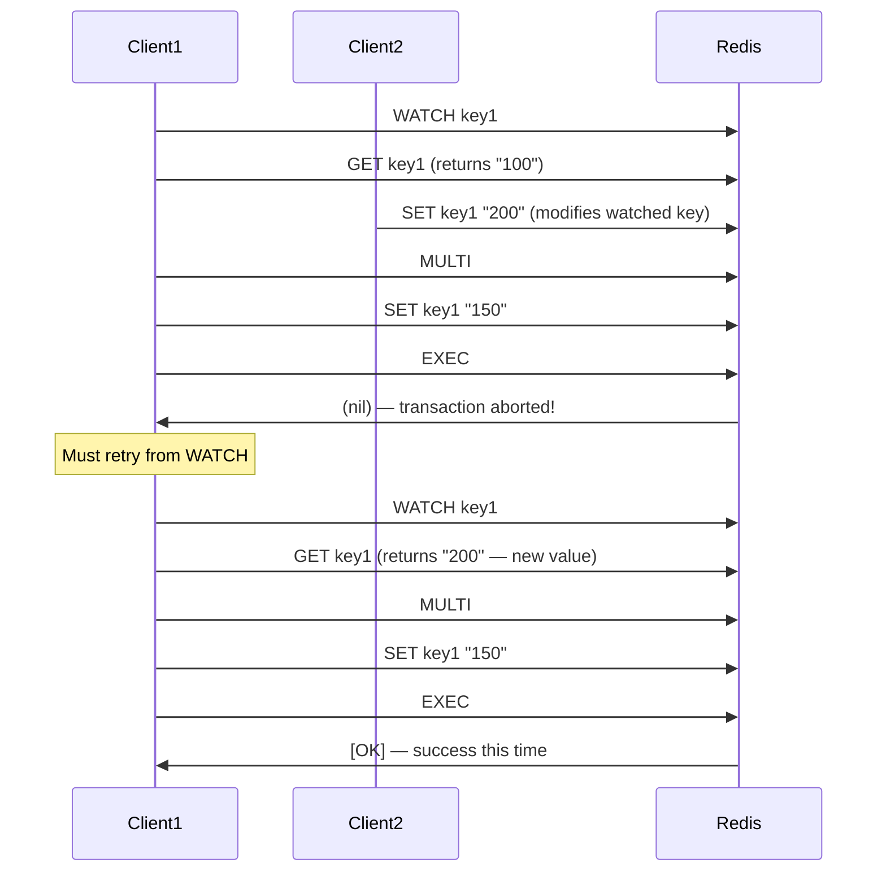

# 8.995 Redis — WATCH — Optimistic Locking

## Section 1 — Overview

WATCH is a Redis command that implements optimistic concurrency control. It allows a client to monitor one or more keys for changes and conditionally abort a subsequent transaction (MULTI/EXEC) if any watched key is modified. This provides a compare-and-set (CAS) mechanism without requiring pessimistic locks that block other clients. The WATCH command is a cornerstone of Redis's approach to concurrent access — instead of locking resources and risking contention, Redis lets all clients proceed optimistically and only checks for conflicts at commit time (EXEC).

The WATCH mechanism works as follows: a client calls WATCH on one or more keys to signal that it intends to use those keys in an upcoming transaction. The client then reads the current values of those keys (or performs any other operations), builds its transaction, and calls MULTI followed by EXEC. If any watched key was modified (by any client, including the watching client) between the WATCH call and the EXEC call, the transaction is aborted and EXEC returns nil. The client can then retry the entire sequence — re-watch the keys, re-read the values, and re-attempt the transaction.

This pattern is the essence of optimistic concurrency control (OCC). It works well in systems where write conflicts are rare because the overhead of WATCH is minimal when no conflicts occur. In high-contention scenarios, the retry cost can be significant, and Lua scripting may be a better alternative.

WATCH is a connection-level command — it sets watch state on the Redis connection, not on the keys themselves. The watched keys are tracked per connection. When a watched key is modified by any client, Redis marks the connection's transaction as potentially aborted. When that connection eventually calls EXEC, Redis checks whether any watched keys were modified and returns nil if so. This means:
- WATCH state persists across transactions on the same connection
- A successful EXEC clears the WATCH state
- DISCARD does NOT clear WATCH state
- UNWATCH explicitly clears all WATCH state

StackExchange.Redis abstracts WATCH through its Condition API on ITransaction. When you call tran.AddCondition(...), the library automatically issues WATCH commands on the relevant keys before the transaction. It also handles retry logic — if a condition fails (WATCH triggers), the transaction returns false and the application can retry. The Condition class provides factory methods for common patterns: KeyExists, KeyNotExists, StringEqual, HashEqual, HashNotEqual, HashFieldExists, HashFieldNotExists, ListLengthLessThan, SortedSetEqual, and others.

The relationship between WATCH, MULTI, EXEC, and UNWATCH defines Redis's optimistic concurrency model. WATCH sets up the monitoring, MULTI starts the command queue, EXEC atomically executes the queued commands and checks the watch state, and UNWATCH clears all watches. The entire pattern is: WATCH → READ values → MULTI → QUEUE commands → EXEC → CHECK result (nil = abort, retry).

One important nuance: WATCH monitors keys for modification, not for specific values. If you need to ensure that a key has a specific value (not just that it hasn't been modified), use the Condition.StringEqual or Condition.HashEqual conditions in StackExchange.Redis, which internally use WATCH combined with value checks at EXEC time. This provides true CAS semantics.

Redis's implementation of WATCH is efficient because it does not block any operations. When a client watches a key, other clients can still read, write, modify, or delete that key without any delay. The only cost is at EXEC time, where Redis compares a version counter for each watched key against the version at WATCH time. This version check is O(1) per watched key.

### WATCH Lifecycle Diagram



### Optimistic vs Pessimistic Concurrency

| Aspect | WATCH (Optimistic) | Locking (Pessimistic) |
|--------|-------------------|----------------------|
| Waiting | No client blocks | Clients wait for lock |
| Conflict detection | At commit time (EXEC) | At lock acquisition time |
| Overhead (no conflict) | Low — just version check | High — lock management |
| Overhead (conflict) | Retry cost | Lock acquisition cost |
| Deadlock risk | None | Possible with multiple locks |
| Concurrency | Maximum — no blocking | Limited by lock granularity |
| Use case | Low write contention | High write contention |

### When to Use WATCH vs Lua

| Pattern | Recommendation |
|---------|---------------|
| Simple CAS (read, compare, write) | WATCH + MULTI/EXEC (or Condition) |
| Check multiple keys, write one | WATCH on all checked keys |
| Read one key, write multiple | WATCH on read key |
| Complex branching logic | Lua scripting |
| High contention | Lua scripting (fewer retries) |
| Very high throughput | Lua scripting (single network call) |
| Simple atomic increments | INCR directly (no WATCH needed) |
| Multi-step read-modify-write | Lua scripting |

### WATCH Limitations

- WATCH only monitors keys, not patterns or key prefixes
- WATCH does not prevent other clients from modifying keys — it only causes EXEC to fail
- WATCH cannot be called inside a transaction (after MULTI)
- WATCH state is per-connection — managing multiple WATCH sets from the same connection requires careful UNWATCH usage
- WATCH on non-existent keys is valid — it watches the key for creation
- WATCH does not support hash tags or cluster slots — but EXEC still checks watched keys regardless of slot

### WATCH and CAS Pattern

The CAS (Compare-And-Swap) pattern with WATCH:

```
1. WATCH key          — start watching
2. value = GET key    — read current value
3. MULTI              — start transaction
4. SET key newValue   — queue the write
5. EXEC               — atomically execute
6. If EXEC returns nil → goto 1 (retry)
7. If EXEC returns array → success
```

This pattern ensures that no other client modified the key between the read (step 2) and the write (step 5). If another client modified it, the transaction is retried with the new value.

## Section 2 — Command Reference

### WATCH Command

| Property | Detail |
|----------|--------|
| Command | WATCH key [key ...] |
| Complexity | O(1) per key |
| Since | Redis 2.2.0 |
| ACL categories | @write @slow |
| Returns | Always OK |

WATCH marks one or more keys to be monitored for changes. If any of the specified keys is modified (by any client, including the current client) before a subsequent EXEC command, the transaction is aborted and EXEC returns nil.

Key points:
- WATCH must be called in normal mode (not inside a transaction)
- Multiple WATCH calls add to the set of watched keys (does not replace)
- WATCH on a key that does not exist is valid — it watches for key creation
- WATCH modifies connection state only — no changes are persisted
- Calling WATCH multiple times on the same key is idempotent (no error)

```bash
WATCH key1 key2 key3
# Output: OK
```

### UNWATCH Command

| Property | Detail |
|----------|--------|
| Command | UNWATCH |
| Complexity | O(1) |
| Since | Redis 2.2.0 |
| ACL categories | @write @slow |
| Returns | Always OK |

UNWATCH flushes all previously watched keys for the current connection. After UNWATCH, the connection has no watched keys. A subsequent EXEC will execute normally without any watch-based abort.

UNWATCH is useful for:
- Clearing WATCH state after DISCARD (which does NOT clear WATCH)
- Resetting the connection state for a new transaction
- Abandoning a CAS operation without executing or discarding a transaction

```bash
WATCH key1 key2
UNWATCH
# Output: OK
# WATCH is now cleared
```

### MULTI, EXEC, DISCARD (Transaction Commands)

These commands work with WATCH as described in note 8.994. The key interaction is:

- **WATCH before MULTI**: correct usage — WATCH keys, then MULTI
- **WATCH after MULTI**: error — "WATCH in MULTI is not allowed"
- **EXEC after WATCH**: if watched keys unchanged, execute normally; if changed, return nil
- **EXEC without WATCH**: executes regardless of external modifications
- **DISCARD after WATCH**: discards queued commands but DOES NOT clear WATCH
- **WATCH after EXEC (success)**: WATCH is automatically cleared by EXEC

### Key Modification Detection

Redis detects key modification by tracking a modification counter per key. When a key is watched, Redis stores the current modification counter value. At EXEC time, it compares the stored counter with the current counter. If they differ, the key was modified.

Operations that trigger WATCH:
- SET, GETSET, SETNX, SETEX, PSETEX
- DEL (key deletion)
- INCR, INCRBY, DECR, DECRBY, INCRBYFLOAT
- APPEND
- LPUSH, RPUSH, LPOP, RPOP, LINSERT, LSET, LTRIM, LREM
- SADD, SREM, SPOP, SMOVE, SINTERSTORE, SUNIONSTORE, SDIFFSTORE
- ZADD, ZREM, ZINCRBY, ZPOPMIN, ZPOPMAX, ZREMRANGEBYRANK, ZREMRANGEBYSCORE
- HSET, HSETNX, HMSET, HDEL, HINCRBY
- EXPIRE, EXPIREAT, TTL, PERSIST, SETEX, PSETEX (affects key metadata)
- RENAME (modifies both the source and destination key)
- Any command that modifies key metadata or value

Operations that do NOT trigger WATCH:
- GET, MGET, STRLEN, EXISTS, TYPE, TTL, PTTL
- DUMP, OBJECT, RANDOMKEY
- READ-ONLY operations

### WATCH with Multiple Keys

When watching multiple keys, modification of ANY watched key causes EXEC to abort. There is no way to specify "abort only if specific subsets of keys change." All watched keys are checked atomically at EXEC time.

```bash
WATCH key1 key2 key3
# Client 2 modifies key2
MULTI
SET key4 "newvalue"   # key4 is not watched
EXEC
# Returns nil — key2 was modified, even though key4 (the write target) was not watched
```

### WATCH on Non-Existent Keys

WATCH works on keys that do not exist. It monitors the key for creation. If a non-existent watched key is created by another client before EXEC, the transaction aborts.

```bash
WATCH nonexistent_key
# Client 2: SET nonexistent_key "value"
MULTI
SET target "should succeed"
EXEC
# Returns nil — nonexistent_key was created by client 2
```

This is useful for "create-if-not-exists" patterns where you want to ensure a key is not created by another client between your check and your write.

### WATCH and Key Expiry

Key expiration count as modification. If a watched key is deleted by expiration (or eviction) between WATCH and EXEC, the transaction aborts.

```bash
WATCH tempkey  # tempkey has TTL 5 seconds
# ... wait 6 seconds ... tempkey expires and is deleted
MULTI
SET otherkey "value"
EXEC
# Returns nil — tempkey was modified (deleted by expiration)
```

### WATCH and Connection Semantics

- WATCH state is per-connection, not per-database. Watching keys in database 0 affects transactions in database 0 only. Switching databases does not clear WATCH state — the watched keys are tied to the database they were watched in.
- WATCH state is preserved across command pipeline flushes
- WATCH state is lost on connection disconnect
- WATCH does not survive MULTI (WATCH inside MULTI errors)
- EXEC always clears WATCH (whether successful or aborted)
- DISCARD does NOT clear WATCH

### WATCH and Cluster Mode

In Redis Cluster mode, WATCH works normally but with an important constraint: all watched keys should ideally be in the same hash slot. While you CAN watch keys from different slots, the subsequent MULTI/EXEC can only operate on keys in a single slot. If you watch keys from different slots and then try to access keys outside the slot, you'll get CROSSSLOT errors.

StackExchange.Redis handles this by issuing WATCH on the keys referenced by conditions. When using conditions, SE.Redis automatically determines which keys need to be watched and issues the appropriate WATCH commands.

```csharp
// In cluster mode, all keys in the transaction must share a hash slot
var db = _muxer.GetDatabase();
var tran = db.CreateTransaction();

// These conditions watch keys in potentially different slots
tran.AddCondition(Condition.KeyExists("{user:1}:profile"));  // slot for {user:1}
tran.StringSetAsync("{user:1}:name", "Alice");               // same slot — OK
// tran.StringSetAsync("other:key", "value")                  // different slot — CROSSSLOT!
```

## Section 3 — Redis CLI Examples

### Basic WATCH — Atomic Counter with CAS

```bash
# Simulate atomic INCR using WATCH
WATCH counter
current = GET counter
# current = "5"

MULTI
SET counter 6   # Set to current + 1
EXEC
# If no other client modified counter:
# Output: 1) OK   (counter is now 6)
#
# If another client modified counter between WATCH and EXEC:
# Output: (nil)
```

### WATCH with Multiple Modifications

```bash
# Watch two keys, implement atomic fund transfer
WATCH account:alice account:bob
alice_balance = GET account:alice
bob_balance = GET account:bob
# alice_balance = "100", bob_balance = "50"

# Check that Alice has enough funds
# (in a real scenario, you'd check this in application code)
MULTI
DECRBY account:alice 30
INCRBY account:bob 30
EXEC
# Output: 1) (integer) 70  2) (integer) 80
```

If another client modifies either account between WATCH and EXEC, the entire transfer is aborted and neither account is modified.

### WATCH with Retry — Shell Script Simulation

```bash
# In practice, you'd use a script or application code for retry
# But conceptually:
WATCH counter
value = GET counter
# value = "10"

MULTI
SET counter 11
EXEC
# If nil: goto start (retry from WATCH)
# If success: done
```

### WATCH Prevented by Client 2 Modification

```bash
# Terminal 1 (Client A)
WATCH mykey
GET mykey
# Output: "original"

# Terminal 2 (Client B — between WATCH and EXEC)
SET mykey "modified"

# Terminal 1 (Client A — continues after Client B)
MULTI
SET mykey "newvalue"
EXEC
# Output: (nil) — transaction aborted!
GET mykey
# Output: "modified" — Client B's change is still there
```

### UNWATCH Example

```bash
WATCH key1 key2
# Decide not to proceed with the transaction
UNWATCH
# Now WATCH is cleared
MULTI
SET key1 "newvalue"   # This will execute even if key1 was modified
EXEC
# Output: 1) OK   (executes normally because WATCH was cleared)
```

### WATCH with Multiple Keys — Any Change Aborts

```bash
WATCH stock:item42 stock:item43
# Monitor both inventory items
MULTI
DECR stock:item42
INCR stock:item43
EXEC
# If EITHER stock:item42 OR stock:item43 changed → nil
```

### WATCH with DISCARD — WATCH Persists

```bash
WATCH mykey
GET mykey
# Output: "100"

MULTI
SET mykey "200"
DISCARD
# Output: OK
# Transaction was discarded, but WATCH is STILL active on mykey

# Any subsequent EXEC will still check mykey for modifications
# To clear WATCH, call UNWATCH explicitly
UNWATCH
```

### WATCH with Non-Existent Key

```bash
WATCH pending_key
# pending_key does not exist

# Client 2: SET pending_key "created"
# Now pending_key exists

MULTI
SET other_key "value"
EXEC
# Output: (nil) — pending_key was modified (created from nil)
```

### Manual WATCH vs SE.Redis Conditions — CLI View

StackExchange.Redis issues WATCH commands behind the scenes when you use conditions. To see what Redis receives:

```bash
# When you call db.CreateTransaction with Condition.KeyExists("key1")
# SE.Redis sends:
WATCH key1
# (checks key1 exists)
MULTI
# ... queued commands ...
EXEC

# When you call Condition.StringEqual("key1", "expected")
# SE.Redis sends:
WATCH key1
# (value comparison happens at EXEC time)
MULTI
# ... queued commands ...
EXEC
```

### WATCH with Expiring Keys

```bash
SET tempkey "temp" EX 5
WATCH tempkey
# ... wait 6 seconds ... key is deleted by TTL
MULTI
SET result "done"
EXEC
# Output: (nil) — tempkey was modified (deleted by expiry)
```

### WATCH with Same-Key Multiple Operations

```bash
WATCH mykey
value = GET mykey
# value = "10"

# Another modification to mykey by the same client outside transaction
SET mykey "intermediate"
# This ALSO triggers WATCH! Even though it's the same client

MULTI
SET mykey "final"
EXEC
# Output: (nil) — mykey was modified by this client's own SET!
```

This is a critical point: WATCH detects modifications by ANY client, including the client that called WATCH. Any command that modifies a watched key — even from the same connection — triggers the WATCH abort.

### WATCH with GET — CAS Read

```bash
WATCH inventory:item:500
stock = GET inventory:item:500
# stock = "25"

MULTI
DECR inventory:item:500 1
EXEC
# If the stock hasn't changed from 25 → decrement succeeds
# If someone changed stock between WATCH and EXEC → abort
```

## Section 4 — StackExchange.Redis Code

### Basic Transaction with Condition — WATCH Abstraction

```csharp
using StackExchange.Redis;

/// <summary>
/// Demonstrates how StackExchange.Redis uses WATCH internally via Conditions.
/// Every call to AddCondition generates WATCH commands on the relevant keys.
/// </summary>
public class WatchTransactionService
{
    private readonly ConnectionMultiplexer _muxer;
    private readonly IDatabase _db;

    public WatchTransactionService(ConnectionMultiplexer muxer)
    {
        _muxer = muxer;
        _db = muxer.GetDatabase();
    }

    /// <summary>
    /// Condition.KeyExists internally executes WATCH on the key and checks existence at EXEC time.
    /// </summary>
    public async Task<bool> UpdateOnlyIfKeyExistsAsync(string key, string newValue)
    {
        var tran = _db.CreateTransaction();
        tran.AddCondition(Condition.KeyExists(key));
        tran.StringSetAsync(key, newValue);
        return await tran.ExecuteAsync();
    }

    /// <summary>
    /// Condition.KeyNotExists internally executes WATCH on the key and checks non-existence at EXEC time.
    /// </summary>
    public async Task<bool> CreateOnlyIfKeyMissingAsync(string key, string value)
    {
        var tran = _db.CreateTransaction();
        tran.AddCondition(Condition.KeyNotExists(key));
        tran.StringSetAsync(key, value);
        return await tran.ExecuteAsync();
    }

    /// <summary>
    /// Condition.StringEqual watches the key and compares its value at EXEC time.
    /// This is the true CAS (Compare-And-Swap) pattern.
    /// </summary>
    public async Task<bool> CompareAndSwapAsync(string key, string expectedValue, string newValue)
    {
        var tran = _db.CreateTransaction();
        tran.AddCondition(Condition.StringEqual(key, expectedValue));
        tran.StringSetAsync(key, newValue);
        return await tran.ExecuteAsync();
    }
}
```

### Complete Atomic Counter with Retry Logic

```csharp
public class AtomicCounterWithRetry
{
    private readonly ConnectionMultiplexer _muxer;
    private readonly IDatabase _db;

    public AtomicCounterWithRetry(ConnectionMultiplexer muxer)
    {
        _muxer = muxer;
        _db = muxer.GetDatabase();
    }

    /// <summary>
    /// Atomic increment with automatic retry on WATCH conflict.
    /// Uses Condition.StringEqual to implement CAS.
    /// </summary>
    public async Task<long> IncrementAsync(string key, int retryCount = 5)
    {
        for (int attempt = 0; attempt < retryCount; attempt++)
        {
            var currentValue = await _db.StringGetAsync(key);
            long current = currentValue.HasValue ? (long)currentValue : 0;
            long newValue = current + 1;

            var tran = _db.CreateTransaction();
            tran.AddCondition(Condition.StringEqual(key, currentValue));
            tran.StringSetAsync(key, newValue);

            if (await tran.ExecuteAsync())
            {
                return newValue;
            }

            // WATCH conflict — retry with exponential backoff
            if (attempt < retryCount - 1)
            {
                int delayMs = 50 * (int)Math.Pow(2, attempt);
                await Task.Delay(delayMs);
            }
        }

        throw new InvalidOperationException(
            $"Failed to atomically increment key '{key}' after {retryCount} attempts.");
    }

    /// <summary>
    /// Alternative: atomic increment using INCR directly (no WATCH needed for simple increments).
    /// This is the recommended approach for simple counter operations.
    /// </summary>
    public async Task<long> SimpleIncrementAsync(string key)
    {
        return await _db.StringIncrementAsync(key);
    }
}
```

### Fund Transfer with Multi-Condition WATCH

```csharp
public class FundTransferService
{
    private readonly ConnectionMultiplexer _muxer;

    public FundTransferService(ConnectionMultiplexer muxer)
    {
        _muxer = muxer;
    }

    /// <summary>
    /// Atomically transfers funds between two accounts using WATCH conditions.
    /// Both accounts are watched — if either changes, the transaction retries.
    /// </summary>
    public async Task<bool> TransferFundsAsync(
        string fromAccount, string toAccount, decimal amount, int maxRetries = 5)
    {
        for (int attempt = 0; attempt < maxRetries; attempt++)
        {
            var db = _muxer.GetDatabase();

            // Read current balances
            var fromValue = await db.StringGetAsync(fromAccount);
            var toValue = await db.StringGetAsync(toAccount);

            if (!fromValue.HasValue)
                return false; // Source account doesn't exist

            decimal fromBalance = (decimal)fromValue;
            decimal toBalance = toValue.HasValue ? (decimal)toValue : 0;

            if (fromBalance < amount)
                return false; // Insufficient funds

            var tran = db.CreateTransaction();

            // Watch both accounts — if either changes, abort
            tran.AddCondition(Condition.StringEqual(fromAccount, fromValue));
            tran.AddCondition(Condition.StringEqual(toAccount, toValue));

            // Queue the transfer operations
            tran.StringSetAsync(fromAccount, (fromBalance - amount).ToString("F2"));
            tran.StringSetAsync(toAccount, (toBalance + amount).ToString("F2"));

            if (await tran.ExecuteAsync())
            {
                return true;
            }

            // WATCH conflict — retry with backoff
            if (attempt < maxRetries - 1)
            {
                await Task.Delay(TimeSpan.FromMilliseconds(100 * (attempt + 1)));
            }
        }

        return false;
    }
}
```

### Inventory Reservation with Stock Check

```csharp
public class InventoryReservationService
{
    private readonly ConnectionMultiplexer _muxer;

    public InventoryReservationService(ConnectionMultiplexer muxer)
    {
        _muxer = muxer;
    }

    /// <summary>
    /// Atomically reserves inventory if sufficient stock is available.
    /// Uses hash fields for stock tracking with conditional checks.
    /// </summary>
    public async Task<bool> TryReserveStockAsync(
        string sku, int quantity, string orderId)
    {
        var db = _muxer.GetDatabase();
        var stockKey = $"stock:{sku}";

        // Read current stock levels
        var available = await db.HashGetAsync(stockKey, "available");
        var reserved = await db.HashGetAsync(stockKey, "reserved");

        int currentAvailable = available.HasValue ? (int)available : 0;
        int currentReserved = reserved.HasValue ? (int)reserved : 0;

        if (currentAvailable < quantity)
        {
            return false; // Not enough stock
        }

        var tran = db.CreateTransaction();

        // Condition: stock hash must not have changed since we read it
        tran.AddCondition(Condition.HashEqual(stockKey, "available", currentAvailable.ToString()));
        tran.AddCondition(Condition.HashEqual(stockKey, "reserved", currentReserved.ToString()));

        // Update stock levels
        tran.HashSetAsync(stockKey, "available", currentAvailable - quantity);
        tran.HashSetAsync(stockKey, "reserved", currentReserved + quantity);

        // Record the reservation
        tran.HashSetAsync($"order:{orderId}", new HashEntry[]
        {
            new("sku", sku),
            new("quantity", quantity.ToString()),
            new("status", "reserved"),
            new("timestamp", DateTimeOffset.UtcNow.ToUnixTimeSeconds().ToString())
        });

        return await tran.ExecuteAsync();
    }
}
```

### WATCH with Sorted Set Conditions

```csharp
public class SortedSetWatchService
{
    private readonly ConnectionMultiplexer _muxer;

    public SortedSetWatchService(ConnectionMultiplexer muxer)
    {
        _muxer = muxer;
    }

    /// <summary>
    /// Atomically updates a sorted set member's score only if the member exists
    /// and currently has the expected score. Uses WATCH internally via Condition.
    /// </summary>
    public async Task<bool> ConditionalScoreUpdateAsync(
        string sortedSetKey, string member, double newScore, double expectedScore)
    {
        var db = _muxer.GetDatabase();
        var tran = db.CreateTransaction();

        // Watch the sorted set key — check that member has expected score
        tran.AddCondition(Condition.SortedSetEqual(sortedSetKey, member, expectedScore));
        tran.SortedSetAddAsync(sortedSetKey, member, newScore);

        return await tran.ExecuteAsync();
    }

    /// <summary>
    /// Atomic leaderboard score increment with WATCH.
    /// Reads current score, increments it, writes back — retries on conflict.
    /// </summary>
    public async Task<double> AtomicLeaderboardIncrementAsync(
        string leaderboardKey, string player, double incrementBy, int maxRetries = 5)
    {
        for (int attempt = 0; attempt < maxRetries; attempt++)
        {
            var db = _muxer.GetDatabase();
            var currentScore = await db.SortedSetScoreAsync(leaderboardKey, player);
            double current = currentScore ?? 0;
            double newScore = current + incrementBy;

            var tran = db.CreateTransaction();
            tran.AddCondition(Condition.SortedSetEqual(leaderboardKey, player, current));
            tran.SortedSetAddAsync(leaderboardKey, player, newScore);

            if (await tran.ExecuteAsync())
            {
                return newScore;
            }

            if (attempt < maxRetries - 1)
            {
                await Task.Delay(TimeSpan.FromMilliseconds(50 * (attempt + 1)));
            }
        }

        throw new InvalidOperationException(
            $"Failed to update score for {player} after {maxRetries} attempts.");
    }
}
```

### WATCH with Hash Conditions — User Profile Update

```csharp
public class UserProfileService
{
    private readonly ConnectionMultiplexer _muxer;

    public UserProfileService(ConnectionMultiplexer muxer)
    {
        _muxer = muxer;
    }

    /// <summary>
    /// Atomically updates a user profile hash field only if the expected
    /// current value matches. Prevents lost updates on concurrent modifications.
    /// </summary>
    public async Task<bool> UpdateProfileFieldAsync(
        string userId, string field, string newValue, string expectedValue)
    {
        var db = _muxer.GetDatabase();
        var hashKey = $"user:{userId}:profile";

        var tran = db.CreateTransaction();
        tran.AddCondition(Condition.HashEqual(hashKey, field, expectedValue));
        tran.HashSetAsync(hashKey, field, newValue);

        return await tran.ExecuteAsync();
    }

    /// <summary>
    /// Atomically increments a user's experience points and checks for level-up.
    /// The entire check-set operation is protected by WATCH.
    /// </summary>
    public async Task<bool> AddExperiencePointsAsync(
        string userId, int xpToAdd, int xpPerLevel)
    {
        var db = _muxer.GetDatabase();
        var hashKey = $"user:{userId}:stats";

        for (int attempt = 0; attempt < 5; attempt++)
        {
            var currentXp = await db.HashGetAsync(hashKey, "xp");
            var currentLevel = await db.HashGetAsync(hashKey, "level");

            int xp = currentXp.HasValue ? (int)currentXp : 0;
            int level = currentLevel.HasValue ? (int)currentLevel : 1;

            int newXp = xp + xpToAdd;
            int newLevel = level;

            // Check for level-up
            while (newXp >= newLevel * xpPerLevel)
            {
                newXp -= newLevel * xpPerLevel;
                newLevel++;
            }

            var tran = db.CreateTransaction();
            tran.AddCondition(Condition.HashEqual(hashKey, "xp", currentXp));
            tran.AddCondition(Condition.HashEqual(hashKey, "level", currentLevel));
            tran.HashSetAsync(hashKey, new HashEntry[]
            {
                new("xp", newXp),
                new("level", newLevel)
            });

            if (await tran.ExecuteAsync())
            {
                return true;
            }

            await Task.Delay(50 * (attempt + 1));
        }

        return false;
    }
}
```

### Custom Condition — List Length Guard

```csharp
public class ListWatchService
{
    private readonly ConnectionMultiplexer _muxer;

    public ListWatchService(ConnectionMultiplexer muxer)
    {
        _muxer = muxer;
    }

    /// <summary>
    /// Atomically pushes to a list only if the list is shorter than maxLength.
    /// Uses the built-in Condition.ListLengthLessThan condition.
    /// </summary>
    public async Task<bool> PushIfBelowMaxLengthAsync(
        string listKey, string value, long maxLength)
    {
        var db = _muxer.GetDatabase();
        var tran = db.CreateTransaction();

        tran.AddCondition(Condition.ListLengthLessThan(listKey, maxLength));
        tran.ListRightPushAsync(listKey, value);

        return await tran.ExecuteAsync();
    }

    /// <summary>
    /// Atomically pops from a list and processes the item.
    /// Uses a condition to ensure the list has items.
    /// </summary>
    public async Task<RedisValue> PopWithConditionAsync(string listKey)
    {
        var db = _muxer.GetDatabase();

        var tran = db.CreateTransaction();
        tran.AddCondition(Condition.KeyExists(listKey));
        var popTask = tran.ListRightPopAsync(listKey);

        if (await tran.ExecuteAsync())
        {
            return await popTask;
        }

        return RedisValue.Null;
    }
}
```

### WATCH with Manual Retry — Full Pattern

```csharp
public class WatchRetryEngine
{
    private readonly ConnectionMultiplexer _muxer;
    private readonly ILogger _logger;

    public WatchRetryEngine(ConnectionMultiplexer muxer, ILogger logger)
    {
        _muxer = muxer;
        _logger = logger;
    }

    /// <summary>
    /// Generic retry engine for WATCH-based transactions.
    /// Takes a factory that builds a transaction and returns a result.
    /// Retries on WATCH conflict with exponential backoff.
    /// </summary>
    public async Task<TResult> ExecuteWithRetryAsync<TResult>(
        Func<IDatabase, Task<(ITransaction transaction, TResult result)>> operationFactory,
        int maxRetries = 5,
        TimeSpan? baseDelay = null)
    {
        baseDelay ??= TimeSpan.FromMilliseconds(50);
        var db = _muxer.GetDatabase();

        for (int attempt = 0; attempt < maxRetries; attempt++)
        {
            try
            {
                var (tran, result) = await operationFactory(db);

                if (await tran.ExecuteAsync())
                {
                    _logger.LogDebug(
                        "Transaction succeeded on attempt {Attempt}/{MaxRetries}.",
                        attempt + 1, maxRetries);
                    return result;
                }

                _logger.LogWarning(
                    "WATCH conflict on attempt {Attempt}/{MaxRetries}. Retrying...",
                    attempt + 1, maxRetries);
            }
            catch (RedisConnectionException ex)
            {
                _logger.LogError(ex,
                    "Connection error on attempt {Attempt}/{MaxRetries}.",
                    attempt + 1, maxRetries);
                if (attempt >= maxRetries - 1) throw;
            }
            catch (RedisTimeoutException ex)
            {
                _logger.LogError(ex,
                    "Timeout on attempt {Attempt}/{MaxRetries}.",
                    attempt + 1, maxRetries);
                if (attempt >= maxRetries - 1) throw;
            }

            if (attempt < maxRetries - 1)
            {
                var delay = TimeSpan.FromMilliseconds(
                    baseDelay.Value.TotalMilliseconds * Math.Pow(2, attempt));
                await Task.Delay(delay);
            }
        }

        throw new InvalidOperationException(
            $"Transaction failed after {maxRetries} attempts due to WATCH conflicts.");
    }

    /// <summary>
    /// Example: atomic counter increment using the retry engine.
    /// </summary>
    public async Task<long> AtomicIncrementWithRetryAsync(string key)
    {
        return await ExecuteWithRetryAsync(async (db) =>
        {
            var current = await db.StringGetAsync(key);
            long newValue = (current.HasValue ? (long)current : 0) + 1;

            var tran = db.CreateTransaction();
            tran.AddCondition(Condition.StringEqual(key, current));
            tran.StringSetAsync(key, newValue);

            return (tran, newValue);
        });
    }
}
```

### WATCH with ConnectionState Monitoring

```csharp
public class WatchStateMonitor
{
    private readonly ConnectionMultiplexer _muxer;

    public WatchStateMonitor(ConnectionMultiplexer muxer)
    {
        _muxer = muxer;
    }

    /// <summary>
    /// Demonstrates checking connection state with INFO to detect
    /// any abandoned WATCH state on a connection.
    /// </summary>
    public async Task<Dictionary<string, string>> GetWatchInfoAsync()
    {
        var db = _muxer.GetDatabase();
        var server = _muxer.GetServer(_muxer.GetEndPoints().First());

        // Get client list to see WATCH state
        var clientList = await server.ClientListAsync();

        var result = new Dictionary<string, string>();
        foreach (var client in clientList)
        {
            if (client.Flags.HasFlag(ClientFlags.TransactionMode))
            {
                result[client.Id.ToString()] =
                    $"IN TRANSACTION | Watched: {client.WatchedKeys} | " +
                    $"LastCommand: {client.LastCommand}";
            }
        }

        return result;
    }

    /// <summary>
    /// Checks if a specific connection has active WATCH state.
    /// Useful for debugging stuck or abandoned transactions.
    /// </summary>
    public async Task<bool> HasWatchOnKeyAsync(string key)
    {
        var server = _muxer.GetServer(_muxer.GetEndPoints().First());
        var clientList = await server.ClientListAsync();

        foreach (var client in clientList)
        {
            if (client.WatchedKeys?.Contains(key) == true)
            {
                return true;
            }
        }

        return false;
    }
}
```

### WATCH with Cluster-Aware Routing

```csharp
public class ClusterAwareWatchService
{
    private readonly ConnectionMultiplexer _muxer;

    public ClusterAwareWatchService(ConnectionMultiplexer muxer)
    {
        _muxer = muxer;
    }

    /// <summary>
    /// In cluster mode, hash tags ensure all watched keys are on the same slot.
    /// This method demonstrates correct clustering for WATCH-based transactions.
    /// </summary>
    public async Task<bool> ClusterSafeTransactionAsync(
        string userId, string newEmail, string newName)
    {
        var db = _muxer.GetDatabase();
        var hashTag = $"{{user:{userId}}}";

        // All keys share the same hash tag → same slot
        var profileKey = $"{hashTag}:profile";
        var emailKey = $"{hashTag}:email";

        var currentEmail = await db.HashGetAsync(profileKey, "email");
        var currentName = await db.HashGetAsync(profileKey, "name");

        var tran = db.CreateTransaction();

        // All conditions and operations on same-slot keys
        tran.AddCondition(Condition.HashEqual(profileKey, "email", currentEmail));
        tran.AddCondition(Condition.HashEqual(profileKey, "name", currentName));
        tran.HashSetAsync(profileKey, new HashEntry[]
        {
            new("email", newEmail),
            new("name", newName)
        });
        tran.StringSetAsync(emailKey, newEmail);

        return await tran.ExecuteAsync();
    }
}
```

### WATCH with Diagnostics — Logging Watch Activity

```csharp
public class DiagnosticWatchService
{
    private readonly ConnectionMultiplexer _muxer;
    private readonly ILogger _logger;
    private static readonly ConcurrentDictionary<string, int> _watchConflictCount = new();

    public DiagnosticWatchService(ConnectionMultiplexer muxer, ILogger logger)
    {
        _muxer = muxer;
        _logger = logger;
    }

    /// <summary>
    /// Executes a transaction with diagnostics tracking.
    /// Logs WATCH conflicts and tracks retry counts per key.
    /// </summary>
    public async Task<bool> ExecuteWithDiagnosticsAsync(
        string operationName, Func<IDatabase, Task<ITransaction>> buildTransaction)
    {
        var db = _muxer.GetDatabase();
        var stopwatch = System.Diagnostics.Stopwatch.StartNew();
        int attempts = 0;

        while (attempts < 5)
        {
            attempts++;
            var tran = await buildTransaction(db);

            bool committed = await tran.ExecuteAsync();

            if (committed)
            {
                stopwatch.Stop();
                _logger.LogInformation(
                    "Operation '{OpName}' succeeded after {Attempts} attempts in {ElapsedMs}ms.",
                    operationName, attempts, stopwatch.ElapsedMilliseconds);
                return true;
            }

            _watchConflictCount.AddOrUpdate(operationName, 1, (_, count) => count + 1);

            _logger.LogWarning(
                "Operation '{OpName}' WATCH conflict on attempt {Attempt}. " +
                "Total conflicts for this operation: {TotalConflicts}.",
                operationName, attempts, _watchConflictCount[operationName]);

            if (attempts < 5)
            {
                await Task.Delay(TimeSpan.FromMilliseconds(50 * attempts));
            }
        }

        stopwatch.Stop();
        _logger.LogError(
            "Operation '{OpName}' FAILED after {Attempts} attempts in {ElapsedMs}ms.",
            operationName, attempts, stopwatch.ElapsedMilliseconds);
        return false;
    }

    /// <summary>
    /// Returns conflict statistics for all tracked operations.
    /// </summary>
    public IReadOnlyDictionary<string, int> GetConflictStatistics() =>
        _watchConflictCount.AsReadOnly();
}
```

### WATCH with Lua Fallback — Adaptive Strategy

```csharp
public class AdaptiveConcurrencyService
{
    private readonly ConnectionMultiplexer _muxer;

    public AdaptiveConcurrencyService(ConnectionMultiplexer muxer)
    {
        _muxer = muxer;
    }

    /// <summary>
    /// Attempts a WATCH-based transaction first. If conflict rate is too high,
    /// falls back to Lua scripting for better performance under contention.
    /// </summary>
    public async Task<long> AdaptiveIncrementAsync(string key, int contentionThreshold = 3)
    {
        var db = _muxer.GetDatabase();
        int conflictCount = 0;

        // Phase 1: Try WATCH-based CAS (optimistic)
        for (int attempt = 0; attempt < contentionThreshold; attempt++)
        {
            var current = await db.StringGetAsync(key);
            long newValue = (current.HasValue ? (long)current : 0) + 1;

            var tran = db.CreateTransaction();
            tran.AddCondition(Condition.StringEqual(key, current));
            tran.StringSetAsync(key, newValue);

            if (await tran.ExecuteAsync())
            {
                return newValue;
            }

            conflictCount++;
        }

        // Phase 2: Fall back to Lua (pessimistic — single atomic operation)
        var luaScript = @"
            local current = redis.call('GET', KEYS[1])
            if current then
                current = tonumber(current)
            else
                current = 0
            end
            current = current + 1
            redis.call('SET', KEYS[1], current)
            return current
        ";

        var result = await db.ScriptEvaluateAsync(luaScript, new RedisKey[] { key });

        _logger.LogWarning(
            "Fell back to Lua for key '{Key}' after {ConflictCount} WATCH conflicts.",
            key, conflictCount);

        return (long)result;
    }

    private static readonly ILogger _logger =
        LoggerFactory.Create(b => b.AddConsole()).CreateLogger<AdaptiveConcurrencyService>();
}
```

## Section 5 — Use Cases

### Atomic Counter Increment (CAS Pattern)

The simplest and most common use case for WATCH-based transactions is implementing atomic counters beyond what the built-in INCR provides. While INCR works for simple increments, scenarios requiring "read current, compute new value, write" need WATCH or Lua.

```csharp
public async Task<long> AtomicAddToCounterAsync(string key, long valueToAdd)
{
    var db = _muxer.GetDatabase();

    for (int attempt = 0; attempt < 5; attempt++)
    {
        var current = await db.StringGetAsync(key);
        long currentVal = current.HasValue ? (long)current : 0;
        long newVal = currentVal + valueToAdd;

        var tran = db.CreateTransaction();
        tran.AddCondition(Condition.StringEqual(key, current));
        tran.StringSetAsync(key, newVal);

        if (await tran.ExecuteAsync())
            return newVal;

        await Task.Delay(50);
    }

    throw new InvalidOperationException("Failed to atomically add to counter.");
}
```

### Distributed Lock Acquisition (NX Pattern)

WATCH with Condition.KeyNotExists provides a distributed lock primitive. The lock is acquired only if the key does not exist, and the transaction ensures atomicity.

```csharp
public async Task<bool> TryAcquireDistributedLockAsync(
    string lockKey, string lockToken, TimeSpan expiry)
{
    var db = _muxer.GetDatabase();
    var tran = db.CreateTransaction();

    tran.AddCondition(Condition.KeyNotExists(lockKey));
    tran.StringSetAsync(lockKey, lockToken, expiry);

    return await tran.ExecuteAsync();
}
```

### Inventory Stock Reservation

Reserving stock in an e-commerce system requires reading stock levels, checking availability, decrementing, and recording the reservation — all atomically.

```csharp
public async Task<bool> ReserveInventoryAsync(
    string sku, int quantity, string cartId)
{
    var db = _muxer.GetDatabase();
    var stockKey = $"stock:{sku}";

    var stockLevel = await db.StringGetAsync(stockKey);
    int available = stockLevel.HasValue ? (int)stockLevel : 0;

    if (available < quantity)
        return false;

    var tran = db.CreateTransaction();
    tran.AddCondition(Condition.StringEqual(stockKey, stockLevel));
    tran.StringDecrementAsync(stockKey, quantity);
    tran.SetAddAsync($"cart:{cartId}:items", sku);

    return await tran.ExecuteAsync();
}
```

### User Registration — Unique Constraints

Ensuring a username or email is unique requires checking that the key does not exist and creating it atomically.

```csharp
public async Task<bool> RegisterUniqueUserAsync(
    string username, string email, string displayName)
{
    var db = _muxer.GetDatabase();

    var tran = db.CreateTransaction();
    tran.AddCondition(Condition.KeyNotExists($"user:{username}"));
    tran.AddCondition(Condition.KeyNotExists($"email:{email}"));

    tran.HashSetAsync($"user:{username}", new HashEntry[]
    {
        new("email", email),
        new("display_name", displayName),
        new("created_at", DateTimeOffset.UtcNow.ToUnixTimeSeconds())
    });
    tran.StringSetAsync($"email:{email}", username);

    return await tran.ExecuteAsync();
}
```

### Cache Stampede Prevention

When a cache key expires and multiple requests try to regenerate it simultaneously, WATCH ensures only one request regenerates the cache.

```csharp
public async Task<string> GetOrComputeAsync(
    string cacheKey, Func<Task<string>> computeFunction, TimeSpan ttl)
{
    var db = _muxer.GetDatabase();

    // Fast path — check cache
    var cached = await db.StringGetAsync(cacheKey);
    if (cached.HasValue)
        return cached;

    // Slow path — try to become the regenerator
    var lockKey = $"{cacheKey}:lock";
    var lockToken = Guid.NewGuid().ToString();

    var tran = db.CreateTransaction();
    tran.AddCondition(Condition.KeyNotExists(lockKey));
    tran.StringSetAsync(lockKey, lockToken, TimeSpan.FromSeconds(30));

    if (await tran.ExecuteAsync())
    {
        // We won the right to regenerate
        try
        {
            var value = await computeFunction();
            await db.StringSetAsync(cacheKey, value, ttl);
            return value;
        }
        finally
        {
            // Release the regeneration lock
            var releaseTran = db.CreateTransaction();
            releaseTran.AddCondition(Condition.StringEqual(lockKey, lockToken));
            releaseTran.KeyDeleteAsync(lockKey);
            await releaseTran.ExecuteAsync();
        }
    }

    // Someone else is regenerating — wait and retry
    await Task.Delay(50);
    return await GetOrComputeAsync(cacheKey, computeFunction, ttl);
}
```

### Optimistic Updates on Hashes

Updating specific fields of a hash with optimistic concurrency ensures that two concurrent updates don't conflict.

```csharp
public async Task<bool> UpdateGameScoreAsync(
    string playerId, int additionalScore)
{
    var db = _muxer.GetDatabase();
    var hashKey = $"player:{playerId}:stats";

    for (int attempt = 0; attempt < 5; attempt++)
    {
        var currentScore = await db.HashGetAsync(hashKey, "score");
        var currentLevel = await db.HashGetAsync(hashKey, "level");

        int score = currentScore.HasValue ? (int)currentScore : 0;
        int newScore = score + additionalScore;

        // Check for level-up (every 1000 points)
        int level = currentLevel.HasValue ? (int)currentLevel : 1;
        int newLevel = level;
        if (newScore >= level * 1000)
        {
            newLevel = (newScore / 1000) + 1;
        }

        var tran = db.CreateTransaction();
        tran.AddCondition(Condition.HashEqual(hashKey, "score", currentScore));
        tran.AddCondition(Condition.HashEqual(hashKey, "level", currentLevel));
        tran.HashSetAsync(hashKey, new HashEntry[]
        {
            new("score", newScore),
            new("level", newLevel)
        });

        if (await tran.ExecuteAsync())
            return true;

        await Task.Delay(50 * (attempt + 1));
    }

    return false;
}
```

### Queue Processing with Visibility Timeout

In a job queue, processing a job requires marking it as "in progress" atomically, with a visibility timeout for retries on failure.

```csharp
public async Task<bool> TryClaimJobAsync(string jobId, string workerId, TimeSpan visibilityTimeout)
{
    var db = _muxer.GetDatabase();
    var jobKey = $"job:{jobId}";

    var tran = db.CreateTransaction();
    tran.AddCondition(Condition.HashEqual(jobKey, "status", "pending"));
    tran.HashSetAsync(jobKey, new HashEntry[]
    {
        new("status", "processing"),
        new("worker", workerId),
        new("claimed_at", DateTimeOffset.UtcNow.ToUnixTimeSeconds().ToString())
    });
    tran.KeyExpireAsync(jobKey, visibilityTimeout);

    return await tran.ExecuteAsync();
}
```

### Sorted Set Rank-Based Operations

Operations that depend on a member's current rank in a sorted set need WATCH for atomicity.

```csharp
public async Task<bool> PromoteIfBelowRankAsync(
    string leaderboardKey, string member, int maxRank, double scoreBoost)
{
    var db = _muxer.GetDatabase();

    for (int attempt = 0; attempt < 5; attempt++)
    {
        var rank = await db.SortedSetRankAsync(leaderboardKey, member, Order.Ascending);
        if (!rank.HasValue || rank.Value >= maxRank)
            return false;

        var currentScore = await db.SortedSetScoreAsync(leaderboardKey, member);
        double newScore = (currentScore ?? 0) + scoreBoost;

        var tran = db.CreateTransaction();
        tran.AddCondition(Condition.SortedSetEqual(leaderboardKey, member, currentScore ?? 0));
        tran.SortedSetAddAsync(leaderboardKey, member, newScore);

        if (await tran.ExecuteAsync())
            return true;

        await Task.Delay(50 * (attempt + 1));
    }

    return false;
}
```

### Rate Limiting (Simplified)

Simple rate limiting using WATCH — increment a counter and check against a threshold.

```csharp
public class WatchRateLimiter
{
    private readonly ConnectionMultiplexer _muxer;

    public WatchRateLimiter(ConnectionMultiplexer muxer)
    {
        _muxer = muxer;
    }

    public async Task<bool> IsAllowedAsync(string userId, string action, int maxRequests, TimeSpan window)
    {
        var db = _muxer.GetDatabase();
        var key = $"ratelimit:{userId}:{action}";

        for (int attempt = 0; attempt < 3; attempt++)
        {
            var current = await db.StringGetAsync(key);
            int count = current.HasValue ? (int)current : 0;

            if (count >= maxRequests)
                return false;

            var tran = db.CreateTransaction();
            tran.AddCondition(Condition.StringEqual(key, current));
            tran.StringIncrementAsync(key);
            tran.KeyExpireAsync(key, window, ExpireWhen.Never, CommandFlags.FireAndForget);

            if (await tran.ExecuteAsync())
                return true;

            await Task.Delay(25);
        }

        return false;
    }
}
```

## Section 6 — Performance Considerations

### WATCH Overhead

The WATCH command itself is O(1) per key — it simply stores a reference to the key and its current modification counter. The real cost comes:

1. **At WATCH time**: storing the watch state (O(1) per key)
2. **Between WATCH and EXEC**: if other clients modify watched keys, Redis must note the modification (O(1) per modification, affects all watching connections)
3. **At EXEC time**: comparing modification counters for all watched keys (O(N) for N watched keys)

In practice, WATCH overhead is negligible for typical workloads with 1-10 watched keys. The primary performance cost is network round-trips and the retry cost when conflicts occur.

### Network Round-Trips

The WATCH + MULTI + EXEC pattern requires these network exchanges:

```
WATCH key1, key2    → client sends, server responds OK
GET key1            → client sends, server responds value
GET key2            → client sends, server responds value
MULTI               → client sends, server responds OK
SET key1 new        → client sends, server responds QUEUED
SET key2 new        → client sends, server responds QUEUED
EXEC                → client sends, server responds result array
```

In StackExchange.Redis, this is optimized:
- WATCH commands are pipelined with subsequent GET/MULTI operations
- The QUEUED responses are batch-processed
- The total is typically 3-5 round-trips regardless of command count

### Retry Cost

When a WATCH conflict occurs, the entire transaction must be retried from the beginning. This means:
- Re-reading watched keys (costly if keys are remote or large)
- Re-building the transaction
- Sending all commands again
- Potentially failing again

The retry cost is proportional to the size of the transaction. For transactions with many commands, the retry overhead is significant.

### Expected Conflict Rates

| Write Contention Level | Typical Conflict Rate | Impact |
|----------------------|----------------------|--------|
| Very Low (< 1% writes) | < 0.1% | Negligible |
| Low (1-10% writes) | 0.1-1% | Minimal |
| Moderate (10-30% writes) | 1-10% | Noticeable |
| High (30-60% writes) | 10-30% | Significant |
| Very High (> 60% writes) | 30-60%+ | Consider Lua |

If your conflict rate exceeds 5%, consider whether Lua scripting might be more efficient.

### WATCH vs Lua Performance

| Metric | WATCH (optimistic) | Lua (server-side) |
|--------|-------------------|-------------------|
| Network calls | 3-5 round-trips | 1 round-trip |
| Server processing time | Low (no script execution) | Moderate (script execution) |
| Retry overhead | High (re-send commands) | None (atomic) |
| Blocking duration | Short (per-command) | Longer (script duration) |
| Conflict handling | Retry (client-driven) | None (atomic) |

Lua scripting is almost always faster for complex atomic operations. Use WATCH when:
- The operation is simple (1-2 reads, 1-2 writes)
- You expect very low contention
- You need to integrate with existing Condition-based code
- You want simpler code readability

### Connection Overhead

Each WATCH adds state to the Redis connection. If a connection has many orphaned WATCH states (e.g., from transactions that were started but never completed), it consumes memory on the server. Monitor `INFO CLIENTS client_watched_keys` for total watched keys across all connections.

### Large Transaction Batching

When batching many operations in a WATCH transaction, be mindful of:
- **Queue memory**: each queued command is stored until EXEC
- **Result buffer**: the EXEC result array must fit in client output buffer
- **Blocking time**: the entire transaction executes sequentially

For very large batches (>100 commands), Lua scripting is more efficient because there is no per-command queuing overhead.

### WATCH with Many Watched Keys

Watching many keys increases:
- Memory usage on the server (per-connection watch list)
- Time to check modifications at EXEC time
- Likelihood of false conflicts (more watched keys = higher chance of any modification)

Keep the number of watched keys small — typically 1-5 keys per transaction.

## Section 7 — Production Considerations

### Connection Management

WATCH state is per-connection. In StackExchange.Redis, a single ConnectionMultiplexer manages connections to Redis. The IDatabase.GetDatabase() call returns a lightweight handle that uses one of the multiplexer's connections. Transaction conditions (and their underlying WATCH commands) are tied to that connection.

Key implications:
- If the connection is lost, WATCH state is reset — the transaction will fail (which is fine, retry)
- WATCH conditions should not span across multiple async operations without completing the transaction promptly
- Do not hold WATCH state for extended periods (seconds or more) — it increases the window for conflicts

### WATCH Timeout Considerations

There is no server-side timeout for WATCH state. A WATCH set on a key remains active until EXEC (successful), UNWATCH, or connection close. In production:

- If a client crashes while holding WATCH state, the state is automatically cleaned up when the connection times out (typically 60 seconds with keepalive)
- StackExchange.Redis will clean up WATCH state when the multiplexer is disposed
- Long-lived WATCH state increases conflict windows for other clients

### Monitoring WATCH Conflicts

Track these metrics to monitor WATCH health:

- **Total watch count**: number of active WATCH state across all connections (INFO CLIENTS)
- **Transaction abort rate**: how often EXEC returns nil (app-level metric)
- **Retry rate**: how often your application retries transactions (app-level metric)
- **Average retry count**: mean number of attempts per transaction

Set up alerts for:
- Abort rate > 5% of total transaction attempts
- Average retries > 2 per transaction
- Total watched keys across connections growing unbounded

### WATCH in Read-Replica Scenarios

In a replication setup with read replicas:
- WATCH must be executed on the primary (master) because only the primary handles write operations
- READ operations (GET) should also go to the primary when part of a WATCH transaction
- If you read from a replica, you observe stale data that may not match the primary's state
- StackExchange.Redis automatically routes transaction commands (including WATCH) to the primary

```csharp
// BAD — reading from replica while WATCH on primary
var replicaDb = _muxer.GetDatabase(); // Could be replica
var primaryDb = _muxer.GetDatabase(); // Could be primary (but not guaranteed)
// Replica and primary may be different connections!

var value = await replicaDb.StringGetAsync("key"); // Read from replica (stale)
var tran = primaryDb.CreateTransaction();
tran.AddCondition(Condition.StringEqual("key", value)); // WATCH on primary (different view)
// This can fail even if no one modified the key — replica lag!

// GOOD — ensure all operations on the same database
var db = _muxer.GetDatabase(); // SE.Redis routes writes to primary
var value = await db.StringGetAsync("key"); // Read from primary
var tran = db.CreateTransaction();
tran.AddCondition(Condition.StringEqual("key", value));
```

### WATCH in Redis Cluster

When using Redis Cluster with WATCH and transactions:
- All watched keys must hash to the same slot as the keys being modified
- Use hash tags to co-locate keys
- StackExchange.Redis handles MOVED/ASK redirections for transactions
- During resharding, WATCH may fail with ASK redirect — SE.Redis retries

The cluster mode also affects how WATCH conditions work:
- Each condition adds WATCH on a key
- If conditions reference keys in different slots, WATCH commands are sent to different nodes
- But the MULTI/EXEC block can only execute on one node
- This means all conditions MUST be on keys that hash to the same slot as the transaction keys

```csharp
// In cluster mode, ensure hash tag consistency:
var hashTag = "{user:42}";
var db = _muxer.GetDatabase();

var tran = db.CreateTransaction();
// All keys use {user:42} hash tag — same slot
tran.AddCondition(Condition.KeyExists($"{hashTag}:profile"));
tran.StringSetAsync($"{hashTag}:name", "Alice");
tran.StringSetAsync($"{hashTag}:email", "alice@example.com");
await tran.ExecuteAsync();
```

### WATCH and Connection Pooling

StackExchange.Redis uses a single connection (not a pool) per ConnectionMultiplexer. The multiplexer is multiplexed — many callers share the same underlying connection. This means:

- WATCH state set by one caller affects the underlying connection
- However, SE.Redis manages this transparently — conditions are scoped to the ITransaction
- After ExecuteAsync (success or failure), WATCH is cleared on the connection
- If you manually issue WATCH commands without using SE.Redis's condition API, you MUST manage the state yourself

### WATCH with Async Programming

When using async/await with WATCH transactions:

```csharp
// GOOD — await the transaction promptly
var tran = db.CreateTransaction();
tran.AddCondition(Condition.KeyExists(key));
tran.StringSetAsync(key, value);
await tran.ExecuteAsync(); // WATCH cleared after this

// BAD — doing await between AddCondition and ExecuteAsync
var value = await db.StringGetAsync(key); // Wait for first command
var tran = db.CreateTransaction();
tran.AddCondition(Condition.StringEqual(key, value));
// If another client modifies key HERE (between condition and execute)
await SomeOtherAsyncOperation(); // WINDOW FOR CONFLICT — don't do this!
tran.StringSetAsync(key, newValue);
await tran.ExecuteAsync();
```

Between AddCondition and ExecuteAsync, the WATCH is active. Minimize the time window. Do not await other operations in between.

### WATCH and Object Disposal

The ITransaction object does not need to be disposed. However, if you create a transaction but never call ExecuteAsync, the WATCH state persists on the connection until:
- You call UNWATCH
- You call EXEC (even if the transaction has no commands)
- The connection is closed

In production, always call ExecuteAsync and handle the result. Never abandon an ITransaction without executing or un-watching.

## Section 8 — Gotchas & Pitfalls

### WATCH Must Be Called Before MULTI

This is the most common WATCH mistake. Calling WATCH after MULTI returns an error. Always set up WATCH conditions before entering transaction mode.

```bash
# BAD
MULTI
WATCH key1
# Output: (error) ERR WATCH in MULTI is not allowed

# GOOD
WATCH key1
MULTI
SET key1 "value"
EXEC
```

StackExchange.Redis handles this correctly — it issues WATCH commands before sending MULTI.

### DISCARD Does Not Clear WATCH

After DISCARD, WATCH state persists. If you call DISCARD and then later call MULTI again, the original WATCH keys are still being watched.

```csharp
var db = _muxer.GetDatabase();

var tran1 = db.CreateTransaction();
tran1.AddCondition(Condition.KeyExists("key1"));
tran1.StringSetAsync("key2", "value");
await tran1.ExecuteAsync(); // This clears WATCH (whether successful or not)

// Same for DISCARD — in SE.Redis, ExecuteAsync returning false means no WATCH state remains
// But in raw Redis CLI, DISCARD does NOT clear WATCH
```

In SE.Redis, ExecuteAsync always clears WATCH (by issuing EXEC or by the library tracking state). However, if you're using raw Redis commands, remember to UNWATCH after DISCARD.

### Self-Modification Triggers WATCH

A watched key modified by the SAME client (not just other clients) triggers WATCH abort. If you call WATCH on a key and then modify it (even outside a transaction) before EXEC, the transaction will fail.

```bash
WATCH mykey
SET mykey "newvalue"  # This modification is detected!
MULTI
SET mykey "final"
EXEC
# Output: (nil) — mykey was modified by the same client!
```

In SE.Redis, this is usually not an issue because transactions are built and executed atomically. However, if you mix manual commands with transactions on the same DB instance, be aware.

### Non-Existent Key Creation Triggers WATCH

WATCH on a non-existent key monitors it for creation. If any client creates the key, the transaction aborts. This is correct behavior but can be surprising if you didn't expect key creations to count as modifications.

### WATCH is Connection-Scoped, Not Transaction-Scoped

WATCH state is per-connection, not per-transaction. In StackExchange.Redis, this is abstracted away because each ITransaction manages its own WATCH lifecycle. However, if you manually call WATCH on one IDatabase and then try to create a transaction on a different IDatabase (even from the same multiplexer), the WATCH state won't be visible to the transaction.

```csharp
// BAD — different database instances
var db1 = _muxer.GetDatabase(0);
var db2 = _muxer.GetDatabase(0); // Different instance, same underlying connection

await db1.ExecuteAsync("WATCH", "key1");
// ... some commands ...
var tran = db2.CreateTransaction(); // This creates NEW WATCH, doesn't use existing one
tran.StringSetAsync("key1", "value");
await tran.ExecuteAsync(); // Old WATCH is not considered

// GOOD — use the same database instance
var db = _muxer.GetDatabase(0);
await db.ExecuteAsync("WATCH", "key1");
var tran = db.CreateTransaction();
tran.StringSetAsync("key1", "value");
await tran.ExecuteAsync();
```

Actually, this is nuanced because SE.Redis may use the same underlying connection. The safest approach is to use the Condition API instead of raw WATCH commands.

### WATCH Race Condition — The TOCTOU Problem

The Time-of-Check-to-Time-of-Use (TOCTOU) window exists between WATCH and EXEC. Even though WATCH detects modifications, there is a tiny window between EXEC returning success and the client receiving the response. In theory, another client could modify the data in that window. For most applications, this is acceptable because:

1. The modification was made AFTER the transaction succeeded — the transaction's writes are already committed
2. Any subsequent read will see the latest state
3. The next transaction will WATCH the new state

This is not truly serializable in the strictest sense, but it's "serializable enough" for most Redis use cases.

### WATCH and Lua Script Interaction

WATCH state is ignored during Lua script execution. If you WATCH a key and then call EVAL, the script executes regardless of whether the watched key was modified. The WATCH check happens at EXEC time, not during arbitrary command execution.

```bash
WATCH key1
# Client 2 modifies key1
EVAL "return redis.call('GET', KEYS[1])" 1 key1
# This works fine — WATCH does not affect EVAL
```

If you need WATCH-like semantics in Lua, implement the check inside the script.

### WATCH on Hash Fields

WATCH monitors the entire key, not individual hash fields. If you watch a hash key and any field changes, the transaction aborts — even if the changed field is not the one you care about.

```bash
WATCH user:profile
# Another client modifies user:profile email field
MULTI
HSET user:profile name "newname"  # We only care about the name field
EXEC
# Output: (nil) — user:profile was modified (email changed, not name)
```

For hash-field-level granularity, use Lua scripting or check the field value in a Condition.HashEqual.

### Too Many Watched Keys

Watching many keys increases:
1. Memory usage on the server for tracking watch state
2. Likelihood of false conflicts
3. Time to check at EXEC time

Keep watched keys to a minimum. If you need to watch many keys, consider whether Lua scripting with explicit key checks would be more appropriate.

### WATCH in Read Transactions

WATCH is not useful for read-only transactions. If you only read data without writing, there is no EXEC to abort. WATCH only affects EXEC, so read-only operations do not benefit from WATCH.

### WATCH with Different Databases

If you switch databases (SELECT), WATCH state from the previous database is preserved but inactive. EXEC will check watches on the database where they were set, not the current database.

```bash
SELECT 0
WATCH key1
SELECT 1
MULTI
SET key1 "value"   # This is in database 1, but WATCH is in database 0
EXEC
# Executes normally — WATCH from database 0 not checked for database 1 operations
```

### WATCH with TTL

If a watched key has a TTL and expires between WATCH and EXEC, the expiry counts as a modification and the transaction aborts. This is correct but can be surprising for TTL-managed keys.

### WATCH Not Available in Some Environments

WATCH is available in Redis 2.2.0 and later. All modern Redis versions support it. However, some managed Redis services may disable WATCH in specific configurations. Always verify WATCH availability in your target environment.

## Section 9 — Related Notes

- **[[8.994 — Redis — Transactions — MULTIEXEC, DISCARD]]** — Foundation document for Redis transaction commands that WATCH integrates with. Essential prerequisite reading.
- **[[8.996 — Redis — Lua Scripting — EVAL]]** — Lua scripting provides an alternative to WATCH+retry for complex atomic operations, often with better performance under contention.
- **[[8.1000 — Redis — StackExchange.Redis Full Reference]]** — Complete reference for the StackExchange.Redis library including Condition API details and advanced patterns.
- **[[8.961 — Redis — Data Structures Overview]]** — Foundation document covering all Redis data structures and their commands that can be used with WATCH.
- **[[8.962 — Redis — Strings — INCR, INCRBY, GETSET, SETNX]]** — String-specific atomic operations that overlap with WATCH-based patterns for counters.
- **[[8.989 — Redis — Key Expiry]]** — Understanding key expiration is important because TTL expiry of watched keys triggers WATCH abort.
- **[[8.990 — Redis — Eviction Policies]]** — Eviction can delete watched keys, triggering WATCH abort.
- **[[8.997 — Redis — Cluster Mode — Hash Slots and Sharding]]** — Cluster limitations on WATCH transactions and the importance of hash tags.
- **[[8.998 — Redis — Sentinel — High Availability]]** — How failover affects WATCH state and transaction retry strategies.
- **[[8.999 — Redis — Sentinel vs Cluster — Decision]]** — Decision guide for choosing between Sentinel and Cluster, which affects WATCH deployment patterns.
