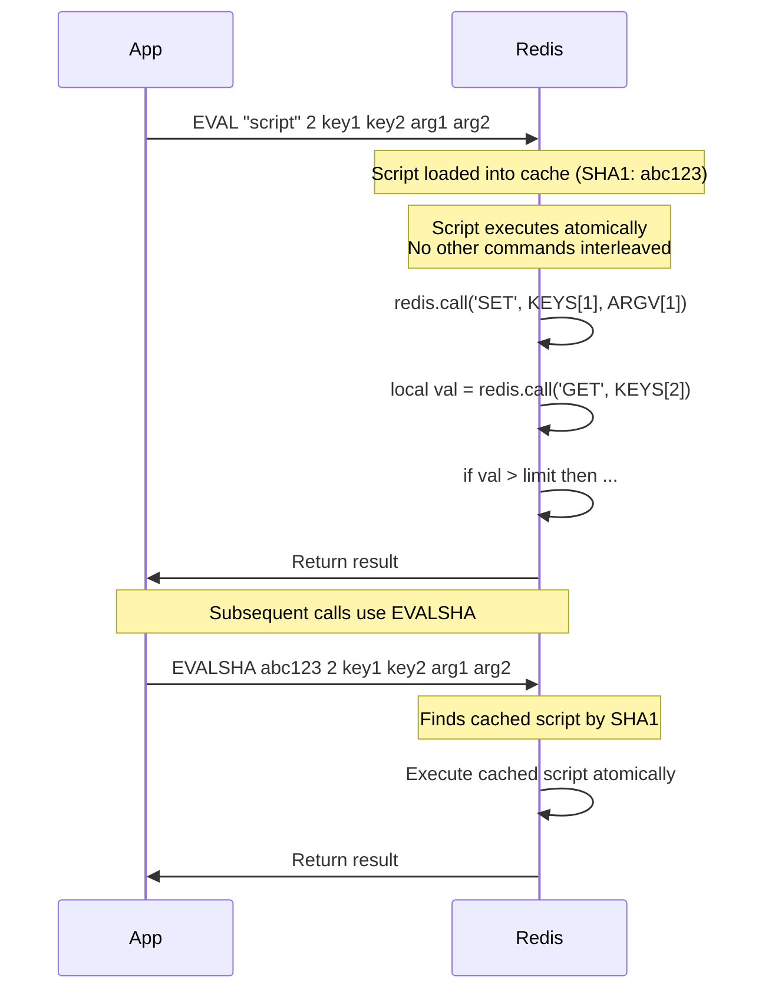

# 8.996 Redis — Lua Scripting — EVAL and EVALSHA

## Section 1 — Overview

Redis Lua scripting allows you to execute arbitrary Lua code directly on the Redis server. Scripts run atomically — no other commands execute during script execution — making them a powerful alternative to MULTI/EXEC transactions for complex atomic operations. While transactions provide atomic command batching without rollback, Lua scripts provide full control flow with conditionals, loops, local variables, and function calls, all within a single atomic execution context.

A Lua script is sent to the server via the EVAL command, which takes the script source code, a count of key names, followed by the key names and arguments. The script has access to two important global variables: KEYS (an array of key names passed to the script) and ARGV (an array of argument values). Standard Lua libraries (base, string, math, table) are available, along with the `redis` object that provides `redis.call()` and `redis.pcall()` functions for executing Redis commands from within the script.

The EVALSHA command provides a performance optimization: instead of sending the full script source on every call, you send its SHA1 hash. If a script with that hash has been previously loaded (via EVAL or SCRIPT LOAD), Redis executes it from its script cache. If the script is not cached, EVALSHA returns an error and the client must fall back to EVAL. StackExchange.Redis handles this automatically — it keeps a local cache of script SHA1 hashes and automatically falls back to EVAL if the script is not found on the server.

Scripts are cached on the Redis server indefinitely (until SCRIPT FLUSH is called). This means you can load scripts once at application startup and use EVALSHA for all subsequent invocations. The SCRIPT LOAD command pre-caches a script and returns its SHA1 hash. SCRIPT EXISTS checks whether scripts with given SHA1 hashes are in the cache.

Redis guarantees script atomicity and isolation. A script runs to completion without interruption from other Redis commands. If the script throws an unhandled Lua error, Redis returns the error to the client and all operations performed by the script are rolled back (Redis simulates rollback by not applying the effects of the script). This is different from transactions where runtime errors are silently skipped — Lua script errors cause the entire script to fail atomically.

The script execution blocks Redis — no other commands are processed while the script is running. This makes script performance critical: scripts should complete in under 5 milliseconds to avoid impacting overall Redis throughput. Long-running scripts are automatically killed if they exceed the `lua-time-limit` configuration (default 5000ms).

Scripts are also used for replication. By default, Redis replicates scripts verbatim to replicas. This ensures that replica state remains consistent with the primary. However, scripts that use non-deterministic functions (time, random) can cause replication drift. Redis provides the `redis.replicate_commands()` function to switch to command replication mode, where individual write commands are replicated instead of the script.

### Script Execution Model



### Lua vs Transactions Comparison

| Aspect | MULTI/EXEC | Lua Script |
|--------|-----------|------------|
| Atomicity | All commands execute atomically | Entire script executes atomically |
| Control flow | None — commands are queued blindly | Full Lua control flow |
| Command dependencies | None — commands don't see each other's results | Can use results of previous commands |
| Error handling | Runtime errors skipped, rest continues | Lua errors abort entire script |
| Rollback | No rollback | Redis discards script effects on error |
| Network round-trips | MULTI + N QUEUED + EXEC | 1 round-trip (EVAL or EVALSHA) |
| Performance | Good for simple batching | Excellent for complex operations |
| Cluster support | Same-slot keys only | Same-slot keys only |
| Script caching | N/A | SHA1-based caching (EVALSHA) |
| Debugging | Easy (straightforward commands) | Harder (must use redis.log or external tools) |

### Script Safety and Determinism

Redis requires Lua scripts to be deterministic for correct replication. Non-deterministic functions in the standard Lua library (like `os.time()`, `math.random()`) are not available in the Redis Lua sandbox. Redis provides its own replacements:
- `redis.time()` — returns current server time (deterministic within a script call)
- `redis.random()` — exists but is not available for direct use
- `math.random` and `math.randomseed` — are removed from the sandbox

For generating unique identifiers in scripts, use `redis.string("id")` or counter approaches. If you must use non-deterministic values, call `redis.replicate_commands()` at the start of the script to switch to command replication mode, which replicates each write command rather than the script itself.

### Script Cache and Lifecycle

Scripts loaded via EVAL are automatically cached on the server. The cache is:
- **Global** — shared across all databases on the same Redis instance
- **Persistent** — survives SCRIPT FLUSH (explicit FLUSH) but not server restart
- **Unlimited** — no explicit size limit, but memory is consumed per script
- **Indexed by SHA1** — each unique script has a unique SHA1 hash

To pre-warm the script cache during application startup:
1. Use SCRIPT LOAD to load all scripts
2. Store the SHA1 hashes in application configuration
3. Use EVALSHA with the stored hashes during normal operation
4. Handle NOSCRIPT errors by falling back to EVAL (StackExchange.Redis does this automatically)

## Section 2 — Command Reference

### EVAL Command

| Property | Detail |
|----------|--------|
| Command | EVAL script numkeys [key ...] [arg ...] |
| Complexity | O(N) where N is script execution complexity |
| Since | Redis 2.6.0 |
| ACL categories | @slow @scripting |
| Returns | Script result (depends on script) |

EVAL evaluates a Lua script on the Redis server. The first argument is the script source code as a string. The second argument is the number of key names (numkeys). Following that are the key names (KEYS in the script) and arguments (ARGV in the script).

Key names must be passed separately from arguments because Redis Cluster uses the key names to determine which node should execute the script. In cluster mode, all keys must hash to the same slot. Arguments have no slot restrictions.

```bash
EVAL "return redis.call('SET', KEYS[1], ARGV[1])" 1 mykey "hello"
# Output: OK

EVAL "return redis.call('GET', KEYS[1])" 1 mykey
# Output: "hello"
```

### EVALSHA Command

| Property | Detail |
|----------|--------|
| Command | EVALSHA sha1 numkeys [key ...] [arg ...] |
| Complexity | O(N) where N is script execution complexity |
| Since | Redis 2.6.0 |
| ACL categories | @slow @scripting |
| Returns | Script result (depends on script) |

EVALSHA evaluates a cached Lua script by its SHA1 hash. If the script is not in the cache, Redis returns an error: "NOSCRIPT No matching script. Please use EVAL."

```bash
SCRIPT LOAD "return redis.call('SET', KEYS[1], ARGV[1])"
# Output: "a329e6b8b3e8c9e5c7d1e6b9f7a3c8e5d1f2a3b4"

EVALSHA a329e6b8b3e8c9e5c7d1e6b9f7a3c8e5d1f2a3b4 1 mykey "world"
# Output: OK
```

### SCRIPT LOAD Command

| Property | Detail |
|----------|--------|
| Command | SCRIPT LOAD script |
| Complexity | O(N) for N script length |
| Since | Redis 2.6.0 |
| ACL categories | @slow @scripting |
| Returns | SHA1 hash of the script |

SCRIPT LOAD loads a script into the script cache without executing it. Returns the SHA1 hash of the script.

```bash
SCRIPT LOAD "return redis.call('GET', KEYS[1])"
# Output: "4e6f3e2a1b5c8d7f9e0a1b2c3d4e5f6a7b8c9d0e"
```

### SCRIPT EXISTS Command

| Property | Detail |
|----------|--------|
| Command | SCRIPT EXISTS sha1 [sha2 ...] |
| Complexity | O(N) for N SHA1 hashes checked |
| Since | Redis 2.6.0 |
| ACL categories | @slow @scripting |
| Returns | Array of integers (1 = exists, 0 = not exists) |

SCRIPT EXISTS checks whether scripts with the given SHA1 hashes exist in the script cache.

```bash
SCRIPT EXISTS a329e6b8b3e8c9e5c7d1e6b9f7a3c8e5d1f2a3b4 nonexistenthash
# Output: 1) (integer) 1  2) (integer) 0
```

### SCRIPT FLUSH Command

| Property | Detail |
|----------|--------|
| Command | SCRIPT FLUSH |
| Complexity | O(N) for N cached scripts |
| Since | Redis 2.6.0 |
| ACL categories | @slow @scripting |
| Returns | Always OK |

SCRIPT FLUSH removes all scripts from the script cache. After SCRIPT FLUSH, all EVALSHA calls will fail with NOSCRIPT errors until the scripts are re-loaded. Use with caution in production — cache miss recovery will require falling back to EVAL.

### SCRIPT KILL Command

| Property | Detail |
|----------|--------|
| Command | SCRIPT KILL |
| Complexity | O(1) |
| Since | Redis 2.6.0 |
| ACL categories | @slow @scripting |
| Returns | OK or error |

SCRIPT KILL kills a running script that has exceeded the `lua-time-limit`. It can only kill scripts that have not yet executed any write commands. If the script has written data, only SHUTDOWN NOSAVE can terminate it (which loses data).

### Other Scripting Commands

| Command | Description |
|---------|-------------|
| SCRIPT DEBUG | Controls script debugging (requires Redis debug build) |
| SCRIPT REPL | Switches script to command replication mode (in-script) |

### Lua API Reference

The Redis Lua sandbox provides these globals:

| Function/Object | Description |
|----------------|-------------|
| redis.call(cmd, ...) | Execute a Redis command. Raises a Lua error on failure. |
| redis.pcall(cmd, ...) | Execute a Redis command. Returns error object on failure. |
| redis.status_reply(str) | Return a Redis status reply |
| redis.error_reply(str) | Return a Redis error reply |
| redis.log(level, msg) | Log a message to the Redis log file |
| redis.sha1hex(str) | Compute SHA1 hash of a string |
| redis.replicate_commands() | Switch to command replication mode |
| redis.set_repl(repl_mode) | Set replication mode for next write commands |
| KEYS[n] | Key names passed to the script (1-indexed) |
| ARGV[n] | Arguments passed to the script (1-indexed) |

Available Lua libraries: base, string, table, math (deterministic subset), bit, cjson, cmsgpack, struct (if compiled).

### Redis.call vs Redis.pcall

| Function | Behavior on Redis Error |
|----------|------------------------|
| redis.call() | Raises a Lua error — script aborts, effects rolled back |
| redis.pcall() | Returns a Lua table with error details — script continues |

```lua
-- redis.call — error aborts the entire script
redis.call('LPUSH', KEYS[1], ARGV[1])  -- If KEYS[1] is a string, this raises error

-- redis.pcall — error is returned, script can handle it
local result = redis.pcall('LPUSH', KEYS[1], ARGV[1])
if result.err then
    redis.log(redis.LOG_WARNING, 'Command failed: ' .. result.err)
    return redis.error_reply('Operation failed')
end
```

### Script Result Types

| Lua Type | Redis Response |
|----------|---------------|
| nil | Nil bulk string |
| boolean | Integer 0 or 1 |
| number | Integer (Redis converts to int64) |
| string | Bulk string |
| table (array) | Multi-bulk array |
| table (hash) | Multi-bulk array (not recommended) |
| Redis status reply | Status string |
| Redis error reply | Error |

## Section 3 — Redis CLI Examples

### Basic Lua Scripting

```bash
# Simple script — return a greeting
EVAL "return 'Hello from Redis!'" 0
# Output: "Hello from Redis!"

# Script with KEYS and ARGV
EVAL "return redis.call('SET', KEYS[1], ARGV[1])" 1 username "Alice"
# Output: OK

# Read back the value
EVAL "return redis.call('GET', KEYS[1])" 1 username
# Output: "Alice"
```

### Script with Control Flow — Conditional Update

```bash
# Atomically update a value only if it exists
EVAL "
    local exists = redis.call('EXISTS', KEYS[1])
    if exists == 1 then
        return redis.call('SET', KEYS[1], ARGV[1])
    else
        return redis.error_reply('Key does not exist')
    end
" 1 mykey "newvalue"
# Output: OK (if key exists) or error (if not)
```

### Atomic Counter with Reset

```bash
# Increment counter, reset if above threshold
EVAL "
    local current = redis.call('GET', KEYS[1])
    if not current then
        current = 0
    else
        current = tonumber(current)
    end
    current = current + tonumber(ARGV[1])
    if current > tonumber(ARGV[2]) then
        redis.call('SET', KEYS[1], 0)
        return 0
    else
        redis.call('SET', KEYS[1], current)
        return current
    end
" 1 counter 5 100
```

### Atomic Rate Limiter — Token Bucket

```bash
# Simple rate limiter: allow up to N requests per time window
# Script returns 1 if allowed, 0 if rate limited
EVAL "
    local key = KEYS[1]
    local limit = tonumber(ARGV[1])
    local window = tonumber(ARGV[2])
    local now = redis.call('TIME')[1]
    
    -- Remove entries outside the window
    redis.call('ZREMRANGEBYSCORE', key, 0, now - window)
    
    -- Count entries in the window
    local count = redis.call('ZCARD', key)
    
    if count < limit then
        redis.call('ZADD', key, now, now .. ':' .. math.random())
        redis.call('EXPIRE', key, window + 1)
        return 1
    else
        return 0
    end
" 1 ratelimit:user:42 10 60
```

### Lua Script with Table Manipulation

```bash
# Get multiple keys and return as a hash
EVAL "
    local result = {}
    for i, key in ipairs(KEYS) do
        result[key] = redis.call('GET', key)
    end
    return result
" 3 key1 key2 key3
```

### Compare and Swap with Lua

```bash
# Atomic CAS: set new value only if current matches expected
EVAL "
    local current = redis.call('GET', KEYS[1])
    if current == ARGV[1] then
        redis.call('SET', KEYS[1], ARGV[2])
        return 1
    end
    return 0
" 1 mykey "expected" "newvalue"
```

### Script with Error Handling

```bash
# Using pcall to handle errors gracefully
EVAL "
    local ok, err = pcall(redis.call, 'SET', KEYS[1], ARGV[1])
    if ok then
        return 'Success'
    else
        redis.log(redis.LOG_WARNING, 'SET failed: ' .. tostring(err))
        return redis.error_reply('SET command failed: ' .. tostring(err))
    end
" 1 mykey "value"
```

### Batch Delete with Prefix

```bash
# Delete all keys matching a pattern and return count
# WARNING: KEYS is blocking — use only with small key spaces
EVAL "
    local keys = redis.call('KEYS', ARGV[1])
    local count = 0
    for i, key in ipairs(keys) do
        redis.call('DEL', key)
        count = count + 1
    end
    return count
" 0 "temp:*"
```

### Lua with Multi Command

Scripts can include MULTI/EXEC for additional batching (though the script itself is already atomic):

```bash
EVAL "
    redis.call('MULTI')
    redis.call('SET', KEYS[1], ARGV[1])
    redis.call('SET', KEYS[2], ARGV[2])
    redis.call('INCR', KEYS[3])
    local results = redis.call('EXEC')
    return results
" 3 key1 key2 counter "val1" "val2"
```

### Script Loading and EVALSHA

```bash
# Load a script and execute by hash
SCRIPT LOAD "return redis.call('GET', KEYS[1])"
# Output: "4e6f3e2a1b5c8d7f9e0a1b2c3d4e5f6a7b8c9d0e"

# Execute with EVALSHA
EVALSHA 4e6f3e2a1b5c8d7f9e0a1b2c3d4e5f6a7b8c9d0e 1 mykey
# Output: (value of mykey)

# Check if script exists
SCRIPT EXISTS 4e6f3e2a1b5c8d7f9e0a1b2c3d4e5f6a7b8c9d0e 0000000000000000000000000000000000000000
# Output: 1) (integer) 1  2) (integer) 0
```

### Script with Type Checking

```bash
# Safely increment a value only if it's a number
EVAL "
    local val = redis.call('GET', KEYS[1])
    if val == false then
        redis.call('SET', KEYS[1], 0)
        return 0
    end
    local num = tonumber(val)
    if num == nil then
        return redis.error_reply('Value is not a number')
    end
    num = num + tonumber(ARGV[1])
    redis.call('SET', KEYS[1], num)
    return num
" 1 counter 5
```

### Script with Time-Based Expiration

```bash
# Set key with TTL based on business logic
EVAL "
    local current_hour = tonumber(redis.call('TIME')[1]) % 86400 / 3600
    local ttl
    if current_hour >= 9 and current_hour < 17 then
        ttl = 3600   -- 1 hour during business hours
    else
        ttl = 28800  -- 8 hours outside business hours
    end
    redis.call('SET', KEYS[1], ARGV[1])
    redis.call('EXPIRE', KEYS[1], ttl)
    return ttl
" 1 session:token "abc123"
```

### Lua Script with JSON

```bash
# Parse and manipulate JSON data in a hash field
EVAL "
    local data = redis.call('HGET', KEYS[1], ARGV[1])
    if not data then
        return redis.error_reply('Field not found')
    end
    local obj = cjson.decode(data)
    obj[ARGV[2]] = ARGV[3]
    redis.call('HSET', KEYS[1], ARGV[1], cjson.encode(obj))
    return cjson.encode(obj)
" 1 user:42:profile "metadata" "last_login" "2026-06-27"
```

## Section 4 — StackExchange.Redis Code

### Basic Script Execution — EVAL

```csharp
using StackExchange.Redis;

/// <summary>
/// Demonstrates basic Lua script execution with StackExchange.Redis.
/// Scripts can be sent as raw strings or pre-loaded with SHA1 caching.
/// </summary>
public class LuaScriptService
{
    private readonly ConnectionMultiplexer _muxer;
    private readonly IDatabase _db;

    public LuaScriptService(ConnectionMultiplexer muxer)
    {
        _muxer = muxer;
        _db = muxer.GetDatabase();
    }

    /// <summary>
    /// Executes a Lua script using EVAL (sends full script each time).
    /// StackExchange.Redis accepts anonymous objects for KEYS and ARGV.
    /// KEYS are passed as RedisKey[], ARGV as RedisValue[].
    /// </summary>
    public async Task<RedisResult> ExecuteSimpleScriptAsync()
    {
        var script = "return redis.call('SET', KEYS[1], ARGV[1])";
        var keys = new RedisKey[] { "mykey" };
        var values = new RedisValue[] { "hello" };

        return await _db.ScriptEvaluateAsync(script, keys, values);
    }

    /// <summary>
    /// Executes a Lua script using named parameters with anonymous objects.
    /// StackExchange.Redis maps anonymous object properties to @param names.
    /// @key and @value are the parameter names used in the script.
    /// </summary>
    public async Task<RedisResult> ExecuteWithNamedParametersAsync()
    {
        var script = "return redis.call('SET', @key, @value)";
        return await _db.ScriptEvaluateAsync(script, new { key = (RedisKey)"mykey", value = "world" });
    }

    /// <summary>
    /// Pre-loads a script with SCRIPT LOAD and returns its SHA1.
    /// Subsequent calls use EVALSHA for better performance.
    /// </summary>
    public async Task<string> LoadAndExecuteAsync()
    {
        var script = "return redis.call('GET', @key)";
        
        // Pre-load the script
        var loaded = await _db.ScriptLoadAsync(script);
        string sha1 = loaded.ToString();
        
        // Execute using EVALSHA
        var result = await _db.ScriptEvaluateAsync(loaded, new { key = (RedisKey)"mykey" });
        
        return result.ToString();
    }
}
```

### Atomic Rate Limiter with Lua

```csharp
public class LuaRateLimiter
{
    private readonly ConnectionMultiplexer _muxer;
    private readonly IDatabase _db;
    private readonly string _scriptSha1;

    /// <summary>
    /// Lua script for atomic rate limiting using sorted sets.
    /// Returns 1 if request is allowed, 0 if rate limited.
    /// </summary>
    private const string RateLimitScript = @"
        local key = KEYS[1]
        local limit = tonumber(ARGV[1])
        local window = tonumber(ARGV[2])
        local now = redis.call('TIME')[1]
        
        redis.call('ZREMRANGEBYSCORE', key, 0, now - window)
        local count = redis.call('ZCARD', key)
        
        if count < limit then
            redis.call('ZADD', key, now, now .. ':' .. math.random())
            redis.call('EXPIRE', key, window + 1)
            return 1
        else
            return 0
        end
    ";

    public LuaRateLimiter(ConnectionMultiplexer muxer)
    {
        _muxer = muxer;
        _db = muxer.GetDatabase();
    }

    public async Task InitializeAsync()
    {
        // Pre-load script at startup
        var loaded = await _db.ScriptLoadAsync(RateLimitScript);
        _scriptSha1 = loaded.ToString();
    }

    /// <summary>
    /// Checks if a request is allowed under the rate limit.
    /// Uses EVALSHA if script is cached, falls back to EVAL.
    /// </summary>
    public async Task<bool> IsAllowedAsync(string userId, string action, int maxRequests, int windowSeconds)
    {
        var key = $"ratelimit:{userId}:{action}";
        var result = await _db.ScriptEvaluateAsync(_scriptSha1, new RedisKey[] { key }, 
            new RedisValue[] { maxRequests.ToString(), windowSeconds.ToString() });

        return (int)result == 1;
    }
}
```

### Atomic Distributed Lock with Lua

```csharp
public class LuaDistributedLock
{
    private readonly ConnectionMultiplexer _muxer;
    private readonly IDatabase _db;

    /// <summary>
    /// Lua script for atomic lock acquisition with auto-release.
    /// Only acquires if key does not exist, sets lock with expiry.
    /// </summary>
    private const string AcquireLockScript = @"
        if redis.call('SET', KEYS[1], ARGV[1], 'NX', 'PX', ARGV[2]) then
            return 1
        end
        return 0
    ";

    /// <summary>
    /// Lua script for atomic lock release.
    /// Only releases if the lock token matches (prevents releasing others' locks).
    /// </summary>
    private const string ReleaseLockScript = @"
        if redis.call('GET', KEYS[1]) == ARGV[1] then
            return redis.call('DEL', KEYS[1])
        end
        return 0
    ";

    /// <summary>
    /// Lua script for atomic lock extension.
    /// Only extends if the lock token matches.
    /// </summary>
    private const string ExtendLockScript = @"
        if redis.call('GET', KEYS[1]) == ARGV[1] then
            return redis.call('PEXPIRE', KEYS[1], ARGV[2])
        end
        return 0
    ";

    public LuaDistributedLock(ConnectionMultiplexer muxer)
    {
        _muxer = muxer;
        _db = muxer.GetDatabase();
    }

    public async Task<bool> TryAcquireAsync(string lockKey, string lockToken, TimeSpan expiry)
    {
        var result = await _db.ScriptEvaluateAsync(AcquireLockScript,
            new RedisKey[] { lockKey },
            new RedisValue[] { lockToken, ((long)expiry.TotalMilliseconds).ToString() });

        return (int)result == 1;
    }

    public async Task<bool> ReleaseAsync(string lockKey, string lockToken)
    {
        var result = await _db.ScriptEvaluateAsync(ReleaseLockScript,
            new RedisKey[] { lockKey },
            new RedisValue[] { lockToken });

        return (int)result == 1;
    }

    public async Task<bool> ExtendAsync(string lockKey, string lockToken, TimeSpan newExpiry)
    {
        var result = await _db.ScriptEvaluateAsync(ExtendLockScript,
            new RedisKey[] { lockKey },
            new RedisValue[] { lockToken, ((long)newExpiry.TotalMilliseconds).ToString() });

        return (int)result == 1;
    }
}
```

### Atomic Compare and Swap with Lua

```csharp
public class LuaCompareAndSwap
{
    private readonly ConnectionMultiplexer _muxer;
    private readonly IDatabase _db;

    /// <summary>
    /// Lua script for atomic compare-and-swap on a string key.
    /// Only sets new value if current value equals expected value.
    /// Returns 1 on success, 0 on failure.
    /// </summary>
    private const string CompareAndSwapScript = @"
        local current = redis.call('GET', KEYS[1])
        if current == ARGV[1] then
            redis.call('SET', KEYS[1], ARGV[2])
            return 1
        end
        return 0
    ";

    /// <summary>
    /// Lua script for atomic compare-and-swap on a hash field.
    /// Only updates the hash field if it matches the expected value.
    /// </summary>
    private const string HashCompareAndSwapScript = @"
        local current = redis.call('HGET', KEYS[1], ARGV[1])
        if current == ARGV[2] then
            redis.call('HSET', KEYS[1], ARGV[1], ARGV[3])
            return 1
        end
        return 0
    ";

    public LuaCompareAndSwap(ConnectionMultiplexer muxer)
    {
        _muxer = muxer;
        _db = muxer.GetDatabase();
    }

    public async Task<bool> StringCompareAndSwapAsync(string key, string expected, string newValue)
    {
        var result = await _db.ScriptEvaluateAsync(CompareAndSwapScript,
            new RedisKey[] { key },
            new RedisValue[] { expected, newValue });

        return (int)result == 1;
    }

    public async Task<bool> HashCompareAndSwapAsync(string hashKey, string field, string expected, string newValue)
    {
        var result = await _db.ScriptEvaluateAsync(HashCompareAndSwapScript,
            new RedisKey[] { hashKey },
            new RedisValue[] { field, expected, newValue });

        return (int)result == 1;
    }
}
```

### Atomic Inventory Reservation with Lua

```csharp
public class LuaInventoryService
{
    private readonly ConnectionMultiplexer _muxer;
    private readonly IDatabase _db;

    /// <summary>
    /// Lua script for atomic inventory reservation.
    /// Checks stock availability, decrements, and records reservation.
    /// Returns 1 on success, 0 if insufficient stock, error on failure.
    /// </summary>
    private const string ReserveInventoryScript = @"
        local stockKey = KEYS[1]
        local orderKey = KEYS[2]
        local sku = ARGV[1]
        local quantity = tonumber(ARGV[2])
        local orderId = ARGV[3]
        local timestamp = ARGV[4]
        
        local current = redis.call('GET', stockKey)
        if not current then
            return redis.error_reply('Stock key not found: ' .. sku)
        end
        
        local available = tonumber(current)
        if available < quantity then
            return 0
        end
        
        redis.call('DECRBY', stockKey, quantity)
        redis.call('HSET', orderKey, 
            'sku', sku,
            'quantity', quantity,
            'status', 'reserved',
            'timestamp', timestamp
        )
        return 1
    ";

    public LuaInventoryService(ConnectionMultiplexer muxer)
    {
        _muxer = muxer;
        _db = muxer.GetDatabase();
    }

    public async Task<ReservationResult> TryReserveAsync(string sku, int quantity, string orderId)
    {
        var stockKey = $"stock:{sku}";
        var orderKey = $"order:{orderId}";
        var timestamp = DateTimeOffset.UtcNow.ToUnixTimeSeconds().ToString();

        var result = await _db.ScriptEvaluateAsync(ReserveInventoryScript,
            new RedisKey[] { stockKey, orderKey },
            new RedisValue[] { sku, quantity.ToString(), orderId, timestamp });

        if (result.IsNull)
            return ReservationResult.Failure("Unexpected error");

        if (result.Type == ResultType.Error)
            return ReservationResult.Failure(result.ToString());

        int code = (int)result;
        return code == 1
            ? ReservationResult.Success()
            : ReservationResult.Failure("Insufficient stock");
    }

    public record ReservationResult
    {
        public bool Success { get; init; }
        public string ErrorMessage { get; init; }
        public static ReservationResult Success() => new() { Success = true };
        public static ReservationResult Failure(string msg) => new() { Success = false, ErrorMessage = msg };
    }
}
```

### Lua Script with Prepared Loading Pattern

```csharp
public class ScriptManager
{
    private readonly ConnectionMultiplexer _muxer;
    private readonly Dictionary<string, string> _scriptCache = new();

    public ScriptManager(ConnectionMultiplexer muxer)
    {
        _muxer = muxer;
    }

    /// <summary>
    /// Registers a script with a name and loads it into Redis cache.
    /// Returns the SHA1 hash of the loaded script.
    /// </summary>
    public async Task<string> RegisterScriptAsync(string name, string luaScript)
    {
        var db = _muxer.GetDatabase();
        var loaded = await db.ScriptLoadAsync(luaScript);
        var sha1 = loaded.ToString();

        _scriptCache[name] = luaScript;
        
        return sha1;
    }

    /// <summary>
    /// Executes a registered script by name.
    /// Uses EVALSHA if available, falls back to EVAL.
    /// </summary>
    public async Task<RedisResult> ExecuteScriptAsync(
        string name, RedisKey[] keys = null, RedisValue[] values = null)
    {
        if (!_scriptCache.TryGetValue(name, out var script))
        {
            throw new ArgumentException($"Script '{name}' not registered.", nameof(name));
        }

        var db = _muxer.GetDatabase();
        
        try
        {
            // Try EVALSHA first
            var sha1 = RedisScript.Load(script).Hash;
            return await db.ScriptEvaluateAsync(sha1, keys ?? Array.Empty<RedisKey>(), values ?? Array.Empty<RedisValue>());
        }
        catch (RedisServerException ex) when (ex.Message.Contains("NOSCRIPT"))
        {
            // Fall back to EVAL if script was flushed from cache
            return await db.ScriptEvaluateAsync(script, keys ?? Array.Empty<RedisKey>(), values ?? Array.Empty<RedisValue>());
        }
    }

    /// <summary>
    /// Pre-loads all registered scripts at application startup.
    /// </summary>
    public async Task InitializeAsync()
    {
        foreach (var (name, script) in _scriptCache)
        {
            await RegisterScriptAsync(name, script);
            Console.WriteLine($"[ScriptManager] Loaded script '{name}'");
        }
    }
}
```

### Lua Script for Zipped Score Update

```csharp
public class LuaLeaderboardService
{
    private readonly ConnectionMultiplexer _muxer;
    private readonly IDatabase _db;

    /// <summary>
    /// Lua script that atomically increments a sorted set member's score
    /// and returns the member's new rank. Prevents race conditions in leaderboards.
    /// </summary>
    private const string IncrementAndRankScript = @"
        local key = KEYS[1]
        local member = ARGV[1]
        local increment = tonumber(ARGV[2])
        
        local newScore = redis.call('ZINCRBY', key, increment, member)
        local rank = redis.call('ZREVRANK', key, member)
        
        return {newScore, rank}
    ";

    public LuaLeaderboardService(ConnectionMultiplexer muxer)
    {
        _muxer = muxer;
        _db = muxer.GetDatabase();
    }

    public async Task<(double Score, long? Rank)> IncrementAndGetRankAsync(
        string leaderboardKey, string member, double incrementBy)
    {
        var result = await _db.ScriptEvaluateAsync(IncrementAndRankScript,
            new RedisKey[] { leaderboardKey },
            new RedisValue[] { member, incrementBy.ToString("F6") });

        var array = (RedisResult[])result;
        double score = (double)array[0];
        long? rank = array[1].IsNull ? null : (long?)array[1];

        return (score, rank);
    }
}
```

### Lua Script for Cache-Aside Pattern

```csharp
public class LuaCacheAsideService
{
    private readonly ConnectionMultiplexer _muxer;
    private readonly IDatabase _db;

    /// <summary>
    /// Lua script implementing cache-aside with atomic refresh.
    /// Returns cached value if exists and not expired.
    /// If cache is stale or missing, returns a signal to refresh.
    /// </summary>
    private const string CacheAsideScript = @"
        local cacheKey = KEYS[1]
        local refreshKey = KEYS[2]
        local ttl = tonumber(ARGV[1])
        local gracePeriod = tonumber(ARGV[2])
        
        -- Check if refresh is already in progress
        local refreshing = redis.call('GET', refreshKey)
        if refreshing then
            -- Another process is refreshing, return stale data if available
            local stale = redis.call('GET', cacheKey)
            if stale then
                return {stale, 0}
            end
            return {nil, -1}
        end
        
        -- Check cache
        local cached = redis.call('GET', cacheKey)
        local ttl_remaining = redis.call('TTL', cacheKey)
        
        if cached and ttl_remaining > gracePeriod then
            return {cached, 1}
        end
        
        -- Need to refresh
        return {nil, 2}
    ";

    private const string RefreshCompleteScript = @"
        redis.call('SET', KEYS[1], ARGV[1], 'EX', ARGV[2])
        redis.call('DEL', KEYS[2])
        return 1
    ";

    public LuaCacheAsideService(ConnectionMultiplexer muxer)
    {
        _muxer = muxer;
        _db = muxer.GetDatabase();
    }

    public async Task<CacheResult> CheckCacheAsync(string cacheKey, int ttlSeconds, int gracePeriodSeconds)
    {
        var refreshKey = $"{cacheKey}:refreshing";

        var result = await _db.ScriptEvaluateAsync(CacheAsideScript,
            new RedisKey[] { cacheKey, refreshKey },
            new RedisValue[] { ttlSeconds.ToString(), gracePeriodSeconds.ToString() });

        if (result.IsNull)
            return CacheResult.Miss();

        var array = (RedisResult[])result;
        var cached = array[0];
        int status = (int)array[1];

        return status switch
        {
            0 => CacheResult.Stale(cached.ToString()),     // Other process refreshing
            1 => CacheResult.Hit(cached.ToString()),        // Cache valid
            2 => CacheResult.Miss(),                         // Need refresh
            _ => CacheResult.Miss()
        };
    }

    public async Task CompleteRefreshAsync(string cacheKey, string value, int ttlSeconds)
    {
        var refreshKey = $"{cacheKey}:refreshing";

        await _db.ScriptEvaluateAsync(RefreshCompleteScript,
            new RedisKey[] { cacheKey, refreshKey },
            new RedisValue[] { value, ttlSeconds.ToString() });
    }

    public record CacheResult
    {
        public string Value { get; init; }
        public CacheStatus Status { get; init; }
        public static CacheResult Hit(string v) => new() { Value = v, Status = CacheStatus.Hit };
        public static CacheResult Stale(string v) => new() { Value = v, Status = CacheStatus.Stale };
        public static CacheResult Miss() => new() { Status = CacheStatus.Miss };
    }

    public enum CacheStatus { Hit, Stale, Miss }
}
```

### Lua Script with Error Handling and Retry

```csharp
public class LuaErrorHandlingService
{
    private readonly ConnectionMultiplexer _muxer;
    private readonly ILogger _logger;

    /// <summary>
    /// Demonstrates robust Lua script execution with error handling,
    /// retry logic for connection failures, and proper timeout management.
    /// </summary>
    private const string SafeScript = @"
        local result = redis.pcall('GET', KEYS[1])
        if result.err then
            redis.log(redis.LOG_WARNING, 'GET failed: ' .. result.err)
            return redis.error_reply('GET failed')
        end
        
        local value = result
        if value then
            local num = tonumber(value)
            if num then
                redis.call('SET', KEYS[1], num + 1)
                return num + 1
            end
            return redis.error_reply('Value is not a number')
        end
        
        redis.call('SET', KEYS[1], 1)
        return 1
    ";

    public LuaErrorHandlingService(ConnectionMultiplexer muxer, ILogger logger)
    {
        _muxer = muxer;
        _logger = logger;
    }

    public async Task<RedisResult> ExecuteSafeScriptAsync(string key, int maxRetries = 3)
    {
        for (int attempt = 1; attempt <= maxRetries; attempt++)
        {
            try
            {
                var db = _muxer.GetDatabase();
                return await db.ScriptEvaluateAsync(SafeScript, new RedisKey[] { key }, null);
            }
            catch (RedisConnectionException ex)
            {
                _logger.LogWarning(ex, "Connection error on attempt {Attempt}", attempt);
                if (attempt == maxRetries) throw;
                await Task.Delay(TimeSpan.FromMilliseconds(100 * attempt));
            }
            catch (RedisTimeoutException ex)
            {
                _logger.LogWarning(ex, "Timeout on attempt {Attempt}", attempt);
                if (attempt == maxRetries) throw;
                await Task.Delay(TimeSpan.FromMilliseconds(100 * attempt));
            }
            catch (RedisServerException ex) when (ex.Message.Contains("NOSCRIPT"))
            {
                // Script was flushed — re-send with EVAL
                var db = _muxer.GetDatabase();
                return await db.ScriptEvaluateAsync(SafeScript, new RedisKey[] { key }, null);
            }
        }

        throw new InvalidOperationException("Unexpected: should not reach here.");
    }
}
```

### Lua Script with JSON Processing

```csharp
public class LuaJsonService
{
    private readonly ConnectionMultiplexer _muxer;

    /// <summary>
    /// Lua script that reads a JSON string from Redis, updates a field,
    /// and writes it back — all atomically. Uses Redis's cjson library.
    /// </summary>
    private const string UpdateJsonFieldScript = @"
        local key = KEYS[1]
        local field = ARGV[1]
        local newValue = ARGV[2]
        
        local json = redis.call('GET', key)
        local obj
        if json then
            obj = cjson.decode(json)
        else
            obj = {}
        end
        
        obj[field] = newValue
        redis.call('SET', key, cjson.encode(obj))
        return cjson.encode(obj)
    ";

    public LuaJsonService(ConnectionMultiplexer muxer)
    {
        _muxer = muxer;
    }

    public async Task<string> UpdateJsonFieldAsync(string key, string field, string newValue)
    {
        var db = _muxer.GetDatabase();
        var result = await db.ScriptEvaluateAsync(UpdateJsonFieldScript,
            new RedisKey[] { key },
            new RedisValue[] { field, newValue });

        return result.ToString();
    }
}
```

### Lua Script for Batch Operation with Progress

```csharp
public class LuaBatchService
{
    private readonly ConnectionMultiplexer _muxer;

    /// <summary>
    /// Lua script that atomically moves all members from source set to
    /// destination set and returns the count of moved members.
    /// </summary>
    private const string MoveSetScript = @"
        local srcKey = KEYS[1]
        local dstKey = KEYS[2]
        
        local members = redis.call('SMEMBERS', srcKey)
        local count = 0
        
        for i, member in ipairs(members) do
            redis.call('SADD', dstKey, member)
            redis.call('SREM', srcKey, member)
            count = count + 1
        end
        
        return count
    ";

    /// <summary>
    /// Lua script that atomically trims a list to a max length,
    /// removing oldest elements first. Returns count of removed elements.
    /// </summary>
    private const string TrimListScript = @"
        local key = KEYS[1]
        local maxLen = tonumber(ARGV[1])
        
        local currentLen = redis.call('LLEN', key)
        local toRemove = currentLen - maxLen
        
        if toRemove > 0 then
            for i = 1, toRemove do
                redis.call('RPOP', key)
            end
        end
        
        return math.max(0, toRemove)
    ";

    public LuaBatchService(ConnectionMultiplexer muxer)
    {
        _muxer = muxer;
    }

    public async Task<long> MoveSetAtomicallyAsync(string sourceKey, string destKey)
    {
        var db = _muxer.GetDatabase();
        var result = await db.ScriptEvaluateAsync(MoveSetScript,
            new RedisKey[] { sourceKey, destKey }, null);

        return (long)result;
    }

    public async Task<long> TrimListToMaxAsync(string listKey, long maxLength)
    {
        var db = _muxer.GetDatabase();
        var result = await db.ScriptEvaluateAsync(TrimListScript,
            new RedisKey[] { listKey },
            new RedisValue[] { maxLength.ToString() });

        return (long)result;
    }
}
```

## Section 5 — Use Cases

### Atomic Rate Limiting

Rate limiting is one of the most common Lua script use cases. The script:
1. Removes expired entries from a sorted set (by score = timestamp)
2. Counts remaining entries
3. If under limit, adds new entry and returns 1
4. If over limit, returns 0

This entire operation is atomic — no race conditions between removal, counting, and adding.

```csharp
public class RateLimiterService
{
    private readonly ConnectionMultiplexer _muxer;
    private readonly string _sha1;

    private const string Script = @"
        local key = KEYS[1]
        local limit = tonumber(ARGV[1])
        local window = tonumber(ARGV[2])
        local now = redis.call('TIME')[1]
        
        redis.call('ZREMRANGEBYSCORE', key, 0, now - window)
        
        if redis.call('ZCARD', key) < limit then
            redis.call('ZADD', key, now, now .. ':' .. math.random())
            redis.call('EXPIRE', key, window + 1)
            return 1
        end
        
        return 0
    ";

    public async Task<bool> CheckRateLimitAsync(string userId, string action, int maxRequests, int windowSeconds)
    {
        var db = _muxer.GetDatabase();
        var key = $"ratelimit:{userId}:{action}";
        
        var result = await db.ScriptEvaluateAsync(Script,
            new RedisKey[] { key },
            new RedisValue[] { maxRequests.ToString(), windowSeconds.ToString() });

        return (int)result == 1;
    }
}
```

### Distributed Lock with Safety Checks

Lua scripts enable safe distributed locking with proper token validation:
- Lock acquisition: SET NX PX with token
- Lock release: GET + DEL only if token matches
- Lock extension: GET + PEXPIRE only if token matches

```csharp
public class SafeDistributedLockService
{
    private const string Acquire = @"
        if redis.call('SET', KEYS[1], ARGV[1], 'NX', 'PX', ARGV[2]) then return 1 end
        return 0
    ";

    private const string Release = @"
        if redis.call('GET', KEYS[1]) == ARGV[1] then
            return redis.call('DEL', KEYS[1])
        end
        return 0
    ";

    private const string Extend = @"
        if redis.call('GET', KEYS[1]) == ARGV[1] then
            return redis.call('PEXPIRE', KEYS[1], ARGV[2])
        end
        return 0
    ";
}
```

### Atomic Cache Refresh with Stampede Protection

Cache stampede occurs when many requests simultaneously try to refresh an expired cache key. Lua scripts can implement a "refresh token" mechanism where only one process refreshes while others get stale data.

```csharp
public class StampedeProtectionService
{
    private const string CheckAndRefresh = @"
        local cacheKey = KEYS[1]
        local lockKey = KEYS[2]
        local ttl = tonumber(ARGV[1])
        local graceMs = tonumber(ARGV[2])
        
        -- Check if refresh is in progress
        local locked = redis.call('GET', lockKey)
        if locked then
            -- Return stale data if available
            return {redis.call('GET', cacheKey), 0}
        end
        
        -- Check if cache needs refresh
        local ttlLeft = redis.call('TTL', cacheKey)
        if ttlLeft > graceMs then
            return {redis.call('GET', cacheKey), 1}
        end
        
        -- Lock for refresh
        redis.call('SET', lockKey, 1, 'PX', 30000)
        return {nil, 2}
    ";
}
```

### Atomic Data Migration

Migrating data between Redis structures while maintaining consistency is a natural fit for Lua scripts.

```csharp
public class MigrationService
{
    /// <summary>
    /// Atomically migrates user data from old string format to new hash format.
    /// </summary>
    private const string MigrateUserScript = @"
        local oldKey = KEYS[1]
        local newKey = KEYS[2]
        
        local data = redis.call('GET', oldKey)
        if not data then
            return 0
        end
        
        local parsed = cjson.decode(data)
        redis.call('HSET', newKey, 'name', parsed.name, 'email', parsed.email)
        redis.call('DEL', oldKey)
        return 1
    ";
}
```

### Multi-Key Atomic Operations

Operations that span multiple keys but must be atomic are ideal for Lua scripts.

```csharp
public class MultiKeyAtomicService
{
    /// <summary>
    /// Atomically copies all fields from one hash to another.
    /// </summary>
    private const string CopyHashScript = @"
        local src = KEYS[1]
        local dst = KEYS[2]
        local fields = redis.call('HGETALL', src)
        if #fields > 0 then
            redis.call('HMSET', dst, unpack(fields))
        end
        return #fields / 2
    ";

    /// <summary>
    /// Atomically swaps the values of two keys.
    /// </summary>
    private const string SwapKeysScript = @"
        local val1 = redis.call('GET', KEYS[1])
        local val2 = redis.call('GET', KEYS[2])
        redis.call('SET', KEYS[1], val2)
        redis.call('SET', KEYS[2], val1)
        return 1
    ";
}
```

### Atomic Unique Constraint Enforcement

Ensuring uniqueness across multiple keys atomically.

```csharp
public class UniqueConstraintService
{
    /// <summary>
    /// Atomically registers a user only if both username and email are unique.
    /// </summary>
    private const string RegisterUserScript = @"
        local usernameKey = KEYS[1]
        local emailKey = KEYS[2]
        local userKey = KEYS[3]
        local username = ARGV[1]
        local email = ARGV[2]
        
        if redis.call('EXISTS', usernameKey) == 1 then
            return redis.error_reply('Username already exists')
        end
        if redis.call('EXISTS', emailKey) == 1 then
            return redis.error_reply('Email already exists')
        end
        
        redis.call('SET', usernameKey, userKey)
        redis.call('SET', emailKey, userKey)
        redis.call('HSET', userKey, 'username', username, 'email', email)
        
        return 1
    ";
}
```

## Section 6 — Performance Considerations

### Script Execution Cost Breakdown

The cost of executing a Lua script includes:
1. **Transmission**: sending the script source (EVAL) or SHA1 hash (EVALSHA) — negligible for small scripts
2. **Parsing**: Lua bytecode compilation (only once when script is loaded into cache)
3. **Execution**: the actual Lua runtime execution, including redis.call/redis.pcall commands
4. **Result serialization**: converting Lua return value to Redis protocol

For EVALSHA, steps 1 and 2 are significantly cheaper because only the SHA1 and arguments are transmitted, and no compilation is needed.

### Lua Script Latency Guidelines

| Script Complexity | Typical Duration | Recommendation |
|------------------|-----------------|----------------|
| Simple (1-2 commands) | < 0.1ms | Excellent for any use case |
| Moderate (5-10 commands) | 0.1-1ms | Good, keep under 5ms |
| Complex (10-50 commands) | 1-10ms | Acceptable, check if optimize-able |
| Heavy (50+ commands) | 10-100ms | Consider breaking up |
| Blocking (> lua-time-limit) | > 5000ms | Script will be killed |

### Script Compilation Cost

Lua script compilation is CPU-intensive relative to execution. Compilation happens:
- First time a script is sent via EVAL or SCRIPT LOAD
- After SCRIPT FLUSH (all scripts must be recompiled)
- If the script cache is evicted

Pre-load scripts at application startup to amortize compilation cost over the application's lifetime.

### Redis.call vs Direct Command Performance

Each `redis.call()` inside a Lua script has the overhead of:
1. Parsing the command and arguments
2. Executing the command through Redis's internal dispatch
3. Returning the result to the Lua runtime

This overhead is small (microseconds) but significant for scripts with many commands. For scripts that primarily call Redis commands, the bottleneck is Redis's single-threaded nature, not the Lua interpreter.

### Script Cache Memory

Each unique script loaded into the script cache consumes memory proportional to its source length. For large applications with many scripts, this can be substantial. Monitor memory usage with `INFO SCRIPT`.

| Script Count | Average Size | Memory Used |
|-------------|-------------|-------------|
| 10 | 200 bytes | ~2 KB |
| 100 | 500 bytes | ~50 KB |
| 1000 | 1 KB | ~1 MB |

Script memory is typically negligible compared to data memory.

### Network Efficiency

Lua scripts provide excellent network efficiency because:
- One EVAL/EVALSHA call replaces N round-trips for N commands
- Arguments are sent once, not once per command
- Results are returned in one response, not N responses

For a 10-command transaction:
- MULTI/EXEC: ~12 network exchanges (MULTI + 10 QUEUED + EXEC + 10 results)
- Lua script: 1 network exchange (EVAL/EVALSHA + 1 result)

### Lua vs MULTI/EXEC Performance

| Scenario | MULTI/EXEC | Lua Script |
|----------|-----------|------------|
| 5 simple commands | ~0.5ms | ~0.1ms |
| 20 simple commands | ~1ms | ~0.2ms |
| 50 simple commands | ~2.5ms | ~0.5ms |
| 5 complex commands | ~2ms | ~1ms |

Lua scripts are consistently faster due to fewer network round-trips and no queuing overhead.

## Section 7 — Production Considerations

### Script Pre-Loading at Startup

Load all scripts at application startup to avoid the cost of script compilation during request processing. Use SCRIPT LOAD and store the SHA1 hashes.

```csharp
public class ScriptPreloader
{
    private readonly ConnectionMultiplexer _muxer;
    private readonly IReadOnlyDictionary<string, string> _scripts;

    public ScriptPreloader(ConnectionMultiplexer muxer, IReadOnlyDictionary<string, string> scripts)
    {
        _muxer = muxer;
        _scripts = scripts;
    }

    public async Task PreloadAllAsync()
    {
        var db = _muxer.GetDatabase();
        foreach (var (name, script) in _scripts)
        {
            var sha1 = await db.ScriptLoadAsync(script);
            Console.WriteLine($"[ScriptPreloader] Loaded '{name}' -> {sha1}");
        }
    }
}
```

### Script Determinism and Replication

Redis replicates Lua scripts verbatim (the entire EVAL/EVALSHA command) to replicas. This means:
- The same script runs on the replica with the same arguments
- Scripts must be deterministic to ensure replica consistency
- Non-deterministic functions (os.time, math.random) are disabled in the sandbox
- Use `redis.replicate_commands()` at the start of the script to switch to command replication

```lua
-- Command replication mode — each write command is replicated individually
redis.replicate_commands()
local ts = redis.call('TIME')[1]  -- Deterministic within the script
redis.call('SET', KEYS[1], ts)
```

### Script Timeout and Kill

Redis has a `lua-time-limit` configuration (default 5000ms). If a script runs longer than this:
1. Redis logs a warning that the script is running slowly
2. Redis starts accepting commands from other clients (but cannot execute them)
3. Other clients can send SCRIPT KILL to kill the script
4. If the script has already written data, only SHUTDOWN NOSAVE can stop it

To avoid script killing issues:
- Keep scripts short (< 5ms execution time)
- Avoid infinite loops (use bounded loops)
- Monitor slowlog for script entries
- Set appropriate lua-time-limit values

### Monitoring Lua Scripts

Monitor these Lua script metrics:
- **lua_scripts** (INFO SCRIPT): number of cached scripts
- **lua_kill** status: whether a script can be killed
- **slowlog**: entries with EXEC or EVAL/EVALSHA commands
- **Latency**: p99 script execution time

```bash
# Check script cache
redis-cli INFO SCRIPT

# Check slow log for slow scripts
redis-cli SLOWLOG GET 10

# Check running script
redis-cli SCRIPT DEBUG
```

### Script Caching Strategy

| Strategy | Pros | Cons |
|----------|------|------|
| EVAL every time | Simple, no cache management | Transmits full script each time |
| SCRIPT LOAD at startup | Best performance, no serial cost | Requires cache warmup |
| EVALSHA with fallback | Robust, handles SCRIPT FLUSH | Slightly more code |
| RedisScript class (SE.Redis) | Automatic SHA1 tracking | Library-specific |

StackExchange.Redis's `RedisScript` class provides automatic SHA1 management and fallback:

```csharp
// RedisScript handles SHA1 caching and NOSCRIPT fallback
var script = RedisScript.Load("return redis.call('GET', @key)");
var result = await db.ScriptEvaluateAsync(script, new { key = (RedisKey)"mykey" });
```

### Script Security

Lua scripts run in a sandboxed environment with limited access:
- No filesystem access
- No network access
- No OS calls
- Only deterministic math functions
- `redis.call` and `redis.pcall` for Redis commands

However, malicious scripts can still:
- Execute expensive operations that block Redis
- Delete data
- Fill memory with large return values

Protect against this:
- Sanitize script arguments (prevent injection into script strings)
- Set memory limits for script return values
- Use ACL restrictions to control who can execute EVAL/EVALSHA

### Cluster Mode Scripting

In Redis Cluster:
- Scripts must only access keys that hash to the same slot
- The slot is determined by the key names passed to EVAL/EVALSHA
- All KEYS must share the same hash tag for cluster compatibility
- StackExchange.Redis routes scripts to the correct node based on keys

```csharp
// Cluster-safe — same hash tag for all keys
var hashTag = "{user:42}";
var script = @"
    redis.call('SET', KEYS[1], ARGV[1])
    redis.call('SET', KEYS[2], ARGV[2])
";

await db.ScriptEvaluateAsync(script,
    new RedisKey[] { $"{hashTag}:name", $"{hashTag}:email" },
    new RedisValue[] { "Alice", "alice@example.com" });
```

### Debugging Lua Scripts

Debugging Lua scripts is challenging because:
- No interactive debugger in production Redis
- `redis.log()` writes to Redis log file (use `redis.log(redis.LOG_WARNING, msg)`)
- Return intermediate values for inspection
- Test scripts locally with `redis-cli EVAL` before deploying

```lua
-- Debug with redis.log
redis.log(redis.LOG_WARNING, 'Starting script with KEYS[1]=' .. KEYS[1])
local val = redis.call('GET', KEYS[1])
redis.log(redis.LOG_WARNING, 'Current value: ' .. tostring(val))
-- ... rest of script ...
```

## Section 8 — Gotchas & Pitfalls

### Scripts Block Redis Entirely

The most critical Lua scripting gotcha: scripts block the entire Redis server. No other commands execute during script execution. A 10-second script blocks all Redis operations — including Pub/Sub messages, key expiry, and replication heartbeats.

Always keep scripts under 5ms execution time. Monitor slowlog for scripts that exceed this threshold.

### Non-Deterministic Functions Are Disabled

Functions like `os.time()`, `math.random()`, and `math.randomseed()` are removed from the Redis Lua sandbox. You must use Redis-provided alternatives:
- `redis.call('TIME')` for server time
- Custom counter-based random values

```lua
-- THIS WILL FAIL:
local time = os.time()  -- Error: attempt to index a nil value (global 'os')

-- USE THIS INSTEAD:
local time = redis.call('TIME')[1]  -- Returns server timestamp
```

### Scripts Can Be Killed Only Before First Write

If a script runs longer than `lua-time-limit`, it can be killed with SCRIPT KILL only if it hasn't performed any write operations yet. Once a script writes data, only SHUTDOWN NOSAVE can stop it (which loses all data since the last save).

```bash
# Kill a script that hasn't written data yet
redis-cli SCRIPT KILL

# If the script already wrote data, SHUTDOWN NOSAVE is the only option
redis-cli SHUTDOWN NOSAVE
```

### SCRIPT FLUSH Breaks EVALSHA

Calling SCRIPT FLUSH removes all cached scripts. Until scripts are re-loaded, all EVALSHA calls fail with NOSCRIPT errors. StackExchange.Redis handles this by falling back to EVAL, but it adds latency.

Avoid calling SCRIPT FLUSH in production unless absolutely necessary.

### Script Arguments Are Not Automatically Parsed

Arguments passed to a Lua script are always strings. You must convert them to numbers explicitly:

```lua
-- BAD: treating ARGV as numbers directly
local result = redis.call('SET', KEYS[1], ARGV[1] + 1)  -- Error: string + number

-- GOOD: explicitly convert
local limit = tonumber(ARGV[1])
local count = tonumber(ARGV[2]) or 0
```

### KEYS Indexing Starts at 1

Lua arrays (and the KEYS/ARGV tables) are 1-indexed, not 0-indexed:

```lua
-- BAD:
local firstKey = KEYS[0]  -- nil! KEYS[0] does not exist

-- GOOD:
local firstKey = KEYS[1]  -- Correct
local secondKey = KEYS[2] -- Correct
```

### Global Variable Leaks

Lua scripts run in a shared environment across calls. While Redis clears globals between script executions, using globals inside a script can interfere with subsequent scripts if not handled correctly. Always use `local` variables:

```lua
-- BAD: global variable
counter = counter or 0  -- May leak across script executions

-- GOOD: local variable
local counter = 0
```

### Script Return Value Limitations

Lua scripts cannot return certain types directly:
- Functions cannot be returned
- Tables with mixed keys/values may be serialized unexpectedly
- Very large tables consume memory for serialization

Return simple values (nil, string, number, table as array) for best compatibility.

### Redis.call vs Pcall Confusion

Using `redis.call()` when you should use `redis.pcall()` is a common source of script failures:

```lua
-- BAD: redis.call raises error on command failure
local result = redis.call('LPUSH', KEYS[1], ARGV[1])
-- If KEYS[1] is a string (not a list), this aborts the ENTIRE script

-- GOOD: redis.pcall catches errors
local ok, result = pcall(redis.call, 'LPUSH', KEYS[1], ARGV[1])
-- Or use redis.pcall directly in more recent versions
local result = redis.pcall('LPUSH', KEYS[1], ARGV[1])
if result.err then
    -- Handle error
    return redis.error_reply('Command failed')
end
```

### Script Cache Not Persisted Across Restarts

The Lua script cache is in-memory and is lost when Redis restarts. After a restart, all EVALSHA calls will fail until scripts are re-loaded. If your application relies on EVALSHA, implement fallback to EVAL.

StackExchange.Redis handles this automatically with the `RedisScript` class.

### Scripts in Transactions

You can call EVAL/EVALSHA inside a MULTI/EXEC transaction, but there's rarely a reason to. Lua scripts are already atomic. Nesting a script inside a transaction adds unnecessary overhead.

```bash
# Unnecessary: script is already atomic
MULTI
EVAL "redis.call('SET', KEYS[1], ARGV[1])" 1 mykey "value"
EXEC

# Better: just use the script directly
EVAL "redis.call('SET', KEYS[1], ARGV[1])" 1 mykey "value"
```

### Script Overhead for Simple Operations

Using Lua scripts for simple operations (single SET or GET) adds unnecessary overhead. The Lua interpreter must be invoked, the script compiled, and the result marshaled. For simple operations, use the direct Redis command:

```csharp
// BAD — unnecessary script overhead
await db.ScriptEvaluateAsync("return redis.call('GET', @key)", new { key = (RedisKey)"mykey" });

// GOOD — direct command
var value = await db.StringGetAsync("mykey");
```

### Cross-Slot Scripts in Cluster

In Redis Cluster, all keys used in a script must hash to the same slot. If you pass keys from different slots, Redis returns a CROSSSLOT error. Always use hash tags to co-locate keys that are used together in scripts.

### Script and Lua Version

Redis uses Lua 5.1 (not 5.2, 5.3, or 5.4). Lua 5.1 has some differences:
- No `goto` statement
- No bitwise operators (`&`, `|`, `~`) — use the `bit` library instead
- No `break` in repeat-until
- `unpack()` instead of `table.unpack()`

## Section 9 — Related Notes

- **[[8.994 — Redis — Transactions — MULTIEXEC, DISCARD]]** — Redis transactions provide a simpler alternative to Lua scripting for atomic command batching without control flow.
- **[[8.995 — Redis — WATCH — Optimistic Locking]]** — WATCH provides optimistic concurrency control that can be used instead of Lua scripts for simple CAS patterns.
- **[[8.1000 — Redis — StackExchange.Redis Full Reference]]** — Complete reference for the StackExchange.Redis library including ScriptEvaluateAsync and RedisScript API details.
- **[[8.961 — Redis — Data Structures Overview]]** — Foundation document covering all Redis data structures that scripts operate on.
- **[[8.962 — Redis — Strings — INCR, INCRBY, GETSET, SETNX]]** — String atomic operations that are frequently used inside Lua scripts.
- **[[8.989 — Redis — Key Expiry]]** — Combining TTL management with Lua scripts for atomic expiry-controlled operations.
- **[[8.991 — Redis — Persistence — RDB Snapshots]]** — How persistence interacts with Lua script replication and durability.
- **[[8.997 — Redis — Cluster Mode — Hash Slots and Sharding]]** — Cluster restrictions on Lua scripts (same-slot keys) and hash tag usage.
- **[[8.998 — Redis — Sentinel — High Availability]]** — How failover affects script cache state and execution.
- **[[8.999 — Redis — Sentinel vs Cluster — Decision]]** — Decision guide for choosing deployment topology that affects script deployment patterns.
