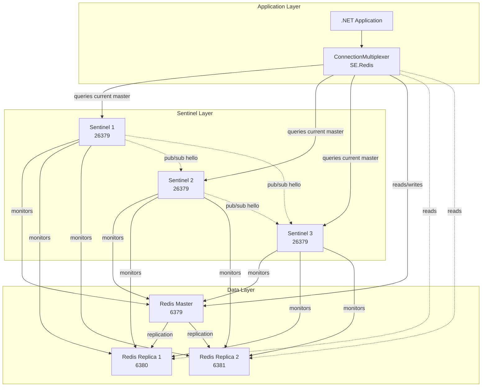
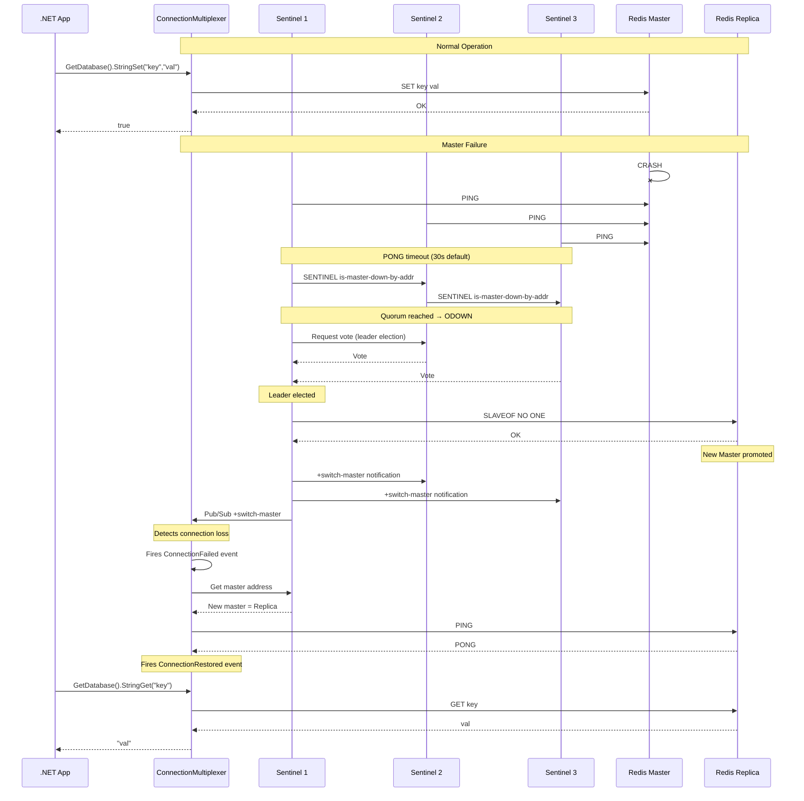
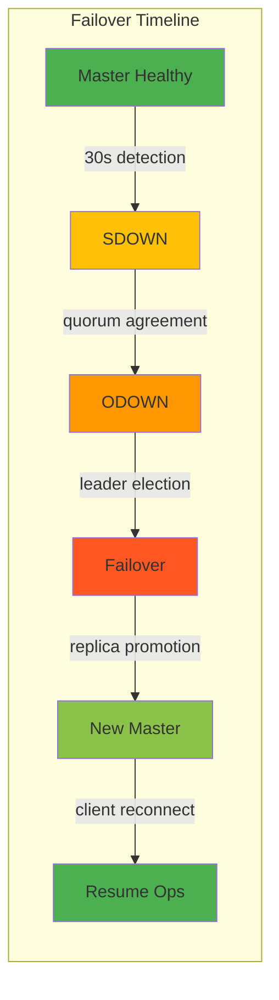

# Redis — Sentinel — High Availability

## Overview — Sentinel Purpose

Redis Sentinel provides high availability for non-cluster Redis deployments. It handles monitoring, automatic failover, notification, and acts as a configuration provider for clients. Sentinel is designed for deployments that need fault tolerance but do not require the data sharding capabilities of Redis Cluster.

Sentinel is a distributed system: you run multiple Sentinel processes (minimum 3, always an odd number) that cooperate to determine the health of the Redis master and replicas. When the master fails, Sentinel orchestrates an automatic failover by promoting a replica to master and reconfiguring the rest of the topology.

Key capabilities of Redis Sentinel:

- **Monitoring**: Sentinels constantly check if your master and replica instances are working as expected
- **Notification**: Sentinels can notify system administrators via API that something is wrong
- **Automatic failover**: If a master is not working, Sentinel can start a failover process where a replica is promoted to master, additional replicas are reconfigured to use the new master, and applications are informed about the new address to use
- **Configuration provider**: Clients connect to Sentinels to ask for the current master address. If a failover occurs, Sentinels report the new master address

Sentinel is the recommended HA solution for Redis deployments that are not using Redis Cluster. It provides high availability for a single master with multiple replicas.

```csharp
// StackExchange.Redis connects to Sentinel automatically
// The ConnectionMultiplexer handles all failover scenarios
// This is the foundational pattern for Sentinel-aware Redis clients

using StackExchange.Redis;

public class RedisSentinelConnector
{
    private static Lazy<ConnectionMultiplexer> _sentinelConnection;
    private static Lazy<ConnectionMultiplexer> _redisConnection;

    public static void Initialize(string serviceName, string[] sentinelEndpoints, string password = null)
    {
        var sentinelOptions = new ConfigurationOptions
        {
            TieBreaker = "",
            DefaultDatabase = 0,
            ServiceName = serviceName,
            Password = password,
            AbortOnConnectFail = false,
            ConnectTimeout = 5000,
            SyncTimeout = 5000,
            KeepAlive = 60,
            ConnectRetry = 3
        };

        foreach (var endpoint in sentinelEndpoints)
        {
            sentinelOptions.EndPoints.Add(endpoint);
        }

        _sentinelConnection = new Lazy<ConnectionMultiplexer>(
            () => ConnectionMultiplexer.Connect(sentinelOptions));

        // The multiplexer automatically discovers the master from Sentinel
        _redisConnection = new Lazy<ConnectionMultiplexer>(
            () => ConnectionMultiplexer.Connect(sentinelOptions));
    }

    public static IDatabase GetDatabase(int db = 0)
    {
        return _redisConnection.Value.GetDatabase(db);
    }

    public static IServer GetServerForCommand()
    {
        var endpoints = _redisConnection.Value.GetEndPoints();
        return _redisConnection.Value.GetServer(endpoints[0]);
    }

    public static ConnectionMultiplexer GetConnection()
    {
        return _redisConnection.Value;
    }
}
```

Sentinel is not a substitute for Redis Cluster. Sentinel only provides high availability, not data sharding. If your dataset exceeds the memory of a single node, you need Redis Cluster instead.

## Architecture — Sentinel Components

Sentinel architecture consists of three logical components: the Redis master, Redis replicas, and Sentinel processes. Each Sentinel runs as a separate process, typically on different machines or containers.

### Sentinel Communication

Sentinels communicate with each other and with the Redis instances they monitor:

1. **Sentinels to master**: Every Sentinel connects to the master every second (by default) to ping it
2. **Sentinels to replicas**: Every Sentinel discovers replicas by asking the master and connects to each replica
3. **Sentinels to Sentinels**: Sentinels publish messages to a Pub/Sub channel (`__sentinel__:hello`) to discover other Sentinels and share information about the master state
4. **Sentinels as configuration provider**: Clients (like StackExchange.Redis) connect to Sentinels to discover the current master address

```csharp
// Sentinel information retrieval using StackExchange.Redis
// This shows how to query Sentinel for master/replica info

public class SentinelInfoProvider
{
    private readonly ConnectionMultiplexer _sentinelMux;

    public SentinelInfoProvider(string serviceName, string[] sentinelEndpoints)
    {
        var options = new ConfigurationOptions
        {
            TieBreaker = "",
            ServiceName = serviceName,
            AbortOnConnectFail = false,
            CommandMap = CommandMap.Sentinel,
            DefaultDatabase = 0
        };

        foreach (var ep in sentinelEndpoints)
        {
            options.EndPoints.Add(ep);
        }

        _sentinelMux = ConnectionMultiplexer.Connect(options);
    }

    public async Task<string> GetCurrentMasterAsync()
    {
        var server = GetSentinelServer();
        // Get master info from Sentinel
        var masterInfo = await server.SentinelMasterAsync("mymaster");
        return $"{masterInfo["ip"]}:{masterInfo["port"]}";
    }

    public async Task<List<string>> GetReplicasAsync()
    {
        var server = GetSentinelServer();
        var replicas = new List<string>();
        var replicaInfo = await server.SentinelReplicasAsync("mymaster");
        foreach (var info in replicaInfo)
        {
            replicas.Add($"{info["ip"]}:{info["port"]}");
        }
        return replicas;
    }

    public async Task<List<string>> GetSentinelsAsync()
    {
        var server = GetSentinelServer();
        var sentinels = new List<string>();
        var sentinelInfo = await server.SentinelSentinelsAsync("mymaster");
        foreach (var info in sentinelInfo)
        {
            sentinels.Add($"{info["ip"]}:{info["port"]}");
        }
        return sentinels;
    }

    private IServer GetSentinelServer()
    {
        var endpoints = _sentinelMux.GetEndPoints();
        return _sentinelMux.GetServer(endpoints[0]);
    }
}
```

### Failure Detection

Sentinel uses two levels of failure detection:

- **SDOWN (Subjectively Down)**: A single Sentinel has determined that an instance is not responding. This is a local opinion based on `down-after-milliseconds` setting (default 30000ms)
- **ODOWN (Objectively Down)**: Multiple Sentinels (meeting the quorum) have agreed that an instance is down. Only ODOWN triggers a failover

The quorum value is crucial: it defines how many Sentinels must agree that the master is down to trigger ODOWN. If you have 5 Sentinels and a quorum of 2, only 2 need to agree. A higher quorum makes failover harder to trigger (reducing false positives) but could delay actual failover if Sentinels are partitioned.

```csharp
// Handling connection failures and reconnection events
// This is critical for Sentinel-managed Redis deployments

public class SentinelConnectionHandler
{
    private ConnectionMultiplexer _mux;
    private readonly string _serviceName;
    private readonly string[] _sentinelEndpoints;

    public SentinelConnectionHandler(string serviceName, string[] sentinelEndpoints)
    {
        _serviceName = serviceName;
        _sentinelEndpoints = sentinelEndpoints;
    }

    public ConnectionMultiplexer Connect()
    {
        var options = new ConfigurationOptions
        {
            TieBreaker = "",
            ServiceName = _serviceName,
            AbortOnConnectFail = false,
            ConnectTimeout = 5000,
            SyncTimeout = 5000,
            KeepAlive = 60,
            ConnectRetry = 3,
            DefaultDatabase = 0
        };

        foreach (var ep in _sentinelEndpoints)
        {
            options.EndPoints.Add(ep);
        }

        _mux = ConnectionMultiplexer.Connect(options);

        // Attach event handlers for failover awareness
        _mux.ConnectionFailed += OnConnectionFailed;
        _mux.ConnectionRestored += OnConnectionRestored;
        _mux.ErrorMessage += OnErrorMessage;
        _mux.InternalError += OnInternalError;
        _mux.HashSlotMoved += OnHashSlotMoved;

        return _mux;
    }

    private void OnConnectionFailed(object sender, ConnectionFailedEventArgs args)
    {
        Console.WriteLine($"[FAILOVER] Connection failed: {args.EndPoint}");
        Console.WriteLine($"[FAILOVER] Failure type: {args.FailureType}");
        Console.WriteLine($"[FAILOVER] Exception: {args.Exception?.Message}");

        if (args.FailureType == ConnectionFailureType.UnableToResolvePhysicalConnection)
        {
            Console.WriteLine("[FAILOVER] Master may be down. Awaiting Sentinel failover...");
        }
    }

    private void OnConnectionRestored(object sender, ConnectionFailedEventArgs args)
    {
        Console.WriteLine($"[FAILOVER] Connection restored: {args.EndPoint}");
        Console.WriteLine($"[FAILOVER] New master is active, reconnected successfully");

        // After failover, the multiplexer has automatically resolved
        // the new master address from Sentinel
        var endpoints = _mux.GetEndPoints();
        foreach (var ep in endpoints)
        {
            var server = _mux.GetServer(ep);
            Console.WriteLine($"[FAILOVER] Active endpoint: {ep}");
        }
    }

    private void OnErrorMessage(object sender, RedisErrorEventArgs args)
    {
        Console.WriteLine($"[FAILOVER] Redis error: {args.Message} on {args.EndPoint}");
    }

    private void OnInternalError(object sender, InternalErrorEventArgs args)
    {
        Console.WriteLine($"[FAILOVER] Internal error: {args.Exception?.Message}");
    }

    private void OnHashSlotMoved(object sender, HashSlotMovedEventArgs args)
    {
        // In Sentinel mode, this is less relevant than in Cluster mode
        Console.WriteLine($"[FAILOVER] Hash slot moved: {args.HashSlot}");
    }
}
```

### Leader Election

When a master is flagged ODOWN, the Sentinels need to perform a failover. But only one Sentinel should drive the failover. Sentinels use the Raft-like consensus algorithm to elect a leader:

1. Each Sentinel that detects ODOWN can become a candidate for leader
2. Sentinels request votes from other Sentinels
3. The Sentinel that gets votes from the majority (>= N/2 + 1) becomes the leader
4. The leader then drives the failover process

The leader Sentinel performs these steps during failover:

1. **Select a replica**: Choose the best replica to promote. Priority is: highest replication offset (most up-to-date) → lowest `replica-priority` → lexicographically smallest run-id
2. **Promote the replica**: Send `SLAVEOF NO ONE` to the chosen replica, making it a master
3. **Reconfigure replicas**: Tell all other replicas to replicate from the new master
4. **Update configuration**: Set the new master in the Sentinel configuration
5. **Propagate**: Publish the new configuration to all Sentinels

```csharp
// Sentinel failover monitoring with detailed status tracking
// This demonstrates how to build a failover-aware application

public class FailoverAwareRedisClient : IDisposable
{
    private ConnectionMultiplexer _mux;
    private readonly string _serviceName;
    private readonly ConfigurationOptions _options;
    private readonly ILogger _logger;
    private volatile bool _failoverInProgress;
    private DateTime _lastFailoverTime;
    private readonly object _lock = new object();

    public FailoverAwareRedisClient(
        string serviceName,
        string[] sentinelEndpoints,
        ILogger logger = null)
    {
        _serviceName = serviceName;
        _logger = logger;

        _options = new ConfigurationOptions
        {
            TieBreaker = "",
            ServiceName = _serviceName,
            AbortOnConnectFail = false,
            ConnectTimeout = 5000,
            SyncTimeout = 3000,
            AsyncTimeout = 5000,
            KeepAlive = 30,
            ConnectRetry = 5,
            DefaultDatabase = 0,
            ReconnectRetryPolicy = new ExponentialRetry(5000),
            // Sentinel-specific: this tells SE.Redis to use Sentinel
        };

        foreach (var ep in sentinelEndpoints)
        {
            _options.EndPoints.Add(ep);
        }

        Connect();
    }

    private void Connect()
    {
        lock (_lock)
        {
            _mux?.Close();
            _mux?.Dispose();

            _mux = ConnectionMultiplexer.Connect(_options);

            _mux.ConnectionFailed += (s, e) =>
            {
                _failoverInProgress = true;
                _logger?.LogWarning(
                    "Redis connection failed to {Endpoint}. Type: {Type}. " +
                    "Sentinel failover may be in progress.",
                    e.EndPoint, e.FailureType);
            };

            _mux.ConnectionRestored += (s, e) =>
            {
                _failoverInProgress = false;
                _lastFailoverTime = DateTime.UtcNow;
                _logger?.LogInformation(
                    "Redis connection restored to {Endpoint}. " +
                    "Failover completed successfully.", e.EndPoint);
            };
        }
    }

    public async Task<T> ExecuteWithFailoverHandlingAsync<T>(
        Func<IDatabase, Task<T>> operation,
        int maxRetries = 3)
    {
        var retryCount = 0;
        var delay = TimeSpan.FromMilliseconds(100);

        while (retryCount <= maxRetries)
        {
            try
            {
                if (_failoverInProgress && retryCount < maxRetries)
                {
                    await Task.Delay(delay);
                    retryCount++;
                    delay = TimeSpan.FromMilliseconds(delay.TotalMilliseconds * 2);
                    continue;
                }

                var db = _mux.GetDatabase();
                return await operation(db);
            }
            catch (RedisConnectionException ex) when (retryCount < maxRetries)
            {
                _logger?.LogWarning(
                    "Redis operation failed (attempt {Retry}/{MaxRetries}): {Message}",
                    retryCount + 1, maxRetries, ex.Message);

                retryCount++;
                // Exponential backoff
                await Task.Delay(
                    TimeSpan.FromMilliseconds(
                        Math.Min(100 * Math.Pow(2, retryCount), 5000)));

                // If connection is broken, wait for failover
                if (!_mux.IsConnected)
                {
                    await Task.Delay(1000);
                }
            }
            catch (RedisServerException ex)
            {
                _logger?.LogError("Redis server error: {Message}", ex.Message);
                throw;
            }
            catch (TimeoutException ex) when (retryCount < maxRetries)
            {
                _logger?.LogWarning(
                    "Redis timeout (attempt {Retry}/{MaxRetries}): {Message}",
                    retryCount + 1, maxRetries, ex.Message);
                retryCount++;
                await Task.Delay(100);
            }
        }

        throw new RedisConnectionException(
            ConnectionFailureType.UnableToConnect,
            "All retry attempts exhausted during failover");
    }

    public async Task<T> ExecuteWithSentinelAwareRetryAsync<T>(
        Func<IDatabase, Task<T>> operation)
    {
        var db = _mux.GetDatabase();
        var result = default(T);
        var succeeded = false;
        var attempts = 0;

        while (!succeeded && attempts < 5)
        {
            attempts++;
            try
            {
                result = await operation(db);
                succeeded = true;
            }
            catch (RedisConnectionException) when (attempts < 5)
            {
                _logger?.LogWarning(
                    "Connection lost, reconnecting... (attempt {Attempt})", attempts);
                await Task.Delay(attempts * 200);
                ReconnectIfNeeded();
            }
            catch (TimeoutException) when (attempts < 5)
            {
                _logger?.LogWarning(
                    "Timeout, retrying... (attempt {Attempt})", attempts);
            }
        }

        return result;
    }

    private void ReconnectIfNeeded()
    {
        if (!_mux.IsConnected)
        {
            lock (_lock)
            {
                if (!_mux.IsConnected)
                {
                    Connect();
                }
            }
        }
    }

    public IDatabase GetDatabase()
    {
        return _mux.GetDatabase();
    }

    public bool IsFailoverInProgress => _failoverInProgress;

    public DateTime? LastFailoverTime =>
        _lastFailoverTime == default ? null : _lastFailoverTime;

    public void Dispose()
    {
        _mux?.Close();
        _mux?.Dispose();
    }
}
```

## Configuration — Sentinel Setup

A minimal Sentinel setup requires three Sentinel instances, one Redis master, and at least one Redis replica. The Sentinel configuration file (`sentinel.conf`) defines the master group name, quorum, and monitoring parameters.

### sentinel.conf Example

```conf
# sentinel.conf for each Sentinel instance
port 26379
daemonize no
pidfile /var/run/redis-sentinel.pid
logfile /var/log/redis/sentinel.log
dir /tmp

# Monitor the master at 127.0.0.1:6379
# master-group-name: mymaster
# quorum: 2 (at least 2 Sentinels must agree master is down)
sentinel monitor mymaster 127.0.0.1 6379 2

# Down-after-milliseconds: 30000 (30 seconds)
sentinel down-after-milliseconds mymaster 30000

# Failover timeout: 180000 (3 minutes)
sentinel failover-timeout mymaster 180000

# Parallel syncs: how many replicas can sync simultaneously during failover
sentinel parallel-syncs mymaster 1

# Auth (if Redis requires password)
sentinel auth-pass mymaster your_redis_password

# Notification script (optional)
sentinel notification-script mymaster /opt/redis/notify.sh

# Client reconfig script (optional)
sentinel client-reconfig-script mymaster /opt/redis/reconfig.sh

# Announce IP/hostname (important for Docker/cloud deployments)
sentinel announce-ip 10.0.0.1
sentinel announce-port 26379
```

### StackExchange.Redis Sentinel Configuration

In StackExchange.Redis, Sentinel mode is enabled by setting the `ServiceName` option and `TieBreaker = ""`. The `CommandMap` can be set to `CommandMap.Sentinel` for Sentinel-specific commands.

```csharp
// Comprehensive Sentinel configuration for StackExchange.Redis
// This covers all relevant options for production deployments

public static class SentinelConfigFactory
{
    /// <summary>
    /// Creates a ConfigurationOptions for Sentinel-managed Redis
    /// </summary>
    public static ConfigurationOptions CreateSentinelOptions(
        string serviceName,
        string[] sentinelEndpoints,
        SentinelOptions userOptions = null)
    {
        var options = new ConfigurationOptions
        {
            // === Sentinel-specific settings ===
            ServiceName = serviceName,
            TieBreaker = "",

            // === Connection settings ===
            AbortOnConnectFail = userOptions?.AbortOnConnectFail ?? false,
            ConnectTimeout = userOptions?.ConnectTimeout ?? 5000,
            SyncTimeout = userOptions?.SyncTimeout ?? 5000,
            AsyncTimeout = userOptions?.AsyncTimeout ?? 5000,
            ConnectRetry = userOptions?.ConnectRetry ?? 3,

            // === Keep-alive ===
            KeepAlive = userOptions?.KeepAlive ?? 60,

            // === Database ===
            DefaultDatabase = userOptions?.DefaultDatabase ?? 0,

            // === SSL (Azure Redis with SSL) ===
            Ssl = userOptions?.Ssl ?? false,
            SslHost = userOptions?.SslHost,

            // === Authentication ===
            Password = userOptions?.Password,

            // === Reconnection ===
            ReconnectRetryPolicy = userOptions?.ReconnectRetryPolicy
                ?? new ExponentialRetry(5000),

            // === Performance ===
            AllowAdmin = userOptions?.AllowAdmin ?? false,
            ChannelPrefix = userOptions?.ChannelPrefix,
            ConfigCheckSeconds = userOptions?.ConfigCheckSeconds ?? 60,
            Proxy = userOptions?.Proxy ?? Proxy.None,
            ResolveDns = userOptions?.ResolveDns ?? false,
            WriteBuffer = userOptions?.WriteBuffer ?? 4096,
        };

        foreach (var endpoint in sentinelEndpoints)
        {
            options.EndPoints.Add(endpoint);
        }

        // For Sentinel-only commands
        options.CommandMap = CommandMap.Sentinel;

        return options;
    }

    /// <summary>
    /// Creates the Redis connection multiplexer with Sentinel awareness
    /// </summary>
    public static ConnectionMultiplexer CreateSentinelMultiplexer(
        ConfigurationOptions options)
    {
        var mux = ConnectionMultiplexer.Connect(options);

        // Verify Sentinel connection
        var endpoints = mux.GetEndPoints();
        if (endpoints.Length == 0)
        {
            throw new RedisConnectionException(
                ConnectionFailureType.UnableToConnect,
                "No Sentinel endpoints available");
        }

        return mux;
    }
}

public class SentinelOptions
{
    public bool AbortOnConnectFail { get; set; } = false;
    public int ConnectTimeout { get; set; } = 5000;
    public int SyncTimeout { get; set; } = 5000;
    public int AsyncTimeout { get; set; } = 5000;
    public int ConnectRetry { get; set; } = 3;
    public int KeepAlive { get; set; } = 60;
    public int DefaultDatabase { get; set; } = 0;
    public bool Ssl { get; set; } = false;
    public string SslHost { get; set; }
    public string Password { get; set; }
    public IReconnectRetryPolicy ReconnectRetryPolicy { get; set; }
    public bool AllowAdmin { get; set; } = false;
    public string ChannelPrefix { get; set; }
    public int ConfigCheckSeconds { get; set; } = 60;
    public Proxy Proxy { get; set; } = Proxy.None;
    public bool ResolveDns { get; set; } = false;
    public int WriteBuffer { get; set; } = 4096;
}
```

### Minimum Infrastructure Requirements

| Component | Minimum | Recommended | Notes |
|-----------|---------|-------------|-------|
| Master | 1 | 1 | Single write node |
| Replicas | 1 | 2+ | More replicas = more read capacity |
| Sentinels | 3 | 3 or 5 | Must be odd number for quorum |
| Quorum | 2 | 2 for 3, 3 for 5 | N/2 + 1 |
| Network | LAN | Low-latency | High latency affects detection |

## StackExchange.Redis — Sentinel Integration

StackExchange.Redis integrates with Redis Sentinel through the `ConfigurationOptions.ServiceName` and `TieBreaker` settings. When these are configured, the multiplexer automatically:

1. Connects to one or more Sentinel instances
2. Queries the current master address for the specified service name
3. Connects to the Redis master
4. Periodically re-checks Sentinel for configuration changes
5. Handles failover by reconnecting to the new master when the old one fails

### How SE.Redis Discovers the Topology

When `ConnectionMultiplexer.Connect(options)` is called with Sentinel options:

```csharp
// Internal Sentinel discovery flow (conceptual)
// This is what SE.Redis does automatically under the hood

public class SentinelDiscoveryFlow
{
    public async Task<ConnectionMultiplexer> ConnectWithSentinelAsync(
        string serviceName, string[] sentinelEndpoints)
    {
        // Step 1: Connect to the first available Sentinel
        var sentinelOptions = new ConfigurationOptions
        {
            TieBreaker = "",
            ServiceName = serviceName,
            CommandMap = CommandMap.Sentinel,
            AbortOnConnectFail = false
        };

        foreach (var ep in sentinelEndpoints)
        {
            sentinelOptions.EndPoints.Add(ep);
        }

        var sentinelMux = await ConnectionMultiplexer.ConnectAsync(sentinelOptions);
        var sentinelServer = sentinelMux.GetServer(sentinelEndpoints[0]);

        // Step 2: Get master info from Sentinel
        var masterInfo = await sentinelServer.SentinelMasterAsync(serviceName);
        var masterIp = (string)masterInfo["ip"];
        var masterPort = (int)masterInfo["port"];

        // Step 3: Build connection to the current master
        // SE.Redis does this automatically when ServiceName is set
        var redisOptions = new ConfigurationOptions
        {
            AbortOnConnectFail = false,
            TieBreaker = "",
            ServiceName = serviceName,
            DefaultDatabase = 0
        };
        redisOptions.EndPoints.Add($"{masterIp}:{masterPort}");

        var redisMux = await ConnectionMultiplexer.ConnectAsync(redisOptions);

        // Step 4: Subscribe to Sentinel Pub/Sub for failover notifications
        // SE.Redis subscribes to +switch-master events automatically
        await sentinelServer.SubscribeEventsAsync(serviceName);

        sentinelMux.Dispose();
        return redisMux;
    }
}
```

### Automatic Failover Flow

When a failover occurs, here is the sequence of events in StackExchange.Redis:

1. The multiplexer detects that the master connection is broken (TCP disconnect or timeout)
2. `ConnectionFailed` event fires with `ConnectionFailureType.UnableToResolvePhysicalConnection`
3. The multiplexer queries Sentinel again for the new master address
4. If Sentinel reports a new master, the multiplexer connects to it
5. `ConnectionRestored` event fires with the new master endpoint
6. All existing IDatabase instances remain valid (they reference the multiplexer)
7. Pub/Sub subscriptions are re-subscribed automatically
8. The application continues without interruption

```csharp
// Complete production-ready Sentinel connection manager
// This demonstrates all the integration points between SE.Redis and Sentinel

public class SentinelConnectionManager : IDisposable
{
    private readonly string _serviceName;
    private readonly ConfigurationOptions _sentinelOptions;
    private ConnectionMultiplexer _multiplexer;
    private readonly ILogger<SentinelConnectionManager> _logger;
    private readonly object _lock = new object();
    private volatile bool _disposed;

    // Health tracking
    private DateTime _lastHealthyConnection;
    private int _failoverCount;
    private string _currentMasterEndpoint;

    public SentinelConnectionManager(
        string serviceName,
        string[] sentinelEndpoints,
        ILogger<SentinelConnectionManager> logger = null,
        Action<ConfigurationOptions> configureOptions = null)
    {
        _serviceName = serviceName;
        _logger = logger;

        _sentinelOptions = new ConfigurationOptions
        {
            TieBreaker = "",
            ServiceName = _serviceName,
            AbortOnConnectFail = false,
            ConnectTimeout = 5000,
            SyncTimeout = 3000,
            ConnectRetry = 3,
            KeepAlive = 30,
            DefaultDatabase = 0,
            ReconnectRetryPolicy = new ExponentialRetry(5000),
            ConfigCheckSeconds = 60
        };

        foreach (var ep in sentinelEndpoints)
        {
            _sentinelOptions.EndPoints.Add(ep);
        }

        configureOptions?.Invoke(_sentinelOptions);

        Connect();
    }

    private void Connect()
    {
        if (_disposed) return;

        lock (_lock)
        {
            if (_multiplexer != null)
            {
                try
                {
                    _multiplexer.Close();
                    _multiplexer.Dispose();
                }
                catch { /* cleanup best-effort */ }
            }

            _multiplexer = ConnectionMultiplexer.Connect(_sentinelOptions);

            // Wire up all Sentinel-relevant events
            _multiplexer.ConnectionFailed += (sender, args) =>
            {
                _logger?.LogWarning(
                    "Connection failed to {Endpoint}. Failure type: {FailureType}. " +
                    "Sentinel {ServiceName} may be failing over.",
                    args.EndPoint, args.FailureType, _serviceName);

                LogFailureDetails(args);
            };

            _multiplexer.ConnectionRestored += (sender, args) =>
            {
                Interlocked.Increment(ref _failoverCount);
                _lastHealthyConnection = DateTime.UtcNow;

                var server = GetServer();
                _currentMasterEndpoint = server?.EndPoint?.ToString();

                _logger?.LogInformation(
                    "Connection restored to {Endpoint} after {FailureType}. " +
                    "Failover #{FailoverCount} for {ServiceName}. " +
                    "New master: {CurrentMaster}",
                    args.EndPoint, args.FailureType,
                    _failoverCount, _serviceName, _currentMasterEndpoint);

                LogRestoredDetails(args);
            };

            _multiplexer.ErrorMessage += (sender, args) =>
            {
                _logger?.LogWarning(
                    "Redis error on {Endpoint}: {Message}",
                    args.EndPoint, args.Message);
            };

            _multiplexer.InternalError += (sender, args) =>
            {
                _logger?.LogError(
                    "Internal error: {Exception} at {Endpoint}",
                    args.Exception?.Message, args.EndPoint);
            };

            // Get the initial master endpoint
            try
            {
                var server = _multiplexer.GetServer(_multiplexer.GetEndPoints()[0]);
                _currentMasterEndpoint = server.EndPoint.ToString();
                _lastHealthyConnection = DateTime.UtcNow;
            }
            catch { /* initial discovery may fail, will recover */ }
        }
    }

    private void LogFailureDetails(ConnectionFailedEventArgs args)
    {
        if (args.Exception != null)
        {
            _logger?.LogDebug(
                "Connection failure details: {ExceptionType}: {ExceptionMessage}",
                args.Exception.GetType().Name,
                args.Exception.Message);
        }

        _logger?.LogDebug(
            "Connection state: IsConnected={IsConnected}, " +
            "Configuration={Config}, FailureType={FailureType}",
            _multiplexer.IsConnected,
            _multiplexer.Configuration?.ToString(),
            args.FailureType);
    }

    private void LogRestoredDetails(ConnectionFailedEventArgs args)
    {
        _logger?.LogDebug(
            "Connection restored. Endpoints now: {Endpoints}",
            string.Join(", ",
                _multiplexer.GetEndPoints().Select(ep => ep.ToString())));

        _logger?.LogDebug(
            "Server info: {ServerInfo}",
            string.Join(", ",
                _multiplexer.GetEndPoints()
                    .Select(ep => _multiplexer.GetServer(ep))
                    .Where(s => s.IsConnected)
                    .Select(s => $"{s.EndPoint} (connected)")));
    }

    public IDatabase GetDatabase(int db = 0, object asyncState = null)
    {
        if (_disposed) throw new ObjectDisposedException(nameof(SentinelConnectionManager));
        return _multiplexer.GetDatabase(db, asyncState);
    }

    public IServer GetServer(string endpoint = null)
    {
        if (_disposed) throw new ObjectDisposedException(nameof(SentinelConnectionManager));

        if (endpoint != null)
        {
            return _multiplexer.GetServer(endpoint);
        }

        var endpoints = _multiplexer.GetEndPoints();
        return endpoints.Length > 0
            ? _multiplexer.GetServer(endpoints[0])
            : null;
    }

    public async Task<Dictionary<string, string>> GetMasterStatusAsync()
    {
        var server = GetServer();
        if (server == null || !server.IsConnected)
            return new Dictionary<string, string> { { "status", "disconnected" } };

        var info = await server.InfoAsync("replication");
        var status = new Dictionary<string, string>
        {
            ["role"] = info.FirstOrDefault()?.FirstOrDefault(i => i.Key == "role").Value ?? "unknown",
            ["connected_slaves"] = info.FirstOrDefault()?.FirstOrDefault(i => i.Key == "connected_slaves").Value ?? "0",
            ["master_repl_offset"] = info.FirstOrDefault()?.FirstOrDefault(i => i.Key == "master_repl_offset").Value ?? "unknown",
        };

        return status;
    }

    public bool IsConnected => _multiplexer?.IsConnected ?? false;

    public int FailoverCount => _failoverCount;

    public string CurrentMasterEndpoint => _currentMasterEndpoint;

    public DateTime? LastHealthyConnection =>
        _lastHealthyConnection == default ? null : (DateTime?)_lastHealthyConnection;

    public ConnectionMultiplexer Multiplexer =>
        _multiplexer ?? throw new ObjectDisposedException(nameof(SentinelConnectionManager));

    public async Task<bool> PerformHealthCheckAsync()
    {
        try
        {
            var db = GetDatabase();
            var result = await db.PingAsync();
            _lastHealthyConnection = DateTime.UtcNow;
            return true;
        }
        catch (Exception ex)
        {
            _logger?.LogWarning("Health check failed: {Message}", ex.Message);

            // Attempt reconnect if unhealthy
            if (!_multiplexer.IsConnected)
            {
                Connect();
            }

            return false;
        }
    }

    public void Dispose()
    {
        if (_disposed) return;
        _disposed = true;

        lock (_lock)
        {
            if (_multiplexer != null)
            {
                try
                {
                    _multiplexer.Close();
                    _multiplexer.Dispose();
                }
                catch { /* cleanup */ }
                _multiplexer = null;
            }
        }
    }
}
```

## Code Examples — Failover Handling

This section provides comprehensive code examples for handling failover in Sentinel-managed Redis with StackExchange.Redis.

### Basic Sentinel Connection

```csharp
// Simplest Sentinel connection pattern
// ConnectionMultiplexer automatically handles failover

using StackExchange.Redis;

public class SimpleSentinelExample
{
    public static async Task RunAsync()
    {
        var options = new ConfigurationOptions
        {
            TieBreaker = "",
            ServiceName = "mymaster",
            AbortOnConnectFail = false,
            ConnectTimeout = 5000
        };

        // Add Sentinel endpoints (not Redis endpoints)
        options.EndPoints.Add("10.0.0.1:26379");
        options.EndPoints.Add("10.0.0.2:26379");
        options.EndPoints.Add("10.0.0.3:26379");

        using var mux = await ConnectionMultiplexer.ConnectAsync(options);
        var db = mux.GetDatabase();

        // After failover, this still works — mux reconnects to new master
        await db.StringSetAsync("key", "value");
        var val = await db.StringGetAsync("key");
        Console.WriteLine($"Value: {val}");
    }
}
```

### Complete Failover-Aware Service

```csharp
// Full failover-aware Redis service with Sentinel
// This service can be injected as a singleton in ASP.NET Core

public interface IRedisCacheService
{
    Task<T> GetAsync<T>(string key);
    Task SetAsync<T>(string key, T value, TimeSpan? expiry = null);
    Task<bool> SetStringAsync(string key, string value, TimeSpan? expiry = null);
    Task<string> GetStringAsync(string key);
    Task<T> ExecuteWithRetryAsync<T>(Func<IDatabase, Task<T>> operation);
    bool IsHealthy { get; }
}

public class RedisCacheService : IRedisCacheService, IDisposable
{
    private readonly ConnectionMultiplexer _mux;
    private readonly ILogger<RedisCacheService> _logger;
    private volatile bool _isHealthy = true;
    private long _totalFailovers;
    private DateTime _lastFailoverTime;

    public RedisCacheService(
        IConfiguration configuration,
        ILogger<RedisCacheService> logger)
    {
        _logger = logger;

        var options = new ConfigurationOptions
        {
            TieBreaker = "",
            ServiceName = configuration["Redis:ServiceName"] ?? "mymaster",
            AbortOnConnectFail = false,
            ConnectTimeout = int.Parse(
                configuration["Redis:ConnectTimeout"] ?? "5000"),
            SyncTimeout = int.Parse(
                configuration["Redis:SyncTimeout"] ?? "3000"),
            ConnectRetry = int.Parse(
                configuration["Redis:ConnectRetry"] ?? "3"),
            KeepAlive = int.Parse(
                configuration["Redis:KeepAlive"] ?? "60"),
            DefaultDatabase = int.Parse(
                configuration["Redis:DefaultDatabase"] ?? "0"),
            Password = configuration["Redis:Password"],
            ReconnectRetryPolicy = new ExponentialRetry(
                int.Parse(configuration["Redis:RetryBaseMs"] ?? "1000"))
        };

        var sentinelEndpoints = configuration.GetSection("Redis:SentinelEndpoints")
            .Get<string[]>();

        if (sentinelEndpoints != null)
        {
            foreach (var ep in sentinelEndpoints)
            {
                options.EndPoints.Add(ep);
            }
        }

        _mux = ConnectionMultiplexer.Connect(options);

        _mux.ConnectionFailed += (s, e) =>
        {
            _isHealthy = false;
            _logger.LogWarning(
                "Redis connection lost. Endpoint: {Endpoint}, " +
                "Failure: {FailureType}, Error: {Error}",
                e.EndPoint, e.FailureType, e.Exception?.Message);
        };

        _mux.ConnectionRestored += (s, e) =>
        {
            Interlocked.Increment(ref _totalFailovers);
            _lastFailoverTime = DateTime.UtcNow;
            _isHealthy = true;
            _logger.LogInformation(
                "Redis connection restored. Endpoint: {Endpoint}, " +
                "Total failovers: {TotalFailovers}",
                e.EndPoint, _totalFailovers);
        };
    }

    public async Task<T> GetAsync<T>(string key)
    {
        var db = _mux.GetDatabase();
        var redisValue = await db.StringGetAsync(key);
        return redisValue.HasValue
            ? System.Text.Json.JsonSerializer.Deserialize<T>(redisValue)
            : default;
    }

    public async Task SetAsync<T>(string key, T value, TimeSpan? expiry = null)
    {
        var db = _mux.GetDatabase();
        var json = System.Text.Json.JsonSerializer.Serialize(value);
        await db.StringSetAsync(key, json, expiry);
    }

    public async Task<bool> SetStringAsync(
        string key, string value, TimeSpan? expiry = null)
    {
        var db = _mux.GetDatabase();
        return await db.StringSetAsync(key, value, expiry);
    }

    public async Task<string> GetStringAsync(string key)
    {
        var db = _mux.GetDatabase();
        return await db.StringGetAsync(key);
    }

    public async Task<T> ExecuteWithRetryAsync<T>(
        Func<IDatabase, Task<T>> operation)
    {
        var maxRetries = 5;
        var retryDelay = TimeSpan.FromMilliseconds(200);

        for (int i = 0; i < maxRetries; i++)
        {
            try
            {
                var db = _mux.GetDatabase();
                return await operation(db);
            }
            catch (RedisConnectionException ex) when (i < maxRetries - 1)
            {
                _logger.LogWarning(
                    "Redis retry {Attempt}/{MaxRetries}: {Message}",
                    i + 1, maxRetries, ex.Message);
                await Task.Delay(retryDelay);
                retryDelay = TimeSpan.FromMilliseconds(
                    retryDelay.TotalMilliseconds * 2);
            }
        }

        throw new InvalidOperationException(
            "Redis operation failed after all retries");
    }

    public bool IsHealthy => _isHealthy;

    public long TotalFailovers => Interlocked.Read(ref _totalFailovers);

    public DateTime? LastFailoverTime =>
        _lastFailoverTime == default ? null : (DateTime?)_lastFailoverTime;

    public void Dispose()
    {
        _mux?.Close();
        _mux?.Dispose();
    }
}
```

### ASP.NET Core DI Registration

```csharp
// Registering Sentinel-connected Redis in ASP.NET Core

public static class RedisServiceRegistration
{
    public static IServiceCollection AddSentinelRedis(
        this IServiceCollection services,
        IConfiguration configuration)
    {
        services.AddSingleton<IRedisCacheService, RedisCacheService>();
        services.AddSingleton<ConnectionMultiplexer>(sp =>
        {
            var options = new ConfigurationOptions
            {
                TieBreaker = "",
                ServiceName = configuration["Redis:ServiceName"] ?? "mymaster",
                AbortOnConnectFail = false,
                ConnectTimeout = 5000,
                SyncTimeout = 3000,
                ConnectRetry = 3,
                KeepAlive = 60
            };

            var sentinelEndpoints = configuration
                .GetSection("Redis:SentinelEndpoints").Get<string[]>();
            if (sentinelEndpoints != null)
            {
                foreach (var ep in sentinelEndpoints)
                {
                    options.EndPoints.Add(ep);
                }
            }

            var mux = ConnectionMultiplexer.Connect(options);

            // Log Sentinel connections for diagnostics
            var logger = sp.GetRequiredService<ILogger<ConnectionMultiplexer>>();
            mux.ConnectionFailed += (s, e) =>
                logger.LogWarning("Redis ConnectionFailed: {Endpoint}", e.EndPoint);
            mux.ConnectionRestored += (s, e) =>
                logger.LogInformation("Redis ConnectionRestored: {Endpoint}", e.EndPoint);

            return mux;
        });

        services.AddScoped(sp =>
        {
            var mux = sp.GetRequiredService<ConnectionMultiplexer>();
            return mux.GetDatabase();
        });

        return services;
    }
}

// Usage in Program.cs:
// builder.Services.AddSentinelRedis(builder.Configuration);
```

### Manual Sentinel Failover Test

```csharp
// Testing Sentinel failover behavior programmatically
// This simulates what happens when the master goes down

public class SentinelFailoverTester
{
    private readonly ConnectionMultiplexer _mux;
    private readonly ILogger _logger;

    public SentinelFailoverTester(ConnectionMultiplexer mux, ILogger logger)
    {
        _mux = mux;
        _logger = logger;
    }

    public async Task TestFailoverAsync()
    {
        _logger.LogInformation("Starting Sentinel failover test...");
        _logger.LogInformation(
            "Current endpoints: {Endpoints}",
            string.Join(", ", _mux.GetEndPoints().Select(e => e.ToString())));

        // Step 1: Verify we can write and read
        var db = _mux.GetDatabase();
        var testKey = $"sentinel_test:{Guid.NewGuid()}";
        await db.StringSetAsync(testKey, "before_failover");
        var val = await db.StringGetAsync(testKey);
        _logger.LogInformation("Read before failover: {Value}", val);

        // Step 2: Subscribe to connection events
        var failoverDetected = new TaskCompletionSource<bool>();
        var connectionRestored = new TaskCompletionSource<bool>();

        var failedHandler = new EventHandler<ConnectionFailedEventArgs>((s, e) =>
        {
            _logger.LogWarning(
                "Connection failed detected: {Endpoint}, Type: {FailureType}",
                e.EndPoint, e.FailureType);
            failoverDetected.TrySetResult(true);
        });

        var restoredHandler = new EventHandler<ConnectionFailedEventArgs>((s, e) =>
        {
            _logger.LogInformation(
                "Connection restored: {Endpoint}",
                e.EndPoint);
            connectionRestored.TrySetResult(true);
        });

        _mux.ConnectionFailed += failedHandler;
        _mux.ConnectionRestored += restoredHandler;

        // Step 3: Wait for failover (simulate by killing master externally)
        _logger.LogInformation(
            "Waiting for failover to complete... " +
            "(trigger by shutting down the Redis master)");

        var timeout = TimeSpan.FromSeconds(60);
        var failoverDetectedTask = failoverDetected.Task.WaitAsync(timeout);
        var restoreTask = connectionRestored.Task.WaitAsync(timeout);

        try
        {
            await failoverDetectedTask;
            _logger.LogInformation("Failover detected!");
            _logger.LogInformation(
                "New endpoints: {Endpoints}",
                string.Join(", ", _mux.GetEndPoints().Select(e => e.ToString())));

            await restoreTask;
            _logger.LogInformation("Connection restored after failover!");

            // Step 4: Verify we can still read after failover
            var afterVal = await db.StringGetAsync(testKey);
            _logger.LogInformation(
                "Read after failover: {Value} (exists: {Exists})",
                afterVal, afterVal.HasValue);

            // Step 5: Write new data
            await db.StringSetAsync(
                $"{testKey}:after", "after_failover");
            _logger.LogInformation(
                "Write after failover: success");
        }
        catch (TimeoutException)
        {
            _logger.LogError(
                "Failover test timed out after {Timeout}",
                timeout);
        }
        finally
        {
            _mux.ConnectionFailed -= failedHandler;
            _mux.ConnectionRestored -= restoredHandler;
        }
    }
}
```

## Events — Connection Lifecycle

StackExchange.Redis provides several events that are critical for Sentinel failover awareness. Understanding these events is essential for building resilient applications.

### Event Reference

| Event | Description | Sentinel Relevance |
|-------|-------------|--------------------|
| `ConnectionFailed` | Fires when a physical connection is lost | Master down, failover started |
| `ConnectionRestored` | Fires when a connection is re-established | New master connected |
| `ErrorMessage` | Fires when Redis returns an error | Configuration issues |
| `InternalError` | Fires on internal multiplexer errors | Unexpected failures |
| `HashSlotMoved` | Fires when hash slots move (Cluster only) | Low relevance in Sentinel |
| `ConfigurationChangedBroadcast` | Fires on config change via pub/sub | Sentinel switch-master |

### Event Handler Implementation

```csharp
// Comprehensive event handler for Sentinel failover lifecycle
// This monitors every phase of the Sentinel failover process

public sealed class SentinelEventMonitor : IDisposable
{
    private readonly ConnectionMultiplexer _mux;
    private readonly ILogger _logger;
    private readonly object _stateLock = new object();
    private SentinelState _currentState = SentinelState.Connected;
    private DateTime _stateStartTime = DateTime.UtcNow;
    private readonly List<FailoverEvent> _eventHistory = new List<FailoverEvent>();
    private const int MaxHistoryEntries = 100;

    public enum SentinelState
    {
        Connected,
        ConnectionLost,
        FailoverInProgress,
        Reconnecting,
        Reconnected
    }

    public record FailoverEvent(
        DateTime Timestamp,
        SentinelState State,
        string Endpoint,
        string Description);

    public SentinelEventMonitor(
        ConnectionMultiplexer mux,
        ILogger logger)
    {
        _mux = mux;
        _logger = logger;

        _mux.ConnectionFailed += OnConnectionFailed;
        _mux.ConnectionRestored += OnConnectionRestored;
        _mux.ErrorMessage += OnErrorMessage;
        _mux.InternalError += OnInternalError;
    }

    private void OnConnectionFailed(object sender, ConnectionFailedEventArgs args)
    {
        UpdateState(SentinelState.ConnectionLost, args.EndPoint?.ToString(),
            $"Failure type: {args.FailureType}");

        _logger.LogWarning(
            "[SentinelMonitor] {State}: {Endpoint} — {Description}",
            _currentState, args.EndPoint, GetFailureDescription(args));

        if (args.FailureType == ConnectionFailureType.UnableToResolvePhysicalConnection)
        {
            UpdateState(SentinelState.FailoverInProgress, args.EndPoint?.ToString(),
                "Sentinel failover likely in progress");
        }
    }

    private void OnConnectionRestored(object sender, ConnectionFailedEventArgs args)
    {
        UpdateState(SentinelState.Reconnecting, args.EndPoint?.ToString(),
            $"Previous failure: {args.FailureType}");

        _logger.LogInformation(
            "[SentinelMonitor] {State}: {Endpoint} — Reconnecting...",
            _currentState, args.EndPoint);

        // After a brief stabilization period, mark as reconnected
        Task.Delay(1000).ContinueWith(_ =>
        {
            UpdateState(SentinelState.Reconnected, args.EndPoint?.ToString(),
                "Connection fully restored");
        });
    }

    private void OnErrorMessage(object sender, RedisErrorEventArgs args)
    {
        _logger.LogWarning(
            "[SentinelMonitor] Redis error on {Endpoint}: {Message}",
            args.EndPoint, args.Message);
    }

    private void OnInternalError(object sender, InternalErrorEventArgs args)
    {
        _logger.LogError(
            "[SentinelMonitor] Internal error: {Message} at {Endpoint}",
            args.Exception?.Message, args.EndPoint);

        if (_currentState != SentinelState.FailoverInProgress)
        {
            UpdateState(SentinelState.ConnectionLost, args.EndPoint?.ToString(),
                $"Internal error: {args.Exception?.Message}");
        }
    }

    private void UpdateState(SentinelState newState, string endpoint, string description)
    {
        lock (_stateLock)
        {
            var previousState = _currentState;
            _currentState = newState;
            _stateStartTime = DateTime.UtcNow;

            var failoverEvent = new FailoverEvent(
                _stateStartTime, newState, endpoint, description);

            _eventHistory.Add(failoverEvent);
            if (_eventHistory.Count > MaxHistoryEntries)
            {
                _eventHistory.RemoveAt(0);
            }

            _logger.LogInformation(
                "[SentinelMonitor] State transition: {Previous} → {New} " +
                "at {Endpoint}: {Description}",
                previousState, newState, endpoint, description);
        }
    }

    private static string GetFailureDescription(ConnectionFailedEventArgs args)
    {
        return args.Exception switch
        {
            SocketException se =>
                $"Socket error: {se.SocketErrorCode} — {se.Message}",
            RedisConnectionException rce =>
                $"Redis connection error: {rce.FailureType} — {rce.Message}",
            TimeoutException te =>
                $"Timeout: {te.Message}",
            null =>
                "No exception details",
            _ =>
                $"Error: {args.Exception.GetType().Name} — {args.Exception.Message}"
        };
    }

    public SentinelState CurrentState
    {
        get { lock (_stateLock) { return _currentState; } }
    }

    public TimeSpan CurrentStateDuration =>
        DateTime.UtcNow - _stateStartTime;

    public IReadOnlyList<FailoverEvent> EventHistory
    {
        get { lock (_stateLock) { return _eventHistory.ToList(); } }
    }

    public bool IsHealthy =>
        _currentState == SentinelState.Connected ||
        _currentState == SentinelState.Reconnected;

    public void Dispose()
    {
        _mux.ConnectionFailed -= OnConnectionFailed;
        _mux.ConnectionRestored -= OnConnectionRestored;
        _mux.ErrorMessage -= OnErrorMessage;
        _mux.InternalError -= OnInternalError;
    }
}
```

### Failover Timing Expectations

Understanding Sentinel failover timing is critical for setting proper timeouts:

```csharp
// Sentinel failover timing parameters
// These affect how quickly SE.Redis detects and handles failover

public class SentinelTimingConfig
{
    // Sentinel detection time: down-after-milliseconds
    // Default: 30000ms (30 seconds)
    // This is how long Sentinel waits before marking instance as SDOWN
    public int DownAfterMilliseconds { get; set; } = 30000;

    // Sentinel quorum: N/2 + 1
    // Number of Sentinels that must agree for ODOWN
    public int Quorum { get; set; } = 2;

    // Failover timeout: max time for failover to complete
    // Default: 180000ms (3 minutes)
    public int FailoverTimeout { get; set; } = 180000;

    // Parallel syncs: replicas to reconfigure simultaneously
    public int ParallelSyncs { get; set; } = 1;

    // Total estimated failover time:
    // SDOWN detection (30s) + ODOWN agreement (1-5s) +
    // Leader election (1-3s) + Replica promotion (0.1-1s) +
    // Client reconnection (0.5-2s) ≈ 35-40s total

    public TimeSpan EstimatedFailoverDuration =>
        TimeSpan.FromMilliseconds(
            DownAfterMilliseconds +
            5000 +  // ODOWN agreement
            3000 +  // Leader election
            1000 +  // Promotion
            2000);  // Client reconnect

    // StackExchange.Redis timeout should be longer than failover duration
    public int RecommendedSyncTimeout =>
        (int)EstimatedFailoverDuration.TotalMilliseconds + 5000;

    public int RecommendedConnectTimeout =>
        (int)TimeSpan.FromSeconds(10).TotalMilliseconds;
}
```

## Use Cases — When to Use Sentinel

Sentinel is appropriate for many production scenarios where Redis Cluster is overkill or introduces unnecessary complexity.

### Primary Use Cases

1. **Single-master high availability**: Your dataset fits on a single Redis node, but you need automatic failover when that node fails
2. **Read scaling with replicas**: You have a write-heavy master and need read replicas for query offloading. Sentinel ensures replicas are reconfigured after failover
3. **Simple deployment with legacy infrastructure**: You already have a master-replica setup and want HA without migrating to Cluster
4. **Cache layer for databases**: Using Redis as a caching layer where data loss on failover is acceptable (can be re-populated from primary DB)
5. **Session store**: ASP.NET Core session state where failover with some data loss is tolerable
6. **Rate limiting counters**: Counter data that can tolerate some reset on failover

### ASP.NET Core Distributed Cache with Sentinel

```csharp
// Configuring ASP.NET Core distributed cache with Sentinel-managed Redis

public static class DistributedCacheSentinelExtensions
{
    public static IServiceCollection AddSentinelDistributedCache(
        this IServiceCollection services,
        IConfiguration configuration)
    {
        var sentinelOptions = new ConfigurationOptions
        {
            TieBreaker = "",
            ServiceName = configuration["Redis:ServiceName"] ?? "mymaster",
            AbortOnConnectFail = false,
            ConnectTimeout = 5000,
            SyncTimeout = 3000,
            KeepAlive = 60
        };

        var endpoints = configuration
            .GetSection("Redis:SentinelEndpoints").Get<string[]>();
        if (endpoints != null)
        {
            foreach (var ep in endpoints)
            {
                sentinelOptions.EndPoints.Add(ep);
            }
        }

        services.AddStackExchangeRedisCache(options =>
        {
            options.ConfigurationOptions = sentinelOptions;
            options.InstanceName = configuration["Redis:InstanceName"];
        });

        return services;
    }
}

// ASP.NET Core Session with Sentinel Redis
// builder.Services.AddSentinelDistributedCache(builder.Configuration);
// builder.Services.AddSession(options =>
// {
//     options.IdleTimeout = TimeSpan.FromMinutes(20);
//     options.Cookie.HttpOnly = true;
//     options.Cookie.IsEssential = true;
// });
```

### SignalR Backplane with Sentinel

```csharp
// SignalR Redis backplane with Sentinel
// Ensures SignalR messages continue to work during failover

public static class SignalRSentinelExtensions
{
    public static IServiceCollection AddSentinelSignalR(
        this IServiceCollection services,
        IConfiguration configuration)
    {
        services.AddSignalR()
            .AddStackExchangeRedis(options =>
            {
                options.ConnectionFactory = async writer =>
                {
                    var sentinelOptions = new ConfigurationOptions
                    {
                        TieBreaker = "",
                        ServiceName = configuration["Redis:ServiceName"] ?? "mymaster",
                        AbortOnConnectFail = false,
                        ConnectTimeout = 5000,
                        ChannelPrefix = "SignalR"
                    };

                    var endpoints = configuration
                        .GetSection("Redis:SentinelEndpoints").Get<string[]>();
                    if (endpoints != null)
                    {
                        foreach (var ep in endpoints)
                        {
                            sentinelOptions.EndPoints.Add(ep);
                        }
                    }

                    var mux = await ConnectionMultiplexer.ConnectAsync(sentinelOptions);

                    // Handle failover for SignalR
                    mux.ConnectionFailed += (s, e) =>
                    {
                        writer.Write(new LogMessage(
                            LogLevel.Warning,
                            $"SignalR Redis connection failed: {e.EndPoint}"));
                    };

                    mux.ConnectionRestored += (s, e) =>
                    {
                        writer.Write(new LogMessage(
                            LogLevel.Information,
                            $"SignalR Redis connection restored: {e.EndPoint}"));
                    };

                    return mux;
                };
            });

        return services;
    }
}
```

## Mermaid — Sentinel Architecture







## Gotchas — Pitfalls and Limitations

Understanding Sentinel's limitations is critical for building robust systems.

### Data Loss Scenarios

1. **Async replication**: Redis master-replica replication is asynchronous. If the master crashes before replicating the latest writes, those writes are lost when Sentinel promotes a replica
2. **Split-brain**: During a network partition, Sentinel may promote a replica in one partition while the old master remains alive in another partition. When the partition heals, both nodes are writable. Sentinel handles this by reconfiguring the old master as a replica (which loses the writes made to it during the partition)
3. **Failover delay**: The minimum failover time is `down-after-milliseconds` + `sentinel failover-timeout`. With defaults, this is 30s + 180s = 210s worst case. Clients will experience downtime during this window

### Configuration Mistakes

```csharp
// Common Sentinel configuration mistakes and corrections

public static class SentinelConfigGotchas
{
    // GOTCHA 1: AbortOnConnectFail = true (default!)
    // If the first Sentinel connection fails during startup,
    // the multiplexer throws. Always set to false for Sentinel.
    public static ConfigurationOptions FixAbortOnConnectFail()
    {
        return new ConfigurationOptions
        {
            TieBreaker = "",
            ServiceName = "mymaster",
            AbortOnConnectFail = false,  // CRITICAL
            ConnectTimeout = 5000
        };
    }

    // GOTCHA 2: Not setting TieBreaker to empty string
    // In Sentinel mode, TieBreaker must be "" to disable
    // the built-in tiebreaker mechanism (Sentinel handles this)
    public static ConfigurationOptions FixTieBreaker()
    {
        return new ConfigurationOptions
        {
            TieBreaker = "",  // CRITICAL for Sentinel
            ServiceName = "mymaster",
            AbortOnConnectFail = false
        };
    }

    // GOTCHA 3: Adding Redis endpoints instead of Sentinel endpoints
    // You add Sentinel endpoints (port 26379), not Redis endpoints (6379)
    public static ConfigurationOptions FixEndpoints()
    {
        var options = new ConfigurationOptions
        {
            TieBreaker = "",
            ServiceName = "mymaster",
            AbortOnConnectFail = false
        };

        // RIGHT: Add Sentinel endpoints
        options.EndPoints.Add("10.0.0.1:26379");  // Sentinel, not Redis
        options.EndPoints.Add("10.0.0.2:26379");
        options.EndPoints.Add("10.0.0.3:26379");

        // WRONG: Do NOT add Redis endpoints
        // options.EndPoints.Add("10.0.0.1:6379"); // This bypasses Sentinel!

        return options;
    }

    // GOTCHA 4: SyncTimeout too low for failover
    // During failover, operations may take 30+ seconds.
    // Increase SyncTimeout or handle timeouts gracefully.
    public static ConfigurationOptions FixSyncTimeout()
    {
        return new ConfigurationOptions
        {
            TieBreaker = "",
            ServiceName = "mymaster",
            AbortOnConnectFail = false,
            SyncTimeout = 30000,  // Increase from default 5000
            AsyncTimeout = 30000
        };
    }

    // GOTCHA 5: Not handling ConnectionFailed/ConnectionRestored
    // Without event handlers, the application is unaware of failovers
    public static ConnectionMultiplexer CreateWithFailoverAwareness(
        ConfigurationOptions options)
    {
        var mux = ConnectionMultiplexer.Connect(options);

        mux.ConnectionFailed += (s, e) =>
        {
            // Log the failure
            Console.Error.WriteLine(
                $"[FATAL] Redis connection failed: {e.EndPoint}");

            // Trigger application health check failure
            // This should cause load balancers to stop routing traffic here
        };

        mux.ConnectionRestored += (s, e) =>
        {
            Console.WriteLine(
                $"[INFO] Redis connection restored: {e.EndPoint}");

            // Mark application as healthy again
        };

        return mux;
    }
}
```

### Deployment Constraints

| Constraint | Explanation | Mitigation |
|------------|-------------|------------|
| Minimum 3 Sentinels | Need quorum for failover decisions | Always deploy odd number; 3 for most cases, 5 for large deployments |
| Sentinel on separate hosts | Losing multiple Sentinels can break quorum | Each Sentinel on different failure domain (rack, AZ, host) |
| No data sharding | Sentinel does not shard data | Use Cluster if dataset exceeds single node memory |
| Network latency | High latency affects failure detection and failover speed | Keep Sentinel nodes within same DC with <5ms latency |
| Client reconnection | Application must handle connection drops | SE.Redis handles automatically with event callbacks |
| Write loss on failover | Async replication means potential data loss | Acceptable for cache; use synchronous replication in Cluster if needed (but slower) |
| Sentinel password | sentinel.conf requires auth-pass for password-protected Redis | Keep passwords consistent across all instances |
| Docker networking | Containers have dynamic IPs; Sentinel uses IP-based identification | Use sentinel announce-ip and announce-port for Docker/cloud |

### SE.Redis-Specific Gotchas

```csharp
// SE.Redis-specific issues when using Sentinel

public class SentinelSeRedisGotchas
{
    // GOTCHA 1: Multiplexer lifetime
    // Creating ConnectionMultiplexer is expensive.
    // Always create once and reuse as a singleton.
    private static readonly Lazy<ConnectionMultiplexer> _mux =
        new Lazy<ConnectionMultiplexer>(() =>
        {
            var options = new ConfigurationOptions
            {
                TieBreaker = "",
                ServiceName = "mymaster",
                AbortOnConnectFail = false
            };
            options.EndPoints.Add("127.0.0.1:26379");
            return ConnectionMultiplexer.Connect(options);
        });

    // GOTCHA 2: IsConnected may return false during failover
    // Always check IsConnected before operations, or handle exceptions
    public static async Task SafeOperation(Func<IDatabase, Task> operation)
    {
        var db = _mux.Value.GetDatabase();
        if (_mux.Value.IsConnected)
        {
            await operation(db);
        }
        else
        {
            // Wait for failover or throw
            throw new RedisConnectionException(
                ConnectionFailureType.UnableToConnect,
                "Redis is not connected (failover in progress)");
        }
    }

    // GOTCHA 3: Disposing the multiplexer
    // Never dispose unless shutting down the entire application
    public static void DangerousDispose()
    {
        // WRONG: This drops all connections
        _mux.Value.Dispose();

        // RIGHT: Close gracefully during application shutdown
        _mux.Value.Close();
    }

    // GOTCHA 4: DefaultDatabase ignored in failover
    // After failover, the database index should be explicitly set
    public static IDatabase GetSafeDatabase(int db = 0)
    {
        return _mux.Value.GetDatabase(db);
    }

    // GOTCHA 5: CommandMap.Sentinel limits available commands
    // Use only for Sentinel queries, not for regular Redis operations
    public static async Task<Dictionary<string, string>> GetSentinelInfo()
    {
        var sentinelOptions = new ConfigurationOptions
        {
            TieBreaker = "",
            ServiceName = "mymaster",
            CommandMap = CommandMap.Sentinel,  // Only for Sentinel queries
            AbortOnConnectFail = false
        };
        sentinelOptions.EndPoints.Add("127.0.0.1:26379");

        using var sentinelMux = ConnectionMultiplexer.Connect(sentinelOptions);
        var server = sentinelMux.GetServer("127.0.0.1:26379");
        var info = await server.SentinelMasterAsync("mymaster");

        return info.ToDictionary(kv => kv.Key, kv => kv.Value?.ToString() ?? "");
    }
}
```

### Known Limitations Summary

1. **No data sharding**: Sentinel does not partition data. All data lives on one master (plus replicas). If your dataset exceeds ~25GB on a single node, use Cluster
2. **No built-in load balancing**: Sentinel does not distribute read traffic across replicas. Clients must implement read replica routing themselves (SE.Redis does not auto-route reads to replicas in Sentinel mode)
3. **Failover is not instantaneous**: Minimum ~30s detection + promotion time. Applications must tolerate connection interruptions
4. **Split-brain risk**: Under network partitions, data inconsistencies can occur. Pinning replicas and using `min-replicas-to-write` / `min-replicas-max-lag` can reduce risk
5. **No multi-region HA**: Sentinel is designed for single-region deployments. Multi-region requires additional tooling or Redis Cluster with CRDTs
6. **Manual intervention may be needed**: Some scenarios (e.g., a replica fails at the same time as the master) require manual recovery
7. **Client-side caching**: If the client caches the master address (bypassing Sentinel), failover events are invisible. Always connect through Sentinel's configuration provider
8. **Pub/Sub and failover**: Pub/Sub messages are lost during failover. SE.Redis re-subscribes automatically after reconnection, but messages during the window are lost
