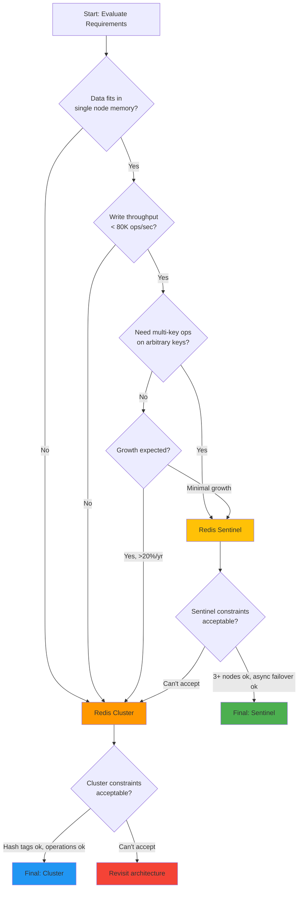
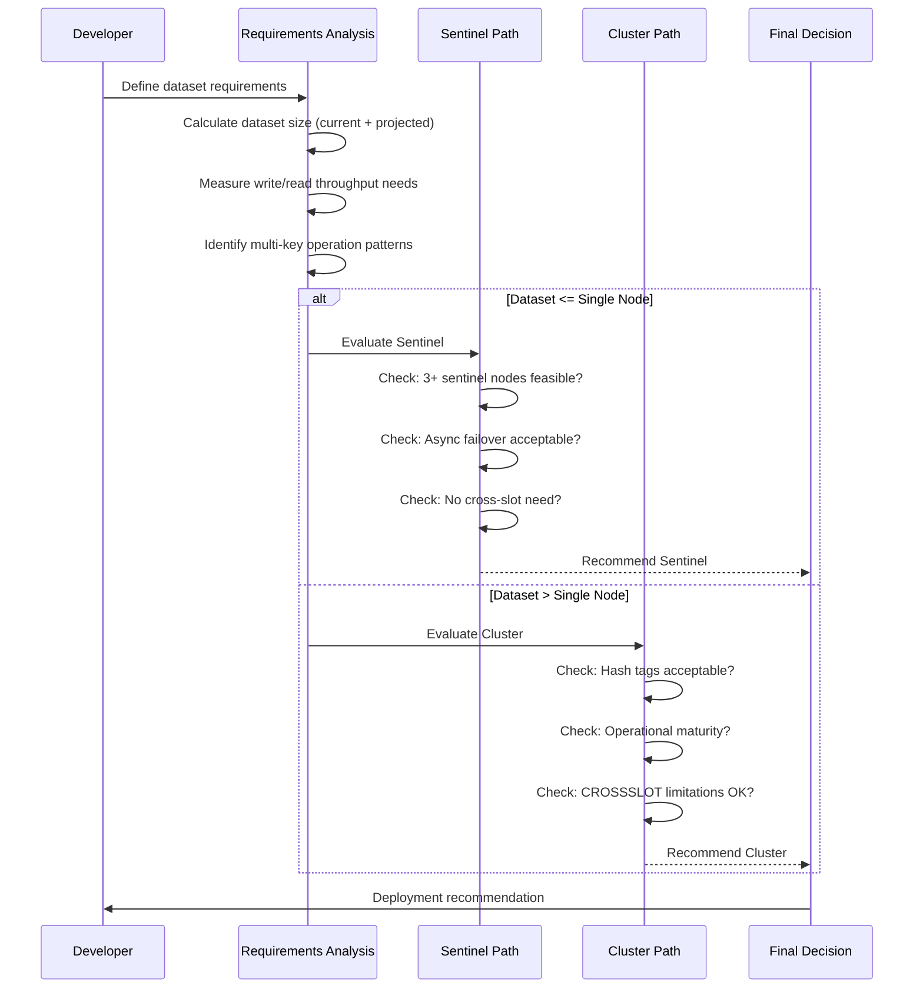
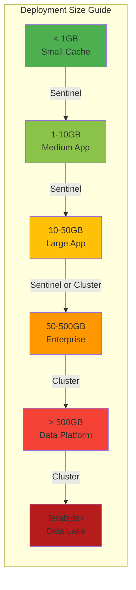

# Redis — Sentinel vs Cluster — Decision

## Overview — Decision Framework

Choosing between Redis Sentinel and Redis Cluster is one of the most important architectural decisions for any Redis deployment. This file provides a comprehensive decision framework with complete StackExchange.Redis code examples for both modes.

### The Core Question

The decision between Sentinel and Cluster comes down to whether your data fits on a single Redis node:

```
Can your entire dataset fit comfortably in one Redis instance's memory?
                                    │
                    ┌───────────────┴───────────────┐
                    │                               │
                   YES                              NO
                    │                               │
              Use Sentinel                      Use Cluster
        (High availability only,           (Sharding + HA,
         single master with                multi-master,
         automatic failover)                automatic data distribution)
```

### When the Decision Is Unclear

Some datasets are borderline — they fit today but will grow. For these scenarios, consider:

- **Growth rate**: If your dataset grows by >20% annually, plan for Cluster now to avoid a painful migration
- **Memory cost per node**: Large instances (64GB+) are expensive. Cluster lets you use smaller, cheaper instances
- **Multi-key operation requirements**: Cluster requires hash tags for cross-slot multi-key operations. If your application heavily uses multi-key operations on arbitrary keys, Sentinel is simpler
- **Operational maturity**: Cluster requires more operational tooling and expertise. Sentinel is simpler to operate

```csharp
// Decision helper that evaluates your requirements programmatically
// This is a conceptual tool for assessing which mode fits your needs

public enum RedisDeploymentMode
{
    Sentinel,
    Cluster,
    Undecided
}

public class RedisDeploymentDecider
{
    public record DeploymentRequirements(
        long EstimatedDataSetSizeBytes,
        int WriteThroughputOpsPerSecond,
        int ReadThroughputOpsPerSecond,
        bool RequiresMultiKeyOpsOnArbitraryKeys,
        bool RequiresAutomaticFailover,
        bool RequiresHorizontalScaling,
        double ExpectedAnnualGrowthRate,
        int NodeMemoryLimitMB,
        OperationalMaturityLevel MaturityLevel);

    public enum OperationalMaturityLevel
    {
        Low,    // Small team, minimal Redis operations experience
        Medium, // Some experience, willing to learn
        High    // Dedicated infrastructure team
    }

    public RedisDeploymentMode Decide(DeploymentRequirements req)
    {
        var sizeInGB = req.EstimatedDataSetSizeBytes / (1024.0 * 1024.0 * 1024.0);
        var projectedSizeInGB = sizeInGB * (1 + req.ExpectedAnnualGrowthRate);

        // If data doesn't fit on one node now or within a year
        if (projectedSizeInGB > req.NodeMemoryLimitMB / 1024.0)
        {
            return RedisDeploymentMode.Cluster;
        }

        // If write throughput exceeds single-node capacity
        // (single Redis instance: ~100K ops/sec on modest hardware)
        if (req.WriteThroughputOpsPerSecond > 80000)
        {
            return RedisDeploymentMode.Cluster;
        }

        // If multi-key operations on arbitrary keys are critical
        if (req.RequiresMultiKeyOpsOnArbitraryKeys)
        {
            return RedisDeploymentMode.Sentinel;
        }

        // If horizontal scaling is explicitly required
        if (req.RequiresHorizontalScaling)
        {
            return RedisDeploymentMode.Cluster;
        }

        // Default: use Sentinel for simplicity when possible
        return RedisDeploymentMode.Sentinel;
    }

    public string GetRecommendation(DeploymentRequirements req)
    {
        var decision = Decide(req);
        var reasons = new List<string>();

        switch (decision)
        {
            case RedisDeploymentMode.Cluster:
                var sizeInGB = req.EstimatedDataSetSizeBytes / (1024.0 * 1024.0 * 1024.0);
                var projected = sizeInGB * (1 + req.ExpectedAnnualGrowthRate);
                reasons.Add($"Dataset size ({sizeInGB:F1}GB, projected {projected:F1}GB) " +
                    "exceeds single-node limits");
                if (req.WriteThroughputOpsPerSecond > 80000)
                    reasons.Add($"Write throughput ({req.WriteThroughputOpsPerSecond}/s) " +
                        "requires multiple write nodes");
                if (req.RequiresHorizontalScaling)
                    reasons.Add("Horizontal scaling explicitly required");
                return $"Recommendation: CLUSTER\nReasons:\n- " +
                    string.Join("\n- ", reasons);

            case RedisDeploymentMode.Sentinel:
                reasons.Add("Dataset fits on single node");
                reasons.Add("Simpler operational model");
                if (req.RequiresMultiKeyOpsOnArbitraryKeys)
                    reasons.Add("Multi-key operations without hash tags");
                return $"Recommendation: SENTINEL\nReasons:\n- " +
                    string.Join("\n- ", reasons);

            default:
                return "Unable to determine. Review requirements manually.";
        }
    }
}
```

## Feature Comparison — Table

This comparison table covers all major aspects of Sentinel vs Cluster:

| Feature | Sentinel | Cluster |
|---------|----------|---------|
| **Data sharding** | No (single master) | Yes (16384 hash slots across N masters) |
| **High availability** | Yes — automatic failover via quorum | Yes — per-shard failover |
| **Write capacity** | 1 master (single node) | N masters (multi-node, scaled horizontally) |
| **Read capacity** | N replicas (read scaling) | N masters + replicas per shard |
| **Maximum dataset size** | Single node memory | Sum of all node memories (scales horizontally) |
| **Auto rebalancing** | No | During resharding (manual trigger) |
| **Minimum nodes** | 1 master + 1 replica + 3 sentinels | 3 masters + 0+ replicas |
| **Multi-key operations** | Any keys supported | Same slot only (use hash tags: `{user:123}`) |
| **Transaction support** | Yes (full MULTI/EXEC) | Across same slot only |
| **Lua scripting** | Yes (full) | Same slot only (or single-key) |
| **Client support (SE.Redis)** | Full — `ServiceName` + `TieBreaker=""` | Full — automatic slot routing |
| **Operational complexity** | Low | Medium |
| **Failover time** | ~30-60s (detection + promotion) | ~10-30s (per shard) |
| **Data loss on failover** | Possible (async replication) | Possible (async replication per shard) |
| **Network requirement** | Low latency (same DC) | Low latency (same DC) |
| **Pub/Sub** | Full support | Full support (per-shard broadcasting) |
| **Keyspace notifications** | Supported | Supported (per-node) |
| **Persistence (RDB/AOF)** | Per-instance | Per-node |
| **Client-side sharding** | Not needed | Not needed (handled by Cluster) |
| **Hash tags** | Not needed | Required for cross-slot multi-key ops |

```csharp
// Programmatic comparison: checking which features each mode supports
// This helps in automated decision-making

public static class RedisModeFeatureCheck
{
    public record FeatureSupport(
        bool Sharding,
        bool HighAvailability,
        bool MultiKeyAnyKeys,
        bool HorizontalScaling,
        bool SimpleOperations,
        bool AutoFailover);

    public static FeatureCheckResult CompareModes()
    {
        var sentinel = new FeatureSupport(
            Sharding: false,
            HighAvailability: true,
            MultiKeyAnyKeys: true,
            HorizontalScaling: false,
            SimpleOperations: true,
            AutoFailover: true
        );

        var cluster = new FeatureSupport(
            Sharding: true,
            HighAvailability: true,
            MultiKeyAnyKeys: false,     // Only with hash tags
            HorizontalScaling: true,
            SimpleOperations: false,    // More complex
            AutoFailover: true
        );

        return new FeatureCheckResult(sentinel, cluster);
    }

    public record FeatureCheckResult(
        FeatureSupport Sentinel,
        FeatureSupport Cluster);

    public static string[] GetMissingFeatures(DeploymentRequirements req)
    {
        var result = CompareModes();
        var missing = new List<string>();

        // Check which mode supports all required features
        if (req.RequiresMultiKeyOpsOnArbitraryKeys && !result.Sentinel.MultiKeyAnyKeys)
            missing.Add("Sentinel: Multi-key on arbitrary keys");
        if (req.RequiresHorizontalScaling && !result.Sentinel.HorizontalScaling)
            missing.Add("Sentinel: Horizontal scaling");
        if (req.RequiresMultiKeyOpsOnArbitraryKeys && !result.Cluster.MultiKeyAnyKeys)
            missing.Add("Cluster: Multi-key on arbitrary keys (requires hash tags)");

        return missing.ToArray();
    }
}
```

## Architecture — Sentinel vs Cluster Differences

Understanding the architectural differences is essential for making the right choice.

### Sentinel Architecture

Sentinel is a high-availability layer on top of a standard Redis master-replica setup:

```
┌─────────────┐  ┌─────────────┐  ┌─────────────┐
│  Sentinel 1  │  │  Sentinel 2  │  │  Sentinel 3  │
│   26379      │  │   26379      │  │   26379      │
└──────┬───────┘  └──────┬───────┘  └──────┬───────┘
       │                 │                 │
       └────────────┬────┴────┬────────────┘
                    │         │
           ┌────────▼──┐  ┌──▼────────┐
           │ Master     │  │ Replica 1  │
           │ 6379       │  │ 6380       │
           └────────────┘  └────────────┘
                          ┌──▼────────┐
                          │ Replica 2  │
                          │ 6381       │
                          └────────────┘
```

Key points:
- Single write node (master), multiple read replicas
- Sentinels monitor everything and trigger failover
- Clients (SE.Redis) query Sentinels for current master
- No data partitioning — all data on every node

### Cluster Architecture

Redis Cluster distributes data across multiple master nodes with automatic failover per shard:

```
┌──────────────────────────────────────────────┐
│              Redis Cluster                    │
├─────────────────┬────────────────┬────────────┤
│   Shard 1       │   Shard 2      │  Shard 3    │
│  Master A:6379  │ Master B:6380  │Master C:6381│
│  ┌──────────┐   │ ┌──────────┐   │┌──────────┐ │
│  │ Replica A1│   │ │ Replica B1│   ││Replica C1│ │
│  │ 6382     │   │ │ 6383     │   ││ 6384     │ │
│  └──────────┘   │ └──────────┘   │└──────────┘ │
│  0-5460 slots   │ 5461-10922     │10923-16383  │
└─────────────────┴────────────────┴────────────┘
```

Key points:
- Multiple write nodes (masters for each shard)
- Data partitioned by hash slots (16384 total)
- Automatic failover per shard (replica becomes master)
- Clients (SE.Redis) route commands to correct node based on key hash
- Cross-slot multi-key ops require hash tags (`{user:123}`)

```csharp
// Architecture comparison with code examples
// Shows how each mode behaves at the client level

public class ArchitectureComparison
{
    private readonly ConnectionMultiplexer _mux;

    public ArchitectureComparison(ConnectionMultiplexer mux)
    {
        _mux = mux;
    }

    public async Task DemonstrateSentinelArchitecture()
    {
        // Sentinel: Any key operation works
        var db = _mux.GetDatabase();

        // These all work in Sentinel — no hash slot restrictions
        await db.StringSetAsync("user:1:name", "Alice");
        await db.StringSetAsync("user:2:name", "Bob");
        await db.StringSetAsync("session:abc123", "data");

        // Multi-key on arbitrary keys works in Sentinel
        var keys = new RedisKey[] { "user:1:name", "user:2:name" };
        var values = await db.StringGetAsync(keys);
    }

    public async Task DemonstrateClusterArchitecture()
    {
        // Cluster: Keys must be in same hash slot for multi-key ops
        // Using hash tags to force same slot
        var db = _mux.GetDatabase();

        // These may route to different nodes (different hash slots)
        await db.StringSetAsync("user:1:name", "Alice");     // slot 15495
        await db.StringSetAsync("user:2:name", "Bob");       // slot 1058

        // Multi-key across slots FAILS in Cluster:
        // var keys = new RedisKey[] { "user:1:name", "user:2:name" };
        // await db.StringGetAsync(keys); // THROWS CROSSSLOT error!

        // Solution: Use hash tags to force same slot
        await db.StringSetAsync("{user:1}:name", "Alice");   // slot determined by {user:1}
        await db.StringSetAsync("{user:2}:name", "Bob");     // slot determined by {user:2}

        // These still can't be in the same operation without same hash tag
        // Fix: Same hash tag for the multi-key operation
        await db.StringSetAsync("{user}:1:name", "Alice");
        await db.StringSetAsync("{user}:2:name", "Bob");

        // Now we can use multi-key because {user} ensures same slot
        var sameTagKeys = new RedisKey[] { "{user}:1:name", "{user}:2:name" };
        var values = await db.StringGetAsync(sameTagKeys); // Works!
    }

    public async Task ShowHashSlotCalculation()
    {
        // Understanding how SE.Redis routes keys in Cluster
        var db = _mux.GetDatabase();

        // In Cluster mode, SE.Redis automatically:
        // 1. Computes hash slot: CRC16(key) % 16384
        // 2. Maps slot to the correct master node
        // 3. Sends command to that node
        // 4. Handles MOVED/ASK redirects transparently

        // For hash tags, only the content within { } is hashed
        await db.StringSetAsync("key", "value");
        // Without tags: hash(CRC16("key"))

        await db.StringSetAsync("{hash}:key", "value");
        // With {hash} tag: hash(CRC16("hash"))

        await db.StringSetAsync("prefix{hash}suffix", "value");
        // Also uses "hash" (first occurrence of {...})
    }
}
```

## StackExchange.Redis — Both Configurations

This section provides complete, production-ready configuration examples for both Sentinel and Cluster modes using StackExchange.Redis.

### Sentinel Configuration (Full)

```csharp
// Complete Sentinel configuration with all options
// Use this when data fits on one node but you need HA

public class SentinelFullConfiguration
{
    public static ConfigurationOptions CreateSentinelConfig(
        string serviceName = "mymaster",
        string[] sentinelEndpoints = null,
        string password = null,
        int defaultDatabase = 0)
    {
        var options = new ConfigurationOptions
        {
            // === Core Sentinel Settings ===
            ServiceName = serviceName,
            TieBreaker = "",  // CRITICAL: Sentinel uses its own tiebreaker

            // === Connection Settings ===
            AbortOnConnectFail = false,
            ConnectTimeout = 5000,
            SyncTimeout = 5000,
            AsyncTimeout = 5000,
            ConnectRetry = 3,

            // === Sentinel-Specific ===
            // ServiceName tells SE.Redis to use Sentinel for master discovery
            // TieBreaker="" disables the default tiebreaker mechanism

            // === Keep Alive ===
            KeepAlive = 60,
            ConfigCheckSeconds = 60,

            // === Database ===
            DefaultDatabase = defaultDatabase,

            // === Security ===
            Password = password,
            Ssl = false,
            SslHost = null,

            // === Performance ===
            AllowAdmin = false,
            WriteBuffer = 4096,
            ReconnectRetryPolicy = new ExponentialRetry(5000),
            ChannelPrefix = null,

            // === Proxy ===
            Proxy = Proxy.None,
            ResolveDns = false,
        };

        if (sentinelEndpoints != null)
        {
            foreach (var ep in sentinelEndpoints)
            {
                options.EndPoints.Add(ep);
            }
        }
        else
        {
            // Default localhost Sentinel endpoints
            options.EndPoints.Add("127.0.0.1:26379");
            options.EndPoints.Add("127.0.0.1:26380");
            options.EndPoints.Add("127.0.0.1:26381");
        }

        return options;
    }

    public static async Task<ConnectionMultiplexer> CreateSentinelMuxAsync(
        ConfigurationOptions options)
    {
        var mux = await ConnectionMultiplexer.ConnectAsync(options);

        // Verify connection by pinging a Sentinel
        var endpoints = mux.GetEndPoints();
        if (endpoints.Length > 0)
        {
            var server = mux.GetServer(endpoints[0]);
            var sentinelInfo = await server.SentinelMasterAsync(
                options.ServiceName ?? "mymaster");
            Console.WriteLine(
                "Connected to Sentinel. Master: {0}:{1}",
                sentinelInfo["ip"], sentinelInfo["port"]);
        }

        return mux;
    }
}
```

### Cluster Configuration (Full)

```csharp
// Complete Cluster configuration with all options
// Use this when data needs to be sharded across multiple nodes

public class ClusterFullConfiguration
{
    public static ConfigurationOptions CreateClusterConfig(
        string[] clusterEndpoints = null,
        string password = null,
        int defaultDatabase = 0)
    {
        var options = new ConfigurationOptions
        {
            // === Core Cluster Settings ===
            // No ServiceName needed — SE.Redis auto-discovers cluster topology
            // No TieBreaker needed — Cluster has its own consensus

            // === Connection Settings ===
            AbortOnConnectFail = false,
            ConnectTimeout = 5000,
            SyncTimeout = 5000,
            AsyncTimeout = 5000,
            ConnectRetry = 3,

            // === Cluster-Specific ===
            // ConfigCheckSeconds = 60 (checks cluster config changes)
            // SE.Redis handles MOVED and ASK redirects automatically

            // === Keep Alive ===
            KeepAlive = 60,
            ConfigCheckSeconds = 60,

            // === Database ===
            DefaultDatabase = defaultDatabase,

            // === Security ===
            Password = password,
            Ssl = false,
            SslHost = null,

            // === Performance ===
            AllowAdmin = true,   // Needed for cluster management commands
            WriteBuffer = 4096,
            ReconnectRetryPolicy = new ExponentialRetry(5000),
            ChannelPrefix = null,

            // === Proxy (e.g., Twemproxy) ===
            Proxy = Proxy.None,
            ResolveDns = false,
        };

        if (clusterEndpoints != null)
        {
            foreach (var ep in clusterEndpoints)
            {
                options.EndPoints.Add(ep);
            }
        }
        else
        {
            // Default localhost Cluster endpoints
            options.EndPoints.Add("127.0.0.1:7000");
            options.EndPoints.Add("127.0.0.1:7001");
            options.EndPoints.Add("127.0.0.1:7002");
        }

        return options;
    }

    public static async Task<ConnectionMultiplexer> CreateClusterMuxAsync(
        ConfigurationOptions options)
    {
        var mux = await ConnectionMultiplexer.ConnectAsync(options);

        // Verify cluster topology
        var endpoints = mux.GetEndPoints();
        Console.WriteLine("Connected to Redis Cluster with {0} endpoints:", endpoints.Length);

        foreach (var ep in endpoints)
        {
            var server = mux.GetServer(ep);
            if (server.IsConnected)
            {
                var clusterInfo = await server.ExecuteAsync("CLUSTER", "INFO");
                Console.WriteLine("  {0}: {1}", ep, clusterInfo);
            }
        }

        return mux;
    }
}
```

### Failover Handling — Sentinel vs Cluster

```csharp
// Demonstrates how failover is handled differently in Sentinel vs Cluster

public class FailoverComparison
{
    public ConnectionMultiplexer CreateSentinelWithFailoverHandling()
    {
        // Sentinel: SE.Redis queries Sentinel for new master
        var options = new ConfigurationOptions
        {
            TieBreaker = "",
            ServiceName = "mymaster",
            AbortOnConnectFail = false,
            ConnectTimeout = 5000,
            SyncTimeout = 5000,
            KeepAlive = 60,
            ReconnectRetryPolicy = new ExponentialRetry(5000)
        };
        options.EndPoints.Add("127.0.0.1:26379");
        options.EndPoints.Add("127.0.0.1:26380");
        options.EndPoints.Add("127.0.0.1:26381");

        var mux = ConnectionMultiplexer.Connect(options);

        // Failover flow:
        // 1. Master crashes → TCP disconnect detected
        // 2. ConnectionFailed event fires
        // 3. SE.Redis queries Sentinel: "who is master for 'mymaster'?"
        // 4. Sentinel returns new master (promoted replica)
        // 5. SE.Redis connects to new master
        // 6. ConnectionRestored event fires
        // 7. All existing IDatabase instances now point to new master

        mux.ConnectionFailed += (s, e) =>
        {
            Console.WriteLine(
                "[Sentinel] Connection failed: {0}. " +
                "Awaiting Sentinel failover...", e.EndPoint);
        };

        mux.ConnectionRestored += (s, e) =>
        {
            Console.WriteLine(
                "[Sentinel] Connection restored: {0}. " +
                "Failover complete.", e.EndPoint);
        };

        return mux;
    }

    public ConnectionMultiplexer CreateClusterWithFailoverHandling()
    {
        // Cluster: SE.Redis discovers topology changes via gossip protocol
        var options = new ConfigurationOptions
        {
            AbortOnConnectFail = false,
            ConnectTimeout = 5000,
            SyncTimeout = 5000,
            KeepAlive = 60,
            ConfigCheckSeconds = 60,
            ReconnectRetryPolicy = new ExponentialRetry(5000)
        };
        options.EndPoints.Add("127.0.0.1:7000");
        options.EndPoints.Add("127.0.0.1:7001");
        options.EndPoints.Add("127.0.0.1:7002");

        var mux = ConnectionMultiplexer.Connect(options);

        // Failover flow:
        // 1. A master in a shard crashes
        // 2. Its replica is promoted by cluster consensus (gossip)
        // 3. The promoted replica broadcasts its new role
        // 4. SE.Redis receives the topology update (via MOVED redirects
        //    or periodic config checks)
        // 5. HashSlotMoved event fires for affected slots
        // 6. SE.Redis updates its slot-to-node mapping
        // 7. Subsequent commands for those slots route to new master

        mux.HashSlotMoved += (s, e) =>
        {
            Console.WriteLine(
                "[Cluster] Hash slot {0} moved. " +
                "Cluster topology updated.", e.HashSlot);
        };

        mux.ConnectionFailed += (s, e) =>
        {
            Console.WriteLine(
                "[Cluster] Connection failed: {0}. " +
                "Cluster will route around this.", e.EndPoint);
        };

        mux.ConnectionRestored += (s, e) =>
        {
            Console.WriteLine(
                "[Cluster] Connection restored: {0}. " +
                "Cluster topology stable.", e.EndPoint);
        };

        return mux;
    }

    public async Task DemonstrateFailoverResilience(
        ConnectionMultiplexer mux, string mode)
    {
        var db = mux.GetDatabase();
        var retryCount = 0;
        const int maxRetries = 10;

        while (retryCount < maxRetries)
        {
            try
            {
                // Attempt operation
                await db.StringSetAsync("test:key", $"value_{retryCount}");
                var value = await db.StringGetAsync("test:key");
                Console.WriteLine(
                    "[{0}] Operation succeeded: {1}", mode, value);
                return;
            }
            catch (RedisConnectionException ex)
            {
                retryCount++;
                Console.WriteLine(
                    "[{0}] Retry {1}/{2}: {3}",
                    mode, retryCount, maxRetries, ex.Message);

                // Exponential backoff
                await Task.Delay(
                    TimeSpan.FromMilliseconds(
                        Math.Min(100 * Math.Pow(2, retryCount), 5000)));
            }
            catch (RedisServerException ex) when (
                ex.Message.Contains("MOVED") ||
                ex.Message.Contains("ASK"))
            {
                // In Cluster mode, MOVED/ASK are handled transparently
                // by SE.Redis — this catch is just for logging
                Console.WriteLine(
                    "[{0}] Redirect handled: {1}", mode, ex.Message);
            }
        }

        throw new TimeoutException(
            $"Failed to complete operation after {maxRetries} retries");
    }
}
```

## Code Examples — Sentinel Setup and Cluster Setup

This section provides side-by-side code examples for setting up Sentinel-managed and Cluster-managed Redis connections.

### Sentinel Setup

```csharp
// Complete Sentinel setup with StackExchange.Redis
// This demonstrates all aspects of connecting to Sentinel-managed Redis

public class SentinelSetupExample
{
    private readonly ConnectionMultiplexer _mux;
    private readonly ILogger _logger;

    public SentinelSetupExample(ILogger logger = null)
    {
        _logger = logger;

        // Step 1: Define Sentinel configuration
        var options = new ConfigurationOptions
        {
            TieBreaker = "",
            ServiceName = "production-cluster",
            AbortOnConnectFail = false,
            ConnectTimeout = 10000,
            SyncTimeout = 5000,
            ConnectRetry = 5,
            KeepAlive = 60,
            DefaultDatabase = 0,
            Password = Environment.GetEnvironmentVariable("REDIS_PASSWORD"),
            ReconnectRetryPolicy = new ExponentialRetry(5000)
        };

        // Step 2: Add Sentinel endpoints
        options.EndPoints.Add("sentinel-1.prod.example.com:26379");
        options.EndPoints.Add("sentinel-2.prod.example.com:26379");
        options.EndPoints.Add("sentinel-3.prod.example.com:26379");

        // Step 3: Connect
        _mux = ConnectionMultiplexer.Connect(options);

        // Step 4: Handle failover events
        _mux.ConnectionFailed += (s, e) =>
        {
            _logger?.LogWarning(
                "Sentinel connection failed: {Endpoint}. " +
                "FailureType: {FailureType}. Exception: {Exception}",
                e.EndPoint, e.FailureType, e.Exception?.Message);
        };

        _mux.ConnectionRestored += (s, e) =>
        {
            _logger?.LogInformation(
                "Sentinel connection restored: {Endpoint}. " +
                "Failover completed successfully.",
                e.EndPoint);
        };

        // Step 5: Verify the connection
        var endpoints = _mux.GetEndPoints();
        _logger?.LogInformation(
            "Connected to Sentinel. Available endpoints: {Endpoints}",
            string.Join(", ", endpoints.Select(ep => ep.ToString())));
    }

    public IDatabase GetDatabase() => _mux.GetDatabase();

    public async Task<bool> HealthCheckAsync()
    {
        try
        {
            var db = GetDatabase();
            await db.PingAsync();
            return true;
        }
        catch (Exception ex)
        {
            _logger?.LogError("Health check failed: {Message}", ex.Message);
            return false;
        }
    }

    public void Dispose()
    {
        _mux?.Close();
        _mux?.Dispose();
    }
}
```

### Cluster Setup

```csharp
// Complete Cluster setup with StackExchange.Redis
// This demonstrates all aspects of connecting to Redis Cluster

public class ClusterSetupExample
{
    private readonly ConnectionMultiplexer _mux;
    private readonly ILogger _logger;

    public ClusterSetupExample(ILogger logger = null)
    {
        _logger = logger;

        // Step 1: Define Cluster configuration
        var options = new ConfigurationOptions
        {
            AbortOnConnectFail = false,
            ConnectTimeout = 10000,
            SyncTimeout = 5000,
            ConnectRetry = 5,
            KeepAlive = 60,
            ConfigCheckSeconds = 60,
            DefaultDatabase = 0,
            Password = Environment.GetEnvironmentVariable("REDIS_PASSWORD"),
            AllowAdmin = true,  // For CLUSTER commands, SLOT info, etc.
            ReconnectRetryPolicy = new ExponentialRetry(5000)
        };

        // Step 2: Add at least one Cluster endpoint
        // SE.Redis discovers the full topology from any node
        options.EndPoints.Add("cluster-node-1.prod.example.com:7000");
        options.EndPoints.Add("cluster-node-2.prod.example.com:7001");
        options.EndPoints.Add("cluster-node-3.prod.example.com:7002");

        // Step 3: Connect
        // SE.Redis connects to the endpoint, receives cluster topology,
        // and maps all 16384 hash slots to their respective nodes
        _mux = ConnectionMultiplexer.Connect(options);

        // Step 4: Handle cluster topology changes
        _mux.HashSlotMoved += (s, e) =>
        {
            _logger?.LogInformation(
                "Cluster hash slot moved: {Slot} " +
                "from {OldEndpoint} to {NewEndpoint}",
                e.HashSlot, e.OldEndPoint, e.NewEndPoint);
        };

        _mux.ConnectionFailed += (s, e) =>
        {
            _logger?.LogWarning(
                "Cluster node connection failed: {Endpoint}. " +
                "Cluster will route around this node.",
                e.EndPoint);
        };

        _mux.ConnectionRestored += (s, e) =>
        {
            _logger?.LogInformation(
                "Cluster node connection restored: {Endpoint}.",
                e.EndPoint);
        };

        // Step 5: Verify cluster topology
        var endpoints = _mux.GetEndPoints();
        _logger?.LogInformation(
            "Connected to Redis Cluster. Nodes: {Count}",
            endpoints.Length);

        foreach (var ep in endpoints)
        {
            var server = _mux.GetServer(ep);
            if (server.IsConnected)
            {
                var clusterNodes = server.ClusterNodes();
                _logger?.LogInformation(
                    "Node {Endpoint}: {Nodes} slots",
                    ep, clusterNodes?.Count);
            }
        }
    }

    public IDatabase GetDatabase() => _mux.GetDatabase();

    public async Task<bool> HealthCheckAsync()
    {
        try
        {
            var db = GetDatabase();
            await db.PingAsync();
            return true;
        }
        catch (Exception ex)
        {
            _logger?.LogError("Health check failed: {Message}", ex.Message);
            return false;
        }
    }

    public void Dispose()
    {
        _mux?.Close();
        _mux?.Dispose();
    }
}
```

### Side-by-Side Comparison

```csharp
// Direct comparison of Sentinel vs Cluster code patterns
// Run this to see the behavioral differences

public class SentinelVsClusterCodeComparison
{
    private readonly ConnectionMultiplexer _sentinelMux;
    private readonly ConnectionMultiplexer _clusterMux;

    public SentinelVsClusterCodeComparison()
    {
        // Sentinel setup
        var sentinelOptions = new ConfigurationOptions
        {
            TieBreaker = "",
            ServiceName = "mymaster",
            AbortOnConnectFail = false,
            ConnectTimeout = 5000
        };
        sentinelOptions.EndPoints.Add("127.0.0.1:26379");
        sentinelOptions.EndPoints.Add("127.0.0.1:26380");
        sentinelOptions.EndPoints.Add("127.0.0.1:26381");
        _sentinelMux = ConnectionMultiplexer.Connect(sentinelOptions);

        // Cluster setup
        var clusterOptions = new ConfigurationOptions
        {
            AbortOnConnectFail = false,
            ConnectTimeout = 5000,
            AllowAdmin = true
        };
        clusterOptions.EndPoints.Add("127.0.0.1:7000");
        clusterOptions.EndPoints.Add("127.0.0.1:7001");
        clusterOptions.EndPoints.Add("127.0.0.1:7002");
        _clusterMux = ConnectionMultiplexer.Connect(clusterOptions);
    }

    public async Task DemonstrateDifferencesAsync()
    {
        var sentinelDb = _sentinelMux.GetDatabase();
        var clusterDb = _clusterMux.GetDatabase();

        // 1. Basic set/get — works in both
        await sentinelDb.StringSetAsync("simple:key", "value");
        await clusterDb.StringSetAsync("simple:key", "value");

        // 2. Multi-key operations — works in Sentinel, fails in Cluster
        // Sentinel: works
        var sentinelKeys = new RedisKey[] { "a", "b", "c" };
        await sentinelDb.StringGetAsync(sentinelKeys);

        // Cluster: fails with CROSSSLOT error if keys not in same slot
        try
        {
            var clusterKeys = new RedisKey[] { "a", "b", "c" };
            await clusterDb.StringGetAsync(clusterKeys);
        }
        catch (RedisServerException ex) when (ex.Message.Contains("CROSSSLOT"))
        {
            Console.WriteLine("Cluster CROSSSLOT error as expected: {0}", ex.Message);

            // Fix with hash tags:
            var fixedKeys = new RedisKey[] { "{tag}:a", "{tag}:b", "{tag}:c" };
            await clusterDb.StringGetAsync(fixedKeys);
        }

        // 3. Transactions — works in Sentinel, limited in Cluster
        // Sentinel: full transaction support
        var sentinelTran = sentinelDb.CreateTransaction();
        sentinelTran.AddCondition(Condition.KeyNotExists("tx:key"));
        sentinelTran.StringSetAsync("tx:key", "value");
        var committed = await sentinelTran.ExecuteAsync();

        // Cluster: transaction only works on same slot
        var clusterTran = clusterDb.CreateTransaction();
        clusterTran.AddCondition(Condition.KeyNotExists("{tx}:key"));
        clusterTran.StringSetAsync("{tx}:key", "value");
        var clusterCommitted = await clusterTran.ExecuteAsync();

        // 4. Server commands — Sentinel has one master, Cluster has many
        // Sentinel: get server info
        var sentinelServer = _sentinelMux.GetServer(_sentinelMux.GetEndPoints()[0]);
        var sentinelInfo = await sentinelServer.InfoAsync("server");

        // Cluster: iterate through all nodes
        foreach (var ep in _clusterMux.GetEndPoints())
        {
            var clusterServer = _clusterMux.GetServer(ep);
            if (clusterServer.IsConnected)
            {
                var clusterInfo = await clusterServer.InfoAsync("server");
                Console.WriteLine("Cluster node {0}: {1}", ep, clusterInfo);
            }
        }

        // 5. Key scanning — Sentinel: KEYS/SCAN on one node. Cluster: SCAN on each node
        // Sentinel: SCAN on the master
        await sentinelServer.KeysAsync(pattern: "prefix:*").ToListAsync();

        // Cluster: SCAN on each master node
        foreach (var ep in _clusterMux.GetEndPoints())
        {
            var server = _clusterMux.GetServer(ep);
            if (server.IsConnected && server.IsClusterEnabled)
            {
                await server.KeysAsync(pattern: "prefix:*").ToListAsync();
            }
        }
    }
}
```

## Decision Tree — Flow







## Use Cases — Recommendations

This section provides specific use case recommendations with code examples.

### When to Use Sentinel

```csharp
// Scenario 1: ASP.NET Core Session State
// Session data typically fits on one node.
// Sentinel provides HA without Cluster complexity.

public static class SessionStateWithSentinel
{
    public static IServiceCollection AddSessionWithSentinelRedis(
        this IServiceCollection services,
        IConfiguration configuration)
    {
        services.AddStackExchangeRedisCache(options =>
        {
            options.ConfigurationOptions = new ConfigurationOptions
            {
                TieBreaker = "",
                ServiceName = configuration["Redis:ServiceName"] ?? "sessions",
                AbortOnConnectFail = false,
                ConnectTimeout = 5000,
                SyncTimeout = 3000,
                KeepAlive = 60,
                DefaultDatabase = 1  // Use DB 1 for sessions
            };

            var endpoints = configuration
                .GetSection("Redis:SentinelEndpoints").Get<string[]>();
            if (endpoints != null)
            {
                foreach (var ep in endpoints)
                {
                    options.ConfigurationOptions.EndPoints.Add(ep);
                }
            }

            options.InstanceName = "Session:";
        });

        services.AddSession(options =>
        {
            options.IdleTimeout = TimeSpan.FromMinutes(20);
            options.Cookie.HttpOnly = true;
            options.Cookie.IsEssential = true;
        });

        return services;
    }
}

// Scenario 2: Rate Limiting Counters
// Counter data is small, fits on one node.
// Sentinel provides HA for rate limiting infrastructure.

public class RateLimiterWithSentinel
{
    private readonly IDatabase _redis;

    public RateLimiterWithSentinel(ConnectionMultiplexer mux)
    {
        _redis = mux.GetDatabase();
    }

    public async Task<bool> IsRateLimitedAsync(
        string clientId,
        int maxRequests,
        TimeSpan window)
    {
        var key = $"ratelimit:{clientId}:{DateTime.UtcNow:yyyyMMddHHmm}";
        var count = await _redis.StringIncrementAsync(key);

        if (count == 1)
        {
            // First request in this window — set expiry
            await _redis.KeyExpireAsync(key, window);
        }

        return count > maxRequests;
    }
}
```

### When to Use Cluster

```csharp
// Scenario 1: Time Series Data Across Multiple Shards
// Large time series datasets benefit from Cluster's sharding

public class TimeSeriesWithCluster
{
    private readonly ConnectionMultiplexer _mux;

    public TimeSeriesWithCluster(ConnectionMultiplexer mux)
    {
        _mux = mux;
    }

    public async Task StoreTimeSeriesPointAsync(
        string seriesName,
        DateTime timestamp,
        double value)
    {
        // Use hash tag to keep all points for a series on same node
        var key = $"{seriesName}:{timestamp:yyyyMMddHHmmss}";
        var scoredKey = $"{seriesName}:points";

        var db = _mux.GetDatabase();
        var tran = db.CreateTransaction();

        // Store the data point
        tran.StringSetAsync(key, value.ToString());

        // Add to sorted set for range queries
        tran.SortedSetAddAsync(
            scoredKey,
            timestamp.Ticks,
            timestamp.Ticks);  // score = timestamp ticks

        await tran.ExecuteAsync();

        // Set expiry (keep last 30 days)
        await db.KeyExpireAsync(key, TimeSpan.FromDays(30));
        await db.KeyExpireAsync(scoredKey, TimeSpan.FromDays(30));
    }

    public async Task<List<(DateTime, double)>> GetTimeSeriesRangeAsync(
        string seriesName,
        DateTime from,
        DateTime to)
    {
        var scoredKey = $"{seriesName}:points";
        var db = _mux.GetDatabase();

        var results = await db.SortedSetRangeByScoreWithScoresAsync(
            scoredKey,
            from.Ticks,
            to.Ticks);

        return results
            .Select(r => (new DateTime((long)r.Score), double.Parse(r.Element)))
            .ToList();
    }
}

// Scenario 2: Large User Session Store
// With millions of users, sessions benefit from sharding

public class UserSessionCluster
{
    private readonly ConnectionMultiplexer _mux;

    public UserSessionCluster(ConnectionMultiplexer mux)
    {
        _mux = mux;
    }

    public async Task SetUserSessionAsync(
        string userId, object sessionData, TimeSpan expiry)
    {
        // Hash tag ensures all user sessions route to same node
        var key = $"{{session}}:user:{userId}";
        var db = _mux.GetDatabase();

        await db.StringSetAsync(
            key,
            System.Text.Json.JsonSerializer.Serialize(sessionData),
            expiry);
    }

    public async Task<T> GetUserSessionAsync<T>(string userId)
    {
        var key = $"{{session}}:user:{userId}";
        var db = _mux.GetDatabase();

        var data = await db.StringGetAsync(key);
        return data.HasValue
            ? System.Text.Json.JsonSerializer.Deserialize<T>(data)
            : default;
    }
}
```

### Decision Recommendations by Application Type

| Application Type | Recommended Mode | Rationale |
|-----------------|-----------------|-----------|
| ASP.NET Core Session State | Sentinel | Data fits on one node, needs HA |
| Distributed Cache (small) | Sentinel | Cache data is ephemeral, Sentinel simplicity |
| Distributed Cache (large, >50GB) | Cluster | Memory exceeds single node |
| Rate Limiting | Sentinel | Small data, needs HA |
| Leaderboard (small-medium) | Sentinel | Single sorted set, fits one node |
| Leaderboard (large, millions) | Cluster | Sorted set per shard |
| Real-time Analytics | Cluster | High write throughput, large data |
| Message Queue (List-based) | Sentinel | Single queue, needs HA |
| Message Queue (multi-tenant) | Cluster | Queue per shard for isolation |
| Session Store (<5M users) | Sentinel | Fits one node |
| Session Store (>5M users) | Cluster | Needs multiple nodes |
| Time Series (small) | Sentinel | Simple setup |
| Time Series (large scale) | Cluster | Sharding by series |
| Pub/Sub (low volume) | Sentinel | Simple, HA |
| Pub/Sub (high volume) | Cluster | Distributed broadcasting |
| Geo-distributed | Neither | Consider CRDTs or external tools |

```csharp
// Decision helper that maps application type to recommended mode

public static class ApplicationTypeDecider
{
    public enum AppType
    {
        SessionState,
        DistributedCache,
        RateLimiting,
        Leaderboard,
        RealTimeAnalytics,
        MessageQueue,
        TimeSeries,
        PubSub,
        Custom
    }

    public record AppRequirements(
        AppType Type,
        long EstimatedDataSetBytes,
        int WriteOpsPerSecond,
        int ReadOpsPerSecond,
        bool RequiresCrossSlotMultiKey,
        string Description);

    public static RedisDeploymentMode GetRecommendation(AppRequirements req)
    {
        return req.Type switch
        {
            AppType.SessionState when req.EstimatedDataSetBytes < 50L * 1024 * 1024 * 1024
                => RedisDeploymentMode.Sentinel,

            AppType.DistributedCache when req.EstimatedDataSetBytes < 50L * 1024 * 1024 * 1024
                => RedisDeploymentMode.Sentinel,

            AppType.RateLimiting
                => RedisDeploymentMode.Sentinel,

            AppType.Leaderboard when req.EstimatedDataSetBytes < 10L * 1024 * 1024 * 1024
                => RedisDeploymentMode.Sentinel,

            AppType.RealTimeAnalytics
                => RedisDeploymentMode.Cluster,

            AppType.MessageQueue when !req.RequiresCrossSlotMultiKey
                => RedisDeploymentMode.Cluster,

            AppType.TimeSeries when req.EstimatedDataSetBytes > 50L * 1024 * 1024 * 1024
                => RedisDeploymentMode.Cluster,

            AppType.PubSub when req.WriteOpsPerSecond > 50000
                => RedisDeploymentMode.Cluster,

            _ when req.EstimatedDataSetBytes > 25L * 1024 * 1024 * 1024
                => RedisDeploymentMode.Cluster,

            _ => RedisDeploymentMode.Sentinel
        };
    }

    public static string GetReasoning(AppRequirements req)
    {
        var mode = GetRecommendation(req);
        return mode switch
        {
            RedisDeploymentMode.Sentinel =>
                $"Sentinel recommended for {req.Type}: " +
                $"dataset ({req.EstimatedDataSetBytes / 1024 / 1024 / 1024:F1}GB) " +
                $"fits on single node, operations are simple",

            RedisDeploymentMode.Cluster =>
                $"Cluster recommended for {req.Type}: " +
                $"dataset ({req.EstimatedDataSetBytes / 1024 / 1024 / 1024:F1}GB) " +
                $"or throughput ({req.WriteOpsPerSecond}/s) exceeds single-node capacity",

            _ => "Undecided — review manually"
        };
    }
}
```

## Gotchas — Common Mistakes

This section covers common mistakes and pitfalls when moving between Sentinel and Cluster, or choosing between them.

### Migration Pitfalls

```csharp
// Common mistakes when migrating from Sentinel to Cluster or vice versa

public class MigrationGotchas
{
    // GOTCHA 1: Forgetting to remove TieBreaker and ServiceName
    // These Sentinel-specific settings cause issues in Cluster mode
    public static ConfigurationOptions ClusterConfigWithSentinelOptions()
    {
        // WRONG: Using Sentinel options in Cluster mode
        return new ConfigurationOptions
        {
            TieBreaker = "",        // NOT NEEDED in Cluster
            ServiceName = "mymaster", // NOT NEEDED in Cluster
            AbortOnConnectFail = false
        };
    }

    // RIGHT: Cluster config without Sentinel options
    public static ConfigurationOptions CorrectClusterConfig()
    {
        return new ConfigurationOptions
        {
            AbortOnConnectFail = false,
            ConfigCheckSeconds = 60,
            AllowAdmin = true
        };
    }

    // GOTCHA 2: DefaultDatabase in Cluster mode
    // Cluster only supports database 0
    public static async Task ClusterDatabaseGotcha()
    {
        var options = new ConfigurationOptions
        {
            AbortOnConnectFail = false,
            DefaultDatabase = 1  // WRONG: Cluster ignores this
        };
        options.EndPoints.Add("127.0.0.1:7000");

        var mux = await ConnectionMultiplexer.ConnectAsync(options);
        var db = mux.GetDatabase(1);  // STILL uses database 0!

        // Cluster only supports database 0. Other databases are silently ignored.
        // All commands go to database 0 regardless of what you specify.
    }

    // GOTCHA 3: Assuming Sentinel commands work in Cluster
    public static async Task SentinelCommandsInCluster()
    {
        var mux = /* cluster multiplexer */ null;
        var server = mux?.GetServer("127.0.0.1:7000");

        // WRONG: SENTINEL commands don't exist in Cluster
        // var master = await server.SentinelMasterAsync("mymaster");
        // This throws: ERR unknown command 'SENTINEL'

        // RIGHT: Use CLUSTER commands instead
        // var clusterInfo = await server.ExecuteAsync("CLUSTER", "INFO");
        // var clusterNodes = await server.ExecuteAsync("CLUSTER", "NODES");
    }

    // GOTCHA 4: Assuming Cluster commands work in Sentinel
    public static async Task ClusterCommandsInSentinel()
    {
        var mux = /* sentinel multiplexer */ null;
        var server = mux?.GetServer("127.0.0.1:6379");

        // WRONG: CLUSTER commands don't exist in Sentinel mode
        // var nodes = await server.ExecuteAsync("CLUSTER", "NODES");
        // This throws: ERR This instance has cluster support disabled

        // RIGHT: Use SENTINEL commands for topology discovery
        // var master = await server.SentinelMasterAsync("mymaster");
    }
}
```

### Data Loss Gotchas

```csharp
// Understanding data loss scenarios in both modes

public class DataLossComparison
{
    // Sentinel: Data loss during failover
    // The master may have written data that wasn't replicated
    // to the replica before crashing. On failover, that data is lost.
    public static async Task SentinelDataLossScenario()
    {
        var mux = /* sentinel mux */ null;
        var db = mux.GetDatabase();

        // Step 1: Write to master (async replication)
        await db.StringSetAsync("critical:data", "important");

        // Step 2: Master crashes before replication to replica
        // Step 3: Sentinel promotes replica (doesn't have "critical:data")
        // Step 4: Application reads — "critical:data" is GONE

        // Mitigation: Use WAIT command to ensure replication
        // await db.WaitAsync(TimeSpan.FromSeconds(1));
        // But this only waits for the specific replica, not guaranteed
    }

    // Cluster: Data loss during per-shard failover
    // Same issue as Sentinel, but per-shard
    public static async Task ClusterDataLossScenario()
    {
        var mux = /* cluster mux */ null;
        var db = mux.GetDatabase();

        // Same async replication issue within each shard
        await db.StringSetAsync("{shard:1}:data", "value");

        // Cluster nodes use async replication too
        // If the master for shard 1 crashes before replication,
        // the promoted replica won't have the latest data
    }

    // Mitigation strategies for both modes
    public static class DataLossMitigation
    {
        // Strategy 1: Use WAIT for critical writes
        public static async Task<bool> SafeWriteAsync(
            IDatabase db, RedisKey key, RedisValue value,
            int minReplicas = 1, int timeoutMs = 1000)
        {
            var tran = db.CreateTransaction();
            tran.StringSetAsync(key, value);
            var waitResult = tran.WaitAsync(minReplicas, timeoutMs);
            var committed = await tran.ExecuteAsync();

            if (committed)
            {
                var replicasConfirmed = (int)await waitResult;
                return replicasConfirmed >= minReplicas;
            }
            return false;
        }

        // Strategy 2: min-replicas-to-write config
        // In sentinel.conf or redis.conf:
        // min-replicas-to-write 1
        // min-replicas-max-lag 10
        // This blocks writes if fewer than 1 replica is connected with lag < 10s

        // Strategy 3: Accept loss (cache pattern)
        // For caching, data loss is acceptable because it can be
        // re-populated from the primary database.
    }
}
```

### Configuration Gotchas

```csharp
// Configuration mistakes when setting up Sentinel or Cluster

public static class ConfigGotchas
{
    // GOTCHA: Minimum node requirements
    public static class MinimumNodes
    {
        // Sentinel minimum: 1 master + 1 replica + 3 sentinels = 5 processes
        public static void SentinelMinimum()
        {
            // WRONG: 1 master + 1 replica + 1 sentinel
            // With 1 sentinel, quorum is impossible

            // RIGHT: 1 master + 1 replica + 3 sentinels
            // With 3 sentinels and quorum=2, failover works
        }

        // Cluster minimum: 3 masters (each optionally with replica)
        public static void ClusterMinimum()
        {
            // WRONG: 2 masters
            // Redis Cluster requires at least 3 masters for quorum

            // RIGHT: 3 masters
            // Each shard can have 0+ replicas
            // For HA, each shard should have 1 replica
        }
    }

    // GOTCHA: SE.Redis connection string vs ConfigurationOptions
    public static class ConnectionStringGotchas
    {
        // Sentinel via connection string (limited options)
        public static void SentinelViaConnectionString()
        {
            // Using connection string for Sentinel
            // Works but limited configuration
            var mux = ConnectionMultiplexer.Connect(
                "127.0.0.1:26379,127.0.0.1:26380,serviceName=mymaster,tieBreaker=");

            // NOTE: Connection string format:
            // "endpoint1,endpoint2,...?option1=value1&option2=value2"
            // For Sentinel: include serviceName and tieBreaker=""
        }

        // Cluster via connection string
        public static void ClusterViaConnectionString()
        {
            // Simpler: just provide any cluster node
            var mux = ConnectionMultiplexer.Connect(
                "127.0.0.1:7000");
        }

        // Prefer ConfigurationOptions for full control
        public static ConfigurationOptions BetterApproach()
        {
            var options = new ConfigurationOptions
            {
                AbortOnConnectFail = false,
                ConnectTimeout = 5000,
                SyncTimeout = 5000,
                KeepAlive = 60,
                ReconnectRetryPolicy = new ExponentialRetry(5000)
            };

            // Add endpoints individually
            options.EndPoints.Add("127.0.0.1", 7000);
            options.EndPoints.Add("127.0.0.1", 7001);
            options.EndPoints.Add("127.0.0.1", 7002);

            return options;
        }
    }

    // GOTCHA: Multi-key operation handling
    public static class MultiKeyGotchas
    {
        // In Sentinel: any keys work
        public static async Task SentinelMultiKey(IDatabase db)
        {
            await db.StringSetAsync(new KeyValuePair<RedisKey, RedisValue>[]
            {
                new RedisKey("user:1"), "Alice",
                new RedisKey("user:2"), "Bob",
                new RedisKey("user:3"), "Charlie"
            }); // Works in Sentinel
        }

        // In Cluster: keys must share hash tag
        public static async Task ClusterMultiKey(IDatabase db)
        {
            // This works — same hash tag {users}
            await db.StringSetAsync(new KeyValuePair<RedisKey, RedisValue>[]
            {
                new RedisKey("{users}:1"), "Alice",
                new RedisKey("{users}:2"), "Bob",
                new RedisKey("{users}:3"), "Charlie"
            });

            // This FAILS — different hash slots
            // await db.StringSetAsync(new KeyValuePair<RedisKey, RedisValue>[]
            // {
            //     new RedisKey("user:1"), "Alice",
            //     new RedisKey("user:2"), "Bob"
            // });
        }

        // Hash tag rules:
        // - First occurrence of { ... } defines the hash slot
        // - Empty hash tags (e.g., {}:key) are NOT valid — hashes the whole key
        // - Nested braces (e.g., {a{b}c}) — uses the first level
        // - No braces = hash over the entire key name
    }

    // GOTCHA: Pub/Sub behavior differences
    public static class PubSubGotchas
    {
        // Sentinel: Pub/Sub is global (single master)
        // All messages go through the single master

        // Cluster: Pub/Sub is per-node
        // Each node handles its own Pub/Sub subscriptions
        // SE.Redis auto-subscribes to all nodes

        public static async Task ClusterPubSub(ConnectionMultiplexer mux)
        {
            var sub = mux.GetSubscriber();

            // When subscribing in Cluster mode, SE.Redis:
            // 1. Gets all nodes from cluster topology
            // 2. Subscribes to each node
            // 3. Messages from any node arrive at the callback

            await sub.SubscribeAsync("channel", (channel, value) =>
            {
                Console.WriteLine($"Received: {value}");
            });

            // Publishing routes to the node that owns the
            // hash slot of the channel key
            await sub.PublishAsync("channel", "message");
        }
    }

    // GOTCHA: AllowAdmin requirement
    public static class AllowAdminGotchas
    {
        // Some commands require AllowAdmin=true
        public static ConfigurationOptions SentinelWithAdmin()
        {
            return new ConfigurationOptions
            {
                TieBreaker = "",
                ServiceName = "mymaster",
                AbortOnConnectFail = false,
                AllowAdmin = true  // For INFO, CONFIG, CLIENT, etc.
            };
        }

        // WARNING: AllowAdmin=true enables potentially dangerous commands
        // - FLUSHALL, FLUSHDB, CONFIG SET, SHUTDOWN, DEBUG, etc.
        // - Only use with trusted clients
        // - Consider using CommandMap to restrict dangerous commands:
    }

    // GOTCHA: Using ServiceName in Cluster mode
    public static void ServiceNameInCluster()
    {
        // ServiceName is Sentinel-specific
        // In Cluster mode, it has no effect and can cause confusion

        // WRONG: Setting ServiceName in Cluster
        var clusterOptions = new ConfigurationOptions
        {
            ServiceName = "mycluster",  // IGNORED in Cluster mode
            AbortOnConnectFail = false
        };

        // RIGHT: No ServiceName in Cluster
        var correctOptions = new ConfigurationOptions
        {
            AbortOnConnectFail = false
        };
    }
}
```

### Performance Gotchas

```csharp
// Performance considerations when choosing between Sentinel and Cluster

public static class PerformanceGotchas
{
    // Sentinel: Single master bottleneck
    public static class SentinelBottleneck
    {
        // All writes go through one master
        // Maximum write throughput: ~50K-100K ops/sec (depends on hardware)
        // Read throughput: can scale with replicas

        // If write throughput exceeds single-node capacity,
        // Sentinel is NOT the right choice
    }

    // Cluster: Pipeline across nodes
    public static class ClusterPipelining
    {
        // Cluster distributes writes across N masters
        // If N=3 and each master does 50K ops/sec:
        // Total write capacity = 150K ops/sec

        // SE.Redis pipelines to the correct node automatically
        public static async Task ClusterPipelinedWrites(ConnectionMultiplexer mux)
        {
            var db = mux.GetDatabase();
            var batch = db.CreateBatch();

            // Batch operations are pipelined to their respective nodes
            var tasks = new List<Task>();
            for (int i = 0; i < 1000; i++)
            {
                var key = $"{{shard:{i % 10}}}:key:{i}";
                tasks.Add(batch.StringSetAsync(key, $"value:{i}"));
            }

            batch.Execute();
            await Task.WhenAll(tasks);
        }
    }

    // Sentinel: Read scaling with replicas
    public static class SentinelReadScaling
    {
        // In Sentinel mode, all reads go to the master by default
        // To use replicas for reads, you need to:
        // 1. Get the list of replicas from Sentinel
        // 2. Create a separate multiplexer for reads
        // 3. Route read operations to replica multiplexer

        public static async Task SentinelReadReplicas(
            string serviceName, string[] sentinelEndpoints)
        {
            // Get replica list from Sentinel
            var sentinelOptions = new ConfigurationOptions
            {
                TieBreaker = "",
                ServiceName = serviceName,
                CommandMap = CommandMap.Sentinel,
                AbortOnConnectFail = false
            };

            foreach (var ep in sentinelEndpoints)
            {
                sentinelOptions.EndPoints.Add(ep);
            }

            using var sentinelMux = ConnectionMultiplexer.Connect(sentinelOptions);
            var server = sentinelMux.GetServer(sentinelEndpoints[0]);
            var replicas = await server.SentinelReplicasAsync(serviceName);

            // Create read-only multiplexer connected to replicas
            var readOptions = new ConfigurationOptions
            {
                AbortOnConnectFail = false,
                ConnectTimeout = 5000
            };

            foreach (var replica in replicas)
            {
                readOptions.EndPoints.Add(
                    $"{replica["ip"]}:{replica["port"]}");
            }

            var readMux = ConnectionMultiplexer.Connect(readOptions);
            var readDb = readMux.GetDatabase();

            // Use readDb for read operations
            // Use original masterDb for write operations
        }
    }

    // Cluster: Automatic read/write split
    public static class ClusterReadWriteSplit
    {
        // SE.Redis in Cluster mode:
        // - Writes go to the master of the relevant shard
        // - Reads also go to the master (by default)
        // - To use replicas for reads: set options.PreserveAsyncOrder

        // SE.Redis does NOT automatically route reads to replicas
        // in either Sentinel or Cluster mode
    }
}
```

### Summary Decision Checklist

| Question | If Yes | If No |
|----------|--------|-------|
| Dataset fits in one node? | Consider Sentinel | Use Cluster |
| Write throughput < 80K/sec? | Consider Sentinel | Use Cluster |
| Need multi-key ops on any keys? | Use Sentinel | Consider Cluster |
| Operational experience with Cluster? | Consider Cluster | Prefer Sentinel |
| Growth > 20% per year? | Plan for Cluster | Sentinel is fine |
| Need horizontal scaling soon? | Use Cluster | Sentinel is fine |
| Can use hash tags for multi-key? | Consider Cluster | Use Sentinel |
| Tolerate some data loss on failover? | Both work | Use Cluster with WAIT |
| Pub/Sub heavy workload? | Sentinel simpler | Cluster scales better |
| Need database > 0? | Use Sentinel | Both work (Cluster = DB 0 only) |
| Multi-region deployment? | Neither (use CRDTs) | — |
