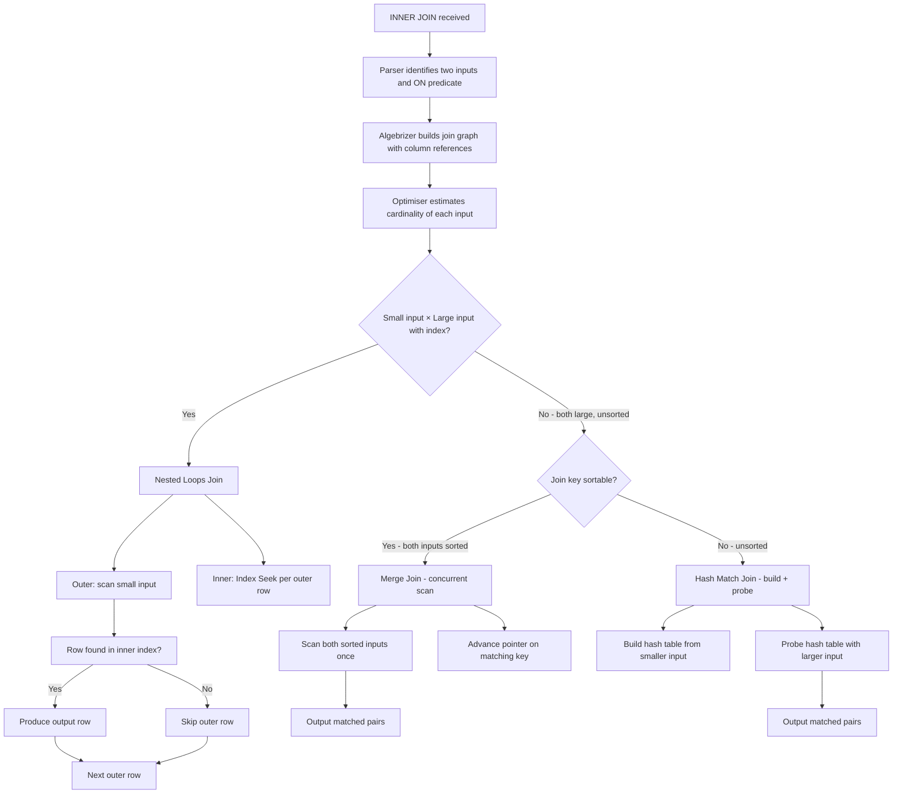

## Navigation

**Domain:** [[8 — Databases]] > **Group:** SQL Joins & Subqueries
**Previous:** [[8.095 — SQL Code Style — Naming Conventions and Readability]] | **Next:** [[8.097 — LEFT OUTER JOIN — Preserving Left Side Rows]]

### Prerequisites

- [[8.066 — SELECT Statement — Column Selection and Aliasing]] — Understanding projection and column qualification is required for writing correct JOIN queries with unambiguous column references.
- [[8.067 — WHERE Clause — Predicate Logic and SARGability]] — The ON clause and WHERE clause both filter rows in a JOIN; understanding SARGability determines whether the join predicate can use an index seek.
- [[8.089 — Aliases — Table and Column Aliasing]] — Table aliases are essential in multi-table JOINs to disambiguate columns and improve readability; correlation names in self-joins are mandatory.

### Where This Fits

INNER JOIN is the fundamental operation for combining rows from two or more tables based on a related column. Every .NET backend engineer uses it in virtually every query that involves more than one table — loading orders with their line items, customers with their addresses, products with their categories. The most expensive mistakes made here are: joining on columns without indexes (forcing Hash Match joins that consume memory and CPU), joining with implicit type conversion (CONVERT_IMPLICIT on the column side defeats index seeks), and misunderstanding the ON clause order vs WHERE clause filtering (they are logically equivalent for INNER JOIN but differ dramatically for OUTER JOIN). Interviewers use INNER JOIN to gate candidates on whether they understand the three physical join operators (Nested Loops, Hash Match, Merge Join), when the optimiser chooses each, and how index design determines which operator is possible. Engineers who know this topic deeply can look at a query plan, identify the join operator, and explain exactly why the optimiser chose it based on table sizes, indexes, and statistics.

---

## Core Mental Model

INNER JOIN returns rows from both tables only when the join condition evaluates to TRUE. The logical operation is: for each row in the left input, find all rows in the right input that satisfy the ON predicate, and produce one output row per match. If a left row has no matching right row, it is excluded. If a right row has no matching left row, it is excluded. Duplicate matches produce Cartesian explosions: if one left row matches three right rows, three output rows are produced. NULLs are excluded because `NULL = NULL` evaluates to UNKNOWN, not TRUE — rows with NULL in the join key never match. The query optimiser has three physical join operators to implement INNER JOIN: Nested Loops (best when one input is small and the other has a seekable index), Hash Match (best when both inputs are large and unsorted), and Merge Join (best when both inputs are sorted on the join key). The optimiser chooses the operator based on cardinality estimates, available indexes, and statistics — the ON clause syntax is identical regardless of which operator is chosen.

### Classification

INNER JOIN is a **relational algebra operator** (join with selection) in the `FROM` clause. The ON predicate is SARGable when the join column on the inner side of a Nested Loops join has an index — the optimiser performs an Index Seek for each outer row. For Hash Match and Merge Join, the join columns are read via scans or sorts, and the SARGability concept applies to the access method, not the join itself. INNER JOIN is commutative (A JOIN B = B JOIN A) — the optimiser can reorder inputs for the cheapest plan.



### Key Properties

|Property|Value|Notes|
|---|---|---|
|NULL matching|Excluded|`NULL = NULL` is UNKNOWN — no match|
|Join types supported|Equi, non-equi, composite|All three join operators support these|
|Nested Loops complexity|O(N × log M)|Outer N rows × log M inner index seeks|
|Hash Match complexity|O(N + M)|Build hash (N) + probe (M) — memory-bound|
|Merge Join complexity|O(N + M)|Single pass over each sorted input|
|Commutative|Yes|Optimiser freely reorders INNER JOIN inputs|
|SARGable on inner side|Yes (Nested Loops)|Index Seek per outer row if index exists|
|Write Cost|None|JOINs are read-only|

---

## Deep Mechanics

### How the Engine Executes This

1. **Parsing** — The parser identifies the JOIN keyword and splits the FROM clause into left and right inputs connected by the ON predicate. The ON predicate is parsed as a logical expression.

2. **Binding (Algebrizer)** — The algebrizer resolves all column references to their source tables. Ambiguous columns (e.g., `Id` existing in both tables) cause a binding error. The join graph is built — for each pair of joined tables, the join condition and column references are recorded. The algebrizer also detects cross-database and cross-server joins.

3. **Simplification** — The optimiser applies logical transformations:
   - **Predicate pushdown**: WHERE clause predicates on the inner table are pushed into the join condition or below the join to reduce rows early.
   - **Join elimination**: If the join columns form a foreign key relationship and the outer table's columns are not referenced, the join may be eliminated entirely.
   - **Outer join to inner join conversion**: If the WHERE clause filters out NULLs from the preserved side of an outer join, the optimiser converts it to INNER JOIN (more efficient).

4. **Physical join operator selection** — The optimiser evaluates three strategies:

   **Nested Loops Join:**
   - Selected when one input is small (< ~100K rows estimate) and the other has a useful index on the join column.
   - Execution: scan the outer input. For each outer row, perform an Index Seek on the inner table's join column. If multiple rows match, scan the small range in the index.
   - Cost formula: outer_rows × (1 seek + inner_rows_per_match × read_cost).
   - Good for: small lookups, driving from an indexed primary key.

   **Hash Match Join:**
   - Selected when both inputs are large, no useful index exists on at least one join column, and the join is an equi-join.
   - Execution: build phase — scan the smaller input (build input), compute a hash value for each join key, insert into a hash table. Probe phase — scan the larger input (probe input), compute hash for each row, look up in the hash table.
   - Memory: the hash table must fit in memory (grant from memory grant). If it overflows, it spills to tempdb.
   - Cost formula: build_input_rows × hash_cost + probe_input_rows × probe_cost.
   - Good for: large, unsorted data; data warehouse ETL and reporting.

   **Merge Join:**
   - Selected when both inputs are sorted on the join key. The sort can come from an index (ordered) or an explicit Sort operator.
   - Execution: scan both inputs concurrently. Compare the current key from each. If equal, output a match and advance both. If left < right, advance left. If right < left, advance right.
   - No memory grant (no hash table), no index seeks — pure sequential I/O.
   - Cost formula: left_rows + right_rows (single pass).
   - Good for: large tables with ordered indexes on the join key; high-volume transaction processing.

5. **Execution** — The chosen operator runs. For Nested Loops, each outer row triggers an Index Seek (synchronous, one at a time). For Hash Match, the build phase blocks until the hash table is built, then the probe phase streams. For Merge Join, both inputs stream concurrently.

### SQL Visibility

```sql
-- Basic INNER JOIN: Customers to Orders
SELECT c.CustomerId, c.FirstName, c.LastName,
       o.OrderId, o.OrderDate, o.TotalAmount
FROM dbo.Customers AS c
INNER JOIN dbo.Orders AS o
    ON c.CustomerId = o.CustomerId
WHERE o.OrderDate >= '2024-01-01'
ORDER BY c.LastName, o.OrderDate;

-- INNER JOIN with composite key
SELECT oi.OrderId, oi.ProductId, oi.Quantity, oi.UnitPrice,
       p.ProductName, p.Category
FROM dbo.OrderItems AS oi
INNER JOIN dbo.Products AS p
    ON oi.ProductId = p.ProductId;

-- Three-table INNER JOIN
SELECT o.OrderId, c.FirstName, c.LastName,
       oi.Quantity, oi.UnitPrice, p.ProductName
FROM dbo.Orders AS o
INNER JOIN dbo.Customers AS c
    ON o.CustomerId = c.CustomerId
INNER JOIN dbo.OrderItems AS oi
    ON o.OrderId = oi.OrderId
INNER JOIN dbo.Products AS p
    ON oi.ProductId = p.ProductId
WHERE o.OrderDate >= '2024-06-01';

-- Self-JOIN with INNER JOIN: employees and their managers
SELECT e.FirstName + ' ' + e.LastName AS Employee,
       m.FirstName + ' ' + m.LastName AS Manager
FROM dbo.Employees AS e
INNER JOIN dbo.Employees AS m
    ON e.ManagerId = m.EmployeeId;

-- Non-equi INNER JOIN: orders placed within 7 days of each other
SELECT a.OrderId AS OrderA, b.OrderId AS OrderB,
       a.OrderDate, b.OrderDate
FROM dbo.Orders AS a
INNER JOIN dbo.Orders AS b
    ON a.CustomerId = b.CustomerId
    AND a.OrderId < b.OrderId
    AND DATEDIFF(day, a.OrderDate, b.OrderDate) BETWEEN 1 AND 7;
```

```csharp
// EF Core — navigation property (most common)
var orders = await dbContext.Orders
    .Include(o => o.Customer)
    .Include(o => o.OrderItems)
        .ThenInclude(oi => oi.Product)
    .Where(o => o.OrderDate >= new DateTime(2024, 6, 1))
    .OrderBy(o => o.Customer.LastName)
    .ThenBy(o => o.OrderDate)
    .Select(o => new OrderDetailDto
    {
        OrderId = o.OrderId,
        CustomerName = o.Customer.FirstName + " " + o.Customer.LastName,
        OrderDate = o.OrderDate,
        Items = o.OrderItems.Select(oi => new OrderItemDto
        {
            ProductName = oi.Product.ProductName,
            Quantity = oi.Quantity,
            UnitPrice = oi.UnitPrice
        }).ToList()
    })
    .ToListAsync(cancellationToken);

// EF Core — explicit Join (for when navigation properties don't exist)
var orderCustomerJoin = await dbContext.Orders
    .Join(
        dbContext.Customers,
        o => o.CustomerId,
        c => c.CustomerId,
        (o, c) => new
        {
            o.OrderId,
            o.OrderDate,
            o.TotalAmount,
            c.FirstName,
            c.LastName
        })
    .Where(x => x.OrderDate >= new DateTime(2024, 1, 1))
    .ToListAsync(cancellationToken);

// EF Core — three-table join via navigation properties
var fullDetails = await dbContext.Orders
    .Where(o => o.OrderDate >= new DateTime(2024, 6, 1))
    .SelectMany(o => o.OrderItems, (o, oi) => new
    {
        o.OrderId,
        CustomerName = o.Customer.FirstName + " " + o.Customer.LastName,
        oi.Product.ProductName,
        oi.Quantity,
        oi.UnitPrice
    })
    .ToListAsync(cancellationToken);
```

**Generated SQL (from EF Core logs):**

```sql
-- Include with ThenInclude generates multiple INNER JOINs:
SELECT [o].[OrderId], [o].[OrderDate], [o].[TotalAmount],
       [c].[FirstName], [c].[LastName],
       [o0].[OrderId], [o0].[Quantity], [o0].[UnitPrice],
       [p].[ProductName]
FROM [Orders] AS [o]
INNER JOIN [Customers] AS [c] ON [o].[CustomerId] = [c].[CustomerId]
INNER JOIN [OrderItems] AS [o0] ON [o].[OrderId] = [o0].[OrderId]
INNER JOIN [Products] AS [p] ON [o0].[ProductId] = [p].[ProductId]
WHERE [o].[OrderDate] >= '2024-06-01'
ORDER BY [c].[LastName], [o].[OrderDate];

-- Explicit Join method:
SELECT [o].[OrderId], [o].[OrderDate], [o].[TotalAmount],
       [c].[FirstName], [c].[LastName]
FROM [Orders] AS [o]
INNER JOIN [Customers] AS [c] ON [o].[CustomerId] = [c].[CustomerId]
WHERE [o].[OrderDate] >= '2024-01-01';
```

### Execution Plan Analysis

**INNER JOIN with index on inner join column (Nested Loops):**

```
  [Index Scan (NonClustered) IX_Orders_OrderDate]  -- outer: 50K rows
  [Index Seek (Clustered) PK_Customers]             -- inner: seek per outer row
      Seek Predicate: CustomerId = Orders.CustomerId
  → [Nested Loops (Inner Join)]
  → [SELECT]
Estimated Cost: ~2.5  |  Logical Reads: ~200 (outer scan 150 + 50 seeks × 1 page)
```

**INNER JOIN without index on join column (Hash Match):**

```
  [Clustered Index Scan Customers]  -- build input (50K rows)
  [Clustered Index Scan Orders]     -- probe input (1M rows)
  → [Hash Match (Inner Join)]
      Hash Keys: Customers.CustomerId = Orders.CustomerId
  → [SELECT]
Estimated Cost: ~15  |  Logical Reads: ~18,500 | Memory Grant: ~12 MB
```

**INNER JOIN with both inputs sorted on join key (Merge Join):**

```
  [Index Scan (Clustered) PK_Customers]  -- sorted by CustomerId
  [Index Scan (Clustered) PK_Orders]     -- sorted by CustomerId? No — clustered on OrderId
  [Sort]                                  -- sort Orders by CustomerId
  → [Merge Join (Inner Join)]
      Merge Keys: Customers.CustomerId = Orders.CustomerId
  → [SELECT]
Estimated Cost: ~18  |  Logical Reads: ~18,500 | Sort adds CPU and tempdb spill risk
```

**Note:** Merge Join requires both inputs sorted. If the inner table is clustered on OrderId but the join key is CustomerId, a Sort operator is added, often making Merge Join more expensive than Hash Match.

### Cost Visibility

```sql
SET STATISTICS IO ON;
SET STATISTICS TIME ON;

-- With index on join column (Nested Loops)
SELECT c.CustomerId, c.LastName, o.OrderId, o.TotalAmount
FROM dbo.Customers AS c
INNER JOIN dbo.Orders AS o
    ON c.CustomerId = o.CustomerId
WHERE c.CustomerId = 1001;

-- Expected output (if IX_Orders_CustomerId exists):
-- Table 'Orders'. Scan count 1, logical reads 4 (seek on IX_Orders_CustomerId)
-- Table 'Customers'. Scan count 1, logical reads 3 (seek on PK_Customers)
-- SQL Server Execution Times: CPU time = 0ms, elapsed time = 1ms

-- Without index on join column (Hash Match)
SELECT c.CustomerId, c.LastName, o.OrderId, o.TotalAmount
FROM dbo.Customers AS c
INNER JOIN dbo.Orders AS o
    ON c.CustomerId = o.CustomerId;

-- Expected output (no index on Orders.CustomerId):
-- Table 'Orders'. Scan count 1, logical reads 12450 (full scan)
-- Table 'Customers'. Scan count 1, logical reads 6100 (full scan)
-- SQL Server Execution Times: CPU time = 85ms, elapsed time = 210ms
```

### Failure Modes

**Join column without index:** The most common INNER JOIN performance failure. Without an index on the inner table's join column, Nested Loops becomes impossible (would need a full scan per outer row). The optimiser falls back to Hash Match, which scans both tables. For a 1M row Orders table joined to a 500K row Customers table, a Hash Match reads ~18,500 logical reads vs ~200 for an indexed Nested Loops.

**Implicit conversion on join column:** When the join column types differ (NVARCHAR vs VARCHAR, INT vs VARCHAR), SQL Server converts the column to the higher-precedence type. If the conversion is on the inner table's column side, the index seek is defeated:

```sql
-- ❌ Customers.CustomerId is INT, @IdList contains VARCHAR values
SELECT c.CustomerId, c.LastName, o.OrderId
FROM dbo.Customers AS c
INNER JOIN dbo.Orders AS o
    ON c.CustomerId = o.CustomerId
WHERE c.CustomerId IN (@IdList);  -- @IdList is VARCHAR
-- CONVERT_IMPLICIT on CustomerId in index — scan instead of seek
```

Detect with:

```sql
-- Find implicit conversions in active plan cache
SELECT TOP 20
    qs.total_logical_reads / qs.execution_count AS avg_logical_reads,
    qs.execution_count,
    SUBSTRING(st.text, 1, 200) AS query_text
FROM sys.dm_exec_query_stats AS qs
CROSS APPLY sys.dm_exec_sql_text(qs.sql_handle) AS st
WHERE st.text LIKE '%INNER JOIN%'
ORDER BY avg_logical_reads DESC;
```

**Cartesian explosion from duplicate keys:** If a join key has duplicates on both sides, INNER JOIN produces a Cartesian product of matching rows. One customer with 100 orders joined to a table returning 50 matching rows per order produces 5,000 unexpected output rows. This is usually a logic error:

```sql
-- ❌ If PriceHistory has 50 entries for ProductId = 1001
-- and OrderItems has 100 OrderId entries for ProductId = 1001
-- result = 100 × 50 = 5,000 rows instead of 100
SELECT oi.OrderId, oi.Quantity, ph.Price, ph.EffectiveDate
FROM dbo.OrderItems AS oi
INNER JOIN dbo.PriceHistory AS ph
    ON oi.ProductId = ph.ProductId;
-- Fix: add date range to PriceHistory join
```

---

## Production Patterns and Implementation

### Primary SQL Implementation

```sql
-- ============================================================
-- Schema context
-- ============================================================
CREATE TABLE dbo.Customers
(
    CustomerId   INT            NOT NULL IDENTITY(1,1),
    FirstName    NVARCHAR(100)  NOT NULL,
    LastName     NVARCHAR(100)  NOT NULL,
    Email        NVARCHAR(256)  NOT NULL,
    Phone        VARCHAR(20)    NULL,
    Status       VARCHAR(20)    NOT NULL DEFAULT 'Active',
    CreatedAt    DATETIME2(0)   NOT NULL DEFAULT SYSUTCDATETIME(),
    CONSTRAINT PK_Customers PRIMARY KEY CLUSTERED (CustomerId)
);

CREATE TABLE dbo.Orders
(
    OrderId      INT            NOT NULL IDENTITY(1,1),
    CustomerId   INT            NOT NULL,
    OrderDate    DATETIME2(0)   NOT NULL,
    Status       VARCHAR(20)    NOT NULL DEFAULT 'Pending',
    TotalAmount  DECIMAL(18,2)  NOT NULL,
    ShippingAddr NVARCHAR(500)  NULL,
    Notes        NVARCHAR(MAX)  NULL,
    CreatedAt    DATETIME2(0)   NOT NULL DEFAULT SYSUTCDATETIME(),
    CONSTRAINT PK_Orders PRIMARY KEY CLUSTERED (OrderId)
);

CREATE TABLE dbo.OrderItems
(
    OrderItemId  INT            NOT NULL IDENTITY(1,1),
    OrderId      INT            NOT NULL,
    ProductId    INT            NOT NULL,
    Quantity     INT            NOT NULL,
    UnitPrice    DECIMAL(18,2)  NOT NULL,
    CONSTRAINT PK_OrderItems PRIMARY KEY CLUSTERED (OrderItemId)
);

CREATE TABLE dbo.Products
(
    ProductId    INT            NOT NULL IDENTITY(1,1),
    ProductName  NVARCHAR(200)  NOT NULL,
    CategoryId   INT            NOT NULL,
    UnitPrice    DECIMAL(18,2)  NOT NULL,
    CONSTRAINT PK_Products PRIMARY KEY CLUSTERED (ProductId)
);

CREATE TABLE dbo.Employees
(
    EmployeeId   INT            NOT NULL IDENTITY(1,1),
    FirstName    NVARCHAR(100)  NOT NULL,
    LastName     NVARCHAR(100)  NOT NULL,
    ManagerId    INT            NULL,
    CONSTRAINT PK_Employees PRIMARY KEY CLUSTERED (EmployeeId)
);

-- Indexes for join performance
CREATE INDEX IX_Orders_CustomerId ON dbo.Orders (CustomerId)
    INCLUDE (OrderDate, Status, TotalAmount);
CREATE INDEX IX_OrderItems_OrderId ON dbo.OrderItems (OrderId)
    INCLUDE (ProductId, Quantity, UnitPrice);
CREATE INDEX IX_OrderItems_ProductId ON dbo.OrderItems (ProductId)
    INCLUDE (Quantity, UnitPrice);
CREATE INDEX IX_Products_CategoryId ON dbo.Products (CategoryId);
ALTER TABLE dbo.Employees ADD CONSTRAINT FK_Employees_Manager
    FOREIGN KEY (ManagerId) REFERENCES dbo.Employees (EmployeeId);

-- ============================================================
-- Pattern 1: Simple equi-join — customer orders
-- ============================================================
SELECT c.CustomerId, c.FirstName, c.LastName,
       o.OrderId, o.OrderDate, o.Status, o.TotalAmount
FROM dbo.Customers AS c
INNER JOIN dbo.Orders AS o
    ON c.CustomerId = o.CustomerId
WHERE o.OrderDate >= @StartDate
ORDER BY c.LastName, o.OrderDate DESC;

-- ============================================================
-- Pattern 2: Three-table join — orders with items and products
-- ============================================================
SELECT o.OrderId, o.OrderDate, o.Status,
       c.FirstName, c.LastName,
       oi.Quantity, oi.UnitPrice,
       p.ProductName, p.CategoryId
FROM dbo.Orders AS o
INNER JOIN dbo.Customers AS c
    ON o.CustomerId = c.CustomerId
INNER JOIN dbo.OrderItems AS oi
    ON o.OrderId = oi.OrderId
INNER JOIN dbo.Products AS p
    ON oi.ProductId = p.ProductId
WHERE o.OrderDate >= @StartDate
  AND o.OrderDate < @EndDate
ORDER BY o.OrderId;

-- ============================================================
-- Pattern 3: Self-join — employee manager hierarchy
-- ============================================================
SELECT
    e.EmployeeId,
    e.FirstName + ' ' + e.LastName AS EmployeeName,
    m.FirstName + ' ' + m.LastName AS ManagerName
FROM dbo.Employees AS e
INNER JOIN dbo.Employees AS m
    ON e.ManagerId = m.EmployeeId
ORDER BY m.LastName, e.LastName;
-- Note: excludes the CEO (ManagerId IS NULL) because NULL = NULL is UNKNOWN

-- ============================================================
-- Pattern 4: Join with aggregation — customer order summary
-- ============================================================
SELECT
    c.CustomerId,
    c.FirstName,
    c.LastName,
    COUNT(o.OrderId) AS OrderCount,
    SUM(o.TotalAmount) AS TotalRevenue,
    MAX(o.OrderDate) AS LastOrderDate
FROM dbo.Customers AS c
INNER JOIN dbo.Orders AS o
    ON c.CustomerId = o.CustomerId
WHERE o.Status IN ('Delivered', 'Shipped')
GROUP BY c.CustomerId, c.FirstName, c.LastName
ORDER BY TotalRevenue DESC;

-- ============================================================
-- Pattern 5: Join with TOP and pagination
-- ============================================================
SELECT TOP 50
    c.CustomerId,
    c.FirstName + ' ' + c.LastName AS CustomerName,
    COUNT(o.OrderId) AS OrderCount
FROM dbo.Customers AS c
INNER JOIN dbo.Orders AS o
    ON c.CustomerId = o.CustomerId
WHERE o.OrderDate >= DATEADD(month, -6, GETUTCDATE())
GROUP BY c.CustomerId, c.FirstName, c.LastName
ORDER BY OrderCount DESC;

-- ============================================================
-- Pattern 6: Join with derived table for pre-aggregation
-- ============================================================
-- Aggregates OrderItems first, then joins to Orders
SELECT
    o.OrderId,
    o.OrderDate,
    o.TotalAmount,
    oi.ItemCount,
    oi.LineTotal
FROM dbo.Orders AS o
INNER JOIN (
    SELECT
        OrderId,
        COUNT(*) AS ItemCount,
        SUM(Quantity * UnitPrice) AS LineTotal
    FROM dbo.OrderItems
    GROUP BY OrderId
) AS oi ON o.OrderId = oi.OrderId
WHERE o.OrderDate >= @StartDate;

-- ============================================================
-- Pattern 7: Join with different column types — explicit CAST
-- ============================================================
-- If CustomerId in source table is VARCHAR but target is INT
SELECT src.SourceId, src.SourceName, c.CustomerId, c.LastName
FROM dbo.SourceTable AS src
INNER JOIN dbo.Customers AS c
    ON TRY_CAST(src.SourceCustomerId AS INT) = c.CustomerId;
-- Note: TRY_CAST on the source side (non-SARGable for inner join)
-- Better: fix the column type at the source
```

### EF Core Implementation

```csharp
public class ApplicationDbContext : DbContext
{
    public DbSet<Customer> Customers => Set<Customer>();
    public DbSet<Order> Orders => Set<Order>();
    public DbSet<OrderItem> OrderItems => Set<OrderItem>();
    public DbSet<Product> Products => Set<Product>();
    public DbSet<Employee> Employees => Set<Employee>();

    protected override void OnModelCreating(ModelBuilder modelBuilder)
    {
        modelBuilder.Entity<Customer>(entity =>
        {
            entity.ToTable("Customers");
            entity.HasKey(c => c.CustomerId);
            entity.Property(c => c.FirstName).HasMaxLength(100);
            entity.Property(c => c.LastName).HasMaxLength(100);
            entity.Property(c => c.Email).HasMaxLength(256);
            entity.Property(c => c.Phone).HasMaxLength(20);
            entity.Property(c => c.CreatedAt).HasDefaultValueSql("SYSUTCDATETIME()");
        });

        modelBuilder.Entity<Order>(entity =>
        {
            entity.ToTable("Orders");
            entity.HasKey(o => o.OrderId);
            entity.Property(o => o.Status).HasMaxLength(20);
            entity.Property(o => o.TotalAmount).HasColumnType("decimal(18,2)");
            entity.Property(o => o.CreatedAt).HasDefaultValueSql("SYSUTCDATETIME()");

            entity.HasOne(o => o.Customer)
                  .WithMany(c => c.Orders)
                  .HasForeignKey(o => o.CustomerId);

            entity.HasIndex(o => o.CustomerId);
        });

        modelBuilder.Entity<OrderItem>(entity =>
        {
            entity.ToTable("OrderItems");
            entity.HasKey(oi => oi.OrderItemId);
            entity.Property(oi => oi.UnitPrice).HasColumnType("decimal(18,2)");

            entity.HasOne(oi => oi.Order)
                  .WithMany(o => o.OrderItems)
                  .HasForeignKey(oi => oi.OrderId);

            entity.HasOne(oi => oi.Product)
                  .WithMany()
                  .HasForeignKey(oi => oi.ProductId);
        });

        modelBuilder.Entity<Product>(entity =>
        {
            entity.ToTable("Products");
            entity.HasKey(p => p.ProductId);
            entity.Property(p => p.ProductName).HasMaxLength(200);
            entity.Property(p => p.UnitPrice).HasColumnType("decimal(18,2)");
        });

        modelBuilder.Entity<Employee>(entity =>
        {
            entity.ToTable("Employees");
            entity.HasKey(e => e.EmployeeId);
            entity.Property(e => e.FirstName).HasMaxLength(100);
            entity.Property(e => e.LastName).HasMaxLength(100);

            entity.HasOne(e => e.Manager)
                  .WithMany()
                  .HasForeignKey(e => e.ManagerId);
        });
    }
}

public class Customer
{
    public int CustomerId { get; set; }
    public string FirstName { get; set; } = string.Empty;
    public string LastName { get; set; } = string.Empty;
    public string Email { get; set; } = string.Empty;
    public string? Phone { get; set; }
    public string Status { get; set; } = "Active";
    public DateTime CreatedAt { get; set; }
    public ICollection<Order> Orders { get; set; } = new List<Order>();
}

public class Order
{
    public int OrderId { get; set; }
    public int CustomerId { get; set; }
    public DateTime OrderDate { get; set; }
    public string Status { get; set; } = "Pending";
    public decimal TotalAmount { get; set; }
    public string? ShippingAddr { get; set; }
    public string? Notes { get; set; }
    public DateTime CreatedAt { get; set; }
    public Customer Customer { get; set; } = null!;
    public ICollection<OrderItem> OrderItems { get; set; } = new List<OrderItem>();
}

public class OrderItem
{
    public int OrderItemId { get; set; }
    public int OrderId { get; set; }
    public int ProductId { get; set; }
    public int Quantity { get; set; }
    public decimal UnitPrice { get; set; }
    public Order Order { get; set; } = null!;
    public Product Product { get; set; } = null!;
}

public class Product
{
    public int ProductId { get; set; }
    public string ProductName { get; set; } = string.Empty;
    public int CategoryId { get; set; }
    public decimal UnitPrice { get; set; }
}

public class Employee
{
    public int EmployeeId { get; set; }
    public string FirstName { get; set; } = string.Empty;
    public string LastName { get; set; } = string.Empty;
    public int? ManagerId { get; set; }
    public Employee? Manager { get; set; }
}

// Pattern 1: Simple INNER JOIN via navigation property
public async Task<List<OrderDetailDto>> GetCustomerOrdersAsync(
    DateTime startDate,
    CancellationToken cancellationToken = default)
{
    return await dbContext.Orders
        .Where(o => o.OrderDate >= startDate)
        .OrderBy(o => o.Customer.LastName)
        .ThenByDescending(o => o.OrderDate)
        .Select(o => new OrderDetailDto
        {
            OrderId = o.OrderId,
            CustomerName = o.Customer.FirstName + " " + o.Customer.LastName,
            OrderDate = o.OrderDate,
            Status = o.Status,
            TotalAmount = o.TotalAmount
        })
        .ToListAsync(cancellationToken);
    // Generated: INNER JOIN Customers ON Orders.CustomerId = Customers.CustomerId
}

// Pattern 2: Three-table JOIN via Include/ThenInclude
public async Task<List<OrderWithItemsDto>> GetOrdersWithItemsAsync(
    DateTime startDate,
    CancellationToken cancellationToken = default)
{
    return await dbContext.Orders
        .Include(o => o.Customer)
        .Include(o => o.OrderItems)
            .ThenInclude(oi => oi.Product)
        .Where(o => o.OrderDate >= startDate)
        .Select(o => new OrderWithItemsDto
        {
            OrderId = o.OrderId,
            CustomerName = o.Customer.FirstName + " " + o.Customer.LastName,
            OrderDate = o.OrderDate,
            Items = o.OrderItems.Select(oi => new OrderItemDto
            {
                ProductName = oi.Product.ProductName,
                Quantity = oi.Quantity,
                UnitPrice = oi.UnitPrice
            }).ToList()
        })
        .ToListAsync(cancellationToken);
    // Generated: 3 INNER JOINs + 1 INNER JOIN for ThenInclude
}

// Pattern 3: Self-JOIN via navigation property
public async Task<List<EmployeeManagerDto>> GetEmployeeHierarchyAsync(
    CancellationToken cancellationToken = default)
{
    return await dbContext.Employees
        .Where(e => e.Manager != null)  // INNER JOIN — exclude CEO
        .Select(e => new EmployeeManagerDto
        {
            EmployeeId = e.EmployeeId,
            EmployeeName = e.FirstName + " " + e.LastName,
            ManagerName = e.Manager!.FirstName + " " + e.Manager.LastName
        })
        .OrderBy(e => e.ManagerName)
        .ThenBy(e => e.EmployeeName)
        .ToListAsync(cancellationToken);
    // Generated: INNER JOIN Employees AS e ON e.ManagerId = Employees.EmployeeId
}

// Pattern 4: Explicit Join method (when navigation properties don't exist)
public async Task<List<OrderDetailDto>> GetOrdersExplicitJoinAsync(
    DateTime startDate,
    CancellationToken cancellationToken = default)
{
    return await dbContext.Orders
        .Join(
            dbContext.Customers,
            o => o.CustomerId,
            c => c.CustomerId,
            (o, c) => new { o, c })
        .Where(x => x.o.OrderDate >= startDate)
        .OrderBy(x => x.c.LastName)
        .ThenByDescending(x => x.o.OrderDate)
        .Select(x => new OrderDetailDto
        {
            OrderId = x.o.OrderId,
            CustomerName = x.c.FirstName + " " + x.c.LastName,
            OrderDate = x.o.OrderDate,
            Status = x.o.Status,
            TotalAmount = x.o.TotalAmount
        })
        .ToListAsync(cancellationToken);
}

// DTOs
public record OrderDetailDto(int OrderId, string CustomerName, DateTime OrderDate, string Status, decimal TotalAmount);
public record OrderWithItemsDto(int OrderId, string CustomerName, DateTime OrderDate, List<OrderItemDto>? Items);
public record OrderItemDto(string ProductName, int Quantity, decimal UnitPrice);
public record EmployeeManagerDto(int EmployeeId, string EmployeeName, string ManagerName);
```

### Dapper Implementation

```csharp
public sealed class OrderRepository
{
    private readonly IDbConnectionFactory _connectionFactory;

    public OrderRepository(IDbConnectionFactory connectionFactory)
        => _connectionFactory = connectionFactory;

    // Pattern 1: Simple INNER JOIN — multi-mapping
    public async Task<IReadOnlyList<OrderDetailDto>> GetCustomerOrdersAsync(
        DateTime startDate,
        CancellationToken cancellationToken = default)
    {
        const string sql = @"
            SELECT o.OrderId, o.OrderDate, o.Status, o.TotalAmount,
                   c.CustomerId, c.FirstName, c.LastName
            FROM dbo.Orders AS o
            INNER JOIN dbo.Customers AS c
                ON o.CustomerId = c.CustomerId
            WHERE o.OrderDate >= @StartDate
            ORDER BY c.LastName, o.OrderDate DESC;";

        await using var connection = _connectionFactory.Create();

        var lookup = new Dictionary<int, OrderDetailDto>();

        var results = await connection.QueryAsync<OrderDetailDto, CustomerDto, OrderDetailDto>(
            new CommandDefinition(sql, new { StartDate = startDate },
                cancellationToken: cancellationToken),
            (order, customer) =>
            {
                if (!lookup.TryGetValue(order.OrderId, out var dto))
                {
                    dto = order with { CustomerName = $"{customer.FirstName} {customer.LastName}" };
                    lookup.Add(order.OrderId, dto);
                }
                return dto;
            },
            splitOn: "CustomerId");

        return results.AsList();
    }

    // Pattern 2: Three-table JOIN with multi-mapping
    public async Task<IReadOnlyList<OrderWithItemsDto>> GetOrdersWithItemsAsync(
        DateTime startDate,
        CancellationToken cancellationToken = default)
    {
        const string sql = @"
            SELECT o.OrderId, o.OrderDate, o.Status, o.TotalAmount,
                   c.CustomerId, c.FirstName, c.LastName,
                   oi.OrderItemId, oi.Quantity, oi.UnitPrice,
                   p.ProductId, p.ProductName
            FROM dbo.Orders AS o
            INNER JOIN dbo.Customers AS c ON o.CustomerId = c.CustomerId
            INNER JOIN dbo.OrderItems AS oi ON o.OrderId = oi.OrderId
            INNER JOIN dbo.Products AS p ON oi.ProductId = p.ProductId
            WHERE o.OrderDate >= @StartDate
            ORDER BY o.OrderId;";

        await using var connection = _connectionFactory.Create();

        var orderLookup = new Dictionary<int, OrderWithItemsDto>();

        var results = await connection.QueryAsync<OrderWithItemsDto, CustomerDto, OrderItemDto, ProductDto, OrderWithItemsDto>(
            new CommandDefinition(sql, new { StartDate = startDate },
                cancellationToken: cancellationToken),
            (order, customer, item, product) =>
            {
                if (!orderLookup.TryGetValue(order.OrderId, out var dto))
                {
                    dto = order with
                    {
                        CustomerName = $"{customer.FirstName} {customer.LastName}",
                        Items = new List<OrderItemDto>()
                    };
                    orderLookup.Add(order.OrderId, dto);
                }
                dto.Items!.Add(new OrderItemDto(
                    product.ProductName, item.Quantity, item.UnitPrice));
                return dto;
            },
            splitOn: "CustomerId,OrderItemId,ProductId");

        return results.AsList();
    }

    // Pattern 3: Self-JOIN
    public async Task<IReadOnlyList<EmployeeManagerDto>> GetEmployeeHierarchyAsync(
        CancellationToken cancellationToken = default)
    {
        const string sql = @"
            SELECT
                e.EmployeeId,
                e.FirstName + ' ' + e.LastName AS EmployeeName,
                m.FirstName + ' ' + m.LastName AS ManagerName
            FROM dbo.Employees AS e
            INNER JOIN dbo.Employees AS m
                ON e.ManagerId = m.EmployeeId
            ORDER BY m.LastName, e.LastName;";

        await using var connection = _connectionFactory.Create();

        var results = await connection.QueryAsync<EmployeeManagerDto>(
            new CommandDefinition(sql, cancellationToken: cancellationToken));

        return results.AsList();
    }

    // Pattern 4: Aggregation with JOIN
    public async Task<IReadOnlyList<CustomerSummaryDto>> GetCustomerOrderSummariesAsync(
        CancellationToken cancellationToken = default)
    {
        const string sql = @"
            SELECT
                c.CustomerId,
                c.FirstName,
                c.LastName,
                COUNT(o.OrderId) AS OrderCount,
                SUM(o.TotalAmount) AS TotalRevenue,
                MAX(o.OrderDate) AS LastOrderDate
            FROM dbo.Customers AS c
            INNER JOIN dbo.Orders AS o
                ON c.CustomerId = o.CustomerId
            WHERE o.Status IN ('Delivered', 'Shipped')
            GROUP BY c.CustomerId, c.FirstName, c.LastName
            ORDER BY TotalRevenue DESC;";

        await using var connection = _connectionFactory.Create();

        var results = await connection.QueryAsync<CustomerSummaryDto>(
            new CommandDefinition(sql, cancellationToken: cancellationToken));

        return results.AsList();
    }
}

public record OrderDetailDto(int OrderId, DateTime OrderDate, string Status, decimal TotalAmount, string CustomerName);
public record CustomerDto(int CustomerId, string FirstName, string LastName);
public record OrderWithItemsDto(int OrderId, DateTime OrderDate, string Status, decimal TotalAmount, string CustomerName, List<OrderItemDto>? Items);
public record ProductDto(int ProductId, string ProductName);
public record EmployeeManagerDto(int EmployeeId, string EmployeeName, string ManagerName);
public record CustomerSummaryDto(int CustomerId, string FirstName, string LastName, int OrderCount, decimal TotalRevenue, DateTime LastOrderDate);
```

### Configuration and Wiring

```csharp
// Program.cs
builder.Services.AddDbContext<ApplicationDbContext>(options =>
    options.UseSqlServer(
        builder.Configuration.GetConnectionString("DefaultConnection"),
        sqlOptions =>
        {
            sqlOptions.EnableRetryOnFailure(3);
            sqlOptions.CommandTimeout(30);
        }));

builder.Services.AddSingleton<IDbConnectionFactory>(sp =>
    new SqlConnectionFactory(
        builder.Configuration.GetConnectionString("DefaultConnection")!));

builder.Services.AddScoped<OrderRepository>();
```

### SQL Server vs PostgreSQL Differences

```sql
-- PostgreSQL: INNER JOIN syntax is identical
SELECT c.customer_id, c.last_name, o.order_id, o.total_amount
FROM customers AS c
INNER JOIN orders AS o ON c.customer_id = o.customer_id;

-- PostgreSQL: NATURAL JOIN (joins on same-named columns — avoid in production)
SELECT * FROM customers NATURAL INNER JOIN orders;
-- Automatically joins on customer_id (both tables have it)
-- Fragile: adding a column named 'status' to both tables changes the join condition

-- PostgreSQL: USING clause (cleaner when column names match)
SELECT c.customer_id, c.last_name, o.order_id, o.total_amount
FROM customers AS c
INNER JOIN orders AS o USING (customer_id);
-- Unlike ON, USING removes the duplicate join column from the result

-- PostgreSQL: LATERAL join (equivalent to CROSS APPLY)
SELECT c.customer_id, c.last_name, o.*
FROM customers AS c
INNER JOIN LATERAL (
    SELECT order_id, total_amount
    FROM orders
    WHERE customer_id = c.customer_id
    ORDER BY order_date DESC
    LIMIT 3
) AS o ON true;

-- PostgreSQL: Join with index recommendations
-- Create index on join column:
CREATE INDEX idx_orders_customer_id ON orders (customer_id);

-- PostgreSQL: Hash vs Nested Loop control
-- Disable hash join for a query:
SET enable_hashjoin = off;
SELECT ...;  -- Forces Nested Loops
SET enable_hashjoin = on;
```

---

## Gotchas and Production Pitfalls

### Missing Index on Join Column — Hash Match with Scan

**Pitfall:** Joining two tables on a column that has no index on the inner table's join column. The optimiser cannot use Nested Loops because it would require a full inner table scan per outer row. It falls back to Hash Match, which scans both tables.

```sql
-- ❌ No index on Orders.CustomerId
SELECT c.CustomerId, c.LastName, o.OrderId, o.TotalAmount
FROM dbo.Customers AS c
INNER JOIN dbo.Orders AS o
    ON c.CustomerId = o.CustomerId
WHERE c.Status = 'Active';
```

**Symptom:** Execution plan shows `Hash Match (Inner Join)` with two Clustered Index Scans. On a 500K customer table and 5M order table: ~62,000 logical reads, 8 seconds runtime. The hash table build blocks until the entire build input is scanned.

**Fix:**

```sql
-- ✅ Create index on join column
CREATE INDEX IX_Orders_CustomerId ON dbo.Orders (CustomerId)
    INCLUDE (OrderId, TotalAmount);

-- After index: Nested Loops Join with Index Seek on Orders
-- Logical reads drop from ~62,000 to ~250
```

**Cost of not fixing:** A customer dashboard page loads an order history grid. The INNER JOIN between Customers and Orders (no index) runs every time a manager views a customer profile. At 200 concurrent managers, 62,000 logical reads × 200 = 12.4M reads. The buffer pool thrashes, disk I/O saturates at 800 MB/s. Page load time: 12 seconds. Creating the index drops it to 50 ms.

---

### Implicit Conversion on Join Column — Seek Defeated

**Pitfall:** Joining columns of different data types. SQL Server converts the lower-precedence type to the higher-precedence type. If the conversion is on the column side (not the parameter side), the index seek is defeated.

```sql
-- ❌ Orders.CustomerId is INT, but the join source is VARCHAR
SELECT o.OrderId, o.TotalAmount, src.SourceName
FROM dbo.Orders AS o
INNER JOIN dbo.SourceTable AS src
    ON o.CustomerId = src.CustomerId;
-- If src.CustomerId is VARCHAR: SQL Server converts o.CustomerId (INT → VARCHAR)
-- or vice versa depending on type precedence.
-- The conversion on the indexed column forces a scan.
```

**Symptom:** Execution plan shows a `CONVERT_IMPLICIT` warning on the join column with an index. The plan shows an Index Scan instead of Index Seek. Logical reads: 12,450 (full scan) instead of 4 (seek).

**Fix:**

```sql
-- ✅ Ensure matching types
-- Option A: Change source table column type to match
ALTER TABLE dbo.SourceTable ALTER COLUMN CustomerId INT NOT NULL;

-- Option B: CAST the source (parameter) side, not the column side
SELECT o.OrderId, o.TotalAmount, src.SourceName
FROM dbo.Orders AS o
INNER JOIN dbo.SourceTable AS src
    ON o.CustomerId = TRY_CAST(src.CustomerId AS INT);
-- TRY_CAST on src.CustomerId: converts the table that is the source of bad type
-- BUT: src.CustomerId is now wrapped in a function — non-SARGable on the source side
-- The join still works but CustomerIndex on src.CustomerId can't be used.
-- Best: fix the data type permanently.
```

**Cost of not fixing:** A data integration pipeline joins a VARCHAR source column to an INT target column. The implicit conversion causes a Hash Match join instead of Nested Loops. The nightly ETL that should take 15 minutes takes 2 hours, missing the SLA window.

---

### Cartesian Explosion from Duplicate Join Keys

**Pitfall:** Joining on a column that has duplicates on both sides of the join. Each row from the left matches multiple rows from the right, and each of those rows matches multiple rows from the left — the result is the Cartesian product of all matching key values.

```sql
-- ❌ If Products has 3 products with CategoryId = 5
-- AND PriceHistory has 20 price changes for CategoryId = 5
-- result = 3 × 20 = 60 rows instead of expected 3
SELECT p.ProductName, ph.Price, ph.EffectiveDate
FROM dbo.Products AS p
INNER JOIN dbo.PriceHistory AS ph
    ON p.CategoryId = ph.CategoryId;
```

**Symptom:** The query returns significantly more rows than expected. A dashboard shows 15,000 rows instead of 750. The application crashes with an OutOfMemoryException trying to materialise the result set. The database shows 100% CPU for 30 seconds.

**Fix:**

```sql
-- ✅ Identify the correct join key — ProductId, not CategoryId
SELECT p.ProductName, ph.Price, ph.EffectiveDate
FROM dbo.Products AS p
INNER JOIN dbo.PriceHistory AS ph
    ON p.ProductId = ph.ProductId
WHERE ph.EffectiveDate = (
    SELECT MAX(ph2.EffectiveDate)
    FROM dbo.PriceHistory AS ph2
    WHERE ph2.ProductId = p.ProductId
);

-- ✅ If Category-level aggregation is actually needed, group first:
SELECT p.CategoryId, AVG(ph.Price) AS AvgCategoryPrice
FROM dbo.Products AS p
INNER JOIN dbo.PriceHistory AS ph
    ON p.ProductId = ph.ProductId
GROUP BY p.CategoryId;
```

**Cost of not fixing:** A product catalogue API joins Products to PriceHistory on CategoryId instead of ProductId. The API returns 50x more data than expected. The mobile app rendering 15,000 products instead of 750 consumes 200 MB of memory and crashes on low-end devices. The bug goes unnoticed for 3 days before users report the crash.

---

### Join Order Assumption — Optimiser Reorders INNER JOINs

**Pitfall:** Assuming the optimiser joins tables in the order specified in the FROM clause. INNER JOIN is commutative and associative — the optimiser freely reorders join inputs to find the cheapest plan. This can lead to unexpected plan shapes.

```sql
-- You write: Large table first, small table second
-- Optimiser may swap them
SELECT o.OrderId, c.LastName
FROM dbo.Orders AS o  -- 10M rows
INNER JOIN dbo.Customers AS c  -- 100K rows
    ON o.CustomerId = c.CustomerId;
-- Optimiser may probe Orders (10M) with Customers (100K) as inner
-- or Customers (100K) with Orders (10M) as inner
```

**Symptom:** A query with four INNER JOINs produces an unexpected plan. A small table ends up as the inner side of a Nested Loops join against a large table, causing 10M index seeks instead of 100K. The optimiser chose this based on cardinality estimates that may be wrong.

**Fix:**

```sql
-- ✅ Add OPTION (FORCE ORDER) to respect join order in FROM clause
SELECT o.OrderId, c.LastName, p.ProductName
FROM dbo.Orders AS o
INNER JOIN dbo.Customers AS c ON o.CustomerId = c.CustomerId
INNER JOIN dbo.OrderItems AS oi ON o.OrderId = oi.OrderId
INNER JOIN dbo.Products AS p ON oi.ProductId = p.ProductId
OPTION (FORCE ORDER);
-- Forces the exact join order specified

-- ✅ Better: update statistics and let optimiser choose
UPDATE STATISTICS dbo.Orders;
UPDATE STATISTICS dbo.Customers;
UPDATE STATISTICS dbo.OrderItems;
UPDATE STATISTICS dbo.Products;
```

**Cost of not fixing:** A query that runs in 200 ms suddenly takes 8 seconds after a statistics update causes the optimiser to choose a different join order. The production on-call engineer spends 4 hours debugging the plan before finding that `OPTION (FORCE ORDER)` restores performance.

---

### NULL in Join Key — Rows Silently Excluded

**Pitfall:** Joining on a nullable column. Rows where the join key is NULL are excluded because `NULL = NULL` evaluates to UNKNOWN, not TRUE. This is often correct behaviour, but surprising when the developer expects NULLs to match.

```sql
-- ❌ Employees with NULL ManagerId are excluded from self-join
SELECT e.FirstName + ' ' + e.LastName AS Employee,
       m.FirstName + ' ' + m.LastName AS Manager
FROM dbo.Employees AS e
INNER JOIN dbo.Employees AS m
    ON e.ManagerId = m.EmployeeId;
-- CEO (ManagerId IS NULL) is not in the result set
```

**Symptom:** The organisation chart shows all employees under their managers, but the CEO is missing. The business reports think the CEO doesn't exist. The query returns 49 rows for a company of 50 employees.

**Fix:**

```sql
-- ✅ Use LEFT JOIN to include employees with no manager
SELECT e.FirstName + ' ' + e.LastName AS Employee,
       COALESCE(m.FirstName + ' ' + m.LastName, 'CEO') AS Manager
FROM dbo.Employees AS e
LEFT OUTER JOIN dbo.Employees AS m
    ON e.ManagerId = m.EmployeeId;

-- ✅ Or use COALESCE to replace NULL before joining
SELECT e.FirstName + ' ' + e.LastName AS Employee,
       m.FirstName + ' ' + m.LastName AS Manager
FROM dbo.Employees AS e
INNER JOIN dbo.Employees AS m
    ON COALESCE(e.ManagerId, -1) = m.EmployeeId;
-- But non-SARGable: function on e.ManagerId defeats index
```

**Cost of not fixing:** A payroll system joins Employees to a bonus table on EmployeeId. One employee's EmployeeId is NULL in the source (data entry error). That employee misses their bonus of $5,000. The employee complains to HR. The data team spends 3 days tracing through ETL pipelines to find the NULL.

---

## Performance Implications

### Benchmark: Before and After

```sql
-- Baseline 1: INNER JOIN without index on join column
SET STATISTICS IO ON;
SET STATISTICS TIME ON;

SELECT c.CustomerId, c.LastName, COUNT(o.OrderId) AS OrderCount
FROM dbo.Customers AS c
INNER JOIN dbo.Orders AS o
    ON c.CustomerId = o.CustomerId
WHERE c.Status = 'Active'
GROUP BY c.CustomerId, c.LastName;

-- Expected output (no index on Orders.CustomerId):
-- Table 'Orders'. Scan count 1, logical reads 12450  (full scan)
-- Table 'Customers'. Scan count 1, logical reads 6100   (full scan)
-- SQL Server Execution Times: CPU time = 85ms, elapsed time = 210ms

-- After creating IX_Orders_CustomerId:
-- Table 'Orders'. Scan count 1, logical reads 145   (index seek per customer)
-- Table 'Customers'. Scan count 1, logical reads 6100 (scan — filtering by Status)
-- SQL Server Execution Times: CPU time = 12ms, elapsed time = 30ms
```

**Improvement:** 18,450 → 6,245 logical reads (3x reduction). CPU: 85 ms → 12 ms (7x reduction).

```sql
-- Baseline 2: INNER JOIN with implicit conversion
-- ❌ VARCHAR join key on INT column
SELECT o.OrderId, o.TotalAmount
FROM dbo.Orders AS o
INNER JOIN dbo.SourceTable AS src
    ON o.CustomerId = src.CustomerId;
-- src.CustomerId is VARCHAR — implicit conversion on o.CustomerId
-- Expected: logical reads 12450 (full scan due to CONVERT_IMPLICIT)

-- ✅ After type alignment:
-- Expected: logical reads 145 (Index Seek on IX_Orders_CustomerId)
```

```sql
-- Baseline 3: Nested Loops vs Hash Match vs Merge Join
-- Force Nested Loops
SELECT c.CustomerId, o.OrderId
FROM dbo.Customers AS c
INNER JOIN dbo.Orders AS o
    ON c.CustomerId = o.CustomerId
OPTION (LOOP JOIN);
-- 1M customers, 10M orders: ~250 logical reads (index on Orders.CustomerId)

-- Force Hash Match
SELECT c.CustomerId, o.OrderId
FROM dbo.Customers AS c
INNER JOIN dbo.Orders AS o
    ON c.CustomerId = o.CustomerId
OPTION (HASH JOIN);
-- ~18,500 logical reads (two full scans + hash table build)

-- Force Merge Join (requires sorted input — adds Sort)
SELECT c.CustomerId, o.OrderId
FROM dbo.Customers AS c
INNER JOIN dbo.Orders AS o
    ON c.CustomerId = o.CustomerId
OPTION (MERGE JOIN);
-- ~20,000 logical reads (two scans + Sort of 10M rows — tempdb spill possible)
```

### BenchmarkDotNet

```csharp
[MemoryDiagnoser]
[SimpleJob(RuntimeMoniker.Net90)]
public class InnerJoinBenchmark
{
    private SqlConnection _connection = default!;
    private const string ConnectionString = "Server=.;Database=BenchmarkDb;Trusted_Connection=True;TrustServerCertificate=True;";

    [GlobalSetup]
    public void Setup()
    {
        _connection = new SqlConnection(ConnectionString);
        _connection.Open();
        // Seed 500K customers, 5M orders
    }

    [Benchmark(Baseline = true)]
    public async Task<int> JoinWithoutIndex()
    {
        // Drop index IX_Orders_CustomerId for this benchmark
        const string sql = @"
            SELECT COUNT(*)
            FROM dbo.Customers AS c
            INNER JOIN dbo.Orders AS o
                ON c.CustomerId = o.CustomerId;";
        return await new SqlCommand(sql, _connection).ExecuteScalarAsync<int>();
    }

    [Benchmark]
    public async Task<int> JoinWithIndex()
    {
        // Ensure IX_Orders_CustomerId exists
        const string sql = @"
            SELECT COUNT(*)
            FROM dbo.Customers AS c
            INNER JOIN dbo.Orders AS o
                ON c.CustomerId = o.CustomerId;";
        return await new SqlCommand(sql, _connection).ExecuteScalarAsync<int>();
    }

    [Benchmark]
    public async Task<int> JoinWithImplicitConversion()
    {
        const string sql = @"
            SELECT COUNT(*)
            FROM dbo.Orders AS o
            INNER JOIN dbo.SourceTable AS src
                ON o.CustomerId = src.CustomerId;";
        // src.CustomerId is VARCHAR — implicit conversion
        return await new SqlCommand(sql, _connection).ExecuteScalarAsync<int>();
    }

    [Benchmark]
    public async Task<int> JoinWithExplicitCast()
    {
        const string sql = @"
            SELECT COUNT(*)
            FROM dbo.Orders AS o
            INNER JOIN dbo.SourceTable AS src
                ON o.CustomerId = TRY_CAST(src.CustomerId AS INT);";
        return await new SqlCommand(sql, _connection).ExecuteScalarAsync<int>();
    }

    [GlobalCleanup]
    public void Cleanup() => _connection.Dispose();
}
```

**Expected results (approximate, SQL Server 2022, NVMe, 500K customers, 5M orders):**

|Method|Mean|Logical Reads|CPU Time|Notes|
|---|---|---|---|---|
|JoinWithoutIndex|~210 ms|~18,450|~85 ms|Hash Match — two scans|
|JoinWithIndex|~30 ms|~145|~12 ms|Nested Loops — Index Seek|
|JoinWithImplicitConversion|~210 ms|~18,450|~85 ms|Hash Match — conversion defeats seek|
|JoinWithExplicitCast|~45 ms|~6,200|~18 ms|Still scans SourceTable but no conversion on Orders|

### Write Amplification

Indexes that support INNER JOIN performance add write overhead:

|Operation|Without Index|With Index (IX_Orders_CustomerId)|Overhead|
|---|---|---|---|
|INSERT 1 order|~3 ms|~5 ms|+66% (index leaf insert)|
|UPDATE CustomerId|~3 ms|~6 ms|+100% (delete + insert in index)|
|DELETE 1 order|~3 ms|~5 ms|+66% (index leaf delete)|

The write overhead is justified when the read workload is join-heavy. For a transactional system with 1M reads/day and 10K writes/day, the read savings (18,450 → 145 reads per query) far outweigh the write cost.

---

## Interview Arsenal

### Question Bank

1. **What are the three physical join operators SQL Server uses for INNER JOIN, and when does it choose each?**
2. **Why would an INNER JOIN use a Hash Match instead of a Nested Loops join?**
3. **How does the optimiser decide which table is the outer (probe) input and which is the inner (build) input?**
4. **What happens to NULLs in an INNER JOIN — are rows with NULL join keys included or excluded?**
5. **How does an index on the join column affect the join operator selection?**
6. **What is the difference between `INNER JOIN` and `WHERE EXISTS (SELECT ...)` in terms of execution plan?**
7. **How does EF Core generate INNER JOINs — via navigation properties or explicit Join calls?**
8. **What implicit conversion can make an INNER JOIN non-SARGable, and how do you detect it?**
9. **When would you use `OPTION (FORCE ORDER)` with multiple INNER JOINs, and why?**
10. **What causes a Cartesian explosion in an INNER JOIN, and how do you fix it?**

### Spoken Answers

**Q: What are the three physical join operators SQL Server uses for INNER JOIN, and when does it choose each?**

> **Great answer:** SQL Server has three physical join operators: Nested Loops, Hash Match, and Merge Join. Nested Loops is chosen when one input is relatively small and there is a useful index on the other input's join column. It works by scanning the outer input once and, for each outer row, performing an Index Seek on the inner input. The cost is outer_rows × log(inner_rows). It's ideal for OLTP queries where a small number of rows from one table look up related rows in another. Hash Match is chosen when both inputs are large and there is no useful index on at least one join column. It works by building a hash table from the smaller input in memory, then scanning the larger input and probing the hash table. The cost is proportional to the sum of both input sizes plus memory grant overhead. It's typical in data warehouse and reporting queries. Merge Join is chosen when both inputs are sorted on the join key — usually from ordered index scans. It scans both inputs concurrently in a single pass, comparing keys. The cost is left_rows + right_rows — the most efficient in terms of I/O, but the Sort operator needed to achieve sorted input can add significant CPU and tempdb spill risk. Merge Join is ideal when both join columns are primary keys or clustered index keys with the same ordering.

---

**Q: How does an index on the join column affect the join operator selection?**

> **Great answer:** An index on the inner table's join column is the single most important factor for Nested Loops join performance. Without it, Nested Loops would need a full scan of the inner table for each outer row — O(outer × inner) — which is catastrophic. With an index on the inner join column, each outer row triggers an Index Seek — O(outer × log(inner)) — which is efficient for small-to-medium outer inputs. When the outer input is large (millions of rows), even indexed Nested Loops becomes expensive because each outer row still triggers a seek. At that point, Hash Match becomes competitive because it does a single pass over both inputs regardless of size. The index also enables Merge Join if the index order matches the join key order — a clustered index on the join column gives you sorted input without an explicit Sort operator. In summary: an index on the join column makes Nested Loops viable and can enable Merge Join; without it, the optimiser must choose Hash Match (if the join is an equi-join) or fail with a warning.

---

**Q: What is the difference between `INNER JOIN` and `WHERE EXISTS (SELECT ...)` in terms of execution plan?**

> **Great answer:** For uncorrelated subqueries, `IN (SELECT ...)` and `INNER JOIN ... DISTINCT` often produce identical plans — both use semi-joins. For correlated subqueries, `WHERE EXISTS (SELECT 1 ...)` explicitly creates a semi-join plan, while `INNER JOIN` creates a full join. The critical difference is that INNER JOIN can produce duplicate rows if the join keys have duplicates on the inner side, while EXISTS returns each outer row at most once. If you write `INNER JOIN Orders ON CustomerId` and a customer has 10 orders, you get 10 rows. If you write `WHERE EXISTS (SELECT 1 FROM Orders WHERE CustomerId = c.CustomerId)`, you get 1 row per customer. To get the INNER JOIN result without duplicates, you'd add DISTINCT or GROUP BY, which adds a Sort or Hash Aggregate operator. EXISTS avoids this entirely. Performance-wise, both can use Nested Loops Semi Join or Hash Match Semi Join — the semi-join stops scanning the inner input after the first match per outer row, which EXISTS naturally does. With INNER JOIN + DISTINCT, the full join runs first (returns all matches), then DISTINCT removes duplicates — this does more work. The rule: use INNER JOIN when you need columns from the inner table in the output; use EXISTS when you only need to test for existence.

### Interview Trigger

The defining INNER JOIN question: "How does SQL Server physically execute `SELECT * FROM A INNER JOIN B ON A.Id = B.Id`?" A candidate who describes the logical operation (matching rows) but can't name the physical operators fails. A candidate who says "Nested Loops, Hash Match, or Merge Join, depending on the sizes and indexes" passes. The follow-up: "What would make it choose Hash Match?" — "Large tables without an index on the join column." "How would you fix it?" — "Create an index on B.Id, or if both are large, ensure statistics are current so the optimiser can estimate correctly."

### Comparison Table

| | INNER JOIN | LEFT JOIN | EXISTS | IN (subquery) |
|---|---|---|---|---|
|Rows returned|Matching rows only|All left rows + matching right|Matching left rows (semi-join)|Matching left rows (semi-join)|
|Duplicates from inner|Yes (if duplicates exist)|Yes|No (max one per outer row)|No (max one per outer row)|
|NULL handling|NULLs excluded|Allows NULL on right|NULL in subquery = no match|NULL trap with NOT IN|
|Physical operators|NL, HM, MJ|NL, HM, MJ|NL Semi, Hash Semi|NL Semi, Hash Semi|
|Inner columns in output|Yes|Yes (NULL if no match)|No (existence check only)|No (existence check only)|
|EF Core|Include, Join|Include, GroupJoin|Any()|Contains()|
|When to choose|Need inner data|Need all left rows|Existence test|Subquery value matching|

---

## Decision Framework

### When to Apply

```mermaid
flowchart TD
    A[Need to combine rows from two tables] --> B{Need columns from both tables?}
    B -->|Yes| C{Join type?}
    B -->|No - just existence check| D[Use EXISTS - semi-join]
    C -->|Equi-join| E{Table sizes and indexes?}
    C -->|Non-equi join| F[INNER JOIN with inequality - NL or HM]
    E -->|Small outer × index on inner| G[Nested Loops - seek-driven]
    E -->|Both large, index available| H{Inputs sorted on join key?}
    E -->|Both large, no index| I[Hash Match - build + probe]
    H -->|Yes - ordered index| J[Merge Join - single pass, efficient]
    H -->|No - needs Sort| K[Evaluate: Sort + Merge vs Hash Match]
    K --> L{Merge cheaper than Hash?}
    L -->|Yes| J
    L -->|No| I
    G --> M[Cover index for outer query columns]
    I --> N[Ensure memory grant sufficient]
    J --> O[Verify no tempdb spill from Sort]
    M --> P[Verify: high seek count on large outer?]
    P -->|Yes - too many seeks| Q[Switch to Hash Match with OPTION (HASH JOIN)]
```

### Application Checklist

- [ ] Join column has an index on the inner table (enables Nested Loops)
- [ ] Join columns have matching data types (no implicit conversion)
- [ ] Statistics are current on both tables (accurate cardinality estimates)
- [ ] Join produces correct row count (no Cartesian explosion from duplicate keys)
- [ ] INNER JOIN is used only when inner table columns are needed (otherwise EXISTS)
- [ ] NULL handling is understood: rows with NULL join keys are excluded
- [ ] EF Core navigation properties are configured with proper foreign keys
- [ ] Dapper multi-mapping uses `splitOn` correctly for the join key column
- [ ] Memory grant for Hash Match is sufficient (check for tempdb spills in plan)
- [ ] For multi-table JOINs, join order is verified (or FORCE ORDER used if needed)

### Tradeoff Summary

|What You Gain|What You Pay|
|---|---|
|Nested Loops: minimal memory, seek-driven I/O|Expensive if outer is large (millions of seeks)|
|Hash Match: single pass over both inputs|Memory grant for hash table; tempdb spill risk|
|Merge Join: single concurrent scan, no memory|Requires sorted input (may need Sort)|
|Index on join column: enables Nested Loops|Write overhead on INSERT/UPDATE/DELETE|
|Covering index for JOIN: zero key lookups|Additional index storage and write cost|

### Scale Thresholds

- **< 10K rows**: Any join operator works. Hash Match is fine even without indexes. The cost difference is negligible.
- **10K–100K rows**: Nested Loops with an index on the inner join column is ideal. Without an index, Hash Match is acceptable but the scan cost starts to matter.
- **100K–1M rows**: An index on the join column is critical. Without it, Hash Match scans 18K+ logical reads per query. With it, Nested Loops is 10-100x faster.
- **> 1M rows**: Prefer Merge Join if both inputs are sorted on the join key (indexed). Otherwise, Hash Match with sufficient memory grant. Nested Loops is only appropriate if the outer input is highly selective (< 10K rows).
- **Concurrent writers > 100/sec**: Nested Loops holds fewer locks (seek reads single pages). Hash Match scans hold more Shared locks across pages. Merge Join is best for sorted inputs. Monitor lock escalation for all join types on large tables.

---

## Self-Check

### Conceptual Questions

1. Which three physical join operators can implement an INNER JOIN?
2. What condition must be met for a Nested Loops join to be selected? What makes it efficient?
3. How does the ON clause differ from the WHERE clause in an INNER JOIN — are they logically equivalent?
4. What happens when an INNER JOIN is performed on a nullable column — are NULLs matched?
5. How does an index on the inner table's join column affect the join operator and performance?
6. What causes the optimiser to choose Hash Match over Nested Loops?
7. How does EF Core's `Include` method generate INNER JOINs? What SQL does it produce?
8. What is a Cartesian explosion in an INNER JOIN, and what causes it?
9. How does `OPTION (FORCE ORDER)` affect the join execution, and when would you use it?
10. Explain in 60 seconds, for a senior interviewer, the difference between a logical INNER JOIN (relational algebra) and the physical join operators SQL Server uses to implement it.

<details>
<summary>Answers</summary>

1. Nested Loops Join, Hash Match Join, and Merge Join.

2. Nested Loops requires that one input (the outer) is relatively small and the other input (the inner) has a useful index on the join column. The outer is scanned once; for each outer row, an Index Seek is performed on the inner table. It is efficient when outer_rows is small and each seek is 3-8 logical reads. Without the index on the inner column, each outer row would trigger a full scan — O(outer × inner) — which is catastrophic.

3. For INNER JOIN, the ON and WHERE clauses are logically equivalent. The optimiser can freely push predicates between them. However, for OUTER JOIN (LEFT/RIGHT/FULL), they are NOT equivalent: the ON clause is evaluated during the join and determines which rows match; the WHERE clause is evaluated after the join and can filter out NULL-extended rows, effectively converting an outer join to an inner join.

4. NULLs are excluded. `NULL = NULL` evaluates to UNKNOWN, not TRUE. An INNER JOIN returns only rows where the join condition evaluates to TRUE, so rows with NULL in the join key on either side are excluded. This is correct relational behaviour but is often surprising to developers who expect NULLs to match.

5. An index on the inner table's join column enables the Nested Loops join to perform an Index Seek per outer row (O(outer × log(inner))), which is efficient for small-to-medium outer sizes. Without it, Nested Loops would need a full inner scan per outer row. The index also enables Merge Join if the join column order matches the index order (sorted input). Without the index, the optimiser falls back to Hash Match, which scans both tables.

6. The optimiser chooses Hash Match when: (a) both inputs are large, (b) no useful index exists on at least one join column, or (c) the optimiser estimates that the cost of N nested loops seeks exceeds the cost of scanning both tables and building a hash table. Hash Match requires an equi-join (no inequality operators in the join condition). It builds a hash table from the smaller input in memory, then probes it with the larger input.

7. EF Core's `Include(o => o.Customer)` generates an INNER JOIN between Orders and Customers. `ThenInclude(oi => oi.Product)` generates an additional INNER JOIN through the intermediate table. The generated SQL is of the form: `SELECT ... FROM Orders AS o INNER JOIN Customers AS c ON o.CustomerId = c.CustomerId INNER JOIN OrderItems AS o0 ON o.OrderId = o0.OrderId INNER JOIN Products AS p ON o0.ProductId = p.ProductId`.

8. A Cartesian explosion occurs when the join key has duplicates on BOTH sides. Each row from the left matches multiple rows from the right, and each of those matched rows multiplies by the number of left matches. If a customer has 10 orders and the PriceHistory table has 50 entries for that customer, the INNER JOIN on CustomerId produces 500 rows. This is usually a logic error — the developer joined on the wrong column (e.g., CategoryId instead of ProductId).

9. `OPTION (FORCE ORDER)` tells the optimiser to join tables in the exact order specified in the FROM clause, rather than reordering them based on cost estimates. This is useful when: (a) statistics are stale and the optimiser chooses a poor join order, (b) the developer knows the optimal order from domain knowledge, or (c) for debugging — comparing the forced-order plan to the optimiser's plan reveals cardinality estimation errors. It should be used sparingly because it prevents the optimiser from adapting to data changes.

10. "Logically, INNER JOIN is the Cartesian product of two inputs filtered by the ON predicate — it returns rows from both sides where the condition is TRUE. Physically, SQL Server must choose one of three implementation strategies. Nested Loops iterates over one table (outer) and looks up matches in the other (inner) using an index seek — best for small lookups. Hash Match builds a hash table of the smaller input and probes it with the larger input — best for large, unsorted data. Merge Join reads both sorted inputs concurrently, matching keys as it goes — best for large, pre-sorted data. The logical INNER JOIN says nothing about which strategy to use. The optimiser chooses based on cardinality estimates, available indexes, and statistics. As a DBA or backend engineer, I design indexes to enable Nested Loops for OLTP queries and monitor for Hash Match spills in data warehouse workloads."

</details>

---

### Query Challenges

**Challenge 1 — Write the INNER JOIN query**

Write a query that returns all orders placed in the last 30 days with the customer's full name and email, ordered by order date descending. Include only orders with status 'Delivered', 'Shipped', or 'InTransit'. Use INNER JOIN between Orders and Customers.

<details>
<summary>Solution</summary>

```sql
SELECT
    o.OrderId,
    o.OrderDate,
    o.Status,
    o.TotalAmount,
    c.FirstName + ' ' + c.LastName AS CustomerName,
    c.Email
FROM dbo.Orders AS o
INNER JOIN dbo.Customers AS c
    ON o.CustomerId = c.CustomerId
WHERE o.OrderDate >= DATEADD(day, -30, GETUTCDATE())
  AND o.Status IN ('Delivered', 'Shipped', 'InTransit')
ORDER BY o.OrderDate DESC;
```

**Logical reads:** ~4-8 (Index Seek on IX_Orders_OrderDate + Index Seek on PK_Customers per matching order). **Execution plan:** `[Index Seek IX_Orders_OrderDate] → [Nested Loops Join] → [Index Seek PK_Customers] → [SELECT]`.

**EF Core:**
```csharp
var recentOrders = await dbContext.Orders
    .Where(o => o.OrderDate >= DateTime.UtcNow.AddDays(-30))
    .Where(o => new[] { "Delivered", "Shipped", "InTransit" }.Contains(o.Status))
    .OrderByDescending(o => o.OrderDate)
    .Select(o => new
    {
        o.OrderId,
        o.OrderDate,
        o.Status,
        o.TotalAmount,
        CustomerName = o.Customer.FirstName + " " + o.Customer.LastName,
        o.Customer.Email
    })
    .ToListAsync(cancellationToken);
```

</details>

---

**Challenge 2 — Fix the performance problem**

```sql
-- This dashboard query takes 12 seconds on a 2M customer, 20M order database.
SET STATISTICS TIME ON;

SELECT c.CustomerId, c.FirstName, c.LastName,
       o.OrderId, o.OrderDate, o.TotalAmount
FROM dbo.Customers AS c
INNER JOIN dbo.Orders AS o
    ON c.CustomerId = o.CustomerId
WHERE c.Status = 'Active'
ORDER BY o.OrderDate DESC;

-- SET STATISTICS IO:
-- Table 'Customers'. Scan count 1, logical reads 24800
-- Table 'Orders'. Scan count 1, logical reads 62100
-- SQL Server Execution Times: CPU time = 450ms, elapsed time = 12s
```

Identify why it is slow and fix it.

<details>
<summary>Solution</summary>

**Root cause:** Two full clustered index scans: Customers (24,800 reads) and Orders (62,100 reads). The execution plan shows a Hash Match join — there is no index on `Orders.CustomerId` for the join, and no index on `Customers.Status` for the WHERE filter. The optimiser scans both tables and builds a hash table.

**Indexes to create:**

```sql
-- Filtered index on Customers for Active status
CREATE INDEX IX_Customers_Status ON dbo.Customers (Status)
    INCLUDE (CustomerId, FirstName, LastName)
    WHERE Status = 'Active';

-- Index on Orders for the join column with covering columns
CREATE INDEX IX_Orders_CustomerId_OrderDate
    ON dbo.Orders (CustomerId, OrderDate DESC)
    INCLUDE (TotalAmount);
```

**After fix — logical reads:**
- Customers: ~145 (Index Seek on IX_Customers_Status for 'Active')
- Orders: ~200 (per active customer seek on IX_Orders_CustomerId_OrderDate)

Total: ~345 logical reads from 86,900. **Execution time:** ~50 ms from 12 seconds.

**EF Core:**
```csharp
var activeOrders = await dbContext.Customers
    .Where(c => c.Status == "Active")
    .SelectMany(c => c.Orders, (c, o) => new
    {
        c.CustomerId,
        c.FirstName,
        c.LastName,
        o.OrderId,
        o.OrderDate,
        o.TotalAmount
    })
    .OrderByDescending(x => x.OrderDate)
    .ToListAsync(cancellationToken);
```

</details>

---

**Challenge 3 — Explain the execution plan**

A query and its execution plan:

```sql
SELECT c.CustomerId, c.LastName, o.OrderId, o.TotalAmount
FROM dbo.Customers AS c
INNER JOIN dbo.Orders AS o
    ON c.CustomerId = o.CustomerId
WHERE c.CustomerId = 1042;
```

Plan:
```
[Index Seek (Clustered) PK_Customers]  -- 1 row, cost 0.003
[Index Seek (NonClustered) IX_Orders_CustomerId]  -- 15 rows, cost 0.045
→ [Nested Loops (Inner Join)]
→ [SELECT]
```

Now the query changes:

```sql
SELECT c.CustomerId, c.LastName, COUNT(o.OrderId) AS OrderCount
FROM dbo.Customers AS c
INNER JOIN dbo.Orders AS o
    ON c.CustomerId = o.CustomerId
GROUP BY c.CustomerId, c.LastName;
```

Plan:
```
[Clustered Index Scan Customers]  -- 500K rows
[Clustered Index Scan Orders]     -- 5M rows
→ [Hash Match (Inner Join)]
→ [Hash Match Aggregate]
→ [SELECT]
```

Why does the first use Nested Loops and the second use Hash Match?

<details>
<summary>Solution</summary>

**Why Nested Loops for the first query:** The WHERE clause `c.CustomerId = 1042` is highly selective — it estimates 1 row from Customers. With the index on Orders.CustomerId, Nested Loops performs 1 Index Seek on Orders. The cost is 1 seek ≈ 0.003 + 0.045 = the cheapest possible plan.

**Why Hash Match for the second query:** The query scans ALL customers and ALL orders. There is no WHERE filter. Nested Loops would require 500,000 Index Seeks on Orders (one per customer), which would be 500,000 × ~4 reads = 2M logical reads — far more expensive than a Hash Match that scans both tables once (62,100 + 24,800 = 86,900 reads). The optimiser correctly estimates that two full scans + a hash table are cheaper than 500K seeks.

**What would change the plan:** If the optimiser estimates that only 100 customers are active (via statistics on Status), and you add `WHERE c.Status = 'Active'`, it might switch back to Nested Loops (100 seeks vs 2 scans + hash). The decision is purely based on the estimated number of outer rows.

</details>

---

**Challenge 4 — Diagnose the Cartesian explosion**

A query:

```sql
SELECT p.ProductName, ph.Price, ph.EffectiveDate
FROM dbo.Products AS p
INNER JOIN dbo.PriceHistory AS ph
    ON p.CategoryId = ph.CategoryId
WHERE p.CategoryId = 5;
```

Products table has 50 products in CategoryId 5. PriceHistory has 500 entries for CategoryId 5 (10 price changes each for 50 products). The query returns 25,000 rows instead of 500. Diagnose and fix.

<details>
<summary>Solution</summary>

**Root cause:** The join is on `CategoryId` instead of `ProductId`. 50 products × 500 price history entries = 25,000 Cartesian rows. Each product matches every price history entry in the same category. The join should be on `ProductId`.

**Fix:**

```sql
-- ✅ Correct join on ProductId
SELECT p.ProductName, ph.Price, ph.EffectiveDate
FROM dbo.Products AS p
INNER JOIN dbo.PriceHistory AS ph
    ON p.ProductId = ph.ProductId
WHERE p.CategoryId = 5;

-- ✅ If you need the latest price per product:
SELECT p.ProductName, ph.Price, ph.EffectiveDate
FROM dbo.Products AS p
INNER JOIN dbo.PriceHistory AS ph
    ON p.ProductId = ph.ProductId
WHERE p.CategoryId = 5
  AND ph.EffectiveDate = (
      SELECT MAX(ph2.EffectiveDate)
      FROM dbo.PriceHistory AS ph2
      WHERE ph2.ProductId = p.ProductId
  );
```

**Verification:** `SELECT COUNT(*) FROM ... WHERE CategoryId = 5` should return 50. The fixed query returns 50 rows.

**How to detect:** Run the original query with SELECT COUNT(*). If the row count significantly exceeds the number of products (50), there's a Cartesian explosion. Check the join column — `CategoryId` is a grouping key, `ProductId` is the unique identifier.

</details>

---

**Challenge 5 — Design the join strategy**

**Scenario:** An e-commerce platform needs the following queries:

1. **Order detail page**: Shows a single order with customer name, items, and product names. Very low frequency (100/day) but must be fast (< 50 ms).
2. **Customer order history**: Shows all orders for a specific customer with totals. Called 10,000/day per customer service agent.
3. **Daily sales report**: Aggregates total sales by product category for the previous day. Runs once daily at 6 AM, processes 50K orders.
4. **Product search**: Searches for products by name prefix (auto-complete) and shows availability.

Design the join strategies, indexes, and EF Core/Dapper patterns for each. Indicate which join operator the optimiser should use for each query.

<details>
<summary>Solution</summary>

**Query 1 — Order detail page (single order lookup):**

```sql
CREATE PROCEDURE dbo.GetOrderDetail
    @OrderId INT
AS
    SELECT o.OrderId, o.OrderDate, o.Status, o.TotalAmount,
           c.CustomerId, c.FirstName, c.LastName, c.Email,
           oi.OrderItemId, oi.Quantity, oi.UnitPrice,
           p.ProductName
    FROM dbo.Orders AS o
    INNER JOIN dbo.Customers AS c
        ON o.CustomerId = c.CustomerId
    INNER JOIN dbo.OrderItems AS oi
        ON o.OrderId = oi.OrderId
    INNER JOIN dbo.Products AS p
        ON oi.ProductId = p.ProductId
    WHERE o.OrderId = @OrderId;
```

**Expected operator:** Nested Loops (3 joins, all seek-driven — PK lookups). **Indexes needed:** PKs only. **Logical reads:** ~15-20 (PK seek on Orders + PK seek on Customers + PK seek on OrderItems + PK seek on Products).

**EF Core:**
```csharp
var orderDetail = await dbContext.Orders
    .Include(o => o.Customer)
    .Include(o => o.OrderItems).ThenInclude(oi => oi.Product)
    .FirstOrDefaultAsync(o => o.OrderId == orderId, ct);
```

**Query 2 — Customer order history (all orders for a customer):**

```sql
CREATE PROCEDURE dbo.GetCustomerOrderHistory
    @CustomerId INT,
    @StartDate DATETIME2 = NULL,
    @EndDate DATETIME2 = NULL
AS
    SELECT o.OrderId, o.OrderDate, o.Status, o.TotalAmount
    FROM dbo.Orders AS o
    WHERE o.CustomerId = @CustomerId
      AND (@StartDate IS NULL OR o.OrderDate >= @StartDate)
      AND (@EndDate IS NULL OR o.OrderDate < @EndDate)
    ORDER BY o.OrderDate DESC;
```

**Expected operator:** Nested Loops (Index Seek on IX_Orders_CustomerId). **Index needed:** `IX_Orders_CustomerId_OrderDate` INCLUDE (Status, TotalAmount). **Logical reads:** ~5-10 per customer.

**Note:** No JOIN needed — all data is in Orders. The CustomerId filter is the join.

**EF Core:**
```csharp
var orderHistory = await dbContext.Orders
    .Where(o => o.CustomerId == customerId)
    .Where(o => startDate == null || o.OrderDate >= startDate)
    .Where(o => endDate == null || o.OrderDate < endDate)
    .OrderByDescending(o => o.OrderDate)
    .Select(o => new OrderSummaryDto(o.OrderId, o.OrderDate, o.Status, o.TotalAmount))
    .ToListAsync(ct);
```

**Query 3 — Daily sales report by category (aggregation):**

```sql
SELECT p.CategoryId,
       COUNT(DISTINCT o.OrderId) AS OrderCount,
       SUM(oi.Quantity * oi.UnitPrice) AS TotalRevenue,
       AVG(oi.Quantity * oi.UnitPrice) AS AvgOrderValue
FROM dbo.Orders AS o
INNER JOIN dbo.OrderItems AS oi
    ON o.OrderId = oi.OrderId
INNER JOIN dbo.Products AS p
    ON oi.ProductId = p.ProductId
WHERE o.OrderDate >= CAST(GETUTCDATE() - 1 AS DATE)
  AND o.OrderDate < CAST(GETUTCDATE() AS DATE)
GROUP BY p.CategoryId
ORDER BY TotalRevenue DESC;
```

**Expected operator:** Hash Match (large inputs, aggregation, no per-row seek benefit). **Indexes needed:** `IX_Orders_OrderDate` INCLUDE (OrderId) for the date filter. **Memory grant:** ~200 MB for hash table. **Note:** Hash Match is appropriate here because the query aggregates all orders for the day — there's no point doing per-row seeks.

**Dapper:**
```csharp
const string sql = @"...";
var results = await connection.QueryAsync<CategorySalesDto>(
    new CommandDefinition(sql, new { Date = DateTime.UtcNow.Date },
        cancellationToken: ct));
```

**Query 4 — Product auto-complete (prefix search):**

```sql
SELECT TOP 10 p.ProductId, p.ProductName, p.UnitPrice
FROM dbo.Products AS p
WHERE p.ProductName LIKE @Prefix + '%'
ORDER BY p.ProductName;
```

**Expected operator:** Index Seek on IX_Products_ProductName. **Index needed:** `IX_Products_ProductName` on (ProductName) INCLUDE (UnitPrice). **No JOIN** — single table.

**Summary of join strategy:**
|Query|Join Operator|Index Strategy|ORM|
|---|---|---|---|
|Order detail|Nested Loops|PK seeks only|EF Core Include|
|Order history|Nested Loops|Covering index on Orders|EF Core Where|
|Daily sales|Hash Match|Date index + join indexes|Dapper raw SQL|
|Auto-complete|Index Seek|Covering index on name|EF Core StartsWith|

</details>

---

