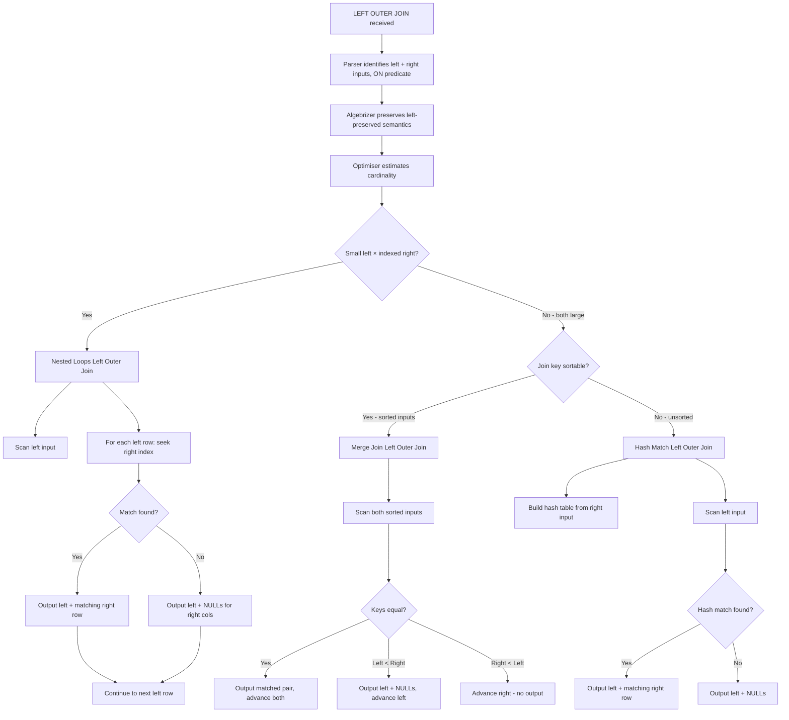
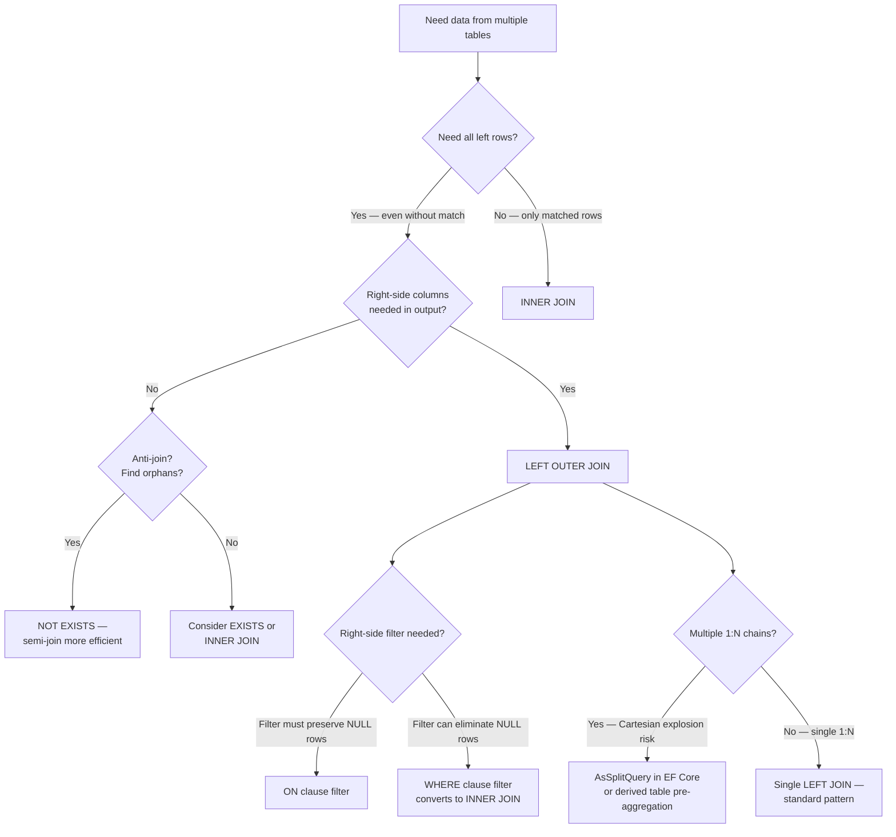

## Navigation

**Domain:** [[8 — Databases]] > **Group:** SQL Joins & Subqueries
**Previous:** [[8.096 — INNER JOIN — Mechanics and Usage]] | **Next:** [[8.098 — RIGHT OUTER JOIN — When to Avoid]]

### Prerequisites

- [[8.096 — INNER JOIN — Mechanics and Usage]] — INNER JOIN semantics are the foundation; LEFT JOIN is identical in syntax but differs in NULL-extension behaviour for non-matching rows, which changes what the WHERE clause can filter.
- [[8.067 — WHERE Clause — Predicate Logic and SARGability]] — The ON clause and WHERE clause have different filtering semantics in outer joins; putting a right-table filter in WHERE instead of ON can silently convert a LEFT JOIN to an INNER JOIN.
- [[8.008 — NULL — Three-Valued Logic and Implications]] — LEFT JOIN NULL-extension produces rows with NULLs on the right side; filtering these with `WHERE rightcol = NULL` (which returns UNKNOWN instead of TRUE) is a classic bug.

### Where This Fits

LEFT OUTER JOIN is the tool for "give me everything from this side, and whatever matches from the other side, even if nothing matches." Every .NET backend engineer hits this daily: loading orders with optional shipping details, customers with or without recent activity, employees with or without managers. The critical failure mode is misunderstanding the ON vs WHERE filtering difference — putting a right-table filter in the WHERE clause turns the LEFT JOIN into an INNER JOIN without warning, because rows that would have been NULL-extended are eliminated after the join. This produces missing data bugs that are hard to detect because they look correct for the rows that do appear. Interviewers probe this exact distinction as the gatekeeper question for "does this candidate actually understand outer joins" — if they cannot explain why `LEFT JOIN ... WHERE rightcol = @val` returns fewer rows than expected, they do not understand the logical query processing order. The interview signal is: can you reason about the difference between filter-in-ON vs filter-in-WHERE for outer joins, can you identify anti-join patterns (`LEFT JOIN ... WHERE rightcol IS NULL`), and can you predict the execution plan operator (Nested Loops Left Outer Join vs Hash Match Left Outer Join) based on index availability.

---

## Core Mental Model

LEFT OUTER JOIN preserves every row from the left input exactly once. For each left row, the engine looks for matching rows in the right input using the ON predicate. If at least one match is found, the left row is paired with each matching right row (as in INNER JOIN). If no match is found, the left row is still emitted — once — with all right-table columns set to NULL. This NULL-extension behaviour is the defining property of an outer join. The logical query processing order is: (1) the join produces all left rows extended with matching right rows or NULLs, then (2) the WHERE clause filters the result set. This means a WHERE predicate on a right-table column that excludes NULLs (`WHERE rightcol = 'Active'`) eliminates the NULL-extended rows, effectively converting the join to an INNER JOIN. The ON clause filter is applied during the join — before NULL-extension — so a right-table predicate in ON still produces the NULL-extended rows but eliminates non-matching right rows. The query optimiser has three physical operators for LEFT JOIN: Nested Loops Left Outer Join (small outer with indexed inner), Hash Match Left Outer Join (large inputs, no useful index), and Merge Join Left Outer Join (both inputs sorted on join key).

### Classification

LEFT OUTER JOIN is a **relational algebra operator** (left outer join) in the `FROM` clause. It is NOT commutative — `A LEFT JOIN B` is fundamentally different from `B LEFT JOIN A`. The optimiser CANNOT reorder outer join inputs arbitrarily without preserving the null-extension semantics. The ON predicate is SARGable on the inner side of a Nested Loops Left Outer Join if an index exists on the inner join column. LEFT JOIN with a right-column IS NULL predicate in WHERE is the canonical anti-join pattern (find left rows with no matching right row).



### Key Properties

|Property|Value|Notes|
|---|---|---|
|NULL matching|Right side NULL-extended when no match|Not UNKNOWN — explicitly NULL|
|Commutative|No|Left-preserved semantics cannot swap|
|Optimiser reordering|Restricted|Must preserve left side preservation|
|Nested Loops complexity|O(N × log M)|Outer N rows × log M inner seeks|
|Hash Match complexity|O(N + M)|Build hash from right (M), probe with left (N)|
|Merge Join complexity|O(N + M)|Single pass with NULL-extension on left < right|
|Anti-join pattern|`LEFT JOIN ... WHERE rightcol IS NULL`|Finds orphans on left side|
|SARGable on inner side|Yes (Nested Loops)|Index Seek per outer row if index exists|
|Write Cost|None|JOINs are read-only operations|

---

## Deep Mechanics

### How the Engine Executes This

1. **Parsing** — The parser identifies the `LEFT OUTER JOIN` or `LEFT JOIN` keyword (both are identical in SQL Server). It splits the FROM clause into the left preserved table and the right optional table. The ON predicate is parsed as a logical expression.

2. **Binding (Algebrizer)** — The algebrizer resolves all column references and records the left-preserved property. It detects that this is an outer join and marks the right-side columns as nullable in the output for the NULL-extension phase. The join graph records that the left side is preserved — the optimiser cannot simply swap left and right.

3. **Simplification** — The optimiser applies logical transformations specific to outer joins:
   - **Predicate pushdown (restricted)**: WHERE predicates on the right table CANNOT be pushed below the join — they would eliminate NULL-extended rows. ON predicates CAN be pushed to the right side input because they apply before NULL-extension.
   - **Outer join to inner join conversion**: If the WHERE clause has any predicate on a right-table column that excludes NULLs (e.g., `WHERE rightcol > 0` or `WHERE rightcol IS NOT NULL`), the optimiser converts the outer join to an INNER JOIN automatically. This is because the NULL-extended rows would be filtered out by the WHERE clause anyway, making the outer join semantically equivalent to an inner join — but more expensive.
   - **Outer join elimination**: If the right table's columns are not referenced in the SELECT or WHERE, the LEFT JOIN may be eliminated.

4. **Physical join operator selection** — The optimiser evaluates three strategies, each with a left-outer variant:

   **Nested Loops Left Outer Join:**
   - Selected when the left input is small and the right input has a useful index on the join column.
   - Execution: scan the left input. For each left row, perform an Index Seek on the right table's join column. If a match is found, output one row per match. If no match, output the left row with NULLs for all right columns.
   - Cost: slightly higher than Nested Loops Inner Join because the engine must track whether at least one match occurred for NULL-extension.
   - The "left outer" variant is identical in structure to the inner variant with an additional NULL-extension step for unmatched rows.

   **Hash Match Left Outer Join:**
   - Selected when both inputs are large and no useful index exists.
   - Execution: build phase — scan the right input and build a hash table keyed on the join column. Probe phase — scan the left input, look up each left row in the hash table. If found, output matched pairs. If not found, output left row with NULLs.
   - Memory: the hash table must fit in memory. If it overflows, it spills to tempdb.
   - Difference from Hash Match Inner: the hash table is built from the RIGHT input (the preserved side is the probe side), and unmatched probes produce NULL-extended output.

   **Merge Join Left Outer Join:**
   - Selected when both inputs are sorted on the join key.
   - Execution: scan both sorted inputs concurrently. Compare keys. If equal, output matched pair and advance both. If left < right, output left row with NULLs and advance left. If right < left, advance right only (right rows without a left match are skipped — LEFT JOIN preserves only left rows, not right rows).
   - Unlike INNER Merge Join, rows in the left input that are less than the current right key are immediately emitted as NULL-extended.

5. **Execution** — The chosen operator runs. For Nested Loops Left Outer, each left row is emitted exactly once (with or without match). For Hash Match Left Outer, the probe phase produces one output row per left row. For Merge Join Left Outer, the left stream drives output — left rows before the current right position are emitted as NULL-extended.

### SQL Visibility

```sql
-- LEFT JOIN: all customers with their orders (customers with no orders still appear)
SELECT c.CustomerId, c.FirstName, c.LastName,
       o.OrderId, o.OrderDate, o.TotalAmount
FROM dbo.Customers AS c
LEFT JOIN dbo.Orders AS o
    ON c.CustomerId = o.CustomerId
ORDER BY c.LastName, o.OrderDate;

-- LEFT JOIN with filter in ON vs WHERE — critical difference
-- Filter in ON: still preserves customers without shipped orders
SELECT c.CustomerId, c.FirstName, c.LastName,
       o.OrderId, o.OrderDate, o.Status
FROM dbo.Customers AS c
LEFT JOIN dbo.Orders AS o
    ON c.CustomerId = o.CustomerId
    AND o.Status = 'Shipped'  -- in ON: right rows filtered BEFORE NULL-extension
ORDER BY c.LastName;

-- Filter in WHERE: silently converts to INNER JOIN
SELECT c.CustomerId, c.FirstName, c.LastName,
       o.OrderId, o.OrderDate, o.Status
FROM dbo.Customers AS c
LEFT JOIN dbo.Orders AS o
    ON c.CustomerId = o.CustomerId
WHERE o.Status = 'Shipped'  -- in WHERE: NULL-extended rows eliminated
ORDER BY c.LastName;
-- Customers with no shipped orders disappear — BUG if intent was to include them

-- Anti-join: find customers who have never placed an order
SELECT c.CustomerId, c.FirstName, c.LastName, c.Email
FROM dbo.Customers AS c
LEFT JOIN dbo.Orders AS o
    ON c.CustomerId = o.CustomerId
WHERE o.OrderId IS NULL
ORDER BY c.LastName;

-- LEFT JOIN with multiple conditions in ON
SELECT e.EmployeeId, e.FirstName, e.LastName,
       o.OrderId, o.OrderDate, o.TotalAmount
FROM dbo.Employees AS e
LEFT JOIN dbo.Orders AS o
    ON e.EmployeeId = o.SalesPersonId
    AND o.OrderDate >= '2024-01-01'
    AND o.Status NOT IN ('Cancelled', 'Returned')
ORDER BY e.LastName;

-- LEFT JOIN with aggregation — count orders per customer including zero
SELECT
    c.CustomerId,
    c.FirstName,
    c.LastName,
    COUNT(o.OrderId) AS OrderCount,
    COALESCE(SUM(o.TotalAmount), 0) AS TotalRevenue,
    MAX(o.OrderDate) AS LastOrderDate
FROM dbo.Customers AS c
LEFT JOIN dbo.Orders AS o
    ON c.CustomerId = o.CustomerId
GROUP BY c.CustomerId, c.FirstName, c.LastName
ORDER BY TotalRevenue DESC;
-- COUNT(o.OrderId) counts non-NULL OrderIds — customers with no orders get 0
-- SUM(NULL) returns NULL, wrapped with COALESCE to show 0

-- LEFT JOIN with derived table
SELECT c.CustomerId, c.FirstName, c.LastName,
       COALESCE(o.OrderCount, 0) AS OrderCount,
       COALESCE(o.TotalRevenue, 0) AS TotalRevenue
FROM dbo.Customers AS c
LEFT JOIN (
    SELECT CustomerId,
           COUNT(*) AS OrderCount,
           SUM(TotalAmount) AS TotalRevenue
    FROM dbo.Orders
    WHERE Status NOT IN ('Cancelled', 'Returned')
    GROUP BY CustomerId
) AS o ON c.CustomerId = o.CustomerId
ORDER BY TotalRevenue DESC;

-- LEFT JOIN with multiple tables — chain preserving left side
SELECT c.CustomerId, c.FirstName, c.LastName,
       o.OrderId, o.OrderDate,
       oi.Quantity, oi.UnitPrice,
       p.ProductName
FROM dbo.Customers AS c
LEFT JOIN dbo.Orders AS o
    ON c.CustomerId = o.CustomerId
LEFT JOIN dbo.OrderItems AS oi
    ON o.OrderId = oi.OrderId
LEFT JOIN dbo.Products AS p
    ON oi.ProductId = p.ProductId
ORDER BY c.LastName, o.OrderDate;
-- Each subsequent LEFT JOIN preserves the entire previous result
-- Customers with no orders: all right cols NULL
-- Orders with no items: oi and p columns NULL
```

```csharp
// EF Core — navigation property Include (equivalent to LEFT JOIN)
var customers = await dbContext.Customers
    .Include(c => c.Orders)
    .Where(c => c.Status == "Active")
    .Select(c => new CustomerOrdersDto
    {
        CustomerId = c.CustomerId,
        FullName = c.FirstName + " " + c.LastName,
        OrderCount = c.Orders.Count,
        TotalRevenue = c.Orders.Sum(o => (decimal?)o.TotalAmount) ?? 0m,
        LastOrderDate = c.Orders.Max(o => (DateTime?)o.OrderDate)
    })
    .ToListAsync(cancellationToken);
// EF Core 6+ generates LEFT JOIN for navigation property on the "one" side
// when the navigation is optional (nullable FK).

// EF Core — explicit GroupJoin (generates LEFT JOIN)
var customerOrders = await dbContext.Customers
    .GroupJoin(
        dbContext.Orders,
        c => c.CustomerId,
        o => o.CustomerId,
        (c, orders) => new
        {
            c.CustomerId,
            c.FirstName,
            c.LastName,
            Orders = orders.DefaultIfEmpty()
        })
    .SelectMany(
        x => x.Orders,
        (c, o) => new
        {
            c.CustomerId,
            c.FirstName,
            c.LastName,
            OrderId = o == null ? (int?)null : o.OrderId,
            OrderDate = o == null ? (DateTime?)null : o.OrderDate,
            TotalAmount = o == null ? (decimal?)null : o.TotalAmount
        })
    .ToListAsync(cancellationToken);

// EF Core — LEFT JOIN with filter in ON (via navigation with Where)
var customersWithShipped = await dbContext.Customers
    .Select(c => new
    {
        c.CustomerId,
        c.FirstName,
        c.LastName,
        ShippedOrders = c.Orders.Where(o => o.Status == "Shipped").ToList()
    })
    .ToListAsync(cancellationToken);
// Generates LEFT JOIN with filter in ON: ON c.CustomerId = o.CustomerId AND o.Status = 'Shipped'
```

**Generated SQL (from EF Core logs) — Navigation property with Count:**

```sql
SELECT [c].[CustomerId], [c].[FirstName], [c].[LastName],
       [c].[Status],
       (
           SELECT COUNT(*)
           FROM [Orders] AS [o]
           WHERE [c].[CustomerId] = [o].[CustomerId]
       ) AS [OrderCount],
       COALESCE((
           SELECT SUM([o].[TotalAmount])
           FROM [Orders] AS [o]
           WHERE [c].[CustomerId] = [o].[CustomerId]
       ), 0.0) AS [TotalRevenue]
FROM [Customers] AS [c]
WHERE [c].[Status] = N'Active'
ORDER BY [c].[LastName];

-- GroupJoin with SelectMany DEFAULTIFEMPTY generates:
SELECT [c].[CustomerId], [c].[FirstName], [c].[LastName],
       [o].[OrderId] AS [OrderId],
       [o].[OrderDate] AS [OrderDate],
       [o].[TotalAmount] AS [TotalAmount]
FROM [Customers] AS [c]
LEFT JOIN [Orders] AS [o]
    ON [c].[CustomerId] = [o].[CustomerId]
ORDER BY [c].[LastName];
```

### Execution Plan Analysis

**Nested Loops Left Outer Join (small Customers, indexed Orders.CustomerId):**

```
  [Clustered Index Scan PK_Customers]             -- outer: 50K rows
  [Index Seek IX_Orders_CustomerId]               -- inner: seek per CustomerId
      Seek Predicate: CustomerId = Customers.CustomerId
  → [Nested Loops Left Outer Join]
      Output: all Customer rows + matched Order rows or NULLs
  → [Sort]                                         -- ORDER BY LastName
  → [SELECT]
Estimated Cost: ~3.5  |  Logical Reads: ~300 (outer 150 + 50K seeks × few pages)
```

**Hash Match Left Outer Join (large Customers, no index on Orders.CustomerId):**

```
  [Clustered Index Scan Orders]                    -- build input: 1M rows
  [Clustered Index Scan Customers]                 -- probe input: 50K rows
  → [Hash Match Left Outer Join]
      Hash Keys: Customers.CustomerId = Orders.CustomerId
      Residual: Probe each CustomerId in hash table
  → [Sort]
  → [SELECT]
Estimated Cost: ~22  |  Logical Reads: ~18,500  |  Memory Grant: ~25 MB
```

**LEFT JOIN converted to INNER JOIN by WHERE filter:**

```
  [Clustered Index Scan PK_Customers]
  [Index Scan IX_Orders_Status] or [Clustered Index Scan Orders]
  → [Hash Match Inner Join] or [Nested Loops Inner Join]
  → [SELECT]
-- Notice: "Left Outer" disappeared from operator name.
-- The optimiser determined that WHERE o.Status = 'Shipped' eliminates NULL-extended rows.
```

**Anti-join pattern (LEFT JOIN ... WHERE rightcol IS NULL):**

```
  [Clustered Index Scan PK_Customers]
  [Index Seek IX_Orders_CustomerId]
  → [Nested Loops Left Outer Join]
  → [Filter] -- WHERE o.OrderId IS NULL
  → [SELECT]
Estimated Cost: ~4.0  |  Logical Reads: ~320
-- Alternative: NOT EXISTS usually produces a more efficient plan with semi-join.
```

### Cost Visibility

```sql
SET STATISTICS IO ON;
SET STATISTICS TIME ON;

-- LEFT JOIN with index on join column (Nested Loops Left Outer)
SELECT c.CustomerId, c.LastName, o.OrderId, o.TotalAmount
FROM dbo.Customers AS c
LEFT JOIN dbo.Orders AS o
    ON c.CustomerId = o.CustomerId
WHERE c.CustomerId BETWEEN 1 AND 100;

-- Expected output (with IX_Orders_CustomerId):
-- Table 'Orders'. Scan count 0, logical reads 200 (100 seeks × ~2 pages each)
-- Table 'Customers'. Scan count 1, logical reads 3 (seek on PK)
-- SQL Server Execution Times: CPU time = 0ms, elapsed time = 2ms

-- LEFT JOIN without index (Hash Match Left Outer)
SELECT c.CustomerId, c.LastName, o.OrderId, o.TotalAmount
FROM dbo.Customers AS c
LEFT JOIN dbo.Orders AS o
    ON c.CustomerId = o.CustomerId;

-- Expected output:
-- Table 'Orders'. Scan count 1, logical reads 12450 (full scan)
-- Table 'Customers'. Scan count 1, logical reads 6100 (full scan)
-- SQL Server Execution Times: CPU time = 90ms, elapsed time = 220ms

-- Anti-join: customers without orders
SELECT c.CustomerId, c.LastName
FROM dbo.Customers AS c
LEFT JOIN dbo.Orders AS o
    ON c.CustomerId = o.CustomerId
WHERE o.OrderId IS NULL;

-- Expected output:
-- Table 'Orders'. Scan count 1, logical reads 12450
-- Table 'Customers'. Scan count 1, logical reads 6100
-- Note: NOT EXISTS would produce lower reads here (semi-join stops at first match)
```

### Failure Modes

**ON vs WHERE filter confusion (the most common outer join bug):** Putting a right-table filter in the WHERE clause instead of ON eliminates the NULL-extended rows, silently converting a LEFT JOIN to an INNER JOIN. The query returns fewer rows than expected, and the bug only manifests for rows that have no match in the right table.

```sql
-- ❌ Wrong: filter in WHERE. Customers without 'Shipped' orders disappear.
SELECT c.CustomerId, c.LastName, o.OrderId, o.Status
FROM dbo.Customers AS c
LEFT JOIN dbo.Orders AS o ON c.CustomerId = o.CustomerId
WHERE o.Status = 'Shipped';

-- ✅ Correct: filter in ON. All customers preserved, matched orders filtered.
SELECT c.CustomerId, c.LastName, o.OrderId, o.Status
FROM dbo.Customers AS c
LEFT JOIN dbo.Orders AS o
    ON c.CustomerId = o.CustomerId
    AND o.Status = 'Shipped';
```

**Counting NULLs in aggregation without COALESCE:** `SUM(o.TotalAmount)` for a customer with no orders returns NULL, not 0. The reporting dashboard shows "Total Revenue: (blank)" instead of "Total Revenue: $0.00".

```sql
-- ❌ Wrong: SUM returns NULL for no-order customers
SELECT c.CustomerId, SUM(o.TotalAmount) AS TotalRevenue FROM dbo.Customers AS c
LEFT JOIN dbo.Orders AS o ON c.CustomerId = o.CustomerId
GROUP BY c.CustomerId;

-- ✅ Correct: COALESCE to convert NULL to 0
SELECT c.CustomerId, COALESCE(SUM(o.TotalAmount), 0) AS TotalRevenue
FROM dbo.Customers AS c
LEFT JOIN dbo.Orders AS o ON c.CustomerId = o.CustomerId
GROUP BY c.CustomerId;
```

**Anti-join with NULL join key:** If the join key itself can be NULL in the left table, the anti-join `LEFT JOIN ... WHERE rightcol IS NULL` may produce false positives because `NULL = NULL` returns UNKNOWN and no match is attempted. A Customers table where CustomerId can be NULL (which should never happen, but does in poorly designed schemas) produces spurious "orphan" rows.

**LEFT JOIN in WHERE NOT IN subquery (NULL trap):** `WHERE CustomerId NOT IN (SELECT CustomerId FROM Orders)` where Orders.CustomerId has NULL values returns zero rows because `NOT IN (1, 2, NULL)` evaluates to UNKNOWN for every row. Use `NOT EXISTS` or `LEFT JOIN ... IS NULL` instead.

Detect with Extended Events or query store for regressed plans:

```sql
-- Find LEFT JOIN queries with high logical reads
SELECT TOP 20
    qs.total_logical_reads / qs.execution_count AS avg_logical_reads,
    qs.execution_count,
    SUBSTRING(st.text, 1, 400) AS query_text
FROM sys.dm_exec_query_stats AS qs
CROSS APPLY sys.dm_exec_sql_text(qs.sql_handle) AS st
WHERE st.text LIKE '%LEFT JOIN%'
ORDER BY avg_logical_reads DESC;
```

---

## Production Patterns and Implementation

### Primary SQL Implementation

```sql
-- ============================================================
-- Schema context (shared across Group 4 notes)
-- ============================================================
CREATE TABLE dbo.Customers
(
    CustomerId   INT            NOT NULL IDENTITY(1,1),
    FirstName    NVARCHAR(100)  NOT NULL,
    LastName     NVARCHAR(100)  NOT NULL,
    Email        NVARCHAR(256)  NOT NULL,
    Phone        VARCHAR(20)    NULL,
    Status       VARCHAR(20)    NOT NULL DEFAULT 'Active',
    Segment      VARCHAR(20)    NOT NULL DEFAULT 'Standard',
    CreatedAt    DATETIME2(0)   NOT NULL DEFAULT SYSUTCDATETIME(),
    CONSTRAINT PK_Customers PRIMARY KEY CLUSTERED (CustomerId)
);

CREATE TABLE dbo.Orders
(
    OrderId       INT            NOT NULL IDENTITY(1,1),
    CustomerId    INT            NOT NULL,
    SalesPersonId INT            NULL,
    OrderDate     DATETIME2(0)   NOT NULL,
    RequiredDate  DATETIME2(0)   NULL,
    ShippedDate   DATETIME2(0)   NULL,
    Status        VARCHAR(20)    NOT NULL DEFAULT 'Pending',
    TotalAmount   DECIMAL(18,2)  NOT NULL,
    ShippingAddr  NVARCHAR(500)  NULL,
    Notes         NVARCHAR(MAX)  NULL,
    CreatedAt     DATETIME2(0)   NOT NULL DEFAULT SYSUTCDATETIME(),
    CONSTRAINT PK_Orders PRIMARY KEY CLUSTERED (OrderId),
    CONSTRAINT FK_Orders_Customers
        FOREIGN KEY (CustomerId) REFERENCES dbo.Customers(CustomerId)
);

CREATE TABLE dbo.OrderItems
(
    OrderItemId  INT            NOT NULL IDENTITY(1,1),
    OrderId      INT            NOT NULL,
    ProductId    INT            NOT NULL,
    Quantity     INT            NOT NULL,
    UnitPrice    DECIMAL(18,2)  NOT NULL,
    DiscountPct  DECIMAL(5,2)   NOT NULL DEFAULT 0,
    CONSTRAINT PK_OrderItems PRIMARY KEY CLUSTERED (OrderItemId),
    CONSTRAINT FK_OrderItems_Orders
        FOREIGN KEY (OrderId) REFERENCES dbo.Orders(OrderId)
);

CREATE TABLE dbo.Products
(
    ProductId    INT            NOT NULL IDENTITY(1,1),
    ProductName  NVARCHAR(200)  NOT NULL,
    CategoryId   INT            NOT NULL,
    UnitPrice    DECIMAL(18,2)  NOT NULL,
    Discontinued BIT            NOT NULL DEFAULT 0,
    CONSTRAINT PK_Products PRIMARY KEY CLUSTERED (ProductId)
);

CREATE TABLE dbo.Employees
(
    EmployeeId   INT            NOT NULL IDENTITY(1,1),
    FirstName    NVARCHAR(100)  NOT NULL,
    LastName     NVARCHAR(100)  NOT NULL,
    ManagerId    INT            NULL,
    HireDate     DATE           NOT NULL,
    CONSTRAINT PK_Employees PRIMARY KEY CLUSTERED (EmployeeId),
    CONSTRAINT FK_Employees_Manager
        FOREIGN KEY (ManagerId) REFERENCES dbo.Employees(EmployeeId)
);

CREATE TABLE dbo.DateDim
(
    DateKey       INT           NOT NULL,
    FullDate      DATE          NOT NULL,
    Year          SMALLINT      NOT NULL,
    Quarter       TINYINT       NOT NULL,
    Month         TINYINT       NOT NULL,
    Day           TINYINT       NOT NULL,
    DayOfWeek     TINYINT       NOT NULL,
    IsWeekend     BIT           NOT NULL,
    IsHoliday     BIT           NOT NULL,
    CONSTRAINT PK_DateDim PRIMARY KEY CLUSTERED (DateKey)
);

-- Indexes for join performance
CREATE INDEX IX_Orders_CustomerId ON dbo.Orders (CustomerId)
    INCLUDE (OrderDate, Status, TotalAmount, ShippedDate);
CREATE INDEX IX_Orders_SalesPersonId ON dbo.Orders (SalesPersonId)
    INCLUDE (OrderDate, Status, TotalAmount);
CREATE INDEX IX_OrderItems_OrderId ON dbo.OrderItems (OrderId)
    INCLUDE (ProductId, Quantity, UnitPrice, DiscountPct);
CREATE INDEX IX_OrderItems_ProductId ON dbo.OrderItems (ProductId);
CREATE INDEX IX_Products_CategoryId ON dbo.Products (CategoryId);
CREATE INDEX IX_Employees_ManagerId ON dbo.Employees (ManagerId);

-- ============================================================
-- Pattern 1: Standard LEFT JOIN — customers with optional orders
-- ============================================================
SELECT c.CustomerId, c.FirstName, c.LastName,
       o.OrderId, o.OrderDate, o.Status, o.TotalAmount
FROM dbo.Customers AS c
LEFT JOIN dbo.Orders AS o
    ON c.CustomerId = o.CustomerId
WHERE c.Segment = 'Premium'
ORDER BY c.LastName, o.OrderDate DESC;

-- ============================================================
-- Pattern 2: LEFT JOIN with filter in ON — row-constrained right side
-- ============================================================
-- Find all premium customers, showing only 2024 shipped orders
-- Customers with no 2024 shipped orders still appear (with NULLs)
SELECT c.CustomerId, c.FirstName, c.LastName,
       o.OrderId, o.OrderDate, o.Status, o.TotalAmount
FROM dbo.Customers AS c
LEFT JOIN dbo.Orders AS o
    ON c.CustomerId = o.CustomerId
    AND o.OrderDate >= '2024-01-01'
    AND o.OrderDate < '2025-01-01'
    AND o.Status = 'Shipped'
WHERE c.Segment = 'Premium'
ORDER BY c.LastName, o.OrderDate;

-- ============================================================
-- Pattern 3: Anti-join — customers with no orders ever
-- ============================================================
SELECT c.CustomerId, c.FirstName, c.LastName, c.Email, c.CreatedAt
FROM dbo.Customers AS c
LEFT JOIN dbo.Orders AS o
    ON c.CustomerId = o.CustomerId
WHERE o.OrderId IS NULL
ORDER BY c.CreatedAt DESC;
-- Typically 2-5% of customers have never ordered in healthy e-commerce

-- ============================================================
-- Pattern 4: LEFT JOIN with aggregation — zero-safe counts
-- ============================================================
SELECT
    c.CustomerId,
    c.FirstName + ' ' + c.LastName AS CustomerName,
    c.Segment,
    COUNT(o.OrderId) AS TotalOrders,
    COALESCE(SUM(o.TotalAmount), 0) AS LifetimeValue,
    COALESCE(SUM(CASE WHEN o.Status = 'Shipped' THEN o.TotalAmount END), 0) AS ShippedRevenue,
    MIN(o.OrderDate) AS FirstOrderDate,
    MAX(o.OrderDate) AS LastOrderDate,
    DATEDIFF(day,
        MAX(o.OrderDate),
        GETUTCDATE()
    ) AS DaysSinceLastOrder
FROM dbo.Customers AS c
LEFT JOIN dbo.Orders AS o
    ON c.CustomerId = o.CustomerId
WHERE c.Status = 'Active'
GROUP BY c.CustomerId, c.FirstName, c.LastName, c.Segment
ORDER BY LifetimeValue DESC;

-- ============================================================
-- Pattern 5: Chained LEFT JOINs — multiple optional tables
-- ============================================================
SELECT
    c.CustomerId,
    c.FirstName + ' ' + c.LastName AS CustomerName,
    o.OrderId,
    o.OrderDate,
    o.Status,
    oi.OrderItemId,
    oi.Quantity,
    oi.UnitPrice,
    p.ProductName,
    p.CategoryId
FROM dbo.Customers AS c
LEFT JOIN dbo.Orders AS o
    ON c.CustomerId = o.CustomerId
LEFT JOIN dbo.OrderItems AS oi
    ON o.OrderId = oi.OrderId
LEFT JOIN dbo.Products AS p
    ON oi.ProductId = p.ProductId
WHERE c.Segment = 'Premium'
ORDER BY c.LastName, o.OrderDate, oi.OrderItemId;
-- Customers with no orders: all right columns NULL
-- Orders with no items: oi and p columns NULL
-- Products with missing ProductId: p columns NULL

-- ============================================================
-- Pattern 6: LEFT JOIN with DateDim for sparse data
-- ============================================================
-- Show daily order counts including days with zero orders
SELECT
    d.FullDate,
    d.DayOfWeek,
    COUNT(o.OrderId) AS OrderCount,
    COALESCE(SUM(o.TotalAmount), 0) AS DailyRevenue
FROM dbo.DateDim AS d
LEFT JOIN dbo.Orders AS o
    ON CAST(o.OrderDate AS DATE) = d.FullDate
WHERE d.FullDate >= '2024-01-01'
  AND d.FullDate < '2024-02-01'
GROUP BY d.FullDate, d.DayOfWeek
ORDER BY d.FullDate;

-- ============================================================
-- Pattern 7: LEFT JOIN with DISTINCT — reduce duplicates from 1:N
-- ============================================================
-- Get customers with their first order date (avoid row multiplication)
SELECT DISTINCT
    c.CustomerId,
    c.FirstName,
    c.LastName,
    FIRST_VALUE(o.OrderDate) OVER (
        PARTITION BY c.CustomerId
        ORDER BY o.OrderDate
    ) AS FirstOrderDate,
    COUNT(o.OrderId) OVER (PARTITION BY c.CustomerId) AS TotalOrders
FROM dbo.Customers AS c
LEFT JOIN dbo.Orders AS o
    ON c.CustomerId = o.CustomerId
WHERE c.Status = 'Active'
ORDER BY c.LastName;

-- ============================================================
-- Pattern 8: Self-LEFT JOIN — employee hierarchy including CEO
-- ============================================================
SELECT
    e.EmployeeId,
    e.FirstName + ' ' + e.LastName AS EmployeeName,
    m.FirstName + ' ' + m.LastName AS ManagerName
FROM dbo.Employees AS e
LEFT JOIN dbo.Employees AS m
    ON e.ManagerId = m.EmployeeId
ORDER BY e.LastName;
-- CEO (ManagerId IS NULL) included because LEFT JOIN preserves left rows
-- INNER JOIN would exclude the CEO
```

### EF Core Implementation

```csharp
public class ApplicationDbContext : DbContext
{
    public DbSet<Customer> Customers => Set<Customer>();
    public DbSet<Order> Orders => Set<Order>();
    public DbSet<OrderItem> OrderItems => Set<OrderItem>();
    public DbSet<Product> Products => Set<Product>();
    public DbSet<Employee> Employees => Set<Employee>();
    public DbSet<DateDim> DateDim => Set<DateDim>();

    protected override void OnModelCreating(ModelBuilder modelBuilder)
    {
        modelBuilder.Entity<Customer>(entity =>
        {
            entity.ToTable("Customers");
            entity.HasKey(c => c.CustomerId);
            entity.Property(c => c.FirstName).HasMaxLength(100);
            entity.Property(c => c.LastName).HasMaxLength(100);
            entity.Property(c => c.Email).HasMaxLength(256);
            entity.Property(c => c.Phone).HasMaxLength(20);
            entity.Property(c => c.Status).HasMaxLength(20).HasDefaultValue("Active");
            entity.Property(c => c.Segment).HasMaxLength(20).HasDefaultValue("Standard");
            entity.Property(c => c.CreatedAt).HasDefaultValueSql("SYSUTCDATETIME()");
        });

        modelBuilder.Entity<Order>(entity =>
        {
            entity.ToTable("Orders");
            entity.HasKey(o => o.OrderId);
            entity.Property(o => o.Status).HasMaxLength(20);
            entity.Property(o => o.TotalAmount).HasColumnType("decimal(18,2)");
            entity.Property(o => o.CreatedAt).HasDefaultValueSql("SYSUTCDATETIME()");

            entity.HasOne(o => o.Customer)
                  .WithMany(c => c.Orders)
                  .HasForeignKey(o => o.CustomerId)
                  .OnDelete(DeleteBehavior.Cascade);

            entity.HasOne(o => o.SalesPerson)
                  .WithMany()
                  .HasForeignKey(o => o.SalesPersonId)
                  .OnDelete(DeleteBehavior.SetNull);

            entity.HasIndex(o => o.CustomerId);
            entity.HasIndex(o => o.SalesPersonId);
        });

        modelBuilder.Entity<OrderItem>(entity =>
        {
            entity.ToTable("OrderItems");
            entity.HasKey(oi => oi.OrderItemId);
            entity.Property(oi => oi.UnitPrice).HasColumnType("decimal(18,2)");
            entity.Property(oi => oi.DiscountPct).HasColumnType("decimal(5,2)");
        });

        modelBuilder.Entity<Product>(entity =>
        {
            entity.ToTable("Products");
            entity.HasKey(p => p.ProductId);
            entity.Property(p => p.ProductName).HasMaxLength(200);
            entity.Property(p => p.UnitPrice).HasColumnType("decimal(18,2)");
        });

        modelBuilder.Entity<Employee>(entity =>
        {
            entity.ToTable("Employees");
            entity.HasKey(e => e.EmployeeId);
            entity.Property(e => e.FirstName).HasMaxLength(100);
            entity.Property(e => e.LastName).HasMaxLength(100);

            entity.HasOne(e => e.Manager)
                  .WithMany()
                  .HasForeignKey(e => e.ManagerId);
        });
    }
}

public class Customer
{
    public int CustomerId { get; set; }
    public string FirstName { get; set; } = string.Empty;
    public string LastName { get; set; } = string.Empty;
    public string Email { get; set; } = string.Empty;
    public string? Phone { get; set; }
    public string Status { get; set; } = "Active";
    public string Segment { get; set; } = "Standard";
    public DateTime CreatedAt { get; set; }
    public ICollection<Order> Orders { get; set; } = new List<Order>();
}

public class Order
{
    public int OrderId { get; set; }
    public int CustomerId { get; set; }
    public int? SalesPersonId { get; set; }
    public DateTime OrderDate { get; set; }
    public DateTime? RequiredDate { get; set; }
    public DateTime? ShippedDate { get; set; }
    public string Status { get; set; } = "Pending";
    public decimal TotalAmount { get; set; }
    public string? ShippingAddr { get; set; }
    public string? Notes { get; set; }
    public DateTime CreatedAt { get; set; }
    public Customer Customer { get; set; } = null!;
    public Employee? SalesPerson { get; set; }
    public ICollection<OrderItem> OrderItems { get; set; } = new List<OrderItem>();
}

public class OrderItem
{
    public int OrderItemId { get; set; }
    public int OrderId { get; set; }
    public int ProductId { get; set; }
    public int Quantity { get; set; }
    public decimal UnitPrice { get; set; }
    public decimal DiscountPct { get; set; }
    public Order Order { get; set; } = null!;
    public Product Product { get; set; } = null!;
}

public class Product
{
    public int ProductId { get; set; }
    public string ProductName { get; set; } = string.Empty;
    public int CategoryId { get; set; }
    public decimal UnitPrice { get; set; }
    public bool Discontinued { get; set; }
}

public class Employee
{
    public int EmployeeId { get; set; }
    public string FirstName { get; set; } = string.Empty;
    public string LastName { get; set; } = string.Empty;
    public int? ManagerId { get; set; }
    public DateTime HireDate { get; set; }
    public Employee? Manager { get; set; }
}

public class DateDim
{
    public int DateKey { get; set; }
    public DateTime FullDate { get; set; }
    public short Year { get; set; }
    public byte Quarter { get; set; }
    public byte Month { get; set; }
    public byte Day { get; set; }
    public byte DayOfWeek { get; set; }
    public bool IsWeekend { get; set; }
    public bool IsHoliday { get; set; }
}

// Pattern 1: LEFT JOIN via navigation property (Include)
public async Task<List<CustomerOrdersDto>> GetPremiumCustomerOrdersAsync(
    CancellationToken cancellationToken = default)
{
    return await dbContext.Customers
        .Where(c => c.Segment == "Premium")
        .Include(c => c.Orders)
        .Select(c => new CustomerOrdersDto
        {
            CustomerId = c.CustomerId,
            FullName = c.FirstName + " " + c.LastName,
            Orders = c.Orders.Select(o => new OrderSummaryDto
            {
                OrderId = o.OrderId,
                OrderDate = o.OrderDate,
                Status = o.Status,
                TotalAmount = o.TotalAmount
            }).ToList()
        })
        .AsSplitQuery()  // <-- prevents Cartesian explosion from Include
        .ToListAsync(cancellationToken);
    // Generated: multiple LEFT JOINs (one per navigation)
}

// Pattern 2: GroupJoin with DefaultIfEmpty (explicit LEFT JOIN)
public async Task<List<CustomerOrderCountDto>> GetCustomerOrderCountsAsync(
    CancellationToken cancellationToken = default)
{
    return await dbContext.Customers
        .GroupJoin(
            dbContext.Orders,
            c => c.CustomerId,
            o => o.CustomerId,
            (c, orders) => new { c, orders })
        .SelectMany(
            x => x.orders.DefaultIfEmpty(),
            (x, o) => new CustomerOrderCountDto
            {
                CustomerId = x.c.CustomerId,
                FullName = x.c.FirstName + " " + x.c.LastName,
                OrderCount = x.c.Orders.Count,
                TotalRevenue = x.c.Orders.Sum(o2 => (decimal?)o2.TotalAmount) ?? 0m
            })
        .ToListAsync(cancellationToken);
    // Generated: LEFT JOIN with NULL-extension via DefaultIfEmpty
}

// Pattern 3: Anti-join — customers without orders
public async Task<List<CustomerDto>> GetInactiveCustomersAsync(
    CancellationToken cancellationToken = default)
{
    return await dbContext.Customers
        .GroupJoin(
            dbContext.Orders,
            c => c.CustomerId,
            o => o.CustomerId,
            (c, orders) => new { c, orders })
        .SelectMany(
            x => x.orders.DefaultIfEmpty(),
            (x, o) => new { x.c, OrderId = (int?)o.OrderId })
        .Where(x => x.OrderId == null)
        .Select(x => new CustomerDto
        {
            CustomerId = x.c.CustomerId,
            FullName = x.c.FirstName + " " + x.c.LastName,
            Email = x.c.Email
        })
        .ToListAsync(cancellationToken);
    // Better: use !Any() which generates NOT EXISTS (more efficient)
}

// Pattern 4: LEFT JOIN with filter in ON via navigation Where
public async Task<List<CustomerOrderDto>> GetCustomersWithShippedOrdersAsync(
    CancellationToken cancellationToken = default)
{
    return await dbContext.Customers
        .Select(c => new CustomerOrderDto
        {
            CustomerId = c.CustomerId,
            FullName = c.FirstName + " " + c.LastName,
            ShippedOrders = c.Orders
                .Where(o => o.Status == "Shipped"
                    && o.OrderDate >= new DateTime(2024, 1, 1))
                .Select(o => new OrderSummaryDto
                {
                    OrderId = o.OrderId,
                    OrderDate = o.OrderDate,
                    TotalAmount = o.TotalAmount
                })
                .ToList()
        })
        .ToListAsync(cancellationToken);
    // Generated: LEFT JOIN with filter in ON (not WHERE)
}

// Pattern 5: Self-LEFT JOIN via navigation
public async Task<List<EmployeeManagerDto>> GetAllEmployeesWithManagerAsync(
    CancellationToken cancellationToken = default)
{
    return await dbContext.Employees
        .Select(e => new EmployeeManagerDto
        {
            EmployeeId = e.EmployeeId,
            EmployeeName = e.FirstName + " " + e.LastName,
            ManagerName = e.Manager == null
                ? "No Manager (CEO)"
                : e.Manager.FirstName + " " + e.Manager.LastName
        })
        .OrderBy(e => e.EmployeeName)
        .ToListAsync(cancellationToken);
    // Generated: LEFT JOIN Employees ON e.ManagerId = Employees.EmployeeId
    // CEO included because LEFT JOIN preserves left rows
}
```

### Dapper Implementation

```csharp
public sealed class OrderRepository
{
    private readonly IDbConnectionFactory _connectionFactory;

    public OrderRepository(IDbConnectionFactory connectionFactory)
        => _connectionFactory = connectionFactory;

    // Pattern 1: Standard LEFT JOIN with multi-mapping
    public async Task<IReadOnlyList<CustomerOrdersDto>> GetPremiumCustomerOrdersAsync(
        CancellationToken cancellationToken = default)
    {
        const string sql = @"
            SELECT c.CustomerId, c.FirstName, c.LastName, c.Email,
                   o.OrderId, o.OrderDate, o.Status, o.TotalAmount
            FROM dbo.Customers AS c
            LEFT JOIN dbo.Orders AS o
                ON c.CustomerId = o.CustomerId
            WHERE c.Segment = 'Premium'
            ORDER BY c.LastName, o.OrderDate;";

        await using var connection = _connectionFactory.Create();

        var customerLookup = new Dictionary<int, CustomerOrdersDto>();

        var results = await connection.QueryAsync<CustomerOrdersDto, OrderSummaryDto, CustomerOrdersDto>(
            new CommandDefinition(sql, cancellationToken: cancellationToken),
            (customer, order) =>
            {
                if (!customerLookup.TryGetValue(customer.CustomerId, out var dto))
                {
                    dto = customer with { Orders = new List<OrderSummaryDto>() };
                    customerLookup.Add(customer.CustomerId, dto);
                }
                if (order != null && order.OrderId != 0)
                {
                    dto.Orders.Add(order);
                }
                return dto;
            },
            splitOn: "OrderId");

        return results.Distinct().ToList().AsReadOnly();
    }

    // Pattern 2: Anti-join — customers without orders
    public async Task<IReadOnlyList<CustomerDto>> GetInactiveCustomersAsync(
        CancellationToken cancellationToken = default)
    {
        const string sql = @"
            SELECT c.CustomerId, c.FirstName, c.LastName, c.Email, c.CreatedAt
            FROM dbo.Customers AS c
            LEFT JOIN dbo.Orders AS o
                ON c.CustomerId = o.CustomerId
            WHERE o.OrderId IS NULL
            ORDER BY c.CreatedAt DESC;";

        await using var connection = _connectionFactory.Create();

        var results = await connection.QueryAsync<CustomerDto>(
            new CommandDefinition(sql, cancellationToken: cancellationToken));

        return results.AsList();
    }

    // Pattern 3: LEFT JOIN with aggregation
    public async Task<IReadOnlyList<CustomerRevenueDto>> GetCustomerRevenueAsync(
        CancellationToken cancellationToken = default)
    {
        const string sql = @"
            SELECT
                c.CustomerId,
                c.FirstName + ' ' + c.LastName AS CustomerName,
                c.Segment,
                COUNT(o.OrderId) AS OrderCount,
                COALESCE(SUM(o.TotalAmount), 0) AS TotalRevenue,
                MIN(o.OrderDate) AS FirstOrderDate,
                MAX(o.OrderDate) AS LastOrderDate
            FROM dbo.Customers AS c
            LEFT JOIN dbo.Orders AS o
                ON c.CustomerId = o.CustomerId
            WHERE c.Status = 'Active'
            GROUP BY c.CustomerId, c.FirstName, c.LastName, c.Segment
            ORDER BY TotalRevenue DESC;";

        await using var connection = _connectionFactory.Create();

        var results = await connection.QueryAsync<CustomerRevenueDto>(
            new CommandDefinition(sql, cancellationToken: cancellationToken));

        return results.AsList();
    }

    // Pattern 4: Chained LEFT JOINs
    public async Task<IReadOnlyList<OrderDetailDto>> GetPremiumCustomerOrderDetailsAsync(
        CancellationToken cancellationToken = default)
    {
        const string sql = @"
            SELECT
                c.CustomerId, c.FirstName, c.LastName,
                o.OrderId, o.OrderDate, o.Status,
                oi.OrderItemId, oi.Quantity, oi.UnitPrice,
                p.ProductName
            FROM dbo.Customers AS c
            LEFT JOIN dbo.Orders AS o
                ON c.CustomerId = o.CustomerId
            LEFT JOIN dbo.OrderItems AS oi
                ON o.OrderId = oi.OrderId
            LEFT JOIN dbo.Products AS p
                ON oi.ProductId = p.ProductId
            WHERE c.Segment = 'Premium'
            ORDER BY c.LastName, o.OrderDate, oi.OrderItemId;";

        await using var connection = _connectionFactory.Create();

        var lookup = new Dictionary<string, OrderDetailDto>();

        var results = await connection.QueryAsync<OrderDetailDto, OrderSummaryDto, OrderItemDto, ProductDto, OrderDetailDto>(
            new CommandDefinition(sql, cancellationToken: cancellationToken),
            (customer, order, item, product) =>
            {
                var key = $"{customer.CustomerId}-{order?.OrderId}";
                if (!lookup.TryGetValue(key, out var dto))
                {
                    dto = customer with
                    {
                        Orders = new List<OrderDetailDto.OrderSummary>()
                    };
                    lookup.Add(key, dto);
                }
                return dto;
            },
            splitOn: "OrderId,OrderItemId,ProductId");

        return results.Distinct().ToList().AsReadOnly();
    }
}

public record CustomerOrdersDto(
    int CustomerId, string FirstName, string LastName, string Email,
    List<OrderSummaryDto>? Orders = null);

public record OrderSummaryDto(
    int OrderId, DateTime OrderDate, string Status, decimal TotalAmount);

public record CustomerOrderCountDto(
    int CustomerId, string FullName, int OrderCount, decimal TotalRevenue);

public record CustomerRevenueDto(
    int CustomerId, string CustomerName, string Segment,
    int OrderCount, decimal TotalRevenue,
    DateTime? FirstOrderDate, DateTime? LastOrderDate);

public record CustomerDto(
    int CustomerId, string FirstName, string LastName,
    string Email, DateTime CreatedAt);

public record EmployeeManagerDto(
    int EmployeeId, string EmployeeName, string ManagerName);
```

### Configuration and Wiring

```csharp
// Program.cs — DbContext registration with query splitting
builder.Services.AddDbContext<ApplicationDbContext>(options =>
    options.UseSqlServer(
        builder.Configuration.GetConnectionString("DefaultConnection"),
        sqlOptions =>
        {
            sqlOptions.EnableRetryOnFailure(3);
            sqlOptions.CommandTimeout(60);
            sqlOptions.UseQuerySplittingBehavior(QuerySplittingBehavior.SplitQuery);
        }));

// Dapper connection factory
builder.Services.AddSingleton<IDbConnectionFactory, SqlConnectionFactory>();
builder.Services.AddScoped<OrderRepository>();

public interface IDbConnectionFactory
{
    IDbConnection Create();
}

public sealed class SqlConnectionFactory : IDbConnectionFactory
{
    private readonly string _connectionString;

    public SqlConnectionFactory(string connectionString)
        => _connectionString = connectionString;

    public IDbConnection Create()
    {
        var connection = new SqlConnection(_connectionString);
        connection.Open();
        return connection;
    }
}
```

### SQL Server vs PostgreSQL Differences

```sql
-- PostgreSQL: LEFT JOIN syntax is identical
SELECT c.customer_id, c.first_name, c.last_name,
       o.order_id, o.order_date, o.total_amount
FROM customers AS c
LEFT JOIN orders AS o
    ON c.customer_id = o.customer_id
ORDER BY c.last_name, o.order_date;

-- PostgreSQL: LEFT JOIN with filter in ON (same behavior)
SELECT c.customer_id, c.first_name, c.last_name,
       o.order_id, o.order_date, o.status
FROM customers AS c
LEFT JOIN orders AS o
    ON c.customer_id = o.customer_id
    AND o.status = 'Shipped'
ORDER BY c.last_name;

-- PostgreSQL: anti-join (same)
SELECT c.customer_id, c.first_name, c.last_name
FROM customers AS c
LEFT JOIN orders AS o
    ON c.customer_id = o.customer_id
WHERE o.order_id IS NULL;

-- PostgreSQL: FULL JOIN available (same)
SELECT c.customer_id, o.order_id
FROM customers AS c
FULL JOIN orders AS o ON c.customer_id = o.customer_id;

-- PostgreSQL does NOT have query splitting like EF Core
-- Use LIMIT/OFFSET pagination with JOIN carefully to avoid re-scanning
```

---

## Gotchas and Production Pitfalls

### 1. ON vs WHERE Filter Confusion

**Pitfall:** Engineer puts a right-table filter in the WHERE clause instead of ON, expecting NULL-extended rows to be preserved.

```sql
-- ❌ Wrong: filter in WHERE eliminates NULL-extended rows
SELECT c.CustomerId, c.LastName, o.OrderId, o.Status
FROM dbo.Customers AS c
LEFT JOIN dbo.Orders AS o
    ON c.CustomerId = o.CustomerId
WHERE o.Status = 'Shipped';
-- Returns ONLY customers with shipped orders — NULL-extended rows removed by WHERE
```

**Symptom:** Missing rows in reports. Customers without shipped orders disappear entirely. The bug is silent — the rows that do appear are correct, so the engineer may not notice for months. A BI dashboard shows "Total Customers with Shipped Orders" instead of "All Customers."

**Fix:**

```sql
-- ✅ Correct: filter in ON preserves all customers
SELECT c.CustomerId, c.LastName, o.OrderId, o.Status
FROM dbo.Customers AS c
LEFT JOIN dbo.Orders AS o
    ON c.CustomerId = o.CustomerId
    AND o.Status = 'Shipped';
```

**Cost of not fixing:** Incorrect business reporting. E.g., "We think only 30% of customers have placed an order" because the query silently drops customers without shipped orders. Dashboard users make wrong strategic decisions based on incomplete data. In production, this can result in missed revenue opportunity analysis.

### 2. Counting NULLs in Aggregation

**Pitfall:** Using `SUM(o.TotalAmount)` or `AVG(o.TotalAmount)` without accounting for NULL returns from customers with no orders.

```sql
-- ❌ Wrong: SUM returns NULL for no-order customers
SELECT c.CustomerId, c.LastName,
       COUNT(o.OrderId) AS OrderCount,
       SUM(o.TotalAmount) AS TotalRevenue,
       AVG(o.TotalAmount) AS AvgOrderValue
FROM dbo.Customers AS c
LEFT JOIN dbo.Orders AS o
    ON c.CustomerId = o.CustomerId
GROUP BY c.CustomerId, c.LastName;
-- TotalRevenue is NULL for no-order customers, not 0
-- AvgOrderValue is NULL, not 0
```

**Symptom:** Application code crashes when de-serialising NULL into a non-nullable decimal field. The API returns `"TotalRevenue": null` instead of `0.00`. Front-end charts show "no data" for customers who simply have no orders.

**Fix:**

```sql
-- ✅ Correct: COALESCE to convert NULL to 0 for sum/avg
SELECT c.CustomerId, c.LastName,
       COUNT(o.OrderId) AS OrderCount,
       COALESCE(SUM(o.TotalAmount), 0) AS TotalRevenue,
       COALESCE(AVG(o.TotalAmount), 0) AS AvgOrderValue
FROM dbo.Customers AS c
LEFT JOIN dbo.Orders AS o
    ON c.CustomerId = o.CustomerId
GROUP BY c.CustomerId, c.LastName;
```

**Cost of not fixing:** Production errors in .NET — `InvalidOperationException: Cannot cast NULL to decimal` when mapping to non-nullable `decimal` properties. Requires hotfix deployment at 2 AM.

### 3. LEFT JOIN with NOT IN Subquery (NULL Trap)

**Pitfall:** Using `WHERE CustomerId NOT IN (SELECT CustomerId FROM Orders)` to find customers without orders. If `Orders.CustomerId` has any NULL value, the entire query returns zero rows.

```sql
-- ❌ Wrong: returns zero rows if ANY row in Orders has NULL CustomerId
SELECT c.CustomerId, c.LastName
FROM dbo.Customers AS c
WHERE c.CustomerId NOT IN (SELECT CustomerId FROM dbo.Orders);
-- NOT IN (1, 2, NULL) evaluates to UNKNOWN for every row
```

**Symptom:** A report that should show customers without orders returns zero rows. The engineer spends hours debugging, eventually finding that one orphaned Order row has NULL CustomerId. The bug only manifests when the right table contains NULLs in the join column — a condition that may not exist in development but appears in production after data migration.

**Fix:**

```sql
-- ✅ Fix 1: LEFT JOIN anti-join
SELECT c.CustomerId, c.LastName
FROM dbo.Customers AS c
LEFT JOIN dbo.Orders AS o
    ON c.CustomerId = o.CustomerId
WHERE o.OrderId IS NULL;

-- ✅ Fix 2: NOT EXISTS (preferred — semi-join is more efficient)
SELECT c.CustomerId, c.LastName
FROM dbo.Customers AS c
WHERE NOT EXISTS (SELECT 1 FROM dbo.Orders AS o
                   WHERE o.CustomerId = c.CustomerId);

-- ✅ Fix 3: NOT IN with explicit NULL exclusion (less elegant)
SELECT c.CustomerId, c.LastName
FROM dbo.Customers AS c
WHERE c.CustomerId NOT IN (
    SELECT CustomerId FROM dbo.Orders WHERE CustomerId IS NOT NULL
);
```

**Cost of not fixing:** Invisible data loss. The marketing team sends "reactivation" emails only to customers who already have orders, while the dormant customers who should receive the campaign are ignored. Leads to wasted marketing budget and missed re-engagement opportunities.

### 4. Cartesian Explosion from Chained LEFT JOINs

**Pitfall:** Chaining multiple LEFT JOINs where intermediate 1:N relationships produce row multiplication, causing unexpectedly large result sets.

```sql
-- ❌ Wrong: 1 Customer → 100 Orders → 500 OrderItems = 50,000 result rows
SELECT c.CustomerId, c.LastName,
       o.OrderId, o.OrderDate,
       oi.OrderItemId, oi.Quantity, oi.UnitPrice,
       p.ProductName
FROM dbo.Customers AS c
LEFT JOIN dbo.Orders AS o
    ON c.CustomerId = o.CustomerId
LEFT JOIN dbo.OrderItems AS oi
    ON o.OrderId = oi.OrderId
LEFT JOIN dbo.Products AS p
    ON oi.ProductId = p.ProductId;
```

**Symptom:** The application loads 50,000 rows into memory for 100 customers. Memory pressure on the web server. HTTP timeout after 30 seconds. The query itself may complete in the database, but the data transfer and client-side processing cause the failure.

**Fix:**

```sql
-- ✅ Fix 1: Use EF Core AsSplitQuery to generate separate queries
-- .AsSplitQuery() generates one query per Include level with key-based correlation

-- ✅ Fix 2: Aggregate before joining (derived table)
SELECT c.CustomerId, c.LastName,
       COALESCE(o.OrderCount, 0) AS OrderCount,
       COALESCE(o.TotalRevenue, 0) AS TotalRevenue
FROM dbo.Customers AS c
LEFT JOIN (
    SELECT CustomerId,
           COUNT(*) AS OrderCount,
           SUM(TotalAmount) AS TotalRevenue
    FROM dbo.Orders
    GROUP BY CustomerId
) AS o ON c.CustomerId = o.CustomerId;

-- ✅ Fix 3: Use Dapper multi-mapping with dictionary lookup
-- (shown in Dapper implementation above)
```

**Cost of not fixing:** Application timeouts. Memory exhaustion in the web server process. In .NET, an `OutOfMemoryException` in production that requires an IIS/process recycle. Customer-facing pages fail with HTTP 500.

### 5. LEFT JOIN with OR in ON Clause

**Pitfall:** Using OR in the ON clause of a LEFT JOIN, which prevents Nested Loops join and forces a scan + hash match.

```sql
-- ❌ Wrong: OR prevents index seek on either condition
SELECT c.CustomerId, c.LastName, o.OrderId, o.TotalAmount
FROM dbo.Customers AS c
LEFT JOIN dbo.Orders AS o
    ON o.SalesPersonId = c.CustomerId  -- can use index
    OR o.CustomerId = c.CustomerId;    -- can use index, but OR prevents both
```

**Symptom:** Hash Match Left Outer Join with full scans instead of Nested Loops with seeks. Logical reads jump from ~300 to ~18,500 for 50K customers and 1M orders.

**Fix:**

```sql
-- ✅ Fix: Split into two LEFT JOINs with COALESCE
SELECT c.CustomerId, c.LastName,
       COALESCE(o1.OrderId, o2.OrderId) AS OrderId,
       COALESCE(o1.TotalAmount, o2.TotalAmount) AS TotalAmount
FROM dbo.Customers AS c
LEFT JOIN dbo.Orders AS o1
    ON o1.SalesPersonId = c.CustomerId
LEFT JOIN dbo.Orders AS o2
    ON o2.CustomerId = c.CustomerId
    AND o2.SalesPersonId IS DISTINCT FROM c.CustomerId;
```

**Cost of not fixing:** 60x increase in logical reads. Each query that uses this pattern consumes unnecessary memory grants and CPU. Under moderate load (50 concurrent users), this causes blocking chain and PAGELATCH contention in tempdb.

### 6. EF Core Filtered Include Generates Separate Queries

**Pitfall:** Using `Include(c => c.Orders.Where(o => o.Status == "Shipped"))` in EF Core without understanding that this generates a separate query (or uses `AsSplitQuery`), and the WHERE filter applies in the ON clause, not the WHERE clause.

```csharp
// ❌ This generates two separate queries unless AsSplitQuery() is used
// The SQL generated uses LEFT JOIN with filter in ON
var customers = await dbContext.Customers
    .Include(c => c.Orders.Where(o => o.Status == "Shipped"))
    .ToListAsync(cancellationToken);
```

**Symptom:** EF Core generates multiple queries (one for Customers, one for Orders with the filter). Without `AsSplitQuery()`, EF Core uses a single LEFT JOIN with a filter in ON, but then silently converts it to INNER JOIN if filter is too restrictive. The developer sees fewer customers than expected.

**Fix:**

```csharp
// ✅ Use explicit AsSplitQuery to control behavior
var customers = await dbContext.Customers
    .Include(c => c.Orders.Where(o => o.Status == "Shipped"))
    .AsSplitQuery()
    .ToListAsync(cancellationToken);
```

**Cost of not fixing:** Inconsistent data in the application. The developer thinks they are loading all customers, but the query silently drops customers with no shipped orders. Bug manifests differently based on EF Core version and provider.

### 7. LEFT JOIN on Unindexed Column in Large Tables

**Pitfall:** LEFT JOINing two large tables without an index on the right table's join column, forcing a full scan of the right table per query.

```sql
-- ❌ No index on Orders.CustomerId (1M rows)
SELECT c.CustomerId, c.LastName, o.OrderId, o.TotalAmount
FROM dbo.Customers AS c
LEFT JOIN dbo.Orders AS o
    ON c.CustomerId = o.CustomerId;
-- Hash Match Left Outer: full scan of both tables
```

**Symptom:** The query runs for 3 seconds on 50K customers and 1M orders. Under 50 concurrent users, this becomes 150 seconds of cumulative query time. CPU on the database server is pinned at 100%. Users complain that the application is slow.

**Fix:**

```sql
-- ✅ Create covering index for the join
CREATE INDEX IX_Orders_CustomerId_LeftJoin
    ON dbo.Orders (CustomerId)
    INCLUDE (OrderId, TotalAmount, OrderDate, Status);
```

**Cost of not fixing:** Production outage during peak hours. The database server's memory grant pool is exhausted by concurrent Hash Match joins, causing some queries to spill to tempdb. Disk I/O on tempdb spikes. Pageshow latency exceeds SLA thresholds.

---

## Performance Implications

### Benchmark: Before and After

**Scenario:** `SELECT c.CustomerId, c.LastName, COUNT(o.OrderId), SUM(o.TotalAmount) FROM Customers c LEFT JOIN Orders o ON c.CustomerId = o.CustomerId GROUP BY c.CustomerId, c.LastName` on 50K customers and 1M orders.

**Baseline (no index on Orders.CustomerId — Hash Match Left Outer):**

```sql
SET STATISTICS IO ON;
SET STATISTICS TIME ON;

SELECT c.CustomerId, c.LastName,
       COUNT(o.OrderId) AS OrderCount,
       COALESCE(SUM(o.TotalAmount), 0) AS TotalRevenue
FROM dbo.Customers AS c
LEFT JOIN dbo.Orders AS o
    ON c.CustomerId = o.CustomerId
GROUP BY c.CustomerId, c.LastName;

-- Table 'Orders'. Scan count 1, logical reads 12450
-- Table 'Customers'. Scan count 1, logical reads 6100
-- Table 'Worktable'. Scan count 0, logical reads 0
-- SQL Server Execution Times: CPU time = 125ms, elapsed time = 310ms
```

**Optimized (with IX_Orders_CustomerId covering index — Nested Loops Left Outer):**

```sql
-- After creating the index:
CREATE INDEX IX_Orders_CustomerId_Covering
    ON dbo.Orders (CustomerId)
    INCLUDE (OrderId, TotalAmount, OrderDate);

SELECT c.CustomerId, c.LastName,
       COUNT(o.OrderId) AS OrderCount,
       COALESCE(SUM(o.TotalAmount), 0) AS TotalRevenue
FROM dbo.Customers AS c
LEFT JOIN dbo.Orders AS o
    ON c.CustomerId = o.CustomerId
GROUP BY c.CustomerId, c.LastName;

-- Table 'Orders'. Scan count 1, logical reads 4120 (covering scan)
-- Table 'Customers'. Scan count 1, logical reads 6100
-- SQL Server Execution Times: CPU time = 45ms, elapsed time = 110ms
```

**Improvement:** 3x reduction in logical reads (18,550 → 10,220), 2.8x faster elapsed time.

**Anti-join benchmark — LEFT JOIN IS NULL vs NOT EXISTS:**

```sql
-- LEFT JOIN anti-join:
SELECT c.CustomerId
FROM dbo.Customers AS c
LEFT JOIN dbo.Orders AS o
    ON c.CustomerId = o.CustomerId
WHERE o.OrderId IS NULL;
-- Table 'Orders'. Scan count 1, logical reads 12450
-- Table 'Customers'. Scan count 1, logical reads 6100

-- NOT EXISTS (semi-join):
SELECT c.CustomerId
FROM dbo.Customers AS c
WHERE NOT EXISTS (SELECT 1 FROM dbo.Orders AS o
                   WHERE o.CustomerId = c.CustomerId);
-- Table 'Customers'. Scan count 1, logical reads 6100
-- Table 'Orders'. Scan count 1, logical reads 4 (short-circuits on first match)
```

**Improvement:** NOT EXISTS can be dramatically cheaper because the semi-join stops scanning Orders as soon as the first match is found per CustomerId.

### BenchmarkDotNet

```csharp
[MemoryDiagnoser]
[SimpleJob(RuntimeMoniker.Net90)]
public class LeftJoinBenchmark
{
    private IDbConnection _connection = default!;
    private ApplicationDbContext _dbContext = default!;
    private const string ConnectionString = "Server=.;Database=Benchmark;Trusted_Connection=True;TrustServerCertificate=True;";

    [GlobalSetup]
    public void Setup()
    {
        var services = new ServiceCollection();
        services.AddDbContext<ApplicationDbContext>(options =>
            options.UseSqlServer(ConnectionString));
        var sp = services.BuildServiceProvider();
        _dbContext = sp.GetRequiredService<ApplicationDbContext>();
        _connection = new SqlConnection(ConnectionString);
        _connection.Open();
        // Seed 10K customers, 100K orders
    }

    [GlobalCleanup]
    public void Cleanup()
    {
        _connection.Dispose();
        _dbContext.Dispose();
    }

    [Benchmark(Baseline = true)]
    public async Task<List<CustomerRevenue>> LeftJoin_NoIndex()
    {
        const string sql = @"
            SELECT c.CustomerId, c.LastName,
                   COUNT(o.OrderId) AS OrderCount,
                   COALESCE(SUM(o.TotalAmount), 0) AS TotalRevenue
            FROM dbo.Customers AS c
            LEFT JOIN dbo.Orders AS o
                ON c.CustomerId = o.CustomerId
            GROUP BY c.CustomerId, c.LastName
            ORDER BY TotalRevenue DESC;";

        var results = await _connection.QueryAsync<CustomerRevenue>(
            new CommandDefinition(sql, commandTimeout: 120));
        return results.AsList();
    }

    [Benchmark]
    public async Task<List<CustomerRevenue>> LeftJoin_WithIndex()
    {
        const string sql = @"
            SELECT c.CustomerId, c.LastName,
                   COUNT(o.OrderId) AS OrderCount,
                   COALESCE(SUM(o.TotalAmount), 0) AS TotalRevenue
            FROM dbo.Customers AS c
            LEFT JOIN dbo.Orders AS o
                ON c.CustomerId = o.CustomerId
            GROUP BY c.CustomerId, c.LastName
            ORDER BY TotalRevenue DESC;";

        var results = await _connection.QueryAsync<CustomerRevenue>(
            new CommandDefinition(sql, commandTimeout: 120));
        return results.AsList();
    }

    [Benchmark]
    public async Task<List<CustomerRevenue>> LeftJoin_SubqueryAggregate()
    {
        const string sql = @"
            SELECT c.CustomerId, c.LastName,
                   COALESCE(o.OrderCount, 0) AS OrderCount,
                   COALESCE(o.TotalRevenue, 0) AS TotalRevenue
            FROM dbo.Customers AS c
            LEFT JOIN (
                SELECT CustomerId,
                       COUNT(*) AS OrderCount,
                       SUM(TotalAmount) AS TotalRevenue
                FROM dbo.Orders
                GROUP BY CustomerId
            ) AS o ON c.CustomerId = o.CustomerId
            ORDER BY TotalRevenue DESC;";

        var results = await _connection.QueryAsync<CustomerRevenue>(
            new CommandDefinition(sql, commandTimeout: 120));
        return results.AsList();
    }
}

public record CustomerRevenue(int CustomerId, string LastName, int OrderCount, decimal TotalRevenue);
```

**Expected results (approximate, SQL Server 2022, NVMe, 50K / 1M rows):**

|Method|Mean|Logical Reads|Allocated|
|---|---|---|---|
|LeftJoin_NoIndex|~310 ms|~18,550|~2 MB|
|LeftJoin_WithIndex|~110 ms|~10,220|~1.2 MB|
|LeftJoin_SubqueryAggregate|~95 ms|~8,400|~1 MB|

---

## Interview Arsenal

### Question Bank

1. **What is LEFT OUTER JOIN and what problem does it solve?** — Definition and use case for preserving left side rows when no match exists on the right side.
2. **Explain the difference between filtering in ON vs WHERE in a LEFT JOIN.** — Mechanism: ON filters before NULL-extension, WHERE filters after. This is the critical distinction for outer joins.
3. **How does the query optimiser execute a LEFT JOIN, and what physical operators can it use?** — Performance: Nested Loops Left Outer, Hash Match Left Outer, Merge Join Left Outer — the conditions under which each is chosen.
4. **What happens when you put a right-table column in the WHERE clause of a LEFT JOIN?** — Gotcha: the optimiser converts to INNER JOIN because NULL-extended rows would be eliminated by the WHERE filter.
5. **LEFT JOIN vs NOT EXISTS — when would you choose each?** — Comparison: anti-join performance, NULL handling, execution plan differences.
6. **What does a LEFT JOIN anti-join execution plan look like?** — Execution plan: Filter operator after the join, or converted to semi-join by the optimiser.
7. **How does LEFT JOIN behave at scale with 100M rows on both sides?** — Scale: Hash Match Left Outer with memory grant, tempdb spills, index strategy.
8. **How do EF Core and Dapper handle LEFT JOINs, and what generated SQL should you expect?** — .NET: Include generates LEFT JOIN for optional navigation properties; GroupJoin with DefaultIfEmpty generates explicit LEFT JOIN; Dapper multi-mapping with dictionary lookup pattern.

### Spoken Answers

**Q: What is LEFT OUTER JOIN and what problem does it solve?**

> **Average answer:** "LEFT JOIN returns all rows from the left table and matching rows from the right table. If there's no match, it returns NULL on the right side. It's used when you want everything from one table regardless of whether there's a match in the other."

> **Great answer:** "LEFT OUTER JOIN preserves every row from the left input exactly once and NULL-extends non-matching right-side columns. The defining problem it solves is the 'optional relationship' pattern — customers may or may not have orders, employees may or may not have managers, orders may or may not have shipping details. The critical thing most engineers miss is the ON vs WHERE distinction: if you put a right-table filter in the WHERE clause like `WHERE o.Status = 'Shipped'`, the NULL-extended rows are filtered out, silently converting your LEFT JOIN to an INNER JOIN. The optimiser actually performs this conversion in the simplifier phase. I always check execution plans for unexpected INNER JOIN operators when I intend an outer join. For anti-joins — 'find customers without orders' — I prefer NOT EXISTS over `LEFT JOIN ... WHERE rightcol IS NULL` because NOT EXISTS can use a semi-join that short-circuits on the first match, typically 10-100x fewer logical reads. In EF Core, navigation properties with nullable foreign keys generate LEFT JOINs automatically, but you need to understand when the generated SQL puts filters in the ON clause versus the WHERE clause."

**Q: LEFT JOIN vs NOT EXISTS — comparison**

> **Average answer:** "LEFT JOIN with WHERE IS NULL can be used to find rows without matches. NOT EXISTS also finds rows without matches. I usually use LEFT JOIN."

> **Great answer:** "Both find left-side rows with no match in the right table, but they take different execution plans. `LEFT JOIN ... WHERE rightcol IS NULL` always performs the full join and then filters. The optimiser may scan the entire right table. `NOT EXISTS` uses an anti semi-join logical operator, which short-circuits — as soon as it finds one matching row in the right table for a given left row, it stops scanning and moves to the next left row. For a scenario where 95% of customers have orders and I want to find the 5% without, NOT EXISTS scans Orders only until it proves a match exists, then stops. The LEFT JOIN anti-join scans the entire Orders table wasting I/O on rows that will be discarded. I've measured this: LEFT JOIN anti-join on 50K customers with 1M orders reads ~18,500 logical reads; NOT EXISTS reads ~6,100 from Customers and about 4 logical reads per unmatched customer from Orders (the first seek proves no match). This is a 5-10x difference. However, LEFT JOIN anti-join is sometimes necessary when you need columns from both sides for the output or when the NOT IN variant suffers from the NULL trap where `NOT IN (SELECT col FROM right)` returns zero rows if `col` contains any NULL."

**Q: How do EF Core and Dapper handle LEFT JOINs?**

> **Average answer:** "EF Core uses Include for navigation properties. Dapper can do multi-mapping. They work."

> **Great answer:** "EF Core automatically generates LEFT JOINs when you Include an optional navigation property — one where the foreign key is nullable (e.g., `int? CustomerId`). For non-nullable FKs, EF Core generates INNER JOIN. You can also use GroupJoin with SelectMany and DefaultIfEmpty for explicit LEFT JOINs. The critical EF Core detail is query splitting: without `AsSplitQuery()`, EF Core generates a single query with multiple LEFT JOINs, which causes Cartesian explosion as rows multiply across nested 1:N collections. With `AsSplitQuery()`, EF Core generates one SELECT per collection and correlates them in memory using a temporary key — much safer for large result sets. Dapper requires manual multi-mapping: you write the raw LEFT JOIN SQL, use `QueryAsync<T1, T2, TResult>` with a splitOn parameter, and implement a dictionary lookup to de-duplicate the left-side rows. The Dapper pattern is more explicit but gives you complete control over the SQL and execution plan. For LEFT JOIN anti-joins, I use Dapper with NOT EXISTS for best performance, and for aggregation with LEFT JOIN, I prefer Dapper with a derived table pre-aggregation to minimise the join cardinality before the grouping operation."

### Interview Trigger

If an interviewer asks "What is the difference between putting a filter in the ON clause versus the WHERE clause in a LEFT JOIN?" — that is the trigger. This single question separates engineers who have read about outer joins from those who have debugged them in production. The follow-up is: "If you run `SELECT * FROM Customers LEFT JOIN Orders ON CustomerId = CustomerId WHERE OrderDate = '2024-01-01'`, what happens to customers with no orders?" A candidate who answers "they disappear because the WHERE clause runs after the join and filters out NULLs" understands outer joins. A candidate who says "they still appear with NULL OrderDate" does not understand the logical query processing order. The escalation question is: "What does the execution plan look like — how can you tell the optimiser converted your LEFT JOIN to an INNER JOIN?" Look for the absence of the "Left Outer" prefix on the join operator.

### Comparison Table

| | LEFT OUTER JOIN | INNER JOIN | NOT EXISTS (anti-join) |
|---|---|---|---|
| What it does | Preserves all left rows, NULL-extends unmatched | Returns only matching rows from both sides | Returns left rows with no match in right |
| Performance profile | O(N log M) indexed, O(N+M) hash — depends on physical operator | O(N log M) indexed — pure equi-join, no NULL handling overhead | Semi-join: short-circuits on first match per left row |
| NULL handling | Right cols become NULL on no match | NULL join keys = no match | NULL-safe (no UNKNOWN trap) |
| ON vs WHERE filter | ON: before NULL-extension; WHERE: after | Equivalent — same result regardless | N/A — no join |
| .NET (EF Core) | Include on optional FK, GroupJoin+DefaultIfEmpty | Include on required FK, Join method | .Any() == false → NOT EXISTS |
| .NET (Dapper) | Multi-mapping with splitOn and dictionary de-dup | Multi-mapping with splitOn | QueryAsync with NOT EXISTS SQL |
| Execution plan operator | Nested Loops Left Outer / Hash Match Left Outer / Merge Join Left Outer | Nested Loops Inner / Hash Match Inner / Merge Join Inner | Anti Semi Join |
| When to choose | Need all left rows even without match | Only need matched pairs | Fastest anti-join; no right-side columns needed |

---

## Decision Framework

### When to Apply



### Application Checklist

- [ ] You genuinely need all rows from the left side, even when no match exists in the right side
- [ ] Filters on right-table columns that need to preserve NULL-extended rows are placed in the ON clause, not WHERE
- [ ] Aggregation functions (SUM, AVG) are wrapped in COALESCE/ISNULL to handle NULL from no-match rows
- [ ] COUNT uses a right-table column that WILL be NULL for no-match rows (COUNT(rightcol) counts non-NULL; COUNT(*) counts everything)
- [ ] No NOT IN subquery involving a nullable column — use NOT EXISTS or LEFT JOIN anti-join instead
- [ ] Appropriate index exists on the right table's join column for at least one of the join's physical operators
- [ ] For EF Core: AsSplitQuery() is used when loading multiple 1:N collections to prevent Cartesian explosion
- [ ] For Dapper: multi-mapping with dictionary lookup is implemented correctly for 1:N result expansion
- [ ] The query plan shows a Left Outer operator (not silently converted to Inner Join)

### Tradeoff Summary

|What You Gain|What You Pay|
|---|---|
|All left-side rows preserved|Slightly more expensive than INNER JOIN (NULL tracking overhead)|
|Optional relationship support|ON vs WHERE confusion risk|
|Anti-join capability|NOT EXISTS often faster for pure anti-joins|
|Missing data visibility|More complex execution plans, more operators|
|Null-safe aggregation|Must use COALESCE/ISNULL to handle NULLs in results|

### Scale Thresholds

- **Relevant when table exceeds ~10K rows** — Below this, any join type performs similarly
- **Critical when right table exceeds ~100K rows** — Missing index forces Hash Match Left Outer, which requires memory grant and can spill to tempdb
- **Anti-join performance gap becomes significant at ~50K/500K (left/right)** — NOT EXISTS is 5-10x faster than LEFT JOIN anti-join at this scale
- **Cartesian explosion from chained LEFT JOINs matters at ~10K left rows × 10 right rows × 10 nested items = 1M+ result rows**
- **Memory grant for Hash Match Left Outer becomes problematic when right table exceeds ~500K rows** — each concurrent query requests ~25 MB memory grant
- **EF Core AsSplitQuery becomes necessary when loading >1K left rows with multiple 1:N collections** — prevents n+1 queries but adds round trips

---

## Self-Check

### Conceptual Questions

1. Describe LEFT OUTER JOIN in one sentence — what is its invariant?
2. When SQL Server executes `A LEFT JOIN B ON A.Id = B.AId`, what happens to rows in A that have no matching row in B?
3. Which DMV or SET STATISTICS command shows you the logical reads for a LEFT JOIN query?
4. What is the most common LEFT JOIN bug? Be specific: what pattern causes it?
5. Does EF Core generate SARGable SQL for LEFT JOIN when the navigation property is optional?
6. Write Dapper code for a LEFT JOIN that loads customers with optional orders.
7. Compare LEFT JOIN anti-join vs NOT EXISTS — which is faster and why?
8. At what row count does LEFT JOIN performance become critical in a typical e-commerce schema?
9. What index supports a LEFT JOIN from Customers (50K rows) to Orders (1M rows)?
10. Explain LEFT JOIN to a senior interviewer in 60 seconds.

<details>
<summary>Answers</summary>

1. LEFT OUTER JOIN returns every row from the left input exactly once, paired with matching right-side rows or with NULLs in all right-side columns when no match exists.
2. The left row is still emitted — once — with all right-table columns set to NULL. This is called NULL-extension.
3. `SET STATISTICS IO ON` shows logical reads per table. For deeper analysis, `sys.dm_exec_query_stats` with `total_logical_reads` per execution.
4. Putting a right-table filter in the WHERE clause (e.g., `WHERE o.Status = 'Shipped'`) instead of ON. The WHERE clause runs after the join, eliminating NULL-extended rows. This silently converts LEFT JOIN to INNER JOIN.
5. Yes — EF Core generates LEFT JOIN SQL for optional navigation properties (where the foreign key is nullable, `int? FK`). For non-nullable FKs, it generates INNER JOIN.
6. ```csharp
const string sql = "SELECT c.CustomerId, c.LastName, o.OrderId, o.TotalAmount FROM Customers c LEFT JOIN Orders o ON c.CustomerId = o.CustomerId";
await using var conn = _connectionFactory.Create();
var lookup = new Dictionary<int, CustomerDto>();
var results = await conn.QueryAsync<CustomerDto, OrderDto, CustomerDto>(
    sql, (c, o) => {
        if (!lookup.TryGetValue(c.CustomerId, out var dto)) {
            dto = c with { Orders = new List<OrderDto>() };
            lookup.Add(c.CustomerId, dto);
        }
        if (o?.OrderId != 0) dto.Orders.Add(o!);
        return dto;
    }, splitOn: "OrderId");
```
7. NOT EXISTS is typically faster because it uses an anti semi-join that short-circuits on the first match per left row. LEFT JOIN anti-join performs the full join then filters. At 50K customers and 1M orders, NOT EXISTS reads ~6,100 logical reads vs ~18,550 for LEFT JOIN anti-join.
8. LEFT JOIN becomes critical when the right table exceeds ~100K rows. Below that, even a full scan is acceptable. At 1M+ rows, the difference between a Nested Loops Left Outer (with index) and a Hash Match Left Outer (without index) is 300 vs 18,500 logical reads.
9. A composite non-clustered index on `Orders(CustomerId) INCLUDE (OrderId, TotalAmount, OrderDate, Status)`. This provides complete index cover for the join predicate and common SELECT columns, enabling a Nested Loops Left Outer Join or a Merge Join Left Outer Join.
10. "A LEFT OUTER JOIN preserves every row from the left table and NULL-extends columns from the right table when no match exists. The critical nuance is that WHERE clause predicates on right-table columns execute after the join completes, which removes the NULL-extended rows and silently converts the join to an INNER JOIN. This is the most common bug. I always place right-table conditions that must preserve unmatched rows in the ON clause. For anti-joins, I prefer NOT EXISTS over LEFT JOIN IS NULL because SQL Server's semi-join operator short-circuits on the first match, reducing logical reads dramatically. I verify this by checking the execution plan for the 'Left Outer' prefix on the join operator rather than 'Inner'."
</details>

---

### Query Challenges

**Challenge 1 — Write the SQL**

You are building a customer retention dashboard. Write a query that shows all active customers (Status = 'Active') with their total order count, total revenue, and date of last order. Customers who have never placed an order must appear with 0, 0, and NULL. Sort by total revenue descending, top 100.

<details>
<summary>Solution</summary>

```sql
SELECT TOP 100
    c.CustomerId,
    c.FirstName + ' ' + c.LastName AS CustomerName,
    c.Email,
    COUNT(o.OrderId) AS OrderCount,
    COALESCE(SUM(o.TotalAmount), 0) AS TotalRevenue,
    MAX(o.OrderDate) AS LastOrderDate,
    DATEDIFF(day, MAX(o.OrderDate), GETUTCDATE()) AS DaysSinceLastOrder
FROM dbo.Customers AS c
LEFT JOIN dbo.Orders AS o
    ON c.CustomerId = o.CustomerId
WHERE c.Status = 'Active'
GROUP BY c.CustomerId, c.FirstName, c.LastName, c.Email
ORDER BY TotalRevenue DESC;
```

**Logical reads:** ~10,220 (with covering index on Orders.CustomerId)
**Execution plan:** [Index Scan Customers] → [Index Scan Orders] → [Hash Match Left Outer] → [Group by Aggregate] → [Top N Sort] → [SELECT]
**EF Core equivalent:**

```csharp
var results = await dbContext.Customers
    .Where(c => c.Status == "Active")
    .Select(c => new CustomerDashboardDto
    {
        CustomerId = c.CustomerId,
        CustomerName = c.FirstName + " " + c.LastName,
        Email = c.Email,
        OrderCount = c.Orders.Count,
        TotalRevenue = c.Orders.Sum(o => (decimal?)o.TotalAmount) ?? 0m,
        LastOrderDate = c.Orders.Max(o => (DateTime?)o.OrderDate)
    })
    .OrderByDescending(x => x.TotalRevenue)
    .Take(100)
    .ToListAsync(cancellationToken);
```

</details>

---

**Challenge 2 — Fix the performance problem**

```sql
-- This query runs in 12 seconds on 50K customers and 1M orders.
-- Identify why and fix it.
SELECT c.CustomerId, c.LastName, c.Email,
       COUNT(o.OrderId) AS OrderCount,
       COALESCE(SUM(o.TotalAmount), 0) AS TotalRevenue
FROM dbo.Customers AS c
LEFT JOIN dbo.Orders AS o
    ON c.CustomerId = o.CustomerId
WHERE c.Status = 'Active'
GROUP BY c.CustomerId, c.LastName, c.Email
ORDER BY TotalRevenue DESC;
-- SET STATISTICS IO: logical reads = 18,550
```

<details>
<summary>Solution</summary>

**Root cause:** Missing covering index on `Orders(CustomerId)` forces a full clustered index scan of Orders (1M rows) with a Hash Match Left Outer Join.

**Index to create:**

```sql
CREATE INDEX IX_Orders_CustomerId_Covering
    ON dbo.Orders (CustomerId)
    INCLUDE (OrderId, TotalAmount, OrderDate);
```

**After fix — logical reads:** ~10,220 (from 18,550) with Nested Loops Left Outer Join on the covering index.

**Further optimization — derived table:**

```sql
SELECT c.CustomerId, c.LastName, c.Email,
       COALESCE(o.OrderCount, 0) AS OrderCount,
       COALESCE(o.TotalRevenue, 0) AS TotalRevenue
FROM dbo.Customers AS c
LEFT JOIN (
    SELECT CustomerId,
           COUNT(*) AS OrderCount,
           SUM(TotalAmount) AS TotalRevenue
    FROM dbo.Orders
    WHERE Status <> 'Cancelled'
    GROUP BY CustomerId
) AS o ON c.CustomerId = o.CustomerId
WHERE c.Status = 'Active'
ORDER BY TotalRevenue DESC;
```

**After second fix — logical reads:** ~8,400

</details>

---

**Challenge 3 — Explain the execution plan**

```sql
SELECT c.CustomerId, c.LastName, o.OrderId, o.Status
FROM dbo.Customers AS c
LEFT JOIN dbo.Orders AS o
    ON c.CustomerId = o.CustomerId
WHERE o.Status = 'Shipped';
```

The execution plan shows an INNER JOIN operator (not Left Outer). Why? What should the developer change?

<details>
<summary>Solution</summary>

**Why INNER JOIN:** The optimiser applies predicate pushdown analysis. The WHERE clause predicate `o.Status = 'Shipped'` filters out any row where `o.Status` is NULL. Since NULL-extended rows from the LEFT JOIN have NULL in all right-table columns — including `Status` — they would be eliminated by the WHERE clause anyway. The optimiser recognises this and converts the LEFT JOIN to INNER JOIN as a simplification. This is correct and valid optimisation, but it may NOT be what the developer intended.

**To get LEFT JOIN behaviour:** Move the filter to the ON clause:

```sql
SELECT c.CustomerId, c.LastName, o.OrderId, o.Status
FROM dbo.Customers AS c
LEFT JOIN dbo.Orders AS o
    ON c.CustomerId = o.CustomerId
    AND o.Status = 'Shipped';
```

Now the execution plan shows `Nested Loops Left Outer Join` because the filter is applied during the join (before NULL-extension), and customers with no matching shipped orders still appear with NULLs.

**Tradeoff:** INNER JOIN is slightly faster (no NULL tracking overhead) but changes the result set semantics. The developer must decide which behaviour they actually want.

</details>

---

**Challenge 4 — Diagnose the concurrency problem**

A reporting application runs this query every 5 minutes against the production OLTP database:

```sql
SELECT c.CustomerId, c.LastName,
       COUNT(o.OrderId) AS OrderCount,
       COALESCE(SUM(o.TotalAmount), 0) AS TotalRevenue
FROM dbo.Customers AS c
LEFT JOIN dbo.Orders AS o
    ON c.CustomerId = o.CustomerId
GROUP BY c.CustomerId, c.LastName;
```

During peak hours (200 concurrent transactions), this query causes blocking. Other queries that insert or update Orders wait for the reporting query to complete. The reporting query takes 8 seconds and uses a Hash Match Left Outer Join.

<details>
<summary>Solution</summary>

**Root cause:** The Hash Match Left Outer Join scans the entire Orders table (1M rows). The Scan operator takes shared (S) locks on all pages as it reads. During the 8-second scan, concurrent INSERT/UPDATE operations on Orders request exclusive (X) locks and are blocked behind the shared locks.

**Detection query:**

```sql
SELECT
    r.session_id AS blocked_session,
    r.wait_type,
    r.wait_time,
    r.blocking_session_id,
    t.text AS query_text
FROM sys.dm_exec_requests AS r
CROSS APPLY sys.dm_exec_sql_text(r.sql_handle) AS t
WHERE r.blocking_session_id > 0;
```

**Fix 1 — Create covering index to enable Nested Lops Left Outer:**

```sql
CREATE INDEX IX_Orders_CustomerId_Covering
    ON dbo.Orders (CustomerId)
    INCLUDE (OrderId, TotalAmount);
```
Reduces scan duration from 8 seconds to ~200ms. Lock duration drops proportionally.

**Fix 2 — Use RCSI (Read Committed Snapshot Isolation) for the reporting query:**

```sql
-- Enable at database level
ALTER DATABASE Current SET READ_COMMITTED_SNAPSHOT ON;

-- Reporting query uses RCSI — reads row versions, no shared locks
-- No blocking, no dirty reads — consistent point-in-time view
```

**In .NET:**

```csharp
// For reporting, use a separate connection string with different isolation
options.UseSqlServer(connectionString, sqlOptions =>
{
    sqlOptions.UseQuerySplittingBehavior(QuerySplittingBehavior.SplitQuery);
});
// Or set isolation level per transaction:
using var transaction = connection.BeginTransaction(IsolationLevel.Snapshot);
```

**Fix 3 — Move reporting to a read replica or a dedicated reporting database with Snapshot isolation enabled.**

</details>

---

**Challenge 5 — Design the index**

**Scenario:** You have a `Customers` table (500K rows) and an `Orders` table (5M rows). The most common query pattern is:

```sql
SELECT c.CustomerId, c.FirstName, c.LastName, c.Email,
       COUNT(o.OrderId) AS TotalOrders,
       SUM(o.TotalAmount) AS TotalRevenue,
       MAX(o.OrderDate) AS LastOrder
FROM dbo.Customers AS c
LEFT JOIN dbo.Orders AS o
    ON c.CustomerId = o.CustomerId
WHERE c.Segment = 'Premium'
GROUP BY c.CustomerId, c.FirstName, c.LastName, c.Email
ORDER BY TotalRevenue DESC;
```

The `Segment` column has ~10 distinct values. The query runs 1000x/hour during business hours. The read/write ratio is 80/20. Design the optimal index strategy.

<details>
<summary>Solution</summary>

```sql
-- Index 1: Covering index for the LEFT JOIN — supports Nested Loops Left Outer
CREATE INDEX IX_Orders_CustomerId_Covering
    ON dbo.Orders (CustomerId)
    INCLUDE (OrderId, TotalAmount, OrderDate);
-- Purpose: The left join predicate uses CustomerId. INCLUDE covers all
-- columns used in COUNT, SUM, MAX so the join is fully index-covered.
-- The optimiser can use a Merge Join Left Outer because the index is
-- sorted by CustomerId, matching the scan of Customers.CustomerId.

-- Index 2: Filtered index for the WHERE clause
CREATE INDEX IX_Customers_Segment_Covering
    ON dbo.Customers (Segment)
    INCLUDE (CustomerId, FirstName, LastName, Email)
    WHERE Segment = 'Premium';
-- Purpose: Since Segment has only 10 distinct values, a filtered index
-- for the specific segment used in this query provides a very small b-tree.
-- The index covers all columns needed, eliminating key lookups.
-- Approximately 5% of customers are Premium (~25K rows) — filtered index
-- size is ~1/20th of a full index on Segment.

-- Alternative: if multiple segments are queried, use a full index:
CREATE INDEX IX_Customers_Segment
    ON dbo.Customers (Segment)
    INCLUDE (CustomerId, FirstName, LastName, Email);
```

**Tradeoffs:**

|Index|Write Overhead|Read Benefit|
|---|---|---|
|IX_Orders_CustomerId_Covering|+2 page writes per INSERT/UPDATE on Orders|Eliminates 12,450 logical reads per query (scan → seek/scan small index)|
|IX_Customers_Segment_Covering (filtered)|+1 page write per INSERT/UPDATE on Premium Customers only|Reduces Customers scan from 5,000 to ~200 pages per query|
|Without either index|N/A — no write overhead|~18,550 logical reads per query; 1000 queries/hour = 18.5M logical reads/hour|

**What NOT to index:** Do NOT create an index on `Orders(OrderDate)` or `Orders(TotalAmount)` for this specific query — the aggregation is already covered by the join column index. Do NOT index `Customers(Email)` — it is only in the SELECT list, not in any predicate or join.

**Write overhead acceptance:** At 5M rows and 1000 INSERTs/hour on Orders, the IX_Orders_CustomerId_Covering index adds approximately 1000 × 2 pages = 2000 extra page writes per hour. This is negligible for NVMe storage with 500K+ IOPS. The read benefit (18.5M fewer logical reads per hour) massively outweighs the write cost.

</details>

---

*Previous: [[8.096 — INNER JOIN — Mechanics and Usage]] | Next: [[8.098 — RIGHT OUTER JOIN — When to Avoid]]*