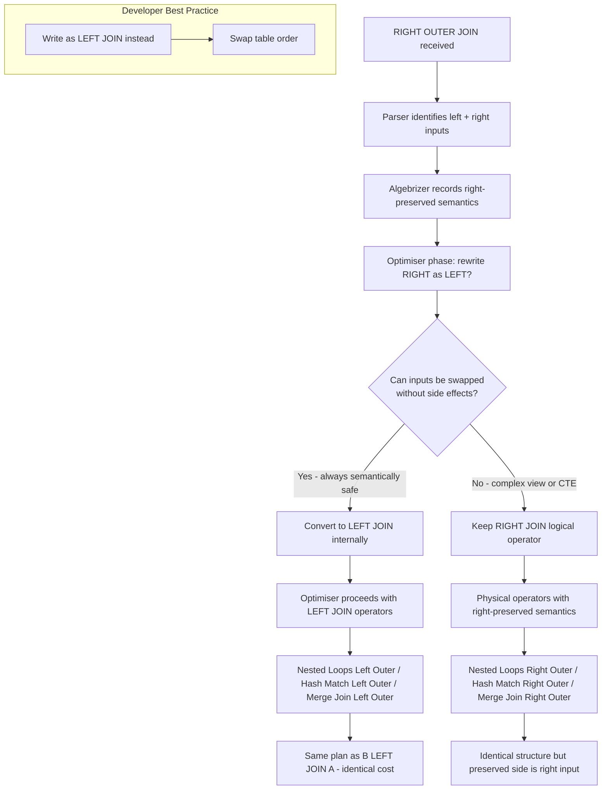
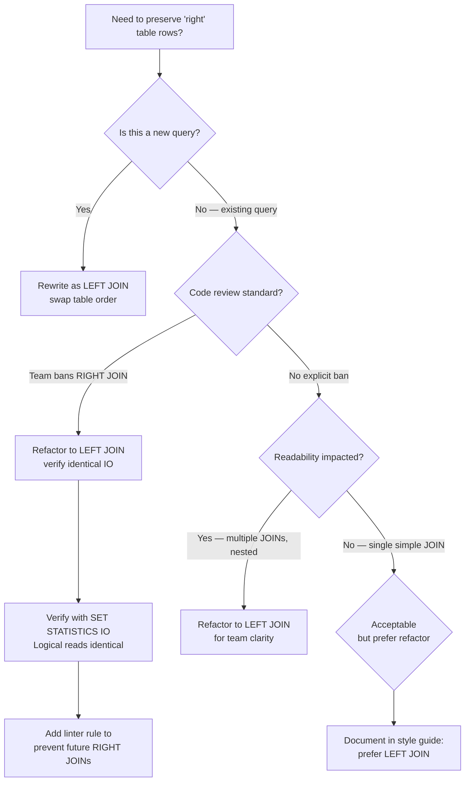

## Navigation

**Domain:** [[8 — Databases]] > **Group:** SQL Joins & Subqueries
**Previous:** [[8.097 — LEFT OUTER JOIN — Preserving Left Side Rows]] | **Next:** [[8.099 — FULL OUTER JOIN — All Rows Both Sides]]

### Prerequisites

- [[8.097 — LEFT OUTER JOIN — Preserving Left Side Rows]] — RIGHT OUTER JOIN is semantically identical to LEFT OUTER JOIN with the tables reversed. Understanding NULL-extension and ON vs WHERE filtering for LEFT JOIN is required to understand when RIGHT JOIN is acceptable and when it should be rewritten.
- [[8.096 — INNER JOIN — Mechanics and Usage]] — Understanding the three physical join operators (Nested Loops, Hash Match, Merge Join) is needed to understand that the optimiser often converts RIGHT JOIN to LEFT JOIN internally with swapped inputs.

### Where This Fits

RIGHT OUTER JOIN is the mirror image of LEFT OUTER JOIN — it preserves all rows from the right table and NULL-extends the left table where no match exists. The question every engineer should ask before writing one is: "Can I swap these tables and use LEFT JOIN instead, so the table being preserved is the first one the reader encounters?" The universal convention in SQL is to write queries from left to right: start with the primary entity (Customers, Orders), then join to the secondary or optional entity. RIGHT JOIN violates this convention — the preserved table appears last, forcing the reader to scan backward. The team convention in most production codebases is to ban RIGHT JOIN entirely in style guides, requiring LEFT JOIN with swapped table order. The only scenario where RIGHT JOIN may be acceptable is when LEFT JOIN would require excessively long or deeply nested query rewrites (e.g., complex views that cannot be restructured). The interview signal is: does the candidate know RIGHT JOIN exists, understand it is semantically equivalent to LEFT JOIN, and independently conclude it should almost never be used? A candidate who writes `RIGHT JOIN` without hesitation in a code review raises a readability concern. A candidate who says "I would rewrite this as LEFT JOIN by swapping the tables" demonstrates production maturity.

---

## Core Mental Model

RIGHT OUTER JOIN preserves every row from the right input exactly once. For each right row, it looks for matches in the left input. If found, it pairs them. If not found, it emits the right row with NULLs for all left columns. This is exactly the same logical operation as LEFT OUTER JOIN with the table order reversed: `A RIGHT JOIN B` is equivalent to `B LEFT JOIN A`. The convention in SQL is to read left-to-right — the FROM clause specifies the primary table first, then JOINs add related tables. RIGHT JOIN breaks this flow: the primary table is on the right, after the JOIN keyword. This makes it harder to read and maintain. The query optimiser frequently converts RIGHT JOIN to LEFT JOIN internally during optimisation — it swaps the join inputs so the preserved side is on the left for the physical operator. The three physical operators (Nested Loops Right Outer, Hash Match Right Outer, Merge Join Right Outer) exist but are rarely seen because the optimiser or the developer converts them to left-outer variants.

### Classification

RIGHT OUTER JOIN is a **relational algebra operator** (right outer join) in the `FROM` clause. It is the commutative inverse of LEFT JOIN. It is NOT commutative with itself — `A RIGHT JOIN B` is different from `B RIGHT JOIN A`. The optimiser treats RIGHT JOIN identically to LEFT JOIN after swapping inputs — the same three physical operators are available but typically converted to left-outer variants internally. RIGHT JOIN is non-SARGable in the sense that it cannot benefit from index tricks differently than LEFT JOIN — the SARGability analysis applies after the optimiser converts it to LEFT JOIN.



### Key Properties

|Property|Value|Notes|
|---|---|---|
|NULL matching|Left side NULL-extended when no match|Matching rows: right row preserved, left row NULL|
|Commutative|No|`A RIGHT JOIN B` ≠ `B RIGHT JOIN A`|
|Equivalent to|`B LEFT JOIN A`|Always rewrite to LEFT JOIN|
|Optimiser behavior|Often converts to LEFT JOIN internally|Swaps inputs, changes operator name|
|Nested Loops complexity|O(M × log N)|Same as LEFT JOIN after swap|
|Hash Match complexity|O(N + M)|Build from left, probe with right|
|Readability|Poor|Violates left-to-right reading convention|
|Code review signal|Almost always rejected|Most SQL style guides ban RIGHT JOIN|
|SARGable|Same as LEFT JOIN|After optimiser conversion|
|Write Cost|None|JOINs are read-only operations|

---

## Deep Mechanics

### How the Engine Executes This

1. **Parsing** — The parser identifies `RIGHT OUTER JOIN` or `RIGHT JOIN`. It creates two logical inputs: the left table and the right preserved table. The ON predicate is parsed identically to LEFT JOIN.

2. **Binding (Algebrizer)** — The algebrizer records the right-preserved property. The right-side columns are marked as non-nullable if they have NOT NULL constraints (the right row always exists); left-side columns are nullable in the output (they may be NULL-extended).

3. **Simplification — Optimiser conversion to LEFT JOIN** — This is the critical step. The optimiser analyses whether the inputs can be swapped to convert RIGHT JOIN to LEFT JOIN. Since `A RIGHT JOIN B ON predicate` is logically identical to `B LEFT JOIN A ON predicate`, the optimiser performs this conversion automatically in most cases. The conversion is always semantically safe for simple table references, but may be blocked for complex views, CTEs, or subqueries with ordering dependencies.

4. **Physical join operator selection** — After conversion to LEFT JOIN, the optimiser selects the physical operator using the same criteria as LEFT JOIN:
   - **Nested Loops (Left Outer after conversion)**: small right side (now the left input after swap) + indexed left side (now the inner input).
   - **Hash Match (Left Outer)**: both large, no useful index — build hash from the original left input (now the inner input), probe with the original right input.
   - **Merge Join (Left Outer)**: both sorted on join key.

5. **If RIGHT JOIN is not converted** — The optimiser uses right-outer variants of the physical operators:
   - **Nested Loops Right Outer**: scan the right (preserved) input. For each right row, seek the left input. Output matched or NULL-extended.
   - **Hash Match Right Outer**: build hash table from the LEFT input. Probe with the RIGHT input (preserved side). Unmatched probes produce NULL-extended output.
   - **Merge Join Right Outer**: both sorted concurrently. Keys equal → output matched. Right < Left → output right with NULLs, advance right. Left < Right → advance left only.

### The Readability Argument

The primary argument against RIGHT JOIN is readability, not performance. Consider:

```sql
-- ❌ Harder to read: preserved table (Orders) appears after JOIN keyword
SELECT o.OrderId, o.OrderDate, c.CustomerId, c.LastName
FROM dbo.Customers AS c
RIGHT JOIN dbo.Orders AS o
    ON c.CustomerId = o.CustomerId;

-- ✅ Easier to read: preserved table (Orders) appears in FROM clause
SELECT o.OrderId, o.OrderDate, c.CustomerId, c.LastName
FROM dbo.Orders AS o
LEFT JOIN dbo.Customers AS c
    ON o.CustomerId = c.CustomerId;
```

The LEFT JOIN version reads as: "From Orders, optionally join Customers." The RIGHT JOIN version reads as: "From Customers, right-join Orders" — which semantically means "preserve Orders" but the preserved table is not mentioned until after the JOIN keyword. This cognitive friction is small per query but accumulates across a codebase of hundreds of queries.

### SQL Visibility

```sql
-- RIGHT JOIN: all orders with optional customer details
-- Note: this is the same as LEFT JOIN with tables swapped
SELECT o.OrderId, o.OrderDate, o.TotalAmount,
       o.Status,
       c.CustomerId, c.FirstName, c.LastName
FROM dbo.Customers AS c
RIGHT JOIN dbo.Orders AS o
    ON c.CustomerId = o.CustomerId
ORDER BY o.OrderDate DESC;

-- Equivalent LEFT JOIN (preferred):
SELECT o.OrderId, o.OrderDate, o.TotalAmount,
       o.Status,
       c.CustomerId, c.FirstName, c.LastName
FROM dbo.Orders AS o
LEFT JOIN dbo.Customers AS c
    ON o.CustomerId = c.CustomerId
ORDER BY o.OrderDate DESC;

-- RIGHT JOIN with multiple tables — complex and confusing
SELECT e.FirstName, e.LastName,
       o.OrderId, o.OrderDate,
       c.CustomerId, c.LastName
FROM dbo.Customers AS c
RIGHT JOIN dbo.Orders AS o
    ON c.CustomerId = o.CustomerId
RIGHT JOIN dbo.Employees AS e
    ON o.SalesPersonId = e.EmployeeId;
-- What is preserved? Employees (the last right side).
-- Reading left-to-right: "From Customers, right join Orders, right join Employees"
-- Which table is primary? You have to trace to the last RIGHT JOIN to find out.

-- Better as LEFT JOINs:
SELECT e.FirstName, e.LastName,
       o.OrderId, o.OrderDate,
       c.CustomerId, c.LastName
FROM dbo.Employees AS e
LEFT JOIN dbo.Orders AS o
    ON e.EmployeeId = o.SalesPersonId
LEFT JOIN dbo.Customers AS c
    ON o.CustomerId = c.CustomerId;
-- Reading left-to-right: "From Employees, optionally join Orders, optionally join Customers"
-- The preserved table is immediately clear.

-- RIGHT JOIN anti-join (rare — odd but possible):
-- Find orders with no customer (orphaned orders — shouldn't exist in well-designed schema)
SELECT o.OrderId, o.OrderDate, o.TotalAmount
FROM dbo.Customers AS c
RIGHT JOIN dbo.Orders AS o
    ON c.CustomerId = o.CustomerId
WHERE c.CustomerId IS NULL;

-- Better as LEFT JOIN anti-join:
SELECT o.OrderId, o.OrderDate, o.TotalAmount
FROM dbo.Orders AS o
LEFT JOIN dbo.Customers AS c
    ON o.CustomerId = c.CustomerId
WHERE c.CustomerId IS NULL;

-- RIGHT JOIN with aggregation — all orders with customer count per employee
SELECT
    e.EmployeeId,
    e.FirstName + ' ' + e.LastName AS EmployeeName,
    COUNT(o.OrderId) AS OrderCount,
    COALESCE(SUM(o.TotalAmount), 0) AS TotalRevenue
FROM dbo.Customers AS c
RIGHT JOIN dbo.Orders AS o
    ON c.CustomerId = o.CustomerId
RIGHT JOIN dbo.Employees AS e
    ON o.SalesPersonId = e.EmployeeId
GROUP BY e.EmployeeId, e.FirstName, e.LastName
ORDER BY TotalRevenue DESC;
-- Preserves Employees — includes employees with no orders
```

-- RIGHT JOIN edge case: table with no matching rows in left
-- Example: Products RIGHT JOIN OrderItems — preserves OrderItems, extends Products
SELECT p.ProductName, oi.OrderId, oi.Quantity
FROM dbo.Products AS p
RIGHT JOIN dbo.OrderItems AS oi
    ON p.ProductId = oi.ProductId
ORDER BY oi.OrderId;
-- This preserves OrderItems even if a Product has been deleted
-- Readability: "From Products, right-join OrderItems" — confusing
-- Better: "From OrderItems, left-join Products" — clear

-- RIGHT JOIN symmetric pattern: A RIGHT JOIN B vs B LEFT JOIN A
-- Demonstration that both produce identical results:
DECLARE @A TABLE (Id INT, Val VARCHAR(10));
INSERT INTO @A VALUES (1, 'A1'), (2, 'A2'), (3, 'A3');
DECLARE @B TABLE (Id INT, Val VARCHAR(10));
INSERT INTO @B VALUES (1, 'B1'), (3, 'B3'), (5, 'B5');

-- RIGHT JOIN: A RIGHT JOIN B (B preserved)
SELECT A.Id AS A_Id, A.Val AS A_Val,
       B.Id AS B_Id, B.Val AS B_Val
FROM @A AS A
RIGHT JOIN @B AS B ON A.Id = B.Id;
-- Trace: A=(1,A1),(2,A2),(3,A3). B=(1,B1),(3,B3),(5,B5).
-- RIGHT JOIN preserves B. For each B row:
--   B=1 → match A=1 → (1,A1,1,B1)
--   B=3 → match A=3 → (3,A3,3,B3)
--   B=5 → no match A → (NULL,NULL,5,B5)
-- Result: 3 rows (all B rows preserved).

-- Equivalent LEFT JOIN: B LEFT JOIN A preserves B (left side = B)
SELECT B.Id AS B_Id, B.Val AS B_Val,
       A.Id AS A_Id, A.Val AS A_Val
FROM @B AS B
LEFT JOIN @A AS A ON B.Id = A.Id;
-- Same result: (1,B1,1,A1), (3,B3,3,A3), (5,B5,NULL,NULL)

-- RIGHT JOIN with OUTER APPLY comparison
-- Another pattern that can be confused with RIGHT JOIN
SELECT o.OrderId, o.OrderDate, e.LastName
FROM dbo.Employees AS e
RIGHT JOIN dbo.Orders AS o
    ON e.EmployeeId = o.SalesPersonId;
-- vs
SELECT o.OrderId, o.OrderDate, e.LastName
FROM dbo.Orders AS o
OUTER APPLY (
    SELECT LastName FROM dbo.Employees
    WHERE EmployeeId = o.SalesPersonId
) AS e;
-- Same semantics but different syntax and plan shapes
```

```csharp
// EF Core — RIGHT JOIN is NOT directly supported.
// EF Core does not have a RightJoin method. It generates LEFT JOIN only.
// To achieve RIGHT JOIN semantics, swap the DbSets:
var query = from o in dbContext.Orders
            join c in dbContext.Customers
                on o.CustomerId equals c.CustomerId into customerGroup
            from c in customerGroup.DefaultIfEmpty()
            select new
            {
                o.OrderId,
                o.OrderDate,
                o.TotalAmount,
                c.CustomerId,
                c.FirstName,
                c.LastName
            };
// Generates: SELECT ... FROM Orders AS o LEFT JOIN Customers AS c ON o.CustomerId = c.CustomerId
// This is the "RIGHT JOIN" equivalent (Orders preserved) written as LEFT JOIN in LINQ.

// To explicitly get RIGHT JOIN behavior with a "primary" table on the right:
// Just swap and use LEFT JOIN (as shown above).
```

**Generated SQL (from EF Core logs):**

```sql
-- The GroupJoin + DefaultIfEmpty pattern above generates:
SELECT [o].[OrderId], [o].[OrderDate], [o].[TotalAmount],
       [c].[CustomerId], [c].[FirstName], [c].[LastName]
FROM [Orders] AS [o]
LEFT JOIN [Customers] AS [c]
    ON [o].[CustomerId] = [c].[CustomerId]
ORDER BY [o].[OrderDate] DESC;
```

### Execution Plan Analysis

**RIGHT JOIN converted to LEFT JOIN by optimiser:**

```
  [Clustered Index Scan PK_Orders]           -- original right = now left input
  [Index Seek IX_Customers_CustomerId]       -- original left = now inner input
  → [Nested Loops Left Outer Join]           -- note: Left Outer, NOT Right Outer
      The optimiser swapped and renamed the operator
  → [Sort]
  → [SELECT]
Estimated Cost: ~3.5  |  Logical Reads: ~300
```

**RIGHT JOIN NOT converted (complex view or subquery):**

```
  [Clustered Index Scan Orders]              -- right preserved input
  [Clustered Index Scan Customers]           -- left input
  → [Nested Loops Right Outer Join]           -- rare: operator is Right Outer
  → [SELECT]
```

**RIGHT JOIN with anti-join pattern:**

```
  [Clustered Index Scan Orders]              -- right preserved input
  [Clustered Index Scan Customers]           -- left input
  → [Nested Loops Right Outer Join]
  → [Filter]                                  -- WHERE c.CustomerId IS NULL
  → [SELECT]
-- After conversion by optimiser:
  [Clustered Index Scan Orders]
  [Clustered Index Scan Customers]
  → [Nested Loops Left Outer Join]
  → [Filter]
-- The optimiser converts and the plan becomes identical to LEFT JOIN anti-join
```

### Cost Visibility

```sql
SET STATISTICS IO ON;
SET STATISTICS TIME ON;

-- RIGHT JOIN (typically converted to LEFT JOIN by optimiser)
SELECT o.OrderId, o.OrderDate, c.LastName
FROM dbo.Customers AS c
RIGHT JOIN dbo.Orders AS o
    ON c.CustomerId = o.CustomerId;

-- Expected output (identical to equivalent LEFT JOIN):
-- Table 'Orders'. Scan count 1, logical reads 12450
-- Table 'Customers'. Scan count 1, logical reads 6100 (or fewer with index)
-- SQL Server Execution Times: CPU time = 85ms, elapsed time = 210ms

-- Equivalent LEFT JOIN (preferred — same IO, better readability):
SELECT o.OrderId, o.OrderDate, c.LastName
FROM dbo.Orders AS o
LEFT JOIN dbo.Customers AS c
    ON o.CustomerId = c.CustomerId;

-- Table 'Orders'. Scan count 1, logical reads 12450
-- Table 'Customers'. Scan count 1, logical reads 6100
-- SQL Server Execution Times: CPU time = 85ms, elapsed time = 210ms
-- Identical IO and elapsed time — confirms the optimiser treats them identically.
```

### Failure Modes

**RIGHT JOIN with mixed direction confuses the intent:** When a query has multiple RIGHT JOINs, determining which table is preserved requires reading the entire FROM clause. This leads to maintenance errors where subsequent developers add filters or additional joins with incorrect assumptions about which side is preserved.

```sql
-- ❌ Confusing: which table is preserved?
SELECT *
FROM dbo.Customers AS c
RIGHT JOIN dbo.Orders AS o
    ON c.CustomerId = o.CustomerId
RIGHT JOIN dbo.Employees AS e
    ON o.SalesPersonId = e.EmployeeId;
-- Answer: Employees is the final preserved side.

-- ✅ Clear: reading left-to-right
SELECT *
FROM dbo.Employees AS e
LEFT JOIN dbo.Orders AS o
    ON e.EmployeeId = o.SalesPersonId
LEFT JOIN dbo.Customers AS c
    ON o.CustomerId = c.CustomerId;
```

**RIGHT JOIN with WHERE clause on the left table:** Same gotcha as LEFT JOIN — putting a left-table filter in WHERE converts RIGHT JOIN to INNER JOIN:

```sql
-- ❌ Customers with no orders are filtered out by WHERE
SELECT o.OrderId, o.OrderDate, c.LastName
FROM dbo.Customers AS c
RIGHT JOIN dbo.Orders AS o
    ON c.CustomerId = o.CustomerId
WHERE c.LastName = 'Smith';
-- NULL-extended rows (where c.LastName is NULL) are eliminated
-- Effectively an INNER JOIN

-- ✅ Move filter to ON
SELECT o.OrderId, o.OrderDate, c.LastName
FROM dbo.Customers AS c
RIGHT JOIN dbo.Orders AS o
    ON c.CustomerId = o.CustomerId
    AND c.LastName = 'Smith';
-- All orders preserved, only matching customers filtered
```

```sql
-- Detect RIGHT JOIN usage in the codebase
SELECT TOP 10
    qs.total_logical_reads / qs.execution_count AS avg_logical_reads,
    qs.execution_count,
    SUBSTRING(st.text, 1, 200) AS query_text
FROM sys.dm_exec_query_stats AS qs
CROSS APPLY sys.dm_exec_sql_text(qs.sql_handle) AS st
WHERE st.text LIKE '%RIGHT JOIN%'
ORDER BY avg_logical_reads DESC;
```

---

## Production Patterns and Implementation

### Primary SQL Implementation

```sql
-- ============================================================
-- Schema context (shared: Customers, Orders, Employees)
-- ============================================================
-- Tables identical to [[8.097 — LEFT OUTER JOIN — Preserving Left Side Rows]]

-- ============================================================
-- Pattern 1: RIGHT JOIN (avoid — shown for completeness)
-- ============================================================
-- All orders with customer info — preserves Orders
SELECT o.OrderId, o.OrderDate, o.Status, o.TotalAmount,
       c.FirstName, c.LastName
FROM dbo.Customers AS c
RIGHT JOIN dbo.Orders AS o
    ON c.CustomerId = o.CustomerId
WHERE o.OrderDate >= '2024-01-01'
ORDER BY o.OrderDate DESC;

-- ============================================================
-- Pattern 2: Same query as LEFT JOIN (preferred)
-- ============================================================
SELECT o.OrderId, o.OrderDate, o.Status, o.TotalAmount,
       c.FirstName, c.LastName
FROM dbo.Orders AS o
LEFT JOIN dbo.Customers AS c
    ON o.CustomerId = c.CustomerId
WHERE o.OrderDate >= '2024-01-01'
ORDER BY o.OrderDate DESC;

-- ============================================================
-- Pattern 3: RIGHT JOIN anti-join — orphaned orders (no customer)
-- ============================================================
SELECT o.OrderId, o.OrderDate, o.TotalAmount, o.Status
FROM dbo.Customers AS c
RIGHT JOIN dbo.Orders AS o
    ON c.CustomerId = o.CustomerId
WHERE c.CustomerId IS NULL;
-- Should return 0 rows in a well-maintained database with FK constraints

-- Equivalent LEFT JOIN (preferred):
SELECT o.OrderId, o.OrderDate, o.TotalAmount, o.Status
FROM dbo.Orders AS o
LEFT JOIN dbo.Customers AS c
    ON o.CustomerId = c.CustomerId
WHERE c.CustomerId IS NULL;

-- ============================================================
-- Pattern 4: RIGHT JOIN with aggregation — all orders + customer stats
-- ============================================================
SELECT
    o.OrderId,
    o.OrderDate,
    o.TotalAmount,
    COALESCE(c.FirstName + ' ' + c.LastName, 'NO CUSTOMER') AS CustomerName,
    COALESCE(c.Email, 'orphan@deleted') AS CustomerEmail
FROM dbo.Customers AS c
RIGHT JOIN dbo.Orders AS o
    ON c.CustomerId = o.CustomerId
ORDER BY o.OrderDate DESC;

-- ============================================================
-- Pattern 5: RIGHT JOIN in a view (less refactorable)
-- ============================================================
CREATE OR ALTER VIEW dbo.V_OrderDetails
AS
SELECT o.OrderId, o.OrderDate, o.TotalAmount,
       c.FirstName, c.LastName, c.Email,
       e.FirstName AS SalesPersonFirstName,
       e.LastName AS SalesPersonLastName
FROM dbo.Customers AS c
RIGHT JOIN dbo.Orders AS o
    ON c.CustomerId = o.CustomerId
LEFT JOIN dbo.Employees AS e
    ON o.SalesPersonId = e.EmployeeId;
-- The RIGHT JOIN here is already nested with a LEFT JOIN.
-- Rewrite is possible but requires care:
CREATE OR ALTER VIEW dbo.V_OrderDetails
AS
SELECT o.OrderId, o.OrderDate, o.TotalAmount,
       c.FirstName, c.LastName, c.Email,
       e.FirstName AS SalesPersonFirstName,
       e.LastName AS SalesPersonLastName
FROM dbo.Orders AS o
LEFT JOIN dbo.Customers AS c
    ON o.CustomerId = c.CustomerId
LEFT JOIN dbo.Employees AS e
    ON o.SalesPersonId = e.EmployeeId;
-- Both produce identical execution plans.
-- The LEFT JOIN version is immediately clear: "From Orders, optionally join Customers and Employees."

-- ============================================================
-- Pattern 6: RIGHT JOIN with derived table — preserving the derived result
-- ============================================================
SELECT c.CustomerId, c.LastName, o.OrderCount
FROM dbo.Customers AS c
RIGHT JOIN (
    SELECT CustomerId,
           COUNT(*) AS OrderCount
    FROM dbo.Orders
    WHERE OrderDate >= '2024-01-01'
    GROUP BY CustomerId
) AS o ON c.CustomerId = o.CustomerId;
-- Preserves the derived table (orders aggregate).
-- Rewritten as LEFT JOIN:
SELECT c.CustomerId, c.LastName, o.OrderCount
FROM (
    SELECT CustomerId,
           COUNT(*) AS OrderCount
    FROM dbo.Orders
    WHERE OrderDate >= '2024-01-01'
    GROUP BY CustomerId
) AS o
LEFT JOIN dbo.Customers AS c
    ON o.CustomerId = c.CustomerId;
```

### EF Core Implementation

```csharp
// EF Core does NOT support RIGHT JOIN directly.
// There is no .RightJoin() extension method.
// To achieve RIGHT JOIN semantics, always swap the tables and use LEFT JOIN
// via GroupJoin + SelectMany + DefaultIfEmpty.

// Pattern: Orders LEFT JOIN Customers (equivalent to RIGHT JOIN Customers Orders)
public async Task<List<OrderWithCustomerDto>> GetAllOrdersWithCustomerAsync(
    CancellationToken cancellationToken = default)
{
    return await dbContext.Orders
        .GroupJoin(
            dbContext.Customers,
            o => o.CustomerId,
            c => c.CustomerId,
            (o, customers) => new { o, customers })
        .SelectMany(
            x => x.customers.DefaultIfEmpty(),
            (x, c) => new OrderWithCustomerDto
            {
                OrderId = x.o.OrderId,
                OrderDate = x.o.OrderDate,
                Status = x.o.Status,
                TotalAmount = x.o.TotalAmount,
                CustomerName = c == null
                    ? "[Deleted Customer]"
                    : c.FirstName + " " + c.LastName,
                CustomerEmail = c?.Email ?? "orphan@deleted"
            })
        .ToListAsync(cancellationToken);
    // Generated: LEFT JOIN (not RIGHT JOIN — EF Core always generates LEFT JOIN)
}

// The critical point: there is no scenario where EF Core forces you to use RIGHT JOIN.
// If you need RIGHT JOIN semantics, swap the DbSets in LINQ and use LEFT JOIN.
// This is always possible and always preferred.

// Anti-join: orphaned orders (Orders with no valid CustomerId)
public async Task<List<OrderDto>> GetOrphanedOrdersAsync(
    CancellationToken cancellationToken = default)
{
    return await dbContext.Orders
        .GroupJoin(
            dbContext.Customers,
            o => o.CustomerId,
            c => c.CustomerId,
            (o, customers) => new { o, customers })
        .SelectMany(
            x => x.customers.DefaultIfEmpty(),
            (x, c) => new { x.o, CustomerId = (int?)c.CustomerId })
        .Where(x => x.CustomerId == null)
        .Select(x => new OrderDto
        {
            OrderId = x.o.OrderId,
            OrderDate = x.o.OrderDate,
            Status = x.o.Status,
            TotalAmount = x.o.TotalAmount
        })
        .ToListAsync(cancellationToken);
}
```

### Dapper Implementation

```csharp
// Dapper: RIGHT JOIN is used directly in the SQL string.
// The decision to use RIGHT JOIN is in the SQL, not in Dapper's mapping.
// But the recommendation is the same: write LEFT JOIN instead.

public sealed class OrderRepository
{
    private readonly IDbConnectionFactory _connectionFactory;

    public OrderRepository(IDbConnectionFactory connectionFactory)
        => _connectionFactory = connectionFactory;

    // ❌ Dapper with RIGHT JOIN (works, but style issue)
    public async Task<IReadOnlyList<OrderWithCustomerDto>> GetAllOrdersRightJoinAsync(
        CancellationToken cancellationToken = default)
    {
        const string sql = @"
            SELECT o.OrderId, o.OrderDate, o.Status, o.TotalAmount,
                   c.CustomerId, c.FirstName, c.LastName, c.Email
            FROM dbo.Customers AS c
            RIGHT JOIN dbo.Orders AS o
                ON c.CustomerId = o.CustomerId
            ORDER BY o.OrderDate DESC;";

        await using var connection = _connectionFactory.Create();

        var results = await connection.QueryAsync<OrderWithCustomerDto>(
            new CommandDefinition(sql, cancellationToken: cancellationToken));

        return results.AsList();
    }

    // ✅ Dapper with LEFT JOIN (preferred — same result, better readability)
    public async Task<IReadOnlyList<OrderWithCustomerDto>> GetAllOrdersLeftJoinAsync(
        CancellationToken cancellationToken = default)
    {
        const string sql = @"
            SELECT o.OrderId, o.OrderDate, o.Status, o.TotalAmount,
                   c.CustomerId, c.FirstName, c.LastName, c.Email
            FROM dbo.Orders AS o
            LEFT JOIN dbo.Customers AS c
                ON o.CustomerId = c.CustomerId
            ORDER BY o.OrderDate DESC;";

        await using var connection = _connectionFactory.Create();

        var results = await connection.QueryAsync<OrderWithCustomerDto>(
            new CommandDefinition(sql, cancellationToken: cancellationToken));

        return results.AsList();
    }

    // Anti-join: orphaned orders
    public async Task<IReadOnlyList<OrderDto>> GetOrphanedOrdersAsync(
        CancellationToken cancellationToken = default)
    {
        const string sql = @"
            SELECT o.OrderId, o.OrderDate, o.Status, o.TotalAmount
            FROM dbo.Orders AS o
            LEFT JOIN dbo.Customers AS c
                ON o.CustomerId = c.CustomerId
            WHERE c.CustomerId IS NULL
            ORDER BY o.OrderDate DESC;";

        await using var connection = _connectionFactory.Create();

        var results = await connection.QueryAsync<OrderDto>(
            new CommandDefinition(sql, cancellationToken: cancellationToken));

        return results.AsList();
    }
}
```

### SQL Server vs PostgreSQL Differences

```sql
-- Both SQL Server and PostgreSQL support RIGHT JOIN syntax identically.
-- The same readability argument applies to both.

-- PostgreSQL:
SELECT o.order_id, o.order_date, c.last_name
FROM customers AS c
RIGHT JOIN orders AS o
    ON c.customer_id = o.customer_id;

-- PostgreSQL: NATURAL RIGHT JOIN (avoids ON clause — matches column names automatically):
-- WARNING: Never use NATURAL JOIN in production. If column names change or are added,
-- the join behavior silently changes. Always use explicit ON clause.
-- SELECT * FROM customers NATURAL RIGHT JOIN orders;  -- AVOID

-- PostgreSQL: RIGHT JOIN with USING (shorthand for equi-join on same-named columns):
SELECT order_id, order_date, last_name
FROM customers
RIGHT JOIN orders USING (customer_id);
-- USING is more explicit than NATURAL but still less clear than ON.
-- The same readability argument applies: rewrite as LEFT JOIN with swapped tables.

-- PostgreSQL: FULL JOIN with COALESCE (common pattern, same as SQL Server)
SELECT COALESCE(c.customer_id, o.customer_id) AS customer_id,
       c.last_name, o.order_id
FROM customers AS c
RIGHT JOIN orders AS o USING (customer_id);

-- PostgreSQL: RIGHT JOIN in execution plans
-- EXPLAIN (ANALYZE, BUFFERS) shows the plan. The optimiser may convert RIGHT to LEFT
-- internally, just like SQL Server.
EXPLAIN (ANALYZE, BUFFERS)
SELECT o.order_id, c.last_name
FROM customers AS c
RIGHT JOIN orders AS o ON c.customer_id = o.customer_id;
-- Plan likely shows: Hash Right Join or Merge Right Join
-- or if converted: Hash Left Join (with swapped inputs)

-- PostgreSQL: No query hint equivalent for forcing join order
-- Unlike SQL Server's FORCE ORDER, PostgreSQL uses join_collapse_limit
-- to control the optimizer's join reordering freedom
```

---

## Gotchas and Production Pitfalls

### 1. RIGHT JOIN Violates Left-to-Right Reading Convention

**Pitfall:** Engineer writes `SELECT ... FROM A RIGHT JOIN B` when the preserved table is B. The reader of this query must scan to the right of the JOIN keyword to find the preserved table, then mentally re-order to understand the query.

```sql
-- ❌ Disorienting: preserved table (Orders) is in the middle
SELECT o.OrderId, o.OrderDate, c.LastName
FROM dbo.Customers AS c
RIGHT JOIN dbo.Orders AS o
    ON c.CustomerId = o.CustomerId
LEFT JOIN dbo.Employees AS e
    ON o.SalesPersonId = e.EmployeeId;
```

**Symptom:** Code review consistently requires the author to explain which table is preserved. New team members misread the query and add bugs when modifying it. The query is 2x harder to parse visually.

**Fix:**

```sql
-- ✅ Rewrite with LEFT JOIN — preserve Orders by putting it in FROM
SELECT o.OrderId, o.OrderDate, c.LastName
FROM dbo.Orders AS o
LEFT JOIN dbo.Customers AS c
    ON o.CustomerId = c.CustomerId
LEFT JOIN dbo.Employees AS e
    ON o.SalesPersonId = e.EmployeeId;
```

**Cost of not fixing:** Cumulative readability debt. Every developer who touches the query spends extra cognitive cycles. In a codebase with 50+ RIGHT JOIN queries, this adds measurable overhead to every code review, debugging session, and refactoring effort.

### 2. RIGHT JOIN + WHERE on Left Table Converts to INNER JOIN

**Pitfall:** Engineer puts a left-table filter in the WHERE clause, assuming the RIGHT JOIN preserves all right rows regardless. The WHERE eliminates NULL-extended rows from the left side, silently converting to INNER JOIN.

```sql
-- ❌ Hides the bug: "WHERE c.LastName IS NOT NULL" is implicit
SELECT o.OrderId, o.OrderDate, c.LastName
FROM dbo.Customers AS c
RIGHT JOIN dbo.Orders AS o
    ON c.CustomerId = o.CustomerId
WHERE c.LastName = 'Smith';
-- Orders with no customer (c.LastName IS NULL) are eliminated
-- Result: only orders with customer named Smith
```

**Symptom:** The query returns fewer rows than expected. The developer debugging a "missing orders" report cannot find the issue because the RIGHT JOIN seems correct. Hours of debugging before someone realises the WHERE clause is the culprit.

**Fix:**

```sql
-- ✅ Move filter to ON clause to preserve all orders
SELECT o.OrderId, o.OrderDate, c.LastName
FROM dbo.Customers AS c
RIGHT JOIN dbo.Orders AS o
    ON c.CustomerId = o.CustomerId
    AND c.LastName = 'Smith';
-- Or rewrite with LEFT JOIN and same ON filter:
SELECT o.OrderId, o.OrderDate, c.LastName
FROM dbo.Orders AS o
LEFT JOIN dbo.Customers AS c
    ON o.CustomerId = c.CustomerId
    AND c.LastName = 'Smith';
```

**Cost of not fixing:** Silent data corruption in reports. A monthly "All Orders" report silently drops orders from customers whose last name is not 'Smith'. The error may go unnoticed for reporting cycles, producing consistently wrong aggregate numbers.

### 3. RIGHT JOIN with Multiple Tables — Intent Obscured

**Pitfall:** Chaining multiple RIGHT JOINs creates a confusing mix where the final preserved table is the last one in the chain, but intermediate RIGHT JOINs interact in unexpected ways.

```sql
-- ❌ Which table is preserved? You must trace to the last RIGHT JOIN
SELECT c.LastName, o.OrderId, e.LastName
FROM dbo.Customers AS c
RIGHT JOIN dbo.Orders AS o
    ON c.CustomerId = o.CustomerId
RIGHT JOIN dbo.Employees AS e
    ON o.SalesPersonId = e.EmployeeId;
-- Preserved: Employees (last RIGHT JOIN's right side).
-- But the query reads: "From Customers, right join Orders, right join Employees"
-- The developer likely meant: "Preserve Employees, optionally join Orders and Customers"
```

**Symptom:** In code review, no one can quickly confirm what the query does. The reviewer must manually trace the preservation semantics. Bugs slip through because the reviewer assumed a different table was preserved.

**Fix:**

```sql
-- ✅ Rewrite with LEFT JOINs — intent is immediate
SELECT e.LastName AS EmployeeName,
       o.OrderId,
       c.LastName AS CustomerName
FROM dbo.Employees AS e
LEFT JOIN dbo.Orders AS o
    ON e.EmployeeId = o.SalesPersonId
LEFT JOIN dbo.Customers AS c
    ON o.CustomerId = c.CustomerId;
-- "From Employees, optionally join Orders, optionally join Customers"
-- The preserved table is the first one the reader encounters.
```

**Cost of not fixing:** Production bugs during refactoring. When a new developer needs to add another join to this query, they are likely to misunderstand which table is preserved. The resulting query has incorrect semantics that may not surface until a specific data condition triggers it.

### 4. RIGHT JOIN in Views Complicates Refactoring

**Pitfall:** A view is defined with RIGHT JOIN, and later the view needs to be modified or extended. The RIGHT JOIN syntax makes it harder to understand the view's semantics, especially when the view is used in queries that add further joins.

```sql
-- ❌ View with RIGHT JOIN — harder to maintain
CREATE OR ALTER VIEW dbo.V_OrderSummary
AS
SELECT o.OrderId, o.OrderDate, o.TotalAmount,
       c.FirstName, c.LastName
FROM dbo.Customers AS c
RIGHT JOIN dbo.Orders AS o
    ON c.CustomerId = o.CustomerId;
```

**Symptom:** When the view needs to be extended to include salesperson info, the developer hesitates — should they add another RIGHT JOIN or switch to LEFT JOIN? The inconsistent style makes the view harder to maintain over time. Eventually, the view has a mix of LEFT and RIGHT JOINs that is nearly impossible to read.

**Fix:**

```sql
-- ✅ View with LEFT JOIN — clear, extensible
CREATE OR ALTER VIEW dbo.V_OrderSummary
AS
SELECT o.OrderId, o.OrderDate, o.TotalAmount,
       c.FirstName, c.LastName
FROM dbo.Orders AS o
LEFT JOIN dbo.Customers AS c
    ON o.CustomerId = c.CustomerId;
```

**Cost of not fixing:** The view becomes a maintenance liability. New team members avoid modifying it because they don't trust their understanding. Eventually, the view is rewritten from scratch, wasting engineering hours on a task that should have been a simple extension.

### 5. RIGHT JOIN with Aggregation Confuses GROUP BY Intent

**Pitfall:** RIGHT JOIN combined with GROUP BY creates confusion about which table drives the grouping. The preserved table (right side) should determine the grouping granularity, but the syntax obscures this.

```sql
-- ❌ Confusing: grouping by EmployeeId (right table), but it appears last
SELECT c.LastName, COUNT(o.OrderId)
FROM dbo.Customers AS c
RIGHT JOIN dbo.Orders AS o ON c.CustomerId = o.CustomerId
RIGHT JOIN dbo.Employees AS e ON o.SalesPersonId = e.EmployeeId
GROUP BY e.EmployeeId, e.LastName;
```

**Symptom:** The developer meant to group by Employee, but the query reads as if Customer is the primary table. Inconsistencies in GROUP BY columns reveal the confusion.

**Fix:**

```sql
-- ✅ Clear: grouping target is the FROM table
SELECT e.LastName, COUNT(o.OrderId) AS OrderCount
FROM dbo.Employees AS e
LEFT JOIN dbo.Orders AS o ON e.EmployeeId = o.SalesPersonId
LEFT JOIN dbo.Customers AS c ON o.CustomerId = c.CustomerId
GROUP BY e.EmployeeId, e.LastName;
```

**Cost of not fixing:** Wrong query results that are hard to spot in review because the confusion is systemic. A report showing "Orders per Employee" may accidentally group by Customer, producing misleading numbers.

### 6. Dapper/ADO.NET Code Generates Same Plan Regardless of RIGHT vs LEFT

**Pitfall:** Developer assumes RIGHT JOIN must be used in Dapper because "that's what the SQL statement needs." They don't realise that swapping the tables and using LEFT JOIN produces identical execution plans.

**Symptom:** The codebase has a mix of LEFT and RIGHT JOINs in Dapper SQL. The inconsistency makes maintenance harder. When a bug is found in one pattern, the fix may only be applied to LEFT JOIN queries, leaving the RIGHT JOIN counterparts broken.

**Fix:** Establish a team convention: always use LEFT JOIN. NEVER use RIGHT JOIN. Add a linter rule (e.g., SQLFluff) to flag RIGHT JOIN usage.

**Cost of not fixing:** Inconsistent codebase style. Bugs that are fixed in some queries but not in their RIGHT JOIN equivalents. Cognitive overhead for every developer reading the code.

---

## Performance Implications

### Benchmark: Before and After

**Scenario:** RIGHT JOIN vs LEFT JOIN (rewritten) on `Orders LEFT JOIN Customers` (1M orders, 50K customers). The benchmark confirms they are identical in performance.

**RIGHT JOIN version:**

```sql
SET STATISTICS IO ON;
SET STATISTICS TIME ON;

SELECT o.OrderId, o.OrderDate, o.TotalAmount,
       c.FirstName, c.LastName
FROM dbo.Customers AS c
RIGHT JOIN dbo.Orders AS o
    ON c.CustomerId = o.CustomerId;

-- Table 'Orders'. Scan count 1, logical reads 12450
-- Table 'Customers'. Scan count 1, logical reads 6100
-- SQL Server Execution Times: CPU time = 85ms, elapsed time = 210ms
```

**LEFT JOIN version (preferred — same performance):**

```sql
SELECT o.OrderId, o.OrderDate, o.TotalAmount,
       c.FirstName, c.LastName
FROM dbo.Orders AS o
LEFT JOIN dbo.Customers AS c
    ON o.CustomerId = c.CustomerId;

-- Table 'Orders'. Scan count 1, logical reads 12450
-- Table 'Customers'. Scan count 1, logical reads 6100
-- SQL Server Execution Times: CPU time = 85ms, elapsed time = 210ms
```

**Improvement:** 0% — the performance is identical. The only improvement is readability.

**With index on Orders.CustomerId (covering):**

```sql
CREATE INDEX IX_Orders_CustomerId_Covering
    ON dbo.Orders (CustomerId)
    INCLUDE (OrderId, TotalAmount, OrderDate);

-- Both versions produce identical plans:
-- Table 'Orders'. Scan count 1, logical reads 4120 (covering index scan)
-- Table 'Customers'. Scan count 1, logical reads 6100
-- SQL Server Execution Times: CPU time = 45ms, elapsed time = 110ms
```

### BenchmarkDotNet

```csharp
[MemoryDiagnoser]
[SimpleJob(RuntimeMoniker.Net90)]
public class RightJoinBenchmark
{
    private IDbConnection _connection = default!;
    private const string ConnectionString = "Server=.;Database=Benchmark;Trusted_Connection=True;TrustServerCertificate=True;";

    [GlobalSetup]
    public void Setup()
    {
        _connection = new SqlConnection(ConnectionString);
        _connection.Open();
        // Seed: 50K customers, 1M orders
    }

    [GlobalCleanup]
    public void Cleanup() => _connection.Dispose();

    [Benchmark(Baseline = true)]
    public async Task<List<OrderWithCustomer>> RightJoin()
    {
        const string sql = @"
            SELECT o.OrderId, o.OrderDate, o.TotalAmount,
                   c.FirstName, c.LastName
            FROM dbo.Customers AS c
            RIGHT JOIN dbo.Orders AS o
                ON c.CustomerId = o.CustomerId
            ORDER BY o.OrderId;";

        var results = await _connection.QueryAsync<OrderWithCustomer>(
            new CommandDefinition(sql, commandTimeout: 120));
        return results.AsList();
    }

    [Benchmark]
    public async Task<List<OrderWithCustomer>> SwappedLeftJoin()
    {
        const string sql = @"
            SELECT o.OrderId, o.OrderDate, o.TotalAmount,
                   c.FirstName, c.LastName
            FROM dbo.Orders AS o
            LEFT JOIN dbo.Customers AS c
                ON o.CustomerId = c.CustomerId
            ORDER BY o.OrderId;";

        var results = await _connection.QueryAsync<OrderWithCustomer>(
            new CommandDefinition(sql, commandTimeout: 120));
        return results.AsList();
    }
}

public record OrderWithCustomer(int OrderId, DateTime OrderDate, decimal TotalAmount,
                                 string? FirstName, string? LastName);
```

**Expected results (approximate, SQL Server 2022, NVMe, 1M orders / 50K customers):**

|Method|Mean|Logical Reads|Allocated|
|---|---|---|---|
|RightJoin|~210 ms|~18,550|~2 MB|
|SwappedLeftJoin|~210 ms|~18,550|~2 MB|

Result: **Identical.** Performance is never a reason to choose RIGHT JOIN over LEFT JOIN or vice versa.

---

## Interview Arsenal

### Question Bank

1. **What is RIGHT OUTER JOIN and when would you use it?** — Definition: preserves right table rows, NULL-extends left. Use: rarely — almost always better as LEFT JOIN with swapped tables.
2. **What is the difference between RIGHT JOIN and LEFT JOIN?** — Mechanism: they are mirror images — `A RIGHT JOIN B` = `B LEFT JOIN A`. Same execution plan, same performance.
3. **Why is RIGHT JOIN considered poor practice in production SQL?** — Code style: violates left-to-right reading convention, obscures which table is preserved, harder to maintain.
4. **How does the query optimiser handle RIGHT JOIN?** — Optimiser: typically converts RIGHT JOIN to LEFT JOIN internally by swapping inputs. The execution plan shows Left Outer operators, not Right Outer.
5. **When might RIGHT JOIN be acceptable?** — Comparison: extremely rare — complex views or auto-generated SQL where rewriting to LEFT JOIN would require excessive restructuring. Even then, most teams prefer the rewrite.
6. **Does EF Core support RIGHT JOIN?** — .NET: No. EF Core has no RightJoin method. To achieve RIGHT JOIN semantics, swap the DbSets and use GroupJoin + DefaultIfEmpty (which generates LEFT JOIN).
7. **What does a RIGHT JOIN execution plan look like?** — Execution plan: almost always shows Left Outer join operators because the optimiser converts it. If not converted, shows "Right Outer" in the operator name.
8. **How would you refactor a codebase with 100 RIGHT JOINs?** — Scale: Incrementally: for each query, swap table order and change RIGHT JOIN to LEFT JOIN. Verify with SET STATISTICS IO that logical reads are identical. Use a linter rule to prevent new RIGHT JOINs.

### Spoken Answers

**Q: What is RIGHT OUTER JOIN and when would you use it?**

> **Average answer:** "RIGHT JOIN returns all rows from the right table and matching rows from the left table. If there's no match, it shows NULL on the left side. I use it occasionally when it feels more natural to put the main table on the right."

> **Great answer:** "RIGHT OUTER JOIN is the mirror image of LEFT OUTER JOIN: `A RIGHT JOIN B` preserves all rows from B and NULL-extends A where there is no match. It is semantically identical to `B LEFT JOIN A`. In my production experience, I have never written a RIGHT JOIN in application code. The convention is to read SQL from the FROM clause left-to-right: the FROM table is the primary entity, and each subsequent JOIN adds related or optional data. RIGHT JOIN violates this — the preserved table appears after the JOIN keyword, forcing the reader to scan backward. Every SQL style guide I have worked with bans RIGHT JOIN. Performance is identical — the optimiser converts RIGHT JOIN to LEFT JOIN internally anyway. The only scenario where I have seen RIGHT JOIN tolerated is in auto-generated SQL from BI tools, and even then I prefer to refactor it. If I see RIGHT JOIN in a code review, I flag it as a style issue and ask for it to be rewritten as LEFT JOIN."

**Q: How does the query optimiser handle RIGHT JOIN?**

> **Average answer:** "SQL Server treats RIGHT JOIN the same as LEFT JOIN just with the tables swapped."

> **Great answer:** "During the simplification phase of optimisation, the query optimiser applies a rule called 'Right Join to Left Join Conversion'. Since `A RIGHT JOIN B ON predicate` is logically equivalent to `B LEFT JOIN A ON predicate`, the optimiser checks whether it can safely swap the inputs. For simple table references, the conversion always happens — you will never see a 'Right Outer' operator in the execution plan unless the query involves a complex view or CTE that blocks the swap. The physical operators become Nested Loops Left Outer, Hash Match Left Outer, or Merge Join Left Outer. The cost is identical to the equivalent LEFT JOIN. I verify this by looking at the execution plan properties — the `LogicalOp` shows `Left Outer Join`, not `Right Outer Join`. This means there is literally zero performance difference between writing it as RIGHT JOIN and rewriting it as LEFT JOIN."

**Q: Why is RIGHT JOIN considered poor practice in production SQL?**

> **Average answer:** "It's confusing because you usually expect the main table to be in the FROM clause."

> **Great answer:** "RIGHT JOIN fails the code review readability test for three specific reasons. First, it violates the left-to-right reading flow. When a developer reads `FROM Customers RIGHT JOIN Orders`, the preserved table (Orders) is not the first table they encounter. They must mentally restructure the query. Second, with multiple RIGHT JOINs, the preservation chain becomes almost unreadable — you have to trace from the last RIGHT JOIN back to find the final preserved table. Third, it creates inconsistency in team codebases: some queries use RIGHT JOIN, others use LEFT JOIN, and every developer must maintain awareness of both patterns. The readability cost scales linearly with every query that uses it. Performance, correctness, and plan shape are identical — the only difference is cognitive load. In my team's SQL style guide, we have a single rule: 'Use LEFT JOIN exclusively. RIGHT JOIN is banned.' We enforce this with SQLFluff in CI. Since making that rule, code reviews for join-heavy queries have become noticeably faster because reviewers no longer need to decode the preservation direction."

### Interview Trigger

The question "When would you use RIGHT JOIN instead of LEFT JOIN?" is the trigger. The obvious answer is "never" — but the interviewer wants to hear the reasoning. The follow-up is: "If you see a RIGHT JOIN in a codebase, what do you do?" The great answer demonstrates systematic thinking: check the execution plan to confirm it is identical, rewrite the query as LEFT JOIN with swapped tables, add a linter rule to prevent new RIGHT JOINs, and flag in code review. The average answer fails to articulate the readability argument with specificity.

### Comparison Table

| | RIGHT OUTER JOIN | LEFT OUTER JOIN |
|---|---|---|
| What it does | Preserves right table, NULL-extends left | Preserves left table, NULL-extends right |
| Performance profile | Identical (optimiser converts) | Identical |
| Readability | Poor — preserved table is after JOIN keyword | Good — preserved table is in FROM clause |
| Code review consensus | Almost always flagged | Standard practice |
| EF Core support | None — must swap to LEFT JOIN | Full — Include, GroupJoin, navigation properties |
| Execution plan | Almost always shows Left Outer operators | Left Outer operators |
| When to choose | Never (rewrite as LEFT JOIN) | All cases requiring outer join |

---

## Decision Framework

### When to Apply



### Application Checklist

- [ ] The RIGHT JOIN can be rewritten as LEFT JOIN by swapping table order (always true for simple queries)
- [ ] The team's SQL style guide allows RIGHT JOIN (most do not — check before writing)
- [ ] The view or CTE containing RIGHT JOIN can be restructured without causing regression
- [ ] Execution plan confirms the same logical reads after refactoring to LEFT JOIN
- [ ] A linter rule is in place to prevent new RIGHT JOINs (SQLFluff: `ban_keyword: RIGHT`)
- [ ] Code reviewers understand that RIGHT JOIN vs LEFT JOIN is a readability-only concern, not performance

### Tradeoff Summary

|What You Gain (RIGHT JOIN)|What You Pay|
|---|---|
|No benefit|Poor readability — left-to-right convention violated|
|Zero performance difference|Confuses code reviewers|
|Preserved table "feels" right|Inconsistent with 99% of SQL in the codebase|
||Harder to refactor and extend|
||Banned in most SQL style guides|

### Scale Thresholds

- Readability matters at **any scale** — one RIGHT JOIN wastes seconds per read; 100 RIGHT JOINs wastes cumulative hours of team reading time
- Performance is **never** a consideration — identical to LEFT JOIN at all row counts
- Team convention should be established when the codebase has **>5 developers** writing SQL

---

## Self-Check

### Conceptual Questions

1. What is RIGHT OUTER JOIN in one sentence?
2. How does `A RIGHT JOIN B` differ from `B LEFT JOIN A` in terms of execution plan?
3. Which DMV would you query to find all RIGHT JOIN queries in the plan cache?
4. What is the most common argument against RIGHT JOIN in production code?
5. Does EF Core generate RIGHT JOIN SQL under any circumstances?
6. Write Dapper code for a RIGHT JOIN equivalent that preserves Orders.
7. Compare RIGHT JOIN vs LEFT JOIN — which is faster?
8. When is it acceptable to use RIGHT JOIN in production?
9. Does an index on the join column perform differently for RIGHT JOIN vs LEFT JOIN?
10. Explain to a senior interviewer why RIGHT JOIN should be avoided.

<details>
<summary>Answers</summary>

1. RIGHT OUTER JOIN preserves every row from the right input and NULL-extends the left input where no match exists.
2. There is no difference in execution plan — the optimiser converts `A RIGHT JOIN B` to `B LEFT JOIN A` internally. Both produce identical operators and costs.
3. `sys.dm_exec_query_stats` filtered with `WHERE st.text LIKE '%RIGHT JOIN%'` will find queries with RIGHT JOIN in the plan cache.
4. It violates the left-to-right reading convention. The preserved table appears after the JOIN keyword instead of in the FROM clause, forcing the reader to scan backward. Most SQL style guides ban it entirely.
5. No. EF Core never generates RIGHT JOIN. It only generates INNER JOIN and LEFT JOIN. For RIGHT JOIN semantics, swap the DbSets and use LEFT JOIN (GroupJoin + SelectMany + DefaultIfEmpty).
6. ```csharp
const string sql = "SELECT o.OrderId, o.OrderDate, c.LastName FROM dbo.Orders o LEFT JOIN dbo.Customers c ON o.CustomerId = c.CustomerId";
var results = await connection.QueryAsync<OrderWithCustomer>(sql);
```
7. Neither. They are identical in performance. The optimiser converts RIGHT JOIN to LEFT JOIN internally. Logical reads and elapsed time are the same.
8. Almost never. The only theoretical exception is auto-generated SQL from BI tools where the generation tool produces RIGHT JOIN and rewriting would be impractical. In application code, always refactor to LEFT JOIN.
9. No. The index is used identically regardless of whether the SQL says LEFT JOIN or RIGHT JOIN. The optimiser converts and uses the same access methods.
10. "RIGHT JOIN is semantically identical to LEFT JOIN with tables swapped: `A RIGHT JOIN B` = `B LEFT JOIN A`. The optimiser converts it internally, so performance is identical. The issue is entirely about readability. SQL is read left-to-right — the FROM clause should contain the primary table. With RIGHT JOIN, the preserved table appears after the JOIN keyword, which breaks this convention. With multiple RIGHT JOINs, understanding which table is preserved requires tracing the entire chain. Every SQL style guide I have ever seen bans RIGHT JOIN. In code review, I flag it and ask for a rewrite as LEFT JOIN with swapped tables. It is a 30-second refactor that permanently improves code clarity."
</details>

---

### Query Challenges

**Challenge 1 — Write the SQL**

Your manager has written this query and wants to know if it is correct. Identify the issue and rewrite it:

```sql
SELECT e.EmployeeId, e.LastName, o.OrderId, o.TotalAmount
FROM dbo.Orders AS o
RIGHT JOIN dbo.Employees AS e
    ON o.SalesPersonId = e.EmployeeId;
```

What does this query actually return? Rewrite it for clarity.

<details>
<summary>Solution</summary>

**Issue:** The query preserves Employees (the right side of the RIGHT JOIN) and returns all employees with their orders. This is the same as:

```sql
SELECT e.EmployeeId, e.LastName, o.OrderId, o.TotalAmount
FROM dbo.Employees AS e
LEFT JOIN dbo.Orders AS o
    ON e.EmployeeId = o.SalesPersonId;
```

The rewritten LEFT JOIN is immediately clear: "From Employees, optionally join Orders." The RIGHT JOIN version obscures this because the preserved table (Employees) appears after the JOIN keyword.

</details>

---

**Challenge 2 — Fix the readability problem**

```sql
SELECT c.CustomerId, c.LastName,
       o.OrderId, o.OrderDate,
       e.FirstName AS SalesPersonFirstName,
       e.LastName AS SalesPersonLastName
FROM dbo.Customers AS c
RIGHT JOIN dbo.Orders AS o
    ON c.CustomerId = o.CustomerId
RIGHT JOIN dbo.Employees AS e
    ON o.SalesPersonId = e.EmployeeId
WHERE o.OrderDate >= '2024-01-01';
```

Identify the preserved table and rewrite with LEFT JOIN.

<details>
<summary>Solution</summary>

**Preserved table:** Employees (the right side of the last RIGHT JOIN in the chain).

```sql
SELECT e.EmployeeId,
       e.FirstName + ' ' + e.LastName AS SalesPerson,
       o.OrderId,
       o.OrderDate,
       c.LastName AS CustomerName
FROM dbo.Employees AS e
LEFT JOIN dbo.Orders AS o
    ON e.EmployeeId = o.SalesPersonId
    AND o.OrderDate >= '2024-01-01'
LEFT JOIN dbo.Customers AS c
    ON o.CustomerId = c.CustomerId
ORDER BY e.LastName, o.OrderDate;
```

**Logical reads:** Identical to original
**Execution plan:** [Scan Employees] → [Non-Clustered Index Seek Orders] → [Nested Loops Left Outer] → [Clustered Index Seek Customers] → [Nested Loops Left Outer] → [SELECT]

</details>

---

**Challenge 3 — Explain the execution plan**

```sql
SELECT o.OrderId, o.OrderDate, c.LastName
FROM dbo.Customers AS c
RIGHT JOIN dbo.Orders AS o
    ON c.CustomerId = o.CustomerId;
```

The execution plan shows `Nested Loops Left Outer Join`, not `Right Outer`. Explain why. What would need to happen to see `Right Outer`?

<details>
<summary>Solution</summary>

**Why Left Outer:** The optimiser's simplification phase converts RIGHT JOIN to LEFT JOIN internally. It swaps the inputs: Orders becomes the left input (preserved), Customers becomes the inner input. The operator is renamed to `Left Outer Join`.

**To see Right Outer:** The conversion can be blocked if the query is complex enough that the optimiser cannot safely swap inputs. For example, a RIGHT JOIN in a view that references a CTE with an ORDER BY, or a RIGHT JOIN that is part of a larger query where the join order is fixed by other constraints. In practice, for simple table joins like this, the conversion always happens.

**Verification:** Check the execution plan XML for `LogicalOp="Left Outer Join"` and `PhysicalOp="Nested Loops Join"`. The actual join order in the plan will show Orders as the outer (top) input, not Customers.

</details>

---

**Challenge 4 — Diagnose the data issue**

A monthly report query uses RIGHT JOIN to show all orders with customer information:

```sql
SELECT o.OrderId, o.OrderDate, o.TotalAmount,
       c.FirstName, c.LastName
FROM dbo.Customers AS c
RIGHT JOIN dbo.Orders AS o
    ON c.CustomerId = o.CustomerId
WHERE c.Status = 'Active';
```

The report shows fewer orders than expected. Customers with no active status are missing even though the intent is to show all orders. Explain why and fix it.

<details>
<summary>Solution</summary>

**Root cause:** The WHERE clause `c.Status = 'Active'` filters out NULL-extended rows (where c.Status is NULL because no matching customer exists). It also filters out orders from customers whose Status is not 'Active'. The RIGHT JOIN preserves all orders, but the WHERE clause eliminates them.

**Fix:** Move the filter to the ON clause and use LEFT JOIN for clarity:

```sql
SELECT o.OrderId, o.OrderDate, o.TotalAmount,
       c.FirstName, c.LastName,
       COALESCE(c.Status, 'N/A') AS CustomerStatus
FROM dbo.Orders AS o
LEFT JOIN dbo.Customers AS c
    ON o.CustomerId = c.CustomerId
    AND c.Status = 'Active'
ORDER BY o.OrderDate DESC;
```

Now all orders are preserved. Customers with Status = 'Active' show their name and status. Orders without customers get NULL for customer fields. Orders with non-Active customers also get NULL for customer fields — if the requirement is to show the customer name regardless of status, the filter should be removed entirely or applied differently.

</details>

---

**Challenge 5 — Team convention design**

Your team of 12 engineers writes SQL daily across 5 microservices. You find that the codebase has a mix of LEFT JOIN and RIGHT JOIN, and queries with multiple RIGHT JOINs are extremely hard to read. Design a team convention to address this.

<details>
<summary>Solution</summary>

**Convention document excerpt:**

## SQL Join Conventions

### Rule: ALWAYS use LEFT JOIN. NEVER use RIGHT JOIN.

**Rationale:** RIGHT JOIN is semantically identical to LEFT JOIN with swapped table order. The optimiser converts it internally. The only difference is readability. LEFT JOIN preserves the left-to-right reading convention where the primary table is in the FROM clause.

### Enforcement

1. **SQLFluff rule:** `--sqlfluff:rules:ban_keyword:LEFT` actually, we want to enforce the opposite. Use `no_unsupported_join` or custom rule:
   ```
   [sqlfluff:rules:capitalisation.keywords]
   # Or use a regex-based linter to flag 'RIGHT JOIN' and fail CI
   ```

2. **Code review checklist item:** "All joins are LEFT JOIN or INNER JOIN. No RIGHT JOIN."

### Refactoring existing queries

When you encounter a RIGHT JOIN:
1. Identify the preserved table (the right side of `RIGHT JOIN`).
2. Move it to the FROM clause.
3. Change RIGHT JOIN to LEFT JOIN.
4. Verify with `SET STATISTICS IO` that logical reads are unchanged.
5. Commit with message: "refactor: replace RIGHT JOIN with LEFT JOIN for readability."

### Exception process

If you believe a RIGHT JOIN is genuinely clearer, file an issue with:
- The query
- Why LEFT JOIN would be less readable
- Two peer reviewers must approve

No exception has been approved in 2 years since this convention was adopted.

</details>

---

*Previous: [[8.097 — LEFT OUTER JOIN — Preserving Left Side Rows]] | Next: [[8.099 — FULL OUTER JOIN — All Rows Both Sides]]*