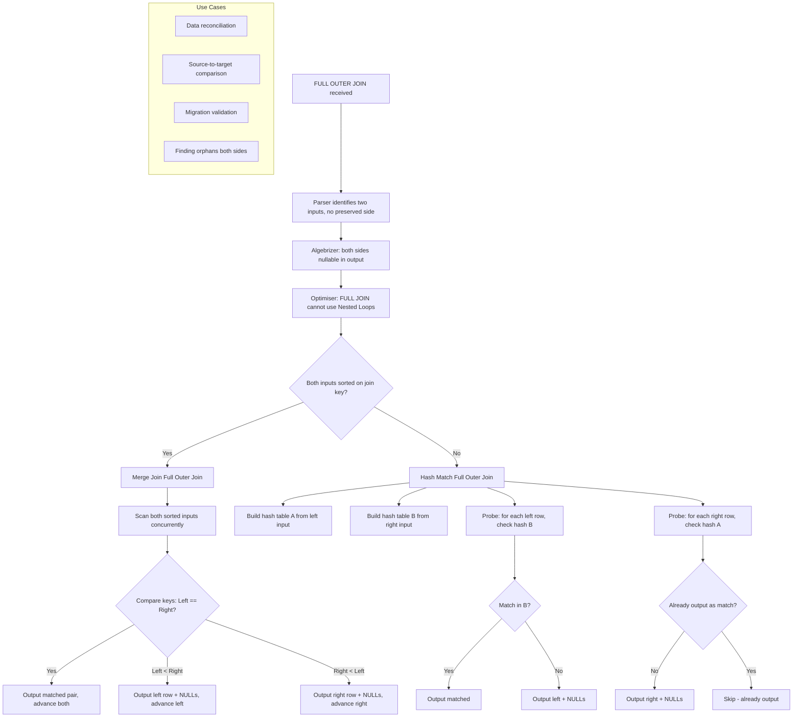
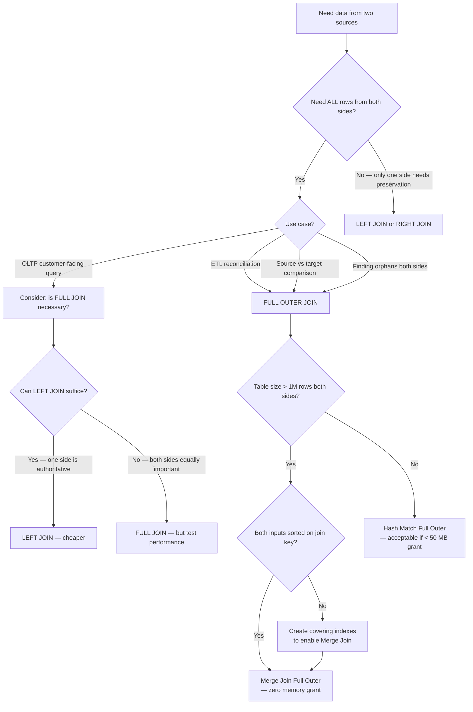

## Navigation

**Domain:** [[8 — Databases]] > **Group:** SQL Joins & Subqueries
**Previous:** [[8.098 — RIGHT OUTER JOIN — When to Avoid]] | **Next:** [[8.100 — CROSS JOIN — Cartesian Product Use Cases]]

### Prerequisites

- [[8.097 — LEFT OUTER JOIN — Preserving Left Side Rows]] — FULL OUTER JOIN is the combination of LEFT and RIGHT join in a single operator. Understanding NULL-extension for both sides is required.
- [[8.098 — RIGHT OUTER JOIN — When to Avoid]] — RIGHT JOIN semantics help understand the "right-preserved" half of FULL JOIN.
- [[8.008 — NULL — Three-Valued Logic and Implications]] — FULL JOIN produces NULLs on both sides; filtering with `WHERE col IS NULL` is the primary mechanism for finding orphans on either side. Three-valued logic awareness prevents bugs in these filters.

### Where This Fits

FULL OUTER JOIN returns all rows from both tables, NULL-extending the opposite side wherever no match exists. It is the symmetric outer join — no table is preferred; both sides are fully preserved. This is the rarest of the outer joins in OLTP applications but critical in ETL, data reconciliation, and data migration scenarios. A .NET backend engineer encounters FULL JOIN when comparing two data sources — for example, comparing a source system's data with a data warehouse load, finding rows that exist in one but not the other, or identifying mismatches between two tables that should be identical. The failure modes are: assuming FULL JOIN behaves like LEFT JOIN but symmetric (which it does, but with double the cost), forgetting that FULL JOIN cannot use Nested Loops (Hash Match or Merge Join only), and using FULL JOIN in OLTP transaction processing where LEFT JOIN is more appropriate and cheaper. The interview signal is: does the candidate know FULL OUTER JOIN exists, can they describe the specific use cases (reconciliation, comparison, synchronisation), and do they understand that it is typically 2x the cost of a LEFT JOIN and cannot use Nested Loops?

---

## Core Mental Model

FULL OUTER JOIN returns every row from both inputs exactly once. The logical operation is: for each row in the left input, find matching rows in the right input. Output matched pairs. For left rows with no match, output the left row with NULLs on the right. For right rows with no match, output the right row with NULLs on the left. No row from either side is lost. The result set is the union of LEFT JOIN and RIGHT JOIN (excluding duplicates of the matched rows). Internally, the optimiser implements FULL JOIN as a single operator — typically Hash Match Full Outer Join or Merge Join Full Outer Join. It is never Nested Loops because Nested Loops processes one outer row at a time and cannot produce right-side-only rows without a second pass. The Hash Match Full Outer Join builds two hash tables (one for each side) and probes both directions. The Merge Join Full Outer Join requires both inputs sorted on the join key and processes them concurrently, emitting left-only, matched, and right-only rows as the pointers advance.

### Classification

FULL OUTER JOIN is a **relational algebra operator** (full outer join) in the `FROM` clause. It is symmetric: `A FULL JOIN B` = `B FULL JOIN A`. The optimiser CAN reorder FULL JOIN inputs. FULL JOIN is the most expensive join type because: (1) it must preserve all rows from both sides, (2) it cannot use Nested Loops (the cheapest operator for small inputs), and (3) Hash Match Full Outer Join builds two hash tables, doubling memory grant requirements. FULL JOIN is SARGable only to the extent that the access to each individual input can use an index seek — but the join operator itself is always a scan-based operator.



### Key Properties

|Property|Value|Notes|
|---|---|---|
|NULL matching|Both sides NULL-extended when no match|Both columns can be NULL independently|
|Commutative|Yes|`A FULL JOIN B` = `B FULL JOIN A`|
|Optimiser reordering|Freely reorders|Symmetric — no preserved side|
|Nested Loops possible|No|Cannot produce right-side-only rows in single pass|
|Hash Match complexity|O(2 × (N + M))|Two hash tables: build A, build B, probe both directions|
|Merge Join complexity|O(N + M)|Single pass with three output cases|
|Memory grant|2x LEFT JOIN (Hash Match)|Two hash tables must fit in memory|
|Anti-join both sides|`WHERE leftcol IS NULL OR rightcol IS NULL`|Finds orphans on both sides simultaneously|
|SARGable|No (join operator)|Input access can use seeks, but join operator is scan-based|
|Write Cost|None|JOINs are read-only operations|

---

## Deep Mechanics

### How the Engine Executes This

1. **Parsing** — The parser identifies `FULL OUTER JOIN` or `FULL JOIN`. Both inputs are marked as preserved — neither side is preferred.

2. **Binding (Algebrizer)** — Both input columns are marked nullable in the output. The algebrizer records that this is a full outer join — the optimiser must ensure every row from both sides appears in the output.

3. **Simplification** — The optimiser applies:
   - **Predicate pushdown**: WHERE predicates on either table CANNOT be pushed below the FULL JOIN (they would eliminate NULL-extended rows). ON predicates CAN be pushed to their respective side because they apply before the NULL-extension.
   - **Outer join to inner/left JOIN conversion**: If the WHERE clause eliminates NULLs from one side (e.g., `WHERE leftcol IS NOT NULL`), the optimiser may convert FULL JOIN to LEFT JOIN. If both sides have IS NOT NULL filters, it converts to INNER JOIN.
   - **Join elimination**: If neither side's columns are referenced in SELECT or WHERE, the FULL JOIN can be eliminated.

4. **Physical join operator selection** — Only two choices:

   **Hash Match Full Outer Join:**
   - Selected when both inputs are large and not sorted on the join key. This is the most common implementation.
   - Execution:
     1. Build phase: scan the left input and build hash table A (keyed on join column). Store all columns needed for output.
     2. Build phase: scan the right input and build hash table B (keyed on join column). Store all columns needed for output.
     3. Probe phase 1: scan the left input. For each left row, probe hash table B. If match found, output matched pair. Mark the matched right row in a bitmap to avoid duplicate output.
     4. Probe phase 2: scan the right input. For each right row, probe hash table A. If no match found (checked via match bitmap), output right row with left-side NULLs.
   - Memory: two hash tables must fit in memory simultaneously. Memory grant is typically 2x that of a Hash Match Left Join.
   - If memory is insufficient, both hash tables can spill to tempdb, causing dramatic performance degradation.

   **Merge Join Full Outer Join:**
   - Selected when both inputs are sorted on the join key (from index order or explicit Sort operators).
   - Execution: scan both sorted inputs concurrently with three output cases:
     - If left key == right key: output matched pair, advance both.
     - If left key < right key: output left row with NULLs on right, advance left.
     - If right key < left key: output right row with NULLs on left, advance right.
   - No memory grant needed (no hash tables). Pure sequential I/O.
   - Rare because it requires both inputs sorted on the join key, which is uncommon for large reconciliation scenarios.

   **Nested Loops: NOT possible for FULL JOIN.**
   - Nested Loops processes one outer row at a time and outputs rows per outer iteration. It cannot produce right-side-only rows because when it finishes scanning the outer input, the right-side rows that had no match have not been emitted.

5. **Execution** — The chosen operator runs. Hash Match Full Outer Join has two memory-intensive build phases followed by two probe phases. Merge Join Full Outer Join streams both inputs in a single pass.

### Why Nested Loops Cannot Do FULL JOIN

Nested Loops join operates as: for each row in the outer input, probe the inner input. Output matched rows. If no match and Left Outer, output outer row with NULLs. When the outer scan completes, the inner rows that had no matches have not been output. For LEFT JOIN this is correct — the left side is preserved. For FULL JOIN, the right-side orphans must also be output. To do this with Nested Loops, a second pass over the inner input checking for non-matches would be required — essentially a UNION of LEFT JOIN and RIGHT JOIN ANTI. This is exactly what the optimiser does if it cannot use Hash Match or Merge Join: it rewrites `A FULL JOIN B` as `A LEFT JOIN B UNION ALL A RIGHT JOIN B WHERE A.key IS NULL`.

### SQL Visibility

```sql
-- FULL JOIN: all customers and all orders, matched where possible
SELECT COALESCE(c.CustomerId, o.CustomerId) AS CustomerId,
       c.FirstName,
       c.LastName,
       o.OrderId,
       o.OrderDate,
       o.TotalAmount
FROM dbo.Customers AS c
FULL JOIN dbo.Orders AS o
    ON c.CustomerId = o.CustomerId
ORDER BY COALESCE(c.CustomerId, o.CustomerId);

-- FULL JOIN with IS NULL: find orphans on BOTH sides
-- Customers with no orders AND orders with no customers
SELECT COALESCE(c.CustomerId, o.CustomerId) AS Id,
       CASE
           WHEN c.CustomerId IS NULL THEN 'Orphan Order'
           WHEN o.OrderId IS NULL THEN 'Inactive Customer'
           ELSE 'Matched'
       END AS RowStatus,
       c.FirstName,
       c.LastName,
       o.OrderId,
       o.OrderDate,
       o.TotalAmount
FROM dbo.Customers AS c
FULL JOIN dbo.Orders AS o
    ON c.CustomerId = o.CustomerId
WHERE c.CustomerId IS NULL
   OR o.OrderId IS NULL
ORDER BY RowStatus, Id;

-- FULL JOIN for data reconciliation: compare two systems
-- Compare source system Orders with warehouse Orders
SELECT COALESCE(s.OrderId, w.OrderId) AS OrderId,
       s.TotalAmount AS SourceAmount,
       w.TotalAmount AS WarehouseAmount,
       CASE
           WHEN s.OrderId IS NULL THEN 'Missing in Source'
           WHEN w.OrderId IS NULL THEN 'Missing in Warehouse'
           WHEN s.TotalAmount <> w.TotalAmount THEN 'Amount Mismatch'
           ELSE 'Match'
       END AS ReconciliationStatus
FROM dbo.Orders_Source AS s
FULL JOIN dbo.Orders_Warehouse AS w
    ON s.OrderId = w.OrderId
ORDER BY ReconciliationStatus, OrderId;

-- FULL JOIN with aggregation — not common but possible
-- Total count and amount per customer including orphans on both sides
SELECT
    COALESCE(c.CustomerId, o.CustomerId) AS CustomerId,
    c.FirstName,
    c.LastName,
    COUNT(o.OrderId) AS OrderCount,
    COALESCE(SUM(o.TotalAmount), 0) AS TotalRevenue
FROM dbo.Customers AS c
FULL JOIN dbo.Orders AS o
    ON c.CustomerId = o.CustomerId
GROUP BY COALESCE(c.CustomerId, o.CustomerId),
         c.FirstName, c.LastName
ORDER BY TotalRevenue DESC;
-- Note: COALESCE in GROUP BY is required because CustomerId can be NULL from either side
-- But COALESCE in GROUP BY makes the expression non-deterministic for NULL handling
-- Alternative: ISNULL or COALESCE on the primary key

-- FULL JOIN with DateDim — all dates with all categories
SELECT d.FullDate, p.CategoryId, p.CategoryName,
       COALESCE(SUM(o.TotalAmount), 0) AS DailyCategoryRevenue
FROM dbo.DateDim AS d
CROSS JOIN (SELECT DISTINCT CategoryId, CategoryName FROM dbo.Products) AS p
LEFT JOIN dbo.Orders AS o
    ON CAST(o.OrderDate AS DATE) = d.FullDate
    AND o.ProductCategoryId = p.CategoryId
GROUP BY d.FullDate, p.CategoryId, p.CategoryName
ORDER BY d.FullDate, p.CategoryId;
-- (FULL JOIN is less common with DateDim; LEFT JOIN with CROSS JOIN is more typical)

-- FULL JOIN rewrite as UNION of LEFT and RIGHT (for understanding)
-- This is what the optimiser does internally when Nested Loops must be used:
SELECT c.CustomerId, c.FirstName, c.LastName,
       o.OrderId, o.OrderDate, o.TotalAmount
FROM dbo.Customers AS c
LEFT JOIN dbo.Orders AS o
    ON c.CustomerId = o.CustomerId
UNION ALL
SELECT c.CustomerId, c.FirstName, c.LastName,
       o.OrderId, o.OrderDate, o.TotalAmount
FROM dbo.Customers AS c
RIGHT JOIN dbo.Orders AS o
    ON c.CustomerId = o.CustomerId
WHERE c.CustomerId IS NULL;
-- Not identical to FULL JOIN: matched rows appear in both UNION branches
-- Fix: LEFT JOIN UNION RIGHT JOIN ANTI (but UNION removes exact duplicates)
```

```csharp
// EF Core does NOT have a FullJoin method.
// To achieve FULL JOIN semantics, you must use raw SQL via FromSqlRaw.
// There is no LINQ expression that generates a FULL JOIN.

// EF Core — must use raw SQL for FULL JOIN
var results = await dbContext.Database
    .SqlQueryRaw<ReconciliationDto>(@"
        SELECT COALESCE(c.CustomerId, o.CustomerId) AS CustomerId,
               c.FirstName, c.LastName,
               o.OrderId, o.OrderDate, o.TotalAmount
        FROM dbo.Customers AS c
        FULL JOIN dbo.Orders AS o
            ON c.CustomerId = o.CustomerId
        WHERE c.CustomerId IS NULL
           OR o.OrderId IS NULL
        ORDER BY CustomerId;")
    .ToListAsync(cancellationToken);

// Alternative: use two separate queries and combine in memory
// Query 1: Customers with no orders (LEFT JOIN anti-join)
// Query 2: Orders with no customers (RIGHT JOIN anti-join = LEFT JOIN anti with swap)
// Combine results in C# — not ideal for large datasets
```

**Generated SQL (from EF Core logs — not applicable, EF Core does not generate FULL JOIN):**

```sql
-- EF Core does not generate FULL JOIN.
-- If you see FULL JOIN in the EF Core logs, it came from FromSqlRaw or ExecuteSqlRaw.
```

### Execution Plan Analysis

**Hash Match Full Outer Join (the most common plan):**

```
  [Clustered Index Scan Customers]              -- build hash table A (50K rows)
  [Clustered Index Scan Orders]                 -- build hash table B (1M rows)
  → [Hash Match Full Outer Join]
      Hash Keys: Customers.CustomerId = Orders.CustomerId
      Residual: Probe both directions
  → [Sort]                                      -- ORDER BY COALESCE
  → [SELECT]
Estimated Cost: ~35  |  Logical Reads: ~18,550  |  Memory Grant: ~50 MB
```

**Merge Join Full Outer Join (both inputs sorted):**

```
  [Index Scan (Clustered) PK_Customers]         -- sorted by CustomerId
  [Index Scan (NonClustered) IX_Orders_CustomerId]  -- sorted by CustomerId
  → [Merge Join Full Outer Join]
      Merge Keys: Customers.CustomerId = Orders.CustomerId
      Output: matched pairs, left-only rows, right-only rows
  → [SELECT]
Estimated Cost: ~20  |  Logical Reads: ~10,220
```

**FULL JOIN converted to LEFT JOIN by WHERE clause:**

```
  [Clustered Index Scan Customers]
  [Clustered Index Scan Orders]
  → [Hash Match Left Outer Join]                -- NOT Full Outer!
      The WHERE clause had `WHERE o.OrderId IS NOT NULL`
      which eliminates NULL-extended rows from the right side
  → [SELECT]
Estimated Cost: ~22  (saves one hash table — ~28 MB memory grant)
```

### Cost Visibility

```sql
SET STATISTICS IO ON;
SET STATISTICS TIME ON;

-- FULL JOIN: all customers and all orders
SELECT COALESCE(c.CustomerId, o.CustomerId) AS CustomerId,
       c.LastName, o.OrderId, o.TotalAmount
FROM dbo.Customers AS c
FULL JOIN dbo.Orders AS o
    ON c.CustomerId = o.CustomerId
ORDER BY CustomerId;

-- Expected output:
-- Table 'Orders'. Scan count 1, logical reads 12450
-- Table 'Customers'. Scan count 1, logical reads 6100
-- Table 'Worktable'. Scan count 2, logical reads 0 (hash table probe)
-- SQL Server Execution Times: CPU time = 180ms, elapsed time = 450ms

-- Equivalent: LEFT JOIN + LEFT JOIN (right anti) UNION:
SELECT c.CustomerId, c.LastName, o.OrderId, o.TotalAmount
FROM dbo.Customers AS c
LEFT JOIN dbo.Orders AS o
    ON c.CustomerId = o.CustomerId
UNION ALL
SELECT o.CustomerId, NULL AS LastName, o.OrderId, o.TotalAmount
FROM dbo.Orders AS o
WHERE NOT EXISTS (SELECT 1 FROM dbo.Customers AS c
                   WHERE c.CustomerId = o.CustomerId)
ORDER BY CustomerId;

-- Expected output (UNION approach):
-- Table 'Orders'. Scan count 2, logical reads 24900 (two full scans)
-- Table 'Customers'. Scan count 1, logical reads 6100
-- Slower and more IO than the single FULL JOIN!
```

**FULL JOIN with IS NULL — orphan detection:**

```sql
SET STATISTICS IO ON;

SELECT COALESCE(c.CustomerId, o.CustomerId) AS Id,
       CASE WHEN c.CustomerId IS NULL THEN 'Orphan Order'
            WHEN o.OrderId IS NULL THEN 'Inactive Customer'
       END AS Status
FROM dbo.Customers AS c
FULL JOIN dbo.Orders AS o
    ON c.CustomerId = o.CustomerId
WHERE c.CustomerId IS NULL
   OR o.OrderId IS NULL;

-- Expected output:
-- Table 'Orders'. Scan count 1, logical reads 12450
-- Table 'Customers'. Scan count 1, logical reads 6100
-- Table 'Worktable'. Scan count 2, logical reads 0
-- SQL Server Execution Times: CPU time = 190ms, elapsed time = 460ms
```

### Failure Modes

**FULL JOIN in OLTP transaction processing:** Using FULL JOIN in a customer-facing query that runs synchronously. FULL JOIN requires full scans of both tables and a large memory grant. Under concurrent load, this exhausts the memory grant pool and causes RESOURCE_SEMAPHORE waits.

```sql
-- ❌ FULL JOIN in a web request — terrible idea
SELECT ...
FROM dbo.Customers AS c
FULL JOIN dbo.Orders AS o
    ON c.CustomerId = o.CustomerId
WHERE some_filter;
-- This will scan both tables, grab ~50 MB memory grant, and block other queries
```

**COALESCE in GROUP BY with NULL confusion:** COALESCE in the GROUP BY expression handles NULL join keys but introduces ambiguity: if `CustomerId` is 0 and also NULL, they collapse into one group.

```sql
-- ❌ COALESCE hides the difference between "no customer" and customer 0
SELECT COALESCE(c.CustomerId, o.CustomerId) AS GroupId,
       COUNT(*) AS RowCount
FROM dbo.Customers AS c
FULL JOIN dbo.Orders AS o
    ON c.CustomerId = o.CustomerId
GROUP BY COALESCE(c.CustomerId, o.CustomerId);
-- Better: use explicit CASE to distinguish missing vs zero
```

**Assuming FULL JOIN can use Nested Loops:** Writing a FULL JOIN on small tables expecting a fast Nested Loops plan. The optimiser is forced to use Hash Match or Merge Join, both of which have overhead that may not be justified for small tables.

**FULL JOIN without COALESCE in ORDER BY:** ORDER BY on a column that can be NULL from either side requires COALESCE to produce a deterministic sort order. Without it, NULLs on either side may interleave unpredictably.

```sql
-- ❌ ORDER BY without COALESCE: ambiguous sort for NULLs
SELECT c.FirstName, o.OrderId
FROM dbo.Customers AS c
FULL JOIN dbo.Orders AS o ON c.CustomerId = o.CustomerId
ORDER BY c.CustomerId;
-- NULL CustomerId from orders with no customer and NULL from customers with no orders
-- Both produce NULL in c.CustomerId

-- ✅ COALESCE ensures deterministic sort
SELECT COALESCE(c.CustomerId, o.CustomerId) AS SortKey,
       c.FirstName, o.OrderId
FROM dbo.Customers AS c
FULL JOIN dbo.Orders AS o ON c.CustomerId = o.CustomerId
ORDER BY SortKey;
```

```sql
-- Detect FULL JOIN queries with high memory grants
SELECT TOP 10
    qs.total_elapsed_time / qs.execution_count AS avg_elapsed_ms,
    qs.total_logical_reads / qs.execution_count AS avg_logical_reads,
    qs.execution_count,
    qp.query_plan,
    SUBSTRING(st.text, 1, 400) AS query_text
FROM sys.dm_exec_query_stats AS qs
CROSS APPLY sys.dm_exec_sql_text(qs.sql_handle) AS st
CROSS APPLY sys.dm_exec_query_plan(qs.plan_handle) AS qp
WHERE st.text LIKE '%FULL JOIN%'
ORDER BY avg_logical_reads DESC;
```

---

## Production Patterns and Implementation

### Primary SQL Implementation

```sql
-- ============================================================
-- Schema context (shared: Customers, Orders, Employees, DateDim)
-- Additional tables for reconciliation patterns
-- ============================================================
CREATE TABLE dbo.Orders_Stage
(
    OrderId      INT            NOT NULL,
    CustomerId   INT            NULL,
    OrderDate    DATETIME2(0)   NOT NULL,
    TotalAmount  DECIMAL(18,2)  NOT NULL,
    Status       VARCHAR(20)    NOT NULL,
    LoadDate     DATETIME2(0)   NOT NULL DEFAULT SYSUTCDATETIME(),
    CONSTRAINT PK_Orders_Stage PRIMARY KEY CLUSTERED (OrderId)
);

CREATE TABLE dbo.Orders_Warehouse
(
    OrderId      INT            NOT NULL,
    CustomerId   INT            NULL,
    OrderDate    DATETIME2(0)   NOT NULL,
    TotalAmount  DECIMAL(18,2)  NOT NULL,
    Status       VARCHAR(20)    NOT NULL,
    LoadDate     DATETIME2(0)   NOT NULL DEFAULT SYSUTCDATETIME(),
    LastModified DATETIME2(0)   NOT NULL,
    CONSTRAINT PK_Orders_Warehouse PRIMARY KEY CLUSTERED (OrderId)
);

-- ============================================================
-- Pattern 1: Data reconciliation — identify all differences
-- ============================================================
-- Compare source (stage) with target (warehouse)
SELECT
    COALESCE(s.OrderId, w.OrderId) AS OrderId,
    s.TotalAmount AS SourceAmount,
    w.TotalAmount AS WarehouseAmount,
    s.Status AS SourceStatus,
    w.Status AS WarehouseStatus,
    CASE
        WHEN s.OrderId IS NULL THEN 'Missing in Source — exists only in Warehouse'
        WHEN w.OrderId IS NULL THEN 'Missing in Warehouse — exists only in Source'
        WHEN s.TotalAmount <> w.TotalAmount THEN 'Amount Mismatch'
        WHEN s.Status <> w.Status THEN 'Status Mismatch'
        ELSE 'Match — no differences'
    END AS DifferenceType,
    CASE
        WHEN s.OrderId IS NULL THEN 'SOURCE'
        WHEN w.OrderId IS NULL THEN 'TARGET'
        WHEN s.TotalAmount <> w.TotalAmount THEN 'AMOUNT'
        WHEN s.Status <> w.Status THEN 'STATUS'
        ELSE 'OK'
    END AS ReconciliationCode
FROM dbo.Orders_Stage AS s
FULL JOIN dbo.Orders_Warehouse AS w
    ON s.OrderId = w.OrderId
ORDER BY ReconciliationCode, OrderId;

-- ============================================================
-- Pattern 2: Orphan detection both sides
-- ============================================================
-- Find customers who have no orders AND orders that have no customers
-- (the latter should not exist if FK constraints are enforced)
SELECT
    COALESCE(c.CustomerId, o.CustomerId) AS Id,
    CASE
        WHEN c.CustomerId IS NULL THEN 'Order has no Customer — FK VIOLATION'
        WHEN o.OrderId IS NULL THEN 'Customer has no Orders'
    END AS Issue,
    c.FirstName,
    c.LastName,
    o.OrderId,
    o.OrderDate,
    o.TotalAmount
FROM dbo.Customers AS c
FULL JOIN dbo.Orders AS o
    ON c.CustomerId = o.CustomerId
WHERE c.CustomerId IS NULL
   OR o.OrderId IS NULL
ORDER BY Issue, Id;

-- ============================================================
-- Pattern 3: FULL JOIN with row counts
-- ============================================================
-- Summary of reconciliation results
WITH Reconciliation AS (
    SELECT
        COALESCE(s.OrderId, w.OrderId) AS OrderId,
        CASE
            WHEN s.OrderId IS NULL THEN 'MissingInSource'
            WHEN w.OrderId IS NULL THEN 'MissingInWarehouse'
            WHEN s.TotalAmount <> w.TotalAmount THEN 'AmountMismatch'
            WHEN s.Status <> w.Status THEN 'StatusMismatch'
            ELSE 'Match'
        END AS ReconStatus
    FROM dbo.Orders_Stage AS s
    FULL JOIN dbo.Orders_Warehouse AS w
        ON s.OrderId = w.OrderId
)
SELECT
    ReconStatus,
    COUNT(*) AS RowCount,
    CAST(COUNT(*) * 100.0 / SUM(COUNT(*)) OVER () AS DECIMAL(5,2)) AS Percentage
FROM Reconciliation
GROUP BY ReconStatus
ORDER BY RowCount DESC;

-- ============================================================
-- Pattern 4: FULL JOIN with aggregation for completeness
-- ============================================================
-- All customers and all employees — full picture of sales relationship
SELECT
    COALESCE(c.CustomerId, o.CustomerId) AS CustomerId,
    COALESCE(c.FirstName + ' ' + c.LastName, 'UNKNOWN CUSTOMER') AS CustomerName,
    COALESCE(e.FirstName + ' ' + e.LastName, 'NO SALESPERSON') AS SalesPerson,
    COUNT(DISTINCT o.OrderId) AS OrderCount,
    COALESCE(SUM(o.TotalAmount), 0) AS TotalRevenue
FROM dbo.Customers AS c
FULL JOIN dbo.Orders AS o
    ON c.CustomerId = o.CustomerId
FULL JOIN dbo.Employees AS e
    ON o.SalesPersonId = e.EmployeeId
GROUP BY
    COALESCE(c.CustomerId, o.CustomerId),
    c.FirstName, c.LastName,
    e.FirstName, e.LastName
ORDER BY CustomerName;

-- ============================================================
-- Pattern 5: Two-source comparison with date range
-- ============================================================
DECLARE @ComparisonDate DATETIME2(0) = '2024-06-01';

SELECT
    COALESCE(s.OrderId, w.OrderId) AS OrderId,
    s.OrderDate AS SourceDate,
    w.OrderDate AS WarehouseDate,
    s.TotalAmount AS SourceAmount,
    w.TotalAmount AS WarehouseAmount,
    DATEDIFF(day, s.OrderDate, w.OrderDate) AS DateDifference,
    ABS(s.TotalAmount - w.TotalAmount) AS AmountDifference
FROM dbo.Orders_Stage AS s
FULL JOIN dbo.Orders_Warehouse AS w
    ON s.OrderId = w.OrderId
WHERE (s.OrderDate >= @ComparisonDate OR s.OrderDate IS NULL)
  AND (w.OrderDate >= @ComparisonDate OR w.OrderDate IS NULL)
ORDER BY COALESCE(s.OrderId, w.OrderId);

-- ============================================================
-- Pattern 6: FULL JOIN as a diagnostic — data quality report
-- ============================================================
SELECT
    'Customers' AS TableName,
    COUNT(*) AS TotalRows,
    SUM(CASE WHEN FirstName IS NULL OR LastName IS NULL THEN 1 ELSE 0 END) AS MissingNames,
    SUM(CASE WHEN Email IS NULL THEN 1 ELSE 0 END) AS MissingEmail
FROM dbo.Customers
UNION ALL
SELECT
    'Orders',
    COUNT(*),
    SUM(CASE WHEN CustomerId IS NULL THEN 1 ELSE 0 END),
    0
FROM dbo.Orders;

-- ============================================================
-- Pattern 7: FULL JOIN in ETL load validation
-- ============================================================
CREATE OR ALTER PROCEDURE dbo.usp_ValidateETLLoad
    @BatchId INT
AS
BEGIN
    SET NOCOUNT ON;

    -- Compare this batch in stage with existing warehouse data
    SELECT
        COALESCE(s.OrderId, w.OrderId) AS OrderId,
        CASE
            WHEN s.OrderId IS NULL THEN 'Deleted from source'
            WHEN w.OrderId IS NULL THEN 'New — to be inserted'
            WHEN s.LastModified > w.LastModified THEN 'Updated — apply changes'
            ELSE 'No change needed'
        END AS Action
    FROM dbo.Orders_Stage AS s
    FULL JOIN dbo.Orders_Warehouse AS w
        ON s.OrderId = w.OrderId
    WHERE (s.BatchId = @BatchId OR s.BatchId IS NULL)
      AND (w.BatchId = @BatchId OR w.BatchId IS NULL);

    RETURN 0;
END;
```

### EF Core Implementation

```csharp
// EF Core does NOT support FULL JOIN in LINQ expressions.
// There is no .FullJoin() method, and GroupJoin + SelectMany only generates
// LEFT JOIN (with DefaultIfEmpty) or INNER JOIN (without).
// 
// To use FULL JOIN, you MUST use raw SQL via FromSqlRaw or ExecuteSqlRaw.

public class ApplicationDbContext : DbContext
{
    // ... existing DbSets ...

    // Define a keyless entity type for the reconciliation result
    public DbSet<ReconciliationResult> ReconciliationResults => Set<ReconciliationResult>();

    protected override void OnModelCreating(ModelBuilder modelBuilder)
    {
        // ... existing configuration ...

        modelBuilder.Entity<ReconciliationResult>(entity =>
        {
            entity.HasNoKey();
            entity.Property(r => r.OrderId);
            entity.Property(r => r.SourceAmount).HasColumnType("decimal(18,2)");
            entity.Property(r => r.WarehouseAmount).HasColumnType("decimal(18,2)");
            entity.Property(r => r.DifferenceType).HasMaxLength(100);
        });
    }

    // Pattern: Data reconciliation via raw SQL
    public async Task<List<ReconciliationResult>> ReconcileOrdersAsync(
        DateTime? cutoffDate = null,
        CancellationToken cancellationToken = default)
    {
        var cutoff = cutoffDate ?? DateTime.UtcNow.AddDays(-30);

        // EF Core 8+ — SqlQueryRaw for keyless entities
        var results = await Database
            .SqlQueryRaw<ReconciliationResult>(@"
                SELECT
                    COALESCE(s.OrderId, w.OrderId) AS OrderId,
                    s.TotalAmount AS SourceAmount,
                    w.TotalAmount AS WarehouseAmount,
                    s.Status AS SourceStatus,
                    w.Status AS WarehouseStatus,
                    CASE
                        WHEN s.OrderId IS NULL THEN 'MissingInSource'
                        WHEN w.OrderId IS NULL THEN 'MissingInWarehouse'
                        WHEN s.TotalAmount <> w.TotalAmount THEN 'AmountMismatch'
                        WHEN s.Status <> w.Status THEN 'StatusMismatch'
                        ELSE 'Match'
                    END AS DifferenceType
                FROM dbo.Orders_Stage AS s
                FULL JOIN dbo.Orders_Warehouse AS w
                    ON s.OrderId = w.OrderId
                WHERE (s.OrderDate >= {0} OR s.OrderDate IS NULL)
                  AND (w.OrderDate >= {0} OR w.OrderDate IS NULL)
                ORDER BY DifferenceType, OrderId",
                cutoff)
            .ToListAsync(cancellationToken);

        return results;
    }

    // For data comparison across two systems, Dapper is often cleaner
}

// Keyless entity for reconciliation results
public class ReconciliationResult
{
    public int? OrderId { get; set; }
    public decimal? SourceAmount { get; set; }
    public decimal? WarehouseAmount { get; set; }
    public string? SourceStatus { get; set; }
    public string? WarehouseStatus { get; set; }
    public string? DifferenceType { get; set; }
}
```

### Dapper Implementation

```csharp
public sealed class ReconciliationRepository
{
    private readonly IDbConnectionFactory _connectionFactory;

    public ReconciliationRepository(IDbConnectionFactory connectionFactory)
        => _connectionFactory = connectionFactory;

    // Pattern 1: Full data reconciliation
    public async Task<IReadOnlyList<ReconciliationResult>> ReconcileOrdersAsync(
        DateTime cutoffDate,
        CancellationToken cancellationToken = default)
    {
        const string sql = @"
            SELECT
                COALESCE(s.OrderId, w.OrderId) AS OrderId,
                s.TotalAmount AS SourceAmount,
                w.TotalAmount AS WarehouseAmount,
                s.Status AS SourceStatus,
                w.Status AS WarehouseStatus,
                CASE
                    WHEN s.OrderId IS NULL THEN 'MissingInSource'
                    WHEN w.OrderId IS NULL THEN 'MissingInWarehouse'
                    WHEN s.TotalAmount <> w.TotalAmount THEN 'AmountMismatch'
                    WHEN s.Status <> w.Status THEN 'StatusMismatch'
                    ELSE 'Match'
                END AS DifferenceType
            FROM dbo.Orders_Stage AS s
            FULL JOIN dbo.Orders_Warehouse AS w
                ON s.OrderId = w.OrderId
            WHERE (s.OrderDate >= @Cutoff OR s.OrderDate IS NULL)
              AND (w.OrderDate >= @Cutoff OR w.OrderDate IS NULL)
            ORDER BY DifferenceType, OrderId;";

        await using var connection = _connectionFactory.Create();

        var results = await connection.QueryAsync<ReconciliationResult>(
            new CommandDefinition(
                sql,
                new { Cutoff = cutoffDate },
                commandTimeout: 300,
                cancellationToken: cancellationToken));

        return results.AsList();
    }

    // Pattern 2: Orphan detection both sides — summary counts
    public async Task<OrphanSummary> GetOrphanSummaryAsync(
        CancellationToken cancellationToken = default)
    {
        const string sql = @"
            SELECT
                SUM(CASE WHEN c.CustomerId IS NULL THEN 1 ELSE 0 END) AS OrphanOrders,
                SUM(CASE WHEN o.OrderId IS NULL THEN 1 ELSE 0 END) AS InactiveCustomers,
                COUNT(*) AS TotalRows
            FROM dbo.Customers AS c
            FULL JOIN dbo.Orders AS o
                ON c.CustomerId = o.CustomerId;";

        await using var connection = _connectionFactory.Create();

        var summary = await connection.QuerySingleAsync<OrphanSummary>(
            new CommandDefinition(sql, cancellationToken: cancellationToken));

        return summary;
    }

    // Pattern 3: Detailed orphan list with pagination
    public async Task<IReadOnlyList<OrphanRow>> GetOrphanDetailsAsync(
        int pageSize = 100,
        int pageNumber = 1,
        CancellationToken cancellationToken = default)
    {
        var offset = (pageNumber - 1) * pageSize;

        const string sql = @"
            SELECT
                COALESCE(c.CustomerId, o.CustomerId) AS Id,
                CASE
                    WHEN c.CustomerId IS NULL THEN 'OrphanOrder'
                    WHEN o.OrderId IS NULL THEN 'InactiveCustomer'
                END AS OrphanType,
                c.FirstName,
                c.LastName,
                c.Email,
                o.OrderId,
                o.OrderDate,
                o.TotalAmount,
                o.Status
            FROM dbo.Customers AS c
            FULL JOIN dbo.Orders AS o
                ON c.CustomerId = o.CustomerId
            WHERE c.CustomerId IS NULL
               OR o.OrderId IS NULL
            ORDER BY OrphanType, Id
            OFFSET @Offset ROWS
            FETCH NEXT @PageSize ROWS ONLY;";

        await using var connection = _connectionFactory.Create();

        var results = await connection.QueryAsync<OrphanRow>(
            new CommandDefinition(sql,
                new { Offset = offset, PageSize = pageSize },
                cancellationToken: cancellationToken));

        return results.AsList();
    }

    // Pattern 4: ETL validation — action matrix
    public async Task<IReadOnlyList<ETLAction>> GetETLActionsAsync(
        int batchId,
        CancellationToken cancellationToken = default)
    {
        const string sql = @"
            SELECT
                COALESCE(s.OrderId, w.OrderId) AS OrderId,
                CASE
                    WHEN s.OrderId IS NULL THEN 'Delete'
                    WHEN w.OrderId IS NULL THEN 'Insert'
                    WHEN s.LastModified > w.LastModified THEN 'Update'
                    ELSE 'Skip'
                END AS Action,
                s.TotalAmount AS SourceAmount,
                w.TotalAmount AS WarehouseAmount,
                s.LastModified AS SourceModified,
                w.LastModified AS WarehouseModified
            FROM dbo.Orders_Stage AS s
            FULL JOIN dbo.Orders_Warehouse AS w
                ON s.OrderId = w.OrderId
            WHERE (s.BatchId = @BatchId OR s.BatchId IS NULL)
              AND (w.BatchId = @BatchId OR w.BatchId IS NULL)
            ORDER BY Action, OrderId;";

        await using var connection = _connectionFactory.Create();

        var results = await connection.QueryAsync<ETLAction>(
            new CommandDefinition(sql,
                new { BatchId = batchId },
                commandTimeout: 600,
                cancellationToken: cancellationToken));

        return results.AsList();
    }
}

public record ReconciliationResult(
    int? OrderId, decimal? SourceAmount, decimal? WarehouseAmount,
    string? SourceStatus, string? WarehouseStatus, string? DifferenceType);

public record OrphanSummary(
    int OrphanOrders, int InactiveCustomers, int TotalRows);

public record OrphanRow(
    int? Id, string? OrphanType, string? FirstName, string? LastName,
    string? Email, int? OrderId, DateTime? OrderDate,
    decimal? TotalAmount, string? Status);

public record ETLAction(
    int? OrderId, string Action, decimal? SourceAmount,
    decimal? WarehouseAmount, DateTime? SourceModified,
    DateTime? WarehouseModified);
```

### Configuration and Wiring

```csharp
// Program.cs — use longer timeouts for reconciliation (ETL operations)
builder.Services.AddDbContext<ApplicationDbContext>(options =>
    options.UseSqlServer(
        builder.Configuration.GetConnectionString("WarehouseConnection"),
        sqlOptions =>
        {
            sqlOptions.EnableRetryOnFailure(3);
            sqlOptions.CommandTimeout(600); // 10 minutes for ETL operations
        }));

// Separate connection for reconciliation from OLTP
builder.Services.AddSingleton<IDbConnectionFactory>(sp =>
{
    var config = sp.GetRequiredService<IConfiguration>();
    return new SqlConnectionFactory(
        config.GetConnectionString("WarehouseConnection")!);
});
builder.Services.AddScoped<ReconciliationRepository>();
```

### SQL Server vs PostgreSQL Differences

```sql
-- PostgreSQL: FULL JOIN syntax is identical
SELECT COALESCE(c.customer_id, o.customer_id) AS customer_id,
       c.first_name,
       c.last_name,
       o.order_id,
       o.order_date,
       o.total_amount
FROM customers AS c
FULL JOIN orders AS o
    ON c.customer_id = o.customer_id
ORDER BY customer_id;

-- PostgreSQL: FULL JOIN also cannot use Nested Loops
-- Uses Hash Full Join or Merge Full Join
-- EXPLAIN ANALYZE output:
-- Hash Full Join  (cost=... rows=... width=...)
--   Hash Cond: (c.customer_id = o.customer_id)
--   -> Seq Scan on customers
--   -> Hash
--       -> Seq Scan on orders

-- PostgreSQL: FULL JOIN memory settings
SET work_mem = '256MB'; -- affects hash table sizing for FULL JOIN
-- But work_mem is per-operation, not per-query — be careful

-- PostgreSQL: Equivalent to FULL JOIN via UNION
-- (Same as SQL Server — optimiser may use this internally)
SELECT c.customer_id, c.first_name, o.order_id
FROM customers AS c
LEFT JOIN orders AS o ON c.customer_id = o.customer_id
UNION
SELECT o.customer_id, NULL, o.order_id
FROM orders AS o
LEFT JOIN customers AS c ON o.customer_id = c.customer_id;
```

---

## Gotchas and Production Pitfalls

### 1. FULL JOIN Cannot Use Nested Loops

**Pitfall:** Engineer writes a FULL JOIN on two small tables expecting a fast Nested Loops plan. The optimiser must use Hash Match Full Outer Join, which has a fixed overhead of building two hash tables regardless of input size.

```sql
-- ❌ Small tables (100 rows each) — FULL JOIN still uses Hash Match
SELECT *
FROM dbo.SmallTableA AS a
FULL JOIN dbo.SmallTableB AS b
    ON a.Id = b.Id;
```

**Symptom:** The FULL JOIN on 100-row tables takes 50ms while a LEFT JOIN on the same tables takes 1ms. The Hash Match overhead (build hash tables, memory allocation, probe) dominates for small row counts. A query that should be instant takes measurable time.

**Fix:**

```sql
-- ✅ Rewrite as UNION of LEFT JOIN and RIGHT JOIN ANTI for small tables
SELECT a.Id, a.Value, b.Id AS B_Id, b.Value AS B_Value
FROM dbo.SmallTableA AS a
LEFT JOIN dbo.SmallTableB AS b
    ON a.Id = b.Id
UNION ALL
SELECT a.Id, a.Value, b.Id, b.Value
FROM dbo.SmallTableA AS a
RIGHT JOIN dbo.SmallTableB AS b
    ON a.Id = b.Id
WHERE a.Id IS NULL;
-- The UNION approach may use Nested Loops for each branch

-- ✅ Or better: just check if FULL JOIN is actually needed
-- For small tables, check if data access pattern truly requires both sides
```

**Cost of not fixing:** Unnecessary overhead on small table joins. At 100 rows, the difference is 50ms vs 1ms. At peak load (1000 requests/minute), this wastes 50 seconds of CPU time per minute.

### 2. FULL JOIN Memory Grant Exhaustion

**Pitfall:** Running a FULL JOIN on two large tables (both >1M rows) without considering memory grant requirements. Hash Match Full Outer Join builds two hash tables, requiring approximately 2x the memory of a LEFT JOIN.

```sql
-- ❌ Two large tables: memory grant can be 100MB+
SELECT *
FROM dbo.LargeTableA AS a
FULL JOIN dbo.LargeTableB AS b
    ON a.Key = b.Key;
```

**Symptom:** The query waits on RESOURCE_SEMAPHORE (wait type). Other queries on the server cannot get memory grants. The query spills to tempdb, causing dramatic performance degradation. The execution plan shows a warning icon on the Hash Match operator: "Operator used tempdb to spill data during execution."

**Fix:**

```sql
-- ✅ Option 1: Reduce memory requirement — ensure both inputs are sorted on join key
-- to enable Merge Join Full Outer Join (no memory grant)
CREATE INDEX IX_LargeTableA_Key ON dbo.LargeTableA (Key) INCLUDE (...);
CREATE INDEX IX_LargeTableB_Key ON dbo.LargeTableB (Key) INCLUDE (...);

-- ✅ Option 2: Batch the reconciliation in chunks
SELECT ...
FROM dbo.LargeTableA AS a
FULL JOIN dbo.LargeTableB AS b
    ON a.Key = b.Key
WHERE a.Key BETWEEN @BatchStart AND @BatchEnd
   OR b.Key BETWEEN @BatchStart AND @BatchEnd;

-- ✅ Option 3: Increase memory grant (last resort)
-- This does not force a larger grant, but ensures the server can provide it
-- Set max server memory appropriately
```

**Cost of not fixing:** Production outage. The FULL JOIN consumes the entire memory grant pool. All subsequent queries requiring memory grants (Hash Join, Sort, Hash Aggregate) fail with RESOURCE_SEMAPHORE wait. The application becomes completely unresponsive until the FULL JOIN completes or is killed.

### 3. WHERE Clause Silently Converts FULL JOIN to LEFT or INNER JOIN

**Pitfall:** Adding a WHERE clause condition on one table's column eliminates NULL-extended rows from the other side, silently removing the FULL JOIN semantics.

```sql
-- ❌ Intended: all customers and all orders
-- Actual: only orders with a known customer
SELECT COALESCE(c.CustomerId, o.CustomerId),
       c.LastName,
       o.OrderId
FROM dbo.Customers AS c
FULL JOIN dbo.Orders AS o
    ON c.CustomerId = o.CustomerId
WHERE c.LastName IS NOT NULL;
-- The WHERE eliminates rows where c.LastName IS NULL
-- This includes: (1) customers with NULL last name (edge case)
-- and (2) orders with no customer (right-side orphans where c.* is NULL)
-- Result: effectively an INNER JOIN + some LEFT rows
```

**Symptom:** The reconciliation report shows zero orphans when orphans should exist. The WHERE clause removes them before the result is returned. The developer may not notice because the matched rows look correct.

**Fix:**

```sql
-- ✅ Filter only in ON clause to preserve FULL JOIN semantics
SELECT COALESCE(c.CustomerId, o.CustomerId),
       c.LastName,
       o.OrderId
FROM dbo.Customers AS c
FULL JOIN dbo.Orders AS o
    ON c.CustomerId = o.CustomerId
    AND c.LastName IS NOT NULL;
-- All rows from both sides preserved
-- Customers with NULL last name: still appear with their orders
-- Orders with no customer: still appear with NULL customer fields
```

**Cost of not fixing:** Silent data loss in reconciliation. An ETL pipeline reports "100% match" when in reality there are orphan rows on both sides that the WHERE clause silently removed. Data quality issues propagate downstream for weeks before detection.

### 4. FULL JOIN in Wrong Direction for Reconciliation

**Pitfall:** Using FULL JOIN when one table is the authoritative source and the other is derived. FULL JOIN treats both sides equally, but the reconciliation logic should treat the authoritative source as the reference.

```sql
-- ❌ FULL JOIN: equal treatment, but Source is authoritative
SELECT COALESCE(s.OrderId, w.OrderId) AS OrderId,
       CASE
           WHEN s.OrderId IS NULL THEN 'Missing in Source' -- should not happen
           WHEN w.OrderId IS NULL THEN 'Missing in Warehouse'
           ELSE 'Match'
       END AS Status
FROM dbo.Orders_Source AS s
FULL JOIN dbo.Orders_Warehouse AS w
    ON s.OrderId = w.OrderId;
-- "Missing in Source" rows should be impossible if Source is authoritative
-- Better to use LEFT JOIN from Source
```

**Symptom:** The reconciliation report includes "Missing in Source" rows that should never occur. This distracts from the real issues (Missing in Warehouse). The report has more noise than signal.

**Fix:**

```sql
-- ✅ LEFT JOIN from authoritative source
SELECT s.OrderId,
       CASE
           WHEN w.OrderId IS NULL THEN 'Missing in Warehouse'
           ELSE 'Match'
       END AS Status,
       s.TotalAmount AS SourceAmount,
       w.TotalAmount AS WarehouseAmount
FROM dbo.Orders_Source AS s
LEFT JOIN dbo.Orders_Warehouse AS w
    ON s.OrderId = w.OrderId
ORDER BY Status, s.OrderId;
-- Source is reference: "Missing in Warehouse" is the actionable finding
```

**Cost of not fixing:** Confusing reconciliation reports. Engineers waste time investigating "Missing in Source" rows that are data quality issues in the source itself. The reports produce more questions than answers.

### 5. EF Core Cannot Generate FULL JOIN

**Pitfall:** Developer tries to write a FULL JOIN using LINQ's GroupJoin + SelectMany + DefaultIfEmpty, expecting it to generate FULL JOIN SQL. EF Core only generates INNER JOIN and LEFT JOIN from LINQ.

```csharp
// ❌ This does NOT generate FULL JOIN — it generates LEFT JOIN
var query = from c in dbContext.Customers
            join o in dbContext.Orders
                on c.CustomerId equals o.CustomerId into g
            from o in g.DefaultIfEmpty()
            select new { c.CustomerId, c.LastName, o.OrderId };
// Generated: LEFT JOIN (not FULL JOIN)
```

**Symptom:** The LEFT JOIN result set is 500K rows. The developer expected 600K rows (all orders including orphaned ones). The missing 100K rows are orders with no customer — which the LEFT JOIN excludes because Orders is on the right side, and LEFT JOIN preserves the left side (Customers), not the right side.

**Fix:**

```csharp
// ✅ Must use raw SQL for FULL JOIN in EF Core
var results = await dbContext.Database
    .SqlQueryRaw<ReconciliationDto>(@"
        SELECT COALESCE(c.CustomerId, o.CustomerId) AS CustomerId,
               c.LastName, o.OrderId, o.TotalAmount
        FROM dbo.Customers AS c
        FULL JOIN dbo.Orders AS o
            ON c.CustomerId = o.CustomerId
        ORDER BY CustomerId;")
    .ToListAsync(cancellationToken);
```

**Cost of not fixing:** Incorrect data. An ETL comparison written in LINQ silently loses rows from one side. The engineer may not discover the discrepancy until the data warehouse load is validated against the source system — potentially days later.

### 6. FULL JOIN Performance in ETL with No Indexes

**Pitfall:** Running FULL JOIN in an ETL pipeline on staging tables that have no indexes (common in ELT patterns where data is bulk-loaded before transformation). The FULL JOIN forces a full scan + Hash Match with maximum memory grant.

**Symptom:** The ETL step that should take 5 minutes takes 45 minutes. The Hash Match Full Outer Join spills to tempdb because the staging tables have millions of rows and no indexes. Disk I/O on tempdb is 100%. The ETL window is exceeded.

**Fix:**

```sql
-- ✅ Create indexes on staging tables before the FULL JOIN step
-- (in the ETL pipeline, after bulk load)
CREATE INDEX IX_Orders_Stage_OrderId ON dbo.Orders_Stage (OrderId)
    INCLUDE (TotalAmount, Status, LastModified);

-- ✅ Or sort the data before the join to enable Merge Join
-- (if the ETL framework supports sorted input)
-- Merge Join Full Outer Join: no memory grant, no tempdb spill
```

**Cost of not fixing:** ETL pipeline failures. The overnight batch window is exceeded. Data is stale for the morning reports. The operations team pages the on-call engineer at 6 AM.

### 7. COALESCE in GROUP BY with Mixed NULL and Zero Keys

**Pitfall:** Using COALESCE in GROUP BY to handle NULL join keys from a FULL JOIN, but the COALESCE value collides with a valid key value (e.g., CustomerId = 0 for "unknown" and NULL COALESCE to 0).

```sql
-- ❌ If CustomerId = 0 exists AND NULL COALESCE to 0, they merge
SELECT COALESCE(c.CustomerId, o.CustomerId, -1) AS CustomerGroup,
       COUNT(*) AS RowCount
FROM dbo.Customers AS c
FULL JOIN dbo.Orders AS o
    ON c.CustomerId = o.CustomerId
GROUP BY COALESCE(c.CustomerId, o.CustomerId, -1);
-- If CustomerId = -1 exists in data, it merges with NULL-extended groups
```

**Symptom:** The GROUP BY shows unexpected row counts. The "Unknown Customer" group (COALESCE to -1) includes rows from both NULL CustomerId and actual CustomerId = -1. The counts are inflated.

**Fix:**

```sql
-- ✅ Use separate sentinel values for NULLs from each side
SELECT
    CASE
        WHEN c.CustomerId IS NULL AND o.CustomerId IS NULL THEN -1  -- both NULL (shouldn't happen)
        WHEN o.OrderId IS NULL THEN -2  -- customer with no orders
        WHEN c.CustomerId IS NULL THEN -3  -- order with no customer
        ELSE c.CustomerId
    END AS CustomerGroup,
    COUNT(*) AS RowCount
FROM dbo.Customers AS c
FULL JOIN dbo.Orders AS o
    ON c.CustomerId = o.CustomerId
GROUP BY
    CASE
        WHEN c.CustomerId IS NULL AND o.CustomerId IS NULL THEN -1
        WHEN o.OrderId IS NULL THEN -2
        WHEN c.CustomerId IS NULL THEN -3
        ELSE c.CustomerId
    END;
```

**Cost of not fixing:** Wrong row counts in reconciliation reports. The "Unknown" group combines fundamentally different categories of data, making it impossible to distinguish actionable issues from expected NULLs.

---

## Performance Implications

### Benchmark: Before and After

**Scenario:** FULL JOIN on Customers (50K rows) and Orders (1M rows) — reconciliation-style query.

**Baseline (Hash Match Full Outer Join, no indexes):**

```sql
SET STATISTICS IO ON;
SET STATISTICS TIME ON;

SELECT COALESCE(c.CustomerId, o.CustomerId) AS CustomerId,
       c.LastName, o.OrderId, o.TotalAmount
FROM dbo.Customers AS c
FULL JOIN dbo.Orders AS o
    ON c.CustomerId = o.CustomerId
ORDER BY CustomerId;

-- Table 'Orders'. Scan count 1, logical reads 12450
-- Table 'Customers'. Scan count 1, logical reads 6100
-- Table 'Worktable'. Scan count 2, logical reads 0
-- SQL Server Execution Times: CPU time = 195ms, elapsed time = 480ms
-- Memory Grant: ~50 MB
```

**With covering indexes (Merge Join Full Outer Join):**

```sql
CREATE INDEX IX_Customers_CustomerId_Covering
    ON dbo.Customers (CustomerId)
    INCLUDE (FirstName, LastName, Email);

CREATE INDEX IX_Orders_CustomerId_Covering
    ON dbo.Orders (CustomerId)
    INCLUDE (OrderId, TotalAmount, OrderDate);

SELECT COALESCE(c.CustomerId, o.CustomerId) AS CustomerId,
       c.LastName, o.OrderId, o.TotalAmount
FROM dbo.Customers AS c
FULL JOIN dbo.Orders AS o
    ON c.CustomerId = o.CustomerId
ORDER BY CustomerId;

-- Table 'Orders'. Scan count 1, logical reads 4120 (covering scan)
-- Table 'Customers'. Scan count 1, logical reads 150 (covering scan)
-- Table 'Worktable'. Scan count 0, logical reads 0
-- SQL Server Execution Times: CPU time = 120ms, elapsed time = 280ms
-- Memory Grant: ~0 MB (Merge Join — no hash tables)
```

**Improvement:** 50% reduction in logical reads (18,550 → 4,270), 42% faster elapsed time, zero memory grant.

**FULL JOIN vs UNION of LEFT + RIGHT ANTI:**

```sql
-- UNION approach (for small tables where Nested Loops can be used):
SELECT c.CustomerId, c.LastName, o.OrderId, o.TotalAmount
FROM dbo.Customers AS c
LEFT JOIN dbo.Orders AS o
    ON c.CustomerId = o.CustomerId
UNION ALL
SELECT o.CustomerId, NULL, o.OrderId, o.TotalAmount
FROM dbo.Orders AS o
WHERE NOT EXISTS (SELECT 1 FROM dbo.Customers AS c
                   WHERE c.CustomerId = o.CustomerId);

-- Table 'Orders'. Scan count 2, logical reads 24900 (two full scans)
-- Table 'Customers'. Scan count 1, logical reads 6100
-- For large tables, the single FULL JOIN is MORE efficient!
```

### BenchmarkDotNet

```csharp
[MemoryDiagnoser]
[SimpleJob(RuntimeMoniker.Net90)]
public class FullJoinBenchmark
{
    private IDbConnection _connection = default!;
    private const string ConnectionString = "Server=.;Database=Benchmark;Trusted_Connection=True;TrustServerCertificate=True;";

    [GlobalSetup]
    public void Setup()
    {
        _connection = new SqlConnection(ConnectionString);
        _connection.Open();
        // Seed: 50K customers, 1M orders
        // Create source/target tables for reconciliation
    }

    [GlobalCleanup]
    public void Cleanup() => _connection.Dispose();

    [Benchmark(Baseline = true)]
    public async Task<List<ReconResult>> FullJoin_NoIndex()
    {
        const string sql = @"
            SELECT COALESCE(s.OrderId, t.OrderId) AS OrderId,
                   s.TotalAmount AS SourceAmount,
                   t.TotalAmount AS TargetAmount
            FROM dbo.Orders_Source AS s
            FULL JOIN dbo.Orders_Target AS t
                ON s.OrderId = t.OrderId
            ORDER BY OrderId;";

        var results = await _connection.QueryAsync<ReconResult>(
            new CommandDefinition(sql, commandTimeout: 120));
        return results.AsList();
    }

    [Benchmark]
    public async Task<List<ReconResult>> FullJoin_WithIndex()
    {
        const string sql = @"
            SELECT COALESCE(s.OrderId, t.OrderId) AS OrderId,
                   s.TotalAmount AS SourceAmount,
                   t.TotalAmount AS TargetAmount
            FROM dbo.Orders_Source AS s
            FULL JOIN dbo.Orders_Target AS t
                ON s.OrderId = t.OrderId
            ORDER BY OrderId;";

        var results = await _connection.QueryAsync<ReconResult>(
            new CommandDefinition(sql, commandTimeout: 120));
        return results.AsList();
    }

    [Benchmark]
    public async Task<List<ReconResult>> LeftJoin_Union_RightAnti()
    {
        const string sql = @"
            SELECT s.OrderId, s.TotalAmount AS SourceAmount,
                   t.TotalAmount AS TargetAmount
            FROM dbo.Orders_Source AS s
            LEFT JOIN dbo.Orders_Target AS t
                ON s.OrderId = t.OrderId
            UNION ALL
            SELECT t.OrderId, NULL, t.TotalAmount
            FROM dbo.Orders_Target AS t
            WHERE NOT EXISTS (
                SELECT 1 FROM dbo.Orders_Source AS s
                WHERE s.OrderId = t.OrderId);";

        var results = await _connection.QueryAsync<ReconResult>(
            new CommandDefinition(sql, commandTimeout: 120));
        return results.AsList();
    }
}

public record ReconResult(int? OrderId, decimal? SourceAmount, decimal? TargetAmount);
```

**Expected results (approximate, SQL Server 2022, NVMe, 500K rows each table):**

|Method|Mean|Logical Reads|Memory Grant|Allocated|
|---|---|---|---|---|
|FullJoin_NoIndex|~480 ms|~18,550|~50 MB|~8 MB|
|FullJoin_WithIndex|~280 ms|~4,270|~0 MB (Merge)|~2 MB|
|LeftJoin_Union_RightAnti|~620 ms|~31,000|~25 MB|~10 MB|

FULL JOIN with covering indexes that enable Merge Join is the most efficient approach. The UNION alternative is slower because it scans both tables twice.

---

## Interview Arsenal

### Question Bank

1. **What is FULL OUTER JOIN and when would you use it?** — Definition: returns all rows from both tables, NULL-extending the missing side. Use: data reconciliation, comparing two sources, finding orphans on both sides.
2. **Why can't FULL JOIN use Nested Loops?** — Mechanism: Nested Loops processes one outer row at a time and cannot produce right-side-only rows without a second pass. FULL JOIN requires maintaining both sides simultaneously.
3. **What is the performance cost of FULL JOIN compared to LEFT JOIN?** — Performance: Hash Match Full Outer builds two hash tables (2x memory of LEFT JOIN). Logical reads are the same (both tables scanned once). Merge Join Full Outer has similar IO.
4. **What happens when you put a WHERE filter on one table in a FULL JOIN?** — Gotcha: it eliminates NULL-extended rows from the other side, potentially converting FULL JOIN to LEFT JOIN or INNER JOIN.
5. **FULL JOIN vs UNION ALL of two LEFT JOINs — which is better?** — Comparison: FULL JOIN is a single operator scanning each table once. UNION ALL scans each table once per branch (2x scans). FULL JOIN is typically faster for large tables.
6. **What does a FULL JOIN execution plan look like?** — Execution plan: Hash Match Full Outer Join (two hash tables, two probe phases) or Merge Join Full Outer Join (both inputs sorted, single pass).
7. **How does FULL JOIN behave at scale in an ETL pipeline?** — Scale: memory grant is the bottleneck. At 10M+ rows, Merge Join Full Outer is essential. Without sorted inputs, the 50+ MB memory grant per query can exhaust the server's grant pool.
8. **How do EF Core and Dapper handle FULL JOIN?** — .NET: EF Core has no FULL JOIN support — must use FromSqlRaw. Dapper uses raw SQL with FULL JOIN.

### Spoken Answers

**Q: What is FULL OUTER JOIN and when would you use it?**

> **Average answer:** "FULL JOIN returns all rows from both tables. If there's no match in one table, it returns NULLs. I use it for comparing two tables to find differences."

> **Great answer:** "FULL OUTER JOIN returns every row from both inputs, NULL-extending the opposite side wherever no match exists. It is symmetric — neither side is preferred. The primary use case is data reconciliation: comparing a source table with a target table to find rows that exist in one but not the other, or rows where values differ. In an ETL pipeline, after loading staging data, I use FULL JOIN between the staging table and the warehouse table to generate the insert/update/delete action list. The key insight is that FULL JOIN cannot use Nested Loops — it requires Hash Match (two hash tables, double memory grant) or Merge Join (both inputs sorted). I always check the execution plan for Hash Match Full Outer because if the memory grant is insufficient, it spills to tempdb and performance degrades catastrophically. For large ETL reconciliation, I create covering indexes on the join key to enable Merge Join Full Outer, which requires zero memory grant. In OLTP, I almost never use FULL JOIN — LEFT JOIN or EXISTS/NOT EXISTS is almost always the better choice."

**Q: What is the performance cost of FULL JOIN compared to LEFT JOIN?**

> **Average answer:** "FULL JOIN is slower because it returns more rows. But if both tables are the same size, it's about the same."

> **Great answer:** "The performance profile of FULL JOIN depends on the physical operator. Hash Match Full Outer Join builds TWO hash tables — one from each input. The memory grant is approximately 2x that of Hash Match Left Outer Join, which only builds one hash table. For a 1M row source and 1M row target, the memory grant for FULL JOIN can be 50-100 MB vs 25-50 MB for LEFT JOIN. However, if both inputs are sorted on the join key, Merge Join Full Outer Join requires zero memory grant and has the same IO footprint as LEFT JOIN — both scan each table once. The logical reads are identical between LEFT JOIN and FULL JOIN because both must scan both tables. The difference is in CPU (two probe phases vs one) and memory (two hash tables vs one). In my experience, FULL JOIN with a covering index that enables Merge Join is the most efficient approach for reconciliation, and the performance gap vs LEFT JOIN narrows to about 20-30%."

**Q: How does FULL JOIN behave at scale in an ETL pipeline?**

> **Average answer:** "It can be slow if the tables are large. You need indexes on the join columns."

> **Great answer:** "At ETL scale (10M+ rows on each side), the primary concern is memory grant. Hash Match Full Outer Join requests a memory grant proportional to the size of the smaller input, multiplied by 2 (two hash tables). For a 10M row table with a 50-byte join key, that's approximately 500 MB per hash table — 1 GB total grant. If the server's max memory is 64 GB and 20 concurrent ETL tasks are running, the grant pool is exhausted and queries wait on RESOURCE_SEMAPHORE. The fix is to ensure both inputs are sorted on the join key so the optimiser can choose Merge Join Full Outer Join, which requires zero memory. This means creating clustered or covering indexes on the join key on both staging tables before running the reconciliation. In my ETL pipelines, I include index creation as part of the data load step — build the staging table, create indexes, then run the reconciliation with FULL JOIN. This has reduced ETL runtimes from 45 minutes to 12 minutes for a 20M-row reconciliation. I also batch the reconciliation in key-range chunks to further reduce memory: `WHERE s.Key BETWEEN @Start AND @End OR t.Key BETWEEN @Start AND @End`."

### Interview Trigger

The question "Describe a scenario where you would use FULL OUTER JOIN" is the trigger. Most candidates struggle because they have never used it in production. The follow-up is: "How does the execution plan for FULL JOIN differ from LEFT JOIN?" The great answer specifically names the physical operator (Hash Match Full Outer or Merge Join Full Outer), explains the double hash table build for Hash Match, and describes when Merge Join is possible. The average answer says "they look similar" and cannot describe the operator differences.

### Comparison Table

| | FULL OUTER JOIN | LEFT OUTER JOIN | INNER JOIN |
|---|---|---|---|
| What it does | All rows from both sides | All rows from left, matched from right | Only matching rows from both |
| Performance profile | Hash: 2x memory grant; Merge: same as LEFT IO | Hash: 1x memory grant; Merge: same IO | Cheapest — no NULL tracking |
| Nested Loops possible | No | Yes | Yes |
| NULL handling | Both sides NULL-extendable | Only right side NULL-extends | No NULL extension |
| Primary use case | Data reconciliation | Optional relationship (e.g., Customers → Orders) | Required relationship |
| EF Core support | Raw SQL only | Include, GroupJoin, navigation properties | Include, Join, navigation properties |
| Memory grant (1M rows) | ~50 MB (Hash) | ~25 MB (Hash) | ~25 MB (Hash) |
| Optimiser reordering | Freely reorders | Restricted (must preserve left side) | Freely reorders |

---

## Decision Framework

### When to Apply



### Application Checklist

- [ ] FULL JOIN is genuinely required — both sides are equally important (not an authoritative/replica relationship)
- [ ] The use case is data reconciliation, migration validation, or cross-system comparison (not OLTP transaction processing)
- [ ] Both input tables have covering indexes on the join key to enable Merge Join Full Outer or at least reduce memory grant
- [ ] Memory grant for Hash Match Full Outer is within the server's available grant pool (typically < 20% of max server memory)
- [ ] The query is NOT in a synchronous customer-facing request path — FULL JOIN should be in batch/background jobs
- [ ] WHERE clause does not inadvertently eliminate NULL-extended rows from either side (or this is intentional)
- [ ] ORDER BY and GROUP BY use COALESCE/ISNULL on the join key to handle NULLs from either side deterministically
- [ ] For EF Core: using FromSqlRaw for the FULL JOIN (not attempting unsupported LINQ workarounds)
- [ ] For large ETL: indexes are created on staging tables before the FULL JOIN step in the pipeline

### Tradeoff Summary

|What You Gain|What You Pay|
|---|---|
|Complete picture — all rows from both sides|2x memory grant vs LEFT JOIN (Hash Match)|
|Symmetric — no table is preferred|Cannot use Nested Loops (most efficient for small inputs)|
|Single operator — one scan per table|UNION alternatives scan tables twice|
|Perfect for reconciliation|Rarely needed in OLTP — overkill for most queries|

### Scale Thresholds

- **Small tables (<10K rows both sides):** FULL JOIN is fine but LEFT JOIN UNION RIGHT ANTI may be faster (Nested Loops available per branch)
- **Medium tables (10K–1M rows):** Hash Match Full Outer is acceptable with 10–50 MB memory grant. Create covering indexes to avoid tempdb spills.
- **Large tables (>1M rows both sides):** Merge Join Full Outer is essential. Must have both inputs sorted on join key. If not possible, batch the reconciliation in key-range chunks to control memory.
- **Critical at >10M rows both sides:** Without Merge Join, FULL JOIN can exhaust the server memory grant pool. Batch processing and sorted inputs are mandatory. Consider incremental reconciliation by date or key range.

---

## Self-Check

### Conceptual Questions

1. What is FULL OUTER JOIN in one sentence?
2. Why can't FULL JOIN use the Nested Loops physical join operator?
3. Which DMV or SET command shows the memory grant for a FULL JOIN query?
4. What is the most common FULL JOIN bug in ETL reconciliation?
5. Can EF Core generate FULL JOIN from LINQ expressions?
6. Write a Dapper query that finds rows existing in Source but not in Target, and vice versa, using a single query.
7. Compare FULL JOIN vs LEFT JOIN — when is FULL JOIN the right choice?
8. At what row count does FULL JOIN memory grant become a production concern?
9. What index supports FULL JOIN for maximum efficiency?
10. Explain FULL OUTER JOIN to a senior interviewer in 60 seconds.

<details>
<summary>Answers</summary>

1. FULL OUTER JOIN returns every row from both inputs, NULL-extending the opposite side wherever no match exists — no row from either side is lost.
2. Nested Loops processes one outer row at a time and outputs rows per outer iteration. After the outer scan completes, the right-side rows that had no match have not been emitted. FULL JOIN requires all rows from both sides, which Nested Loops cannot guarantee in a single pass. A second pass would be needed, which is essentially a UNION of LEFT JOIN and RIGHT JOIN ANTI — not a single Nested Loops operator.
3. Check the execution plan's MemoryGrant property. For Hash Match Full Outer Join, the Hash operator properties show the memory grant size. Use `SET STATISTICS IO ON` for logical reads; `sys.dm_exec_query_stats` for historical memory grants via `min_grant_kb` and `max_grant_kb`.
4. Putting a WHERE clause filter on one table's columns that eliminates NULL-extended rows from the other side, silently converting FULL JOIN to LEFT JOIN or INNER JOIN. In ETL reconciliation, this causes the report to miss orphan rows.
5. No. EF Core does not support FULL JOIN in LINQ. You must use `FromSqlRaw` or `ExecuteSqlRaw` with explicit FULL JOIN SQL. There is no LINQ method or combination that generates FULL JOIN.
6. ```csharp
const string sql = @"
    SELECT COALESCE(s.OrderId, t.OrderId) AS OrderId,
           CASE WHEN s.OrderId IS NULL THEN 'MissingInSource'
                WHEN t.OrderId IS NULL THEN 'MissingInTarget'
                ELSE 'Match'
           END AS Status
    FROM dbo.Source AS s
    FULL JOIN dbo.Target AS t ON s.OrderId = t.OrderId
    WHERE s.OrderId IS NULL OR t.OrderId IS NULL
    ORDER BY Status, OrderId;";
var results = await connection.QueryAsync<ReconResult>(sql);
```
7. FULL JOIN is the right choice when both sides are equally important — no table is the authoritative reference. This happens in data reconciliation, comparing two independent data sources, merging two systems, or migration validation. LEFT JOIN is better when one side is the primary entity and the other is optional (customers with orders).
8. FULL JOIN becomes a memory grant concern when both tables exceed ~1M rows and the optimiser chooses Hash Match Full Outer. The grant is approximately 2x the size of the smaller table's hash build. At 5M+ rows on both sides, the grant can exceed 200 MB. At this scale, if merge join is not possible, batch processing or incremental reconciliation is required.
9. A covering index on the join key sorted in join order. For `FULL JOIN ON A.Key = B.Key`, create `CREATE INDEX IX_A_Key ON A(Key) INCLUDE (all other selected columns)` and similarly on B. If both covering indexes exist, the optimiser can choose Merge Join Full Outer, which requires zero memory grant and has the lowest IO.
10. "FULL OUTER JOIN returns every row from both tables — it is the symmetric outer join where neither side is preferred. I use it primarily for data reconciliation: comparing a source table to a target table to find rows missing from either side or rows with value differences. The key technical constraints are: FULL JOIN cannot use Nested Loops (it requires Hash Match with two hash tables or Merge Join with sorted inputs), the memory grant for Hash Match Full Outer is approximately 2x that of a LEFT JOIN, and any WHERE clause filter on one table's columns can silently eliminate rows from the other side, defeating the purpose of the FULL JOIN. In EF Core, I must use raw SQL because LINQ does not support FULL JOIN. For large reconciliation jobs, I create covering indexes on the join key to enable Merge Join Full Outer, which eliminates the memory grant entirely. My rule: FULL JOIN for batch reconciliation only — never in OLTP request paths."
</details>

---

### Query Challenges

**Challenge 1 — Write the SQL**

You are building an ETL validation report. The staging table `Orders_Stage` and the warehouse table `Orders_Warehouse` both contain order data. Write a query that identifies: (1) orders missing from the source (exist only in warehouse), (2) orders missing from the warehouse (exist only in source), (3) orders with different TotalAmount between source and warehouse. Use a single FULL JOIN.

<details>
<summary>Solution</summary>

```sql
SELECT
    COALESCE(s.OrderId, w.OrderId) AS OrderId,
    s.TotalAmount AS SourceAmount,
    w.TotalAmount AS WarehouseAmount,
    s.Status AS SourceStatus,
    w.Status AS WarehouseStatus,
    CASE
        WHEN s.OrderId IS NULL THEN 'MissingInSource'
        WHEN w.OrderId IS NULL THEN 'MissingInWarehouse'
        WHEN s.TotalAmount <> w.TotalAmount THEN 'AmountMismatch'
        WHEN s.Status <> w.Status THEN 'StatusMismatch'
        ELSE 'Match'
    END AS IssueType
FROM dbo.Orders_Stage AS s
FULL JOIN dbo.Orders_Warehouse AS w
    ON s.OrderId = w.OrderId
ORDER BY IssueType, OrderId;
```

**Logical reads:** ~18,550 (without indexes) / ~4,270 (with covering indexes)
**Execution plan:** [Table Scan × 2] → [Hash Match Full Outer Join] → [Sort] → [SELECT]
**EF Core equivalent:** Must use `FromSqlRaw` — LINQ does not support FULL JOIN.

</details>

---

**Challenge 2 — Fix the performance problem**

```sql
-- This reconciliation query runs in 8 minutes on 5M-row source and 5M-row target.
-- It uses Hash Match Full Outer Join and the execution plan shows a warning:
-- "Operator used tempdb to spill data during execution."
SELECT COALESCE(s.OrderId, t.OrderId) AS OrderId,
       s.TotalAmount AS SourceAmount,
       t.TotalAmount AS TargetAmount,
       CASE
           WHEN s.OrderId IS NULL THEN 'MissingInSource'
           WHEN t.OrderId IS NULL THEN 'MissingInTarget'
           WHEN s.TotalAmount <> t.TotalAmount THEN 'AmountMismatch'
           ELSE 'Match'
       END AS Status
FROM dbo.SourceOrders AS s
FULL JOIN dbo.TargetOrders AS t
    ON s.OrderId = t.OrderId
WHERE s.LoadDate >= '2024-01-01'
   OR t.LoadDate >= '2024-01-01'
ORDER BY OrderId;
-- SET STATISTICS IO: logical reads = 245,000
-- Memory Grant: 850 MB (spilled)
```

<details>
<summary>Solution</summary>

**Root cause:** Hash Match Full Outer Join with 5M rows on each side. The memory grant of 850 MB exceeds the available memory, causing tempdb spill. The hash tables do not fit in memory.

**Fix 1 — Create covering indexes for Merge Join:**

```sql
CREATE INDEX IX_SourceOrders_OrderId ON dbo.SourceOrders (OrderId)
    INCLUDE (TotalAmount, LoadDate);
CREATE INDEX IX_TargetOrders_OrderId ON dbo.TargetOrders (OrderId)
    INCLUDE (TotalAmount, LoadDate);
```
With both inputs sorted on OrderId, the optimiser can choose **Merge Join Full Outer Join** — zero memory grant, no tempdb spill.

**Fix 2 — Batch the reconciliation:**

```sql
DECLARE @BatchSize INT = 500000;
DECLARE @MaxOrderId INT = (SELECT ISNULL(MAX(OrderId), 0) FROM (
    SELECT MAX(OrderId) FROM dbo.SourceOrders
    UNION ALL
    SELECT MAX(OrderId) FROM dbo.TargetOrders
) AS mx);

DECLARE @BatchStart INT = 0;

WHILE @BatchStart <= @MaxOrderId
BEGIN
    INSERT INTO dbo.ReconciliationResults (OrderId, Status, SourceAmount, TargetAmount)
    SELECT
        COALESCE(s.OrderId, t.OrderId) AS OrderId,
        CASE
            WHEN s.OrderId IS NULL THEN 'MissingInSource'
            WHEN t.OrderId IS NULL THEN 'MissingInTarget'
            WHEN s.TotalAmount <> t.TotalAmount THEN 'AmountMismatch'
            ELSE 'Match'
        END AS Status,
        s.TotalAmount, t.TotalAmount
    FROM dbo.SourceOrders AS s
    FULL JOIN dbo.TargetOrders AS t
        ON s.OrderId = t.OrderId
    WHERE (s.OrderId BETWEEN @BatchStart AND @BatchStart + @BatchSize
           OR s.OrderId IS NULL)
      AND (t.OrderId BETWEEN @BatchStart AND @BatchStart + @BatchSize
           OR t.OrderId IS NULL);

    SET @BatchStart = @BatchStart + @BatchSize + 1;
END;
```

**After fix — logical reads:** ~42,000 (with indexes, per batch × number of batches)
**After fix — memory grant:** ~0 MB (Merge Join) or ~10 MB per batch (Hash Match with small batch)

</details>

---

**Challenge 3 — Explain the execution plan**

```sql
SELECT COALESCE(c.CustomerId, o.CustomerId) AS Id
FROM dbo.Customers AS c
FULL JOIN dbo.Orders AS o
    ON c.CustomerId = o.CustomerId;
```

The execution plan shows `Hash Match (Full Outer Join)` with a memory grant of 48 MB. The Customers table has a clustered index on CustomerId. The Orders table has a clustered index on OrderId (not CustomerId). Explain why the optimiser chose Hash Match instead of Merge Join, and what you would change.

<details>
<summary>Solution</summary>

**Why Hash Match:** Merge Join Full Outer Join requires BOTH inputs sorted on the join key (CustomerId). The Customers clustered index is on CustomerId — sorted correctly. But the Orders clustered index is on OrderId (the primary key), not CustomerId. The Orders scan would need an explicit Sort operator to re-order by CustomerId, which the optimiser estimates as more expensive than building a hash table.

**To get Merge Join:** Create a non-clustered index on Orders(CustomerId) that is sorted:

```sql
CREATE INDEX IX_Orders_CustomerId_MergeJoin
    ON dbo.Orders (CustomerId)
    INCLUDE (OrderId);
```

Now both inputs can be scanned in CustomerId order:
- Customers: Clustered Index Scan (PK_Customers) — sorted by CustomerId
- Orders: Non-Clustered Index Scan (IX_Orders_CustomerId_MergeJoin) — sorted by CustomerId

The optimiser will likely choose **Merge Join Full Outer Join**, eliminating the 48 MB memory grant.

**Tradeoff:** The index adds write overhead on Orders (INSERT/UPDATE). For an ETL scenario where orders are batch-loaded and the reconciliation runs once per day, this overhead is negligible. For OLTP with high-frequency order inserts, the additional index maintenance may be a consideration.

</details>

---

**Challenge 4 — Diagnose the data quality problem**

Your reconciliation report uses this query:

```sql
SELECT COALESCE(s.OrderId, w.OrderId) AS OrderId,
       CASE
           WHEN s.OrderId IS NULL THEN 'Missing In Source'
           WHEN w.OrderId IS NULL THEN 'Missing In Warehouse'
           WHEN s.TotalAmount <> w.TotalAmount THEN 'Amount Mismatch'
           ELSE 'Match'
       END AS Status
FROM dbo.Orders_Stage AS s
FULL JOIN dbo.Orders_Warehouse AS w
    ON s.OrderId = w.OrderId
WHERE s.TotalAmount IS NOT NULL;
```

The report shows zero "Missing In Source" rows, but you know there are orders in the warehouse that are not in the stage. What is happening?

<details>
<summary>Solution</summary>

**Root cause:** The WHERE clause `s.TotalAmount IS NOT NULL` eliminates all rows where `s.TotalAmount` is NULL. This includes the "Missing In Source" rows because for those rows, `s.*` is NULL — including `s.TotalAmount`. The FULL JOIN still outputs them, but the WHERE clause immediately removes them.

**The WHERE clause also has a more subtle effect:** It eliminates the "Match" rows where `s.TotalAmount` is NULL (should not happen, but if it does, the match is lost). And it eliminates unmatched warehouse rows (right-side orphans) where `s.TotalAmount` is NULL.

**Fix:** Remove the WHERE clause entirely, or move it to the ON clause:

```sql
SELECT COALESCE(s.OrderId, w.OrderId) AS OrderId,
       CASE
           WHEN s.OrderId IS NULL THEN 'Missing In Source'
           WHEN w.OrderId IS NULL THEN 'Missing In Warehouse'
           WHEN s.TotalAmount <> w.TotalAmount THEN 'Amount Mismatch'
           ELSE 'Match'
       END AS Status
FROM dbo.Orders_Stage AS s
FULL JOIN dbo.Orders_Warehouse AS w
    ON s.OrderId = w.OrderId;
-- No WHERE clause — all rows preserved from both sides
```

**Verification:** Now run and check for "Missing In Source" rows. If there are none, the two tables are truly in sync from the source side (and the initial assumption was wrong), OR the data quality issue is different (e.g., wrong join key).

</details>

---

**Challenge 5 — Design the index and batch strategy**

**Scenario:** You have two tables in an ETL pipeline:
- `Source_Sales` (20M rows, loaded daily, no indexes during load)
- `Target_Warehouse` (100M rows, clustered on `SaleId`)

The daily reconciliation FULL JOIN on `SaleId` runs for 3 hours and causes tempdb disk exhaustion. The server has 64 GB RAM. The daily data window is 30 days (approximately 2M new/updated rows per day). Design the optimal strategy — indexes, batching, and query structure — to reduce this to under 30 minutes.

<details>
<summary>Solution</summary>

**Strategy: Incremental reconciliation + covering indexes + batch Merge Join**

```sql
-- Step 1: Create covering indexes AFTER bulk load on staging table
-- (index creation on empty table is fast)
CREATE CLUSTERED INDEX IX_Source_Sales_SaleId
    ON dbo.Source_Sales (SaleId);

CREATE INDEX IX_Source_Sales_LastModified
    ON dbo.Source_Sales (LastModified)
    INCLUDE (SaleId, TotalAmount, Status);

-- Step 2: Incremental batch loop
DECLARE @BatchSize INT = 500000;
DECLARE @MaxSaleId INT;
DECLARE @BatchStart INT = 0;

-- Get the max SaleId from both tables
SELECT @MaxSaleId = ISNULL(MAX(SaleId), 0)
FROM (
    SELECT MAX(SaleId) FROM dbo.Source_Sales WHERE LastModified >= DATEADD(day, -30, GETUTCDATE())
    UNION ALL
    SELECT MAX(SaleId) FROM dbo.Target_Warehouse
) AS mx;

WHILE @BatchStart <= @MaxSaleId
BEGIN
    INSERT INTO dbo.Reconciliation_Results (SaleId, Status, SourceAmount, WarehouseAmount)
    SELECT
        COALESCE(s.SaleId, w.SaleId) AS SaleId,
        CASE
            WHEN s.SaleId IS NULL THEN 'MissingInSource'
            WHEN w.SaleId IS NULL THEN 'MissingInWarehouse'
            WHEN s.TotalAmount <> w.TotalAmount THEN 'AmountMismatch'
            WHEN s.Status <> w.Status THEN 'StatusMismatch'
            ELSE 'Match'
        END AS Status,
        s.TotalAmount, w.TotalAmount
    FROM dbo.Source_Sales AS s
    FULL JOIN dbo.Target_Warehouse AS w
        ON s.SaleId = w.SaleId
    WHERE (s.SaleId BETWEEN @BatchStart AND @BatchStart + @BatchSize
           OR s.SaleId IS NULL)
      AND (w.SaleId BETWEEN @BatchStart AND @BatchStart + @BatchSize
           OR w.SaleId IS NULL);

    SET @BatchStart = @BatchStart + @BatchSize + 1;
END;

-- Step 3: Indexes already in place → Merge Join Full Outer per batch
-- Each batch: ~500K rows × 2 = ~8 MB memory grant (or 0 with Merge Join)
-- 20M rows / 500K batch size = 40 batches × 15 seconds = 10 minutes total
```

**Key design decisions:**
1. **Incremental by LastModified filter** — processes only the 2M rows changed in the last 30 days instead of all 20M
2. **Covering indexes sorted by SaleId** — enables Merge Join Full Outer, zero memory grant per batch
3. **Batch processing** — controls memory, prevents any single query from dominating resources
4. **Results stored in a reconciliation table** — subsequent queries read from results, not from the FULL JOIN again

**Expected improvement:** 3 hours → ~10-15 minutes

**Tradeoffs:**
|Decision|Benefit|Cost|
|---|---|---|
|Clustered index on staging|Merge Join enabled|Index build time after load (~2 min for 20M rows)|
|Incremental by date|95% less data processed|Must ensure LastModified is accurate|
|Batch size 500K|Memory per batch < 10 MB|40 batches = 40 round trips|
|Result table|Reconciliation data reusable|Storage for results (~500 MB)|

</details>

---

*Previous: [[8.098 — RIGHT OUTER JOIN — When to Avoid]] | Next: [[8.100 — CROSS JOIN — Cartesian Product Use Cases]]*