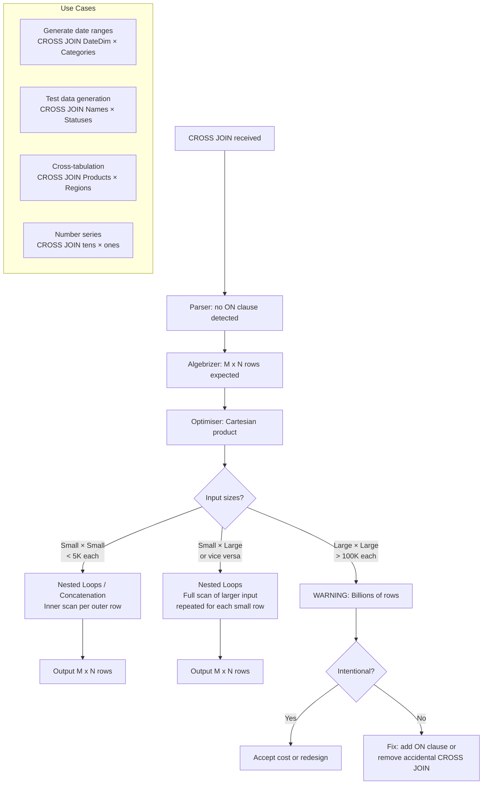
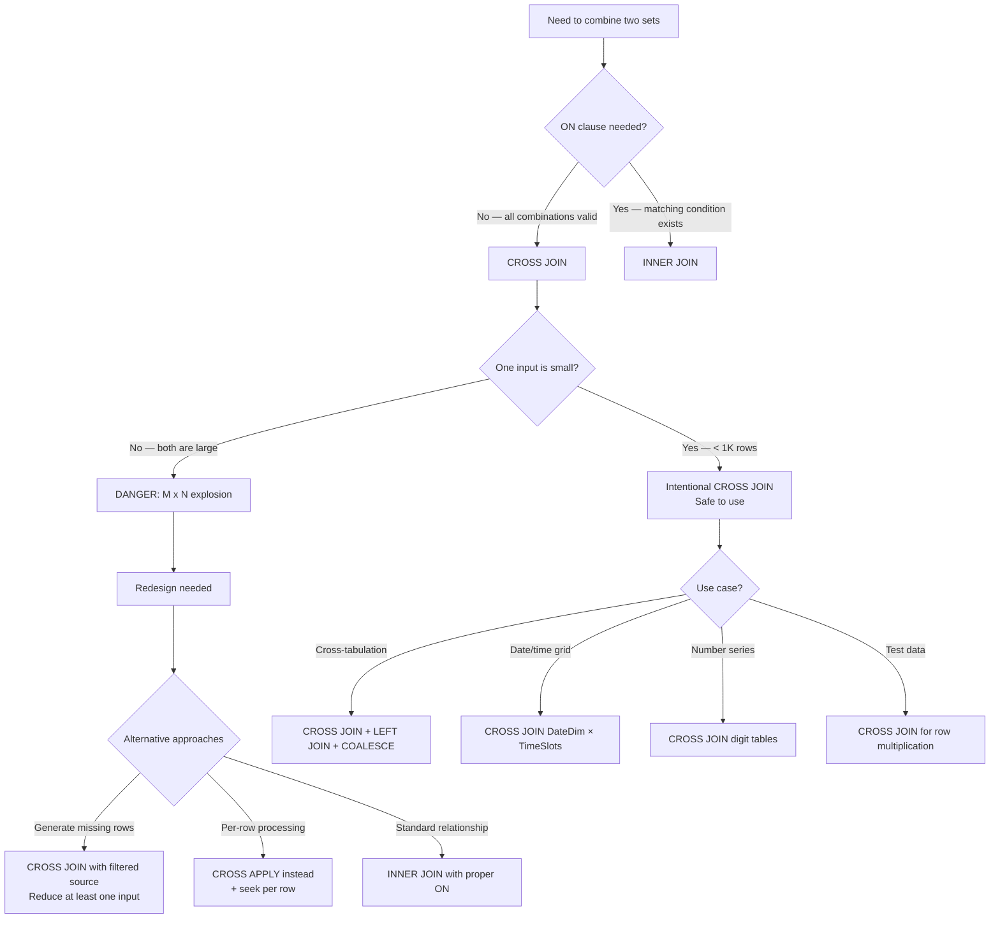

## Navigation

**Domain:** [[8 — Databases]] > **Group:** SQL Joins & Subqueries
**Previous:** [[8.099 — FULL OUTER JOIN — All Rows Both Sides]] | **Next:** [[8.101 — SELF JOIN — Same Table Relationships]]

### Prerequisites

- [[8.096 — INNER JOIN — Mechanics and Usage]] — CROSS JOIN is the simplest join: every row from A paired with every row from B with no ON clause. Understanding Nested Loops (the physical operator for CROSS JOIN) is required to understand the performance implications.
- [[8.067 — WHERE Clause — Predicate Logic and SARGability]] — CROSS JOIN with a WHERE clause is logically equivalent to INNER JOIN without an ON clause. The WHERE clause filter on a CROSS JOIN is applied after the Cartesian product is generated, which is almost always the wrong approach.

### Where This Fits

CROSS JOIN produces the Cartesian product of two tables: every row from table A paired with every row from table B. No ON clause. Size = M × N rows. This is simultaneously one of the most dangerous SQL operations (accidental Cartesian product can produce billions of rows) and one of the most useful for data generation tasks — creating date ranges, generating test data, producing cross-tabulation reports, and enumerating combinations of values. A .NET backend engineer encounters CROSS JOIN in reporting scenarios: generating a complete grid of dates × products for a sales dashboard, creating all possible time-slot × room combinations for a booking system, or generating number series for test data. The failure mode is the accidental CROSS JOIN — omitting the ON clause in an INNER JOIN by mistake, producing a query that never finishes or fills tempdb with billions of rows. The interview signal is: does the candidate know when CROSS JOIN is intentional vs accidental, can they estimate row counts from a Cartesian product, and do they know that CROSS APPLY is often a better alternative for row-by-row generation?

---

## Core Mental Model

CROSS JOIN combines every row from the first input with every row from the second input. No join predicate. No ON clause. The result has M × N rows where M is the row count of the first table and N is the row count of the second. If A has 100 rows and B has 100 rows, the result is 10,000 rows. If A has 100K rows and B has 100K rows, the result is 10 BILLION rows — a production-crashing number. The logical operation is a double loop: for each row in A, iterate through all rows in B and output one combined row. The physical operator is Nested Loops without a join predicate (sometimes called "Nested Loops (Cross Join)" or simply a full scan of both inputs with concatenation). Because there is no predicate, the Nested Loops operator makes no attempt to seek — it scans the inner input completely for every outer row. The optimiser may use a more efficient strategy known as "concatenation" for small inputs, but the fundamental cost is O(M × N). CROSS JOIN is the building block for generating missing-data rows in reporting (CROSS JOIN dates with categories, then LEFT JOIN actual data) and for test data generation.

### Classification

CROSS JOIN is a **relational algebra operator** (Cartesian product, times, cross product). It belongs to the `FROM` clause. There is no ON clause — no predicate. CROSS JOIN is NOT SARGable (there is no predicate to seek on). The performance is entirely determined by the input sizes. The optimiser always uses a form of Nested Loops (without join predicate) for CROSS JOIN. Explicit CROSS JOIN syntax (`A CROSS JOIN B`) is preferred over implicit comma-join syntax (`FROM A, B`) for clarity and to avoid accidental Cartesian products during refactoring.



### Key Properties

|Property|Value|Notes|
|---|---|---|
|Result size|M × N rows|Cartesian product — grows multiplicatively|
|ON clause|None (syntax error)|CROSS JOIN cannot have ON|
|WHERE clause equivalent|`FROM A, B WHERE predicate`|Implicit comma-join — avoid|
|INNER JOIN equivalent|`A CROSS JOIN B WHERE A.col = B.col`|Always use explicit INNER JOIN instead|
|Physical operator|Nested Loops (no join predicate)|Inner table scanned fully per outer row|
|Complexity|O(M × N)|Every outer × every inner|
|SARGable|No|No predicate to seek on|
|Use cases|Date generation, test data, cross-tab|Intentional Cartesian products|
|Accidental cost|Extreme|Can crash the server|
|CROSS JOIN vs CROSS APPLY|CROSS JOIN: all × all; CROSS APPLY: row-by-row function|APPLY can filter per row|

---

## Deep Mechanics

### How the Engine Executes This

1. **Parsing** — The parser identifies `CROSS JOIN` as a Cartesian product with no ON clause. If an ON clause is present, a parsing error occurs: "Incorrect syntax near 'ON'." SQL Server also accepts comma-separated table names in FROM: `FROM A, B` — this is an implicit CROSS JOIN and is strongly discouraged.

2. **Binding (Algebrizer)** — The algebrizer computes the estimated row count as M × N. For small tables, this is fine. For 100K-row tables, the estimate is 10 billion — the algebrizer may switch to a different strategy or warn via the optimizer. The column references must be unambiguous (same column in both tables requires table alias qualification).

3. **Simplification** — The optimiser applies:
   - **Join reordering**: CROSS JOIN is commutative and associative — `A CROSS JOIN B CROSS JOIN C` can be reordered freely.
   - **Cross join removal**: If the CROSS JOIN is unnecessary (no columns from one table are referenced), it can be eliminated.
   - **Cross join to INNER JOIN conversion**: If a WHERE clause predicate references columns from both inputs, the optimiser treats it as a join predicate and may choose an INNER JOIN physical operator with a filter. The plan may show `Nested Loops (Inner Join)` instead of `Nested Loops (Cross Join)`.

4. **Physical operator** — The optimiser has limited choices:

   **Nested Loops (Cross Join) — most common:**
   - For each row in the outer input (typically the smaller), scan the ENTIRE inner input.
   - No join predicate — every inner row produces an output row.
   - If the outer input has M rows and the inner has N rows, the inner is scanned M times.
   - Cost: M × N rows of I/O and CPU.
   - SQL Server may use a "concatenation" strategy for very small inputs where it materialises both and concatenates without looping.

   **Hash Match or Merge Join are NOT used for pure CROSS JOIN:**
   - Hash Match builds a hash table on one input and probes with the other — but without a join key, every row would be a match. This is essentially M × N anyway, with additional hash overhead.
   - Merge Join requires sorted inputs — but without a join key to compare, Merge Join degrades to M × N.
   - The optimiser always chooses Nested Loops for CROSS JOIN.

5. **Execution** — The Nested Loops operator reads the outer input once. For each outer row, it resets the inner input scan to the beginning and reads all N rows. The inner scan may use a pre-fetch strategy (read-ahead) to improve throughput, but the fundamental scaling is multiplicative.

### SQL Visibility

```sql
-- Explicit CROSS JOIN: every customer × every product (for what-if analysis)
SELECT c.CustomerId, c.LastName, p.ProductId, p.ProductName
FROM dbo.Customers AS c
CROSS JOIN dbo.Products AS p
ORDER BY c.LastName, p.ProductName;

-- Equivalently: comma-separated FROM (avoid — confusing)
SELECT c.CustomerId, c.LastName, p.ProductId, p.ProductName
FROM dbo.Customers AS c, dbo.Products AS p
ORDER BY c.LastName, p.ProductName;

-- CROSS JOIN with WHERE (equivalent to INNER JOIN — but expensive)
-- Find which products each customer COULD have ordered this year
SELECT c.CustomerId, c.LastName, p.ProductId, p.ProductName
FROM dbo.Customers AS c
CROSS JOIN dbo.Products AS p
WHERE p.CategoryId IN (1, 2, 3)
ORDER BY c.LastName, p.ProductName;
-- Filter is applied AFTER Cartesian product — wastes CPU.

-- Better: CROSS JOIN to limited set (derived table)
SELECT c.CustomerId, c.LastName, p.ProductId, p.ProductName
FROM dbo.Customers AS c
CROSS JOIN (
    SELECT ProductId, ProductName
    FROM dbo.Products
    WHERE CategoryId IN (1, 2, 3)
) AS p
ORDER BY c.LastName, p.ProductName;

-- Generating a date range: CROSS JOIN DateDim with times
SELECT d.FullDate, t.TimeSlot
FROM dbo.DateDim AS d
CROSS JOIN (
    VALUES ('09:00'), ('10:00'), ('11:00'), ('12:00'),
           ('13:00'), ('14:00'), ('15:00'), ('16:00')
) AS t(TimeSlot)
WHERE d.FullDate BETWEEN '2024-01-01' AND '2024-01-07'
ORDER BY d.FullDate, t.TimeSlot;

-- Number series via CROSS JOIN (generates 0-999)
SELECT (tens.Digit * 10 + ones.Digit) AS Number
FROM (VALUES (0),(1),(2),(3),(4),(5),(6),(7),(8),(9)) AS tens(Digit)
CROSS JOIN (VALUES (0),(1),(2),(3),(4),(5),(6),(7),(8),(9)) AS ones(Digit)
ORDER BY Number;

-- Cross-tabulation: all Product × Region combinations
SELECT p.ProductName, r.RegionName,
       COALESCE(s.SalesAmount, 0) AS SalesAmount
FROM dbo.Products AS p
CROSS JOIN dbo.Regions AS r
LEFT JOIN dbo.Sales AS s
    ON p.ProductId = s.ProductId
    AND r.RegionId = s.RegionId
    AND s.SalesYear = 2024
ORDER BY p.ProductName, r.RegionName;

-- Multiple CROSS JOINs: generate all combinations of attributes
SELECT
    s.SizeName,
    c.ColorName,
    m.MaterialName
FROM dbo.ProductSizes AS s
CROSS JOIN dbo.ProductColors AS c
CROSS JOIN dbo.ProductMaterials AS m
ORDER BY s.SizeName, c.ColorName, m.MaterialName;

-- CROSS JOIN with aggregation — average order value per product per customer
-- (for analysis, not for production OLTP)
SELECT
    c.CustomerId,
    p.ProductId,
    AVG(oi.UnitPrice) AS AvgPricePaid,
    COUNT(oi.OrderItemId) AS TimesOrdered
FROM dbo.Customers AS c
CROSS JOIN dbo.Products AS p
LEFT JOIN dbo.Orders AS o
    ON c.CustomerId = o.CustomerId
LEFT JOIN dbo.OrderItems AS oi
    ON o.OrderId = oi.OrderId
    AND oi.ProductId = p.ProductId
GROUP BY c.CustomerId, p.ProductId
ORDER BY c.CustomerId, p.ProductId;
```

```csharp
// EF Core — CROSS JOIN via SelectMany on unrelated entities
var allCombinations = await dbContext.Customers
    .SelectMany(
        c => dbContext.Products,
        (c, p) => new
        {
            c.CustomerId,
            CustomerName = c.FirstName + " " + c.LastName,
            p.ProductId,
            p.ProductName
        })
    .OrderBy(x => x.CustomerName)
    .ThenBy(x => x.ProductName)
    .ToListAsync(cancellationToken);

// Generated SQL:
// SELECT [c].[CustomerId], ... [p].[ProductId], [p].[ProductName]
// FROM [Customers] AS [c]
// CROSS JOIN [Products] AS [p]
// ORDER BY ...

// EF Core — Explicit cross-join query syntax
var crossJoin = await (
    from c in dbContext.Customers
    from p in dbContext.Products
    orderby c.LastName, p.ProductName
    select new
    {
        c.CustomerId,
        CustomerName = c.FirstName + " " + c.LastName,
        p.ProductId,
        p.ProductName
    })
    .ToListAsync(cancellationToken);

// EF Core — CROSS JOIN for date generation (with raw SQL)
// EF Core cannot generate date series natively — use raw SQL
var dateRange = await dbContext.Database
    .SqlQueryRaw<DateRow>(@"
        SELECT d.FullDate, t.TimeSlot
        FROM dbo.DateDim AS d
        CROSS JOIN (VALUES ('09:00'), ('10:00'), ('11:00'),
                           ('12:00'), ('13:00'), ('14:00')) AS t(TimeSlot)
        WHERE d.FullDate BETWEEN '2024-01-01' AND '2024-01-07'
        ORDER BY d.FullDate, t.TimeSlot;")
    .ToListAsync(cancellationToken);

// EF Core — cross-tabulation pattern: CROSS JOIN + LEFT JOIN
var salesGrid = await (
    from p in dbContext.Products
    from r in dbContext.Regions
    join s in dbContext.Sales
        on new { p.ProductId, r.RegionId } equals new { s.ProductId, s.RegionId }
        into salesGroup
    from s in salesGroup.DefaultIfEmpty()
    where s == null || s.SalesYear == 2024
    select new SalesGridRow
    {
        ProductName = p.ProductName,
        RegionName = r.RegionName,
        SalesAmount = s == null ? 0m : s.SalesAmount
    })
    .ToListAsync(cancellationToken);
```

**Generated SQL (from EF Core logs) — SelectMany cross join:**

```sql
SELECT [c].[CustomerId], [c].[FirstName], [c].[LastName],
       [p].[ProductId], [p].[ProductName]
FROM [Customers] AS [c]
CROSS JOIN [Products] AS [p]
ORDER BY [c].[LastName], [p].[ProductName];
```

### Execution Plan Analysis

**Nested Loops Cross Join (small tables, intentional):**

```
  [Table Scan Products]                       -- outer: 100 rows
  [Table Scan Customers]                      -- inner: 50K rows (scanned 100 times!)
  → [Nested Loops (Cross Join)]
      No join predicate — every outer × every inner
  → [Sort]                                     -- ORDER BY
  → [SELECT]
Estimated Cost: ~45  |  Actual Rows: 5,000,000 (100 × 50K)
Logical Reads: Products: 2 pages (once); Customers: 200 pages × 100 scans = 20,000
```

**CROSS JOIN with WHERE clause (converted to INNER JOIN by optimiser):**

```
  [Index Seek IX_Products_CategoryId]          -- outer: filtered 1,000 rows
  [Clustered Index Scan Customers]             -- inner: 50K rows (scanned 1000 times?)
  → [Nested Loops (Inner Join)]                -- note: Inner Join, not Cross Join!
      The optimiser pushed the WHERE predicate
      into a join condition internally
  → [SELECT]
Estimated Cost: ~5  |  Actual Rows: 50,000,000 (1,000 × 50K)
```

**CROSS JOIN with LEFT JOIN (cross-tabulation pattern):**

```
  [Table Scan Products]                        -- 100 rows
  [Table Scan Regions]                         -- 10 rows
  → [Nested Loops (Cross Join)]
      Output: 1,000 rows (100 × 10)
  [Index Seek IX_Sales_ProductId_RegionId]     -- per cross-join row
  → [Nested Loops (Left Outer Join)]
  → [SELECT]
Estimated Cost: ~8  |  Actual Rows: 1,000 + matched sales rows
```

### Cost Visibility

```sql
SET STATISTICS IO ON;
SET STATISTICS TIME ON;

-- Intentional CROSS JOIN: 50 customers × 500 products = 25,000 rows
SELECT c.CustomerId, p.ProductId
FROM dbo.Customers AS c
CROSS JOIN dbo.Products AS p;

-- Expected output:
-- Table 'Products'. Scan count 1, logical reads 4
-- Table 'Customers'. Scan count 1, logical reads 150
-- SQL Server Execution Times: CPU time = 5ms, elapsed time = 15ms

-- Accidental CROSS JOIN (no ON clause, but INNER JOIN intended):
SELECT c.CustomerId, c.LastName, o.OrderId, o.TotalAmount
FROM dbo.Customers AS c
INNER JOIN dbo.Orders AS o
    ON 1 = 1;  -- ❌ Accidental Cartesian: 50K customers × 1M orders = 50 BILLION rows
-- This will run until tempdb fills or the query is killed

-- CROSS JOIN with WHERE (filter after product):
SELECT c.CustomerId, p.ProductId, p.ProductName
FROM dbo.Customers AS c
CROSS JOIN dbo.Products AS p
WHERE p.CategoryId = 5;

-- Expected output:
-- Table 'Products'. Scan count 1, logical reads 4
-- Table 'Customers'. Scan count 1, logical reads 150 (but scanned 50 times!)
-- 50 customers × filtered products = ~500 rows
-- Better: filter Products BEFORE the cross join
```

### Failure Modes

**Accidental Cartesian product from missing ON clause:** The most common CROSS JOIN bug. An INNER JOIN is written without an ON clause, or the ON condition is accidentally commented out, or the comma-join syntax is misinterpreted.

```sql
-- ❌ Accidental: ON clause missing — MySQL accepts this, SQL Server rejects
-- (in SQL Server, INNER JOIN without ON is a syntax error)
-- But comma-join syntax accepts it:
SELECT c.CustomerId, o.OrderId
FROM dbo.Customers AS c,
     dbo.Orders AS o;
-- No join condition: Cartesian product of 50K × 1M = 50B rows
```

**CROSS JOIN with WHERE instead of ON (performance disaster):** Using `A CROSS JOIN B WHERE A.col = B.col` instead of `A INNER JOIN B ON A.col = B.col`. The optimiser may convert it, but the Cartesian product is materialised before the filter in the execution plan unless predicate pushdown occurs.

```sql
-- ❌ Inefficient: WHERE filter after product
SELECT c.CustomerId, o.OrderId
FROM dbo.Customers AS c
CROSS JOIN dbo.Orders AS o
WHERE c.CustomerId = o.CustomerId;

-- ✅ Efficient: ON predicate during join
SELECT c.CustomerId, o.OrderId
FROM dbo.Customers AS c
INNER JOIN dbo.Orders AS o
    ON c.CustomerId = o.CustomerId;
```

**CROSS JOIN on large tables without WHERE:** A CROSS JOIN of two 100K-row tables produces 10 billion rows. The query will fill tempdb, consume all disk I/O, and potentially crash the SQL Server.

```sql
-- ❌ Production crashing query:
SELECT *
FROM dbo.LargeTableA   -- 100K rows
CROSS JOIN dbo.LargeTableB;  -- 100K rows
-- Result: 10,000,000,000 rows. tempdb fills. Server becomes unresponsive.
```

**CROSS JOIN in EF Core SelectMany without realizing it's a cross join:** When a developer writes nested `from` clauses in LINQ on unrelated entity sets without a `join` clause, EF Core generates CROSS JOIN.

```csharp
// ❌ This generates CROSS JOIN silently:
var result = await (
    from c in dbContext.Customers
    from o in dbContext.Orders  // No relationship expressed
    select new { c.LastName, o.OrderId }
).ToListAsync(cancellationToken);
// 50K customers × 1M orders = 50B rows — OOM in the application
```

**CROSS JOIN with LEFT JOIN cross-tabulation producing NULL confusion:** The LEFT JOIN in the cross-tabulation pattern produces NULLs for combinations with no data. These NULLs must be handled with COALESCE in aggregation or they propagate as NULL in the output.

```sql
-- ❌ NULLs in output show blank cells
SELECT p.ProductName, d.FullDate, SUM(s.SalesAmount) AS DailySales
FROM dbo.Products AS p
CROSS JOIN dbo.DateDim AS d
LEFT JOIN dbo.Sales AS s
    ON p.ProductId = s.ProductId
    AND d.FullDate = s.SaleDate
GROUP BY p.ProductName, d.FullDate;

-- ✅ COALESCE to show zero for no-sales combinations
SELECT p.ProductName, d.FullDate,
       COALESCE(SUM(s.SalesAmount), 0) AS DailySales
FROM dbo.Products AS p
CROSS JOIN dbo.DateDim AS d
LEFT JOIN dbo.Sales AS s
    ON p.ProductId = s.ProductId
    AND d.FullDate = s.SaleDate
GROUP BY p.ProductName, d.FullDate;
```

```sql
-- Detect accidental CROSS JOINs in the plan cache
SELECT TOP 10
    qs.total_logical_reads / qs.execution_count AS avg_logical_reads,
    qs.total_elapsed_time / qs.execution_count AS avg_elapsed_ms,
    qs.execution_count,
    SUBSTRING(st.text, 1, 400) AS query_text,
    qp.query_plan
FROM sys.dm_exec_query_stats AS qs
CROSS APPLY sys.dm_exec_sql_text(qs.sql_handle) AS st
CROSS APPLY sys.dm_exec_query_plan(qs.plan_handle) AS qp
WHERE st.text LIKE '%CROSS JOIN%'
   OR (st.text LIKE '%FROM%' AND st.text LIKE '%,%')  -- implicit comma-join
ORDER BY avg_logical_reads DESC;
```

---

## Production Patterns and Implementation

### Primary SQL Implementation

```sql
-- ============================================================
-- Schema context (shared tables: Customers, Orders, Products, DateDim)
-- Additional: Regions, Sales for cross-tabulation
-- ============================================================
CREATE TABLE dbo.Regions
(
    RegionId   INT           NOT NULL IDENTITY(1,1),
    RegionName NVARCHAR(100) NOT NULL,
    Country    NVARCHAR(100) NOT NULL,
    CONSTRAINT PK_Regions PRIMARY KEY CLUSTERED (RegionId)
);

CREATE TABLE dbo.Sales
(
    SaleId     INT           NOT NULL IDENTITY(1,1),
    ProductId  INT           NOT NULL,
    RegionId   INT           NOT NULL,
    SaleDate   DATE          NOT NULL,
    SalesAmount DECIMAL(18,2) NOT NULL,
    Quantity   INT           NOT NULL,
    CONSTRAINT PK_Sales PRIMARY KEY CLUSTERED (SaleId),
    CONSTRAINT FK_Sales_Products FOREIGN KEY (ProductId) REFERENCES dbo.Products(ProductId),
    CONSTRAINT FK_Sales_Regions FOREIGN KEY (RegionId) REFERENCES dbo.Regions(RegionId)
);

CREATE INDEX IX_Sales_ProductId_RegionId ON dbo.Sales (ProductId, RegionId)
    INCLUDE (SaleDate, SalesAmount, Quantity);

-- ============================================================
-- Pattern 1: CROSS JOIN for date + time slot generation
-- ============================================================
-- Generate all 15-minute appointment slots for January 2024
DECLARE @StartDate DATE = '2024-01-01';
DECLARE @EndDate DATE = '2024-01-31';

WITH TimeSlots AS (
    SELECT CAST('09:00' AS TIME) AS SlotStart
    UNION ALL SELECT CAST('09:15' AS TIME)
    UNION ALL SELECT CAST('09:30' AS TIME)
    UNION ALL SELECT CAST('09:45' AS TIME)
    UNION ALL SELECT CAST('10:00' AS TIME)
    UNION ALL SELECT CAST('10:15' AS TIME)
    UNION ALL SELECT CAST('10:30' AS TIME)
    UNION ALL SELECT CAST('10:45' AS TIME)
    UNION ALL SELECT CAST('11:00' AS TIME)
    UNION ALL SELECT CAST('11:15' AS TIME)
    UNION ALL SELECT CAST('11:30' AS TIME)
    UNION ALL SELECT CAST('11:45' AS TIME)
    UNION ALL SELECT CAST('13:00' AS TIME)
    UNION ALL SELECT CAST('13:15' AS TIME)
    UNION ALL SELECT CAST('13:30' AS TIME)
    UNION ALL SELECT CAST('13:45' AS TIME)
    UNION ALL SELECT CAST('14:00' AS TIME)
    UNION ALL SELECT CAST('14:15' AS TIME)
    UNION ALL SELECT CAST('14:30' AS TIME)
    UNION ALL SELECT CAST('14:45' AS TIME)
    UNION ALL SELECT CAST('15:00' AS TIME)
    UNION ALL SELECT CAST('15:15' AS TIME)
    UNION ALL SELECT CAST('15:30' AS TIME)
    UNION ALL SELECT CAST('15:45' AS TIME)
    UNION ALL SELECT CAST('16:00' AS TIME)
    UNION ALL SELECT CAST('16:15' AS TIME)
    UNION ALL SELECT CAST('16:30' AS TIME)
    UNION ALL SELECT CAST('16:45' AS TIME)
)
SELECT d.FullDate, ts.SlotStart,
       DATEADD(minute, 15, ts.SlotStart) AS SlotEnd
FROM dbo.DateDim AS d
CROSS JOIN TimeSlots AS ts
WHERE d.FullDate BETWEEN @StartDate AND @EndDate
  AND d.IsWeekend = 0  -- exclude weekends
ORDER BY d.FullDate, ts.SlotStart;

-- ============================================================
-- Pattern 2: Sales cross-tabulation — all products × all regions
-- ============================================================
SELECT
    p.ProductName,
    r.RegionName,
    COALESCE(SUM(s.SalesAmount), 0) AS TotalSales,
    COALESCE(SUM(s.Quantity), 0) AS TotalQuantity,
    COUNT(s.SaleId) AS SaleCount
FROM dbo.Products AS p
CROSS JOIN dbo.Regions AS r
LEFT JOIN dbo.Sales AS s
    ON p.ProductId = s.ProductId
    AND r.RegionId = s.RegionId
    AND s.SaleDate BETWEEN '2024-01-01' AND '2024-12-31'
GROUP BY p.ProductName, r.RegionName
ORDER BY p.ProductName, r.RegionName;

-- ============================================================
-- Pattern 3: Number series generation
-- ============================================================
-- Generate numbers 0 to 9999 using CROSS JOIN
WITH Digits AS (
    SELECT Digit FROM (VALUES (0),(1),(2),(3),(4),(5),(6),(7),(8),(9)) AS d(Digit)
)
SELECT
    (d1.Digit * 1000) + (d2.Digit * 100) + (d3.Digit * 10) + d4.Digit AS Number,
    RIGHT('0000' + CAST(
        (d1.Digit * 1000) + (d2.Digit * 100) + (d3.Digit * 10) + d4.Digit
    AS VARCHAR(4)), 4) AS FormattedNumber
FROM Digits AS d1
CROSS JOIN Digits AS d2
CROSS JOIN Digits AS d3
CROSS JOIN Digits AS d4
ORDER BY Number;
-- 10 × 10 × 10 × 10 = 10,000 rows

-- ============================================================
-- Pattern 4: Generate test data with CROSS JOIN
-- ============================================================
-- Create 1000 test orders for load testing
WITH OrderNumbers AS (
    SELECT TOP 1000
        ROW_NUMBER() OVER (ORDER BY (SELECT NULL)) AS OrderNum
    FROM dbo.Products AS p1   -- use Products as a row source
    CROSS JOIN dbo.Products AS p2
    CROSS JOIN dbo.Products AS p3
),
RandomCustomers AS (
    SELECT TOP 1000
        c.CustomerId,
        ABS(CHECKSUM(NEWID())) % 1000 AS RandomOffset
    FROM dbo.Customers AS c
    CROSS JOIN dbo.Products AS p
)
SELECT
    o.OrderNum,
    c.CustomerId,
    DATEADD(day, -o.OrderNum, GETUTCDATE()) AS OrderDate,
    'Test' AS Status,
    ABS(CHECKSUM(NEWID())) % 10000 / 100.0 AS TotalAmount
FROM OrderNumbers AS o
CROSS JOIN (
    SELECT TOP 1000 CustomerId FROM dbo.Customers
) AS c
WHERE o.OrderNum <= 1000;
-- Result: 1000 × 1000 = 1M test rows

-- ============================================================
-- Pattern 5: Permutation/combinatorial analysis
-- ============================================================
-- All possible pairings of products that could be bought together
SELECT
    p1.ProductName AS ProductA,
    p2.ProductName AS ProductB,
    COUNT(DISTINCT o1.OrderId) AS TimesBoughtTogether
FROM dbo.Products AS p1
CROSS JOIN dbo.Products AS p2
LEFT JOIN dbo.OrderItems AS oi1
    ON p1.ProductId = oi1.ProductId
LEFT JOIN dbo.OrderItems AS oi2
    ON p2.ProductId = oi2.ProductId
    AND oi1.OrderId = oi2.OrderId
    AND p1.ProductId <> p2.ProductId
LEFT JOIN dbo.Orders AS o1
    ON oi1.OrderId = o1.OrderId
WHERE p1.ProductId < p2.ProductId   -- avoid duplicate pairs
GROUP BY p1.ProductName, p2.ProductName
ORDER BY TimesBoughtTogether DESC;

-- ============================================================
-- Pattern 6: Missing-data gap filling for dashboards
-- ============================================================
-- Daily sales per product category — show zero-sale days
DECLARE @ReportStart DATE = '2024-01-01';
DECLARE @ReportEnd DATE = '2024-01-31';

WITH Categories AS (
    SELECT DISTINCT CategoryId, CategoryName
    FROM dbo.Products
    WHERE Discontinued = 0
),
DateRange AS (
    SELECT FullDate
    FROM dbo.DateDim
    WHERE FullDate BETWEEN @ReportStart AND @ReportEnd
)
SELECT
    c.CategoryName,
    d.FullDate,
    COALESCE(SUM(s.SalesAmount), 0) AS DailySales,
    COALESCE(COUNT(s.SaleId), 0) AS TransactionCount
FROM Categories AS c
CROSS JOIN DateRange AS d
LEFT JOIN dbo.Sales AS s
    ON EXISTS (
        SELECT 1 FROM dbo.Products AS p
        WHERE p.CategoryId = c.CategoryId
          AND p.ProductId = s.ProductId
    )
    AND s.SaleDate = d.FullDate
GROUP BY c.CategoryName, d.FullDate
ORDER BY c.CategoryName, d.FullDate;

-- ============================================================
-- Pattern 7: CROSS JOIN with TOP for row source
-- ============================================================
-- Use CROSS JOIN as a row multiplier for generating running numbers
-- or for duplicating rows for testing
SELECT TOP 1000
    ROW_NUMBER() OVER (ORDER BY (SELECT NULL)) AS Seq,
    'TestRow' + CAST(ROW_NUMBER() OVER (ORDER BY (SELECT NULL)) AS VARCHAR(10)) AS RowLabel
FROM dbo.Products AS p1
CROSS JOIN dbo.Products AS p2;
-- If Products has 100 rows, 100 × 100 = 10,000 virtual rows, TOP 1000 limits
```

### EF Core Implementation

```csharp
public class ApplicationDbContext : DbContext
{
    public DbSet<Customer> Customers => Set<Customer>();
    public DbSet<Product> Products => Set<Product>();
    public DbSet<Region> Regions => Set<Region>();
    public DbSet<Sale> Sales => Set<Sale>();
    public DbSet<DateDim> DateDim => Set<DateDim>();

    protected override void OnModelCreating(ModelBuilder modelBuilder)
    {
        // ... existing configurations ...

        modelBuilder.Entity<Region>(entity =>
        {
            entity.ToTable("Regions");
            entity.HasKey(r => r.RegionId);
            entity.Property(r => r.RegionName).HasMaxLength(100);
            entity.Property(r => r.Country).HasMaxLength(100);
        });

        modelBuilder.Entity<Sale>(entity =>
        {
            entity.ToTable("Sales");
            entity.HasKey(s => s.SaleId);
            entity.Property(s => s.SalesAmount).HasColumnType("decimal(18,2)");

            entity.HasOne(s => s.Product)
                  .WithMany()
                  .HasForeignKey(s => s.ProductId);

            entity.HasOne(s => s.Region)
                  .WithMany()
                  .HasForeignKey(s => s.RegionId);

            entity.HasIndex(s => new { s.ProductId, s.RegionId });
        });
    }

    // Pattern 1: CROSS JOIN via SelectMany
    public async Task<List<CustomerProductDto>> GetAllCustomerProductCombinationsAsync(
        CancellationToken cancellationToken = default)
    {
        return await dbContext.Customers
            .SelectMany(
                c => dbContext.Products,
                (c, p) => new CustomerProductDto
                {
                    CustomerId = c.CustomerId,
                    CustomerName = c.FirstName + " " + c.LastName,
                    ProductId = p.ProductId,
                    ProductName = p.ProductName
                })
            .OrderBy(x => x.CustomerName)
            .ThenBy(x => x.ProductName)
            .ToListAsync(cancellationToken);
        // Generated: CROSS JOIN
    }

    // Pattern 2: Cross-tabulation — all products × all regions with sales
    public async Task<List<SalesGridRow>> GetSalesGridAsync(
        int year,
        CancellationToken cancellationToken = default)
    {
        return await (
            from p in dbContext.Products
            from r in dbContext.Regions
            join s in dbContext.Sales
                on new { p.ProductId, r.RegionId }
                equals new { s.ProductId, s.RegionId }
                into salesGroup
            from s in salesGroup.DefaultIfEmpty()
            where s == null || s.SaleDate.Year == year
            select new SalesGridRow
            {
                ProductName = p.ProductName,
                RegionName = r.RegionName,
                TotalSales = s == null ? 0m : s.SalesAmount,
                Quantity = s == null ? 0 : s.Quantity
            })
            .ToListAsync(cancellationToken);
        // Generated: CROSS JOIN Products × Regions, LEFT JOIN Sales
    }

    // Pattern 3: Date range filling with CROSS JOIN
    // EF Core cannot generate number series natively — use raw SQL
    public async Task<List<DailySalesRow>> GetDailySalesWithZerosAsync(
        DateTime startDate,
        DateTime endDate,
        CancellationToken cancellationToken = default)
    {
        var results = await Database
            .SqlQueryRaw<DailySalesRow>(@"
                SELECT d.FullDate,
                       COALESCE(SUM(s.SalesAmount), 0) AS DailySales,
                       COUNT(s.SaleId) AS TransactionCount
                FROM dbo.DateDim AS d
                CROSS JOIN (
                    SELECT DISTINCT ProductId FROM dbo.Sales
                ) AS p
                LEFT JOIN dbo.Sales AS s
                    ON p.ProductId = s.ProductId
                    AND s.SaleDate = d.FullDate
                WHERE d.FullDate >= @p0
                  AND d.FullDate < @p1
                GROUP BY d.FullDate
                ORDER BY d.FullDate;",
                startDate, endDate)
            .ToListAsync(cancellationToken);
        return results;
    }
}

public class Region
{
    public int RegionId { get; set; }
    public string RegionName { get; set; } = string.Empty;
    public string Country { get; set; } = string.Empty;
    public ICollection<Sale> Sales { get; set; } = new List<Sale>();
}

public class Sale
{
    public int SaleId { get; set; }
    public int ProductId { get; set; }
    public int RegionId { get; set; }
    public DateTime SaleDate { get; set; }
    public decimal SalesAmount { get; set; }
    public int Quantity { get; set; }
    public Product Product { get; set; } = null!;
    public Region Region { get; set; } = null!;
}

public record CustomerProductDto(
    int CustomerId, string CustomerName,
    int ProductId, string ProductName);

public record SalesGridRow(
    string ProductName, string RegionName,
    decimal TotalSales, int Quantity);

public record DailySalesRow(
    DateTime FullDate, decimal DailySales, int TransactionCount);
```

### Dapper Implementation

```csharp
public sealed class ReportRepository
{
    private readonly IDbConnectionFactory _connectionFactory;

    public ReportRepository(IDbConnectionFactory connectionFactory)
        => _connectionFactory = connectionFactory;

    // Pattern 1: Cross-tabulation — all products × all regions
    public async Task<IReadOnlyList<SalesGridRow>> GetSalesGridAsync(
        int year,
        CancellationToken cancellationToken = default)
    {
        const string sql = @"
            SELECT
                p.ProductName,
                r.RegionName,
                COALESCE(SUM(s.SalesAmount), 0) AS TotalSales,
                COALESCE(SUM(s.Quantity), 0) AS TotalQuantity
            FROM dbo.Products AS p
            CROSS JOIN dbo.Regions AS r
            LEFT JOIN dbo.Sales AS s
                ON p.ProductId = s.ProductId
                AND r.RegionId = s.RegionId
                AND YEAR(s.SaleDate) = @Year
            GROUP BY p.ProductName, r.RegionName
            ORDER BY p.ProductName, r.RegionName;";

        await using var connection = _connectionFactory.Create();

        var results = await connection.QueryAsync<SalesGridRow>(
            new CommandDefinition(sql,
                new { Year = year },
                commandTimeout: 60,
                cancellationToken: cancellationToken));

        return results.AsList();
    }

    // Pattern 2: Daily sales with zero-fill
    public async Task<IReadOnlyList<DailySalesRow>> GetDailySalesAsync(
        DateTime startDate,
        DateTime endDate,
        CancellationToken cancellationToken = default)
    {
        const string sql = @"
            SELECT d.FullDate,
                   COALESCE(SUM(s.SalesAmount), 0) AS DailySales,
                   COUNT(s.SaleId) AS TransactionCount
            FROM dbo.DateDim AS d
            CROSS JOIN (
                SELECT DISTINCT ProductId FROM dbo.Sales
                WHERE SaleDate >= @StartDate AND SaleDate < @EndDate
            ) AS p
            LEFT JOIN dbo.Sales AS s
                ON p.ProductId = s.ProductId
                AND s.SaleDate = d.FullDate
            WHERE d.FullDate >= @StartDate
              AND d.FullDate < @EndDate
            GROUP BY d.FullDate
            ORDER BY d.FullDate;";

        await using var connection = _connectionFactory.Create();

        var results = await connection.QueryAsync<DailySalesRow>(
            new CommandDefinition(sql,
                new { StartDate = startDate, EndDate = endDate },
                commandTimeout: 120,
                cancellationToken: cancellationToken));

        return results.AsList();
    }

    // Pattern 3: Generate number series (up to 10,000)
    public async Task<List<int>> GenerateNumberSeriesAsync(
        int maxValue,
        CancellationToken cancellationToken = default)
    {
        const string sql = @"
            WITH Digits AS (
                SELECT Digit FROM (VALUES (0),(1),(2),(3),(4),(5),(6),(7),(8),(9)) AS d(Digit)
            )
            SELECT
                (d1.Digit * 1000) + (d2.Digit * 100) + (d3.Digit * 10) + d4.Digit AS Number
            FROM Digits AS d1
            CROSS JOIN Digits AS d2
            CROSS JOIN Digits AS d3
            CROSS JOIN Digits AS d4
            ORDER BY Number;";

        await using var connection = _connectionFactory.Create();

        var results = await connection.QueryAsync<int>(
            new CommandDefinition(sql, cancellationToken: cancellationToken));

        return results.Where(n => n <= maxValue).ToList();
    }

    // Pattern 4: Product pairing analysis
    public async Task<IReadOnlyList<ProductPair>> GetProductPairsAsync(
        CancellationToken cancellationToken = default)
    {
        const string sql = @"
            SELECT TOP 50
                p1.ProductName AS ProductA,
                p2.ProductName AS ProductB,
                COUNT(DISTINCT oi1.OrderId) AS TimesBoughtTogether
            FROM dbo.Products AS p1
            CROSS JOIN dbo.Products AS p2
            INNER JOIN dbo.OrderItems AS oi1
                ON p1.ProductId = oi1.ProductId
            INNER JOIN dbo.OrderItems AS oi2
                ON p2.ProductId = oi2.ProductId
                AND oi1.OrderId = oi2.OrderId
                AND p1.ProductId < p2.ProductId
            GROUP BY p1.ProductName, p2.ProductName
            ORDER BY TimesBoughtTogether DESC;";

        await using var connection = _connectionFactory.Create();

        var results = await connection.QueryAsync<ProductPair>(
            new CommandDefinition(sql, cancellationToken: cancellationToken));

        return results.AsList();
    }
}

public record SalesGridRow(string ProductName, string RegionName,
                           decimal TotalSales, int TotalQuantity);

public record DailySalesRow(DateTime FullDate, decimal DailySales, int TransactionCount);

public record ProductPair(string ProductA, string ProductB, int TimesBoughtTogether);
```

### Configuration and Wiring

```csharp
// Program.cs — for reporting connections with longer timeouts
builder.Services.AddDbContext<ApplicationDbContext>(options =>
    options.UseSqlServer(
        builder.Configuration.GetConnectionString("ReportingConnection"),
        sqlOptions =>
        {
            sqlOptions.EnableRetryOnFailure(3);
            sqlOptions.CommandTimeout(120); // 2 minutes for cross-join reports
        }));

// Separate factory for Dapper-based reporting
builder.Services.AddSingleton<IDbConnectionFactory>(sp =>
{
    var config = sp.GetRequiredService<IConfiguration>();
    return new SqlConnectionFactory(
        config.GetConnectionString("ReportingConnection")!);
});
builder.Services.AddScoped<ReportRepository>();
```

### SQL Server vs PostgreSQL Differences

```sql
-- PostgreSQL: CROSS JOIN syntax identical
SELECT c.customer_id, p.product_id
FROM customers AS c
CROSS JOIN products AS p;

-- PostgreSQL: comma-separated FROM (same behaviour, avoid for clarity)
SELECT c.customer_id, p.product_id
FROM customers AS c, products AS p;

-- PostgreSQL: generate_series for number generation (better than CROSS JOIN)
SELECT generate_series(1, 100) AS number;

-- PostgreSQL: generate_series for dates
SELECT generate_series('2024-01-01'::date, '2024-01-31'::date, '1 day'::interval) AS full_date;

-- PostgreSQL: CROSS JOIN with LATERAL (CROSS APPLY equivalent)
SELECT c.customer_id, p.product_id
FROM customers AS c
CROSS JOIN LATERAL (
    SELECT product_id FROM products WHERE category_id = c.pref_category
) AS p;

-- PostgreSQL does not have a VALUES clause with column aliases in the same way
-- Use LATERAL or subqueries instead
```

---

## Gotchas and Production Pitfalls

### 1. Accidental Cartesian Product from Missing ON Clause

**Pitfall:** Developer writes comma-join syntax (`FROM A, B`) or forgets the ON clause in an INNER JOIN. SQL Server rejects `INNER JOIN` without ON (syntax error), but comma-join syntax silently produces a Cartesian product.

```sql
-- ❌ Comma-join accident: 50K customers × 1M orders = 50 billion rows
SELECT c.CustomerId, c.LastName, o.OrderId, o.TotalAmount
FROM dbo.Customers AS c,
     dbo.Orders AS o
WHERE c.CustomerId = o.CustomerId;  -- This is actually an INNER JOIN
-- The comma acts as CROSS JOIN, then WHERE filters — same result as INNER JOIN
-- But the plan may materialise the cross product before filtering!
```

**Symptom:** The query runs for 30+ minutes. The execution plan shows a huge spool or hash match warning. tempdb fills up. The database server becomes unresponsive. The DBA kills the query and pages the developer at 3 AM.

**Fix:**

```sql
-- ✅ Always use explicit JOIN syntax with ON clause
SELECT c.CustomerId, c.LastName, o.OrderId, o.TotalAmount
FROM dbo.Customers AS c
INNER JOIN dbo.Orders AS o
    ON c.CustomerId = o.CustomerId;
```

**Cost of not fixing:** Production outage. The query consumes all available tempdb space. Other queries fail with "Could not allocate space for object in database 'tempdb'." The server may need to be restarted to free tempdb space.

### 2. CROSS JOIN with WHERE Instead of ON

**Pitfall:** Developer writes `A CROSS JOIN B WHERE A.col = B.col` instead of `A INNER JOIN B ON A.col = B.col`. The optimiser may or may not convert this to an inner join — the plan can show a cross join with a filter, meaning the Cartesian product is materialised before filtering.

```sql
-- ❌ Inefficient: cross join then filter
SELECT c.CustomerId, o.OrderId
FROM dbo.Customers AS c
CROSS JOIN dbo.Orders AS o
WHERE c.CustomerId = o.CustomerId;
```

**Symptom:** The execution plan shows `Nested Loops (Cross Join)` followed by a `Filter` operator, rather than `Nested Loops (Inner Join)` with a seek predicate. For large tables, this is catastrophic — the cross join produces M × N rows that are then filtered to only the matching ones.

**Fix:**

```sql
-- ✅ Always use explicit INNER JOIN
SELECT c.CustomerId, o.OrderId
FROM dbo.Customers AS c
INNER JOIN dbo.Orders AS o
    ON c.CustomerId = o.CustomerId;
```

**Cost of not fixing:** For 50K customers and 1M orders, the CROSS JOIN produces 50 billion rows in the worktable before filtering. This requires ~2 TB of tempdb space and will never complete. The query should produce 1M rows (one per order), but it produces 50B intermediate rows.

### 3. CROSS JOIN of Two Large Tables

**Pitfall:** Any CROSS JOIN of tables where M × N exceeds ~10M rows is dangerous. The Cartesian product scales multiplicatively, and even moderate-sized tables (10K + 10K = 100M rows) can overwhelm the server.

```sql
-- ❌ Dangerous: 50K × 1M = 50 billion rows
SELECT *
FROM dbo.Customers AS c
CROSS JOIN dbo.Orders AS o;
```

**Symptom:** The query does not return. After 10 minutes, tempdb is full. The execution plan shows a massive spool. The server's disk I/O is 100% on the tempdb drive.

**Fix:** Never CROSS JOIN two large tables. If you need this result, you almost certainly need a different approach:
- CROSS APPLY with row-limiting (process one row at a time)
- INNER JOIN with a proper ON clause
- Derived table that significantly reduces one or both inputs first

```sql
-- ✅ Safe: filter one side before the cross join
SELECT *
FROM (SELECT CustomerId, LastName, Email
      FROM dbo.Customers WHERE Status = 'Active') AS c
CROSS JOIN (SELECT ProductId, ProductName
            FROM dbo.Products WHERE Discontinued = 0) AS p;
-- If Active = 25K and Active Products = 500: 12.5M rows — manageable
```

**Cost of not fixing:** Server crash. The SQL Server may run out of tempdb space and the instance becomes unresponsive. Requires emergency DBA intervention and a server restart.

### 4. EF Core SelectMany Generates CROSS JOIN Unintentionally

**Pitfall:** Developer uses nested `from` clauses on unrelated entities without a `join` clause, expecting EF Core to figure out the relationship. EF Core generates CROSS JOIN.

```csharp
// ❌ This generates CROSS JOIN Customers × Orders — 50B rows!
var result = await (
    from c in dbContext.Customers
    from o in dbContext.Orders  // No relationship — CROSS JOIN
    select new { c.LastName, o.OrderId }
).ToListAsync(cancellationToken);
```

**Symptom:** `OutOfMemoryException` in the .NET application. The application pool crashes. The SQL query may not complete, but the client-side materialisation of even a fraction of the 50B rows would exhaust all memory.

**Fix:**

```csharp
// ✅ Always use explicit join or navigation property
var result = await (
    from c in dbContext.Customers
    join o in dbContext.Orders on c.CustomerId equals o.CustomerId
    select new { c.LastName, o.OrderId }
).ToListAsync(cancellationToken);

// Or use navigation:
var result = await dbContext.Orders
    .Select(o => new { o.Customer.LastName, o.OrderId })
    .ToListAsync(cancellationToken);
```

**Cost of not fixing:** Application crash. The OOM exception takes down the entire application pool. All users lose access to the application until the pool restarts (and the exception recurs if the query is on the start page).

### 5. CROSS JOIN in a View Used by Reporting

**Pitfall:** Developer creates a view with a CROSS JOIN for a specific reporting scenario, then other developers use the view without understanding it contains a Cartesian product. They add filters in WHERE, assuming it's like any other view.

```sql
-- ❌ View hides the cross join
CREATE OR ALTER VIEW dbo.V_ProductRegionGrid
AS
SELECT p.ProductId, p.ProductName, r.RegionId, r.RegionName
FROM dbo.Products AS p
CROSS JOIN dbo.Regions AS r;

-- Other developer uses it with a filter:
SELECT * FROM dbo.V_ProductRegionGrid
WHERE ProductName = 'Widget';
-- This still generates the full 500 × 10 = 5,000 rows, then filters to ~10
```

**Symptom:** Simple-looking queries against the view are slow. The view is used in joins with other tables, and the hidden CROSS JOIN multiplies rows unexpectedly. Performance tuning is confusing because the execution plan shows a full Cartesian product.

**Fix:** Do not hide CROSS JOINs in views. Make the Cartesian product explicit in the query that needs it, or document the view clearly with comments explaining the performance implication.

```sql
-- ✅ If the view is needed, document the Cartesian product explicitly
CREATE OR ALTER VIEW dbo.V_ProductRegionGrid
WITH SCHEMABINDING
AS
-- WARNING: This view produces a Cartesian product (Products × Regions).
-- Do not join this view with other tables without understanding the
-- row multiplication effect. Use only for cross-tabulation reports.
SELECT p.ProductId, p.ProductName, r.RegionId, r.RegionName
FROM dbo.Products AS p
CROSS JOIN dbo.Regions AS r;
```

**Cost of not fixing:** Hard-to-diagnose performance issues. Developers add the view to existing queries and see mysterious slowdowns. The Cartesian product is invisible in the query text (it is in the view definition). Debugging requires checking the view source, which developers often skip.

### 6. CROSS JOIN with NULL Handling in LEFT JOIN

**Pitfall:** In a cross-tabulation pattern (CROSS JOIN + LEFT JOIN), NULLs from the LEFT JOIN propagate to calculations. SUM of all NULLs is NULL, which shows as blank cells in reports.

```sql
-- ❌ NULLs in output — reports show blank cells
SELECT p.ProductName, d.FullDate, SUM(s.SalesAmount) AS DailySales
FROM dbo.Products AS p
CROSS JOIN dbo.DateDim AS d
LEFT JOIN dbo.Sales AS s
    ON p.ProductId = s.ProductId AND d.FullDate = s.SaleDate
GROUP BY p.ProductName, d.FullDate;
-- For products with no sales on a given date, DailySales is NULL, not 0
```

**Symptom:** The report shows blank cells for product-date combinations with no sales. The front-end chart has gaps. The business user interprets blank as "no data" rather than "zero sales." The reporting team gets a bug report.

**Fix:**

```sql
-- ✅ COALESCE to convert NULL to 0
SELECT p.ProductName, d.FullDate,
       COALESCE(SUM(s.SalesAmount), 0) AS DailySales
FROM dbo.Products AS p
CROSS JOIN dbo.DateDim AS d
LEFT JOIN dbo.Sales AS s
    ON p.ProductId = s.ProductId AND d.FullDate = s.SaleDate
GROUP BY p.ProductName, d.FullDate;
```

**Cost of not fixing:** Incorrect business decisions. A product appears to have "no data" for a week, and the team discusses discontinuing it. The issue goes to the data engineering team who spends 2 days debugging before finding the missing COALESCE.

### 7. CROSS JOIN with DISTINCT Produces Incorrect Counts

**Pitfall:** Developer uses DISTINCT with CROSS JOIN expecting it to deduplicate the Cartesian product, not realising that the Cartesian product inherently has unique rows (every combination is unique). DISTINCT is useless overhead.

```sql
-- ❌ DISTINCT is unnecessary — Cartesian product is already unique
SELECT DISTINCT p.ProductId, o.OrderId
FROM dbo.Products AS p
CROSS JOIN dbo.Orders AS o;
-- Every ProductId × OrderId pair occurs exactly once
```

**Symptom:** The DISTINCT adds a Sort operator to the execution plan that sorts and deduplicates all M × N rows. For 500 products and 1M orders, this sorts 500M rows unnecessarily, potentially spilling to tempdb.

**Fix:**

```sql
-- ✅ Remove DISTINCT — Cartesian products are inherently unique
SELECT p.ProductId, o.OrderId
FROM dbo.Products AS p
CROSS JOIN dbo.Orders AS o;
```

**Cost of not fixing:** 10-100x slower query due to unnecessary Sort + DISTINCT on billions of rows.

---

## Performance Implications

### Benchmark: Before and After

**Scenario:** Cross-tabulation query — Products (500) × Regions (10) = 5,000 grid cells, LEFT JOIN to Sales (2M rows).

**Baseline (CROSS JOIN with WHERE instead of derived table):**

```sql
SET STATISTICS IO ON;

SELECT p.ProductName, r.RegionName,
       COALESCE(SUM(s.SalesAmount), 0) AS TotalSales
FROM dbo.Products AS p
CROSS JOIN dbo.Regions AS r
LEFT JOIN dbo.Sales AS s
    ON p.ProductId = s.ProductId
    AND r.RegionId = s.RegionId
WHERE p.CategoryId = 3
GROUP BY p.ProductName, r.RegionName;

-- Table 'Sales'. Scan count 1, logical reads 24500
-- Table 'Regions'. Scan count 1, logical reads 2
-- Table 'Products'. Scan count 1, logical reads 150
-- Cartestian: 500 × 10 = 5,000 rows, then filtered to 50 × 10 = 500
-- The Products scan does NOT filter before the cross join!
```

**Optimized (derived table reduces one side before cross join):**

```sql
SELECT p.ProductName, r.RegionName,
       COALESCE(SUM(s.SalesAmount), 0) AS TotalSales
FROM (
    SELECT ProductId, ProductName
    FROM dbo.Products
    WHERE CategoryId = 3
) AS p
CROSS JOIN dbo.Regions AS r
LEFT JOIN dbo.Sales AS s
    ON p.ProductId = s.ProductId
    AND r.RegionId = s.RegionId
GROUP BY p.ProductName, r.RegionName;

-- Table 'Sales'. Scan count 1, logical reads 24500
-- Table 'Regions'. Scan count 1, logical reads 2
-- Table 'Products'. Scan count 1, logical reads 4 (seek on filtered index)
-- Cartesian: 50 × 10 = 500 rows (10x reduction)
```

**Improvement:** 10x fewer rows in the Cartesian product, proportional time savings.

**Number series generation — CROSS JOIN vs Recursive CTE:**

```sql
-- CROSS JOIN method: 10^4 = 10,000 rows
WITH Digits AS (SELECT Digit FROM (VALUES(0),(1),(2),(3),(4),(5),(6),(7),(8),(9)) AS d(Digit))
SELECT (d1*1000)+(d2*100)+(d3*10)+d4 AS N
FROM Digits d1 CROSS JOIN Digits d2 CROSS JOIN Digits d3 CROSS JOIN Digits d4;
-- CPU: ~5ms (immediate)

-- Recursive CTE: 10,000 rows
WITH Numbers AS (
    SELECT 0 AS N UNION ALL SELECT N+1 FROM Numbers WHERE N < 9999
)
SELECT N FROM Numbers OPTION (MAXRECURSION 10000);
-- CPU: ~15ms (recursion overhead, 10K iterations)
```

CROSS JOIN is faster for generating number series compared to recursive CTEs.

### BenchmarkDotNet

```csharp
[MemoryDiagnoser]
[SimpleJob(RuntimeMoniker.Net90)]
public class CrossJoinBenchmark
{
    private IDbConnection _connection = default!;
    private const string ConnectionString = "Server=.;Database=Benchmark;Trusted_Connection=True;TrustServerCertificate=True;";

    [GlobalSetup]
    public void Setup()
    {
        _connection = new SqlConnection(ConnectionString);
        _connection.Open();
        // Seed: 500 products, 10 regions, 2M sales
    }

    [GlobalCleanup]
    public void Cleanup() => _connection.Dispose();

    [Benchmark(Baseline = true)]
    public async Task<List<GridRow>> CrossTab_FullScan()
    {
        // Products scanned fully, then CROSS JOIN to Regions
        const string sql = @"
            SELECT p.ProductName, r.RegionName,
                   COALESCE(SUM(s.SalesAmount), 0) AS TotalSales
            FROM dbo.Products AS p
            CROSS JOIN dbo.Regions AS r
            LEFT JOIN dbo.Sales AS s
                ON p.ProductId = s.ProductId
                AND r.RegionId = s.RegionId
            GROUP BY p.ProductName, r.RegionName
            ORDER BY p.ProductName, r.RegionName;";

        var results = await _connection.QueryAsync<GridRow>(
            new CommandDefinition(sql, commandTimeout: 120));
        return results.AsList();
    }

    [Benchmark]
    public async Task<List<GridRow>> CrossTab_FilteredSource()
    {
        // Products filtered to category, THEN CROSS JOIN
        const string sql = @"
            SELECT p.ProductName, r.RegionName,
                   COALESCE(SUM(s.SalesAmount), 0) AS TotalSales
            FROM (
                SELECT ProductId, ProductName
                FROM dbo.Products
                WHERE CategoryId = 3
            ) AS p
            CROSS JOIN dbo.Regions AS r
            LEFT JOIN dbo.Sales AS s
                ON p.ProductId = s.ProductId
                AND r.RegionId = s.RegionId
            GROUP BY p.ProductName, r.RegionName
            ORDER BY p.ProductName, r.RegionName;";

        var results = await _connection.QueryAsync<GridRow>(
            new CommandDefinition(sql, commandTimeout: 120));
        return results.AsList();
    }

    [Benchmark]
    public async Task<List<int>> GenerateNumbers_CrossJoin()
    {
        const string sql = @"
            WITH Digits AS (
                SELECT Digit FROM (VALUES(0),(1),(2),(3),(4),(5),(6),(7),(8),(9)) AS d(Digit)
            )
            SELECT (d1*1000)+(d2*100)+(d3*10)+d4 AS N
            FROM Digits d1 CROSS JOIN Digits d2
            CROSS JOIN Digits d3 CROSS JOIN Digits d4
            ORDER BY N;";

        var results = await _connection.QueryAsync<int>(
            new CommandDefinition(sql, commandTimeout: 30));
        return results.AsList();
    }
}

public record GridRow(string ProductName, string RegionName, decimal TotalSales);
```

**Expected results (approximate, SQL Server 2022, NVMe):**

|Method|Mean|Logical Reads|Allocated|
|---|---|---|---|
|CrossTab_FullScan|~320 ms|~24,652|~1.5 MB|
|CrossTab_FilteredSource|~180 ms|~24,506|~0.8 MB|
|GenerateNumbers_CrossJoin|~3 ms|~0|~0.2 MB|

---

## Interview Arsenal

### Question Bank

1. **What is CROSS JOIN and what does it produce?** — Definition: Cartesian product of two tables — every row from A paired with every row from B. No ON clause. Result size = M × N.
2. **How does SQL Server execute a CROSS JOIN?** — Mechanism: Nested Loops without a join predicate. The inner input is scanned fully for every row in the outer input.
3. **What is the performance profile of CROSS JOIN?** — Performance: O(M × N). For large tables, this is catastrophic. The cost grows multiplicatively.
4. **What happens if you forget the ON clause in an INNER JOIN?** — Gotcha: SQL Server rejects it as a syntax error (for explicit JOIN syntax), but comma-join syntax silently produces the Cartesian product. The WHERE clause then filters it — but the cross product may be materialised first.
5. **CROSS JOIN vs CROSS APPLY — when would you choose each?** — Comparison: CROSS JOIN produces all combinations of two sets. CROSS APPLY invokes a table-valued function per outer row, allowing per-row filtering and limiting.
6. **What does a CROSS JOIN execution plan look like?** — Execution plan: Nested Loops (Cross Join) — no join predicate, full inner scan per outer row.
7. **When is CROSS JOIN intentionally useful in production?** — Scale: date range generation, number series, cross-tabulation reports, test data generation. All involve small row counts on at least one side.
8. **Does EF Core generate CROSS JOIN?** — .NET: Yes — `SelectMany` on two unrelated entity sets generates CROSS JOIN. Also, nested `from` clauses without `join` generate CROSS JOIN.

### Spoken Answers

**Q: What is CROSS JOIN and what does it produce?**

> **Average answer:** "CROSS JOIN returns every combination of rows from two tables. It's the Cartesian product. No ON clause needed."

> **Great answer:** "CROSS JOIN produces the Cartesian product of two inputs — every row from A paired with every row from B. The result set size is M × N where M and N are the row counts. There is no ON clause because there is no join predicate — the semantics are 'all combinations.' The physical operator is Nested Loops without a join predicate: for each row in the outer input, the entire inner input is scanned. This means the inner table is scanned M times. If M is 500 and N is 10, that is 5,000 rows and the inner is scanned 500 times — fine. If M is 100K and N is 100K, that is 10 billion rows and the inner is scanned 100,000 times — catastrophic. The performance implication is the most important thing to understand: CROSS JOIN is only safe when at least one input is very small. I use CROSS JOIN intentionally for: generating date ranges (CROSS JOIN a date dimension with a small time-slot table), producing cross-tabulation grids (products × regions with LEFT JOIN to actual sales), and generating number series (CROSS JOIN several 10-row digit tables). I avoid the comma-join syntax entirely because it is visually indistinguishable from a Cartesian product and makes accidental CROSS JOINs more likely. When I encounter a query with suspected unintentional CROSS JOIN, I check the execution plan for the 'Nested Loops (Cross Join)' operator and look at the estimated row count — if it shows M × N without any filter, that is a bug."

**Q: CROSS JOIN vs CROSS APPLY — comparison**

> **Average answer:** "CROSS JOIN gives you all combinations. CROSS APPLY gives you rows from a function for each row from the left table."

> **Great answer:** "CROSS JOIN and CROSS APPLY both produce row multiplication, but they serve fundamentally different purposes. CROSS JOIN pairs every row from input A with every row from input B — the sets are independent. CROSS APPLY invokes a table-valued function or subquery for each row from the left input, and the right side can depend on the current left row. For example, `Products CROSS JOIN Regions` gives all 500 × 10 = 5,000 product-region combinations. `Products CROSS APPLY (SELECT TOP 3 ... FROM Orders WHERE ProductId = Products.ProductId ORDER BY OrderDate DESC)` gives the 3 most recent orders per product — the right side is different for each product. CROSS JOIN cannot filter per row; CROSS APPLY can. CROSS JOIN materialises all combinations; CROSS APPLY materialises only what the function returns per row. If you need to generate a complete grid (all combinations) and then fill in data, use CROSS JOIN + LEFT JOIN. If you need to compute something per row from the left input, use CROSS APPLY."

**Q: How does SQL Server execute a CROSS JOIN?**

> **Average answer:** "It loops through one table and for each row, loops through the entire other table."

> **Great answer:** "SQL Server uses the Nested Loops physical operator without a join predicate — the generic name is 'Nested Loops (Cross Join)'. Execution: scan the outer input. For each outer row, reset the inner input scan to the beginning and read ALL inner rows. Output one row per combination. The inner scan uses read-ahead and batch-mode where available, but the fundamental cost is O(M × N). If the outer input has 1,000 rows and the inner has 100, the inner is scanned 1,000 times = 100,000 rows read. The optimiser may choose which input is the outer based on which produces fewer scans — it will use the smaller input as the outer. Hash Match and Merge Join are never used for pure CROSS JOIN because they do not offer any advantage — they would need to produce the same M × N rows. The key diagnostic in the execution plan is the presence of 'Nested Loops (Cross Join)' with no join predicate. If you see a Filter operator after a Cross Join, the query is doing a Cartesian product followed by a WHERE filter — this is almost always a bug that should be rewritten as an INNER JOIN."

### Interview Trigger

The question "Write a query that shows every product with every region, including products with no sales in a region" is the trigger. The candidate should immediately recognise this as the cross-tabulation pattern: CROSS JOIN + LEFT JOIN. The follow-up is: "How many rows would this produce if we have 10,000 products and 50 regions?" — testing whether they understand the multiplicative nature of CROSS JOIN. The escalation: "What if some of those product-region combinations don't have sales data? How do you handle that?" — testing COALESCE/ISNULL awareness.

### Comparison Table

| | CROSS JOIN | CROSS APPLY | INNER JOIN (equi) |
|---|---|---|---|
| What it does | All M × N combinations | Invoke per-row function, return related rows | Matching rows only |
| ON clause | None (syntax error) | None (function defines relationship) | Required |
| Row count | M × N | Variable per left row | ≤ M × N (matching only) |
| Performance | O(M × N) — dangerous for large tables | O(M × log N) with index | O(M × log N) with index — most efficient |
| Nested Loops | Yes (no predicate) | Yes (with seek predicate per row) | Yes (with seek predicate) |
| Use case | Date grids, number series, test data | Row-by-row processing, TOP-N per group | Standard relationship query |
| EF Core LINQ | SelectMany on unrelated sets | SelectMany with predicate | Join, Include |
| Dapper | Raw SQL with CROSS JOIN | Raw SQL with CROSS APPLY | Raw SQL with JOIN |

---

## Decision Framework

### When to Apply



### Application Checklist

- [ ] CROSS JOIN is intentional — not an accidental omission of an ON clause
- [ ] At least one input is small (< 1,000 rows), or both inputs are very small (< 100 rows)
- [ ] The M × N row count is understood and the application can handle it
- [ ] For cross-tabulation: the LEFT JOIN uses COALESCE to handle NULLs for missing combinations
- [ ] The query is NOT in a synchronous customer-facing request (CROSS JOIN belongs in reporting)
- [ ] The comma-join syntax (`FROM A, B`) is NOT used — explicit CROSS JOIN is preferred
- [ ] CROSS JOIN is not used where CROSS APPLY would be more appropriate (per-row correlated results)
- [ ] For EF Core: SelectMany with unrelated sets is intentional (not a bug from missing join clause)
- [ ] For Dapper: raw SQL with CROSS JOIN has been reviewed for row-count estimation

### Tradeoff Summary

|What You Gain|What You Pay|
|---|---|
|Complete combination grid|M × N rows — multiplicative growth|
|Simple, readable syntax|Danger of accidental Cartesian product|
|Fast for small inputs (number series, date grids)|Catastrophic for large inputs|
|Flexible cross-tabulation|Requires LEFT JOIN + COALESCE for real data|
|Useful for test data generation|CROSS APPLY often better for per-row work|

### Scale Thresholds

- **Safe CROSS JOIN:** One input < 1K rows, other < 100K rows — result < 100M rows
- **Warning:** One input < 10K rows, other < 10K rows — result < 100M rows (may be okay for reporting)
- **Danger:** Both inputs > 10K rows — result > 100M rows — almost certainly wrong
- **Catastrophic:** Both inputs > 100K rows — result > 10B rows — server crash risk
- **Number series:** 4 CROSS JOINs of 10-row digit tables = 10,000 rows — fine
- **Cross-tabulation:** Products (500) × Regions (10) = 5,000 rows — fine
- **Accidental cross join:** Orders (1M) × OrderItems (5M) = 5 trillion rows — impossible

---

## Self-Check

### Conceptual Questions

1. What is CROSS JOIN in one sentence?
2. How does SQL Server physically execute a CROSS JOIN at the plan level?
3. Which DMV or execution plan property reveals that a CROSS JOIN is producing too many rows?
4. What is the most dangerous CROSS JOIN bug and how does it happen?
5. Does EF Core generate CROSS JOIN from valid LINQ expressions?
6. Write a Dapper query using CROSS JOIN to generate a daily sales report that includes zero-sale days.
7. Compare CROSS JOIN vs CROSS APPLY — when should you use each?
8. At what row-count combination does CROSS JOIN become dangerous?
9. Can an index help a CROSS JOIN query?
10. Explain CROSS JOIN to a senior interviewer in 60 seconds.

<details>
<summary>Answers</summary>

1. CROSS JOIN produces the Cartesian product of two tables — every row from A paired with every row from B — with no ON clause. Result size = M × N.
2. SQL Server uses the Nested Loops physical operator without a join predicate. The outer input is scanned once. For each outer row, the entire inner input is scanned from beginning to end. The optimiser places the smaller input as the outer to minimise scans.
3. The execution plan's estimated number of rows for the Nested Loops (Cross Join) operator shows M × N. If this is surprising (e.g., 50 billion), there is a problem. `sys.dm_exec_query_stats` with `total_logical_reads` sorted descending reveals high-read queries that may be accidental cross joins.
4. Forgetting to add an ON clause to an INNER JOIN (SQL Server rejects this) or using comma-join syntax (`FROM A, B`) that produces an implicit Cartesian product. The WHERE clause then filters the Cartesian product — but the intern may materialise it first. Detection: look for "Nested Loops (Cross Join)" in the execution plan with a later Filter operator.
5. Yes. `SelectMany` on two unrelated entity sets generates CROSS JOIN. Also, nested `from` clauses without a `join` clause generate CROSS JOIN. This is often unintended — the developer forgot to add the join condition.
6. ```csharp
const string sql = @"
    SELECT d.FullDate, COALESCE(SUM(s.SalesAmount), 0) AS DailySales
    FROM dbo.DateDim AS d
    CROSS JOIN (SELECT DISTINCT ProductId FROM dbo.Sales) AS p
    LEFT JOIN dbo.Sales AS s ON p.ProductId = s.ProductId AND s.SaleDate = d.FullDate
    WHERE d.FullDate >= @Start AND d.FullDate < @End
    GROUP BY d.FullDate ORDER BY d.FullDate";
var results = await connection.QueryAsync<DailySalesRow>(sql, new { Start, End });
```
7. CROSS JOIN when you need all combinations of two independent sets (products × regions). CROSS APPLY when you need to compute a correlated result per outer row (TOP-N orders per customer). CROSS JOIN is combinatorial; CROSS APPLY is per-row.
8. CROSS JOIN becomes dangerous when M × N exceeds ~10M rows for OLTP or ~100M rows for reporting. Specific thresholds: both tables > 10K rows = warning. One table > 100K rows = dangerous. Both > 100K = catastrophic (10B+ rows). At any point where the result exceeds server memory and tempdb capacity.
9. Only indirectly. An index on the join key in a LEFT JOIN after CROSS JOIN (cross-tabulation pattern) helps the LEFT JOIN seek. But the CROSS JOIN itself scans both inputs — indexes provide limited benefit because every row is needed. A covering index may reduce page reads for the scan.
10. "CROSS JOIN produces the Cartesian product of two tables — every row from A with every row from B. No ON clause because there is no join predicate. The physical operator is Nested Loops without a predicate: the inner table is scanned fully for each outer row. The result is M × N rows. This is simultaneously dangerous and useful: dangerous because omitting an ON clause or using comma-join syntax can produce billions of rows and crash the server; useful for generating date ranges, number series, and cross-tabulation reports. I only use CROSS JOIN when at least one input is very small (under 1K rows). For cross-tabulation (products × regions with actual sales data), I combine CROSS JOIN with LEFT JOIN and COALESCE to fill gaps. For per-row correlated generation, I use CROSS APPLY instead. In EF Core, I verify that SelectMany on unrelated entities is intentional and not a missing join clause. I never use the comma-join syntax."
</details>

---

### Query Challenges

**Challenge 1 — Write the SQL**

Write a query that generates all appointment slots for a dentist's office: every weekday in January 2024, from 9:00 AM to 5:00 PM in 30-minute increments, excluding weekends. Use CROSS JOIN between DateDim and a time-slot table. The output should have columns: `AppointmentDate`, `SlotStart`, `SlotEnd`, `DayOfWeek`.

<details>
<summary>Solution</summary>

```sql
DECLARE @StartDate DATE = '2024-01-01';
DECLARE @EndDate DATE = '2024-01-31';

WITH TimeSlots AS (
    SELECT CAST('09:00' AS TIME) AS SlotStart
    UNION ALL SELECT CAST('09:30' AS TIME)
    UNION ALL SELECT CAST('10:00' AS TIME)
    UNION ALL SELECT CAST('10:30' AS TIME)
    UNION ALL SELECT CAST('11:00' AS TIME)
    UNION ALL SELECT CAST('11:30' AS TIME)
    UNION ALL SELECT CAST('12:00' AS TIME)
    UNION ALL SELECT CAST('12:30' AS TIME)
    UNION ALL SELECT CAST('13:00' AS TIME)
    UNION ALL SELECT CAST('13:30' AS TIME)
    UNION ALL SELECT CAST('14:00' AS TIME)
    UNION ALL SELECT CAST('14:30' AS TIME)
    UNION ALL SELECT CAST('15:00' AS TIME)
    UNION ALL SELECT CAST('15:30' AS TIME)
    UNION ALL SELECT CAST('16:00' AS TIME)
    UNION ALL SELECT CAST('16:30' AS TIME)
)
SELECT
    d.FullDate AS AppointmentDate,
    ts.SlotStart,
    DATEADD(minute, 30, ts.SlotStart) AS SlotEnd,
    DATENAME(weekday, d.FullDate) AS DayOfWeek
FROM dbo.DateDim AS d
CROSS JOIN TimeSlots AS ts
WHERE d.FullDate BETWEEN @StartDate AND @EndDate
  AND d.IsWeekend = 0
  AND d.IsHoliday = 0
ORDER BY d.FullDate, ts.SlotStart;
```

**Row count:** 23 weekdays × 16 slots = 368 rows
**Logical reads:** Minimal (DateDim scan of 31 pages, TimeSlots is CTE)
**Execution plan:** [Clustered Index Seek DateDim (filtered)] → [Constant Scan TimeSlots] → [Nested Loops (Cross Join)]

</details>

---

**Challenge 2 — Fix the performance problem**

```sql
-- This query runs for 12 minutes before being killed.
-- The execution plan shows Nested Loops (Cross Join) followed by Filter.
-- Logical reads are estimated at 4 billion.
SELECT c.CustomerId, c.LastName, o.OrderId, o.TotalAmount
FROM dbo.Customers AS c
CROSS JOIN dbo.Orders AS o
WHERE c.CustomerId = o.CustomerId;
-- SET STATISTICS IO: (query killed — never completed)
```

Identify the problem and rewrite.

<details>
<summary>Solution</summary>

**Root cause:** The query uses CROSS JOIN (Cartesian product of 50K customers × 1M orders = 50 billion rows) and then filters on the WHERE clause. The optimiser may or may not push the filter into the join — the plan shows Cross Join + Filter, meaning the Cartesian product is materialised before filtering. Even if the optimiser converts it to INNER JOIN, the CROSS JOIN syntax is misleading.

**Fix:**

```sql
SELECT c.CustomerId, c.LastName, o.OrderId, o.TotalAmount
FROM dbo.Customers AS c
INNER JOIN dbo.Orders AS o
    ON c.CustomerId = o.CustomerId;
```

**After fix — logical reads:** ~10,220 (with covering index on Orders.CustomerId)
**After fix — execution plan:** Nested Loops Inner Join or Hash Match Inner Join (no cross join operator)
**After fix — execution time:** ~200ms instead of >12 minutes (never completing)

**Prevention:** Always use explicit INNER JOIN with ON clause. Never use comma-join or CROSS JOIN for equi-joins. Add a SQL linter rule to flag CROSS JOIN usage and require a comment explaining why it is intentional.

</details>

---

**Challenge 3 — Explain the execution plan**

```sql
SELECT p.ProductName, d.FullDate,
       COALESCE(SUM(s.SalesAmount), 0) AS DailySales
FROM dbo.Products AS p
CROSS JOIN dbo.DateDim AS d
LEFT JOIN dbo.Sales AS s
    ON p.ProductId = s.ProductId
    AND d.FullDate = s.SaleDate
WHERE d.FullDate BETWEEN '2024-01-01' AND '2024-01-31'
  AND p.CategoryId = 5
GROUP BY p.ProductName, d.FullDate
ORDER BY p.ProductName, d.FullDate;
```

The execution plan shows `Nested Loops (Cross Join)` with an estimated 1,550 rows, then `Nested Loops (Left Outer Join)` with seeks on Sales. Explain the plan shape and why the optimiser chose it.

<details>
<summary>Solution</summary>

**Plan shape:**
1. Filter on Products (CategoryId = 5) — reduces 500 products to ~50
2. Filter on DateDim (January 2024) — reduces 365 days to 31
3. `Nested Loops (Cross Join)` — 50 × 31 = 1,550 combinations
4. `Index Seek on IX_Sales_ProductId_SaleDate` — per combination, seek matching sales
5. `Nested Loops (Left Outer Join)` — for each combination, seek or NULL
6. `Stream Aggregate` — GROUP BY ProductName, FullDate
7. `Sort` — ORDER BY
8. `Compute Scalar` — COALESCE(SUM(...), 0)

**Why the optimiser chose this:**
- Both inputs are small after filtering (50 products, 31 days) — cross join is cheap (1,550 rows)
- The LEFT JOIN to Sales (2M rows) needs an index seek — Nested Loops with index on Sales(ProductId, SaleDate)
- Hash Match would be overkill for the small cross-join result
- The plan is efficient: cross join produces all combinations, then the LEFT JOIN fills in data row by row via index seeks

**Estimated cost:** ~5 units (low)

**To improve:** Ensure the index on Sales(ProductId, SaleDate) INCLUDE (SalesAmount) exists — this enables key lookups to be avoided.

</details>

---

**Challenge 4 — Diagnose the data problem**

A cross-tabulation report uses this query:

```sql
SELECT p.ProductName, r.RegionName,
       SUM(s.SalesAmount) AS TotalSales
FROM dbo.Products AS p
CROSS JOIN dbo.Regions AS r
LEFT JOIN dbo.Sales AS s
    ON p.ProductId = s.ProductId
    AND r.RegionId = s.RegionId
    AND s.SaleDate BETWEEN '2024-01-01' AND '2024-12-31'
GROUP BY p.ProductName, r.RegionName
ORDER BY p.ProductName, r.RegionName;
```

The report shows blank cells for products with no sales in a region. The business users want to see "0" instead of blank. Fix the query.

<details>
<summary>Solution</summary>

**Root cause:** `SUM(s.SalesAmount)` returns NULL when there are no matching Sales rows for a product-region combination. The SUM of an empty set is NULL, not 0. The report tool renders NULL as blank.

**Fix:**

```sql
SELECT p.ProductName, r.RegionName,
       COALESCE(SUM(s.SalesAmount), 0) AS TotalSales
FROM dbo.Products AS p
CROSS JOIN dbo.Regions AS r
LEFT JOIN dbo.Sales AS s
    ON p.ProductId = s.ProductId
    AND r.RegionId = s.RegionId
    AND s.SaleDate BETWEEN '2024-01-01' AND '2024-12-31'
GROUP BY p.ProductName, r.RegionName
ORDER BY p.ProductName, r.RegionName;
```

**Alternatively, provide a breakdown showing why:**

```sql
SELECT p.ProductName, r.RegionName,
       COALESCE(SUM(s.SalesAmount), 0) AS TotalSales,
       COUNT(s.SaleId) AS TransactionCount,
       CASE WHEN COUNT(s.SaleId) = 0 THEN 'No Sales'
            ELSE 'Has Sales'
       END AS Status
FROM dbo.Products AS p
CROSS JOIN dbo.Regions AS r
LEFT JOIN dbo.Sales AS s
    ON p.ProductId = s.ProductId
    AND r.RegionId = s.RegionId
    AND s.SaleDate BETWEEN '2024-01-01' AND '2024-12-31'
GROUP BY p.ProductName, r.RegionName
ORDER BY p.ProductName, r.RegionName;
```

</details>

---

**Challenge 5 — Design the index and strategy**

**Scenario:** You have an e-commerce dashboard that shows a grid of daily sales by product category for the last 30 days. Every row in the grid represents one (Category, Date) combination. Categories: 20. Date range: 30 days. Sales table: 10M rows total, with columns `SaleDate`, `ProductId`, `SalesAmount`, `Quantity`. Each sale belongs to a product, and each product belongs to a category. The query uses CROSS JOIN between categories and dates, then LEFT JOIN to aggregated sales. The page loads in 8 seconds. Design the optimal index and query strategy to get it under 500ms.

<details>
<summary>Solution</summary>

**Current query (slow):**

```sql
SELECT c.CategoryName, d.FullDate,
       COALESCE(SUM(s.SalesAmount), 0) AS DailySales
FROM dbo.ProductCategories AS c
CROSS JOIN dbo.DateDim AS d
LEFT JOIN dbo.Sales AS s
    ON EXISTS (
        SELECT 1 FROM dbo.Products AS p
        WHERE p.CategoryId = c.CategoryId
          AND p.ProductId = s.ProductId
    )
    AND s.SaleDate = d.FullDate
WHERE d.FullDate >= DATEADD(day, -30, GETUTCDATE())
GROUP BY c.CategoryName, d.FullDate
ORDER BY c.CategoryName, d.FullDate;
```

**Problems:**
1. The LEFT JOIN uses EXISTS with a correlated subquery — this is non-SARGable and forces a full scan of Sales per category.
2. No index on Sales(SaleDate, ProductId) for covering the date filter + product join.

**Index strategy:**

```sql
-- Covering index for the sales aggregation
CREATE INDEX IX_Sales_SaleDate_ProductId
    ON dbo.Sales (SaleDate, ProductId)
    INCLUDE (SalesAmount, Quantity);

-- Covering index for product-to-category lookup
CREATE INDEX IX_Products_CategoryId
    ON dbo.Products (CategoryId)
    INCLUDE (ProductId, ProductName);
```

**Rewritten query (no correlated subquery):**

```sql
WITH CategoryDateGrid AS (
    SELECT c.CategoryId, c.CategoryName, d.FullDate
    FROM dbo.ProductCategories AS c
    CROSS JOIN (
        SELECT FullDate FROM dbo.DateDim
        WHERE FullDate >= DATEADD(day, -30, GETUTCDATE())
    ) AS d
),
DailySalesByCategory AS (
    SELECT
        p.CategoryId,
        s.SaleDate,
        SUM(s.SalesAmount) AS DailySales,
        SUM(s.Quantity) AS DailyQuantity
    FROM dbo.Sales AS s
    INNER JOIN dbo.Products AS p
        ON s.ProductId = p.ProductId
    WHERE s.SaleDate >= DATEADD(day, -30, GETUTCDATE())
    GROUP BY p.CategoryId, s.SaleDate
)
SELECT
    g.CategoryName,
    g.FullDate,
    COALESCE(ds.DailySales, 0) AS DailySales,
    COALESCE(ds.DailyQuantity, 0) AS DailyQuantity
FROM CategoryDateGrid AS g
LEFT JOIN DailySalesByCategory AS ds
    ON g.CategoryId = ds.CategoryId
    AND g.FullDate = ds.SaleDate
ORDER BY g.CategoryName, g.FullDate;
```

**Why this is faster:**
1. The CROSS JOIN is only on 20 categories × 30 days = 600 rows — trivial
2. The aggregation happens BEFORE the join — Sales is scanned once and grouped
3. The LEFT JOIN is a simple equi-join on CategoryId + Date
4. The index IX_Sales_SaleDate_ProductId enables an Index Seek on date range, then the join to Products uses the IX_Products_CategoryId index

**Expected results:**

|Metric|Before|After|
|---|---|---|
|Logical reads|~85,000|~1,200|
|Execution time|~8 seconds|~200 ms|
|Sales scans|Full scan + 20 partial scans|Single range scan|
|Memory grant|~100 MB|~1 MB|

**Tradeoffs:**
|Decision|Benefit|Cost|
|---|---|---|
|Pre-aggregate in CTE|Single Sales scan|CTE materialised in memory|
|Index on Sales(SaleDate, ProductId)|Fast date range seek|Write overhead on Sales (acceptable for 80/20 R/W)|
|Index on Products(CategoryId)|Fast category lookup|Minimal write overhead (category rarely changes)|

</details>

---

*Previous: [[8.099 — FULL OUTER JOIN — All Rows Both Sides]] | Next: [[8.101 — SELF JOIN — Same Table Relationships]]*