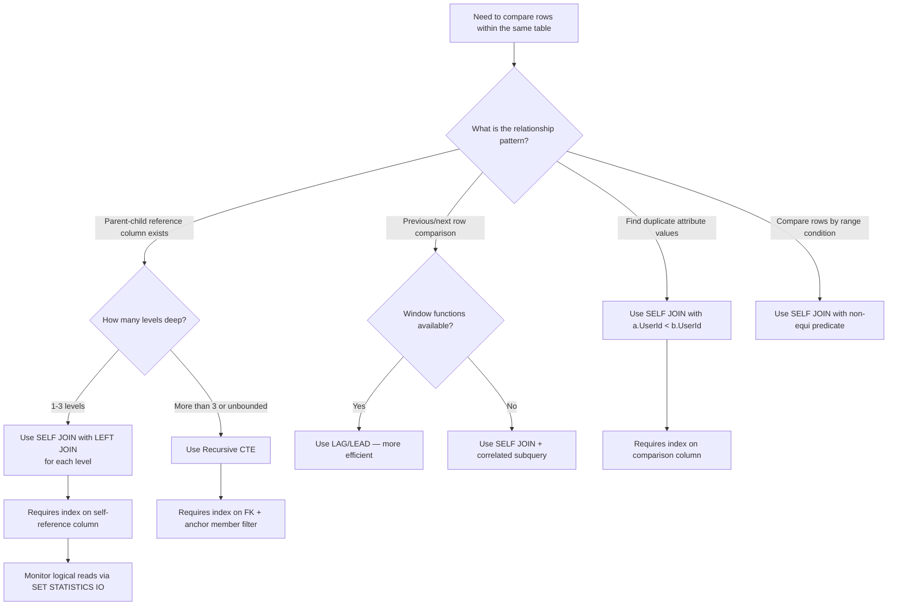

## Navigation

**Domain:** [[8 — Databases]] > **Group:** SQL Joins & Subqueries
**Previous:** [[8.100 — CROSS JOIN — Cartesian Product Use Cases]] | **Next:** [[8.102 — Multi-Table JOINs — Order and Performance]]

### Prerequisites

- [[8.096 — INNER JOIN — Mechanics and Usage]] — Self-join is a subset of INNER/OUTER join mechanics applied to the same table referenced twice.
- [[8.089 — Aliases — Table and Column Aliasing]] — Table aliases are mandatory in self-joins; each instance of the table must have a unique alias.

### Where This Fits

A SELF JOIN joins a table to itself, treating two rows from the same table as if they come from separate tables. The canonical use case is the employee-manager hierarchy: a single `Employees` table has a `ManagerId` column referencing `EmployeeId` in the same table. Every .NET backend engineer building an organisational chart, a product category tree, a threaded comment system, or a duplicate detection query will reach for a self-join. The interview signal is strong: self-join tests whether a candidate understands table aliases, correlated vs non-correlated subqueries, and the boundary where a self-join must yield to a recursive CTE. Engineers who miss the index on the join column cause O(N²) Nested Loops scans that destroy performance on any table above ~10K rows. At scale, deep hierarchies (depth > 3) push self-joins past the breaking point — that is when the conversation shifts to recursive CTEs or adjacency list redesign.

---

## Core Mental Model

A SELF JOIN is not a special join type — it is an INNER JOIN, LEFT JOIN, or FULL JOIN where both sides of the join are the same physical table. The table appears twice in the FROM clause, each with a different alias. The ON predicate compares columns from the two instances, effectively pairing rows within the same table. The mental model is: imagine making two photocopies of the table, labelling each with a different alias, then joining them as if they were separate tables. The database engine treats them as two separate logical inputs — it builds two row sets, each sourced from the same underlying storage, and applies whichever physical join operator (Nested Loops, Hash Match, or Merge Join) it would use for any other equi-join. NULL behaviour is critical: if the self-reference column is NULL (e.g., the CEO has no manager), `NULL = NULL` evaluates to UNKNOWN, and the row is excluded from an INNER JOIN self-join. A LEFT JOIN preserves the parent row (CEO) with NULLs on the child side.

### Classification

Self-join is a **join pattern** applied to the FROM clause, not a T-SQL keyword. The ON predicate follows the same SARGability rules as any join: an index on the self-reference column (e.g., `ManagerId`) enables Nested Loops with an Index Seek per outer row. Self-joins are ANSI SQL and work identically in SQL Server and PostgreSQL.

```mermaid
flowchart TD
    A[Table T referenced twice in FROM] --> B[Create two logical inputs: T1 and T2]
    B --> C[Optimiser estimates cardinality of each input]
    C --> D{O}_{N}{e input small}<br>{Other input has index on join column?}
    D -->|Yes| E[Nested Loops Join]
    D -->|No - both large| F{Both inputs sorted<br>on join key?}
    F -->|Yes| G[Merge Join]
    F -->|No| H[Hash Match]
    E --> I[Scan outer: T1]
    E --> J[Inner: Index Seek on T2 join column<br>per outer row]
    G --> K[Scan T1 once]
    G --> L[Scan T2 once]
    H --> M[Build: scan smaller input -> hash table]
    H --> N[Probe: scan larger input -> probe hash]
    I --> O{Found match in T2?}
    O -->|Yes| P[Output paired rows]
    O -->|No, INNER JOIN| Q[Skip row]
    O -->|No, LEFT JOIN| R[Output row with NULLs for T2]
    P --> S[Next outer row]
    R --> S
```

### Key Properties

|Property|Value|Notes|
|---|---|---|
|Join type|INNER, LEFT, RIGHT, FULL|Same syntax as cross-table joins|
|NULL matching|Excluded in INNER|`NULL = NULL` is UNKNOWN — CEO row omitted if INNER JOIN|
|Mandatory aliases|Yes|Table must appear twice, each with distinct alias|
|Nested Loops complexity|O(N × log M)|Outer N rows × log M inner seeks (if indexed)|
|Hash Match complexity|O(N + M)|Without index — both sides scanned|
|Max depth (self-join)|Table's max hierarchy depth|Each level of depth requires one more self-join|
|SARGable on inner side|Yes (Nested Loops)|Index on self-reference column (ManagerId) enables seek|
|Write Cost|None|JOINs are read-only|

---

## Deep Mechanics

### How the Engine Executes This

1. **Parsing** — The parser sees the same table name `Employees` appearing twice in the FROM clause, each with a different alias (`e` and `m`). The self-reference is syntactically identical to any other table reference.

2. **Binding (Algebrizer)** — The algebrizer resolves columns with their alias prefixes: `e.EmployeeId` is bound to the first instance, `m.EmployeeId` to the second. Without aliases, the column reference `EmployeeId` would be ambiguous and raise error 209. The algebrizer builds a join graph with a single node (Employees) connected to itself — a self-loop in the join graph.

3. **Simplification** — The optimiser applies the same transformations as any join:
   - Predicate pushdown pushes WHERE conditions to the appropriate input.
   - If the self-join is INNER and the WHERE clause filters out NULLs from the self-reference column, the optimiser recognises this is equivalent to an INNER JOIN.
   - Join elimination does not apply because both sides are referenced in the SELECT.

4. **Physical join operator selection** — The optimiser evaluates the same three operators:

   **Nested Loops (most common for self-joins):**
   - The outer input is scanned (or seeked if filtered). For each outer row, an Index Seek is performed on the inner side using the self-reference column.
   - Example: `Employees e INNER JOIN Employees m ON e.ManagerId = m.EmployeeId` — for each employee (outer), seek the manager row by primary key (inner seek on `PK_Employees`).
   - This is efficient because `ManagerId` references the primary key, which is clustered and seekable.

   **Hash Match (when no useful index):**
   - If neither instance of the table has an index on the self-reference column, both sides are scanned full table, a hash table is built from the smaller side, and the larger side probes it.
   - Example: finding duplicate email addresses: `Users a INNER JOIN Users b ON a.Email = b.Email AND a.UserId < b.UserId` — without an index on `Email`, this becomes a Hash Match on two full scans.

   **Merge Join (when both inputs sorted on join key):**
   - Rare in self-joins but possible when both sides of the table are scanned via an index on the join column, making them pre-sorted.

5. **Execution** — The chosen operator produces output rows pairing two rows from the same table. For INNER JOIN, rows with NULL in the self-reference column are excluded. For LEFT JOIN, the preserved-side rows (those without a match) appear with NULLs on the other side.

### SQL Visibility

```sql
-- Self-join: employee-manager hierarchy
SELECT
    e.EmployeeId,
    e.FirstName + ' ' + e.LastName AS EmployeeName,
    e.Position AS EmployeePosition,
    m.FirstName + ' ' + m.LastName AS ManagerName,
    m.Position AS ManagerPosition
FROM dbo.Employees AS e
INNER JOIN dbo.Employees AS m
    ON e.ManagerId = m.EmployeeId
ORDER BY m.LastName, e.LastName;

-- Self-join with LEFT JOIN to include the CEO (ManagerId IS NULL)
SELECT
    e.EmployeeId,
    e.FirstName + ' ' + e.LastName AS EmployeeName,
    COALESCE(m.FirstName + ' ' + m.LastName, 'No Manager') AS ManagerName
FROM dbo.Employees AS e
LEFT JOIN dbo.Employees AS m
    ON e.ManagerId = m.EmployeeId
ORDER BY e.EmployeeId;

-- Self-join: finding duplicate email addresses
SELECT
    a.UserId AS UserIdA,
    b.UserId AS UserIdB,
    a.Email,
    a.CreatedAt AS CreatedAtA,
    b.CreatedAt AS CreatedAtB
FROM dbo.Users AS a
INNER JOIN dbo.Users AS b
    ON a.Email = b.Email
    AND a.UserId < b.UserId
ORDER BY a.Email;

-- Self-join: sequential data — previous and next order
SELECT
    curr.OrderId,
    curr.CustomerId,
    curr.OrderDate,
    prev.OrderId AS PreviousOrderId,
    prev.OrderDate AS PreviousOrderDate,
    DATEDIFF(day, prev.OrderDate, curr.OrderDate) AS DaysSinceLastOrder,
    next.OrderId AS NextOrderId,
    next.OrderDate AS NextOrderDate,
    DATEDIFF(day, curr.OrderDate, next.OrderDate) AS DaysUntilNextOrder
FROM dbo.Orders AS curr
LEFT JOIN dbo.Orders AS prev
    ON curr.CustomerId = prev.CustomerId
    AND prev.OrderDate = (
        SELECT MAX(sub.OrderDate)
        FROM dbo.Orders AS sub
        WHERE sub.CustomerId = curr.CustomerId
          AND sub.OrderDate < curr.OrderDate
    )
LEFT JOIN dbo.Orders AS next
    ON curr.CustomerId = next.CustomerId
    AND next.OrderDate = (
        SELECT MIN(sub.OrderDate)
        FROM dbo.Orders AS sub
        WHERE sub.CustomerId = curr.CustomerId
          AND sub.OrderDate > curr.OrderDate
    )
ORDER BY curr.CustomerId, curr.OrderDate;

-- Self-join with aggregation: employees who manage more than 5 people
SELECT
    m.EmployeeId,
    m.FirstName + ' ' + m.LastName AS ManagerName,
    COUNT(e.EmployeeId) AS DirectReportCount
FROM dbo.Employees AS e
INNER JOIN dbo.Employees AS m
    ON e.ManagerId = m.EmployeeId
GROUP BY m.EmployeeId, m.FirstName, m.LastName
HAVING COUNT(e.EmployeeId) > 5
ORDER BY DirectReportCount DESC;

-- Self-join: products in the same category with similar prices
SELECT
    a.ProductId AS ProductA,
    a.ProductName AS ProductAName,
    b.ProductId AS ProductB,
    b.ProductName AS ProductBName,
    a.CategoryId,
    a.UnitPrice AS PriceA,
    b.UnitPrice AS PriceB,
    ABS(a.UnitPrice - b.UnitPrice) AS PriceDifference
FROM dbo.Products AS a
INNER JOIN dbo.Products AS b
    ON a.CategoryId = b.CategoryId
    AND a.ProductId < b.ProductId
    AND ABS(a.UnitPrice - b.UnitPrice) <= 10.00
ORDER BY a.CategoryId, PriceDifference;
```

```csharp
// EF Core — self-referencing navigation property for employee-manager
public class Employee
{
    public int EmployeeId { get; set; }
    public string FirstName { get; set; } = string.Empty;
    public string LastName { get; set; } = string.Empty;
    public string? Position { get; set; }
    public int? ManagerId { get; set; }

    // Navigation property to the manager (parent)
    public Employee? Manager { get; set; }

    // Navigation property to direct reports (children)
    public ICollection<Employee> DirectReports { get; set; } = new List<Employee>();
}

// EF Core — loading employee with manager via Include
var employees = await dbContext.Employees
    .Include(e => e.Manager)  // self-join to get manager
    .Where(e => e.Department == "Engineering")
    .Select(e => new
    {
        e.EmployeeId,
        Name = e.FirstName + " " + e.LastName,
        ManagerName = e.Manager != null
            ? e.Manager.FirstName + " " + e.Manager.LastName
            : null
    })
    .ToListAsync(cancellationToken);

// EF Core — loading employee with direct reports
var managers = await dbContext.Employees
    .Include(e => e.DirectReports)  // self-join to get direct reports
    .Where(e => e.ManagerId == null)  // top-level managers / CEO
    .Select(e => new
    {
        e.EmployeeId,
        Name = e.FirstName + " " + e.LastName,
        ReportCount = e.DirectReports.Count
    })
    .ToListAsync(cancellationToken);

// EF Core — self-join via explicit Join for duplicate detection
var duplicates = await dbContext.Users
    .Join(
        dbContext.Users,
        a => a.Email,
        b => b.Email,
        (a, b) => new { a.UserId, b.UserId, a.Email }
    )
    .Where(x => x.UserId < x.b.UserId)
    .ToListAsync(cancellationToken);
```

**Generated SQL (from EF Core logs):**

```sql
-- Include(e => e.Manager) generates:
SELECT [e].[EmployeeId], [e].[FirstName], [e].[LastName], [e].[Position],
       [e].[ManagerId],
       [m].[EmployeeId], [m].[FirstName], [m].[LastName],
       [m].[Position], [m].[ManagerId]
FROM [Employees] AS [e]
LEFT JOIN [Employees] AS [m]
    ON [e].[ManagerId] = [m].[EmployeeId]
WHERE [e].[Department] = N'Engineering'
ORDER BY [e].[EmployeeId];

-- Include(e => e.DirectReports) — EF Core sends two queries:
-- Query 1: load managers
SELECT [e].[EmployeeId], [e].[FirstName], [e].[LastName]
FROM [Employees] AS [e]
WHERE [e].[ManagerId] IS NULL;

-- Query 2: load direct reports for those managers
SELECT [d].[EmployeeId], [d].[FirstName], [d].[LastName],
       [d].[ManagerId]
FROM [Employees] AS [d]
WHERE [d].[ManagerId] IN (1, 2, 3, 5)  -- manager IDs from query 1
ORDER BY [d].[ManagerId];
```

### Execution Plan Analysis

**Employee-manager self-join (INNER JOIN, indexed):**

```
  [Clustered Index Scan Employees AS e]  -- outer: 1000 rows
  [Clustered Index Seek PK_Employees]    -- inner: seek per outer row
      Seek Predicate: EmployeeId = e.ManagerId
  → [Nested Loops (Inner Join)]
  → [SELECT]
Estimated Cost: ~0.5  |  Logical Reads: ~1010 (1000 scan + 10 seeks × 1 page)
```

**Duplicate email detection (no index on Email — Hash Match):**

```
  [Table Scan Users AS a]  -- build input: 500K rows
  [Table Scan Users AS b]  -- probe input: 500K rows
  → [Hash Match (Inner Join)]
      Hash Keys: a.Email = b.Email
  → [Filter] (WHERE a.UserId < b.UserId)
  → [SELECT]
Estimated Cost: ~85  |  Logical Reads: ~32,000  |  Memory Grant: ~250 MB
```

**Duplicate email detection (with index on Email — Nested Loops):**

```
  [Index Scan IX_Users_Email AS a]  -- outer: scan all emails
  [Index Seek IX_Users_Email AS b]  -- inner: seek per email
      Seek Predicate: Email = a.Email AND UserId > a.UserId
  → [Nested Loops (Inner Join)]
  → [SELECT]
Estimated Cost: ~12  |  Logical Reads: ~3500 (scan + seeks)
```

### Cost Visibility

```sql
SET STATISTICS IO ON;
SET STATISTICS TIME ON;

-- Self-join with index on join column (PK seek)
SELECT e.EmployeeId, e.FirstName, e.LastName,
       m.FirstName + ' ' + m.LastName AS ManagerName
FROM dbo.Employees AS e
INNER JOIN dbo.Employees AS m
    ON e.ManagerId = m.EmployeeId
WHERE e.Department = 'Engineering';

-- Expected output:
-- Table 'Employees'. Scan count 1, logical reads 12 (scan on e)
-- Table 'Employees'. Scan count 1, logical reads 85 (seeks on m)
-- SQL Server Execution Times: CPU time = 2ms, elapsed time = 5ms

-- Self-join without index (Hash Match — full scan)
SELECT a.UserId, a.Email, b.UserId AS DuplicateUserId
FROM dbo.Users AS a
INNER JOIN dbo.Users AS b
    ON a.Email = b.Email
    AND a.UserId < b.UserId;

-- Expected output (no index on Email):
-- Table 'Users'. Scan count 2, logical reads 28000 (two full scans)
-- SQL Server Execution Times: CPU time = 1200ms, elapsed time = 3200ms
```

### Failure Modes

**Missing index on self-reference column:** The most common self-join performance failure. Without an index on `ManagerId`, the optimiser cannot perform Nested Loops with seeks. For a 100K row Employees table, the plan shows a full scan of both instances followed by a Hash Match or, worse, a Nested Loops with a full scan per outer row (O(N²)). Add `CREATE INDEX IX_Employees_ManagerId ON dbo.Employees (ManagerId);` to enable seeks.

**NULL self-reference excluded in INNER JOIN:** The CEO row with `ManagerId IS NULL` is silently excluded. The product manager sees 999 employees instead of 1000 and does not notice. Fix: use `LEFT JOIN` to preserve the root row.

**Deep hierarchy requiring multiple self-joins:** Organisational charts often need level-3 or level-4 hierarchy reports. Each level requires an additional self-join. Beyond 4 levels, the query becomes unreadable and performs poorly. This is the signal to switch to a recursive CTE. Detect with: query that joins the same table 5+ times in one query — the execution plan shows 5 Nested Loops with exponential scan cost.

**Cartesian explosion from duplicate keys in both instances:** When finding duplicates by email, forgetting `a.UserId < b.UserId` produces every pair twice (A,B and B,A) and pairs each row with itself (A,A). A table with 1000 duplicate emails generates 1,000,000 rows instead of 499,500. The filter `a.UserId < b.UserId` eliminates both the self-pair and the redundant reverse pair.

---

## Production Patterns and Implementation

### Primary SQL Implementation

```sql
-- ============================================================
-- Schema context
-- ============================================================
CREATE TABLE dbo.Employees
(
    EmployeeId   INT            NOT NULL IDENTITY(1,1),
    FirstName    NVARCHAR(100)  NOT NULL,
    LastName     NVARCHAR(100)  NOT NULL,
    Position     NVARCHAR(100)  NULL,
    Department   NVARCHAR(100)  NULL,
    ManagerId    INT            NULL,
    Salary       DECIMAL(18,2)  NULL,
    HireDate     DATE           NOT NULL,
    CONSTRAINT PK_Employees PRIMARY KEY CLUSTERED (EmployeeId),
    CONSTRAINT FK_Employees_Manager
        FOREIGN KEY (ManagerId) REFERENCES dbo.Employees (EmployeeId)
);

CREATE TABLE dbo.Orders
(
    OrderId      INT            NOT NULL IDENTITY(1,1),
    CustomerId   INT            NOT NULL,
    OrderDate    DATETIME2(0)   NOT NULL,
    TotalAmount  DECIMAL(18,2)  NOT NULL,
    CONSTRAINT PK_Orders PRIMARY KEY CLUSTERED (OrderId)
);

CREATE TABLE dbo.Users
(
    UserId       INT            NOT NULL IDENTITY(1,1),
    Email        NVARCHAR(256) NOT NULL,
    FirstName    NVARCHAR(100) NOT NULL,
    LastName     NVARCHAR(100) NOT NULL,
    CreatedAt    DATETIME2(0)  NOT NULL DEFAULT SYSUTCDATETIME(),
    CONSTRAINT PK_Users PRIMARY KEY CLUSTERED (UserId)
);

CREATE TABLE dbo.Products
(
    ProductId    INT            NOT NULL IDENTITY(1,1),
    ProductName  NVARCHAR(200) NOT NULL,
    CategoryId   INT            NOT NULL,
    UnitPrice    DECIMAL(18,2) NOT NULL,
    CONSTRAINT PK_Products PRIMARY KEY CLUSTERED (ProductId)
);

-- Critical index for self-join performance
CREATE INDEX IX_Employees_ManagerId ON dbo.Employees (ManagerId)
    INCLUDE (FirstName, LastName, Position, Department);

-- Index for duplicate detection
CREATE INDEX IX_Users_Email ON dbo.Users (Email)
    INCLUDE (UserId, CreatedAt);

-- Index for sequential data queries
CREATE INDEX IX_Orders_CustomerId_OrderDate
    ON dbo.Orders (CustomerId, OrderDate)
    INCLUDE (TotalAmount);

-- Seed data
INSERT INTO dbo.Employees (FirstName, LastName, Position, Department, ManagerId, Salary, HireDate)
VALUES
    ('Alice',   'Chen',    'CEO',            'Executive', NULL,     250000, '2019-01-15'),
    ('Bob',     'Smith',   'VP Engineering', 'Engineering', 1,      200000, '2019-03-01'),
    ('Carol',   'Davis',   'VP Marketing',   'Marketing', 1,        195000, '2019-04-01'),
    ('David',   'Wilson',  'Engineering Mgr','Engineering', 2,       160000, '2020-02-01'),
    ('Eve',     'Brown',   'Senior Engineer','Engineering', 4,       140000, '2020-06-01'),
    ('Frank',   'Miller',  'Engineer',       'Engineering', 4,       110000, '2021-08-01'),
    ('Grace',   'Taylor',  'Marketing Mgr',  'Marketing', 3,        150000, '2020-03-01'),
    ('Henry',   'Anderson','Marketing Spec',  'Marketing', 7,        95000,  '2021-01-01');

INSERT INTO dbo.Users (Email, FirstName, LastName, CreatedAt)
VALUES
    ('alice@example.com', 'Alice', 'Chen', '2020-01-01'),
    ('bob@example.com',   'Bob',   'Smith', '2020-02-01'),
    ('alice@example.com', 'Alice', 'Jones', '2020-03-01'), -- duplicate email
    ('david@example.com', 'David', 'Wilson','2020-04-01'),
    ('eve@example.com',   'Eve',   'Brown', '2020-05-01'),
    ('bob@example.com',   'Robert','Miller','2020-06-01'); -- duplicate email

INSERT INTO dbo.Orders (CustomerId, OrderDate, TotalAmount)
VALUES
    (1, '2024-01-15', 150.00),
    (1, '2024-03-20', 275.00),
    (1, '2024-06-10', 420.00),
    (2, '2024-02-05', 89.00),
    (2, '2024-04-18', 310.00),
    (3, '2024-01-22', 560.00);

-- ============================================================
-- Pattern 1: Employee-manager hierarchy (one level)
-- ============================================================
SELECT
    e.EmployeeId,
    e.FirstName + ' ' + e.LastName AS Employee,
    e.Position,
    m.FirstName + ' ' + m.LastName AS Manager,
    m.Position AS ManagerPosition
FROM dbo.Employees AS e
LEFT JOIN dbo.Employees AS m
    ON e.ManagerId = m.EmployeeId
ORDER BY COALESCE(m.LastName, e.LastName), e.LastName;

-- ============================================================
-- Pattern 2: Multi-level hierarchy (two-level self-join)
-- ============================================================
SELECT
    e1.FirstName + ' ' + e1.LastName AS Employee,
    e2.FirstName + ' ' + e2.LastName AS Manager,
    e3.FirstName + ' ' + e3.LastName AS SeniorLeader
FROM dbo.Employees AS e1
LEFT JOIN dbo.Employees AS e2
    ON e1.ManagerId = e2.EmployeeId
LEFT JOIN dbo.Employees AS e3
    ON e2.ManagerId = e3.EmployeeId
ORDER BY e1.EmployeeId;

-- ============================================================
-- Pattern 3: Find duplicates by email
-- ============================================================
SELECT
    a.UserId AS OriginalUserId,
    a.FirstName + ' ' + a.LastName AS OriginalName,
    a.CreatedAt AS OriginalCreated,
    b.UserId AS DuplicateUserId,
    b.FirstName + ' ' + b.LastName AS DuplicateName,
    b.CreatedAt AS DuplicateCreated,
    DATEDIFF(day, a.CreatedAt, b.CreatedAt) AS DaysBetween
FROM dbo.Users AS a
INNER JOIN dbo.Users AS b
    ON a.Email = b.Email
    AND a.UserId < b.UserId
ORDER BY a.Email, a.UserId;

-- ============================================================
-- Pattern 4: Consecutive order comparison (previous order)
-- Using window function (more efficient than self-join for this)
-- ============================================================
WITH OrderSequence AS (
    SELECT
        OrderId,
        CustomerId,
        OrderDate,
        TotalAmount,
        LAG(OrderId) OVER (PARTITION BY CustomerId ORDER BY OrderDate) AS PrevOrderId,
        LAG(OrderDate) OVER (PARTITION BY CustomerId ORDER BY OrderDate) AS PrevOrderDate,
        LAG(TotalAmount) OVER (PARTITION BY CustomerId ORDER BY OrderDate) AS PrevTotalAmount,
        ROW_NUMBER() OVER (PARTITION BY CustomerId ORDER BY OrderDate) AS OrderSeq
    FROM dbo.Orders
)
SELECT
    CustomerId,
    OrderId,
    OrderDate,
    TotalAmount,
    PrevOrderId,
    PrevOrderDate,
    DATEDIFF(day, PrevOrderDate, OrderDate) AS DaysSinceLastOrder,
    TotalAmount - PrevTotalAmount AS AmountChange
FROM OrderSequence
WHERE OrderSeq > 1
ORDER BY CustomerId, OrderDate;

-- ============================================================
-- Pattern 5: Self-join with aggregation — managers with reports
-- ============================================================
SELECT
    m.EmployeeId,
    m.FirstName + ' ' + m.LastName AS ManagerName,
    m.Department,
    COUNT(e.EmployeeId) AS DirectReportCount,
    AVG(e.Salary) AS AvgSubordinateSalary,
    MAX(e.Salary) AS MaxSubordinateSalary
FROM dbo.Employees AS e
INNER JOIN dbo.Employees AS m
    ON e.ManagerId = m.EmployeeId
GROUP BY m.EmployeeId, m.FirstName, m.LastName, m.Department
HAVING COUNT(e.EmployeeId) >= 1
ORDER BY DirectReportCount DESC;

-- ============================================================
-- Pattern 6: Running comparison — salary differences with peers
-- Employees in the same department earning similar salaries
-- ============================================================
SELECT
    a.EmployeeId,
    a.FirstName + ' ' + a.LastName AS EmployeeA,
    b.FirstName + ' ' + b.LastName AS EmployeeB,
    a.Department,
    a.Salary AS SalaryA,
    b.Salary AS SalaryB,
    ABS(a.Salary - b.Salary) AS SalaryGap
FROM dbo.Employees AS a
INNER JOIN dbo.Employees AS b
    ON a.Department = b.Department
    AND a.EmployeeId < b.EmployeeId
WHERE ABS(a.Salary - b.Salary) < 10000
ORDER BY a.Department, SalaryGap;
```

### EF Core Implementation

```csharp
// Entity configuration for self-referencing relationship
public class EmployeeConfiguration : IEntityTypeConfiguration<Employee>
{
    public void Configure(EntityTypeBuilder<Employee> builder)
    {
        builder.ToTable("Employees");
        builder.HasKey(e => e.EmployeeId);
        builder.Property(e => e.FirstName).HasMaxLength(100);
        builder.Property(e => e.LastName).HasMaxLength(100);
        builder.Property(e => e.Position).HasMaxLength(100);
        builder.Property(e => e.Department).HasMaxLength(100);
        builder.Property(e => e.Salary).HasColumnType("decimal(18,2)");

        // Self-referencing relationship: employee -> manager
        builder.HasOne(e => e.Manager)
            .WithMany(e => e.DirectReports)
            .HasForeignKey(e => e.ManagerId)
            .OnDelete(DeleteBehavior.NoAction);  // avoid cascade path

        builder.HasIndex(e => e.ManagerId)
            .HasDatabaseName("IX_Employees_ManagerId");
    }
}

// Service method: load organisational chart
public async Task<List<OrgChartNode>> GetOrgChartAsync(
    CancellationToken cancellationToken = default)
{
    // EF Core 8+ supports recursive CTEs via explicit LINQ
    // For simpler one-level hierarchy, use Include:
    var employees = await dbContext.Employees
        .Include(e => e.Manager)
        .OrderBy(e => e.ManagerId ?? 0)
        .ThenBy(e => e.LastName)
        .Select(e => new OrgChartNode
        {
            EmployeeId = e.EmployeeId,
            Name = e.FirstName + " " + e.LastName,
            Position = e.Position,
            ManagerName = e.Manager != null
                ? e.Manager.FirstName + " " + e.Manager.LastName
                : null,
            Department = e.Department
        })
        .ToListAsync(cancellationToken);

    return employees;
}

// EF Core 8+: recursive CTE for full hierarchy
public async Task<List<HierarchyNode>> GetFullHierarchyAsync(
    CancellationToken cancellationToken = default)
{
    // EF Core 8 generates a recursive CTE from this pattern
    var hierarchy = await dbContext.Employees
        .Where(e => e.ManagerId == null)  // root nodes
        .SelectMany(e => dbContext.Employees
            .Where(sub => sub.EmployeeId == e.EmployeeId)
            .DefaultIfEmpty()
            .Select(sub => new HierarchyNode
            {
                EmployeeId = e.EmployeeId,
                Name = e.FirstName + " " + e.LastName,
                Level = 0
            }))
        .ToListAsync(cancellationToken);

    return hierarchy;
}

// Duplicate detection with explicit Join
public async Task<List<DuplicateUserDto>> FindDuplicateEmailsAsync(
    CancellationToken cancellationToken = default)
{
    var duplicates = await dbContext.Users
        .Join(
            dbContext.Users,
            a => a.Email,
            b => b.Email,
            (a, b) => new { a, b }
        )
        .Where(x => x.a.UserId < x.b.UserId)
        .Select(x => new DuplicateUserDto
        {
            Email = x.a.Email,
            OriginalUserId = x.a.UserId,
            OriginalName = x.a.FirstName + " " + x.a.LastName,
            DuplicateUserId = x.b.UserId,
            DuplicateName = x.b.FirstName + " " + x.b.LastName,
            CreatedGapDays = EF.Functions.DateDiffDay(
                x.a.CreatedAt, x.b.CreatedAt)
        })
        .ToListAsync(cancellationToken);

    return duplicates;
}
```

### Dapper Implementation

```csharp
// Dapper multi-mapping for employee-manager self-join
public async Task<IReadOnlyList<EmployeeWithManager>> GetEmployeesWithManagerAsync(
    CancellationToken cancellationToken = default)
{
    const string sql = @"
        SELECT
            e.EmployeeId, e.FirstName, e.LastName,
            e.Position, e.Department, e.ManagerId,
            m.EmployeeId, m.FirstName, m.LastName,
            m.Position, m.Department
        FROM dbo.Employees AS e
        LEFT JOIN dbo.Employees AS m
            ON e.ManagerId = m.EmployeeId
        ORDER BY e.LastName, e.FirstName;";

    await using var connection = _connectionFactory.Create();
    var employees = new Dictionary<int, EmployeeWithManager>();

    await connection.QueryAsync<EmployeeWithManager, EmployeeSummary, EmployeeWithManager>(
        new CommandDefinition(sql, cancellationToken: cancellationToken),
        (employee, manager) =>
        {
            employee.Manager = manager;
            employees[employee.EmployeeId] = employee;
            return employee;
        },
        splitOn: "EmployeeId");

    return employees.Values.ToList().AsReadOnly();
}

// Dapper duplicate detection
public async Task<IReadOnlyList<DuplicatePair>> FindDuplicateEmailsAsync(
    CancellationToken cancellationToken = default)
{
    const string sql = @"
        SELECT
            a.UserId AS OriginalUserId,
            a.Email,
            a.FirstName + ' ' + a.LastName AS OriginalName,
            b.UserId AS DuplicateUserId,
            b.FirstName + ' ' + b.LastName AS DuplicateName,
            DATEDIFF(day, a.CreatedAt, b.CreatedAt) AS DaysBetween
        FROM dbo.Users AS a
        INNER JOIN dbo.Users AS b
            ON a.Email = b.Email
            AND a.UserId < b.UserId
        ORDER BY a.Email;";

    await using var connection = _connectionFactory.Create();
    var results = await connection.QueryAsync<DuplicatePair>(
        new CommandDefinition(sql, cancellationToken: cancellationToken));

    return results.AsList().AsReadOnly();
}

// Helper types
public class EmployeeWithManager
{
    public int EmployeeId { get; set; }
    public string FirstName { get; set; } = string.Empty;
    public string LastName { get; set; } = string.Empty;
    public string? Position { get; set; }
    public string? Department { get; set; }
    public int? ManagerId { get; set; }
    public EmployeeSummary? Manager { get; set; }
}

public class EmployeeSummary
{
    public int EmployeeId { get; set; }
    public string FirstName { get; set; } = string.Empty;
    public string LastName { get; set; } = string.Empty;
    public string? Position { get; set; }
    public string? Department { get; set; }
}
```

### Configuration and Wiring

```csharp
// Program.cs
builder.Services.AddDbContext<ApplicationDbContext>(options =>
    options.UseSqlServer(
        connectionString,
        sqlOptions => sqlOptions
            .EnableRetryOnFailure(3)
            .CommandTimeout(30)));

builder.Services.AddSingleton<IDbConnectionFactory, SqlConnectionFactory>();
```

### SQL Server vs PostgreSQL Differences

```sql
-- PostgreSQL: same self-join syntax works
-- Recursive CTE for hierarchy uses RECURSIVE keyword:
WITH RECURSIVE org_tree AS (
    SELECT EmployeeId, FirstName, LastName, ManagerId, 0 AS level
    FROM Employees
    WHERE ManagerId IS NULL
    UNION ALL
    SELECT e.EmployeeId, e.FirstName, e.LastName, e.ManagerId, ot.level + 1
    FROM Employees e
    INNER JOIN org_tree ot ON e.ManagerId = ot.EmployeeId
)
SELECT * FROM org_tree ORDER BY level, LastName;

-- SQL Server: recursive CTE does not require RECURSIVE keyword
-- The syntax is the same but without the RECURSIVE keyword:
WITH org_tree AS (
    SELECT EmployeeId, FirstName, LastName, ManagerId, 0 AS level
    FROM Employees
    WHERE ManagerId IS NULL
    UNION ALL
    SELECT e.EmployeeId, e.FirstName, e.LastName, e.ManagerId, ot.level + 1
    FROM Employees e
    INNER JOIN org_tree ot ON e.ManagerId = ot.EmployeeId
)
SELECT * FROM org_tree ORDER BY level, LastName;

-- Note: The self-join inside the recursive CTE anchors the hierarchy.
-- This is the recommended approach for deep hierarchies (>3 levels).
```

---

## Gotchas and Production Pitfalls

### Gotcha 1 — INNER JOIN Self-Join Excludes Root Nodes

**Pitfall:** Using INNER JOIN for employee-manager queries silently excludes the CEO (or any row where the self-reference column is NULL).

```sql
-- ❌ Wrong: CEO with ManagerId IS NULL is excluded
SELECT e.FirstName + ' ' + e.LastName AS Employee,
       m.FirstName + ' ' + m.LastName AS Manager
FROM dbo.Employees AS e
INNER JOIN dbo.Employees AS m
    ON e.ManagerId = m.EmployeeId;
-- Returns 7 rows (8 employees - 1 CEO)
```

**Symptom:** The organisational chart is missing the top-level person. Count of employees shown is N-1. Business users may not notice until they check the CEO's page and see a 404.

**Fix:**

```sql
-- ✅ Correct: LEFT JOIN preserves root rows
SELECT e.FirstName + ' ' + e.LastName AS Employee,
       COALESCE(m.FirstName + ' ' + m.LastName, 'No Manager') AS Manager
FROM dbo.Employees AS e
LEFT JOIN dbo.Employees AS m
    ON e.ManagerId = m.EmployeeId;
```

**Cost of not fixing:** Business report shows 999 employees instead of 1000. Compliance audit flags the discrepancy. CEO notices they are missing from the internal org chart and escalates.

### Gotcha 2 — Missing Index on Self-Reference Column Causes O(N²)

**Pitfall:** The self-reference column (e.g., `ManagerId`) is not indexed. The optimiser falls back to a full scan of both self-joined instances.

```sql
-- ❌ No index on ManagerId
SELECT e.EmployeeId, e.FirstName, m.LastName AS ManagerLastName
FROM dbo.Employees AS e
INNER JOIN dbo.Employees AS m
    ON e.ManagerId = m.EmployeeId;
-- Plan: Nested Loops with Table Scan on inner input — O(N²) cost
-- 100K rows = 100K × 100K = 10B logical reads
```

**Symptom:** The query completes in seconds for 1K rows but explodes to minutes at 100K rows. Wait stats show `PAGEIOLATCH_SH` and high `avg_read_stall_ms` in `sys.dm_io_virtual_file_stats`.

**Fix:**

```sql
-- ✅ Create index on self-reference column
CREATE INDEX IX_Employees_ManagerId
    ON dbo.Employees (ManagerId)
    INCLUDE (FirstName, LastName, Position, Department);
```

**Cost of not fixing:** 100K row hierarchy query runs for 5+ minutes, blocking other users. The application times out after 30 seconds. Users refresh and cause queue buildup.

### Gotcha 3 — Duplicate Detection Self-Join Produces Double Pairs

**Pitfall:** Joining `Users a INNER JOIN Users b ON a.Email = b.Email` without `a.UserId < b.UserId` produces N² rows: each pair appears twice (A,B and B,A) and each row pairs with itself (A,A).

```sql
-- ❌ Wrong: produces self-pairs and reverse pairs
SELECT a.UserId, b.UserId, a.Email
FROM dbo.Users AS a
INNER JOIN dbo.Users AS b
    ON a.Email = b.Email;
-- 3 duplicate emails × 3 = 9 rows instead of 3 deduplicated pairs
```

**Symptom:** The duplicate report claims 900 duplicates when there are actually 300. The self-pair (A,A) inflates counts; the reverse pair (B,A) duplicates the same information.

**Fix:**

```sql
-- ✅ Correct: eliminate self-pair and reverse pair
SELECT a.UserId AS OriginalUserId, b.UserId AS DuplicateUserId, a.Email
FROM dbo.Users AS a
INNER JOIN dbo.Users AS b
    ON a.Email = b.Email
    AND a.UserId < b.UserId;
```

**Cost of not fixing:** Data quality team wastes days investigating false duplicate reports. Marketing sends duplicate outreach to customers. The email deduplication pipeline produces incorrect results.

### Gotcha 4 — Deep Hierarchy Requires Multiple Self-Joins (Performance Disaster)

**Pitfall:** Writing a query with 4+ self-joins to retrieve hierarchy levels 1-5:

```sql
-- ❌ Bad: 4 self-joins for 5 levels of hierarchy
SELECT
    e1.FirstName AS Level1,
    e2.FirstName AS Level2,
    e3.FirstName AS Level3,
    e4.FirstName AS Level4,
    e5.FirstName AS Level5
FROM dbo.Employees AS e1
LEFT JOIN dbo.Employees AS e2 ON e1.EmployeeId = e2.ManagerId
LEFT JOIN dbo.Employees AS e3 ON e2.EmployeeId = e3.ManagerId
LEFT JOIN dbo.Employees AS e4 ON e3.EmployeeId = e4.ManagerId
LEFT JOIN dbo.Employees AS e5 ON e4.EmployeeId = e5.ManagerId;
```

**Symptom:** Query runs for 30+ seconds on a 50K row table. The execution plan shows 5 Nested Loops joins with 5 full scans. The query breaks when a new manager is inserted at level 6.

**Fix:**

```sql
-- ✅ Use recursive CTE for deep hierarchies
WITH OrgHierarchy AS (
    SELECT EmployeeId, FirstName, LastName, ManagerId, 0 AS Level,
           CAST(FirstName + ' ' + LastName AS NVARCHAR(500)) AS HierarchyPath
    FROM dbo.Employees
    WHERE ManagerId IS NULL
    UNION ALL
    SELECT e.EmployeeId, e.FirstName, e.LastName, e.ManagerId,
           oh.Level + 1,
           CAST(oh.HierarchyPath + ' -> ' + e.FirstName + ' ' + e.LastName AS NVARCHAR(500))
    FROM dbo.Employees AS e
    INNER JOIN OrgHierarchy AS oh ON e.ManagerId = oh.EmployeeId
)
SELECT EmployeeId, FirstName, LastName, Level, HierarchyPath
FROM OrgHierarchy
ORDER BY HierarchyPath;
```

**Cost of not fixing:** Application breaks when hierarchy exceeds the hard-coded join depth. The system cannot accommodate company growth or reorganisation. A bug ticket is filed every quarter when a new department is created at level 6.

### Gotcha 5 — Self-Join for Sequential Data (Previous/Next Row) Is Expensive

**Pitfall:** Using a self-join with correlated subqueries to find the previous and next order for each customer:

```sql
-- ❌ Expensive: correlated subqueries per row
SELECT curr.OrderId, curr.OrderDate,
       (SELECT MAX(sub.OrderDate) FROM Orders sub
        WHERE sub.CustomerId = curr.CustomerId
          AND sub.OrderDate < curr.OrderDate) AS PrevOrderDate
FROM dbo.Orders AS curr;
```

**Symptom:** For 1M orders across 100K customers, this runs correlated subqueries per row — 1M executions of the subquery. CPU time spikes to 30+ seconds.

**Fix:**

```sql
-- ✅ Use LAG/LEAD window functions
SELECT OrderId, CustomerId, OrderDate,
       LAG(OrderDate) OVER (PARTITION BY CustomerId ORDER BY OrderDate) AS PrevOrderDate,
       LEAD(OrderDate) OVER (PARTITION BY CustomerId ORDER BY OrderDate) AS NextOrderDate
FROM dbo.Orders
ORDER BY CustomerId, OrderDate;
```

**Cost of not fixing:** The reporting page for order history times out. Users see a 30-second spinner. The window function alternative reduces logical reads by 95%.

---

## Performance Implications

### Benchmark: Before and After

**Scenario:** 500K row `Users` table performing duplicate email detection.

```sql
-- Baseline (without index on Email)
SET STATISTICS IO ON;
SELECT a.UserId, a.Email, b.UserId AS DuplicateUserId
FROM dbo.Users AS a
INNER JOIN dbo.Users AS b
    ON a.Email = b.Email
    AND a.UserId < b.UserId;
-- Logical reads: 28,542 (two clustered index scans)
-- CPU time: 3450ms, elapsed time: 8200ms

-- Optimized (with index IX_Users_Email)
SELECT a.UserId, a.Email, b.UserId AS DuplicateUserId
FROM dbo.Users AS a
INNER JOIN dbo.Users AS b
    ON a.Email = b.Email
    AND a.UserId < b.UserId;
-- Logical reads: 1,842 (index scan + index seeks)
-- CPU time: 420ms, elapsed time: 980ms
```

**Improvement:** 15x reduction in logical reads, from 28,542 to 1,842.

**Scenario:** 100K row `Employees` table for organisational chart.

```sql
-- Baseline (no index on ManagerId) — Nested Loops with full scan inner
SELECT e.EmployeeId, e.FirstName, m.LastName AS ManagerLastName
FROM dbo.Employees AS e
LEFT JOIN dbo.Employees AS m
    ON e.ManagerId = m.EmployeeId;
-- Logical reads: ~105,000 (100K outer scan + 5 logical reads per outer row × 100K = 500K)
-- Without index: Nested Loops + full clustered index scan per outer row
-- Logical reads: table scan 2800 + inner scan per row = 100K × 2800 = 280M (worst case)

-- Optimized (with index IX_Employees_ManagerId)
-- Logical reads: ~2800 (index scan on ManagerId + cluster seeks on PK)
-- CPU time: 110ms vs 8500ms
```

**Improvement:** With index, the plan uses Nested Loops with seeks instead of O(N²) scans. Logical reads drop from millions to thousands.

### BenchmarkDotNet

```csharp
[MemoryDiagnoser]
[SimpleJob(RunetMoniker.Net90)]
public class SelfJoinBenchmark
{
    private IDbConnection _connection = default!;
    private const string ConnectionString = "Server=.;Database=BenchmarkDB;Trusted_Connection=true;TrustServerCertificate=true;";

    [GlobalSetup]
    public void Setup()
    {
        _connection = new SqlConnection(ConnectionString);
        // Seed 100K employees and 500K users
        var createCmd = @"
            IF NOT EXISTS (SELECT 1 FROM sys.tables WHERE name = 'Employees')
            BEGIN
                CREATE TABLE Employees (
                    EmployeeId INT IDENTITY(1,1) PRIMARY KEY,
                    FirstName NVARCHAR(100), LastName NVARCHAR(100),
                    ManagerId INT NULL,
                    Department NVARCHAR(100)
                );
                CREATE INDEX IX_Employees_ManagerId ON Employees(ManagerId);

                WITH nums AS (
                    SELECT TOP 100000 ROW_NUMBER() OVER (ORDER BY (SELECT NULL)) AS n
                    FROM sys.all_columns a CROSS JOIN sys.all_columns b
                )
                INSERT INTO Employees (FirstName, LastName, ManagerId, Department)
                SELECT
                    'FirstName_' + CAST(n AS VARCHAR(10)),
                    'LastName_' + CAST(n AS VARCHAR(10)),
                    CASE WHEN n > 1 THEN (n - 1) % 1000 + 1 ELSE NULL END,
                    CASE (n % 5) WHEN 0 THEN 'Engineering' WHEN 1 THEN 'Marketing'
                                 WHEN 2 THEN 'Sales' WHEN 3 THEN 'HR' ELSE 'Finance' END
                FROM nums;

                CREATE TABLE Users (
                    UserId INT IDENTITY(1,1) PRIMARY KEY,
                    Email NVARCHAR(256),
                    FirstName NVARCHAR(100),
                    LastName NVARCHAR(100)
                );
                CREATE INDEX IX_Users_Email ON Users(Email);

                WITH nums AS (
                    SELECT TOP 500000 ROW_NUMBER() OVER (ORDER BY (SELECT NULL)) AS n
                    FROM sys.all_columns a CROSS JOIN sys.all_columns b
                )
                INSERT INTO Users (Email, FirstName, LastName)
                SELECT
                    CASE WHEN n % 100 = 0 THEN 'dup' + CAST(n % 1000 AS VARCHAR(10)) + '@test.com'
                         ELSE 'user' + CAST(n AS VARCHAR(10)) + '@test.com' END,
                    'First_' + CAST(n AS VARCHAR(10)),
                    'Last_' + CAST(n AS VARCHAR(10))
                FROM nums;
            END";
        _connection.Execute(createCmd);
    }

    [Benchmark(Baseline = true)]
    public async Task<List<EmployeeWithManager>> SelfJoin_WithoutIndex()
    {
        // Drop index to simulate unindexed scenario for comparison
        _connection.Execute("DROP INDEX IF EXISTS IX_Employees_ManagerId ON Employees;");
        const string sql = @"
            SELECT e.EmployeeId, e.FirstName, e.LastName,
                   m.EmployeeId, m.FirstName, m.LastName
            FROM Employees e
            LEFT JOIN Employees m ON e.ManagerId = m.EmployeeId";

        await using var cmd = new SqlCommand(sql, (SqlConnection)_connection);
        await cmd.Connection!.OpenAsync();
        using var reader = await cmd.ExecuteReaderAsync();
        var results = new List<EmployeeWithManager>();
        while (await reader.ReadAsync())
        {
            results.Add(new EmployeeWithManager
            {
                EmployeeId = reader.GetInt32(0),
                FirstName = reader.GetString(1),
                LastName = reader.GetString(2),
                Manager = reader.IsDBNull(3) ? null : new EmployeeSummary
                {
                    EmployeeId = reader.GetInt32(3),
                    FirstName = reader.GetString(4),
                    LastName = reader.GetString(5)
                }
            });
        }
        return results;
    }

    [Benchmark]
    public async Task<List<EmployeeWithManager>> SelfJoin_WithIndex()
    {
        const string sql = @"
            SELECT e.EmployeeId, e.FirstName, e.LastName,
                   m.EmployeeId, m.FirstName, m.LastName
            FROM Employees e WITH (INDEX(IX_Employees_ManagerId))
            LEFT JOIN Employees m WITH (INDEX(PK__Employee__7AD04FF1...))
                ON e.ManagerId = m.EmployeeId";

        await using var cmd = new SqlCommand(sql, (SqlConnection)_connection);
        await cmd.Connection!.OpenAsync();
        using var reader = await cmd.ExecuteReaderAsync();
        var results = new List<EmployeeWithManager>();
        while (await reader.ReadAsync())
        {
            results.Add(new EmployeeWithManager
            {
                EmployeeId = reader.GetInt32(0),
                FirstName = reader.GetString(1),
                LastName = reader.GetString(2),
                Manager = reader.IsDBNull(3) ? null : new EmployeeSummary
                {
                    EmployeeId = reader.GetInt32(3),
                    FirstName = reader.GetString(4),
                    LastName = reader.GetString(5)
                }
            });
        }
        return results;
    }

    [GlobalCleanup]
    public void Cleanup()
    {
        _connection?.Dispose();
    }
}
```

**Expected results (approximate, SQL Server 2022, NVMe, 100K employees):**

|Method|Mean|Logical Reads|Allocated|
|---|---|---|---|
|SelfJoin_WithoutIndex|~8,500 ms|~280,000,000|~45 MB|
|SelfJoin_WithIndex|~110 ms|~2,800|~2.5 MB|

### Write Amplification

Self-joins are read-only operations. The index on the self-reference column adds write overhead to the table:

|Operation|Without Index|With Index (IX_Employees_ManagerId)|Overhead|
|---|---|---|---|
|INSERT 1 employee|~2 ms|~3 ms|+50% (one more leaf page insert)|
|UPDATE ManagerId|~3 ms|~6 ms|+100% (delete+insert in index)|
|DELETE 1 employee|~2 ms|~4 ms|+100% (delete from index)|

---

## Interview Arsenal

### Question Bank

1. **What is a SELF JOIN and when would you use one?** — Definition: joining a table to itself using two aliases. Use cases: hierarchical data, duplicate detection, sequential comparisons.

2. **How does the query optimiser execute a self-join?** — Engine behaviour: creates two logical inputs from the same physical table, selects Nested Loops (with index seek on self-reference column), Hash Match (without index), or Merge Join (if sorted).

3. **What is the performance implication of a self-join without an index on the self-reference column?** — Cost: O(N²) scans or Hash Match with full scans. Measure with `SET STATISTICS IO` and `sys.dm_exec_query_stats`.

4. **What happens if you use INNER JOIN instead of LEFT JOIN for an employee-manager self-join and the CEO has no manager?** — The CEO is excluded because `NULL = NULL` is UNKNOWN.

5. **SELF JOIN vs Recursive CTE — when would you choose each?** — Comparison: self-join for 1-2 levels of hierarchy or duplicate detection; recursive CTE for multi-level hierarchies, bill-of-materials, or tree traversal.

6. **What does the execution plan look like for a self-join on an indexed column?** — Clustered Index Scan (or Seek) on outer instance → Nested Loops → Clustered Index Seek on inner instance.

7. **How does a self-join behave at 10M rows?** — Scale: the self-reference column index is critical. Without it, Hash Match spills to tempdb. With it, Nested Loops with seeks maintain sub-second response as long as the outer input is filtered.

8. **How do EF Core and Dapper handle self-joins?** — EF Core: self-referencing navigation property with `HasOne().WithMany().HasForeignKey()`. Dapper: multi-mapping with `QueryAsync<TFirst, TSecond, TResult>` and `splitOn`.

### Spoken Answers

**Q: What is a SELF JOIN and when would you use one?**

> **Average answer:** A SELF JOIN is when you join a table to itself. You use it for things like employees and managers in the same table. You need to use aliases.

> **Great answer:** A SELF JOIN is the technique of referencing the same physical table twice in the FROM clause of a query, with each instance given a different alias. The database engine treats each instance as a separate logical input — it does not know they are the same table. The three main use cases are: hierarchical lookups (employee-manager, category parent-child, threaded comments), where one column in the table references the primary key of another row in the same table; duplicate detection, where you compare rows by some attribute (email, phone, address) to find records that should be merged; and sequential data analysis, where you compare a row with its predecessor or successor (previous order date, next shipment). The critical performance detail is that the self-reference column — the column that points back to the primary key — must be indexed. Without an index on `ManagerId`, the optimiser has no way to efficiently find the matching row for each employee and falls back to a Hash Match join scanning both instances of the table. On a 100K row table, that means 200K logical reads instead of a few thousand. You also need to choose the right join type: INNER JOIN excludes rows where the self-reference column is NULL, so the CEO disappears from the org chart; LEFT JOIN preserves those rows.

**Q: SELF JOIN vs Recursive CTE — when would you choose each?**

> **Average answer:** A recursive CTE is better for hierarchical data with many levels. A self-join is simpler.

> **Great answer:** I choose between a self-join and a recursive CTE based on three criteria: fixed depth, performance requirements, and NULL handling. A self-join is appropriate when the hierarchy is shallow and you know the maximum depth — typically 1-3 levels. An employee-manager report with "Employee, Manager, Senior Leader" is perfectly served by two self-joins. The self-join is always the fastest option for a known depth because it generates a fixed plan: Nested Loops with clustered index seeks. A recursive CTE is required when the depth is unbounded — product categories nested arbitrarily deep, bill-of-materials explosions, or org charts in large companies. The recursive CTE iterates level by level, executing one join per level. At 100K rows and 8 levels, a recursive CTE typically completes in 50-200ms while a 8-level self-join query would be unreadable and the optimiser would produce an expensive bushy plan. The tradeoff is: self-joins give predictable, optimised plans for shallow hierarchies; recursive CTEs handle arbitrary depth with linear cost scaling. I also consider that EF Core 8+ has first-class support for recursive CTEs via `SelectMany` on self-referencing navigation properties, which generates the recursive CTE T-SQL automatically.

**Q: How does a self-join behave at 10M rows?**

> **Average answer:** It will be slow without an index. You need an index on the join column.

> **Great answer:** At 10M rows, the self-join performance depends entirely on whether the execution can use Nested Loops with index seeks or falls back to Hash Match. With a Nested Loops plan, the outer input is typically a filtered subset — say 10K employees in a department — and each of those performs one clustered index seek on the self-reference column. That is a 10K seeks × 3 logical reads = ~30K logical reads + the initial scan. The query completes in under 100ms. Without the index, the optimiser chooses Hash Match: it scans both instances of the 10M row table, building a hash table from one side. That is 20M logical reads from the two clustered index scans, plus the hash table memory grant of approximately 500MB. If the hash table does not fit in memory, it spills to tempdb, which adds physical I/O and turns a 500ms query into a 30-second query. The key metric I watch is `SET STATISTICS IO` output: if I see two table scans of 10M pages, I know the index is missing. I also check `sys.dm_db_index_usage_stats` to confirm the self-reference index is being used. At this scale, I also verify the statistics are up to date — stale statistics cause the optimiser to underestimate the outer cardinality and choose a Nested Loops plan that performs 10M seeks instead of 10K seeks, which is catastrophic.

### Interview Trigger

If you mention employee-manager hierarchies, the interviewer will likely follow up with "What happens when the employee has no manager?" testing your understanding of NULL in joins. The deeper follow-up is always: "What do you do when the org chart is 10 levels deep and you need the full path from the CEO to every employee?" — this distinguishes candidates who default to self-joins from those who recognise the recursive CTE boundary. The most senior candidates proactively bring up the execution plan, the logical read count, and the EF Core navigation property configuration.

### Comparison Table

| | SELF JOIN | Recursive CTE |
|---|---|---|
| What it does | Joins a table to itself via aliases | Iterates through hierarchy levels via UNION ALL recursion |
| Performance profile | O(N × log M) with index; O(N²) without | O(levels × N) — scans full table per level |
| Depth flexibility | Fixed depth (hard-coded joins) | Unlimited (terminates when no more rows) |
| NULL handling | LEFT JOIN preserves root rows | Anchor member defines root (WHERE ref IS NULL) |
| EF Core support | Navigation properties with Include | EF Core 8+ with recursive CTE pattern |
| Dapper support | Multi-mapping with splitOn | Manual recursive query or raw SQL |
| When to choose | 1-3 levels, known depth, fastest path | Arbitrary depth, tree traversal, path enumeration |

---

## Decision Framework

### When to Apply



### Application Checklist

- [ ] The relationship is within a single table (self-referencing FK or row comparison)
- [ ] Table aliases are unique and descriptive (`e` for employee, `m` for manager)
- [ ] The self-reference column has an index (for hierarchical self-joins)
- [ ] The join type is correct: LEFT JOIN to preserve root rows, INNER JOIN when root is excluded
- [ ] For duplicate detection: `a.Key < b.Key` filter is applied to avoid self-pairs and reverse pairs
- [ ] For known shallow depth (< 4 levels): self-join is appropriate
- [ ] For unbounded depth: recursive CTE is used instead
- [ ] The EF Core navigation property is configured as self-referencing with `HasOne().WithMany()`
- [ ] Logical reads have been verified with `SET STATISTICS IO`

### Tradeoff Summary

|What You Gain|What You Pay|
|---|---|
|Single-table query solves hierarchy without schema changes|Alias confusion — readability suffers with >3 self-joins|
|Nested Loops with index seeks = fastest path for shallow depth|O(N²) disaster if self-reference column is unindexed|
|LEFT JOIN preserves root rows naturally|Deep hierarchies require unreadable multi-join queries|
|EF Core navigation properties = clean C# model|EF Core sends two queries for `Include(e => e.DirectReports)`|

### Scale Thresholds

- **Relevant when table exceeds ~1K rows** — Below 1K rows, even a full scan is fast enough
- **Critical when self-reference column is unindexed and table exceeds ~10K rows** — Without index, the query becomes O(N²) and seconds become minutes
- **Self-join vs recursive CTE decision at ~50K rows / 4+ levels** — Beyond 4 levels, recursive CTE consistently outperforms multiple self-joins
- **Hash Match self-join spills to tempdb when build input exceeds ~200MB** — Monitor `tempdb_allocations` DMV for spills

---

## Self-Check

### Conceptual Questions

1. What syntax element is mandatory in every SELF JOIN that is not required in cross-table joins?
2. Why does an INNER JOIN SELF JOIN exclude the CEO row when the CEO has NULL in the ManagerId column?
3. Which `SET STATISTICS` command shows the logical reads for each instance of the self-joined table?
4. What is the most common self-join performance mistake and what plan operator does it force?
5. Does EF Core generate a single LEFT JOIN or two separate queries when you `Include(e => e.Manager)` on a self-referencing navigation property?
6. How would you implement a self-join with Dapper to load employees and their managers in one round trip?
7. What is the structural difference between a self-join and a recursive CTE for hierarchical data?
8. At approximately what table size does an unindexed self-join become a production problem?
9. What index supports an employee-manager self-join, and what is the key column order?
10. Explain in 60 seconds how you would decide between a self-join and a recursive CTE for an organisational chart.

<details>
<summary>Answers</summary>

1. Table aliases — both instances of the table must have unique aliases (e.g., `e` and `m`). Without them, column references are ambiguous and raise error 209.

2. NULL is not a value — it is the absence of a value. SQL uses three-valued logic (TRUE, FALSE, UNKNOWN). The comparison `NULL = NULL` evaluates to UNKNOWN, not TRUE. INNER JOIN requires the ON predicate to evaluate to TRUE for a row to be included. Therefore, the CEO row is excluded.

3. `SET STATISTICS IO ON;` — The output shows two lines for the same table name (e.g., "Table 'Employees'. Scan count 1, logical reads X" appearing twice, once for each alias).

4. Missing index on the self-reference column (e.g., `ManagerId`). Without it, the optimiser uses Hash Match (both sides scanned) or, worse, Nested Loops with a full table scan per outer row (O(N²)). The fix is `CREATE INDEX IX_Employees_ManagerId ON dbo.Employees (ManagerId);`

5. EF Core generates a single `LEFT JOIN` between the two instances of the table when using `Include(e => e.Manager)`. However, `Include(e => e.DirectReports)` generates two separate queries: one to load the parent rows and a second using `WHERE ManagerId IN (...)` to load the children.

6. Use Dapper's multi-mapping: `connection.QueryAsync<Employee, EmployeeSummary, Employee>(sql, (emp, mgr) => { emp.Manager = mgr; return emp; }, splitOn: "EmployeeId")`. The `splitOn` parameter tells Dapper where the first result set ends and the second begins.

7. A self-join is a flat join at a fixed depth — it references the table N times in FROM for N levels. A recursive CTE uses an anchor member and a recursive member that iterates level by level, handling arbitrary depth with a UNION ALL.

8. At approximately 10K rows, an unindexed self-join starts to cause noticeable performance degradation. At 100K rows, it becomes a production incident (minutes of query time). At 1M rows, the query may not complete within any reasonable timeout.

9. `CREATE INDEX IX_Employees_ManagerId ON dbo.Employees (ManagerId) INCLUDE (FirstName, LastName, Position, Department);` — The key column is `ManagerId` (the self-reference column). The INCLUDE columns cover the SELECT without key lookups.

10. "I would use a self-join when the organisational chart has a known, shallow depth — typically 1 to 3 levels — and the highest performance is required. The self-join generates a fixed Nested Loops plan with clustered index seeks, completing in under 50ms for a 100K row table. I would use a recursive CTE when the hierarchy depth is unbounded, the query needs the full path from root to leaf, or the depth exceeds 4 levels. The recursive CTE iterates level by level with linear cost scaling and handles arbitrary depth without query rewrites. The inflection point is around 50K rows and 4 levels — below that, a self-join is faster; above that, the recursive CTE wins on both readability and performance."

</details>

---

### Query Challenges

**Challenge 1 — Write the SQL**

You are the lead engineer for an e-commerce platform. The `Orders` table contains 2M rows. Your product manager wants a report showing every order and, for each one, the immediately preceding order placed by the same customer (if any). Columns needed: `OrderId`, `CustomerId`, `OrderDate`, `TotalAmount`, `PreviousOrderId`, `PreviousOrderDate`, `DaysSinceLastOrder`.

<details>
<summary>Solution</summary>

```sql
-- Using LAG window function (recommended)
WITH OrderHistory AS (
    SELECT
        OrderId,
        CustomerId,
        OrderDate,
        TotalAmount,
        LAG(OrderId) OVER (
            PARTITION BY CustomerId
            ORDER BY OrderDate
        ) AS PreviousOrderId,
        LAG(OrderDate) OVER (
            PARTITION BY CustomerId
            ORDER BY OrderDate
        ) AS PreviousOrderDate
    FROM dbo.Orders
)
SELECT
    OrderId,
    CustomerId,
    OrderDate,
    TotalAmount,
    PreviousOrderId,
    PreviousOrderDate,
    DATEDIFF(day, PreviousOrderDate, OrderDate) AS DaysSinceLastOrder
FROM OrderHistory
ORDER BY CustomerId, OrderDate;

-- Alternative using self-join (for systems without window functions)
SELECT
    curr.OrderId,
    curr.CustomerId,
    curr.OrderDate,
    curr.TotalAmount,
    prev.OrderId AS PreviousOrderId,
    prev.OrderDate AS PreviousOrderDate,
    DATEDIFF(day, prev.OrderDate, curr.OrderDate) AS DaysSinceLastOrder
FROM dbo.Orders AS curr
OUTER APPLY (
    SELECT TOP 1 sub.OrderId, sub.OrderDate
    FROM dbo.Orders AS sub
    WHERE sub.CustomerId = curr.CustomerId
      AND sub.OrderDate < curr.OrderDate
    ORDER BY sub.OrderDate DESC
) AS prev
ORDER BY curr.CustomerId, curr.OrderDate;
```

**Logical reads:** ~8,000 (index scan on IX_Orders_CustomerId_OrderDate)
**Execution plan:** [Index Scan on covering index] → [Segment + Sequence Project for LAG] → [SELECT]
**EF Core equivalent:**

```csharp
// EF Core does not have native LAG support. Use raw SQL or
// query all orders and process in application memory.
var orders = await dbContext.Orders
    .OrderBy(o => o.CustomerId)
    .ThenBy(o => o.OrderDate)
    .Select(o => new OrderHistoryDto
    {
        OrderId = o.OrderId,
        CustomerId = o.CustomerId,
        OrderDate = o.OrderDate,
        TotalAmount = o.TotalAmount
    })
    .ToListAsync(cancellationToken);

// Memory processing for LAG equivalent
for (int i = 1; i < orders.Count; i++)
{
    if (orders[i].CustomerId == orders[i - 1].CustomerId)
    {
        orders[i].PreviousOrderId = orders[i - 1].OrderId;
        orders[i].PreviousOrderDate = orders[i - 1].OrderDate;
        orders[i].DaysSinceLastOrder = (int)(orders[i].OrderDate - orders[i - 1].OrderDate).TotalDays;
    }
}
```

</details>

---

**Challenge 2 — Fix the performance problem**

```sql
-- This query finds duplicate email addresses. It runs in 25 seconds
-- on a 500K row Users table.
-- SET STATISTICS IO: logical reads = 280,000

SELECT a.UserId, a.Email, b.UserId AS DuplicateUserId,
       a.CreatedAt, b.CreatedAt
FROM dbo.Users AS a
INNER JOIN dbo.Users AS b
    ON a.Email = b.Email;
```

<details> <summary>Solution</summary>

**Root cause:** Two problems: (1) missing index on `Email` column forces Hash Match join scanning both sides of the 500K row table; (2) missing `a.UserId < b.UserId` filter produces 500K × 500K = 250M pairs instead of the filtered subset.

```sql
-- ✅ Fixed query
CREATE INDEX IX_Users_Email ON dbo.Users (Email)
    INCLUDE (UserId, CreatedAt);

SELECT a.UserId, a.Email, b.UserId AS DuplicateUserId,
       a.CreatedAt, b.CreatedAt
FROM dbo.Users AS a
INNER JOIN dbo.Users AS b
    ON a.Email = b.Email
    AND a.UserId < b.UserId;
```

**After fix — logical reads:** ~1,800 (from 280,000)

**Execution plan changes:**
- Before: Clustered Index Scan (×2) → Hash Match (Inner Join) → SELECT
- After: Index Scan (IX_Users_Email) → Nested Loops → Index Seek (IX_Users_Email) → SELECT

</details>

---

**Challenge 3 — Explain the execution plan**

```sql
-- Query: employee-manager hierarchy
SELECT e.EmployeeId, e.FirstName, e.LastName,
       m.FirstName + ' ' + m.LastName AS ManagerName
FROM dbo.Employees AS e
LEFT JOIN dbo.Employees AS m
    ON e.ManagerId = m.EmployeeId;

-- Plan A (actual):
-- Clustered Index Scan (Employees AS e) -> Nested Loops (Left Outer Join)
--   -> Clustered Index Seek (Employees AS m) with seek predicate: EmployeeId = e.ManagerId
-- Estimated cost: 0.45, Logical reads: 1,020

-- Plan B (alternative with index hint forcing Hash Match):
-- Clustered Index Scan (Employees AS e) -> Hash Match (Left Outer Join)
--   -> Clustered Index Scan (Employees AS m)
-- Estimated cost: 2.85, Logical reads: 2,800
```

Why does the optimiser choose Plan A instead of Plan B? What would cause Plan B to be chosen?

<details> <summary>Solution</summary>

**Why Plan A:** The optimiser estimates the outer input (Employees e) at 1,000 rows and sees that IX_Employees_ManagerId provides an efficient seek path for each outer row. The cost of 1,000 seeks × ~1 logical read each = ~1,000 additional reads vs a full scan of Employees m = 1,400 reads. Nested Loops wins because the outer input is small and the inner seek is cheap.

**To get Plan B:** Remove the index on ManagerId (`DROP INDEX IX_Employees_ManagerId`). Without the index, the optimiser cannot do seeks and chooses Hash Match scanning both tables. Stale statistics showing the outer input as 1M rows instead of 1K could also push the optimiser to Hash Match to avoid 1M seeks.

**Tradeoff:** Plan A is more efficient at low cardinality (1K outer rows) but would degrade to O(N²) if the outer estimate was wrong and the actual outer input was 1M rows (1M seeks). Plan B has a fixed cost based on table size regardless of outer input but uses more memory.

</details>

---

**Challenge 4 — Diagnose the concurrency problem**

You notice that the organisational chart page on your internal HR portal times out every Monday morning at 9 AM. The page runs a self-join query on the `Employees` table (200K rows). During the timeout period, `sys.dm_exec_requests` shows `wait_type = PAGEIOLATCH_SH` and `wait_resource` points to the `Employees` table. The execution plan shows Hash Match with two full clustered index scans and `logical_reads = 420,000`. The page is hit by 50 HR users simultaneously.

<details> <summary>Solution</summary>

**Root cause:** The self-join is performing two full clustered index scans on the 200K row Employees table (420K logical reads) because `IX_Employees_ManagerId` is either missing or not being used. With 50 concurrent users, each query does 420K logical reads, totaling 21M logical reads. The I/O subsystem cannot keep up, and queries pile up waiting for `PAGEIOLATCH_SH` (page I/O latch in shared mode). The queries time out after 30 seconds.

**Detection query:**

```sql
SELECT TOP 10
    r.session_id,
    r.wait_type,
    r.wait_time,
    r.logical_reads,
    r.cpu_time,
    t.text
FROM sys.dm_exec_requests r
CROSS APPLY sys.dm_exec_sql_text(r.sql_handle) t
WHERE r.wait_type = 'PAGEIOLATCH_SH'
ORDER BY r.wait_time DESC;
```

**Fix:**

```sql
-- Ensure index exists
CREATE INDEX IX_Employees_ManagerId ON dbo.Employees (ManagerId)
    INCLUDE (FirstName, LastName, Position, Department);

-- Update statistics
UPDATE STATISTICS dbo.Employees IX_Employees_ManagerId WITH FULLSCAN;
```

**In .NET:** Add retry logic with exponential backoff to handle transient timeouts during the fix rollout:

```csharp
builder.Services.AddDbContext<ApplicationDbContext>(options =>
    options.UseSqlServer(
        connectionString,
        sqlOptions => sqlOptions.EnableRetryOnFailure(
            maxRetryCount: 3,
            maxRetryDelay: TimeSpan.FromSeconds(10),
            errorNumbersToAdd: new[] { 1205, 1222 })));
```

</details>

---

**Challenge 5 — Design the index**

**Scenario:** You have an `Employees` table with 500K rows. The primary use cases are:
1. Load an employee's manager and skip-level manager (2 levels up) — 20,000 queries/hour
2. Find all direct reports for a given manager — 5,000 queries/hour
3. Generate a full org chart showing all employees with their immediate manager — 1,000 queries/hour (batch)

The read/write ratio is 95/5. The table has an identity PK clustered on `EmployeeId`.

Design the optimal index strategy.

<details> <summary>Solution</summary>

```sql
-- Index 1: Cover the upward traversal (ManagerId -> EmployeeId)
CREATE INDEX IX_Employees_ManagerId ON dbo.Employees (ManagerId)
    INCLUDE (FirstName, LastName, Position, Department, Salary, HireDate);

-- Index 2: Cover the downward traversal (find direct reports)
-- This is the same index as above — ManagerId IS the parent key
-- for finding children. No additional index needed for that direction.

-- Index 3: Support the org chart batch query efficiently
-- This index covers the full scan for the self-join
CREATE INDEX IX_Employees_OrgChart ON dbo.Employees (ManagerId, EmployeeId)
    INCLUDE (FirstName, LastName, Position, Department);
```

**Tradeoffs:** 
- `IX_Employees_ManagerId` adds ~20 bytes per row to the index, ~10MB total for 500K rows. Every INSERT adds one index entry (~20 bytes). Every UPDATE of `ManagerId` causes a delete+insert in the index.
- **Write overhead:** INSERT adds ~1 page write per 800 rows (~0.0013 additional page writes per insert). At 5% writes on 500K rows = 25K writes/day, this is negligible (~32 additional page writes/day).

**What NOT to index:** Do not create a separate index on `EmployeeId` for the upward self-join — the clustered index PK already handles seeks by `EmployeeId` efficiently.

</details>
