## Navigation

**Domain:** [[8 — Databases]] > **Group:** SQL Joins & Subqueries
**Previous:** [[8.101 — SELF JOIN — Same Table Relationships]] | **Next:** [[8.103 — JOIN on Multiple Columns — Composite Conditions]]

### Prerequisites

- [[8.096 — INNER JOIN — Mechanics and Usage]] — Multi-table joins build on the same three physical join operators (Nested Loops, Hash Match, Merge Join).
- [[8.097 — LEFT OUTER JOIN — Preserving Left Side Rows]] — OUTER JOINs change the order constraints: they are NOT commutative, and the order in the FROM clause determines which rows are preserved.
- [[8.089 — Aliases — Table and Column Aliasing]] — With 4+ tables in a query, alias clarity is critical for readability and debugging.

### Where This Fits

Multi-table JOINs (3+ tables in a single query) are the daily reality of backend engineering — loading an order with its customer, line items, products, and shipment details in one query. The most expensive production problems here are: fan-out (row multiplication from joining multiple one-to-many relationships), wrong join order forcing huge hash tables, forgetting that OUTER JOINs are not commutative, and the optimiser choosing a terrible join order due to stale statistics. Every .NET engineer who writes EF Core `.Include().ThenInclude().ThenInclude()` chains is producing multi-table JOINs — understanding what SQL that generates and whether it is efficient is the difference between a 50ms query and a 5-second query. Interviewers ask "you have Tables A, B, C, D — in what order should you join them and why?" to test whether you think about cardinality, fan-out, and statistics.

---

## Core Mental Model

Multi-table JOINs are resolved by the optimiser as a series of binary joins. The optimiser builds a join tree — a binary tree where each leaf is a table and each internal node is a JOIN operator. The optimiser explores permutations of join order, join type, and physical join operator to find the cheapest plan. For INNER JOINs, the optimiser is free to reorder tables arbitrarily (they are commutative and associative). For OUTER JOINs, the optimiser is constrained: the preserved side of a LEFT JOIN must appear before or at the same level as the NULL-supplying side in the join tree. The optimiser's join order search uses cardinality estimates from statistics to evaluate different join trees. The primary performance concern in multi-table joins is fan-out: when you join a one-to-many relationship (Orders → OrderItems), each Order row multiplies by the number of matching OrderItem rows. If you then join another one-to-many (OrderItems → Shipments), the row count multiplies again. A query that returns 100 logical rows may physically process 50,000 intermediate rows if the join order is wrong.

### Classification

Multi-table JOINs are `FROM` clause operations in T-SQL. The optimiser can use any of the three physical join operators for each binary join in the tree. The order of tables in the FROM clause is **logical order** for OUTER JOINs but **advisory** for INNER JOINs — the optimiser can reorder them. The `FORCE ORDER` hint locks the query to the FROM clause order.

```mermaid
flowchart TD
    subgraph "Logical Join Order (FROM clause order)"
        A[FROM Orders o] --> B[INNER JOIN Customers c ON o.CustomerId = c.CustomerId]
        B --> C[INNER JOIN OrderItems oi ON o.OrderId = oi.OrderId]
        C --> D[INNER JOIN Products p ON oi.ProductId = p.ProductId]
    end

    subgraph "Physical Join Tree (optimiser may reorder INNER JOINs)"
        E[Orders: 1M rows] --> F[OrderItems: 5M rows]
        F --> G[INNER JOIN on OrderId]
        G --> H[Customers: 500K rows]
        H --> I[INNER JOIN on CustomerId]
        I --> J[Products: 50K rows]
        J --> K[INNER JOIN on ProductId]
        K --> L[Result: 5M rows]
    end

    subgraph "Optimiser Alternate Join Tree"
        M[Customers: 500K rows] --> N[Orders: 1M rows]
        N --> O[INNER JOIN on CustomerId]
        O --> P[OrderItems: 5M rows]
        P --> Q[INNER JOIN on OrderId]
        Q --> R[Products: 50K rows]
        R --> S[INNER JOIN on ProductId]
        S --> T[Result: 5M rows]
    end
```



### Key Properties

|Property|Value|Notes|
|---|---|---|
|INNER JOIN commutativity|Fully commutative|Optimiser can reorder freely|
|OUTER JOIN commutativity|NOT commutative|LEFT JOIN order is semantically significant|
|Optimiser join search|Heuristic + cost-based|Explores ~N! permutations, uses heuristics to prune|
|Fan-out risk|High|Row multiplication through multiple 1:M joins|
|Cardinality estimation|Statistics-dependent|Stale stats → bad join order → 10x-100x slower|
|FORCE ORDER hint|Bypasses optimiser search|Last resort — use only when optimiser fails|
|Write Cost|None|JOINs are read-only|

---

## Deep Mechanics

### How the Engine Executes This

1. **Parsing** — The parser identifies all JOIN clauses in the FROM clause. Each JOIN keyword defines a left and right input and an ON predicate. The parser builds an initial join graph where tables are nodes and ON predicates are edges.

2. **Binding (Algebrizer)** — The algebrizer builds the full join graph. For a 4-table join, the graph has 4 nodes and 3 edges (the ON predicates). The algebrizer checks that all column references are unambiguous and that the ON predicates reference columns from both sides of the join. It also identifies which joins are OUTER and which are INNER — this determines the reordering freedom.

3. **Simplification** — The optimiser applies:
   - **Outer join to inner join conversion:** If the WHERE clause has a predicate on the NULL-supplying side of a LEFT JOIN that filters out NULLs (e.g., `WHERE oi.OrderId IS NOT NULL`), the optimiser converts the LEFT JOIN to INNER JOIN, making it reorderable.
   - **Predicate pushdown:** WHERE clause predicates are pushed as close to the table scan as possible, reducing rows early.
   - **Join elimination:** If a table's columns are not referenced in SELECT or WHERE and the join is guaranteed to produce exactly one matching row (FK relationship), the table may be eliminated.

4. **Join tree search (join enumeration)** — This is the core optimisation step. The optimiser evaluates join tree shapes:
   - **Linear trees:** Each join has at least one base table as input (e.g., `((A JOIN B) JOIN C) JOIN D`). Most common and efficient.
   - **Bushy trees:** Joins combine intermediate results (e.g., `(A JOIN B) JOIN (C JOIN D)`). Can be more efficient for star schemas but harder to estimate.
   
   The optimiser uses the **Selinger-style join enumeration algorithm** for small queries (up to ~5 tables) — it considers all permutations of join order. For larger queries (5+ tables), it switches to heuristic search because the space grows factorially.

5. **Join order selection** — For each candidate join order, the optimiser estimates the cardinality of each intermediate result. The cost model considers:
   - How many rows flow through each join
   - Whether the join column is indexed
   - Which physical join operator to use
   - Memory grant required (for Hash Match)
   - Sorted input availability (for Merge Join)
   
   The optimiser generally prefers:
   - **Smallest input first** — reduces the work for subsequent joins
   - **Most selective filter first** — applying WHERE filters early reduces row counts
   - **Indexed join columns** — enables Nested Loops over Hash Match

6. **Physical operator selection** — For each binary join in the chosen tree, the optimiser picks Nested Loops, Hash Match, or Merge Join based on the same heuristics as single joins.

7. **Execution** — The plan is executed. The join operators process rows in a pipeline: as soon as one join produces rows, the next join consumes them. Hash Match joins are blocking (the build phase completes before the probe phase starts). Nested Loops and Merge Join are non-blocking.

### SQL Visibility

```sql
-- Four-table join: Orders → Customers → OrderItems → Products
SELECT
    o.OrderId,
    o.OrderDate,
    o.TotalAmount,
    c.FirstName,
    c.LastName,
    oi.Quantity,
    oi.UnitPrice,
    p.ProductName
FROM dbo.Orders AS o
INNER JOIN dbo.Customers AS c
    ON o.CustomerId = c.CustomerId
INNER JOIN dbo.OrderItems AS oi
    ON o.OrderId = oi.OrderId
INNER JOIN dbo.Products AS p
    ON oi.ProductId = p.ProductId
WHERE o.OrderDate >= '2024-01-01'
ORDER BY o.OrderDate, o.OrderId;

-- Star join pattern: FactOrders joined to multiple dimensions
SELECT
    f.OrderId,
    f.OrderDate,
    f.Quantity,
    f.Amount,
    d.CustomerName,
    d.CustomerSegment,
    p.ProductName,
    p.Category,
    s.StoreName,
    s.Region,
    t.Quarter,
    t.Year
FROM dbo.FactOrders AS f
INNER JOIN dbo.DimCustomer AS d
    ON f.CustomerKey = d.CustomerKey
INNER JOIN dbo.DimProduct AS p
    ON f.ProductKey = p.ProductKey
INNER JOIN dbo.DimStore AS s
    ON f.StoreKey = s.StoreKey
INNER JOIN dbo.DimTime AS t
    ON f.TimeKey = t.TimeKey
WHERE t.Year = 2024
ORDER BY f.OrderDate;

-- Snowflake join pattern: dimensions with sub-dimensions
SELECT
    f.OrderId,
    p.ProductName,
    p.Category,
    sc.SubcategoryName,
    d.CustomerName,
    d.CustomerSegment
FROM dbo.FactOrders AS f
INNER JOIN dbo.DimProduct AS p
    ON f.ProductKey = p.ProductKey
INNER JOIN dbo.DimSubcategory AS sc     -- snowflake: dim joins another dim
    ON p.SubcategoryKey = sc.SubcategoryKey
INNER JOIN dbo.DimCustomer AS d
    ON f.CustomerKey = d.CustomerKey;

-- Multi-table join with mixed INNER and LEFT JOINs
SELECT
    o.OrderId,
    o.OrderDate,
    c.FirstName + ' ' + c.LastName AS CustomerName,
    oi.Quantity,
    oi.UnitPrice,
    p.ProductName,
    s.TrackingNumber,
    s.DeliveredDate
FROM dbo.Orders AS o
INNER JOIN dbo.Customers AS c
    ON o.CustomerId = c.CustomerId
INNER JOIN dbo.OrderItems AS oi
    ON o.OrderId = oi.OrderId
INNER JOIN dbo.Products AS p
    ON oi.ProductId = p.ProductId
LEFT JOIN dbo.Shipments AS s           -- LEFT JOIN: orders may not be shipped yet
    ON o.OrderId = s.OrderId
    AND oi.OrderItemId = s.OrderItemId
WHERE o.OrderDate >= '2024-06-01'
ORDER BY o.OrderDate DESC;

-- Multi-table join with fan-out — counting how many rows explode
-- Orders (1) → OrderItems (M) → Shipments (M) = N * M1 * M2 rows
SELECT
    o.OrderId,
    COUNT(DISTINCT oi.OrderItemId) AS ItemCount,
    COUNT(DISTINCT s.ShipmentId) AS ShipmentCount
FROM dbo.Orders AS o
INNER JOIN dbo.OrderItems AS oi
    ON o.OrderId = oi.OrderId
LEFT JOIN dbo.Shipments AS s
    ON o.OrderId = s.OrderId
WHERE o.OrderDate >= '2024-01-01'
GROUP BY o.OrderId
ORDER BY o.OrderId;
```

```csharp
// EF Core — Include chain for multi-table navigation
var orders = await dbContext.Orders
    .Include(o => o.Customer)                       // 1st join: Orders → Customer
    .Include(o => o.OrderItems)                     // 2nd join: Orders → OrderItems
        .ThenInclude(oi => oi.Product)              // 3rd join: OrderItems → Product
    .Include(o => o.Shipments)                      // 4th join: Orders → Shipments
    .Where(o => o.OrderDate >= new DateTime(2024, 1, 1))
    .OrderBy(o => o.OrderDate)
    .Select(o => new OrderFullDto
    {
        OrderId = o.OrderId,
        OrderDate = o.OrderDate,
        TotalAmount = o.TotalAmount,
        CustomerName = o.Customer.FirstName + " " + o.Customer.LastName,
        ItemCount = o.OrderItems.Count,
        Items = o.OrderItems.Select(oi => new OrderItemDto
        {
            ProductName = oi.Product.ProductName,
            Quantity = oi.Quantity,
            UnitPrice = oi.UnitPrice
        }).ToList(),
        ShipmentCount = o.Shipments.Count
    })
    .ToListAsync(cancellationToken);

// EF Core — explicit multi-table join with SelectMany
var multiJoin = await dbContext.Orders
    .Where(o => o.OrderDate >= new DateTime(2024, 1, 1))
    .SelectMany(
        o => o.OrderItems,
        (o, oi) => new { o, oi })
    .SelectMany(
        x => x.oi.Product != null ? new[] { x.oi.Product } : Enumerable.Empty<Product>(),
        (x, p) => new
        {
            x.o.OrderId,
            x.o.OrderDate,
            x.o.TotalAmount,
            x.oi.Quantity,
            x.oi.UnitPrice,
            p.ProductName
        })
    .OrderBy(x => x.OrderDate)
    .ToListAsync(cancellationToken);

// EF Core — explicit Join method (when navigation properties are missing)
var explicitJoin = await dbContext.Orders
    .Join(
        dbContext.Customers,
        o => o.CustomerId,
        c => c.CustomerId,
        (o, c) => new { o, c })
    .Join(
        dbContext.OrderItems,
        oc => oc.o.OrderId,
        oi => oi.OrderId,
        (oc, oi) => new { oc.o, oc.c, oi })
    .Join(
        dbContext.Products,
        ocoi => ocoi.oi.ProductId,
        p => p.ProductId,
        (ocoi, p) => new OrderDetailDto
        {
            OrderId = ocoi.o.OrderId,
            CustomerName = ocoi.c.FirstName + " " + ocoi.c.LastName,
            ProductName = p.ProductName,
            Quantity = ocoi.oi.Quantity,
            UnitPrice = ocoi.oi.UnitPrice
        })
    .ToListAsync(cancellationToken);
```

**Generated SQL (from EF Core logs):**

```sql
-- Include().ThenInclude() chain produces:
SELECT [o].[OrderId], [o].[OrderDate], [o].[TotalAmount],
       [c].[FirstName], [c].[LastName],
       [o0].[OrderItemId], [o0].[Quantity], [o0].[UnitPrice],
       [p].[ProductId], [p].[ProductName], [p].[CategoryId]
FROM [Orders] AS [o]
INNER JOIN [Customers] AS [c] ON [o].[CustomerId] = [c].[CustomerId]
LEFT JOIN [OrderItems] AS [o0] ON [o].[OrderId] = [o0].[OrderId]
LEFT JOIN [Products] AS [p] ON [o0].[ProductId] = [p].[ProductId]
WHERE [o].[OrderDate] >= '2024-01-01'
ORDER BY [o].[OrderDate], [o].[OrderId];

-- Note: EF Core generates LEFT JOINs for navigation collections,
-- not INNER JOINs. This preserves orders that have no items.
```

### Execution Plan Analysis

**Four-table join (all INNER, all indexed):**

```
  [Index Seek (PK_Orders)]  -- filtered: OrderDate >= '2024-01-01' (50K rows)
  → [Nested Loops (Inner Join)]
      [Clustered Index Seek (PK_Customers)]  -- seek per outer row
      Seek: CustomerId = Orders.CustomerId
  → [Nested Loops (Inner Join)]
      [Index Seek (IX_OrderItems_OrderId)]   -- seek per outer row
      Seek: OrderId = Orders.OrderId
  → [Nested Loops (Inner Join)]
      [Clustered Index Seek (PK_Products)]   -- seek per outer row
      Seek: ProductId = OrderItems.ProductId
  → [SELECT]
Estimated Cost: ~3.2  |  Logical Reads: ~2,500 (50K + 50 seeks × 3 tables)
```

**Star join (Fact → 4 dimensions with Hash Match):**

```
  [Clustered Index Scan (DimCustomer)]  -- build input: 500K rows
  [Clustered Index Scan (DimProduct)]   -- build input: 50K rows
  [Clustered Index Scan (DimStore)]     -- build input: 100 rows (small, inlined)
  [Clustered Index Scan (DimTime)]      -- build input: 10K rows
  → [Hash Match (Inner Join)]           -- FactOrders × DimTime
  → [Hash Match (Inner Join)]           -- result × DimCustomer
  → [Hash Match (Inner Join)]           -- result × DimProduct
  → [Hash Match (Inner Join)]           -- result × DimStore
      [Clustered Index Scan (FactOrders)]  -- probe input: 10M rows
  → [SELECT]
Estimated Cost: ~45  |  Memory Grant: ~600 MB  |  Logical Reads: ~340,000
```

**Star join with indexes on FK columns (Nested Loops):**

```
  [Clustered Index Scan (FactOrders)]   -- outer: 10M rows (filtered to 500K by date)
  → [Nested Loops (Inner Join)]
      [Clustered Index Seek (DimCustomer)]  -- seek per outer row
  → [Nested Loops (Inner Join)]
      [Clustered Index Seek (DimProduct)]   -- seek per outer row
  → [Nested Loops (Inner Join)]
      [Clustered Index Seek (DimStore)]     -- seek per outer row
  → [Nested Loops (Inner Join)]
      [Clustered Index Seek (DimTime)]      -- seek per outer row
  → [SELECT]
Estimated Cost: ~8.5  |  Logical Reads: ~12,500 (500K outer + 500K × 4 seeks × 1 page)
```

### Cost Visibility

```sql
SET STATISTICS IO ON;
SET STATISTICS TIME ON;

-- Three-table join with all indexes in place
SELECT o.OrderId, o.OrderDate,
       c.FirstName + ' ' + c.LastName AS Customer,
       oi.Quantity, oi.UnitPrice
FROM dbo.Orders AS o
INNER JOIN dbo.Customers AS c
    ON o.CustomerId = c.CustomerId
INNER JOIN dbo.OrderItems AS oi
    ON o.OrderId = oi.OrderId
WHERE o.OrderDate >= '2024-01-01'
ORDER BY o.OrderId;

-- Expected output:
-- Table 'OrderItems'. Scan count 1, logical reads 425 (seek on IX_OrderItems_OrderId)
-- Table 'Orders'. Scan count 1, logical reads 125  (seek on PK_Orders filtered)
-- Table 'Customers'. Scan count 1, logical reads 152 (seek on PK_Customers per row)
-- SQL Server Execution Times: CPU time = 15ms, elapsed time = 32ms

-- Multi-table join WITHOUT index on OrderItems.OrderId
-- (removing IX_OrderItems_OrderId)
-- Table 'OrderItems'. Scan count 1, logical reads 12500 (full scan, no seek)
-- Table 'Orders'. Scan count 1, logical reads 125
-- Table 'Customers'. Scan count 1, logical reads 152
-- SQL Server Execution Times: CPU time = 340ms, elapsed time = 890ms
```

### Failure Modes

**Fan-out explosion:** Joining Orders → OrderItems → Shipments without realising that each Order has 5 OrderItems and each OrderItem has 2 Shipments produces 1 × 5 × 2 = 10 rows per order instead of 1. If you meant to get order-level totals, the duplicated amounts make aggregates wrong. Always verify row count before and after each join: `SELECT COUNT(*) FROM Orders WHERE ...` vs `SELECT COUNT(*) FROM Orders o JOIN OrderItems oi ON ...`.

**OUTER JOIN placed after INNER JOIN producing wrong results:** If you write `FROM Orders o LEFT JOIN OrderItems oi ON ... INNER JOIN Products p ON oi.ProductId = ...`, the INNER JOIN on Products converts the LEFT JOIN to INNER JOIN because any OrderItem without a Product match eliminates the Order row. The fix: `FROM Orders o LEFT JOIN (OrderItems oi INNER JOIN Products p ON ...) ON ...`.

**FORCE ORDER hiding cardinality issues:** Using `OPTION (FORCE ORDER)` stops the optimiser from finding a better join order. If statistics are stale, the optimiser may have chosen a bad order, but FORCE ORDER is a sledgehammer. Prefer index tuning and statistics updates.

**Missing statistics on join columns:** The optimiser cannot estimate cardinality without statistics. If `Orders.CustomerId` has no statistics, the optimiser guesses a fixed percentage (9% of rows for `=` predicate in SQL Server 2014+). This can lead to choosing Hash Match when Nested Loops would be better, or vice versa.

---

## Production Patterns and Implementation

### Primary SQL Implementation

```sql
-- ============================================================
-- Schema context
-- ============================================================
CREATE TABLE dbo.Orders
(
    OrderId      INT            NOT NULL IDENTITY(1,1),
    CustomerId   INT            NOT NULL,
    OrderDate    DATETIME2(0)   NOT NULL,
    Status       VARCHAR(20)    NOT NULL DEFAULT 'Pending',
    TotalAmount  DECIMAL(18,2)  NOT NULL,
    CONSTRAINT PK_Orders PRIMARY KEY CLUSTERED (OrderId)
);

CREATE TABLE dbo.Customers
(
    CustomerId   INT            NOT NULL IDENTITY(1,1),
    FirstName    NVARCHAR(100)  NOT NULL,
    LastName     NVARCHAR(100)  NOT NULL,
    Email        NVARCHAR(256)  NOT NULL,
    Segment      VARCHAR(50)    NULL,
    CONSTRAINT PK_Customers PRIMARY KEY CLUSTERED (CustomerId)
);

CREATE TABLE dbo.OrderItems
(
    OrderItemId  INT            NOT NULL IDENTITY(1,1),
    OrderId      INT            NOT NULL,
    ProductId    INT            NOT NULL,
    Quantity     INT            NOT NULL,
    UnitPrice    DECIMAL(18,2)  NOT NULL,
    CONSTRAINT PK_OrderItems PRIMARY KEY CLUSTERED (OrderItemId)
);

CREATE TABLE dbo.Products
(
    ProductId    INT            NOT NULL IDENTITY(1,1),
    ProductName  NVARCHAR(200)  NOT NULL,
    CategoryId   INT            NOT NULL,
    UnitPrice    DECIMAL(18,2)  NOT NULL,
    CONSTRAINT PK_Products PRIMARY KEY CLUSTERED (ProductId)
);

CREATE TABLE dbo.Shipments
(
    ShipmentId    INT            NOT NULL IDENTITY(1,1),
    OrderId       INT            NOT NULL,
    OrderItemId   INT            NOT NULL,
    TrackingNumber VARCHAR(100)  NULL,
    ShippedDate   DATETIME2(0)   NULL,
    DeliveredDate DATETIME2(0)   NULL,
    Carrier       VARCHAR(50)    NULL,
    CONSTRAINT PK_Shipments PRIMARY KEY CLUSTERED (ShipmentId)
);

CREATE TABLE dbo.Invoices
(
    InvoiceId     INT            NOT NULL IDENTITY(1,1),
    OrderId       INT            NOT NULL,
    InvoiceNumber VARCHAR(50)    NOT NULL,
    IssuedDate    DATETIME2(0)   NOT NULL,
    TotalAmount   DECIMAL(18,2)  NOT NULL,
    PaidDate      DATETIME2(0)   NULL,
    CONSTRAINT PK_Invoices PRIMARY KEY CLUSTERED (InvoiceId)
);

-- Indexes for multi-table join performance
CREATE INDEX IX_Orders_CustomerId ON dbo.Orders (CustomerId)
    INCLUDE (OrderDate, Status, TotalAmount);
CREATE INDEX IX_Orders_OrderDate ON dbo.Orders (OrderDate)
    INCLUDE (CustomerId, Status, TotalAmount);
CREATE INDEX IX_OrderItems_OrderId ON dbo.OrderItems (OrderId)
    INCLUDE (ProductId, Quantity, UnitPrice);
CREATE INDEX IX_OrderItems_ProductId ON dbo.OrderItems (ProductId)
    INCLUDE (OrderId, Quantity, UnitPrice);
CREATE INDEX IX_Shipments_OrderId ON dbo.Shipments (OrderId)
    INCLUDE (TrackingNumber, ShippedDate, DeliveredDate);
CREATE INDEX IX_Invoices_OrderId ON dbo.Invoices (OrderId)
    INCLUDE (InvoiceNumber, IssuedDate, TotalAmount, PaidDate);
CREATE INDEX IX_Products_CategoryId ON dbo.Products (CategoryId);

-- ============================================================
-- Pattern 1: Three-table join — orders with items and customers
-- Most selective filter first (OrderDate range reduces Orders)
-- ============================================================
SELECT
    o.OrderId,
    o.OrderDate,
    o.Status,
    c.FirstName + ' ' + c.LastName AS CustomerName,
    c.Email,
    oi.Quantity,
    oi.UnitPrice,
    (oi.Quantity * oi.UnitPrice) AS LineTotal
FROM dbo.Orders AS o
INNER JOIN dbo.Customers AS c
    ON o.CustomerId = c.CustomerId
INNER JOIN dbo.OrderItems AS oi
    ON o.OrderId = oi.OrderId
WHERE o.OrderDate >= '2024-01-01'
  AND o.OrderDate < '2024-04-01'
  AND o.Status IN ('Shipped', 'Delivered')
ORDER BY o.OrderDate, o.OrderId;

-- ============================================================
-- Pattern 2: Four-table join with filtered fact
-- This is the star-join pattern: fact table driving to dimensions
-- ============================================================
SELECT
    o.OrderId,
    o.OrderDate,
    c.FirstName + ' ' + c.LastName AS Customer,
    c.Segment,
    p.ProductName,
    p.CategoryId,
    oi.Quantity,
    oi.UnitPrice,
    s.TrackingNumber,
    s.Carrier,
    s.DeliveredDate
FROM dbo.Orders AS o
INNER JOIN dbo.Customers AS c
    ON o.CustomerId = c.CustomerId
INNER JOIN dbo.OrderItems AS oi
    ON o.OrderId = oi.OrderId
INNER JOIN dbo.Products AS p
    ON oi.ProductId = p.ProductId
LEFT JOIN dbo.Shipments AS s
    ON o.OrderId = s.OrderId
    AND oi.OrderItemId = s.OrderItemId
WHERE o.OrderDate >= DATEADD(month, -3, GETUTCDATE())
ORDER BY o.OrderDate DESC;

-- ============================================================
-- Pattern 3: Aggregation over multi-table join
-- Use derived table to pre-aggregate before joining
-- This prevents fan-out from making aggregates wrong
-- ============================================================
SELECT
    o.OrderId,
    o.OrderDate,
    o.TotalAmount,
    c.FirstName + ' ' + c.LastName AS CustomerName,
    COALESCE(item_summary.ItemCount, 0) AS TotalItems,
    COALESCE(item_summary.LineTotal, 0) AS CalculatedTotal,
    CASE
        WHEN o.TotalAmount = COALESCE(item_summary.LineTotal, 0)
        THEN 'Matched'
        ELSE 'Mismatch'
    END AS ReconciliationStatus
FROM dbo.Orders AS o
INNER JOIN dbo.Customers AS c
    ON o.CustomerId = c.CustomerId
LEFT JOIN (
    SELECT
        OrderId,
        COUNT(*) AS ItemCount,
        SUM(Quantity * UnitPrice) AS LineTotal
    FROM dbo.OrderItems
    GROUP BY OrderId
) AS item_summary
    ON o.OrderId = item_summary.OrderId
WHERE o.OrderDate >= '2024-01-01'
ORDER BY o.OrderId;

-- ============================================================
-- Pattern 4: Multi-table join with DISTINCT to deduplicate fan-out
-- Warning: DISTINCT hides the fan-out problem — fix the join instead
-- ============================================================
-- ❌ Wrong: Shipments join causes Order rows to multiply
SELECT DISTINCT
    o.OrderId,
    o.OrderDate,
    c.FirstName + ' ' + c.LastName AS CustomerName
FROM dbo.Orders AS o
INNER JOIN dbo.Customers AS c
    ON o.CustomerId = c.CustomerId
INNER JOIN dbo.OrderItems AS oi
    ON o.OrderId = oi.OrderId
INNER JOIN dbo.Shipments AS s
    ON o.OrderId = s.OrderId
WHERE o.OrderDate >= '2024-01-01';

-- ✅ Correct: use a subquery to get shipments separately
SELECT
    o.OrderId,
    o.OrderDate,
    c.FirstName + ' ' + c.LastName AS CustomerName,
    COALESCE(s.ShipmentCount, 0) AS ShipmentCount
FROM dbo.Orders AS o
INNER JOIN dbo.Customers AS c
    ON o.CustomerId = c.CustomerId
OUTER APPLY (
    SELECT COUNT(*) AS ShipmentCount
    FROM dbo.Shipments AS s
    WHERE s.OrderId = o.OrderId
) AS s
WHERE o.OrderDate >= '2024-01-01'
ORDER BY o.OrderId;

-- ============================================================
-- Pattern 5: Five-table join with multiple OUTER APPLY
-- ============================================================
SELECT
    o.OrderId,
    o.OrderDate,
    c.FirstName + ' ' + c.LastName AS CustomerName,
    COALESCE(item_count.ItemTotal, 0) AS ItemCount,
    COALESCE(ship_count.ShipmentCount, 0) AS ShipmentCount,
    i.InvoiceNumber,
    i.PaidDate,
    DATEDIFF(day, i.IssuedDate, i.PaidDate) AS DaysToPay
FROM dbo.Orders AS o
INNER JOIN dbo.Customers AS c
    ON o.CustomerId = c.CustomerId
OUTER APPLY (
    SELECT COUNT(*) AS ItemTotal
    FROM dbo.OrderItems AS oi
    WHERE oi.OrderId = o.OrderId
) AS item_count
OUTER APPLY (
    SELECT COUNT(*) AS ShipmentCount
    FROM dbo.Shipments AS s
    WHERE s.OrderId = o.OrderId
      AND s.DeliveredDate IS NOT NULL
) AS ship_count
LEFT JOIN dbo.Invoices AS i
    ON o.OrderId = i.OrderId
WHERE o.OrderDate >= '2024-06-01'
ORDER BY o.OrderId;

-- ============================================================
-- Pattern 6: Join order with FORCE ORDER hint
-- Use only when optimiser consistently chooses bad order
-- ============================================================
SELECT o.OrderId, c.LastName, oi.Quantity, p.ProductName
FROM dbo.Orders AS o
INNER JOIN dbo.Customers AS c
    ON o.CustomerId = c.CustomerId
INNER JOIN dbo.OrderItems AS oi
    ON o.OrderId = oi.OrderId
INNER JOIN dbo.Products AS p
    ON oi.ProductId = p.ProductId
WHERE o.OrderDate >= '2024-01-01'
OPTION (FORCE ORDER);
```

### EF Core Implementation

```csharp
public class OrderRepository
{
    private readonly ApplicationDbContext _dbContext;

    public OrderRepository(ApplicationDbContext dbContext)
    {
        _dbContext = dbContext;
    }

    // Pattern: Include chain for multi-table order details
    public async Task<List<OrderFullDto>> GetOrderDetailsAsync(
        DateTime startDate,
        CancellationToken cancellationToken = default)
    {
        var orders = await _dbContext.Orders
            .AsNoTracking()
            .Include(o => o.Customer)
            .Include(o => o.OrderItems)
                .ThenInclude(oi => oi.Product)
            .Include(o => o.Shipments)
            .Include(o => o.Invoices)
            .Where(o => o.OrderDate >= startDate)
            .OrderBy(o => o.OrderDate)
            .Select(o => new OrderFullDto
            {
                OrderId = o.OrderId,
                OrderDate = o.OrderDate,
                Status = o.Status,
                TotalAmount = o.TotalAmount,
                CustomerName = o.Customer.FirstName + " " + o.Customer.LastName,
                CustomerSegment = o.Customer.Segment,
                Items = o.OrderItems.Select(oi => new OrderItemDto
                {
                    ProductName = oi.Product.ProductName,
                    Quantity = oi.Quantity,
                    UnitPrice = oi.UnitPrice,
                    LineTotal = oi.Quantity * oi.UnitPrice
                }).ToList(),
                Shipments = o.Shipments.Select(s => new ShipmentDto
                {
                    TrackingNumber = s.TrackingNumber,
                    Carrier = s.Carrier,
                    DeliveredDate = s.DeliveredDate
                }).ToList(),
                InvoiceNumber = o.Invoices.FirstOrDefault()!.InvoiceNumber,
                PaidDate = o.Invoices.FirstOrDefault()!.PaidDate
            })
            .ToListAsync(cancellationToken);

        return orders;
    }

    // Pattern: Multi-table join with explicit Join for aggregated result
    public async Task<List<OrderSummaryDto>> GetOrderSummariesAsync(
        DateTime startDate,
        CancellationToken cancellationToken = default)
    {
        var summaries = await _dbContext.Orders
            .AsNoTracking()
            .Where(o => o.OrderDate >= startDate)
            .Select(o => new OrderSummaryDto
            {
                OrderId = o.OrderId,
                OrderDate = o.OrderDate,
                CustomerName = o.Customer.FirstName + " " + o.Customer.LastName,
                ItemCount = o.OrderItems.Count,
                ShipmentCount = o.Shipments.Count(s => s.DeliveredDate != null),
                TotalAmount = o.TotalAmount
            })
            .OrderBy(s => s.OrderDate)
            .ToListAsync(cancellationToken);

        return summaries;
    }
}
```

### Dapper Implementation

```csharp
// Dapper multi-mapping for 4-table join
public async Task<IReadOnlyList<OrderFullDto>> GetOrderDetailsAsync(
    DateTime startDate,
    CancellationToken cancellationToken = default)
{
    const string sql = @"
        SELECT
            o.OrderId, o.OrderDate, o.Status, o.TotalAmount,
            c.CustomerId, c.FirstName, c.LastName, c.Segment,
            oi.OrderItemId, oi.Quantity, oi.UnitPrice,
            p.ProductId, p.ProductName,
            s.ShipmentId, s.TrackingNumber, s.Carrier, s.DeliveredDate
        FROM dbo.Orders AS o
        INNER JOIN dbo.Customers AS c
            ON o.CustomerId = c.CustomerId
        INNER JOIN dbo.OrderItems AS oi
            ON o.OrderId = oi.OrderId
        INNER JOIN dbo.Products AS p
            ON oi.ProductId = p.ProductId
        LEFT JOIN dbo.Shipments AS s
            ON o.OrderId = s.OrderId
        WHERE o.OrderDate >= @StartDate
        ORDER BY o.OrderId, oi.OrderItemId;";

    await using var connection = _connectionFactory.Create();
    var orderDict = new Dictionary<int, OrderFullDto>();

    await connection.QueryAsync<OrderFullDto, CustomerDto, OrderItemDto, ProductDto, ShipmentDto, OrderFullDto>(
        new CommandDefinition(sql, new { StartDate = startDate }, cancellationToken: cancellationToken),
        (order, customer, item, product, shipment) =>
        {
            if (!orderDict.TryGetValue(order.OrderId, out var existingOrder))
            {
                order.CustomerName = customer.FirstName + " " + customer.LastName;
                order.CustomerSegment = customer.Segment;
                order.Items = new List<OrderItemDto>();
                order.Shipments = new List<ShipmentDto>();
                orderDict[order.OrderId] = order;
                existingOrder = order;
            }

            if (item != null)
            {
                item.ProductName = product.ProductName;
                item.LineTotal = item.Quantity * item.UnitPrice;
                if (!existingOrder.Items.Any(i => i.OrderItemId == item.OrderItemId))
                    existingOrder.Items.Add(item);
            }

            if (shipment != null && !existingOrder.Shipments.Any(s => s.ShipmentId == shipment.ShipmentId))
                existingOrder.Shipments.Add(shipment);

            return existingOrder;
        },
        splitOn: "CustomerId, OrderItemId, ProductId, ShipmentId");

    return orderDict.Values.ToList().AsReadOnly();
}

// Dapper multi-mapping with 4 types and aggregation
public async Task<IReadOnlyList<OrderSummaryDto>> GetOrderSummariesAsync(
    DateTime startDate,
    CancellationToken cancellationToken = default)
{
    const string sql = @"
        SELECT
            o.OrderId, o.OrderDate, o.TotalAmount,
            c.FirstName, c.LastName,
            ISNULL(ix.ItemCount, 0) AS ItemCount,
            ISNULL(sx.ShipmentCount, 0) AS ShipmentCount
        FROM dbo.Orders AS o
        INNER JOIN dbo.Customers AS c
            ON o.CustomerId = c.CustomerId
        OUTER APPLY (
            SELECT COUNT(*) AS ItemCount
            FROM dbo.OrderItems
            WHERE OrderId = o.OrderId
        ) AS ix
        OUTER APPLY (
            SELECT COUNT(*) AS ShipmentCount
            FROM dbo.Shipments
            WHERE OrderId = o.OrderId
              AND DeliveredDate IS NOT NULL
        ) AS sx
        WHERE o.OrderDate >= @StartDate
        ORDER BY o.OrderDate;";

    await using var connection = _connectionFactory.Create();
    var results = await connection.QueryAsync<OrderSummaryDto>(
        new CommandDefinition(sql, new { StartDate = startDate },
            cancellationToken: cancellationToken));

    return results.AsList().AsReadOnly();
}
```

### Configuration and Wiring

```csharp
// Program.cs — DbContext with multi-table query support
builder.Services.AddDbContext<ApplicationDbContext>(options =>
    options.UseSqlServer(
        connectionString,
        sqlOptions => sqlOptions
            .EnableRetryOnFailure(3)
            .CommandTimeout(60)  // multi-table joins may take longer
            .UseQuerySplittingBehavior(QuerySplittingBehavior.SingleQuery)));

// For complex multi-table queries, configure split query behavior
// SplitQuery sends one query per Include — avoids Cartesian explosion
// but increases round trips. Use when Include chains cause fan-out.
builder.Services.AddDbContext<ApplicationDbContext>(options =>
    options.UseSqlServer(
        connectionString,
        sqlOptions => sqlOptions
            .UseQuerySplittingBehavior(QuerySplittingBehavior.SplitQuery)));
```

### SQL Server vs PostgreSQL Differences

```sql
-- PostgreSQL: Same multi-table join syntax works
-- Key difference: PostgreSQL's optimiser uses a Genetic Query Optimizer (GEQO)
-- for queries with 12+ tables, switching from exhaustive search to randomized search

-- PostgreSQL: LATERAL join (equivalent to SQL Server CROSS/OUTER APPLY)
SELECT o.OrderId, o.OrderDate, ix.ItemCount
FROM Orders o
INNER JOIN LATERAL (
    SELECT COUNT(*) AS ItemCount
    FROM OrderItems oi
    WHERE oi.OrderId = o.OrderId
) ix ON TRUE
WHERE o.OrderDate >= '2024-01-01';

-- SQL Server: Same query with OUTER APPLY
SELECT o.OrderId, o.OrderDate, ix.ItemCount
FROM Orders o
OUTER APPLY (
    SELECT COUNT(*) AS ItemCount
    FROM OrderItems oi
    WHERE oi.OrderId = o.OrderId
) ix
WHERE o.OrderDate >= '2024-01-01';
```

---

## Gotchas and Production Pitfalls

### Gotcha 1 — Fan-Out From Multiple One-to-Many Joins

**Pitfall:** Joining Orders → OrderItems → Shipments without realising that each join multiplies rows. An order with 5 items and 3 shipments produces 15 rows in the result set.

```sql
-- ❌ Wrong: fan-out produces duplicate Order and OrderItem rows
SELECT o.OrderId, o.OrderDate,
       oi.Quantity, oi.UnitPrice,
       s.TrackingNumber
FROM dbo.Orders AS o
INNER JOIN dbo.OrderItems AS oi ON o.OrderId = oi.OrderId
LEFT JOIN dbo.Shipments AS s ON o.OrderId = s.OrderId
WHERE o.OrderId = 1001;
-- If order 1001 has 5 items and 3 shipments: 15 rows
```

**Symptom:** Aggregations like `SUM(oi.Quantity)` double-count because OrderItem rows are duplicated for each shipment. Reporting numbers do not match. The application shows 5 items but the grid shows 15 rows.

**Fix:**

```sql
-- ✅ Pre-aggregate before joining
SELECT o.OrderId, o.OrderDate,
       ix.ItemCount, ix.LineTotal,
       sx.ShipmentCount
FROM dbo.Orders AS o
OUTER APPLY (
    SELECT COUNT(*) AS ItemCount,
           SUM(Quantity * UnitPrice) AS LineTotal
    FROM dbo.OrderItems
    WHERE OrderId = o.OrderId
) AS ix
OUTER APPLY (
    SELECT COUNT(*) AS ShipmentCount
    FROM dbo.Shipments
    WHERE OrderId = o.OrderId
) AS sx
WHERE o.OrderId = 1001;
```

**Cost of not fixing:** Incorrect financial reports. Order total shown as 3x the actual value. Compliance issue when audit finds totals do not match invoice.

### Gotcha 2 — LEFT JOIN + INNER JOIN Converts LEFT to INNER

**Pitfall:** Mixing LEFT JOIN and INNER JOIN in the same query where the INNER JOIN involves the NULL-supplying side of the LEFT JOIN.

```sql
-- ❌ Wrong: INNER JOIN on Products converts LEFT JOIN to INNER JOIN
SELECT o.OrderId, o.OrderDate,
       oi.Quantity, p.ProductName
FROM dbo.Orders AS o
LEFT JOIN dbo.OrderItems AS oi
    ON o.OrderId = oi.OrderId
INNER JOIN dbo.Products AS p              -- This converts LEFT to INNER!
    ON oi.ProductId = p.ProductId;
-- Orders without items are eliminated (the whole point of LEFT JOIN is lost)
```

**Symptom:** Some orders disappear from the report. The product manager says "I see 98% of orders" and cannot find the missing 2%.

**Fix:**

```sql
-- ✅ Move the INNER JOIN inside the LEFT JOIN's right side
SELECT o.OrderId, o.OrderDate,
       oi.Quantity, p.ProductName
FROM dbo.Orders AS o
LEFT JOIN (
    dbo.OrderItems AS oi
    INNER JOIN dbo.Products AS p
        ON oi.ProductId = p.ProductId
) ON o.OrderId = oi.OrderId;
```

**Cost of not fixing:** Invisible data loss. Two percent of orders do not appear in the portal, and customer support receives escalation calls from customers who cannot see their order history.

### Gotcha 3 — Stale Statistics Cause Terrible Join Order

**Pitfall:** The optimiser picks a bad join order because statistics on a join column are stale. A table that has grown from 10K to 10M rows still has statistics from when it was 10K.

```sql
-- Detect stale statistics on join columns
SELECT
    OBJECT_NAME(s.object_id) AS TableName,
    s.name AS StatisticsName,
    s.auto_created,
    STATS_DATE(s.object_id, s.stats_id) AS LastUpdated,
    sp.rows AS RowCount,
    sp.modification_counter AS Modifications
FROM sys.stats AS s
CROSS APPLY sys.dm_db_stats_properties(s.object_id, s.stats_id) AS sp
WHERE s.object_id = OBJECT_ID('dbo.Orders')
ORDER BY LastUpdated;
```

**Symptom:** A query that ran in 200ms for months suddenly takes 12 seconds. The execution plan shows a different join operator than before. The estimated row count is 10K but actual is 10M.

**Fix:**

```sql
-- Update statistics on all join columns
UPDATE STATISTICS dbo.Orders IX_Orders_CustomerId WITH FULLSCAN;
UPDATE STATISTICS dbo.OrderItems IX_OrderItems_OrderId WITH FULLSCAN;
UPDATE STATISTICS dbo.OrderItems IX_OrderItems_ProductId WITH FULLSCAN;
```

**Cost of not fixing:** Production query timeout. The application returns 500 errors to users. The on-call engineer wastes 2 hours before realising statistics are stale.

### Gotcha 4 — EF Core Include Chain Generates LEFT JOINs, Not INNER JOINs

**Pitfall:** EF Core's `.Include(o => o.OrderItems)` generates a LEFT JOIN, not an INNER JOIN. If you depend on only orders with items appearing, you get orders with zero items showing up with null item data.

```csharp
// ❌ EF Core generates LEFT JOINs for navigation collections
var orders = await dbContext.Orders
    .Include(o => o.OrderItems)
    .Where(o => o.OrderDate >= startDate)
    .ToListAsync(cancellationToken);
// Generated SQL: LEFT JOIN OrderItems — includes orders with no items
```

**Symptom:** The application shows orders with empty item lists. The UI renders a blank row for each order without items. Business users think the system has a bug.

**Fix:**

```csharp
// ✅ Filter out orders without items in WHERE or use explicit Join
var orders = await dbContext.Orders
    .Include(o => o.OrderItems)
    .Where(o => o.OrderDate >= startDate
                && o.OrderItems.Any())  // adds EXISTS check
    .ToListAsync(cancellationToken);

// Or use navigation property filter in Select
var orders = await dbContext.Orders
    .Where(o => o.OrderDate >= startDate)
    .Select(o => new OrderDto
    {
        OrderId = o.OrderId,
        OrderDate = o.OrderDate,
        Items = o.OrderItems
            .Select(oi => new ItemDto { ... })
            .ToList()
    })
    .Where(o => o.Items.Any())
    .ToListAsync(cancellationToken);
```

**Cost of not fixing:** UI renders empty data rows. Confusing user experience. Data exports contain blank lines that need manual cleanup.

### Gotcha 5 — Fan-Out in EF Core Include Chains (Cartesian Explosion)

**Pitfall:** Multiple `.Include()` calls for collection navigation properties cause a Cartesian explosion in the generated SQL.

```csharp
// ❌ EF Core generates single query with Cartesian product
var orders = await dbContext.Orders
    .Include(o => o.OrderItems)    // 1:M
    .Include(o => o.Shipments)     // 1:M
    .Where(o => o.OrderDate >= startDate)
    .ToListAsync(cancellationToken);
// Generated SQL: Orders LEFT JOIN OrderItems LEFT JOIN Shipments
// Row count = Orders × OrderItems × Shipments (Cartesian explosion)
```

**Symptom:** The query returns far more rows than expected. Large memory consumption on the application server. EF Core materialises all rows before flattening.

**Fix:**

```csharp
// ✅ Option 1: Use SplitQuery to send separate queries
var orders = await dbContext.Orders
    .Include(o => o.OrderItems)
    .Include(o => o.Shipments)
    .AsSplitQuery()  // one query per Include
    .Where(o => o.OrderDate >= startDate)
    .ToListAsync(cancellationToken);

// ✅ Option 2: Explicitly load collections separately
var orders = await dbContext.Orders
    .Where(o => o.OrderDate >= startDate)
    .ToListAsync(cancellationToken);

var orderIds = orders.Select(o => o.OrderId).ToList();
var items = await dbContext.OrderItems
    .Where(oi => orderIds.Contains(oi.OrderId))
    .ToListAsync(cancellationToken);
var shipments = await dbContext.Shipments
    .Where(s => orderIds.Contains(s.OrderId))
    .ToListAsync(cancellationToken);
```

**Cost of not fixing:** Application server runs out of memory. The query returns 500K rows when the actual data is 50K logical rows. The API endpoint returns a 503 timeout.

---

## Performance Implications

### Benchmark: Before and After

**Scenario:** 1M Order rows, 5M OrderItem rows, 500K Shipment rows. Query: load orders with item count and shipment count.

```sql
-- Baseline: brute-force join (fan-out with DISTINCT)
SET STATISTICS IO ON;
SELECT DISTINCT
    o.OrderId,
    o.OrderDate,
    o.TotalAmount
FROM dbo.Orders AS o
INNER JOIN dbo.OrderItems AS oi ON o.OrderId = oi.OrderId
LEFT JOIN dbo.Shipments AS s ON o.OrderId = s.OrderId
WHERE o.OrderDate >= '2024-01-01';
-- Logical reads: 85,000 (OrderItems scan 62K + Shipments scan 23K)
-- Actual rows processed: 15M (1M Orders × 5 items avg × 3 shipments avg)

-- Optimized: pre-aggregation with APPLY
SELECT
    o.OrderId,
    o.OrderDate,
    o.TotalAmount,
    ix.ItemCount,
    sx.ShipmentCount
FROM dbo.Orders AS o
OUTER APPLY (
    SELECT COUNT(*) AS ItemCount
    FROM dbo.OrderItems
    WHERE OrderId = o.OrderId
) AS ix
OUTER APPLY (
    SELECT COUNT(*) AS ShipmentCount
    FROM dbo.Shipments
    WHERE OrderId = o.OrderId
      AND DeliveredDate IS NOT NULL
) AS sx
WHERE o.OrderDate >= '2024-01-01';
-- Logical reads: 4,500 (Orders seek 125 + OrderItems seeks 4,200 + Shipments seeks 175)
-- Actual rows processed: 1M (no fan-out)
```

**Improvement:** 19x reduction in logical reads, from 85,000 to 4,500.

### BenchmarkDotNet

```csharp
[MemoryDiagnoser]
[SimpleJob(RunetMoniker.Net90)]
public class MultiTableJoinBenchmark
{
    private IDbConnection _connection = default!;
    private const string ConnectionString = "Server=.;Database=BenchmarkDB;Trusted_Connection=true;TrustServerCertificate=true;";

    [GlobalSetup]
    public void Setup()
    {
        _connection = new SqlConnection(ConnectionString);
        _connection.Execute(@"
            IF NOT EXISTS (SELECT 1 FROM sys.tables WHERE name = 'Orders')
            BEGIN
                CREATE TABLE Orders (
                    OrderId INT IDENTITY(1,1) PRIMARY KEY,
                    CustomerId INT NOT NULL,
                    OrderDate DATETIME2 NOT NULL,
                    TotalAmount DECIMAL(18,2) NOT NULL
                );
                CREATE TABLE OrderItems (
                    OrderItemId INT IDENTITY(1,1) PRIMARY KEY,
                    OrderId INT NOT NULL,
                    ProductId INT NOT NULL,
                    Quantity INT NOT NULL,
                    UnitPrice DECIMAL(18,2) NOT NULL
                );
                CREATE TABLE Shipments (
                    ShipmentId INT IDENTITY(1,1) PRIMARY KEY,
                    OrderId INT NOT NULL,
                    DeliveredDate DATETIME2 NULL
                );
                CREATE INDEX IX_OrderItems_OrderId ON OrderItems(OrderId);
                CREATE INDEX IX_Shipments_OrderId ON Shipments(OrderId);

                WITH nums AS (
                    SELECT TOP 100000 ROW_NUMBER() OVER (ORDER BY (SELECT NULL)) AS n
                    FROM sys.all_columns a CROSS JOIN sys.all_columns b
                )
                INSERT INTO Orders (CustomerId, OrderDate, TotalAmount)
                SELECT n % 10000, DATEADD(day, -n % 365, GETUTCDATE()), n * 10.0
                FROM nums;

                WITH nums AS (
                    SELECT TOP 500000 ROW_NUMBER() OVER (ORDER BY (SELECT NULL)) AS n
                    FROM sys.all_columns a CROSS JOIN sys.all_columns b
                )
                INSERT INTO OrderItems (OrderId, ProductId, Quantity, UnitPrice)
                SELECT (n % 100000) + 1, (n % 1000) + 1, n % 5 + 1, (n % 100) * 1.0
                FROM nums;

                WITH nums AS (
                    SELECT TOP 300000 ROW_NUMBER() OVER (ORDER BY (SELECT NULL)) AS n
                    FROM sys.all_columns a CROSS JOIN sys.all_columns b
                )
                INSERT INTO Shipments (OrderId, DeliveredDate)
                SELECT (n % 100000) + 1,
                       CASE WHEN n % 10 > 0 THEN DATEADD(day, n % 30, GETUTCDATE()) ELSE NULL END
                FROM nums;
            END");
    }

    [Benchmark(Baseline = true)]
    public async Task<List<OrderDto>> BruteForceJoin()
    {
        const string sql = @"
            SELECT DISTINCT o.OrderId, o.OrderDate, o.TotalAmount
            FROM Orders o
            INNER JOIN OrderItems oi ON o.OrderId = oi.OrderId
            LEFT JOIN Shipments s ON o.OrderId = s.OrderId
            WHERE o.OrderDate >= DATEADD(month, -3, GETUTCDATE());";

        await using var cmd = new SqlCommand(sql, (SqlConnection)_connection);
        await cmd.Connection!.OpenAsync();
        using var reader = await cmd.ExecuteReaderAsync();
        var results = new List<OrderDto>();
        while (await reader.ReadAsync())
        {
            results.Add(new OrderDto
            {
                OrderId = reader.GetInt32(0),
                OrderDate = reader.GetDateTime(1),
                TotalAmount = reader.GetDecimal(2)
            });
        }
        return results;
    }

    [Benchmark]
    public async Task<List<OrderWithCountsDto>> PreAggregatedApply()
    {
        const string sql = @"
            SELECT o.OrderId, o.OrderDate, o.TotalAmount,
                   ISNULL(ix.ItemCount, 0) AS ItemCount,
                   ISNULL(sx.ShipmentCount, 0) AS ShipmentCount
            FROM Orders o
            OUTER APPLY (
                SELECT COUNT(*) AS ItemCount
                FROM OrderItems WHERE OrderId = o.OrderId
            ) ix
            OUTER APPLY (
                SELECT COUNT(*) AS ShipmentCount
                FROM Shipments WHERE OrderId = o.OrderId AND DeliveredDate IS NOT NULL
            ) sx
            WHERE o.OrderDate >= DATEADD(month, -3, GETUTCDATE());";

        await using var cmd = new SqlCommand(sql, (SqlConnection)_connection);
        await cmd.Connection!.OpenAsync();
        using var reader = await cmd.ExecuteReaderAsync();
        var results = new List<OrderWithCountsDto>();
        while (await reader.ReadAsync())
        {
            results.Add(new OrderWithCountsDto
            {
                OrderId = reader.GetInt32(0),
                OrderDate = reader.GetDateTime(1),
                TotalAmount = reader.GetDecimal(2),
                ItemCount = reader.GetInt32(3),
                ShipmentCount = reader.GetInt32(4)
            });
        }
        return results;
    }

    [GlobalCleanup]
    public void Cleanup() => _connection?.Dispose();
}
```

**Expected results (approximate, SQL Server 2022, NVMe, 100K orders / 500K items / 300K shipments):**

|Method|Mean|Logical Reads|Allocated|
|---|---|---|---|
|BruteForceJoin|~3,200 ms|~85,000|~85 MB|
|PreAggregatedApply|~180 ms|~4,500|~12 MB|

---

## Interview Arsenal

### Question Bank

1. **What is the difference between logical and physical join order in a multi-table query?** — Logical order is the FROM clause sequence; physical order is the optimiser's chosen tree (may differ for INNER JOINs).

2. **Why are OUTER JOINs not commutative?** — The preserved side of a LEFT JOIN determines which rows are retained; swapping the tables changes the result set.

3. **What is fan-out in a multi-table join and how do you prevent it?** — Row multiplication from multiple one-to-many joins. Prevent with pre-aggregation (subquery/APPLY) or split queries.

4. **How does the optimiser choose join order?** — Cardinality estimation from statistics, Selinger-style enumeration (up to ~5 tables), heuristic search (beyond 5 tables).

5. **When would you use the FORCE ORDER hint?** — When the optimiser consistently chooses a bad join order due to stale stats or a query with 8+ tables where the search heuristic fails.

6. **What does the execution plan look like for a star join vs a snowflake join?** — Star: fact table scan → Hash Match joins to each dimension. Snowflake: same but some dimension joins chain through sub-dimensions.

7. **How does a multi-table join behave at 100M rows?** — Nested Loops becomes expensive unless the outer input is filtered to <100K rows. Hash Match dominates but memory grant becomes critical (may spill to tempdb).

8. **How do EF Core and Dapper handle multi-table joins?** — EF Core: Include/ThenInclude chain or explicit Join. Dapper: multi-mapping with splitOn for up to 7 types.

### Spoken Answers

**Q: What is fan-out in a multi-table join and how do you prevent it?**

> **Average answer:** Fan-out is when you get too many rows because of joins. You can use DISTINCT to fix it.

> **Great answer:** Fan-out occurs when you join a parent table to multiple child tables in the same query. Each child join multiplies the row count by the number of matching child rows. For example, an order with 5 line items and 3 shipments produces 15 rows in the result set, even though only 5 line items exist. The DISTINCT keyword hides the symptom but does not fix it — the database still processes all 15 rows and the memory grant and I/O are wasted. The correct fix is to pre-aggregate before joining: use OUTER APPLY with COUNT(*) to get the item count and shipment count without multiplying rows. Another approach is to use EF Core's AsSplitQuery, which sends one query per Include chain, eliminating the Cartesian product entirely. The fan-out problem is measurable via SET STATISTICS IO: the number of logical reads is proportional to the total intermediate row count, not the final row count. If you see 85,000 logical reads for a query that returns 10,000 rows, fan-out is likely the cause.

**Q: Why are OUTER JOINs not commutative?**

> **Average answer:** LEFT JOIN keeps all rows from the left table. If you swap the tables, you change which rows are kept.

> **Great answer:** Commutativity means A JOIN B produces the same result as B JOIN A. INNER JOIN is commutative because the ON predicate is symmetric — the set of matching rows is the same regardless of input order. OUTER JOIN is not commutative because the preserved-side behavior is asymmetric: `A LEFT JOIN B` preserves all rows from A and NULL-extends unmatched B rows. `B LEFT JOIN A` preserves all rows from B instead. The execution plan reflects this: the optimiser must keep the preserved-side input as the outer input of the Nested Loops or as the probe input of the Hash Match (for a right outer join converted to left outer join). In multi-table joins, this constraint propagates: if you have `A LEFT JOIN B INNER JOIN C`, the INNER JOIN after the LEFT JOIN can convert the LEFT JOIN to INNER if C references columns from B — because the INNER JOIN on C forces B's NULL-extended rows to be eliminated. This is a common source of subtle bugs. The fix is to parenthesise: `A LEFT JOIN (B INNER JOIN C ON ...) ON ...`.

### Interview Trigger

If you discuss star schemas or fact/dimension tables, the interviewer will likely ask: "You have a fact table with 50M rows and 5 dimension tables. In what order do you join them and why?" The deep follow-up is: "The query is slow. The plan shows Hash Match joins and a memory grant of 2GB. What do you check first?" — testing whether you go to `sys.dm_exec_query_stats`, `SET STATISTICS IO`, statistics freshness, or index coverage first.

### Comparison Table

| | Star Join Pattern | Snowflake Join Pattern | Multi-table Linear Join |
|---|---|---|---|
| What it does | Fact table joins to denormalised dimensions | Fact joins dimensions that join sub-dimensions | Row-by-row join chain from filtered table |
| Performance profile | Hash Match from fact, Nested Loops to dims | More joins, more lookups | Nested Loops with index seeks |
| Typical table count | 3-10 (1 fact + 2-9 dims) | 4-15 (fact + dims + sub-dims) | 2-5 (transactional tables) |
| Optimiser strategy | Star join optimisation (SQL Server 2019+) | Linear join tree | Linear join tree |
| EF Core mapping | Separate entities per dimension | Nested navigation properties | Include/ThenInclude chain |
| When to use | Reporting, data warehouse | Data warehouse with normalized dims | OLTP, detail queries |

---

## Decision Framework

### When to Apply

```mermaid
flowchart TD
    A[Need to join 3+ tables] --> B{All joins are INNER?}
    B -->|Yes| C[Optimiser can reorder freely<br>for lowest cost plan]
    B -->|No - contains OUTER JOIN| D[OUTER JOIN order is fixed<br>by FROM clause semantics]
    C --> E{Does the join cause fan-out?}
    D --> F{Can OUTER be converted<br>to INNER by WHERE clause?}
    F -->|Yes| G[Optimiser converts to INNER<br>and reorders freely]
    F -->|No| H[Fix join order in FROM clause<br>use parenthesised joins]
    E -->|Yes - multiple 1:M| I{Use pre-aggregation?}
    E -->|No - FK to PK only| J[Simple joins - let optimiser decide]
    I -->|Yes| K[OUTER APPLY with COUNT/SUM<br>before joining]
    I -->|No| L[Split queries - EF Core AsSplitQuery]
    J --> M[Ensure all FK columns<br>have indexes]
    K --> N[Logical reads: ~N vs O(N²)]
```

### Application Checklist

- [ ] Join order is verified: most selective filter first, smallest input first
- [ ] OUTER JOINs are placed correctly — the preserved side is the intended side
- [ ] LEFT JOIN + INNER JOIN combination is correctly parenthesised to avoid converting LEFT to INNER
- [ ] Fan-out is measured by comparing row count before and after each join
- [ ] Pre-aggregation (APPLY/subquery) is used where multiple 1:M joins are needed
- [ ] Statistics on all join columns are up to date
- [ ] All join columns have indexes (FK column index on the referencing table)
- [ ] EF Core Include chain is verified: AsSplitQuery used for Cartesian explosion risk
- [ ] Dapper multi-mapping splitOn parameters are correct for the number of result sets

### Tradeoff Summary

|What You Gain|What You Pay|
|---|---|
|Single round trip for complete data graph|Fan-out risk multiplies intermediate rows|
|Optimiser freedom (INNER JOIN reordering)|Stale statistics cause bad join order|
|EF Core Include is clean and readable|EF Core generates LEFT JOINs, not INNER JOINs|
|Pre-aggregation eliminates fan-out|APPLY executes subquery per outer row|

### Scale Thresholds

- **Relevant when table exceeds ~10K rows** — Below 10K, any join order produces acceptable performance
- **Fan-out becomes critical at ~100K parent rows with 3+ child tables** — Without pre-aggregation, the intermediate result set can reach 10M+ rows
- **Optimiser join enumeration heuristic kicks in at ~5 tables** — Beyond 5 tables, the optimiser switches from exhaustive to heuristic search
- **FORCE ORDER should be considered when statistics are unreliable and the query has 8+ tables** — The heuristic search may miss the optimal plan
- **Hash Match memory grant > 500MB indicates join order problem** — The optimiser overestimates or the build input is too large

---

## Self-Check

### Conceptual Questions

1. What is the difference between logical join order (FROM clause order) and physical join order (execution plan order)?
2. Why is an INNER JOIN commutative but a LEFT OUTER JOIN is not?
3. Which DMV or command shows you the actual join order the optimiser chose?
4. What is the most common multi-table join mistake that causes incorrect aggregate results?
5. Does EF Core's `Include()` generate INNER JOIN or LEFT JOIN, and under what conditions?
6. How would you implement a 4-table join with Dapper, and what does the `splitOn` parameter do?
7. What is the structural difference between a linear join tree and a bushy join tree?
8. At approximately what table size does fan-out become a performance problem?
9. What index design pattern supports efficient multi-table joins (which columns need indexes)?
10. Explain in 60 seconds how you would debug a multi-table join that suddenly became 50x slower.

<details>
<summary>Answers</summary>

1. Logical join order is the sequence tables appear in the FROM clause — this is what the developer writes. Physical join order is the sequence of join operations in the execution plan — the optimiser may reorder INNER JOINs for efficiency. The `SET STATISTICS PROFILE ON` output or the execution plan XML shows the physical order.

2. INNER JOIN is commutative because the ON predicate is symmetric: `A JOIN B ON A.x = B.x` produces the same set of matching rows as `B JOIN A ON A.x = B.x`. LEFT JOIN is not commutative because `A LEFT JOIN B` preserves all rows from A and NULL-extends unmatched B rows, while `B LEFT JOIN A` preserves B rows instead.

3. The execution plan shows the physical join order. Use `SET SHOWPLAN_XML ON` or view the plan in SSMS. The `sys.dm_exec_query_stats` DMV does not show order directly — the plan XML stored in `query_plan` does.

4. Fan-out from multiple one-to-many joins without pre-aggregation. Joining Orders → OrderItems → Shipments produces N × M1 × M2 rows. Aggregations like SUM(Quantity) double-count because OrderItem rows are duplicated by the Shipments join.

5. EF Core's `Include(o => o.OrderItems)` generates a LEFT JOIN. It generates INNER JOIN only when the navigation property is required (non-null FK with no null entries), which EF Core determines from the model configuration (`.IsRequired()`). On `SelectMany()`, EF Core generates INNER JOIN or LEFT JOIN depending on whether the collection could be empty.

6. Use `connection.QueryAsync<T1, T2, T3, T4, TResult>(sql, mapFunc, splitOn: "col1, col2, col3")`. The `splitOn` parameter tells Dapper which column separates the result sets — when the value of the splitOn column changes, Dapper starts mapping a new object.

7. Linear tree: `((A JOIN B) JOIN C) JOIN D` — each join has at least one base table. Bushy tree: `(A JOIN B) JOIN (C JOIN D)` — joins combine intermediate results. Bushy trees can be more efficient for star schemas (fact joined to dimensions in parallel).

8. Fan-out becomes a performance problem when the intermediate row count exceeds ~1M rows. For a query joining 3 tables with 100K parent rows and 10 child rows each, the intermediate result is 10M rows — this impacts memory grant, I/O, and CPU.

9. Indexes on all foreign key columns in the referencing tables. For Orders→OrderItems join: index on OrderItems(OrderId). For OrderItems→Products join: index on OrderItems(ProductId). Include columns referenced in SELECT to cover the query without key lookups.

10. "First, I check the execution plan to see the physical join order and operators. I look for mismatches between estimated and actual row counts — a 10x+ mismatch indicates stale statistics. I run `SET STATISTICS IO ON` to measure logical reads per table. If I see full table scans where I expect seeks, I check indexes on the join columns. If I see Hash Match joins with large memory grants, I check if fan-out is causing the optimiser to overestimate. I update statistics with `FULLSCAN` and re-run. If the problem persists, I look at whether an OUTER JOIN is being converted to INNER or vice versa. I also verify that the WHERE clause filter is SARGable and not using functions on indexed columns."

</details>

---

### Query Challenges

**Challenge 1 — Write the SQL**

You have `Orders`, `OrderItems`, `Products`, and `Shipments` tables. Write a query that returns each order with its total item count, total line total (sum of Quantity × UnitPrice), and the number of shipments that have been delivered. Only include orders placed in the last 90 days. The result should have one row per order, no fan-out.

<details>
<summary>Solution</summary>

```sql
SELECT
    o.OrderId,
    o.OrderDate,
    o.TotalAmount,
    COALESCE(ix.ItemCount, 0) AS ItemCount,
    COALESCE(ix.LineTotal, 0) AS LineTotal,
    COALESCE(sx.DeliveredShipmentCount, 0) AS DeliveredShipmentCount
FROM dbo.Orders AS o
OUTER APPLY (
    SELECT
        COUNT(*) AS ItemCount,
        SUM(oi.Quantity * oi.UnitPrice) AS LineTotal
    FROM dbo.OrderItems AS oi
    WHERE oi.OrderId = o.OrderId
) AS ix
OUTER APPLY (
    SELECT COUNT(*) AS DeliveredShipmentCount
    FROM dbo.Shipments AS s
    WHERE s.OrderId = o.OrderId
      AND s.DeliveredDate IS NOT NULL
) AS sx
WHERE o.OrderDate >= DATEADD(day, -90, GETUTCDATE())
ORDER BY o.OrderId;
```

**Logical reads:** ~4,500 (Orders seek + OrderItems seeks per order + Shipments seeks per order)
**Execution plan:** [Index Seek on Orders] → [Nested Loops] → [Index Seek on OrderItems] → [Nested Loops] → [Index Seek on Shipments] → [SELECT]
**EF Core equivalent:**

```csharp
var results = await dbContext.Orders
    .Where(o => o.OrderDate >= DateTime.UtcNow.AddDays(-90))
    .Select(o => new OrderSummaryDto
    {
        OrderId = o.OrderId,
        OrderDate = o.OrderDate,
        TotalAmount = o.TotalAmount,
        ItemCount = o.OrderItems.Count,
        LineTotal = o.OrderItems.Sum(oi => oi.Quantity * oi.UnitPrice),
        DeliveredShipmentCount = o.Shipments.Count(s => s.DeliveredDate != null)
    })
    .ToListAsync(cancellationToken);
```

</details>

---

**Challenge 2 — Fix the performance problem**

```sql
-- This query returns order details for the last 30 days.
-- It runs in 12 seconds on 5M OrderItems and 1M Orders.
-- SET STATISTICS IO: logical reads = 320,000

SELECT
    o.OrderId,
    o.OrderDate,
    o.TotalAmount,
    c.FirstName + ' ' + c.LastName AS CustomerName,
    p.ProductName,
    oi.Quantity,
    oi.UnitPrice
FROM dbo.Orders AS o
INNER JOIN dbo.Customers AS c ON o.CustomerId = c.CustomerId
INNER JOIN dbo.OrderItems AS oi ON o.OrderId = oi.OrderId
INNER JOIN dbo.Products AS p ON oi.ProductId = p.ProductId
WHERE o.OrderDate >= DATEADD(day, -30, GETUTCDATE())
ORDER BY o.OrderDate DESC, o.OrderId;
```

<details> <summary>Solution</summary>

**Root cause:** Multiple problems:
1. Missing index on `OrderItems.OrderId` — forces Hash Match between Orders and OrderItems (full scan of 5M rows)
2. Missing index on `OrderItems.ProductId` — forces Hash Match between OrderItems and Products
3. The query selects columns from all 4 tables but indexes do not cover them, causing key lookups

```sql
-- ✅ Indexes to create:
CREATE INDEX IX_Orders_OrderDate ON dbo.Orders (OrderDate DESC)
    INCLUDE (CustomerId, TotalAmount);

CREATE INDEX IX_OrderItems_OrderId ON dbo.OrderItems (OrderId)
    INCLUDE (ProductId, Quantity, UnitPrice);

CREATE INDEX IX_OrderItems_ProductId ON dbo.OrderItems (ProductId)
    INCLUDE (OrderId, Quantity, UnitPrice);

-- ✅ Optimised query (no changes needed — indexes fix it):
SELECT
    o.OrderId,
    o.OrderDate,
    o.TotalAmount,
    c.FirstName + ' ' + c.LastName AS CustomerName,
    p.ProductName,
    oi.Quantity,
    oi.UnitPrice
FROM dbo.Orders AS o
INNER JOIN dbo.Customers AS c ON o.CustomerId = c.CustomerId
INNER JOIN dbo.OrderItems AS oi ON o.OrderId = oi.OrderId
INNER JOIN dbo.Products AS p ON oi.ProductId = p.ProductId
WHERE o.OrderDate >= DATEADD(day, -30, GETUTCDATE())
ORDER BY o.OrderDate DESC, o.OrderId;
```

**After fix — logical reads:** ~8,500 (from 320,000)

**Execution plan changes:**
- Before: Clustered Index Scan (Orders) → Hash Match → Clustered Index Scan (OrderItems) → Hash Match → Clustered Index Scan (Products) → Sort
- After: Index Seek (IX_Orders_OrderDate) → Nested Loops → Clustered Index Seek (PK_Customers) → Nested Loops → Index Seek (IX_OrderItems_OrderId) → Nested Loops → Clustered Index Seek (PK_Products)

</details>

---

**Challenge 3 — Explain the execution plan**

```sql
-- Query: Order summary with customer segment and product category
SELECT o.OrderId, o.TotalAmount, c.Segment, p.CategoryId
FROM Orders o
INNER JOIN Customers c ON o.CustomerId = c.CustomerId
INNER JOIN OrderItems oi ON o.OrderId = oi.OrderId
INNER JOIN Products p ON oi.ProductId = p.ProductId
WHERE o.OrderDate >= '2024-01-01';

-- Plan A (actual):
-- Index Seek (IX_Orders_OrderDate) → Nested Loops
--   → Clustered Index Seek (PK_Customers) → Nested Loops
--     → Index Seek (IX_OrderItems_OrderId) → Nested Loops
--       → Clustered Index Seek (PK_Products)
-- Estimated rows: 12,500 | Actual rows: 12,847 | Cost: 1.8

-- Plan B (what happens with stale stats showing 10M Order rows):
-- Clustered Index Scan (Orders) → Hash Match → Clustered Index Scan (Customers) → Hash Match
--   → Clustered Index Scan (OrderItems) → Hash Match → Clustered Index Scan (Products)
-- Estimated rows: 900,000 | Actual rows: 12,847 | Cost: 42.5
```

Why does the optimiser switch to Plan B with stale statistics?

<details> <summary>Solution</summary>

**Why Plan B:** With stale statistics showing 10M Orders instead of 100K, the optimiser estimates the filtered output at 900K rows (9% of 10M) instead of 12K. It assumes the outer input is too large for Nested Loops (900K seeks × 4 tables = 3.6M seeks) and chooses Hash Match instead. The Hash Match reads all 4 tables via full scan because the optimiser believes the intermediate results are too large for the index seek approach.

**To get Plan A:** Update statistics: `UPDATE STATISTICS Orders IX_Orders_OrderDate WITH FULLSCAN;`

**Tradeoff:** Plan A is 23x cheaper (cost 1.8 vs 42.5) when the actual data matches statistics. Plan B is better IF the table actually had 10M matching rows — Hash Match would be cheaper than 900K seeks. The optimiser made the correct decision based on the (wrong) statistics.

</details>

---

**Challenge 4 — Diagnose the concurrency problem**

An overnight batch job joins 6 tables (Orders, OrderItems, Products, Customers, Shipments, Invoices) to produce a daily sales report. The batch job takes 45 minutes and causes blocking on the `OrderItems` table, causing the web application's order placement queries to time out during the batch window. `sys.dm_exec_requests` shows `wait_type = LCK_M_S` (shared lock wait on `OrderItems`). The batch job query uses `NOLOCK` hints but they are not working.

<details> <summary>Solution</summary>

**Root cause:** The batch query uses `NOLOCK` (READ UNCOMMITTED) only on some tables but not `OrderItems`. The Hash Match join builds a hash table from `OrderItems`, acquiring `SCH-S` (schema stability) locks. Meanwhile, the web application's INSERT into `OrderItems` requires `SCH-M` (schema modification) lock — conflicting with the batch query's `SCH-S`. The batch job also uses `REPEATABLE READ` isolation level by default, holding locks longer.

**Detection query:**

```sql
SELECT
    request_session_id,
    request_mode,
    request_status,
    resource_type,
    resource_description
FROM sys.dm_tran_locks
WHERE resource_database_id = DB_ID()
  AND resource_associated_entity_id = OBJECT_ID('OrderItems');
```

**Fix:**

```sql
-- Option 1: Use READ UNCOMMITTED on the entire batch query
SELECT o.OrderId, oi.Quantity, ...
FROM dbo.Orders AS o WITH (NOLOCK)
INNER JOIN dbo.OrderItems AS oi WITH (NOLOCK)
    ON o.OrderId = oi.OrderId
...

-- Option 2: Use snapshot isolation (preferred)
ALTER DATABASE YourDatabase SET ALLOW_SNAPSHOT_ISOLATION ON;
ALTER DATABASE YourDatabase SET READ_COMMITTED_SNAPSHOT ON;
```

**In .NET:** Use snapshot isolation in EF Core for the batch job:

```csharp
await dbContext.Database.ExecuteSqlRawAsync(
    "SET TRANSACTION ISOLATION LEVEL SNAPSHOT;");
// or configure in connection string:
// "Data Source=...;Initial Catalog=...;Integrated Security=SSPI;TrustServerCertificate=true;"
```

</details>

---

**Challenge 5 — Design the index**

**Scenario:** A reporting query runs nightly and joins 5 tables:
- `FactSales` (50M rows) with FK columns: `ProductKey`, `CustomerKey`, `StoreKey`, `TimeKey`
- `DimProduct` (50K rows)
- `DimCustomer` (500K rows)
- `DimStore` (500 rows)
- `DimTime` (10 years of daily data = 3652 rows)

The query filters on `DimTime.Year = 2024` (which selects 366 rows from DimTime) and `DimProduct.Category = 'Electronics'` (which selects 5K rows). The query currently runs in 90 seconds with a memory grant of 800MB.

Design the optimal index strategy to reduce this to under 5 seconds.

<details> <summary>Solution</summary>

```sql
-- Index 1: Covering index on FactSales for the most selective dimension filter
-- TimeKey filter is the most selective (366 days out of 3652 = 10%)
-- Include all FK columns to avoid key lookups during join
CREATE INDEX IX_FactSales_TimeKey ON dbo.FactSales (TimeKey)
    INCLUDE (ProductKey, CustomerKey, StoreKey, SaleAmount, Quantity);

-- Index 2: Support the Product dimension filter
CREATE INDEX IX_DimProduct_Category ON dbo.DimProduct (Category)
    INCLUDE (ProductKey, ProductName, UnitPrice);
```

**Explain:** The optimiser should start with `DimTime` (filtered to 366 rows via Year = 2024), join to `FactSales` via `IX_FactSales_TimeKey` (index seek → ~5M rows from 50M = 10%), then join to `DimProduct` filtered to 'Electronics' (5K rows). The join order: DimTime (366 rows) → FactSales (5M rows via seek) → DimProduct (5K rows via seek) → DimCustomer/Store (PK seeks). The covering index on FactSales.TimeKey eliminates key lookups. Memory grant drops from 800MB to ~50MB because Nested Loops replaces Hash Match.

**Tradeoffs:** `IX_FactSales_TimeKey` adds ~24 bytes per row × 50M = ~1.2GB of index storage. Write overhead: each INSERT into FactSales writes one additional page (covering index leaf insert). At 100K inserts/day, this adds ~1300 page writes/day.

**What NOT to index:** Do NOT create a separate index on each FK column in FactSales individually — the composite covering index on the most selective filter column is more efficient. The other FK joins (CustomerKey, StoreKey) are done via PK seeks on the dimension tables.

</details>
