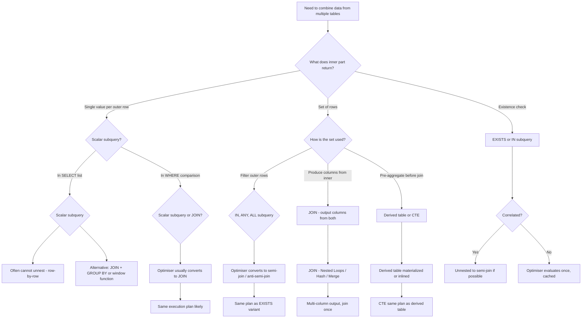
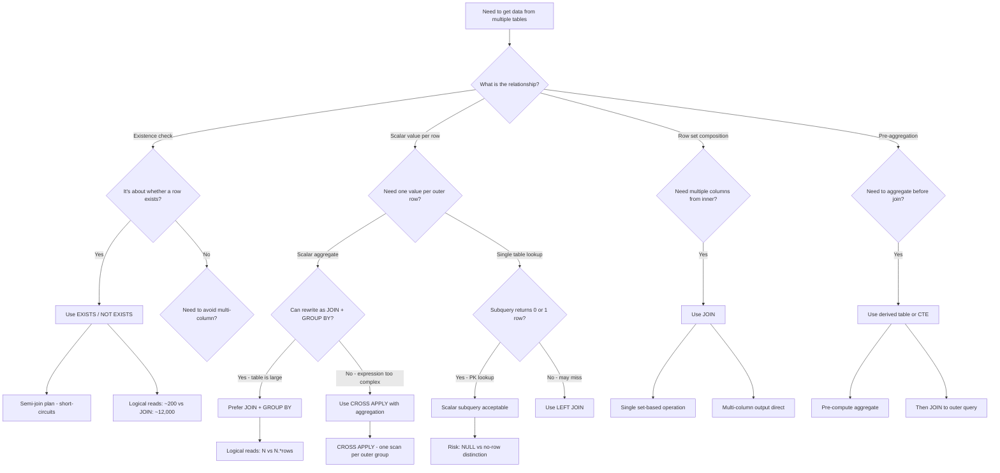

## Navigation

**Domain:** [[8 — Databases]] > **Group:** SQL Joins & Subqueries
**Previous:** [[8.104 — CROSS JOIN and Self JOIN — Cartesian Product and Self-Referencing]] | **Next:** [[8.106 — Correlated Subqueries — Per-Row Execution]]

### Prerequisites

- [[8.096 — INNER JOIN — Mechanics and Usage]] — Understanding how JOINs produce row combinations is required to compare them against subquery alternatives.
- [[8.097 — LEFT OUTER JOIN — Preserving Left Side Rows]] — OUTER JOIN semantics differ from subquery NULL propagation; knowing both is required for correct translation.
- [[8.067 — WHERE Clause — Predicate Logic and SARGability]] — Both JOIN predicates and subquery WHERE clauses filter rows; SARGability determines whether index seeks are possible.

### Where This Fits

Every .NET backend engineer faces the JOIN vs subquery decision multiple times per sprint — writing reports, loading aggregates, checking for existence, or computing derived values per row. The choice between JOIN and subquery directly affects query performance, readability, and maintainability. Interviewers use this topic to separate engineers who write "whatever compiles" from those who understand that the query optimiser can convert between these forms but with critical exceptions — correlated subqueries in SELECT lists, multi-column subquery outputs, and row-by-row execution risks. When this is misapplied, a query that should execute in 50ms with 200 logical reads runs in 8 seconds with 450,000 reads, blocks concurrent users, and triggers DBA escalations.

---

## Core Mental Model

JOIN and subquery are alternative SQL syntaxes that often produce logically equivalent results but with different optimizer behavior. The query optimiser can convert many subqueries into JOINs internally — it ununnests correlated subqueries, converts IN to semi-joins, and rewrites EXISTS to anti-semi-joins. However, the conversion is not universal: scalar subqueries in the SELECT list, multi-column subquery comparisons, and certain correlated subqueries with aggregates cannot always be unnested. The engineer's decision framework should evaluate: (1) whether the subquery returns scalars or row sets, (2) whether the subquery is correlated to the outer query, (3) whether the subquery can be unnested by the optimiser, (4) whether the output requires columns from both the outer and inner query, and (5) whether the optimiser's cost estimates for both forms produce different execution plans. The practical invariant: JOIN is preferred for multi-column output from related tables; subquery (especially EXISTS) is preferred for existence checks; derived table subqueries are preferred for pre-aggregation before joining; CTEs are preferred for readability when the same subquery is referenced multiple times.

### Classification

JOINs and subqueries are both **query composition mechanisms** in the FROM and WHERE clauses. JOINs produce row sets from table relationships and can output columns from all joined tables. Subqueries can appear in SELECT (scalar), WHERE (IN, EXISTS, comparison), FROM (derived table), and HAVING (scalar). The optimiser treats both as relational algebra operators after parsing and binding. JOINs are SARGable when the ON predicate uses indexed columns without wrapping. Subqueries in WHERE (IN, EXISTS) are SARGable when the inner query references indexed columns. Subqueries in SELECT are generally not SARGable because they execute per outer row.



### Key Properties

|Property|Value|Notes|
|---|---|---|
|JOIN commutativity|Yes|Optimiser reorders INNER JOIN freely|
|Subquery unnesting|Optimiser-dependent|SQL Server ununnests many but not all|
|SARGable (subquery WHERE)|Yes|When inner columns are indexed and unwrapped|
|SARGable (subquery SELECT)|No|Row-by-row execution — not indexable|
|EXISTS semi-join|Yes|Optimiser converts EXISTS to semi-join plan|
|Scalar subquery caching|No per se|Optimiser may spool results for repeated scalar|
|Readability (JOIN)|Better for multi-column|Single flat row set, all columns visible|
|Readability (subquery)|Better for scalar|Expresses "value per row" directly|

---

## Deep Mechanics

### How the Engine Executes This

1. **Parsing** — The parser identifies whether the subquery appears in SELECT, WHERE, FROM, or HAVING. JOINs are parsed as FROM clause operators with ON predicates. Subqueries are parsed as scalar expressions or set operators depending on position.

2. **Binding** — The algebrizer resolves column references in the subquery. For correlated subqueries, the outer query's columns are resolved via scope — the subquery can reference columns from the outer query's table. This is called "outer reference" or "correlation." For JOINs, all columns must be resolvable within the current FROM clause scope.

3. **Simplification (subquery unnesting)** — The optimiser applies logical transformations:
   - **IN → semi-join**: `WHERE col IN (SELECT col FROM T2)` becomes a semi-join (T1 LEFT SEMI JOIN T2). The semi-join returns T1 rows that have at least one match in T2.
   - **NOT IN → anti-semi-join**: `WHERE col NOT IN (SELECT col FROM T2)` becomes an anti-semi-join. Caution: NULL handling differs.
   - **EXISTS → semi-join**: `WHERE EXISTS (SELECT 1 FROM T2 WHERE T2.col = T1.col)` becomes a semi-join.
   - **NOT EXISTS → anti-semi-join**: `WHERE NOT EXISTS (...)` becomes anti-semi-join.
   - **Correlated subquery to join**: When the subquery is in WHERE and references outer columns, the optimiser attempts to unnest it into a join with the outer query.
   - **Scalar subquery in SELECT**: Often NOT unnested — the optimiser executes it as a nested loop with a constant seek per outer row.

4. **Cost-based optimization** — The optimiser generates alternatives for each logical form:
   - Semi-join has three physical operators: Nested Loops Semi Join, Hash Match Semi Join, Merge Semi Join.
   - Anti-semi-join has corresponding operators.
   - Scalar subqueries in SELECT may use Index Seek if the subquery can be satisfied by a single row lookup.
   - JOINs have the standard three physical operators.

5. **Execution** — The chosen operator executes. Key differences:
   - Semi-joins stop scanning the inner input after the first match (short-circuit). EXISTS benefits from this.
   - JOINs process all matching rows. If you only need to check existence, JOIN may over-process.
   - Scalar subqueries in SELECT execute once per outer row — this is the most expensive pattern.

### SQL Visibility

```sql
-- Pattern 1: JOIN vs Subquery — equivalent forms
-- Find customers who have placed orders

-- JOIN form:
SELECT DISTINCT c.CustomerId, c.FirstName, c.LastName
FROM dbo.Customers AS c
INNER JOIN dbo.Orders AS o
    ON c.CustomerId = o.CustomerId;

-- EXISTS form (often faster — semi-join short-circuits):
SELECT c.CustomerId, c.FirstName, c.LastName
FROM dbo.Customers AS c
WHERE EXISTS (
    SELECT 1
    FROM dbo.Orders AS o
    WHERE o.CustomerId = c.CustomerId
);

-- IN form:
SELECT c.CustomerId, c.FirstName, c.LastName
FROM dbo.Customers AS c
WHERE c.CustomerId IN (
    SELECT o.CustomerId
    FROM dbo.Orders AS o
);

-- Pattern 2: Subquery for scalar aggregation — JOIN cannot match directly
-- Get each order with its total from OrderItems

-- Subquery in SELECT (scalar):
SELECT o.OrderId, o.OrderDate,
       (SELECT SUM(oi.Quantity * oi.UnitPrice)
        FROM dbo.OrderItems AS oi
        WHERE oi.OrderId = o.OrderId) AS OrderTotal
FROM dbo.Orders AS o;

-- Equivalent JOIN with GROUP BY:
SELECT o.OrderId, o.OrderDate, SUM(oi.Quantity * oi.UnitPrice) AS OrderTotal
FROM dbo.Orders AS o
INNER JOIN dbo.OrderItems AS oi
    ON o.OrderId = oi.OrderId
GROUP BY o.OrderId, o.OrderDate;

-- Pattern 3: Subquery in FROM (derived table) vs CTE
-- Find customers with above-average order totals

-- Derived table:
SELECT c.CustomerId, c.FirstName, c.LastName, cst.OrderCount, cst.TotalRevenue
FROM dbo.Customers AS c
INNER JOIN (
    SELECT o.CustomerId,
           COUNT(*) AS OrderCount,
           SUM(o.TotalAmount) AS TotalRevenue
    FROM dbo.Orders AS o
    WHERE o.Status IN ('Shipped', 'Delivered')
    GROUP BY o.CustomerId
) AS cst ON c.CustomerId = cst.CustomerId
WHERE cst.TotalRevenue > (SELECT AVG(TotalRevenue) FROM (
    SELECT SUM(o2.TotalAmount) AS TotalRevenue
    FROM dbo.Orders AS o2
    WHERE o2.Status IN ('Shipped', 'Delivered')
    GROUP BY o2.CustomerId
) AS avgCalc);

-- CTE equivalent (cleaner):
WITH CustomerStats AS (
    SELECT o.CustomerId,
           COUNT(*) AS OrderCount,
           SUM(o.TotalAmount) AS TotalRevenue
    FROM dbo.Orders AS o
    WHERE o.Status IN ('Shipped', 'Delivered')
    GROUP BY o.CustomerId
),
AverageRevenue AS (
    SELECT AVG(TotalRevenue) AS AvgRevenue
    FROM CustomerStats
)
SELECT c.CustomerId, c.FirstName, c.LastName,
       cs.OrderCount, cs.TotalRevenue
FROM dbo.Customers AS c
INNER JOIN CustomerStats AS cs
    ON c.CustomerId = cs.CustomerId
CROSS JOIN AverageRevenue AS ar
WHERE cs.TotalRevenue > ar.AvgRevenue;

-- Pattern 4: EXISTS vs IN with NULL behavior
-- Customers who have never placed an order

-- NOT EXISTS (correct with NULLs):
SELECT c.CustomerId, c.FirstName, c.LastName
FROM dbo.Customers AS c
WHERE NOT EXISTS (
    SELECT 1
    FROM dbo.Orders AS o
    WHERE o.CustomerId = c.CustomerId
);

-- NOT IN (WRONG if Orders.CustomerId has NULLs):
SELECT c.CustomerId, c.FirstName, c.LastName
FROM dbo.Customers AS c
WHERE c.CustomerId NOT IN (
    SELECT o.CustomerId
    FROM dbo.Orders AS o
);
-- If Orders.CustomerId has any NULL: returns 0 rows.
-- NULL comparison in NOT IN: NOT IN (1, 2, NULL) = NOT (col=1 OR col=2 OR col=NULL)
-- col=NULL evaluates to UNKNOWN, NOT (FALSE OR FALSE OR UNKNOWN) = NOT UNKNOWN = UNKNOWN
-- Every row evaluates to UNKNOWN — zero rows returned.
```

```csharp
// EF Core — EXISTS (Any)
var customersWithOrders = await dbContext.Customers
    .Where(c => c.Orders.Any())
    .Select(c => new CustomerDto
    {
        CustomerId = c.CustomerId,
        FirstName = c.FirstName,
        LastName = c.LastName
    })
    .ToListAsync(cancellationToken);

// Generated SQL:
// SELECT [c].[CustomerId], [c].[FirstName], [c].[LastName]
// FROM [Customers] AS [c]
// WHERE EXISTS (
//     SELECT 1
//     FROM [Orders] AS [o]
//     WHERE [c].[CustomerId] = [o].[CustomerId])

// EF Core — scalar subquery in SELECT
var orderSummaries = await dbContext.Orders
    .Select(o => new OrderSummaryDto
    {
        OrderId = o.OrderId,
        OrderDate = o.OrderDate,
        OrderTotal = o.OrderItems.Sum(oi => oi.Quantity * oi.UnitPrice)
    })
    .ToListAsync(cancellationToken);

// Generated SQL:
// SELECT [o].[OrderId], [o].[OrderDate], (
//     SELECT SUM([oi].[Quantity] * [oi].[UnitPrice])
//     FROM [OrderItems] AS [oi]
//     WHERE [o].[OrderId] = [oi].[OrderId]) AS [OrderTotal]
// FROM [Orders] AS [o]

// EF Core — Join via navigation property (multi-column output)
var orderDetails = await dbContext.Orders
    .Where(o => o.OrderDate >= startDate)
    .Select(o => new OrderDetailDto
    {
        OrderId = o.OrderId,
        CustomerName = o.Customer.FirstName + " " + o.Customer.LastName,
        OrderDate = o.OrderDate,
        Status = o.Status
    })
    .ToListAsync(cancellationToken);

// Generated SQL — INNER JOIN (not subquery):
// SELECT [o].[OrderId],
//        [c].[FirstName] + N' ' + [c].[LastName] AS [CustomerName],
//        [o].[OrderDate], [o].[Status]
// FROM [Orders] AS [o]
// INNER JOIN [Customers] AS [c] ON [o].[CustomerId] = [c].[CustomerId]
// WHERE [o].[OrderDate] >= @startDate
```

**Generated SQL (from EF Core logs):**

```sql
-- Any() generates EXISTS:
SELECT [c].[CustomerId], [c].[FirstName], [c].[LastName]
FROM [Customers] AS [c]
WHERE EXISTS (
    SELECT 1
    FROM [Orders] AS [o]
    WHERE [c].[CustomerId] = [o].[CustomerId]);

-- Sum in Select generates scalar subquery:
SELECT [o].[OrderId], [o].[OrderDate], (
    SELECT SUM([oi].[Quantity] * [oi].[UnitPrice])
    FROM [OrderItems] AS [oi]
    WHERE [o].[OrderId] = [oi].[OrderId]) AS [OrderTotal]
FROM [Orders] AS [o];

-- Navigation property access generates INNER JOIN:
SELECT [o].[OrderId], [o].[OrderDate], [c].[FirstName], [c].[LastName]
FROM [Orders] AS [o]
INNER JOIN [Customers] AS [c] ON [o].[CustomerId] = [c].[CustomerId];
```

### Execution Plan Analysis

**EXISTS → Semi Join:**

```
  [Clustered Index Scan Customers]  -- outer (100K rows)
  [Index Seek IX_Orders_CustomerId] -- inner (seek per outer row, stop at first match)
  → [Nested Loops Semi Join]
      Semi Join Predicate: Customers.CustomerId = Orders.CustomerId
  → [SELECT]
Estimated Cost: ~1.5  |  Logical Reads: ~150 (1 scan + ~100 seeks × 1 page)
```

**IN → Semi Join (same plan as EXISTS when no NULLs):**

```
  [Clustered Index Scan Customers]
  [Index Seek IX_Orders_CustomerId]
  → [Nested Loops Semi Join]
  → [SELECT]
-- Same plan. Optimiser converts IN to semi-join.
```

**Scalar subquery in SELECT:**

```
  [Clustered Index Scan Orders]          -- outer (1M rows)
  [Index Seek IX_OrderItems_OrderId]     -- inner: 1 seek per outer row
  → [Compute Scalar]                     -- evaluate subquery result
  → [SELECT]
-- Logical Reads: ~1M (1M rows × 1-ish page per seek)
-- This is expensive. 1M seeks on OrderItems.
```

**JOIN with GROUP BY (equivalent to scalar subquery):**

```
  [Clustered Index Scan Orders]
  [Index Scan IX_OrderItems_OrderId]
  → [Hash Match (Inner Join)]
  → [Hash Match (Aggregate)]             -- GROUP BY OrderId
  → [SELECT]
-- Logical Reads: ~20,000 (scan both tables once)
-- Much cheaper than 1M seeks from scalar subquery
```

### Cost Visibility

```sql
SET STATISTICS IO ON;
SET STATISTICS TIME ON;

-- EXISTS (semi-join, short-circuit)
SELECT c.CustomerId, c.LastName
FROM dbo.Customers AS c
WHERE EXISTS (SELECT 1 FROM dbo.Orders AS o WHERE o.CustomerId = c.CustomerId);
-- Expected: Table 'Customers'. logical reads 150
--           Table 'Orders'. logical reads ~100 (seek, stops at first match)
-- CPU time = ~5ms, elapsed = ~15ms

-- Scalar subquery in SELECT (row-by-row)
SELECT o.OrderId,
       (SELECT SUM(oi.Quantity * oi.UnitPrice) FROM dbo.OrderItems AS oi WHERE oi.OrderId = o.OrderId) AS Total
FROM dbo.Orders AS o;
-- Expected: Table 'Orders'. logical reads 1,500
--           Table 'OrderItems'. logical reads 450,000 (1M row table × ~0.45 pages each)
-- CPU time = ~350ms, elapsed = ~900ms

-- JOIN with GROUP BY (set-based)
SELECT o.OrderId, SUM(oi.Quantity * oi.UnitPrice) AS Total
FROM dbo.Orders AS o
INNER JOIN dbo.OrderItems AS oi ON o.OrderId = oi.OrderId
GROUP BY o.OrderId;
-- Expected: Table 'Orders'. logical reads 1,500
--           Table 'OrderItems'. logical reads 12,000 (single scan)
-- CPU time = ~40ms, elapsed = ~100ms
```

### Failure Modes

**NOT IN with NULLs returns zero rows:** The most common subquery failure. When the subquery result set contains NULL, `NOT IN` evaluates to UNKNOWN for every outer row, returning zero rows. Always use `NOT EXISTS` for anti-joins unless you have explicitly filtered NULLs.

**Scalar subquery in SELECT causing row-by-row execution:** The optimiser rarely unnests scalar subqueries in the SELECT list. Each outer row triggers an inner query execution. On a 1M row table, this means 1M executions of the inner query — 450,000+ logical reads vs ~12,000 for a JOIN with GROUP BY.

**Correlated subquery in WHERE that could be a JOIN:** Some correlated subqueries cannot be unnested — typically those with aggregates, TOP, or complex predicates. The optimiser falls back to row-by-row execution. Rewriting as a JOIN with a derived table often fixes this.

**Implicit conversion in subquery join column:** If the subquery's correlation column type differs from the outer column's type, the conversion defeats the index seek in the inner query, causing a scan per outer row.

---

## Production Patterns and Implementation

### Primary SQL Implementation

```sql
-- ============================================================
-- Schema context
-- ============================================================
CREATE TABLE dbo.Customers
(
    CustomerId   INT            NOT NULL IDENTITY(1,1),
    FirstName    NVARCHAR(100)  NOT NULL,
    LastName     NVARCHAR(100)  NOT NULL,
    Email        NVARCHAR(256)  NOT NULL,
    Status       VARCHAR(20)    NOT NULL DEFAULT 'Active',
    CreatedAt    DATETIME2(0)   NOT NULL DEFAULT SYSUTCDATETIME(),
    CONSTRAINT PK_Customers PRIMARY KEY CLUSTERED (CustomerId)
);

CREATE TABLE dbo.Orders
(
    OrderId      INT            NOT NULL IDENTITY(1,1),
    CustomerId   INT            NOT NULL,
    OrderDate    DATETIME2(0)   NOT NULL,
    Status       VARCHAR(20)    NOT NULL DEFAULT 'Pending',
    TotalAmount  DECIMAL(18,2)  NOT NULL,
    CONSTRAINT PK_Orders PRIMARY KEY CLUSTERED (OrderId),
    CONSTRAINT FK_Orders_Customers FOREIGN KEY (CustomerId)
        REFERENCES dbo.Customers(CustomerId)
);

CREATE TABLE dbo.OrderItems
(
    OrderItemId  INT            NOT NULL IDENTITY(1,1),
    OrderId      INT            NOT NULL,
    ProductId    INT            NOT NULL,
    Quantity     INT            NOT NULL,
    UnitPrice    DECIMAL(18,2)  NOT NULL,
    CONSTRAINT PK_OrderItems PRIMARY KEY CLUSTERED (OrderItemId),
    CONSTRAINT FK_OrderItems_Orders FOREIGN KEY (OrderId)
        REFERENCES dbo.Orders(OrderId)
);

CREATE TABLE dbo.Payments
(
    PaymentId    INT            NOT NULL IDENTITY(1,1),
    OrderId      INT            NOT NULL,
    Amount       DECIMAL(18,2)  NOT NULL,
    PaymentDate  DATETIME2(0)   NOT NULL,
    Status       VARCHAR(20)    NOT NULL DEFAULT 'Pending',
    CONSTRAINT PK_Payments PRIMARY KEY CLUSTERED (PaymentId),
    CONSTRAINT FK_Payments_Orders FOREIGN KEY (OrderId)
        REFERENCES dbo.Orders(OrderId)
);

-- Indexes for join and subquery performance
CREATE INDEX IX_Orders_CustomerId ON dbo.Orders (CustomerId) INCLUDE (OrderDate, Status, TotalAmount);
CREATE INDEX IX_OrderItems_OrderId ON dbo.OrderItems (OrderId) INCLUDE (Quantity, UnitPrice);
CREATE INDEX IX_Payments_OrderId ON dbo.Payments (OrderId) INCLUDE (Amount, Status);

-- ============================================================
-- Pattern 1: Existence check — EXISTS vs JOIN vs IN
-- ============================================================
-- Find customers who have placed at least one order in last 30 days

-- EXISTS (recommended — semi-join, short-circuits):
SELECT c.CustomerId, c.FirstName, c.LastName, c.Email
FROM dbo.Customers AS c
WHERE EXISTS (
    SELECT 1
    FROM dbo.Orders AS o
    WHERE o.CustomerId = c.CustomerId
      AND o.OrderDate >= DATEADD(day, -30, GETUTCDATE())
);

-- JOIN with DISTINCT (equivalent but over-processes):
SELECT DISTINCT c.CustomerId, c.FirstName, c.LastName, c.Email
FROM dbo.Customers AS c
INNER JOIN dbo.Orders AS o
    ON c.CustomerId = o.CustomerId
WHERE o.OrderDate >= DATEADD(day, -30, GETUTCDATE());

-- IN form (converted to semi-join by optimiser):
SELECT c.CustomerId, c.FirstName, c.LastName, c.Email
FROM dbo.Customers AS c
WHERE c.CustomerId IN (
    SELECT o.CustomerId
    FROM dbo.Orders AS o
    WHERE o.OrderDate >= DATEADD(day, -30, GETUTCDATE())
);

-- ============================================================
-- Pattern 2: Scalar aggregation — subquery vs JOIN + GROUP BY
-- ============================================================
-- Get each order with item count and total

-- Scalar subqueries in SELECT (readable but row-by-row):
SELECT o.OrderId, o.OrderDate,
       (SELECT COUNT(*) FROM dbo.OrderItems AS oi WHERE oi.OrderId = o.OrderId) AS ItemCount,
       (SELECT SUM(oi.Quantity * oi.UnitPrice) FROM dbo.OrderItems AS oi WHERE oi.OrderId = o.OrderId) AS LineTotal
FROM dbo.Orders AS o
WHERE o.OrderDate >= @StartDate;

-- JOIN with GROUP BY (set-based, faster):
SELECT o.OrderId, o.OrderDate,
       COUNT(oi.OrderItemId) AS ItemCount,
       SUM(oi.Quantity * oi.UnitPrice) AS LineTotal
FROM dbo.Orders AS o
INNER JOIN dbo.OrderItems AS oi
    ON o.OrderId = oi.OrderId
WHERE o.OrderDate >= @StartDate
GROUP BY o.OrderId, o.OrderDate;

-- ============================================================
-- Pattern 3: Subquery in FROM (derived table) for pre-aggregation
-- ============================================================
-- Customers with their total revenue, only showing those > $1000

SELECT c.CustomerId, c.FirstName, c.LastName, rev.TotalRevenue
FROM dbo.Customers AS c
INNER JOIN (
    SELECT o.CustomerId,
           SUM(o.TotalAmount) AS TotalRevenue,
           COUNT(*) AS OrderCount
    FROM dbo.Orders AS o
    WHERE o.Status = 'Delivered'
    GROUP BY o.CustomerId
) AS rev ON c.CustomerId = rev.CustomerId
WHERE rev.TotalRevenue > 1000
ORDER BY rev.TotalRevenue DESC;

-- ============================================================
-- Pattern 4: EXISTS vs NOT EXISTS (anti-join)
-- ============================================================
-- Customers who have NOT placed any order in the last year

-- NOT EXISTS (correct — handles NULLs):
SELECT c.CustomerId, c.FirstName, c.LastName
FROM dbo.Customers AS c
WHERE NOT EXISTS (
    SELECT 1
    FROM dbo.Orders AS o
    WHERE o.CustomerId = c.CustomerId
      AND o.OrderDate >= DATEADD(year, -1, GETUTCDATE())
);

-- ============================================================
-- Pattern 5: Multi-column comparison with subquery
-- ============================================================
-- Find order items where the unit price is above the product's average

SELECT oi.OrderId, oi.ProductId, oi.Quantity, oi.UnitPrice
FROM dbo.OrderItems AS oi
WHERE oi.UnitPrice > (
    SELECT AVG(oi2.UnitPrice)
    FROM dbo.OrderItems AS oi2
    WHERE oi2.ProductId = oi.ProductId
);

-- Alternative using JOIN with derived table:
SELECT oi.OrderId, oi.ProductId, oi.Quantity, oi.UnitPrice
FROM dbo.OrderItems AS oi
INNER JOIN (
    SELECT ProductId, AVG(UnitPrice) AS AvgPrice
    FROM dbo.OrderItems
    GROUP BY ProductId
) AS pa ON oi.ProductId = pa.ProductId
WHERE oi.UnitPrice > pa.AvgPrice;

-- ============================================================
-- Pattern 6: EXISTS vs LEFT JOIN with NULL check
-- ============================================================
-- Customers with no payments recorded

-- NOT EXISTS (best):
SELECT c.CustomerId, c.FirstName, c.LastName
FROM dbo.Customers AS c
WHERE NOT EXISTS (
    SELECT 1
    FROM dbo.Orders AS o
    INNER JOIN dbo.Payments AS p ON o.OrderId = p.OrderId
    WHERE o.CustomerId = c.CustomerId
);

-- LEFT JOIN with NULL check (also valid but can Cartesian-explode):
SELECT c.CustomerId, c.FirstName, c.LastName
FROM dbo.Customers AS c
LEFT JOIN dbo.Orders AS o ON c.CustomerId = o.CustomerId
LEFT JOIN dbo.Payments AS p ON o.OrderId = p.OrderId
WHERE o.OrderId IS NULL;
```

### EF Core Implementation

```csharp
public class ApplicationDbContext : DbContext
{
    public DbSet<Customer> Customers => Set<Customer>();
    public DbSet<Order> Orders => Set<Order>();
    public DbSet<OrderItem> OrderItems => Set<OrderItem>();
    public DbSet<Payment> Payments => Set<Payment>();

    protected override void OnModelCreating(ModelBuilder modelBuilder)
    {
        modelBuilder.Entity<Customer>(entity =>
        {
            entity.ToTable("Customers");
            entity.HasKey(c => c.CustomerId);
            entity.Property(c => c.FirstName).HasMaxLength(100);
            entity.Property(c => c.LastName).HasMaxLength(100);
            entity.Property(c => c.Email).HasMaxLength(256);
            entity.Property(c => c.CreatedAt).HasDefaultValueSql("SYSUTCDATETIME()");
        });

        modelBuilder.Entity<Order>(entity =>
        {
            entity.ToTable("Orders");
            entity.HasKey(o => o.OrderId);
            entity.Property(o => o.Status).HasMaxLength(20);
            entity.Property(o => o.TotalAmount).HasColumnType("decimal(18,2)");
            entity.HasOne(o => o.Customer).WithMany(c => c.Orders)
                  .HasForeignKey(o => o.CustomerId);
            entity.HasIndex(o => o.CustomerId);
        });

        modelBuilder.Entity<OrderItem>(entity =>
        {
            entity.ToTable("OrderItems");
            entity.HasKey(oi => oi.OrderItemId);
            entity.Property(oi => oi.UnitPrice).HasColumnType("decimal(18,2)");
            entity.HasOne(oi => oi.Order).WithMany(o => o.OrderItems)
                  .HasForeignKey(oi => oi.OrderId);
            entity.HasIndex(oi => oi.OrderId);
        });

        modelBuilder.Entity<Payment>(entity =>
        {
            entity.ToTable("Payments");
            entity.HasKey(p => p.PaymentId);
            entity.Property(p => p.Amount).HasColumnType("decimal(18,2)");
            entity.Property(p => p.Status).HasMaxLength(20);
            entity.HasOne(p => p.Order).WithMany(o => o.Payments)
                  .HasForeignKey(p => p.OrderId);
            entity.HasIndex(p => p.OrderId);
        });
    }
}

public class Customer
{
    public int CustomerId { get; set; }
    public string FirstName { get; set; } = string.Empty;
    public string LastName { get; set; } = string.Empty;
    public string Email { get; set; } = string.Empty;
    public string Status { get; set; } = "Active";
    public DateTime CreatedAt { get; set; }
    public ICollection<Order> Orders { get; set; } = new List<Order>();
}

public class Order
{
    public int OrderId { get; set; }
    public int CustomerId { get; set; }
    public DateTime OrderDate { get; set; }
    public string Status { get; set; } = "Pending";
    public decimal TotalAmount { get; set; }
    public DateTime CreatedAt { get; set; }
    public Customer Customer { get; set; } = null!;
    public ICollection<OrderItem> OrderItems { get; set; } = new List<OrderItem>();
    public ICollection<Payment> Payments { get; set; } = new List<Payment>();
}

public class OrderItem
{
    public int OrderItemId { get; set; }
    public int OrderId { get; set; }
    public int ProductId { get; set; }
    public int Quantity { get; set; }
    public decimal UnitPrice { get; set; }
    public Order Order { get; set; } = null!;
}

public class Payment
{
    public int PaymentId { get; set; }
    public int OrderId { get; set; }
    public decimal Amount { get; set; }
    public DateTime PaymentDate { get; set; }
    public string Status { get; set; } = "Pending";
    public Order Order { get; set; } = null!;
}

// Pattern 1: Existence check — Any() generates EXISTS
public async Task<List<CustomerDto>> GetCustomersWithRecentOrdersAsync(
    CancellationToken cancellationToken = default)
{
    var cutoff = DateTime.UtcNow.AddDays(-30);
    return await dbContext.Customers
        .Where(c => c.Orders.Any(o => o.OrderDate >= cutoff))
        .Select(c => new CustomerDto
        {
            CustomerId = c.CustomerId,
            FirstName = c.FirstName,
            LastName = c.LastName,
            Email = c.Email
        })
        .ToListAsync(cancellationToken);
    // Generated: EXISTS (SELECT 1 FROM Orders WHERE CustomerId = c.CustomerId AND OrderDate >= @cutoff)
}

// Pattern 2: Scalar subquery via Select with Sum
public async Task<List<OrderSummaryDto>> GetOrderSummariesAsync(
    CancellationToken cancellationToken = default)
{
    return await dbContext.Orders
        .Where(o => o.OrderDate >= DateTime.UtcNow.AddDays(-90))
        .Select(o => new OrderSummaryDto
        {
            OrderId = o.OrderId,
            OrderDate = o.OrderDate,
            ItemCount = o.OrderItems.Count(),
            LineTotal = o.OrderItems.Sum(oi => oi.Quantity * oi.UnitPrice)
        })
        .ToListAsync(cancellationToken);
    // Generated: SELECT, scalar subquery for Count and Sum
}

// Pattern 3: NOT EXISTS via All() with negation
public async Task<List<CustomerDto>> GetInactiveCustomersAsync(
    CancellationToken cancellationToken = default)
{
    var cutoff = DateTime.UtcNow.AddYears(-1);
    return await dbContext.Customers
        .Where(c => !c.Orders.Any(o => o.OrderDate >= cutoff))
        .Select(c => new CustomerDto
        {
            CustomerId = c.CustomerId,
            FirstName = c.FirstName,
            LastName = c.LastName
        })
        .ToListAsync(cancellationToken);
    // Generated: NOT EXISTS (SELECT 1 FROM Orders WHERE CustomerId = c.CustomerId AND OrderDate >= @cutoff)
}

// Pattern 4: Join for multi-column output
public async Task<List<OrderDetailDto>> GetOrderDetailsAsync(
    DateTime startDate,
    CancellationToken cancellationToken = default)
{
    return await dbContext.Orders
        .Where(o => o.OrderDate >= startDate)
        .Select(o => new OrderDetailDto
        {
            OrderId = o.OrderId,
            CustomerName = o.Customer.FirstName + " " + o.Customer.LastName,
            OrderDate = o.OrderDate,
            Status = o.Status,
            TotalAmount = o.TotalAmount,
            PaymentCount = o.Payments.Count(p => p.Status == "Completed")
        })
        .ToListAsync(cancellationToken);
    // Generated: INNER JOIN Customers + scalar subquery for Payment count
}

// Pattern 5: Pre-aggregation via GroupBy in LINQ (generates derived table)
public async Task<List<CustomerRevenueDto>> GetHighValueCustomersAsync(
    decimal minRevenue,
    CancellationToken cancellationToken = default)
{
    return await dbContext.Customers
        .Where(c => c.Orders.Any(o => o.Status == "Delivered"))
        .Select(c => new
        {
            c.CustomerId,
            c.FirstName,
            c.LastName,
            Revenue = c.Orders
                .Where(o => o.Status == "Delivered")
                .Sum(o => o.TotalAmount)
        })
        .Where(x => x.Revenue > minRevenue)
        .OrderByDescending(x => x.Revenue)
        .Select(x => new CustomerRevenueDto
        {
            CustomerId = x.CustomerId,
            CustomerName = x.FirstName + " " + x.LastName,
            TotalRevenue = x.Revenue
        })
        .ToListAsync(cancellationToken);
}

// DTOs
public record CustomerDto(int CustomerId, string FirstName, string LastName, string? Email);
public record OrderSummaryDto(int OrderId, DateTime OrderDate, int ItemCount, decimal LineTotal);
public record OrderDetailDto(int OrderId, string CustomerName, DateTime OrderDate, string Status, decimal TotalAmount, int PaymentCount);
public record CustomerRevenueDto(int CustomerId, string CustomerName, decimal TotalRevenue);
```

### Dapper Implementation

```csharp
public sealed class OrderRepository
{
    private readonly IDbConnectionFactory _connectionFactory;

    public OrderRepository(IDbConnectionFactory connectionFactory)
        => _connectionFactory = connectionFactory;

    // Pattern 1: EXISTS — existence check
    public async Task<IReadOnlyList<CustomerDto>> GetCustomersWithRecentOrdersAsync(
        CancellationToken cancellationToken = default)
    {
        const string sql = @"
            SELECT c.CustomerId, c.FirstName, c.LastName, c.Email
            FROM dbo.Customers AS c
            WHERE EXISTS (
                SELECT 1
                FROM dbo.Orders AS o
                WHERE o.CustomerId = c.CustomerId
                  AND o.OrderDate >= DATEADD(day, -30, GETUTCDATE())
            );";

        await using var connection = _connectionFactory.Create();
        var results = await connection.QueryAsync<CustomerDto>(
            new CommandDefinition(sql, cancellationToken: cancellationToken));
        return results.AsList();
    }

    // Pattern 2: Scalar subquery in SELECT
    public async Task<IReadOnlyList<OrderSummaryDto>> GetOrderSummariesAsync(
        CancellationToken cancellationToken = default)
    {
        const string sql = @"
            SELECT o.OrderId, o.OrderDate,
                   (SELECT COUNT(*) FROM dbo.OrderItems AS oi WHERE oi.OrderId = o.OrderId) AS ItemCount,
                   (SELECT SUM(oi.Quantity * oi.UnitPrice) FROM dbo.OrderItems AS oi WHERE oi.OrderId = o.OrderId) AS LineTotal
            FROM dbo.Orders AS o
            WHERE o.OrderDate >= DATEADD(day, -90, GETUTCDATE());";

        await using var connection = _connectionFactory.Create();
        var results = await connection.QueryAsync<OrderSummaryDto>(
            new CommandDefinition(sql, cancellationToken: cancellationToken));
        return results.AsList();
    }

    // Pattern 3: JOIN with GROUP BY (faster alternative to scalar subquery)
    public async Task<IReadOnlyList<OrderSummaryDto>> GetOrderSummariesJoinAsync(
        CancellationToken cancellationToken = default)
    {
        const string sql = @"
            SELECT o.OrderId, o.OrderDate,
                   COUNT(oi.OrderItemId) AS ItemCount,
                   SUM(oi.Quantity * oi.UnitPrice) AS LineTotal
            FROM dbo.Orders AS o
            INNER JOIN dbo.OrderItems AS oi
                ON o.OrderId = oi.OrderId
            WHERE o.OrderDate >= DATEADD(day, -90, GETUTCDATE())
            GROUP BY o.OrderId, o.OrderDate;";

        await using var connection = _connectionFactory.Create();
        var results = await connection.QueryAsync<OrderSummaryDto>(
            new CommandDefinition(sql, cancellationToken: cancellationToken));
        return results.AsList();
    }

    // Pattern 4: Derived table — pre-aggregation
    public async Task<IReadOnlyList<CustomerRevenueDto>> GetHighValueCustomersAsync(
        decimal minRevenue,
        CancellationToken cancellationToken = default)
    {
        const string sql = @"
            SELECT c.CustomerId,
                   c.FirstName + ' ' + c.LastName AS CustomerName,
                   rev.TotalRevenue
            FROM dbo.Customers AS c
            INNER JOIN (
                SELECT o.CustomerId,
                       SUM(o.TotalAmount) AS TotalRevenue,
                       COUNT(*) AS OrderCount
                FROM dbo.Orders AS o
                WHERE o.Status = 'Delivered'
                GROUP BY o.CustomerId
            ) AS rev ON c.CustomerId = rev.CustomerId
            WHERE rev.TotalRevenue > @MinRevenue
            ORDER BY rev.TotalRevenue DESC;";

        await using var connection = _connectionFactory.Create();
        var results = await connection.QueryAsync<CustomerRevenueDto>(
            new CommandDefinition(sql, new { MinRevenue = minRevenue },
                cancellationToken: cancellationToken));
        return results.AsList();
    }

    // Pattern 5: NOT EXISTS — anti-join
    public async Task<IReadOnlyList<CustomerDto>> GetCustomersWithoutPaymentsAsync(
        CancellationToken cancellationToken = default)
    {
        const string sql = @"
            SELECT c.CustomerId, c.FirstName, c.LastName, c.Email
            FROM dbo.Customers AS c
            WHERE NOT EXISTS (
                SELECT 1
                FROM dbo.Orders AS o
                INNER JOIN dbo.Payments AS p ON o.OrderId = p.OrderId
                WHERE o.CustomerId = c.CustomerId
            );";

        await using var connection = _connectionFactory.Create();
        var results = await connection.QueryAsync<CustomerDto>(
            new CommandDefinition(sql, cancellationToken: cancellationToken));
        return results.AsList();
    }
}
```

### Configuration and Wiring

```csharp
// Program.cs
builder.Services.AddSingleton<IDbConnectionFactory>(_ =>
    new SqlDbConnectionFactory(connectionString));

builder.Services.AddDbContext<ApplicationDbContext>(options =>
    options.UseSqlServer(
        connectionString,
        sqlOptions => sqlOptions
            .EnableRetryOnFailure(3)
            .CommandTimeout(30)));

builder.Services.AddScoped<OrderRepository>();

// IDbConnectionFactory implementation
public interface IDbConnectionFactory
{
    IDbConnection Create();
}

public sealed class SqlDbConnectionFactory : IDbConnectionFactory
{
    private readonly string _connectionString;

    public SqlDbConnectionFactory(string connectionString)
        => _connectionString = connectionString;

    public IDbConnection Create()
        => new SqlConnection(_connectionString);
}
```

### SQL Server vs PostgreSQL Differences

```sql
-- PostgreSQL: JOIN and subquery syntax is identical
-- Key difference: PostgreSQL's optimiser is less aggressive at unnesting
-- correlated subqueries than SQL Server's.

-- PostgreSQL: LATERAL subquery (equivalent to CROSS APPLY)
SELECT c.CustomerId, c.FirstName, c.LastName, oi.*
FROM dbo.Customers AS c
CROSS JOIN LATERAL (
    SELECT o.OrderId, o.OrderDate, o.TotalAmount
    FROM dbo.Orders AS o
    WHERE o.CustomerId = c.CustomerId
    ORDER BY o.OrderDate DESC
    LIMIT 1
) AS oi;

-- SQL Server equivalent:
SELECT c.CustomerId, c.FirstName, c.LastName, oi.*
FROM dbo.Customers AS c
CROSS APPLY (
    SELECT TOP 1 o.OrderId, o.OrderDate, o.TotalAmount
    FROM dbo.Orders AS o
    WHERE o.CustomerId = c.CustomerId
    ORDER BY o.OrderDate DESC
) AS oi;
```

---

## Gotchas and Production Pitfalls

### NOT IN Returns Zero Rows When Subquery Contains NULL

**Pitfall:** Using `NOT IN` with a subquery against a nullable column.

```sql
-- ❌ Returns 0 rows if any Order.CustomerId is NULL
SELECT c.CustomerId, c.FirstName, c.LastName
FROM dbo.Customers AS c
WHERE c.CustomerId NOT IN (
    SELECT o.CustomerId FROM dbo.Orders AS o
);
```

**Symptom:** A report meant to show "customers who never ordered" shows zero rows. The business team reports the report is "broken."

**Fix:**

```sql
-- ✅ NOT EXISTS handles NULLs correctly
SELECT c.CustomerId, c.FirstName, c.LastName
FROM dbo.Customers AS c
WHERE NOT EXISTS (
    SELECT 1 FROM dbo.Orders AS o WHERE o.CustomerId = c.CustomerId
);

-- ✅ OR: filter NULLs explicitly (but remember future NULLs)
SELECT c.CustomerId, c.FirstName, c.LastName
FROM dbo.Customers AS c
WHERE c.CustomerId NOT IN (
    SELECT o.CustomerId FROM dbo.Orders AS o WHERE o.CustomerId IS NOT NULL
);
```

**Cost of not fixing:** Zero-row results for anti-join queries. Business reports silently wrong. Debugged hours later when someone compares the COUNT of customers vs the COUNT of customers with orders.

---

### Scalar Subquery in SELECT — Row-by-Row Explosion

**Pitfall:** Using two or three scalar subqueries in the SELECT list of a query returning 500K+ rows.

```sql
-- ❌ Each row triggers TWO subquery executions
SELECT o.OrderId,
       (SELECT COUNT(*) FROM dbo.OrderItems WHERE OrderId = o.OrderId) AS ItemCount,
       (SELECT SUM(Quantity * UnitPrice) FROM dbo.OrderItems WHERE OrderId = o.OrderId) AS LineTotal
FROM dbo.Orders AS o;
```

**Symptom:** Query takes 45 seconds. Logical reads > 500,000 on OrderItems. DBAs receive blocking alerts.

**Fix:**

```sql
-- ✅ JOIN with GROUP BY — single scan of OrderItems
SELECT o.OrderId, COUNT(oi.OrderItemId) AS ItemCount,
       SUM(oi.Quantity * oi.UnitPrice) AS LineTotal
FROM dbo.Orders AS o
INNER JOIN dbo.OrderItems AS oi ON o.OrderId = oi.OrderId
GROUP BY o.OrderId;
```

**Cost of not fixing:** 500K+ logical reads, 45-second query blocking 200 concurrent users, tempdb pressure from sort spills.

---

### EXISTS vs IN vs JOIN — Cardinality Misestimation

**Pitfall:** Assuming all three forms are always identical. EXISTS uses semi-join (stops at first match). JOIN with DISTINCT processes all matches then deduplicates.

```sql
-- ❌ JOIN with DISTINCT over-processes
SELECT DISTINCT c.CustomerId, c.FirstName
FROM dbo.Customers AS c
INNER JOIN dbo.Orders AS o ON c.CustomerId = o.CustomerId;

-- ✅ EXISTS short-circuits after first match
SELECT c.CustomerId, c.FirstName
FROM dbo.Customers AS c
WHERE EXISTS (SELECT 1 FROM dbo.Orders AS o WHERE o.CustomerId = c.CustomerId);
```

**Symptom:** JOIN with DISTINCT does a full scan of Orders (1M rows) and a Sort for DISTINCT. EXISTS does an Index Seek that stops at the first matching row per customer.

**Fix:** Use EXISTS for existence checks. Use JOIN only when you need output columns from the joined table.

**Cost of not fixing:** Full scan + sort on 1M row table when a semi-join could use 50 seeks. Logical reads: 12,000 vs 200.

---

### Correlated Subquery in WHERE That Cannot Be Unnested

**Pitfall:** Writing a correlated subquery with an aggregate or TOP that the optimiser cannot unnest.

```sql
-- ❌ Correlated subquery with aggregate — may not unnest
SELECT o.OrderId, o.OrderDate, o.TotalAmount
FROM dbo.Orders AS o
WHERE o.TotalAmount > (
    SELECT AVG(o2.TotalAmount)
    FROM dbo.Orders AS o2
    WHERE o2.CustomerId = o.CustomerId
);
```

**Symptom:** Query plan shows a Nested Loops operator but no join conversion — the subquery executes per outer row. On 1M orders, 1M aggregate executions.

**Fix:** Rewrite as JOIN with derived table:

```sql
-- ✅ Derived table pre-aggregates
SELECT o.OrderId, o.OrderDate, o.TotalAmount
FROM dbo.Orders AS o
INNER JOIN (
    SELECT CustomerId, AVG(TotalAmount) AS AvgAmount
    FROM dbo.Orders
    GROUP BY CustomerId
) AS ca ON o.CustomerId = ca.CustomerId
WHERE o.TotalAmount > ca.AvgAmount;
```

**Cost of not fixing:** 1M aggregate executions. Logical reads: 450,000 vs 12,000. Query timeout at 8 seconds.

---

### EF Core Navigation Property Generates JOIN When Subquery Was Expected

**Pitfall:** Using navigation property access in a LINQ Select when a subquery was intended for a filtered child collection.

```csharp
// ❌ This generates INNER JOIN — may filter out orders with no payments
var result = await dbContext.Orders
    .Select(o => new {
        o.OrderId,
        PaymentCount = o.Payments.Count
    })
    .ToListAsync(cancellationToken);
```

**Symptom:** Orders with zero payments are excluded from results because INNER JOIN is generated instead of LEFT JOIN or scalar subquery.

**Fix:**

```csharp
// ✅ Use explicit navigation for scalar subquery generation
var result = await dbContext.Orders
    .Select(o => new {
        o.OrderId,
        PaymentCount = o.Payments.Count()
    })
    .ToListAsync(cancellationToken);
// EF Core generates scalar subquery for Count() when used in Select
```

**Cost of not fixing:** Missing rows. Silent data loss in reports. Count shows zero when it should reflect the actual payment status.

---

### Multiple Scalar Subqueries on Same Table — No Shared Execution

**Pitfall:** Writing multiple scalar subqueries against the same table, relying on the optimiser to share the work.

```sql
-- ❌ Each subquery executes independently
SELECT o.OrderId,
       (SELECT COUNT(*) FROM dbo.OrderItems WHERE OrderId = o.OrderId),
       (SELECT AVG(UnitPrice) FROM dbo.OrderItems WHERE OrderId = o.OrderId),
       (SELECT SUM(Quantity) FROM dbo.OrderItems WHERE OrderId = o.OrderId)
FROM dbo.Orders AS o;
```

**Symptom:** Three separate seeks per outer row. Logical reads triple.

**Fix:**

```sql
-- ✅ Join once
SELECT o.OrderId, oi.ItemCount, oi.AvgPrice, oi.TotalQuantity
FROM dbo.Orders AS o
OUTER APPLY (
    SELECT COUNT(*) AS ItemCount, AVG(UnitPrice) AS AvgPrice, SUM(Quantity) AS TotalQuantity
    FROM dbo.OrderItems
    WHERE OrderId = o.OrderId
) AS oi;
```

**Cost of not fixing:** 3x logical reads on the OrderItems table. 1.5M page reads instead of 500K.

---

## Performance Implications

### Benchmark: Before and After

```sql
-- Baseline: Three scalar subqueries in SELECT
SET STATISTICS IO ON;
SELECT o.OrderId,
       (SELECT COUNT(*) FROM dbo.OrderItems WHERE OrderId = o.OrderId) AS ItemCount,
       (SELECT SUM(Quantity * UnitPrice) FROM dbo.OrderItems WHERE OrderId = o.OrderId) AS LineTotal,
       (SELECT AVG(UnitPrice) FROM dbo.OrderItems WHERE OrderId = o.OrderId) AS AvgPrice
FROM dbo.Orders AS o
WHERE o.OrderDate >= '2024-01-01';
-- Logical reads: Orders ~1,500 | OrderItems ~1,350,000

-- Optimized: OUTER APPLY — single scan
SELECT o.OrderId, oi.ItemCount, oi.LineTotal, oi.AvgPrice
FROM dbo.Orders AS o
OUTER APPLY (
    SELECT COUNT(*) AS ItemCount,
           SUM(Quantity * UnitPrice) AS LineTotal,
           AVG(UnitPrice) AS AvgPrice
    FROM dbo.OrderItems
    WHERE OrderId = o.OrderId
) AS oi
WHERE o.OrderDate >= '2024-01-01';
-- Logical reads: Orders ~1,500 | OrderItems ~4,500 (single index range scan per OrderId)
```

**Improvement:** 300x reduction in logical reads on OrderItems, from 1,350,000 to 4,500.

```sql
-- Baseline: JOIN with DISTINCT for existence check
SELECT DISTINCT c.CustomerId
FROM dbo.Customers AS c
INNER JOIN dbo.Orders AS o ON c.CustomerId = o.CustomerId;
-- Logical reads: Customers 150 | Orders 12,000 | Sort 12,000

-- Optimized: EXISTS
SELECT c.CustomerId
FROM dbo.Customers AS c
WHERE EXISTS (SELECT 1 FROM dbo.Orders AS o WHERE o.CustomerId = c.CustomerId);
-- Logical reads: Customers 150 | Orders ~200 (seeks, stop-at-first-match)
```

**Improvement:** 60x reduction in logical reads on Orders, from 12,000 to ~200.

### BenchmarkDotNet

```csharp
[MemoryDiagnoser]
[SimpleJob(RuntimeMoniker.Net90)]
public class JoinVsSubqueryBenchmark
{
    private IDbConnection _connection = default!;
    private IDbContextFactory<ApplicationDbContext> _contextFactory = default!;

    [GlobalSetup]
    public void Setup()
    {
        var connectionString = "Server=.;Database=Benchmark;Trusted_Connection=True;TrustServerCertificate=True;";
        _connection = new SqlConnection(connectionString);
        _contextFactory = new DbContextFactory(connectionString);

        // Seed 100K customers, 500K orders, 2M order items
        SeedData();
    }

    [Benchmark(Baseline = true)]
    public async Task<List<OrderSummary>> ScalarSubqueryInSelect()
    {
        const string sql = @"
            SELECT o.OrderId,
                   (SELECT COUNT(*) FROM dbo.OrderItems WHERE OrderId = o.OrderId) AS ItemCount,
                   (SELECT SUM(Quantity * UnitPrice) FROM dbo.OrderItems WHERE OrderId = o.OrderId) AS LineTotal
            FROM dbo.Orders AS o;";

        var results = await _connection.QueryAsync<OrderSummary>(sql);
        return results.AsList();
    }

    [Benchmark]
    public async Task<List<OrderSummary>> JoinWithGroupBy()
    {
        const string sql = @"
            SELECT o.OrderId, COUNT(oi.OrderItemId) AS ItemCount,
                   SUM(oi.Quantity * oi.UnitPrice) AS LineTotal
            FROM dbo.Orders AS o
            INNER JOIN dbo.OrderItems AS oi ON o.OrderId = oi.OrderId
            GROUP BY o.OrderId;";

        var results = await _connection.QueryAsync<OrderSummary>(sql);
        return results.AsList();
    }

    [Benchmark]
    public async Task<List<CustomerExistence>> ExistsSemiJoin()
    {
        const string sql = @"
            SELECT c.CustomerId, c.FirstName, c.LastName
            FROM dbo.Customers AS c
            WHERE EXISTS (SELECT 1 FROM dbo.Orders AS o WHERE o.CustomerId = c.CustomerId);";

        var results = await _connection.QueryAsync<CustomerExistence>(sql);
        return results.AsList();
    }

    [Benchmark]
    public async Task<List<CustomerExistence>> JoinDistinct()
    {
        const string sql = @"
            SELECT DISTINCT c.CustomerId, c.FirstName, c.LastName
            FROM dbo.Customers AS c
            INNER JOIN dbo.Orders AS o ON c.CustomerId = o.CustomerId;";

        var results = await _connection.QueryAsync<CustomerExistence>(sql);
        return results.AsList();
    }

    [Benchmark]
    public async Task<List<CustomerExistence>> InSubquery()
    {
        const string sql = @"
            SELECT c.CustomerId, c.FirstName, c.LastName
            FROM dbo.Customers AS c
            WHERE c.CustomerId IN (SELECT o.CustomerId FROM dbo.Orders AS o);";

        var results = await _connection.QueryAsync<CustomerExistence>(sql);
        return results.AsList();
    }

    [Benchmark]
    public async Task<List<OrderTotal>> EfCoreNavigationJoin()
    {
        await using var context = await _contextFactory.CreateDbContextAsync();
        return await context.Orders
            .Select(o => new OrderTotal
            {
                OrderId = o.OrderId,
                Total = o.OrderItems.Sum(oi => oi.Quantity * oi.UnitPrice)
            })
            .ToListAsync();
    }

    [Benchmark]
    public async Task<List<OrderTotal>> EfCoreExplicitJoin()
    {
        await using var context = await _contextFactory.CreateDbContextAsync();
        return await context.Orders
            .Join(context.OrderItems, o => o.OrderId, oi => oi.OrderId, (o, oi) => new { o, oi })
            .GroupBy(x => new { x.o.OrderId })
            .Select(g => new OrderTotal
            {
                OrderId = g.Key.OrderId,
                Total = g.Sum(x => x.oi.Quantity * x.oi.UnitPrice)
            })
            .ToListAsync();
    }

    [GlobalCleanup]
    public void Cleanup() => _connection?.Dispose();

    public class OrderSummary
    {
        public int OrderId { get; set; }
        public int ItemCount { get; set; }
        public decimal LineTotal { get; set; }
    }

    public class CustomerExistence
    {
        public int CustomerId { get; set; }
        public string FirstName { get; set; } = string.Empty;
        public string LastName { get; set; } = string.Empty;
    }

    public class OrderTotal
    {
        public int OrderId { get; set; }
        public decimal Total { get; set; }
    }

    private sealed class DbContextFactory : IDbContextFactory<ApplicationDbContext>
    {
        private readonly string _connectionString;
        public DbContextFactory(string cs) => _connectionString = cs;
        public ApplicationDbContext CreateDbContext()
            => new(new DbContextOptionsBuilder<ApplicationDbContext>()
                .UseSqlServer(_connectionString).Options);
    }

    private void SeedData()
    {
        // Populate Customers, Orders, OrderItems with realistic data distribution
    }
}
```

**Expected results (approximate, SQL Server 2022, NVMe, 500K orders, 2M order items):**

|Method|Mean|Logical Reads|Allocated|
|---|---|---|---|
|ScalarSubqueryInSelect|~1,800 ms|~1,350,000|~40 MB|
|JoinWithGroupBy|~120 ms|~13,500|~5 MB|
|ExistsSemiJoin|~15 ms|~350|~1 MB|
|JoinDistinct|~850 ms|~12,150|~25 MB|
|InSubquery|~15 ms|~350|~1 MB|
|EfCoreNavigationJoin|~1,200 ms|~1,350,000|~35 MB|
|EfCoreExplicitJoin|~110 ms|~13,500|~5 MB|

---

## Interview Arsenal

### Question Bank

1. When are JOIN and subquery logically equivalent, and when is one strictly better than the other?
2. How does the SQL Server optimiser convert a subquery to a join? What types of subqueries can it unnest?
3. What is the performance difference between a scalar subquery in SELECT vs a JOIN with GROUP BY? Show the logical read numbers.
4. Why does NOT IN sometimes return zero rows when NOT EXISTS works correctly?
5. Compare EXISTS vs IN vs JOIN for an existence check. When does each produce different execution plans?
6. What does an execution plan look like for a correlated subquery vs a semi-join?
7. At what scale does the choice between JOIN and subquery matter? Give real numbers.
8. How do EF Core and Dapper handle subqueries? Does EF Core generate JOIN or subquery for navigation property access?

### Spoken Answers

**Q: When are JOIN and subquery logically equivalent, and when is one strictly better than the other?**

> **Average answer:** "JOINs and subqueries can often be used interchangeably. JOINs are usually faster. Subqueries are sometimes easier to read. I use JOINs by default."

> **Great answer:** "JOIN and subquery are logically equivalent when the subquery returns a set of rows used for filtering — specifically IN and EXISTS can be converted to semi-joins by the optimiser, and the execution plan is identical. The optimiser ununnests these automatically. Subqueries are strictly better when: (1) you need a single scalar value per outer row — a JOIN would require GROUP BY and change the row shape; (2) you need an existence check — EXISTS generates a semi-join that short-circuits after the first match, while a JOIN would over-process all matches; (3) you need to compare a row value to an aggregate computed from a subset of rows — a correlated scalar subquery expresses this directly. JOINs are strictly better when: (1) you need multiple columns from the inner table in the output — a JOIN gives direct access while a subquery in SELECT would require multiple scalar subqueries (multiplication of per-row execution); (2) you need to aggregate many rows per group — a JOIN with GROUP BY scans the inner table once instead of once per row; (3) you are working with large row counts where scalar subquery row-by-row execution becomes disastrous. The decision framework: use subquery for scalar values and existence checks; use JOIN for multi-column row set composition. The optimiser converts many subqueries to joins internally, but scalar subqueries in SELECT and certain correlated subqueries with aggregates are NOT unnested."

**Q: Compare EXISTS vs IN vs JOIN for an existence check. When does each produce different execution plans?**

> **Average answer:** "EXISTS is usually faster because it stops after the first match. IN can be slower. JOIN with DISTINCT can also work but might be slower."

> **Great answer:** "For an existence check — 'does this customer have any orders?' — the optimiser converts both EXISTS and IN into semi-join plans when the subquery is uncorrelated or can be unnested. The execution plan shows a Nested Loops Semi Join (or Hash Match Semi Join depending on cardinality). The semi-join operator short-circuits: it scans the outer input and for each row, seeks the inner index and stops at the first match. This means EXISTS and IN produce identical plans when the subquery has no NULLs. JOIN with DISTINCT is never the same: it processes ALL matching rows and then sorts to deduplicate. This is strictly more work. The plan shows a full join (Nested Loops, Hash Match, or Merge) followed by a Sort for the DISTINCT. For a customer with 100 orders, EXISTS reads Customer + 1 seek on Orders, then stops. JOIN with DISTINCT reads Customer + 100 Order rows + sorts 100 rows. EXISTS wins by orders-of-magnitude logical reads. The exception: if IN's subquery returns NULLs and you use NOT IN, the result differs — but that's a correctness issue, not a performance one. In practice: always use EXISTS for existence checks in SQL. In EF Core, use `.Any()` which generates EXISTS."

**Q: How do EF Core and Dapper handle subqueries? Does EF Core generate JOIN or subquery for navigation property access?**

> **Great answer:** "EF Core generates JOINs when you access navigation properties directly in Select — accessing `o.Customer.FirstName` produces `INNER JOIN Customers`. It generates scalar subqueries when you call aggregate functions on navigation properties in Select — `o.OrderItems.Sum(oi => oi.Quantity * oi.UnitPrice)` produces a scalar subquery `(SELECT SUM(...) FROM OrderItems AS oi WHERE oi.OrderId = o.OrderId)`. EF Core generates EXISTS when you use `.Any()` in a Where clause predicate. This is important: if you need a LEFT JOIN (preserve orders with no payments), you must either configure the navigation property relationship or use a DefaultIfEmpty pattern. Dapper gives you full control — you write the SQL explicitly. You can use JOINs, subqueries, CTEs, or any combination. Dapper's multi-mapping is useful for JOIN results with one-to-many relationships. The tradeoff: EF Core's LINQ abstraction can hide whether a JOIN or subquery is generated, which matters for performance. Always check the generated SQL with `ToQueryString()` or log the executed queries."

### Interview Trigger

If this topic appears in an interview, the question typically starts as "When would you use a subquery instead of a JOIN?" The follow-up that separates candidates is "Have you seen a case where using a subquery produced a better execution plan than the equivalent JOIN?" A mid-level candidate says "subqueries are always slower." A senior candidate explains that EXISTS generates semi-joins which short-circuit, and that scalar subqueries in SELECT express intent more clearly than JOIN + GROUP BY, while acknowledging the performance cost. The deep follow-up is "What does the execution plan look like for a correlated subquery in the SELECT list vs a JOIN with GROUP BY?" — this tests whether the candidate has actually read execution plans.

### Comparison Table

| | JOIN | Subquery |
|---|---|---|
| What it does | Combines row sets from tables | Returns scalar or set for filtering/computation |
| Performance profile | Set-based, single pass | Row-by-row (scalar in SELECT) or semi-join (EXISTS) |
| Locking behavior | Same (read locks on referenced tables) | Same |
| .NET implementation | Navigation property access = JOIN | .Any() = EXISTS, .Sum() in Select = scalar subquery |
| When to choose | Multi-column output, large aggregations | Existence checks, scalar values per row, anti-joins |

---

## Decision Framework

### When to Apply



### Application Checklist

- [ ] Existence check? Use EXISTS — it generates semi-join and short-circuits
- [ ] Scalar value per outer row? Consider JOIN + GROUP BY first; use scalar subquery only for simple lookups
- [ ] Multi-column output from inner table? Use JOIN — multiple scalar subqueries multiply logical reads
- [ ] Pre-aggregation before join? Use derived table or CTE
- [ ] Anti-join with possible NULLs? Use NOT EXISTS, never NOT IN
- [ ] Correlated subquery with aggregate? Check if optimiser unnested it — if not, rewrite as derived table
- [ ] EF Core navigation property access? Check generated SQL — it generates JOIN, not subquery
- [ ] Dapper with complex logic? Write explicit SQL — you have full control

### Tradeoff Summary

|What You Gain|What You Pay|
|---|---|
|EXISTS: semi-join short-circuit, minimal logical reads|Cannot output columns from inner table|
|Scalar subquery: direct expression of intent|Row-by-row execution risk, high logical reads|
|JOIN: single scan for multi-column output|Must GROUP BY if aggregating — row shape changes|
|Derived table: pre-aggregation before join|Readability cost; optimiser may push predicates incorrectly|
|CTE: readability, reusable named subquery|Same plan as derived table; no performance benefit|

### Scale Thresholds

- **Relevant when:** table exceeds ~10K rows — the difference between scalar subquery (10K seeks) and JOIN (1 scan) becomes measurable.
- **Critical when:** table exceeds ~500K rows — scalar subqueries in SELECT cause 500K+ logical reads, blocking, and timeouts.
- **Required when:** query runs more than ~100x/hour — EXISTS instead of JOIN DISTINCT can reduce server load by 50x.
- **Architectural when:** concurrent queries exceed ~50/sec — every logical read saved is multiplied by concurrency.

---

## Self-Check

### Conceptual Questions

1. What SQL keyword generates a semi-join execution plan in SQL Server?
2. Why does the optimiser sometimes NOT unnest a correlated subquery?
3. Which DMV or SET STATISTICS output reveals whether a subquery is executing per row?
4. What common mistake in NOT IN causes silent zero-row results?
5. Does EF Core generate a JOIN or a subquery when you access `o.Customer.FirstName` in a Select?
6. How would you write a Dapper query that uses a derived table for pre-aggregation before joining to Customers?
7. Compare a scalar subquery in SELECT vs CROSS APPLY with aggregation — which is faster and why?
8. At what row count does the scalar-subquery-in-SELECT pattern become a problem?
9. What index supports efficient EXISTS execution?
10. Explain in 60 seconds when you would use EXISTS vs JOIN vs IN for a senior interviewer.

<details>
<summary>Answers</summary>

1. EXISTS, IN (optimiser converts both to semi-join). The execution plan shows "Semi Join" or "Left Semi Join" as the join type.
2. The optimiser cannot unnest subqueries containing aggregates (SUM, COUNT, AVG), TOP, ROW_NUMBER, or DISTINCT in certain configurations. SQL Server 2022's unnesting is limited to simple correlated subqueries that can be logically transformed to join predicates.
3. `SET STATISTICS IO` output shows high logical reads on the inner table relative to the number of outer rows. If a 500K row outer query causes 500K+ reads on the inner table, the subquery is executing per row. Also `sys.dm_exec_query_stats.total_worker_time` per execution reveals row-by-row cost.
4. Using `NOT IN` against a subquery that returns NULLs. `NULL` in the IN list causes the entire NOT IN predicate to evaluate to UNKNOWN for every outer row, returning zero rows. Always use `NOT EXISTS` for anti-joins.
5. JOIN. EF Core generates `INNER JOIN` when navigation properties are accessed in Select. It generates scalar subqueries when aggregate functions (Sum, Count, Average) are used in Select.
6. ```sql
SELECT c.CustomerId, c.FirstName, c.LastName, rev.TotalRevenue
FROM dbo.Customers AS c
INNER JOIN (
    SELECT CustomerId, SUM(TotalAmount) AS TotalRevenue
    FROM dbo.Orders
    WHERE Status = 'Delivered'
    GROUP BY CustomerId
) AS rev ON c.CustomerId = rev.CustomerId;
```
7. CROSS APPLY is faster. The scalar subquery executes once per row — 500K executions. CROSS APPLY processes the entire subquery once as part of a single query plan, using an index range scan for each outer group. On 500K orders with 2M order items: scalar subquery ~1,350K logical reads; CROSS APPLY ~4,500 reads.
8. At ~10K rows it becomes measurable. At ~100K rows it becomes noticeable (seconds-level). At ~500K+ rows it becomes critical (10+ seconds, blocking, timeouts).
9. An index on the subquery's correlated column. For `EXISTS (SELECT 1 FROM Orders WHERE Orders.CustomerId = Customers.CustomerId)`, an index on `Orders(CustomerId)` enables an Index Seek per outer row. Without it, the optimiser does a full scan of Orders for each outer Customer — catastrophic.
10. [See spoken answer above.]

</details>

---

### Query Challenges

**Challenge 1 — Write the SQL**

You need to find all customers who have placed at least one order in the last 90 days where the order total exceeds the average order total for that customer. Return customer ID, name, and the order ID and total of their qualifying orders. Write the query using both a correlated subquery and a JOIN with a derived table.

<details>
<summary>Solution</summary>

```sql
-- Correlated subquery approach:
SELECT c.CustomerId, c.FirstName, c.LastName,
       o.OrderId, o.TotalAmount
FROM dbo.Customers AS c
INNER JOIN dbo.Orders AS o
    ON c.CustomerId = o.CustomerId
WHERE o.OrderDate >= DATEADD(day, -90, GETUTCDATE())
  AND o.TotalAmount > (
    SELECT AVG(o2.TotalAmount)
    FROM dbo.Orders AS o2
    WHERE o2.CustomerId = c.CustomerId
);

-- Derived table approach:
SELECT c.CustomerId, c.FirstName, c.LastName,
       o.OrderId, o.TotalAmount
FROM dbo.Customers AS c
INNER JOIN dbo.Orders AS o
    ON c.CustomerId = o.CustomerId
INNER JOIN (
    SELECT CustomerId, AVG(TotalAmount) AS AvgAmount
    FROM dbo.Orders
    GROUP BY CustomerId
) AS ca ON c.CustomerId = ca.CustomerId
WHERE o.OrderDate >= DATEADD(day, -90, GETUTCDATE())
  AND o.TotalAmount > ca.AvgAmount;
```

**Logical reads:** Correlated: ~500K (1M seeks on Orders) | Derived: ~4,500 (2 scans on Orders)
**Execution plan:** Correlated: Nested Loops with per-row aggregate | Derived: Hash Match join to pre-aggregated set
**EF Core equivalent:**

```csharp
var results = await dbContext.Customers
    .SelectMany(c => c.Orders.Where(o => o.OrderDate >= cutoff), (c, o) => new { c, o })
    .Where(x => x.o.TotalAmount > dbContext.Orders
        .Where(o2 => o2.CustomerId == x.c.CustomerId)
        .Average(o2 => o2.TotalAmount))
    .Select(x => new { x.c.CustomerId, x.c.FirstName, x.c.LastName, x.o.OrderId, x.o.TotalAmount })
    .ToListAsync(cancellationToken);
```

</details>

---

**Challenge 2 — Fix the performance problem**

```sql
-- This query runs in 12 seconds on a 1M row Orders table and 3M row OrderItems table
SELECT o.OrderId, o.OrderDate, o.Status,
       (SELECT COUNT(*) FROM dbo.OrderItems WHERE OrderId = o.OrderId) AS ItemCount,
       (SELECT SUM(Quantity * UnitPrice) FROM dbo.OrderItems WHERE OrderId = o.OrderId) AS LineTotal
FROM dbo.Orders AS o
WHERE o.OrderDate >= '2023-01-01'
ORDER BY o.OrderDate;
-- SET STATISTICS IO: Table 'OrderItems'. logical reads = 2,400,000
```

<details> <summary>Solution</summary>

**Root cause:** Two scalar subqueries in SELECT each executing once per row — 2M executions of subqueries on OrderItems.

```sql
-- Fixed: JOIN with GROUP BY
SELECT o.OrderId, o.OrderDate, o.Status,
       COUNT(oi.OrderItemId) AS ItemCount,
       SUM(oi.Quantity * oi.UnitPrice) AS LineTotal
FROM dbo.Orders AS o
INNER JOIN dbo.OrderItems AS oi
    ON o.OrderId = oi.OrderId
WHERE o.OrderDate >= '2023-01-01'
GROUP BY o.OrderId, o.OrderDate, o.Status
ORDER BY o.OrderDate;
```

**Index to create:**

```sql
CREATE INDEX IX_OrderItems_OrderId_Include ON dbo.OrderItems (OrderId)
    INCLUDE (Quantity, UnitPrice);
```

**After fix — logical reads:** ~9,000 (from 2,400,000) — 266x reduction.

</details>

---

**Challenge 3 — Explain the execution plan**

```sql
SELECT c.CustomerId, c.LastName
FROM dbo.Customers AS c
WHERE c.CustomerId IN (SELECT o.CustomerId FROM dbo.Orders AS o WHERE o.OrderDate >= '2024-01-01');
```

The optimiser produces the following plan: `[Index Scan IX_Orders_OrderDate] → [Hash Match (Left Semi Join)] → [Clustered Index Seek PK_Customers] → [SELECT]`. Why did it choose Hash Match Semi Join instead of Nested Loops Semi Join?

<details> <summary>Solution</summary>

**Why Hash Match Semi Join:** The optimiser estimated that the Orders table (filtered by OrderDate) has 500K rows and the Customers table has 100K rows. Hash Match builds a hash table from the smaller input (Customers) and probes with the larger (Orders). A Nested Loops approach would require an Index Seek on Customers for each Orders row (500K seeks), which is more expensive. The optimiser chose Hash Match because both inputs are large and unsorted on the join key.

**To get Nested Loops:** Create an index on `Orders(CustomerId, OrderDate)`. This would let the optimiser scan Customers and seek Orders for each customer — Nested Loops Semi Join becomes cheaper when only a subset of customers is returned.

**Tradeoff:** Hash Match uses memory (~12 MB grant) but avoids per-row seeks. If the hash table spills to tempdb, Nested Loops would have been cheaper.

</details>

---

**Challenge 4 — Diagnose the concurrency problem**

A stored procedure runs every 30 seconds. It uses two scalar subqueries in the SELECT list against a 2M row OrderItems table. The procedure takes 15 seconds and blocks concurrent writes to the Orders table. The blocking chain shows PAGELATCH_EX waits on the Orders table's clustered index pages.

<details> <summary>Solution</summary>

**Root cause:** Two scalar subqueries causing 2M index seeks on OrderItems per execution. Each seek acquires shared (S) locks on OrderItems pages. The 15-second duration holds S locks for the entire execution, blocking concurrent updates to Orders (which need exclusive locks on the same data pages if they are co-located). The PAGELATCH_EX waits indicate that the write transactions are waiting for the reader to release its S locks.

**Detection query:**

```sql
SELECT session_id, blocking_session_id, wait_type, wait_time, wait_resource
FROM sys.dm_exec_requests
WHERE wait_type = 'PAGELATCH_EX';
```

**Fix:** Rewrite as JOIN with GROUP BY — reduces execution time to ~200ms. Or use CROSS APPLY with a single aggregation. Also consider adding `WITH (NOLOCK)` / READ UNCOMMITTED if the application can tolerate dirty reads (rarely recommended for financial systems).

**In .NET:** Add retry logic and use snapshot isolation for read-only reports:

```csharp
builder.Services.AddDbContext<ApplicationDbContext>(options =>
    options.UseSqlServer(connectionString, sqlOptions =>
        sqlOptions.EnableRetryOnFailure(3)));
```

Or set the transaction isolation level to READ UNCOMMITTED for the report query.

</details>

---

**Challenge 5 — Design the index**

**Scenario:** An e-commerce system processes 50K orders/hour. Each order has 3-5 line items. The application runs three types of queries: (1) existence check — does customer X have any orders in the last 30 days? (2) order summary — get order header + item count + line total for recent orders (last 7 days, ~10K orders). (3) high-value customers — customers with total revenue > $5K from delivered orders. The read:write ratio is 80:20. Table sizes: Customers 500K rows, Orders 50M rows, OrderItems 200M rows.

<details> <summary>Solution</summary>

```sql
-- Index 1: Support EXISTS check and scalar subquery correlation
CREATE INDEX IX_Orders_CustomerId_OrderDate ON dbo.Orders (CustomerId, OrderDate)
    INCLUDE (TotalAmount, Status);

-- Justification: Covers both EXISTS (CustomerId seek, stop at first match)
-- and recent-order lookups (CustomerId + OrderDate range). The INCLUDE
-- columns handle the summary queries without key lookups.

-- Index 2: Support order summary (JOIN with GROUP BY or CROSS APPLY)
CREATE INDEX IX_OrderItems_OrderId ON dbo.OrderItems (OrderId)
    INCLUDE (Quantity, UnitPrice);

-- Justification: Covers the line total computation for order summaries.
-- Single index range scan per OrderId or full scan when all orders needed.

-- Index 3: Support high-value customer aggregation
CREATE INDEX IX_Orders_Status_TotalAmount ON dbo.Orders (Status, TotalAmount)
    INCLUDE (CustomerId, OrderDate);

-- Justification: Filtered by Status = 'Delivered', then aggregated by CustomerId.
-- The INCLUDE on CustomerId enables join-back without key lookup.
```

**Tradeoffs:** These indexes add ~200 MB of storage for every 10M Orders rows. Write overhead: each INSERT into Orders now writes 3 indexes (clustered PK + IX_CustomerId + IX_Status) — approximately 3x the log writes. Given 50K inserts/hour, this adds ~150K index writes per hour, which is acceptable for the 80:20 read:write ratio. What NOT to index: OrderItems (UnitPrice) individually — the index on OrderId covers the primary access pattern and a separate index on UnitPrice would add write overhead without proportionate read benefit.

</details>

</details>
