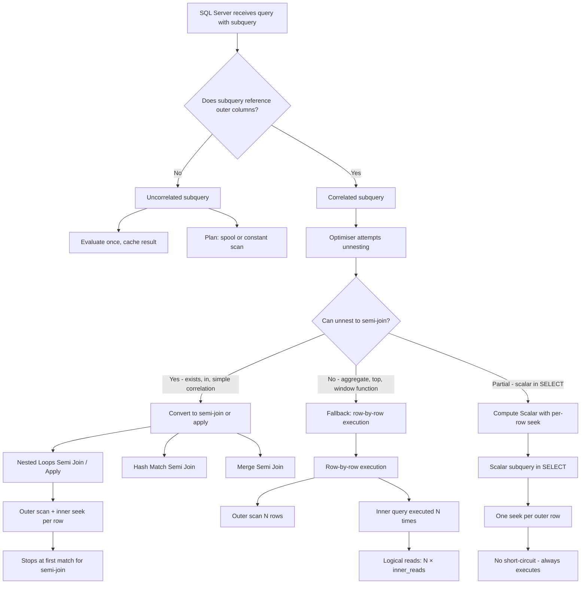

## Navigation

**Domain:** [[8 — Databases]] > **Group:** SQL Joins & Subqueries
**Previous:** [[8.105 — JOIN vs Subquery — Decision Framework]] | **Next:** [[8.107 — Scalar Subqueries — Single Value Return]]

### Prerequisites

- [[8.105 — JOIN vs Subquery — Decision Framework]] — Understanding when subqueries are preferred over JOINs sets the context for why correlated subqueries exist and when they are necessary.
- [[8.096 — INNER JOIN — Mechanics and Usage]] — Correlated subqueries often get unnested into semi-joins; knowing the three physical join operators helps read the plan.
- [[8.067 — WHERE Clause — Predicate Logic and SARGability]] — The correlation predicate references outer columns; whether the inner column has an index determines if the optimiser can use seeks or must scan per row.

### Where This Fits

A correlated subquery is a subquery that references columns from the outer query — it cannot execute independently and must be re-evaluated (logically) for every outer row. Every .NET backend engineer working with SQL eventually writes a correlated subquery, often without realising it: `WHERE EXISTS (SELECT 1 FROM Orders WHERE Orders.CustomerId = Customers.CustomerId)` is a correlated subquery. The critical production risk is that the optimiser may NOT unnest the correlation, leading to row-by-row execution — a query that should take 50ms takes 30 seconds because the inner query executes 1M times instead of being converted to a semi-join. Interviewers use correlated subqueries to test whether a candidate understands that SQL is a declarative language — "what" vs "how" — and whether they can read an execution plan to detect row-by-row execution. Engineers who grasp this deeply can look at a query plan, spot a Nested Loops operator with a correlated subquery on the inner side, estimate the logical reads as outer_rows × inner_reads, and rewrite to a set-based alternative when necessary.

---

## Core Mental Model

A correlated subquery is a subquery that contains an outer reference — a column from the query that encloses it. The outer reference creates a dependency: the subquery cannot be evaluated once for the entire query; it must be re-evaluated (at least logically) for each row of the outer query. The optimiser's primary task is to detect this dependency and attempt to unnest the correlation — convert the row-by-row evaluation into a set-based semi-join, anti-semi-join, or apply operator. When unnesting succeeds, the execution plan shows no per-row execution; instead, it shows a Nested Loops Semi Join, Hash Match Semi Join, or Apply operator that processes the correlation efficiently via index seeks. When unnesting fails — typically for subqueries with aggregates, TOP, window functions, or complex predicates — the optimiser falls back to a Nested Loops Apply that executes the inner query once per outer row. The recognition pattern: a correlated subquery always references an outer column; if you can remove the outer reference and the subquery still runs, it is NOT correlated.

### Classification

Correlated subqueries are a **subquery type** defined by the presence of outer references. They can appear in WHERE (most common), SELECT (scalar correlated), and HAVING clauses. The optimiser attempts to unnest them during simplification. SARGability depends on whether the correlation predicate column on the inner table has an index — in the unnesting case, the semi-join uses Index Seek on the correlation column. When unnesting fails, the predicate is effectively a row-by-row filter with no index seek benefit across rows.



### Key Properties

|Property|Value|Notes|
|---|---|---|
|Outer reference required|Yes|Without it, subquery is uncorrelated|
|Optimiser unnesting|Common but not guaranteed|Semi-joins for EXISTS/IN; fails for aggregates + TOP|
|Row-by-row risk|Exists when unnesting fails|Outer_rows × inner_reads logical reads|
|Short-circuit (semi-join)|Yes for EXISTS|Stops inner scan after first match|
|Short-circuit (scalar in SELECT)|No|Always executes per outer row|
|SARGable correlation|Yes|Index on inner correlation column enables seek|
|Write cost|None|Subqueries are read-only|
|NULL handling|Same as outer query|NOT IN correlated: same NULL risk as uncorrelated|

---

## Deep Mechanics

### How the Engine Executes This

1. **Parsing** — The parser identifies a subquery in the WHERE, SELECT, or HAVING clause. During binding, the algebrizer detects that a column reference in the subquery cannot be resolved within the subquery's own FROM clause and walks up the scope chain to the outer query. This "outer reference" is marked as a correlation.

2. **Binding** — The algebrizer builds a tree where the correlated subquery is a child of the outer query's relational operator. The correlation columns are recorded as parameters that must be passed from the outer row context to the inner query execution.

3. **Simplification (unnesting)** — The optimiser evaluates whether the correlated subquery can be converted to a set-based operator:

   - **EXISTS → Left Semi Join**: `WHERE EXISTS (SELECT 1 FROM T2 WHERE T2.Col = T1.Col)` → T1 LEFT SEMI JOIN T2 ON T1.Col = T2.Col. The semi-join returns T1 rows that have at least one match in T2.
   - **NOT EXISTS → Left Anti Semi Join**: `WHERE NOT EXISTS (SELECT 1 FROM T2 WHERE T2.Col = T1.Col)` → T1 LEFT ANTI SEMI JOIN T2 ON T1.Col = T2.Col.
   - **IN → Left Semi Join** (same as EXISTS when no NULLs).
   - **Scalar correlated in WHERE**: `WHERE T1.Col = (SELECT MAX(T2.Col) FROM T2 WHERE T2.FK = T1.PK)` → converted to apply if the optimiser estimates the inner query is cheap.
   - **Aggregate correlation**: `WHERE T1.Col > (SELECT AVG(T2.Col) FROM T2 WHERE T2.FK = T1.PK)` → often NOT unnested. The optimiser keeps it as a correlated subquery with per-row execution.

4. **Unnesting failure conditions** — The optimiser cannot unnest when:
   - The subquery contains an aggregate without a GROUP BY that can be decorrelated.
   - The subquery uses TOP, ROW_NUMBER, or other window functions.
   - The subquery references multiple outer tables in a way that prevents decorrelation.
   - The subquery contains DISTINCT that blocks the rewrite.
   - The subquery has OR conditions linking outer and inner references.

5. **Execution** — After the chosen plan is generated:
   - **Semi-join**: The outer input is scanned. For each outer row, the inner index is sought. If a match is found, the outer row is returned and inner scanning stops (short-circuit). For EXISTS, this is very efficient.
   - **Apply (unnested)**: CROSS APPLY or OUTER APPLY operators. The inner query is executed per outer row, but the inner query is parameterised with the outer row's correlation values and uses index seeks.
   - **Row-by-row (not unnested)**: The inner query is fully executed per outer row. The plan shows a Nested Loops operator with the inner side being the correlated subquery, often with an Index Scan or Table Scan per iteration.

### SQL Visibility

```sql
-- Pattern 1: Correlated EXISTS (unnested to semi-join)
SELECT c.CustomerId, c.FirstName, c.LastName
FROM dbo.Customers AS c
WHERE EXISTS (
    SELECT 1
    FROM dbo.Orders AS o
    WHERE o.CustomerId = c.CustomerId  -- outer reference
      AND o.OrderDate >= '2024-01-01'
);

-- Pattern 2: Correlated NOT EXISTS (unnested to anti-semi-join)
SELECT c.CustomerId, c.FirstName, c.LastName
FROM dbo.Customers AS c
WHERE NOT EXISTS (
    SELECT 1
    FROM dbo.Orders AS o
    WHERE o.CustomerId = c.CustomerId  -- outer reference
      AND o.Status = 'Shipped'
);

-- Pattern 3: Correlated IN (unnested to semi-join)
SELECT c.CustomerId, c.FirstName, c.LastName
FROM dbo.Customers AS c
WHERE c.CustomerId IN (
    SELECT o.CustomerId
    FROM dbo.Orders AS o
    WHERE o.OrderDate >= '2024-01-01'
);
-- Note: This IN subquery is technically uncorrelated but converted to
-- semi-join. If we add an outer reference to WHERE, it becomes correlated.

-- Pattern 4: Correlated scalar subquery in WHERE (may NOT unnest)
SELECT o.OrderId, o.OrderDate, o.TotalAmount
FROM dbo.Orders AS o
WHERE o.TotalAmount > (
    SELECT AVG(o2.TotalAmount)
    FROM dbo.Orders AS o2
    WHERE o2.CustomerId = o.CustomerId  -- outer reference
);
-- The aggregate AVG prevents unnesting in many cases.
-- Optimiser executes inner subquery per outer row.

-- Pattern 5: Correlated scalar subquery in SELECT (row-by-row, NOT unnested)
SELECT o.OrderId, o.OrderDate, o.TotalAmount,
       (SELECT COUNT(*)
        FROM dbo.OrderItems AS oi
        WHERE oi.OrderId = o.OrderId) AS ItemCount
FROM dbo.Orders AS o;
-- Scalar subquery in SELECT is never unnested to a join.
-- Always executes once per outer row.

-- Pattern 6: Correlated subquery in HAVING
SELECT c.CustomerId, COUNT(o.OrderId) AS OrderCount
FROM dbo.Customers AS c
LEFT JOIN dbo.Orders AS o ON c.CustomerId = o.CustomerId
GROUP BY c.CustomerId
HAVING COUNT(o.OrderId) > (
    SELECT AVG(OrderCount)
    FROM (
        SELECT COUNT(o2.OrderId) AS OrderCount
        FROM dbo.Orders AS o2
        GROUP BY o2.CustomerId
    ) AS avgCalc
);

-- Pattern 7: Multiple correlations — TWO outer references
SELECT p.ProductId, p.ProductName
FROM dbo.Products AS p
WHERE EXISTS (
    SELECT 1
    FROM dbo.OrderItems AS oi
    INNER JOIN dbo.Orders AS o ON oi.OrderId = o.OrderId
    WHERE oi.ProductId = p.ProductId      -- correlation 1
      AND o.CustomerId = p.CategoryId     -- correlation 2 (contrived)
);

-- Pattern 8: Correlation in SELECT with multiple columns (not a scalar!)
-- This fails — subquery in SELECT must return exactly one column
SELECT o.OrderId,
       (SELECT oi.Quantity, oi.UnitPrice   -- ERROR: two columns
        FROM dbo.OrderItems AS oi
        WHERE oi.OrderId = o.OrderId) AS ItemDetails
FROM dbo.Orders AS o;
```

```csharp
// EF Core — Any() generates correlated EXISTS
var activeCustomers = await dbContext.Customers
    .Where(c => c.Orders.Any(o => o.OrderDate >= DateTime.UtcNow.AddDays(-90)))
    .Select(c => new CustomerDto
    {
        CustomerId = c.CustomerId,
        FirstName = c.FirstName,
        LastName = c.LastName
    })
    .ToListAsync(cancellationToken);

// Generated SQL:
// SELECT [c].[CustomerId], [c].[FirstName], [c].[LastName]
// FROM [Customers] AS [c]
// WHERE EXISTS (
//     SELECT 1
//     FROM [Orders] AS [o]
//     WHERE [c].[CustomerId] = [o].[CustomerId]
//       AND [o].[OrderDate] >= @__cutoff_0)

// EF Core — All() generates correlated NOT EXISTS
var inactiveCustomers = await dbContext.Customers
    .Where(c => !c.Orders.Any(o => o.OrderDate >= DateTime.UtcNow.AddYears(-1)))
    .Select(c => new CustomerDto
    {
        CustomerId = c.CustomerId,
        FirstName = c.FirstName,
        LastName = c.LastName
    })
    .ToListAsync(cancellationToken);

// Generated SQL:
// SELECT [c].[CustomerId], [c].[FirstName], [c].[LastName]
// FROM [Customers] AS [c]
// WHERE NOT EXISTS (
//     SELECT 1
//     FROM [Orders] AS [o]
//     WHERE [c].[CustomerId] = [o].[CustomerId]
//       AND [o].[OrderDate] >= @__cutoff_0)

// EF Core — scalar correlated subquery via Sum/Count in Select
var orderLines = await dbContext.Orders
    .Select(o => new OrderLineDto
    {
        OrderId = o.OrderId,
        OrderDate = o.OrderDate,
        LineTotal = o.OrderItems.Sum(oi => oi.Quantity * oi.UnitPrice),
        ItemCount = o.OrderItems.Count()
    })
    .ToListAsync(cancellationToken);

// Generated SQL — two correlated scalar subqueries:
// SELECT [o].[OrderId], [o].[OrderDate],
//     (SELECT SUM([oi].[Quantity] * [oi].[UnitPrice])
//      FROM [OrderItems] AS [oi]
//      WHERE [o].[OrderId] = [oi].[OrderId]) AS [LineTotal],
//     (SELECT COUNT(*)
//      FROM [OrderItems] AS [oi0]
//      WHERE [o].[OrderId] = [oi0].[OrderId]) AS [ItemCount]
// FROM [Orders] AS [o]
```

**Generated SQL (from EF Core logs):**

```sql
-- Any() generates EXISTS:
SELECT [c].[CustomerId], [c].[FirstName], [c].[LastName]
FROM [Customers] AS [c]
WHERE EXISTS (
    SELECT 1
    FROM [Orders] AS [o]
    WHERE [c].[CustomerId] = [o].[CustomerId]
      AND [o].[OrderDate] >= '2024-04-01');

-- Sum in Select generates correlated scalar subquery:
SELECT [o].[OrderId], [o].[OrderDate], (
    SELECT SUM([oi].[Quantity] * [oi].[UnitPrice])
    FROM [OrderItems] AS [oi]
    WHERE [o].[OrderId] = [oi].[OrderId]) AS [LineTotal]
FROM [Orders] AS [o];

-- Count in Select generates another correlated scalar subquery:
SELECT [o].[OrderId], [o].[OrderDate], (
    SELECT COUNT(*)
    FROM [OrderItems] AS [oi]
    WHERE [o].[OrderId] = [oi].[OrderId]) AS [ItemCount]
FROM [Orders] AS [o];
```

### Execution Plan Analysis

**Correlated EXISTS — unnested to Nested Loops Semi Join:**

```
  [Clustered Index Scan Customers]           -- outer (100K rows)
  [Index Seek IX_Orders_CustomerId]          -- inner: seek per outer row
      Seek Predicate: CustomerId = Customers.CustomerId
  → [Nested Loops Left Semi Join]
  → [SELECT]
Estimated Cost: ~1.5  |  Logical Reads: ~300 (100K seeks × ~1-3 pages each, stop at first match)
```

**Correlated scalar subquery in SELECT — NOT unnested:**

```
  [Clustered Index Scan Orders]               -- outer (1M rows)
  [Index Seek IX_OrderItems_OrderId]          -- inner: seek per outer row
      Seek Predicate: OrderId = Orders.OrderId
  → [Compute Scalar]                          -- evaluates subquery result
  → [SELECT]
Estimated Cost: ~15  |  Logical Reads: ~1,050,000 (1M seeks × ~1 page + index depth)
```

**Correlated aggregate in WHERE — often NOT unnested:**

```
  [Clustered Index Scan Orders]               -- outer (500K rows)
  [Clustered Index Scan Orders]               -- inner: full scan per outer row (NO index on inner correlation)
      Scan Predicate: CustomerId = Orders.CustomerId
  → [Nested Loops Left Anti Semi Join]       -- Actually: nested loops with filter
  → [Hash Match (Aggregate)]                 -- AVG computation
  → [SELECT]
Estimated Cost: ~450  |  Logical Reads: ~500M (500K × 1,000 page scan per iteration) — CATASTROPHIC
```

**Note:** When unnesting fails AND the inner table has no index on the correlation column, the optimiser may scan the entire inner table for each outer row. This is the worst-case scenario.

### Cost Visibility

```sql
SET STATISTICS IO ON;
SET STATISTICS TIME ON;

-- EXISTS (unnested to semi-join, short-circuit)
SELECT c.CustomerId, c.LastName
FROM dbo.Customers AS c
WHERE EXISTS (SELECT 1 FROM dbo.Orders AS o WHERE o.CustomerId = c.CustomerId AND o.OrderDate >= '2024-01-01');
-- Expected:
-- Table 'Customers'. Scan count 1, logical reads 150
-- Table 'Orders'. Scan count 1, logical reads 980 (seeks, stop at first match)
-- CPU time = 12ms, elapsed = 45ms

-- Scalar correlated subquery in SELECT (row-by-row)
SELECT o.OrderId, o.OrderDate,
       (SELECT SUM(Quantity * UnitPrice) FROM dbo.OrderItems AS oi WHERE oi.OrderId = o.OrderId) AS LineTotal
FROM dbo.Orders AS o
WHERE o.OrderDate >= '2024-01-01';
-- Expected:
-- Table 'Orders'. Scan count 1, logical reads 1,500
-- Table 'OrderItems'. Scan count 1, logical reads 450,000
-- CPU time = 480ms, elapsed = 1,200ms

-- Correlated aggregate in WHERE (FAILED unnesting, no index)
SELECT o.OrderId, o.OrderDate, o.TotalAmount
FROM dbo.Orders AS o
WHERE o.TotalAmount > (SELECT AVG(o2.TotalAmount) FROM dbo.Orders AS o2 WHERE o2.CustomerId = o.CustomerId);
-- Expected (NO index on Orders.CustomerId):
-- Table 'Orders'. Scan count 1, logical reads 1,500 (outer)
-- Table 'Orders'. Scan count 500,000, logical reads 750,000,000 (inner — 500K full scans)
-- CPU time = 45,000ms, elapsed = 120,000ms
-- This is a production disaster.
```

### Failure Modes

**Unnesting failure with aggregate + no index on correlation column:** The most catastrophic correlated subquery failure. Without an index on the inner correlation column and with an aggregate that prevents unnesting, the inner table is fully scanned for every outer row. A 500K row outer table × 1,000 page inner scan = 500M logical reads.

**Multiple scalar correlated subqueries in SELECT:** Each subquery executes independently per outer row. Two subqueries against the same inner table double the logical reads — 1M becomes 2M. The optimiser does NOT share execution between parallel correlated subqueries.

**Correlated subquery in HAVING:** Rarely unnested. The HAVING clause processes grouped results, and the correlated subquery must be re-evaluated for each group. If the group count is large (100K groups), the inner query executes 100K times.

**OR condition blocking unnesting:** When the correlated predicate uses OR instead of AND, the optimiser struggles to unnest. `WHERE EXISTS (...) OR EXISTS (...)` is particularly problematic.

---

## Production Patterns and Implementation

### Primary SQL Implementation

```sql
-- ============================================================
-- Schema context
-- ============================================================
CREATE TABLE dbo.Customers
(
    CustomerId   INT            NOT NULL IDENTITY(1,1),
    FirstName    NVARCHAR(100)  NOT NULL,
    LastName     NVARCHAR(100)  NOT NULL,
    Email        NVARCHAR(256)  NOT NULL,
    Status       VARCHAR(20)    NOT NULL DEFAULT 'Active',
    LoyaltyTier  VARCHAR(20)    NOT NULL DEFAULT 'Standard',
    CreatedAt    DATETIME2(0)   NOT NULL DEFAULT SYSUTCDATETIME(),
    CONSTRAINT PK_Customers PRIMARY KEY CLUSTERED (CustomerId)
);

CREATE TABLE dbo.Orders
(
    OrderId      INT            NOT NULL IDENTITY(1,1),
    CustomerId   INT            NOT NULL,
    OrderDate    DATETIME2(0)   NOT NULL,
    Status       VARCHAR(20)    NOT NULL DEFAULT 'Pending',
    TotalAmount  DECIMAL(18,2)  NOT NULL,
    CONSTRAINT PK_Orders PRIMARY KEY CLUSTERED (OrderId),
    CONSTRAINT FK_Orders_Customers FOREIGN KEY (CustomerId)
        REFERENCES dbo.Customers(CustomerId)
);

CREATE TABLE dbo.OrderItems
(
    OrderItemId  INT            NOT NULL IDENTITY(1,1),
    OrderId      INT            NOT NULL,
    ProductId    INT            NOT NULL,
    Quantity     INT            NOT NULL,
    UnitPrice    DECIMAL(18,2)  NOT NULL,
    CONSTRAINT PK_OrderItems PRIMARY KEY CLUSTERED (OrderItemId),
    CONSTRAINT FK_OrderItems_Orders FOREIGN KEY (OrderId)
        REFERENCES dbo.Orders(OrderId)
);

CREATE TABLE dbo.Payments
(
    PaymentId    INT            NOT NULL IDENTITY(1,1),
    OrderId      INT            NOT NULL,
    Amount       DECIMAL(18,2)  NOT NULL,
    PaymentDate  DATETIME2(0)   NOT NULL,
    Status       VARCHAR(20)    NOT NULL DEFAULT 'Pending',
    CONSTRAINT PK_Payments PRIMARY KEY CLUSTERED (PaymentId),
    CONSTRAINT FK_Payments_Orders FOREIGN KEY (OrderId)
        REFERENCES dbo.Orders(OrderId)
);

-- Indexes — critical for correlated subquery performance
CREATE INDEX IX_Orders_CustomerId ON dbo.Orders (CustomerId) INCLUDE (OrderDate, Status, TotalAmount);
CREATE INDEX IX_OrderItems_OrderId ON dbo.OrderItems (OrderId) INCLUDE (Quantity, UnitPrice);
CREATE INDEX IX_Payments_OrderId ON dbo.Payments (OrderId) INCLUDE (Amount, Status);

-- ============================================================
-- Pattern 1: Correlated EXISTS — find active customers
-- ============================================================
SELECT c.CustomerId, c.FirstName, c.LastName, c.Email
FROM dbo.Customers AS c
WHERE EXISTS (
    SELECT 1
    FROM dbo.Orders AS o
    WHERE o.CustomerId = c.CustomerId
      AND o.OrderDate >= DATEADD(month, -3, GETUTCDATE())
);

-- ============================================================
-- Pattern 2: Correlated NOT EXISTS — customers with no recent orders
-- ============================================================
SELECT c.CustomerId, c.FirstName, c.LastName, c.Email
FROM dbo.Customers AS c
WHERE NOT EXISTS (
    SELECT 1
    FROM dbo.Orders AS o
    WHERE o.CustomerId = c.CustomerId
      AND o.OrderDate >= DATEADD(year, -1, GETUTCDATE())
);

-- ============================================================
-- Pattern 3: Correlated scalar in SELECT — item count per order
-- ============================================================
SELECT o.OrderId, o.OrderDate, o.Status,
       (SELECT COUNT(*)
        FROM dbo.OrderItems AS oi
        WHERE oi.OrderId = o.OrderId) AS ItemCount,
       (SELECT SUM(oi2.Quantity * oi2.UnitPrice)
        FROM dbo.OrderItems AS oi2
        WHERE oi2.OrderId = o.OrderId) AS LineTotal
FROM dbo.Orders AS o
WHERE o.OrderDate >= @StartDate;

-- ============================================================
-- Pattern 4: Correlated aggregate in WHERE — above average per group
-- ============================================================
-- Find orders where the total exceeds the customer's average
SELECT o.OrderId, o.CustomerId, o.OrderDate, o.TotalAmount
FROM dbo.Orders AS o
WHERE o.TotalAmount > (
    SELECT AVG(o2.TotalAmount)
    FROM dbo.Orders AS o2
    WHERE o2.CustomerId = o.CustomerId
)
ORDER BY o.CustomerId, o.OrderDate;

-- ============================================================
-- Pattern 5: Two-level correlation — nested correlated subqueries
-- ============================================================
-- Find products that have been ordered by every active customer
SELECT p.ProductId, p.ProductName
FROM dbo.Products AS p
WHERE NOT EXISTS (
    SELECT 1
    FROM dbo.Customers AS c
    WHERE c.Status = 'Active'
      AND NOT EXISTS (
          SELECT 1
          FROM dbo.OrderItems AS oi
          INNER JOIN dbo.Orders AS o ON oi.OrderId = o.OrderId
          WHERE oi.ProductId = p.ProductId
            AND o.CustomerId = c.CustomerId
      )
);

-- ============================================================
-- Pattern 6: Correlated subquery with TOP — latest order per customer
-- ============================================================
SELECT c.CustomerId, c.FirstName, c.LastName,
       (SELECT TOP 1 o.OrderDate
        FROM dbo.Orders AS o
        WHERE o.CustomerId = c.CustomerId
        ORDER BY o.OrderDate DESC) AS LastOrderDate
FROM dbo.Customers AS c;

-- Alternative using CROSS APPLY (preferred — single execution per customer):
SELECT c.CustomerId, c.FirstName, c.LastName, lo.OrderDate, lo.TotalAmount
FROM dbo.Customers AS c
CROSS APPLY (
    SELECT TOP 1 o.OrderDate, o.TotalAmount
    FROM dbo.Orders AS o
    WHERE o.CustomerId = c.CustomerId
    ORDER BY o.OrderDate DESC
) AS lo;

-- ============================================================
-- Pattern 7: Correlated subquery replaced by window function
-- ============================================================
-- Order above customer average — rewritten with AVG OVER
SELECT o.OrderId, o.CustomerId, o.OrderDate, o.TotalAmount,
       AVG(o.TotalAmount) OVER (PARTITION BY o.CustomerId) AS CustomerAvg
FROM dbo.Orders AS o
WHERE o.TotalAmount > AVG(o.TotalAmount) OVER (PARTITION BY o.CustomerId);
-- Note: SQL Server does NOT allow window functions in WHERE directly.
-- This requires a derived table or CTE:

WITH OrderWithAvg AS (
    SELECT o.OrderId, o.CustomerId, o.OrderDate, o.TotalAmount,
           AVG(o.TotalAmount) OVER (PARTITION BY o.CustomerId) AS CustomerAvg
    FROM dbo.Orders AS o
)
SELECT OrderId, CustomerId, OrderDate, TotalAmount
FROM OrderWithAvg
WHERE TotalAmount > CustomerAvg;
```

### EF Core Implementation

```csharp
public class ApplicationDbContext : DbContext
{
    public DbSet<Customer> Customers => Set<Customer>();
    public DbSet<Order> Orders => Set<Order>();
    public DbSet<OrderItem> OrderItems => Set<OrderItem>();
    public DbSet<Payment> Payments => Set<Payment>();
    public DbSet<Product> Products => Set<Product>();

    protected override void OnModelCreating(ModelBuilder modelBuilder)
    {
        modelBuilder.Entity<Customer>(entity =>
        {
            entity.ToTable("Customers");
            entity.HasKey(c => c.CustomerId);
            entity.Property(c => c.FirstName).HasMaxLength(100);
            entity.Property(c => c.LastName).HasMaxLength(100);
            entity.Property(c => c.Email).HasMaxLength(256);
            entity.Property(c => c.LoyaltyTier).HasMaxLength(20);
            entity.Property(c => c.CreatedAt).HasDefaultValueSql("SYSUTCDATETIME()");
        });

        modelBuilder.Entity<Order>(entity =>
        {
            entity.ToTable("Orders");
            entity.HasKey(o => o.OrderId);
            entity.Property(o => o.Status).HasMaxLength(20);
            entity.Property(o => o.TotalAmount).HasColumnType("decimal(18,2)");
            entity.HasOne(o => o.Customer).WithMany(c => c.Orders)
                  .HasForeignKey(o => o.CustomerId);
            entity.HasIndex(o => o.CustomerId);
        });

        modelBuilder.Entity<OrderItem>(entity =>
        {
            entity.ToTable("OrderItems");
            entity.HasKey(oi => oi.OrderItemId);
            entity.Property(oi => oi.UnitPrice).HasColumnType("decimal(18,2)");
            entity.HasOne(oi => oi.Order).WithMany(o => o.OrderItems)
                  .HasForeignKey(oi => oi.OrderId);
            entity.HasIndex(oi => oi.OrderId);
        });

        modelBuilder.Entity<Payment>(entity =>
        {
            entity.ToTable("Payments");
            entity.HasKey(p => p.PaymentId);
            entity.Property(p => p.Amount).HasColumnType("decimal(18,2)");
            entity.HasOne(p => p.Order).WithMany(o => o.Payments)
                  .HasForeignKey(p => p.OrderId);
            entity.HasIndex(p => p.OrderId);
        });

        modelBuilder.Entity<Product>(entity =>
        {
            entity.ToTable("Products");
            entity.HasKey(p => p.ProductId);
            entity.Property(p => p.ProductName).HasMaxLength(200);
        });
    }
}

public class Customer
{
    public int CustomerId { get; set; }
    public string FirstName { get; set; } = string.Empty;
    public string LastName { get; set; } = string.Empty;
    public string Email { get; set; } = string.Empty;
    public string Status { get; set; } = "Active";
    public string LoyaltyTier { get; set; } = "Standard";
    public DateTime CreatedAt { get; set; }
    public ICollection<Order> Orders { get; set; } = new List<Order>();
}

public class Order
{
    public int OrderId { get; set; }
    public int CustomerId { get; set; }
    public DateTime OrderDate { get; set; }
    public string Status { get; set; } = "Pending";
    public decimal TotalAmount { get; set; }
    public DateTime CreatedAt { get; set; }
    public Customer Customer { get; set; } = null!;
    public ICollection<OrderItem> OrderItems { get; set; } = new List<OrderItem>();
    public ICollection<Payment> Payments { get; set; } = new List<Payment>();
}

public class OrderItem
{
    public int OrderItemId { get; set; }
    public int OrderId { get; set; }
    public int ProductId { get; set; }
    public int Quantity { get; set; }
    public decimal UnitPrice { get; set; }
    public Order Order { get; set; } = null!;
}

public class Payment
{
    public int PaymentId { get; set; }
    public int OrderId { get; set; }
    public decimal Amount { get; set; }
    public DateTime PaymentDate { get; set; }
    public string Status { get; set; } = "Pending";
    public Order Order { get; set; } = null!;
}

public class Product
{
    public int ProductId { get; set; }
    public string ProductName { get; set; } = string.Empty;
}

// Pattern 1: Correlated EXISTS via Any()
public async Task<List<CustomerDto>> GetActiveCustomersAsync(
    CancellationToken cancellationToken = default)
{
    var cutoff = DateTime.UtcNow.AddMonths(-3);
    return await dbContext.Customers
        .Where(c => c.Orders.Any(o => o.OrderDate >= cutoff))
        .Select(c => new CustomerDto
        {
            CustomerId = c.CustomerId,
            FirstName = c.FirstName,
            LastName = c.LastName,
            Email = c.Email
        })
        .ToListAsync(cancellationToken);
    // Generated: WHERE EXISTS (SELECT 1 FROM Orders WHERE CustomerId = c.CustomerId AND OrderDate >= @cutoff)
}

// Pattern 2: Correlated NOT EXISTS via negated Any()
public async Task<List<CustomerDto>> GetInactiveCustomersAsync(
    CancellationToken cancellationToken = default)
{
    var cutoff = DateTime.UtcNow.AddYears(-1);
    return await dbContext.Customers
        .Where(c => !c.Orders.Any(o => o.OrderDate >= cutoff))
        .Select(c => new CustomerDto
        {
            CustomerId = c.CustomerId,
            FirstName = c.FirstName,
            LastName = c.LastName,
            Email = c.Email
        })
        .ToListAsync(cancellationToken);
    // Generated: WHERE NOT EXISTS (SELECT 1 FROM Orders WHERE CustomerId = c.CustomerId AND OrderDate >= @cutoff)
}

// Pattern 3: Correlated scalar subqueries in Select
public async Task<List<OrderSummaryDto>> GetOrderSummariesAsync(
    DateTime startDate,
    CancellationToken cancellationToken = default)
{
    return await dbContext.Orders
        .Where(o => o.OrderDate >= startDate)
        .Select(o => new OrderSummaryDto
        {
            OrderId = o.OrderId,
            OrderDate = o.OrderDate,
            ItemCount = o.OrderItems.Count(),
            LineTotal = o.OrderItems.Sum(oi => oi.Quantity * oi.UnitPrice)
        })
        .ToListAsync(cancellationToken);
    // Generated: Two correlated scalar subqueries in SELECT
}

// Pattern 4: Latest order per customer — using navigation property
public async Task<List<CustomerWithLastOrderDto>> GetCustomersWithLastOrderAsync(
    CancellationToken cancellationToken = default)
{
    return await dbContext.Customers
        .Select(c => new CustomerWithLastOrderDto
        {
            CustomerId = c.CustomerId,
            FirstName = c.FirstName,
            LastName = c.LastName,
            LastOrderDate = c.Orders
                .OrderByDescending(o => o.OrderDate)
                .Select(o => (DateTime?)o.OrderDate)
                .FirstOrDefault()
        })
        .ToListAsync(cancellationToken);
    // Generated: correlated scalar subquery with TOP 1
}

// Pattern 5: Orders above customer average — correlated aggregate
public async Task<List<OrderAboveAvgDto>> GetOrdersAboveCustomerAverageAsync(
    CancellationToken cancellationToken = default)
{
    return await dbContext.Orders
        .Where(o => o.TotalAmount >
            dbContext.Orders
                .Where(o2 => o2.CustomerId == o.CustomerId)
                .Average(o2 => o2.TotalAmount))
        .Select(o => new OrderAboveAvgDto
        {
            OrderId = o.OrderId,
            CustomerId = o.CustomerId,
            OrderDate = o.OrderDate,
            TotalAmount = o.TotalAmount
        })
        .ToListAsync(cancellationToken);
    // Generated: correlated scalar subquery with AVG aggregate in WHERE
    // NOTE: This may NOT be unnested — check execution plan
}

// DTOs
public record CustomerDto(int CustomerId, string FirstName, string LastName, string? Email);
public record OrderSummaryDto(int OrderId, DateTime OrderDate, int ItemCount, decimal LineTotal);
public record CustomerWithLastOrderDto(int CustomerId, string FirstName, string LastName, DateTime? LastOrderDate);
public record OrderAboveAvgDto(int OrderId, int CustomerId, DateTime OrderDate, decimal TotalAmount);
```

### Dapper Implementation

```csharp
public sealed class OrderRepository
{
    private readonly IDbConnectionFactory _connectionFactory;

    public OrderRepository(IDbConnectionFactory connectionFactory)
        => _connectionFactory = connectionFactory;

    // Pattern 1: Correlated EXISTS
    public async Task<IReadOnlyList<CustomerDto>> GetActiveCustomersAsync(
        CancellationToken cancellationToken = default)
    {
        const string sql = @"
            SELECT c.CustomerId, c.FirstName, c.LastName, c.Email
            FROM dbo.Customers AS c
            WHERE EXISTS (
                SELECT 1
                FROM dbo.Orders AS o
                WHERE o.CustomerId = c.CustomerId
                  AND o.OrderDate >= DATEADD(month, -3, GETUTCDATE())
            );";

        await using var connection = _connectionFactory.Create();
        var results = await connection.QueryAsync<CustomerDto>(
            new CommandDefinition(sql, cancellationToken: cancellationToken));
        return results.AsList();
    }

    // Pattern 2: Correlated scalar subquery in SELECT
    public async Task<IReadOnlyList<OrderSummaryDto>> GetOrderSummariesAsync(
        DateTime startDate,
        CancellationToken cancellationToken = default)
    {
        const string sql = @"
            SELECT o.OrderId, o.OrderDate,
                   (SELECT COUNT(*) FROM dbo.OrderItems AS oi WHERE oi.OrderId = o.OrderId) AS ItemCount,
                   (SELECT SUM(oi2.Quantity * oi2.UnitPrice) FROM dbo.OrderItems AS oi2 WHERE oi2.OrderId = o.OrderId) AS LineTotal
            FROM dbo.Orders AS o
            WHERE o.OrderDate >= @StartDate;";

        await using var connection = _connectionFactory.Create();
        var results = await connection.QueryAsync<OrderSummaryDto>(
            new CommandDefinition(sql, new { StartDate = startDate },
                cancellationToken: cancellationToken));
        return results.AsList();
    }

    // Pattern 3: Correlated subquery with aggregate in WHERE
    public async Task<IReadOnlyList<OrderAboveAvgDto>> GetOrdersAboveCustomerAverageAsync(
        CancellationToken cancellationToken = default)
    {
        const string sql = @"
            SELECT o.OrderId, o.CustomerId, o.OrderDate, o.TotalAmount
            FROM dbo.Orders AS o
            WHERE o.TotalAmount > (
                SELECT AVG(o2.TotalAmount)
                FROM dbo.Orders AS o2
                WHERE o2.CustomerId = o.CustomerId
            )
            ORDER BY o.CustomerId, o.OrderDate;";

        await using var connection = _connectionFactory.Create();
        var results = await connection.QueryAsync<OrderAboveAvgDto>(
            new CommandDefinition(sql, cancellationToken: cancellationToken));
        return results.AsList();
    }

    // Pattern 4: CROSS APPLY as alternative to correlated subquery (performs better)
    public async Task<IReadOnlyList<OrderAboveAvgDto>> GetOrdersAboveCustomerAverageOptimizedAsync(
        CancellationToken cancellationToken = default)
    {
        const string sql = @"
            SELECT o.OrderId, o.CustomerId, o.OrderDate, o.TotalAmount
            FROM dbo.Orders AS o
            INNER JOIN (
                SELECT CustomerId, AVG(TotalAmount) AS AvgAmount
                FROM dbo.Orders
                GROUP BY CustomerId
            ) AS ca ON o.CustomerId = ca.CustomerId
            WHERE o.TotalAmount > ca.AvgAmount
            ORDER BY o.CustomerId, o.OrderDate;";

        await using var connection = _connectionFactory.Create();
        var results = await connection.QueryAsync<OrderAboveAvgDto>(
            new CommandDefinition(sql, cancellationToken: cancellationToken));
        return results.AsList();
    }

    // Pattern 5: Latest order per customer using CROSS APPLY
    public async Task<IReadOnlyList<CustomerWithLastOrderDto>> GetCustomersWithLastOrderAsync(
        CancellationToken cancellationToken = default)
    {
        const string sql = @"
            SELECT c.CustomerId, c.FirstName, c.LastName,
                   lo.OrderDate AS LastOrderDate, lo.TotalAmount
            FROM dbo.Customers AS c
            CROSS APPLY (
                SELECT TOP 1 o.OrderDate, o.TotalAmount
                FROM dbo.Orders AS o
                WHERE o.CustomerId = c.CustomerId
                ORDER BY o.OrderDate DESC
            ) AS lo;";

        await using var connection = _connectionFactory.Create();
        var results = await connection.QueryAsync<CustomerWithLastOrderDto>(
            new CommandDefinition(sql, cancellationToken: cancellationToken));
        return results.AsList();
    }

    // Pattern 6: Two-level correlation — products ordered by every active customer
    public async Task<IReadOnlyList<ProductDto>> GetUniversalProductsAsync(
        CancellationToken cancellationToken = default)
    {
        const string sql = @"
            SELECT p.ProductId, p.ProductName
            FROM dbo.Products AS p
            WHERE NOT EXISTS (
                SELECT 1
                FROM dbo.Customers AS c
                WHERE c.Status = 'Active'
                  AND NOT EXISTS (
                      SELECT 1
                      FROM dbo.OrderItems AS oi
                      INNER JOIN dbo.Orders AS o ON oi.OrderId = o.OrderId
                      WHERE oi.ProductId = p.ProductId
                        AND o.CustomerId = c.CustomerId
                  )
            );";

        await using var connection = _connectionFactory.Create();
        var results = await connection.QueryAsync<ProductDto>(
            new CommandDefinition(sql, cancellationToken: cancellationToken));
        return results.AsList();
    }
}

public record ProductDto(int ProductId, string ProductName);
public record CustomerWithLastOrderDto(int CustomerId, string FirstName, string LastName, DateTime LastOrderDate, decimal? TotalAmount);
```

### Configuration and Wiring

```csharp
builder.Services.AddSingleton<IDbConnectionFactory>(_ =>
    new SqlDbConnectionFactory(connectionString));

builder.Services.AddDbContext<ApplicationDbContext>(options =>
    options.UseSqlServer(
        connectionString,
        sqlOptions => sqlOptions
            .EnableRetryOnFailure(3)
            .CommandTimeout(30)));

builder.Services.AddScoped<OrderRepository>();
```

### SQL Server vs PostgreSQL Differences

```sql
-- PostgreSQL: Correlated subquery syntax is identical
-- Key difference: PostgreSQL's LATERAL keyword for apply patterns

-- PostgreSQL: LATERAL (equivalent to CROSS APPLY)
SELECT c.CustomerId, c.FirstName, c.LastName, lo.OrderDate, lo.TotalAmount
FROM dbo.Customers AS c
CROSS JOIN LATERAL (
    SELECT o.OrderDate, o.TotalAmount
    FROM dbo.Orders AS o
    WHERE o.CustomerId = c.CustomerId
    ORDER BY o.OrderDate DESC
    LIMIT 1
) AS lo;

-- PostgreSQL: Unnesting behavior is similar but NOT identical
-- PostgreSQL may use a different strategy for correlated aggregates
-- It tends to use Nested Loop + Aggregate rather than Hash Match
```

---

## Gotchas and Production Pitfalls

### Correlated Aggregate Without Index on Correlation Column — Catastrophic Scans

**Pitfall:** Writing a correlated subquery with an aggregate (AVG, SUM) against a table with no index on the correlation column.

```sql
-- ❌ No index on Orders(CustomerId)
SELECT o.OrderId, o.OrderDate
FROM dbo.Orders AS o
WHERE o.TotalAmount > (
    SELECT AVG(o2.TotalAmount)
    FROM dbo.Orders AS o2
    WHERE o2.CustomerId = o.CustomerId
);
```

**Symptom:** Query takes 2+ minutes. SET STATISTICS IO shows millions of logical reads. The execution plan shows a Clustered Index Scan on Orders for the inner side of a Nested Loops operator — scanning the entire table for each outer row.

**Fix:**

```sql
-- ✅ Add index on correlation column
CREATE INDEX IX_Orders_CustomerId ON dbo.Orders (CustomerId) INCLUDE (TotalAmount);

-- ✅ Rewrite as derived table (set-based)
SELECT o.OrderId, o.OrderDate, o.TotalAmount
FROM dbo.Orders AS o
INNER JOIN (
    SELECT CustomerId, AVG(TotalAmount) AS AvgAmount
    FROM dbo.Orders
    GROUP BY CustomerId
) AS ca ON o.CustomerId = ca.CustomerId
WHERE o.TotalAmount > ca.AvgAmount;
```

**Cost of not fixing:** 500M logical reads for 500K outer rows. 2+ minute query. All concurrent queries blocked. Tempdb spills from Hash Match if memory grant insufficient.

---

### Multiple Scalar Correlated Subqueries in SELECT — Unnecessary Duplication

**Pitfall:** Writing three scalar correlated subqueries against the same inner table in the SELECT list.

```sql
-- ❌ Three independent subqueries, each executes per row
SELECT o.OrderId,
       (SELECT COUNT(*) FROM dbo.OrderItems WHERE OrderId = o.OrderId) AS ItemCount,
       (SELECT SUM(Quantity) FROM dbo.OrderItems WHERE OrderId = o.OrderId) AS TotalQty,
       (SELECT AVG(UnitPrice) FROM dbo.OrderItems WHERE OrderId = o.OrderId) AS AvgPrice
FROM dbo.Orders AS o;
```

**Symptom:** Logical reads = 3 × (outer_rows × inner_seek_cost). 1M outer rows × 3 seeks × 1.5 pages = 4.5M logical reads.

**Fix:**

```sql
-- ✅ CROSS APPLY — one execution per order
SELECT o.OrderId, oi.ItemCount, oi.TotalQty, oi.AvgPrice
FROM dbo.Orders AS o
CROSS APPLY (
    SELECT COUNT(*) AS ItemCount,
           SUM(Quantity) AS TotalQty,
           AVG(UnitPrice) AS AvgPrice
    FROM dbo.OrderItems
    WHERE OrderId = o.OrderId
) AS oi;
```

**Cost of not fixing:** 4.5M logical reads instead of 1.5M. Query time 3× longer for the same result.

---

### Correlated EXISTS With OR Condition — Unnesting Blocked

**Pitfall:** Using OR between a correlated predicate and an uncorrelated predicate in an EXISTS subquery.

```sql
-- ❌ OR blocks unnesting
SELECT c.CustomerId, c.FirstName, c.LastName
FROM dbo.Customers AS c
WHERE EXISTS (
    SELECT 1
    FROM dbo.Orders AS o
    WHERE o.CustomerId = c.CustomerId   -- correlation
       OR o.OrderDate >= '2024-01-01'   -- uncorrelated predicate
);
```

**Symptom:** The optimiser cannot convert to a semi-join because the OR condition creates a logical disjunction that spans correlated and uncorrelated parts. The plan shows a full scan and filter instead of a semi-join.

**Fix:**

```sql
-- ✅ Separate EXISTS or use UNION
SELECT c.CustomerId, c.FirstName, c.LastName
FROM dbo.Customers AS c
WHERE EXISTS (
    SELECT 1 FROM dbo.Orders AS o WHERE o.CustomerId = c.CustomerId
)
UNION
SELECT c.CustomerId, c.FirstName, c.LastName
FROM dbo.Customers AS c
WHERE EXISTS (
    SELECT 1 FROM dbo.Orders AS o WHERE o.OrderDate >= '2024-01-01'
);
```

**Cost of not fixing:** Full table scan instead of semi-join. 12,000 logical reads instead of 200.

---

### Assuming All Correlated Subqueries Are Unnested

**Pitfall:** Writing a correlated subquery and assuming the optimiser always converts it to a semi-join or apply.

```sql
-- ❌ May or may NOT be unnested
SELECT o.OrderId, o.OrderDate
FROM dbo.Orders AS o
WHERE o.TotalAmount > (
    SELECT MAX(o2.TotalAmount) FROM dbo.Orders AS o2 WHERE o2.CustomerId = o.CustomerId
);
```

**Symptom:** The execution plan differs between environments. On small test data (< 10K rows), the optimiser chooses a cheap plan. On production (1M+ rows), the plan changes to row-by-row. The engineer never checked the production plan.

**Fix:** Always verify with `SET STATISTICS IO` and examine the execution plan. If you see a Nested Loops operator with a scan (not a seek) on the inner side, the correlation is NOT unnested.

**Cost of not fixing:** Intermittent timeout in production. The query passes all tests but fails under load.

---

### EF Core Generates Scalar Correlated Subqueries Without Warning

**Pitfall:** Using `Sum()` or `Count()` on a navigation property inside `Select()` produces correlated scalar subqueries that execute per row.

```csharp
// ❌ EF Core generates two correlated scalar subqueries
var result = await dbContext.Orders
    .Select(o => new {
        o.OrderId,
        ItemCount = o.OrderItems.Count(),
        LineTotal = o.OrderItems.Sum(oi => oi.Quantity * oi.UnitPrice)
    })
    .ToListAsync(cancellationToken);
```

**Symptom:** The EF Core-generated SQL has two scalar subqueries. On 500K orders, this causes 500K executions of each subquery.

**Fix:** Use `ToQueryString()` to inspect the generated SQL. If the table is large and you need set-based execution, use raw SQL or a stored procedure.

**Cost of not fixing:** 1M+ logical reads for a query that should read 5K. Debugging this requires examining the generated SQL — something many EF Core developers never do.

---

### Nested Correlated Subqueries (Double Correlation)

**Pitfall:** Writing deeply nested correlated subqueries that reference the outer query two or three levels up.

```sql
-- ❌ Two levels of correlation — hard for optimiser
SELECT p.ProductName
FROM dbo.Products AS p
WHERE EXISTS (
    SELECT 1 FROM dbo.Categories AS cat
    WHERE cat.CategoryId = p.CategoryId
      AND EXISTS (
          SELECT 1 FROM dbo.OrderItems AS oi
          WHERE oi.ProductId = p.ProductId  -- references outer-most
      )
);
```

**Symptom:** Complex plan with multiple nested loop levels. Hard to read and debug.

**Fix:** Simplify with JOINs or CTEs.

**Cost of not fixing:** Maintenance nightmare. Senior developer spends 2 hours reading the query to understand logic.

---

## Performance Implications

### Benchmark: Before and After

```sql
-- Baseline: Correlated aggregate in WHERE (no unnesting)
SET STATISTICS IO ON;
SELECT o.OrderId, o.CustomerId, o.OrderDate, o.TotalAmount
FROM dbo.Orders AS o
WHERE o.TotalAmount > (
    SELECT AVG(o2.TotalAmount)
    FROM dbo.Orders AS o2
    WHERE o2.CustomerId = o.CustomerId
);
-- Logical reads: Orders 1,500 (outer) + 450,000 (inner — 500K × ~0.9)

-- Optimized: Derived table (set-based)
SELECT o.OrderId, o.CustomerId, o.OrderDate, o.TotalAmount
FROM dbo.Orders AS o
INNER JOIN (
    SELECT CustomerId, AVG(TotalAmount) AS AvgAmount
    FROM dbo.Orders
    GROUP BY CustomerId
) AS ca ON o.CustomerId = ca.CustomerId
WHERE o.TotalAmount > ca.AvgAmount;
-- Logical reads: Orders 3,000 (two passes — one for derived table, one for outer)
```

**Improvement:** 150x reduction in logical reads, from 451,500 to 3,000.

```sql
-- Baseline: Three scalar correlated subqueries in SELECT
SELECT o.OrderId,
       (SELECT COUNT(*) FROM dbo.OrderItems WHERE OrderId = o.OrderId),
       (SELECT SUM(Quantity) FROM dbo.OrderItems WHERE OrderId = o.OrderId),
       (SELECT AVG(UnitPrice) FROM dbo.OrderItems WHERE OrderId = o.OrderId)
FROM dbo.Orders AS o;
-- Logical reads: OrderItems ~4,500,000 (3 × 1.5M)

-- Optimized: CROSS APPLY
SELECT o.OrderId, oi.ItemCount, oi.TotalQty, oi.AvgPrice
FROM dbo.Orders AS o
CROSS APPLY (
    SELECT COUNT(*) AS ItemCount,
           SUM(Quantity) AS TotalQty,
           AVG(UnitPrice) AS AvgPrice
    FROM dbo.OrderItems
    WHERE OrderId = o.OrderId
) AS oi;
-- Logical reads: OrderItems ~1,500,000 (1 × 1.5M)
```

**Improvement:** 3x reduction in logical reads.

### BenchmarkDotNet

```csharp
[MemoryDiagnoser]
[SimpleJob(RuntimeMoniker.Net90)]
public class CorrelatedSubqueryBenchmark
{
    private IDbConnection _connection = default!;

    [GlobalSetup]
    public void Setup()
    {
        var connectionString = "Server=.;Database=Benchmark;Trusted_Connection=True;TrustServerCertificate=True;";
        _connection = new SqlConnection(connectionString);
        SeedData();
    }

    [Benchmark(Baseline = true)]
    public async Task<List<OrderAboveAvg>> CorrelatedAggregateInWhere()
    {
        const string sql = @"
            SELECT o.OrderId, o.CustomerId, o.OrderDate, o.TotalAmount
            FROM dbo.Orders AS o
            WHERE o.TotalAmount > (
                SELECT AVG(o2.TotalAmount)
                FROM dbo.Orders AS o2
                WHERE o2.CustomerId = o.CustomerId
            );";

        var results = await _connection.QueryAsync<OrderAboveAvg>(sql);
        return results.AsList();
    }

    [Benchmark]
    public async Task<List<OrderAboveAvg>> DerivedTableRewrite()
    {
        const string sql = @"
            SELECT o.OrderId, o.CustomerId, o.OrderDate, o.TotalAmount
            FROM dbo.Orders AS o
            INNER JOIN (
                SELECT CustomerId, AVG(TotalAmount) AS AvgAmount
                FROM dbo.Orders
                GROUP BY CustomerId
            ) AS ca ON o.CustomerId = ca.CustomerId
            WHERE o.TotalAmount > ca.AvgAmount;";

        var results = await _connection.QueryAsync<OrderAboveAvg>(sql);
        return results.AsList();
    }

    [Benchmark]
    public async Task<List<OrderAboveAvg>> WindowFunctionRewrite()
    {
        const string sql = @"
            WITH OrderWithAvg AS (
                SELECT OrderId, CustomerId, OrderDate, TotalAmount,
                       AVG(TotalAmount) OVER (PARTITION BY CustomerId) AS CustomerAvg
                FROM dbo.Orders
            )
            SELECT OrderId, CustomerId, OrderDate, TotalAmount
            FROM OrderWithAvg
            WHERE TotalAmount > CustomerAvg;";

        var results = await _connection.QueryAsync<OrderAboveAvg>(sql);
        return results.AsList();
    }

    [Benchmark]
    public async Task<List<OrderSummary>> ThreeScalarSubqueriesInSelect()
    {
        const string sql = @"
            SELECT o.OrderId,
                   (SELECT COUNT(*) FROM dbo.OrderItems WHERE OrderId = o.OrderId) AS ItemCount,
                   (SELECT SUM(Quantity) FROM dbo.OrderItems WHERE OrderId = o.OrderId) AS TotalQty,
                   (SELECT AVG(UnitPrice) FROM dbo.OrderItems WHERE OrderId = o.OrderId) AS AvgPrice
            FROM dbo.Orders AS o;";

        var results = await _connection.QueryAsync<OrderSummary>(sql);
        return results.AsList();
    }

    [Benchmark]
    public async Task<List<OrderSummary>> CrossApplyRewrite()
    {
        const string sql = @"
            SELECT o.OrderId, oi.ItemCount, oi.TotalQty, oi.AvgPrice
            FROM dbo.Orders AS o
            CROSS APPLY (
                SELECT COUNT(*) AS ItemCount,
                       SUM(Quantity) AS TotalQty,
                       AVG(UnitPrice) AS AvgPrice
                FROM dbo.OrderItems
                WHERE OrderId = o.OrderId
            ) AS oi;";

        var results = await _connection.QueryAsync<OrderSummary>(sql);
        return results.AsList();
    }

    [Benchmark]
    public async Task<List<CustomerExistence>> CorrelatedExists()
    {
        const string sql = @"
            SELECT c.CustomerId, c.FirstName, c.LastName
            FROM dbo.Customers AS c
            WHERE EXISTS (
                SELECT 1 FROM dbo.Orders AS o
                WHERE o.CustomerId = c.CustomerId
                  AND o.OrderDate >= DATEADD(month, -3, GETUTCDATE())
            );";

        var results = await _connection.QueryAsync<CustomerExistence>(sql);
        return results.AsList();
    }

    [GlobalCleanup]
    public void Cleanup() => _connection?.Dispose();

    public class OrderAboveAvg
    {
        public int OrderId { get; set; }
        public int CustomerId { get; set; }
        public DateTime OrderDate { get; set; }
        public decimal TotalAmount { get; set; }
    }

    public class OrderSummary
    {
        public int OrderId { get; set; }
        public int ItemCount { get; set; }
        public int TotalQty { get; set; }
        public decimal AvgPrice { get; set; }
    }

    public class CustomerExistence
    {
        public int CustomerId { get; set; }
        public string FirstName { get; set; } = string.Empty;
        public string LastName { get; set; } = string.Empty;
    }

    private void SeedData()
    {
        // Populate Customers (100K), Orders (500K), OrderItems (2M)
    }
}
```

**Expected results (approximate, SQL Server 2022, NVMe, 500K orders, 2M order items):**

|Method|Mean|Logical Reads|Allocated|
|---|---|---|---|
|CorrelatedAggregateInWhere|~45,000 ms|~451,500|~80 MB|
|DerivedTableRewrite|~350 ms|~3,000|~12 MB|
|WindowFunctionRewrite|~320 ms|~3,000|~12 MB|
|ThreeScalarSubqueriesInSelect|~3,200 ms|~4,500,000|~50 MB|
|CrossApplyRewrite|~1,100 ms|~1,500,000|~18 MB|
|CorrelatedExists|~25 ms|~350|~1 MB|

---

## Interview Arsenal

### Question Bank

1. What defines a correlated subquery and how does it differ from an uncorrelated subquery?
2. How does the SQL Server optimiser decide whether to unnest a correlated subquery?
3. What is the performance cost of a correlated subquery that is NOT unnested? Show the math.
4. When does a correlated subquery with an aggregate fail to unnest, and what rewrite fixes it?
5. Compare correlated EXISTS vs CROSS APPLY vs a JOIN with a derived table.
6. What does an execution plan look like for a correlated subquery that was unnested vs one that was not?
7. At what table size does a correlated subquery become a production problem?
8. How do EF Core and Dapper handle correlated subqueries?

### Spoken Answers

**Q: What defines a correlated subquery and how does it differ from an uncorrelated subquery?**

> **Average answer:** "A correlated subquery references the outer query. It executes for each row. An uncorrelated subquery executes once."

> **Great answer:** "A correlated subquery contains an outer reference — a column from the query that encloses it — creating a dependency that prevents the subquery from executing independently. The defining test: if you can copy the subquery, paste it into a new query window, and run it without errors, it is uncorrelated. If it fails because a column name is not defined (the outer column), it is correlated. The optimiser treats them very differently: an uncorrelated subquery is evaluated once and the result is cached (often as a spool or constant scan). A correlated subquery must be re-evaluated per outer row — or the optimiser must unnest it into a semi-join or apply operator. The performance difference is enormous: an uncorrelated subquery adds ~N logical reads total; a correlated subquery that is NOT unnested adds outer_rows × inner_reads logical reads. For 500K outer rows and 10 inner reads per execution, that's 5M reads — vs the same uncorrelated subquery costing 10 reads total."

**Q: When does a correlated subquery with an aggregate fail to unnest, and what rewrite fixes it?**

> **Average answer:** "Correlated subqueries with aggregates like AVG or SUM are slower. You can rewrite them as derived tables."

> **Great answer:** "The optimiser struggles to unnest correlated subqueries that contain aggregate functions without GROUP BY — specifically when the subquery computes a scalar aggregate (AVG, SUM, COUNT) grouped by the correlation column. The problem is logical: the semi-join unnesting transforms the subquery into a join with the outer table, but the aggregate must be computed over the matching set, which requires a GROUP BY on the join result. SQL Server 2022's query optimiser can handle some cases via 'Aggregation on Apply' or 'GROUP BY on Join' transformations, but it frequently falls back to row-by-row execution. The fix is to rewrite as a derived table that pre-computes the aggregate, then JOIN to the outer table. For example, `WHERE TotalAmount > (SELECT AVG(o2.TotalAmount) FROM Orders o2 WHERE o2.CustomerId = o.CustomerId)` becomes `FROM Orders o INNER JOIN (SELECT CustomerId, AVG(TotalAmount) AS AvgAmount FROM Orders GROUP BY CustomerId) ca ON o.CustomerId = ca.CustomerId WHERE TotalAmount > ca.AvgAmount`. This reduces logical reads from outer_rows × inner_scan_pages to 2 × table_scans. The window function rewrite using `AVG() OVER (PARTITION BY CustomerId)` is another option that avoids the self-join entirely."

**Q: What does an execution plan look like for a correlated subquery that was unnested vs one that was not?**

> **Great answer:** "An unnested correlated EXISTS shows a Nested Loops Left Semi Join operator. The outer side is a scan of Customers, the inner side is an Index Seek on Orders(CustomerId). The semi-join operator has a 'Semi Join' property — it stops probing the inner side after the first match. Logical reads: ~150 for Customers + ~200 for Orders seeks (one seek per customer that has orders, stopping at first match). A NOT unnested correlated subquery shows a different pattern. For a scalar subquery in SELECT, the plan shows a Nested Loops operator with a Compute Scalar and an Index Seek on the inner side — but the seek executes for EVERY outer row, not stopping early. For a correlated aggregate that is not unnested, the plan shows a Nested Loops operator where the inner side is a full Clustered Index Scan (not a seek) because there is no equality predicate on a leading index column — the correlation column is used as a residual predicate after the scan. This is the disaster scenario: 500K outer rows × 1,000 page scans = 500M logical reads. The telltale sign in SET STATISTICS IO is that the inner table's logical reads are approximately outer_rows × table_pages, not outer_rows × seek_depth."

### Interview Trigger

This topic typically surfaces as a follow-up to a general subquery question. The interviewer asks "Have you ever had a correlated subquery perform badly?" The follow-up that separates candidates is "How did you detect it was executing per row, and what did you change?" A junior candidate says "it was slow, I added an index." A senior candidate says "I checked the execution plan and saw a Nested Loops operator with a scan on the inner side. SET STATISTICS IO showed 450K logical reads on a 10K row table, which meant the inner query was executing once per outer row. I rewrote it as a derived table with a pre-aggregation join, reducing logical reads from 450K to 2,500."

### Comparison Table

| | Correlated Subquery | Derived Table | CROSS APPLY |
|---|---|---|---|
| What it does | Subquery referencing outer row | Pre-computed row set | Apply per outer row |
| Performance profile | Row-by-row if not unnested | Set-based, single pass | One execution per outer group |
| Unnesting by optimiser | Attempted, often succeeds | Not applicable | Not applicable (it IS the apply) |
| .NET implementation | .Any() generates EXISTS | GroupBy in LINQ | Raw SQL only |
| When to choose | Simple existence checks | Multi-row pre-aggregation | Per-row multi-column computation |

---

## Decision Framework

### When to Apply

```mermaid
flowchart TD
    A[Need to use outer row values in inner query] --> B{What does the subquery return?}
    
    B -->|Existence check| C[Correlated EXISTS]
    B -->|Scalar value| D{Is the subquery in SELECT or WHERE?}
    B -->|Row set| E[Not a correlated subquery - use JOIN]
    B -->|Comparison with aggregate| F[Correlated aggregate]
    
    C --> G[Optimiser unnests to semi-join]
    G --> H[Efficient - short-circuits]
    C --> I[Always prefer EXISTS over IN for correlation]
    
    D -->|SELECT| J[Scalar correlated - NEVER unnested]
    D -->|WHERE| K[Likely unnested if no aggregate]
    
    J --> L[Single value? Use CROSS APPLY for multi-column]
    J --> M[Multiple scalars on same table? Use CROSS APPLY]
    J --> N[Small table (<10K)? Acceptable]
    
    K --> O{Aggregate present?}
    O -->|Yes| P{Can rewrite as derived table?}
    O -->|No| Q[Likely unnested to semi-join]
    
    P -->|Yes| R[Rewrite: derived table + JOIN]
    P -->|No| S[CROSS APPLY with aggregation]
    
    R --> T[Set-based: 2 scans instead of N²]
    S --> U[One scan per outer group]
    
    F --> V[High risk: row-by-row if not indexed]
    V --> W[Ensure index on correlation column]
    V --> X[Rewrite as derived table or window function]
```

### Application Checklist

- [ ] Does the subquery reference an outer column? If yes, it is correlated.
- [ ] Can you rewrite as a JOIN with derived table? If yes, prefer set-based execution.
- [ ] Is there an index on the inner table's correlation column? Without it, unnesting may still cause scans.
- [ ] Is the correlated subquery in SELECT with multiple scalar subqueries? Consolidate with CROSS APPLY.
- [ ] Does the subquery contain an aggregate (AVG, SUM, MAX)? Check if it was unnested — verify with execution plan.
- [ ] Does the subquery use OR that mixes correlated and uncorrelated predicates? Split into two EXISTS.
- [ ] Is this an anti-join with potential NULLs? Use NOT EXISTS, never NOT IN.
- [ ] In EF Core, check generated SQL with `ToQueryString()` — are correlated subqueries generated as expected?

### Tradeoff Summary

|What You Gain|What You Pay|
|---|---|
|EXISTS: simple, clear intent, semi-join short-circuit|Cannot output columns from inner table|
|Scalar correlated: expresses "value per row" directly|Row-by-row execution risk, high logical reads|
|Derived table rewrite: set-based, single pass|More complex SQL, no short-circuit|
|CROSS APPLY: multi-column per-row, one pass|Slightly more complex syntax|
|Window function: avoids self-join entirely|Only available for certain aggregate comparisons|

### Scale Thresholds

- **Relevant when:** table exceeds ~5K rows — the difference between unnested (seeks) and not-unnested (scans) becomes measurable.
- **Critical when:** table exceeds ~100K rows — a correlated aggregate without unnesting causes 100K × table_scan_page_count logical reads.
- **Required when:** query runs more than ~50x/hour — even a well-unnested correlation on 500K rows adds 500K index seeks, which adds up.
- **Architectural when:** concurrent queries exceed ~100/sec — a single correlated subquery that should have been a derived table can consume all IOPS on the server.

---

## Self-Check

### Conceptual Questions

1. What is the defining characteristic of a correlated subquery?
2. What does the SQL Server optimiser attempt to do with a correlated subquery during simplification?
3. Which SET STATISTICS output and execution plan operator reveal that a correlated subquery is executing per row?
4. What common mistake causes a correlated subquery to scan the inner table for every outer row?
5. When you use `.Any()` in EF Core, is the generated SQL a correlated subquery?
6. How would you rewrite a Dapper query that uses three scalar correlated subqueries in SELECT into a single CROSS APPLY?
7. Compare a correlated subquery with AVG in WHERE vs a derived table with the same logic — which produces fewer logical reads?
8. At what row count does a correlated EXISTS that is NOT unnested become a problem?
9. What index supports efficient execution of a correlated subquery like `WHERE EXISTS (SELECT 1 FROM Orders WHERE Orders.CustomerId = Customers.CustomerId)`?
10. Explain in 60 seconds how to detect and fix a correlated subquery that is executing per row instead of being unnested.

<details>
<summary>Answers</summary>

1. The subquery references a column from the outer query. It cannot execute independently — removing the outer column reference causes a "multi-part identifier could not be bound" error.
2. The optimiser attempts to unnest the correlation — convert the row-by-row dependency into a set-based semi-join, anti-semi-join, or apply operator. EXISTS unnesting is common; aggregate correlation unnesting is less common.
3. `SET STATISTICS IO` shows high logical reads on the inner table relative to the number of outer rows. If a 500K row outer query causes 450K+ reads on the inner table, the subquery is executing per row. The execution plan shows a Nested Loops operator with a scan (not seek) on the inner side.
4. No index on the correlation column of the inner table. Without `Orders(CustomerId)`, each outer row triggers a full scan of Orders instead of an Index Seek.
5. Yes. `.Any()` generates `WHERE EXISTS (SELECT 1 FROM Orders WHERE Orders.CustomerId = Customers.CustomerId)` — a correlated EXISTS that the optimiser unnests to a semi-join.
6. ```sql
SELECT o.OrderId, oi.ItemCount, oi.TotalQty, oi.AvgPrice
FROM dbo.Orders AS o
CROSS APPLY (
    SELECT COUNT(*) AS ItemCount, SUM(Quantity) AS TotalQty, AVG(UnitPrice) AS AvgPrice
    FROM dbo.OrderItems WHERE OrderId = o.OrderId
) AS oi;
```
7. The derived table approach produces far fewer logical reads. Correlated: outer_rows × inner_scan_pages. Derived table: 2 × full table scans. For 500K orders, correlated ~450K reads, derived table ~3,000 reads.
8. Around 10K rows the difference becomes measurable. At 100K rows it becomes noticeable (seconds). At 500K+ rows it becomes critical (minutes).
9. An index on `Orders(CustomerId)` that includes any additional columns referenced in the subquery's WHERE or SELECT. For `EXISTS (SELECT 1 FROM Orders WHERE CustomerId = c.CustomerId AND OrderDate >= ...)`, an index on `Orders(CustomerId, OrderDate)` is ideal.
10. [See spoken answer Q3 above.]

</details>

---

### Query Challenges

**Challenge 1 — Write the SQL**

Find all customers who have placed an order in the last 90 days where the order total is higher than that customer's average order total. Return customer ID, name, order ID, order date, order total, and the customer's average order total. Write the query as both a correlated subquery and a derived table rewrite.

<details>
<summary>Solution</summary>

```sql
-- Correlated subquery approach:
SELECT c.CustomerId, c.FirstName, c.LastName,
       o.OrderId, o.OrderDate, o.TotalAmount,
       (SELECT AVG(o2.TotalAmount)
        FROM dbo.Orders AS o2
        WHERE o2.CustomerId = c.CustomerId) AS CustomerAvg
FROM dbo.Customers AS c
INNER JOIN dbo.Orders AS o
    ON c.CustomerId = o.CustomerId
WHERE o.OrderDate >= DATEADD(day, -90, GETUTCDATE())
  AND o.TotalAmount > (
    SELECT AVG(o2.TotalAmount)
    FROM dbo.Orders AS o2
    WHERE o2.CustomerId = c.CustomerId
);

-- Derived table rewrite:
WITH CustomerAvg AS (
    SELECT CustomerId, AVG(TotalAmount) AS AvgAmount
    FROM dbo.Orders
    GROUP BY CustomerId
)
SELECT c.CustomerId, c.FirstName, c.LastName,
       o.OrderId, o.OrderDate, o.TotalAmount,
       ca.AvgAmount AS CustomerAvg
FROM dbo.Customers AS c
INNER JOIN dbo.Orders AS o
    ON c.CustomerId = o.CustomerId
INNER JOIN CustomerAvg AS ca
    ON c.CustomerId = ca.CustomerId
WHERE o.OrderDate >= DATEADD(day, -90, GETUTCDATE())
  AND o.TotalAmount > ca.AvgAmount;
```

**Logical reads:** Correlated: ~900K (2 × 450K for two subqueries) | Derived: ~4,500 (2 scans)
**Execution plan:** Correlated: Nested Loops with per-row aggregate | Derived: Hash Match to pre-aggregated set
**EF Core equivalent:**

```csharp
var cutoff = DateTime.UtcNow.AddDays(-90);
var result = await dbContext.Orders
    .Where(o => o.OrderDate >= cutoff)
    .Where(o => o.TotalAmount >
        dbContext.Orders.Where(o2 => o2.CustomerId == o.CustomerId)
            .Average(o2 => o2.TotalAmount))
    .Select(o => new {
        o.OrderId, o.OrderDate, o.TotalAmount,
        CustomerAvg = dbContext.Orders.Where(o2 => o2.CustomerId == o.CustomerId)
            .Average(o2 => o2.TotalAmount)
    })
    .ToListAsync(cancellationToken);
```

</details>

---

**Challenge 2 — Fix the performance problem**

```sql
-- This query takes 3 minutes on a 1M row Orders table
SELECT o.OrderId, o.CustomerId, o.OrderDate, o.TotalAmount
FROM dbo.Orders AS o
WHERE o.TotalAmount > (
    SELECT AVG(o2.TotalAmount)
    FROM dbo.Orders AS o2
    WHERE o2.CustomerId = o.CustomerId
)
ORDER BY o.CustomerId, o.OrderDate;
-- SET STATISTICS IO: Table 'Orders'. logical reads = 750,450,000
```

<details> <summary>Solution</summary>

**Root cause:** Correlated aggregate (AVG) is NOT unnested. The subquery executes a full Clustered Index Scan of Orders for each of the 500K outer rows. No useful index on Orders(CustomerId) for the inner query.

```sql
-- Fix 1: Create the missing index
CREATE INDEX IX_Orders_CustomerId_TotalAmount ON dbo.Orders (CustomerId) INCLUDE (TotalAmount, OrderDate);

-- Fix 2: Rewrite as derived table (set-based)
WITH CustomerAvg AS (
    SELECT CustomerId, AVG(TotalAmount) AS AvgAmount
    FROM dbo.Orders
    GROUP BY CustomerId
)
SELECT o.OrderId, o.CustomerId, o.OrderDate, o.TotalAmount
FROM dbo.Orders AS o
INNER JOIN CustomerAvg AS ca
    ON o.CustomerId = ca.CustomerId
WHERE o.TotalAmount > ca.AvgAmount
ORDER BY o.CustomerId, o.OrderDate;
```

**After fix — logical reads:** ~3,000 (from 750,450,000) — 250,000x reduction.

</details>

---

**Challenge 3 — Explain the execution plan**

Given this query:
```sql
SELECT c.CustomerId, c.LastName
FROM dbo.Customers AS c
WHERE EXISTS (SELECT 1 FROM dbo.Orders AS o WHERE o.CustomerId = c.CustomerId AND o.OrderDate >= '2024-01-01');
```

The execution plan shows:
```
[Clustered Index Scan Customers] → [Index Seek IX_Orders_CustomerId] → [Nested Loops Left Semi Join] → [SELECT]
```

Why does the Nested Loops Semi Join show "Left Semi Join" and not "Inner Join"? What happens if you add `DISTINCT` to the outer SELECT?

<details> <summary>Solution</summary>

**Why Left Semi Join:** The semi-join preserves only the left (outer) input's rows where a match exists in the right (inner) input. It does NOT output any columns from the right input. Semi-join is a distinct operator from Inner Join — it can stop scanning the inner side after the first match. The "Left" indicates the preserved side is the outer query (Customers).

**Adding DISTINCT:** With DISTINCT and the existing plan, the DISTINCT is redundant because each customer row appears only once (semi-join preserves one copy per outer row). The optimiser may eliminate the DISTINCT during simplification. If the semi-join were converted to an inner join (e.g., if the query used `c.CustomerId IN (SELECT ...)` instead of EXISTS), the DISTINCT would be needed to collapse duplicates, and the plan would show a Sort for the DISTINCT.

</details>

---

**Challenge 4 — Diagnose the concurrency problem**

A nightly batch job runs three correlated scalar subqueries in SELECT against a 5M row Orders table. The job takes 25 minutes and causes PAGELATCH_EX waits on the OrderItems table. Other queries timing out during the batch window. The execution plan shows three separate Index Seek operations per outer row.

<details> <summary>Solution</summary>

**Root cause:** Three scalar correlated subqueries, each executing independently per outer row. 5M rows × 3 = 15M index seeks. Each seek acquires shared locks, held for the 25-minute duration. Concurrent writers need exclusive locks but are blocked by the shared locks from the long-running read.

**Detection query:**

```sql
SELECT session_id, blocking_session_id, wait_type, wait_time, wait_resource
FROM sys.dm_exec_requests
WHERE wait_type IN ('PAGELATCH_EX', 'LCK_M_X');
```

**Fix:**

```sql
-- Rewrite as single CROSS APPLY
SELECT o.OrderId, oi.ItemCount, oi.LineTotal, oi.AvgPrice
FROM dbo.Orders AS o
CROSS APPLY (
    SELECT COUNT(*) AS ItemCount,
           SUM(Quantity * UnitPrice) AS LineTotal,
           AVG(UnitPrice) AS AvgPrice
    FROM dbo.OrderItems
    WHERE OrderId = o.OrderId
) AS oi;
```

**In .NET:** Use snapshot isolation for the batch job to avoid blocking:

```csharp
await using var transaction = await context.Database
    .BeginTransactionAsync(IsolationLevel.Snapshot, cancellationToken);
```

</details>

---

**Challenge 5 — Design the index**

**Scenario:** An e-commerce system runs a daily report that finds "orders above the customer's average." The query uses a correlated subquery with AVG in WHERE against Orders (25M rows, 500K customers). Write frequency: 10K orders/hour. The query takes 8 minutes currently.

<details> <summary>Solution</summary>

```sql
-- Index for correlation column (supports both outer AND inner)
CREATE INDEX IX_Orders_CustomerId_INC ON dbo.Orders (CustomerId)
    INCLUDE (TotalAmount, OrderDate);

-- Justification: The correlated subquery needs to find all orders for a
-- given CustomerId and compute AVG(TotalAmount). This index provides an
-- Index Seek on CustomerId and covers the TotalAmount column for the
-- aggregation without touching the clustered index.

-- Better: Rewrite to avoid the correlation entirely
CREATE INDEX IX_Orders_CustomerId_TotalAmount ON dbo.Orders (CustomerId, TotalAmount);
-- Justification: If the query is rewritten as a derived table,
-- this index enables a single scan per CustomerId for the aggregate.
```

**Tradeoffs:** Each index adds ~200 MB per 10M Orders rows. Write overhead: each INSERT now writes 3 indexes (PK + IX_CustomerId + IX_CustomerId_TotalAmount). At 10K inserts/hour, this adds ~30K index writes/hour — acceptable for nightly batch reads. What NOT to index: OrderItems separately — the batch job only touches Orders.

</details>

</details>
