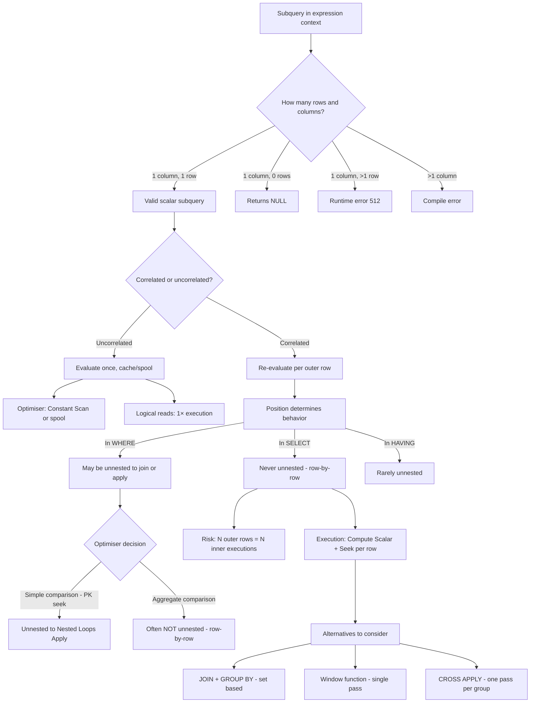
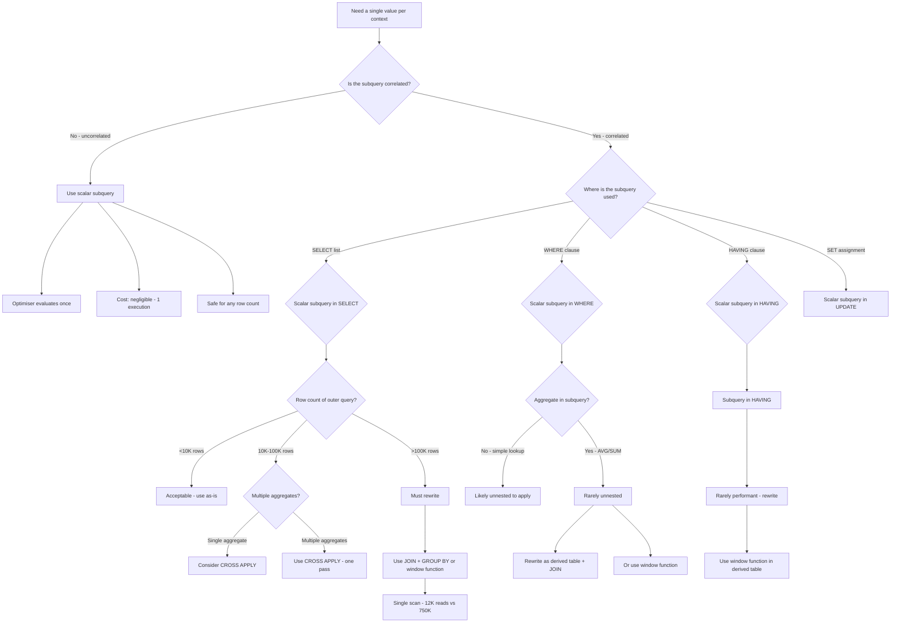

## Navigation

**Domain:** [[8 — Databases]] > **Group:** SQL Joins & Subqueries
**Previous:** [[8.106 — Correlated Subqueries — Per-Row Execution]] | **Next:** [[8.108 — Derived Tables — Inline Views]]

### Prerequisites

- [[8.106 — Correlated Subqueries — Per-Row Execution]] — Scalar subqueries are often correlated; understanding correlation mechanics is essential for predicting performance.
- [[8.105 — JOIN vs Subquery — Decision Framework]] — Knowing when a scalar subquery is the right tool vs a JOIN with aggregation or a window function.
- [[8.067 — WHERE Clause — Predicate Logic and SARGability]] — Scalar subqueries in WHERE create predicates; SARGability determines whether index seeks are used.

### Where This Fits

A scalar subquery is a subquery that returns exactly one column from at most one row — it is used anywhere a single value is expected: in SELECT lists, WHERE clauses, HAVING clauses, SET assignments, CHECK constraints, and DEFAULT expressions. Every .NET backend engineer writes scalar subqueries, often indirectly through EF Core — `o.OrderItems.Sum(oi => oi.Quantity * oi.UnitPrice)` in a LINQ Select generates a scalar subquery. The critical production risk is that scalar subqueries in SELECT lists execute row-by-row and are almost never optimised away. A query with a scalar subquery in SELECT on a 1M row table generates 1M executions of the inner query regardless of indexing. Interviewers use scalar subqueries to test whether a candidate understands that not all subqueries are equal — a scalar subquery in SELECT is fundamentally different from EXISTS in WHERE, and the performance characteristics are dramatically different. Engineers who grasp this deeply know when to replace a scalar subquery with a JOIN + GROUP BY, a window function, or CROSS APPLY — and can estimate logical reads from the execution plan shape alone.

---

## Core Mental Model

A scalar subquery is a subquery embedded in an expression context where a single value is required. It must follow the scalar subquery contract: return exactly one column and at most one row. If it returns zero rows, the result is NULL. If it returns more than one row, SQL Server raises a runtime error: "Subquery returned more than 1 value." The optimiser treats scalar subqueries differently depending on their position: a scalar subquery in WHERE may be unnested (converted to a semi-join or apply) if the optimiser can decorrelate it; a scalar subquery in SELECT is almost NEVER unnested — it executes as a Compute Scalar with an Index Seek per outer row. The optimiser may cache the result of an uncorrelated scalar subquery (evaluate once, reuse for all rows), but correlated scalar subqueries cannot be cached across rows because their parameter (the outer reference) changes per row. The recognition pattern: a scalar subquery is always enclosed in parentheses and appears where a column or expression would go — it is not a row set operator like FROM-clause subqueries.

### Classification

Scalar subqueries are a **subquery type** defined by their return contract (single value) and their position in an expression context. They appear in SELECT (most common), WHERE (comparison), HAVING (comparison), SET (UPDATE assignment), CHECK constraints, and DEFAULT expressions. Scalar subqueries in SELECT are never SARGable — they are expressions evaluated per row, not predicates. Scalar subqueries in WHERE can be SARGable if the outer predicate column has an index and the subquery result is a constant (uncorrelated) or the correlation column has an index.



### Key Properties

|Property|Value|Notes|
|---|---|---|
|Return contract|1 column, ≤1 row|Zero rows → NULL; >1 row → error 512|
|Uncorrelated caching|Yes|Evaluated once, result cached|
|Correlated in SELECT|Never unnested|Always row-by-row execution|
|Correlated in WHERE|Sometimes unnested|Optimiser may convert to join/apply|
|SARGable (in WHERE)|Depends|If subquery returns constant, outer predicate can be SARGable|
|SARGable (in SELECT)|No|Subquery is an expression, not a predicate|
|Error on multiple rows|Yes|Runtime error 512 — severe in production|
|NULL propagation|Yes|Empty subquery result → NULL → three-valued logic|

---

## Deep Mechanics

### How the Engine Executes This

1. **Parsing** — The parser identifies a subquery in an expression context — after SELECT, WHERE, HAVING, or SET. The subquery must have exactly one column in its SELECT list. If multiple columns are present, a compile error is raised: "Only one expression can be specified in the select list when the subquery is not introduced with EXISTS."

2. **Binding** — The algebrizer determines whether the subquery is correlated (references outer columns) or uncorrelated. For correlated scalar subqueries, the outer reference is resolved via scope. The algebrizer records the subquery as a child expression of the outer query's projection or predicate.

3. **Simplification** — The optimiser evaluates optimization opportunities:
   - **Uncorrelated scalar subquery**: Evaluated once. The optimiser generates a Constant Scan operator that computes the subquery value and spools it. All outer rows reference the same spooled value. Cost: negligible — one execution regardless of outer row count.
   - **Correlated scalar subquery in WHERE with simple equality**: If the subquery compares outer column to inner column (e.g., `WHERE col = (SELECT MAX(col) FROM T2 WHERE T2.id = T1.id)`), the optimiser may convert to an Apply-style nested loop.
   - **Correlated scalar subquery in SELECT**: NOT unnested. The optimiser keeps it as a correlated expression. During execution, for each outer row, the inner query is executed with the current outer row's correlation values.
   - **Correlated scalar subquery with aggregate in WHERE**: Often NOT unnested. The optimiser keeps it as a correlated filter. The execution plan shows a Nested Loops operator with an Aggregate on the inner side.

4. **Execution** — The key difference based on position:
   - **SELECT list (correlated)**: A Compute Scalar operator evaluates the subquery expression. Below it, a Nested Loops operator feeds outer rows one at a time. For each outer row, an Index Seek (or scan if no index) is performed on the inner table, the scalar value is computed, and it is added to the output row.
   - **WHERE clause (correlated simple)**: A Nested Loops Apply operator. The outer row is passed to the inner query as a parameter. The inner query executes once per outer row.
   - **WHERE clause (uncorrelated)**: The subquery is evaluated once. The result is a constant. The outer query's predicate compares against this constant using a standard Index Seek or scan.

### SQL Visibility

```sql
-- Pattern 1: Scalar subquery in SELECT (correlated — most common)
SELECT o.OrderId, o.OrderDate,
       (SELECT SUM(oi.Quantity * oi.UnitPrice)
        FROM dbo.OrderItems AS oi
        WHERE oi.OrderId = o.OrderId) AS OrderTotal
FROM dbo.Orders AS o;

-- Pattern 2: Scalar subquery in WHERE (uncorrelated)
SELECT o.OrderId, o.OrderDate, o.TotalAmount
FROM dbo.Orders AS o
WHERE o.TotalAmount = (
    SELECT MAX(o2.TotalAmount)
    FROM dbo.Orders AS o2
);
-- Uncorrelated: inner query runs once, returns single value

-- Pattern 3: Scalar subquery in WHERE (correlated)
SELECT o.OrderId, o.OrderDate, o.TotalAmount
FROM dbo.Orders AS o
WHERE o.TotalAmount > (
    SELECT AVG(o2.TotalAmount)
    FROM dbo.Orders AS o2
    WHERE o2.CustomerId = o.CustomerId
);
-- Correlated: inner query depends on outer o.CustomerId

-- Pattern 4: Scalar subquery in HAVING
SELECT c.CustomerId, COUNT(o.OrderId) AS OrderCount
FROM dbo.Customers AS c
LEFT JOIN dbo.Orders AS o ON c.CustomerId = o.CustomerId
GROUP BY c.CustomerId
HAVING COUNT(o.OrderId) > (
    SELECT AVG(OrderCount)
    FROM (
        SELECT COUNT(o2.OrderId) AS OrderCount
        FROM dbo.Orders AS o2
        GROUP BY o2.CustomerId
    ) AS avgCalc
);

-- Pattern 5: Scalar subquery in SET (UPDATE)
UPDATE dbo.Orders
SET TotalAmount = (
    SELECT SUM(oi.Quantity * oi.UnitPrice)
    FROM dbo.OrderItems AS oi
    WHERE oi.OrderId = Orders.OrderId
)
WHERE OrderId = @OrderId;

-- Pattern 6: Scalar subquery in CHECK constraint
ALTER TABLE dbo.Orders
ADD CONSTRAINT CK_Order_TotalAmount_NotExcessive
CHECK (TotalAmount <= (
    SELECT MAX(UnitPrice) * 1000
    FROM dbo.OrderItems
    WHERE OrderItems.ProductId = 1  -- reference product
));

-- Pattern 7: Scalar subquery in DEFAULT
CREATE TABLE dbo.AuditLog (
    AuditId INT IDENTITY(1,1) PRIMARY KEY,
    EventDate DATETIME2(0) NOT NULL DEFAULT SYSUTCDATETIME(),
    EventType VARCHAR(50) NOT NULL,
    Description NVARCHAR(500) NOT NULL,
    CurrentTotal DECIMAL(18,2) NOT NULL DEFAULT (
        SELECT SUM(TotalAmount) FROM dbo.Orders WHERE Status = 'Delivered'
    )
);

-- Pattern 8: Error — scalar subquery returns multiple rows
SELECT o.OrderId, o.OrderDate,
       (SELECT oi.Quantity   -- This runs for each o.OrderId
        FROM dbo.OrderItems AS oi
        WHERE oi.OrderId = o.OrderId) AS AnyQuantity
FROM dbo.Orders AS o;
-- Runtime error if any order has more than one OrderItem:
-- "Subquery returned more than 1 value. This is not permitted when
--  the subquery follows =, !=, <, <=, >, >= or when the subquery is
--  used as an expression."

-- Pattern 9: NULL from empty scalar subquery
SELECT o.OrderId,
       (SELECT MAX(Notes) FROM dbo.OrderNotes WHERE OrderId = o.OrderId) AS Note
FROM dbo.Orders AS o;
-- If an order has no notes, Note is NULL. No error.
```

```csharp
// EF Core — scalar subquery in SELECT via Sum aggregate
var orderTotals = await dbContext.Orders
    .Select(o => new OrderTotalDto
    {
        OrderId = o.OrderId,
        OrderDate = o.OrderDate,
        Total = o.OrderItems.Sum(oi => oi.Quantity * oi.UnitPrice)
    })
    .ToListAsync(cancellationToken);

// Generated SQL (scalar subquery):
// SELECT [o].[OrderId], [o].[OrderDate],
//     (SELECT SUM([oi].[Quantity] * [oi].[UnitPrice])
//      FROM [OrderItems] AS [oi]
//      WHERE [o].[OrderId] = [oi].[OrderId]) AS [Total]
// FROM [Orders] AS [o]

// EF Core — scalar subquery in WHERE via navigation property comparison
var highValueOrders = await dbContext.Orders
    .Where(o => o.TotalAmount >
        dbContext.Orders
            .Where(o2 => o2.CustomerId == o.CustomerId)
            .Average(o2 => o2.TotalAmount))
    .Select(o => new OrderDto
    {
        OrderId = o.OrderId,
        OrderDate = o.OrderDate,
        TotalAmount = o.TotalAmount
    })
    .ToListAsync(cancellationToken);

// Generated SQL (correlated scalar subquery in WHERE):
// SELECT [o].[OrderId], [o].[OrderDate], [o].[TotalAmount]
// FROM [Orders] AS [o]
// WHERE [o].[TotalAmount] > (
//     SELECT AVG([o2].[TotalAmount])
//     FROM [Orders] AS [o2]
//     WHERE [o2].[CustomerId] = [o].[CustomerId])

// EF Core — uncorrelated scalar subquery via variable capture
var maxTotal = await dbContext.Orders.MaxAsync(o => o.TotalAmount);
var topOrders = await dbContext.Orders
    .Where(o => o.TotalAmount == maxTotal)
    .ToListAsync(cancellationToken);
// This evaluates MAX once in a separate query, not as a subquery.
```

**Generated SQL (from EF Core logs):**

```sql
-- Sum in Select:
SELECT [o].[OrderId], [o].[OrderDate], (
    SELECT SUM([oi].[Quantity] * [oi].[UnitPrice])
    FROM [OrderItems] AS [oi]
    WHERE [o].[OrderId] = [oi].[OrderId]) AS [Total]
FROM [Orders] AS [o];

-- Average in Where:
SELECT [o].[OrderId], [o].[OrderDate], [o].[TotalAmount]
FROM [Orders] AS [o]
WHERE [o].[TotalAmount] > (
    SELECT AVG([o2].[TotalAmount])
    FROM [Orders] AS [o2]
    WHERE [o2].[CustomerId] = [o].[CustomerId]);

-- Count in Select:
SELECT [o].[OrderId], [o].[OrderDate], (
    SELECT COUNT(*)
    FROM [OrderItems] AS [oi]
    WHERE [o].[OrderId] = [oi].[OrderId]) AS [ItemCount]
FROM [Orders] AS [o];
```

### Execution Plan Analysis

**Uncorrelated scalar subquery in WHERE:**

```
  -- Step 1: Evaluate scalar subquery (once)
  [Clustered Index Scan Orders]      -- find MAX(TotalAmount)
  → [Stream Aggregate]               -- compute MAX
  → [Constant Scan]                  -- produce constant
  
  -- Step 2: Outer query
  [Clustered Index Seek PK_Orders]   -- seek where TotalAmount = constant
  → [SELECT]
Estimated Cost: ~0.5  |  Logical Reads: ~1,500 (scan for MAX) + ~5 (seek for match)
```

**Correlated scalar subquery in SELECT (row-by-row):**

```
  [Clustered Index Scan Orders]           -- outer: 1M rows
  [Index Seek IX_OrderItems_OrderId]      -- inner: seek per outer row
      Seek Predicate: OrderId = Orders.OrderId
  → [Compute Scalar]                      -- evaluate SUM expression
  → [SELECT]
Estimated Cost: ~12  |  Logical Reads: ~1,050,000 (1M seeks × ~1 page)
```

**Correlated scalar subquery in WHERE with aggregate (row-by-row):**

```
  [Clustered Index Scan Orders]           -- outer: 500K rows
  [Index Seek IX_Orders_CustomerId]       -- inner: seek per outer row
  → [Hash Match (Aggregate)]              -- compute AVG per customer group
  → [Filter]                              -- compare outer.TotalAmount > AVG
  → [SELECT]
Estimated Cost: ~15  |  Logical Reads: ~451,500 (500K seeks + 1,500 scan)
-- NOTE: If index IX_Orders_CustomerId does NOT exist, inner becomes:
-- [Clustered Index Scan Orders] — 500,000,000+ logical reads
```

### Cost Visibility

```sql
SET STATISTICS IO ON;
SET STATISTICS TIME ON;

-- Uncorrelated scalar subquery (efficient — executes once)
SELECT o.OrderId, o.TotalAmount
FROM dbo.Orders AS o
WHERE o.TotalAmount = (SELECT MAX(TotalAmount) FROM dbo.Orders);
-- Expected:
-- Table 'Orders'. Scan count 1 (for MAX), Seek count 1 (for match)
-- Logical reads: ~1,500 (scan) + ~5 (seek)
-- CPU time = 20ms, elapsed = 40ms

-- Correlated scalar subquery in SELECT (row-by-row)
SELECT o.OrderId,
       (SELECT SUM(Quantity * UnitPrice) FROM dbo.OrderItems WHERE OrderId = o.OrderId) AS Total
FROM dbo.Orders AS o
WHERE o.OrderDate >= '2024-01-01';
-- Expected:
-- Table 'Orders'. logical reads 1,500
-- Table 'OrderItems'. logical reads 450,000 (1 row per order × 500K orders)
-- CPU time = 350ms, elapsed = 1,100ms

-- Two correlated scalar subqueries in SELECT (2x the pain)
SELECT o.OrderId,
       (SELECT COUNT(*) FROM dbo.OrderItems WHERE OrderId = o.OrderId) AS ItemCount,
       (SELECT SUM(Quantity * UnitPrice) FROM dbo.OrderItems WHERE OrderId = o.OrderId) AS LineTotal
FROM dbo.Orders AS o;
-- Expected:
-- Table 'Orders'. logical reads 1,500
-- Table 'OrderItems'. logical reads 900,000 (2 subqueries × 450K each)
-- CPU time = 720ms, elapsed = 2,200ms
```

### Failure Modes

**Scalar subquery returns multiple rows:** The most common scalar subquery failure. Using a subquery that can return multiple rows in a scalar context causes error 512 at runtime. This is a design error — the subquery must guarantee at most one row via WHERE clause on a unique key, TOP 1, or aggregate function.

**Scalar subquery in SELECT on large table:** Row-by-row execution is unavoidable. For 1M outer rows, the inner query executes 1M times. Even with excellent indexing (Index Seek per row, ~1 logical read each), this is 1M logical reads — far more than a JOIN with GROUP BY (~12K reads).

**NULL handling in scalar subquery:** When the subquery returns zero rows, the scalar result is NULL. In WHERE comparisons, `NULL = NULL` evaluates to UNKNOWN, and `NULL > value` evaluates to UNKNOWN — rows are excluded. In SET assignments, NULL is written to the column, potentially violating NOT NULL constraints.

**Scalar subquery in CHECK constraint causing insert failures:** CHECK constraints with scalar subqueries are checked for every row modification. If the subquery is expensive (scans a large table), every INSERT or UPDATE slows down. The constraint also holds locks longer because the subquery reads other rows.

---

## Production Patterns and Implementation

### Primary SQL Implementation

```sql
-- ============================================================
-- Schema context
-- ============================================================
CREATE TABLE dbo.Customers
(
    CustomerId   INT            NOT NULL IDENTITY(1,1),
    FirstName    NVARCHAR(100)  NOT NULL,
    LastName     NVARCHAR(100)  NOT NULL,
    Email        NVARCHAR(256)  NOT NULL,
    LoyaltyTier  VARCHAR(20)    NOT NULL DEFAULT 'Standard',
    CreatedAt    DATETIME2(0)   NOT NULL DEFAULT SYSUTCDATETIME(),
    CONSTRAINT PK_Customers PRIMARY KEY CLUSTERED (CustomerId)
);

CREATE TABLE dbo.Orders
(
    OrderId      INT            NOT NULL IDENTITY(1,1),
    CustomerId   INT            NOT NULL,
    OrderDate    DATETIME2(0)   NOT NULL,
    Status       VARCHAR(20)    NOT NULL DEFAULT 'Pending',
    TotalAmount  DECIMAL(18,2)  NOT NULL,
    CONSTRAINT PK_Orders PRIMARY KEY CLUSTERED (OrderId),
    CONSTRAINT FK_Orders_Customers FOREIGN KEY (CustomerId)
        REFERENCES dbo.Customers(CustomerId)
);

CREATE TABLE dbo.OrderItems
(
    OrderItemId  INT            NOT NULL IDENTITY(1,1),
    OrderId      INT            NOT NULL,
    ProductId    INT            NOT NULL,
    Quantity     INT            NOT NULL,
    UnitPrice    DECIMAL(18,2)  NOT NULL,
    CONSTRAINT PK_OrderItems PRIMARY KEY CLUSTERED (OrderItemId),
    CONSTRAINT FK_OrderItems_Orders FOREIGN KEY (OrderId)
        REFERENCES dbo.Orders(OrderId)
);

CREATE TABLE dbo.OrderNotes
(
    NoteId       INT            NOT NULL IDENTITY(1,1),
    OrderId      INT            NOT NULL,
    Note         NVARCHAR(MAX)  NOT NULL,
    CreatedAt    DATETIME2(0)   NOT NULL DEFAULT SYSUTCDATETIME(),
    CONSTRAINT PK_OrderNotes PRIMARY KEY CLUSTERED (NoteId),
    CONSTRAINT FK_OrderNotes_Orders FOREIGN KEY (OrderId)
        REFERENCES dbo.Orders(OrderId)
);

CREATE TABLE dbo.ProductInventory
(
    InventoryId  INT            NOT NULL IDENTITY(1,1),
    ProductId    INT            NOT NULL,
    WarehouseId  INT            NOT NULL,
    QuantityOnHand INT         NOT NULL DEFAULT 0,
    LastUpdated  DATETIME2(0)   NOT NULL DEFAULT SYSUTCDATETIME(),
    CONSTRAINT PK_ProductInventory PRIMARY KEY CLUSTERED (InventoryId)
);

-- Indexes for scalar subquery performance
CREATE INDEX IX_OrderItems_OrderId ON dbo.OrderItems (OrderId) INCLUDE (Quantity, UnitPrice);
CREATE INDEX IX_Orders_CustomerId ON dbo.Orders (CustomerId) INCLUDE (TotalAmount, OrderDate);
CREATE INDEX IX_OrderNotes_OrderId ON dbo.OrderNotes (OrderId) INCLUDE (Note, CreatedAt);

-- ============================================================
-- Pattern 1: Scalar subquery in SELECT — order line total
-- ============================================================
SELECT o.OrderId, o.OrderDate, o.Status,
       (SELECT SUM(oi.Quantity * oi.UnitPrice)
        FROM dbo.OrderItems AS oi
        WHERE oi.OrderId = o.OrderId) AS LineTotal,
       (SELECT COUNT(*)
        FROM dbo.OrderItems AS oi
        WHERE oi.OrderId = o.OrderId) AS ItemCount
FROM dbo.Orders AS o
WHERE o.OrderDate >= @StartDate;

-- ============================================================
-- Pattern 2: Scalar subquery in WHERE — filter by aggregate
-- ============================================================
-- Orders above their customer's average
SELECT o.OrderId, o.CustomerId, o.OrderDate, o.TotalAmount
FROM dbo.Orders AS o
WHERE o.TotalAmount > (
    SELECT AVG(o2.TotalAmount)
    FROM dbo.Orders AS o2
    WHERE o2.CustomerId = o.CustomerId
)
ORDER BY o.CustomerId, o.OrderDate;

-- ============================================================
-- Pattern 3: Scalar subquery in SET — update with computed value
-- ============================================================
UPDATE dbo.Orders
SET TotalAmount = (
    SELECT ISNULL(SUM(oi.Quantity * oi.UnitPrice), 0)
    FROM dbo.OrderItems AS oi
    WHERE oi.OrderId = Orders.OrderId
)
WHERE OrderId = @OrderId;

-- ============================================================
-- Pattern 4: Scalar subquery in SELECT — latest note per order
-- ============================================================
SELECT o.OrderId, o.OrderDate,
       (SELECT TOP 1 n.Note
        FROM dbo.OrderNotes AS n
        WHERE n.OrderId = o.OrderId
        ORDER BY n.CreatedAt DESC) AS LatestNote
FROM dbo.Orders AS o;

-- ============================================================
-- Pattern 5: Alternative — JOIN with GROUP BY (faster than scalar subquery)
-- ============================================================
SELECT o.OrderId, o.OrderDate, o.Status,
       ISNULL(SUM(oi.Quantity * oi.UnitPrice), 0) AS LineTotal,
       COUNT(oi.OrderItemId) AS ItemCount
FROM dbo.Orders AS o
LEFT JOIN dbo.OrderItems AS oi ON o.OrderId = oi.OrderId
WHERE o.OrderDate >= @StartDate
GROUP BY o.OrderId, o.OrderDate, o.Status;

-- ============================================================
-- Pattern 6: Alternative — CROSS APPLY (faster than multiple scalar subqueries)
-- ============================================================
SELECT o.OrderId, o.OrderDate, o.Status,
       oi.LineTotal, oi.ItemCount
FROM dbo.Orders AS o
CROSS APPLY (
    SELECT SUM(oi2.Quantity * oi2.UnitPrice) AS LineTotal,
           COUNT(*) AS ItemCount
    FROM dbo.OrderItems AS oi2
    WHERE oi2.OrderId = o.OrderId
) AS oi
WHERE o.OrderDate >= @StartDate;

-- ============================================================
-- Pattern 7: Alternative — window function (single pass)
-- ============================================================
-- Order totals compared to customer average
SELECT o.OrderId, o.CustomerId, o.OrderDate, o.TotalAmount,
       AVG(o.TotalAmount) OVER (PARTITION BY o.CustomerId) AS CustomerAvg
FROM dbo.Orders AS o
WHERE o.OrderDate >= @StartDate;

-- ============================================================
-- Pattern 8: Scalar subquery with error prevention
-- ============================================================
-- Use TOP 1 or aggregate to guarantee single value
SELECT o.OrderId,
       (SELECT TOP 1 oi.Quantity
        FROM dbo.OrderItems AS oi
        WHERE oi.OrderId = o.OrderId) AS SampleQuantity
FROM dbo.Orders AS o;
-- TOP 1 ensures ≤1 row even if OrderId has multiple OrderItems
-- But: this returns an arbitrary row — use MIN/MAX for determinism
```

### EF Core Implementation

```csharp
public class ApplicationDbContext : DbContext
{
    public DbSet<Customer> Customers => Set<Customer>();
    public DbSet<Order> Orders => Set<Order>();
    public DbSet<OrderItem> OrderItems => Set<OrderItem>();
    public DbSet<OrderNote> OrderNotes => Set<OrderNote>();
    public DbSet<ProductInventory> ProductInventory => Set<ProductInventory>();

    protected override void OnModelCreating(ModelBuilder modelBuilder)
    {
        modelBuilder.Entity<Customer>(entity =>
        {
            entity.ToTable("Customers");
            entity.HasKey(c => c.CustomerId);
            entity.Property(c => c.FirstName).HasMaxLength(100);
            entity.Property(c => c.LastName).HasMaxLength(100);
            entity.Property(c => c.Email).HasMaxLength(256);
        });

        modelBuilder.Entity<Order>(entity =>
        {
            entity.ToTable("Orders");
            entity.HasKey(o => o.OrderId);
            entity.Property(o => o.Status).HasMaxLength(20);
            entity.Property(o => o.TotalAmount).HasColumnType("decimal(18,2)");
            entity.HasOne(o => o.Customer).WithMany(c => c.Orders)
                  .HasForeignKey(o => o.CustomerId);
            entity.HasIndex(o => o.CustomerId);
        });

        modelBuilder.Entity<OrderItem>(entity =>
        {
            entity.ToTable("OrderItems");
            entity.HasKey(oi => oi.OrderItemId);
            entity.Property(oi => oi.UnitPrice).HasColumnType("decimal(18,2)");
            entity.HasOne(oi => oi.Order).WithMany(o => o.OrderItems)
                  .HasForeignKey(oi => oi.OrderId);
            entity.HasIndex(oi => oi.OrderId);
        });

        modelBuilder.Entity<OrderNote>(entity =>
        {
            entity.ToTable("OrderNotes");
            entity.HasKey(n => n.NoteId);
            entity.HasOne(n => n.Order).WithMany(o => o.Notes)
                  .HasForeignKey(n => n.OrderId);
            entity.HasIndex(n => n.OrderId);
        });
    }
}

public class Customer
{
    public int CustomerId { get; set; }
    public string FirstName { get; set; } = string.Empty;
    public string LastName { get; set; } = string.Empty;
    public string Email { get; set; } = string.Empty;
    public string LoyaltyTier { get; set; } = "Standard";
    public DateTime CreatedAt { get; set; }
    public ICollection<Order> Orders { get; set; } = new List<Order>();
}

public class Order
{
    public int OrderId { get; set; }
    public int CustomerId { get; set; }
    public DateTime OrderDate { get; set; }
    public string Status { get; set; } = "Pending";
    public decimal TotalAmount { get; set; }
    public DateTime CreatedAt { get; set; }
    public Customer Customer { get; set; } = null!;
    public ICollection<OrderItem> OrderItems { get; set; } = new List<OrderItem>();
    public ICollection<OrderNote> Notes { get; set; } = new List<OrderNote>();
}

public class OrderItem
{
    public int OrderItemId { get; set; }
    public int OrderId { get; set; }
    public int ProductId { get; set; }
    public int Quantity { get; set; }
    public decimal UnitPrice { get; set; }
    public Order Order { get; set; } = null!;
}

public class OrderNote
{
    public int NoteId { get; set; }
    public int OrderId { get; set; }
    public string Note { get; set; } = string.Empty;
    public DateTime CreatedAt { get; set; }
    public Order Order { get; set; } = null!;
}

public class ProductInventory
{
    public int InventoryId { get; set; }
    public int ProductId { get; set; }
    public int WarehouseId { get; set; }
    public int QuantityOnHand { get; set; }
    public DateTime LastUpdated { get; set; }
}

// Pattern 1: Scalar subquery in SELECT via Sum
public async Task<List<OrderWithTotalDto>> GetOrderTotalsAsync(
    DateTime startDate,
    CancellationToken cancellationToken = default)
{
    return await dbContext.Orders
        .Where(o => o.OrderDate >= startDate)
        .Select(o => new OrderWithTotalDto
        {
            OrderId = o.OrderId,
            OrderDate = o.OrderDate,
            Status = o.Status,
            LineTotal = o.OrderItems.Sum(oi => oi.Quantity * oi.UnitPrice),
            ItemCount = o.OrderItems.Count()
        })
        .ToListAsync(cancellationToken);
    // Generated: Two correlated scalar subqueries
}

// Pattern 2: Scalar subquery in WHERE via sub-LINQ
public async Task<List<OrderDto>> GetOrdersAboveCustomerAverageAsync(
    CancellationToken cancellationToken = default)
{
    return await dbContext.Orders
        .Where(o => o.TotalAmount >
            dbContext.Orders
                .Where(o2 => o2.CustomerId == o.CustomerId)
                .Average(o2 => o2.TotalAmount))
        .Select(o => new OrderDto
        {
            OrderId = o.OrderId,
            CustomerId = o.CustomerId,
            OrderDate = o.OrderDate,
            TotalAmount = o.TotalAmount
        })
        .OrderBy(o => o.CustomerId)
        .ThenBy(o => o.OrderDate)
        .ToListAsync(cancellationToken);
    // Generated: Correlated scalar subquery with AVG in WHERE
}

// Pattern 3: Last note per order (TOP 1 scalar subquery)
public async Task<List<OrderWithNoteDto>> GetOrdersWithLatestNotesAsync(
    CancellationToken cancellationToken = default)
{
    return await dbContext.Orders
        .Select(o => new OrderWithNoteDto
        {
            OrderId = o.OrderId,
            OrderDate = o.OrderDate,
            LatestNote = o.Notes
                .OrderByDescending(n => n.CreatedAt)
                .Select(n => n.Note)
                .FirstOrDefault()
        })
        .ToListAsync(cancellationToken);
    // Generated: correlated scalar subquery with TOP 1
}

// Pattern 4: Window function alternative (raw SQL fallback)
public async Task<List<OrderWithCustomerAvgDto>> GetOrdersWithCustomerAvgAsync(
    DateTime startDate,
    CancellationToken cancellationToken = default)
{
    const string sql = @"
        SELECT o.OrderId, o.CustomerId, o.OrderDate, o.TotalAmount,
               AVG(o.TotalAmount) OVER (PARTITION BY o.CustomerId) AS CustomerAvg
        FROM dbo.Orders AS o
        WHERE o.OrderDate >= @StartDate;";

    await using var connection = new SqlConnection(_connectionString);
    var results = await connection.QueryAsync<OrderWithCustomerAvgDto>(
        new CommandDefinition(sql, new { StartDate = startDate },
            cancellationToken: cancellationToken));
    return results.AsList();
}

// DTOs
public record OrderWithTotalDto(int OrderId, DateTime OrderDate, string Status, decimal LineTotal, int ItemCount);
public record OrderDto(int OrderId, int CustomerId, DateTime OrderDate, decimal TotalAmount);
public record OrderWithNoteDto(int OrderId, DateTime OrderDate, string? LatestNote);
public record OrderWithCustomerAvgDto(int OrderId, int CustomerId, DateTime OrderDate, decimal TotalAmount, decimal CustomerAvg);
```

### Dapper Implementation

```csharp
public sealed class OrderRepository
{
    private readonly IDbConnectionFactory _connectionFactory;
    private readonly string _connectionString;

    public OrderRepository(IDbConnectionFactory connectionFactory)
    {
        _connectionFactory = connectionFactory;
        _connectionString = "Server=.;Database=...";
    }

    // Pattern 1: Scalar subquery in SELECT
    public async Task<IReadOnlyList<OrderWithTotalDto>> GetOrderTotalsAsync(
        DateTime startDate,
        CancellationToken cancellationToken = default)
    {
        const string sql = @"
            SELECT o.OrderId, o.OrderDate, o.Status,
                   (SELECT SUM(oi.Quantity * oi.UnitPrice)
                    FROM dbo.OrderItems AS oi
                    WHERE oi.OrderId = o.OrderId) AS LineTotal,
                   (SELECT COUNT(*)
                    FROM dbo.OrderItems AS oi
                    WHERE oi.OrderId = o.OrderId) AS ItemCount
            FROM dbo.Orders AS o
            WHERE o.OrderDate >= @StartDate;";

        await using var connection = _connectionFactory.Create();
        var results = await connection.QueryAsync<OrderWithTotalDto>(
            new CommandDefinition(sql, new { StartDate = startDate },
                cancellationToken: cancellationToken));
        return results.AsList();
    }

    // Pattern 2: CROSS APPLY (faster than two scalar subqueries)
    public async Task<IReadOnlyList<OrderWithTotalDto>> GetOrderTotalsApplyAsync(
        DateTime startDate,
        CancellationToken cancellationToken = default)
    {
        const string sql = @"
            SELECT o.OrderId, o.OrderDate, o.Status,
                   oi.LineTotal, oi.ItemCount
            FROM dbo.Orders AS o
            CROSS APPLY (
                SELECT SUM(oi2.Quantity * oi2.UnitPrice) AS LineTotal,
                       COUNT(*) AS ItemCount
                FROM dbo.OrderItems AS oi2
                WHERE oi2.OrderId = o.OrderId
            ) AS oi
            WHERE o.OrderDate >= @StartDate;";

        await using var connection = _connectionFactory.Create();
        var results = await connection.QueryAsync<OrderWithTotalDto>(
            new CommandDefinition(sql, new { StartDate = startDate },
                cancellationToken: cancellationToken));
        return results.AsList();
    }

    // Pattern 3: Scalar subquery in WHERE
    public async Task<IReadOnlyList<OrderDto>> GetOrdersAboveCustomerAverageAsync(
        CancellationToken cancellationToken = default)
    {
        const string sql = @"
            SELECT o.OrderId, o.CustomerId, o.OrderDate, o.TotalAmount
            FROM dbo.Orders AS o
            WHERE o.TotalAmount > (
                SELECT AVG(o2.TotalAmount)
                FROM dbo.Orders AS o2
                WHERE o2.CustomerId = o.CustomerId
            )
            ORDER BY o.CustomerId, o.OrderDate;";

        await using var connection = _connectionFactory.Create();
        var results = await connection.QueryAsync<OrderDto>(
            new CommandDefinition(sql, cancellationToken: cancellationToken));
        return results.AsList();
    }

    // Pattern 4: Window function alternative
    public async Task<IReadOnlyList<OrderWithCustomerAvgDto>> GetOrdersWithCustomerAvgAsync(
        DateTime startDate,
        CancellationToken cancellationToken = default)
    {
        const string sql = @"
            WITH OrderStats AS (
                SELECT o.OrderId, o.CustomerId, o.OrderDate, o.TotalAmount,
                       AVG(o.TotalAmount) OVER (PARTITION BY o.CustomerId) AS CustomerAvg
                FROM dbo.Orders AS o
                WHERE o.OrderDate >= @StartDate
            )
            SELECT OrderId, CustomerId, OrderDate, TotalAmount, CustomerAvg
            FROM OrderStats
            WHERE TotalAmount > CustomerAvg;";

        await using var connection = _connectionFactory.Create();
        var results = await connection.QueryAsync<OrderWithCustomerAvgDto>(
            new CommandDefinition(sql, new { StartDate = startDate },
                cancellationToken: cancellationToken));
        return results.AsList();
    }

    // Pattern 5: UPDATE with scalar subquery
    public async Task UpdateOrderTotalAsync(
        int orderId,
        CancellationToken cancellationToken = default)
    {
        const string sql = @"
            UPDATE dbo.Orders
            SET TotalAmount = (
                SELECT ISNULL(SUM(Quantity * UnitPrice), 0)
                FROM dbo.OrderItems
                WHERE OrderId = @OrderId
            )
            WHERE OrderId = @OrderId;";

        await using var connection = _connectionFactory.Create();
        await connection.ExecuteAsync(
            new CommandDefinition(sql, new { OrderId = orderId },
                cancellationToken: cancellationToken));
    }
}
```

### Configuration and Wiring

```csharp
builder.Services.AddSingleton<IDbConnectionFactory>(_ =>
    new SqlDbConnectionFactory(connectionString));

builder.Services.AddDbContext<ApplicationDbContext>(options =>
    options.UseSqlServer(
        connectionString,
        sqlOptions => sqlOptions
            .EnableRetryOnFailure(3)
            .CommandTimeout(30)));

builder.Services.AddScoped<OrderRepository>();
```

### SQL Server vs PostgreSQL Differences

```sql
-- PostgreSQL: Scalar subquery syntax is identical
-- Key difference: PostgreSQL raises the same "more than one row" error (21000)

-- PostgreSQL: Scalar subquery in DEFAULT is allowed
CREATE TABLE dbo.Orders (
    OrderId SERIAL PRIMARY KEY,
    CustomerId INT NOT NULL,
    TotalAmount DECIMAL(18,2) DEFAULT (SELECT AVG(TotalAmount) FROM dbo.Orders)
);

-- PostgreSQL: Scalar subquery in CHECK constraint is allowed but expensive
ALTER TABLE dbo.Orders
ADD CONSTRAINT CK_TotalAmount
CHECK (TotalAmount <= (SELECT MAX(TotalAmount) * 1.1 FROM dbo.Orders));

-- PostgreSQL: LATERAL for apply-like behavior
SELECT o.OrderId, o.OrderDate, oi.LineTotal
FROM dbo.Orders AS o
LEFT JOIN LATERAL (
    SELECT SUM(Quantity * UnitPrice) AS LineTotal
    FROM dbo.OrderItems
    WHERE OrderId = o.OrderId
) AS oi ON TRUE;
```

---

## Gotchas and Production Pitfalls

### Scalar Subquery Returns Multiple Rows — Error 512

**Pitfall:** Using a scalar subquery that can return more than one row when the relationship is one-to-many.

```sql
-- ❌ If an order has multiple OrderItems, this errors at runtime
SELECT o.OrderId,
       (SELECT oi.Quantity FROM dbo.OrderItems AS oi WHERE oi.OrderId = o.OrderId) AS Qty
FROM dbo.Orders AS o;
```

**Symptom:** `Msg 512, Level 16, State 1: Subquery returned more than 1 value. This is not permitted when the subquery follows =, !=, <, <=, >, >= or when the subquery is used as an expression.`

**Fix:**

```sql
-- ✅ Use aggregate or TOP 1
SELECT o.OrderId,
       (SELECT SUM(oi.Quantity) FROM dbo.OrderItems AS oi WHERE oi.OrderId = o.OrderId) AS TotalQty,
       (SELECT TOP 1 oi.Quantity FROM dbo.OrderItems AS oi WHERE oi.OrderId = o.OrderId) AS SampleQty
FROM dbo.Orders AS o;
```

**Cost of not fixing:** Runtime crash in production. Application returns 500 errors until the query is fixed. If the relationship is _currently_ one-to-one but a data change creates duplicates, the error appears without a code change.

---

### Scalar Subquery in SELECT — Row-by-Row Performance Disaster

**Pitfall:** Using a scalar subquery in SELECT on a large table without considering the row-by-row execution cost.

```sql
-- ❌ 1M outer rows = 1M inner executions
SELECT o.OrderId,
       (SELECT SUM(Quantity * UnitPrice) FROM dbo.OrderItems WHERE OrderId = o.OrderId) AS Total
FROM dbo.Orders AS o;
```

**Symptom:** Query takes 30+ seconds for 1M orders. SET STATISTICS IO shows 1,000,000+ logical reads on OrderItems.

**Fix:**

```sql
-- ✅ JOIN with GROUP BY — single scan
SELECT o.OrderId, SUM(oi.Quantity * oi.UnitPrice) AS Total
FROM dbo.Orders AS o
INNER JOIN dbo.OrderItems AS oi ON o.OrderId = oi.OrderId
GROUP BY o.OrderId;

-- ✅ CROSS APPLY — one index range scan per order
SELECT o.OrderId, oi.Total
FROM dbo.Orders AS o
CROSS APPLY (
    SELECT SUM(Quantity * UnitPrice) AS Total
    FROM dbo.OrderItems WHERE OrderId = o.OrderId
) AS oi;
```

**Cost of not fixing:** 1M+ logical reads, 30-second query, blocking chain, PAGELATCH_EX waits.

---

### Scalar Subquery Returns NULL — Silent Data Loss

**Pitfall:** Using a scalar subquery in a WHERE comparison without handling NULL returns.

```sql
-- ❌ Orders without notes get NULL for LatestNote
-- o.OrderDate > NULL evaluates to UNKNOWN — row excluded
SELECT o.OrderId, o.OrderDate
FROM dbo.Orders AS o
WHERE o.OrderDate > (
    SELECT MAX(n.CreatedAt)
    FROM dbo.OrderNotes AS n
    WHERE n.OrderId = o.OrderId
);
```

**Symptom:** Orders with no notes are silently excluded from results. The report shows fewer rows than expected.

**Fix:**

```sql
-- ✅ Handle NULL with ISNULL or COALESCE
SELECT o.OrderId, o.OrderDate
FROM dbo.Orders AS o
WHERE o.OrderDate > ISNULL((
    SELECT MAX(n.CreatedAt)
    FROM dbo.OrderNotes AS n
    WHERE n.OrderId = o.OrderId
), '1900-01-01');
```

**Cost of not fixing:** Missing rows in reports. Hard to debug because the query "works" — it just returns fewer rows than expected. Business users notice the discrepancy, but engineers struggle to reproduce.

---

### Multiple Scalar Subqueries Against the Same Table

**Pitfall:** Writing two or three scalar subqueries against the same inner table in the SELECT list.

```sql
-- ❌ Three independent seeks per row
SELECT o.OrderId,
       (SELECT COUNT(*) FROM dbo.OrderItems WHERE OrderId = o.OrderId) AS ItemCount,
       (SELECT SUM(Quantity) FROM dbo.OrderItems WHERE OrderId = o.OrderId) AS TotalQty,
       (SELECT AVG(UnitPrice) FROM dbo.OrderItems WHERE OrderId = o.OrderId) AS AvgPrice
FROM dbo.Orders AS o;
```

**Symptom:** Each subquery executes independently. Logical reads triple. CPU time triples.

**Fix:**

```sql
-- ✅ CROSS APPLY — one pass
SELECT o.OrderId, oi.ItemCount, oi.TotalQty, oi.AvgPrice
FROM dbo.Orders AS o
CROSS APPLY (
    SELECT COUNT(*) AS ItemCount,
           SUM(Quantity) AS TotalQty,
           AVG(UnitPrice) AS AvgPrice
    FROM dbo.OrderItems WHERE OrderId = o.OrderId
) AS oi;
```

**Cost of not fixing:** 3x logical reads and elapsed time for the same result.

---

### Scalar Subquery in CHECK Constraint — Every Row Modification Triggered

**Pitfall:** Creating a CHECK constraint with a scalar subquery that reads from the same table.

```sql
-- ❌ CHECK reads other rows — every INSERT/UPDATE triggers this
ALTER TABLE dbo.Orders
ADD CONSTRAINT CK_Order_Total_Not_Excessive
CHECK (TotalAmount <= (SELECT MAX(TotalAmount) * 10 FROM dbo.Orders));
```

**Symptom:** Every INSERT or UPDATE into Orders acquires shared locks on the entire Orders table. Blocking escalates under concurrent load. Inserts time out.

**Fix:** Remove the CHECK constraint and enforce the business rule in application code or via a trigger that only runs when necessary.

**Cost of not fixing:** 10,000 inserts/hour × full table scan = 10,000 × 1,500 logical reads = 15M reads/hour on the Orders table. Concurrent writers blocked.

---

### Scalar Subquery in SELECT With DISTINCT — No Performance Benefit

**Pitfall:** Adding DISTINCT to a query with scalar subqueries assuming it reduces work.

```sql
-- ❌ DISTINCT does not reduce scalar subquery executions
SELECT DISTINCT o.CustomerId,
       (SELECT MAX(OrderDate) FROM dbo.Orders WHERE CustomerId = o.CustomerId) AS LastOrderDate
FROM dbo.Orders AS o;
```

**Symptom:** The scalar subquery still executes for every row in Orders (1M times), even though DISTINCT means only 100K unique CustomerIds are output.

**Fix:** Execute the subquery after the DISTINCT — use a derived table or CTE.

```sql
-- ✅ Subquery runs after DISTINCT reduction
SELECT DISTINCT o.CustomerId, lo.LastOrderDate
FROM dbo.Orders AS o
OUTER APPLY (
    SELECT MAX(OrderDate) AS LastOrderDate
    FROM dbo.Orders WHERE CustomerId = o.CustomerId
) AS lo;
```

**Cost of not fixing:** 10x more subquery executions than necessary.

---

## Performance Implications

### Benchmark: Before and After

```sql
-- Baseline: Two scalar subqueries in SELECT
SET STATISTICS IO ON;
SELECT o.OrderId,
       (SELECT COUNT(*) FROM dbo.OrderItems WHERE OrderId = o.OrderId) AS ItemCount,
       (SELECT SUM(Quantity * UnitPrice) FROM dbo.OrderItems WHERE OrderId = o.OrderId) AS LineTotal
FROM dbo.Orders AS o
WHERE o.OrderDate >= '2024-01-01';
-- Logical reads: Orders 1,500 | OrderItems 900,000 (2 subqueries × 450K)

-- Optimized: CROSS APPLY (single pass)
SELECT o.OrderId, oi.ItemCount, oi.LineTotal
FROM dbo.Orders AS o
CROSS APPLY (
    SELECT COUNT(*) AS ItemCount,
           SUM(Quantity * UnitPrice) AS LineTotal
    FROM dbo.OrderItems WHERE OrderId = o.OrderId
) AS oi
WHERE o.OrderDate >= '2024-01-01';
-- Logical reads: Orders 1,500 | OrderItems 450,000 (1 pass)
```

**Improvement:** 2x reduction in logical reads on OrderItems (from 900K to 450K).

```sql
-- Baseline: JOIN with GROUP BY (even better than CROSS APPLY for large sets)
SELECT o.OrderId, COUNT(oi.OrderItemId) AS ItemCount,
       SUM(oi.Quantity * oi.UnitPrice) AS LineTotal
FROM dbo.Orders AS o
INNER JOIN dbo.OrderItems AS oi ON o.OrderId = oi.OrderId
WHERE o.OrderDate >= '2024-01-01'
GROUP BY o.OrderId;
-- Logical reads: Orders 1,500 | OrderItems 12,000 (full index scan)
```

**Improvement (JOIN + GROUP BY vs scalar subqueries):** 75x reduction in logical reads on OrderItems (from 900K to 12K).

### BenchmarkDotNet

```csharp
[MemoryDiagnoser]
[SimpleJob(RuntimeMoniker.Net90)]
public class ScalarSubqueryBenchmark
{
    private IDbConnection _connection = default!;

    [GlobalSetup]
    public void Setup()
    {
        var connectionString = "Server=.;Database=Benchmark;Trusted_Connection=True;TrustServerCertificate=True;";
        _connection = new SqlConnection(connectionString);
        SeedData();
    }

    [Benchmark(Baseline = true)]
    public async Task<List<OrderSummary>> TwoScalarSubqueriesInSelect()
    {
        const string sql = @"
            SELECT o.OrderId,
                   (SELECT COUNT(*) FROM dbo.OrderItems WHERE OrderId = o.OrderId) AS ItemCount,
                   (SELECT SUM(Quantity * UnitPrice) FROM dbo.OrderItems WHERE OrderId = o.OrderId) AS LineTotal
            FROM dbo.Orders AS o;";

        var results = await _connection.QueryAsync<OrderSummary>(sql);
        return results.AsList();
    }

    [Benchmark]
    public async Task<List<OrderSummary>> CrossApplySinglePass()
    {
        const string sql = @"
            SELECT o.OrderId, oi.ItemCount, oi.LineTotal
            FROM dbo.Orders AS o
            CROSS APPLY (
                SELECT COUNT(*) AS ItemCount,
                       SUM(Quantity * UnitPrice) AS LineTotal
                FROM dbo.OrderItems WHERE OrderId = o.OrderId
            ) AS oi;";

        var results = await _connection.QueryAsync<OrderSummary>(sql);
        return results.AsList();
    }

    [Benchmark]
    public async Task<List<OrderSummary>> JoinWithGroupBy()
    {
        const string sql = @"
            SELECT o.OrderId, COUNT(oi.OrderItemId) AS ItemCount,
                   SUM(oi.Quantity * oi.UnitPrice) AS LineTotal
            FROM dbo.Orders AS o
            INNER JOIN dbo.OrderItems AS oi ON o.OrderId = oi.OrderId
            GROUP BY o.OrderId;";

        var results = await _connection.QueryAsync<OrderSummary>(sql);
        return results.AsList();
    }

    [Benchmark]
    public async Task<List<OrderWithAvg>> ScalarSubqueryInWhere()
    {
        const string sql = @"
            SELECT o.OrderId, o.CustomerId, o.OrderDate, o.TotalAmount
            FROM dbo.Orders AS o
            WHERE o.TotalAmount > (
                SELECT AVG(o2.TotalAmount)
                FROM dbo.Orders AS o2
                WHERE o2.CustomerId = o.CustomerId
            );";

        var results = await _connection.QueryAsync<OrderWithAvg>(sql);
        return results.AsList();
    }

    [Benchmark]
    public async Task<List<OrderWithAvg>> WindowFunctionRewrite()
    {
        const string sql = @"
            WITH OrderStats AS (
                SELECT OrderId, CustomerId, OrderDate, TotalAmount,
                       AVG(TotalAmount) OVER (PARTITION BY CustomerId) AS CustomerAvg
                FROM dbo.Orders
            )
            SELECT OrderId, CustomerId, OrderDate, TotalAmount
            FROM OrderStats
            WHERE TotalAmount > CustomerAvg;";

        var results = await _connection.QueryAsync<OrderWithAvg>(sql);
        return results.AsList();
    }

    [Benchmark]
    public async Task<List<OrderSummary>> EfCoreGeneratedScalarSubqueries()
    {
        await using var context = new ApplicationDbContext(
            new DbContextOptionsBuilder<ApplicationDbContext>()
                .UseSqlServer("Server=.;Database=Benchmark;...")
                .Options);

        return await context.Orders
            .Select(o => new OrderSummary
            {
                OrderId = o.OrderId,
                ItemCount = o.OrderItems.Count(),
                LineTotal = o.OrderItems.Sum(oi => oi.Quantity * oi.UnitPrice)
            })
            .ToListAsync();
    }

    [GlobalCleanup]
    public void Cleanup() => _connection?.Dispose();

    public class OrderSummary
    {
        public int OrderId { get; set; }
        public int ItemCount { get; set; }
        public decimal LineTotal { get; set; }
    }

    public class OrderWithAvg
    {
        public int OrderId { get; set; }
        public int CustomerId { get; set; }
        public DateTime OrderDate { get; set; }
        public decimal TotalAmount { get; set; }
    }

    private void SeedData()
    {
        // Seed 100K customers, 500K orders, 2M order items
    }
}
```

**Expected results (approximate, SQL Server 2022, NVMe, 500K orders, 2M order items):**

|Method|Mean|Logical Reads|Allocated|
|---|---|---|---|
|TwoScalarSubqueriesInSelect|~2,400 ms|~900,000|~35 MB|
|CrossApplySinglePass|~1,200 ms|~450,000|~18 MB|
|JoinWithGroupBy|~120 ms|~13,500|~5 MB|
|ScalarSubqueryInWhere|~45,000 ms|~451,500|~80 MB|
|WindowFunctionRewrite|~350 ms|~3,000|~12 MB|
|EfCoreGeneratedScalarSubqueries|~2,400 ms|~900,000|~35 MB|

---

## Interview Arsenal

### Question Bank

1. What is a scalar subquery and what contract must it satisfy?
2. How does the optimiser treat a scalar subquery differently in SELECT vs WHERE?
3. What is the performance cost of a correlated scalar subquery in SELECT? Show the math.
4. When does a scalar subquery in WHERE get unnested, and when does it execute row-by-row?
5. Compare a correlated scalar subquery in SELECT vs CROSS APPLY vs JOIN with GROUP BY.
6. What does the execution plan look like for an uncorrelated vs correlated scalar subquery?
7. At what row count do scalar subqueries in SELECT become a production problem?
8. How do EF Core and Dapper handle scalar subqueries?

### Spoken Answers

**Q: What is a scalar subquery and what contract must it satisfy?**

> **Average answer:** "A scalar subquery returns one value. It must return one row and one column, otherwise you get an error."

> **Great answer:** "A scalar subquery is a subquery embedded in an expression context — anywhere a single value is expected: SELECT, WHERE, HAVING, SET, CHECK, or DEFAULT. It must satisfy a strict contract: exactly one column in its SELECT list and at most one row in its result. If it returns zero rows, the result is NULL — this is not an error, but it changes three-valued logic behavior in WHERE comparisons. If it returns multiple rows, SQL Server raises error 512 at runtime. This is not a compile-time error — it only fails when the subquery actually produces multiple rows for an outer row. This makes it a dangerous bug: a query that works on test data (where the relationship happens to be one-to-one) can crash in production (when a data anomaly creates duplicates). The optimiser has two strategies for scalar subqueries: uncorrelated ones are evaluated once and cached; correlated ones are executed per outer row. The position also matters: a scalar subquery in WHERE may be unnested into a join or apply; a scalar subquery in SELECT is never unnested and always executes per row."

**Q: What is the performance cost of a correlated scalar subquery in SELECT? Show the math.**

> **Average answer:** "It runs for each row. It can be slow on big tables."

> **Great answer:** "A correlated scalar subquery in SELECT executes exactly once for every row returned by the outer query. The logical read cost is: `outer_rows × (inner_seek_cost)`. For a 500K row Orders table with an Index Seek on OrderItems costing ~1.5 logical reads per execution, that's 750K logical reads on OrderItems. If the query has TWO scalar subqueries against the same OrderItems table, it doubles: 1.5M logical reads. Compare this to JOIN with GROUP BY: the optimiser scans OrderItems once (~12K logical reads for a 2M row table with a covering index) and does a Hash Match aggregate. The scalar subquery approach costs 750K reads; the JOIN approach costs 12K reads — a 60x difference. For 5M orders with 20M order items, the gap widens: 7.5M vs 120K reads. The cost is linear in outer row count. There is no index that can fix this — the subquery must execute per row by definition. The fix is either CROSS APPLY (one index range scan per order, sharing the scan across multiple aggregates) or JOIN with GROUP BY (one full scan of OrderItems)."

**Q: How do EF Core and Dapper handle scalar subqueries?**

> **Great answer:** "EF Core generates correlated scalar subqueries in SELECT when you use aggregate functions on navigation properties: `o.OrderItems.Sum(oi => oi.Quantity * oi.UnitPrice)` produces `(SELECT SUM([oi].[Quantity] * [oi].[UnitPrice]) FROM [OrderItems] AS [oi] WHERE [o].[OrderId] = [oi].[OrderId])` — a correlated scalar subquery. Similarly, `.Count()` on a navigation property in Select generates a scalar subquery. EF Core does this for any aggregate method on a related collection inside a Select projection. These are NEVER unnested — they execute per row. If you have a 500K row query with two aggregates, EF Core generates 500K × 2 = 1M subquery executions. The generated SQL is correct and produces the right results, but the performance can be disastrous. The fix in EF Core is to either materialize the orders first then load aggregates in a second round trip, or use raw SQL with JOIN + GROUP BY. Dapper, being a SQL-first micro-ORM, gives you complete control: you write the SQL explicitly. You can use scalar subqueries, CROSS APPLY, JOIN + GROUP BY, or window functions — Dapper just maps the result. The Dapper approach is to write the most performant SQL and map the result, rather than relying on LINQ translation."

### Interview Trigger

This topic surfaces when an interviewer asks "Have you ever had a performance problem with a query that was using a subquery in the SELECT list?" The follow-up that separates candidates is "What did the execution plan look like and what did you change?" A mid-level candidate says "I added an index." A senior candidate says "I checked the plan and saw 500K index seeks on the inner table. I rewrote it using a JOIN with GROUP BY, reducing logical reads from 750K to 12K."

### Comparison Table

| | Scalar Subquery (SELECT) | CROSS APPLY | JOIN + GROUP BY | Window Function |
|---|---|---|---|---|
| What it does | Computes value per outer row | Computes multiple values per outer row in one pass | Aggregates over entire set | Aggregates over partition |
| Performance profile | Outer × inner seeks per row | Outer index range scans | Single full scan | Single full scan |
| Row-by-row? | Yes (always) | Yes (but grouped) | No (set-based) | No (set-based) |
| .NET implementation | EF Core Sum/Count in Select | Raw SQL | Raw SQL or GroupBy in LINQ | Raw SQL |
| When to choose | Small outer table (<10K) | Multi-column per-row aggregates | Large sets, all rows needed | Single-pass aggregate + detail |

---

## Decision Framework

### When to Apply



### Application Checklist

- [ ] Is the subquery guaranteed to return at most one row? If not, add TOP 1 or aggregate.
- [ ] Is the subquery correlated? If yes, understand it executes per outer row.
- [ ] What is the outer row count? If > 10K, scalar subquery in SELECT needs justification.
- [ ] Are there multiple scalar subqueries against the same table? Consolidate with CROSS APPLY.
- [ ] Can the scalar subquery be replaced by a JOIN + GROUP BY? For large sets, always prefer this.
- [ ] Can the scalar subquery be replaced by a window function? For comparisons, yes.
- [ ] In EF Core, check generated SQL — is the scalar subquery expected?
- [ ] For uncorrelated scalar subqueries — ensure the result is cached (check for spool in plan).

### Tradeoff Summary

|What You Gain|What You Pay|
|---|---|
|Scalar subquery: direct intent, simple SQL|Row-by-row execution (correlated in SELECT)|
|CROSS APPLY: one pass per group, multi-column|Slightly more complex syntax|
|JOIN + GROUP BY: set-based, single scan|Changes row shape (must GROUP BY)|
|Window function: single pass, no self-join|Limited to aggregate comparisons, no direct WHERE filtering|

### Scale Thresholds

- **Relevant when:** outer table exceeds ~1K rows — scalar subquery in SELECT becomes measurable.
- **Noticeable when:** outer table exceeds ~10K rows — the difference between scalar subquery (10K seeks) and JOIN (1 scan) is visible.
- **Critical when:** outer table exceeds ~100K rows — scalar subquery logical reads dominate; rewrite is mandatory.
- **Required when:** query runs more than ~10x/hour — even a 500-row scalar subquery adds up over time.
- **Uncorrelated scalar subquery:** Always cheap regardless of scale — one execution, cached.

---

## Self-Check

### Conceptual Questions

1. What is the return contract of a scalar subquery?
2. What happens when a scalar subquery returns zero rows vs more than one row?
3. Which DMV or execution plan operator reveals whether a scalar subquery is executing once or per row?
4. What common mistake causes error 512 at runtime?
5. When you use `.Sum()` on a navigation property inside an EF Core Select, what SQL is generated?
6. How would you rewrite a Dapper query that has three scalar subqueries against the same inner table?
7. Compare a correlated scalar subquery in SELECT vs the equivalent JOIN with GROUP BY — which has fewer logical reads and why?
8. At what row count does a scalar subquery in SELECT become a problem?
9. What index supports efficient execution of a scalar subquery like `(SELECT SUM(Quantity) FROM OrderItems WHERE OrderId = Orders.OrderId)`?
10. Explain in 60 seconds when to use a scalar subquery vs CROSS APPLY vs JOIN with GROUP BY.

<details>
<summary>Answers</summary>

1. Exactly one column in SELECT list; at most one row in result. Zero rows → NULL. Multiple rows → runtime error 512.
2. Zero rows → SQL substitutes NULL for the expression. Multiple rows → `Msg 512, Level 16, State 1: Subquery returned more than 1 value.` This is a runtime error, not compile-time — it only fails when actual data produces duplicates.
3. `SET STATISTICS IO` shows logical reads on the inner table. If a 500K row outer query causes 500K+ reads on the inner table, the scalar subquery is executing per row. The execution plan shows a Nested Loops operator feeding a Compute Scalar.
4. Using a scalar subquery in SELECT or WHERE where the subquery can return more than one row — typically when the inner query filters by a non-unique column without using an aggregate or TOP 1.
5. EF Core generates a correlated scalar subquery: `(SELECT SUM([oi].[Quantity] * [oi].[UnitPrice]) FROM [OrderItems] AS [oi] WHERE [o].[OrderId] = [oi].[OrderId])`.
6. ```sql
SELECT o.OrderId, oi.ItemCount, oi.TotalQty, oi.AvgPrice
FROM dbo.Orders AS o
CROSS APPLY (
    SELECT COUNT(*) AS ItemCount, SUM(Quantity) AS TotalQty, AVG(UnitPrice) AS AvgPrice
    FROM dbo.OrderItems WHERE OrderId = o.OrderId
) AS oi;
```
7. JOIN with GROUP BY has far fewer logical reads. Scalar subquery: outer_rows × inner_seek_cost. JOIN: 1 full scan of inner table. For 500K orders and 2M order items: scalar subquery ~750K reads, JOIN ~12K reads.
8. Around 10K rows the difference becomes measurable; at 100K rows it becomes a problem; at 500K+ rows it is a production incident waiting to happen.
9. An index on `OrderItems(OrderId)` including `(Quantity, UnitPrice)`. This enables an Index Seek per OrderId and covers the aggregation without touching the clustered index.
10. [See spoken answer Q2 above.]

</details>

---

### Query Challenges

**Challenge 1 — Write the SQL**

You need to return each order with its total line value (sum of Quantity × UnitPrice from OrderItems) AND the number of notes attached to the order. Write the query using (a) two scalar subqueries in SELECT, (b) CROSS APPLY, and (c) LEFT JOIN with GROUP BY.

<details>
<summary>Solution</summary>

```sql
-- (a) Scalar subqueries:
SELECT o.OrderId, o.OrderDate,
       (SELECT SUM(oi.Quantity * oi.UnitPrice) FROM dbo.OrderItems AS oi WHERE oi.OrderId = o.OrderId) AS LineTotal,
       (SELECT COUNT(*) FROM dbo.OrderNotes AS n WHERE n.OrderId = o.OrderId) AS NoteCount
FROM dbo.Orders AS o;

-- (b) CROSS APPLY:
SELECT o.OrderId, o.OrderDate, oi.LineTotal, n.NoteCount
FROM dbo.Orders AS o
CROSS APPLY (
    SELECT SUM(oi2.Quantity * oi2.UnitPrice) AS LineTotal
    FROM dbo.OrderItems AS oi2 WHERE oi2.OrderId = o.OrderId
) AS oi
CROSS APPLY (
    SELECT COUNT(*) AS NoteCount
    FROM dbo.OrderNotes AS n WHERE n.OrderId = o.OrderId
) AS n;

-- (c) LEFT JOIN with GROUP BY:
SELECT o.OrderId, o.OrderDate,
       ISNULL(SUM(oi.Quantity * oi.UnitPrice), 0) AS LineTotal,
       COUNT(DISTINCT n.NoteId) AS NoteCount
FROM dbo.Orders AS o
LEFT JOIN dbo.OrderItems AS oi ON o.OrderId = oi.OrderId
LEFT JOIN dbo.OrderNotes AS n ON o.OrderId = n.OrderId
GROUP BY o.OrderId, o.OrderDate;
```

**Logical reads:** (a) ~900K | (b) ~600K | (c) ~15K
**Execution plan:** (a) Nested Loops + 2 Compute Scalars | (b) 2 Nested Loops Apply | (c) Hash Match + Stream Aggregate
**EF Core equivalent:** Not possible to generate (c) efficiently via LINQ without raw SQL.

</details>

---

**Challenge 2 — Fix the performance problem**

```sql
-- This query runs in 15 seconds on a 2M row Orders table
SELECT o.OrderId, o.OrderDate, o.Status,
       (SELECT SUM(Quantity * UnitPrice) FROM dbo.OrderItems WHERE OrderId = o.OrderId) AS LineTotal,
       (SELECT COUNT(*) FROM dbo.OrderItems WHERE OrderId = o.OrderId) AS ItemCount,
       (SELECT AVG(UnitPrice) FROM dbo.OrderItems WHERE OrderId = o.OrderId) AS AvgPrice
FROM dbo.Orders AS o
WHERE o.OrderDate >= '2024-01-01'
ORDER BY o.OrderDate;
-- SET STATISTICS IO: Table 'OrderItems'. logical reads = 2,700,000
```

<details> <summary>Solution</summary>

**Root cause:** Three scalar correlated subqueries in SELECT, each executing independently per outer row — 2M outer rows × 3 subqueries = 6M executions on OrderItems.

```sql
-- Fixed: CROSS APPLY — one pass, three aggregates
SELECT o.OrderId, o.OrderDate, o.Status,
       oi.LineTotal, oi.ItemCount, oi.AvgPrice
FROM dbo.Orders AS o
CROSS APPLY (
    SELECT SUM(oi2.Quantity * oi2.UnitPrice) AS LineTotal,
           COUNT(*) AS ItemCount,
           AVG(oi2.UnitPrice) AS AvgPrice
    FROM dbo.OrderItems AS oi2
    WHERE oi2.OrderId = o.OrderId
) AS oi
WHERE o.OrderDate >= '2024-01-01'
ORDER BY o.OrderDate;
```

**Index to create:**

```sql
CREATE INDEX IX_OrderItems_OrderId ON dbo.OrderItems (OrderId) INCLUDE (Quantity, UnitPrice);
```

**After fix — logical reads:** ~900,000 (from 2,700,000) — 3x reduction from consolidation, but still row-by-row. For further improvement, rewrite as JOIN with GROUP BY:

```sql
-- Fully optimized: JOIN with GROUP BY
SELECT o.OrderId, o.OrderDate, o.Status,
       SUM(oi.Quantity * oi.UnitPrice) AS LineTotal,
       COUNT(oi.OrderItemId) AS ItemCount,
       AVG(oi.UnitPrice) AS AvgPrice
FROM dbo.Orders AS o
INNER JOIN dbo.OrderItems AS oi ON o.OrderId = oi.OrderId
WHERE o.OrderDate >= '2024-01-01'
GROUP BY o.OrderId, o.OrderDate, o.Status
ORDER BY o.OrderDate;
-- Logical reads: ~12,000 (from 2,700,000) — 225x reduction
```

</details>

---

**Challenge 3 — Explain the execution plan**

Given this query:
```sql
SELECT o.OrderId, o.TotalAmount
FROM dbo.Orders AS o
WHERE o.TotalAmount = (SELECT MAX(TotalAmount) FROM dbo.Orders);
```

The plan shows two separate scans of Orders: one for the subquery and one for the outer query. Why doesn't the optimiser combine them?

<details> <summary>Solution</summary>

**Why two scans:** The scalar subquery is uncorrelated — it does not reference outer columns. The optimiser evaluates it once: scan Orders to find MAX(TotalAmount) → Constant Scan to store the single value. Then the outer query: scan Orders again, comparing each row's TotalAmount to the constant from the spool. The optimiser cannot combine these into one pass because the subquery must be fully evaluated before the outer query's filter can be applied — the outer query needs the MAX value to know which rows to return.

**Optimisation:** If this query runs frequently, create an index on `Orders(TotalAmount DESC)` to make the MAX a single-row seek instead of a full scan. The plan would change to:
```
[Top N Sort (Top 1)]   -- find MAX via index order
→ [Constant Scan]
→ [Index Seek IX_Orders_TotalAmount]  -- seek matching rows
```

</details>

---

**Challenge 4 — Diagnose the concurrency problem**

A batch job uses `UPDATE Orders SET TotalAmount = (SELECT SUM(...) FROM OrderItems WHERE OrderId = Orders.OrderId)` on all 5M orders. During execution, INSERT operations on Orders time out with PAGELATCH_EX waits. The UPDATE takes 45 minutes.

<details> <summary>Solution</summary>

**Root cause:** The scalar subquery in the SET clause executes per row (5M times). Each execution acquires shared locks on OrderItems pages. The 45-minute duration holds these locks for the entire update, blocking concurrent transactions that need exclusive locks on the same rows.

**Fix:** Use a single set-based UPDATE with JOIN:

```sql
UPDATE o
SET TotalAmount = oi.LineTotal
FROM dbo.Orders AS o
INNER JOIN (
    SELECT OrderId, SUM(Quantity * UnitPrice) AS LineTotal
    FROM dbo.OrderItems
    GROUP BY OrderId
) AS oi ON o.OrderId = oi.OrderId;
```

This scans OrderItems once and updates Orders in a single pass. The UPDATE completes in < 2 minutes instead of 45.

**In .NET:** Use raw SQL via Dapper for batch updates — EF Core does not natively support set-based UPDATEs with computed values.

</details>

---

**Challenge 5 — Design the index**

**Scenario:** An order management system displays 20 orders per page with each row showing order header data (OrderId, OrderDate, Status, TotalAmount) plus two computed columns: ItemCount and LineTotal from OrderItems. The system serves 50 concurrent users, each paginating through orders. The Orders table has 10M rows, OrderItems has 40M rows. The query is paginated with OFFSET/FETCH.

<details> <summary>Solution</summary>

```sql
-- Index for the outer query (pagination)
CREATE INDEX IX_Orders_OrderDate_INC ON dbo.Orders (OrderDate DESC)
    INCLUDE (OrderId, CustomerId, Status, TotalAmount);

-- Justification: Covers the pagination (ORDER BY OrderDate DESC)
-- and the ORDER BY columns, plus all non-computed columns.
-- 20 rows per page × 50 users = 1,000 rows — pagination is fast.

-- Index for the inner subquery
CREATE INDEX IX_OrderItems_OrderId ON dbo.OrderItems (OrderId)
    INCLUDE (Quantity, UnitPrice);

-- Justification: Enables Index Seek per OrderId for the scalar subquery.
-- However: 20 rows per page × 1 seek = 20 seeks per page. Acceptable.
-- For the full report (not paginated), this would be insufficient — use JOIN.

-- For the full report, eliminate scalar subqueries entirely:
-- Use JOIN + GROUP BY instead.
```

**Tradeoffs:** The OrderItems index adds ~400 MB per 10M rows. Write overhead: each INSERT into OrderItems writes 2 indexes (PK + IX_OrderId). At the given write rate, this is acceptable. What NOT to index: Quantity or UnitPrice individually — the covering index on OrderId handles the per-order aggregation.

</details>

</details>
