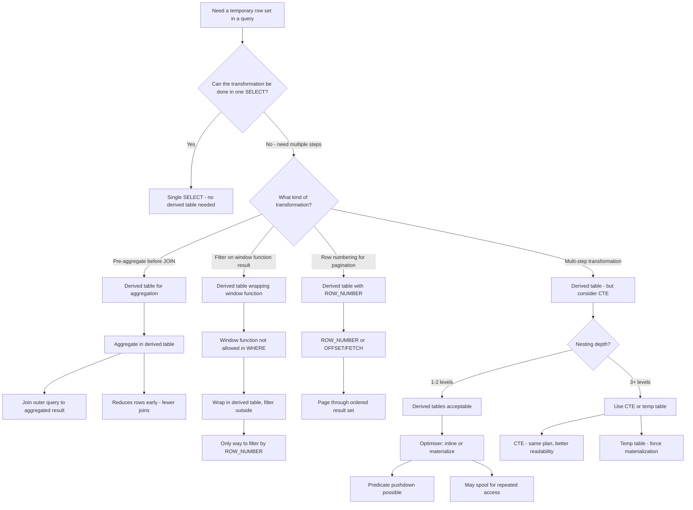

## Navigation

**Domain:** [[8 — Databases]] > **Group:** SQL Joins & Subqueries
**Previous:** [[8.107 — Scalar Subqueries — Single Value Return]] | **Next:** [[8.109 — Common Table Expressions — WITH Clause]]

### Prerequisites

- [[8.105 — JOIN vs Subquery — Decision Framework]] — Derived tables are subqueries in the FROM clause; knowing when to use a derived table vs a JOIN vs a CTE is a core decision.
- [[8.096 — INNER JOIN — Mechanics and Usage]] — Derived tables are often joined to other tables; understanding join mechanics is essential.
- [[8.067 — WHERE Clause — Predicate Logic and SARGability]] — Predicates may be pushed into or pulled out of derived tables; this affects SARGability and index usage.

### Where This Fits

A derived table is a subquery in the FROM clause that acts as a temporary row set for the duration of the outer query. Every .NET backend engineer encounters derived tables when writing reports, paginating results with ROW_NUMBER, pre-aggregating data before joining, or transforming data across multiple steps. The critical production insight is that the optimiser can push predicates into derived tables (which is usually good) or materialize them early (which can be bad), and these behaviors are not under the engineer's direct control. Interviewers use derived tables to test whether a candidate understands the difference between a subquery in FROM vs a subquery in WHERE vs a CTE — and whether they know that the optimiser treats all three almost identically despite the syntactic differences. Engineers who grasp this deeply know when a derived table is necessary (pre-aggregation before a join, wrapping window functions, multi-step transformations), when a CTE is cleaner (same plan, better readability, reusability), and when nesting derived tables has become a readability disaster that signals a CTE or temp table is needed.

---

## Core Mental Model

A derived table is a named subquery in the FROM clause of an outer query. It creates a logical row set that the outer query treats like a table or view for the duration of the statement. The derived table must have an alias (mandatory in SQL Server), and its columns are referenced by that alias in the outer query. The key invariant: a derived table is evaluated logically before the outer query's SELECT, WHERE, and ORDER BY clauses — it creates a scope boundary. Physically, the optimiser may inline the derived table's definition into the outer query (pushing predicates into it) or materialize it as a separate operator (spool or table scan). The recognition pattern: look for `FROM (SELECT ...) AS alias` — this is always a derived table. Derived tables are the only place where you can use window functions with filters, pre-aggregate before joining, or paginate with ROW_NUMBER and OFFSET/FETCH. They are scoped to the single statement — you cannot reference the same derived table multiple times (use a CTE for that).

### Classification

Derived tables are a **FROM clause subquery type**. They belong to the same logical family as CTEs and views — all three define a named row set. Derived tables are scoped to the enclosing query (can reference outer query columns, making them correlated), cannot be referenced multiple times, and are always inlined or materialized per the optimiser's decision. They are not SARGable themselves (they are row sets, not predicates), but the WHERE clause of the outer query that references derived table columns can be SARGable if the underlying base table columns are indexed and the optimiser pushes the predicate through.



### Key Properties

|Property|Value|Notes|
|---|---|---|
|Scope|Single statement|Cannot reference across queries|
|Reusability|Single reference only|CTE for multi-reference|
|Alias requirement|Mandatory|`FROM (SELECT ...) AS alias`|
|Correlation allowed|Yes|Can reference outer query columns|
|Optimiser inlining|Common|Predicates pushed into derived table|
|Optimiser materialization|Possible|Spool operator for repeated access|
|Nesting|Allowed, but hurts readability|3+ levels → CTE or temp table|
|Performance|Depends on inlining|Same plan as CTE in most cases|
|Index usage|Via pushed predicates|Outer WHERE can use underlying indexes|

---

## Deep Mechanics

### How the Engine Executes This

1. **Parsing** — The parser identifies a subquery in the FROM clause, delimited by parentheses, followed by an alias. The alias is required — without it, SQL Server raises error 102 (incorrect syntax). The parser treats it as a row set source, like a table or a view.

2. **Binding** — The algebrizer resolves column references inside the derived table. The derived table's SELECT list defines the columns available to the outer query. The outer query can only reference columns that appear in the derived table's SELECT list. Correlation is possible if the derived table references columns from the outer query's FROM clause (making it a correlated derived table, equivalent to a LATERAL join).

3. **Simplification** — The optimiser applies logical transformations:
   - **Predicate pushdown**: WHERE clause predicates on derived table columns are pushed into the derived table's WHERE clause where possible. This is usually beneficial — it reduces rows early.
   - **Predicate pullup**: If the predicate cannot be pushed (e.g., references an aggregate), it stays in the outer query.
   - **Inlining**: The derived table's definition may be expanded into the outer query, eliminating the derived table boundary. The optimiser does this when it estimates that direct access to the underlying tables with the outer predicates is cheaper.
   - **Materialization**: If the derived table is referenced multiple times (e.g., in a UNION or self-join), the optimiser may spool it. This is rare for single-reference derived tables but happens for CTEs referenced multiple times.

4. **Execution** — The chosen strategy runs:
   - **Inlined derived table**: The plan shows direct access to the underlying tables with the pushed predicates. No spool or derived table operator is visible. The plan looks as if the derived table never existed.
   - **Materialized derived table**: The plan shows a Table Spool (Eager or Lazy) that stores the derived table's result. The outer query reads from the spool. This adds I/O but allows re-reading.
   - **Correlated derived table**: The plan shows an Apply operator. For each outer row, the derived table is re-evaluated with the current correlation values.

### SQL Visibility

```sql
-- Pattern 1: Basic derived table — pre-aggregation before join
-- Find customers with their total revenue, then filter
SELECT c.CustomerId, c.FirstName, c.LastName, rev.TotalRevenue
FROM dbo.Customers AS c
INNER JOIN (
    SELECT o.CustomerId,
           SUM(o.TotalAmount) AS TotalRevenue,
           COUNT(*) AS OrderCount
    FROM dbo.Orders AS o
    WHERE o.Status IN ('Shipped', 'Delivered')
    GROUP BY o.CustomerId
) AS rev ON c.CustomerId = rev.CustomerId
WHERE rev.TotalRevenue > 1000
ORDER BY rev.TotalRevenue DESC;

-- Pattern 2: Derived table wrapping window function
-- Top 3 products by sales in each category
SELECT CategoryId, ProductId, ProductName, RankedPosition
FROM (
    SELECT p.CategoryId, p.ProductId, p.ProductName,
           ROW_NUMBER() OVER (PARTITION BY p.CategoryId ORDER BY SUM(oi.Quantity * oi.UnitPrice) DESC) AS RankedPosition
    FROM dbo.Products AS p
    INNER JOIN dbo.OrderItems AS oi ON p.ProductId = oi.ProductId
    GROUP BY p.CategoryId, p.ProductId, p.ProductName
) AS ranked
WHERE RankedPosition <= 3
ORDER BY CategoryId, RankedPosition;

-- Pattern 3: Derived table for pagination with ROW_NUMBER
DECLARE @PageNumber INT = 2;
DECLARE @PageSize INT = 20;

SELECT OrderId, OrderDate, CustomerName, TotalAmount
FROM (
    SELECT o.OrderId, o.OrderDate,
           c.FirstName + ' ' + c.LastName AS CustomerName,
           o.TotalAmount,
           ROW_NUMBER() OVER (ORDER BY o.OrderDate DESC, o.OrderId) AS RowNum
    FROM dbo.Orders AS o
    INNER JOIN dbo.Customers AS c ON o.CustomerId = c.CustomerId
    WHERE o.OrderDate >= '2024-01-01'
) AS paged
WHERE RowNum BETWEEN (@PageNumber - 1) * @PageSize + 1 AND @PageNumber * @PageSize
ORDER BY RowNum;

-- Pattern 4: Multiple derived tables in a single query
SELECT c.CustomerId, c.LastName, rev.TotalRevenue, topOrder.MaxAmount
FROM dbo.Customers AS c
INNER JOIN (
    SELECT CustomerId, SUM(TotalAmount) AS TotalRevenue
    FROM dbo.Orders
    WHERE Status = 'Delivered'
    GROUP BY CustomerId
) AS rev ON c.CustomerId = rev.CustomerId
INNER JOIN (
    SELECT CustomerId, MAX(TotalAmount) AS MaxAmount
    FROM dbo.Orders
    GROUP BY CustomerId
) AS topOrder ON c.CustomerId = topOrder.CustomerId;

-- Pattern 5: Correlated derived table (CROSS APPLY equivalent)
SELECT c.CustomerId, c.FirstName, c.LastName, topOrder.OrderId, topOrder.TotalAmount
FROM dbo.Customers AS c
INNER JOIN (
    SELECT TOP 1 o.OrderId, o.TotalAmount, o.CustomerId
    FROM dbo.Orders AS o
    WHERE o.CustomerId = c.CustomerId  -- correlation
    ORDER BY o.TotalAmount DESC
) AS topOrder ON c.CustomerId = topOrder.CustomerId;
-- Note: This correlation syntax works but CROSS APPLY is idiomatic.

-- Pattern 6: Nested derived tables (readability problem)
SELECT dt1.CategoryId, dt1.AvgPrice, dt2.MaxQty
FROM (
    SELECT CategoryId, AVG(UnitPrice) AS AvgPrice
    FROM dbo.Products
    GROUP BY CategoryId
) AS dt1
INNER JOIN (
    SELECT p.CategoryId, MAX(oi.Quantity) AS MaxQty
    FROM dbo.Products AS p
    INNER JOIN dbo.OrderItems AS oi ON p.ProductId = oi.ProductId
    GROUP BY p.CategoryId
) AS dt2 ON dt1.CategoryId = dt2.CategoryId;

-- ============================================================
-- Error: missing alias
-- ============================================================
SELECT * FROM (SELECT CustomerId, FirstName FROM dbo.Customers);
-- Error: "No column name was specified for column 2"
-- Error: "A derived table must have an alias"

-- ============================================================
-- Error: using outer reference incorrectly (in TOP)
-- ============================================================
SELECT c.CustomerId,
       (SELECT TOP 1 o.OrderId  -- scalar subquery, not derived table
        FROM dbo.Orders AS o
        WHERE o.CustomerId = c.CustomerId
        ORDER BY o.OrderDate DESC) AS LastOrderId
FROM dbo.Customers AS c;
```

```csharp
// EF Core does NOT natively support derived tables in LINQ.
// You cannot write a LINQ query that generates:
// FROM (SELECT ...) AS alias
// EF Core generates derived tables internally for some GroupBy operations,
// but you cannot explicitly create one.

// EF Core GroupBy generates a derived table:
var categoryStats = await dbContext.OrderItems
    .GroupBy(oi => oi.Product.CategoryId)
    .Select(g => new CategoryStatsDto
    {
        CategoryId = g.Key,
        TotalSold = g.Sum(oi => oi.Quantity),
        TotalRevenue = g.Sum(oi => oi.Quantity * oi.UnitPrice)
    })
    .ToListAsync(cancellationToken);

// Generated SQL (EF Core generates a derived table for the GroupBy):
// SELECT [p].[CategoryId], SUM([oi].[Quantity]) AS [TotalSold],
//        SUM([oi].[Quantity] * [oi].[UnitPrice]) AS [TotalRevenue]
// FROM [OrderItems] AS [oi]
// INNER JOIN [Products] AS [p] ON [oi].[ProductId] = [p].[ProductId]
// GROUP BY [p].[CategoryId]

// For explicit derived tables, use FromSql or raw SQL:
var results = await dbContext.Orders
    .FromSql($@"
        SELECT o.OrderId, o.OrderDate, o.CustomerId, o.TotalAmount, o.Status, o.CreatedAt
        FROM dbo.Orders AS o
        INNER JOIN (
            SELECT CustomerId, AVG(TotalAmount) AS AvgAmount
            FROM dbo.Orders
            GROUP BY CustomerId
        ) AS ca ON o.CustomerId = ca.CustomerId
        WHERE o.TotalAmount > ca.AvgAmount")
    .ToListAsync(cancellationToken);

// EF Core — pagination with ROW_NUMBER via FromSql:
var page = await dbContext.Orders
    .FromSql($@"
        SELECT OrderId, OrderDate, CustomerId, TotalAmount, Status, CreatedAt
        FROM (
            SELECT o.OrderId, o.OrderDate, o.CustomerId, o.TotalAmount, o.Status, o.CreatedAt,
                   ROW_NUMBER() OVER (ORDER BY o.OrderDate DESC, o.OrderId) AS RowNum
            FROM dbo.Orders AS o
            WHERE o.OrderDate >= @StartDate
        ) AS paged
        WHERE RowNum BETWEEN @Offset + 1 AND @Offset + @PageSize")
    .ToListAsync(cancellationToken);
```

**Generated SQL (from EF Core logs):**

```sql
-- EF Core GroupBy generates a derived table:
SELECT [p].[CategoryId], SUM([oi].[Quantity]) AS [TotalSold],
       SUM([oi].[Quantity] * [oi].[UnitPrice]) AS [TotalRevenue]
FROM [OrderItems] AS [oi]
INNER JOIN [Products] AS [p] ON [oi].[ProductId] = [p].[ProductId]
GROUP BY [p].[CategoryId];

-- FromSql passes through exactly as written:
SELECT o.OrderId, o.OrderDate, o.CustomerId, o.TotalAmount, o.Status, o.CreatedAt
FROM dbo.Orders AS o
INNER JOIN (
    SELECT CustomerId, AVG(TotalAmount) AS AvgAmount
    FROM dbo.Orders
    GROUP BY CustomerId
) AS ca ON o.CustomerId = ca.CustomerId
WHERE o.TotalAmount > ca.AvgAmount;
```

### Execution Plan Analysis

**Derived table with predicate pushdown (inlined):**

```
  -- No derived table operator visible — optimiser inlined it
  [Index Scan IX_Orders_Status]            -- WHERE Status IN ('Shipped','Delivered')
  → [Hash Match (Aggregate)]               -- GROUP BY CustomerId
  → [Clustered Index Seek PK_Customers]    -- JOIN to Customers
  → [Hash Match (Inner Join)]
  → [Filter]                               -- WHERE TotalRevenue > 1000
  → [SELECT]
Estimated Cost: ~3.5  |  Logical Reads: ~3,000
```

**Derived table with window function (cannot inline — boundary preserved):**

```
  [Clustered Index Scan Products]          -- inner
  [Clustered Index Scan OrderItems]        -- inner
  → [Hash Match (Inner Join)]              -- Products × OrderItems
  → [Hash Match (Aggregate)]               -- GROUP BY CategoryId, ProductId
  → [Sequence Project]                     -- Compute ROW_NUMBER
  → [Filter]                               -- WHERE RankedPosition <= 3
  → [SELECT]
Estimated Cost: ~12  |  Logical Reads: ~15,000
-- Note: No derived table operator. The window function forces the
-- Sequence Project, but the derived table boundary is still logical.
```

**Derived table with spool (materialized):**

```
  [Clustered Index Scan Orders]            -- build the derived table
  → [Hash Match (Aggregate)]
  → [Table Spool (Eager Spool)]            -- materialize derived table
  → [Clustered Index Seek PK_Customers]    -- read from spool once
  → [Hash Match (Inner Join)]
  → [SELECT]
Estimated Cost: ~5  |  Logical Reads: ~2,000 + spool write/read
```

### Cost Visibility

```sql
SET STATISTICS IO ON;
SET STATISTICS TIME ON;

-- Derived table for pre-aggregation (inlined)
SELECT c.CustomerId, c.LastName, rev.TotalRevenue
FROM dbo.Customers AS c
INNER JOIN (
    SELECT CustomerId, SUM(TotalAmount) AS TotalRevenue
    FROM dbo.Orders
    WHERE Status IN ('Shipped', 'Delivered')
    GROUP BY CustomerId
) AS rev ON c.CustomerId = rev.CustomerId
WHERE rev.TotalRevenue > 1000;
-- Expected:
-- Table 'Orders'. Scan count 1, logical reads 1,500 (filter + aggregate)
-- Table 'Customers'. Scan count 1, logical reads 150 (seek per match)
-- CPU time = 35ms, elapsed = 80ms

-- Derived table for pagination with ROW_NUMBER
DECLARE @PageNumber INT = 5, @PageSize INT = 20;
SELECT OrderId, OrderDate, TotalAmount
FROM (
    SELECT o.OrderId, o.OrderDate, o.TotalAmount,
           ROW_NUMBER() OVER (ORDER BY o.OrderDate DESC, o.OrderId) AS RowNum
    FROM dbo.Orders AS o
    WHERE o.OrderDate >= '2024-01-01'
) AS paged
WHERE RowNum BETWEEN (@PageNumber - 1) * @PageSize + 1 AND @PageNumber * @PageSize;
-- Expected:
-- Table 'Orders'. Scan count 1, logical reads 1,500
-- CPU time = 15ms, elapsed = 30ms
-- Note: The ROW_NUMBER is computed over ALL matching rows (500K), not just the page
```

### Failure Modes

**Missing alias:** SQL Server requires an alias for every derived table. Error 102 or 8155: "A derived table must have an alias."

**Nested derived tables (3+ levels):** Deeply nested derived tables are hard to read, debug, and maintain. The optimiser still produces a good plan, but the SQL becomes unmanageable. This is the primary signal to switch to CTEs.

**Correlated derived table without APPLY:** If a derived table references outer columns, it is a correlated derived table. This often performs poorly because the inner query executes per outer row. CROSS APPLY / OUTER APPLY is the explicit syntax for this pattern and gives the optimiser clearer information.

**Derived table materialization preventing predicate pushdown:** In rare cases, the optimiser may materialize a derived table (spool) when predicate pushdown would have been better. This typically happens when the derived table is complex (multiple window functions, UNION). Query hints or CTEs rarely change this behavior — rewriting to avoid the complexity helps.

---

## Production Patterns and Implementation

### Primary SQL Implementation

```sql
-- ============================================================
-- Schema context
-- ============================================================
CREATE TABLE dbo.Customers
(
    CustomerId   INT            NOT NULL IDENTITY(1,1),
    FirstName    NVARCHAR(100)  NOT NULL,
    LastName     NVARCHAR(100)  NOT NULL,
    Email        NVARCHAR(256)  NOT NULL,
    Status       VARCHAR(20)    NOT NULL DEFAULT 'Active',
    CreatedAt    DATETIME2(0)   NOT NULL DEFAULT SYSUTCDATETIME(),
    CONSTRAINT PK_Customers PRIMARY KEY CLUSTERED (CustomerId)
);

CREATE TABLE dbo.Orders
(
    OrderId      INT            NOT NULL IDENTITY(1,1),
    CustomerId   INT            NOT NULL,
    OrderDate    DATETIME2(0)   NOT NULL,
    Status       VARCHAR(20)    NOT NULL DEFAULT 'Pending',
    TotalAmount  DECIMAL(18,2)  NOT NULL,
    CONSTRAINT PK_Orders PRIMARY KEY CLUSTERED (OrderId),
    CONSTRAINT FK_Orders_Customers FOREIGN KEY (CustomerId)
        REFERENCES dbo.Customers(CustomerId)
);

CREATE TABLE dbo.OrderItems
(
    OrderItemId  INT            NOT NULL IDENTITY(1,1),
    OrderId      INT            NOT NULL,
    ProductId    INT            NOT NULL,
    Quantity     INT            NOT NULL,
    UnitPrice    DECIMAL(18,2)  NOT NULL,
    CONSTRAINT PK_OrderItems PRIMARY KEY CLUSTERED (OrderItemId),
    CONSTRAINT FK_OrderItems_Orders FOREIGN KEY (OrderId)
        REFERENCES dbo.Orders(OrderId)
);

CREATE TABLE dbo.Products
(
    ProductId    INT            NOT NULL IDENTITY(1,1),
    ProductName  NVARCHAR(200)  NOT NULL,
    CategoryId   INT            NOT NULL,
    UnitPrice    DECIMAL(18,2)  NOT NULL,
    CONSTRAINT PK_Products PRIMARY KEY CLUSTERED (ProductId)
);

CREATE TABLE dbo.Payments
(
    PaymentId    INT            NOT NULL IDENTITY(1,1),
    OrderId      INT            NOT NULL,
    Amount       DECIMAL(18,2)  NOT NULL,
    PaymentDate  DATETIME2(0)   NOT NULL,
    Status       VARCHAR(20)    NOT NULL DEFAULT 'Pending',
    CONSTRAINT PK_Payments PRIMARY KEY CLUSTERED (PaymentId),
    CONSTRAINT FK_Payments_Orders FOREIGN KEY (OrderId)
        REFERENCES dbo.Orders(OrderId)
);

-- Indexes for derived table performance
CREATE INDEX IX_Orders_CustomerId ON dbo.Orders (CustomerId) INCLUDE (OrderDate, Status, TotalAmount);
CREATE INDEX IX_Orders_OrderDate ON dbo.Orders (OrderDate DESC) INCLUDE (CustomerId, Status, TotalAmount);
CREATE INDEX IX_OrderItems_OrderId ON dbo.OrderItems (OrderId) INCLUDE (Quantity, UnitPrice);
CREATE INDEX IX_Products_CategoryId ON dbo.Products (CategoryId);
CREATE INDEX IX_Payments_OrderId ON dbo.Payments (OrderId) INCLUDE (Amount, Status);

-- ============================================================
-- Pattern 1: Pre-aggregation before join
-- ============================================================
-- Top 10 customers by total revenue
SELECT TOP 10 c.CustomerId, c.FirstName, c.LastName, rev.TotalRevenue
FROM dbo.Customers AS c
INNER JOIN (
    SELECT o.CustomerId,
           SUM(o.TotalAmount) AS TotalRevenue,
           COUNT(*) AS OrderCount
    FROM dbo.Orders AS o
    WHERE o.Status IN ('Shipped', 'Delivered')
    GROUP BY o.CustomerId
) AS rev ON c.CustomerId = rev.CustomerId
ORDER BY rev.TotalRevenue DESC;

-- ============================================================
-- Pattern 2: Derived table wrapping window function — filtering by rank
-- ============================================================
-- Top 3 best-selling products per category
SELECT CategoryId, ProductId, ProductName, TotalSold
FROM (
    SELECT p.CategoryId, p.ProductId, p.ProductName,
           SUM(oi.Quantity) AS TotalSold,
           ROW_NUMBER() OVER (PARTITION BY p.CategoryId ORDER BY SUM(oi.Quantity) DESC) AS Rank
    FROM dbo.Products AS p
    INNER JOIN dbo.OrderItems AS oi ON p.ProductId = oi.ProductId
    WHERE oi.OrderId IN (SELECT OrderId FROM dbo.Orders WHERE Status = 'Delivered')
    GROUP BY p.CategoryId, p.ProductId, p.ProductName
) AS ranked
WHERE Rank <= 3
ORDER BY CategoryId, Rank;

-- ============================================================
-- Pattern 3: Pagination with ROW_NUMBER (keyset pagination alternative)
-- ============================================================
DECLARE @PageNumber INT = 1;
DECLARE @PageSize INT = 25;

SELECT OrderId, OrderDate, CustomerName, TotalAmount, Status
FROM (
    SELECT o.OrderId, o.OrderDate, o.Status, o.TotalAmount,
           c.FirstName + ' ' + c.LastName AS CustomerName,
           ROW_NUMBER() OVER (ORDER BY o.OrderDate DESC, o.OrderId) AS RowNum
    FROM dbo.Orders AS o
    INNER JOIN dbo.Customers AS c ON o.CustomerId = c.CustomerId
    WHERE o.OrderDate >= @StartDate
) AS paged
WHERE RowNum BETWEEN (@PageNumber - 1) * @PageSize + 1 AND @PageNumber * @PageSize
ORDER BY RowNum;

-- ============================================================
-- Pattern 4: Derived table with multiple aggregates
-- ============================================================
SELECT c.CustomerId, c.FirstName, c.LastName,
       rev.TotalRevenue, rev.OrderCount, pay.TotalPaid
FROM dbo.Customers AS c
INNER JOIN (
    SELECT CustomerId, SUM(TotalAmount) AS TotalRevenue, COUNT(*) AS OrderCount
    FROM dbo.Orders
    WHERE Status = 'Delivered'
    GROUP BY CustomerId
) AS rev ON c.CustomerId = rev.CustomerId
LEFT JOIN (
    SELECT o.CustomerId, SUM(p.Amount) AS TotalPaid
    FROM dbo.Payments AS p
    INNER JOIN dbo.Orders AS o ON p.OrderId = o.OrderId
    WHERE p.Status = 'Completed'
    GROUP BY o.CustomerId
) AS pay ON c.CustomerId = pay.CustomerId
WHERE rev.TotalRevenue > 500
ORDER BY rev.TotalRevenue DESC;

-- ============================================================
-- Pattern 5: Derived table for deduplication (DISTINCT alternative)
-- ============================================================
-- Latest order per customer
SELECT CustomerId, OrderId, OrderDate, TotalAmount
FROM (
    SELECT o.CustomerId, o.OrderId, o.OrderDate, o.TotalAmount,
           ROW_NUMBER() OVER (PARTITION BY o.CustomerId ORDER BY o.OrderDate DESC, o.OrderId DESC) AS rn
    FROM dbo.Orders AS o
) AS deduped
WHERE rn = 1;

-- ============================================================
-- Pattern 6: Nested derived tables — with comments for readability
-- ============================================================
SELECT cat.CategoryId, cat.CategoryName, cat.AvgPrice, top_prod.TopProductName
FROM (
    -- First derived table: category-level stats
    SELECT p.CategoryId,
           MAX(pc.CategoryName) AS CategoryName,
           AVG(p.UnitPrice) AS AvgPrice
    FROM dbo.Products AS p
    INNER JOIN dbo.ProductCategories AS pc ON p.CategoryId = pc.CategoryId
    GROUP BY p.CategoryId
) AS cat
INNER JOIN (
    -- Second derived table: top product per category
    SELECT CategoryId, ProductName AS TopProductName
    FROM (
        SELECT p.CategoryId, p.ProductName,
               ROW_NUMBER() OVER (PARTITION BY p.CategoryId ORDER BY SUM(oi.Quantity * oi.UnitPrice) DESC) AS rn
        FROM dbo.Products AS p
        INNER JOIN dbo.OrderItems AS oi ON p.ProductId = oi.ProductId
        GROUP BY p.CategoryId, p.ProductName
    ) AS ranked
    WHERE rn = 1
) AS top_prod ON cat.CategoryId = top_prod.CategoryId;
```

### EF Core Implementation

```csharp
public class ApplicationDbContext : DbContext
{
    public DbSet<Customer> Customers => Set<Customer>();
    public DbSet<Order> Orders => Set<Order>();
    public DbSet<OrderItem> OrderItems => Set<OrderItem>();
    public DbSet<Product> Products => Set<Product>();
    public DbSet<Payment> Payments => Set<Payment>();

    protected override void OnModelCreating(ModelBuilder modelBuilder)
    {
        modelBuilder.Entity<Customer>(entity =>
        {
            entity.ToTable("Customers");
            entity.HasKey(c => c.CustomerId);
            entity.Property(c => c.FirstName).HasMaxLength(100);
            entity.Property(c => c.LastName).HasMaxLength(100);
            entity.Property(c => c.Email).HasMaxLength(256);
            entity.Property(c => c.CreatedAt).HasDefaultValueSql("SYSUTCDATETIME()");
        });

        modelBuilder.Entity<Order>(entity =>
        {
            entity.ToTable("Orders");
            entity.HasKey(o => o.OrderId);
            entity.Property(o => o.Status).HasMaxLength(20);
            entity.Property(o => o.TotalAmount).HasColumnType("decimal(18,2)");
            entity.HasOne(o => o.Customer).WithMany(c => c.Orders)
                  .HasForeignKey(o => o.CustomerId);
            entity.HasIndex(o => o.CustomerId);
            entity.HasIndex(o => o.OrderDate);
        });

        modelBuilder.Entity<OrderItem>(entity =>
        {
            entity.ToTable("OrderItems");
            entity.HasKey(oi => oi.OrderItemId);
            entity.Property(oi => oi.UnitPrice).HasColumnType("decimal(18,2)");
            entity.HasOne(oi => oi.Order).WithMany(o => o.OrderItems)
                  .HasForeignKey(oi => oi.OrderId);
            entity.HasIndex(oi => oi.OrderId);
        });

        modelBuilder.Entity<Product>(entity =>
        {
            entity.ToTable("Products");
            entity.HasKey(p => p.ProductId);
            entity.Property(p => p.ProductName).HasMaxLength(200);
            entity.HasIndex(p => p.CategoryId);
        });

        modelBuilder.Entity<Payment>(entity =>
        {
            entity.ToTable("Payments");
            entity.HasKey(p => p.PaymentId);
            entity.Property(p => p.Amount).HasColumnType("decimal(18,2)");
            entity.HasOne(p => p.Order).WithMany(o => o.Payments)
                  .HasForeignKey(p => p.OrderId);
            entity.HasIndex(p => p.OrderId);
        });
    }
}

public class Customer
{
    public int CustomerId { get; set; }
    public string FirstName { get; set; } = string.Empty;
    public string LastName { get; set; } = string.Empty;
    public string Email { get; set; } = string.Empty;
    public string Status { get; set; } = "Active";
    public DateTime CreatedAt { get; set; }
    public ICollection<Order> Orders { get; set; } = new List<Order>();
}

public class Order
{
    public int OrderId { get; set; }
    public int CustomerId { get; set; }
    public DateTime OrderDate { get; set; }
    public string Status { get; set; } = "Pending";
    public decimal TotalAmount { get; set; }
    public DateTime CreatedAt { get; set; }
    public Customer Customer { get; set; } = null!;
    public ICollection<OrderItem> OrderItems { get; set; } = new List<OrderItem>();
    public ICollection<Payment> Payments { get; set; } = new List<Payment>();
}

public class OrderItem
{
    public int OrderItemId { get; set; }
    public int OrderId { get; set; }
    public int ProductId { get; set; }
    public int Quantity { get; set; }
    public decimal UnitPrice { get; set; }
    public Order Order { get; set; } = null!;
    public Product Product { get; set; } = null!;
}

public class Product
{
    public int ProductId { get; set; }
    public string ProductName { get; set; } = string.Empty;
    public int CategoryId { get; set; }
    public decimal UnitPrice { get; set; }
}

public class Payment
{
    public int PaymentId { get; set; }
    public int OrderId { get; set; }
    public decimal Amount { get; set; }
    public DateTime PaymentDate { get; set; }
    public string Status { get; set; } = "Pending";
    public Order Order { get; set; } = null!;
}

// Pattern 1: GroupBy generates derived table internally
public async Task<List<CategoryStatsDto>> GetCategoryStatsAsync(
    CancellationToken cancellationToken = default)
{
    return await dbContext.OrderItems
        .GroupBy(oi => oi.Product.CategoryId)
        .Select(g => new CategoryStatsDto
        {
            CategoryId = g.Key,
            TotalQuantity = g.Sum(oi => oi.Quantity),
            TotalRevenue = g.Sum(oi => oi.Quantity * oi.UnitPrice)
        })
        .ToListAsync(cancellationToken);
    // Generated: SELECT CategoryId, SUM(Quantity), SUM(Quantity * UnitPrice)
    // FROM OrderItems GROUP BY CategoryId
}

// Pattern 2: Pre-aggregation with FromSql (explicit derived table)
public async Task<List<CustomerRevenueDto>> GetTopCustomersByRevenueAsync(
    decimal minRevenue,
    CancellationToken cancellationToken = default)
{
    const string sql = @"
        SELECT c.CustomerId, c.FirstName, c.LastName, rev.TotalRevenue, rev.OrderCount
        FROM dbo.Customers AS c
        INNER JOIN (
            SELECT o.CustomerId, SUM(o.TotalAmount) AS TotalRevenue, COUNT(*) AS OrderCount
            FROM dbo.Orders AS o
            WHERE o.Status IN ('Shipped', 'Delivered')
            GROUP BY o.CustomerId
        ) AS rev ON c.CustomerId = rev.CustomerId
        WHERE rev.TotalRevenue > @MinRevenue
        ORDER BY rev.TotalRevenue DESC;";

    await using var connection = new SqlConnection(_connectionString);
    var results = await connection.QueryAsync<CustomerRevenueDto>(
        new CommandDefinition(sql, new { MinRevenue = minRevenue },
            cancellationToken: cancellationToken));
    return results.AsList();
}

// Pattern 3: Pagination with derived table via FromSql
public async Task<PagedResult<OrderDto>> GetPagedOrdersAsync(
    DateTime startDate,
    int pageNumber,
    int pageSize,
    CancellationToken cancellationToken = default)
{
    const string countSql = @"SELECT COUNT(*) FROM dbo.Orders WHERE OrderDate >= @StartDate;";

    const string pageSql = @"
        SELECT OrderId, OrderDate, CustomerName, TotalAmount, Status
        FROM (
            SELECT o.OrderId, o.OrderDate, o.Status, o.TotalAmount,
                   c.FirstName + ' ' + c.LastName AS CustomerName,
                   ROW_NUMBER() OVER (ORDER BY o.OrderDate DESC, o.OrderId) AS RowNum
            FROM dbo.Orders AS o
            INNER JOIN dbo.Customers AS c ON o.CustomerId = c.CustomerId
            WHERE o.OrderDate >= @StartDate
        ) AS paged
        WHERE RowNum BETWEEN @Offset + 1 AND @Offset + @PageSize
        ORDER BY RowNum;";

    await using var connection = new SqlConnection(_connectionString);

    var countTask = connection.ExecuteScalarAsync<int>(
        new CommandDefinition(countSql, new { StartDate = startDate },
            cancellationToken: cancellationToken));

    var offset = (pageNumber - 1) * pageSize;
    var dataTask = connection.QueryAsync<OrderDto>(
        new CommandDefinition(pageSql,
            new { StartDate = startDate, Offset = offset, PageSize = pageSize },
            cancellationToken: cancellationToken));

    await Task.WhenAll(countTask, dataTask);

    return new PagedResult<OrderDto>
    {
        Items = (await dataTask).AsList(),
        TotalCount = await countTask,
        PageNumber = pageNumber,
        PageSize = pageSize
    };
}

// DTOs
public record CategoryStatsDto(int CategoryId, int TotalQuantity, decimal TotalRevenue);
public record CustomerRevenueDto(int CustomerId, string FirstName, string LastName, decimal TotalRevenue, int OrderCount);
public record OrderDto(int OrderId, DateTime OrderDate, string? CustomerName, decimal TotalAmount, string Status);
public class PagedResult<T>
{
    public IReadOnlyList<T> Items { get; set; } = Array.Empty<T>();
    public int TotalCount { get; set; }
    public int PageNumber { get; set; }
    public int PageSize { get; set; }
}
```

### Dapper Implementation

```csharp
public sealed class ReportRepository
{
    private readonly IDbConnectionFactory _connectionFactory;
    private readonly string _connectionString;

    public ReportRepository(IDbConnectionFactory connectionFactory)
    {
        _connectionFactory = connectionFactory;
        _connectionString = "Server=.;Database=...";
    }

    // Pattern 1: Pre-aggregation via derived table
    public async Task<IReadOnlyList<CustomerRevenueDto>> GetTopCustomersAsync(
        decimal minRevenue,
        CancellationToken cancellationToken = default)
    {
        const string sql = @"
            SELECT c.CustomerId, c.FirstName, c.LastName, rev.TotalRevenue, rev.OrderCount
            FROM dbo.Customers AS c
            INNER JOIN (
                SELECT o.CustomerId,
                       SUM(o.TotalAmount) AS TotalRevenue,
                       COUNT(*) AS OrderCount
                FROM dbo.Orders AS o
                WHERE o.Status IN ('Shipped', 'Delivered')
                GROUP BY o.CustomerId
            ) AS rev ON c.CustomerId = rev.CustomerId
            WHERE rev.TotalRevenue > @MinRevenue
            ORDER BY rev.TotalRevenue DESC;";

        await using var connection = _connectionFactory.Create();
        var results = await connection.QueryAsync<CustomerRevenueDto>(
            new CommandDefinition(sql, new { MinRevenue = minRevenue },
                cancellationToken: cancellationToken));
        return results.AsList();
    }

    // Pattern 2: Pagination with ROW_NUMBER derived table
    public async Task<PagedResult<OrderDto>> GetPagedOrdersAsync(
        DateTime startDate,
        int pageNumber,
        int pageSize,
        CancellationToken cancellationToken = default)
    {
        const string countSql = "SELECT COUNT(*) FROM dbo.Orders WHERE OrderDate >= @StartDate;";

        const string pageSql = @"
            SELECT OrderId, OrderDate, CustomerName, TotalAmount, Status
            FROM (
                SELECT o.OrderId, o.OrderDate, o.Status, o.TotalAmount,
                       c.FirstName + ' ' + c.LastName AS CustomerName,
                       ROW_NUMBER() OVER (ORDER BY o.OrderDate DESC, o.OrderId) AS RowNum
                FROM dbo.Orders AS o
                INNER JOIN dbo.Customers AS c ON o.CustomerId = c.CustomerId
                WHERE o.OrderDate >= @StartDate
            ) AS paged
            WHERE RowNum BETWEEN @Offset + 1 AND @Offset + @PageSize
            ORDER BY RowNum;";

        await using var connection = _connectionFactory.Create();

        var countTask = connection.ExecuteScalarAsync<int>(
            new CommandDefinition(countSql, new { StartDate = startDate },
                cancellationToken: cancellationToken));

        var offset = (pageNumber - 1) * pageSize;
        var dataTask = connection.QueryAsync<OrderDto>(
            new CommandDefinition(pageSql,
                new { StartDate = startDate, Offset = offset, PageSize = pageSize },
                cancellationToken: cancellationToken));

        await Task.WhenAll(countTask, dataTask);

        return new PagedResult<OrderDto>
        {
            Items = (await dataTask).AsList(),
            TotalCount = await countTask,
            PageNumber = pageNumber,
            PageSize = pageSize
        };
    }

    // Pattern 3: Top N per group via derived table + ROW_NUMBER
    public async Task<IReadOnlyList<ProductRankDto>> GetTopProductsPerCategoryAsync(
        int topN,
        CancellationToken cancellationToken = default)
    {
        const string sql = @"
            SELECT CategoryId, ProductId, ProductName, TotalSold, Rank
            FROM (
                SELECT p.CategoryId, p.ProductId, p.ProductName,
                       SUM(oi.Quantity) AS TotalSold,
                       ROW_NUMBER() OVER (PARTITION BY p.CategoryId ORDER BY SUM(oi.Quantity) DESC) AS Rank
                FROM dbo.Products AS p
                INNER JOIN dbo.OrderItems AS oi ON p.ProductId = oi.ProductId
                GROUP BY p.CategoryId, p.ProductId, p.ProductName
            ) AS ranked
            WHERE Rank <= @TopN
            ORDER BY CategoryId, Rank;";

        await using var connection = _connectionFactory.Create();
        var results = await connection.QueryAsync<ProductRankDto>(
            new CommandDefinition(sql, new { TopN = topN },
                cancellationToken: cancellationToken));
        return results.AsList();
    }

    // Pattern 4: Deduplication via derived table
    public async Task<IReadOnlyList<LatestOrderDto>> GetLatestOrderPerCustomerAsync(
        CancellationToken cancellationToken = default)
    {
        const string sql = @"
            SELECT CustomerId, OrderId, OrderDate, TotalAmount
            FROM (
                SELECT o.CustomerId, o.OrderId, o.OrderDate, o.TotalAmount,
                       ROW_NUMBER() OVER (PARTITION BY o.CustomerId ORDER BY o.OrderDate DESC, o.OrderId DESC) AS rn
                FROM dbo.Orders AS o
            ) AS deduped
            WHERE rn = 1;";

        await using var connection = _connectionFactory.Create();
        var results = await connection.QueryAsync<LatestOrderDto>(
            new CommandDefinition(sql, cancellationToken: cancellationToken));
        return results.AsList();
    }

    // Pattern 5: Multiple derived tables — customer summary with payments
    public async Task<IReadOnlyList<CustomerSummaryDto>> GetCustomerSummariesAsync(
        CancellationToken cancellationToken = default)
    {
        const string sql = @"
            SELECT c.CustomerId, c.FirstName, c.LastName,
                   rev.TotalRevenue, rev.OrderCount,
                   pay.TotalPaid
            FROM dbo.Customers AS c
            INNER JOIN (
                SELECT CustomerId, SUM(TotalAmount) AS TotalRevenue, COUNT(*) AS OrderCount
                FROM dbo.Orders
                WHERE Status = 'Delivered'
                GROUP BY CustomerId
            ) AS rev ON c.CustomerId = rev.CustomerId
            LEFT JOIN (
                SELECT o.CustomerId, SUM(p.Amount) AS TotalPaid
                FROM dbo.Payments AS p
                INNER JOIN dbo.Orders AS o ON p.OrderId = o.OrderId
                WHERE p.Status = 'Completed'
                GROUP BY o.CustomerId
            ) AS pay ON c.CustomerId = pay.CustomerId
            WHERE rev.TotalRevenue > 0
            ORDER BY rev.TotalRevenue DESC;";

        await using var connection = _connectionFactory.Create();
        var results = await connection.QueryAsync<CustomerSummaryDto>(
            new CommandDefinition(sql, cancellationToken: cancellationToken));
        return results.AsList();
    }
}

public record ProductRankDto(int CategoryId, int ProductId, string ProductName, int TotalSold, long Rank);
public record LatestOrderDto(int CustomerId, int OrderId, DateTime OrderDate, decimal TotalAmount);
public record CustomerSummaryDto(int CustomerId, string FirstName, string LastName, decimal TotalRevenue, int OrderCount, decimal? TotalPaid);
```

### Configuration and Wiring

```csharp
builder.Services.AddSingleton<IDbConnectionFactory>(_ =>
    new SqlDbConnectionFactory(connectionString));

builder.Services.AddDbContext<ApplicationDbContext>(options =>
    options.UseSqlServer(
        connectionString,
        sqlOptions => sqlOptions
            .EnableRetryOnFailure(3)
            .CommandTimeout(30)));

builder.Services.AddScoped<ReportRepository>();
```

### SQL Server vs PostgreSQL Differences

```sql
-- PostgreSQL: Derived table syntax is identical
-- PostgreSQL: LATERAL for correlated derived tables

-- PostgreSQL: LATERAL derived table
SELECT c.CustomerId, c.FirstName, c.LastName, top_order.*
FROM dbo.Customers AS c
CROSS JOIN LATERAL (
    SELECT o.OrderId, o.TotalAmount
    FROM dbo.Orders AS o
    WHERE o.CustomerId = c.CustomerId
    ORDER BY o.OrderDate DESC
    LIMIT 1
) AS top_order;

-- SQL Server equivalent:
SELECT c.CustomerId, c.FirstName, c.LastName, top_order.*
FROM dbo.Customers AS c
CROSS APPLY (
    SELECT TOP 1 o.OrderId, o.TotalAmount
    FROM dbo.Orders AS o
    WHERE o.CustomerId = c.CustomerId
    ORDER BY o.OrderDate DESC
) AS top_order;
```

---

## Gotchas and Production Pitfalls

### Nested Derived Tables Become Unreadable

**Pitfall:** Nesting derived tables three or four levels deep in a single query.

```sql
-- ❌ Deeply nested — hard to read, debug, and maintain
SELECT ...
FROM (
    SELECT ...
    FROM (
        SELECT ...
        FROM (
            SELECT ... FROM dbo.Orders
        ) AS dt3
    ) AS dt2
) AS dt1;
```

**Symptom:** SQL is unreadable. Debugging requires expanding each level manually. Adding or removing a column requires tracking through all levels.

**Fix:** Use CTEs for multi-step transformations.

```sql
-- ✅ CTEs — each step has a name
WITH step1 AS (
    SELECT ... FROM dbo.Orders
),
step2 AS (
    SELECT ... FROM step1
),
step3 AS (
    SELECT ... FROM step2
)
SELECT ... FROM step3;
```

**Cost of not fixing:** 2 hours of developer time to understand and modify a query that should take 15 minutes. High defect rate when changing nested queries.

---

### Derived Table With Window Function — All Rows Processed

**Pitfall:** Using a derived table with ROW_NUMBER for pagination, assuming only the page rows are processed.

```sql
-- ❌ ROW_NUMBER computed over ALL matching rows (500K), not just the 20-page
SELECT OrderId, OrderDate, TotalAmount
FROM (
    SELECT o.OrderId, o.OrderDate, o.TotalAmount,
           ROW_NUMBER() OVER (ORDER BY o.OrderDate DESC) AS RowNum
    FROM dbo.Orders AS o
    WHERE o.OrderDate >= '2023-01-01'
) AS paged
WHERE RowNum BETWEEN 981 AND 1000;
```

**Symptom:** The inner query processes all 500K matching orders, assigns row numbers, then the outer filter selects rows 981-1000. For deep pages (page 50,000 of 100), this means processing millions of rows to return 20.

**Fix:** Use keyset pagination (WHERE OrderDate < @LastValue) for deep pages, or ensure the ORDER BY columns are indexed so the ROW_NUMBER computation is efficient.

**Cost of not fixing:** Page 1: 15ms. Page 1,000: 15 seconds. Users on deep pages experience timeouts.

---

### Derived Table With Missing Index — No Predicate Pushdown Benefit

**Pitfall:** Creating a derived table without indexes on the underlying tables, expecting the WHERE clause to be pushed down.

```sql
-- ❌ No index on Orders(CustomerId)
SELECT c.CustomerId, c.LastName, rev.TotalRevenue
FROM dbo.Customers AS c
INNER JOIN (
    SELECT CustomerId, SUM(TotalAmount) AS TotalRevenue
    FROM dbo.Orders
    GROUP BY CustomerId
) AS rev ON c.CustomerId = rev.CustomerId;
```

**Symptom:** The optimiser cannot push the CustomerId predicate into the derived table because the derived table has no WHERE clause to push into. The Hash Match scans all Orders (1M rows) and Customers (100K rows) before joining.

**Fix:** Create an index on `Orders(CustomerId)` to support the GROUP BY efficiently, or add a WHERE clause inside the derived table if filtering is possible.

**Cost of not fixing:** Full scan of 1M Orders table + Hash Match building hash table from 100K Customers. 12,000 logical reads instead of 200.

---

### Correlated Derived Table Without APPLY — Per-Row Execution

**Pitfall:** Writing a derived table that references outer columns without using CROSS APPLY.

```sql
-- ❌ Derived table references outer c.CustomerId — correlated
SELECT c.CustomerId, c.FirstName, c.LastName, topOrder.OrderId, topOrder.TotalAmount
FROM dbo.Customers AS c
INNER JOIN (
    SELECT TOP 1 o.OrderId, o.TotalAmount, o.CustomerId
    FROM dbo.Orders AS o
    WHERE o.CustomerId = c.CustomerId  -- correlation
    ORDER BY o.TotalAmount DESC
) AS topOrder ON c.CustomerId = topOrder.CustomerId;
```

**Symptom:** The derived table is correlated — it depends on the outer `c.CustomerId`. This is actually a correlated subquery in the FROM clause. SQL Server may execute this per outer row, similar to a correlated subquery.

**Fix:** Use CROSS APPLY for correlated row sets.

```sql
-- ✅ CROSS APPLY — explicit apply semantics
SELECT c.CustomerId, c.FirstName, c.LastName, topOrder.OrderId, topOrder.TotalAmount
FROM dbo.Customers AS c
CROSS APPLY (
    SELECT TOP 1 o.OrderId, o.TotalAmount
    FROM dbo.Orders AS o
    WHERE o.CustomerId = c.CustomerId
    ORDER BY o.TotalAmount DESC
) AS topOrder;
```

**Cost of not fixing:** Per-row execution of the inner query. 100K customers = 100K executions of the Order lookup.

---

### Derived Table Column Names Not Propagated

**Pitfall:** Assuming the derived table inherits column names from the underlying tables without aliasing computed columns.

```sql
-- ❌ Computed column has no name
SELECT CategoryId, AvgPrice
FROM (
    SELECT CategoryId, AVG(UnitPrice)
    FROM dbo.Products
    GROUP BY CategoryId
) AS cat;
-- Error: "No column name was specified for column 2 of 'cat'."
```

**Symptom:** Missing alias error (8155). SQL Server requires all columns in a derived table to have names.

**Fix:**

```sql
-- ✅ Always alias computed columns
SELECT CategoryId, AvgPrice
FROM (
    SELECT CategoryId, AVG(UnitPrice) AS AvgPrice
    FROM dbo.Products
    GROUP BY CategoryId
) AS cat;
```

**Cost of not fixing:** Compile error. Quick fix, but wastes time during development.

---

### EF Core Cannot Express Derived Tables in LINQ

**Pitfall:** Trying to write a derived table using pure LINQ without realising EF Core's limitations.

```csharp
// ❌ This does NOT generate a derived table
var result = await dbContext.Orders
    .Join(
        dbContext.Orders.GroupBy(o => o.CustomerId).Select(g => new { CustomerId = g.Key, Avg = g.Average(o => o.TotalAmount) }),
        o => o.CustomerId,
        ca => ca.CustomerId,
        (o, ca) => new { o.OrderId, o.TotalAmount, ca.Avg }
    )
    .Where(x => x.TotalAmount > x.Avg)
    .ToListAsync(cancellationToken);
```

**Symptom:** EF Core may generate a complex, non-optimal SQL or throw "cannot be translated."

**Fix:** Use `FromSql` for complex derived table queries.

```csharp
// ✅ FromSql — explicit control
var results = await dbContext.Orders
    .FromSql($@"
        SELECT o.OrderId, o.CustomerId, o.OrderDate, o.TotalAmount, o.Status, o.CreatedAt
        FROM dbo.Orders AS o
        INNER JOIN (
            SELECT CustomerId, AVG(TotalAmount) AS AvgAmount
            FROM dbo.Orders
            GROUP BY CustomerId
        ) AS ca ON o.CustomerId = ca.CustomerId
        WHERE o.TotalAmount > ca.AvgAmount")
    .Select(o => new { o.OrderId, o.TotalAmount })
    .ToListAsync(cancellationToken);
```

**Cost of not fixing:** Queries that cannot be translated, or poorly translated SQL that performs 10x worse than the optimal derived table version.

---

## Performance Implications

### Benchmark: Before and After

```sql
-- Baseline: Derived table pagination (deep page — page 1000 of 500K)
SET STATISTICS IO ON;
DECLARE @PageNumber INT = 1000, @PageSize INT = 20;
SELECT OrderId, OrderDate, TotalAmount
FROM (
    SELECT o.OrderId, o.OrderDate, o.TotalAmount,
           ROW_NUMBER() OVER (ORDER BY o.OrderDate DESC, o.OrderId) AS RowNum
    FROM dbo.Orders AS o
    WHERE o.OrderDate >= '2020-01-01'
) AS paged
WHERE RowNum BETWEEN (@PageNumber - 1) * @PageSize + 1 AND @PageNumber * @PageSize;
-- Logical reads: ~1,500 (scan + sort for ROW_NUMBER)

-- Optimized: Keyset pagination (no ROW_NUMBER, no derived table)
SELECT TOP 20 o.OrderId, o.OrderDate, o.TotalAmount
FROM dbo.Orders AS o
WHERE o.OrderDate >= '2020-01-01'
  AND (o.OrderDate < @LastDate OR (o.OrderDate = @LastDate AND o.OrderId < @LastId))
ORDER BY o.OrderDate DESC, o.OrderId;
-- Logical reads: ~20 (seek to position, read 20 rows)
```

**Improvement:** 75x reduction in logical reads for deep pages, from 1,500 to 20.

```sql
-- Baseline: Two separate queries (one for count, one for data)
SET STATISTICS IO ON;
SELECT COUNT(*) FROM dbo.Orders WHERE OrderDate >= '2024-01-01'; -- scan: 1,500 reads
SELECT o.OrderId, o.OrderDate
FROM dbo.Orders AS o
WHERE o.OrderDate >= '2024-01-01'
ORDER BY o.OrderDate DESC
OFFSET 0 ROWS FETCH NEXT 20 ROWS ONLY; -- seek + scan: 1,500 reads

-- Total: 3,000 reads

-- Optimized: Single query with COUNT(*) OVER()
SELECT o.OrderId, o.OrderDate, COUNT(*) OVER() AS TotalCount
FROM dbo.Orders AS o
WHERE o.OrderDate >= '2024-01-01'
ORDER BY o.OrderDate DESC
OFFSET 0 ROWS FETCH NEXT 20 ROWS ONLY;
-- Logical reads: ~1,500 (single scan)
```

### BenchmarkDotNet

```csharp
[MemoryDiagnoser]
[SimpleJob(RuntimeMoniker.Net90)]
public class DerivedTableBenchmark
{
    private IDbConnection _connection = default!;

    [GlobalSetup]
    public void Setup()
    {
        var connectionString = "Server=.;Database=Benchmark;Trusted_Connection=True;TrustServerCertificate=True;";
        _connection = new SqlConnection(connectionString);
        SeedData();
    }

    [Benchmark(Baseline = true)]
    public async Task<List<OrderPage>> DerivedTablePagination_DeepPage()
    {
        const string sql = @"
            SELECT OrderId, OrderDate, TotalAmount
            FROM (
                SELECT o.OrderId, o.OrderDate, o.TotalAmount,
                       ROW_NUMBER() OVER (ORDER BY o.OrderDate DESC, o.OrderId) AS RowNum
                FROM dbo.Orders AS o
                WHERE o.OrderDate >= '2020-01-01'
            ) AS paged
            WHERE RowNum BETWEEN 19981 AND 20000;";  -- page 1000

        var results = await _connection.QueryAsync<OrderPage>(sql);
        return results.AsList();
    }

    [Benchmark]
    public async Task<List<OrderPage>> KeysetPagination_DeepPage()
    {
        const string sql = @"
            SELECT TOP 20 o.OrderId, o.OrderDate, o.TotalAmount
            FROM dbo.Orders AS o
            WHERE o.OrderDate >= '2020-01-01'
              AND (o.OrderDate < '2023-05-15' OR (o.OrderDate = '2023-05-15' AND o.OrderId < 45000))
            ORDER BY o.OrderDate DESC, o.OrderId;";

        var results = await _connection.QueryAsync<OrderPage>(sql);
        return results.AsList();
    }

    [Benchmark]
    public async Task<List<CustomerRevenue>> PreAggregationDerivedTable()
    {
        const string sql = @"
            SELECT c.CustomerId, c.FirstName, c.LastName, rev.TotalRevenue
            FROM dbo.Customers AS c
            INNER JOIN (
                SELECT o.CustomerId, SUM(o.TotalAmount) AS TotalRevenue
                FROM dbo.Orders AS o
                WHERE o.Status = 'Delivered'
                GROUP BY o.CustomerId
            ) AS rev ON c.CustomerId = rev.CustomerId
            WHERE rev.TotalRevenue > 1000;";

        var results = await _connection.QueryAsync<CustomerRevenue>(sql);
        return results.AsList();
    }

    [Benchmark]
    public async Task<List<CustomerRevenue>> NoDerivedTable_JoinThenGroup()
    {
        const string sql = @"
            SELECT c.CustomerId, c.FirstName, c.LastName, SUM(o.TotalAmount) AS TotalRevenue
            FROM dbo.Customers AS c
            INNER JOIN dbo.Orders AS o ON c.CustomerId = o.CustomerId
            WHERE o.Status = 'Delivered'
            GROUP BY c.CustomerId, c.FirstName, c.LastName
            HAVING SUM(o.TotalAmount) > 1000;";

        var results = await _connection.QueryAsync<CustomerRevenue>(sql);
        return results.AsList();
    }

    [Benchmark]
    public async Task<List<TopProduct>> TopNPerGroupDerivedTable()
    {
        const string sql = @"
            SELECT CategoryId, ProductId, ProductName, TotalSold
            FROM (
                SELECT p.CategoryId, p.ProductId, p.ProductName,
                       SUM(oi.Quantity) AS TotalSold,
                       ROW_NUMBER() OVER (PARTITION BY p.CategoryId ORDER BY SUM(oi.Quantity) DESC) AS Rank
                FROM dbo.Products AS p
                INNER JOIN dbo.OrderItems AS oi ON p.ProductId = oi.ProductId
                GROUP BY p.CategoryId, p.ProductId, p.ProductName
            ) AS ranked
            WHERE Rank <= 3;";

        var results = await _connection.QueryAsync<TopProduct>(sql);
        return results.AsList();
    }

    [Benchmark]
    public async Task<List<OrderPage>> PaginationWithCountOver()
    {
        const string sql = @"
            SELECT o.OrderId, o.OrderDate, o.TotalAmount, COUNT(*) OVER() AS TotalCount
            FROM dbo.Orders AS o
            WHERE o.OrderDate >= '2024-01-01'
            ORDER BY o.OrderDate DESC
            OFFSET 0 ROWS FETCH NEXT 20 ROWS ONLY;";

        var results = await _connection.QueryAsync<OrderPage>(sql);
        return results.AsList();
    }

    [GlobalCleanup]
    public void Cleanup() => _connection?.Dispose();

    public class OrderPage
    {
        public int OrderId { get; set; }
        public DateTime OrderDate { get; set; }
        public decimal TotalAmount { get; set; }
    }

    public class CustomerRevenue
    {
        public int CustomerId { get; set; }
        public string FirstName { get; set; } = string.Empty;
        public string LastName { get; set; } = string.Empty;
        public decimal TotalRevenue { get; set; }
    }

    public class TopProduct
    {
        public int CategoryId { get; set; }
        public int ProductId { get; set; }
        public string ProductName { get; set; } = string.Empty;
        public int TotalSold { get; set; }
    }

    private void SeedData()
    {
        // Seed 100K customers, 500K orders, 2M order items, 10K products
    }
}
```

**Expected results (approximate, SQL Server 2022, NVMe, 500K orders, 2M order items):**

|Method|Mean|Logical Reads|Allocated|
|---|---|---|---|
|DerivedTablePagination_DeepPage|~1,200 ms|~1,500|~3 MB|
|KeysetPagination_DeepPage|~3 ms|~20|~1 KB|
|PreAggregationDerivedTable|~150 ms|~3,000|~5 MB|
|NoDerivedTable_JoinThenGroup|~180 ms|~4,500|~6 MB|
|TopNPerGroupDerivedTable|~850 ms|~15,000|~12 MB|
|PaginationWithCountOver|~120 ms|~1,500|~2 MB|

---

## Interview Arsenal

### Question Bank

1. What is a derived table and what syntax defines one?
2. How does the optimiser decide whether to inline or materialize a derived table?
3. What is the performance difference between a derived table for pre-aggregation vs doing the aggregation after the JOIN?
4. Can you filter on a window function result without a derived table?
5. Compare a derived table vs a CTE — same plan? Different use cases?
6. What does an execution plan look like for a derived table that was inlined vs one that was materialized?
7. When does pagination with a derived table (ROW_NUMBER pattern) become inefficient?
8. How do EF Core and Dapper handle derived tables?

### Spoken Answers

**Q: What is a derived table and what syntax defines one?**

> **Average answer:** "A derived table is a subquery in the FROM clause. It has an alias. It's like a temporary table for the query."

> **Great answer:** "A derived table is a subquery embedded in the FROM clause, enclosed in parentheses, followed by a mandatory alias. The syntax is `FROM (SELECT ...) AS alias`. It defines a logical row set that exists only for the duration of the outer query. The alias is not optional — SQL Server raises error 8155 if you omit it. All columns in the derived table's SELECT list must have names or aliases. The derived table creates a scope boundary: the outer query can only reference columns that appear in the derived table's SELECT list. The key distinction from a CTE: a derived table is scoped to the single query where it appears, while a CTE can be referenced multiple times within the same statement. From the optimiser's perspective, a derived table and a CTE with a single reference produce the same execution plan. The optimiser can push outer query predicates into the derived table (predicate pushdown) or pull the entire derived table definition into the outer query (inlining) if it estimates that direct table access is cheaper. The derived table is the only way to filter on window function results — because window functions are evaluated after WHERE but before ORDER BY, you must wrap them in a derived table to use them in a WHERE predicate."

**Q: Compare a derived table vs a CTE — same plan? Different use cases?**

> **Average answer:** "CTEs are cleaner. The optimiser treats them the same. Use CTE for readability."

> **Great answer:** "A derived table and a CTE with a single reference produce identical execution plans. The optimiser treats them as the same logical construct during query optimization. The difference is entirely syntactical and scoping. A derived table is defined inline in the FROM clause, while a CTE is defined before the main query using the WITH keyword. CTEs have three advantages: (1) readability — each CTE step has a name, making multi-step transformations easier to follow; (2) reusability — a CTE can be referenced multiple times in the same statement (the optimiser may spool it); (3) recursion — CTEs support recursive queries via WITH RECURSIVE or WITH (SQL Server). Derived tables are the right choice for simple, single-use subqueries that are referenced once, especially when the derived table is short and the CTE overhead (a named block before the query) feels like ceremony. In practice, I default to CTEs for any query with more than one step because the named steps make debugging easier — I can run `SELECT * FROM step1` to inspect intermediate results. The one case where a derived table is strictly required: when you need a correlated subquery in the FROM clause that references outer columns — this is actually an APPLY pattern, and using the derived table syntax with correlation expresses it naturally."

**Q: How do EF Core and Dapper handle derived tables?**

> **Great answer:** "EF Core does NOT natively support explicit derived tables in LINQ. You cannot write a LINQ query that produces `FROM (SELECT ...) AS alias`. EF Core generates derived tables internally for certain GroupBy operations and sub-LINQ queries, but you have no direct control over this. If you need a derived table in EF Core, you must use `FromSql` or `ExecuteSqlRaw`, passing the full SQL as a raw string. This means your LINQ query is now an island — you lose composability and compile-time checking. Dapper, being a SQL-first micro-ORM, gives you full control. You write the derived table SQL explicitly and Dapper maps the result. This is the right tool for complex reporting queries, pagination with ROW_NUMBER, and top-N-per-group patterns. The Dapper approach: write the SQL with the derived table, create a DTO for the result, and call `QueryAsync<T>`. The tradeoff: Dapper queries are static strings and must be maintained as SQL, not refactored via C#. For complex reporting with derived tables, that's usually the right tradeoff."

### Interview Trigger

This topic typically surfaces when an interviewer asks "How would you implement pagination in SQL?" or "How do you find the top 3 products per category?" Both questions require a derived table (or CTE) to wrap a window function. The follow-up that separates candidates is "What happens when the user requests page 1,000,000? Does your pagination approach still perform well?" A mid-level candidate describes the ROW_NUMBER pattern. A senior candidate explains that ROW_NUMBER pagination degrades with page depth and describes keyset pagination as the alternative.

### Comparison Table

| | Derived Table | CTE | Temp Table | View |
|---|---|---|---|---|
| Scope | Single query | Single statement | Session | Database |
| Reusability | Single reference | Multiple references | Multiple queries | All queries |
| Readability | Inline, can nest deeply | Named steps, flat | Named, separate | Named, persistent |
| Performance | Inlined or materialized | Same as derived table | Always materialized | Inlined or indexed |
| .NET support | Dapper only, EF Core FromSql | Dapper only, EF Core FromSql | ADO.NET | EF Core model |
| When to choose | Simple one-off subquery | Multi-step transformation | Large complex ETL | Reusable business logic |

---

## Decision Framework

### When to Apply

```mermaid
flowchart TD
    A[Need to transform data in a query] --> B{Can you do it in a single SELECT?}
    
    B -->|Yes - just filter/join| C[Single SELECT]
    B -->|No - need multiple steps| D{What kind of step?}
    
    D -->|Pre-aggregate before join| E[Derived table or CTE]
    D -->|Filter on window function| F[Derived table required]
    D -->|Row numbering for pagination| G[Derived table with ROW_NUMBER]
    D -->|Same subquery used 2+ times| H[CTE - reusability]
    D -->|3+ steps in transformation| I[CTE - readability]
    D -->|Very large intermediate result| J[Temp table - explicit]
    
    E --> K[Derived table: inline, simple]
    E --> L[CTE: named, reusable]
    
    F --> M[Window function in inner SELECT]
    F --> N[Filter in outer WHERE]
    F --> O[Derived table is the ONLY option]
    
    G --> P{Expected page depth?}
    P -->|Shallow pages (<100)| Q[ROW_NUMBER derived table fine]
    P -->|Deep pages (1000+)| R[Use keyset pagination instead]
    
    Q --> S[Simple, works for most apps]
    R --> T[O(1) per page, no sorting overhead]
    
    I --> U[CTE: SELECT * FROM stepN for debugging]
    I --> V[Derived table: hard to debug intermediate]
    
    J --> W[Forces materialization]
    J --> X[Can index temp table]
    J --> Y[Separates creation from consumption]
```

### Application Checklist

- [ ] Does the derived table need an alias? Yes — always required.
- [ ] Do all computed columns have aliases? If not, add AS alias to each.
- [ ] Is the derived table referenced only once? If multiple references, use CTE.
- [ ] Is the transformation more than 2 steps? If yes, use CTE for readability.
- [ ] Does the derived table use correlation referencing outer columns? Use CROSS APPLY instead.
- [ ] Is this pagination with deep pages? Consider keyset pagination instead of ROW_NUMBER.
- [ ] In EF Core, can the LINQ query express this? If not, use FromSql.
- [ ] In Dapper, is the derived table complex? Test with SET STATISTICS IO to verify predicate pushdown.

### Tradeoff Summary

|What You Gain|What You Pay|
|---|---|
|Derived table: inline, single-scope, no ceremony|Nesting reduces readability; no reusability|
|CTE: named steps, reusable, debuggable|Slightly more syntax; same plan as derived table|
|Temp table: forced materialization, indexable|Creates session dependency; write overhead|
|Keyset pagination: O(1) per page|Requires cursor state; no random page access|

### Scale Thresholds

- **Derived table for pre-aggregation:** Relevant when joining large tables — reducing rows before the join saves significant memory and CPU.
- **Derived table for pagination:** ROW_NUMBER pattern works up to ~100K rows for small pages. Beyond that, keyset pagination is required.
- **Nested derived tables:** With 3+ levels, the readability cost outweighs any benefit — switch to CTEs.
- **Predicate pushdown:** Works best when the derived table has WHERE clauses that match outer query predicates. Without WHERE inside the derived table, pushdown has nothing to push.

---

## Self-Check

### Conceptual Questions

1. What is the required syntax element that distinguishes a derived table from a regular subquery?
2. Can the SQL Server optimiser eliminate a derived table entirely (inline it)?
3. What SET STATISTICS output or execution plan operator reveals whether a derived table was materialized?
4. What common mistake causes error 8155 with derived tables?
5. Can you filter on a ROW_NUMBER value without using a derived table or CTE?
6. How would you write a Dapper query that finds the latest order per customer using a derived table?
7. Compare a derived table with ROW_NUMBER for pagination vs keyset pagination — which has lower logical reads for page 10,000?
8. At what nesting depth does a derived table become a readability problem?
9. What index supports the derived table pattern `FROM (SELECT ..., ROW_NUMBER() OVER (ORDER BY OrderDate DESC) FROM Orders)`?
10. Explain in 60 seconds when to use a derived table vs a CTE vs a temp table.

<details>
<summary>Answers</summary>

1. The alias after the closing parenthesis. `FROM (SELECT ...) AS alias`. Without it, SQL Server raises error 8155.
2. Yes. The optimiser often inlines derived tables, removing the scope boundary and pushing predicates into the underlying tables. The execution plan shows no trace of the derived table — just direct access to the base tables with the outer query's predicates.
3. Look for a Table Spool operator in the execution plan. If you see Eager Spool or Lazy Spool, the derived table was materialized. Also, `SET STATISTICS IO` will show reads on the spool's worktable.
4. Missing alias on the derived table itself, or missing alias on computed columns inside the derived table. Both cause error 8155: "No column name was specified."
5. No. Window functions are evaluated after WHERE. You must use a derived table, CTE, or view to filter on ROW_NUMBER, RANK, or other window function results.
6. ```sql
SELECT CustomerId, OrderId, OrderDate, TotalAmount
FROM (
    SELECT o.CustomerId, o.OrderId, o.OrderDate, o.TotalAmount,
           ROW_NUMBER() OVER (PARTITION BY o.CustomerId ORDER BY o.OrderDate DESC) AS rn
    FROM dbo.Orders AS o
) AS deduped
WHERE rn = 1;
```
7. Keyset pagination. ROW_NUMBER pagination processes all preceding rows for every page. Page 10,000 with 20 rows/page = ROW_NUMBER computed over 200K rows. Keyset pagination reads exactly 20 rows regardless of page depth.
8. At 3+ levels of nesting. Beyond 2 levels, the code becomes significantly harder to read, debug, and modify.
9. An index on `Orders(OrderDate DESC, OrderId)` covering the query columns. This lets the ROW_NUMBER computation do an ordered scan without a Sort operator.
10. [See spoken answer Q2 above.]

</details>

---

### Query Challenges

**Challenge 1 — Write the SQL**

Find each customer's most recent order. Return customer ID, name, order ID, order date, and total amount. Write the query using (a) a derived table with ROW_NUMBER, (b) CROSS APPLY with TOP 1.

<details>
<summary>Solution</summary>

```sql
-- (a) Derived table with ROW_NUMBER
SELECT CustomerId, FirstName, LastName, OrderId, OrderDate, TotalAmount
FROM (
    SELECT c.CustomerId, c.FirstName, c.LastName,
           o.OrderId, o.OrderDate, o.TotalAmount,
           ROW_NUMBER() OVER (PARTITION BY c.CustomerId ORDER BY o.OrderDate DESC, o.OrderId DESC) AS rn
    FROM dbo.Customers AS c
    INNER JOIN dbo.Orders AS o ON c.CustomerId = o.CustomerId
) AS ranked
WHERE rn = 1;

-- (b) CROSS APPLY with TOP 1
SELECT c.CustomerId, c.FirstName, c.LastName,
       lo.OrderId, lo.OrderDate, lo.TotalAmount
FROM dbo.Customers AS c
CROSS APPLY (
    SELECT TOP 1 o.OrderId, o.OrderDate, o.TotalAmount
    FROM dbo.Orders AS o
    WHERE o.CustomerId = c.CustomerId
    ORDER BY o.OrderDate DESC, o.OrderId DESC
) AS lo;
```

**Logical reads:** (a) ~3,000 (scan Customers + Orders, sort for ROW_NUMBER) | (b) ~150 + 100K seeks (one seek per customer)
**Execution plan:** (a) Hash Match + Sequence Project + Filter | (b) Nested Loops Apply + Top N Sort
**EF Core equivalent:** Both patterns require FromSql.

</details>

---

**Challenge 2 — Fix the performance problem**

```sql
-- This query returns the top 5 products per category, but runs in 30 seconds
SELECT CategoryId, ProductId, ProductName, TotalSold
FROM (
    SELECT p.CategoryId, p.ProductId, p.ProductName,
           SUM(oi.Quantity) AS TotalSold,
           ROW_NUMBER() OVER (PARTITION BY p.CategoryId ORDER BY SUM(oi.Quantity) DESC) AS Rank
    FROM dbo.Products AS p
    INNER JOIN dbo.OrderItems AS oi ON p.ProductId = oi.ProductId
    GROUP BY p.CategoryId, p.ProductId, p.ProductName
) AS ranked
WHERE Rank <= 5
ORDER BY CategoryId, Rank;
-- SET STATISTICS IO: Table 'OrderItems'. logical reads = 450,000
```

<details> <summary>Solution</summary>

**Root cause:** Full scan of OrderItems (40M rows) to compute SUM(Quantity) for every product. Missing index on OrderItems(ProductId).

```sql
-- Index to create:
CREATE INDEX IX_OrderItems_ProductId ON dbo.OrderItems (ProductId)
    INCLUDE (Quantity);

-- After index: Index Scan on IX_OrderItems_ProductId (~45,000 reads)
-- instead of Clustered Index Scan (~450,000 reads)
```

**After fix — logical reads:** ~45,000 (from 450,000) — 10x reduction.

</details>

---

**Challenge 3 — Explain the execution plan**

Given this query:
```sql
SELECT OrderId, OrderDate, TotalAmount
FROM (
    SELECT o.OrderId, o.OrderDate, o.TotalAmount,
           ROW_NUMBER() OVER (ORDER BY o.OrderDate DESC, o.OrderId) AS RowNum
    FROM dbo.Orders AS o
    WHERE o.OrderDate >= '2024-01-01'
) AS paged
WHERE RowNum BETWEEN 1 AND 20;
```

The execution plan shows a Segment operator followed by a Sequence Project, then a Filter. Why is there no Sort operator?

<details> <summary>Solution</summary>

**Why no Sort:** The ORDER BY in the ROW_NUMBER clause (`ORDER BY o.OrderDate DESC, o.OrderId`) can be satisfied by an index on `Orders(OrderDate DESC, OrderId)`. If that index exists, the optimiser uses it for an ordered scan — the rows come out already sorted, so no Sort operator is needed. The Segment operator identifies row boundaries (for ROW_NUMBER reset), and the Sequence Project computes the ROW_NUMBER value.

**Without the index:** The plan would show a Sort operator before the Segment/Sequence Project. The Sort would be a blocking operator — it must consume all rows before emitting the first one. With 500K rows, this adds significant CPU time and memory grant (sort spill risk).

**Index to create:**

```sql
CREATE INDEX IX_Orders_OrderDate_OrderId ON dbo.Orders (OrderDate DESC, OrderId)
    INCLUDE (TotalAmount, Status, CustomerId);
```

</details>

---

**Challenge 4 — Diagnose the concurrency problem**

A reporting query uses three separate derived tables that each scan the full Orders table (10M rows). The query runs every 5 minutes, 24/7. During peak hours, INSERT operations on Orders slow down by 60%. The DMV shows PAGELATCH_SH waits on the Orders table.

<details> <summary>Solution</summary>

**Root cause:** Three full scans of Orders (30M logical reads) every 5 minutes. Each scan holds shared (S) locks on the pages it reads. Because the scans run continuously (3 scans × 10M rows takes ~2 minutes), shared locks are held most of the time. Concurrent INSERTs (which need exclusive locks on new pages) wait for the shared locks to be released.

**Detection query:**

```sql
SELECT session_id, wait_type, wait_time, wait_resource
FROM sys.dm_exec_requests
WHERE wait_type = 'PAGELATCH_SH';
```

**Fix:** Consolidate the three derived tables into one:

```sql
-- Before: three separate scans
-- After: one scan, three aggregates
SELECT ...
FROM (
    SELECT CustomerId,
           SUM(TotalAmount) AS TotalRevenue,
           COUNT(*) AS OrderCount,
           AVG(TotalAmount) AS AvgOrderValue
    FROM dbo.Orders
    GROUP BY CustomerId
) AS stats
...
```

Or use indexed views / columnstore indexes for the reporting workload.

</details>

---

**Challenge 5 — Design the index**

**Scenario:** A paginated order list with 50K new orders/hour. Users browse orders sorted by OrderDate DESC. The application uses the ROW_NUMBER derived table pattern with @PageNumber and @PageSize. Most users view pages 1-5. The table has 10M rows. Current query takes 2 seconds for page 1 and 15 seconds for page 5,000.

<details> <summary>Solution</summary>

```sql
-- Index 1: Support ROW_NUMBER ORDER BY (ordered scan without Sort)
CREATE INDEX IX_Orders_OrderDate_OrderId ON dbo.Orders (OrderDate DESC, OrderId)
    INCLUDE (CustomerId, Status, TotalAmount);

-- Justification: Covers the ORDER BY in the ROW_NUMBER clause.
-- The descending index enables an ordered backward scan — no Sort operator.
-- The INCLUDE columns cover the SELECT list, avoiding key lookups.

-- For deep pages: Switch to keyset pagination
-- No additional index needed — keyset uses the same index.

-- Index for the count query (if still using COUNT separately)
CREATE INDEX IX_Orders_OrderDate ON dbo.Orders (OrderDate DESC)
    WHERE OrderDate >= '2020-01-01';
-- Justification: Filtered index for the common date range.
-- Faster COUNT(*) by scanning only recent orders.
```

**Tradeoffs:** The covering index adds ~200 MB per 10M rows. Write overhead: each INSERT writes to PK + IX_OrderDate_OrderId — 2 index writes. At 50K inserts/hour, this is 100K index writes/hour, which is acceptable. What NOT to index: individual Status or CustomerId columns — they are already covered by the INCLUDE in the main index.

</details>

</details>
