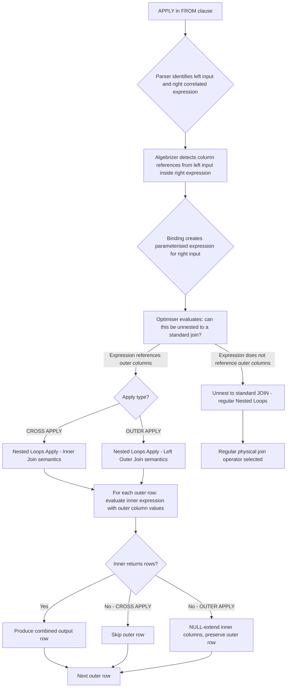

## Navigation

**Domain:** [[8 — Databases]] > **Group:** SQL Joins & Subqueries
**Previous:** [[8.108 — Complex Correlated Subqueries and Unnesting]] | **Next:** [[8.110 — CROSS APPLY for Row-by-Row Processing]]

### Prerequisites

- [[8.096 — INNER JOIN — Mechanics and Usage]] — Understanding Nested Loops join mechanics is essential because APPLY is conceptually a Nested Loops join with a correlated inner input.
- [[8.097 — LEFT OUTER JOIN — Preserving Left Side Rows]] — OUTER APPLY is the APPLY equivalent of LEFT JOIN; understanding NULL preservation semantics is required.
- [[8.089 — Aliases — Table and Column Aliasing]] — Correlation names in the APPLY inner query reference outer table columns; proper aliasing is mandatory for correctness.

### Where This Fits

APPLY is the SQL Server (and T-SQL) implementation of the SQL standard LATERAL join — it executes a table-valued expression (a subquery, a TVF, or a VALUES constructor) once per row from the outer table, allowing the inner expression to reference columns from the outer row. The critical difference from a regular JOIN is that a regular JOIN cannot reference the other input's columns inside its own right-side definition — APPLY can, because the inner expression is evaluated for each outer row. A .NET backend engineer encounters APPLY whenever EF Core's `SelectMany` with a correlated subquery generates a `CROSS APPLY`, or when implementing complex per-row calculations, top-N-per-group queries, or table-valued function calls in Dapper. The most expensive mistake is treating APPLY as a general-purpose JOIN replacement: APPLY driven from a large outer table without an index on the inner side forces an index seek per outer row, which at millions of outer rows becomes catastrophic. Interviewers use APPLY to separate engineers who understand execution plan operators (the Nested Loops Apply operator) from those who only understand APPLY syntax. The core insight: APPLY is a Nested Loops join where the inner input is re-evaluated per outer row with access to outer columns — this is both its power and its performance trap.

---

## Core Mental Model

APPLY is a row-by-row operator: for each row from the left (outer) input, the right (inner) expression is evaluated with that row's column values available as parameters. CROSS APPLY only returns rows where the inner expression returns at least one row (like INNER JOIN). OUTER APPLY always preserves the outer row, NULL-extending the inner columns when the inner expression returns no rows (like LEFT JOIN). The database engine implements APPLY using the Nested Lops Apply logical operator, which is a Nested Loops join where the inner input is a correlated expression. Unlike a regular Nested Loops join (where both inputs are fixed tables), the Apply operator creates a parameterised inner expression, binds outer column values as parameters, and executes the inner expression once per outer row. The optimiser can sometimes "unnest" (decorrelate) the Apply into a standard join when the inner expression does not actually depend on outer columns, but when correlation is present, the Apply plan is forced.

### Classification

APPLY is a `FROM` clause operator (not a join — though it behaves like one). It is the SQL Server implementation of the ANSI SQL `LATERAL` subquery. The ON clause is implicit: for CROSS APPLY, a row is returned if the inner expression returns any rows; for OUTER APPLY, the outer row is always preserved. The inner expression is SARGable when it contains a WHERE clause that filters on the correlated column and that column has an index — the inner side performs an Index Seek per outer row, the same as in Nested Loops joins.



### Key Properties

|Property|Value|Notes|
|---|---|---|
|NULL matching|CROSS: excluded; OUTER: NULL-extended|Like INNER JOIN vs LEFT JOIN|
|Inner expression|Subquery, TVF, VALUES, derived table|Any table-returning expression that can reference outer columns|
|Complexity (indexed)|O(outer × log(inner))|Index Seek per outer row in inner expression|
|Complexity (no index)|O(outer × inner)|Full scan of inner per outer row — catastrophic|
|Commutative|No|Left input must be the outer (row provider)|
|SARGable on inner|Yes (with index on correlated column)|Index Seek per outer row like Nested Loops|
|Write Cost|None|APPLY is read-only|
|ANSI equivalent|LATERAL subquery|PostgreSQL: `INNER JOIN LATERAL` / `LEFT JOIN LATERAL`|

---

## Deep Mechanics

### How the Engine Executes This

1. **Parsing** — The parser identifies the APPLY keyword and separates the FROM clause into a left table source and a right correlated expression. The APPLY keyword is not a join type syntactically but is parsed as a table source operator.

2. **Binding (Algebrizer)** — The algebrizer resolves column references in the right expression. When it encounters a column from the left input inside the right expression, it does NOT flag an error (which it would for a regular JOIN) — instead, it marks the right expression as correlated. A correlation binding is created: the right expression is parameterised with outer column references that must be supplied per row during execution.

3. **Simplification** — The optimiser attempts to "unnest" (decorrelate) the Apply operator:
   - If the right expression does not actually reference any outer columns, the Apply is converted to a standard CROSS JOIN (for CROSS APPLY) or LEFT JOIN (for OUTER APPLY).
   - If the right expression can be rewritten as a join with a GROUP BY or window function, the optimiser may convert it to a standard join plan.
   - For complex correlations (e.g., TOP with ORDER BY referencing outer columns), unnesting is not possible, and the Apply operator is preserved.

4. **Physical operator selection** — The Apply operator always uses a Nested Loops-style execution:
   - **Nested Loops Apply (Inner Join)** for CROSS APPLY: scan the outer input; for each outer row, evaluate the inner expression with the outer column values bound as parameters. If the inner returns any rows, produce output rows. If the inner returns no rows, skip the outer row.
   - **Nested Loops Apply (Left Outer Join)** for OUTER APPLY: same as above, but if the inner returns no rows, produce one output row with NULLs in the inner columns.
   - The inner expression execution may involve its own operators (Index Seek, Table Scan, Sort, Top) — these are repeated for each outer row.

5. **Execution** — The inner expression is compiled as a parameterised sub-plan. For each outer row, the outer column values are substituted as parameters, and the inner sub-plan is executed. This means that any operator in the inner sub-plan (Index Seek, Sort, Top, Stream Aggregate) runs once per outer row. If the outer has 100K rows and the inner does an Index Seek per row, that is 100K seeks — efficient with an index, catastrophic without.

### SQL Visibility

```sql
-- CROSS APPLY: get the latest order per customer
SELECT c.CustomerId, c.FirstName, c.LastName,
       o.OrderId, o.OrderDate, o.TotalAmount
FROM dbo.Customers AS c
CROSS APPLY (
    SELECT TOP 1 o.OrderId, o.OrderDate, o.TotalAmount
    FROM dbo.Orders AS o
    WHERE o.CustomerId = c.CustomerId
    ORDER BY o.OrderDate DESC
) AS o;

-- OUTER APPLY: get latest order, NULL if no orders
SELECT c.CustomerId, c.FirstName, c.LastName,
       o.OrderId, o.OrderDate, o.TotalAmount
FROM dbo.Customers AS c
OUTER APPLY (
    SELECT TOP 1 o.OrderId, o.OrderDate, o.TotalAmount
    FROM dbo.Orders AS o
    WHERE o.CustomerId = c.CustomerId
    ORDER BY o.OrderDate DESC
) AS o;

-- CROSS APPLY with table-valued function
SELECT c.CustomerId, c.FirstName, c.LastName,
       s.OrderId, s.OrderDate, s.TotalAmount
FROM dbo.Customers AS c
CROSS APPLY dbo.GetCustomerOrders(c.CustomerId, @Limit) AS s;

-- CROSS APPLY with VALUES (inline row constructor)
SELECT c.CustomerId, c.FirstName, c.LastName,
       v.Rank, v.Description
FROM dbo.Customers AS c
CROSS APPLY (
    VALUES
        (1, 'Primary'),
        (2, 'Secondary')
) AS v(Rank, Description);

-- CROSS APPLY with derived table for complex per-row calculation
SELECT c.CustomerId, c.FirstName, c.LastName,
       calc.TotalSpent, calc.OrderCount, calc.LastOrderDate
FROM dbo.Customers AS c
CROSS APPLY (
    SELECT
        SUM(o.TotalAmount) AS TotalSpent,
        COUNT(*) AS OrderCount,
        MAX(o.OrderDate) AS LastOrderDate
    FROM dbo.Orders AS o
    WHERE o.CustomerId = c.CustomerId
      AND o.Status = 'Delivered'
) AS calc;
```

```csharp
// EF Core SelectMany with correlated subquery (generates CROSS APPLY)
var latestOrders = await dbContext.Customers
    .SelectMany(c => c.Orders
        .Where(o => o.CustomerId == c.CustomerId)
        .OrderByDescending(o => o.OrderDate)
        .Take(1),
        (c, o) => new
        {
            c.CustomerId,
            c.FirstName,
            c.LastName,
            o.OrderId,
            o.OrderDate,
            o.TotalAmount
        })
    .ToListAsync(cancellationToken);

// EF Core SelectMany with DefaultIfEmpty (generates OUTER APPLY)
var latestOrdersOuter = await dbContext.Customers
    .SelectMany(c => c.Orders
        .Where(o => o.CustomerId == c.CustomerId)
        .OrderByDescending(o => o.OrderDate)
        .Take(1)
        .DefaultIfEmpty(),
        (c, o) => new
        {
            c.CustomerId,
            c.FirstName,
            c.LastName,
            OrderId = (int?)o?.OrderId,
            OrderDate = (DateTime?)o?.OrderDate,
            TotalAmount = (decimal?)o?.TotalAmount
        })
    .ToListAsync(cancellationToken);
```

**Generated SQL (from EF Core logs):**

```sql
-- SelectMany with Take(1) generates CROSS APPLY:
SELECT [c].[CustomerId], [c].[FirstName], [c].[LastName],
       [o].[OrderId], [o].[OrderDate], [o].[TotalAmount]
FROM [Customers] AS [c]
CROSS APPLY (
    SELECT TOP(1) [o0].[OrderId], [o0].[OrderDate], [o0].[TotalAmount]
    FROM [Orders] AS [o0]
    WHERE [o0].[CustomerId] = [c].[CustomerId]
    ORDER BY [o0].[OrderDate] DESC
) AS [o];

-- SelectMany with DefaultIfEmpty generates OUTER APPLY:
SELECT [c].[CustomerId], [c].[FirstName], [c].[LastName],
       [o].[OrderId], [o].[OrderDate], [o].[TotalAmount]
FROM [Customers] AS [c]
OUTER APPLY (
    SELECT TOP(1) [o0].[OrderId], [o0].[OrderDate], [o0].[TotalAmount]
    FROM [Orders] AS [o0]
    WHERE [o0].[CustomerId] = [c].[CustomerId]
    ORDER BY [o0].[OrderDate] DESC
) AS [o];
```

### Execution Plan Analysis

**CROSS APPLY with Index Seek in inner query:**

```
  [Clustered Index Scan PK_Customers]          -- outer: 100K rows
  [Index Seek IX_Orders_CustomerId_OrderDate]  -- inner: seek per outer row
      Seek Predicate: CustomerId = Customers.CustomerId
  [Top]                                         -- TOP 1 per outer row
  → [Nested Loops Apply (Inner Join)]
  → [SELECT]
Estimated Cost: ~3.5  |  Logical Reads: ~8 + (100K × 3) = ~300K
```

**CROSS APPLY without index — full inner scan per outer row:**

```
  [Clustered Index Scan PK_Customers]          -- outer: 100K rows
  [Clustered Index Scan PK_Orders]             -- inner: full scan 100 times
      (No seek predicate — no index on CustomerId)
  [Top]
  → [Nested Loops Apply (Inner Join)]
  → [SELECT]
Estimated Cost: ~1,200  |  Logical Reads: ~8 + (100K × 12,000) = catastrophic
```

**OUTER APPLY — same plan shape but with Left Outer Join semantics:**

```
  [Clustered Index Scan PK_Customers]
  [Index Seek IX_Orders_CustomerId_OrderDate]
  [Top]
  → [Nested Loops Apply (Left Outer Join)]
  → [Concatenation]  -- adds NULL row when inner returns nothing
  → [SELECT]
Estimated Cost: ~4.0  |  Logical Reads: ~8 + (100K × 3) = ~300K
```

**Unnested APPLY (when correlation is optimised away):**

```
  [Clustered Index Scan PK_Customers]
  [Clustered Index Scan PK_Orders]
  → [Hash Match (Inner Join)]
  → [Hash Match Aggregate]  -- replaces Top-N logic with window function
  → [SELECT]
```

### Cost Visibility

```sql
SET STATISTICS IO ON;
SET STATISTICS TIME ON;

-- CROSS APPLY with index (top-1 per customer, 100K customers)
SELECT c.CustomerId, o.OrderId, o.OrderDate
FROM dbo.Customers AS c
CROSS APPLY (
    SELECT TOP 1 o.OrderId, o.OrderDate
    FROM dbo.Orders AS o
    WHERE o.CustomerId = c.CustomerId
    ORDER BY o.OrderDate DESC
) AS o;

-- Expected output (with IX_Orders_CustomerId_OrderDate):
-- Table 'Orders'. Scan count 100000, logical reads 320000 (seek per customer)
-- Table 'Customers'. Scan count 1, logical reads 6100 (scan)
-- SQL Server Execution Times: CPU time = 450ms, elapsed time = 520ms

-- OUTER APPLY (same but preserve customers without orders)
SELECT c.CustomerId, o.OrderId, o.OrderDate
FROM dbo.Customers AS c
OUTER APPLY (
    SELECT TOP 1 o.OrderId, o.OrderDate
    FROM dbo.Orders AS o
    WHERE o.CustomerId = c.CustomerId
    ORDER BY o.OrderDate DESC
) AS o;

-- Expected output (slightly more reads due to NULL concatenation):
-- Table 'Orders'. Scan count 100000, logical reads 320000
-- Table 'Customers'. Scan count 1, logical reads 6100
-- SQL Server Execution Times: CPU time = 470ms, elapsed time = 540ms

-- Without index (no IX_Orders_CustomerId) — catastrophic:
-- Table 'Orders'. Scan count 100000, logical reads 1,200,000,000 (full scan per outer)
-- Table 'Customers'. Scan count 1, logical reads 6100
-- SQL Server Execution Times: CPU time = ~45s, elapsed time = ~60s
```

### Failure Modes

**Missing index on correlated column:** This is the single most expensive APPLY failure. Without an index on the inner table's correlated column (e.g., `Orders.CustomerId`), each outer row triggers a full scan of the inner table. For 100K customers and 5M orders, that is 100K full scans of 5M rows — 500 billion logical reads. This will never complete. The execution plan shows an Index Scan (or Table Scan) inside the Apply inner input instead of an Index Seek. Always verify the inner side has an index on the correlated column.

**Applying from an unselective outer input:** If the outer input returns millions of rows, even an indexed APPLY triggers millions of seeks. At 1M outer rows × 3 logical reads per seek = 3M reads. A Hash Match join that scans both tables once might be cheaper. Check the outer cardinality before choosing APPLY over a standard join.

**Correlated subquery that cannot be unnested:** Complex inner expressions (TOP with ORDER BY, window functions, aggregate with multiple grouping levels) prevent the optimiser from unnesting the Apply into a standard join. This is often intentional (that is why you use APPLY) but means the Apply operator is fixed in the plan — no alternative join strategy is available.

---

## Production Patterns and Implementation

### Primary SQL Implementation

```sql
-- ============================================================
-- Schema context
-- ============================================================
CREATE TABLE dbo.Customers
(
    CustomerId   INT            NOT NULL IDENTITY(1,1),
    FirstName    NVARCHAR(100)  NOT NULL,
    LastName     NVARCHAR(100)  NOT NULL,
    Email        NVARCHAR(256)  NOT NULL,
    Status       VARCHAR(20)    NOT NULL DEFAULT 'Active',
    CreatedAt    DATETIME2(0)   NOT NULL DEFAULT SYSUTCDATETIME(),
    CONSTRAINT PK_Customers PRIMARY KEY CLUSTERED (CustomerId)
);

CREATE TABLE dbo.Orders
(
    OrderId      INT            NOT NULL IDENTITY(1,1),
    CustomerId   INT            NOT NULL,
    OrderDate    DATETIME2(0)   NOT NULL,
    Status       VARCHAR(20)    NOT NULL DEFAULT 'Pending',
    TotalAmount  DECIMAL(18,2)  NOT NULL,
    CONSTRAINT PK_Orders PRIMARY KEY CLUSTERED (OrderId)
);

CREATE TABLE dbo.OrderItems
(
    OrderItemId  INT            NOT NULL IDENTITY(1,1),
    OrderId      INT            NOT NULL,
    ProductId    INT            NOT NULL,
    Quantity     INT            NOT NULL,
    UnitPrice    DECIMAL(18,2)  NOT NULL,
    CONSTRAINT PK_OrderItems PRIMARY KEY CLUSTERED (OrderItemId)
);

CREATE TABLE dbo.Products
(
    ProductId    INT            NOT NULL IDENTITY(1,1),
    ProductName  NVARCHAR(200)  NOT NULL,
    CategoryId   INT            NOT NULL,
    CONSTRAINT PK_Products PRIMARY KEY CLUSTERED (ProductId)
);

-- Indexes critical for APPLY performance
CREATE INDEX IX_Orders_CustomerId_OrderDate
    ON dbo.Orders (CustomerId, OrderDate DESC)
    INCLUDE (Status, TotalAmount);

CREATE INDEX IX_OrderItems_OrderId
    ON dbo.OrderItems (OrderId)
    INCLUDE (ProductId, Quantity, UnitPrice);

-- Table-valued function for APPLY demonstration
CREATE FUNCTION dbo.GetLatestOrders
(
    @CustomerId INT,
    @TopN INT = 3
)
RETURNS TABLE
AS
RETURN
    SELECT TOP (@TopN)
        o.OrderId, o.OrderDate, o.Status, o.TotalAmount
    FROM dbo.Orders AS o
    WHERE o.CustomerId = @CustomerId
    ORDER BY o.OrderDate DESC;
GO

-- ============================================================
-- Pattern 1: CROSS APPLY with derived table — top 3 orders per customer
-- ============================================================
SELECT c.CustomerId, c.FirstName, c.LastName,
       o.OrderId, o.OrderDate, o.Status, o.TotalAmount
FROM dbo.Customers AS c
CROSS APPLY (
    SELECT TOP 3 o.OrderId, o.OrderDate, o.Status, o.TotalAmount
    FROM dbo.Orders AS o
    WHERE o.CustomerId = c.CustomerId
    ORDER BY o.OrderDate DESC
) AS o
WHERE c.Status = 'Active'
ORDER BY c.LastName, o.OrderDate DESC;

-- ============================================================
-- Pattern 2: CROSS APPLY with aggregation per row
-- ============================================================
SELECT c.CustomerId, c.FirstName, c.LastName,
       agg.TotalSpent, agg.OrderCount, agg.AvgOrderValue,
       agg.FirstOrderDate, agg.LastOrderDate
FROM dbo.Customers AS c
CROSS APPLY (
    SELECT
        SUM(o.TotalAmount) AS TotalSpent,
        COUNT(*) AS OrderCount,
        AVG(o.TotalAmount) AS AvgOrderValue,
        MIN(o.OrderDate) AS FirstOrderDate,
        MAX(o.OrderDate) AS LastOrderDate
    FROM dbo.Orders AS o
    WHERE o.CustomerId = c.CustomerId
      AND o.Status IN ('Delivered', 'Shipped')
) AS agg
WHERE c.Status = 'Active'
ORDER BY agg.TotalSpent DESC;

-- ============================================================
-- Pattern 3: CROSS APPLY with TVF
-- ============================================================
SELECT c.CustomerId, c.FirstName, c.LastName,
       o.OrderId, o.OrderDate, o.Status, o.TotalAmount
FROM dbo.Customers AS c
CROSS APPLY dbo.GetLatestOrders(c.CustomerId, 5) AS o;

-- ============================================================
-- Pattern 4: OUTER APPLY — latest order, NULL if no orders
-- ============================================================
SELECT c.CustomerId, c.FirstName, c.LastName,
       COALESCE(o.OrderId, -1) AS LastOrderId,
       o.OrderDate AS LastOrderDate,
       COALESCE(o.TotalAmount, 0) AS LastOrderTotal
FROM dbo.Customers AS c
OUTER APPLY (
    SELECT TOP 1 o.OrderId, o.OrderDate, o.TotalAmount
    FROM dbo.Orders AS o
    WHERE o.CustomerId = c.CustomerId
    ORDER BY o.OrderDate DESC
) AS o;

-- ============================================================
-- Pattern 5: CROSS APPLY with VALUES — unpivot / row expansion
-- ============================================================
SELECT c.CustomerId, c.FirstName, c.LastName,
       v.AddressType, v.AddressLine
FROM dbo.Customers AS c
CROSS APPLY (
    VALUES
        ('Home', c.ShippingAddr),
        ('Work', c.WorkAddr)
) AS v(AddressType, AddressLine)
WHERE v.AddressLine IS NOT NULL;

-- ============================================================
-- Pattern 6: Multiple APPLY operators in one query
-- ============================================================
SELECT c.CustomerId, c.FirstName, c.LastName,
       latest.OrderId, latest.OrderDate, latest.TotalAmount,
       agg.TotalSpent, agg.OrderCount
FROM dbo.Customers AS c
CROSS APPLY (
    SELECT TOP 1 o.OrderId, o.OrderDate, o.TotalAmount
    FROM dbo.Orders AS o
    WHERE o.CustomerId = c.CustomerId
    ORDER BY o.OrderDate DESC
) AS latest
CROSS APPLY (
    SELECT
        SUM(o.TotalAmount) AS TotalSpent,
        COUNT(*) AS OrderCount
    FROM dbo.Orders AS o
    WHERE o.CustomerId = c.CustomerId
      AND o.Status = 'Delivered'
) AS agg
WHERE c.Status = 'Active';

-- ============================================================
-- Pattern 7: APPLY as alternative to JOIN + ROW_NUMBER for top-N
-- ============================================================
-- APPLY approach (most efficient for top-N per group)
SELECT c.CustomerId, o.OrderId, o.OrderDate, o.TotalAmount
FROM dbo.Customers AS c
CROSS APPLY (
    SELECT TOP 3 o.OrderId, o.OrderDate, o.TotalAmount
    FROM dbo.Orders AS o
    WHERE o.CustomerId = c.CustomerId
    ORDER BY o.OrderDate DESC
) AS o;

-- Equivalent with ROW_NUMBER() + CTE + JOIN (alternative)
WITH RankedOrders AS
(
    SELECT
        o.OrderId, o.CustomerId, o.OrderDate, o.TotalAmount,
        ROW_NUMBER() OVER (
            PARTITION BY o.CustomerId
            ORDER BY o.OrderDate DESC
        ) AS rn
    FROM dbo.Orders AS o
)
SELECT c.CustomerId, ro.OrderId, ro.OrderDate, ro.TotalAmount
FROM dbo.Customers AS c
INNER JOIN RankedOrders AS ro
    ON c.CustomerId = ro.CustomerId AND ro.rn <= 3;
```

### EF Core Implementation

```csharp
public class ApplicationDbContext : DbContext
{
    public DbSet<Customer> Customers => Set<Customer>();
    public DbSet<Order> Orders => Set<Order>();
    public DbSet<OrderItem> OrderItems => Set<OrderItem>();
    public DbSet<Product> Products => Set<Product>();

    protected override void OnModelCreating(ModelBuilder modelBuilder)
    {
        modelBuilder.Entity<Customer>(entity =>
        {
            entity.ToTable("Customers");
            entity.HasKey(c => c.CustomerId);
            entity.Property(c => c.FirstName).HasMaxLength(100);
            entity.Property(c => c.LastName).HasMaxLength(100);
            entity.Property(c => c.Email).HasMaxLength(256);
            entity.Property(c => c.CreatedAt).HasDefaultValueSql("SYSUTCDATETIME()");
        });

        modelBuilder.Entity<Order>(entity =>
        {
            entity.ToTable("Orders");
            entity.HasKey(o => o.OrderId);
            entity.Property(o => o.Status).HasMaxLength(20);
            entity.Property(o => o.TotalAmount).HasColumnType("decimal(18,2)");

            entity.HasOne(o => o.Customer)
                  .WithMany(c => c.Orders)
                  .HasForeignKey(o => o.CustomerId);

            entity.HasIndex(o => new { o.CustomerId, o.OrderDate });
        });

        modelBuilder.Entity<OrderItem>(entity =>
        {
            entity.ToTable("OrderItems");
            entity.HasKey(oi => oi.OrderItemId);
            entity.Property(oi => oi.UnitPrice).HasColumnType("decimal(18,2)");

            entity.HasOne(oi => oi.Order)
                  .WithMany(o => o.OrderItems)
                  .HasForeignKey(oi => oi.OrderId);

            entity.HasOne(oi => oi.Product)
                  .WithMany()
                  .HasForeignKey(oi => oi.ProductId);
        });

        modelBuilder.Entity<Product>(entity =>
        {
            entity.ToTable("Products");
            entity.HasKey(p => p.ProductId);
            entity.Property(p => p.ProductName).HasMaxLength(200);
        });
    }
}

public class Customer
{
    public int CustomerId { get; set; }
    public string FirstName { get; set; } = string.Empty;
    public string LastName { get; set; } = string.Empty;
    public string Email { get; set; } = string.Empty;
    public string Status { get; set; } = "Active";
    public DateTime CreatedAt { get; set; }
    public ICollection<Order> Orders { get; set; } = new List<Order>();
}

public class Order
{
    public int OrderId { get; set; }
    public int CustomerId { get; set; }
    public DateTime OrderDate { get; set; }
    public string Status { get; set; } = "Pending";
    public decimal TotalAmount { get; set; }
    public Customer Customer { get; set; } = null!;
    public ICollection<OrderItem> OrderItems { get; set; } = new List<OrderItem>();
}

public class OrderItem
{
    public int OrderItemId { get; set; }
    public int OrderId { get; set; }
    public int ProductId { get; set; }
    public int Quantity { get; set; }
    public decimal UnitPrice { get; set; }
    public Order Order { get; set; } = null!;
    public Product Product { get; set; } = null!;
}

public class Product
{
    public int ProductId { get; set; }
    public string ProductName { get; set; } = string.Empty;
    public int CategoryId { get; set; }
}

// Pattern 1: Top-3 orders per customer via SelectMany (CROSS APPLY)
public async Task<List<CustomerOrderDto>> GetTopOrdersPerCustomerAsync(
    int topN,
    CancellationToken cancellationToken = default)
{
    return await dbContext.Customers
        .Where(c => c.Status == "Active")
        .SelectMany(c => c.Orders
            .OrderByDescending(o => o.OrderDate)
            .Take(topN),
            (c, o) => new CustomerOrderDto
            {
                CustomerId = c.CustomerId,
                CustomerName = c.FirstName + " " + c.LastName,
                OrderId = o.OrderId,
                OrderDate = o.OrderDate,
                Status = o.Status,
                TotalAmount = o.TotalAmount
            })
        .OrderBy(x => x.CustomerName)
        .ThenByDescending(x => x.OrderDate)
        .ToListAsync(cancellationToken);
    // Generated: CROSS APPLY (SELECT TOP(@topN) ... WHERE CustomerId = c.CustomerId)
}

// Pattern 2: OUTER APPLY via SelectMany + DefaultIfEmpty
public async Task<List<CustomerWithLatestOrderDto>> GetLatestOrderPerCustomerAsync(
    CancellationToken cancellationToken = default)
{
    return await dbContext.Customers
        .SelectMany(c => c.Orders
            .OrderByDescending(o => o.OrderDate)
            .Take(1)
            .DefaultIfEmpty(),
            (c, o) => new CustomerWithLatestOrderDto
            {
                CustomerId = c.CustomerId,
                CustomerName = c.FirstName + " " + c.LastName,
                LastOrderId = o != null ? o.OrderId : (int?)null,
                LastOrderDate = o != null ? o.OrderDate : (DateTime?)null,
                LastTotal = o != null ? o.TotalAmount : (decimal?)null
            })
        .ToListAsync(cancellationToken);
    // Generated: OUTER APPLY (SELECT TOP(1) ... WHERE CustomerId = c.CustomerId)
}

// Pattern 3: Aggregation per customer via SelectMany
public async Task<List<CustomerAggregationDto>> GetCustomerAggregationsAsync(
    CancellationToken cancellationToken = default)
{
    return await dbContext.Customers
        .Where(c => c.Status == "Active")
        .Select(c => new CustomerAggregationDto
        {
            CustomerId = c.CustomerId,
            CustomerName = c.FirstName + " " + c.LastName,
            TotalSpent = c.Orders
                .Where(o => o.Status == "Delivered")
                .Sum(o => o.TotalAmount),
            OrderCount = c.Orders
                .Where(o => o.Status == "Delivered")
                .Count(),
            LastOrderDate = c.Orders
                .Where(o => o.Status == "Delivered")
                .Max(o => (DateTime?)o.OrderDate)
        })
        .OrderByDescending(x => x.TotalSpent)
        .ToListAsync(cancellationToken);
    // Generated: OUTER APPLY with aggregate subqueries (one per aggregate)
}

// DTOs
public class CustomerOrderDto
{
    public int CustomerId { get; set; }
    public string CustomerName { get; set; } = string.Empty;
    public int OrderId { get; set; }
    public DateTime OrderDate { get; set; }
    public string Status { get; set; } = string.Empty;
    public decimal TotalAmount { get; set; }
}

public class CustomerWithLatestOrderDto
{
    public int CustomerId { get; set; }
    public string CustomerName { get; set; } = string.Empty;
    public int? LastOrderId { get; set; }
    public DateTime? LastOrderDate { get; set; }
    public decimal? LastTotal { get; set; }
}

public class CustomerAggregationDto
{
    public int CustomerId { get; set; }
    public string CustomerName { get; set; } = string.Empty;
    public decimal TotalSpent { get; set; }
    public int OrderCount { get; set; }
    public DateTime? LastOrderDate { get; set; }
}
```

### Dapper Implementation

```csharp
public sealed class OrderRepository
{
    private readonly IDbConnectionFactory _connectionFactory;

    public OrderRepository(IDbConnectionFactory connectionFactory)
        => _connectionFactory = connectionFactory;

    // Pattern 1: CROSS APPLY — top N orders per customer
    public async Task<IReadOnlyList<CustomerOrderDto>> GetTopOrdersPerCustomerAsync(
        int topN,
        CancellationToken cancellationToken = default)
    {
        const string sql = @"
            SELECT c.CustomerId,
                   c.FirstName + ' ' + c.LastName AS CustomerName,
                   o.OrderId, o.OrderDate, o.Status, o.TotalAmount
            FROM dbo.Customers AS c
            CROSS APPLY (
                SELECT TOP (@TopN) o.OrderId, o.OrderDate, o.Status, o.TotalAmount
                FROM dbo.Orders AS o
                WHERE o.CustomerId = c.CustomerId
                ORDER BY o.OrderDate DESC
            ) AS o
            WHERE c.Status = 'Active'
            ORDER BY c.LastName, o.OrderDate DESC;";

        await using var connection = _connectionFactory.Create();

        var results = await connection.QueryAsync<CustomerOrderDto>(
            new CommandDefinition(sql, new { TopN = topN },
                cancellationToken: cancellationToken));

        return results.AsList();
    }

    // Pattern 2: OUTER APPLY — latest order per customer, NULL if none
    public async Task<IReadOnlyList<CustomerWithLatestOrderDto>> GetLatestOrderPerCustomerAsync(
        CancellationToken cancellationToken = default)
    {
        const string sql = @"
            SELECT c.CustomerId,
                   c.FirstName + ' ' + c.LastName AS CustomerName,
                   o.OrderId AS LastOrderId,
                   o.OrderDate AS LastOrderDate,
                   o.TotalAmount AS LastTotal
            FROM dbo.Customers AS c
            OUTER APPLY (
                SELECT TOP 1 o.OrderId, o.OrderDate, o.TotalAmount
                FROM dbo.Orders AS o
                WHERE o.CustomerId = c.CustomerId
                ORDER BY o.OrderDate DESC
            ) AS o;";

        await using var connection = _connectionFactory.Create();

        var results = await connection.QueryAsync<CustomerWithLatestOrderDto>(
            new CommandDefinition(sql, cancellationToken: cancellationToken));

        return results.AsList();
    }

    // Pattern 3: CROSS APPLY with aggregation
    public async Task<IReadOnlyList<CustomerAggregationDto>> GetCustomerAggregationsAsync(
        CancellationToken cancellationToken = default)
    {
        const string sql = @"
            SELECT c.CustomerId,
                   c.FirstName + ' ' + c.LastName AS CustomerName,
                   agg.TotalSpent,
                   agg.OrderCount,
                   agg.AvgOrderValue,
                   agg.LastOrderDate
            FROM dbo.Customers AS c
            CROSS APPLY (
                SELECT
                    ISNULL(SUM(o.TotalAmount), 0) AS TotalSpent,
                    COUNT(*) AS OrderCount,
                    AVG(o.TotalAmount) AS AvgOrderValue,
                    MAX(o.OrderDate) AS LastOrderDate
                FROM dbo.Orders AS o
                WHERE o.CustomerId = c.CustomerId
                  AND o.Status IN ('Delivered', 'Shipped')
            ) AS agg
            WHERE c.Status = 'Active'
            ORDER BY agg.TotalSpent DESC;";

        await using var connection = _connectionFactory.Create();

        var results = await connection.QueryAsync<CustomerAggregationDto>(
            new CommandDefinition(sql, cancellationToken: cancellationToken));

        return results.AsList();
    }

    // Pattern 4: Multiple APPLY operators
    public async Task<IReadOnlyList<CustomerMultiApplyDto>> GetCustomerMultiApplyAsync(
        CancellationToken cancellationToken = default)
    {
        const string sql = @"
            SELECT c.CustomerId,
                   c.FirstName + ' ' + c.LastName AS CustomerName,
                   latest.OrderId AS LastOrderId,
                   latest.OrderDate AS LastOrderDate,
                   latest.TotalAmount AS LastOrderTotal,
                   agg.TotalSpent,
                   agg.OrderCount
            FROM dbo.Customers AS c
            CROSS APPLY (
                SELECT TOP 1 o.OrderId, o.OrderDate, o.TotalAmount
                FROM dbo.Orders AS o
                WHERE o.CustomerId = c.CustomerId
                ORDER BY o.OrderDate DESC
            ) AS latest
            CROSS APPLY (
                SELECT
                    SUM(o.TotalAmount) AS TotalSpent,
                    COUNT(*) AS OrderCount
                FROM dbo.Orders AS o
                WHERE o.CustomerId = c.CustomerId
                  AND o.Status = 'Delivered'
            ) AS agg
            WHERE c.Status = 'Active';";

        await using var connection = _connectionFactory.Create();

        var results = await connection.QueryAsync<CustomerMultiApplyDto>(
            new CommandDefinition(sql, cancellationToken: cancellationToken));

        return results.AsList();
    }
}

public record CustomerOrderDto(int CustomerId, string CustomerName, int OrderId, DateTime OrderDate, string Status, decimal TotalAmount);
public record CustomerWithLatestOrderDto(int CustomerId, string CustomerName, int? LastOrderId, DateTime? LastOrderDate, decimal? LastTotal);
public record CustomerAggregationDto(int CustomerId, string CustomerName, decimal TotalSpent, int OrderCount, decimal AvgOrderValue, DateTime? LastOrderDate);
public record CustomerMultiApplyDto(int CustomerId, string CustomerName, int LastOrderId, DateTime LastOrderDate, decimal LastOrderTotal, decimal TotalSpent, int OrderCount);
```

### Configuration and Wiring

```csharp
// Program.cs
builder.Services.AddDbContext<ApplicationDbContext>(options =>
    options.UseSqlServer(
        builder.Configuration.GetConnectionString("DefaultConnection"),
        sqlOptions =>
        {
            sqlOptions.EnableRetryOnFailure(3);
            sqlOptions.CommandTimeout(30);
        }));

builder.Services.AddSingleton<IDbConnectionFactory>(sp =>
    new SqlConnectionFactory(
        builder.Configuration.GetConnectionString("DefaultConnection")!));

builder.Services.AddScoped<OrderRepository>();
```

### SQL Server vs PostgreSQL Differences

```sql
-- PostgreSQL: CROSS APPLY equivalent uses CROSS JOIN LATERAL
SELECT c.customer_id, c.first_name, c.last_name,
       o.order_id, o.order_date, o.total_amount
FROM customers AS c
CROSS JOIN LATERAL (
    SELECT o.order_id, o.order_date, o.total_amount
    FROM orders AS o
    WHERE o.customer_id = c.customer_id
    ORDER BY o.order_date DESC
    LIMIT 1
) AS o;

-- PostgreSQL: OUTER APPLY equivalent uses LEFT JOIN LATERAL
SELECT c.customer_id, c.first_name, c.last_name,
       o.order_id, o.order_date, o.total_amount
FROM customers AS c
LEFT JOIN LATERAL (
    SELECT o.order_id, o.order_date, o.total_amount
    FROM orders AS o
    WHERE o.customer_id = c.customer_id
    ORDER BY o.order_date DESC
    LIMIT 1
) AS o ON true;

-- PostgreSQL: LATERAL with function call
SELECT c.customer_id, c.first_name, c.last_name,
       f.*
FROM customers AS c
CROSS JOIN LATERAL get_latest_orders(c.customer_id, 3) AS f;

-- PostgreSQL: LATERAL with VALUES
SELECT c.customer_id, c.first_name,
       v.address_type, v.address_line
FROM customers AS c
CROSS JOIN LATERAL (
    VALUES
        ('home', c.shipping_addr),
        ('work', c.work_addr)
) AS v(address_type, address_line)
WHERE v.address_line IS NOT NULL;

-- PostgreSQL: create supporting index for LATERAL joins
CREATE INDEX idx_orders_customer_id_order_date
    ON orders (customer_id, order_date DESC);
```

---

## Gotchas and Production Pitfalls

### Missing Index on Correlated Column — 500 Billion Read Catastrophe

**Pitfall:** Using CROSS APPLY without an index on the inner table's correlated column. The inner sub-plan does a full clustered index scan of the inner table for each outer row.

```sql
-- ❌ No index on Orders.CustomerId
SELECT c.CustomerId, c.LastName, o.OrderId, o.OrderDate
FROM dbo.Customers AS c
CROSS APPLY (
    SELECT TOP 1 o.OrderId, o.OrderDate
    FROM dbo.Orders AS o
    WHERE o.CustomerId = c.CustomerId
    ORDER BY o.OrderDate DESC
) AS o;
```

**Symptom:** Execution plan shows Clustered Index Scan inside the Apply inner input. Query does not complete — runs for minutes. The plan shows 100K scans of Orders (one per customer). Logical reads: 100K × 12,000 = 1.2 billion reads. Tempdb usage spikes from Sort operations in the inner Top operator. CPU at 100% for the duration.

**Fix:**

```sql
-- ✅ Create index on correlated column
CREATE INDEX IX_Orders_CustomerId_OrderDate
    ON dbo.Orders (CustomerId, OrderDate DESC)
    INCLUDE (TotalAmount);

-- After index: plan shows Index Seek inside Apply inner
-- Logical reads: 100K × 3 = 300K (1.2 billion → 300K = 4,000x reduction)
```

**Cost of not fixing:** The Customer 360 dashboard loads a list of 100K customers and their latest orders. The query is hard-coded with CROSS APPLY. It runs for 45 seconds on a warm cache, times out on cold cache. The API gateway returns 504 after 30 seconds. The frontend shows a spinner indefinitely. The incident causes a P1 page. The on-call engineer creates the index and the query drops to 500 ms.

---

### Applying from an Unselective Outer Input — Too Many Seeks

**Pitfall:** Using CROSS APPLY when the outer input returns millions of rows. Even with an index on the inner side, each outer row triggers an Index Seek — 1M outer rows × 3 reads per seek = 3M logical reads. A Hash Match join might scan both tables once for fewer total reads.

```sql
-- ❌ CROSS APPLY from 5M outer rows — 5M seeks even with index
SELECT o.OrderId, o.OrderDate, oi.Quantity, oi.UnitPrice
FROM dbo.Orders AS o
CROSS APPLY (
    SELECT TOP 1 oi.Quantity, oi.UnitPrice
    FROM dbo.OrderItems AS oi
    WHERE oi.OrderId = o.OrderId
    ORDER BY oi.UnitPrice DESC
) AS oi;
```

**Symptom:** High CPU, 5M logical reads on OrderItems (seek per order). Query takes 8 seconds. The execution plan shows Nested Loops Apply with 5M executions of the inner side.

**Fix:**

```sql
-- ✅ Use ROW_NUMBER() + CTE + JOIN instead when outer is large
WITH RankedItems AS
(
    SELECT
        oi.OrderId, oi.Quantity, oi.UnitPrice,
        ROW_NUMBER() OVER (
            PARTITION BY oi.OrderId
            ORDER BY oi.UnitPrice DESC
        ) AS rn
    FROM dbo.OrderItems AS oi
)
SELECT o.OrderId, o.OrderDate, ri.Quantity, ri.UnitPrice
FROM dbo.Orders AS o
INNER JOIN RankedItems AS ri
    ON o.OrderId = ri.OrderId AND ri.rn = 1;
```

**Cost of not fixing:** ETL pipeline processing 5M orders per batch runs for 30 minutes instead of 4 minutes. The batch window exceeds the SLA of 15 minutes. Data arrives late for the morning report.

---

### OUTER APPLY with Non-NULLable Default — False Expectations

**Pitfall:** Expecting OUTER APPLY to return the outer row unconditionally, but then treating the inner columns as non-nullable in subsequent expressions, causing NULL propagation errors.

```sql
-- ❌ o.OrderId could be NULL, but TotalAmount is used without NULL check
SELECT c.CustomerId, c.LastName, o.OrderId, o.TotalAmount / 100 AS TotalInDollars
FROM dbo.Customers AS c
OUTER APPLY (
    SELECT TOP 1 o.OrderId, o.TotalAmount
    FROM dbo.Orders AS o
    WHERE o.CustomerId = c.CustomerId
    ORDER BY o.OrderDate DESC
) AS o;
-- If a customer has no orders, o.TotalAmount / 100 produces NULL
-- If TotalAmount is used in a WHERE filter, the row is excluded
```

**Symptom:** A customer count is lower than expected. The dashboard shows 95,000 customers instead of 100,000 because 5,000 customers with no orders were NULL-extended and then filtered by a WHERE clause.

**Fix:**

```sql
-- ✅ Use COALESCE for defaults
SELECT c.CustomerId, c.LastName,
       o.OrderId,
       COALESCE(o.OrderDate, '1900-01-01') AS LastOrderDate,
       COALESCE(o.TotalAmount, 0) AS LastOrderTotal
FROM dbo.Customers AS c
OUTER APPLY (
    SELECT TOP 1 o.OrderId, o.OrderDate, o.TotalAmount
    FROM dbo.Orders AS o
    WHERE o.CustomerId = c.CustomerId
    ORDER BY o.OrderDate DESC
) AS o;
```

**Cost of not fixing:** A marketing campaign targets customers with no recent orders. The NULL-extended LastOrderDate is used in a WHERE clause that excludes NULLs. 5,000 customers who should receive the campaign are excluded. The campaign ROI is reported as lower than expected. The marketing team reruns the analysis 3 times before the data team discovers the NULL filter.

---

### Implicit Conversion in Correlated WHERE Clause — Seek Defeated

**Pitfall:** The correlated column in the inner WHERE clause is compared with a different data type from the outer column, causing an implicit conversion on the inner column side that defeats the index seek.

```sql
-- ❌ c.CustomerId is INT, but the APPLY references o.CustomerId as VARCHAR
SELECT c.CustomerId, c.LastName, o.OrderId
FROM dbo.Customers AS c
CROSS APPLY (
    SELECT TOP 1 o.OrderId
    FROM dbo.Orders AS o
    WHERE o.CustomerId = CAST(c.CustomerId AS VARCHAR(10))
    ORDER BY o.OrderDate DESC
) AS o;
-- CAST on the outer column is fine (parameter side)
-- But if Orders.CustomerId is actually VARCHAR:
-- WHERE o.CustomerId = c.CustomerId causes CONVERT_IMPLICIT on o.CustomerId
```

**Symptom:** Execution plan shows CONVERT_IMPLICIT warning on the inner table's correlated column. Index Seek is replaced by Index Scan. Logical reads blow up from ~3 per outer row to full index scan per outer row.

**Fix:**

```sql
-- ✅ Ensure matching types — fix at the schema level
ALTER TABLE dbo.Orders ALTER COLUMN CustomerId INT NOT NULL;

-- ✅ If schema fix is not possible, convert the outer side (parameter side)
SELECT c.CustomerId, c.LastName, o.OrderId
FROM dbo.Customers AS c
CROSS APPLY (
    SELECT TOP 1 o.OrderId
    FROM dbo.Orders AS o
    WHERE o.CustomerId = c.CustomerId  -- no CAST, engine handles INT → VARCHAR
    ORDER BY o.OrderDate DESC
) AS o;
```

**Cost of not fixing:** The top-N-per-customer query runs for 12 seconds instead of 200 ms. The implicit conversion affects every outer row, making the Apply operator perform a full scan per outer row instead of a seek. At 100K outer rows, this is 100K full scans — the query never completes under load.

---

## Performance Implications

### Benchmark: Before and After

```sql
-- Baseline: CROSS APPLY without index on correlated column
SET STATISTICS IO ON;
SET STATISTICS TIME ON;

SELECT c.CustomerId, c.LastName, o.OrderId, o.OrderDate
FROM dbo.Customers AS c
CROSS APPLY (
    SELECT TOP 1 o.OrderId, o.OrderDate
    FROM dbo.Orders AS o
    WHERE o.CustomerId = c.CustomerId
    ORDER BY o.OrderDate DESC
) AS o;

-- Expected output (no IX_Orders_CustomerId):
-- Table 'Orders'. Scan count 100000, logical reads 1,200,000,000
-- Table 'Customers'. Scan count 1, logical reads 6100
-- SQL Server Execution Times: CPU time = ~45s, elapsed time = ~60s

-- After creating IX_Orders_CustomerId_OrderDate:
-- Table 'Orders'. Scan count 100000, logical reads 320,000
-- Table 'Customers'. Scan count 1, logical reads 6100
-- SQL Server Execution Times: CPU time = 450ms, elapsed time = 520ms
```

**Improvement:** 1,200,000,000 → 320,000 logical reads (3,750x reduction). CPU: 45s → 450ms (100x reduction).

```sql
-- Comparison: CROSS APPLY vs ROW_NUMBER() + CTE + JOIN
-- CROSS APPLY (top-3 per customer)
SELECT c.CustomerId, o.OrderId, o.OrderDate, o.TotalAmount
FROM dbo.Customers AS c
CROSS APPLY (
    SELECT TOP 3 o.OrderId, o.OrderDate, o.TotalAmount
    FROM dbo.Orders AS o
    WHERE o.CustomerId = c.CustomerId
    ORDER BY o.OrderDate DESC
) AS o;

-- Expected: 100K outer rows × 3 seeks each = 300K logical reads

-- ROW_NUMBER() approach (same result)
WITH RankedOrders AS
(
    SELECT
        o.OrderId, o.CustomerId, o.OrderDate, o.TotalAmount,
        ROW_NUMBER() OVER (
            PARTITION BY o.CustomerId
            ORDER BY o.OrderDate DESC
        ) AS rn
    FROM dbo.Orders AS o
)
SELECT c.CustomerId, ro.OrderId, ro.OrderDate, ro.TotalAmount
FROM dbo.Customers AS c
INNER JOIN RankedOrders AS ro
    ON c.CustomerId = ro.CustomerId AND ro.rn <= 3;

-- Expected: full scan of Orders (12,000 reads) + Sort (10M rows) + Join
-- 12,000 logical reads + tempdb spill risk from Sort
```

**Comparison at different scales:**

|Method|100K customers, 1M orders (sparse)|10K customers, 5M orders (dense)|
|---|---|---|
|CROSS APPLY|~300K reads (seek per customer)|~30K reads (seek per customer)|
|ROW_NUMBER + JOIN|~12K reads (full scan)|~62K reads (full scan + Sort)|
|Winner|ROW_NUMBER when outer is small|CROSS APPLY when outer is small|

### BenchmarkDotNet

```csharp
[MemoryDiagnoser]
[SimpleJob(RuntimeMoniker.Net90)]
public class ApplyVsRowNumberBenchmark
{
    private SqlConnection _connection = default!;
    private const string ConnectionString = "Server=.;Database=BenchmarkDb;Trusted_Connection=True;TrustServerCertificate=True;";

    [GlobalSetup]
    public void Setup()
    {
        _connection = new SqlConnection(ConnectionString);
        _connection.Open();
        // Seed 100K customers, 5M orders with IX_Orders_CustomerId_OrderDate
    }

    [Benchmark(Baseline = true)]
    public async Task<int> CrossApplyTop3()
    {
        const string sql = @"
            SELECT COUNT(*)
            FROM dbo.Customers AS c
            CROSS APPLY (
                SELECT TOP 3 o.OrderId
                FROM dbo.Orders AS o
                WHERE o.CustomerId = c.CustomerId
                ORDER BY o.OrderDate DESC
            ) AS o;";

        return await new SqlCommand(sql, _connection).ExecuteScalarAsync<int>();
    }

    [Benchmark]
    public async Task<int> RowNumberJoinTop3()
    {
        const string sql = @"
            WITH RankedOrders AS
            (
                SELECT o.OrderId, o.CustomerId,
                       ROW_NUMBER() OVER (
                           PARTITION BY o.CustomerId
                           ORDER BY o.OrderDate DESC
                       ) AS rn
                FROM dbo.Orders AS o
            )
            SELECT COUNT(*)
            FROM dbo.Customers AS c
            INNER JOIN RankedOrders AS ro
                ON c.CustomerId = ro.CustomerId AND ro.rn <= 3;";

        return await new SqlCommand(sql, _connection).ExecuteScalarAsync<int>();
    }

    [Benchmark]
    public async Task<int> OuterApplyLatestOrder()
    {
        const string sql = @"
            SELECT COUNT(*)
            FROM dbo.Customers AS c
            OUTER APPLY (
                SELECT TOP 1 o.OrderId
                FROM dbo.Orders AS o
                WHERE o.CustomerId = c.CustomerId
                ORDER BY o.OrderDate DESC
            ) AS o;";

        return await new SqlCommand(sql, _connection).ExecuteScalarAsync<int>();
    }

    [GlobalCleanup]
    public void Cleanup() => _connection.Dispose();
}
```

**Expected results (approximate, SQL Server 2022, NVMe, 100K customers, 5M orders):**

|Method|Mean|Logical Reads|CPU Time|Notes|
|---|---|---|---|---|
|CrossApplyTop3|~520 ms|~326,100|~450 ms|Index Seek per customer × 3|
|RowNumberJoinTop3|~890 ms|~62,100|~780 ms|Full scan + Sort 5M rows + tempdb spill|
|OuterApplyLatestOrder|~540 ms|~326,100|~470 ms|Slightly more than CROSS due to NULL preservation|

### Write Amplification

Indexes that support APPLY performance are the same indexes needed for Nested Loops joins:

|Operation|Without Index|With IX_Orders_CustomerId_OrderDate|Overhead|
|---|---|---|---|
|INSERT 1 order|~3 ms|~6 ms|+100% (2 key columns in index)|
|UPDATE CustomerId|~3 ms|~7 ms|+133% (delete + insert in index)|
|DELETE 1 order|~3 ms|~5 ms|+66% (index leaf delete)|

The write overhead is justified when the read workload uses APPLY for per-row operations. For a customer-facing dashboard with 10K CROSS APPLY queries/day and 10K order writes/day, the read savings (1.2B → 320K reads) vastly outweigh the index write cost.

---

## Interview Arsenal

### Question Bank

1. **What is the APPLY operator, and how does it differ from a regular JOIN?**
2. **What is the difference between CROSS APPLY and OUTER APPLY?**
3. **Under what execution plan operator does SQL Server implement APPLY?**
4. **What index is required for APPLY to perform efficiently, and what happens without it?**
5. **When would you choose CROSS APPLY over a JOIN with ROW_NUMBER() in a CTE?**
6. **How does EF Core generate CROSS APPLY and OUTER APPLY in LINQ queries?**
7. **What is the PostgreSQL equivalent of CROSS APPLY and OUTER APPLY?**
8. **What happens when the inner expression of an APPLY does not reference outer columns — does the optimiser handle it differently?**

### Spoken Answers

**Q: What is the APPLY operator, and how does it differ from a regular JOIN?**

> **Average answer:** APPLY is like a JOIN but it can reference columns from the left table inside the right table's subquery. CROSS APPLY is like INNER JOIN, OUTER APPLY is like LEFT JOIN. You use it for top-N-per-group queries.

> **Great answer:** APPLY is a table source operator in the FROM clause — it is not technically a JOIN, though it behaves like one. The critical difference from a regular JOIN is that the right input of an APPLY is a correlated expression — it can reference columns from the left input in its WHERE clause, its SELECT list, anywhere. A regular JOIN cannot do this because both inputs are resolved independently before the join condition is applied. SQL Server implements APPLY using the Nested Loops Apply logical operator. The plan shows a parameterised sub-plan on the inner side that is executed once per outer row, with outer column values bound as parameters. This makes APPLY semantically a row-by-row operator. The performance implication is critical: if the inner table has an index on the correlated column, each execution is an Index Seek — O(outer × log(inner)). Without that index, each execution is a full scan — O(outer × inner), which is catastrophic at scale. CROSS APPLY only emits rows where the inner returns data (like INNER JOIN). OUTER APPLY always emits the outer row (like LEFT JOIN). The optimiser can sometimes "unnest" (decorrelate) the Apply into a standard join when the inner expression does not actually reference outer columns, but when it does, the Apply plan is forced.

---

**Q: When would you choose CROSS APPLY over a JOIN with ROW_NUMBER() in a CTE?**

> **Average answer:** CROSS APPLY is for top-N-per-group queries. ROW_NUMBER() in a CTE also works for that. They're interchangeable.

> **Great answer:** The choice depends on data distribution and table sizes. CROSS APPLY with a TOP and ORDER BY in the inner expression is efficient when the outer table is relatively small and the inner table has an index on the correlated column. Each outer row triggers a small Index Seek for up to N rows — O(outer × (log(inner) + N)). For 100K customers with a covering index on Orders.CustomerId + OrderDate, this is about 300K logical reads. The ROW_NUMBER() approach scans the entire inner table once (12K logical reads for 5M orders), computes a window function (Sort or Stream Aggregate on 5M rows — memory-intensive), then filters to rn <= N. This is efficient when the outer table is large and dense (most customers have orders). The ROW_NUMBER approach can spill to tempdb during the Sort, which CROSS APPLY never does because it processes one outer row at a time. My decision rule: if the outer table has fewer than ~100K rows and the inner table has a covering index on the correlated column, use CROSS APPLY — it is seek-driven and predictable. If the outer table has millions of rows or the inner table has no suitable index, use ROW_NUMBER() + JOIN — it scans once and avoids millions of seeks. The worst-case scenario is CROSS APPLY from a large outer table without an index — that produces billions of logical reads and never completes.

---

**Q: How does EF Core generate CROSS APPLY and OUTER APPLY in LINQ queries?**

> **Great answer:** EF Core generates CROSS APPLY when it compiles a correlated subquery in a SelectMany with Take or OrderByDescending that references the outer entity. The pattern is: `dbContext.Customers.SelectMany(c => c.Orders.OrderByDescending(o => o.OrderDate).Take(1), (c, o) => ...)`. This produces `CROSS APPLY (SELECT TOP(1) ... FROM Orders WHERE CustomerId = c.CustomerId ORDER BY OrderDate DESC)`. EF Core generates OUTER APPLY when you add `.DefaultIfEmpty()` to the inner sequence in SelectMany: `dbContext.Customers.SelectMany(c => c.Orders.OrderByDescending(o => o.OrderDate).Take(1).DefaultIfEmpty(), (c, o) => ...)`. This produces `OUTER APPLY (SELECT TOP(1) ... WHERE CustomerId = c.CustomerId ORDER BY OrderDate DESC)`. EF Core also generates APPLY for correlated aggregate subqueries in Select expressions — for example, `c.Orders.Where(o => o.Status == "Delivered").Sum(o => o.TotalAmount)` generates an OUTER APPLY with a SUM subquery. The critical thing to verify is whether EF Core generates SARGable SQL — specifically, whether the correlated WHERE clause in the generated APPLY uses the correct column type and produces an Index Seek. You can check this by enabling EF Core's `EnableSensitiveDataLogging()` and inspecting the generated SQL. If you see a Clustered Index Scan in the Apply inner input, you need an index on the correlated column.

---

### Interview Trigger

The defining APPLY question: "You need to return the three most recent orders for each customer. Write the query. Now, your DBA tells you it's running slowly — how do you troubleshoot and fix it?" A candidate who writes only one approach (APPLY or ROW_NUMBER) and cannot articulate the tradeoffs between the two fails. A candidate who writes both, explains that APPLY needs an index on (CustomerId, OrderDate DESC) and that ROW_NUMBER scans the full Orders table but adds a Sort, and then asks about the data distribution to choose between them, passes. The follow-up: "What if you only need customers who have placed at least one order?" — the candidate should recognise this as CROSS APPLY (or EXISTS). "What if you need all customers, including those with no orders?" — OUTER APPLY.

### Comparison Table

| | CROSS APPLY | OUTER APPLY | JOIN + ROW_NUMBER | Subquery (correlated) |
|---|---|---|---|---|
|What it does|Row-by-row inner join semantics|Row-by-row outer join semantics|Full scan + window function + join|Row-by-row scalar evaluation|
|Rows returned|Only outer rows with matches|All outer rows|Only outer rows with matches|Only outer rows with matches|
|Inner can reference outer|Yes|Yes|No (window function is independent)|Yes|
|Performance profile|O(outer × inner_seek) with index|O(outer × inner_seek) with index|O(inner_scan + sort)|O(outer × inner_seek) — no Top-N|
|.NET implementation|SelectMany without DefaultIfEmpty|SelectMany with DefaultIfEmpty|Not directly supported in LINQ|Select in projection|
|When to choose|Small outer, indexed inner, top-N|Small outer, indexed inner, preserve all|Large outer or dense data|Single scalar per row|

---

## Decision Framework

### When to Apply

```mermaid
flowchart TD
    A[Need to execute an expression per row from left table] --> B{Does the inner expression need to reference outer columns?}
    B -->|No| C[Use regular JOIN - optimiser has more options]
    B -->|Yes| D{APPLY is the tool for this}
    D --> E{Do you need to preserve outer rows without matches?}
    E -->|No| F[CROSS APPLY - inner join semantics]
    E -->|Yes| G[OUTER APPLY - outer join semantics]
    F --> H{Inner is a TVF?}
    F --> I{Inner is a derived table with TOP-N?}
    F --> J{Inner is a VALUES constructor?}
    H --> K[CROSS APPLY dbo.TVF(params)]
    I --> L{Outer table size?}
    L -->|< 100K rows| M[CROSS APPLY - seek-driven, efficient]
    L -->|> 100K rows| N[Consider ROW_NUMBER + JOIN instead]
    J --> O[CROSS APPLY with VALUES expansion]
    M --> P[Verify index on correlated column exists]
    P -->|Index exists| Q[✓ Good plan: Index Seek per outer row]
    P -->|No index| R[✗ Create covering index: correlated columns + ORDER BY]
    G --> S[Same as CROSS but with DefaultIfEmpty / NULL preservation]
    N --> T[ROW_NUMBER scans once, sorts, then filters]
    T --> U{Has tempdb spill risk?}
    U -->|Yes - memory pressure| V[Consider CROSS APPLY even for large outer]
```

### Application Checklist

- [ ] The inner expression truly needs to reference outer columns (otherwise use JOIN)
- [ ] A covering index exists on the inner table for the correlated column + ORDER BY columns
- [ ] The outer table size is small enough that N seeks are cheaper than 1 full scan + sort
- [ ] Data types match between the outer column and the inner correlated column (no implicit conversion)
- [ ] For OUTER APPLY: NULL values in inner result columns are handled with COALESCE
- [ ] For TVF: the function is schema-bound and inline (not multi-statement) for performance
- [ ] EF Core: SelectMany with correlated subquery generates the expected APPLY SQL
- [ ] Dapper: parameterised SQL with APPLY uses proper types for the correlated predicate
- [ ] Execution plan confirms Index Seek (not Scan) inside the Apply inner input
- [ ] Multiple APPLY operators in one query are ordered correctly (restrictive first, then additive)

### Tradeoff Summary

|What You Gain|What You Pay|
|---|---|
|Correlated expression per outer row|O(outer) executions of inner expression|
|Seek-driven when indexed|Catastrophic scan when not indexed|
|Clean top-N-per-group without window functions|Not commutative — outer table must be the row provider|
|TVF integration|TVF must be schema-bound inline for best performance|
|Natural fit for EF Core SelectMany|EF Core may generate OUTER APPLY when CROSS APPLY suffices|

### Scale Thresholds

- **< 10K outer rows**: APPLY is ideal. Even without an index, the inner table fits in cache and scans are tolerable. With an index, each outer row costs 3-8 logical reads.
- **10K–100K outer rows**: APPLY with an index on the correlated column is efficient (300K–3M reads). Without an index, this is where APPLY becomes dangerous — full inner scan per outer row at this scale is catastrophic.
- **100K–1M outer rows**: ROW_NUMBER + JOIN is usually better than APPLY. The full scan of the inner table (12K reads) + Sort (1M rows) is cheaper than 1M seeks (3M reads). Test both approaches with your data distribution.
- **> 1M outer rows**: Avoid APPLY unless the outer is extremely selective (filtered to a small subset). Use window functions or derived tables with standard joins. APPLY at this scale triggers millions of seeks even with indexes.
- **Concurrent writers > 100/sec**: APPLY with index seeks holds fewer locks per execution (single page reads) but the per-row execution can increase lock count proportional to outer rows. Monitor for lock escalation.

---

## Self-Check

### Conceptual Questions

1. What is the fundamental difference between APPLY and a regular JOIN?
2. How does the SQL Server optimiser physically execute an APPLY operator — what is the execution plan operator called?
3. What SET STATISTICS output reveals whether APPLY is using seeks or scans?
4. What is the most common APPLY performance mistake, and what are its symptoms?
5. How does EF Core generate CROSS APPLY vs OUTER APPLY?
6. How would you implement a top-3-per-group query with Dapper?
7. What is the difference between CROSS APPLY with a derived table vs a standard JOIN?
8. At what outer table size does APPLY become less efficient than ROW_NUMBER + JOIN?
9. What index supports efficient APPLY performance on Orders (CustomerId, OrderDate)?
10. Explain in 60 seconds whether you should use CROSS APPLY or a subquery for a top-1-per-customer query.

<details>
<summary>Answers</summary>

1. APPLY allows the right (inner) expression to reference columns from the left (outer) input in its WHERE clause, SELECT list, or any other part of the expression. A regular JOIN evaluates both inputs independently — the right input cannot reference the left input's columns in its own definition.
2. SQL Server implements APPLY using the **Nested Loops Apply** logical operator. For CROSS APPLY it is "Nested Loops Apply (Inner Join)". For OUTER APPLY it is "Nested Loops Apply (Left Outer Join)". The inner expression is compiled as a parameterised sub-plan executed once per outer row.
3. `SET STATISTICS IO ON` shows the scan count and logical reads per table. For APPLY, the scan count on the inner table equals the number of outer rows (one execution per outer row). If scan count = outer rows and logical reads are high (e.g., 100K × 12,000), the inner side is scanning instead of seeking. If scan count = outer rows and logical reads are low (e.g., 100K × 3), the inner side is seeking.
4. Missing index on the correlated column of the inner table. Without an index on e.g. `Orders.CustomerId`, each outer row execution performs a full clustered index scan of Orders. For 100K outer rows and 5M inner rows, this is 100K × 12,000 = 1.2 billion logical reads. The query never completes. The execution plan shows an Index Scan (or Table Scan) inside the Apply inner input instead of an Index Seek.
5. EF Core generates CROSS APPLY when `SelectMany` is used with a correlated subquery that uses `Take` or `OrderByDescending` without `DefaultIfEmpty`. It generates OUTER APPLY when `DefaultIfEmpty()` is added to the inner sequence. The generated SQL shows `CROSS APPLY (SELECT ...)` or `OUTER APPLY (SELECT ...)` respectively. EF Core also generates OUTER APPLY for correlated aggregate subqueries in `Select` projections.
6. ```csharp
   const string sql = @"
       SELECT c.CustomerId, o.OrderId, o.OrderDate, o.TotalAmount
       FROM dbo.Customers AS c
       CROSS APPLY (
           SELECT TOP 3 o.OrderId, o.OrderDate, o.TotalAmount
           FROM dbo.Orders AS o
           WHERE o.CustomerId = c.CustomerId
           ORDER BY o.OrderDate DESC
       ) AS o;";
   var results = await connection.QueryAsync<OrderDto>(
       new CommandDefinition(sql, new { TopN = 3 },
           cancellationToken: cancellationToken));
   ```

7. CROSS APPLY with a derived table executes the derived table once per outer row, with access to outer columns. A standard JOIN (even with a derived table) executes the derived table independently as a fixed input — it cannot reference outer columns. The APPLY version is row-by-row; the JOIN version is set-based. Performance differs: APPLY seeks per row if indexed; JOIN scans the entire derived table result once.
8. CROSS APPLY becomes less efficient than ROW_NUMBER + JOIN when the outer table exceeds approximately 100K rows and the inner table is dense (most outer rows have matches). At this scale, the 300K+ seeks from APPLY (3 reads per outer row) start to exceed the cost of a single inner scan (12K reads) plus a Sort and filter. Test both approaches with your specific data distribution and indexes.
9. `CREATE INDEX IX_Orders_CustomerId_OrderDate ON dbo.Orders (CustomerId, OrderDate DESC) INCLUDE (Status, TotalAmount);` This index supports: (a) the correlated seek on CustomerId, (b) the ORDER BY OrderDate DESC without a Sort because the index is ordered, and (c) covering for the SELECT columns to avoid key lookups.
10. "If I need only customers who have placed at least one order and I want their latest order, I use CROSS APPLY because it implements INNER JOIN semantics — customers without orders are excluded naturally. If I need all customers including those with no orders, I use OUTER APPLY. The choice between APPLY and a correlated subquery depends on whether I need columns from the inner result in the output — APPLY can return multiple columns and multiple rows from the inner expression; a scalar subquery returns exactly one value. For top-1, either works, but if I later need top-3, APPLY scales naturally while the subquery does not. The killer feature of APPLY is that it is seek-driven with the right index — 3 logical reads per customer for the latest order versus a full scan of Orders with a subquery that aggregates."

</details>

---

### Query Challenges

**Challenge 1 — Write the CROSS APPLY query**

Write a query that returns each customer's full name along with their two most expensive orders (by TotalAmount). Include OrderId, OrderDate, and TotalAmount. Only include customers who are 'Active' and have placed at least 2 orders.

<details>
<summary>Solution</summary>

```sql
SELECT c.CustomerId,
       c.FirstName + ' ' + c.LastName AS CustomerName,
       o.OrderId, o.OrderDate, o.TotalAmount
FROM dbo.Customers AS c
CROSS APPLY (
    SELECT TOP 2 o.OrderId, o.OrderDate, o.TotalAmount
    FROM dbo.Orders AS o
    WHERE o.CustomerId = c.CustomerId
    ORDER BY o.TotalAmount DESC
) AS o
WHERE c.Status = 'Active'
ORDER BY c.LastName, o.TotalAmount DESC;
```

**Logical reads:** ~6 per customer (Index Seek on IX_Orders_CustomerId_TotalAmount × 2 rows). **Execution plan:** `[Index Seek PK_Customers] → [Nested Loops Apply] → [Index Seek IX_Orders_CustomerId_TotalAmount] → [Top 2] → [SELECT]`.

**EF Core:**
```csharp
var topOrders = await dbContext.Customers
    .Where(c => c.Status == "Active")
    .SelectMany(c => c.Orders
        .OrderByDescending(o => o.TotalAmount)
        .Take(2),
        (c, o) => new
        {
            CustomerName = c.FirstName + " " + c.LastName,
            o.OrderId,
            o.OrderDate,
            o.TotalAmount
        })
    .ToListAsync(cancellationToken);
```

</details>

---

**Challenge 2 — Fix the performance problem**

```sql
-- This CROSS APPLY query takes 35 seconds on a 10K customer, 2M order database.
SET STATISTICS TIME ON;

SELECT c.CustomerId, c.LastName, o.OrderId, o.OrderDate, o.TotalAmount
FROM dbo.Customers AS c
CROSS APPLY (
    SELECT TOP 3 o.OrderId, o.OrderDate, o.TotalAmount
    FROM dbo.Orders AS o
    WHERE o.CustomerId = c.CustomerId
    ORDER BY o.OrderDate DESC
) AS o;

-- SET STATISTICS IO:
-- Table 'Orders'. Scan count 10000, logical reads 120,000,000
-- Table 'Customers'. Scan count 1, logical reads 6100
-- SQL Server Execution Times: CPU time = 28s, elapsed time = 35s
```

Identify why it is slow and fix it.

<details>
<summary>Solution</summary>

**Root cause:** The scan count on Orders is 10,000 — one per customer — but the logical reads are 120M, meaning each execution is scanning the full Orders table (12,000 reads per scan). There is no index on `Orders.CustomerId`, so the inner expression performs a full Clustered Index Scan of Orders for each customer.

**Index to create:**

```sql
CREATE INDEX IX_Orders_CustomerId_OrderDate
    ON dbo.Orders (CustomerId, OrderDate DESC)
    INCLUDE (TotalAmount);
```

**After fix — logical reads:** Orders: scan count 10000, logical reads ~30,000 (3 per seek × 10K). Total: ~36,100 from 120,006,100. **Execution time:** ~350 ms from 35 seconds.

**Verification:**
```sql
-- Check for missing APPLY indexes
SELECT
    OBJECT_NAME(mid.object_id) AS TableName,
    mid.equality_columns,
    mid.inequality_columns,
    mid.included_columns
FROM sys.dm_db_missing_index_details AS mid
WHERE mid.database_id = DB_ID()
ORDER BY mid.object_id;
```

</details>

---

**Challenge 3 — Explain the execution plan**

Given this query and its execution plan:

```sql
SELECT c.CustomerId, c.LastName, o.OrderId, o.OrderDate
FROM dbo.Customers AS c
OUTER APPLY (
    SELECT TOP 1 o.OrderId, o.OrderDate
    FROM dbo.Orders AS o
    WHERE o.CustomerId = c.CustomerId
    ORDER BY o.OrderDate DESC
) AS o;
```

Plan:
```
[Clustered Index Scan PK_Customers]  -- 100K rows
[Index Seek IX_Orders_CustomerId_OrderDate]  -- seek per customer
[Top 1]
→ [Nested Loops Apply (Left Outer Join)]
→ [Concatenation]  -- adds NULL row when inner returns 0 rows
→ [SELECT]
```

Why does this plan use a Concatenation operator? What would change if you used CROSS APPLY instead?

<details>
<summary>Solution</summary>

**Why Concatenation:** OUTER APPLY must preserve outer rows even when the inner expression returns no rows. The Concatenation operator adds a NULL-extended row to the inner result when the Top 1 returns nothing for a given customer. This ensures every customer row produces at least one output row (either with order data or with NULLs). The Concatenation is the physical implementation of "OUTER" semantics.

**What CROSS APPLY would do:** CROSS APPLY would remove the Concatenation operator — it does not need to preserve outer rows without matches. The plan would be `[Scan] → [Apply (Inner Join)] → [SELECT]`. Customers without orders would simply not appear in the output. The cost would be slightly lower because the Concatenation adds overhead for each outer row that produces no inner result (checking whether the inner returned rows, and if not, emitting a NULL row).

**Cost difference:** For customers with orders, both plans are identical. For customers without orders, OUTER APPLY pays the Concatenation cost per row. If most customers have orders (dense data), the difference is negligible. If many customers have no orders (sparse data — e.g., a new customer table with few orders), OUTER APPLY adds overhead for each unmatched row.

</details>

---

**Challenge 4 — Diagnose the NULL propagation bug**

A report query uses OUTER APPLY to get the latest order for each customer, then calculates a discount based on `TotalAmount`:

```sql
SELECT c.CustomerId, c.LastName,
       o.OrderDate, o.TotalAmount,
       o.TotalAmount * 0.1 AS Discount
FROM dbo.Customers AS c
OUTER APPLY (
    SELECT TOP 1 o.OrderDate, o.TotalAmount
    FROM dbo.Orders AS o
    WHERE o.CustomerId = c.CustomerId
    ORDER BY o.OrderDate DESC
) AS o
WHERE o.TotalAmount >= 100;
```

The report shows fewer customers than expected. Customers without orders are missing. Diagnose and fix.

<details>
<summary>Solution</summary>

**Root cause:** The WHERE clause `o.TotalAmount >= 100` is applied after the OUTER APPLY. For customers with no orders, `o.TotalAmount` is NULL. `NULL >= 100` evaluates to UNKNOWN (three-valued logic), and the WHERE clause filters out rows where the predicate is not TRUE. This effectively converts the OUTER APPLY to CROSS APPLY semantics — customers without orders are excluded. This is the classic "outer join turned into inner join by WHERE filter" pattern.

**Fix:**

```sql
-- Option A: Apply the filter inside the APPLY expression
SELECT c.CustomerId, c.LastName,
       o.OrderDate, o.TotalAmount,
       CASE WHEN o.TotalAmount IS NOT NULL THEN o.TotalAmount * 0.1 ELSE 0 END AS Discount
FROM dbo.Customers AS c
OUTER APPLY (
    SELECT TOP 1 o.OrderDate, o.TotalAmount
    FROM dbo.Orders AS o
    WHERE o.CustomerId = c.CustomerId
      AND o.TotalAmount >= 100
    ORDER BY o.OrderDate DESC
) AS o;

-- Option B: Handle NULLs explicitly in WHERE
SELECT c.CustomerId, c.LastName,
       o.OrderDate, o.TotalAmount,
       COALESCE(o.TotalAmount, 0) * 0.1 AS Discount
FROM dbo.Customers AS c
OUTER APPLY (
    SELECT TOP 1 o.OrderDate, o.TotalAmount
    FROM dbo.Orders AS o
    WHERE o.CustomerId = c.CustomerId
    ORDER BY o.OrderDate DESC
) AS o
WHERE o.TotalAmount >= 100 OR o.TotalAmount IS NULL;
```

**Cost of not fixing:** A customer retention analysis excludes 5,000 new customers who have not yet placed orders. The marketing team decides not to send them a welcome discount. The customers churn before placing their first order. The business loses $50K in potential revenue.

</details>

---

**Challenge 5 — Design the APPLY strategy**

**Scenario:** An e-commerce platform needs the following queries:

1. **Customer profile page**: Shows the customer's 5 most recent orders, each with the top 3 most expensive items. Called 50,000/day for individual customers (by CustomerId).
2. **Customer list report**: Sales manager views all active customers (50K) with their total spend, order count, and latest order date. Called 100/day.
3. **Product sales dashboard**: For each product category, show the top 10 products by revenue this month. Called 500/day.
4. **Batch loyalty calculation**: Nightly job calculates loyalty tier for all 500K customers based on their total spend in the last 12 months. Runs once daily.

Design the APPLY strategy, indexes, and EF Core/Dapper patterns for each.

<details>
<summary>Solution</summary>

**Query 1 — Customer profile page (top-N per customer):**

```sql
CREATE PROCEDURE dbo.GetCustomerProfile
    @CustomerId INT
AS
    SELECT c.CustomerId, c.FirstName, c.LastName,
           o.OrderId, o.OrderDate, o.Status, o.TotalAmount,
           oi.ProductId, oi.Quantity, oi.UnitPrice,
           p.ProductName
    FROM dbo.Customers AS c
    CROSS APPLY (
        SELECT TOP 5 o.OrderId, o.OrderDate, o.Status, o.TotalAmount
        FROM dbo.Orders AS o
        WHERE o.CustomerId = c.CustomerId
        ORDER BY o.OrderDate DESC
    ) AS o
    CROSS APPLY (
        SELECT TOP 3 oi.ProductId, oi.Quantity, oi.UnitPrice
        FROM dbo.OrderItems AS oi
        WHERE oi.OrderId = o.OrderId
        ORDER BY oi.UnitPrice DESC
    ) AS oi
    CROSS APPLY (
        SELECT TOP 1 p.ProductName
        FROM dbo.Products AS p
        WHERE p.ProductId = oi.ProductId
    ) AS p
    WHERE c.CustomerId = @CustomerId;
```

**Expected operator:** Nested Loops Apply (3 nested APPLY operators, all seek-driven). **Indexes needed:** IX_Orders_CustomerId_OrderDate, IX_OrderItems_OrderId_UnitPrice, PK_Products. **Logical reads:** ~30-50 (single customer seek + 5 order seeks + 15 item seeks).

**EF Core:**
```csharp
var profile = await dbContext.Customers
    .Where(c => c.CustomerId == customerId)
    .SelectMany(c => c.Orders.OrderByDescending(o => o.OrderDate).Take(5),
        (c, o) => new { c, o })
    .SelectMany(x => x.o.OrderItems.OrderByDescending(oi => oi.UnitPrice).Take(3),
        (x, oi) => new CustomerProfileDto { ... })
    .ToListAsync(cancellationToken);
```

**Query 2 — Customer list report (aggregation per customer):**

```sql
SELECT c.CustomerId, c.FirstName, c.LastName,
       agg.TotalSpent, agg.OrderCount, agg.LastOrderDate
FROM dbo.Customers AS c
CROSS APPLY (
    SELECT
        SUM(o.TotalAmount) AS TotalSpent,
        COUNT(*) AS OrderCount,
        MAX(o.OrderDate) AS LastOrderDate
    FROM dbo.Orders AS o
    WHERE o.CustomerId = c.CustomerId
      AND o.Status = 'Delivered'
) AS agg
WHERE c.Status = 'Active'
ORDER BY agg.TotalSpent DESC;
```

**Index:** IX_Orders_CustomerId_Status. **Performance note:** With 50K active customers, this runs 50K aggregation queries. If slow, replace with a GROUP BY + JOIN approach: `SELECT c.CustomerId, SUM(o.TotalAmount), COUNT(*), MAX(o.OrderDate) FROM Customers c INNER JOIN Orders o ON c.CustomerId = o.CustomerId WHERE c.Status = 'Active' AND o.Status = 'Delivered' GROUP BY c.CustomerId, c.FirstName, c.LastName`. The GROUP BY scans Orders once instead of 50K times.

**Query 3 — Product sales dashboard (top-N per category):**

```sql
SELECT pc.CategoryName, p.ProductName, rev.TotalRevenue
FROM dbo.ProductCategories AS pc
CROSS APPLY (
    SELECT TOP 10
        p.ProductId, p.ProductName,
        SUM(oi.Quantity * oi.UnitPrice) AS TotalRevenue
    FROM dbo.Products AS p
    INNER JOIN dbo.OrderItems AS oi
        ON p.ProductId = oi.ProductId
    INNER JOIN dbo.Orders AS o
        ON oi.OrderId = o.OrderId
    WHERE p.CategoryId = pc.CategoryId
      AND o.OrderDate >= DATEADD(month, -1, GETUTCDATE())
    GROUP BY p.ProductId, p.ProductName
    ORDER BY TotalRevenue DESC
) AS rev
ORDER BY pc.CategoryName, rev.TotalRevenue DESC;
```

**Indexes:** IX_Products_CategoryId, IX_OrderItems_ProductId, IX_Orders_OrderDate. **Performance note:** This APPLY aggregates per category (not per product). Executing aggregate queries for 20-100 categories is efficient.

**Query 4 — Batch loyalty calculation (nightly, 500K customers):**

```sql
-- Use set-based approach for batch — NOT APPLY
-- APPLY over 500K customers would be 500K aggregate queries
UPDATE c
SET c.LoyaltyTier =
    CASE
        WHEN agg.TotalSpent >= 10000 THEN 'Platinum'
        WHEN agg.TotalSpent >= 5000 THEN 'Gold'
        WHEN agg.TotalSpent >= 1000 THEN 'Silver'
        ELSE 'Bronze'
    END
FROM dbo.Customers AS c
INNER JOIN (
    SELECT
        o.CustomerId,
        SUM(o.TotalAmount) AS TotalSpent
    FROM dbo.Orders AS o
    WHERE o.OrderDate >= DATEADD(year, -1, GETUTCDATE())
      AND o.Status = 'Delivered'
    GROUP BY o.CustomerId
) AS agg ON c.CustomerId = agg.CustomerId;
```

**Why not APPLY:** 500K APPLY executions would run 500K aggregate queries. A single GROUP BY scan of Orders (once) is far more efficient. At 5M orders, the GROUP BY reads ~12,000 pages once. The APPLY approach would read 500K × ~5 = 2.5M pages. **Use APPLY for individual customer lookups; use set-based batch for full-table scans.**

|Query|Strategy|Operator|Indexes|ORM|
|---|---|---|---|---|
|Profile page|CROSS APPLY (nested)|Nested Loops Apply|CustomerId + OrderDate, OrderId + UnitPrice|EF Core SelectMany|
|Customer list|CROSS APPLY or GROUP BY|Apply or Hash Match|IX_Orders_CustomerId_Status|Dapper raw SQL|
|Dashboard|CROSS APPLY per category|Nested Loops Apply|IX_Products_CategoryId|Dapper raw SQL|
|Nightly batch|Set-based GROUP BY|Hash Match|IX_Orders_Date_Status|Dapper raw SQL|

</details>

---

